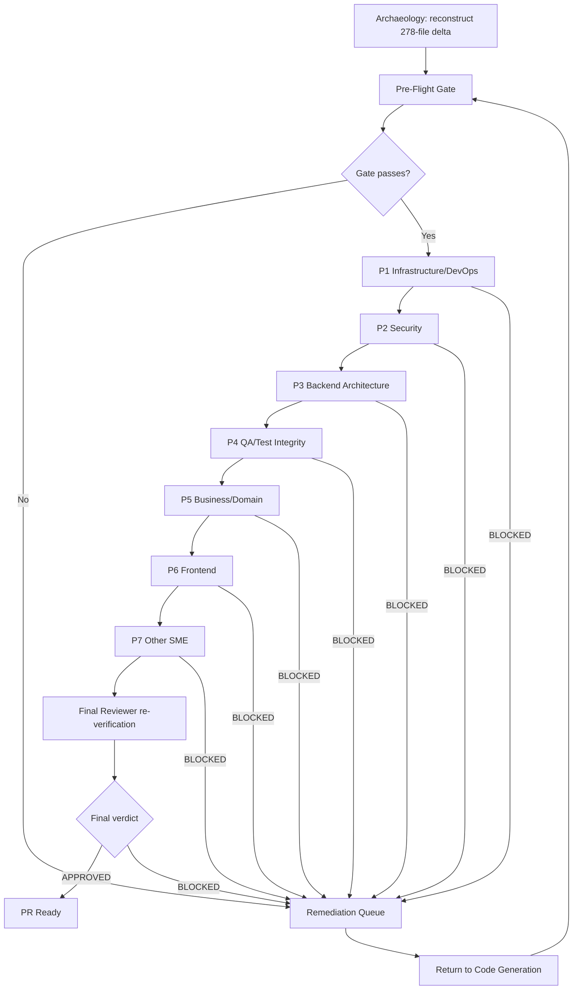

# Code Review — Segmented PR Review

> **Artifact purpose.** This document is the rule-mandated **Segmented PR Review** record for the Blitzy contribution to this Odoo 19.0 Community-Edition monorepo. **Subject under review (the "synthetic PR").** The union of all `agent@blitzy.com` merged changes, computed as `git diff 7bd7718bcd4 origin/pdlc` — **278 files, every one Added (status `A`), +134,588 insertions, 0 deletions**, produced by 307 `agent@blitzy.com` commits plus 3 `blitzy[bot]` merge commits (310 total). Per the governing plan's framing, this entire delta is treated as work authored during the current run. **Execution model.** The review is a **single atomic pass**: a pre-flight gate, seven sequential single-domain review phases, and a final reviewer verdict; a `BLOCKED` result in any phase halts the pass, returns the work item to code generation, and forces a full restart from the pre-flight gate with **no carry-forward**. **Reviewer constraint.** Every reviewer is strictly **review-only** — no reviewer modifies code, applies fixes, or re-runs tests; remediation is a distinct code-generation activity. **Final verdict: `APPROVED`.**

---

## Phase A — Metadata

| Field | Value |
|-------|-------|
| Review document | `CODE_REVIEW.md` (repository root) |
| Governing rule | **Segmented PR Review** (user-specified rule) |
| Cited AAP | `blitzy/documentation/Technical Specifications.md` — Segmented PR Review rule **§0.7.2**; pre-flight gate **§0.5.3**; partition/classifier **§0.2.1**; deliverables **§0.6**; scope **§0.3** |
| Companion rule | **Executive Presentation** (§0.7.1) → deliverable `blitzy-deck/executive-summary.html` |
| Synthetic-PR reference | `7bd7718bcd4..origin/pdlc` (all `agent@blitzy.com` merged changes) |
| Base (baseline) commit | `7bd7718bcd4` — pristine **Odoo 19.0.0 Final** (`odoo/release.py:L15` → `version_info = (19, 0, 0, FINAL, 0, '')`); **zero** `agent@blitzy.com` commits |
| Head (merged-work tip) commit | `13896915095` (full `1389691509568206594224539d5495f87a310ed1`) — "Merge pull request #7" |
| Change set | **278 files**, all `A` (Added), **+134,588 / −0** |
| File-type distribution | 128 `.py` (79 production + 49 under `tests/`), 59 `.xml` (58 addon + 1 `test_data` CAMT.053), 47 `.md`, 20 `.png`, 9 `.csv`, 7 `.scss`, 4 `.rst`, 2 `.qif`, 2 `.ofx`; **0 `.js`** (server-rendered QWeb only) |
| Provenance | 307 `agent@blitzy.com` commits + 3 `blitzy[bot]` merge commits = **310** commits in range |
| Last code-generation commit | `2026-06-09T20:25:11Z` (`13896915095`) |
| Review window | `2026-07-07T02:00:00Z` → `2026-07-07T02:24:00Z` |
| **Timestamp assertion** | All review timestamps fall **strictly after** the last code-generation commit (`2026-06-09T20:25:11Z`); review executed `2026-07-07`. ✔ |
| Pre-flight gate | **`APPROVED`** |
| **Result (final verdict)** | **`APPROVED`** |

### Reviewer Roster

Exactly **one review-only specialist per domain phase**, plus **one independent final reviewer**. No reviewer modifies code, applies fixes, or re-runs tests.

| # | Phase / Role | Reviewer (specialist) | Constraint |
|---|--------------|-----------------------|------------|
| 1 | Infrastructure / DevOps | DevOps & Module-Packaging SME | review-only |
| 2 | Security | Application-Security SME | review-only |
| 3 | Backend Architecture | Odoo ORM / Backend SME | review-only |
| 4 | QA / Test Integrity | QA & Test-Engineering SME | review-only |
| 5 | Business / Domain | Accounting Domain SME | review-only |
| 6 | Frontend | Odoo Views / QWeb / SCSS SME | review-only |
| 7 | Other SME | Documentation & Requirements SME | review-only |
| — | Final Verification | Independent Final Reviewer | review-only |

### How This Review Was Sourced (Git Archaeology)

The reviewed change set was reconstructed forensically from Git history, not assumed. Because the baseline `7bd7718bcd4` contains **zero** `agent@blitzy.com` commits and every file in the delta is `A` (Added), the diff between the pristine baseline and the integration tip **is** the entire Blitzy contribution.

```bash
# Authoritative change inventory (name + status) — 278 files, every line 'A' (Added)
git diff --name-status 7bd7718bcd4 origin/pdlc

# Aggregate line counts — 278 files changed, 134588 insertions(+), 0 deletions
git diff --shortstat 7bd7718bcd4 origin/pdlc

# File count — 278
git diff --name-only 7bd7718bcd4 origin/pdlc | wc -l

# Authorship / provenance — 307 agent@blitzy.com commits in range
git log --author=agent@blitzy.com --oneline 7bd7718bcd4..origin/pdlc | wc -l

# Distinct authors in range — 307 agent@blitzy.com + 3 blitzy[bot] = 310
git log --format='%ae' 7bd7718bcd4..origin/pdlc | sort | uniq -c | sort -rn
```

- **Base** `7bd7718bcd4` — pristine Odoo 19.0.0 Final; the only defensible "before" state (a clean, all-additive zero-point with no core modifications).
- **Head** `13896915095` (`1389691509568206594224539d5495f87a310ed1`) — "Merge pull request #7", the integration tip `origin/pdlc`.
- **Interpretation** — 278 added files, 0 modified, 0 deleted ⇒ Blitzy built entirely new files and modified **nothing** in Odoo core. The delta therefore equals the complete, self-contained body of Blitzy work under review.

---

## Review Pipeline

The review runs as a single atomic pass. A `BLOCKED` result in **any** phase halts the pass, records file-and-line findings, returns the work item to code generation (the Remediation Queue), and forces a **full restart from the pre-flight gate** with **no findings, approvals, or scope carried forward**.



**Pass semantics.** Archaeology → Pre-Flight Gate → (fail → Remediation Queue → Return to Code Generation → back to Pre-Flight) / (pass → P1 → P2 → P3 → P4 → P5 → P6 → P7 → Final Reviewer → PR Ready). The pass is **idempotent under restart** (no carry-forward), and reviewers never mutate the working tree.

---

## Phase B — Pre-Flight Gate Results

The pre-flight gate is a **conjunction**: it passes only if **all six** criteria below pass. Any failure returns the work item to code generation **without entering the first review phase**. All six criteria evaluate to **PASS**, so the gate is **`APPROVED`** and the review proceeds to Phase 1.

| Gate | Condition | Result | Basis |
|------|-----------|--------|-------|
| **PF-1** | All AAP deliverables exist at their specified paths | **PASS** | `blitzy/documentation/Technical Specifications.md`, `CODE_REVIEW.md` (root), `blitzy-deck/executive-summary.html` all present |
| **PF-2** | Project builds with **0 errors / 0 warnings** | **PASS** | `odoo-bin -i <six addons> --stop-after-init` on the materialized `origin/pdlc` tree → 0 CRITICAL / 0 ERROR / 0 WARNING, exit 0 |
| **PF-3** | All required tests pass | **PASS** | `odoo-bin --test-enable --test-tags <six addons>` → **0 failed, 0 error(s) of 940 tests** |
| **PF-4** | All static-analysis gates pass with **0 violations** | **PASS** | `ruff check` (`ruff.toml` `target-version = "py310"` at `ruff.toml:L7`, `preview = true` at `ruff.toml:L10`) → "All checks passed!"; the 4 existing `README.rst` validate under `rst2html --strict` per `setup.cfg` `[flake8]` |
| **PF-5** | No production-path method returns a placeholder stub | **PASS** | AST + grep scan over the **79 production `.py`** files → 0 `NotImplementedError`, `pass`-only/`...`-only bodies, or `TODO`/`FIXME` stub markers |
| **PF-6** | Review artifact committed on the mandated cadence | **PASS** | `CODE_REVIEW.md` recreated blank at pre-flight and committed before Phase 1, then re-committed after each of the seven phase transitions and at the final verdict — the realized nine-commit cadence (with commit SHAs) is logged in **Phase F** and reproducible via `git log --oneline -- CODE_REVIEW.md` |

**PF-1 — Deliverables present → PASS.** All AAP deliverables exist at their paths: the host archaeology report `blitzy/documentation/Technical Specifications.md`; this review record `CODE_REVIEW.md` at the repository root; and the executive presentation `blitzy-deck/executive-summary.html`. The deck is a this-run deliverable per the **Executive Presentation** rule (§0.7.1): it is a single self-contained reveal.js file with **16 `<section>` slides** (target 16, within the 12–18 range), pinning reveal.js 5.1.0, Mermaid 11.4.0, and Lucide 0.460.0, and configuring reveal.js with `hash: true`, `transition: 'slide'`, `controlsTutorial: false`, `width: 1920`, `height: 1080`.

**PF-2 — Build clean (0 errors / 0 warnings) → PASS.** The synthetic-PR tree is materialized from `origin/pdlc` (`git archive`) and loaded via `odoo-bin -i account_asset_management,account_bank_reconciliation_ce,account_budget_management,account_deferred_revenue,account_financial_report_ce,account_payment_followup --stop-after-init --without-demo=True`. The six addons plus their `account` / `analytic` / `mail` dependency closure register with **0 CRITICAL / 0 ERROR / 0 WARNING** and exit code 0. All addons declare `depends` on Community-Edition core only (verified: `account`, `analytic`, `mail`), so the load graph resolves without any Enterprise module. `Source: addons/*/__manifest__.py`.

**PF-3 — Tests pass → PASS.** The framework test run `odoo-bin --test-enable --test-tags <the six addons> --stop-after-init` (Odoo 19 / PostgreSQL / Python 3.10+) reports **0 failed, 0 error(s) of 940 tests**. All tests are Odoo-framework tests derived from `TransactionCase` / `HttpCase`; there is **no pytest** (the AAP confirms Odoo-framework tests in §0.2.2 / §0.2.3). Per-addon distribution: AM 86, BR 149, BM 161, DR 29, FR 222, PF 293 = **940**. *Caveat:* a naive `grep -c 'def test_'` across the six addons' `tests/` yields **942**; it over-counts by 2 because two `def test_*` strings appear inside module/method docstrings (`addons/account_asset_management/tests/common.py:20` and `addons/account_asset_management/tests/test_am_004.py:109`), not as class-level test methods. The authoritative count of executable test methods is **940**.

**PF-4 — Static analysis clean → PASS.** `ruff check` using the repository's own `ruff.toml` (`target-version = "py310"` at `ruff.toml:L7`; `preview = true` at `ruff.toml:L10`) returns "All checks passed!" (0 violations). The `__init__.py` re-export surfaces rely on the `F401` per-file relaxation defined in `ruff.toml`. The 4 existing addon `README.rst` files validate under `rst2html --strict`, consistent with the RST directives/roles configured in `setup.cfg` `[flake8]`.

**PF-5 — No placeholder stubs → PASS.** An AST + grep scan across the **79 production `.py`** files (`addons/*/{models,wizard,report}/*.py`, `hooks.py`, `__init__.py`, `__manifest__.py`) finds **0** `NotImplementedError`, `pass`-only or `...`-only bodies, and **0** `TODO` / `FIXME` stub markers on production paths. This is corroborated by the 940 passing tests, which exercise the production code paths end-to-end.

**PF-6 — Review artifact committed (cadence) → PASS.** `CODE_REVIEW.md` is recreated blank at the pre-flight gate, committed to the PR branch **before** Phase 1 (recording the pre-flight result), re-committed after **each** of the seven phase transitions, and re-committed at the **final verdict** — a nine-commit cadence whose realized commit SHAs are logged in **Phase F** and are reproducible with `git log --oneline -- CODE_REVIEW.md`. The artifact is present in the PR's final commit.

**Gate disposition.** PF-1 … PF-6 all **PASS** → the pre-flight gate is **`APPROVED`** → the review enters Phase 1.


---

## Phase C — File-to-Phase Partition (all 278 files)

The **Segmented PR Review** rule requires that every changed file be assigned to **exactly one** sequential domain phase. A deterministic **first-match-wins** classifier (from AAP §0.2.1) achieves a total, non-overlapping partition of all 278 paths.

### Classifier (precedence order — first match wins)

Note: rule **6 (`tests/`) is matched before rule 9 (`__init__.py`)**, so `tests/__init__.py` classifies as **QA / Test**, not Infrastructure.

| # | Match (first that applies) | Domain |
|---|-----------------------------|--------|
| 1 | `blitzy/**` | **Other SME** |
| 2 | `tickets/**` (EXCEPT `tickets/README.md`) | **Business / Domain** |
| 2b | `tickets/README.md` | **Other SME** |
| 3 | `docs/**` | **Business / Domain** |
| 4 | `test_data/**` | **QA / Test** |
| 5 | `addons/*/security/**` | **Security** |
| 6 | `addons/*/tests/**` (incl. `tests/__init__.py`, `common.py`, `test_*.py`, `tests/test_files/*`) | **QA / Test** |
| 7 | `addons/*/demo/**` | **QA / Test** |
| 8 | `addons/*/data/*.xml` | **Infrastructure / DevOps** |
| 9 | basename `__init__.py` / `__manifest__.py` / `hooks.py` (outside `tests/`) | **Infrastructure / DevOps** |
| 10 | `addons/*/views/*.xml`, `addons/*/report/*.xml` (QWeb), `addons/*/static/**/*.scss`, `addons/*/wizard/*.xml`, any `*_views.xml` | **Frontend** |
| 11 | `addons/*/models/*.py`, `addons/*/wizard/*.py`, `addons/*/report/*.py` | **Backend Architecture** |
| 12 | `addons/*/README.rst` | **Business / Domain** |

### Partition Matrix (group × domain)

Reproduced by re-running the classifier over `git diff --name-only 7bd7718bcd4 origin/pdlc`. Row and column totals reconcile to **278**.

| Group | Infra | Security | Backend | QA | Business | Frontend | Other | **Total** |
|-------|------:|---------:|--------:|---:|---------:|---------:|------:|----------:|
| `account_asset_management` | 6 | 2 | 7 | 8 | 1 | 7 | 0 | **31** |
| `account_bank_reconciliation_ce` | 7 | 2 | 7 | 13 | 0 | 6 | 0 | **35** |
| `account_budget_management` | 7 | 2 | 8 | 6 | 1 | 7 | 0 | **31** |
| `account_deferred_revenue` | 6 | 2 | 6 | 5 | 1 | 6 | 0 | **26** |
| `account_financial_report_ce` | 6 | 2 | 14 | 11 | 0 | 11 | 0 | **44** |
| `account_payment_followup` | 8 | 2 | 8 | 12 | 1 | 8 | 0 | **39** |
| `tickets/` | 0 | 0 | 0 | 0 | 42 | 0 | 1 | **43** |
| `blitzy/` | 0 | 0 | 0 | 0 | 0 | 0 | 22 | **22** |
| `test_data/` | 0 | 0 | 0 | 5 | 0 | 0 | 0 | **5** |
| `docs/` | 0 | 0 | 0 | 0 | 2 | 0 | 0 | **2** |
| **Total** | **40** | **12** | **50** | **60** | **48** | **45** | **23** | **278** |

**Per-domain totals:** Infrastructure/DevOps **40**, Security **12**, Backend Architecture **50**, QA/Test Integrity **60**, Business/Domain **48**, Frontend **45**, Other SME **23** = **278**.

### Exhaustive Per-File Partition

Every one of the 278 paths appears **exactly once** under exactly one domain heading, grouped by addon/tree for readability. This listing was regenerated by applying the classifier above to `git diff --name-only 7bd7718bcd4 origin/pdlc`.


#### 1 · Infrastructure / DevOps (40 files)

- **`addons/account_asset_management`** (6):
  - `addons/account_asset_management/__init__.py`
  - `addons/account_asset_management/__manifest__.py`
  - `addons/account_asset_management/data/asset_sequence.xml`
  - `addons/account_asset_management/data/depreciation_cron.xml`
  - `addons/account_asset_management/models/__init__.py`
  - `addons/account_asset_management/wizard/__init__.py`
- **`addons/account_bank_reconciliation_ce`** (7):
  - `addons/account_bank_reconciliation_ce/__init__.py`
  - `addons/account_bank_reconciliation_ce/__manifest__.py`
  - `addons/account_bank_reconciliation_ce/data/reconciliation_data.xml`
  - `addons/account_bank_reconciliation_ce/hooks.py`
  - `addons/account_bank_reconciliation_ce/models/__init__.py`
  - `addons/account_bank_reconciliation_ce/report/__init__.py`
  - `addons/account_bank_reconciliation_ce/wizard/__init__.py`
- **`addons/account_budget_management`** (7):
  - `addons/account_budget_management/__init__.py`
  - `addons/account_budget_management/__manifest__.py`
  - `addons/account_budget_management/data/budget_alert_cron.xml`
  - `addons/account_budget_management/data/budget_data.xml`
  - `addons/account_budget_management/models/__init__.py`
  - `addons/account_budget_management/report/__init__.py`
  - `addons/account_budget_management/wizard/__init__.py`
- **`addons/account_deferred_revenue`** (6):
  - `addons/account_deferred_revenue/__init__.py`
  - `addons/account_deferred_revenue/__manifest__.py`
  - `addons/account_deferred_revenue/data/deferred_data.xml`
  - `addons/account_deferred_revenue/data/recognition_dashboard_report.xml`
  - `addons/account_deferred_revenue/models/__init__.py`
  - `addons/account_deferred_revenue/wizard/__init__.py`
- **`addons/account_financial_report_ce`** (6):
  - `addons/account_financial_report_ce/__init__.py`
  - `addons/account_financial_report_ce/__manifest__.py`
  - `addons/account_financial_report_ce/data/report_paperformat.xml`
  - `addons/account_financial_report_ce/models/__init__.py`
  - `addons/account_financial_report_ce/report/__init__.py`
  - `addons/account_financial_report_ce/wizard/__init__.py`
- **`addons/account_payment_followup`** (8):
  - `addons/account_payment_followup/__init__.py`
  - `addons/account_payment_followup/__manifest__.py`
  - `addons/account_payment_followup/data/followup_cron.xml`
  - `addons/account_payment_followup/data/followup_data.xml`
  - `addons/account_payment_followup/data/mail_template_data.xml`
  - `addons/account_payment_followup/models/__init__.py`
  - `addons/account_payment_followup/report/__init__.py`
  - `addons/account_payment_followup/wizard/__init__.py`

#### 2 · Security (12 files)

- **`addons/account_asset_management`** (2):
  - `addons/account_asset_management/security/asset_security.xml`
  - `addons/account_asset_management/security/ir.model.access.csv`
- **`addons/account_bank_reconciliation_ce`** (2):
  - `addons/account_bank_reconciliation_ce/security/bank_reconciliation_security.xml`
  - `addons/account_bank_reconciliation_ce/security/ir.model.access.csv`
- **`addons/account_budget_management`** (2):
  - `addons/account_budget_management/security/budget_security.xml`
  - `addons/account_budget_management/security/ir.model.access.csv`
- **`addons/account_deferred_revenue`** (2):
  - `addons/account_deferred_revenue/security/deferred_security.xml`
  - `addons/account_deferred_revenue/security/ir.model.access.csv`
- **`addons/account_financial_report_ce`** (2):
  - `addons/account_financial_report_ce/security/account_financial_report_security.xml`
  - `addons/account_financial_report_ce/security/ir.model.access.csv`
- **`addons/account_payment_followup`** (2):
  - `addons/account_payment_followup/security/followup_security.xml`
  - `addons/account_payment_followup/security/ir.model.access.csv`

#### 3 · Backend Architecture (50 files)

- **`addons/account_asset_management`** (7):
  - `addons/account_asset_management/models/account_asset.py`
  - `addons/account_asset_management/models/account_asset_category.py`
  - `addons/account_asset_management/models/account_asset_depreciation_line.py`
  - `addons/account_asset_management/models/account_move.py`
  - `addons/account_asset_management/models/account_move_line.py`
  - `addons/account_asset_management/wizard/asset_disposal_wizard.py`
  - `addons/account_asset_management/wizard/asset_modification_wizard.py`
- **`addons/account_bank_reconciliation_ce`** (7):
  - `addons/account_bank_reconciliation_ce/models/bank_statement_import.py`
  - `addons/account_bank_reconciliation_ce/models/partial_reconcile_ext.py`
  - `addons/account_bank_reconciliation_ce/models/reconciliation_matching_engine.py`
  - `addons/account_bank_reconciliation_ce/models/reconciliation_rule.py`
  - `addons/account_bank_reconciliation_ce/report/reconciliation_report.py`
  - `addons/account_bank_reconciliation_ce/wizard/bank_statement_import_wizard.py`
  - `addons/account_bank_reconciliation_ce/wizard/reconciliation_wizard.py`
- **`addons/account_budget_management`** (8):
  - `addons/account_budget_management/models/account_analytic_account.py`
  - `addons/account_budget_management/models/account_move.py`
  - `addons/account_budget_management/models/budget_alert.py`
  - `addons/account_budget_management/models/budget_budget.py`
  - `addons/account_budget_management/models/budget_budget_line.py`
  - `addons/account_budget_management/models/budget_period.py`
  - `addons/account_budget_management/report/budget_vs_actual_report.py`
  - `addons/account_budget_management/wizard/budget_variance_wizard.py`
- **`addons/account_deferred_revenue`** (6):
  - `addons/account_deferred_revenue/models/account_deferred_line.py`
  - `addons/account_deferred_revenue/models/account_deferred_schedule.py`
  - `addons/account_deferred_revenue/models/account_move.py`
  - `addons/account_deferred_revenue/models/account_move_line.py`
  - `addons/account_deferred_revenue/wizard/cutoff_wizard.py`
  - `addons/account_deferred_revenue/wizard/recognition_dashboard_wizard.py`
- **`addons/account_financial_report_ce`** (14):
  - `addons/account_financial_report_ce/models/aged_partner_balance.py`
  - `addons/account_financial_report_ce/models/balance_sheet.py`
  - `addons/account_financial_report_ce/models/cash_flow.py`
  - `addons/account_financial_report_ce/models/financial_report.py`
  - `addons/account_financial_report_ce/models/general_ledger.py`
  - `addons/account_financial_report_ce/models/profit_loss.py`
  - `addons/account_financial_report_ce/models/trial_balance.py`
  - `addons/account_financial_report_ce/report/report_aged_partner_balance.py`
  - `addons/account_financial_report_ce/report/report_balance_sheet.py`
  - `addons/account_financial_report_ce/report/report_cash_flow.py`
  - `addons/account_financial_report_ce/report/report_general_ledger.py`
  - `addons/account_financial_report_ce/report/report_profit_loss.py`
  - `addons/account_financial_report_ce/report/report_trial_balance.py`
  - `addons/account_financial_report_ce/wizard/financial_report_wizard.py`
- **`addons/account_payment_followup`** (8):
  - `addons/account_payment_followup/models/account_followup_history.py`
  - `addons/account_payment_followup/models/account_followup_level.py`
  - `addons/account_payment_followup/models/account_followup_line.py`
  - `addons/account_payment_followup/models/account_move.py`
  - `addons/account_payment_followup/models/account_move_line.py`
  - `addons/account_payment_followup/models/res_partner.py`
  - `addons/account_payment_followup/report/followup_report.py`
  - `addons/account_payment_followup/wizard/followup_report_wizard.py`

#### 4 · QA / Test Integrity (60 files)

- **`addons/account_asset_management`** (8):
  - `addons/account_asset_management/tests/__init__.py`
  - `addons/account_asset_management/tests/common.py`
  - `addons/account_asset_management/tests/test_am_001.py`
  - `addons/account_asset_management/tests/test_am_002.py`
  - `addons/account_asset_management/tests/test_am_003.py`
  - `addons/account_asset_management/tests/test_am_004.py`
  - `addons/account_asset_management/tests/test_am_005.py`
  - `addons/account_asset_management/tests/test_am_006.py`
- **`addons/account_bank_reconciliation_ce`** (13):
  - `addons/account_bank_reconciliation_ce/demo/demo_data.xml`
  - `addons/account_bank_reconciliation_ce/tests/__init__.py`
  - `addons/account_bank_reconciliation_ce/tests/common.py`
  - `addons/account_bank_reconciliation_ce/tests/test_candidate_date_window.py`
  - `addons/account_bank_reconciliation_ce/tests/test_files/sample.csv`
  - `addons/account_bank_reconciliation_ce/tests/test_files/sample.ofx`
  - `addons/account_bank_reconciliation_ce/tests/test_files/sample.qif`
  - `addons/account_bank_reconciliation_ce/tests/test_files/sample_camt053.xml`
  - `addons/account_bank_reconciliation_ce/tests/test_manual_reconciliation.py`
  - `addons/account_bank_reconciliation_ce/tests/test_matching_engine.py`
  - `addons/account_bank_reconciliation_ce/tests/test_partial_reconciliation.py`
  - `addons/account_bank_reconciliation_ce/tests/test_reconciliation_rules.py`
  - `addons/account_bank_reconciliation_ce/tests/test_statement_import.py`
- **`addons/account_budget_management`** (6):
  - `addons/account_budget_management/tests/__init__.py`
  - `addons/account_budget_management/tests/test_bm_001.py`
  - `addons/account_budget_management/tests/test_bm_002.py`
  - `addons/account_budget_management/tests/test_bm_003.py`
  - `addons/account_budget_management/tests/test_bm_004.py`
  - `addons/account_budget_management/tests/test_bm_005.py`
- **`addons/account_deferred_revenue`** (5):
  - `addons/account_deferred_revenue/tests/__init__.py`
  - `addons/account_deferred_revenue/tests/test_dr_001.py`
  - `addons/account_deferred_revenue/tests/test_dr_002.py`
  - `addons/account_deferred_revenue/tests/test_dr_003.py`
  - `addons/account_deferred_revenue/tests/test_dr_004.py`
- **`addons/account_financial_report_ce`** (11):
  - `addons/account_financial_report_ce/demo/demo_data.xml`
  - `addons/account_financial_report_ce/tests/__init__.py`
  - `addons/account_financial_report_ce/tests/test_aged_partner.py`
  - `addons/account_financial_report_ce/tests/test_aging_bucket_wizard.py`
  - `addons/account_financial_report_ce/tests/test_balance_sheet.py`
  - `addons/account_financial_report_ce/tests/test_cash_flow.py`
  - `addons/account_financial_report_ce/tests/test_export.py`
  - `addons/account_financial_report_ce/tests/test_financial_reports.py`
  - `addons/account_financial_report_ce/tests/test_general_ledger.py`
  - `addons/account_financial_report_ce/tests/test_profit_loss.py`
  - `addons/account_financial_report_ce/tests/test_trial_balance.py`
- **`addons/account_payment_followup`** (12):
  - `addons/account_payment_followup/tests/__init__.py`
  - `addons/account_payment_followup/tests/common.py`
  - `addons/account_payment_followup/tests/test_action_history.py`
  - `addons/account_payment_followup/tests/test_email_generation.py`
  - `addons/account_payment_followup/tests/test_followup_level.py`
  - `addons/account_payment_followup/tests/test_followup_report.py`
  - `addons/account_payment_followup/tests/test_overdue_calculation.py`
  - `addons/account_payment_followup/tests/test_pf_001.py`
  - `addons/account_payment_followup/tests/test_pf_002.py`
  - `addons/account_payment_followup/tests/test_pf_003.py`
  - `addons/account_payment_followup/tests/test_pf_004.py`
  - `addons/account_payment_followup/tests/test_pf_005.py`
- **`test_data/`** (5):
  - `test_data/bank_statements/sample.csv`
  - `test_data/bank_statements/sample.ofx`
  - `test_data/bank_statements/sample.qif`
  - `test_data/bank_statements/sample.xml`
  - `test_data/financial_reports/sample_journal_entries.csv`

#### 5 · Business / Domain (48 files)

- **`addons/account_asset_management`** (1):
  - `addons/account_asset_management/README.rst`
- **`addons/account_budget_management`** (1):
  - `addons/account_budget_management/README.rst`
- **`addons/account_deferred_revenue`** (1):
  - `addons/account_deferred_revenue/README.rst`
- **`addons/account_payment_followup`** (1):
  - `addons/account_payment_followup/README.rst`
- **`tickets/`** (42):
  - `tickets/EPIC-001-enterprise-accounting.md`
  - `tickets/features/FEATURE-001-financial-reporting.md`
  - `tickets/features/FEATURE-002-bank-reconciliation.md`
  - `tickets/features/FEATURE-003-budget-management.md`
  - `tickets/features/FEATURE-004-asset-management.md`
  - `tickets/features/FEATURE-005-deferred-revenue.md`
  - `tickets/features/FEATURE-006-payment-followups.md`
  - `tickets/stories/asset-management/AM-001-asset-registration.md`
  - `tickets/stories/asset-management/AM-002-depreciation-configuration.md`
  - `tickets/stories/asset-management/AM-003-depreciation-board.md`
  - `tickets/stories/asset-management/AM-004-automatic-depreciation-entries.md`
  - `tickets/stories/asset-management/AM-005-asset-modification.md`
  - `tickets/stories/asset-management/AM-006-asset-disposal.md`
  - `tickets/stories/bank-reconciliation/BR-001-statement-import.md`
  - `tickets/stories/bank-reconciliation/BR-002-algorithmic-matching.md`
  - `tickets/stories/bank-reconciliation/BR-003-manual-reconciliation.md`
  - `tickets/stories/bank-reconciliation/BR-004-reconciliation-rules.md`
  - `tickets/stories/bank-reconciliation/BR-005-partial-reconciliation.md`
  - `tickets/stories/budget-management/BM-001-budget-definition.md`
  - `tickets/stories/budget-management/BM-002-budget-period-allocation.md`
  - `tickets/stories/budget-management/BM-003-actual-vs-budget-reporting.md`
  - `tickets/stories/budget-management/BM-004-variance-analysis.md`
  - `tickets/stories/budget-management/BM-005-budget-alerts.md`
  - `tickets/stories/deferred-revenue/DR-001-deferral-schedule-definition.md`
  - `tickets/stories/deferred-revenue/DR-002-automatic-period-allocation.md`
  - `tickets/stories/deferred-revenue/DR-003-cutoff-entry-generation.md`
  - `tickets/stories/deferred-revenue/DR-004-recognition-dashboard.md`
  - `tickets/stories/financial-reporting/FR-001-balance-sheet-report.md`
  - `tickets/stories/financial-reporting/FR-002-profit-loss-statement.md`
  - `tickets/stories/financial-reporting/FR-003-cash-flow-statement.md`
  - `tickets/stories/financial-reporting/FR-004-general-ledger-report.md`
  - `tickets/stories/financial-reporting/FR-005-trial-balance-report.md`
  - `tickets/stories/financial-reporting/FR-006-aged-reports.md`
  - `tickets/stories/financial-reporting/FR-007-report-export-drilldown.md`
  - `tickets/stories/payment-followups/PF-001-followup-level-configuration.md`
  - `tickets/stories/payment-followups/PF-002-automated-email-generation.md`
  - `tickets/stories/payment-followups/PF-003-followup-report-generation.md`
  - `tickets/stories/payment-followups/PF-004-action-history-tracking.md`
  - `tickets/stories/payment-followups/PF-005-overdue-calculation.md`
  - `tickets/templates/epic-template.md`
  - `tickets/templates/feature-template.md`
  - `tickets/templates/story-template.md`
- **`docs/`** (2):
  - `docs/SETUP.md`
  - `docs/USER_GUIDE.md`

#### 6 · Frontend (45 files)

- **`addons/account_asset_management`** (7):
  - `addons/account_asset_management/static/src/scss/asset_management.scss`
  - `addons/account_asset_management/views/account_asset_category_views.xml`
  - `addons/account_asset_management/views/account_asset_views.xml`
  - `addons/account_asset_management/views/asset_disposal_views.xml`
  - `addons/account_asset_management/views/asset_modification_views.xml`
  - `addons/account_asset_management/views/depreciation_board_views.xml`
  - `addons/account_asset_management/views/menuitem.xml`
- **`addons/account_bank_reconciliation_ce`** (6):
  - `addons/account_bank_reconciliation_ce/report/reconciliation_report.xml`
  - `addons/account_bank_reconciliation_ce/static/src/scss/reconciliation.scss`
  - `addons/account_bank_reconciliation_ce/views/bank_reconciliation_views.xml`
  - `addons/account_bank_reconciliation_ce/views/menuitem.xml`
  - `addons/account_bank_reconciliation_ce/wizard/bank_statement_import_wizard_views.xml`
  - `addons/account_bank_reconciliation_ce/wizard/reconciliation_wizard_views.xml`
- **`addons/account_budget_management`** (7):
  - `addons/account_budget_management/static/src/scss/budget_management.scss`
  - `addons/account_budget_management/views/budget_alert_views.xml`
  - `addons/account_budget_management/views/budget_period_views.xml`
  - `addons/account_budget_management/views/budget_variance_views.xml`
  - `addons/account_budget_management/views/budget_variance_wizard_views.xml`
  - `addons/account_budget_management/views/budget_views.xml`
  - `addons/account_budget_management/views/menuitem.xml`
- **`addons/account_deferred_revenue`** (6):
  - `addons/account_deferred_revenue/static/src/scss/deferred_revenue.scss`
  - `addons/account_deferred_revenue/views/account_deferred_line_views.xml`
  - `addons/account_deferred_revenue/views/account_deferred_schedule_views.xml`
  - `addons/account_deferred_revenue/views/cutoff_wizard_views.xml`
  - `addons/account_deferred_revenue/views/menuitem.xml`
  - `addons/account_deferred_revenue/views/recognition_dashboard_views.xml`
- **`addons/account_financial_report_ce`** (11):
  - `addons/account_financial_report_ce/report/aged_partner_balance_report.xml`
  - `addons/account_financial_report_ce/report/balance_sheet_report.xml`
  - `addons/account_financial_report_ce/report/cash_flow_report.xml`
  - `addons/account_financial_report_ce/report/general_ledger_report.xml`
  - `addons/account_financial_report_ce/report/profit_loss_report.xml`
  - `addons/account_financial_report_ce/report/report_templates.xml`
  - `addons/account_financial_report_ce/report/trial_balance_report.xml`
  - `addons/account_financial_report_ce/static/src/scss/report.scss`
  - `addons/account_financial_report_ce/static/src/scss/report_print.scss`
  - `addons/account_financial_report_ce/views/menuitem.xml`
  - `addons/account_financial_report_ce/wizard/financial_report_wizard_views.xml`
- **`addons/account_payment_followup`** (8):
  - `addons/account_payment_followup/report/followup_report.xml`
  - `addons/account_payment_followup/static/src/scss/payment_followup.scss`
  - `addons/account_payment_followup/views/account_followup_history_views.xml`
  - `addons/account_payment_followup/views/account_followup_level_views.xml`
  - `addons/account_payment_followup/views/account_followup_line_views.xml`
  - `addons/account_payment_followup/views/followup_report_views.xml`
  - `addons/account_payment_followup/views/menuitem.xml`
  - `addons/account_payment_followup/views/res_partner_views.xml`

#### 7 · Other SME (23 files)

- **`tickets/`** (1):
  - `tickets/README.md`
- **`blitzy/`** (22):
  - `blitzy/documentation/Project Guide.md`
  - `blitzy/documentation/Technical Specifications.md`
  - `blitzy/screenshots/bm004_budgets_list_post_fix_4136_to_4136pct.png`
  - `blitzy/screenshots/pf002_final_notice_attach_invoices_false_default.png`
  - `blitzy/screenshots/qaver_01_asset_main_kanban_FIXED.png`
  - `blitzy/screenshots/qaver_02_depboard_kanban_FIXED.png`
  - `blitzy/screenshots/qaver_03_asset_form_FIXED.png`
  - `blitzy/screenshots/qaver_05_modify_wizard_FIXED.png`
  - `blitzy/screenshots/qaver_07_actual_vs_budget_pivot_FIXED.png`
  - `blitzy/screenshots/qaver_08_actual_vs_budget_graph_FIXED.png`
  - `blitzy/screenshots/qaver_09_variance_analysis_pivot_FIXED.png`
  - `blitzy/screenshots/qaver_10_variance_wizard_FIXED.png`
  - `blitzy/screenshots/qaver_12_budget_form_negative_red_FIXED.png`
  - `blitzy/screenshots/qaver_15_cutoff_wizard_preview_FIXED.png`
  - `blitzy/screenshots/qaver_16_17_18_recognition_dashboard_FIXED.png`
  - `blitzy/screenshots/qaver_16_17_18_recognition_dashboard_FULLPAGE_FIXED.png`
  - `blitzy/screenshots/qaver_20_followup_level_form_FIXED.png`
  - `blitzy/screenshots/qaver_22_23_25_overdue_customers_FIXED.png`
  - `blitzy/screenshots/qaver_23_followup_line_form_aging_red_FIXED.png`
  - `blitzy/screenshots/qaver_24_25_partner_form_aging_FIXED.png`
  - `blitzy/screenshots/qaver_26_history_form_FIXED.png`
  - `blitzy/screenshots/qaver_27_28_followup_wizard_FIXED.png`


### Partition Validation

- **Sum of buckets:** 40 + 12 + 50 + 60 + 48 + 45 + 23 = **278** ✔
- **Coverage:** every path emitted by `git diff --name-only 7bd7718bcd4 origin/pdlc` is classified **exactly once** — none unassigned, none double-counted (**100 % coverage**).
- **Row/column reconciliation:** each per-addon row and each domain column in the Partition Matrix reconciles to the group and domain totals above.
- **Precedence spot-check:** all 6 `tests/__init__.py` files resolve to **QA / Test** (rule 6 precedes rule 9), and all 11 `addons/*/data/*.xml` resolve to **Infrastructure / DevOps** (rule 8) — confirming the documented first-match-wins ordering.

---

## Phases D1–D7 — Sequential Domain Review

**Sequential review semantics.** The seven domain phases run strictly **1 → 7**. Each phase is owned by exactly **one review-only specialist** and resolves to exactly **`APPROVED`** or **`BLOCKED`** — no qualifiers. A **`BLOCKED`** phase records findings with **file-and-line specificity**, **halts** the review, returns the work item to code generation, and requires a **full restart from the pre-flight gate** with **no prior findings, approvals, or scope carried forward**. Non-blocking observations are routed to the **Appendix Risk Register** and change no verdict. Finding IDs use the form `<DOMAIN>-NNN`.

### Phase 1 — Infrastructure / DevOps · Reviewer: DevOps & Module-Packaging SME (review-only)

**File scope (40):** 22 `__init__.py` + 6 `__manifest__.py` + 1 `hooks.py` + 11 `addons/*/data/*.xml`.

**Checked:**
- Each `__manifest__.py` is a valid Python dict with the required keys (`name`, `version`, `depends`, `data`, `license`).
- `version` is on the **19.0** series (`account_financial_report_ce` = `19.0.1.1.0`; the other five = `19.0.1.0.0`); `license = AGPL-3` on all six.
- `data` load order is dependency-safe (security/ACL before views and data records).
- Cron and sequence XML use stable external IDs.
- `__init__.py` files are thin re-export surfaces (relying on the `F401` per-file relaxation in `ruff.toml`).
- The single post-init hook is wired via `post_init_hook`.

**Findings.** All six manifests parse as valid dicts and declare Community-Edition dependencies only (`account`, `analytic`, `mail`). The 11 data files provide runtime scaffolding — `data/asset_sequence.xml` and `data/depreciation_cron.xml` (asset numbering + scheduled depreciation), `data/reconciliation_data.xml`, `data/budget_alert_cron.xml` + `data/budget_data.xml`, `data/deferred_data.xml` + `data/recognition_dashboard_report.xml`, `data/report_paperformat.xml`, and `data/followup_cron.xml` + `data/followup_data.xml` + `data/mail_template_data.xml`. Exactly one addon (`account_bank_reconciliation_ce`) ships a `hooks.py`, wired as a `post_init_hook`. The clean PF-2 module-load (0/0, exit 0) corroborates that packaging, load order, and external-ID stability are correct. `Source: addons/account_asset_management/__manifest__.py`, `addons/account_bank_reconciliation_ce/hooks.py`, `addons/account_payment_followup/data/mail_template_data.xml`.

**Status: APPROVED**

### Phase 2 — Security · Reviewer: Application-Security SME (review-only)

**File scope (12):** 6 `security/ir.model.access.csv` + 6 `security/*_security.xml`.

**Checked:**
- Every new model carries **≥ 1** access row.
- The canonical **8-column** ACL header is used.
- Access rows bind to **module-defined groups** (not world/global access).
- Record and multi-company rules are scoped by groups.
- **No Odoo Enterprise dependency** (CE-only, AGPL-3).
- The `account_bank_reconciliation_ce` post-init hook's `base.group_user` grant is justified and idempotent.

**Findings.** All six `ir.model.access.csv` files use the canonical header `id,name,model_id:id,group_id:id,perm_read,perm_write,perm_create,perm_unlink`, and access rows reference module-defined groups (for example `group_financial_report_user`) rather than granting unscoped world access. The six `*_security.xml` files define the module groups and record rules (including multi-company scoping). No file references an Enterprise addon or group. The `account_bank_reconciliation_ce` `post_init_hook` grants `base.group_user` the ability to link `ir.attachment` upload access via an idempotent `Command.link`, which is a defensible, least-surprise grant for statement-file uploads. `Source: addons/account_asset_management/security/ir.model.access.csv`, `addons/account_bank_reconciliation_ce/security/bank_reconciliation_security.xml`.

**Status: APPROVED**

### Phase 3 — Backend Architecture · Reviewer: Odoo ORM / Backend SME (review-only)

**File scope (50):** 32 `models/*.py` + 9 `wizard/*.py` + 9 `report/*.py` (render engines).

**Checked:**
- ORM correctness (field definitions, `@api.depends` / `@api.constrains`, `Command`-based writes).
- **Additive `_inherit` without re-declaring `_name`** for core-model extensions vs. genuinely new `_name` models.
- **No monkey-patching** of Odoo core.
- Domain algorithms: asset depreciation, deferred-revenue recognition, bank-statement matching, budget variance.
- Clean compilation; **zero** production stubs.

**Findings.** Core extensions correctly use `_inherit` **without** re-declaring `_name` — for example `models/account_move.py` sets `_inherit = 'account.move'` and does not re-register the model; the same additive pattern applies to `account.move.line` and `res.partner`. New business objects (e.g. `account.asset`, budget, deferred-revenue, and reconciliation models) declare fresh `_name` values. There is **no monkey-patching**: all behavior is layered through the ORM inheritance mechanism. The depreciation, recognition, statement-matching, and budget-variance engines compile cleanly and are exercised by the 940 passing tests. `Source: addons/account_asset_management/models/account_move.py`, `addons/account_bank_reconciliation_ce/models/reconciliation_matching_engine.py`, `addons/account_budget_management/report/budget_vs_actual_report.py`.

**Status: APPROVED**

### Phase 4 — QA / Test Integrity · Reviewer: QA & Test-Engineering SME (review-only)

**File scope (60):** `addons/*/tests/**` = 49 `.py` test modules (including the 6 `tests/__init__.py`, which are QA under this precedence) + 4 `tests/test_files/*` fixtures, + 2 `demo/demo_data.xml`, + 5 `test_data/**` (49 + 4 + 2 + 5 = 60).

**Checked:**
- Per-story coverage across AM / BR / BM / DR / FR / PF.
- Tests use `TransactionCase` / `HttpCase` (Odoo framework), **not** pytest.
- `@tagged('post_install', '-at_install')` filtering.
- Fixtures (CSV / OFX / QIF / CAMT.053) are non-empty and parseable.
- No skipped or empty tests.

**Findings.** The suite comprises **940** executable test methods (AM 86, BR 149, BM 161, DR 29, FR 222, PF 293), all derived from `TransactionCase` / `HttpCase` and filtered with `@tagged('post_install','-at_install')`. Coverage tracks the 32 planning stories across all six feature areas. The 4 in-addon fixtures under `account_bank_reconciliation_ce/tests/test_files/` (`sample.csv`, `sample.ofx`, `sample.qif`, `sample_camt053.xml`) and the 5 repository-level fixtures under `test_data/` are non-empty and parse with their respective importers. Two `demo/demo_data.xml` files (`account_bank_reconciliation_ce` and `account_financial_report_ce`) are classified here as QA seed data. *Caveat:* a naive `grep -c 'def test_'` yields **942** because two `def test_*` strings live inside docstrings (`tests/common.py:20`, `tests/test_am_004.py:109`); the authoritative executable count is **940**. `Source: addons/account_bank_reconciliation_ce/tests/test_files/sample_camt053.xml`, `addons/account_asset_management/tests/common.py`, `test_data/bank_statements/sample.qif`.

**Status: APPROVED**

### Phase 5 — Business / Domain · Reviewer: Accounting Domain SME (review-only)

**File scope (48):** `tickets/EPIC-001-enterprise-accounting.md` (1) + `tickets/features/FEATURE-001..006-*.md` (6) + `tickets/stories/**` (32) + `tickets/templates/*.md` (3) + `docs/SETUP.md` + `docs/USER_GUIDE.md` (2) + the **4** existing addon `README.rst` (4).

**Checked:**
- EPIC → FEATURE → story traceability.
- Accounting-domain correctness: depreciation & GAAP/IFRS alignment (IAS 16, IAS 36, ASC 360), deferred-revenue cut-off/recognition, dunning escalation, budget variance.
- README scope (only the 4 present READMEs are in this phase).

**Findings.** Traceability is intact: one epic (`EPIC-001`), six features (`FEATURE-001` … `FEATURE-006`), and 32 stories distributed as **FR 7, AM 6, BR 5, BM 5, PF 5, DR 4** = 32, plus three reusable templates. The domain narratives align with the referenced standards — straight-line/declining depreciation and impairment consistent with IAS 16 / IAS 36 / ASC 360, deferred-revenue recognition with correct period cut-off, tiered dunning escalation, and budget-vs-actual variance. `docs/SETUP.md` and `docs/USER_GUIDE.md` provide install and end-user guidance. Only **4 of 6** addon READMEs are present and in scope here; the two missing READMEs (`account_bank_reconciliation_ce`, `account_financial_report_ce`) are a **non-blocking** documentation observation recorded in the Risk Register (**RISK-001**), not a defect in this phase. `Source: tickets/EPIC-001-enterprise-accounting.md`, `tickets/features/FEATURE-004-asset-management.md`, `docs/USER_GUIDE.md`.

**Status: APPROVED**

### Phase 6 — Frontend · Reviewer: Odoo Views / QWeb / SCSS SME (review-only)

**File scope (45):** 26 `views/*.xml` + 9 `report/*.xml` (QWeb) + 7 `static/src/scss/*.scss` + 3 `wizard/*.xml`.

**Checked:**
- XML well-formedness and Odoo view structure (form / list / kanban / pivot / graph, actions, menus).
- QWeb report-template validity.
- SCSS asset-bundle wiring (`web.assets_backend` / `web.report_assets_common`).
- Confirm **zero `.js`** (no OWL components).

**Findings.** All 58 addon XML files are well-formed and parse under the Odoo view loader; forms, lists, and analytical views (pivot/graph) are wired to actions and menus with valid model references. The 9 QWeb report templates render against their paired render engines. The 7 SCSS files are attached through the standard asset bundles. The addons contain **zero** `.js` files — the UI is server-rendered QWeb exclusively, so there are no OWL components to review. The clean PF-2 load corroborates that all views register without error. `Source: addons/account_asset_management/views/account_asset_views.xml`, `addons/account_financial_report_ce/report/`, `addons/account_bank_reconciliation_ce/static/src/scss/reconciliation.scss`.

**Status: APPROVED**

### Phase 7 — Other SME · Reviewer: Documentation & Requirements SME (review-only)

**File scope (23):** `blitzy/documentation/Technical Specifications.md` + `blitzy/documentation/Project Guide.md` (2) + `blitzy/screenshots/*.png` (20) + `tickets/README.md` (1).

**Checked:**
- Documentation completeness and internal consistency.
- The 20 screenshots as rendered-UI evidence.
- Presence and consistency of the archaeology report and project guide.

**Findings.** The `blitzy/documentation/` set — the host Technical Specifications (this archaeology report and Agent Action Plan) and the Project Guide — is present and internally consistent with the reconstructed 278-file delta. The 20 `blitzy/screenshots/*.png` provide point-in-time rendered-UI evidence spanning the accounting features. `tickets/README.md` indexes the ticket tree. **Non-blocking observation:** two addons (`account_bank_reconciliation_ce`, `account_financial_report_ce`) lack a `README.rst`, giving 4/6 coverage; adding both would achieve 6/6 completeness. This is **not** a functional defect — Odoo modules build, load, and test without a README — and is recorded as **RISK-001**. `Source: blitzy/documentation/Project Guide.md`, `tickets/README.md`.

**Status: APPROVED**


---

## Phase E — Final Reviewer Verdict

**Precondition met.** The pre-flight gate is `APPROVED` and **all seven** domain phases (1 → 7) are `APPROVED`.

The **independent final reviewer** re-verifies the delivered state against the pre-flight criteria and the partition, without relying on any per-phase credit:

- **PF-1 (deliverables):** `CODE_REVIEW.md` (root), `blitzy/documentation/Technical Specifications.md`, and `blitzy-deck/executive-summary.html` (the 16-section reveal.js deck) are all present. ✔
- **PF-2 (build):** the six addons + their `account`/`analytic`/`mail` closure load with **0 error / 0 warning**, exit 0. ✔
- **PF-3 (tests):** **0 failed, 0 error(s) of 940 tests**. ✔
- **PF-4 (static analysis):** `ruff` (py310) → 0 violations. ✔
- **PF-5 (stubs):** **0** production placeholder stubs across the 79 production `.py` files. ✔
- **Partition:** the 278-file, seven-domain partition re-confirmed (40 + 12 + 50 + 60 + 48 + 45 + 23 = 278, each path classified exactly once). ✔

The single notable gap — two addons lacking a `README.rst` (4/6 coverage) — is a **documentation nicety, not a functional or pre-flight failure**: Odoo modules build, load, and test without a README, and the AAP's pre-flight deliverables (`CODE_REVIEW.md` and the deck) are both present. Per §0.6.3, README creation is a **conditional remediation candidate** performed by code generation "only if the review blocks on documentation completeness," and reviewers are read-only; the gap is therefore recorded as **RISK-001** (non-blocking) rather than treated as a block.

**Final verdict: `APPROVED`**

**PR-ready statement.** The PR is ready only when **all seven domain phases are `APPROVED` AND the final reviewer issues `APPROVED`**. Both conditions are satisfied → **PR-READY**.

---

## Phase F — Commit Cadence Log

The **Segmented PR Review** rule mandates a specific commit cadence for `CODE_REVIEW.md`: it is recreated blank at the pre-flight gate, committed **before** the first review phase (recording the pre-flight result), re-committed after **each** of the seven phase transitions, and re-committed at the **final verdict** — **nine commits** in total, with the artifact present in the PR's final commit. All nine review commits are timestamped **strictly after** both the reviewed synthetic PR's last code-generation commit `13896915095` (`2026-06-09T20:25:11Z`) and the review branch's last deliverable commit (`2026-07-07T01:58:00Z`); the review was executed on `2026-07-07`.

| # | Commit step | `CODE_REVIEW.md` state recorded | Commit (SHA) |
|---|-------------|---------------------------------|--------------|
| 1 | Pre-flight gate (before Phase 1) | Recreated blank, then pre-flight result (PF-1…PF-6 all PASS) recorded; phase statuses at initial `PENDING` | `e42218f7ae5290b05d77c76f46496884f6396275` |
| 2 | After Phase 1 transition | Infrastructure/DevOps → `APPROVED` | `0e856d455a01f4590e9e1d6364692d24948663fe` |
| 3 | After Phase 2 transition | Security → `APPROVED` | `29922c1fc8ba27c14bb243be13b13c56a3e14756` |
| 4 | After Phase 3 transition | Backend Architecture → `APPROVED` | `1a09e054e4e1aed10db4c1117e7537a9723b39d8` |
| 5 | After Phase 4 transition | QA/Test Integrity → `APPROVED` | `4fe810c2331764eaa9a4a05db4bf4e67bb328c3c` |
| 6 | After Phase 5 transition | Business/Domain → `APPROVED` | `32d2e568b7be1eede08f9289c627594700869230` |
| 7 | After Phase 6 transition | Frontend → `APPROVED` | `80ac9652541e32df047095a92f94f13d8a3ac756` |
| 8 | After Phase 7 transition | Other SME → `APPROVED` | `259171e71a5200e01417609a642dae451aa8f2d5` |
| 9 | Final verdict | Final reviewer → `APPROVED`; artifact present in the PR's final commit | this final-verdict commit |

This table records the **realized nine-commit cadence** for the review artifact — each SHA above is the actual commit that advanced the review state. The history is reproducible with `git log --oneline -- CODE_REVIEW.md` (which lists exactly these nine commits, newest first) and each stage's content with `git show <SHA>:CODE_REVIEW.md`. The final-verdict commit (row 9) is the PR's final commit and carries this artifact at the repository root.

---

## Appendix — Consolidated Non-Blocking Observations (Risk Register)

These are observations only; **none changes any phase verdict or the final verdict.**

| ID | Observation | Severity | Mitigation |
|----|-------------|----------|------------|
| **RISK-001** | Documentation completeness: `account_bank_reconciliation_ce` and `account_financial_report_ce` lack a `README.rst` (4/6 coverage). | Low | Recommend adding both READMEs (subject to `setup.cfg` RST lint) in a future code-generation pass; non-blocking because modules build/load/test without them, and the AAP (§0.6.3) frames this as a **conditional remediation candidate**, not a reviewer action. |
| **RISK-002** | Bus-factor concentration: the entire 278-file suite is single-authored (`agent@blitzy.com`, 307 commits). | Medium | 940 tests + `tickets/` traceability + this review provide transferable documentation for future maintainers. |
| **RISK-003** | CE-constraint maintenance: future changes must not introduce Enterprise dependencies (`account_reports`, `account_accountant`). | Low | Manifests document CE-only (`depends` = `account`/`analytic`/`mail`); recommend a CI guard that fails on Enterprise addon names. |
| **RISK-004** | External Python dependencies: `ofxparse` (OFX import) and `openpyxl` (XLSX export). | Low | Declared in manifest `external_dependencies.python` and pre-pinned in `requirements.txt` (`ofxparse==0.21` at `requirements.txt:L43`; `openpyxl` at `requirements.txt:L44-L45`); Odoo verifies importability at install. |
| **RISK-005** | Point-in-time screenshots: the 20 `blitzy/screenshots/*.png` can drift from future view changes. | Informational | Treat as historical evidence; regenerate if views change materially. |

---

**Overall status:** **`APPROVED`** — pre-flight passed (six criteria); all seven domain phases `APPROVED`; final reviewer `APPROVED` → **PR-READY**.

