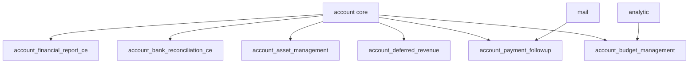
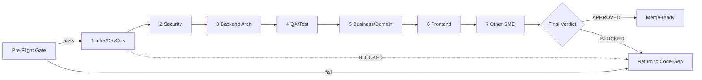
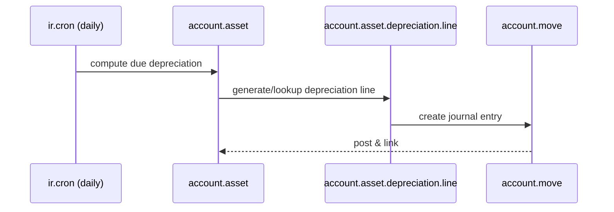

# Technical Specification

# 0. Agent Action Plan

## 0.1 Intent Clarification

### 0.1.1 Core Documentation Objective

Based on the provided requirements, the Blitzy platform understands that the documentation objective is to **(1)** produce a forensic *code archaeology report* that identifies and documents every change merged into this repository by Blitzy Agents, **(2)** treat that complete body of merged work as a single synthetic change set "actively made during this run," and **(3)** execute an in-depth *Segmented PR Review* against that synthetic change set to assess and remediate issues, emitting the rule-mandated `CODE_REVIEW.md` artifact and the always-on executive presentation.

The user's request, preserved verbatim:

> **User Request:** "Perform an archaeology report on all merged changes made to this repository by Blitzy Agents. Treat all of the identified changes as if they were changes that were actively made during this run. Once all changes are identified, perform an in depth PR review using the Segmented PR Review rule definition to assess and remediate issues."

Repository forensics confirm that the merged Blitzy work resides on the `origin/pdlc` branch, which is the clean upstream Odoo base commit `7bd7718bcd4c5d232779e8eab0340169461af14e` plus three `blitzy[bot]` merge pull requests (#2 on 2026-02-02, #3 on 2026-04-17, #7 on 2026-06-09). The cumulative diff is **278 files changed / +134,588 insertions** [origin/pdlc:diff vs 7bd7718], comprising six Odoo accounting addons plus supporting ticket, specification, and sample-data deliverables.

**Request Classification**

| Dimension | Classification |
|-----------|----------------|
| Primary category | Create new documentation (forensic archaeology report) |
| Secondary category | Fix documentation/quality gaps via review remediation |
| Documentation type 1 | Technical / forensic analysis report (the archaeology report) |
| Documentation type 2 | Code review artifact (`CODE_REVIEW.md`) |
| Documentation type 3 | Executive HTML presentation (reveal.js deck) |
| Subject system | "Enterprise Accounting for Odoo 19.0 Community Edition" — six AGPL-3.0 addons |
| Synthetic change set | `origin/pdlc` vs base `7bd7718…` (278 files / +134,588 insertions) |

Each documentation requirement, restated with enhanced clarity:

- Identify the complete set of Blitzy-Agent-authored changes through git history mining (by author, branch, and merge commit) and define the precise boundary of the synthetic pull request under review.
- Reconstruct *what was built* and *why* — the intent behind the six accounting addons — and present it as a coherent archaeology narrative with a per-addon change manifest.
- Partition every changed file into exactly one Segmented PR Review domain phase and execute the seven-phase review, recording an `APPROVED`/`BLOCKED` verdict per phase and a final verdict.
- Produce the rule-mandated executive presentation summarizing scope, value, architecture, risk, and onboarding for non-technical leadership.

### 0.1.2 Special Instructions and Constraints

Two user-specified rules govern this work and are treated as binding constraints. They are documented in full in §0.10; the operative directives are summarized here.

**Segmented PR Review (binding):**

- The review MUST run as a single atomic pass each time code generation reaches a passing state, as an isolated process that begins only after code generation has fully completed — review activity MUST NOT overlap or interleave with code generation, and review timestamps MUST fall after the last code-generation commit.
- A **pre-flight gate** MUST pass before any review phase: all Agent Action Plan deliverables exist at their specified paths; the project builds with **zero errors and zero warnings**; all required tests pass; all static-analysis gates pass with **zero violations**; and no production-path method returns a placeholder stub. Any failure returns the work item to code generation without entering the first phase.
- `CODE_REVIEW.md` MUST be created at the repository root during the pre-flight gate, committed before the first phase, re-committed after every phase state change and after the final verdict, and present in the final commit (recreated blank if it already exists).
- Every changed file MUST be partitioned into exactly one of seven sequential domain phases — Infrastructure/DevOps, Security, Backend Architecture, QA/Test Integrity, Business/Domain, Frontend, Other SME — each owned by exactly one specialist reviewer who reviews only (no code edits, fixes, or test re-runs).
- Each phase and the final verdict MUST resolve to exactly `APPROVED` or `BLOCKED` (no qualifiers); `BLOCKED` records file-and-line-specific findings, halts the review, and requires a full restart from the pre-flight gate with no carried credit.

**Executive Presentation (binding):**

- Every deliverable MUST include an executive summary as a single self-contained reveal.js HTML file, ALWAYS included independent of any other documentation.
- Constraints: 12–18 slides (target 16); four slide types (`slide-title`, `slide-divider`, default content, `slide-closing`); every slide carries at least one non-text visual; content slides limited to four bullets and 40 words; zero emoji (Lucide SVG icons only); no fenced code blocks inside slides.
- Pinned CDN versions: reveal.js 5.1.0, Mermaid 11.4.0, Lucide 0.460.0. The full Blitzy brand theme (palette, Inter/Space Grotesk/Fira Code typography, CSS custom properties) MUST be embedded inline; the canonical theme file is referenced at `blitzy-deck/references/blitzy-reveal-theme.css`.

No user-provided examples or templates were supplied as attachments (see §0.11); all template structure derives from the two rules and the existing in-repository Blitzy deliverables used as style references.

### 0.1.3 Technical Interpretation

These documentation requirements translate to the following technical documentation strategy:

- **To document all merged Blitzy changes,** the platform will mine git history by author and merge commit (`blitzy[bot]` PRs #2/#3/#7 on `origin/pdlc`; individual runs by `agent@blitzy.com`), diff `origin/pdlc` against base `7bd7718…`, and *create* the archaeology report as the regenerated `blitzy/documentation/Technical Specifications.md` with a per-addon change manifest.
- **To establish the "actively made this run" framing,** the platform will define the union of merged changes as the synthetic pull request; this Agent Action Plan is the referencing AAP whose deliverables the Segmented PR Review pre-flight gate verifies.
- **To execute the in-depth PR review,** the platform will *create* `CODE_REVIEW.md` at the repository root, partition all 278 changed files into the seven domain phases, run the documented pre-flight gate commands, and record `APPROVED`/`BLOCKED` per phase plus a final verdict.
- **To reconcile "remediate" with review-only reviewers,** remediation is achieved through the `BLOCKED` → return-to-code-generation → restart-from-pre-flight cycle, never through reviewer code edits.
- **To satisfy the executive-presentation mandate,** the platform will *create* a single self-contained reveal.js deck at `blitzy-deck/executive-summary.html` summarizing scope, value, architecture, risk, and onboarding.

### 0.1.4 Inferred Documentation Needs

Surfacing implicit requirements not explicitly stated but necessary for completeness:

- **Based on git topology:** the synthetic-PR boundary must be explicitly defined and justified, distinguishing the merged feature lineage (`origin/pdlc`) from the unmerged config/catalog lineage (`origin/19.0`) and the individual `origin/blitzy-<uuid>` work branches.
- **Based on the seven-domain partition requirement:** every one of the 278 files must be deterministically classified, which implies a documented path-based classifier so the partition is reproducible and exhaustive.
- **Based on the pre-flight gate:** the build, test, static-analysis, and verification commands must be documented precisely so a downstream run can execute them and record results before any phase opens.
- **Based on code analysis:** the four newest addons (`account_budget_management`, `account_asset_management`, `account_deferred_revenue`, `account_payment_followup`) extend core accounting models through `_inherit` and introduce net-new `_name` models, scheduled `ir.cron` jobs, security rules, QWeb reports, and wizards — each requiring domain-specific review documentation.
- **Based on the risk surface:** a risk register is needed, including the candidate finding that a security-scan branch bumped Mermaid to 11.10.0 for CVE-2025-54881 while the binding rule pins Mermaid 11.4.0.
- **Based on the executive-presentation mandate:** Mermaid architecture and data-flow diagrams must be authored once and reused across the archaeology report and the deck.

## 0.2 Documentation Discovery and Analysis

### 0.2.1 Existing Documentation Infrastructure Assessment

Repository analysis reveals **two distinct documentation surfaces on separate branch lineages**, a distinction that governs where the new deliverables are authored.

- **Code lineage (`origin/pdlc`)** — where the merged Blitzy feature work lives — has **no MkDocs generator**. `git cat-file -e origin/pdlc:mkdocs.yml` returns not-found. The documentation present is hand-authored Markdown: the Blitzy deliverables `blitzy/documentation/Technical Specifications.md` and `blitzy/documentation/Project Guide.md`, the user docs `docs/SETUP.md` and `docs/USER_GUIDE.md`, the `tickets/` requirement tree, a `README.rst` inside each newer addon, and Odoo's stock `README.md` ("# Odoo"), `CONTRIBUTING.md`, and `LICENSE` [origin/pdlc:README.md:L1].
- **Config/catalog lineage (`origin/19.0`)** — NOT merged into `pdlc` — *does* carry a MkDocs site: `mkdocs.yml`, `doc/index.md`, `doc/project-guide.md`, `doc/technical-specifications.md`, `docs/index.md`, and `catalog-info.yaml` [origin/19.0:diff vs 7bd7718]. This is a Backstage/MkDocs scaffold added by the config branches and is independent of the code under review.

Conclusion: the archaeology report, `CODE_REVIEW.md`, and executive deck target the `pdlc` lineage where the code resides. MkDocs is noted as an existing (separate-branch) generator; surfacing the new artifacts through it is out of scope unless explicitly requested (§0.8.2).

| Infrastructure aspect | Finding |
|-----------------------|---------|
| Documentation framework | MkDocs present on `origin/19.0` only; absent on `origin/pdlc` |
| Markdown deliverables (pdlc) | `blitzy/documentation/*.md`, `docs/SETUP.md`, `docs/USER_GUIDE.md`, `tickets/**`, per-addon `README.rst` |
| API documentation tooling | None detected (no Sphinx/JSDoc); Odoo self-documents via `__manifest__.py` + docstrings |
| Diagram tooling | Mermaid (used in existing Blitzy deliverables and mandated for the deck) |
| Static-analysis tooling | `ruff` (`ruff.toml`, "for ruff version 0.11.4 or higher", `target-version = "py310"`) [ruff.toml:L1] |
| Hosting/deployment | MkDocs site config on the config lineage only |

### 0.2.2 Repository Code Analysis for Documentation

The subject of the archaeology is six Odoo accounting addons under `addons/`, all introduced by the merged PRs. The merged diff groups as follows [origin/pdlc:diff vs 7bd7718]:

| Group | Files | Notes |
|-------|------:|-------|
| `addons/account_financial_report_ce` | 44 | FEATURE-001, prior "complete — do not touch" |
| `tickets/` | 43 | EPIC-001, 6 features, 32 stories, 3 templates |
| `addons/account_payment_followup` | 39 | FEATURE-006, dunning / follow-up |
| `addons/account_bank_reconciliation_ce` | 35 | FEATURE-002, prior "complete — do not touch" |
| `addons/account_budget_management` | 31 | FEATURE-003, budgets / variance |
| `addons/account_asset_management` | 31 | FEATURE-004, fixed assets / depreciation |
| `addons/account_deferred_revenue` | 26 | FEATURE-005, deferred revenue/expense |
| `blitzy/` | 22 | Blitzy Technical Specs + Project Guide + screenshots |
| `test_data/` | 5 | Sample bank statements + journal entries |
| `docs/` | 2 | `SETUP.md`, `USER_GUIDE.md` |

Each addon follows the standard Odoo module layout — `__manifest__.py`, `models/`, `views/`, `security/` (`ir.model.access.csv` + `*_security.xml`), `data/` (cron/sequences), `tests/`, `wizard/`, `report/`, and `static/src/scss/` [origin/pdlc:addons/account_asset_management/__manifest__.py]. The model/wizard/report files that anchor the domain partition and citations are:

| Addon | Net-new (`_name`) domain models | Core extensions (`_inherit`) | Wizards / Report |
|-------|----------------------------------|------------------------------|------------------|
| `account_asset_management` | `account_asset.py`, `account_asset_category.py`, `account_asset_depreciation_line.py` | `account_move.py`, `account_move_line.py` | `asset_disposal_wizard.py`, `asset_modification_wizard.py` |
| `account_budget_management` | `budget_budget.py`, `budget_budget_line.py`, `budget_period.py`, `budget_alert.py` | `account_analytic_account.py`, `account_move.py` | `budget_variance_wizard.py`, `report/budget_vs_actual_report.py` |
| `account_deferred_revenue` | `account_deferred_schedule.py`, `account_deferred_line.py` | `account_move.py`, `account_move_line.py` | `cutoff_wizard.py`, `recognition_dashboard_wizard.py` |
| `account_payment_followup` | `account_followup_level.py`, `account_followup_line.py`, `account_followup_history.py` | `res_partner.py`, `account_move.py`, `account_move_line.py` | `followup_report_wizard.py`, `report/followup_report.py` |

Key directories examined: `addons/account_*/{models,wizard,report,views,security,data,tests,static}`, `tickets/{features,stories,templates}`, `blitzy/documentation/`, `docs/`, `test_data/`. Related documentation that provides context or requires regeneration: `blitzy/documentation/Technical Specifications.md` (1,214 lines, contains the feature-development AAP) and `blitzy/documentation/Project Guide.md` (785 lines).

### 0.2.3 Web Search Research Conducted

Research validated the structure and quality bar for both deliverable types:

- **Code archaeology / git forensics:** the discipline is forensic git-history analysis answering *who changed what, when, and why* through `git log`, `git blame`, the pickaxe (`git log -S`), and `git log -L`; the seminal reference is Adam Tornhill's *Your Code as a Crime Scene* / `code-maat`, which frames change-coupling, hotspots, ownership, and bus-factor. This confirms the archaeology report should pair a change inventory with intent reconstruction rather than a raw diff dump.
- **Odoo / OCA review conventions:** authoritative review dimensions are correctness, security, performance, migrations, tests, manifests, and the official Odoo coding guidelines, including execution tracing through controllers, buttons, cron jobs, computes, onchanges, constraints, `sudo()` boundaries, and record rules. Odoo's coding guidelines emphasize minimal diffs in stable versions and the canonical module structure (`models/` with each inherited model in its own file, `wizard/` for `TransientModel`, `report/`, `security/`). Historic tooling is `pylint-odoo`/`flake8`/OCA MQT; **this repository standardizes on `ruff`**. These dimensions map one-to-one onto the seven Segmented PR Review domains (§0.3.1).

## 0.3 Documentation Scope Analysis

### 0.3.1 Code-to-Documentation Mapping

The archaeology report documents *all* merged modules; the `CODE_REVIEW.md` artifact partitions *every* changed file into exactly one review domain. To make that partition reproducible and exhaustive, the following **deterministic, precedence-ordered path classifier** assigns each of the 278 changed files to exactly one of the seven domain phases (first match wins):

| Order | Domain Phase | File globs (per addon, plus repo-level) | Reviewer focus |
|------:|--------------|-----------------------------------------|----------------|
| 1 | Infrastructure/DevOps | `__manifest__.py`, `__init__.py`, `hooks.py`, `data/**`, `demo/**`, addon `README.rst`; repo `mkdocs.yml`, `doc/**`, `catalog-info.yaml` | manifest correctness, module load order, dependency declarations, cron/sequence data records |
| 2 | Security | `security/ir.model.access.csv`, `security/*_security.xml` | ACL completeness, record rules, groups, `sudo()` boundaries, multi-company rules |
| 3 | Backend Architecture | `models/**.py`, `wizard/**.py` | ORM structure, `_inherit` vs `_name`, fields, compute/onchange/constraints, transient flows |
| 4 | QA/Test Integrity | `tests/**.py`, `test_data/**` | coverage ≥ 80%, BDD parity, `TransactionCase`/`Form` correctness, no stubbed assertions |
| 5 | Business/Domain | `report/**` (`.py` + `.xml`); calculation methods within asset/budget/deferred/followup/reconciliation models (cross-referenced) | accounting correctness: depreciation, variance, recognition, matching, dunning; IAS 16 / IAS 36 / ASC 360 |
| 6 | Frontend | `views/**.xml`, `static/src/scss/**`, `static/**` | view validity, action/menu wiring, OWL/SCSS assets, UX |
| 7 | Other SME | `tickets/**`, `blitzy/documentation/**`, `docs/**`, `blitzy/screenshots/**` | requirement traceability, documentation accuracy |

Representative module-to-documentation mappings (the four newest addons drive the deepest review documentation):

- **Module: `addons/account_asset_management/`** — Domain models `account_asset.py`, `account_asset_category.py`, `account_asset_depreciation_line.py`; core extensions `account_move.py`, `account_move_line.py`; wizards `asset_disposal_wizard.py`, `asset_modification_wizard.py`. Current documentation: `README.rst` + `tickets/stories` (AM-001..006). Documentation needed: archaeology entry (depreciation methods, revaluation/impairment per IAS 16/IAS 36/ASC 360, disposal gain/loss) and review coverage across Backend, Business/Domain, Security, QA, Frontend phases.
- **Module: `addons/account_budget_management/`** — Domain models `budget_budget.py`, `budget_budget_line.py`, `budget_period.py`, `budget_alert.py`; report `budget_vs_actual_report.py`; wizard `budget_variance_wizard.py`. Documentation needed: variance-analysis archaeology + review coverage; budget-alert `ir.cron` reviewed under Infrastructure/DevOps.
- **Module: `addons/account_deferred_revenue/`** — Domain models `account_deferred_schedule.py`, `account_deferred_line.py`; wizards `cutoff_wizard.py`, `recognition_dashboard_wizard.py`. Documentation needed: recognition-schedule archaeology + cutoff-flow review.
- **Module: `addons/account_payment_followup/`** — Domain models `account_followup_level.py`, `account_followup_line.py`, `account_followup_history.py`; `res_partner.py` extension; report `followup_report.py`; wizard `followup_report_wizard.py`. Documentation needed: dunning-level archaeology; follow-up email `ir.cron` reviewed under Infrastructure/DevOps; QWeb follow-up report reviewed under Business/Domain + Frontend.
- **Modules: `account_financial_report_ce/`, `account_bank_reconciliation_ce/`** — prior "complete" addons; documented in the archaeology report and partitioned into review domains, but **not edited** (§0.8.2).

Configuration options requiring documentation: scheduled-action records (`data/**` cron) — three `ir.cron` jobs total (asset depreciation daily, budget alert hourly, follow-up email daily) — and per-addon `__manifest__.py` dependency declarations (`['account']`, `['account','analytic']`, `['account','mail']`).

### 0.3.2 Documentation Gap Analysis

Given the requirements and repository analysis, the documentation gaps the deliverables must fill are:

- **No consolidated archaeology / change-manifest report exists.** The existing `blitzy/documentation/Technical Specifications.md` documents the *forward* feature-development run, not a backward forensic reconstruction of all merged changes. The archaeology report (this regenerated specification) closes that gap.
- **No `CODE_REVIEW.md` exists at the repository root.** The rule-mandated review artifact, its pre-flight gate record, its seven-domain partition, and its `APPROVED`/`BLOCKED` verdicts are entirely absent and must be created.
- **No executive presentation exists on the code lineage.** The rule-mandated self-contained reveal.js deck must be created.
- **Review-traceability gap:** there is no document mapping each of the 278 changed files to a review domain and verdict; the partition classifier in §0.3.1 and the `CODE_REVIEW.md` partition table close it.
- **Risk-documentation gap:** no risk register currently captures cross-cutting concerns such as the unmerged Mermaid 11.10.0 / CVE-2025-54881 bump versus the rule-pinned 11.4.0, scheduled-job load, or per-story coverage adequacy.

No source-code documentation gaps (docstrings, inline comments) are in scope: the request targets archaeology and review artifacts, not in-code documentation, and source files are read-only (§0.8.2).

## 0.4 Documentation Implementation Design

### 0.4.1 Documentation Structure Planning

Three deliverables are produced, each with a defined internal structure. The deliverable file layout on the `pdlc` lineage:

```text
<repo-root>/
├── CODE_REVIEW.md                                  (CREATE — Segmented PR Review artifact at root)
├── blitzy/
│   └── documentation/
│       ├── Technical Specifications.md             (UPDATE/regenerate — the archaeology report)
│       └── Project Guide.md                        (UPDATE/regenerate — companion guide)
└── blitzy-deck/
    ├── executive-summary.html                      (CREATE — self-contained reveal.js deck)
    └── references/
        └── blitzy-reveal-theme.css                 (REFERENCE — platform-provided brand theme)
```

**Archaeology report (`blitzy/documentation/Technical Specifications.md`)** — Section 0 (this Agent Action Plan) followed by the archaeology body:

- Methodology — git mining by author/branch/merge-commit; diff `origin/pdlc` vs base `7bd7718…`.
- Branch topology & provenance — `sandbox`/base, `origin/19.0` (config lineage), `origin/pdlc` (merged feature lineage), `origin/blitzy-<uuid>` work branches.
- Synthetic-PR definition — `pdlc` vs base; merge PRs #2/#3/#7.
- Per-addon change manifest — file-type counts (from §0.2.2).
- Intent reconstruction — the "Enterprise Accounting for Odoo 19.0 CE" product; FEATURE-001..006; IAS 16/IAS 36/ASC 360 alignment.
- Architecture — Mermaid module-dependency graph, ERD, and data-flow sequence diagrams.
- Risk register.

**`CODE_REVIEW.md`** — header/metadata (synthetic-PR ref, AAP ref, base/head commits, timestamps after the last code-gen commit) → pre-flight gate results block → file-to-phase partition table (all 278 files) → seven sequential domain phases (each `APPROVED`/`BLOCKED` with file:line findings) → final-reviewer verdict → commit-cadence log.

**Executive deck (`blitzy-deck/executive-summary.html`)** — 16-slide structure detailed in §0.4.3.

### 0.4.2 Content Generation Strategy

- **Information extraction approach:**
    - "Extract the change manifest from `git diff --name-status <base> origin/pdlc` and per-addon `git ls-tree`."
    - "Extract module intent from each `addons/account_*/__manifest__.py` summary/description and the `tickets/` EPIC/feature/story tree."
    - "Extract domain rules (depreciation, variance, recognition, matching, dunning) from `models/*.py` compute/constraint methods and cite by `file:line`."
- **Template application:** no user template was provided (§0.11); the archaeology report follows the structure and tone of the existing `blitzy/documentation/Technical Specifications.md` (markdown headings, dense tables, inline file-path citations, "the Blitzy platform understands…" framing). The executive deck follows the mandated slide ordering and the Blitzy brand theme.
- **Documentation standards:**
    - Markdown with proper headers; Mermaid fenced blocks for diagrams; short fenced code blocks for commands.
    - Source citations inline as `[<path>:<locator>]` immediately after each existing-system claim.
    - Tables for the change manifest, the domain partition, and the dependency inventory.
    - Consistent terminology drawn from the `tickets/` glossary and Odoo conventions.

### 0.4.3 Diagram and Visual Strategy

Mermaid diagrams are authored once and reused across the archaeology report and the executive deck.

- **Module dependency graph** (architecture overview):



- **Segmented PR Review pipeline** (review workflow):



- **Representative data-flow** (asset depreciation posting):



Additional planned diagrams: an entity-relationship diagram for the budget/asset/deferred/followup model families, and a branch-topology graph for the provenance section. The executive deck (16 slides) uses these diagrams plus KPI cards and styled tables so that **every slide carries at least one non-text visual** per the rule. Slide ordering: (1) Title, (2) headline KPIs, (3) architecture Mermaid, (4) divider "What Was Built", (5) six-addon value, (6) divider "What Changed Architecturally", (7) data-flow Mermaid, (8) divider "How We Reviewed It", (9) review-pipeline Mermaid, (10) pre-flight KPIs, (11) divider "Risks & Mitigations", (12) risk table, (13) divider "Onboarding & Continuation", (14) dev-setup commands (inline Fira Code), (15) verdict KPI cards, (16) Closing.

## 0.5 Documentation File Transformation Mapping

### 0.5.1 File-by-File Documentation Plan

Every documentation file to be created, updated, deleted, or referenced is mapped below, with the **target documentation file listed first**. Transformation modes: **CREATE** (new file), **UPDATE** (modify existing), **DELETE** (remove obsolete), **REFERENCE** (used as example/source, not modified).

| Target Documentation File | Transformation | Source Code/Docs | Content/Changes |
|---------------------------|----------------|------------------|-----------------|
| `CODE_REVIEW.md` (repo root) | CREATE (recreate blank if pre-existing) | synthetic-PR diff `origin/pdlc` vs `7bd7718…` (278 files) | Pre-flight gate results; file-to-phase partition table; seven sequential domain phases each `APPROVED`/`BLOCKED` with file:line findings; final verdict; commit-cadence log |
| `blitzy-deck/executive-summary.html` | CREATE | full archaeology + review outcomes | Single self-contained reveal.js deck, 16 slides, Blitzy brand theme inline, Mermaid + Lucide, pinned CDNs |
| `blitzy/documentation/Technical Specifications.md` | UPDATE (regenerate) | git history (`pdlc` vs base) + `addons/account_*/**` | Archaeology report: Section 0 AAP, methodology, branch topology, synthetic-PR definition, per-addon change manifest, intent reconstruction, architecture diagrams, risk register |
| `blitzy/documentation/Project Guide.md` | UPDATE (regenerate) | review findings + `addons/account_*/**` | Compliance & Quality Review (review verdict summary), test results, runtime validation, risk assessment, development guide |
| `blitzy-deck/references/blitzy-reveal-theme.css` | REFERENCE | Executive Presentation rule text | Canonical Blitzy reveal.js theme (platform-provided, not in repo); embedded inline in the deck |
| `tickets/EPIC-001-enterprise-accounting.md` | REFERENCE | — | Epic-level requirement traceability for archaeology + Business/Domain review |
| `tickets/features/*.md` | REFERENCE | — | Feature-level (FEATURE-001..006) intent and acceptance criteria |
| `tickets/stories/**/*.md` | REFERENCE | — | Story-level (AM/BM/DR/PF) acceptance criteria and BDD scenarios |
| `tickets/templates/*.md` | REFERENCE | — | Epic/feature/story templates (documentation-structure reference) |
| `docs/SETUP.md`, `docs/USER_GUIDE.md` | REFERENCE | — | Onboarding content reused in the deck "onboarding" slide and Project Guide development guide |
| `addons/account_asset_management/**` | REFERENCE/SOURCE | — | Subject of archaeology + review (read-only) |
| `addons/account_budget_management/**` | REFERENCE/SOURCE | — | Subject of archaeology + review (read-only) |
| `addons/account_deferred_revenue/**` | REFERENCE/SOURCE | — | Subject of archaeology + review (read-only) |
| `addons/account_payment_followup/**` | REFERENCE/SOURCE | — | Subject of archaeology + review (read-only) |
| `addons/account_financial_report_ce/**` | REFERENCE/SOURCE | — | Documented + partitioned; "complete — do not touch" (not edited) |
| `addons/account_bank_reconciliation_ce/**` | REFERENCE/SOURCE | — | Documented + partitioned; "complete — do not touch" (not edited) |
| `addons/account_*/README.rst` | REFERENCE | — | Per-addon descriptions feeding the change manifest |

No documentation files are DELETED. `CODE_REVIEW.md` is the only file whose pre-existing copy is discarded (recreated blank) per the Segmented PR Review rule. All documentation file names are enumerated above; nothing is left "pending" or "to be discovered."

### 0.5.2 New Documentation Files Detail

```text
File: CODE_REVIEW.md  (repository root)
Type: Segmented PR Review artifact
Source: synthetic PR = origin/pdlc vs 7bd7718 (278 files)
Sections:
    - Metadata (synthetic-PR ref, referencing-AAP ref, base/head commits, review timestamps)
    - Pre-Flight Gate Results (deliverables-exist, build 0/0, tests pass, ruff 0 violations, no stubs)
    - File-to-Phase Partition Table (all 278 files -> exactly one of 7 domains)
    - Phase 1 Infrastructure/DevOps  -> APPROVED | BLOCKED (file:line findings)
    - Phase 2 Security               -> APPROVED | BLOCKED
    - Phase 3 Backend Architecture   -> APPROVED | BLOCKED
    - Phase 4 QA/Test Integrity      -> APPROVED | BLOCKED
    - Phase 5 Business/Domain        -> APPROVED | BLOCKED
    - Phase 6 Frontend               -> APPROVED | BLOCKED
    - Phase 7 Other SME              -> APPROVED | BLOCKED
    - Final Reviewer Verdict         -> APPROVED | BLOCKED
    - Commit Cadence Log
Key Citations: addons/account_*/**, tickets/**
```

```text
File: blitzy-deck/executive-summary.html
Type: Executive presentation (reveal.js, self-contained)
Source: archaeology report + CODE_REVIEW.md outcomes
Slides (target 16):
    1 Title | 2 KPI summary | 3 Architecture (Mermaid) | 4 Divider "What Was Built"
    5 Six-addon value | 6 Divider "What Changed" | 7 Data-flow (Mermaid)
    8 Divider "How We Reviewed" | 9 Review pipeline (Mermaid) | 10 Pre-flight KPIs
    11 Divider "Risks" | 12 Risk table | 13 Divider "Onboarding"
    14 Dev-setup commands | 15 Verdict KPI cards | 16 Closing
Constraints: every slide >=1 non-text visual; zero emoji (Lucide SVG); pinned CDNs
    (reveal.js 5.1.0, Mermaid 11.4.0, Lucide 0.460.0); Blitzy brand theme inline
Diagrams: module dependency graph, review pipeline, asset-depreciation data-flow
Key Citations: addons/account_*/__manifest__.py, CODE_REVIEW.md
```

### 0.5.3 Documentation Files to Update Detail

- **`blitzy/documentation/Technical Specifications.md`** — regenerated as the archaeology report.
    - New/updated sections: Section 0 Agent Action Plan (this), methodology, branch topology & provenance, synthetic-PR definition, per-addon change manifest, intent reconstruction, architecture, risk register.
    - New diagrams: module-dependency graph, ERD, data-flow sequence diagrams, branch-topology graph.
    - Source citations: `addons/account_*/**`, `git diff origin/pdlc vs 7bd7718`.
- **`blitzy/documentation/Project Guide.md`** — regenerated as the companion guide.
    - New/updated sections: Compliance & Quality Review (consumes the `CODE_REVIEW.md` final verdict), Test Results, Runtime Validation, Risk Assessment, Development Guide.
    - Source citations: `CODE_REVIEW.md`, `docs/SETUP.md`, `requirements.txt`, `ruff.toml`.

### 0.5.4 Documentation Configuration Updates

No documentation-configuration changes are in scope on the `pdlc` lineage: `mkdocs.yml` is **absent** from `origin/pdlc` and present only on the `origin/19.0` config lineage [origin/19.0:mkdocs.yml]. Consequently:

- `mkdocs.yml`, `doc/**`, `catalog-info.yaml` — no change (different branch lineage; out of scope unless surfacing is explicitly requested).
- No `docusaurus.config.js`, `.readthedocs.yml`, or `sphinx/conf.py` exist in the repository.
- No `package.json` documentation build scripts exist; the executive deck is a single self-contained HTML file requiring no build step.

### 0.5.5 Cross-Documentation Dependencies

- **`CODE_REVIEW.md` → `Project Guide.md`:** the final review verdict and per-phase outcomes feed the Project Guide's Compliance & Quality Review section.
- **`CODE_REVIEW.md` → `executive-summary.html`:** the verdict drives the deck's verdict KPI cards (slide 15).
- **Archaeology change-manifest → `executive-summary.html`:** the per-addon counts and totals feed the deck's KPI summary (slide 2).
- **Shared diagrams:** the module-dependency graph, review-pipeline flowchart, and data-flow sequence diagram are authored once and embedded in both the archaeology report and the deck.
- **`tickets/**` → archaeology + Business/Domain review:** the EPIC/feature/story tree is the requirement-traceability backbone for intent reconstruction and domain-correctness review.

## 0.6 Dependency Inventory

### 0.6.1 Documentation Dependencies

This is a documentation/review exercise; it introduces **no changes** to the project's Python or runtime dependency manifest. All application dependencies remain exactly as pinned in the repository-root `requirements.txt` of the merged feature work (e.g., `Babel==2.17.0`, `lxml==5.2.1`, `psycopg2==2.9.10`) [requirements.txt]. The only dependencies specific to the new documentation deliverables are the CDN libraries embedded by the executive presentation, pinned by the Executive Presentation rule:

| Registry | Package Name | Version | Purpose |
|----------|--------------|---------|---------|
| CDN (jsDelivr) | reveal.js | 5.1.0 | HTML presentation framework for `executive-summary.html` |
| CDN (jsDelivr) | mermaid | 11.4.0 | Render architecture/data-flow/pipeline diagrams inside the deck |
| CDN (jsDelivr) | lucide | 0.460.0 | SVG icon set (replaces emoji per rule) |
| Google Fonts | Inter | latest (link) | Body typography (400/500/600/700) |
| Google Fonts | Space Grotesk | latest (link) | Display/heading typography (500/600/700) |
| Google Fonts | Fira Code | latest (link) | Monospace / eyebrow / inline-code typography (400/500) |

Validation tooling invoked by the Segmented PR Review pre-flight gate (existing in the repository, not added by this exercise): `ruff` 0.11.4+ for static analysis [ruff.toml:L1], `coverage` 7.13.5 and the Odoo/`pytest` test runner for the ≥80% per-story coverage gate. The MkDocs generator exists on the `origin/19.0` config lineage only and is **not** required for these deliverables.

### 0.6.2 Documentation Reference Updates

No legacy documentation links require rewriting; the deliverables are net-new or full regenerations rather than restructurings of an existing linked documentation tree. The only cross-document links to establish are forward references among the new artifacts:

- `blitzy/documentation/Project Guide.md` → `CODE_REVIEW.md` (Compliance & Quality Review cites the final verdict).
- `blitzy/documentation/Project Guide.md` → `blitzy/documentation/Technical Specifications.md` (architecture and risk cross-references).
- `blitzy-deck/executive-summary.html` → references the archaeology report and `CODE_REVIEW.md` as its data sources.

The executive deck embeds the canonical theme from `blitzy-deck/references/blitzy-reveal-theme.css` inline rather than linking to it, preserving the single-self-contained-file requirement.

## 0.7 Coverage and Quality Targets

### 0.7.1 Documentation Coverage Metrics

| Coverage dimension | Target | Basis |
|--------------------|--------|-------|
| File partition coverage | 100% of the 278 merged files assigned to exactly one of seven review domains | Segmented PR Review rule (every changed file partitioned) |
| Merge-PR coverage | All three merge PRs documented (#2 2026-02-02, #3 2026-04-17, #7 2026-06-09) | Synthetic-PR boundary |
| Change-group coverage | `addons/` (206), `tickets/` (43), `blitzy/` (22), `test_data/` (5), `docs/` (2) all documented | §0.2.2 manifest |
| Module coverage | All 6 addons documented; 4 newest reviewed at model/wizard/report granularity | §0.3.1 |
| Executive-deck topic coverage | All 5 mandated topics (what/why/architecture/risk/onboarding) across 12–18 slides (target 16) | Executive Presentation rule |
| Test coverage (carried gate) | ≥ 80% per story (referenced under QA/Test Integrity) | Story acceptance gate from the feature work |

Coverage gaps to address are precisely the three net-new artifacts (archaeology report, `CODE_REVIEW.md`, executive deck) identified in §0.3.2; no merged change group is left undocumented.

### 0.7.2 Documentation Quality Criteria

- **Completeness:** the archaeology report covers methodology, provenance, synthetic-PR boundary, per-addon manifest, intent reconstruction, architecture, and risk; `CODE_REVIEW.md` covers the pre-flight gate, the full file partition, all seven domain phases, and a final verdict.
- **Accuracy / verdict discipline:** every `CODE_REVIEW.md` domain phase and the final verdict resolve to **exactly** `APPROVED` or `BLOCKED` (no qualifiers); `BLOCKED` findings carry **file-and-line** specificity; pre-flight results are recorded **before** any phase leaves its initial state; review timestamps fall **after** the last code-generation commit; `CODE_REVIEW.md` is committed before phase 1, after every phase transition, and after the final verdict, and is present in the final commit.
- **Traceability:** every existing-system claim in the archaeology report carries an inline `[<path>:<locator>]` citation; intent reconstruction ties each addon to its `tickets/` EPIC/feature/story.
- **Clarity:** technical accuracy with progressive disclosure (overview → manifest → per-domain detail); consistent terminology from the `tickets/` glossary and Odoo conventions.
- **Pre-flight pass conditions (documented commands in §0.9):** all deliverables exist at their paths; `python odoo-bin … --stop-after-init` exits 0 with "Modules loaded" and **zero errors / zero warnings**; tests pass; `ruff check` reports **zero violations**; no production-path placeholder stub.

### 0.7.3 Example and Diagram Requirements

- **Diagrams required (Mermaid):** module-dependency graph; Segmented PR Review pipeline flowchart; at least one data-flow sequence diagram (asset depreciation posting); an entity-relationship diagram for the budget/asset/deferred/followup model families; a branch-topology graph for provenance.
- **Executive-deck visual requirement:** every one of the 12–18 `<section>` elements contains at least one non-text visual (Mermaid diagram, KPI card, styled table, or Lucide SVG icon); **zero emoji**.
- **Command examples:** the development-guide and execution-parameter content include working, copy-pasteable build/test/lint/verify commands (§0.9), validated against the repository's verified toolchain.
- **Verification of the deck:** the HTML opens in a browser, renders all Mermaid diagrams and Lucide icons, and contains 12–18 `<section>` elements each with a non-text visual.

## 0.8 Scope Boundaries

### 0.8.1 Exhaustively In Scope

- **Documentation deliverables (CREATE/UPDATE):**
    - `CODE_REVIEW.md` (repository root) — rule-mandated Segmented PR Review artifact.
    - `blitzy-deck/executive-summary.html` — rule-mandated self-contained reveal.js deck.
    - `blitzy/documentation/Technical Specifications.md` — the archaeology report (regenerated).
    - `blitzy/documentation/Project Guide.md` — companion guide (regenerated).
- **Read-only source analysis (subject of archaeology + review):**
    - `addons/account_asset_management/**`, `addons/account_budget_management/**`, `addons/account_deferred_revenue/**`, `addons/account_payment_followup/**`
    - `addons/account_financial_report_ce/**`, `addons/account_bank_reconciliation_ce/**` (documented + partitioned, not edited)
    - `tickets/**`, `docs/**`, `test_data/**`, `blitzy/screenshots/**`
- **Reference assets:**
    - `blitzy-deck/references/blitzy-reveal-theme.css` (platform-provided brand theme)
    - `tickets/templates/**` (documentation-structure references)
- **Review methodology scope:** partitioning of all 278 merged files into the seven domains; documentation of the pre-flight gate command set and verification queries.

### 0.8.2 Explicitly Out of Scope

- **Any source-code modification** to `addons/account_*/**` — this is a documentation and review task; per the Segmented PR Review rule, reviewers review only, and remediation is the `BLOCKED` → return-to-code-generation cycle, never reviewer edits.
- **Editing the two prior "complete — do not touch" addons** (`account_financial_report_ce`, `account_bank_reconciliation_ce`) — they remain within archaeology and review-partition scope but are not changed.
- **`origin/19.0` config/catalog lineage** — `mkdocs.yml`, `doc/**`, `catalog-info.yaml` live on a separate branch; surfacing the new artifacts through that MkDocs site is not requested.
- **Odoo core and unrelated modules** — `odoo/`, `odoo/addons/`, and the 300+ unrelated `addons/` modules are not documented or reviewed.
- **Feature additions, refactoring, test authoring, deployment configuration, and CI workflow creation** — no `.github/workflows/` pipelines exist [.github/], and none are created.
- **In-code documentation** (docstrings/inline comments) — not requested; source files are read-only.
- **All items explicitly excluded by user instructions or the binding rules.**

## 0.9 Execution Parameters

The following parameters govern execution of the deliverables and the Segmented PR Review pre-flight gate. Commands are verified against the merged feature work's toolchain (Python 3.13 supported; `MIN_PY_VERSION=(3,10)`, `MAX_PY_VERSION=(3,13)`) [odoo/release.py], `setup.py` `python_requires='>=3.10'` [setup.py], PostgreSQL 13+ [§1.3].

| Parameter | Value |
|-----------|-------|
| Build / install (pre-flight gate) | `python odoo-bin --db_host=localhost --db_port=5432 --db_user=odoo --db_password=odoo -d <db> -i <modules> --stop-after-init --without-demo=True --no-http` (expect exit 0, "Modules loaded", zero errors/zero warnings) |
| Test (full) | Odoo native `--test-enable` install variant |
| Test (per story) | `python -m pytest addons/<module>/tests/ -v --cov=addons/<module> --cov-report=term-missing` (gate ≥ 80%) |
| Static analysis | `ruff check addons/<module>/` (zero violations) [ruff.toml:L1] |
| Install verification | `psql` on `ir_module_module` (`state='installed'`) and `ir_cron` (three scheduled jobs: asset depreciation daily, budget alert hourly, follow-up email daily) |
| Executive-deck preview | Open `blitzy-deck/executive-summary.html` in a browser; confirm 12–18 `<section>` elements, all Mermaid + Lucide rendered |
| Default documentation format | Markdown with Mermaid diagrams |
| Citation requirement | Every existing-system claim cites source as `[<path>:<locator>]` |
| Style guide | Existing Blitzy deliverables (`blitzy/documentation/Technical Specifications.md`, `Project Guide.md`) for the report; Blitzy brand theme for the deck |

Documentation validation: the archaeology report and Project Guide are validated by inline-citation completeness and Mermaid syntax correctness; `CODE_REVIEW.md` is validated by the verdict-discipline and commit-cadence checks in §0.7.2; the executive deck is validated by the browser-render check above.

## 0.10 Rules for Documentation

Two user-specified rules apply to this work and are binding. They are reproduced here as governing documentation rules; every directive is honored by the deliverables and scope above.

### 0.10.1 Segmented PR Review Rule

- For any Blitzy work item producing a pull request against an Agent Action Plan, a multi-phase review MUST execute as a **single atomic pass** each time code generation reaches a passing state — no incremental review, no credit carried from prior passes.
- The review MUST run as an **isolated process** beginning only after code generation has fully completed; review activity MUST NOT overlap, interleave with, or be performed by the code-generation run, and review timestamps MUST fall after the last code-generation commit.
- A **pre-flight gate** MUST pass before the first phase: all AAP deliverables exist at their specified paths; the project builds with **zero errors and zero warnings**; all required tests pass; all static-analysis gates pass with **zero violations**; and no production-path method returns a placeholder stub (e.g., `Iterator.empty`, `Future.successful(())`, `???`, or equivalent). Any failure returns the work item to code generation without entering the first phase.
- `CODE_REVIEW.md` MUST be created at the repository root during the pre-flight gate, committed to the PR branch before the first phase, re-committed after every phase state change and after the final verdict, and present in the PR's final commit; absence from any required commit is a pre-flight failure. If it already exists prior to the run, recreate it blank.
- `CODE_REVIEW.md` MUST partition **every** changed file into **exactly one** sequential domain phase from {Infrastructure/DevOps, Security, Backend Architecture, QA/Test Integrity, Business/Domain, Frontend, Other SME}; each phase is owned by exactly one specialist reviewer who MUST **review only** (modifying code, running fixes, or re-running tests is prohibited).
- Each phase MUST resolve to exactly `APPROVED` or `BLOCKED` (no qualifiers); `BLOCKED` records findings with file-and-line specificity, halts the review, returns the work item to code generation, and requires a full restart from the pre-flight gate with no prior findings, approvals, or scope carried forward.
- After every domain phase is `APPROVED`, a final reviewer MUST re-verify deliverable presence and functionality, build, tests, and static analysis against the delivered state and issue exactly `APPROVED` or `BLOCKED` (qualified verdicts are prohibited).
- **Verification:** the final commit contains `CODE_REVIEW.md` at the repository root; commit history shows the file modified at least once per phase transition and once for the final verdict; every phase status and the final verdict contain exactly `APPROVED` or `BLOCKED`; pre-flight results are recorded before any phase status leaves its initial state; review-activity timestamps fall after the last code-generation commit.
- **Scope:** all Blitzy code-generation work items producing a pull request that references an Agent Action Plan with required deliverables — which this Agent Action Plan is.

### 0.10.2 Executive Presentation Rule

- Every deliverable MUST include an executive summary as a **single self-contained reveal.js HTML file**, ALWAYS included independent of any other documentation; audience is non-technical leadership.
- The presentation MUST cover: (1) what was done, (2) why it was done (business value), (3) what changed architecturally (with diagrams), (4) what risks exist and how they are mitigated, (5) how the team onboards and continues development.
- **Slide constraints:** 12–18 slides (target 16); four slide types (`slide-title`, `slide-divider`, default content, `slide-closing`); every slide includes ≥ 1 non-text visual (Mermaid diagram, KPI card, styled table, or Lucide SVG icon) — no text-only slides; content slides limited to four bullets and 40 words; **zero emoji** (Lucide SVG icons via `<i data-lucide="icon-name"></i>` only); no fenced code blocks inside slides (inline Fira Code only).
- **Visual identity (Blitzy brand):** palette `#5B39F3` (primary), `#2D1C77` (dark), `#94FAD5` (teal accent), `#1A105F` (navy), `#7A6DEC`/`#4101DB` (gradient stops), with neutrals `#333333`, `#999999`, `#D9D9D9`, `#F4EFF6`, `#F5F5F5`, `#FFFFFF`; typography Inter (body), Space Grotesk (display), Fira Code (mono/eyebrows) via Google Fonts; title slide hero gradient `linear-gradient(68deg, #7A6DEC 15.56%, #5B39F3 62.74%, #4101DB 84.44%)`; dividers dark purple `#2D1C77` or gradient; closing navy `#1A105F` with brand lockup and gradient accent bar.
- **Mermaid:** embed as `<pre class="mermaid">` with raw syntax; initialize `startOnLoad: false`; call `mermaid.run()` after the reveal.js `ready` event and on every `slidechanged`; theme variables `primaryColor: '#F2F0FE'`, `primaryTextColor: '#333333'`, `primaryBorderColor: '#5B39F3'`, `lineColor: '#999999'`, `secondaryColor: '#F4EFF6'`.
- **Technical delivery:** single self-contained HTML, no build steps, no local file dependencies; CDN versions pinned — reveal.js 5.1.0, Mermaid 11.4.0, Lucide 0.460.0; reveal.js config `hash: true`, `transition: 'slide'`, `controlsTutorial: false`, `width: 1920`, `height: 1080`; call `lucide.createIcons()` after `ready` and on every `slidechanged`.
- **Inline CSS:** embed the full Blitzy reveal.js theme inline in a `<style>` tag, including the `:root` custom properties (`--blitzy-primary`, `--blitzy-primary-dark`, `--blitzy-primary-navy`, `--blitzy-primary-light`, `--blitzy-primary-deep`, `--blitzy-accent-teal`, `--blitzy-surface-0..3`, `--blitzy-border`, `--blitzy-border-soft`, `--blitzy-text`, `--blitzy-text-muted`, `--blitzy-text-invert`, `--ff-body`, `--ff-display`, `--ff-mono`, `--gradient-hero`, `--gradient-divider`, `--gradient-accent-bar`) and the slide-type/component classes (`slide-title`, `slide-divider`, `slide-closing`, `kpi-card`, `kpi-grid`, `kpi-value`, `kpi-label`, `kpi-icon`, `eyebrow`, `accent-bar`, `brand-lockup`, `hero-icon`, `icon-row`, mermaid container). The canonical theme file is referenced at `blitzy-deck/references/blitzy-reveal-theme.css`.
- **Slide ordering:** (1) Title, (2) headline findings/KPI summary, (3) architecture overview (Mermaid), (4..N) alternating section dividers + content slides per major topic, (N+1) closing with takeaway, next steps, and brand lockup.
- **Verification:** the HTML opens in a browser, renders all Mermaid diagrams and Lucide icons, contains 12–18 `<section>` elements, and every `<section>` contains at least one non-text visual.

### 0.10.3 Derived Documentation Directives

From the two rules and the request, the following directives apply to all deliverables:

- Include Mermaid diagrams for architecture and key workflows by default.
- Add `[<path>:<locator>]` source citations for every technical claim about the existing system.
- Keep changes to existing documentation minimal and regeneration-based; do not modify source code.
- Maintain consistent terminology with the `tickets/` glossary and Odoo conventions.
- Treat the executive presentation as a mandatory, always-included deliverable.

## 0.11 Attachments

No attachments were provided with this project. The `review_attachments` inspection returned "No attachments found for this project."

- **Document/image attachments:** none. No PDFs, images, or other files were supplied; all requirements derive from the user prompt, the two binding rules (§0.10), and repository inspection.
- **Figma attachments:** none. No Figma frames or URLs were provided; consequently no Figma design analysis and no design-to-system mapping apply, and no design-system component library was named for the subject product (Odoo renders its UI through XML views and OWL/SCSS assets, reviewed under the Frontend domain).

The single externally referenced asset is the platform-provided executive-presentation theme at `blitzy-deck/references/blitzy-reveal-theme.css`, which is not present in the repository and is embedded inline in the executive deck per the Executive Presentation rule (§0.10.2).

