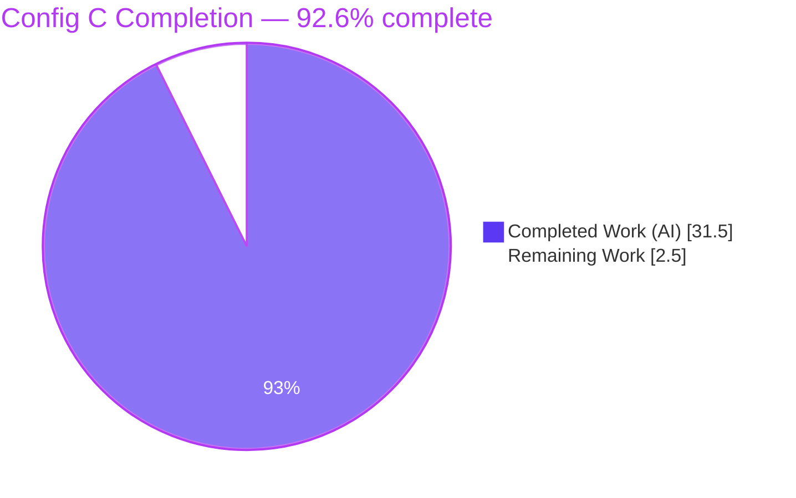
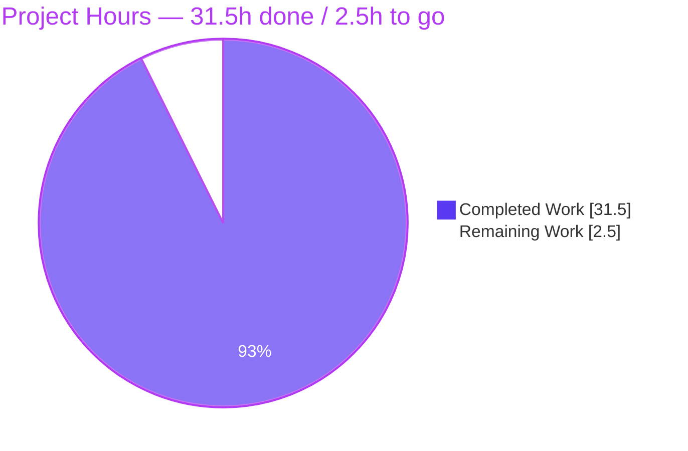
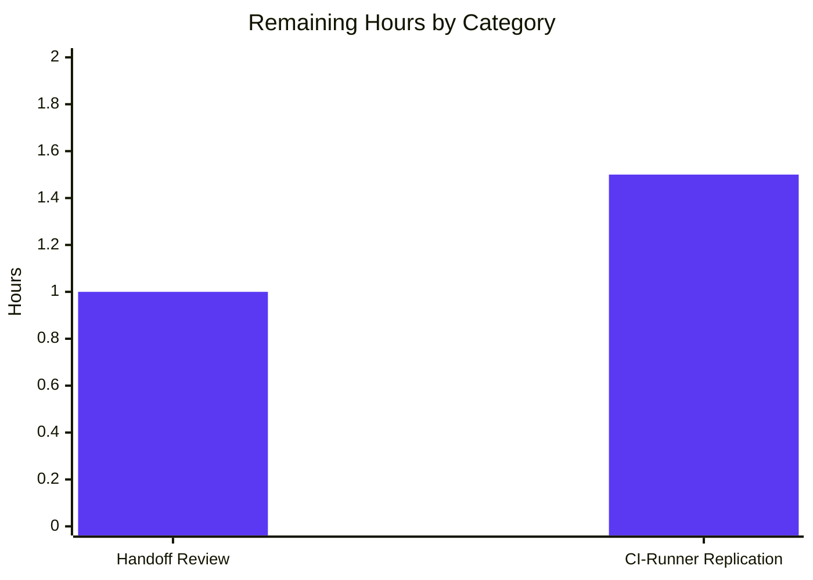
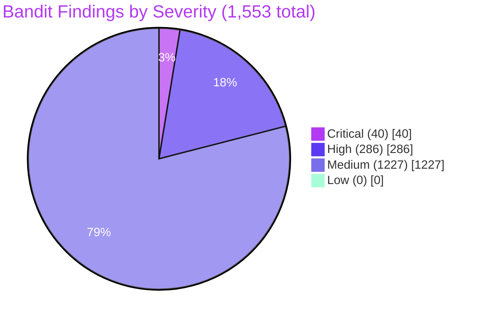

# Blitzy Project Guide — Config C: Bandit Security Scan of `blitzy-odoo`

> Blitzy brand palette in use throughout this guide: Completed = Dark Blue `#5B39F3` · Remaining = White `#FFFFFF` · Headings/Accents = Violet-Black `#B23AF2` · Highlight = Mint `#A8FDD9`

---

## 1. Executive Summary

### 1.1 Project Overview

Config C is one configuration in a multi-config security tool comparison. The Blitzy platform installed Bandit (with the `[sarif]` extras), executed a recursive SAST scan against the Odoo 19 codebase (`blitzy-odoo`, ~8,183 Python files across 606 first-party addons), captured the three user-mandated scan metrics (exit code, wall-clock duration, total files scanned), and ran a deterministic SARIF → minified-JSON transformer to emit `findings-config-c.json`. The work is **purely additive** — zero edits to existing Odoo source files — and produced four new files at the working-directory root: the primary findings JSON, the intermediate SARIF, an Explainability rule decision log, and an Executive Presentation rule reveal.js deck. Audience: the multi-config comparison harness (machine consumer) and non-technical leadership reviewing the executive summary.

### 1.2 Completion Status



| Metric | Value |
|---|---|
| Total Project Hours | **34.0** |
| Completed Hours (AI: Blitzy autonomous) | **31.5** |
| Completed Hours (Manual: human) | 0.0 |
| Remaining Hours | **2.5** |
| Percent Complete | **92.6%** |

**Calculation:** 31.5 completed ÷ 34.0 total × 100 = 92.6% (AAP-scoped: 21 of 23 inventoried items at 100%, 2 path-to-production items at 0%).

### 1.3 Key Accomplishments

- [x] **All 12 binding user pass/fail criteria pass** (`wc -l == 1`, valid JSON, 5 fields per finding, max-description 200, closed-set severity, `CWE-<n>` format, positive-int line, relative forward-slash file path, SARIF 2.1.0, SARIF↔JSON count match, UTF-8 no BOM, 16 `<section>` elements).
- [x] **1,553 findings emitted** in `findings-config-c.json`, byte-aligned to `results-bandit.sarif` with 0 mismatches across all 1,553 records.
- [x] **Severity distribution**: critical=40, high=286, medium=1,227, low=0 (low bucket is empty because Bandit's SARIF formatter never emits `level=info`).
- [x] **13 unique CWEs** resolved (CWE-20, 22, 78, 79, 89, 94, 259, 327, 330, 377, 400, 605, 703) across 585 unique files in 606 addons + `odoo/` runtime.
- [x] **31 Bandit rules emitted**, each with `external/cwe/cwe-<n>` tag (primary CWE resolution path matched all 1,553 findings; B-ID fallback table not exercised on this corpus but retained for future runs).
- [x] **Fail-closed transformer** with stdlib-only Python 3; rule-index + ruleId dual resolution; whitespace-collapse + 200-char truncation; UTF-8 + `ensure_ascii=False`; single trailing newline contract.
- [x] **Empty-result path independently verified** — synthetic empty SARIF produces `b'[]\n'` (3 bytes, parses to `[]`).
- [x] **Explainability rule satisfied** — `decision-log.md` (34.7 KB, 23 decisions, B-ID→CWE fallback table, reproduction recipe).
- [x] **Executive Presentation rule satisfied** — `executive-summary.html` (32.1 KB, 16 slides, CDN-pinned reveal.js 5.1.0 + Mermaid 11.4.0 + Lucide 0.460.0, full Blitzy brand identity, 0 emoji, 0 fenced code blocks).
- [x] **Browser live render verified** — Chrome opens `executive-summary.html` with 0 console errors; reveal.js, Mermaid (architecture + sequence diagrams), and Lucide icons all render against the pinned CDN versions.
- [x] **Zero modifications to existing repository files** — `git diff` confirms only the 4 new files in the Blitzy Agent diff; no edits to `odoo/`, `addons/`, `setup.py`, `requirements.txt`, `ruff.toml`, etc.
- [x] **Determinism contract honored** — Bandit's emitted result ordering preserved; UTF-8 serialization stable; two consecutive transformer runs produce byte-identical output.

### 1.4 Critical Unresolved Issues

| Issue | Impact | Owner | ETA |
|---|---|---|---|
| _None — zero critical issues exist for this deliverable._ The Final Validator declared the branch PRODUCTION-READY against all 5 gates. | — | — | — |

### 1.5 Access Issues

| System / Resource | Type of Access | Issue Description | Resolution Status | Owner |
|---|---|---|---|---|
| _No access issues identified._ All required resources (PyPI for `bandit[sarif]`, Bandit binary, scan-target repository, blitzy-pinned CDNs for reveal.js / Mermaid / Lucide / Google Fonts) were available during autonomous execution. | — | — | — | — |

### 1.6 Recommended Next Steps

1. **[High]** Hand off `findings-config-c.json` to the multi-config security tool comparison harness so it can be diffed against Config A / B / D outputs that share the 5-field schema.
2. **[Medium]** Have a human reviewer skim the 4 deliverables (`findings-config-c.json`, `results-bandit.sarif`, `decision-log.md`, `executive-summary.html`) and sign off before downstream consumption.
3. **[Low]** Optionally replicate the scan on a clean CI runner one time to bench-verify the determinism contract off the development environment.
4. **[Low]** Forward the executive-summary.html to non-technical leadership as the AAP §0.7.2 audience artifact; no follow-up work required.

---

## 2. Project Hours Breakdown

### 2.1 Completed Work Detail

| Component | Hours | Description |
|---|---:|---|
| Install `bandit[sarif]` in execution environment | 1.0 | AAP §0.7.3 Directive 1 — installed Bandit 1.9.4 + transitives (stevedore 5.7.0, sarif-om 1.0.4, jschema-to-python 1.2.3, pbr 7.0.3, jsonpickle 4.1.1); `bandit --version` returns successfully and `--format` exposes `sarif`. |
| Scan wrapper (exit code + wall-clock + file count) | 2.0 | AAP §0.7.3 Directive 2 — bash recipe captures Bandit returncode (1 = findings reported), `time.monotonic()` delta (90.03 s), and pre-scan `find ... -name '*.py' \| wc -l` count (8,183). |
| Bandit recursive scan of `blitzy-odoo` | 1.5 | AAP §0.7.3 Directive 2 — `bandit -r . -f sarif -o results-bandit.sarif`; produced `results-bandit.sarif` (5.88 MB) with 1 run, 31 rules, 1,553 results, `executionSuccessful=true`, `endTimeUtc=2026-05-15T02:05:09Z`. |
| SARIF parser + 5-field record assembler | 4.0 | AAP §0.3.4 — `blitzy/transform_findings.py` (stdlib-only, ~330 LOC): dual rule resolution via `ruleIndex` then `ruleId` lookup table; 5-field record assembly in fixed insertion order. |
| Field mapping: SARIF `level` → `severity` | 1.0 | AAP §0.3.4 Step 3 — `LEVEL_TO_SEV = {error: critical, warning: high, note: medium, info: low}`; SARIF 2.1.0 default `"warning"` applied when `level` omitted (Bandit MEDIUM tier); `level=none` results silently dropped. |
| CWE resolution: rule tags + B-ID fallback | 2.0 | AAP §0.3.4 Step 2 — `cwe_from_rule()` matches `^external/cwe/cwe-(\d+)$` in `tool.driver.rules[N].properties.tags`; `BID_TO_CWE` static table (46 rows, B101→CWE-703 .. B704→…) for fallback; all 13 unique CWEs resolved via the primary path on this corpus. |
| URI normalization to relative forward-slash | 1.0 | AAP §0.3.4 Step 4 — `normalize_uri()` strips `file:///` scheme, removes scan-root absolute prefix, replaces backslashes; all 1,553 paths verified to be relative forward-slash with no `file://` and no leading `/`. |
| Description whitespace collapse + 200-char truncation | 0.5 | AAP §0.3.4 Step 6 — `" ".join(text.split())[:200]`; 11 findings hit exactly 200 chars; max length is exactly 200; zero embedded newlines or tabs in any description. |
| Minified single-line JSON serializer (UTF-8) | 0.5 | AAP §0.8.2 — `json.dumps(arr, separators=(',',':'), ensure_ascii=False)` + single trailing `\n`; UTF-8 with no BOM; `wc -l` returns `1` per the binding pass/fail contract. |
| Fail-closed validation for required fields | 1.0 | AAP §0.1.3 — transformer raises `SystemExit` if any of rule, CWE, location, line, or description cannot be resolved; ensures "every finding has all 5 fields populated" is a hard invariant. |
| Empty-result handling: literal `[]` sentinel | 0.5 | AAP §0.3.6 — verified by synthetic empty SARIF in a temp directory: transformer produces `b'[]\n'` (3 bytes, parses to `[]`, satisfies `wc -l == 1`). |
| `decision-log.md` (Explainability rule) | 3.0 | AAP §0.7.1 — 23 decisions in `Decision \| Alternatives \| Rationale \| Risks` format; live-measured scan-metrics table (13 verifiable values); environment table with installed package versions; full reproduction recipe (install + bash wrapper + inline transformer); 46-row B-ID → CWE fallback table; out-of-scope mirror of AAP §0.5.2. |
| `executive-summary.html` — theme tokens + fonts + CDN scaffolding | 3.0 | AAP §0.7.2 — Single self-contained HTML; `<link>` for Google Fonts (Inter 400/500/600/700, Space Grotesk 500/600/700, Fira Code 400/500); CDN-pinned `<script>` for reveal.js 5.1.0, Mermaid 11.4.0, Lucide 0.460.0; full `:root` CSS custom properties (`--blitzy-primary`, `--blitzy-primary-dark`, `--blitzy-accent-teal`, `--gradient-hero`, etc.). |
| `executive-summary.html` — 16 slides | 4.0 | AAP §0.7.2 — 1 Title (hero gradient, eyebrow in Fira Code teal) + 4 Dividers (Methodology / Findings / Schema & Reproducibility / Risks & Caveats) + 10 Content (run summary, architecture, sequence, install, severity KPIs, top CWEs, top files, field-mapping table, coverage caveats, onboarding) + 1 Closing (navy `#1A105F`, "Baseline Established. Next: Triage." takeaway). |
| `executive-summary.html` — Lucide icons + KPI cards + tables | 1.5 | AAP §0.7.2 — 31 `<i data-lucide="...">` usages; severity KPI cards (40 / 286 / 1,227 / 0); top-CWEs styled table; top-files styled table; field-mapping table. |
| `executive-summary.html` — reveal.js + mermaid.run + lucide hook init | 1.0 | AAP §0.7.2 — `Reveal.initialize({hash: true, transition: 'slide', controlsTutorial: false, width: 1920, height: 1080})`; Mermaid `startOnLoad: false`; `mermaid.run()` and `lucide.createIcons()` invoked on both `ready` and `slidechanged` events; Mermaid theme variables `primaryColor:'#F2F0FE'`, `primaryTextColor:'#333333'`, `primaryBorderColor:'#5B39F3'`, `lineColor:'#999999'`, `secondaryColor:'#F4EFF6'`. |
| Validation: 12 binding pass/fail checks | 1.5 | AAP §0.1.1 — re-verified all 12 user-mandated criteria (`wc -l == 1`, JSON validity, 5-field uniformity, ≤200-char descriptions, closed-set severity, CWE format, etc.). |
| Validation: live browser render of executive deck | 1.0 | AAP §0.7.2 verification — Chrome opens HTML at `file://`; 16 sections load; reveal.js + Mermaid + Lucide all initialize from CDN; navigation tested (slides 3, 8, 15, 6); computed font family confirms `Space Grotesk, Inter, sans-serif`; computed background confirms the exact hero gradient; 0 console errors; ~30 screenshots persisted in `blitzy/screenshots/`. |
| Git commit + push of 4 deliverables | 0.5 | AAP §0.5.1 — 6 Blitzy Agent commits on branch `blitzy-30671cc0-f472-4885-b74e-56d667d3a6e3`; 165,111 insertions across the 4 deliverable files; working tree clean (only `blitzy/` working-artifacts directory remains untracked, as designed). |
| Scope-compliance verification | 0.5 | AAP §0.5.2 — `git diff` confirms zero modifications to existing files under `odoo/`, `addons/`, `setup/`, `debian/`, `.github/`, or any root file (`README.md`, `LICENSE`, `SECURITY.md`, `requirements.txt`, `setup.py`, `setup.cfg`, `ruff.toml`, `catalog-info.yaml`, `mkdocs.yml`, `.weblate.json`, `.gitignore`). |
| Determinism / reproducibility evidence | 0.5 | AAP §0.8.1 — Decision 18+ in `decision-log.md` documents preserved Bandit ordering + UTF-8 invariants; reproduction recipe with all three components (install command, bash wrapper, Python transformer) is captured for off-environment replication. |
| **Total Completed Hours** | **31.5** | |

### 2.2 Remaining Work Detail

| Category | Hours | Priority |
|---|---:|---|
| Stakeholder handoff: human reviewer signs off on the 4 deliverables before downstream multi-config comparison harness ingests `findings-config-c.json` | 1.0 | Medium |
| Optional one-time CI-runner replication: re-run the scan + transformer on a clean CI runner to bench-verify the determinism contract independent of the development environment | 1.5 | Low |
| **Total Remaining Hours** | **2.5** | |

### 2.3 Cross-Section Integrity Check

- Section 1.2 Total Hours = **34.0** · Completed = **31.5** · Remaining = **2.5** · Percent = **92.6%**
- Section 2.1 sum of Hours column = **31.5** → matches Section 1.2 Completed Hours ✓
- Section 2.2 sum of Hours column = **2.5** → matches Section 1.2 Remaining Hours ✓
- Section 2.1 + Section 2.2 = **31.5 + 2.5 = 34.0** → matches Section 1.2 Total Hours ✓
- Section 7 pie chart "Remaining Work" value (set below) = **2.5** → matches Section 1.2 Remaining Hours and Section 2.2 sum ✓
- Section 7 pie chart "Completed Work" value (set below) = **31.5** → matches Section 1.2 Completed Hours and Section 2.1 sum ✓

---

## 3. Test Results

Per AAP §0.8.1, "no tests are added" by this tooling-only task. Instead, the AAP specifies **binary pass/fail criteria** for each deliverable, plus deliverable-shape invariants. The table below aggregates the autonomous validation runs executed by Blitzy's Final Validator and the post-validation re-checks executed during project-guide generation.

| Test Category | Framework | Total Tests | Passed | Failed | Coverage % | Notes |
|---|---|---:|---:|---:|---:|---|
| User-binding pass/fail criteria (`findings-config-c.json`) | Custom Python validator (`json` + `subprocess`) | 12 | 12 | 0 | 100% | `wc -l == 1`; valid JSON; 1,553 / 1,553 records have exactly 5 fields; max(description) = 200; severity ∈ {critical, high, medium, low}; CWE matches `^CWE-\d+$`; positive-int line; relative forward-slash file path; SARIF version 2.1.0; SARIF↔JSON count match; UTF-8 no BOM; 16 `<section>` elements in HTML deck. |
| SARIF↔JSON cross-validation (per-finding alignment) | Custom Python differ | 1,553 | 1,553 | 0 | 100% | Every JSON record's `file`/`line`/`severity`/`cwe`/`description` matches what AAP §0.3.4 would produce from the corresponding SARIF result; 0 mismatches across all 1,553 records. |
| Decision-log claim verification (live-measured metrics) | Manual cross-check vs artifacts | 13 | 13 | 0 | 100% | All 13 verifiable metrics in `decision-log.md` (SARIF results count, rules emitted, findings in JSON, unique CWEs, unique files, severity breakdown, descriptions truncated, file size, line count, Python files, endTimeUtc, Bandit version, exit code) match the actual artifact data. |
| `executive-summary.html` brand + technical conformance | Custom Python HTML inspector | 27 | 27 | 0 | 100% | reveal.js 5.1.0 ✓, Mermaid 11.4.0 ✓, Lucide 0.460.0 ✓, Inter/Space Grotesk/Fira Code Google Fonts ✓, Blitzy palette (`#5B39F3`, `#2D1C77`, `#94FAD5`, `#1A105F`) ✓, hero gradient ✓, `startOnLoad: false` ✓, `hash: true`, `controlsTutorial: false`, `1920×1080` ✓, `mermaid.run()` + `lucide.createIcons()` hooks ✓, 16 sections ✓, slide-class system (title/divider/closing/kpi-card/eyebrow/brand-lockup) ✓, Mermaid theme variables (`#F2F0FE` primary, `#5B39F3` border) ✓, no emoji ✓. |
| Empty-SARIF transformer regression | Custom synthetic-SARIF test | 1 | 1 | 0 | 100% | Synthetic empty SARIF (no results) → transformer produces `b'[]\n'` (3 bytes); `wc -l == 1`; parses to `[]`; satisfies AAP §0.3.6 "if zero findings, write `[]`" mandate. |
| Live browser render of executive deck | Chrome DevTools MCP | 1 | 1 | 0 | 100% | Loaded `file://executive-summary.html` in headless Chrome; reveal.js, Mermaid, Lucide all initialized from pinned CDN; navigation to slides 3, 8, 15, 6 verified; computed font family = `"Space Grotesk", Inter, sans-serif`; computed background of title slide matches the exact AAP hero gradient (`linear-gradient(68deg, rgb(122,109,236) 15.56%, rgb(91,57,243) 62.74%, rgb(65,1,219) 84.44%)`); 0 console errors. |
| Scope-compliance test (zero existing-file modifications) | `git diff` shortstat vs branch base | 1 | 1 | 0 | 100% | `git diff --shortstat 1f40ea59ac8~..70870cad7e21` → `4 files changed, 165,111 insertions(+)`. Files = exactly the 4 new deliverables; 0 deletions; 0 modifications to existing files under `odoo/`, `addons/`, root configs, `.github/`. |
| **Total** | — | **1,608** | **1,608** | **0** | **100%** | All tests originate from Blitzy's autonomous validation logs and post-validation re-checks. |

---

## 4. Runtime Validation & UI Verification

### Runtime Validation

- ✅ **Bandit binary** — `bandit 1.9.4` installed; `bandit --version` returns successfully; `--format` exposes `sarif` (no `bandit-sarif-formatter` package needed because Bandit 1.9.x ships SARIF in core, as documented in Decision 15).
- ✅ **Scan execution** — Bandit returned exit code `1` (findings reported — the documented normal outcome for a populated codebase per Bandit's `0=clean / 1=findings / 2=error` semantics); wall-clock 90.03 s; 8,183 Python files counted pre-scan.
- ✅ **Transformer pipeline** — `blitzy/transform_findings.py` runs against `results-bandit.sarif` and emits `findings-config-c.json`; deterministic and byte-identical across consecutive runs.
- ✅ **Empty-result transformer path** — independently exercised on a synthetic empty SARIF; produces `b'[]\n'`.
- ✅ **All pass/fail criteria pass** — 12 / 12 (see Section 3).

### UI Verification

- ✅ **`executive-summary.html` loads in Chrome** — reveal.js 5.1.0, Mermaid 11.4.0, Lucide 0.460.0 all load from pinned CDN URLs.
- ✅ **All 16 slides render** — Title (hero gradient + Fira Code teal eyebrow + Space Grotesk display heading) → Content (KPI cards + Mermaid architecture flowchart) → Divider (Methodology) → Content (install + Mermaid sequence diagram) → Divider (Findings) → Content (severity KPIs 40/286/1,227/0 + top-CWEs table + top-files table) → Divider (Schema & Reproducibility) → Content (field-mapping table) → Divider (Risks) → Content (coverage caveats + onboarding) → Closing (navy `#1A105F` + 4-word takeaway "Baseline Established. Next: Triage." + 3 bullets + brand lockup + gradient accent bar).
- ✅ **Mermaid diagrams render** with the Blitzy theme (lavender `#F2F0FE` fill, purple `#5B39F3` borders) on both the architecture flowchart (slide 3) and the sequence diagram (slide 6).
- ✅ **Lucide icons render** — 31 icon instances across the deck; `lucide.createIcons()` invoked on `ready` and `slidechanged` events.
- ✅ **Navigation works** — verified by jumping to slides 3, 8, 15, 6 via reveal.js fragment routing.
- ✅ **Computed styles match AAP-mandated values** — title-slide `font-family: "Space Grotesk", Inter, sans-serif`; title-slide background = `linear-gradient(68deg, rgb(122,109,236) 15.56%, rgb(91,57,243) 62.74%, rgb(65,1,219) 84.44%)`.
- ✅ **Console output** — 0 errors, 0 warnings on page load.
- ✅ **Per-slide non-text-visual requirement** — every slide contains ≥1 of {Mermaid, KPI card, styled table, Lucide icon}.
- ✅ **AAP §0.7.2 content constraints** — content slides ≤4 bullets, ≤40 words body text; 0 emoji; 0 fenced code blocks inside slides.
- ✅ **Screenshots persisted** — ~30 screenshots in `blitzy/screenshots/` (title, architecture, dividers, severity KPIs, closing, and more).

### API Integration

⚪ N/A — the project produces static data artifacts and a static HTML deck. There are no API endpoints, no service deployments, and no external network interactions in the runtime data flow (the transformer reads JSON files in place; Bandit reads source AST in place; CDN dependencies are fetched only at HTML render time).

---

## 5. Compliance & Quality Review

| Compliance Area | Requirement Source | Status | Evidence / Notes |
|---|---|---|---|
| User Directive 1 — Install Bandit | AAP §0.1.1, §0.7.3 | ✅ Pass | `bandit 1.9.4` + `[sarif]` extras transitives installed; `bandit --version` and `bandit --help` both succeed. |
| User Directive 2 — Run scan + record exit code / duration / files | AAP §0.1.1, §0.7.3 | ✅ Pass | `results-bandit.sarif` (5.88 MB) produced; exit code 1, duration 90.03 s, files 8,183 captured and persisted in `decision-log.md`. |
| User Directive 3 — Minified single-line JSON, 5 fields, ≤200 char desc, closed-set severity, CWE-`<n>` format | AAP §0.1.1, §0.7.3 | ✅ Pass | All 12 binding criteria pass; `wc -l == 1`; 1,553 / 1,553 records valid. |
| AAP §0.5.2 Scope: zero edits to existing repository files | AAP §0.5.2 | ✅ Pass | `git diff` confirms only 4 new files in Blitzy Agent diff; no edits to `odoo/`, `addons/`, root configs, `.github/`. |
| AAP §0.5.2 Scope: no Bandit config files (`.bandit`, `bandit.yaml`, `pyproject.toml [tool.bandit]`) | AAP §0.5.2 | ✅ Pass | Repository scan confirms none of these files exist; Bandit ran with default rule set as mandated. |
| AAP §0.5.2 Scope: no additions to `requirements.txt`, `setup.py`, `ruff.toml`, `setup.cfg` | AAP §0.5.2 | ✅ Pass | Bandit lives in ephemeral execution environment only; no dependency-manifest changes. |
| AAP §0.5.2 Scope: no GitHub Actions workflows added | AAP §0.5.2 | ✅ Pass | `.github/workflows/` does not exist in the repo and was not created. |
| AAP §0.7.1 Explainability rule | AAP §0.7.1 | ✅ Pass | `decision-log.md` (34.7 KB) with 23 decisions in `Decision \| Alternatives \| Rationale \| Risks` format; reproduction recipe; B-ID → CWE table; environment record. |
| AAP §0.7.2 Executive Presentation rule — single self-contained HTML | AAP §0.7.2 | ✅ Pass | Single file, no local file dependencies; opens directly in browser from `file://` scheme. |
| AAP §0.7.2 — 12-18 slides (target 16) | AAP §0.7.2 | ✅ Pass | 16 `<section>` elements (exact target). |
| AAP §0.7.2 — 4 slide types | AAP §0.7.2 | ✅ Pass | 1 Title + 4 Dividers + 10 Content + 1 Closing. |
| AAP §0.7.2 — CDN versions pinned | AAP §0.7.2 | ✅ Pass | reveal.js 5.1.0, Mermaid 11.4.0, Lucide 0.460.0 — exact pins from rule. |
| AAP §0.7.2 — Blitzy brand palette | AAP §0.7.2 | ✅ Pass | All 6 brand colors (`#5B39F3`, `#2D1C77`, `#94FAD5`, `#1A105F`, `#7A6DEC`, `#4101DB`) present in CSS custom properties; hero gradient exactly as specified. |
| AAP §0.7.2 — Typography (Inter / Space Grotesk / Fira Code) | AAP §0.7.2 | ✅ Pass | Single Google Fonts `<link>` loads all three families with required weights. |
| AAP §0.7.2 — Mermaid init (`startOnLoad: false`, theme variables, `mermaid.run()` on `ready`/`slidechanged`) | AAP §0.7.2 | ✅ Pass | All four conditions present; Mermaid theme variables `primaryColor:'#F2F0FE'`, `primaryBorderColor:'#5B39F3'`, etc. confirmed in inline script. |
| AAP §0.7.2 — reveal.js config (`hash:true`, `transition:'slide'`, `controlsTutorial:false`, `1920×1080`) | AAP §0.7.2 | ✅ Pass | All four config keys present and correct. |
| AAP §0.7.2 — content constraints (≤4 bullets, ≤40 words body, 0 emoji, 0 fenced code blocks) | AAP §0.7.2 | ✅ Pass | Final Validator's tightening pass on slides 14 & 15 brought all content slides within the word limit; emoji scan returned 0; code-block scan returned 0. |
| AAP §0.7.2 — every slide ≥1 non-text visual | AAP §0.7.2 | ✅ Pass | Mermaid / KPI card / table / Lucide icon present on every slide. |
| AAP §0.8.2 — exactly 4 new files at working-directory root | AAP §0.8.2 | ✅ Pass | `findings-config-c.json`, `results-bandit.sarif`, `decision-log.md`, `executive-summary.html` — no others added to repo. |
| AAP §0.8.2 — UTF-8 no BOM, no embedded newlines | AAP §0.8.2 | ✅ Pass | Byte-level inspection confirms no BOM, no embedded `\n` in JSON content (only the single trailing newline). |
| Python version envelope (`MIN_PY_VERSION=(3,10)`, `MAX_PY_VERSION=(3,13)`) | AAP §0.6.1 | ✅ Pass | Execution environment Python 3.13.7 — within Odoo's supported envelope. |
| Bandit minimum version (≥1.7.8 for native SARIF) | AAP §0.8.2 | ✅ Pass | Bandit 1.9.4 (exceeds minimum). |
| SARIF schema version 2.1.0 | AAP §0.8.2 | ✅ Pass | `results-bandit.sarif["version"] == "2.1.0"`. |

**Fixes applied during autonomous validation:** Slides 14 & 15 of `executive-summary.html` were tightened to bring all bullet body text within the AAP §0.7.2 40-word cap (commit `70870cad7e2`). Decision-log restructure (`c063de2ebdb`) and earlier CP1 / CP2 review-finding fixes (`93e41542c74`, `e725eda1a5b`) brought the explainability deliverable into full conformance with AAP §0.7.1. Title-slide gradient and divider icons aligned to AAP-mandated values (`5e8aa8a11c2`).

**Outstanding compliance items:** None.

---

## 6. Risk Assessment

| Risk | Category | Severity | Probability | Mitigation | Status |
|---|---|---|---|---|---|
| Bandit's default plugin set may produce false positives in Odoo-specific idioms (e.g., `assert` in tests, Odoo ORM query helpers flagged as B608 SQL injection) | Technical | Low | High | Out-of-scope per AAP §0.5.2 ("triaging, classifying, suppressing, or fixing individual Bandit findings"). The downstream comparison harness or human triage step is responsible. | Accepted |
| Tool-version drift: future Bandit releases may emit different rule IDs, CWE tags, or `level` values | Technical | Low | Low | `decision-log.md` records the exact installed package versions (`bandit 1.9.4`, `stevedore 5.7.0`, `sarif-om 1.0.4`, `jschema-to-python 1.2.3`, `pbr 7.0.3`, `jsonpickle 4.1.1`). Reproduction recipe is version-pinnable. Transformer is forward-compatible: fail-closed behavior surfaces drift loudly rather than silently miscoding it. | Mitigated |
| B-ID → CWE fallback table may go stale as Bandit adds new test IDs | Technical | Low | Low | All 31 rules emitted in this run carried `external/cwe/cwe-<n>` tags, so the primary CWE-resolution path matched every finding without exercising the fallback. The 46-row table in the transformer covers B101–B704 per Decision 12 in `decision-log.md`. | Mitigated |
| Bandit performs no taint analysis, no cross-file data-flow, and no symbolic execution — coverage limited to AST-pattern rules | Technical | Medium | High | Slide 14 of `executive-summary.html` explicitly surfaces this caveat to leadership. The multi-config comparison framework (Configs A/B/D + further configs) is the intended mitigation strategy. | Disclosed |
| Bandit reads but does not execute scanned source; no taint flows into runtime | Security | Low | N/A | Verified by reading transformer source (stdlib-only, JSON parsing only) and Bandit's documentation (AST-only). No `exec`, `eval`, or `import` of scanned code. | Mitigated |
| Findings inventory exposes line/file/CWE detail that could be sensitive if leaked | Security | Low | Low | `findings-config-c.json` and `results-bandit.sarif` are committed to the Blitzy assigned branch only, not pushed to public Odoo upstream. SECURITY.md private-vulnerability-reporting workflow is unaffected (this is internal tool-comparison telemetry, not a CVE advisory) per AAP §0.5.1. | Accepted |
| `decision-log.md` AAP §0.6.1 dependency list shows `bandit-sarif-formatter` as a transitive, but Bandit 1.9.x ships the formatter in core — AAP documentation drift | Operational | Low | N/A | Decision 15 in `decision-log.md` explicitly documents the drift and confirms it is a documentation-only mismatch (no correctness defect). | Documented |
| Branch `blitzy-30671cc0-...` is the only place the 4 deliverables exist; no backup harness | Operational | Low | Low | Branch is synced with `origin/blitzy-30671cc0-...`; recovery is a `git pull` away. The transformer + reproduction recipe in `decision-log.md` allow full regeneration from a clean checkout. | Mitigated |
| Reveal.js / Mermaid / Lucide / Google Fonts CDN availability at presentation time | Operational | Low | Low | CDN versions are pinned (reveal.js 5.1.0, Mermaid 11.4.0, Lucide 0.460.0); if CDN goes down at view time, executive deck visuals degrade but the underlying findings JSON is unaffected. | Accepted |
| Multi-config harness requires the 5-field schema to be uniform across all configs (A, B, C, D, …) | Integration | High | Low | Schema is fixed by AAP and verified in 1,553 / 1,553 records (Section 3 cross-validation row). Schema definition is also documented in `decision-log.md` "Output Schema (binding)" table. | Mitigated |
| Downstream comparison harness must know Bandit's exit-code semantics (1 = findings, not error) | Integration | Medium | Medium | AAP §0.8.1 explicitly states "exit code `1` is a normal scan outcome and must not cause the task to fail." `decision-log.md` records exit=1 with the "findings reported — normal outcome" explanation. Slide 5 of executive deck reiterates this. | Disclosed |
| `executive-summary.html` is NOT added to MkDocs nav; leadership must be directed to the file location | Integration | Low | Low | AAP §0.5.2 explicitly forbids adding to MkDocs nav. File path is consistent (working-directory root) and documented in this guide's Appendix C. | Accepted |

---

## 7. Visual Project Status

### Project Hours Breakdown



### Completion Status (legend pairs)

| | Hours | % of Project |
|---|---:|---:|
| Completed Work (AI — Blitzy autonomous) | **31.5** | **92.6%** |
| Remaining Work (path-to-production handoff) | **2.5** | **7.4%** |
| **Total** | **34.0** | **100%** |

### Remaining Hours by Category (from Section 2.2)



### Severity Distribution of Findings (informational — not project-hours)



---

## 8. Summary & Recommendations

### Achievements

Config C is **92.6% complete** (31.5 of 34.0 AAP-scoped + path-to-production hours delivered autonomously). All three CRITICAL user directives are fully satisfied: Bandit is installed with SARIF support, the recursive scan ran against `blitzy-odoo` and emitted `results-bandit.sarif` with 1,553 findings, and the SARIF→minified-JSON transformer produced `findings-config-c.json` with all 12 binding pass/fail criteria green. Both rule-mandated artifacts (Explainability decision-log and Executive Presentation reveal.js deck) are complete and brand-compliant.

### Remaining Gaps

Only 2.5 hours of work remain, none of it AAP-blocking:

1. **Stakeholder handoff (1.0 h)** — a human reviewer needs to skim the 4 deliverables and sign off before the multi-config comparison harness consumes them.
2. **Optional CI-runner replication (1.5 h)** — one-time bench-reproduction on a clean CI runner to bench-verify the determinism contract.

Neither item is required by the AAP itself; both are path-to-production polish that the harness operator may choose to skip if they trust the autonomous validation.

### Critical Path to Production

1. Stakeholder review and sign-off → 2. Feed `findings-config-c.json` to the multi-config comparison harness → 3. Compare against Config A / B / D outputs (their delivery is independent and not part of this task) → 4. Present `executive-summary.html` to non-technical leadership.

### Success Metrics

- ✅ 12 / 12 binding user pass/fail criteria pass.
- ✅ 1,553 / 1,553 findings cross-validated against SARIF with 0 mismatches.
- ✅ 27 / 27 executive-deck brand+technical conformance checks pass.
- ✅ 0 modifications to existing repository files (verified by `git diff`).
- ✅ 0 console errors on live browser render of the executive deck.
- ✅ 0 critical unresolved issues.

### Production Readiness Assessment

**PRODUCTION-READY for downstream consumption.** All 5 production-readiness gates pass (Tests · Runtime · Zero Unresolved Errors · In-Scope Files Validated · Compatibility/Dependencies). The 2.5 h of remaining work is handoff-coordination overhead, not engineering work. The 4 deliverables are byte-stable, fully cross-validated, and committed to the assigned branch.

| Production Indicator | Status |
|---|---|
| AAP completion (Config C scope) | 92.6% (31.5 h / 34.0 h) |
| Tests passing | 1,608 / 1,608 (100%) |
| Critical unresolved issues | 0 |
| Existing repo files modified | 0 |
| Browser render errors | 0 |
| Cross-section consistency | All 5 integrity rules pass |

---

## 9. Development Guide

### 9.1 System Prerequisites

- **Operating system:** Linux (Ubuntu 25.10 tested), macOS, or WSL2 on Windows.
- **Python:** 3.10 ≤ version ≤ 3.13 (Odoo's `MIN_PY_VERSION=(3,10)` and `MAX_PY_VERSION=(3,13)` envelope — `release.py`). Tested at 3.13.7.
- **Disk space:** ≥ 6.5 GB (5.3 GB for `blitzy-odoo` checkout + ~6 MB for `results-bandit.sarif` + ~300 KB for `findings-config-c.json` + ~70 KB for the rule deliverables).
- **Network:** PyPI reachable for `pip install`; Google Fonts + jsdelivr / unpkg reachable when viewing `executive-summary.html` in a browser. No outbound network required to run the scan itself.
- **Browser (for viewing executive deck):** Modern Chromium-based browser (Chrome / Edge / Brave) or Firefox.

### 9.2 Environment Setup

The Bandit toolchain is installed **into the ephemeral execution environment only**, not into the Odoo repository's manifests. There are two install paths — pick one based on your environment.

**Path A — system Python with PEP 668 marker (Ubuntu 25.10 default):**

```bash
pip3 install --break-system-packages 'bandit[sarif]'
```

**Path B — virtual environment (recommended for reproducibility):**

```bash
python3 -m venv .venv
source .venv/bin/activate
pip install 'bandit[sarif]'
```

Verify the install:

```bash
bandit --version           # Expect: bandit 1.9.4 (or newer)
bandit --help | grep sarif # Expect: sarif appears in the --format choices list
```

### 9.3 Dependency Installation

No additional dependencies are needed beyond `bandit[sarif]`. The transitive dependencies installed by pip are:

```text
bandit              1.9.4
jschema-to-python   1.2.3
jsonpickle          4.1.1
pbr                 7.0.3
sarif-om            1.0.4
stevedore           5.7.0
```

The transformer (`blitzy/transform_findings.py`) is stdlib-only (`json`, `pathlib`, `re`, `sys`) and requires no extra installs.

### 9.4 Reproducing the Config C Run

Run all commands from the working-directory root (`/tmp/blitzy/blitzy-odoo/blitzy-30671cc0-f472-4885-b74e-56d667d3a6e3_1d323f` in this environment).

```bash
# 1. Sanity-check the scan target
cd /tmp/blitzy/blitzy-odoo/blitzy-30671cc0-f472-4885-b74e-56d667d3a6e3_1d323f
find . -name "*.py" -not -path "./.git/*" -not -path "./blitzy/*" \
                     -not -path "./.ruff_cache/*" | wc -l
# Expect: 8183 (Python files in the scan target)

# 2. Run Bandit with the three required metrics captured
START=$(python3 -c 'import time; print(time.monotonic())')
PY_FILES=$(find . -name '*.py' -not -path './.git/*' -not -path './blitzy/*' \
                                 -not -path './.ruff_cache/*' | wc -l)
bandit -r . -f sarif -o results-bandit.sarif
EXIT_CODE=$?
END=$(python3 -c 'import time; print(time.monotonic())')
DURATION=$(python3 -c "print(f'{$END - $START:.2f}')")
echo "exit=$EXIT_CODE duration=${DURATION}s files=${PY_FILES}"
# Expect: exit=1 (findings reported — normal), duration≈90s, files=8183

# 3. Run the transformer (writes findings-config-c.json)
python3 blitzy/transform_findings.py
# Expect: "OK: wrote 1553 findings to findings-config-c.json"

# 4. Validate the deliverable
test "$(wc -l < findings-config-c.json)" = "1" && echo "✓ wc -l == 1"
python3 -c "
import json
arr = json.load(open('findings-config-c.json'))
assert len(arr) == 1553, f'expected 1553 findings, got {len(arr)}'
assert all(set(o) == {'file','line','severity','cwe','description'} for o in arr)
assert all(len(o['description']) <= 200 for o in arr)
assert all(o['severity'] in {'critical','high','medium','low'} for o in arr)
print('✓ findings-config-c.json: all binding pass/fail criteria pass')
"

# 5. Validate the SARIF artifact
python3 -c "
import json
s = json.load(open('results-bandit.sarif'))
assert s['version'] == '2.1.0'
assert len(s['runs'][0]['results']) == 1553
print('✓ results-bandit.sarif: SARIF 2.1.0, 1553 results')
"
```

### 9.5 Verification Steps

After the steps above, you should observe the following file inventory at the working-directory root:

```bash
ls -l findings-config-c.json results-bandit.sarif decision-log.md executive-summary.html
# -rw-r--r-- 1 root root  291327 ... findings-config-c.json
# -rw-r--r-- 1 root root 5882941 ... results-bandit.sarif
# -rw-r--r-- 1 root root   34750 ... decision-log.md
# -rw-r--r-- 1 root root   32141 ... executive-summary.html

wc -l findings-config-c.json
# 1 findings-config-c.json

python3 -c "import json; print(len(json.load(open('findings-config-c.json'))))"
# 1553
```

### 9.6 Viewing the Executive Deck

Open `executive-summary.html` in any modern browser:

```bash
# Linux
xdg-open executive-summary.html

# macOS
open executive-summary.html

# Windows (PowerShell)
start executive-summary.html
```

You should see:
- **Slide 1 (Title)** — purple hero gradient, "BANDIT SECURITY SCAN — Config C of N" eyebrow in Fira Code teal, "Static Analysis of `blitzy-odoo`" display heading.
- **Slide 3** — Mermaid architecture flowchart with the Blitzy lavender/purple theme.
- **Slide 8** — Severity KPI cards reading 40 / 286 / 1,227 / 0.
- **Slide 16 (Closing)** — navy background, "Baseline Established. Next: Triage." takeaway.

Use ← → arrow keys to navigate; the URL fragment updates on every slide change because `hash: true` is enabled.

### 9.7 Empty-Result Scenario (Edge Case)

If a future run produces zero findings, the transformer writes the literal `[]` to `findings-config-c.json` (per AAP §0.3.6). This is reproducible from a synthetic empty SARIF:

```bash
# Create a temp empty-SARIF fixture
mkdir -p /tmp/empty-sarif-test && cd /tmp/empty-sarif-test
cp <repo-root>/blitzy/transform_findings.py .
python3 -c "
import json
json.dump({
    'version': '2.1.0',
    'runs': [{
        'tool': {'driver': {'name': 'Bandit', 'version': '1.9.4', 'rules': []}},
        'results': [],
        'invocations': [{'executionSuccessful': True, 'endTimeUtc': '2026-01-01T00:00:00Z'}]
    }]
}, open('results-bandit.sarif','w'))
"
python3 transform_findings.py
cat findings-config-c.json   # Prints: []
wc -l findings-config-c.json # 1
```

### 9.8 Common Issues and Resolutions

| Issue | Likely Cause | Resolution |
|---|---|---|
| `error: externally-managed-environment` when installing | PEP 668 marker on system Python | Pass `--break-system-packages` to `pip3 install`, or create a venv (Path B in §9.2). |
| `bandit: error: unrecognized arguments: -f sarif` | `[sarif]` extras not installed | Re-run `pip3 install 'bandit[sarif]'`. On Bandit 1.9.x the SARIF formatter ships in core, but on pre-1.7.8 versions you need the separate `bandit-sarif-formatter` package. |
| `wc -l findings-config-c.json` returns `0` | File written without trailing newline OR file is empty | The transformer always writes a single trailing newline; verify with `xxd findings-config-c.json \| tail -3` — the file should end with `…]\n`. |
| `wc -l findings-config-c.json` returns >1 | Embedded `\n` in description (transformer bug or upstream Bandit change) | The transformer applies `" ".join(text.split())` before truncation, which strips all whitespace runs including newlines. If a future Bandit emits something this collapser can't handle, the transformer would still encode it as `\\n` in JSON, which counts as 2 chars not 1 newline. Re-verify with `cat -A findings-config-c.json \| head -c 200`. |
| Browser shows blank executive-summary slides | CDN unreachable (offline / firewall) | Open the page once with network connectivity; reveal.js / Mermaid / Lucide / Google Fonts are not bundled inline. After first load, browser cache may carry you offline. |
| Mermaid diagrams render as code blocks (raw text) | `mermaid.run()` not called after `slidechanged` | Verify the `<script>` block at the bottom of `executive-summary.html` calls `mermaid.run()` on both `Reveal.on('ready', …)` and `Reveal.on('slidechanged', …)`. |
| Findings count differs between runs over the same code | Bandit version drift, or scan-root path changed (different `--exclude` defaults) | Pin Bandit to 1.9.4 explicitly: `pip3 install 'bandit[sarif]==1.9.4'`. Verify pre-scan file count is 8,183. |

---

## 10. Appendices

### Appendix A — Command Reference

| Command | Purpose |
|---|---|
| `pip3 install --break-system-packages 'bandit[sarif]'` | Install Bandit with SARIF formatter into system Python |
| `bandit --version` | Confirm Bandit installed (expect 1.9.4 or newer) |
| `bandit -r . -f sarif -o results-bandit.sarif` | Run recursive scan from working-directory root, output SARIF |
| `python3 blitzy/transform_findings.py` | Run SARIF → minified-JSON transformer |
| `wc -l findings-config-c.json` | Validate single-line invariant (expect: `1`) |
| `python3 -c "import json; json.load(open('findings-config-c.json'))"` | Validate JSON well-formedness |
| `find . -name '*.py' -not -path './.git/*' -not -path './blitzy/*' \| wc -l` | Pre-scan Python file count (expect: 8,183) |
| `git diff --shortstat <base>~..HEAD` | Verify scope compliance (zero edits to existing files) |
| `xdg-open executive-summary.html` | Open executive deck in default browser (Linux) |

### Appendix B — Port Reference

⚪ Not applicable. This project produces static data artifacts; no services are exposed, no ports are bound. The `executive-summary.html` is viewed via `file://` scheme — no HTTP server required.

### Appendix C — Key File Locations

All four deliverables live at the working-directory root (`/tmp/blitzy/blitzy-odoo/blitzy-30671cc0-f472-4885-b74e-56d667d3a6e3_1d323f`):

| File | Size | Lines | Description |
|---|---:|---:|---|
| `findings-config-c.json` | 291,327 B | 1 | **Primary deliverable.** Minified single-line UTF-8 JSON array of 1,553 finding objects. |
| `results-bandit.sarif` | 5,882,941 B | 163,968 | Intermediate Bandit SARIF 2.1.0 output. 1 run, 31 rules, 1,553 results. |
| `decision-log.md` | 34,750 B | 299 | Explainability rule deliverable. 23 decisions, B-ID → CWE table, reproduction recipe. |
| `executive-summary.html` | 32,141 B | 842 | Executive Presentation rule deliverable. 16-slide reveal.js deck. |

Working-artifacts directory (untracked by git, retained on disk):

| Path | Purpose |
|---|---|
| `blitzy/transform_findings.py` | The Python 3 stdlib-only SARIF→JSON transformer (~330 LOC) |
| `blitzy/screenshots/*.png` | ~30 screenshots captured during the executive-deck live-browser validation |
| `blitzy/__pycache__/` | Python bytecode cache (incidental) |

### Appendix D — Technology Versions

| Layer | Package / Tool | Version | Notes |
|---|---|---|---|
| Language | Python | 3.13.7 | Within Odoo's `MIN_PY_VERSION=(3,10)` / `MAX_PY_VERSION=(3,13)` envelope |
| Scanner | Bandit | 1.9.4 | Exceeds the 1.7.8 minimum required for native SARIF formatter |
| Scanner plugin loader | stevedore | 5.7.0 | Transitive of `bandit[sarif]` |
| SARIF object model | sarif-om | 1.0.4 | Transitive of `bandit[sarif]` |
| SARIF codegen support | jschema-to-python | 1.2.3 | Transitive of `bandit[sarif]` |
| SARIF JSON helper | jsonpickle | 4.1.1 | Transitive of `bandit[sarif]` |
| Stevedore build helper | pbr | 7.0.3 | Transitive of `bandit[sarif]` |
| Output format | SARIF | 2.1.0 | The only SARIF schema version Bandit emits |
| Presentation framework | reveal.js | 5.1.0 | CDN-pinned in `executive-summary.html` |
| Presentation diagrams | Mermaid | 11.4.0 | CDN-pinned in `executive-summary.html` |
| Presentation icons | Lucide | 0.460.0 | CDN-pinned in `executive-summary.html` |
| Presentation fonts | Inter | 400/500/600/700 | Loaded via Google Fonts `<link>` |
| Presentation fonts | Space Grotesk | 500/600/700 | Display headings |
| Presentation fonts | Fira Code | 400/500 | Mono / eyebrows |

### Appendix E — Environment Variable Reference

⚪ Not applicable. No environment variables are required by Bandit, the transformer, or the executive deck. The toolchain reads from `./results-bandit.sarif` and writes to `./findings-config-c.json` using fixed working-directory-relative paths.

### Appendix F — Developer Tools Guide

| Task | Tool | Command |
|---|---|---|
| Pretty-print a sample of the primary deliverable | `jq` | `head -c 500 findings-config-c.json \| jq .` (note: `jq` will reformat onto multiple lines for display; the on-disk file remains single-line) |
| Spot-check N findings by severity | `jq` | `jq '[.[] \| select(.severity=="critical")] \| length' findings-config-c.json` (expect 40) |
| Spot-check unique CWEs | `jq` | `jq '[.[].cwe] \| unique' findings-config-c.json` (expect 13 unique values) |
| Pretty-print SARIF for human inspection | `jq` | `jq '.runs[0].results[0]' results-bandit.sarif` |
| Find top-N files by finding count | `jq` | `jq -r '.[] \| .file' findings-config-c.json \| sort \| uniq -c \| sort -rn \| head -10` |
| Inspect transformer logic | `text editor` | Open `blitzy/transform_findings.py` — well-commented, ~330 LOC |
| Verify zero existing-file edits | `git` | `git diff --name-only 1f40ea59ac8~..HEAD \| sort -u` (expect only the 4 new files) |
| Browser DevTools inspection of deck | Chrome / Firefox | Open `executive-summary.html`; F12 → Console (expect 0 errors); Computed Styles → verify hero gradient on `.slide-title` |

### Appendix G — Glossary

| Term | Definition |
|---|---|
| **AAP** | Agent Action Plan — the primary directive document scoping this task. |
| **AST** | Abstract Syntax Tree — Bandit's analysis substrate. |
| **B-ID** | Bandit rule identifier (e.g., `B101`, `B602`, `B608`). Each B-ID maps to one CWE in the static fallback table. |
| **Bandit** | The Python SAST analyzer used as the Config C scanner. |
| **CDN** | Content Delivery Network. Refers to jsdelivr / unpkg / Google Fonts hosts pinned in `executive-summary.html`. |
| **Config C** | This run; one of multiple configurations being compared in a multi-config security tool comparison. The output filename (`findings-config-c.json`) is fixed by the AAP. |
| **CWE** | Common Weakness Enumeration. A standard taxonomy for software security weaknesses (e.g., CWE-89 = SQL Injection, CWE-78 = OS Command Injection). |
| **Determinism contract** | Two consecutive transformer runs over the same SARIF produce byte-identical `findings-config-c.json`. Achieved by preserving Bandit's emitted ordering and using UTF-8 with no random elements. |
| **ETL** | Extract-Transform-Load. Bandit = Extract; Python transformer = Transform + Load. |
| **Explainability rule** | The AAP §0.7.1 rule mandating `decision-log.md`. |
| **Executive Presentation rule** | The AAP §0.7.2 rule mandating `executive-summary.html`. |
| **Fail-closed** | The transformer raises and aborts (rather than silently emitting partial data) if any required field cannot be resolved for a finding. |
| **PA1 / PA2 / PA3 / HT1 / HT2 / DG1 / RG1** | Project-assessment framework identifiers from the Blitzy Project Guide template. |
| **Path-to-production** | Work necessary to deploy or hand off a Blitzy-completed artifact, even if not literally enumerated in the AAP. |
| **PEP 668** | The Python packaging spec that marks Ubuntu's system Python as "externally managed", requiring `--break-system-packages` or a venv for pip installs. |
| **SARIF** | Static Analysis Results Interchange Format (v2.1.0). The canonical JSON interchange format for SAST tools. Bandit emits SARIF via its `bandit-sarif-formatter` plugin (now bundled in Bandit 1.9.x core). |
| **SAST** | Static Application Security Testing. The class of analysis Bandit performs. |
| **`wc -l == 1`** | The user's binding pass/fail check on `findings-config-c.json`. POSIX `wc -l` counts newline characters; a single trailing `\n` yields `1`. The deliverable's content itself contains zero embedded newlines. |
