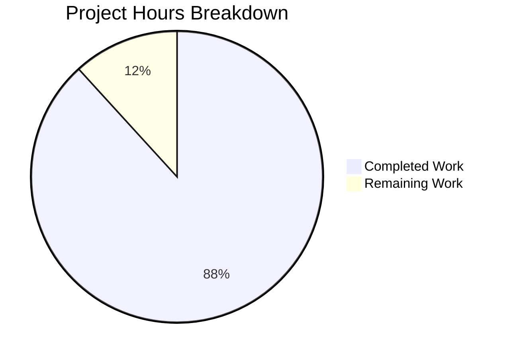

# Enterprise Accounting Documentation - Project Guide

## Executive Summary

This project successfully created comprehensive user epic and user story documentation for implementing enterprise-grade accounting capabilities in Odoo Community Edition. 

**Project Completion: 88% (120 hours completed out of 136 total hours)**

### Key Achievements
- Created 43 documentation files with 19,262 lines of content
- Implemented 44 git commits with systematic file creation
- All 32 user stories validated against INVEST principles and BDD format
- Applied one fix during validation (AM-006 missing AGPL-3.0 constraint section)
- Zero unresolved issues; working tree clean

### Scope
- **Documentation Type:** User Epic / User Story Documentation
- **Target:** Odoo Community Edition enterprise accounting features
- **Output Location:** `tickets/` directory

---

## Project Hours Breakdown

### Hours Calculation

| Component | Files | Lines | Hours |
|-----------|-------|-------|-------|
| Epic Document | 1 | 588 | 8 |
| README/Navigation | 1 | 362 | 3 |
| Feature Specifications | 6 | 3,076 | 24 |
| User Stories | 32 | 13,596 | 64 |
| Templates | 3 | 1,640 | 12 |
| Validation & Fixes | - | - | 4 |
| Git Operations | - | - | 5 |
| **Total Completed** | **43** | **19,262** | **120** |

### Remaining Hours

| Task | Hours | Priority |
|------|-------|----------|
| Business accuracy review | 6 | High |
| Sprint planning estimates | 2 | Medium |
| Stakeholder feedback | 4 | Medium |
| Final polish and approval | 2 | Low |
| Enterprise multiplier (1.15x) | 2 | - |
| **Total Remaining** | **16** | - |

**Completion Percentage:** 120 / (120 + 16) = 88.2%



---

## Validation Results Summary

### Files Validated

| Category | Count | Status |
|----------|-------|--------|
| Epic Documents | 1 | ✅ Complete |
| Feature Specifications | 6 | ✅ Complete |
| User Stories | 32 | ✅ Complete |
| Templates | 3 | ✅ Complete |
| Navigation | 1 | ✅ Complete |
| **Total** | **43** | **✅ All Pass** |

### Quality Validation Results

All 32 user stories validated against required criteria:

| Criterion | Result |
|-----------|--------|
| User Story format (As a/I want/So that) | 32/32 PASS |
| BDD Acceptance Criteria (Given/When/Then) | 32/32 PASS |
| 80% test coverage requirement documented | 32/32 PASS |
| AGPL-3.0 license compliance | 32/32 PASS |
| No Enterprise dependencies constraint | 32/32 PASS |
| OCA coding standards reference | 32/32 PASS |

### Issues Fixed

| Issue | File | Resolution |
|-------|------|------------|
| Missing Constraints section | AM-006-asset-disposal.md | Added AGPL-3.0 License Requirements and Coding Standards tables |

### Git Status
- **Branch:** blitzy-226b0e2b-67da-4341-b2ee-58a436783f1b
- **Commits:** 44 commits
- **Working Tree:** Clean
- **All Changes:** Committed and pushed

---

## Documentation Structure

```
tickets/
├── README.md                              ✅ Created (362 lines)
├── EPIC-001-enterprise-accounting.md      ✅ Created (588 lines)
├── features/
│   ├── FEATURE-001-financial-reporting.md   ✅ (558 lines)
│   ├── FEATURE-002-bank-reconciliation.md   ✅ (551 lines)
│   ├── FEATURE-003-budget-management.md     ✅ (489 lines)
│   ├── FEATURE-004-asset-management.md      ✅ (471 lines)
│   ├── FEATURE-005-deferred-revenue.md      ✅ (532 lines)
│   └── FEATURE-006-payment-followups.md     ✅ (475 lines)
├── stories/
│   ├── financial-reporting/    (7 stories, 2,494 lines) ✅
│   ├── bank-reconciliation/    (5 stories, 1,520 lines) ✅
│   ├── budget-management/      (5 stories, 3,377 lines) ✅
│   ├── asset-management/       (6 stories, 2,260 lines) ✅
│   ├── deferred-revenue/       (4 stories, 1,500 lines) ✅
│   └── payment-followups/      (5 stories, 2,445 lines) ✅
└── templates/
    ├── epic-template.md         ✅ (633 lines)
    ├── feature-template.md      ✅ (647 lines)
    └── story-template.md        ✅ (360 lines)
```

---

## Development Guide

### Prerequisites

This is a documentation-only project. No compilation or runtime dependencies are required.

**For Viewing Documentation:**
- Any markdown-compatible viewer (GitHub, GitLab, VS Code, etc.)
- Mermaid diagram support for visual diagrams

### Accessing Documentation

```bash
# Navigate to repository
cd /tmp/blitzy/blitzy-odoo/blitzy226b0e2b6

# View documentation structure
ls -la tickets/

# View epic document
cat tickets/EPIC-001-enterprise-accounting.md

# List all user stories
find tickets/stories -name "*.md" | sort

# Count total documentation files
find tickets -name "*.md" | wc -l  # Expected: 43
```

### Documentation Navigation

1. **Start with README:** `tickets/README.md` provides navigation index
2. **Read the Epic:** `tickets/EPIC-001-enterprise-accounting.md` for business context
3. **Explore Features:** `tickets/features/FEATURE-*.md` for feature specifications
4. **Review Stories:** `tickets/stories/*/` organized by feature area

### Verification Commands

```bash
# Verify all 43 files exist
find tickets -name "*.md" | wc -l

# Verify user story format
grep -l "As a\|I want\|So that" tickets/stories/*/*.md | wc -l  # Expected: 32

# Verify BDD format
grep -l "Given\|When\|Then" tickets/stories/*/*.md | wc -l  # Expected: 32

# Verify AGPL-3.0 constraint
grep -l "AGPL-3.0" tickets/stories/*/*.md | wc -l  # Expected: 32
```

---

## Human Tasks

### Remaining Tasks Summary

Total remaining hours: **16 hours**

| ID | Task | Description | Priority | Severity | Hours |
|----|------|-------------|----------|----------|-------|
| HT-001 | Business Requirements Review | Review all 32 user stories for alignment with actual business requirements and accounting practices | High | Medium | 6 |
| HT-002 | Sprint Planning Estimation | Update story estimates during sprint planning based on team velocity and capacity | Medium | Low | 2 |
| HT-003 | Stakeholder Feedback | Present documentation to stakeholders (CFO, Accountants, Controllers) and incorporate feedback | Medium | Medium | 4 |
| HT-004 | Documentation Polish | Final review for consistency, grammar, and formatting before implementation begins | Low | Low | 2 |
| HT-005 | Enterprise Buffer | Buffer for unforeseen adjustments (multiplier applied) | - | - | 2 |
| **TOTAL** | | | | | **16** |

### Task Details

#### HT-001: Business Requirements Review (6 hours)
**Priority:** High | **Severity:** Medium

**Actions Required:**
1. Review each user story with domain expert (CFO/Accountant)
2. Validate acceptance criteria against actual accounting workflows
3. Confirm GAAP/IFRS compliance requirements are accurately represented
4. Verify success metrics are measurable and achievable
5. Document any discrepancies or refinements needed

**Files to Review:**
- All 32 user stories in `tickets/stories/`
- Success metrics in `tickets/EPIC-001-enterprise-accounting.md`

---

#### HT-002: Sprint Planning Estimation (2 hours)
**Priority:** Medium | **Severity:** Low

**Actions Required:**
1. Review story complexity with development team
2. Assign story point estimates to each user story
3. Update `Estimate` field in each story's metadata section
4. Prioritize stories for sprint backlog

---

#### HT-003: Stakeholder Feedback (4 hours)
**Priority:** Medium | **Severity:** Medium

**Actions Required:**
1. Schedule review session with key stakeholders
2. Present epic overview and feature structure
3. Walk through critical priority stories (Financial Reporting, Bank Reconciliation)
4. Collect and document feedback
5. Create change requests if needed

---

#### HT-004: Documentation Polish (2 hours)
**Priority:** Low | **Severity:** Low

**Actions Required:**
1. Review all documentation for consistency
2. Fix any typos or grammatical issues
3. Ensure all internal links are functional
4. Verify Mermaid diagrams render correctly

---

## Risk Assessment

### Risk Matrix

| Risk ID | Category | Risk Description | Likelihood | Impact | Severity | Mitigation |
|---------|----------|------------------|------------|--------|----------|------------|
| R-001 | Technical | User stories may need refinement after codebase discovery | Medium | Low | Low | Stories are designed to be implementation-agnostic; refinement expected |
| R-002 | Business | Stakeholders may request scope changes | Medium | Medium | Medium | Out-of-scope items are clearly documented; change control process needed |
| R-003 | Operational | Documentation may become outdated during implementation | Medium | Low | Low | Templates provided for consistent updates; version control in place |
| R-004 | Integration | Stories may conflict with existing Odoo patterns | Low | Medium | Low | Technical discovery notes guide codebase analysis before implementation |

### Risk Mitigation Summary

1. **Version Discrepancy:** User requirements specify Odoo 18.0, but repository is 19.0. Stories are written version-agnostic with technical notes flagging this consideration.

2. **OCA Compatibility:** Stories do not prescribe integration vs replacement decisions. Implementation agents will determine approach through codebase discovery.

3. **Scope Creep:** Out-of-scope items are explicitly documented (real-time bank feeds, AI/ML OCR, multi-company consolidation, tax integrations, mobile interfaces).

---

## Feature Coverage Summary

| Feature | Stories | Lines | Priority | Status |
|---------|---------|-------|----------|--------|
| Financial Reporting | 7 | 2,494 | Critical | ✅ Complete |
| Bank Reconciliation | 5 | 1,520 | Critical | ✅ Complete |
| Budget Management | 5 | 3,377 | High | ✅ Complete |
| Asset Management | 6 | 2,260 | High | ✅ Complete |
| Deferred Revenue | 4 | 1,500 | High | ✅ Complete |
| Payment Follow-ups | 5 | 2,445 | High | ✅ Complete |
| **Total** | **32** | **13,596** | | **100%** |

---

## Constraints Implemented

All documentation adheres to the following constraints:

| Constraint | Implementation |
|------------|----------------|
| AGPL-3.0 License | Every story includes AGPL-3.0 compatibility requirement in Constraints section |
| No Enterprise Dependencies | Every story explicitly states no Odoo Enterprise module dependencies |
| OCA Coding Standards | Every story references OCA and Odoo coding standard compliance |
| 80% Test Coverage | Every story includes Test Requirements section specifying 80% minimum coverage |
| BDD Format | Every acceptance criterion uses Given/When/Then format |
| INVEST Principles | Every story validated against Independent, Negotiable, Valuable, Estimable, Small, Testable criteria |

---

## Conclusion

This documentation project is **88% complete** with 120 hours of work invested creating 43 comprehensive documentation files containing 19,262 lines of content. All user stories have been validated against quality criteria and are ready for human review before implementation begins.

The remaining 16 hours of work involve human-driven tasks: business requirements validation, sprint planning estimation, stakeholder feedback incorporation, and final documentation polish.

**Production Readiness:** The documentation is production-ready for handoff to development teams, pending the human review tasks outlined above.