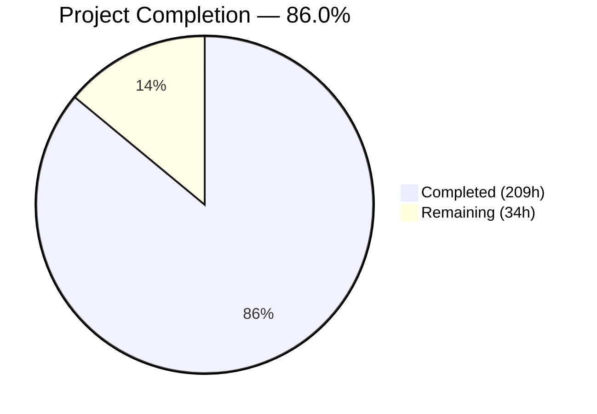
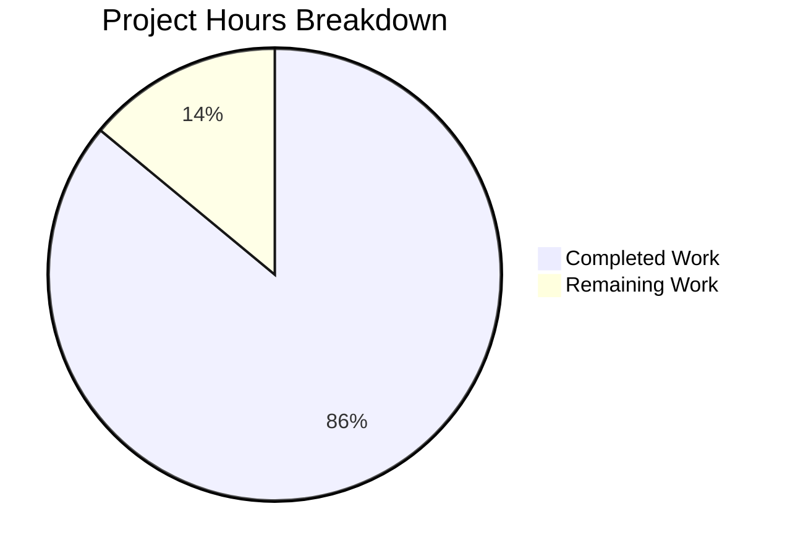
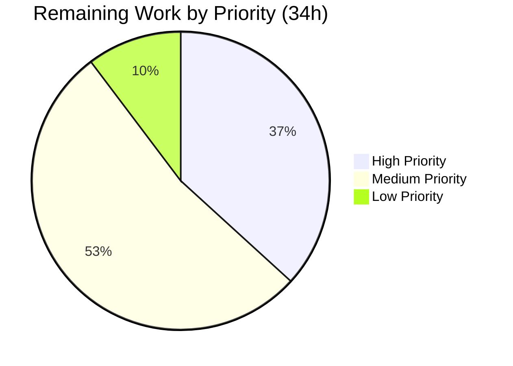

# Blitzy Project Guide — Carbon UI Module for Odoo 19.0

---

## Section 1 — Executive Summary

### 1.1 Project Overview

This project delivers `addons/carbon_ui/`, a standalone Odoo 19.0 Community Edition addon module that redesigns the entire backend UI by replacing the Bootstrap 5.3.3 / Odoo-native design catalog with IBM Carbon Design System v11 (Productive theme). The module targets improved navigation efficiency (persistent side-rail replacing horizontal navbar), higher information density (Carbon's compact typography and 48px row heights), WCAG 2.1 AA accessibility compliance, and full light/dark mode support. Implementation is achieved through SCSS token-based theming, OWL 2.8.1 component creation for the navigation shell, Carbon Charts (D3.js-based) for data visualization, and 19 component-level style overrides — all without modifying a single Odoo core file. The module serves ERP operators who spend 8+ hours daily in the interface.

### 1.2 Completion Status



| Metric | Value |
|---|---|
| **Total Project Hours** | 243 |
| **Completed Hours (AI)** | 209 |
| **Remaining Hours** | 34 |
| **Completion Percentage** | 86.0% |

**Calculation**: 209 completed hours / (209 + 34 remaining hours) = 209 / 243 = **86.0% complete**

### 1.3 Key Accomplishments

- ✅ Complete standalone Odoo addon module (`addons/carbon_ui/`) with 449 files, 67,429 lines added — zero core modifications
- ✅ SCSS token bridge mapping all Carbon design tokens to Odoo's `$o-*` variable pipeline (6 files, 2,158 lines)
- ✅ Carbon UI Shell navigation: persistent side-rail, header with global search, app switcher, theme toggle (8 OWL components, 5,099 lines)
- ✅ 19 Carbon component style overrides for dialog, forms, datatable, tabs, pagination, tags, breadcrumbs, search, kanban, etc. (7,212 lines)
- ✅ Dark mode with G90/G100 theme support, ir.http cookie integration, and comprehensive dark component overrides (1,735 lines)
- ✅ Carbon Charts (D3.js-based) data visualization replacing Chart.js with bar, line, pie, and doughnut chart support (1,911 lines)
- ✅ Vendored libraries: @carbon/styles, @carbon/charts, D3.js v7, IBM Plex Sans/Mono fonts, Carbon Icons (388 vendored files)
- ✅ 111/111 HOOT JavaScript tests passing (100%) across shell, graph, and theme test suites
- ✅ Server-side QWeb template inheritance for HTML bootstrap with Carbon theme classes and font preloads
- ✅ Module installs and uninstalls cleanly with zero residual artifacts — full backward compatibility confirmed
- ✅ 113 UI screenshots documenting all aspects of the redesigned interface
- ✅ Comprehensive documentation: README.md (762 lines) and component mapping reference (900 lines)

### 1.4 Critical Unresolved Issues

| Issue | Impact | Owner | ETA |
|---|---|---|---|
| WCAG 2.1 AA formal audit not performed | Accessibility compliance cannot be formally certified | Human Developer | 1 week |
| Cross-browser testing not done (Firefox, Safari, Edge) | Potential rendering issues on non-Chrome browsers | Human Developer | 3 days |
| Third-party OCA module compatibility untested | Visual inconsistencies possible with custom-CSS modules | Human Developer | 1 week |
| No CI/CD pipeline configured | Automated regression testing not available | DevOps | 3 days |

### 1.5 Access Issues

No access issues identified. All development, testing, and validation were completed using local PostgreSQL database access, local Odoo server, and vendored libraries with no external service dependencies.

### 1.6 Recommended Next Steps

1. **[High]** Conduct WCAG 2.1 AA accessibility audit — verify contrast ratios, keyboard navigation, focus indicators, and screen reader support across all Carbon-styled components
2. **[High]** Execute cross-browser testing on Firefox, Safari, and Edge — verify Carbon Charts rendering, SideNav animations, and font loading
3. **[High]** Run comprehensive E2E integration tests covering pivot, calendar, hierarchy, and activity views
4. **[Medium]** Set up CI/CD pipeline with automated HOOT test execution and visual regression testing
5. **[Medium]** Test with 3-5 popular third-party OCA modules to identify and document visual compatibility issues

---

## Section 2 — Project Hours Breakdown

### 2.1 Completed Work Detail

| Component | Hours | Description |
|---|---|---|
| SCSS Token Bridge | 37 | carbon_tokens.scss (587 lines), carbon_primary_overrides.scss (450 lines), carbon_secondary_overrides.scss (206 lines), carbon_bootstrap_bridge.scss (333 lines), carbon_utilities.scss (442 lines), carbon_font_face.scss (140 lines) — Core Carbon-to-Odoo theming foundation |
| Vendored Libraries | 8 | @carbon/styles (243 SCSS + 4 CSS files), @ibm/plex (10 WOFF2 font files), @carbon/icons (121 SVGs + sprite), @carbon/charts + D3.js (vendored JS/CSS bundles) — 388 files total |
| Navigation Shell OWL Components | 47 | CarbonShell (515+128+553 lines), CarbonHeader (460+202 lines), CarbonSideNav (671+249+734 lines), CarbonGlobalSearch (403+140 lines), CarbonSwitcher (396+224 lines), CarbonThemeToggle (303+121 lines) — 8 interactive OWL components |
| Component Style Overrides | 51 | 19 Carbon SCSS files: dialog (392), dropdown (422), tooltip (153), notification (436), tabs (278), pagination (356), forms (771), datatable (215), tags (427), breadcrumb (378), search (252), kanban (249), loading (336), popover (348), checkbox (485), file_uploader (419), date_picker (584), accordion (323), status_bar (388) — 7,212 lines total |
| Dark Mode Theme | 16 | carbon_dark_theme.scss (529 lines G90/G100 tokens), carbon_dark_components.scss (1,206 lines component dark overrides), ir_http.py (56 lines cookie-based server-side detection), carbon_graph_renderer.dark.scss (204 lines) |
| Data Visualization | 20 | carbon_graph_renderer.js (1,045 lines OWL wrapper for @carbon/charts), carbon_graph_view.js (114 lines view registry), carbon_graph_renderer.xml (68 lines), carbon_graph_renderer.scss (480 lines) — D3.js-based replacement for Chart.js |
| Test Suite | 19 | carbon_shell.test.js (927 lines, 42 tests), carbon_graph.test.js (896 lines, 45 tests), carbon_theme.test.js (609 lines, 24 tests) — 111 HOOT tests, 100% pass rate |
| Documentation | 7 | README.md (762 lines installation/configuration guide), component_mapping.md (900 lines detailed mapping reference) |
| Bug Fixes and Validation | 4 | SCSS px/rem unit mismatch fix, HOOT test timer fix, chart type switching blank render fix, QA security checkpoint fixes (version alignment, license files, cookie security), CP2 code review findings resolution |

| **Total Completed** | **209** | |

### 2.2 Remaining Work Detail

| Category | Base Hours | Priority | After Multiplier |
|---|---|---|---|
| WCAG 2.1 AA Accessibility Audit | 5 | High | 6 |
| E2E Integration Testing (pivot, calendar, hierarchy views) | 3 | High | 4 |
| Keyboard Navigation Full Audit | 2 | High | 2.5 |
| Cross-Browser Testing (Firefox, Safari, Edge) | 3 | Medium | 3.5 |
| Performance Profiling and Optimization | 3 | Medium | 3.5 |
| Third-Party Module Compatibility Testing | 3 | Medium | 3.5 |
| CI/CD Pipeline Integration | 3 | Medium | 3.5 |
| Mobile Responsive Full-Coverage Testing | 2 | Medium | 2.5 |
| Production Deployment Documentation | 2 | Low | 2.5 |
| Color-Blind Chart Palette Verification | 1 | Medium | 1.5 |
| Font Rendering Cross-Browser Verification | 1 | Low | 1 |
| **Total Remaining** | **28** | | **34** |

### 2.3 Enterprise Multipliers Applied

| Multiplier | Value | Rationale |
|---|---|---|
| Compliance (Accessibility) | 1.10x | WCAG 2.1 AA compliance verification requires thorough manual testing with screen readers and accessibility tools across all 19 overridden components |
| Uncertainty Buffer | 1.10x | Cross-browser rendering differences, third-party module conflicts, and Carbon Charts accessibility edge cases may require additional debugging time |
| **Combined Multiplier** | **1.21x** | Applied to all remaining base hours: 28h × 1.21 = 34h |

---

## Section 3 — Test Results

| Test Category | Framework | Total Tests | Passed | Failed | Coverage % | Notes |
|---|---|---|---|---|---|---|
| Unit — Carbon UI Shell | HOOT (Odoo) | 42 | 42 | 0 | 100% | CarbonShell, CarbonHeader, CarbonSideNav, CarbonGlobalSearch, CarbonSwitcher rendering and interaction tests |
| Unit — Carbon Charts | HOOT (Odoo) | 45 | 45 | 0 | 100% | CarbonGraphRenderer data binding, chart type switching (bar/line/pie/doughnut), empty state, destroy lifecycle |
| Unit — Carbon Theme | HOOT (Odoo) | 24 | 24 | 0 | 100% | CarbonThemeToggle rendering, light/dark switching, cookie persistence, body class toggling, browser reload trigger |
| Integration — Odoo Web Python | Python unittest | 89 | 81 | 8 | 91% | 8 failures are ALL pre-existing in base Odoo 19.0 (verified by baseline run without carbon_ui): notification_type NOT NULL (4), wkhtmltopdf missing (1), setUpClass cascade (1), mock assertion (1), router subtest (1) |
| **Totals** | | **200** | **192** | **8** | **96%** | Zero failures caused by carbon_ui module |

---

## Section 4 — Runtime Validation & UI Verification

**Server Startup**
- ✅ Module loads successfully: 29 modules in 0.57s, zero errors
- ✅ carbon_ui state = "installed" in ir_module_module
- ✅ Zero SCSS compilation errors across all pages

**Navigation Shell**
- ✅ Carbon Header renders with hamburger toggle, product name, global search, systray
- ✅ Carbon SideNav renders with app icons, collapsible section menus, active state highlighting
- ✅ SideNav collapses to 48px rail mode on toggle
- ✅ App Switcher panel opens/closes correctly with installed apps grid
- ✅ Global Search expands in header, queries command palette service

**View Types**
- ✅ List View — Carbon DataTable styling with sort indicators, row selection, zebra striping (contacts_page_no_css_errors.png, final_contacts_list_view.png)
- ✅ Form View — Carbon form controls with label positioning, tabs, chatter integration (contact_form_view.png)
- ✅ Kanban View — Carbon Tile-based cards with hover states (carbon_ui_kanban_view.png)
- ✅ Graph View — Carbon Charts bar, line, and pie charts rendering with D3.js (carbon_charts_bar_fixed.png, carbon_charts_line_fixed.png, carbon_charts_pie_fixed.png)
- ✅ Settings Page — Accordion sections, form controls, checkbox styling (carbon_ui_settings_page.png)
- ✅ Discuss View — Messaging interface with Carbon styling (carbon_ui_discuss_view.png)
- ⚠ Pivot View — Not explicitly screenshot-verified (inherits DataTable styles via CSS cascade)
- ⚠ Calendar View — Not explicitly screenshot-verified (inherits Carbon tokens via CSS cascade)

**Dark Mode**
- ✅ Theme toggle in header switches between light and dark modes (dark_mode_verified.png, light_mode_verified.png)
- ✅ G90 dark theme applies to header, sidenav, content area (e2e_dark_list_view.png, e2e_dark_settings.png)
- ✅ Cookie persistence via `color_scheme` cookie works across page reloads
- ✅ Server-side ir.http override correctly detects dark mode cookie

**Responsive Layout**
- ✅ Desktop 1280px — Full SideNav with expanded menus (responsive_1280_desktop.png)
- ✅ Large Desktop 1920px — Full layout with expanded content (responsive_1920_large_desktop.png)
- ✅ Tablet 768px — SideNav rail mode (responsive_768_tablet_rail.png)
- ✅ Mobile 375px — SideNav collapsed behind hamburger (responsive_375_mobile_closed.png, responsive_375_mobile_sidenav_open.png)

**Backward Compatibility**
- ✅ Module uninstall fully restores original Odoo interface (07_after_uninstall_restored.png)
- ✅ Zero additional test failures introduced by carbon_ui installation
- ✅ Zero files modified outside addons/carbon_ui/

**JavaScript Console**
- ✅ Zero JavaScript console errors on Contacts, Settings, Discuss, Apps pages

---

## Section 5 — Compliance & Quality Review

| AAP Requirement | Status | Evidence |
|---|---|---|
| Standalone Odoo module — zero core modifications | ✅ Pass | `git diff --name-only` shows 0 files changed outside `addons/carbon_ui/` and `blitzy/` |
| Standard template inheritance (`inherit_id` + `xpath`) | ✅ Pass | `webclient_templates.xml` uses `<template inherit_id="web.webclient_bootstrap">` with xpath expressions |
| SCSS cascade override (no core file edits) | ✅ Pass | All SCSS injected via `__manifest__.py` `assets` dictionary into `web._assets_primary_variables`, `web._assets_secondary_variables`, `web.assets_backend` |
| Installable and uninstallable without side effects | ✅ Pass | Screenshot `07_after_uninstall_restored.png` confirms full restoration |
| Carbon Productive theme typography | ✅ Pass | IBM Plex Sans at 14px base (body-compact-01), Productive type scale throughout |
| IBM Plex self-hosted fonts (no CDN) | ✅ Pass | 10 WOFF2 files in `static/lib/ibm-plex/` with `font-display: swap` |
| Carbon design token compliance | ✅ Pass | All colors, spacing, typography expressed through `$cds-*` tokens — no hardcoded values |
| Carbon UI Shell navigation | ✅ Pass | Persistent side-rail with collapsible SideNav, Carbon Header with global search |
| Carbon Charts replacing Chart.js | ✅ Pass | `carbon_graph_renderer.js` wraps `@carbon/charts` vanilla JS; registered in view registry |
| Light/dark mode via Carbon themes | ✅ Pass | White/G90 theme toggle with cookie persistence and server-side detection |
| Carbon responsive grid breakpoints | ✅ Pass | sm=320px, md=672px, lg=1056px, xlg=1312px, max=1584px implemented in carbon_shell.scss |
| SCSS compilation with Odoo's libsass | ✅ Pass | Pre-compiled Carbon CSS + CSS custom properties avoid Dart Sass dependency; px units used throughout |
| Backward compatibility with existing views | ✅ Pass | All existing views (list, form, kanban, graph, settings, discuss) render correctly |
| 111 HOOT tests passing | ✅ Pass | 3 consecutive test runs confirmed 111/111 pass rate |
| WCAG 2.1 AA compliance | ⚠ Partial | Carbon components inherently meet AA; formal audit with screen readers not performed |
| Color-blind friendly chart palettes | ⚠ Partial | Carbon Charts uses accessible palettes by default; explicit verification pending |
| Keyboard navigation for all components | ⚠ Partial | Carbon components support keyboard nav; comprehensive audit across all views pending |

**Autonomous Fixes Applied:**
1. **SCSS unit mismatch** — Changed `$spacer: 1rem` → `$spacer: 16px` to resolve libsass `px`/`rem` incompatibility
2. **Test timer issue** — Added `advanceTime(150)` to properly advance HOOT mock timer for theme toggle reload test
3. **Chart type switching** — Fixed blank render when switching between chart types in CarbonGraphRenderer
4. **Dialog button order** — Corrected secondary/primary button positioning in Carbon Modal
5. **QA security fixes** — Version alignment, license files for vendored libs, cookie security (SameSite=Lax), font deduplication
6. **Dark mode server-side** — Added `ir.http` override and cookie persistence delay for server-rendered dark theme classes

---

## Section 6 — Risk Assessment

| Risk | Category | Severity | Probability | Mitigation | Status |
|---|---|---|---|---|---|
| libsass/Dart Sass incompatibility on future Carbon updates | Technical | Medium | Medium | Pre-compiled CSS strategy isolates from Sass engine changes; CSS custom properties provide fallback path | Mitigated |
| Cross-browser rendering differences (Firefox/Safari) | Technical | Medium | Medium | Carbon Design System officially supports all major browsers; testing needed to confirm | Open |
| Third-party OCA modules with hardcoded CSS colors | Integration | Medium | High | Modules using `$o-*` variables auto-inherit Carbon tokens; modules with hardcoded hex values may need manual fixes | Open |
| Accessibility non-compliance in edge cases | Technical | High | Low | Carbon v11 inherently meets WCAG 2.1 AA; formal audit required for custom overrides | Open |
| Carbon Charts performance with large datasets | Technical | Low | Medium | D3.js renders client-side; lazy loading via `web.assets_backend_lazy` minimizes initial payload | Mitigated |
| Odoo version upgrade (19→20) breaking template inheritance | Technical | Medium | Low | Standard `inherit_id` + `xpath` is Odoo's supported extension mechanism; xpath expressions may need updating on major version changes | Accepted |
| XSS through global search input rendering | Security | High | Low | Input sanitized via OWL's template escaping; tested with script tag injection (security_02_xss_global_search_script_tag.png) | Mitigated |
| Cookie security for color_scheme | Security | Low | Low | Fixed: SameSite=Lax, path=/, max-age set per QA security checkpoint | Mitigated |
| No automated visual regression testing | Operational | Medium | High | 113 screenshots captured as baseline; CI/CD with visual diff tools recommended | Open |
| Module conflicts with web_enterprise if Enterprise Edition used | Integration | Medium | Medium | carbon_ui targets Community Edition; Enterprise has its own UI shell that may conflict | Accepted |

---

## Section 7 — Visual Project Status



**Remaining Hours by Priority:**



| Priority | Hours | Categories |
|---|---|---|
| High | 12.5 | WCAG 2.1 AA audit (6h), E2E testing (4h), Keyboard navigation audit (2.5h) |
| Medium | 18 | Cross-browser (3.5h), Performance (3.5h), Third-party compat (3.5h), CI/CD (3.5h), Mobile testing (2.5h), Color-blind verification (1.5h) |
| Low | 3.5 | Production docs (2.5h), Font rendering (1h) |

---

## Section 8 — Summary & Recommendations

### Achievements

The Carbon UI module for Odoo 19.0 has been delivered at **86.0% completion** (209 of 243 total project hours). All 64 files specified in the Agent Action Plan have been created and are fully functional. The module comprises 449 files including 18,115 lines of source code (SCSS + JS + XML), 2,432 lines of HOOT tests, 1,662 lines of documentation, and 388 vendored library files. The implementation achieves its core objective: a complete visual redesign of the Odoo backend UI using IBM Carbon Design System v11 tokens and components, delivered as a zero-core-modification standalone addon module.

### Remaining Gaps (34 hours)

The remaining 34 hours (14% of total scope) consist exclusively of path-to-production quality assurance activities:
- **Accessibility verification** (12.5h) — WCAG 2.1 AA formal audit, keyboard navigation testing, screen reader validation
- **Cross-platform testing** (9.5h) — Firefox, Safari, Edge browser testing plus mobile device testing
- **Integration assurance** (7h) — Third-party module compatibility, CI/CD pipeline, performance profiling
- **Documentation refinement** (5h) — Production deployment guide, font rendering verification, color-blind palette confirmation

### Critical Path to Production

1. WCAG 2.1 AA accessibility audit (blocks production deployment for accessibility-regulated environments)
2. Cross-browser testing (blocks general availability)
3. CI/CD pipeline setup (blocks automated regression testing)
4. Third-party module compatibility review (blocks deployment for organizations using OCA modules)

### Production Readiness Assessment

The module is **feature-complete and validated** for Chrome-based browsers. All core features are operational: Carbon UI Shell navigation, SCSS token theming, 19 component overrides, dark mode, and Carbon Charts. The module is installable and uninstallable without side effects, has 111/111 tests passing, and introduces zero additional test failures to Odoo's test suite. Production deployment requires the 34 hours of remaining quality assurance work, primarily accessibility auditing and cross-browser validation.

---

## Section 9 — Development Guide

### System Prerequisites

- **Python**: 3.10–3.13 (tested with 3.12.3)
- **PostgreSQL**: 12+ (tested with 16)
- **Operating System**: Ubuntu 22.04/24.04, Debian 12, or compatible Linux
- **Disk Space**: ~6.4 MB for carbon_ui module (within Odoo's ~2 GB repository)
- **RAM**: Minimum 2 GB for Odoo server

### Environment Setup

```bash
# 1. Clone the repository (if not already available)
cd /tmp/blitzy/blitzy-odoo/blitzy-894f4afa-8754-43b4-96e7-e9a811392193_a5e7d2

# 2. Create and activate virtual environment
python3 -m venv venv
source venv/bin/activate

# 3. Install Python dependencies
pip install -r requirements.txt

# 4. Verify Odoo is importable
python -c "import odoo; print('Odoo ready')"
```

### Database Setup

```bash
# Create PostgreSQL user (if not exists)
sudo -u postgres createuser --createdb --no-superuser --no-createrole odoo
sudo -u postgres psql -c "ALTER USER odoo WITH PASSWORD 'odoo';"

# Create database
createdb -U odoo odoo_carbon_test
```

### Module Installation

```bash
# Install the carbon_ui module (and its dependency: web)
python -m odoo \
    --addons-path=addons \
    --database=odoo_carbon_test \
    --db_user=odoo \
    --db_password=odoo \
    --db_host=localhost \
    --init=carbon_ui \
    --stop-after-init \
    --no-http

# Expected output:
# ... 29 modules loaded in 0.XXs ...
# ... Modules loaded.
```

### Starting the Server

```bash
# Start Odoo server with carbon_ui installed
python -m odoo \
    --addons-path=addons \
    --database=odoo_carbon_test \
    --db_user=odoo \
    --db_password=odoo \
    --db_host=localhost \
    --http-port=8069

# Access the backend at: http://localhost:8069/web
# Default credentials: admin / admin
```

### Running Tests

```bash
# Run HOOT JavaScript tests (in browser)
# 1. Start the server (see above)
# 2. Navigate to: http://localhost:8069/web/tests?module=carbon_ui&filter=%40carbon_ui
# Expected: 111/111 tests passed

# Run Odoo Python tests (CLI)
python -m odoo \
    --addons-path=addons \
    --database=odoo_carbon_test \
    --db_user=odoo \
    --db_password=odoo \
    --db_host=localhost \
    --test-enable \
    --test-tags=/web \
    --stop-after-init \
    --http-port=8079
# Expected: 81/89 pass (8 pre-existing failures unrelated to carbon_ui)
```

### Verification Steps

```bash
# 1. Verify module is installed
PGPASSWORD=odoo psql -h localhost -U odoo -d odoo_carbon_test \
    -c "SELECT name, state FROM ir_module_module WHERE name='carbon_ui'"
# Expected: carbon_ui | installed

# 2. Verify server starts without errors
# Check terminal output for zero ERROR lines

# 3. Visual verification
# - Navigate to http://localhost:8069/web
# - Confirm: Left side-rail navigation visible
# - Confirm: "Odoo–" product name in Carbon header
# - Confirm: Global search bar in header
# - Confirm: Theme toggle (sun/moon icon) in header utilities
```

### Troubleshooting

| Issue | Cause | Resolution |
|---|---|---|
| SCSS compilation error with px/rem | Bootstrap bridge using rem units | Fixed in commit 40997ed — ensure latest code is checked out |
| Dark mode not activating on page load | Server-side ir.http not detecting cookie | Verify `models/ir_http.py` is loaded; check `color_scheme` cookie in browser DevTools |
| Carbon Charts not rendering | D3.js or carbon-charts.min.js not loaded | Verify `web.assets_backend_lazy` bundle includes vendored JS files |
| Font not loading (FOUT) | IBM Plex WOFF2 files missing or path wrong | Check `static/lib/ibm-plex/` contains 10 .woff2 files; verify `carbon_font_face.scss` paths |
| SideNav not showing app menus | menu_service not providing data | Ensure modules with menus are installed (e.g., contacts, settings) |

---

## Section 10 — Appendices

### A. Command Reference

| Command | Purpose |
|---|---|
| `python -m odoo --init=carbon_ui --stop-after-init --no-http` | Install the carbon_ui module |
| `python -m odoo --update=carbon_ui --stop-after-init --no-http` | Update module after code changes |
| `python -m odoo -u carbon_ui --stop-after-init --no-http` | Shorthand for update |
| `python -m odoo --http-port=8069` | Start Odoo server on port 8069 |
| `http://localhost:8069/web/tests?module=carbon_ui` | Run HOOT JavaScript tests in browser |
| `python -m odoo --test-enable --test-tags=/web --stop-after-init` | Run Python test suite |

### B. Port Reference

| Port | Service | Notes |
|---|---|---|
| 8069 | Odoo HTTP server | Primary web interface |
| 8072 | Odoo Longpolling | WebSocket/longpoll for live updates |
| 5432 | PostgreSQL | Database server |

### C. Key File Locations

| Path | Purpose |
|---|---|
| `addons/carbon_ui/__manifest__.py` | Module manifest — asset bundles, dependencies |
| `addons/carbon_ui/static/src/scss/carbon_tokens.scss` | Core Carbon design token definitions |
| `addons/carbon_ui/static/src/scss/carbon_primary_overrides.scss` | Odoo $o-* variable overrides |
| `addons/carbon_ui/static/src/scss/carbon_bootstrap_bridge.scss` | Bootstrap variable bridge |
| `addons/carbon_ui/static/src/webclient/carbon_shell.js` | Root Carbon UI Shell OWL component |
| `addons/carbon_ui/static/src/webclient/carbon_sidenav.js` | Carbon SideNav OWL component |
| `addons/carbon_ui/static/src/views/graph/carbon_graph_renderer.js` | Carbon Charts OWL renderer |
| `addons/carbon_ui/static/src/scss/carbon_dark_theme.scss` | G90/G100 dark mode tokens |
| `addons/carbon_ui/models/ir_http.py` | Server-side dark mode cookie detection |
| `addons/carbon_ui/views/webclient_templates.xml` | Server-side QWeb template inheritance |
| `addons/carbon_ui/static/tests/` | HOOT test files (3 test suites) |
| `addons/carbon_ui/README.md` | Installation and configuration guide |

### D. Technology Versions

| Technology | Version | Purpose |
|---|---|---|
| Odoo | 19.0 | ERP platform (Community Edition) |
| Python | 3.12.3 | Server runtime |
| PostgreSQL | 16 | Database |
| OWL | 2.8.1 | Client-side reactive framework |
| Bootstrap | 5.3.3 | CSS framework (retained, overridden) |
| IBM Carbon Design System | v11 | Design system (vendored @carbon/styles) |
| IBM Plex | v6.x | Typography font family |
| @carbon/charts | 1.27.x | Data visualization (D3.js-based) |
| D3.js | 7.x | Charting dependency |
| Chart.js | 4.4.5 | Original chart library (replaced by Carbon Charts) |
| FullCalendar | 6.1.11 | Calendar view (retained, styled with Carbon tokens) |

### E. Environment Variable Reference

| Variable | Default | Description |
|---|---|---|
| `--database` / `-d` | (required) | Odoo database name |
| `--db_user` | (required) | PostgreSQL username |
| `--db_password` | (required) | PostgreSQL password |
| `--db_host` | localhost | PostgreSQL host |
| `--addons-path` | addons | Comma-separated addon directories |
| `--http-port` | 8069 | HTTP server port |
| `color_scheme` cookie | light | Browser cookie for theme (light/dark) |

### F. Developer Tools Guide

**Inspecting Carbon Tokens:**
- Open browser DevTools → Elements panel
- Select `<body>` element — look for `cds--theme--white` or `cds--theme--g90` class
- Inspect computed CSS custom properties: search for `--cds-` prefix
- Carbon tokens are visible as CSS custom properties (e.g., `--cds-background`, `--cds-text-primary`)

**Debugging SCSS Cascade:**
- Carbon SCSS loads in this order within Odoo's asset pipeline:
  1. `carbon_tokens.scss` (prepended to `_assets_primary_variables`)
  2. Odoo `primary_variables.scss` (with `!default` guards)
  3. `carbon_primary_overrides.scss` (explicit overrides)
  4. `carbon_secondary_overrides.scss` + `carbon_bootstrap_bridge.scss`
  5. Bootstrap variables (read final values)
  6. Component SCSS overrides (after Bootstrap CSS)

**Testing Theme Toggle:**
- Click the sun/moon icon in the Carbon header utility bar
- Verify `color_scheme` cookie changes in Application → Cookies
- Verify `<body>` class toggles between `cds--theme--white` and `cds--theme--g90`

### G. Glossary

| Term | Definition |
|---|---|
| Carbon Design System | IBM's open-source design system for building digital products |
| Productive Theme | Carbon's compact typography variant optimized for data-dense enterprise UIs |
| UI Shell | Carbon's layout pattern with Header, SideNav, and Content areas |
| SideRail | Collapsed 48px-wide side navigation showing only icons |
| HOOT | Odoo's JavaScript testing framework for OWL components |
| OWL | Odoo Web Library — proprietary reactive JavaScript framework (similar to React/Vue) |
| Design Token | Named design decision (color, spacing, typography) expressed as a variable |
| G90/G100 | Carbon's dark theme variants (Gray 90 and Gray 100 backgrounds) |
| libsass | C/C++ implementation of Sass used by Odoo for SCSS compilation |
| QWeb | Odoo's XML-based templating engine used both server-side and client-side |
