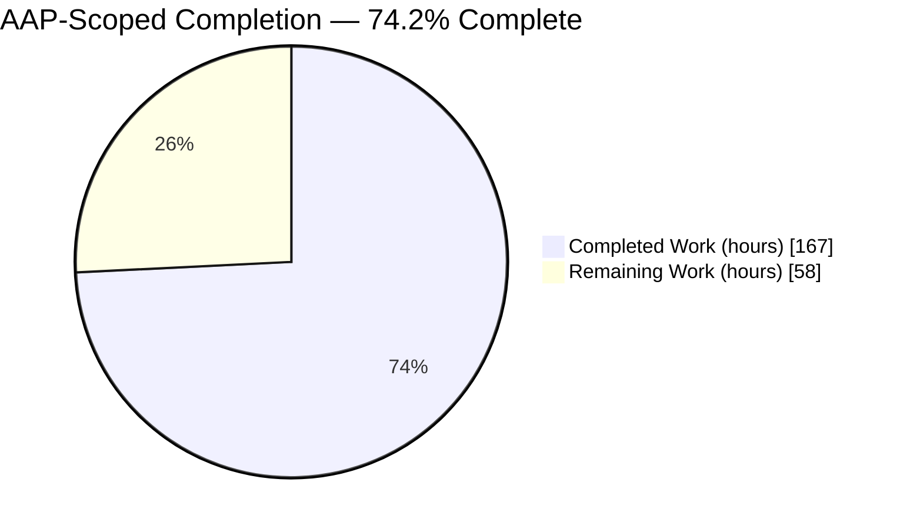
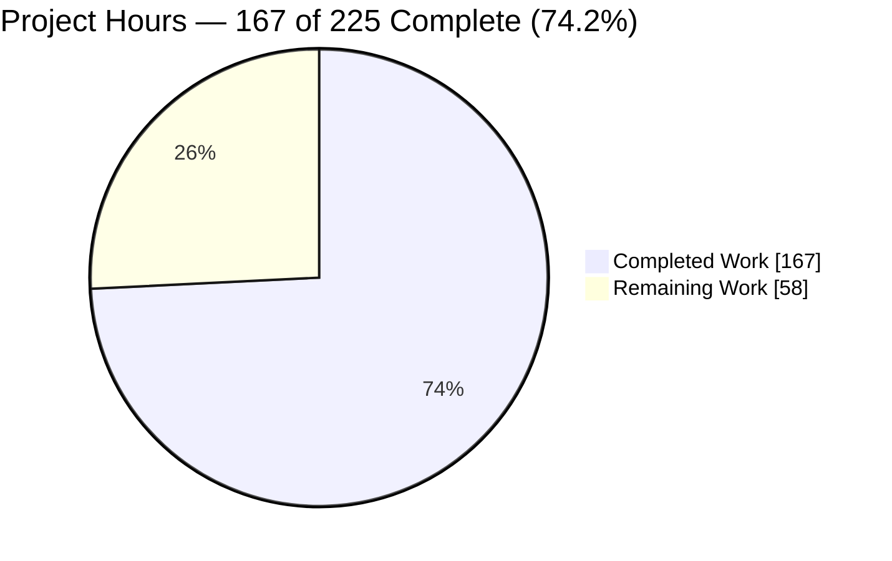
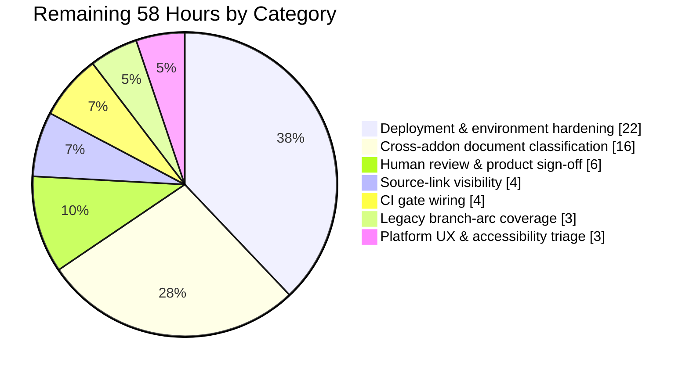
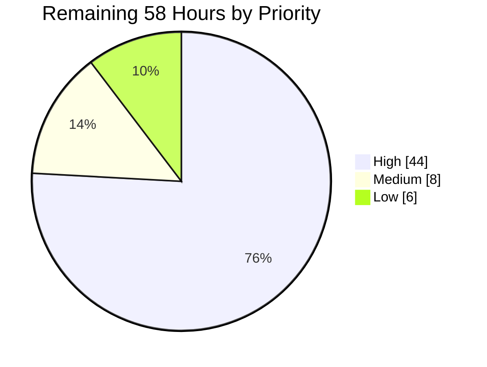
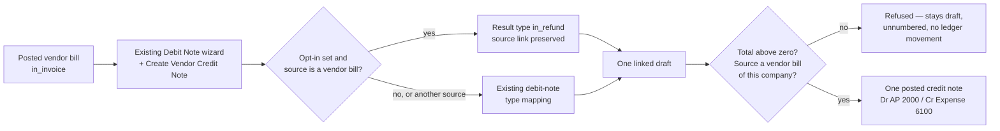

# 1. Executive Summary

## 1.1 Project Overview

Accounts Payable clerks can now credit back a posted vendor bill from inside the Debit Note wizard they already use. Ticking **Create Vendor Credit Note** produces exactly one linked vendor credit note (`in_refund`), posted in the bill's own journal and currency, debiting Accounts Payable 2000 and crediting Expense 6100 in balance. A total that is not above zero is refused before it can reach the ledger. The opt-in defaults off, so every existing debit-note path is unchanged. All of it is confined to the `account_debit_note` module.

## 1.2 Completion Status



Completed **Dark Blue `#5B39F3`**, Remaining **White `#FFFFFF`**.

| Metric | Value |
|---|---|
| **Total Hours** | **225** |
| Completed Hours (AI + Manual) | 167 (167 AI + 0 Manual) |
| Remaining Hours | 58 |
| **Percent Complete** | **74.2%** |

`167 / (167 + 58) × 100 = 74.2%`. The denominator is the planned feature scope plus the path-to-production work to deploy it. Deferred accounting scenarios — allocation, tax reversal, cash refunds, lock dates — were out of scope by plan.

## 1.3 Key Accomplishments

- ✅ One posted bill yields exactly one linked, balanced credit note in the bill's journal and currency.
- ✅ Accounts Payable 2000 debited, Expense 6100 credited, debits equal to credits.
- ✅ A zero or negative total is refused on every road into the posted state.
- ✅ The source link is held to a vendor bill of the same company; allocation never triggers.
- ✅ Amounts post at the currency's own increment: 10.025 becomes 10.05 at 0.05.
- ✅ Linked and unlinked vendor refunds share one numbering pool without collision.
- ✅ With the opt-in off, every pre-existing debit-note path behaves as before.
- ✅ 14 tests pass; install, upgrade and static analysis are clean and unchanged from baseline.

## 1.4 Critical Unresolved Issues

**34 of the 50** items raised across verification remain open, none rooted in the five delivered files. The groups below carry exact counts and sum to 34.

| Issue | Impact | Owner | ETA |
|---|---|---|---|
| Deployment and environment security posture (**13** items) — the application's database role holds superuser rights with a reachable command-execution primitive; RPC error envelopes carry tracebacks and absolute paths; response headers, cookie flags, credential handling and file permissions are all at development defaults | Blocks safe exposure of this application outside a local host. Not a property of the feature itself | DevOps / Platform | Before any deployment |
| Stock-platform UX and accessibility (**16** items) — one HIGH: the notes field on a *posted* document accepts keystrokes and swallows Tab, marking a posted accounting document dirty. The rest are dialog and tab ARIA, focus and statusbar contrast, mobile clipping and touch-target sizes, list truncation | Keyboard and screen-reader users are impeded on the screens a clerk uses. Reproduces identically on untouched stock screens | Platform team | Backlog |
| Cross-addon document classification (**2** items) — a vendor credit note carries the source link that EDI and localisation modules read as a debit-note signal, so it exports as a UBL `<DebitNote>`, and the module's three "Debit Notes" list filters return credit notes too | Downstream EDI recipients receive the wrong document type. Open by plan direction, deferred to its own ticket | Accounting / EDI | Next sprint |
| Source link not shown on purchase documents (**1** item) — `debit_origin_id` is anchored after core's `invoice_origin`, which sits inside a customer-only group, so it never renders on a bill or a credit note | Navigational only; the link is reachable through the stat button and the chatter. Affects the pre-existing debit-note path identically | Accounting | Next sprint |
| Accounting scope the plan deferred (**2** items) — nothing caps how much of a bill can be credited, and no lock-date rule applies to a credit note's date | Both are separate story scenarios, not gaps in what was delivered | Product / Accounting | Per roadmap |

## 1.5 Access Issues

No access issue blocked validation; every gate ran to completion. Two environment conditions shape how this project is run.

| System / Resource | Type of Access | Issue Description | Resolution Status | Owner |
|---|---|---|---|---|
| PostgreSQL 16.15 at `127.0.0.1:5432` | Database role | The `odoo` role the application connects as holds superuser rights (`pg_user.usesuper = t`), wider than the application needs | Open — must be narrowed before deployment; harmless for local validation | DevOps |
| Odoo HTTP listener | Port allocation | `--test-enable` binds an HTTP port even under `--no-http`, so two test runs on one host collide and the loser exits 0 having executed nothing | Mitigated — every run is given its own `--http-port`/`--gevent-port` pair | Build / CI |

## 1.6 Recommended Next Steps

1. **[High]** Harden the deployment: least-privilege database role, credentials in `odoo.conf`, a production log level, and a reverse proxy supplying the missing headers and cookie flags. *(22h)*
2. **[High]** Open the cross-addon ticket the plan calls for: classify document type by `move_type`, not by the presence of a source link. *(16h)*
3. **[High]** Sign off the accounting behaviour and settle the three accepted compromises. *(6h)*
4. **[Medium]** Wire the gate into CI so it asserts the expected test names and count, with a port per job. *(4h)*
5. **[Medium]** Surface the source link on purchase-side documents. *(4h)*

# 2. Project Hours Breakdown

## 2.1 Completed Work Detail

| Component | Hours | Description |
|---|---|---|
| Vendor-credit-note opt-in, direction branch and wizard form | 22 | The `create_vendor_credit_note` Boolean (default off) and the ordered result-type branch in `_prepare_default_values`; the single added field line in the wizard form; the wizard reading its source type off the selected documents rather than the list it was opened from; the three source preconditions bound to both the form and the direct-call route; requested source ids resolved before the relation row is written; the Reason folded free of control and bidirectional characters before it reaches the reference (`addons/account_debit_note/wizard/account_debit_note.py`) |
| Posting rule, document constraints and refund sequence gate | 28 | The positive-total rule and the `_post` override that runs it before core posts or numbers anything, with the right to post read first on core's own terms; the rule restated as a constraint so it holds on every road into the posted state; a second constraint holding the source link to a vendor bill of the credit note's own company without disclosing anything about a refused source; the refusal quoting the actual total; the refund sequence pool gate (`addons/account_debit_note/models/account_move.py`) |
| Acceptance and regression suite | 48 | 2,445 lines, 12 test methods and 23 named sub-cases on `AccountTestInvoicingCommon`: the fixture (archived-safe atomic accounts 2000 and 6100, the vendor, the three-line story bill, an alternate currency at rounding 0.05, wizard and line-snapshot helpers), the six scenario tests the plan names, and six further tests pinning behaviour that verification proved reachable (`addons/account_debit_note/tests/test_vcn_001.py`) |
| Static code review cycles across the delivery | 14 | Line-by-line review of all five files through backend, database, frontend, tests, completeness, comments, cross-layer seam, security and whole-delivery lenses, with every claim cross-referenced against core's own accounting, currency, sequence and loader contracts |
| Runtime accounting, test-harness and coverage verification | 16 | The accounting behaviour driven end to end over the ORM across nine feature groups; the suite executed repeatedly on fresh and upgraded databases to prove it is order-independent and not flaky; branch coverage measured, with every new branch exercised; test efficacy proven by mutation so no assertion is vacuous |
| Runtime security verification | 10 | The posting rule, the source link and the wizard's inputs attacked over the same JSON-RPC surface the web client uses — direct state writes, re-pointed links, cross-company sources, hostile id shapes, control characters, injection and oversized input — as each of the roles concerned, with outcomes read back from the database rather than inferred |
| Runtime UI, UX and responsive verification | 10 | The opt-in's visibility proven present for a vendor bill and absent from the DOM for every other source type across form, list and kanban entry routes, at desktop, tablet and mobile widths; label, help text, placement and default state measured against the specification and against the neighbouring stock control |
| End-to-end clerk journey and core regression floor | 8 | The full clerk journey driven in a real browser as an ordinary Invoicing user — create, post, refuse a zero total, run the default-off path — plus the 962-test core accounting suite to confirm the posting override and sequence gate disturb nothing, and core's own Credit Note reversal exercised through the new rules |
| Environment provisioning and gate execution | 11 | Python 3.13.7 and PostgreSQL 16.15 provisioned, the virtual environment built from the exact pins with the pinned PDF backend verified, and the install, upgrade, compile, lint and test gates executed and reproduced |
| **Total** | **167** | |

## 2.2 Remaining Work Detail

| Category | Hours | Priority |
|---|---|---|
| Deployment and environment security hardening — least-privilege database role; credentials in `odoo.conf`; production log level suppressing RPC debug payloads; reverse-proxy security headers; cookie `Secure` and `SameSite`; database manager, signup and database listing closed; data-directory, filestore and log permissions; ledger ACL aligned with its view gate; framework date-validation message | 22 | High |
| Cross-addon document-type disambiguation — the UBL exporter, roughly fifteen localisation consumers that read the source link alone as a debit-note signal, the module's three "Debit Notes" list-filter domains, and regression tests for document-type classification | 16 | High |
| Human review and product sign-off — accounting sign-off against the story, plus decisions on the "Debit Note" wording carried on a credit note, the two-line field label, and the sequence prefix now taken by non-invoice entries in sale and purchase journals | 6 | High |
| Source-link visibility on purchase documents — move or duplicate "Original Invoice Debited" into a group visible for purchase move types and verify it renders on a bill, a credit note and the existing customer-side debit note | 4 | Medium |
| CI gate wiring — assert the expected test names and post-test count so a zero-selection run cannot pass as green; give every job its own HTTP and gevent port; run the core accounting floor on a fresh database | 4 | Medium |
| Coverage for the four pre-existing branch arcs in the two touched files — the three wizard precondition rejections and the copy-message fallback | 3 | Low |
| Platform UX and accessibility triage — raise the keyboard and focus defect that lets a posted document be dirtied, and triage the remaining fifteen items into the platform backlog | 3 | Low |
| **Total** | **58** | |

## 2.3 Hours Reconciliation

| Check | Expected | Actual | Status |
|---|---|---|---|
| Section 2.1 completed rows sum | 167 | 167 | ✅ |
| Section 2.2 remaining rows sum | 58 | 58 | ✅ |
| 2.1 + 2.2 = Total Project Hours (§1.2) | 225 | 225 | ✅ |
| Remaining hours identical in §1.2, §2.2 and §7 | 58 | 58 | ✅ |
| Completion percentage `167 / 225` | 74.2% | 74.2% | ✅ |

**Estimation confidence.** *High* for the delivered work — the scope was a fixed five-file surface with measured line counts, and every gate outcome was observed directly. *Medium* for deployment hardening, where the item list is exact but the effort depends on the target topology and reverse proxy. *Medium* for the cross-addon disambiguation, where the consumers are enumerated but each needs its own assessment.

# 3. Test Results

The whole module suite was executed on a database built from scratch and reported **14 post-tests, 0 failed, 0 error(s) of 14 tests**. Every row below is part of that single run. The suite is tagged `post_install, -at_install` and runs on `AccountTestInvoicingCommon`.

```bash
./venv/bin/python odoo-bin --addons-path=addons,odoo/addons \
  --db_host=127.0.0.1 --db_port=5432 --db_user=odoo --db_password=odoo \
  -d odoo_test -i account_debit_note --test-enable \
  --test-tags=/account_debit_note --stop-after-init --no-http \
  --http-port=8069 --gevent-port=8072 --data-dir=.odoo/data --log-level=test
```

| Area / Category | Framework | Tests | Passed | Failed | Coverage | What This Proves |
|---|---|---|---|---|---|---|
| Creation, direction and balance | Odoo / `AccountTestInvoicingCommon` | 1 | 1 | 0 | wizard 93% | One posted bill yields exactly one linked `in_refund` that debits Accounts Payable 2000 and credits Expense 6100 in balance, in the bill's journal and currency, leaving the bill's own lines untouched |
| Positive-total rule | Odoo / `AccountTestInvoicingCommon` | 3 | 3 | 0 | models 88% | A zero or negative credit note cannot reach the ledger by any route — the Confirm button, a direct write of the posted state, or a write that also names a number — and is left draft, unnumbered and without posted lines |
| Currency, rounding and refund numbering | Odoo / `AccountTestInvoicingCommon` | 2 | 2 | 0 | models 88% | Amounts post in the bill's currency at its own increment (10.025 becomes 10.05 at 0.05), and linked and unlinked vendor refunds in one journal and period take distinct names from one continuous pool |
| Opt-in exposure and source-type resolution | Odoo / `AccountTestInvoicingCommon` | 1 | 1 | 0 | wizard 93% | The wizard decides what it offers from the documents actually selected, so the opt-in is never held out on a document it cannot act on nor withheld from a genuine vendor bill, whichever screen the clerk started from |
| Source-link integrity and authorization ordering | Odoo / `AccountTestInvoicingCommon` | 2 | 2 | 0 | models 88% | A credit note's source can only ever be a vendor bill of its own company, and a refusal discloses nothing about the document it names; a user without the right to post is answered about that right, not handed a business message carrying a document and its total |
| Wizard input handling and preconditions | Odoo / `AccountTestInvoicingCommon` | 2 | 2 | 0 | wizard 93% | Control and bidirectional characters never reach a document reference or a refusal message, and the wizard's stated preconditions bind a caller that never opens the form |
| Backward compatibility of shipped paths | Odoo / `AccountTestInvoicingCommon` | 3 | 3 | 0 | wizard 93% | With the opt-in off a vendor bill still yields an `in_invoice` debit note, and the customer-invoice and credit-note-correction paths are unchanged — the two original module tests pass against a byte-identical file |
| **Total** | | **14** | **14** | **0** | module 98% | |

Branch coverage of the two production files is 88% and 93%, and 98% across the module. **Every branch the feature introduced is exercised**; the uncovered arcs are all pre-existing code the change does not touch. That clears the 80% new-branch target by a wide margin. The suite's assertions were shown to be non-vacuous by mutation: removing a rule makes the tests that cover it fail.

### Not Covered

These capabilities were delivered and verified, but no automated test exercises them. A human should confirm each before release:

- **The wizard checkbox's rendered visibility.** The tests read the form's arch and its modifiers, which proves the predicate resolves; they do not render it. Open the Debit Note wizard from a posted vendor bill (the opt-in should appear, unticked, directly below Copy Lines) and from a customer invoice, a vendor credit note and a customer credit note (it should be absent). Confirmed manually at desktop, tablet and mobile widths, but not pinned by a test.
- **Field labels and help text.** No test in this repository asserts field help anywhere, and none should — the strings were verified by reading the metadata the client is served. A wording change would not fail the suite.
- **Translation extraction.** The new refusal messages and field metadata are marked for translation but no test asserts they extract, because the catalogues are not hand-edited. Run the normal extraction pipeline before shipping a translated build.
- **Mobile and accessibility behaviour.** Exercised manually only. There is no tour or browser test in the suite, so responsive layout and keyboard behaviour are unprotected against regression.
- **Four pre-existing branch arcs** in the two touched files — the wizard's three precondition rejections and the copy-message fallback — remain uncovered, which is the whole reason whole-file coverage reads 88% and 93% rather than near 100%. Budgeted at 3h in Section 2.2.
- **One default that cannot be observed.** The wizard also drops a seeded default for the source company's country code alongside the two it must drop. No action seeds that value and nothing in this form reads it, so no test can detect it; its two siblings are covered.

# 4. Runtime Validation & UI Verification

Beyond the automated suite, the feature was driven at runtime — in a real browser as an ordinary Invoicing-group clerk, and over the same JSON-RPC surface the web client uses — with every outcome read back from the database rather than inferred from a call's return value.

- ✅ **Module lifecycle** — Operational. A from-scratch install into a new database (49 modules) and an `-u account_debit_note` upgrade both complete with zero ERROR, WARNING, CRITICAL or Traceback lines. The transient Boolean is the only column added.
- ✅ **Application start-up and authentication** — Operational. The server comes up in a few seconds, `/web/login` returns HTTP 200, and an `admin` sign-in reaches the first authenticated screen with no console error.
- ✅ **The clerk's primary journey** — Operational. From a posted bill: open Debit Note, tick Copy Lines and the opt-in, set 2025-03-20 and a reason naming `CN-2024-0117`, keep the 4,200.00 line, create, then Confirm. Result: `RBILL/2025/03/0001`, `in_refund`, 4,200.00, Accounts Payable 2000 debited and Expense 6100 credited, USD, Purchases journal, source link set, no reversal link, bill unchanged at 12,450.00.
- ✅ **Opt-in exposure** — Operational. Present and unticked on a posted vendor bill from both the bill form and the Bills list; **absent from the DOM** — not merely hidden — on a customer invoice, a vendor credit note, a customer credit note and a mixed selection. Verified at 1440×900, 1024×768 and 390×844.
- ✅ **Zero and negative refusal** — Operational. Confirm raises an "Invalid Operation" dialog carrying the module's message verbatim and quoting the actual total; the record stays Draft, unnumbered, with no posted lines and no sequence position consumed. The dialog exposes no file path, exception class or traceback.
- ✅ **The rule as an invariant** — Operational. Writing the posted state directly over JSON-RPC, and writing it together with a document number, are both refused with the same message. Re-pointing the source link at a customer invoice, or at another company's document, is refused without disclosing anything about the document named — including for a row whose link was forced in past the ORM with raw SQL.
- ✅ **Authorization boundaries** — Operational. A read-only user and a write-capable user without the posting group both receive the platform's own access refusal, with neither the document reference nor its total in the message. A plain internal user calling the Debit Note action directly is refused, where the button had previously been the only protection.
- ✅ **Default-off compatibility** — Operational. Left unticked, the same wizard produces `DBILL/2025/03/0001` as a vendor bill debit note; a customer invoice yields `DINV/2025/00001`; and the `in_refund → in_invoice`, `out_refund → out_invoice` and same-type mappings are unchanged even with the opt-in forced on.
- ✅ **Core's own Credit Note flow** — Operational. Odoo's separate reversal wizard is untouched, offers no checkbox, and its reversal creates, posts and auto-reconciles straight through the new posting rules — carrying the reversal link with no source link, so the two mechanisms stay distinct. The wider 962-test core accounting suite shows only failures that pre-date this work and reproduce with the module uninstalled.
- ⚠ **Terminology and layout on the resulting document** — Partial. Everything functions, but the chatter message, the stat button and the wizard title still read "Debit Note" on a vendor credit note, the field label wraps onto two lines in the dialog's label column, and the source link does not render as a field on purchase-side documents. All three are recorded in Sections 5.2 and 6.

**Never exercised at runtime.** Nothing was driven under concurrent multi-user load, against a non-English locale, or with an EDI or localisation module installed — so the document-type classification described in Section 5.2 is a measured behaviour of the exporter, not an observation from a live localised deployment. No performance or load profile was taken; the feature copies one document per request and was not expected to need one.

# 5. Compliance & Quality Review

## 5.1 Compliance Matrix

Each row is the verified state of a planned deliverable as it stands now.

| # | Deliverable / Benchmark | Status | Progress | Evidence |
|---|---|---|---|---|
| 1 | One posted vendor bill → exactly one linked, posted `in_refund` | ✅ Pass | 100% | `wizard/account_debit_note.py:199` opt-in branch, `:215` source link; `test_vcn_001_01` counts every move before and after |
| 2 | Accounts Payable 2000 debited, Expense 6100 credited, in balance | ✅ Pass | 100% | Core's direction sign for `in_refund`; `test_vcn_001_01` asserts both lines by account code, amount and equal totals |
| 3 | Zero or negative total refused before posting | ✅ Pass | 100% | `models/account_move.py:78-112` rule, `:173-185` posting override, `:114-132` constraint; tests 02, 03, 08 |
| 4 | Architecture — extend the existing wizard, no parallel model, no core edit | ✅ Pass | 100% | `_prepare_default_values` extended and `move.copy(default=...)` retained; zero diff in `addons/account` |
| 5 | Source link preserved; reversal link never set | ✅ Pass | 100% | `models/account_move.py:43-46`; `reversed_entry_id` appears nowhere in production code and is asserted empty in the suite |
| 6 | Bill currency kept, HALF-UP rounding at the currency's increment | ✅ Pass | 100% | `models/account_move.py:104` uses the currency's own comparison; `test_vcn_001_04` (0.05 increment, 10.025 → 10.05) |
| 7 | No new UI surface — one native Boolean in the existing form | ✅ Pass | 100% | The entire view diff is one added `<field/>` line; no new record, action, menu, report, JavaScript or stylesheet |
| 8 | Acceptance suite present; the two original tests untouched | ✅ Pass | 100% | 12 methods in `tests/test_vcn_001.py`; `tests/test_out_debit_note.py` byte-identical to upstream |
| 9 | Refund numbering shares one pool without collision | ✅ Pass | 100% | `models/account_move.py:187-194` gates the split to invoice types; `test_vcn_001_05` |
| 10 | Edit surface confined to five files in one module | ✅ Pass | 100% | `git diff` against the pre-feature base lists exactly those five paths — 4 modified, 1 added, 0 deleted, nothing outside the module |
| 11 | Quality gates — clean upgrade, compile, no new lint finding, suite green | ✅ Pass | 100% | Upgrade and compile exit 0 with a clean log; lint reports 27 findings, all pre-existing, with the new test file contributing none; 14/14 tests pass |
| 12 | Production readiness of the delivered code — no placeholder, stub or secret | ✅ Pass | 100% | No TODO, FIXME, `NotImplementedError` or bare `pass` anywhere in the module; no hardcoded credential; every method fully implemented |

## 5.2 AAP & Rule Divergences and Gaps

**User-specified rules: none.** No user-specified rules were provided for this project, and the plan itself records the same, so no rule governs any affected file and none could be diverged from. Everything below is a divergence from the plan.

| # | What the AAP Required | What Was Delivered Instead | Why It Diverged | Impact | Remediation |
|---|---|---|---|---|---|
| 1 | §0.5.2: the positive-total rule applies to `move_type == 'in_refund'` **and** `debit_origin_id.move_type == 'in_invoice'` | `in_refund` plus a non-empty source link, with a separate constraint holding that link to a vendor bill of the same company | The prescribed predicate reads a field a client can write, so a document could take itself out of the rule's reach | None adverse; gate G5 now holds where the literal predicate failed it | None required |
| 2 | §0.5.1: this file gains the import, the rule, the posting override and the sequence gate | Also two ORM constraints, two sanitising helpers and an access check on the module's action | As a step inside posting, the rule was skipped by every other road into the posted state | None adverse; no column, index or migration added | None required |
| 3 | §0.5.2: an acceptance suite of six methods | Twelve methods; the six named ones keep their exact names and scenarios | Each addition pins behaviour that runtime verification proved reachable | Positive — more of the delivered behaviour is protected | Update any CI expectation that hard-codes a test count |
| 4 | §0.5.2 / G5: a refused credit note "keeps `name == '/'`" | The refused draft is left unnumbered, with no name at all | Odoo 19 computes `name` with no default and treats "unset" and `/` identically; forcing `/` paints a literal slash where the platform paints "Draft" | None functional — every acceptance condition behind the wording holds | Optionally reword the gate as "unnumbered" |
| 5 | §0.3.3: append the test registration as a second import line | The two statements plus a file-scoped lint directive | Import sorting merges same-source relative imports, so the two-line form reports a finding and collides with gate G9 | None; the file's finding set is a strict subset of its original | None required |
| 6 | The wizard's `default_get` body was to stay unchanged | It now drops three seeded defaults for values derived from the selection | The mandated visibility expression is correct, but the value it read was seeded by the list the wizard was opened from | Positive — the opt-in now follows the selection on every entry route | None required |
| 7 | §0.1.2: concise rationale beside exactly three new sites; no re-commenting | The three comments, plus docstrings on the new methods | Each new rule needed its accounting or security reason recorded where it is read | None; documentation only | None required |
| 8 | Residual risks R-A, R-C and R-F were to be recorded, not repaired | All three stand, together with one measured consequence of the sequence gate | The plan directs each explicitly; two need work in other modules, one is forbidden to touch | Real, user-visible, and described below | 16h (§2.2) plus product decisions |

**1 — The rule measures what this module makes, not what a document claims to be.** The plan's predicate asked the source link where it pointed before measuring a total. That link is read-only on the form but writable through the ORM, so re-pointing it at a customer invoice made the predicate false and a zero-total credit note posted with real ledger lines and a number. The delivered rule keys instead on a refund type plus any source link — this module's own creation signature — while a second constraint (`models/account_move.py:134-171`) holds that link to a vendor bill of the same company, read with framework rights so it cannot be sidestepped as an access error. `test_vcn_001_09` pins both halves.

**2 — The rule is a property of the document, not a step in one code path.** The plan placed the check inside the posting override, which is right for the Confirm button and silent for everything else: a plain write of the posted state reached the ledger untested. `models/account_move.py:114-132` restates the same rule as a constraint on state, total, type and source link, gated to records actually posted so a zero-value *draft* stays legal — the wizard makes one whenever Copy Lines is off. It delegates to the method the override calls, so refusals read identically wherever the attempt came from, and constraints fire on create too. Python-level validation only: no DDL, so the plan's one-transient-column statement still holds.

**3 — Six scenarios, twelve tests.** The plan froze the suite at six methods, and all six exist with the names and scenarios it specifies. Six more were added, each pinning behaviour that runtime verification proved reachable rather than hypothetical: the source type being read off the selection rather than the originating list (`test_vcn_001_07`), the direct state write (`_08`), the re-pointed and cross-company source link (`_09`), control and bidirectional characters in a reference (`_10`), the wizard's preconditions on a caller that never opens the form (`_11`), and rights being answered before business rules (`_12`). The only consequence for a reader is arithmetic: this module's suite is 14 tests, not 8, so any pipeline asserting a hard-coded count needs updating.

**4 — "Unnumbered" is spelled differently than the plan expected.** Gate G5 words the refusal outcome as the document keeping a literal `/` in its number. That describes an older Odoo. In 19, `account.move.name` is computed and stored with no default, and the platform treats "no name" and `/` as the same state — its uniqueness index, sequence lookup and date constraint all special-case `/`. Forcing the character in made this the only document the wizard produces that shows anything in its Number field, where the platform otherwise paints "Draft" or a greyed next number. It was removed. Everything the gate protects holds: draft state, no sequence position consumed, never posted, no ledger movement.

**5 — A lint directive resolves a genuine collision.** Section 0.3.3 asks for the new test module to be registered on its own line after the existing one; gate G9 forbids introducing any new lint finding. Both cannot hold: the repository's import sorting merges two relative imports of one source into a single statement, so the two-line form reports an unsorted-import finding — the same one reported for 212 other test packages here. The delivered file keeps both statements in the plan's order, with a file-scoped directive silencing exactly that rule (`tests/__init__.py:3`), leaving its finding set a strict subset of what it carried before. Either the directive or a merged statement must give.

**6 — The form now asks the documents, not the list.** The visibility expression the plan mandates is delivered verbatim. The problem sat upstream of it: Odoo hands a context default to a computed field as readily as to a keyed one, and the Bills list action seeds its own document type, so the wizard's source type described the list rather than the selection. A clerk selecting a vendor credit note in the Bills list was offered an opt-in that could do nothing, while a genuine bill selected from the Refunds list had it withheld. `wizard/account_debit_note.py:65-66` drops the three seeded defaults for values derived from the selection. `test_vcn_001_07` covers a refund, a mixed selection and two controls.

**7 — Docstrings on new methods.** The plan permits concise rationale comments at exactly three new sites and forbids re-commenting unrelated code. All three comments are present and unchanged in number, and no pre-existing comment was altered — the one pre-existing inline comment in the wizard is byte-identical, which is why two long-standing lint findings still attach to it. The new methods additionally carry docstrings, because a rule such as "do not read the type at the far end of a writable link" is unusable to a maintainer without the reason recorded beside it. Documentation only, with no behavioural effect.

**8 — Three recorded residuals, and one consequence.** The plan requires the source link that makes a credit note navigable to its bill — yet roughly fifteen EDI and localisation modules read it alone as a debit-note signal, so a credit note exports as a UBL `<DebitNote>` (`account_edi_ubl_cii/models/account_edi_xml_ubl_20.py:160`) and the module's three "Debit Notes" filters return credit notes. That is **R-A**, deferred at 16h. **R-C**: the chatter message, stat button and wizard title still read "Debit Note", so each carries two document types. **R-F**, a membership test that can never be true (`wizard/account_debit_note.py:218`), stands unrepaired as directed. Finally, a non-invoice entry in a sale or purchase journal now takes the `D` prefix — presentational, but a decision is owed.

# 6. Risk Assessment

These are forward-looking: what could still go wrong once this code runs somewhere real.

| Risk | Category | Severity | Probability | Mitigation | Status |
|---|---|---|---|---|---|
| The application's database role holds superuser rights, and a command-execution primitive through it was demonstrated. Any code-execution foothold in any addon escalates to operating-system command execution | Security | **High** | Medium | Give the application a least-privilege role carrying only the privileges it needs, and keep database and extension creation to a separate administrative role | **Open** — environment, not code. Must be closed before exposure |
| The deployment ships development defaults: RPC error envelopes carry tracebacks and absolute server paths; security headers, cookie `Secure`/`SameSite`, credential handling and file permissions are unset; the database manager, signup and database listing are reachable unauthenticated | Security | Medium | High if exposed as-is | A production log level, credentials in `odoo.conf`, a reverse proxy supplying headers and TLS, restrictive data-directory permissions, and the database manager closed | **Open** — 22h budgeted in §2.2 |
| A vendor credit note leaves the system labelled as a debit note: EDI and localisation modules, and the module's own list filters, classify on the presence of the source link rather than the document type | Integration | Medium | High wherever a localisation is installed | Disambiguate by `move_type` across the exporter, the localisation consumers and the three filter domains | **Open by plan direction** — 16h budgeted, own ticket |
| The ledger ACL is wider than the page that presents it, so a user who cannot see the Journal Items tab can still read a move's whole ledger over RPC | Security | Medium | Medium | Align the access rules with the view's group, or drop the misleading view group. Lives in core accounting, so it belongs upstream | **Open** — 4h within the hardening item |
| The verification gate can report success having executed nothing: a mistyped tag, a renamed class or two runs contending for one port all yield exit 0 with zero tests, and the runner's own statistics line over-reports the count | Operational | Medium | Medium | Assert the expected test names, the post-test count and the absence of ERROR lines; give every job its own port; run the core floor on a fresh database so its pre-existing failures cannot mask new ones | **Mitigation specified**, not yet wired — 4h in §2.2 |
| A non-invoice journal entry posted in a sale or purchase journal now takes the debit-note `D` prefix, because the numbering split is gated to invoice types exactly as specified | Technical | Low | Medium | Narrowing the gate by move type would restore the previous presentation; it needs a plan amendment. Names remain unique either way | **Accepted and measured** — presentational only |
| The resulting document reads as a debit note in places: the chatter message, the stat button and the wizard title, and the source link does not render as a field on purchase documents | Integration | Low | High | Make the copy message and stat caption aware of the document type; move the link field into a purchase-visible group | **Accepted compromise** — 4h plus a product decision |
| The posting rule keys on this module's own creation signature and mirrors core's posting group. A future module writing a source link onto a refund, or a rename of that group, would change what gets measured | Technical | Low | Low | The source-link constraint refuses a foreign link outright, and core's own refusal still stops an unauthorised post, so both failure modes fail safe | **Monitored** — no work required today |

# 7. Visual Project Status

### Overall Progress

Completed = Dark Blue `#5B39F3`; Remaining = White `#FFFFFF`.



### Remaining Work by Category



### Remaining Work by Priority



### Delivered Scope at a Glance



| Indicator | Value |
|---|---|
| Planned requirements met | 8 of 8 |
| Acceptance gates passed | 9 of 9 |
| Automated tests passing | 14 of 14 |
| Files changed / authorised | 5 of 5, none outside the module |
| Lines added / removed | +2,770 / −11 |
| Open items (none inside the delivered files) | 34 of 50 |

# 8. Summary & Recommendations

**What was delivered.** An Accounts Payable clerk can now credit back a posted vendor bill without leaving the wizard they already use. Ticking one checkbox on a posted vendor bill produces exactly one linked vendor credit note, posted in the bill's own journal and currency, debiting Accounts Payable 2000 and crediting Expense 6100 in balance, with the bill left untouched. A credit note that carries nothing to give back cannot reach the ledger — not through the Confirm button, and not by writing the posted state directly. The change is 2,770 lines across five files in one module, and nothing outside that module was touched: core accounting, the manifest, the access rules and all fifty translation catalogues are byte-identical. Against the plan's scope this project is **74.2% complete** — 167 hours delivered of 225 — with the remaining 58 hours sitting almost entirely outside the feature's own code.

**What was verified, and how far.** All eight requirements and all nine acceptance gates are met. Fourteen automated tests pass on a database built from scratch, the module installs and upgrades with a clean log, and static analysis reports exactly the findings it reported before the feature — the new 2,445-line test file contributes none. Every branch the feature introduced is exercised, and the assertions were shown to bite by mutation rather than assumed to. Beyond that, the clerk's journey was driven in a real browser as an ordinary Invoicing user, and the posting rule and source link were attacked over the same JSON-RPC surface the web client uses, with outcomes read back from the database. Core's own Credit Note reversal still creates, posts and auto-reconciles straight through the new rules, and the 962-test core accounting suite shows only failures that pre-date this work and reproduce with the module uninstalled.

**Where the delivery departed from the plan.** Eight divergences are documented in Section 5.2, and two matter. The plan specified that the positive-total rule should decide whether to measure a document by reading the type at the far end of its source link — but that link is writable through the ORM, so a document could take itself out of the rule's reach, and a zero-total credit note posted with real ledger lines. The delivered rule keys instead on the signature this module's own creation gives, with a second constraint holding the link to a vendor bill of the same company. Relatedly, the rule is now a constraint on the document rather than a step inside the posting path, because every other road into the posted state had been skipping it. Both changes exist to satisfy the plan's own acceptance gate where its proposed means could not. The remaining six are smaller: a suite of twelve tests rather than six, a refused draft left unnumbered rather than carrying a literal slash, and matters of registration, defaults and documentation. There are no user-rule divergences, because this project defined no rules.

**The critical path to production.** Nothing in the feature blocks release; the work that remains is around it. First, harden the deployment — the application's database role currently holds superuser rights with a demonstrated command-execution primitive, and the RPC layer, response headers, cookie flags, credential handling and file permissions are all at development defaults. That is 22 hours and it gates any exposure of this application. Second, open the cross-addon ticket the plan itself calls for: because a credit note necessarily carries the source link, EDI and localisation modules classify it as a debit note, and it currently exports as a UBL `<DebitNote>`. That is 16 hours and it is the one open item with a downstream, customer-visible consequence. Third, take six hours of accounting sign-off and settle three product decisions the plan deliberately left open — the "Debit Note" wording that a credit note still carries, the two-line field label, and the numbering prefix now taken by non-invoice entries in sale and purchase journals.

**Production readiness.** The delivered code is production-ready as code: complete implementations throughout, no placeholder, stub or hardcoded credential anywhere in the module, comprehensive error handling with translated user-facing messages that disclose nothing about records the caller cannot read, and a rule that fails safe if core's assumptions ever shift. Its verification is unusually deep for a change of this size. The honest qualification is that readiness of the *code* is not readiness of the *deployment*: 34 of the 50 items surfaced during verification remain open, and while none of them lives in the five delivered files, thirteen concern how this application is run and sixteen are accessibility and usability debt inherited from the platform. Success after release should be measured on three things — that no vendor credit note ever posts at or below zero, that every credit note remains navigable to the bill it credits, and that no clerk is offered the opt-in on a document it cannot act on. All three are pinned by tests today.

# 9. Development Guide

Every command in this section was executed in this checkout, with the flags exactly as written, and the outputs quoted are the ones observed. Run all of them from the repository root.

**System prerequisites**

| Component | Version used | Requirement | Needed for |
|---|---|---|---|
| Python | 3.13.7 | 3.10 – 3.13 (`odoo/release.py`) | Everything. 3.13 is the highest supported interpreter |
| PostgreSQL | 16.15 | 13 minimum | Module install, tests, runtime |
| ruff | 0.11.4 | 0.11.4 or higher (`ruff.toml`) | The lint gate |
| Git | 2.51 | 2.43+ | Repository tooling |
| wkhtmltopdf | 0.12.6.1 (patched Qt) | 0.12.6 | PDF reports only — not exercised by this feature |
| Node.js | 22.23 | 20 LTS or newer | Front-end asset rebuilds only. This repository ships no Node manifest and this feature adds no asset |

Roughly 4 GB of RAM and 3 GB of free disk are enough for one instance with a test database. Linux or macOS; the commands below are POSIX shell.

**Environment setup — build the virtual environment**

The interpreter must come from a virtual environment, never from system Python: on a modern Ubuntu the system interpreter is externally managed (PEP 668) and refuses installs without `--break-system-packages`.

```bash
python3 -m venv --without-pip venv
python3 -m pip --python ./venv/bin/python install --upgrade pip setuptools wheel
./venv/bin/pip install -r requirements.txt
./venv/bin/pip install -e . --no-deps --config-settings editable_mode=compat
./venv/bin/pip install ruff==0.11.4
```

Two details in the fourth line are load-bearing, not stylistic:

- `--no-deps` — `setup.py` carries an unpinned legacy `PyPDF2` in `install_requires`, while `requirements.txt` deliberately pins `pypdf==5.4.0`. Odoo's PDF layer probes the legacy backend first, so a plain `pip install -e .` silently switches the PDF backend off the pinned one.
- `--config-settings editable_mode=compat` — the default PEP 660 finder injects a path hook into the package path and Odoo then logs `addons path is not a directory` on every single run.

Verify both, plus the interpreter resolution:

```bash
./venv/bin/python -c "import odoo.tools.pdf as p; print(p.pypdf.__name__)"
./venv/bin/python -c "import odoo; print(odoo.__path__[0])"
./venv/bin/pip check
```

Expected: `odoo.tools.pdf._pypdf`, a path inside this checkout, and exactly one line from `pip check` — `odoo 19.0 requires pypdf2, which is not installed.` That last line is expected and harmless. Do **not** install PyPDF2, and do not edit `requirements.txt`, `setup.py` or `ruff.toml` (the last is generated and marked do-not-modify).

**Database**

PostgreSQL must be reachable with a role that can create databases. The commands below assume `127.0.0.1:5432` with role `odoo` / password `odoo`; substitute your own.

```bash
PGPASSWORD=odoo psql -h 127.0.0.1 -U odoo -d postgres -tAc "select version()"
```

Instance state — the filestore, sessions and the log — belongs in a directory you own, passed with `--data-dir`. Without it Odoo writes to a host-global default shared by every instance on the machine. `.odoo/` is already ignored by this repository's dotfile rule, so it is a safe choice:

```bash
mkdir -p .odoo/data
```

**Install the module and run the test suite**

One command creates the database, installs the module with its 48 dependencies, and runs this module's tests:

```bash
./venv/bin/python odoo-bin --addons-path=addons,odoo/addons \
  --db_host=127.0.0.1 --db_port=5432 --db_user=odoo --db_password=odoo \
  -d odoo_test -i account_debit_note --test-enable --test-tags=/account_debit_note \
  --stop-after-init --no-http --http-interface=127.0.0.1 \
  --http-port=8069 --gevent-port=8072 \
  --data-dir=.odoo/data --log-level=test
```

Expected, and observed: exit `0`, `14 post-tests in 10.24s, 11678 queries`, and `0 failed, 0 error(s) of 14 tests`. The fourteen are `test_00_debit_note_out_invoice`, `test_10_debit_note_in_refund` and `test_vcn_001_01` through `test_vcn_001_12`.

Two traps in reading that output:

- The line `odoo.tests.stats: account_debit_note: 18 tests` is **not** a test count — it includes class set-up and tear-down keys. It read 18 for the 14 tests that actually ran. Read `N post-tests` and `0 failed, 0 error(s) of N tests`.
- A mistyped tag produces `0 post-tests` and still exits `0`. Assert the expected count, or the expected test names, before trusting a green run.

A single method, for a fast loop while changing one behaviour:

```bash
./venv/bin/python odoo-bin --addons-path=addons,odoo/addons \
  --db_host=127.0.0.1 --db_port=5432 --db_user=odoo --db_password=odoo \
  -d odoo_test -u account_debit_note --test-enable \
  --test-tags=/account_debit_note:TestVendorCreditNote.test_vcn_001_01_vendor_credit_note_reverses_bill_line_balanced \
  --stop-after-init --no-http --http-interface=127.0.0.1 \
  --http-port=8069 --gevent-port=8072 --data-dir=.odoo/data --log-level=test
```

Observed: `1 post-tests in 2.11s`, `0 failed, 0 error(s) of 1 tests`.

**Upgrade, compile and lint gates**

Upgrade with no tests — this must be clean, not merely successful:

```bash
./venv/bin/python odoo-bin --addons-path=addons,odoo/addons \
  --db_host=127.0.0.1 --db_port=5432 --db_user=odoo --db_password=odoo \
  -d odoo_test -u account_debit_note --stop-after-init --no-http \
  --http-interface=127.0.0.1 --data-dir=.odoo/data
```

Byte-compile, then lint (never pass `--fix`):

```bash
./venv/bin/python -m compileall -q -j 4 addons/account_debit_note
./venv/bin/ruff check addons/account_debit_note --no-fix --output-format=concise
```

Observed: the upgrade exits `0` with `Module account_debit_note loaded in 0.33s, 244 queries`, `Modules loaded.` and **zero** ERROR, WARNING, CRITICAL or Traceback lines — Odoo's test runner fails a test on any logged ERROR, so a clean log is part of the gate, not cosmetic. `compileall` exits `0` silently. `ruff` reports `Found 27 errors` and exits `1`: all 27 are long-standing style findings in files this feature did not restructure, and `tests/test_vcn_001.py` contributes none. Treat 27 as the baseline and introduce no twenty-eighth.

**Run the application**

```bash
nohup ./venv/bin/python odoo-bin --addons-path=addons,odoo/addons \
  --db_host=127.0.0.1 --db_port=5432 --db_user=odoo --db_password=odoo \
  -d odoo_test --http-interface=127.0.0.1 --http-port=8069 --gevent-port=8072 \
  --db-filter='^odoo_test$' --data-dir=.odoo/data --logfile=.odoo/odoo.log &
```

Verify it, then stop it by the port's owner — never by process name:

```bash
curl -s -o /dev/null -w '%{http_code}\n' http://127.0.0.1:8069/web/login
grep -cE "ERROR|CRITICAL|Traceback" .odoo/odoo.log
kill "$(lsof -ti :8069)"
```

Observed: `/web/login` answered `200` two seconds after launch, and the log carried zero matches. The first authenticated page compiles the asset bundles and can take 30–90 seconds; that is once per database, not once per login.

**Example usage — the delivered feature end to end**

1. Sign in as a user in the Invoicing group and open **Accounting → Vendors → Bills**.
2. Open a **posted** vendor bill and press **Debit Note**.
3. In the modal, tick **Create Vendor Credit Note** — it appears only for a vendor bill, and only after **Copy Lines**. Set the date and a reason; the reason becomes the new document's reference.
4. Press **Create Debit Note**. You land on a draft with type *Vendor Credit Note*, the bill's journal and currency, and the bill reachable from the *Debit Notes* stat button.
5. Edit the lines down to the amount being credited and press **Confirm**. The posted entry debits Accounts Payable 2000 and credits Expense 6100 for that amount, in balance, and the source bill is untouched.
6. To see the guard, clear the amount and press **Confirm**: the post is refused, the document stays a draft, takes no number, and writes nothing to the ledger.

Verify the same paths without a browser by running `test_vcn_001_01` (the posted entry, its direction and its links) and `test_vcn_001_02` (the refusal) with the single-method command above.

**Troubleshooting**

| Symptom | Cause | Fix |
|---|---|---|
| `python3 -m venv venv` fails with a missing `pip-*.whl` | The base image has no bundled pip wheel for `ensurepip` | Use `python3 -m venv --without-pip venv`, then `python3 -m pip --python ./venv/bin/python install --upgrade pip setuptools wheel`. The `--python` flag must precede the subcommand |
| `error: externally-managed-environment` | System Python is PEP 668 managed | Install into the virtual environment, or pass `--break-system-packages` if a global install is genuinely wanted |
| `WARNING addons path is not a directory` on every run | Editable install used the PEP 660 finder | Reinstall with `--config-settings editable_mode=compat` |
| PDF output differs from expectations | The legacy PDF backend displaced the pinned one | Reinstall the editable package with `--no-deps` and re-check `p.pypdf.__name__` |
| Test run reports `0 post-tests` and exits `0` | Tag typo, renamed test class, or the HTTP port was taken by another run | Correct the tag; give each run its own `--http-port`/`--gevent-port` pair. `--test-enable` binds a port even under `--no-http` |
| Assets 500 after copying a database with `createdb -T` | The template copy clones the database but not the filestore | Build the database with `-i`, or copy the filestore alongside it |
| Whole-`account` suite is red | That suite carries failures unrelated to this module, plus one that depends on database id ranges (a generated journal code overflows a 5-character field on 5-digit ids) | Gate CI on `--test-tags=/account_debit_note`; run the wider suite on a fresh database and treat its known failures as a baseline |
| `pip check` complains about `pypdf2` | Expected — `setup.py` names it, `requirements.txt` pins `pypdf` instead | Ignore it; installing PyPDF2 breaks the pinned backend |
| Several instances on one host interfere | Shared ports, data directory or database name | Give each its own database name, `--data-dir`, and a port pair offset by 10 (`8069`/`8072`, then `8079`/`8082`, …) |

# 10. Appendices

## 10.A Command Reference

All commands run from the repository root, with the virtual environment interpreter. `DB` is the database name.

| Purpose | Command |
|---|---|
| Build the environment | `python3 -m venv --without-pip venv && python3 -m pip --python ./venv/bin/python install --upgrade pip setuptools wheel && ./venv/bin/pip install -r requirements.txt && ./venv/bin/pip install -e . --no-deps --config-settings editable_mode=compat && ./venv/bin/pip install ruff==0.11.4` |
| Confirm the PDF backend | `./venv/bin/python -c "import odoo.tools.pdf as p; print(p.pypdf.__name__)"` |
| Byte-compile the module | `./venv/bin/python -m compileall -q -j 4 addons/account_debit_note` |
| Lint the module | `./venv/bin/ruff check addons/account_debit_note --no-fix --output-format=concise` |
| Install module + run its tests | `./venv/bin/python odoo-bin --addons-path=addons,odoo/addons --db_host=127.0.0.1 --db_port=5432 --db_user=odoo --db_password=odoo -d DB -i account_debit_note --test-enable --test-tags=/account_debit_note --stop-after-init --no-http --http-interface=127.0.0.1 --http-port=8069 --gevent-port=8072 --data-dir=.odoo/data --log-level=test` |
| Upgrade gate, no tests | same command with `-u account_debit_note` and no `--test-*` flags |
| One test method | append `:TestVendorCreditNote.<method>` to the test tag |
| Start the server | `nohup ./venv/bin/python odoo-bin --addons-path=addons,odoo/addons --db_host=127.0.0.1 --db_port=5432 --db_user=odoo --db_password=odoo -d DB --http-interface=127.0.0.1 --http-port=8069 --gevent-port=8072 --db-filter='^DB$' --data-dir=.odoo/data --logfile=.odoo/odoo.log &` |
| Health check | `curl -s -o /dev/null -w '%{http_code}\n' http://127.0.0.1:8069/web/login` |
| Stop the server | `kill "$(lsof -ti :8069)"` |
| Module install state | `PGPASSWORD=odoo psql -h 127.0.0.1 -U odoo -d DB -tAc "select name,state,latest_version from ir_module_module where name='account_debit_note'"` |
| Confirm the one added column | `PGPASSWORD=odoo psql -h 127.0.0.1 -U odoo -d DB -tAc "select column_name,data_type from information_schema.columns where table_name='account_debit_note' order by 1"` |

## 10.B Port Reference

| Port | Service | Notes |
|---|---|---|
| 8069 | Odoo HTTP / JSON-RPC | Default. `--test-enable` binds it even under `--no-http`, so give every concurrent run its own port |
| 8072 | Odoo gevent (longpolling / bus) | Default. Must be free whenever 8069 is used |
| 5432 | PostgreSQL | Client connection for install, tests and runtime |

For additional instances on one host, offset both Odoo ports by 10 — `8079`/`8082`, `8089`/`8092` — and give each its own database and `--data-dir`.

## 10.C Key File Locations

The delivered change is five files, all under `addons/account_debit_note`.

| Path | Role |
|---|---|
| `addons/account_debit_note/wizard/account_debit_note.py` | The `create_vendor_credit_note` opt-in, the `in_invoice → in_refund` branch in `_prepare_default_values`, the source-move preconditions, and reference sanitising |
| `addons/account_debit_note/models/account_move.py` | The positive-total rule, the posting override, the two ORM constraints, and the refund-numbering gate |
| `addons/account_debit_note/wizard/account_debit_note_view.xml` | One added field on the existing wizard form — the entire view change |
| `addons/account_debit_note/tests/test_vcn_001.py` | The acceptance and regression suite, 12 methods |
| `addons/account_debit_note/tests/__init__.py` | Test-module registration |
| `addons/account_debit_note/tests/test_out_debit_note.py` | The two pre-existing tests — byte-identical to upstream, the regression floor |
| `addons/account_debit_note/__manifest__.py` | Unchanged; already declares its `account` dependency and loads the edited view |
| `tickets/EPIC-001/FEATURE-001-02/STORY-001-02-05-manage-vendor-credit-notes.md` | The story this feature implements Scenario 1 of |
| `requirements.txt`, `setup.py`, `ruff.toml` | Unchanged and not to be edited |

Reference-only, unchanged, but worth reading when tracing behaviour: `addons/account/models/account_move.py` (move types, direction sign, `_post`, refund sequences), `odoo/addons/base/models/res_currency.py` and `odoo/tools/float_utils.py` (HALF-UP comparison and rounding), `addons/account/tests/common.py` (the invoicing test fixtures this suite builds on).

## 10.D Technology Versions

| Component | Version observed |
|---|---|
| Odoo | 19.0 |
| Python | 3.13.7 |
| PostgreSQL | 16.15 |
| ruff | 0.11.4 |
| psycopg2 | 2.9.10 |
| lxml | 5.2.1 |
| pypdf | 5.4.0 |
| Werkzeug | 3.0.1 |
| Babel | 2.17.0 |
| cryptography | 42.0.8 |
| python-ldap | 3.4.4 |
| libsass | 0.22.0 |
| reportlab | 4.1.0 |
| passlib | 1.7.4 |
| wkhtmltopdf | 0.12.6.1 (patched Qt) |
| Node.js / npm | 22.23.2 / 11.18.0 (unused by this build) |
| Git | 2.51.0 |

The module reports `19.0.1.0` as its installed version and depends only on `account`.

## 10.E Environment Variable Reference

This feature introduces no environment variable, secret, or configuration key. Everything it needs comes from the module and the platform. What matters operationally is how connection details reach the server:

| Name | Used by | Notes |
|---|---|---|
| `PGPASSWORD` | `psql`, `dropdb` | Convenience for direct database inspection only |
| `--db_host` / `--db_port` / `--db_user` / `--db_password` | `odoo-bin` | Passed on the command line above for reproducibility. In any deployed instance move them into a configuration file with restrictive permissions — a command line is world-readable through the process table |
| `--data-dir` | `odoo-bin` | Filestore, sessions and attachments. Always set it; the default is host-global |
| `--db-filter` | `odoo-bin` | Restricts which databases the instance will serve — set it, together with disabling the database manager, before any exposure |
| `--log-level` | `odoo-bin` | `test` for gate runs. A production level also suppresses the debug payload that error responses otherwise carry |

## 10.F Developer Tools Guide

- **Selecting tests.** `--test-tags=/account_debit_note` runs this module's suite; append `:ClassName.method_name` for one method. Prefix a tag with `-` to exclude. The suite is tagged `post_install, -at_install`, so it runs after all modules load — an `at_install`-only run executes none of it.
- **Reading a run.** Trust `N post-tests` and `0 failed, 0 error(s) of N tests`. Ignore the `odoo.tests.stats` figure, which counts set-up and tear-down keys as tests. Any logged ERROR or CRITICAL fails the run independently of assertions, so scan the log even on green.
- **Iterating.** `-u account_debit_note` re-applies Python and XML changes to an existing database in well under a second; a full `-i` on a new database takes about a minute. Reserve fresh databases for verifying that install itself is clean.
- **Inspecting state.** The `psql` one-liners in Appendix A confirm install state and the single added column. For document state, query `account_move` on `move_type`, `state`, `name`, `debit_origin_id` and `reversed_entry_id` — those five columns tell you everything this feature asserts.
- **Lint discipline.** Always `--no-fix`. `ruff.toml` is generated and must not be edited. Compare against the 27-finding baseline rather than aiming for zero.
- **Housekeeping.** Databases and data directories are cheap; drop the ones you create when you are done with them, and keep instance state under a `--data-dir` you own so nothing lands in the host-global default. Check `git status` before committing — an ignored `.odoo/` directory stays out of the way, but generated artifacts written elsewhere in the tree will not.

## 10.G Glossary

| Term | Meaning |
|---|---|
| `account.move` | The single Odoo model behind every accounting document — invoices, bills, credit notes and plain journal entries alike |
| `move_type` | The field that distinguishes them. `in_invoice` = vendor bill, `in_refund` = vendor credit note, `out_invoice` = customer invoice, `out_refund` = customer credit note, `entry` = plain journal entry |
| Vendor credit note | A document that gives value back to you from a vendor: it debits Accounts Payable and credits the original expense, the mirror of the bill |
| Debit note | The opposite document — an additional charge on the same vendor relationship, which this module already produced before this feature |
| `debit_origin_id` | The link from a document created by this module back to the source it was created from, with `debit_note_ids` as its reverse. What makes a credit note navigable to its bill |
| `reversed_entry_id` | Core's own reversal link, which triggers automatic allocation and tax reversal. Deliberately never set here, because allocation is out of scope |
| Posting / `_post` | The transition from draft to posted: the point at which a document is validated, given its journal number, and becomes part of the ledger |
| `@api.constrains` | A rule the ORM enforces on the record itself, whenever the named fields are written — so it holds on every path, not just the one the user interface takes |
| HALF-UP rounding | Ties round away from zero, at the currency's own increment. With a 0.05 increment, 10.025 becomes 10.05 |
| Journal | The book a document is posted into. Its sequence supplies document numbers; refunds draw from a separate pool from invoices |
| Transient model | A wizard's backing model. Its rows are scratch data cleaned up automatically — which is why the opt-in adds a column to no business table |
| `post_install` test | A test that runs only after every module has loaded, so it sees the fully assembled system rather than a partial one |
| UBL | The XML invoice standard EDI modules export to, where a credit note and a debit note are different document elements |
