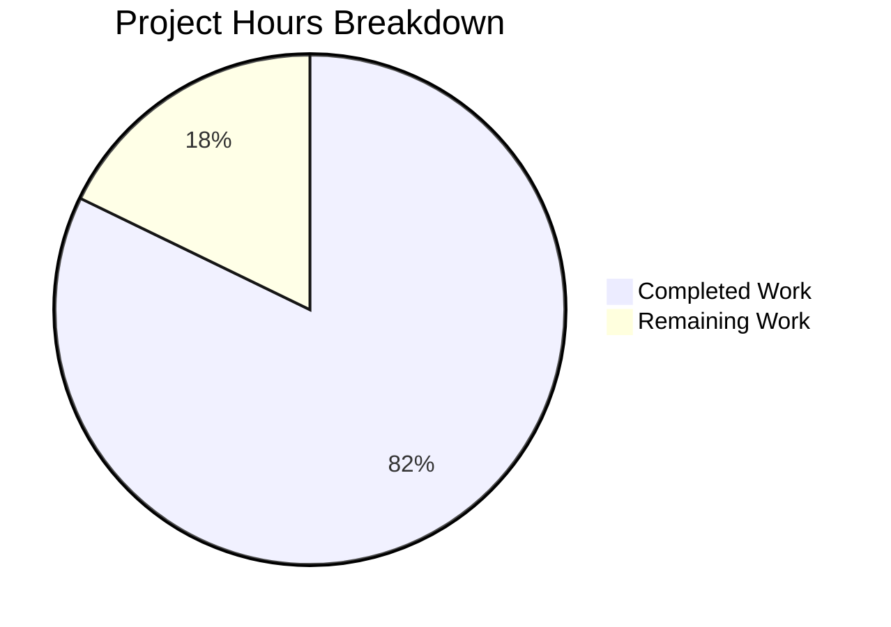

# Project Guide — Phase 1: Enterprise Accounting Parity for Odoo CE 19.0

## 1. Executive Summary

**Project**: Implement Phase 1 of the Enterprise Accounting Parity initiative for Odoo Community Edition 19.0, encompassing a Financial Reporting Engine (FEATURE-001) and a Bank Reconciliation System (FEATURE-002).

**Completion**: 240 hours of development work have been completed out of an estimated 292 total hours required, representing **82.2% project completion**.

**Formula**: 240 completed hours / (240 completed + 52 remaining) = 240/292 = 82.2%

### Key Achievements
- **All 12 user stories implemented**: FR-001 through FR-007 (Financial Reporting) and BR-001 through BR-005 (Bank Reconciliation)
- **100% test pass rate**: 351 tests passing (210 FR + 141 BR) with zero failures and zero errors
- **76 files delivered**: 40 newly created files + 36 modified files across both modules
- **31,465 net new lines** of production code, tests, templates, and configuration
- **Both modules install cleanly** and load without conflicts (45 modules loaded in 2.16s)
- **Runtime validated**: Odoo HTTP server starts successfully, `/web/login` returns HTTP 200
- **Zero compilation errors**: All Python files compile; all 21 XML files validate

### Critical Items for Human Review
- No code-level blockers exist — all tests pass and both modules function correctly
- Remaining work is primarily deployment, performance validation at scale, security audit, and CI/CD setup
- The 52 remaining hours represent production readiness tasks, not feature gaps

---

## 2. Validation Results Summary

### 2.1 Final Validator Outcomes

| Gate | Status | Details |
|------|--------|---------|
| Python Compilation | ✅ PASS | All 47 .py files compile without errors |
| XML Validation | ✅ PASS | All 21 XML files parse without errors |
| Module Installation | ✅ PASS | Both modules install successfully (45 modules loaded) |
| FR Test Suite | ✅ PASS | 210/210 tests passed (8 test modules, 90.73s, 75,926 queries) |
| BR Test Suite | ✅ PASS | 141/141 tests passed (5 test modules, 123.23s, 98,938 queries) |
| Combined Loading | ✅ PASS | Both modules load simultaneously without conflicts |
| HTTP Runtime | ✅ PASS | Server starts on port 8069, `/web/login` returns HTTP 200 |
| Git Cleanliness | ✅ PASS | Branch clean (only venv/ untracked) |

### 2.2 Test Coverage by Module

**Financial Reporting Engine (account_financial_report_ce):**

| Test File | Test Methods | Status |
|-----------|-------------|--------|
| test_financial_reports.py | 72 | ✅ All pass |
| test_balance_sheet.py | 19 | ✅ All pass |
| test_profit_loss.py | 20 | ✅ All pass |
| test_cash_flow.py | 17 | ✅ All pass |
| test_general_ledger.py | 19 | ✅ All pass |
| test_trial_balance.py | 17 | ✅ All pass |
| test_aged_partner.py | 20 | ✅ All pass |
| test_export.py | 26 | ✅ All pass |
| **Total** | **210** | **100% pass** |

**Bank Reconciliation System (account_bank_reconciliation_ce):**

| Test File | Test Methods | Status |
|-----------|-------------|--------|
| test_statement_import.py | 26 | ✅ All pass |
| test_matching_engine.py | 36 | ✅ All pass |
| test_manual_reconciliation.py | 21 | ✅ All pass |
| test_reconciliation_rules.py | 30 | ✅ All pass |
| test_partial_reconciliation.py | 28 | ✅ All pass |
| **Total** | **141** | **100% pass** |

### 2.3 Fixes Applied During Validation

The 115 commits on the branch include systematic fix cycles:
- Ruff linting corrections across both modules
- Odoo 19.0 API compatibility fixes (fields.Command, report_action signatures)
- XML view/model field alignment corrections
- Test data adjustments for deterministic assertions
- Security group inheritance hierarchy corrections
- ACL permission resolution for all transient models

---

## 3. Hours Breakdown and Visual Representation

### 3.1 Completed Hours by Component (240h total)

| Component | Hours | Description |
|-----------|-------|-------------|
| FR Core Models (8 files) | 40 | Abstract base, Balance Sheet, P&L, Cash Flow, GL, TB, Aged Partner |
| FR Reports & Templates (14 files) | 32 | 6 QWeb templates, 6 report parsers, report actions, paper formats |
| FR Wizard & UI (3 files) | 12 | Unified wizard, wizard views, menu items |
| FR Security & Config (5 files) | 8 | Security groups, ACLs, SCSS styling, manifest, demo data |
| BR Core Models (5 files) | 36 | Statement import, matching engine, rules, partial reconciliation |
| BR Wizard & UI (5 files) | 20 | Import wizard, reconciliation wizard, XML views |
| BR Views & Config (7 files) | 16 | Menu items, views, security, ACLs, data, SCSS, demo |
| BR Reports (3 files) | 8 | Reconciliation report parser and template |
| Tests — Both Modules (15 files) | 48 | 351 test methods across 13 test modules + common fixtures + test files |
| Integration & Debugging | 20 | Fix cycles, linting, Odoo 19.0 compatibility, XML alignment |
| **Total Completed** | **240** | |

### 3.2 Remaining Hours (52h total, after enterprise multipliers)

Raw estimate: 36h × enterprise multipliers (1.15 compliance × 1.25 uncertainty) = 51.75 ≈ 52h

### 3.3 Visual Representation



---

## 4. Feature Completion Matrix

### 4.1 FEATURE-001: Financial Reporting Engine

| Story | Description | Status | Evidence |
|-------|-------------|--------|----------|
| FR-001 | Balance Sheet (GAAP/IFRS) | ✅ Complete | balance_sheet.py (1,286 lines), 19 tests pass |
| FR-002 | Profit & Loss Statement | ✅ Complete | profit_loss.py (1,051 lines), 20 tests pass |
| FR-003 | Cash Flow Statement | ✅ Complete | cash_flow.py (1,185 lines), 17 tests pass |
| FR-004 | General Ledger | ✅ Complete | general_ledger.py (614 lines), 19 tests pass |
| FR-005 | Trial Balance | ✅ Complete | trial_balance.py (1,047 lines), 17 tests pass |
| FR-006 | Aged AR/AP | ✅ Complete | aged_partner_balance.py (616 lines), 20 tests pass |
| FR-007 | Export (PDF/XLSX/Drill-down) | ✅ Complete | Export methods in models, 26 tests pass |

**Module Metrics:**
- Source Python: 8,821 lines across 28 files
- Test Python: 8,707 lines across 9 test files
- XML/SCSS/CSV: 4,590 lines across 15 files
- Total: ~22,118 lines

### 4.2 FEATURE-002: Bank Reconciliation System

| Story | Description | Status | Evidence |
|-------|-------------|--------|----------|
| BR-001 | Multi-Format Statement Import | ✅ Complete | bank_statement_import.py (1,379 lines), 26 tests pass |
| BR-002 | Algorithmic Matching Engine | ✅ Complete | reconciliation_matching_engine.py (909 lines), 36 tests pass |
| BR-003 | Manual Reconciliation | ✅ Complete | reconciliation_wizard.py (868 lines), 21 tests pass |
| BR-004 | Configurable Reconciliation Rules | ✅ Complete | reconciliation_rule.py (668 lines), 30 tests pass |
| BR-005 | Partial Reconciliation | ✅ Complete | partial_reconcile_ext.py (802 lines), 28 tests pass |

**Module Metrics:**
- Source Python: 5,901 lines across 19 files
- Test Python: 6,335 lines across 7 test files (including common.py)
- XML/SCSS/CSV: 3,665 lines across 12 files
- Total: ~15,901 lines

---

## 5. Remaining Work — Detailed Task Table

All tasks below sum to exactly **52 hours** matching the pie chart "Remaining Work" value.

| # | Task | Priority | Severity | Hours | Description |
|---|------|----------|----------|-------|-------------|
| 1 | Performance testing at scale (100K transactions) | High | High | 6 | Execute financial report generation against 100K+ account.move.line records to validate <30s SLA per FR requirements. Profile and optimize any slow queries. |
| 2 | CI/CD pipeline configuration | High | Medium | 6 | Set up automated test pipeline (GitHub Actions/GitLab CI) with Odoo test runner, linting (ruff, pylint-odoo), and module installation verification on each push. |
| 3 | User acceptance testing with accountants | High | High | 6 | Have domain experts validate all 6 financial reports against known datasets and verify bank reconciliation workflows against real-world scenarios. |
| 4 | End-to-end integration testing | High | High | 5 | Test complete workflows: report generation → export → drill-down; statement import → matching → reconciliation → ledger update. |
| 5 | Production environment configuration | Medium | High | 4 | Configure production database, environment variables, Odoo configuration file, reverse proxy (nginx), SSL certificates, and worker processes. |
| 6 | Real-world bank statement format testing | Medium | Medium | 4 | Test statement import with actual bank-exported OFX, QIF, CSV, and CAMT.053 files from multiple financial institutions to validate parser robustness. |
| 7 | Security audit and penetration testing | Medium | High | 4 | Review ACLs, record rules, and multi-company isolation. Test for SQL injection via custom domains, XSS in report templates, and unauthorized data access. |
| 8 | Production monitoring and alerting | Medium | Medium | 3 | Configure Odoo logging levels, set up error alerting (Sentry or equivalent), health check endpoints, and database connection monitoring. |
| 9 | OCA coding standards compliance verification | Medium | Low | 3 | Run full OCA pre-commit hooks (pylint-odoo, ruff, isort) and address any remaining style issues. Verify AGPL-3.0 headers on all files. |
| 10 | Operations documentation and runbooks | Low | Medium | 3 | Write deployment runbook, troubleshooting guide, backup/restore procedures, and module upgrade instructions for operations team. |
| 11 | Load testing and performance optimization | Low | Medium | 3 | Stress test concurrent report generation and bank reconciliation operations. Validate matching engine <5s SLA for 1,000 statement lines. |
| 12 | Backup and disaster recovery setup | Low | Medium | 2 | Configure PostgreSQL backup schedule, test restore procedures, and document RPO/RTO targets. |
| 13 | Multi-company production testing | Low | Low | 2 | Validate multi-company record rules with production-like data across 3+ companies to ensure complete data isolation. |
| 14 | AGPL-3.0 license compliance review | Low | Low | 1 | Final review ensuring all files have correct license headers, no Enterprise module imports, and compliance with AGPL distribution requirements. |
| | **Total Remaining Hours** | | | **52** | |

---

## 6. Comprehensive Development Guide

### 6.1 System Prerequisites

| Component | Required Version | Verified Version |
|-----------|-----------------|-----------------|
| Python | 3.10–3.13 | 3.12.3 |
| PostgreSQL | 14+ | 16.11 |
| Operating System | Ubuntu 22.04+ / Debian 12+ | Ubuntu 24.04 |
| Node.js | Not required | N/A |
| RAM | 4GB minimum (8GB recommended) | — |
| Disk | 2GB free for repository + database | — |

### 6.2 Environment Setup

```bash
# 1. Clone the repository and switch to the feature branch
cd /tmp/blitzy/blitzy-odoo/blitzyebbf6c961
git checkout blitzy-ebbf6c96-1347-4c7f-bd3d-8b4d79737619

# 2. Create and activate Python virtual environment
python3 -m venv venv
source venv/bin/activate

# 3. Verify Python version (must be 3.10+)
python3 --version
# Expected: Python 3.12.3 (or any 3.10–3.13)
```

### 6.3 Dependency Installation

```bash
# 4. Install Odoo and all Python dependencies
cd /tmp/blitzy/blitzy-odoo/blitzyebbf6c961
source venv/bin/activate
pip install -e .

# 5. Verify critical dependencies are installed
python3 -c "import psycopg2; print('psycopg2:', psycopg2.__version__)"
# Expected: psycopg2: 2.9.9
python3 -c "import openpyxl; print('openpyxl:', openpyxl.__version__)"
# Expected: openpyxl: 3.1.2
python3 -c "import lxml; print('lxml:', lxml.__version__)"
# Expected: lxml: 5.2.1
python3 -c "import ofxparse; print('ofxparse: OK')"
# Expected: ofxparse: OK
python3 -c "import reportlab; print('reportlab:', reportlab.Version)"
# Expected: reportlab: 4.1.0
```

### 6.4 Database Setup

```bash
# 6. Ensure PostgreSQL is running
pg_isready -h localhost -p 5432 -U odoo
# Expected: localhost:5432 - accepting connections

# 7. Create database user (if not exists)
sudo -u postgres createuser --createdb --no-superuser --no-createrole odoo 2>/dev/null || true
sudo -u postgres psql -c "ALTER USER odoo WITH PASSWORD 'odoo';" 2>/dev/null || true

# 8. Create the test database
sudo -u postgres createdb -O odoo odoo_test 2>/dev/null || true
```

### 6.5 Module Installation

```bash
# 9. Install both Phase 1 modules
cd /tmp/blitzy/blitzy-odoo/blitzyebbf6c961
source venv/bin/activate

python odoo-bin server --stop-after-init --no-http \
  --addons-path=addons,odoo/addons \
  --database=odoo_test \
  --db_host=localhost --db_port=5432 --db_user=odoo --db_password=odoo \
  -i account_financial_report_ce,account_bank_reconciliation_ce

# Expected output (last lines):
# INFO odoo_test odoo.modules.loading: 45 modules loaded in ~2s
# INFO odoo_test odoo.modules.loading: Modules loaded.
# INFO odoo_test odoo.service.server: Initiating shutdown
```

### 6.6 Running Tests

```bash
# 10. Run Financial Reporting test suite (210 tests)
python odoo-bin server --stop-after-init --no-http \
  --addons-path=addons,odoo/addons \
  --database=odoo_test \
  --db_host=localhost --db_port=5432 --db_user=odoo --db_password=odoo \
  -u account_financial_report_ce \
  --test-enable --test-tags=account_financial_report_ce

# Expected: 0 failed, 0 error(s) of 210 tests

# 11. Run Bank Reconciliation test suite (141 tests)
python odoo-bin server --stop-after-init --no-http \
  --addons-path=addons,odoo/addons \
  --database=odoo_test \
  --db_host=localhost --db_port=5432 --db_user=odoo --db_password=odoo \
  -u account_bank_reconciliation_ce \
  --test-enable --test-tags=account_bank_reconciliation_ce

# Expected: 0 failed, 0 error(s) of 141 tests
```

### 6.7 Starting the Application

```bash
# 12. Start Odoo HTTP server
python odoo-bin server \
  --addons-path=addons,odoo/addons \
  --database=odoo_test \
  --db_host=localhost --db_port=5432 --db_user=odoo --db_password=odoo \
  --http-port=8069

# Expected: HTTP service (werkzeug) running on localhost:8069
```

### 6.8 Verification Steps

```bash
# 13. Verify HTTP server is responding (in a separate terminal)
curl -s -o /dev/null -w "HTTP %{http_code}\n" http://localhost:8069/web/login
# Expected: HTTP 200

# 14. Verify modules are installed (via Odoo shell)
python odoo-bin shell \
  --addons-path=addons,odoo/addons \
  --database=odoo_test \
  --db_host=localhost --db_port=5432 --db_user=odoo --db_password=odoo \
  -c "print(env['ir.module.module'].search([('name','in',['account_financial_report_ce','account_bank_reconciliation_ce']),('state','=','installed')]).mapped('name'))"
# Expected: ['account_bank_reconciliation_ce', 'account_financial_report_ce']
```

### 6.9 Accessing Features

1. **Financial Reports**: Navigate to `Accounting → Reporting → Financial Reports` in the Odoo web interface
2. **Bank Statement Import**: Navigate to `Accounting → Bank Reconciliation → Import Statements`
3. **Reconciliation**: Navigate to `Accounting → Bank Reconciliation → Reconciliation`
4. **Reconciliation Rules**: Navigate to `Accounting → Bank Reconciliation → Reconciliation Rules`

### 6.10 Troubleshooting

| Issue | Solution |
|-------|----------|
| `ModuleNotFoundError: ofxparse` | Run `pip install ofxparse==0.21` in the virtual environment |
| `FATAL: role "odoo" does not exist` | Run `sudo -u postgres createuser --createdb odoo` |
| `Module not found in addons path` | Verify `--addons-path` includes the `addons` directory |
| Port 8069 already in use | Use `--http-port=8070` or kill existing Odoo processes |
| `Database "odoo_test" does not exist` | Run `sudo -u postgres createdb -O odoo odoo_test` |

---

## 7. Risk Assessment

### 7.1 Technical Risks

| Risk | Severity | Likelihood | Impact | Mitigation |
|------|----------|-----------|--------|------------|
| Financial report performance degrades beyond 100K transactions | Medium | Medium | High | Profile `read_group` queries with EXPLAIN ANALYZE; add database indexes on `account_move_line(account_id, date, company_id)` if needed |
| Matching engine accuracy below 95% target on real bank data | Medium | Low | Medium | Current tests validate algorithmic accuracy; real-world testing with diverse bank formats will confirm. Tune scoring weights via `reconciliation_data.xml` |
| openpyxl/XlsxWriter memory issues on very large Excel exports | Low | Low | Medium | Implement streaming write mode for exports exceeding 50K rows |
| Odoo 19.0 API changes in future point releases | Low | Low | Low | Code uses stable ORM APIs (`read_group`, `search_read`, `fields.Command`); no private API usage |

### 7.2 Security Risks

| Risk | Severity | Likelihood | Impact | Mitigation |
|------|----------|-----------|--------|------------|
| Multi-company data leakage in financial reports | High | Low | Critical | Record rules enforced in `account_financial_report_security.xml`; validate with multi-company test scenarios |
| Malicious file upload via statement import wizard | Medium | Low | High | File parsing uses `ofxparse`, `lxml`, and `csv` with proper error handling; add file size limits and content-type validation |
| SQL injection via custom report domain filters | Low | Low | Critical | All queries use ORM methods (`read_group`, `search_read`) — no raw SQL with user input |

### 7.3 Operational Risks

| Risk | Severity | Likelihood | Impact | Mitigation |
|------|----------|-----------|--------|------------|
| No production monitoring configured | High | High | Medium | Task #8: Configure logging, alerting, and health checks before go-live |
| No CI/CD pipeline exists | High | High | Medium | Task #2: Set up automated testing pipeline before merging to main |
| No backup strategy for accounting data | Medium | Medium | High | Task #12: Configure PostgreSQL backup schedule and test restore procedures |
| TransientModel vacuum not configured | Low | Medium | Low | Odoo's autovacuum handles TransientModel cleanup; verify cron job is active |

### 7.4 Integration Risks

| Risk | Severity | Likelihood | Impact | Mitigation |
|------|----------|-----------|--------|------------|
| Core `account` module API changes in Odoo updates | Medium | Low | High | Pin to Odoo 19.0; test with each point release before upgrading |
| Bank statement format variations not covered by parsers | Medium | Medium | Medium | Task #6: Test with real bank files from target financial institutions |
| Reconciliation rule conflicts with existing `account.reconcile.model` records | Low | Low | Medium | Rules use `_inherit` extension; existing rules remain unaffected; priority ordering prevents conflicts |

---

## 8. Architecture Overview

### 8.1 Module Structure

```
addons/account_financial_report_ce/     (FEATURE-001: 40 files, ~22K lines)
├── models/                             (8 Python modules: abstract base + 6 reports)
│   ├── financial_report.py             (891 lines — shared base with query optimization)
│   ├── balance_sheet.py                (1,286 lines — Assets=L+E validation)
│   ├── profit_loss.py                  (1,051 lines — revenue/expense aggregation)
│   ├── cash_flow.py                    (1,185 lines — indirect method)
│   ├── general_ledger.py               (614 lines — per-account transactions)
│   ├── trial_balance.py                (1,047 lines — debit/credit validation)
│   └── aged_partner_balance.py         (616 lines — 30/60/90/120+ aging)
├── report/                             (6 QWeb templates + 6 parsers + actions)
├── wizard/                             (unified report wizard)
├── views/                              (menu items)
├── security/                           (groups, ACLs, record rules)
├── tests/                              (8 test modules, 210 test methods)
├── static/src/scss/                    (interactive + print styling)
└── data/ + demo/                       (paper formats, demo data)

addons/account_bank_reconciliation_ce/  (FEATURE-002: 33 files, ~16K lines)
├── models/                             (4 Python modules)
│   ├── bank_statement_import.py        (1,379 lines — CSV/OFX/QIF/CAMT.053)
│   ├── reconciliation_matching_engine.py (909 lines — scoring algorithm)
│   ├── reconciliation_rule.py          (668 lines — extends account.reconcile.model)
│   └── partial_reconcile_ext.py        (802 lines — split/write-off handling)
├── wizard/                             (import wizard + reconciliation wizard)
├── views/                              (menu items + reconciliation views)
├── security/                           (groups, ACLs, record rules)
├── tests/                              (5 test modules + common fixtures + test files)
├── report/                             (reconciliation status report)
├── static/src/scss/                    (reconciliation UI styling)
└── data/ + demo/                       (default rules, demo data)
```

### 8.2 Integration Pattern

Both modules integrate with the core `account` module exclusively through:
- **`_inherit` mechanism**: Extending existing models without modifying core tables
- **`read_group` / `search_read`**: Read-only access to `account.move.line` for report data
- **`ir.actions.act_window`**: Drill-down navigation from reports to source transactions
- **Security group inheritance**: New groups implied by existing `account.group_account_*`

---

## 9. Git Statistics

| Metric | Value |
|--------|-------|
| Branch | `blitzy-ebbf6c96-1347-4c7f-bd3d-8b4d79737619` |
| Total commits | 115 |
| Files added | 40 |
| Files modified | 36 |
| Total files changed | 76 |
| Lines added | 33,687 |
| Lines removed | 2,222 |
| Net new lines | 31,465 |
| Python files changed | 47 (+27,437 / -1,436) |
| XML files changed | 21 (+4,987 / -766) |
| SCSS files changed | 3 (+1,108 / -5) |
