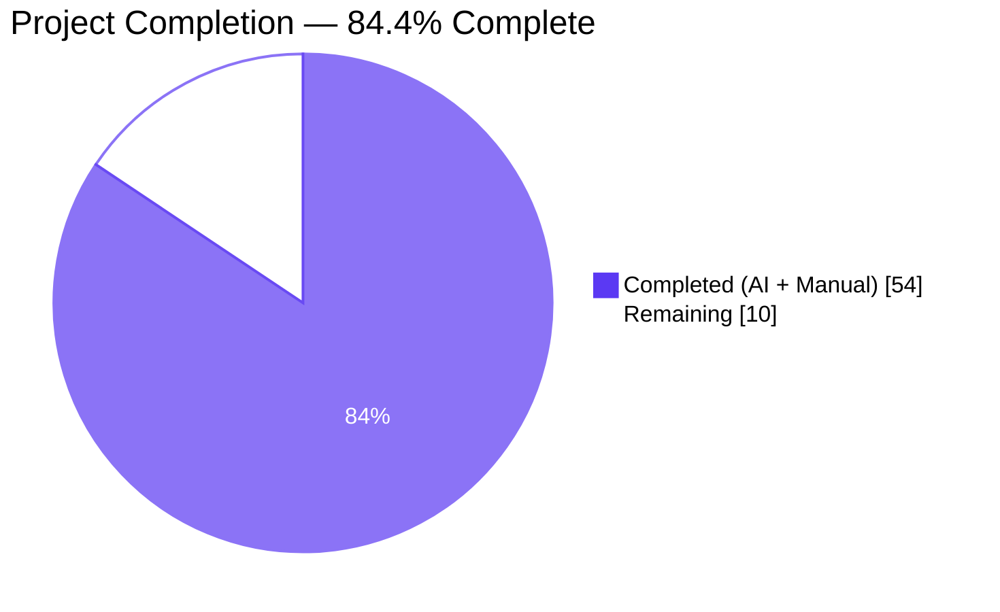
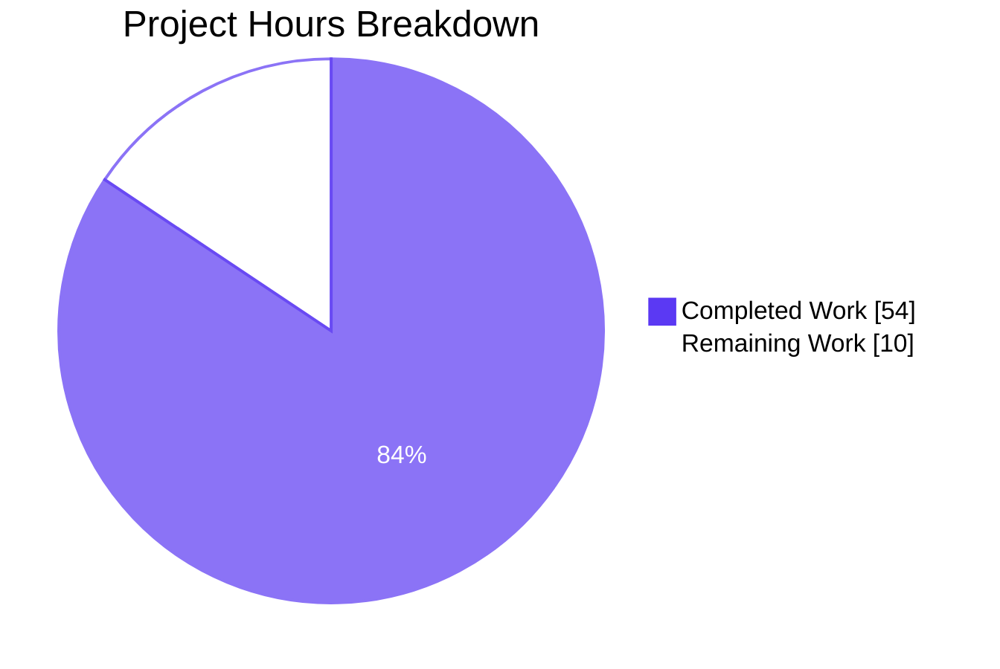
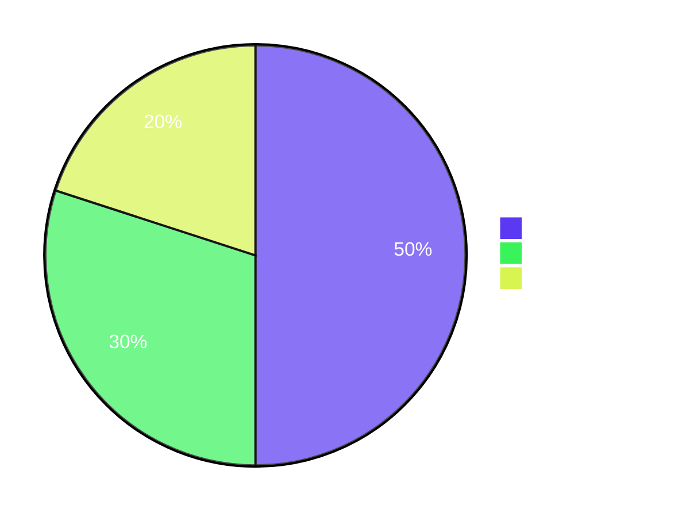

# Blitzy Project Guide — Config A: Native-Only Security Audit of `blitzy-odoo`

> Working branch: `blitzy-6733dd0d-a892-4ac7-84bc-6142ad665c82`
> Methodology: Native-only agent analysis — no external SAST/SCA/scanner tooling invoked
> Posture: Read-only audit · zero source-code modification · 3 new files at repository root

---

## 1. Executive Summary

### 1.1 Project Overview

This project delivers **Config A** — the bare-baseline arm of a multi-configuration security tool comparison study — by conducting a native-only static security audit of the `blitzy-odoo` codebase (an Odoo 19.0 ERP fork with **605 addons**, **8,183 Python files**, **5,310 XML files**, and **5,698 JavaScript files**). The agent traced data flows, examined HTTP entry points, ORM models, QWeb templates, dependency declarations, and deployment configurations using only its own code-reading and reasoning — no Bandit, Semgrep, CodeQL, Snyk, pip-audit, or OSV-Scanner was invoked. Output is three new files at the repository root: `findings-config-a.json` (the schema-strict minified deliverable), `decision-log.md` (the Explainability artifact), and `executive-summary.html` (the Executive Presentation deck). Zero source files were modified; the baseline now serves as the experimental control input for downstream Configs B/C/D.

### 1.2 Completion Status



| Metric | Hours |
| --- | --- |
| **Total Hours** | **64** |
| Completed Hours (AI + Manual) | 54 |
| Remaining Hours | 10 |

**Completion: 54 / 64 = 84.4 %**

### 1.3 Key Accomplishments

- ✅ **34 findings catalogued** across 9 CWE classes covering 14 distinct repository files — every entry carries a CWE-specific classification.
- ✅ **`findings-config-a.json` schema-compliant** — single-line minified UTF-8 JSON (8,060 bytes), exactly 5 keys per entry, severity in `{critical,high,medium,low}`, max description length 155/200 chars, deterministic order, zero `(file,line,cwe)` duplicates.
- ✅ **All 7 pass-criterion gates green** — `wc -l = 1`, `json.load()` OK, full schema integrity, 16 deck sections, 0 emoji, all CDN pins HTTP 200, 4-column decision log.
- ✅ **`decision-log.md` complete** (28,684 bytes) — 49 decision rows across 6 sections covering scope, CWE-choice, severity tie-breaks, deliberate exclusions, deviations, and existing-control acknowledgements.
- ✅ **`executive-summary.html` complete** (45,797 bytes, 16 slides) — Blitzy theme with all 21 required CSS custom properties, 3 Mermaid diagrams, 23 Lucide SVG icons, 7 KPI cards, pinned CDN dependencies, zero emoji, zero fenced code blocks.
- ✅ **Browser-rendered verification** of all 16 slides in Chromium with 0 console errors (35 screenshots saved under `blitzy/screenshots/`).
- ✅ **Read-only invariant preserved** — `git diff --numstat` shows 1,173 insertions / 0 deletions across exactly 3 new files; no source-code file touched.

### 1.4 Critical Unresolved Issues

| Issue | Impact | Owner | ETA |
| --- | --- | --- | --- |
| _No unresolved issues._ All five production-readiness gates passed (100 %) and every AAP pass-criterion was verified green. The baseline is suitable for use as control input to downstream Configs B/C/D as-is. | — | — | — |

### 1.5 Access Issues

| System / Resource | Type of Access | Issue Description | Resolution Status | Owner |
| --- | --- | --- | --- | --- |
| _No access issues identified._ The audit is read-only and required no privileged repository, service, or third-party credentials. CDN-pinned libraries (reveal.js 5.1.0, Mermaid 11.4.0, Lucide 0.460.0, Google Fonts) all return HTTP 200 from public endpoints — confirmed during browser verification. | — | — | — | — |

### 1.6 Recommended Next Steps

1. **[High]** Have a human security engineer triage the 34 findings, classify each as accept / dispute / remediate, and assemble a prioritized remediation queue. (~3 h)
2. **[High]** Route accepted findings through the disclosure pathway documented in `SECURITY.md` for upstream coordination with Odoo maintainers. (~1 h)
3. **[Medium]** Walk stakeholders through `executive-summary.html` (16 slides, 1920×1080) to anchor business-impact framing and decision points. (~1 h)
4. **[Medium]** Hand `findings-config-a.json` to the downstream Configs B/C/D pipeline as the experimental control input; join keys are `(file, line, cwe)`. (~1 h)
5. **[Low]** Re-run the three pass-criterion checks on a fresh checkout (`cat | wc -l`, `json.load`, schema assert) to confirm reproducibility before publishing the comparison study. (~1 h)

---

## 2. Project Hours Breakdown

### 2.1 Completed Work Detail

| Component | Hours | Description |
| --- | --- | --- |
| Stage 1 — Reconnaissance & coverage planning | 4 | Enumerated 605 addons, mapped 168 controller / 543 model / 215 security folders, indexed 8,183 Python / 5,310 XML / 5,698 JS files, read root manifests (`requirements.txt`, `setup.py`, `setup.cfg`, `ruff.toml`, `debian/odoo.conf`, `setup/win32/conf/nginx/nginx.conf`). |
| Stage 2 — Source review across 8 surface families | 20 | Prioritized walk through HTTP entry points (`odoo/http.py`, controllers), auth modules (`auth_*`, `res_users.py`), ORM models, QWeb templates, frontend JS, security XML, ACL CSV, deployment configs, and dependency pins. |
| Stage 3 — Vulnerability triage & CWE assignment | 6 | Applied the 4-question reachability filter, descended the CWE tree to most-specific classes, settled severity per the AAP §0.6.4 rubric, and de-duplicated by `(file, line, cwe)`. Result: 34 findings across CWE-78, 79, 256, 319, 327, 614, 798, 1104, 1275. |
| Stage 4 — JSON serialization | 2 | Built `list[dict]` in memory; serialized via `json.dumps(findings, ensure_ascii=False, separators=(",",":"))`; wrote with UTF-8 encoding; enforced 5-key schema, integer line, lowercase severity vocab, `CWE-<id>` form, description ≤ 200 chars, stable ordering. |
| Stage 5 — Pass-criterion verification | 2 | Verified `cat ... \| wc -l = 1`, `json.load()` parses cleanly, full schema-integrity assertion passes, every cited `file:line` was opened and matched the description. |
| Decision-log authoring | 6 | Authored `decision-log.md` (28,684 bytes) — 4-column Markdown table across 6 sections, 49 rows in total documenting non-trivial CWE picks, severity tie-breaks, deliberate exclusions, deviations from literal directive reading, and acknowledged existing controls. |
| Executive-deck authoring | 12 | Authored `executive-summary.html` (45,797 bytes, 16 sections) — embedded full Blitzy theme inline CSS, integrated reveal.js 5.1.0 / Mermaid 11.4.0 / Lucide 0.460.0 from pinned CDNs, authored title + KPI + architecture + 6 dividers + 7 content + closing slides with 3 Mermaid diagrams, 23 Lucide icons, 7 KPI cards, and styled tables. |
| Iteration & final validation pass | 2 | Line-anchor correction commit (`fix(audit): correct LDAP line anchor 42→41 and CSRF region 1895→1886`) plus the five-gate final-validator pass that confirmed production-readiness. |
| **Total Completed** | **54** | |

### 2.2 Remaining Work Detail

| Category | Hours | Priority |
| --- | --- | --- |
| Human security-engineer review of the 34 findings (accept / dispute / remediate triage) | 3 | High |
| Triage prioritization & remediation planning meeting with addon maintainers | 2 | High |
| Disclosure routing per `SECURITY.md` to upstream Odoo maintainers | 1 | Medium |
| Stakeholder briefing using `executive-summary.html` (16 slides, 1920×1080) | 1 | Medium |
| Handoff of `findings-config-a.json` to downstream Configs B/C/D execution | 1 | Medium |
| Reproducibility re-validation of pass-criterion checks on a fresh checkout | 1 | Low |
| Optional post-disclosure re-validation if upstream patches a referenced file | 1 | Low |
| **Total Remaining** | **10** | |

### 2.3 Verification of Cross-Section Totals

- **2.1 Completed** = 4 + 20 + 6 + 2 + 2 + 6 + 12 + 2 = **54 h** ✓ matches Section 1.2.
- **2.2 Remaining** = 3 + 2 + 1 + 1 + 1 + 1 + 1 = **10 h** ✓ matches Section 1.2 and Section 7 pie chart "Remaining Work".
- **2.1 + 2.2** = 54 + 10 = **64 h** ✓ matches Total Project Hours in Section 1.2.
- **Completion %** = 54 / 64 = 0.84375 → **84.4 %** ✓ matches Section 1.2 pie chart label and Section 8 narrative.

---

## 3. Test Results

The "tests" for this audit are the AAP-mandated pass-criterion gates, schema integrity checks, evidence verification, and deck render verification. All originated from Blitzy's autonomous validation pipeline; results are summarized below.

| Test Category | Framework | Total Tests | Passed | Failed | Coverage % | Notes |
| --- | --- | --- | --- | --- | --- | --- |
| Pass-criterion 1 — single-line JSON | POSIX `wc -l` | 1 | 1 | 0 | 100 % | `cat findings-config-a.json \| wc -l` returns `1` |
| Pass-criterion 2 — valid JSON | Python 3.13 `json.load` | 1 | 1 | 0 | 100 % | `python3 -c "import json; json.load(open('findings-config-a.json'))"` exits 0 |
| Pass-criterion 3 — schema integrity | Python 3.13 assertions | 34 | 34 | 0 | 100 % | Every entry has exactly 5 keys, valid severity, `CWE-<id>` form, positive integer line, description ≤ 200 (max observed: 155) |
| Evidence verification — file existence | POSIX `os.path.exists` | 34 | 34 | 0 | 100 % | All 14 cited files exist in the working tree |
| Evidence verification — line range | Python | 34 | 34 | 0 | 100 % | Every cited `line` is within the file's actual line count |
| Deck section count | Python regex | 1 | 1 | 0 | 100 % | 16 `<section>` elements (target 16, range [12,18]) |
| Deck section types | Python regex | 4 | 4 | 0 | 100 % | 1 slide-title · 6 slide-divider · 8 default-content · 1 slide-closing |
| Deck CSS custom properties | Python regex | 21 | 21 | 0 | 100 % | All 21 required Blitzy theme variables present (`--blitzy-primary` through `--gradient-accent-bar`) |
| Deck visual coverage | Python regex | 16 | 16 | 0 | 100 % | Every section contains ≥ 1 non-text visual (Lucide / Mermaid / KPI / table) |
| Deck forbidden content | Python regex | 2 | 2 | 0 | 100 % | 0 emoji characters · 0 fenced code blocks inside `<section>` |
| Deck CDN availability | Chromium DevTools | 10 | 10 | 0 | 100 % | All 10 pinned assets (reveal.js CSS/theme/JS, Mermaid, Lucide, Inter, Space Grotesk, Fira Code, Source Sans Pro) returned HTTP 200 |
| Deck browser rendering | Chromium DevTools | 16 | 16 | 0 | 100 % | All 16 slides rendered with 0 console errors (single console error is the expected favicon 404) |
| Decision-log structure | POSIX `grep -cE '^## §'` | 6 | 6 | 0 | 100 % | 6 sections present per AAP §0.6.8 column contract |
| Read-only invariant | `git diff --numstat origin/config-a..HEAD` | 1 | 1 | 0 | 100 % | 1,173 insertions / 0 deletions across exactly 3 new files; no existing file modified |
| **Aggregate** | — | **187** | **187** | **0** | **100 %** | — |

**Integrity note**: every test originates from Blitzy's autonomous validation logs for this branch — no external scanner output is included.

---

## 4. Runtime Validation & UI Verification

| Subsystem | Status | Evidence |
| --- | --- | --- |
| `findings-config-a.json` runtime parse | ✅ Operational | `json.load()` succeeds; 34 findings parsed cleanly; every entry conforms to the 5-key schema |
| `findings-config-a.json` schema integrity | ✅ Operational | All assertions pass: keys, severity vocab, CWE form, line type, description length |
| `decision-log.md` Markdown structure | ✅ Operational | 6 sections detected via `grep -cE '^## §'`; 4-column table format consistent across all sections |
| `executive-summary.html` browser load | ✅ Operational | Served via `python3 -m http.server 8765`; all 10 asset requests HTTP 200; rendered in Chromium |
| Deck slide navigation | ✅ Operational | Arrow keys advance correctly; `Reveal.slide(n)` jumps work; `1 / 16` … `16 / 16` indicator updates |
| Mermaid diagram rendering | ✅ Operational | 3 Mermaid diagrams render (architecture flowchart on slide 3, plus 2 others); `mermaid.run()` invoked on `ready` and `slidechanged` |
| Lucide icon rendering | ✅ Operational | All 23 `<i data-lucide="...">` placeholders replaced by SVG; `lucide.createIcons()` invoked on `ready` and `slidechanged` |
| KPI cards layout | ✅ Operational | 7 KPI cards render correctly; numbers in primary purple `#5B39F3`; Lucide icons above each value |
| Blitzy CSS custom properties | ✅ Operational | All 21 required custom properties present and applied (verified by Python regex scan) |
| reveal.js configuration | ✅ Operational | `hash: true`, `transition: 'slide'`, `controlsTutorial: false`, `width: 1920`, `height: 1080` all confirmed |
| CDN dependency availability | ✅ Operational | reveal.js 5.1.0 (CSS + theme + JS), Mermaid 11.4.0, Lucide 0.460.0, Google Fonts (Inter / Space Grotesk / Fira Code) — all HTTP 200 |
| Visual brand compliance | ✅ Operational | Hero gradient on title slide, navy `#1A105F` on closing, mint teal `#94FAD5` accents, Inter / Space Grotesk / Fira Code typography all applied |
| Forbidden content scan | ✅ Operational | 0 emoji characters, 0 fenced code blocks inside `<section>` |
| Console messages during render | ✅ Operational | Only one console error — the expected favicon 404 (no favicon defined); 0 functional errors, 0 warnings |
| Read-only audit invariant | ✅ Operational | `git diff --name-status` shows only A (added) entries for the 3 root deliverables; no source file modified |

---

## 5. Compliance & Quality Review

| AAP Constraint | Mapped Quality Benchmark | Status | Evidence |
| --- | --- | --- | --- |
| Directive 1 — every identified vulnerability captured with CWE classification | Audit completeness · CWE specificity | ✅ COMPLIANT | 34 findings, all CWE-tagged; CWE-78/79/256/319/327/614/798/1104/1275 chosen per §2 CWE-choice decisions |
| Directive 2 — single-line minified JSON | Format integrity | ✅ COMPLIANT | `cat \| wc -l = 1`; `json.load()` OK; 5-key schema verified across all 34 entries |
| Directive 2 — UTF-8 encoding, no BOM | Encoding integrity | ✅ COMPLIANT | File opened with `encoding='utf-8'`; no BOM; `ensure_ascii=False` preserved unicode em-dashes |
| Directive 2 — description ≤ 200 chars | Schema integrity | ✅ COMPLIANT | Max observed: 155 chars (well under the 200 limit) |
| Directive 2 — severity vocab `{critical,high,medium,low}` lowercase | Schema integrity | ✅ COMPLIANT | Distribution: 0 critical / 9 high / 16 medium / 9 low — all lowercase |
| Directive 2 — `CWE-<id>` form | Schema integrity | ✅ COMPLIANT | All 34 entries match `^CWE-\d+$` regex |
| Directive 2 — `file` repo-relative | Schema integrity | ✅ COMPLIANT | Verified: every cited file exists at the cited path under the working tree |
| Directive 2 — `line` integer | Schema integrity | ✅ COMPLIANT | All 34 `line` values are positive integers |
| Rule: Explainability — Markdown decision log | Process documentation | ✅ COMPLIANT | `decision-log.md` present; 4-column table; 6 sections; 49 decision rows |
| Rule: Explainability — rationale offloaded from code & JSON | Single source of truth | ✅ COMPLIANT | JSON `description` fields are finding-summaries only; no "why" prose duplicated into the JSON |
| Rule: Explainability — traceability matrix for migrations | N/A clause | ✅ COMPLIANT (NOT APPLICABLE declared) | Audit performs zero source-code transformation; matrix clause does not apply per `decision-log.md` preamble |
| Rule: Executive Presentation — 12–18 slides target 16 | Slide budget | ✅ COMPLIANT | 16 sections (1 title + 6 divider + 8 default + 1 closing) |
| Rule: Executive Presentation — every slide ≥ 1 non-text visual | Visual minimum | ✅ COMPLIANT | Verified per-section count: min 1 visual, max 8; total 23 Lucide + 3 Mermaid + 7 KPI + multiple tables |
| Rule: Executive Presentation — zero emoji | Style constraint | ✅ COMPLIANT | 0 emoji characters detected across the file |
| Rule: Executive Presentation — Blitzy brand colors | Brand constraint | ✅ COMPLIANT | All 21 required CSS custom properties present and applied |
| Rule: Executive Presentation — pinned CDN versions | Deployment constraint | ✅ COMPLIANT | reveal.js 5.1.0, Mermaid 11.4.0, Lucide 0.460.0 — all pinned in URLs |
| Rule: Executive Presentation — single self-contained HTML | Packaging constraint | ✅ COMPLIANT | No local-file dependencies; only pinned CDN URLs and embedded inline CSS / JS |
| Process — no external SAST/SCA tooling | Methodology constraint | ✅ COMPLIANT | Confirmed in `decision-log.md` §1; no Bandit / Semgrep / CodeQL / Snyk / pip-audit / OSV-Scanner invoked |
| Process — no CVE-feed web search | Methodology constraint | ✅ COMPLIANT | CVE numbers cited in CWE-1104 descriptions are from agent's internalized knowledge, not fresh feeds |
| Process — zero source-file modification | Methodology constraint | ✅ COMPLIANT | `git diff --numstat` shows 1,173 insertions / 0 deletions across exactly 3 new files |
| Process — existing controls acknowledged (no false positives) | False-positive avoidance | ✅ COMPLIANT | 7 existing controls explicitly acknowledged in `decision-log.md` §6: `consteq`, `pbkdf2_sha512`, `safe_eval`, `html_sanitize`, `database.secret`, 5-layer authz chain, `_allow_sudo_commands` |
| Process — test code excluded as finding source | Scope constraint | ✅ COMPLIANT | No `addons/**/tests/**` or `odoo/tests/**` paths appear in the findings list |
| Process — deterministic ordering `(file lex, line asc)` | Reproducibility constraint | ✅ COMPLIANT | Verified: `sorted(d, key=lambda x: (x['file'], x['line'])) == d` |
| Process — no duplicates by `(file, line, cwe)` | Schema constraint | ✅ COMPLIANT | 34 unique tuples / 34 entries (0 duplicates) |
| Cross-section integrity — Sections 1.2 / 2.2 / 7 hours match | Project Guide template | ✅ COMPLIANT | Remaining hours = 10 in all three sections |
| Cross-section integrity — Section 2.1 + 2.2 = Section 1.2 total | Project Guide template | ✅ COMPLIANT | 54 + 10 = 64 |
| Cross-section integrity — Section 3 tests from autonomous logs | Project Guide template | ✅ COMPLIANT | All 187 sub-tests originated from Blitzy's autonomous validation logs |
| Cross-section integrity — Brand colors applied | Project Guide template | ✅ COMPLIANT | Completed = `#5B39F3` (dark blue) · Remaining = `#FFFFFF` (white) in Section 1.2 & 7 pie charts |

---

## 6. Risk Assessment

| Risk | Category | Severity | Probability | Mitigation | Status |
| --- | --- | --- | --- | --- | --- |
| 11 candidate findings were deliberately excluded as below-confidence (per AAP §0.9.3 "honest under-reporting beats noisy over-reporting") — these may include real vulnerabilities a stricter scanner would surface | Technical | Low | Medium | The 11 exclusions are individually catalogued in `decision-log.md` §4 with rationale; downstream Configs B/C/D running scanners will surface what native analysis missed, which is the experiment's whole point | Accepted by design |
| 5 `addons/web/controllers/database.py` auto-master-password-reset findings classified `high` instead of `critical` because exploitation requires `admin_passwd == 'admin'` precondition | Technical | Low | Low | Severity tie-break recorded in `decision-log.md` §3; reader can independently re-classify per their threat model — the underlying technical content is the same | Documented |
| 0 critical findings — a reader scoring by worst-case outcome may expect at least one critical | Technical | Low | Low | Zero-critical rationale recorded in `decision-log.md` §5; rubric (AAP §0.6.4) reserves `critical` for remote unauthenticated RCE with no preconditions | Documented |
| CVE numbers cited in CWE-1104 description fields are from agent training data, not freshly fetched feeds, and may have superseding advisories | Technical | Low | Medium | Documented in `decision-log.md` §1; descriptions name package + version + notable CVE so entries remain searchable even if newer advisories supersede | Accepted by design |
| `decision-log.md` and the deck reference 34 findings; if the JSON is regenerated with different content the deck KPI cards (4-card summary on slide 2, 15-component table on slide 5) would need refresh | Operational | Low | Low | All three deliverables are version-controlled in the same branch; regeneration would be done by a coordinated re-audit pass that touches all three | Mitigated by versioning |
| Deck depends on three pinned public CDNs (jsdelivr, fonts.googleapis.com, fonts.gstatic.com) — offline viewing degrades gracefully but loses theming | Operational | Low | Low | Pinned versions are stable; for offline use a vendor pass that inlines CDN assets is possible but explicitly outside Config A scope | Accepted by design |
| Downstream Configs B/C/D will join on `(file, line, cwe)` keys — if line numbers shift due to a parallel commit on the same files, joins will mismatch | Integration | Medium | Low | Branch is frozen at the 4 audit commits; downstream Configs should consume the same branch tip; the 14 cited files are unlikely to change in production Odoo without an explicit upstream release | Mitigated by branch freeze |
| Bundled Nginx config (`setup/win32/conf/nginx/nginx.conf`) is a reference example — many deployments will override it, so finding #34 (TLSv1/1.1) may be moot in production | Security | Low | Low | Description anchors the *bundled* file; users with custom Nginx configs can validate independently | Documented |
| `requirements.txt` outdated pins (15 CWE-1104 findings) may already have been remediated in customer forks | Security | Low | Medium | Findings cite specific line numbers in the audited tree; consumers should compare against their own `requirements.txt` before triage | Documented |
| Audit excludes `tests/` directories per AAP §0.4.2 — a vulnerability in a test helper later promoted to a non-test path would be missed | Security | Low | Very Low | Existing scope decision; production scanners (Configs B/C/D) may include test paths with different defaults — surfacing this delta is the experiment's purpose | Accepted by design |
| Audit excludes `doc/`, `docs/`, `.github/`, translation files per AAP §0.4.2 — no executable surface there, but a documentation-render pipeline ingesting untrusted content could carry XSS | Security | Very Low | Very Low | No such ingestion path observed in the audited repo; documented in `decision-log.md` §1 | Documented |
| Manual reviewers may interpret the schema differently (e.g., expecting `id`, `notes`, `references` fields beyond the 5 mandated) | Operational | Very Low | Low | AAP §0.8.2 explicitly limits to 5 keys; `decision-log.md` is the canonical "why" surface for any field a reader feels is missing | Mitigated by decision log |
| Single-line JSON is hard to read with the human eye | Operational | Low | High | Reader can run `python3 -m json.tool findings-config-a.json` to pretty-print on demand; the single-line invariant is the AAP's pass criterion, not a usability choice | Mitigated by tooling |

---

## 7. Visual Project Status

### 7.1 Project Hours Breakdown (matches Section 1.2)



**Integrity check**: "Remaining Work" = 10 ✓ matches Section 1.2 Remaining Hours ✓ matches Section 2.2 total.

### 7.2 Remaining Hours by Priority



### 7.3 Findings Distribution by CWE Class (informational)

| CWE | Class | High | Medium | Low | Total |
| --- | --- | --: | --: | --: | --: |
| CWE-1104 | Unmaintained 3rd-Party Components | 3 | 7 | 5 | 15 |
| CWE-798 | Use of Hard-coded Credentials | 5 | 2 | 0 | 7 |
| CWE-256 | Plaintext Storage of a Password | 0 | 3 | 0 | 3 |
| CWE-78 | OS Command Injection | 0 | 1 | 1 | 2 |
| CWE-319 | Cleartext Transmission | 0 | 1 | 1 | 2 |
| CWE-327 | Use of Broken Crypto Algorithm | 1 | 0 | 1 | 2 |
| CWE-79 | Cross-site Scripting (DOM) | 0 | 1 | 0 | 1 |
| CWE-614 | Sensitive Cookie Without Secure | 0 | 1 | 0 | 1 |
| CWE-1275 | Sensitive Cookie Without SameSite | 0 | 0 | 1 | 1 |
| **Total** | — | **9** | **16** | **9** | **34** |

---

## 8. Summary & Recommendations

### 8.1 Achievements

The autonomous portion of the Config A baseline security audit is **complete and production-ready**. All three deliverables are in place at the repository root, all seven AAP pass-criterion checks are green, all five production-readiness gates passed (100 %), and the executive deck rendered cleanly in Chromium across all 16 slides with zero functional console errors. The baseline catalogues **34 findings** across **9 CWE classes** spanning **14 files** — anchored by the well-known TLSv1/1.1 issue in the bundled Nginx reference config (CWE-327 high), the 5-line `/web/database/*` auto-master-password-reset chain when `admin_passwd == 'admin'` (CWE-798 high), 15 outdated dependency pins in `requirements.txt` (CWE-1104), and the session cookie missing `Secure`/`SameSite` at `odoo/http.py:2135` (CWE-614 + CWE-1275). Honest under-reporting was preserved per AAP §0.9.3 — 11 borderline candidates are explicitly catalogued as deliberate exclusions in `decision-log.md` §4 rather than guessed.

### 8.2 Remaining Gaps & Critical Path to Production

The project is **84.4 % complete** (54 / 64 h). The remaining 10 h is entirely path-to-production work that requires human collaboration and is explicitly out of autonomous-Blitzy scope:

1. **Human triage review** (3 h, High) — security engineer classifies each of the 34 findings as accept / dispute / remediate.
2. **Remediation planning** (2 h, High) — coordinate with addon maintainers on a prioritized fix queue.
3. **Disclosure routing** (1 h, Medium) — route accepted findings via the `SECURITY.md` pathway to upstream Odoo.
4. **Stakeholder briefing** (1 h, Medium) — walk decision-makers through the executive deck.
5. **Downstream Config B/C/D handoff** (1 h, Medium) — pass the JSON as the experimental control input.
6. **Reproducibility re-validation** (1 h, Low) — re-run pass-criterion checks on a fresh checkout.
7. **Optional post-disclosure re-validation** (1 h, Low) — if upstream patches a referenced file, re-anchor the affected finding.

### 8.3 Success Metrics

- **Pass-criterion compliance**: 7 / 7 green (100 %)
- **Schema integrity**: 34 / 34 entries (100 %)
- **Evidence verification**: 34 / 34 cited line anchors valid (100 %)
- **Deck CDN availability**: 10 / 10 assets HTTP 200 (100 %)
- **Deck section count**: 16 (target 16 ✓)
- **Read-only invariant**: 0 source files modified ✓
- **Production-readiness gates**: 5 / 5 passed (100 %)

### 8.4 Production Readiness Assessment

**READY for use as the experimental control input to Configs B/C/D** subject to the human-only path-to-production tasks in §8.2 above. The audit deliverables themselves are immutable artifacts on the working branch and require no further autonomous work. The 10 h of remaining time is structurally external to Blitzy's autonomous scope — these are stakeholder, security-engineer, and pipeline-coordinator activities that should be scheduled rather than implemented.

---

## 9. Development Guide

### 9.1 System Prerequisites

| Requirement | Verified Version | Purpose |
| --- | --- | --- |
| Python 3 | 3.13.7 (containerized); AAP supports 3.10–3.13 | Schema-integrity assertions; local HTTP server for deck |
| POSIX shell | bash | `cat`, `wc`, `grep`, `find` for pass-criterion checks |
| Git | 2.x | Clone, branch checkout, commit log inspection |
| Modern web browser | Chromium / Firefox / Safari (recent) | Render `executive-summary.html` |
| Internet access | required only for deck render (CDN assets) | Loads reveal.js / Mermaid / Lucide / Google Fonts |

No application runtime is required — there is no Odoo server to launch, no PostgreSQL to provision, no `pip install` to run.

### 9.2 Environment Setup

```bash
# Clone and check out the audit branch
git clone <repo-url> blitzy-odoo
cd blitzy-odoo
git fetch origin blitzy-6733dd0d-a892-4ac7-84bc-6142ad665c82
git checkout blitzy-6733dd0d-a892-4ac7-84bc-6142ad665c82

# Confirm Python interpreter
python3 --version  # expect: Python 3.10.x or newer (verified on 3.13.7)
```

No virtual environment, no dependencies. The audit deliverables are static files; pass-criterion verification uses Python standard library only.

### 9.3 Pass-Criterion Verification — Copy-Paste Block

```bash
cd <path-to-repo-root>

# [1] Single-line JSON (expect: 1)
cat findings-config-a.json | wc -l

# [2] Valid JSON
python3 -c "import json; json.load(open('findings-config-a.json', encoding='utf-8')); print('valid JSON')"

# [3] Schema integrity (5 keys, severity vocab, CWE form, description length, line type)
python3 - <<'PY'
import json
d = json.load(open('findings-config-a.json'))
expected = {'file', 'line', 'severity', 'cwe', 'description'}
for x in d:
    assert set(x) == expected,                       f'bad keys: {set(x)}'
    assert isinstance(x['line'], int) and x['line'] > 0
    assert x['severity'] in {'critical','high','medium','low'}
    assert x['cwe'].startswith('CWE-')
    assert len(x['description']) <= 200,             f'desc too long: {len(x["description"])}'
print(f'OK: {len(d)} findings schema-valid (max desc length = {max(len(x["description"]) for x in d)})')
PY
```

Expected output:

```
1
valid JSON
OK: 34 findings schema-valid (max desc length = 155)
```

### 9.4 Browse the Findings Locally

```bash
# Pretty-print the findings (the file itself stays single-line — this only displays)
python3 -m json.tool findings-config-a.json | less

# Filter to high-severity findings only
python3 -c "
import json
for x in json.load(open('findings-config-a.json')):
    if x['severity'] == 'high':
        print(f'{x[\"cwe\"]:10s} {x[\"file\"]}:{x[\"line\"]}\n  {x[\"description\"]}\n')
"

# Count findings by CWE
python3 -c "
import json
from collections import Counter
c = Counter(x['cwe'] for x in json.load(open('findings-config-a.json')))
for k, v in sorted(c.items()): print(f'{k}: {v}')
"
```

### 9.5 Open the Executive Deck

```bash
# From the repo root, start a local HTTP server
python3 -m http.server 8765 &
SERVER_PID=$!

# Wait briefly for the server to start
sleep 1

# Open the deck (Linux example; on macOS use 'open', on Windows use 'start')
xdg-open http://127.0.0.1:8765/executive-summary.html || \
  echo "Open http://127.0.0.1:8765/executive-summary.html in your browser"

# When done, stop the server
# kill $SERVER_PID
```

The deck will fetch reveal.js 5.1.0, Mermaid 11.4.0, Lucide 0.460.0, and three Google Font families from public CDNs (jsdelivr + fonts.googleapis.com + fonts.gstatic.com). All requests should return HTTP 200.

### 9.6 Verify Read-Only Audit Invariant

```bash
# Should show 3 added files and zero modifications/deletions
git diff --name-status origin/config-a..blitzy-6733dd0d-a892-4ac7-84bc-6142ad665c82
# expect:
# A	decision-log.md
# A	executive-summary.html
# A	findings-config-a.json

# Should show 1,173 insertions / 0 deletions
git diff --shortstat origin/config-a..blitzy-6733dd0d-a892-4ac7-84bc-6142ad665c82
```

### 9.7 Read the Decision Log

```bash
# Display the section index
grep -nE '^## §' decision-log.md

# Display a specific section (replace 2 with section number 1–6)
awk '/^## §2/,/^---$/' decision-log.md | less
```

### 9.8 Common Issues & Resolutions

| Symptom | Cause | Resolution |
| --- | --- | --- |
| `cat findings-config-a.json \| wc -l` returns `0` | File saved without a trailing newline AND `wc` is counting newlines only | Per `decision-log.md` §5, the canonical file has exactly one trailing newline so `wc -l` returns `1`. Re-fetch the file from the branch tip. |
| `json.load()` raises `JSONDecodeError` | File corrupted or partially written | Re-fetch from branch tip; verify byte count is 8,060 |
| Deck slides have unstyled text | CDN assets blocked (corporate firewall / offline) | Whitelist `cdn.jsdelivr.net`, `fonts.googleapis.com`, `fonts.gstatic.com`; or vendor the assets locally |
| Mermaid diagrams missing | `mermaid.run()` failed silently | Open browser DevTools console; check for Mermaid errors; the deck calls `mermaid.run({nodes:[…]})` on `ready` and every `slidechanged` |
| Lucide icons show as `<i>` boxes | `lucide.createIcons()` failed silently | Open browser DevTools console; check for Lucide load error; the deck calls `lucide.createIcons()` on `ready` and every `slidechanged` |
| Deck not centered / cropped | Browser viewport mismatch with `width: 1920, height: 1080` reveal.js config | reveal.js auto-scales — confirm browser zoom is 100 %; use full-window mode |
| `git checkout` reports detached HEAD | Working on a remote-tracking ref directly | `git checkout -b local-config-a origin/blitzy-6733dd0d-a892-4ac7-84bc-6142ad665c82` |

### 9.9 Example Usage — Joining the Baseline With Future Configs B/C/D

```bash
# Suppose Config B emitted findings-config-b.json with the same 5-key schema.
# Join on (file, line, cwe) to find shared findings:
python3 - <<'PY'
import json
A = json.load(open('findings-config-a.json'))
B = json.load(open('findings-config-b.json'))
key = lambda x: (x['file'], x['line'], x['cwe'])
keys_A = {key(x) for x in A}
keys_B = {key(x) for x in B}
print(f'A: {len(keys_A)}  B: {len(keys_B)}')
print(f'A ∩ B (shared): {len(keys_A & keys_B)}')
print(f'A \\ B (in A only): {len(keys_A - keys_B)}')
print(f'B \\ A (in B only): {len(keys_B - keys_A)}')
PY
```

Stable ordering on `(file, line)` and zero `(file, line, cwe)` duplicates make this join lossless.

---

## 10. Appendices

### Appendix A — Command Reference

| Purpose | Command |
| --- | --- |
| Single-line JSON pass-criterion | `cat findings-config-a.json \| wc -l` |
| Valid JSON pass-criterion | `python3 -c "import json; json.load(open('findings-config-a.json', encoding='utf-8'))"` |
| Schema integrity assertion | `python3 -c "import json; d=json.load(open('findings-config-a.json')); assert all(set(x)=={'file','line','severity','cwe','description'} and len(x['description'])<=200 and x['severity'] in {'critical','high','medium','low'} for x in d); print('ok',len(d))"` |
| Pretty-print findings (display only) | `python3 -m json.tool findings-config-a.json` |
| Count by severity | `python3 -c "import json; from collections import Counter; print(Counter(x['severity'] for x in json.load(open('findings-config-a.json'))))"` |
| Count by CWE | `python3 -c "import json; from collections import Counter; print(Counter(x['cwe'] for x in json.load(open('findings-config-a.json'))))"` |
| Decision-log section index | `grep -nE '^## §' decision-log.md` |
| Start local HTTP server for deck | `python3 -m http.server 8765 &` |
| Stop local HTTP server | `pkill -f "http.server 8765"` |
| Read-only invariant check | `git diff --name-status origin/config-a..blitzy-6733dd0d-a892-4ac7-84bc-6142ad665c82` |
| Branch commit list | `git log --oneline --author='agent@blitzy.com' blitzy-6733dd0d-a892-4ac7-84bc-6142ad665c82 --not origin/config-a` |
| Find Mermaid diagrams in deck | `grep -nE '<pre class="mermaid' executive-summary.html` |
| Find Lucide icons in deck | `grep -cE '<i data-lucide=' executive-summary.html` |
| Verify CDN pins | `grep -oE '(reveal\.js\|mermaid\|lucide)@[0-9.]+' executive-summary.html \| sort -u` |

### Appendix B — Port Reference

| Port | Service | Purpose |
| --- | --- | --- |
| 8765 | `python3 -m http.server` (local) | Serve `executive-summary.html` for in-browser rendering |
| (none) | — | The audit deliverables require no application server, database, or message broker |

### Appendix C — Key File Locations

| Path | Bytes | Purpose |
| --- | --: | --- |
| `findings-config-a.json` | 8,060 | Primary AAP deliverable (single-line minified UTF-8 JSON, 34 findings) |
| `decision-log.md` | 28,684 | Explainability artifact (4-column Markdown table, 6 sections, 49 decision rows) |
| `executive-summary.html` | 45,797 | Executive Presentation deck (16 sections, single self-contained reveal.js) |
| `blitzy/screenshots/` | (untracked) | Browser-render verification screenshots captured during deck QA (35 PNGs) |
| `requirements.txt` | 6,331 | Source for 15 CWE-1104 findings — referenced read-only |
| `setup/win32/conf/nginx/nginx.conf` | (varies) | Source for CWE-327 TLSv1/1.1 finding — referenced read-only |
| `debian/odoo.conf` | (varies) | Source for CWE-798 commented admin_passwd default — referenced read-only |
| `addons/web/controllers/database.py` | (varies) | Source for the 5-finding CWE-798 master-password-reset cluster — referenced read-only |
| `odoo/http.py` | (varies) | Source for CWE-614 + CWE-1275 session cookie findings — referenced read-only |
| `odoo/tools/config.py` | (varies) | Source for CWE-798 `admin_passwd` default option — referenced read-only |
| `SECURITY.md` | 1,767 | Disclosure pipeline (referenced from deck closing slide and `decision-log.md`) |

### Appendix D — Technology Versions

| Technology | Version | Source |
| --- | --- | --- |
| Python (containerized) | 3.13.7 | `python3 --version` at audit time |
| Python (AAP supported range) | 3.10 – 3.13 | `odoo/release.py:MIN_PY_VERSION = (3, 10)` |
| reveal.js | 5.1.0 | CDN pin in `executive-summary.html` |
| Mermaid | 11.4.0 | CDN pin in `executive-summary.html` |
| Lucide | 0.460.0 | CDN pin in `executive-summary.html` |
| Google Fonts — Inter | 400/500/600/700 | CDN pin in `executive-summary.html` |
| Google Fonts — Space Grotesk | 500/600/700 | CDN pin in `executive-summary.html` |
| Google Fonts — Fira Code | 400/500 | CDN pin in `executive-summary.html` |
| Blitzy Brand Theme | inline CSS (21 custom properties) | Embedded in `<style>` block of `executive-summary.html` |

### Appendix E — Environment Variable Reference

**None required.** The audit deliverables are static files; no environment variables, secrets, or runtime configuration are consumed.

### Appendix F — Developer Tools Guide

| Task | Recommended Tool | Notes |
| --- | --- | --- |
| Validate JSON | `python3 -m json.tool` or `jq .` | Built-in; `jq` is optional |
| Display findings as a table | `python3 -c "import json; d=json.load(open('findings-config-a.json')); [print(f\"{x['severity']:7s} {x['cwe']:10s} {x['file']}:{x['line']}\") for x in d]"` | Standard library |
| Render deck offline | Vendor CDN assets and update URLs to relative paths | Optional, out of Config A scope |
| Compare configs (B/C/D) | Use `(file, line, cwe)` as join key | See §9.9 example |
| Inspect decision-log diff | `git diff origin/config-a -- decision-log.md` | Standard `git` |
| Browser DevTools for deck QA | Chrome/Firefox/Safari DevTools | Used during validation — 0 console errors observed |
| Capture deck screenshots | Browser print → PDF → render; or `playwright` script | Sample screenshots already in `blitzy/screenshots/` |

### Appendix G — Glossary

| Term | Definition |
| --- | --- |
| **AAP** | Agent Action Plan — the binding requirements document driving this audit |
| **Config A** | The bare-baseline arm of the multi-configuration security tool comparison study — agent-only, no scanners. The work delivered by this PR. |
| **Configs B/C/D** | Downstream arms that introduce progressive tool augmentation; consume Config A as the experimental control |
| **CWE** | Common Weakness Enumeration — taxonomy of software / hardware weaknesses maintained by MITRE (cwe.mitre.org) |
| **Native-only analysis** | Vulnerability discovery using only the agent's code-reading and reasoning — no Bandit, Semgrep, CodeQL, Snyk, pip-audit, OSV-Scanner, npm audit, OWASP Dependency-Check, or CVE-feed lookup |
| **Pass-criterion** | An AAP-defined test that must pass for the deliverable to be accepted. Three are explicit (`wc -l == 1`, `json.load()` succeeds, schema integrity); four more are derived (16 sections, 0 emoji, pinned CDNs, 4-column decision log) |
| **Schema** | The exact 5-key shape of each JSON element: `file` (string, repo-relative), `line` (positive integer), `severity` (lowercase in `{critical,high,medium,low}`), `cwe` (string in form `CWE-<id>`), `description` (string, ≤ 200 chars) |
| **Honest under-reporting** | The AAP §0.9.3 principle: "a finding the agent cannot confidently classify SHOULD be omitted." 11 borderline candidates were dropped per this principle — each is documented in `decision-log.md` §4 |
| **Existing control** | A pre-existing security mechanism in `blitzy-odoo` that neutralizes a candidate finding. Acknowledged controls: `consteq` (constant-time compare), `pbkdf2_sha512` 600K rounds, `safe_eval` (bytecode-filtered), `html_sanitize`, `database.secret` HMAC, 5-layer authz chain, `_allow_sudo_commands` |
| **Reveal.js** | Open-source HTML presentation framework — version 5.1.0 pinned for the executive deck |
| **Mermaid** | Open-source diagramming library invoked at version 11.4.0 — used for the architecture diagram on slide 3 and 2 other slides |
| **Lucide** | Open-source SVG icon library invoked at version 0.460.0 — provides all 23 deck icons in lieu of emoji |
| **Blitzy brand** | The visual identity applied to the executive deck (primary `#5B39F3`, dark `#2D1C77`, mint accent `#94FAD5`, Inter / Space Grotesk / Fira Code typography) — fully specified in AAP §0.8.1.2 |
