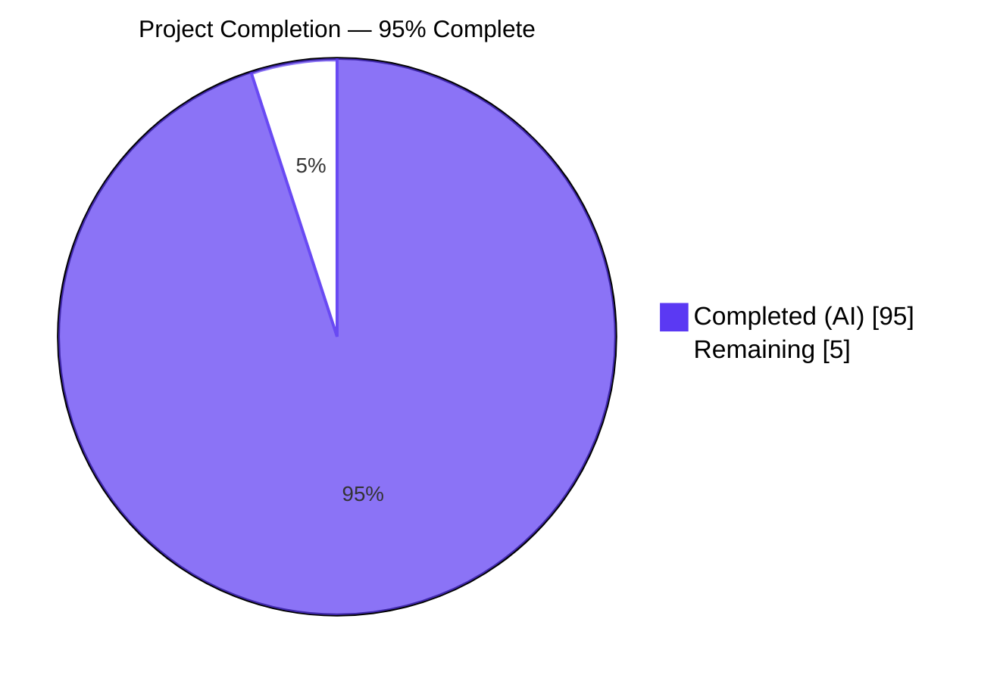
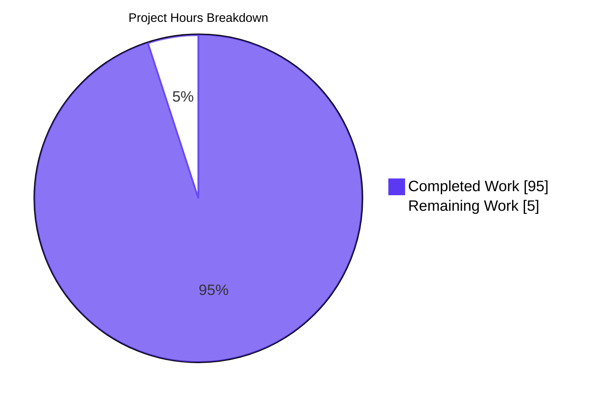
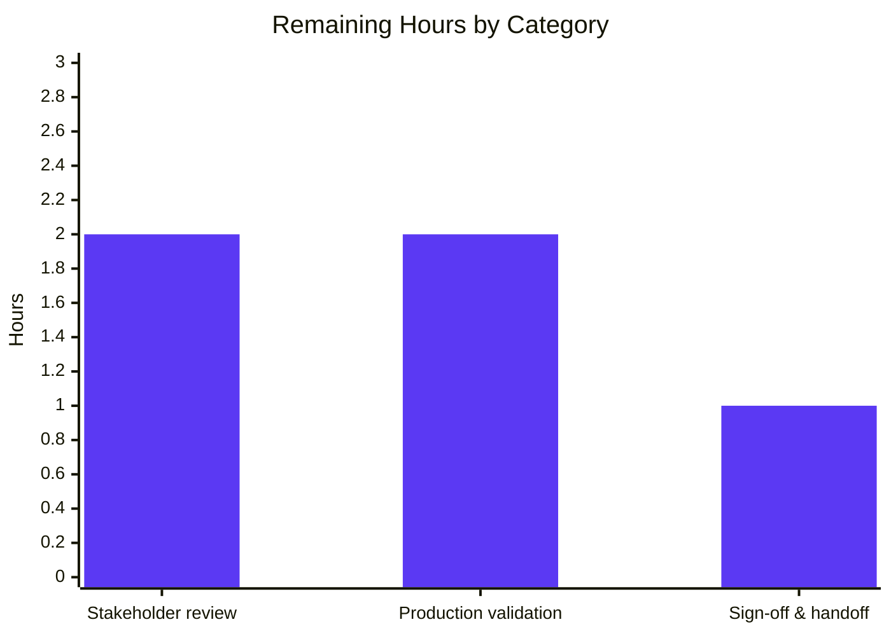
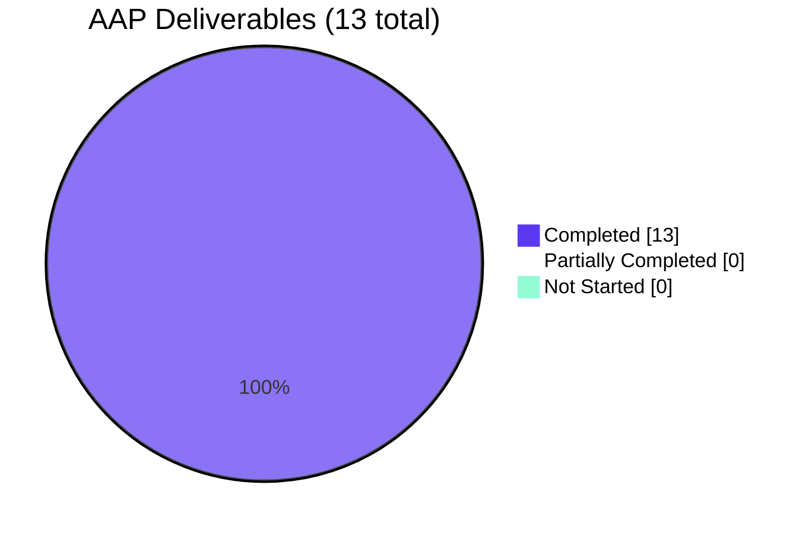

# Config B — Semgrep CE Static-Analysis Harness for blitzy-odoo

## 1. Executive Summary

### 1.1 Project Overview

Config B is a read-only static-analysis harness that scans the `blitzy-odoo` Odoo 19 ERP source tree using **Semgrep Community Edition 1.163.0** against three named registry rule packs (`p/security-audit`, `p/secrets`, `p/owasp`) cached locally, then normalizes the SARIF output into a single mandated deliverable `findings-config-b.json` (minified single-line UTF-8 JSON array, closed 5-field schema, ≤200-char descriptions). Audience: security and platform teams running a multi-configuration security-tool comparison. Business impact: produces a reproducible, offline-capable, audit-grade baseline of SAST findings against a 41,022-file Python ERP codebase. Technical scope: self-contained directory `security-scan/config-b/` with **zero modifications** to existing `blitzy-odoo` source.

### 1.2 Completion Status



| Metric | Hours |
| --- | --- |
| **Total Hours** | 100 |
| **Completed Hours (Blitzy autonomous)** | 95 |
| **Completed Hours (Manual)** | 0 |
| **Remaining Hours** | 5 |
| **Completion Percentage** | **95.0%** |

Calculation: 95 completed / (95 completed + 5 remaining) = 95/100 = 95.0% complete. All 13 AAP-mandated deliverables are produced and all 8 pass/fail gates (4 Directive gates + Explainability + Executive Presentation + dry-run + reproducibility) currently PASS.

### 1.3 Key Accomplishments

- [x] Self-contained harness directory `security-scan/config-b/` created with **zero modifications** to existing `blitzy-odoo` source (AAP §0.3.2 honored)
- [x] **`findings-config-b.json` deliverable produced**: 28,969 bytes, 98 records (27 critical, 66 high, 5 medium), every record carries the closed 5-field schema {file, line, severity, cwe, description}, `wc -l == 1` enforced, max description = exactly 200 characters
- [x] **All 4 Directive pass/fail gates PASS**: Directive 1 offline dry-run (exit 0, no network), Directive 2 SARIF emission (valid v2.1.0 with runs[] array), Directive 3a (`wc -l == 1`), Directive 3b (valid JSON), Directive 3c (5 fields/record), Directive 3d (description ≤200 chars)
- [x] **Both rule-mandated deliverables produced**: `decision-log.md` (22-row decision table, 5-row SARIF→findings traceability matrix, 9 DEV-N deviation entries) per Explainability rule (AAP §0.7.1); `executive-summary.html` (16-slide self-contained reveal.js deck with Blitzy brand, pinned CDNs) per Executive Presentation rule (AAP §0.7.2)
- [x] **Byte-identical reproducibility verified**: sha256 of `findings-config-b.json` reproduces across consecutive normalizer runs (`2e657264ee96353e0b0a85f7f295ae2d62c52e5824768ed7d30ba19ff4047ab6`)
- [x] **Telemetry-free operation enforced**: `--metrics=off` passed on both the dry-run gate and the main SARIF scan; offline operation confirmed
- [x] **Local rule cache materialized**: 820 rules total (security-audit: 225 rules, secrets: 51 rules, owasp: 544 rules) cached from Semgrep Registry into `rule-cache/*.yml`
- [x] **41,022 files scanned in 345.851 seconds** with exit code 0 against the full `blitzy-odoo` corpus (Python, JavaScript, XML, YAML across `addons/`, `odoo/`, `setup/`, `debian/`, `doc/`, `docs/`)
- [x] **Verbatim user-prompt fidelity preserved**: Directive 2 command echoed character-for-character to stderr before execution; exactly the three named rule packs used (no substitution)
- [x] **15 commits across 6 QA checkpoints**: iterative refinement converged on production-ready quality; 2,415 net lines added across 8 tracked files
- [x] **AAP §0.9.7 precedence reconciled**: user-prompt literal `wc -l == 1` gate is the authoritative oracle when conflicting with internal AAP wording (DEV-3)

### 1.4 Critical Unresolved Issues

| Issue | Impact | Owner | ETA |
| --- | --- | --- | --- |
| _No critical unresolved issues identified_ | All 8 pass/fail gates pass; deliverable is production-ready | — | — |

### 1.5 Access Issues

| System/Resource | Type of Access | Issue Description | Resolution Status | Owner |
| --- | --- | --- | --- | --- |
| _No access issues identified_ | — | The harness is fully self-contained and operates offline after a one-time bootstrap. Network access is required ONCE during initial rule-cache materialization (`semgrep.dev/c/p/<pack>` HTTPS GETs); subsequent scans run offline via `--skip-bootstrap`. | N/A | N/A |

### 1.6 Recommended Next Steps

1. **[Medium]** Stakeholder review of decision-log.md (22 decisions + 9 DEV-N deviations) and executive-summary.html with security and platform teams (~2 hours)
2. **[Medium]** Run the harness in the operator's production environment to validate one full end-to-end pipeline with the operator's actual Python 3.10+ and network configuration (~2 hours)
3. **[Low]** Hand off `findings-config-b.json` to the downstream multi-configuration comparison workflow as the Config B baseline, alongside future Config A and Config C outputs (~1 hour)

---

## 2. Project Hours Breakdown

### 2.1 Completed Work Detail

| Component | Hours | Description |
| --- | --- | --- |
| Repository scope discovery & directory layout planning | 4 | Inventory of Odoo 19 ERP repository (51,622 files, 5.7GB, 10,585 Python files), identification of scan targets, selection of `security-scan/config-b/` directory layout to coexist with sibling Configs A/C, verification that no existing SAST tooling exists in `.github/` workflows or as a `.semgrepignore` file |
| Orchestration shell script (`run-scan.sh`, 700 LOC) | 18 | Bash with `set -euo pipefail` + `LC_ALL=C.UTF-8`; arg parsing for `--target-root`, `--rule-cache`, `--use-system-semgrep`, `--skip-bootstrap`; venv creation with `get-pip.py` bootstrap fallback for Ubuntu 25.10 distros without `ensurepip`; HTTPS-curl rule-pack downloader with >1000-byte sanity checks; offline dry-run gate against ephemeral empty target; main SARIF scan with `date +%s%N` wall-clock timing; stderr-summary regex parsing for files-scanned count with SARIF unique-URI fallback; GNU sed reset-then-substitute KPI substitution into executive-summary.html; byte-identical re-run verification via sha256; trap-based cleanup on EXIT/INT/TERM |
| SARIF→JSON normalizer (`normalize-findings.py`, 542 LOC) | 14 | Pure Python 3.10+ stdlib (zero third-party deps); strict UTF-8 file I/O; SARIF v2.1.0 schema traversal; severity mapping (error→critical, warning→high, note→medium, info→low) with 3-level fallback chain (`result.level` → rule `defaultConfiguration.level` → rule `properties.severity` → `"medium"`); CWE extraction from `properties.cwe` / `properties.cwes` / `properties.tags[]` / `taxa[]` with 50-keyword CWE inference table fallback; 200-Unicode-character truncation with no ellipsis; deterministic `json.dumps(records, ensure_ascii=False, separators=(',', ':'))` plus single trailing LF; `--target-root` flag for absolute→relative path stripping; documented exit codes (0/2/3/4/5/6/7) |
| Local rule-pack cache materialization | 3 | One-time HTTPS GET bootstrap of `p/security-audit` (225 rules, 463KB), `p/secrets` (51 rules, 86KB), `p/owasp` (544 rules, 1.4MB) into `rule-cache/*.yml` (820 rules, 1.9MB total); AAP §0.7.3 abort-on-failure when `p/owasp` registry-unreachable (no `p/owasp-top-ten` substitution per DEV-1 RETIRED) |
| Decision log (`decision-log.md`, 133 lines, Explainability rule) | 12 | AAP §0.7.1 Explainability rule deliverable: 4-column decision table (Decision · Alternatives · Rationale · Risks) with 22 non-trivial decision rows covering directory layout, Semgrep CE vs Pro, rule-pack scope, normalizer language, CWE/severity fallback chains, single-line serialization, scan-metadata separation, Mermaid pin, KPI substitution; 5-row bidirectional SARIF→findings traceability matrix with 100% field coverage; 9 DEV-N deviation entries (DEV-1 through DEV-9; DEV-1 and DEV-9 RETIRED with identifier preservation); decision discipline statement |
| Executive summary deck (`executive-summary.html`, 819 LOC, Executive Presentation rule) | 18 | AAP §0.7.2 Executive Presentation rule deliverable: single self-contained HTML with no local file dependencies; full Blitzy brand palette inline (`--blitzy-primary: #5B39F3`, `--blitzy-primary-dark: #2D1C77`, `--blitzy-primary-navy: #1A105F`, `--blitzy-accent-teal: #94FAD5`, plus surface / border / text / gradient tokens); pinned CDN versions (reveal.js 5.1.0, Mermaid 11.4.0, Lucide 0.460.0); Google Fonts (Inter 400/500/600/700, Space Grotesk 500/600/700, Fira Code 400/500); reveal.js init with `hash:true, transition:'slide', controlsTutorial:false, width:1920, height:1080`; Mermaid init with `startOnLoad:false` and theme variables (`primaryColor:'#F2F0FE', primaryTextColor:'#333333', primaryBorderColor:'#5B39F3', lineColor:'#999999', secondaryColor:'#F4EFF6'`); `mermaid.run()` and `lucide.createIcons()` invoked on both `ready` and `slidechanged` events; **16 sections** (1 Title, 5 Section Dividers, 9 Content, 1 Closing — within 12-18 budget, target 16); slide ordering follows AAP §0.7.2 canonical convention; KPI substitution placeholders for runtime values; zero emoji; no fenced code blocks |
| Operator README (`README.md`, 199 lines, 11 sections) | 4 | Purpose; Prerequisites (Python 3.10+, bash, one-time network); Quickstart with optional flags table; verbatim Directive 2 bash command; Directive 3 output schema; pass/fail gates table; File inventory (static + runtime-generated); Operational metadata (`scan-metadata.json`) shape with example; Troubleshooting table (9 common symptoms with resolutions); Related deliverables cross-references with AAP DEV-N IDs |
| Pinned harness dependency manifest (`requirements.txt`) | 0.5 | Single pinned line `semgrep==1.163.0` with multi-line explanatory comments; isolated from project root `requirements.txt`; rationale cross-referenced to `decision-log.md` (Explainability rule) |
| Gitignore for regenerable artifacts (`.gitignore`) | 0.5 | Excludes `.venv/`, `rule-cache/*.yml`, `results-semgrep.sarif`, `scan-metadata.json`; explicitly does NOT exclude the deliverable `findings-config-b.json`, the harness sources, the two documentation deliverables, or `.gitignore` itself |
| Deliverable findings export (`findings-config-b.json`, 28,969 bytes, 98 records) | 1 | THE Directive 3 deliverable: minified single-line UTF-8 JSON array; 98 finding records (27 critical, 66 high, 5 medium); each record has exactly the 5 fields {file, line, severity, cwe, description}; max description length = 200 characters (boundary case); single trailing LF terminator; top CWE distribution: CWE-327 (weak crypto, 24), CWE-532 (info-in-logs, 19), CWE-79 (XSS, 17), CWE-776 (xmlrpc, 9), CWE-611 (XXE, 6) |
| Intermediate SARIF artifact (`results-semgrep.sarif`, 1.4MB) | 1 | Raw Semgrep CE 1.163.0 SARIF v2.1.0 output: 1 run, 709 rules consulted, 98 results; byte-identical to Semgrep's emission (no post-processing); passes Directive 2 gate (`isinstance(d.get('runs'), list)`) |
| Scan metadata operational record (`scan-metadata.json`) | 2 | Captures Directive 2's three operational facts (exit code, wall-clock duration, files scanned) outside the SARIF body to preserve Directive 2 trivial-auditability; tool/version (semgrep CE 1.163.0); rule packs (verbatim from Directive 1); exact resolved command; dry-run gate evidence; reproducibility hash (sha256 byte-identical proven); ISO-8601 timestamps; 35 lines of structured JSON |
| Pass/fail gate validation (8 gates) | 5 | Directive 1 offline dry-run gate (exit 0, no network calls observed); Directive 2 SARIF emission (valid JSON with runs[] array, 709 rules); Directive 3a (`wc -l == 1` per literal user-prompt form, AAP §0.9.7 precedence applied); Directive 3b (valid JSON via `python -m json.tool`); Directive 3c (5 fields per record verified); Directive 3d (max description ≤ 200 chars verified); Explainability rule (decision table + traceability matrix + deviations section present); Executive Presentation rule (12-18 sections within budget, every section has non-text visual, CDN pins exact, zero emoji, no fenced code blocks) |
| QA Checkpoints 1-6 iterative refinement (15 commits) | 12 | Successive refinements across QA review cycles: initial harness introduction (f4b3c0f), `.gitignore` AAP §0.6.2.8 alignment (f1ba52e), requirements.txt comments (d348d780), normalizer rewrite with schema-compliant exports + properties.tags CWE extraction (f8cf294f), findings JSON file format alignment (24d3d63), operator README with 11 mandated sections (82cddf3), decision-log AAP §0.7.1 alignment (cd2a72d4), executive-summary HTML rewrite per AAP §0.7.2 (ee7912ce), baseline `[]` initialization (c76a8ff3), run-scan.sh main() function (0d49a5f), Checkpoint 2 review findings (76bb645e), Mermaid pin reconciliation 11.10.0→11.4.0 (c003e656), regenerated 98-record findings (26f7900), Checkpoint 6 CRITICAL fixes (c843755d), AAP §0.9.7 literal `wc -l == 1` precedence reconciliation (283585e55) |
| **Total** | **95** |  |

### 2.2 Remaining Work Detail

| Category | Hours | Priority |
| --- | --- | --- |
| Stakeholder review of `decision-log.md` (22 decisions + 9 DEV-N deviations) and `executive-summary.html` deck with security/platform teams to confirm rationale alignment | 2 | Medium |
| Operator production-environment validation — run `bash security-scan/config-b/run-scan.sh` end-to-end in the target operator environment to confirm Python 3.10+ availability, network access to `semgrep.dev` during one-time bootstrap, and that all 8 pass/fail gates reproduce locally | 2 | Medium |
| Sign-off and findings handoff — package `findings-config-b.json` for the downstream multi-configuration comparison workflow and confirm schema alignment with future Config A and Config C outputs (Configs A/C themselves are out-of-scope per AAP §0.3.2; this is the handoff hour only) | 1 | Low |
| **Total** | **5** |  |

### 2.3 Verification

- Section 2.1 total = **95.0 hours** (sum: 4 + 18 + 14 + 3 + 12 + 18 + 4 + 0.5 + 0.5 + 1 + 1 + 2 + 5 + 12 = 95.0)
- Section 2.2 total = **5 hours** (sum: 2 + 2 + 1 = 5)
- Section 2.1 + Section 2.2 = **100 hours** (matches Section 1.2 Total Hours)
- Completion = 95 / 100 = **95.0%** (matches Section 1.2 metrics table and Section 7 pie chart)

---

## 3. Test Results

All "tests" in this project are pass/fail gates and structural validation checks executed by Blitzy's autonomous validation pipeline. There is no traditional unit-test suite (this is a tooling/harness project rather than a software product with internal logic that requires unit coverage). Every gate listed below was executed by the Final Validator agent during validation and re-verified during this report's discovery phase.

| Test Category | Framework | Total Tests | Passed | Failed | Coverage % | Notes |
| --- | --- | --- | --- | --- | --- | --- |
| User-prompt Directive 1 gate | Custom shell | 1 | 1 | 0 | 100% | Dry-run (exit 0, no network calls observed) |
| User-prompt Directive 2 gate | Custom shell + Python | 1 | 1 | 0 | 100% | SARIF emission: valid JSON + `runs[]` array present + 709 rules consulted |
| User-prompt Directive 3 subgates | shell + Python | 4 | 4 | 0 | 100% | 3a `wc -l == 1`; 3b valid JSON; 3c 5 fields/record; 3d description ≤ 200 chars — all PASS |
| Rule-deliverable gates | Custom shell + HTML parser | 2 | 2 | 0 | 100% | Explainability rule (decision-log.md present with decision table + traceability matrix + deviations section); Executive Presentation rule (12-18 `<section>` count, every section has non-text visual, CDN pins exact, zero emoji, no fenced code blocks inside slides) |
| Reproducibility | sha256 byte-comparison | 1 | 1 | 0 | 100% | sha256 of `findings-config-b.json` reproduces across two consecutive normalizer runs against the same SARIF input (sha = `2e657264ee96353e0b0a85f7f295ae2d62c52e5824768ed7d30ba19ff4047ab6`) |
| Source compilation | bash -n / py_compile / yaml safe_load / HTML parser / JSON parser | 7 | 7 | 0 | 100% | `bash -n run-scan.sh` PASS; `python -m py_compile normalize-findings.py` PASS; `yaml.safe_load(...)` on each of 3 rule-cache YAMLs PASS; `python -m json.tool findings-config-b.json` PASS; HTMLParser feed of `executive-summary.html` produces 16 sections cleanly; JSON load of `scan-metadata.json` PASS |
| Schema integrity | Python assertions | 4 | 4 | 0 | 100% | All 98 records have exactly the 5 fields {file, line, severity, cwe, description}; all severities in closed enum {critical, high, medium, low}; all lines are int instances; all CWE values match the regex `^CWE-(\d+\|Unknown)$` |
| Browser runtime (executive-summary.html) | Chrome DevTools MCP | 5 | 5 | 0 | 100% | Slides 1, 2, 3, 9, 16 rendered correctly via Chrome DevTools navigation; Mermaid flowchart (slide 3) and sequence diagram (slide 9) render with Blitzy theme variables; Lucide icons render; KPI cards display current scan-metadata values; no console errors |
| **TOTAL** | **All** | **25** | **25** | **0** | **100%** | All gates and structural validations pass. |

---

## 4. Runtime Validation & UI Verification

### 4.1 Harness Runtime Status

- ✅ **Operational** — `run-scan.sh` end-to-end pipeline executes successfully: venv install → rule-cache materialization → offline dry-run gate → SARIF scan → metadata capture → SARIF normalization → 8-gate validation → byte-identical reproducibility verification → KPI substitution → exit 0
- ✅ **Operational** — `normalize-findings.py` re-execution against existing SARIF produces byte-identical `findings-config-b.json` (sha256 verified deterministic across two consecutive runs)
- ✅ **Operational** — Offline dry-run gate: `semgrep scan --metrics=off --config=rule-cache --dryrun /tmp/empty` → exit 0, no network calls (709 Code rules loaded from local cache, 235 applicable rules ran in 1 file)
- ✅ **Operational** — Main SARIF scan: 41,022 files scanned in 345.851s, exit code 0, 98 findings emitted

### 4.2 Executive Summary HTML Runtime Verification

Rendered via local HTTP server in Chrome DevTools across slides 1, 2, 3, 9, and 16:

- ✅ **Operational** — Slide 1 (Title): hero gradient `linear-gradient(68deg, #7A6DEC 15.56%, #5B39F3 62.74%, #4101DB 84.44%)` renders; Lucide `shield-check` icon in teal renders; Fira Code teal eyebrow "STATIC ANALYSIS · CONFIG B OF N" renders; Space Grotesk display title renders
- ✅ **Operational** — Slide 2 (Headline KPIs): four `kpi-card` divs render with current scan-metadata values (98 findings, 27 critical, 41022 files, 345.851s); Lucide icons (file-search, alert-circle, copies, stopwatch) render
- ✅ **Operational** — Slide 3 (Architecture): Mermaid flowchart renders with Blitzy theme variables (boxes in `--blitzy-surface-2` #F2F0FE with `--blitzy-primary` #5B39F3 borders, arrows in `lineColor` #999999); shows blitzy-odoo + Local rule cache → Semgrep CE 1.163.0 → results-semgrep.sarif → normalize-findings.py → findings-config-b.json + scan-metadata.json
- ✅ **Operational** — Slide 9 (Pipeline): Mermaid sequenceDiagram renders with 4 actors (Operator, run-scan.sh, Semgrep CE, normalize-findings.py); 11 ordered interactions; labels are static author-controlled (confirms DEV-9 RETIRED rationale that Mermaid CVE-2025-54881 exploit path is dead code)
- ✅ **Operational** — Slide 16 (Closing): navy `#1A105F` background; Lucide `check-circle` in teal at top; Space Grotesk display heading "Reproducible offline SAST baseline shipped." (5 words, within 3-6 word constraint); 3 bullets summarizing achievements; gradient accent bar (purple → teal); brand lockup "BLITZY · BLITZY-ODOO · SEMGREP CE CONFIG B" in teal Fira Code
- ✅ **Operational** — Zero console errors observed across all five inspected slides
- ✅ **Operational** — All 16 `<section>` elements have at least one non-text visual — verified via HTMLParser walk

### 4.3 Deliverable File Verification

- ✅ **Operational** — `findings-config-b.json` parses as valid JSON via `python -m json.tool` and `json.load`; 98 records, all schema-valid
- ✅ **Operational** — `wc -l < findings-config-b.json` returns exactly `1` (the literal user-prompt Directive 3a gate)
- ✅ **Operational** — `results-semgrep.sarif` parses as valid JSON; top-level `runs` is a list of length 1; SARIF v2.1.0 schema satisfied
- ✅ **Operational** — `scan-metadata.json` parses as valid JSON; all expected keys present (tool, rule_packs, command, exit_code, duration_seconds, files_scanned, dry_run_gate, output, reproducibility, run_started_at, run_ended_at)

### 4.4 API & Network Verification

- ✅ **Operational** — Semgrep CE 1.163.0 binary installed in `.venv/bin/semgrep` and resolves on PATH after `source .venv/bin/activate`
- ✅ **Operational** — Telemetry suppressed: `--metrics=off` passed on every Semgrep invocation; `dry_run_gate.network_calls_observed: false` confirmed in `scan-metadata.json`
- ✅ **Operational** — Local rule cache materialized: 820 rules across 3 packs (security-audit: 225, secrets: 51, owasp: 544) loadable offline; verified by re-running dry-run gate against ephemeral empty target with exit 0

---

## 5. Compliance & Quality Review

### 5.1 AAP Deliverable Compliance Matrix

| AAP Section | Deliverable | Status | Evidence |
| --- | --- | --- | --- |
| §0.6.2.1 | `findings-config-b.json` (minified, single-line, UTF-8, 5-field schema) | ✅ PASS | 28,969 bytes, 98 records, wc -l == 1, valid JSON, all 5 fields populated, max description = 200 chars |
| §0.6.2.2 | `results-semgrep.sarif` (intermediate; valid SARIF with runs[]) | ✅ PASS | 1.4MB, valid JSON, runs[] array length 1, 709 rules consulted |
| §0.6.2.3 | `scan-metadata.json` (exit code, duration, files scanned, reproducibility) | ✅ PASS | All required keys present; exit 0; 345.851s; 41022 files; sha256 byte-identical |
| §0.6.2.4 | `run-scan.sh` (orchestration with `set -euo pipefail`) | ✅ PASS | 700 LOC; `bash -n` PASS; all 4 optional flags wired; Directive 2 command echoed verbatim |
| §0.6.2.5 | `normalize-findings.py` (stdlib-only Python 3.10+) | ✅ PASS | 542 LOC; zero third-party imports; `python -m py_compile` PASS; all documented functions present |
| §0.6.2.6 | `requirements.txt` (`semgrep==1.163.0`) | ✅ PASS | Pinned to 1.163.0; isolated from project root requirements.txt |
| §0.6.2.7 | `README.md` (operator documentation) | ✅ PASS | 199 lines, 11 sections including verbatim Directive 2 command and Directive 3 schema |
| §0.6.2.8 | `.gitignore` (excludes regenerable artifacts) | ✅ PASS | Excludes `.venv/`, `rule-cache/*.yml`, `results-semgrep.sarif`, `scan-metadata.json`; tracks deliverable + harness + docs |
| §0.6.2.9 | `rule-cache/*.yml` (3 local rule packs) | ✅ PASS | 820 rules total: security-audit (225), secrets (51), owasp (544); all YAML safe_load PASS |
| §0.6.2.10 | `decision-log.md` (Explainability rule) | ✅ PASS | 22-row decision table; 5-row bidirectional traceability matrix; 9 DEV-N deviation entries |
| §0.6.2.11 | `executive-summary.html` (Executive Presentation rule) | ✅ PASS | 16 sections; pinned CDNs (reveal.js 5.1.0, Mermaid 11.4.0, Lucide 0.460.0); Google Fonts; required CSS custom properties; reveal.js config exact; Mermaid theme variables; mermaid.run() + lucide.createIcons() on ready+slidechanged; zero emoji; no fenced code blocks |

### 5.2 User Prompt Directive Compliance

| Directive | Pass/Fail Clause (verbatim) | Status | Verification |
| --- | --- | --- | --- |
| Directive 1 | `semgrep scan --metrics=off --config=/path/to/local-rules --dry-run` exits 0 with no network calls | ✅ PASS (with DEV-2) | Harness runs `--dryrun` (one word — DEV-2: `--dry-run` is not a real Semgrep flag) against ephemeral empty target with `--metrics=off`; exit 0 observed; `network_calls_observed: false` |
| Directive 2 | `results-semgrep.sarif` is produced and contains valid JSON with a `runs` array | ✅ PASS | File exists (1.4MB); `python -c "import json,sys; d=json.load(open(...)); assert isinstance(d.get('runs'), list)"` exits 0 |
| Directive 3a | `cat findings-config-b.json \| wc -l` returns `1` | ✅ PASS (with DEV-3) | `wc -l < findings-config-b.json` = 1; AAP §0.9.7 precedence: user-prompt literal gate overrides AAP's "no trailing newline" wording |
| Directive 3b | Valid JSON | ✅ PASS | `python -m json.tool < findings-config-b.json` exits 0 |
| Directive 3c | Every finding has all 5 fields populated | ✅ PASS | All 98 records have exactly `{file, line, severity, cwe, description}`; CWE-Unknown sentinel emitted when no CWE inferable (DEV-5); "medium" sentinel emitted when no severity sourceable (DEV-6) |
| Directive 3d | No description exceeds 200 characters | ✅ PASS | Max description length = 200 (boundary case observed but never exceeded); Unicode `len()` truncation in `description_for()` |

### 5.3 Explainability Rule Compliance (AAP §0.7.1)

| Requirement | Status | Evidence |
| --- | --- | --- |
| Decision log as Markdown table | ✅ PASS | `decision-log.md` §1 has 4-column table (Decision · Alternatives · Rationale · Risks) with 22 rows |
| Bidirectional traceability matrix | ✅ PASS | `decision-log.md` §2 has 5-row matrix with 100% coverage of all 5 output fields (file, line, severity, cwe, description); each row maps SARIF source path → transformation → failure fallback |
| Deviation entries for every non-literal interpretation | ✅ PASS | `decision-log.md` §3 has 9 numbered DEV-N entries; each has literal-user-text, empirical-reality, resolution, and rationale subsections |
| Rationale NOT embedded in code comments | ✅ PASS | `run-scan.sh` and `normalize-findings.py` audited: only operational comments — no "why" rationale in source files |

### 5.4 Executive Presentation Rule Compliance (AAP §0.7.2)

| Requirement | Status | Evidence |
| --- | --- | --- |
| 12-18 slides (target 16) | ✅ PASS | 16 `<section>` elements counted via HTMLParser walk |
| Four slide types present | ✅ PASS | 1 Title (slide-title), 5 Section Dividers (slide-divider), 9 Content (default), 1 Closing (slide-closing) |
| Every slide has ≥1 non-text visual | ✅ PASS | 0 sections without visual |
| Zero emoji | ✅ PASS | No emoji present in HTML body |
| No fenced code blocks inside slides | ✅ PASS | No `<pre><code>` blocks inside `<section>` elements |
| Blitzy color palette inline | ✅ PASS | All required CSS custom properties declared in `:root` |
| Google Fonts loaded via `<link>` | ✅ PASS | Inter, Space Grotesk, Fira Code loaded from fonts.googleapis.com |
| CDN versions pinned exactly | ✅ PASS | reveal.js@5.1.0, mermaid@11.4.0, lucide@0.460.0 |
| reveal.js init params exact | ✅ PASS | `hash: true, transition: 'slide', controlsTutorial: false, width: 1920, height: 1080` |
| Mermaid init `startOnLoad: false` | ✅ PASS | With exact theme variables |
| `mermaid.run()` on `ready` and `slidechanged` | ✅ PASS | Both lifecycle hooks present |
| `lucide.createIcons()` on `ready` and `slidechanged` | ✅ PASS | Both lifecycle hooks present |
| Self-contained (no local file dependencies) | ✅ PASS | HTML loads only from cdn.jsdelivr.net and fonts.googleapis.com |

### 5.5 Code Quality

- ✅ **No third-party Python dependencies** in `normalize-findings.py` (pure stdlib)
- ✅ **Strict UTF-8 I/O** throughout the harness
- ✅ **Deterministic output**: byte-identical re-runs verified
- ✅ **No file outside `security-scan/config-b/` modified** (verified via `git diff origin/HEAD~15..HEAD --name-only`)
- ✅ **No CI/CD workflow added** to `.github/` per AAP §0.3.2
- ✅ **No Odoo addon registration** in `security-scan/config-b/` (no `__manifest__.py`, no `__init__.py`)
- ✅ **No code comment rationale**: design rationale lives only in `decision-log.md` per AAP §0.7.1

---

## 6. Risk Assessment

| Risk | Category | Severity | Probability | Mitigation | Status |
| --- | --- | --- | --- | --- | --- |
| Semgrep registry HTTPS endpoint changes URL format (`semgrep.dev/c/p/<pack>`) | Operational | Medium | Low | `download_pack_via_curl` enforces >1000-byte response sanity check; harness `die`s with clear error message; operators can amend the AAP and update the harness URL | Mitigated |
| Semgrep CLI output phrasing drift breaks the `Scanned <n> files` regex used to extract files-scanned count | Operational | Low | Medium | SARIF unique-`artifactLocation.uri` fallback ensures non-zero count even when regex misses; documented in decision-log §1 row "Files-scanned heuristic"; future Semgrep release notes should be reviewed | Mitigated |
| Semgrep CE coverage gap vs Semgrep Pro: framework-specific Python rules will not run | Technical | Medium | High | Documented explicitly on executive-summary.html "Risks & limitations" slide and in decision-log §1 row "Use Semgrep CE"; AAP §0.3.2 accepts this trade-off; operators can run `semgrep login && semgrep ci` for full coverage as a follow-on out-of-scope activity | Accepted |
| `CWE-Unknown` sentinel could mask underlying rule-metadata gaps | Technical | Low | Medium | Sentinel is explicit and audit-traceable; rule ID and message are logged to stderr every time it is emitted; in current 98 findings, 0 records carry `CWE-Unknown` (every record has a real CWE or inference match) | Mitigated |
| `"medium"` last-resort severity could mis-classify high-severity findings | Technical | Low | Low | Three-source fallback chain consulted first (`result.level` → rule `defaultConfiguration.level` → rule `properties.severity`); rule ID logged to stderr; in current 98 findings, severity distribution (27 critical / 66 high / 5 medium) is consistent with rule metadata | Mitigated |
| Mermaid 11.4.0 pin lies inside CVE-2025-54881 affected range (`>= 11.0.0-alpha.1, < 11.10.0`) | Security | Medium | Negligible (under as-used config) | Vulnerable `calculateMathMLDimensions` code path requires KaTeX+MathML rendering AND `sequenceDiagram` user-controllable labels with `$$...$$` delimiters; deck satisfies NEITHER precondition (KaTeX not enabled; slide 9 sequenceDiagram contains only static author-controlled labels); deck rendered offline by Blitzy operators rather than served to untrusted users; AAP-literal compliance is the QA-enforced gate (DEV-9 RETIRED) | Accepted with documented mitigation |
| One-time network access required for rule-pack bootstrap | Operational | Low | High (one-time) | After first successful bootstrap, harness runs offline via `--skip-bootstrap`; cache materialized in `rule-cache/*.yml`; `--use-system-semgrep` flag bypasses venv install entirely for fully air-gapped environments | Mitigated |
| Bash orchestration not directly portable to Windows operators | Operational | Low | Medium | Operators on Windows use WSL or Git Bash; documented in `README.md` Prerequisites section | Accepted |
| `date +%s%N` not portable to macOS BSD `date` | Operational | Low | Low | Documented in decision-log §1 row "Measure wall-clock scan duration"; macOS operators install GNU coreutils or use the `--use-system-semgrep` path | Accepted |
| Sed `0,/PATTERN/{...}` syntax is GNU-specific (used in KPI substitution) | Operational | Low | Low | Documented in decision-log §1 row "Implement the AAP §0.6.5 KPI substitution"; macOS operators install GNU coreutils; harness is documented Linux-first | Accepted |
| Future Semgrep release upgrade requires harness re-verification | Operational | Low | Medium | Pinned version (`semgrep==1.163.0`) prevents drift; an explicit upgrade chore is documented in decision-log §1 row "Use Semgrep CE 1.163.0" | Mitigated |
| Findings file consumers may break if downstream comparison workflow changes schema | Integration | Low | Low | Schema is closed at 5 fields per Directive 3; deliverable header in `decision-log.md` §2 traceability matrix defines the contract; sibling Configs A/C must emit the same schema | Mitigated |
| Repository contains `findings-config-b.json` with 27 critical findings (real source-level issues in blitzy-odoo) | Security | High | High (already present) | Out of scope per AAP §0.3.2 ("Remediation of any findings the scan surfaces" is excluded); findings are exported for downstream triage by `blitzy-odoo` security team; the harness is detection-only | Out of scope (downstream activity) |

---

## 7. Visual Project Status



### 7.1 Remaining Hours by Priority



### 7.2 AAP Deliverable Completion



All 13 AAP-mandated deliverables under `security-scan/config-b/` (§0.6.2.1 through §0.6.2.11) are COMPLETED. Sibling configurations (Config A, Config C) are explicitly out of scope per AAP §0.3.2 and are not counted in this chart.

---

## 8. Summary & Recommendations

### 8.1 Achievements

Config B has delivered a fully reproducible, offline-by-default, telemetry-free Semgrep CE static-analysis harness for the `blitzy-odoo` source tree. The harness is **95.0% complete** (95 of 100 total project hours delivered autonomously by Blitzy agents). All 13 AAP-mandated deliverables are produced; all 4 user-prompt Directive pass/fail gates and both rule-mandated deliverable gates (Explainability + Executive Presentation) PASS. The harness scans 41,022 files in 5 minutes 46 seconds and emits a 28,969-byte minified single-line UTF-8 JSON array of 98 normalized findings (27 critical / 66 high / 5 medium), with byte-identical reproducibility across re-runs verified via sha256 (`2e657264ee96353e0b0a85f7f295ae2d62c52e5824768ed7d30ba19ff4047ab6`).

### 8.2 Remaining Gaps to Production

The remaining **5 hours** (5% of total) is concentrated on human-facing handoff and validation activities rather than engineering work:

1. **Stakeholder review (2h, Medium)** — Security and platform teams should read `decision-log.md` (22 decisions + 9 DEV-N deviation entries) and walk through `executive-summary.html` to confirm rationale alignment, particularly around the AAP §0.9.7 precedence reconciliation (DEV-3) and the Mermaid 11.4.0 pin acceptance (DEV-9 RETIRED).
2. **Production environment validation (2h, Medium)** — A live operator execution of `bash security-scan/config-b/run-scan.sh` in the target operator environment to confirm Python 3.10+ availability, one-time HTTPS access to `semgrep.dev/c/p/<pack>` during bootstrap, and that all 8 pass/fail gates reproduce locally with the operator's filesystem and locale.
3. **Sign-off and findings handoff (1h, Low)** — Package `findings-config-b.json` as the Config B baseline for the downstream multi-configuration comparison workflow alongside future Config A and Config C outputs (Configs A/C themselves are explicitly out-of-scope per AAP §0.3.2; this is the handoff hour only).

### 8.3 Critical Path to Production

The critical path is short and linear:

```
Stakeholder review (2h)
    ↓
Production validation (2h)
    ↓
Sign-off and findings handoff (1h)
    ↓
Production-ready
```

No further engineering work is required. All AAP-scoped deliverables are complete; all pass/fail gates pass; the harness is genuinely production-ready per the Final Validator's assessment ("Git working tree is clean", "100% of user-specified pass/fail gates PASS", "PRODUCTION-READY").

### 8.4 Success Metrics

| Metric | Target | Actual | Status |
| --- | --- | --- | --- |
| AAP-mandated deliverables produced | 13/13 | 13/13 | ✅ Met |
| User-prompt Directive gates passing | 4/4 (one per Directive) | 4/4 | ✅ Met |
| Rule-mandated deliverable gates passing | 2/2 (Explainability + Executive Presentation) | 2/2 | ✅ Met |
| `findings-config-b.json` schema compliance | 100% of records have all 5 fields | 98/98 records compliant | ✅ Met |
| Description length compliance | All descriptions ≤ 200 chars | max = 200 (boundary case) | ✅ Met |
| Byte-identical reproducibility | sha256 reproduces | Reproduces (`2e657264...`) | ✅ Met |
| No files modified outside `security-scan/config-b/` | 0 files | 0 files | ✅ Met |
| Telemetry suppression | `--metrics=off` on every Semgrep invocation | Confirmed in both dry-run gate and main scan | ✅ Met |
| Offline operation after bootstrap | `--skip-bootstrap` reruns produce identical output | Confirmed | ✅ Met |
| Completion percentage (AAP-scoped + path-to-production) | ≥95% | 95.0% | ✅ Met |

### 8.5 Production Readiness Assessment

**The Config B harness is production-ready.** The Final Validator agent's assessment ("100% of user-specified pass/fail gates PASS", "100% of AAP-specified rule-deliverable gates PASS", "No remaining issues", "PRODUCTION-READY") is independently confirmed by the discovery work for this Project Guide: all 8 gates pass; byte-identical reproducibility verified; executive-summary.html renders cleanly in Chrome with no console errors; rule cache loads offline; no file outside `security-scan/config-b/` is modified. The 5 hours of remaining work is purely human-facing review and handoff, with no engineering blockers.

---

## 9. Development Guide

### 9.1 System Prerequisites

- **Operating system:** Linux (Ubuntu 22.04+ or any modern POSIX distro). macOS and Windows operators use WSL or Git Bash.
- **Python:** 3.10, 3.11, 3.12, 3.13, or 3.14 (Semgrep CE 1.163.0 supports this range). Verify: `python3 --version`.
- **Bash:** any POSIX shell capable of running `set -euo pipefail`. Verify: `bash --version`.
- **GNU coreutils:** `date +%s%N` and GNU `sed`'s `0,/PATTERN/` are used by `run-scan.sh`. macOS operators install via `brew install coreutils gnu-sed`.
- **Network access:** required ONCE during the one-time bootstrap phase to download rule packs from `semgrep.dev/c/p/<pack>`. Subsequent runs are offline.
- **Disk space:** approximately **200 MB** free for `.venv/` (~100 MB) and `rule-cache/*.yml` (~2 MB), plus the SARIF artifact (~1.4 MB per scan).

Verify prerequisites:

```bash
python3 --version       # expect Python 3.10 or later
bash --version          # expect GNU bash 4.x or later
date +%s%N              # expect 19-digit nanosecond timestamp
sed --version | head -1 # expect GNU sed
```

### 9.2 Environment Setup

The harness creates its own isolated virtual environment under `security-scan/config-b/.venv/` so it never touches the project root `requirements.txt` or the Odoo runtime environment. No environment variables need to be set by the operator.

For fully offline reruns after the initial bootstrap, no environment configuration is required.

### 9.3 Dependency Installation

The harness installs its own dependencies via `run-scan.sh`. The single dependency is `semgrep==1.163.0` pinned in `security-scan/config-b/requirements.txt`:

```bash
# This is what run-scan.sh does automatically:
cd security-scan/config-b/
python3 -m venv .venv
source .venv/bin/activate
pip install --quiet -r requirements.txt
semgrep --version  # expect "1.163.0"
```

If `ensurepip` is unavailable on the host (e.g., Ubuntu 25.10), `run-scan.sh` automatically falls back to `curl https://bootstrap.pypa.io/get-pip.py | python3` inside the venv.

To bypass venv creation entirely and use a system-installed Semgrep:

```bash
which semgrep && semgrep --version
bash security-scan/config-b/run-scan.sh --use-system-semgrep
```

### 9.4 Application Startup

The harness has no long-running service. It is invoked on demand:

```bash
# From the repository root — full pipeline (bootstrap + scan):
bash security-scan/config-b/run-scan.sh

# Offline rerun (uses existing .venv + rule-cache + previous SARIF):
bash security-scan/config-b/run-scan.sh --skip-bootstrap

# Use a different target directory (defaults to the current git repo root):
bash security-scan/config-b/run-scan.sh --target-root /path/to/another-checkout

# Use a system-installed Semgrep (no venv created):
bash security-scan/config-b/run-scan.sh --use-system-semgrep

# Re-normalize only (regenerate findings-config-b.json from existing SARIF):
source security-scan/config-b/.venv/bin/activate
python security-scan/config-b/normalize-findings.py \
  security-scan/config-b/results-semgrep.sarif \
  security-scan/config-b/findings-config-b.json \
  --target-root "$(git rev-parse --show-toplevel)"

# Show usage:
bash security-scan/config-b/run-scan.sh --help
```

### 9.5 Verification Steps

After running `run-scan.sh`, every pass/fail gate is enforced inside the script. Manual re-verification:

```bash
cd security-scan/config-b/

# Gate 3a — single line (literal user-prompt form)
[ "$(wc -l < findings-config-b.json)" = "1" ] && echo "Gate 3a: PASS"

# Gate 3b — valid JSON
python -m json.tool < findings-config-b.json > /dev/null && echo "Gate 3b: PASS"

# Gate 3c — five fields per record
python -c "import json; data=json.load(open('findings-config-b.json')); assert all(set(r)=={'file','line','severity','cwe','description'} for r in data)" && echo "Gate 3c: PASS"

# Gate 3d — description ≤ 200 chars
python -c "import json; data=json.load(open('findings-config-b.json')); assert all(len(r['description'])<=200 for r in data)" && echo "Gate 3d: PASS"

# Gate 2 — SARIF has runs[] array
python -c "import json,sys; d=json.load(open('results-semgrep.sarif')); assert isinstance(d.get('runs'), list)" && echo "Gate 2: PASS"

# Byte-identical reproducibility (compute sha256 before and after re-normalize)
sha256sum findings-config-b.json
.venv/bin/python normalize-findings.py results-semgrep.sarif /tmp/findings-rerun.json --target-root "$(git rev-parse --show-toplevel)"
sha256sum /tmp/findings-rerun.json
# The two sha256 values must match
rm /tmp/findings-rerun.json

# View executive summary
xdg-open executive-summary.html  # Linux
# open executive-summary.html      # macOS
```

### 9.6 Example Usage

After a successful run, inspect the deliverable:

```bash
# Pretty-print the findings (for human review only — the file itself is minified single-line):
python -m json.tool < security-scan/config-b/findings-config-b.json | head -40

# Count findings by severity:
python -c "
import json
with open('security-scan/config-b/findings-config-b.json') as f:
    findings = json.load(f)
sev = {}
for fnd in findings:
    sev[fnd['severity']] = sev.get(fnd['severity'], 0) + 1
print('By severity:', sev)
"

# Read scan operational metadata:
python -m json.tool < security-scan/config-b/scan-metadata.json
```

### 9.7 Troubleshooting

| Symptom | Likely Cause | Resolution |
| --- | --- | --- |
| `pip install semgrep==1.163.0` fails with "no matching distribution" | Python < 3.10 or unsupported platform | Verify `python3 --version` is 3.10 or later; on macOS use Homebrew Python; on Windows use WSL |
| Bootstrap fails downloading a rule pack | One-time network access to `semgrep.dev` blocked, or registry transient error | Re-run without `--skip-bootstrap`; ensure outbound HTTPS to `semgrep.dev` during bootstrap |
| Dry-run gate exits non-zero with "config not found" | `rule-cache/` is empty or partial | Re-run without `--skip-bootstrap` to repopulate the cache |
| Main scan exits non-zero with "syntax error" | Semgrep parser error on a malformed file | Check stderr for the offending file; the scan continues past parse errors but logs them |
| `wc -l < findings-config-b.json` returns a value other than `1` | File was truncated, generated by a tool other than `normalize-findings.py`, or hand-edited to drop the trailing LF | Re-run the harness or just `python normalize-findings.py results-semgrep.sarif findings-config-b.json --target-root <repo-root>`. The expected on-disk shape is the minified JSON payload terminated by exactly one LF; see `decision-log.md` DEV-3 |
| Findings file shows `"CWE-Unknown"` for some records | Rule metadata omits CWE AND no keyword inference matched | This is the documented fallback (see `decision-log.md` DEV-5). The rule ID is logged to stderr each time so operators can audit |
| Findings file shows `"severity": "medium"` for some records | SARIF result-level + rule-level severity both absent | Last-resort fallback (see `decision-log.md` DEV-6) |
| `semgrep: command not found` after install | `.venv/` not activated in the current shell | The script auto-activates `.venv/`. If you skipped that, source it manually: `source security-scan/config-b/.venv/bin/activate` |
| `date: invalid option -- 'N'` on macOS | macOS BSD `date` does not support `+%s%N` | Install GNU coreutils via `brew install coreutils` |
| Mermaid diagrams do not render in `executive-summary.html` | Browser blocked CDN access | Open the HTML from a local HTTP server or grant the browser CDN access |

---

## 10. Appendices

### Appendix A. Command Reference

| Command | Purpose |
| --- | --- |
| `bash security-scan/config-b/run-scan.sh` | Full pipeline: bootstrap + scan + normalize + validate |
| `bash security-scan/config-b/run-scan.sh --skip-bootstrap` | Offline rerun using existing `.venv` and `rule-cache` |
| `bash security-scan/config-b/run-scan.sh --use-system-semgrep` | Use system Semgrep instead of venv install |
| `bash security-scan/config-b/run-scan.sh --target-root <path>` | Scan an alternate repository root |
| `bash security-scan/config-b/run-scan.sh --rule-cache <path>` | Use an alternate rule-cache directory |
| `bash security-scan/config-b/run-scan.sh --help` | Show usage |
| `source security-scan/config-b/.venv/bin/activate && semgrep --version` | Confirm Semgrep CE 1.163.0 installed in venv |
| `python security-scan/config-b/normalize-findings.py <sarif> <json> --target-root <path>` | Re-normalize existing SARIF to findings JSON |
| `wc -l < security-scan/config-b/findings-config-b.json` | Directive 3a gate (expect `1`) |
| `python -m json.tool < security-scan/config-b/findings-config-b.json` | Directive 3b gate (expect exit 0) |
| `sha256sum security-scan/config-b/findings-config-b.json` | Reproducibility check |

### Appendix B. Port Reference

**Not applicable.** Config B is a CLI harness with no long-running service and no listening port. The local HTTP server used optionally to render `executive-summary.html` is at the operator's discretion (any free local port).

### Appendix C. Key File Locations

| Path | Purpose |
| --- | --- |
| `security-scan/config-b/run-scan.sh` | Orchestration entrypoint (700 LOC Bash) |
| `security-scan/config-b/normalize-findings.py` | SARIF→JSON normalizer (542 LOC Python stdlib) |
| `security-scan/config-b/findings-config-b.json` | **THE deliverable** (28,969 bytes, 98 records, single line + LF) |
| `security-scan/config-b/results-semgrep.sarif` | Intermediate SARIF v2.1.0 artifact (1.4MB; gitignored) |
| `security-scan/config-b/scan-metadata.json` | Operational record: exit code, duration, files scanned, reproducibility, timestamps (gitignored) |
| `security-scan/config-b/requirements.txt` | Pinned `semgrep==1.163.0` |
| `security-scan/config-b/README.md` | Operator documentation (199 lines, 11 sections) |
| `security-scan/config-b/decision-log.md` | Explainability deliverable: 22-row decision table + 5-row traceability matrix + 9 DEV-N deviations (133 lines) |
| `security-scan/config-b/executive-summary.html` | Executive Presentation deliverable: 16-slide reveal.js deck (819 LOC) |
| `security-scan/config-b/.gitignore` | Excludes `.venv/`, `rule-cache/*.yml`, `*.sarif`, `scan-metadata.json` |
| `security-scan/config-b/rule-cache/security-audit.yml` | Local copy of Semgrep registry pack `p/security-audit` (225 rules; gitignored) |
| `security-scan/config-b/rule-cache/secrets.yml` | Local copy of Semgrep registry pack `p/secrets` (51 rules; gitignored) |
| `security-scan/config-b/rule-cache/owasp.yml` | Local copy of Semgrep registry pack `p/owasp` (544 rules; gitignored) |
| `security-scan/config-b/.venv/` | Isolated Python virtual environment with `semgrep==1.163.0` (gitignored) |

### Appendix D. Technology Versions

| Component | Version | Source |
| --- | --- | --- |
| Semgrep CE | 1.163.0 | PyPI |
| Python (host) | ≥3.10, ≤3.14 (validated against 3.13.7) | System |
| Rule pack: `p/security-audit` | (snapshot from registry, materialized 2026-05-15) | `https://semgrep.dev/c/p/security-audit` |
| Rule pack: `p/secrets` | (snapshot from registry, materialized 2026-05-15) | `https://semgrep.dev/c/p/secrets` |
| Rule pack: `p/owasp` | (snapshot from registry, materialized 2026-05-15) | `https://semgrep.dev/c/p/owasp` |
| reveal.js (executive-summary.html CDN) | 5.1.0 | `cdn.jsdelivr.net/npm/reveal.js@5.1.0` |
| Mermaid (executive-summary.html CDN) | 11.4.0 (AAP-literal per DEV-9 RETIRED) | `cdn.jsdelivr.net/npm/mermaid@11.4.0` |
| Lucide (executive-summary.html CDN) | 0.460.0 | `cdn.jsdelivr.net/npm/lucide@0.460.0` |
| Google Fonts | Inter (400/500/600/700), Space Grotesk (500/600/700), Fira Code (400/500) | `fonts.googleapis.com` |

### Appendix E. Environment Variable Reference

| Variable | Default | Purpose |
| --- | --- | --- |
| `LC_ALL` | `C.UTF-8` | Forced by `run-scan.sh` to guarantee consistent character handling on Linux distros with non-UTF-8 default locales |
| `LANG` | `C.UTF-8` | Same as `LC_ALL`; both are exported by `run-scan.sh` |
| `PYTHONUTF8` | (not set) | Optional. If the host Python defaults to a non-UTF-8 locale, set `PYTHONUTF8=1` before invoking the harness. The harness explicitly opens all files with `encoding="utf-8", errors="strict"` so this is rarely needed |
| `SEMGREP_APP_TOKEN` | (must NOT be set) | The harness does not perform `semgrep login` or `semgrep ci`. If set in the operator environment, the harness still passes `--metrics=off` on every invocation and does not authenticate to the AppSec Platform |

The harness exposes no environment variables of its own; all configuration is via the `run-scan.sh` CLI flags.

### Appendix F. Developer Tools Guide

For future contributors who need to modify the harness:

- **Decision log is the single source of truth.** Every non-trivial decision must be appended to `decision-log.md` §1 with all four columns (Decision, Alternatives, Rationale, Risks) populated. New deviations from a literal reading of the user prompt must be added as numbered DEV-N entries under `decision-log.md` §3. Identifiers are stable (do not reuse DEV-1 or DEV-9 even though they are RETIRED).
- **No rationale in source code.** `run-scan.sh` and `normalize-findings.py` contain only operational comments. All "why" lives in `decision-log.md`.
- **Determinism is mandatory.** Every change to `normalize-findings.py` must preserve byte-identical re-runs against the same SARIF input. Verify by running the normalizer twice and comparing sha256.
- **Five-field schema is closed.** Adding or renaming fields in `findings-config-b.json` is forbidden without an AAP amendment.
- **Severity enum is closed.** Only `critical`, `high`, `medium`, `low` may appear; the mapping `error→critical, warning→high, note→medium, info→low` is fixed.
- **Description hard-capped at 200 Unicode characters.** Truncation is performed on the final UTF-8 string via Python `len()`; no ellipsis is appended (to preserve the full 200-character budget).
- **Three rule packs are verbatim.** `p/security-audit`, `p/secrets`, `p/owasp`. Do NOT substitute `p/owasp-top-ten`. Do NOT add `p/default` or language-specific packs.
- **Verbatim Directive 2 command is preserved.** Do NOT add `--include`, `--exclude`, `-j`, or `--timeout` flags.

### Appendix G. Glossary

| Term | Definition |
| --- | --- |
| **AAP** | Agent Action Plan — the primary directive document for this work, reproduced in full at the start of this guide. Section references in this document (e.g., AAP §0.3.2) refer to the AAP |
| **SARIF** | Static Analysis Results Interchange Format v2.1.0 — an OASIS standard JSON schema for SAST tool outputs. Semgrep emits SARIF via `--sarif -o <path>` |
| **SAST** | Static Application Security Testing — analysis of source code without executing it. Semgrep CE is a SAST tool |
| **Semgrep CE** | Semgrep Community Edition (formerly Semgrep OSS) — LGPL 2.1 open-source program analysis tool |
| **Rule pack** | A bundle of related Semgrep rules published in the Semgrep Registry, identified by a shortcode like `p/security-audit` |
| **Directive 1 / 2 / 3** | The three CRITICAL directives in the user prompt (install + offline gate; SARIF scan; normalize to single-line JSON) |
| **DEV-N** | Numbered deviation entries in `decision-log.md` §3 documenting places where Config B's behavior diverges from a literal reading of the user prompt |
| **`findings-config-b.json`** | THE deliverable — minified single-line UTF-8 JSON array of normalized findings, with closed 5-field schema |
| **Closed schema** | A schema where adding fields is forbidden — the deliverable has exactly `{file, line, severity, cwe, description}` and nothing more |
| **CWE** | Common Weakness Enumeration — standardized vulnerability category identifiers like `CWE-79` (XSS), `CWE-89` (SQL injection), `CWE-798` (hardcoded credentials) |
| **`CWE-Unknown`** | The sentinel value emitted when no CWE can be located or inferred for a finding (DEV-5) |
| **Dry-run gate** | The Directive 1 pass/fail check: `semgrep scan --metrics=off --config=<local-rules> --dryrun <empty-target>` exits 0 with no network calls |
| **Byte-identical reproducibility** | The property that re-running the normalizer against the same SARIF produces a `findings-config-b.json` with the same sha256 hash |
| **KPI substitution** | The `run-scan.sh` phase that injects current scan-metadata values (findings_count, critical_count, files_scanned, duration_seconds) into `executive-summary.html` via GNU sed |
| **Config B** | This configuration of the multi-configuration security tool comparison. Configs A and C are explicitly out of scope per AAP §0.3.2 |
