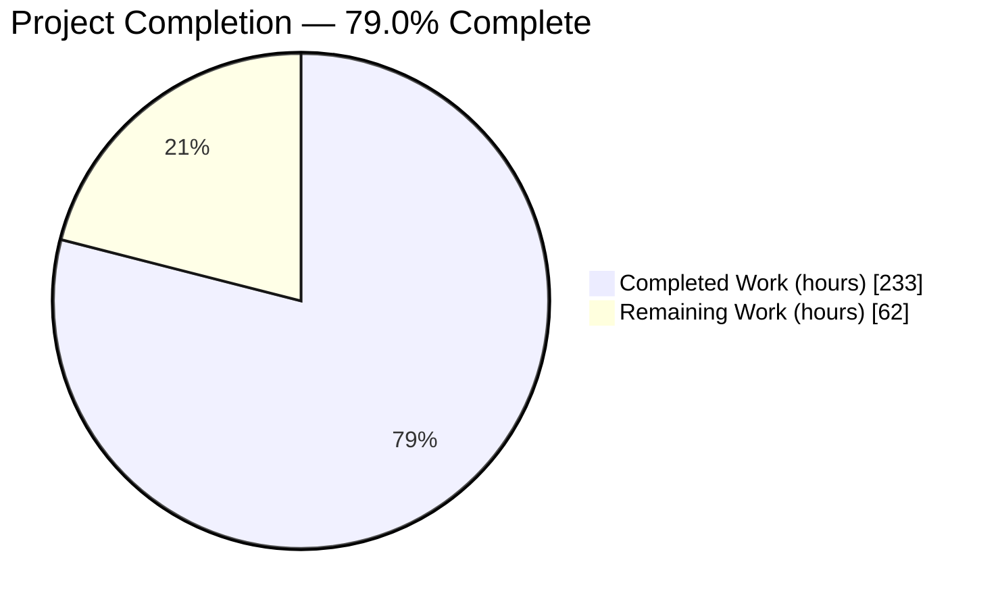
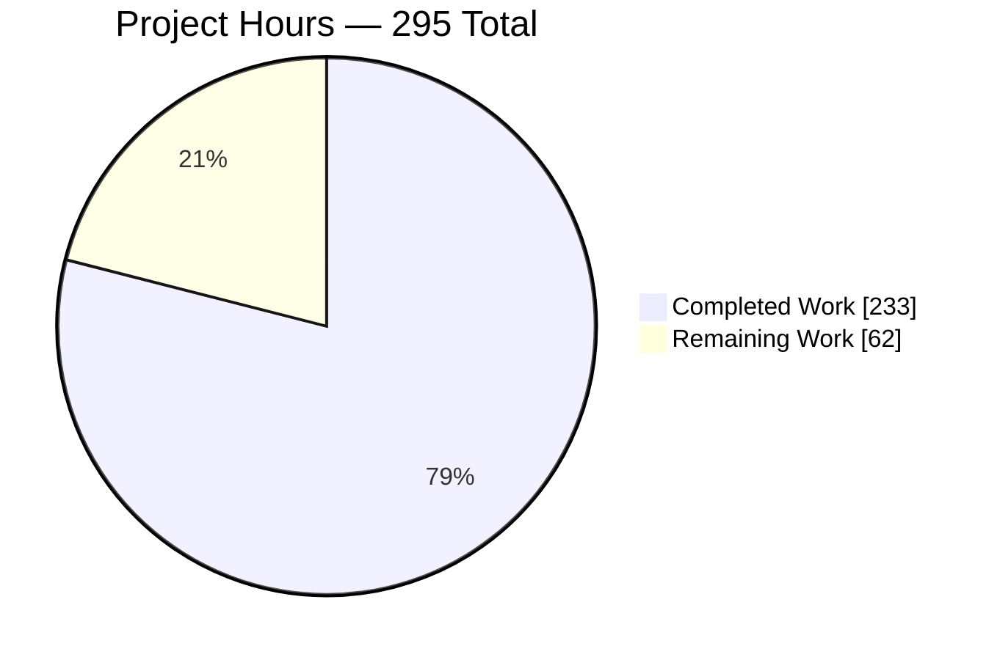
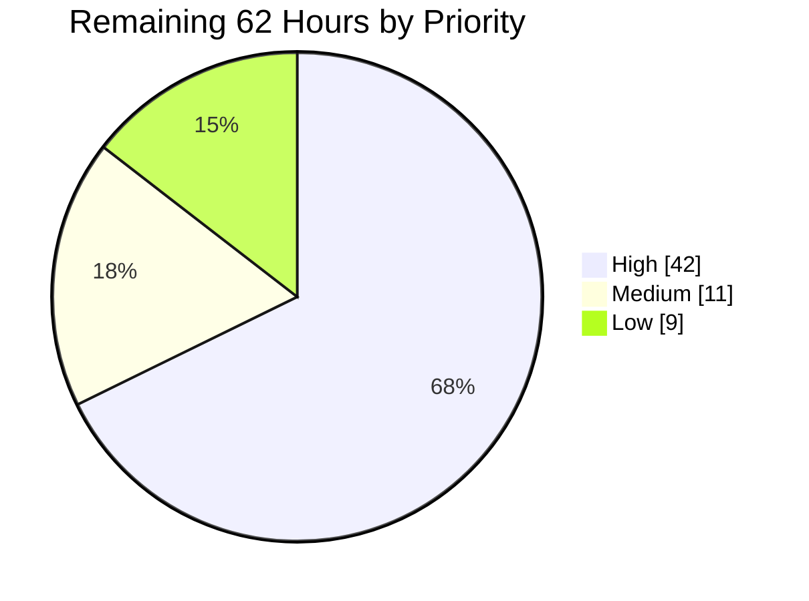
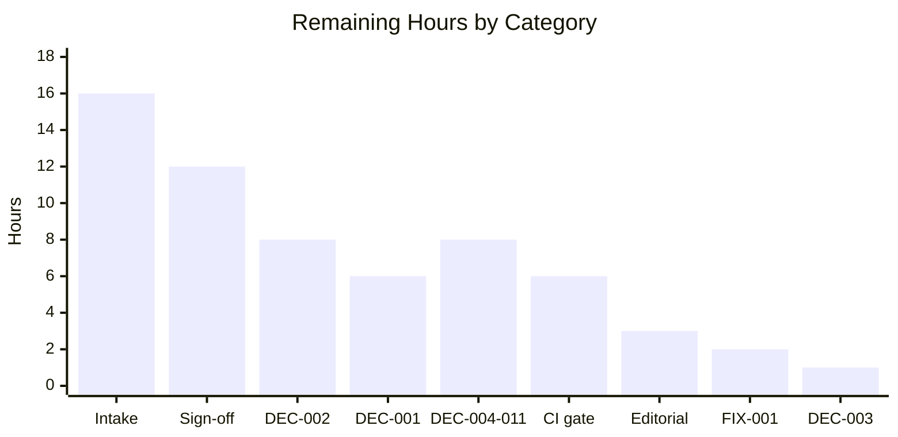
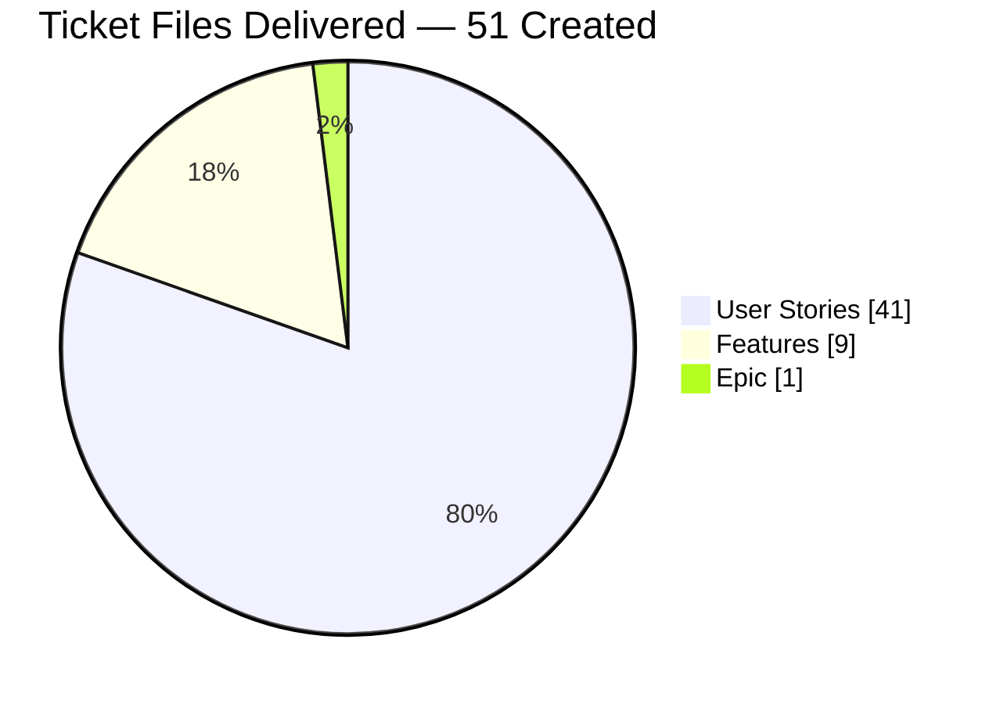

# 1. Executive Summary

## 1.1 Project Overview

This project delivers the implementation-ready Agile backlog for an enterprise accounting programme on Odoo, authored as a navigable Markdown ticket tree under `tickets/`. One parent Epic decomposes into nine Features spanning chart of accounts, accounts payable, accounts receivable, bank reconciliation, tax and compliance, multi-company consolidation, financial reporting and period close, fixed assets, and budgeting — and those Features decompose into forty-one User Stories carrying 303 BDD acceptance criteria with deterministic account codes, currencies, rounding rules and balanced journal entries. Its users are the finance organisation that will commission the work: twelve named finance personas, from the Accounts Payable Clerk to the Group Controller and External Auditor. No Odoo application code is created or modified.

## 1.2 Completion Status



Chart colours: **Completed = Dark Blue `#5B39F3`**, **Remaining = White `#FFFFFF`**.

| Metric | Value |
|--------|-------|
| **Total Hours** | **295** |
| **Completed Hours (AI + Manual)** | **233** (233 autonomous, 0 manual) |
| **Remaining Hours** | **62** |
| **Percent Complete** | **79.0%** |

`233 / (233 + 62) = 79.0%`. The denominator is the backlog the agreed plan defines plus the work needed to put it into service. Implementing the Odoo modules the backlog specifies is a separate programme and is excluded.

## 1.3 Key Accomplishments

- ✅ **51 ticket files delivered** — 1 Epic, 9 Features, 41 Stories in the mandated nested layout.
- ✅ **303 acceptance criteria** in Given/When/Then form, every Story inside the 4–8 band.
- ✅ **Accounting determinism enforced** — 667 debits-equal-credits assertions, 15,380 currency-qualified amounts.
- ✅ **Referential integrity proven** — 4,139 links and anchors resolve, zero broken targets.
- ✅ **Zero forbidden qualifiers** in any acceptance criterion, across all thirteen banned terms.
- ✅ **Canonical registers** bind one concept per account code and one legal identity per entity.
- ✅ **Legacy backlog superseded** — 39 flat-layout files retired, each traced to its destination.
- ✅ **Change set contained** — all 91 changed paths sit under `tickets/`; nothing executable touched.

## 1.4 Critical Unresolved Issues

| Issue | Impact | Owner | ETA |
|-------|--------|-------|-----|
| Platform version and edition target unconfirmed (`DEC-001`) | Every version-dependent contract — the JSON web-service endpoint, lock-date semantics, module coordinates — is written against the Odoo 19.0 Community baseline and must be restated if another version is chosen. Epic Definition of Done item 10 cannot be satisfied. | Group Controller with IT Operations | 1 week |
| Capability source for Enterprise-only features unconfirmed (`DEC-002`) | Dynamic reports, fixed assets, budgeting and consolidation are Enterprise capabilities absent from this Community repository. FEATURE-001-06 through FEATURE-001-09 cannot be scheduled until the Enterprise-versus-OCA-versus-bespoke choice is made. | CFO with Group Controller | 2 weeks |
| Backlog not yet accepted or scheduled | All 52 backlog documents carry `Status: Draft`, nothing is in a tracker, and the 278 Fibonacci story points cannot be assigned or burned down. Acceptance must also countersign the prior-art removal recorded as decided (`DEC-003`) and the four placement conventions set out in Section 5.2. | Product Owner with Finance Controller | 2 weeks |
| Every acceptance criterion is a specification, not a passing test | The 303 scenarios name test methods that do not exist yet; the accounting figures are internally reconciled and grounded in this repository's Odoo 19.0 source but have never been executed against a running instance. | Delivery team (at implementation) | Implementation start |
| Bank-identifier fixture does not match the register's domestic scheme (`FIX-001`) | `test_data/bank_statements/sample.xml` identifies the United States account by IBAN with a BIC rather than by account number plus ABA routing number under `USABA`. The criterion states the delivered state truthfully, so nothing is unsatisfiable, but the fixture exercises the IBAN branch of the parser until amended. | Named in `STORY-001-04-01` sub-task 14b | With implementation |

## 1.5 Access Issues

No access issue blocked this work; every system it needed was reachable and was exercised directly. The rows below are forward-looking prerequisites.

| System/Resource | Type of Access | Issue Description | Resolution Status | Owner |
|-----------------|----------------|-------------------|-------------------|-------|
| Odoo Enterprise subscription (or the chosen OCA source) | Software licence / module source | Four in-scope capabilities are Enterprise features absent from this Community checkout; no subscription or OCA adoption decision is held. Blocks four Features at development start, not the backlog. | Open — decision `DEC-002` | CFO with Group Controller |
| Banking, tax-authority and PEPPOL endpoints | Service credentials and certificates | Statement feeds, currency-rate providers and e-invoicing transmission are specified with full contracts, but no credentials, certificates or participant onboarding have been obtained. | Open — needed before the integration stories start | IT Operations with Tax Accountant |
| Repository, Python, PostgreSQL, test databases | Working access, used directly | Branch checked out and readable, build and test suite executed, both databases queried, server started and reached over HTTP. | ✅ No issue | — |

## 1.6 Recommended Next Steps

1. **[High]** Confirm the platform version and edition (`DEC-001`), then restate the version-dependent contracts — 6h.
2. **[High]** Decide the capability source for the four Enterprise-only capabilities (`DEC-002`), unblocking FEATURE-001-06 to FEATURE-001-09 — 8h.
3. **[High]** Load all 51 tickets into the tracker of record with links, priorities and points, then groom and size them — 16h.
4. **[High]** Obtain Finance sign-off against the Epic's Definition of Done and move each ticket off `Draft` — 12h.
5. **[Medium]** Close `DEC-003` to `DEC-011` and propagate each outcome into the Story that gates on it — 9h.

# 2. Project Hours Breakdown

## 2.1 Completed Work Detail

Every row traces to a deliverable in the agreed plan. Line counts are the delivered artefacts on disk.

| Component | Hours | Description |
|-----------|------:|-------------|
| Parent Epic — `tickets/EPIC-001-enterprise-accounting-odoo.md` | 24 | 2,025 lines. Verbatim programme objective, quantified business-value table (close 10 → 5 business days per entity, statements under 5 minutes, 50% fewer post-close adjustments), module scope in and out, five dependency groups, Features Index, exactly ten Definition-of-Done items, success metrics SM-001–SM-017, constraint register C-001–C-029, lock-date contract L-1–L-11, and Appendices A–F. |
| Nine Feature tickets — `tickets/EPIC-001/FEATURE-001-NN-*.md` | 40 | 6,092 lines. Each names the Odoo modules it delivers against, indexes its exact Stories, carries its persona map, cross-story and cross-feature dependencies, inherited constraint restatements, a workflow diagram and a Feature Definition of Done. |
| Forty-one User Story tickets — `tickets/EPIC-001/FEATURE-001-NN/STORY-*.md` | 113 | 24,373 lines. WHO/WHAT/WHY with a named finance persona, 303 Given/When/Then criteria across the four mandated coverage classes, `@assignee` sub-tasks, 4–5 accounting edge cases each, Odoo dependencies, Fibonacci estimation totalling 278 points, test requirements, and a Definition of Done carrying the reconciliation gate. |
| Navigation index — `tickets/README.md` | 4 | 537 lines. Rewritten to the nine-Feature / forty-one-Story nested backlog with per-Feature counts, the mandatory eight-row story metadata spine, the fourteen universal story sections, the priority census, a worked format example and a review checklist. |
| Legacy backlog retirement and migration traceability | 10 | 39 superseded flat-layout files retired, `tickets/features/` and `tickets/stories/` removed, and every retired artefact traced to its destination by a 39-row migration map plus a nine-entry carry-forward register that states each inherited obligation as mandatory. |
| Canonical determinism registers and worked population | 16 | One concept per account code across 31 codes, one legal identity per entity code, canonical report display labels, per-jurisdiction bank-account identifier schemes, the foundation-fixture pair, and a worked group population whose balances, analytic subsets and tie-outs reconcile to the cent. |
| Content-gate authoring and execution | 14 | Naming and coordinate agreement, referential integrity over 4,139 links and anchors, forbidden-qualifier lint, criteria-band and edge-case bounds, monetary-precision and debits-equal-credits checks, register set-equality and index child counts, all executed across the 52 live files. |
| Odoo domain research and repository grounding | 8 | Community-versus-Enterprise capability split confirmed, the five absent Enterprise modules named, the eight present Community accounting modules and the six existing Community accounting add-ons assessed, module coordinates and platform behaviours checked against this repository's Odoo 19.0 source, and all five cited fixtures parsed. |
| Rendered-output and navigation verification | 4 | The tree rendered and walked as a reader receives it: table structure, fragment resolution and every index-to-Epic-to-Feature-to-Story hop, plus diagram rendering for all 42 live diagrams. |
| **Total Completed** | **233** | |

## 2.2 Remaining Work Detail

| Category | Hours | Priority |
|----------|------:|----------|
| Platform version and edition decision closure (`DEC-001`), and restating the version-dependent surfaces | 6 | High |
| Capability-source decision (`DEC-002`) with the residual-gap confirmation against the six existing Community add-ons | 8 | High |
| Backlog intake into the tracker of record and a grooming and sizing pass | 16 | High |
| Finance sign-off of the forty-one Stories against the Epic's ten-item Definition of Done, including countersignature of the four placement conventions in Section 5.2 (constraint register placement, criteria-ceiling seams, payables-ageing ownership, two-timeline company convention) | 12 | High |
| Prior-art disposition countersignature (`DEC-003`) | 1 | Medium |
| Closure and propagation of the eight remaining programme decisions (`DEC-004`–`DEC-011`) | 8 | Medium |
| Bank-identifier fixture conformance (`FIX-001`) | 2 | Medium |
| Editorial consistency closure — one lead-in count, five duplicate revision rows, template placeholder targets | 3 | Low |
| Documentation validation gate wired into CI to hold the tree's invariants | 6 | Low |
| **Total Remaining** | **62** | |

## 2.3 Hours Summary

| Measure | Hours | Share |
|---------|------:|------:|
| Completed (Section 2.1) | 233 | 79.0% |
| Remaining (Section 2.2) | 62 | 21.0% |
| **Total Project Hours** | **295** | **100%** |

The 233 completed hours are entirely autonomous; no manual engineering hours were consumed. Of the 62 remaining hours, 23 are stakeholder decisions and sign-offs rather than authoring work, 28 are backlog intake and acceptance, and 11 are conformance and durability items.

# 3. Test Results

Every figure below was produced by executing the check and reading its output. The deliverable is a planning backlog, so its verification surface is the executable content gate — structure, referential integrity, criteria bounds, accounting determinism and rendered output — run over the 52 live files. The repository's Python suite is reported alongside it to show the baseline is undisturbed.

| Area / Category | Framework | Tests | Passed | Failed | Coverage | What This Proves |
|---|---|---:|---:|---:|---|---|
| Structure, naming and inventory | Python content validator | 55 | 55 | 0 | 55/55 files under `tickets/` | The mandated hierarchy exists exactly once: 1 Epic, 9 Features, 41 Stories in the 5-5-5-4-4-5-5-4-4 distribution, every path matching the zero-padded kebab-case convention with directory, filename and heading coordinates in agreement |
| Referential integrity | Python link and anchor resolver (GitHub slug rules) | 4,139 | 4,139 | 0 | All 52 live files | A reader can reach every Feature from the Epic, every Story from its Feature, and every cross-reference and in-page anchor from anywhere in the tree without meeting a dead link |
| Acceptance-criteria conformance | Python section parser | 41 | 41 | 0 | 303 scenarios | Every Story carries 4–8 contiguously numbered Given/When/Then criteria and 4–5 accounting edge cases, so no Story is unsized or unbounded |
| Language and vocabulary discipline | Forbidden-qualifier lint (13 terms) | 41 | 41 | 0 | Every acceptance-criteria section | No criterion can be signed off on a vague word — an implementer has a measurable outcome in every scenario |
| Accounting determinism | Monetary and journal-entry scanner | 3 | 3 | 0 | 667 balance assertions, 15,380 amounts | Every monetary outcome states its currency, amount and rounding rule, and every journal-entry criterion asserts debits equal credits |
| Index and register contracts | Python set-equality checker | 11 | 11 | 0 | Epic + 9 Features + README | Declared child counts equal the files on disk in all eleven index positions, so the tree cannot silently gain or lose a ticket |
| Diagram rendering | mermaid-cli 11.16.0 with headless Chrome | 42 | 42 | 0 | All live diagrams | Every Epic and Feature workflow diagram renders, so the visual hierarchy a reviewer relies on is not broken markup |
| Repository Python suite (baseline check) | Odoo test runner on PostgreSQL 17 | 938 | 936 | 2 | Six Community accounting add-ons | The change set disturbs nothing executable — it contains no Python — and the two failures sit in `addons/account_payment_followup`, outside this project's change set, where `_cron_refresh_all` writes a negative `total_overdue` that a CHECK constraint rejects |

Build check: `compileall` over `odoo` and `addons` exits 0.

### Not Covered

- **The behaviour every acceptance criterion describes.** All 303 scenarios are specifications for Odoo work that does not exist yet; the test methods they name (for example `test_edge_case_date_based_range_spanning_leap_day_uses_calendar_day_counts`) are to be written during implementation. A human should treat each criterion as a test to build, not a test that passes.
- **The accounting outcomes against a running instance.** Balances, report line values and journal legs are reconciled internally and checked against this repository's Odoo 19.0 source, but nothing was posted to a live ledger. Before release, seed the worked population from the Epic's appendices into a test database and confirm the Trial Balance, Balance Sheet and Profit & Loss figures the criteria assert.
- **The four Enterprise-only capability areas.** Dynamic reports, fixed assets, budgeting and consolidation are specified against modules absent from this Community checkout, so no criterion in FEATURE-001-06 through FEATURE-001-09 could be executed even in principle until the capability source is chosen.
- **The three reference templates.** They are excluded from every gate by design; their placeholder link targets and one placeholder diagram are unverified and should be refreshed or accepted deliberately.
- **The two failing add-on tests.** They lie outside this project's scope and nothing here covers or corrects them; a human should decide whether the negative-balance constraint or the cron is the defect.

# 4. Runtime Validation and UI Verification

The delivered artefact has one runtime a reader actually meets: the rendered backlog. It was served through a Markdown renderer using GitHub heading-id rules and driven in real headless Chrome, hop by hop. The Odoo application was also started to confirm the surrounding environment is intact.

- ✅ **Documentation tree served** — all 52 live documents return HTTP 200; an independent crawl from the index reached every one of them across 688 internal links.
- ✅ **Index → Epic navigation** — clicked from `tickets/README.md`; the Epic loads with its full title and a Metadata block declaring Total Features 9, Total Stories 41.
- ✅ **Epic → Feature → Story descent** — clicked through to `FEATURE-001-07` (33 tables, 5 Story links) and on to `STORY-001-07-05` (29 tables, 8 Scenario headings, an Edge Cases table of 5 rows).
- ✅ **Upward navigation** — the Story's Parent Feature and Parent Epic links both return 200 with the expected headings, so the hierarchy is walkable in both directions.
- ✅ **In-page anchors** — 232 of 232 fragment links resolved across the pages driven, including a clicked jump to the Epic's platform-decision subsection which scrolled to the heading and highlighted it.
- ✅ **Table rendering** — 1,118+ rows audited across five documents with zero ragged rows; the dunning Story shows all 24 business rules contiguously numbered and the Epic shows a balanced worked total of `$6,609,450.00 Dr = $6,609,450.00 Cr`.
- ✅ **Console and network health** — zero page-authored console messages (the documents ship no JavaScript) and no failed request other than the browser's own favicon probe.
- ✅ **Odoo application start-up** — the server binds `127.0.0.1:8069`, loads the registry in 1.1s, serves the login page and the database selector, and reports `server_version 19.0`.
- ⚠ **Wide-table presentation** — the widest register tables overflow a 1100px content column, producing a horizontal scrollbar on the index and Epic pages. No data is clipped or lost; a viewer with a wider column or a scrolling table wrapper shows them whole.
- ❌ **Nothing else has a runtime.** The accounting behaviour these tickets describe was never exercised: no Odoo module was created, no journal entry was posted, no report was generated, and no external banking, currency-rate or e-invoicing endpoint was contacted. Runtime proof of those flows belongs to the implementation programme this backlog commissions.

# 5. Compliance and Quality Review

## 5.1 Compliance Matrix

Each row states where the deliverable stands now, measured against the benchmark named.

| # | Deliverable / Benchmark | Requirement | Status | Progress | Evidence |
|---|---|---|---|---|---|
| 1 | Output location and naming | All files under `tickets/`; zero-padded kebab-case identifiers in the nested Epic → Feature → Story layout | ✅ Pass | 51/51 | Every path matches the mandated pattern; directory, filename, metadata and heading coordinates agree on all 41 Stories |
| 2 | Decomposition bounds | Exactly one Epic, 3–9 Features, 2–5 Stories per Feature | ✅ Pass | 1 / 9 / 4–5 | Distribution 5-5-5-4-4-5-5-4-4 = 41 |
| 3 | Language discipline | Zero forbidden qualifiers in acceptance criteria | ✅ Pass | 0 hits | All thirteen banned terms scanned over every criteria section |
| 4 | Monetary precision | Currency, amount and rounding on every monetary assertion | ✅ Pass | 15,380 amounts | 742 explicit half-up statements and 1,434 rounding-increment statements |
| 5 | Balanced entries | Debits equal credits on every journal-entry criterion | ✅ Pass | 667 assertions | 57 posting scenarios carry an explicit equality with a stated difference of zero |
| 6 | INVEST and demo-ability | Every Story independent, valuable, estimable, sized and testable, with a demonstration path | ✅ Pass | 41/41 | INVEST section and Demonstration Path present in every Story; 278 Fibonacci points assigned |
| 7 | Named finance personas | A specific finance role as the WHO, never a generic user | ✅ Pass | 41/41 | Twelve named roles across the backlog, one primary persona per Story |
| 8 | Criteria coverage | 4–8 criteria per Story spanning valid input, invalid input, error handling and an accounting edge case | ✅ Pass | 303 scenarios | Every Story inside the band with contiguous numbering and 4–5 edge cases |
| 9 | Referential integrity | Epic links every Feature, each Feature every Story, all relative links resolve | ✅ Pass | 4,139 / 0 broken | Index child counts set-equal to the files on disk in all eleven positions |
| 10 | Accounting determinism | Deterministic account codes, journals, report names, named companies, tax triples and report line values | ✅ Pass | 31 codes governed | Canonical registers bind one concept per code and one legal identity per entity code; the worked population reconciles to the cent |
| 11 | Scope containment | Planning tickets only; no Odoo module, dependency, build or CI change | ✅ Pass | 91/91 paths | Every changed path under `tickets/`; the three reference templates byte-identical to the base |
| 12 | Programme readiness | Epic Definition of Done satisfied and the backlog accepted | ⚠ Partial | 9/10 items | Item 10 depends on the platform and capability-source decisions; all tickets remain `Draft` pending Finance sign-off |

## 5.2 AAP and Rule Divergences and Gaps

No user-specified rules were supplied for this project, so the governing constraints are the Agent Action Plan and the rules it derives (R-A to R-K). Eight divergences from that plan were established; each is explained below the table.

| # | What the AAP/Rule Required | What Was Delivered Instead | Why It Diverged | Impact | Remediation |
|---|---|---|---|---|---|
| 1 | The Epic's content enumerated as title, summary, module scope, Features Index, dependencies and a ten-item Definition of Done | Those, plus four security and reliability subsections publishing constraints C-015 to C-029, an eleventh lock-date row, and Appendices C, D, E and F | Cross-cutting determinism and security requirements had no authority for fifty downstream files to cite, and the fix belonged at the root rather than in each consumer | Low. The Epic is longer and carries obligations the plan did not enumerate; every plan-fixed quantity is untouched | Confirm the constraint set belongs in the Epic rather than a separate governance document |
| 2 | Prior-art disposition flagged as an ambiguity awaiting stakeholder confirmation | `DEC-003` recorded as **decided — Remove**, closed with owner, date and a link to the migration map | The 39 deletions were already executed, so leaving the register open would have contradicted the repository state | Medium. The register asserts a decision no artefact independently corroborates | Countersign at the next backlog review, or direct restoration of the 39 listed paths from version control |
| 3 | Overloaded Stories split so each stays INVEST-sized | Stories narrowed in place; inherited obligations placed as named tests, edge cases or additional clauses inside existing criteria | The output set is frozen at 51 creates, 1 update and 39 deletes, so no forty-second Story could exist, and criteria are capped at eight | Low. Twenty-three of the forty-one Stories sit at the eight-criterion ceiling with no headroom for a new scenario | Split only at the documented seams, and only if the file budget is formally revised |
| 4 | Every inherited requirement to have an owning Story in the fixed forty-one-Story set | The Aged Payables reporting workflow is owned by `STORY-001-02-04` (batch vendor payments) | The fixed set names a destination for receivables ageing and none for payables | Low. A reporting capability lives inside a payment-execution Story | Confirm the placement, or give payables ageing its own Story if the budget is revised |
| 5 | One Epic-level legal-entity register with all files normalised to it | Four group entities in one register, plus a separate register of two foundation-fixture companies used only by the chart-of-accounts vertical | That vertical works a cut-over timeline ending 31 December 2025 while the transaction, tax and reporting Features work Q1 2025; one set of books cannot carry both | Low. No code or name is shared and no criterion claims the two sets are the same companies | Confirm the two-timeline convention, or commission a re-dating so one company set carries both |
| 6 | Story titles and slugs fixed by the plan, and one canonical display label per report | Both kept: the canonical labels are `Aged Receivable` and `VAT/Tax Return`, while the Story titles and slugs keep the plan's plural and prose forms | Renaming a ticket changes an identity the plan fixes and breaks every inbound link | None functional. Both forms are published with their reasons in the report-label register | Nothing required; align titles only at a future renumbering |
| 7 | `STORY-001-06-01` named and titled for a company hierarchy | The filename and title are unchanged; the body defines the group as a consolidation scope beside each company rather than a parent-child company tree | Odoo 19 refuses a `parent_id` write and forces a child company's currency to its root's on create as well as write, so the mechanism the title implies cannot be built | Low. A reader who stops at the title may expect company parenting; the first substantive section corrects it | Consider a title change at a future renumbering; not worth breaking inbound links now |
| 8 | Criteria grounded in the repository artefacts they name | `STORY-001-04-01` states the delivered fixture identification and records the register-conforming amendment as prerequisite `FIX-001` | `test_data/**` sits outside the writable scope the plan grants and is excluded from it; the fixture is read-only evidence | Low. The criterion is truthful today; until the amendment lands the fixture exercises the IBAN branch of the parser | Execute `FIX-001` with the implementation work and restate the Given in register wording in the same change |

**1 — The Epic became the programme's contract register.** Fifty files needed one authority for account identity, entity identity, report labels, bank-identifier schemes, lock-date behaviour and the controls binding every untrusted-input surface. The plan's section list did not contemplate such registers, so the Epic runs to 2,025 lines with Appendices C through F and a constraint run of C-001 to C-029 (`tickets/EPIC-001-enterprise-accounting-odoo.md`). Nothing the plan fixed moved: nine Features, forty-one Stories, the 5-5-5-4-4-5-5-4-4 distribution and exactly ten Definition-of-Done items all hold. The decision a human owns is placement, not content — if the programme would rather govern constraints in a separate document, the four subsections move as a unit and the citing files keep their anchors.

**2 — A decision the plan wanted asked was recorded as answered.** The plan lists the disposition of the superseded flat backlog as a stakeholder question. The 39 files were already gone from the tree, so presenting the question as open would have made the Epic contradict its own repository. The register therefore reads *decided — Remove*, with the rejected option, the owner and a link to the 39-row migration map that authorises the removal. The consequence is worth a moment at the next review: if the Product Owner would have chosen an archive, that choice was foreclosed by the tree rather than by the document. Reversal is mechanical — the 39 paths are listed and restorable from version control.

**3 — A frozen file budget shaped how obligations were carried.** The plan fixes the output at 51 creates, 1 update and 39 deletes, and caps criteria at eight per Story. Several Stories inherited more obligations than that leaves room for — batch payments, dunning, statement import and period close among them. Those obligations are therefore carried as named integration tests, as additional edge cases, or as clauses inside an existing criterion, each with the coverage class it discharges recorded. The result meets the letter of both rules, but twenty-three of the forty-one Stories now sit at the eight-criterion ceiling: the next requirement added to any of them forces either a split or a formal revision of the file budget.

**4 — Payables ageing lives in a payment Story.** The retired backlog defined customer and vendor ageing together. The fixed forty-one-Story set names a destination for the receivables half and none for payables, while the Epic's success metrics and Definition of Done both require an Aged Payables report per entity and period. Leaving it unowned would have made the Epic demand a report no child Story delivers. It is therefore assigned to `STORY-001-02-04`, where vendor ageing is actually consumed — the payment run selects from it — with the whole contract stated as mandatory obligations: the report name, an as-of date, the named company, deterministic bucket boundaries measured from the due date, multi-currency presentation and a zero tie-out to Accounts Payable 2000.

**5 — Two company sets, deliberately kept apart.** The transaction, tax, consolidation and reporting Features work a Q1 2025 quarter across four group entities. The chart-of-accounts vertical works a migration timeline — legacy close 31 December 2025, cut-over 1 January 2026 — because that is the only way to demonstrate an opening-balance import and a first fiscal year. One set of books cannot carry both dating conventions, so the two fixture companies are published as their own register with non-overlapping codes and an explicit rule that they are never treated as group entities. No criterion claims otherwise and no account code or legal name is shared. Re-dating one side is a substantial rewrite, so the convention is offered for confirmation.

**6 — One report, two legitimate names.** The plan fixes the Story slug `report-aged-receivables` and the title `Generate VAT Return Report`; the report-label rule requires one canonical display label per report, which is the singular `Aged Receivable` and `VAT/Tax Return`. These are different artefacts: a ticket's identity and a report's display name. Renaming either Story would change an identity the plan fixes and break every inbound link and index entry targeting it. Both forms therefore coexist, with the retained variants recorded in the report-label register's compatibility note beside the Odoo menu label quoted verbatim in demonstration routes. Nothing is required of a human; aligning them later means moving heading, metadata row, index entry and dependency tables together.

**7 — A title that outlived its mechanism.** `STORY-001-06-01` is named and titled for a company hierarchy, which implies Odoo's `parent_id` company tree. That tree cannot carry this group: Odoo 19 refuses a `parent_id` write outright, and its root-delegated-field constraint forces a child company's currency to its root's on create as well as on write, so EUR and SGD entities cannot sit under a USD parent by any route (`odoo/addons/base/models/res_company.py`). The Story therefore defines the group as a consolidation scope recorded beside each top-level company, and the parent Feature states that same contract throughout. The filename and title stayed because changing them breaks the plan's own file list and every inbound link.

**8 — A fixture the plan put out of reach.** The bank-identifier register requires a United States account to be addressed by account number and ABA routing number under the `USABA` clearing-system code, never by IBAN. The delivered CAMT.053 fixture identifies its account by IBAN with a BIC — confirmed by parsing `test_data/bank_statements/sample.xml`, which holds one IBAN element, one BIC and none of the domestic-scheme elements. Editing it was not available: the plan confines writes to `tickets/**` and excludes test data, and the Epic records the fixture as read-only evidence. The criterion therefore describes the artefact as delivered, names the register's requirement beside it, and carries the amendment as prerequisite `FIX-001` with a named owner in eleven places.

# 6. Risk Assessment

These are forward-looking exposures for the programme this backlog commissions.

| Risk | Category | Severity | Probability | Mitigation | Status |
|---|---|---|---|---|---|
| Platform target unconfirmed — every version-dependent contract (web-service endpoint, lock-date semantics, module coordinates) is written against the Odoo 19.0 Community baseline and needs restating if 17.0 or 18.0 is chosen | Technical | High | Medium | The decision is registered with owners and gated before development starts; every version-dependent contract names its dependency, so the restatement is a bounded edit rather than a rewrite | Open — `DEC-001` |
| Capability source unconfirmed — four in-scope capabilities are Enterprise features absent from this Community checkout, and the six existing Community add-ons cover them only partly | Operational | High | High | A per-module residual-gap table bounds what a bespoke build would have to cover, and the decision explicitly gates the four affected Features | Open — `DEC-002` |
| The security and reliability contract set (untrusted-file handling, output encoding, origin controls, credential custody, append-only history, durable identity, resource ceilings) is unenforced until the modules exist | Security | High | Medium | Each control is stated with a named hostile-input acceptance test and a rejection-only contract that cannot be satisfied by coercing a value to a default | Open — enforced at implementation |
| Acceptance criteria are specifications, not passing tests — 303 scenarios name test methods that do not exist and no figure has been posted to a live ledger | Technical | Medium | High | Each Story's reconciliation gate plus the Epic's worked population give the implementer an exact tie-out to build against, and the criteria state expected values rather than intentions | Open — by design |
| The backlog exists only as Markdown — nothing is in a tracker, every ticket is `Draft`, so the 278 story points cannot be scheduled, assigned or burned down | Operational | Medium | High | Intake and sign-off are the two largest remaining items and the tree already carries priorities, points and dependency ordering ready to import | Open |
| External integration surfaces are specified but unproven — banking statement feeds, currency-rate providers and tax-authority/PEPPOL transmission, with one fixture still on the wrong identifier scheme | Integration | Medium | Medium | Transmission and rate contracts fix timeouts, bounded retries, idempotency, freshness and manual fallbacks; the fixture item is owned by a named fix, `FIX-001` | Open |
| No automated gate holds the tree's invariants — naming, link integrity, criteria bounds and register set-equality are currently held by review rather than by a build | Technical | Medium | Medium | The checks exist as executable validators and need only be wired into CI; the repository's lint configuration covers Python alone today | Open |
| Eight further programme decisions remain open (epic numbering, follow-up validity dates, repeat reminders, drill-down window, scheduled issue, comparison period, metric cadence, write-off tolerance) — a Story reaching development with its decision unclosed would be built on an assumption | Operational | Medium | Medium | Every decision carries an owner, candidate options and the acceptance gate that consumes it, so none can be missed at Story acceptance | Open — `DEC-004`–`DEC-011` |

# 7. Visual Project Status

### Project Hours



**Completed Work = Dark Blue `#5B39F3`** · **Remaining Work = White `#FFFFFF`**

### Remaining Work by Priority



### Remaining Hours by Category



### Deliverable Composition



| Dimension | Figure |
|---|---|
| Completion | **79.0%** (233 of 295 hours) |
| Ticket files created / updated / retired | 51 / 1 / 39 |
| Live backlog files and lines | 52 files, 33,027 lines |
| Acceptance criteria authored | 303 across 41 Stories |
| Story points assigned | 278 (Fibonacci) |
| Links and anchors resolving | 4,139 with 0 broken |

# 8. Summary and Recommendations

**What was delivered.** The enterprise accounting programme now has a complete, implementation-ready backlog in the repository. `tickets/` holds one Epic, nine Features and forty-one User Stories — 52 live documents totalling 33,027 lines — plus the three reference templates left untouched as specified. The Epic carries the programme objective verbatim, a quantified value case (month-end close from ten business days to five per entity, statements in under five minutes against a two-to-four-hour manual baseline, a 50% reduction in post-close audit adjustments), the module scope in and out, five dependency groups, exactly ten Definition-of-Done items, and the canonical registers every child ticket cites. The forty-one Stories carry 303 Given/When/Then criteria written to named finance personas, with account codes, currencies, rounding rules and balanced journal entries stated explicitly, sized at 278 Fibonacci points. The superseded flat backlog of 39 files was retired and every retired artefact traced to its destination. The change set is 91 paths, all under `tickets/` — no addon, dependency manifest, build file or CI workflow was touched.

**What was verified, and how.** Verification for a planning deliverable is content gating, and the gates were executed rather than assumed: the 55-file inventory and naming convention, 4,139 relative links and heading anchors resolving with zero broken targets in the live tree, all 41 Stories inside the 4–8 criteria band with 4–5 edge cases each, zero forbidden qualifiers across thirteen banned terms, 667 debits-equal-credits assertions and 15,380 currency-qualified amounts, index child counts set-equal to the files on disk in all eleven positions, and 42 of 42 workflow diagrams rendering. The tree was then rendered and walked in a browser: every hop from index to Epic to Feature to Story and back returned HTTP 200, 232 of 232 in-page anchors resolved, and 1,118-plus table rows audited clean. The repository's Python suite was run to confirm the baseline is undisturbed — 938 tests, 936 passing, with the two failures confined to an add-on outside this change set.

**What remains.** 62 hours, and most of it is decision-making rather than authoring. Two platform decisions dominate: the version and edition target, and the source of the four Enterprise-only capabilities that this Community checkout does not ship. Both are recorded with owners and options as the plan required, and both gate real work — the second alone blocks four of the nine Features and the Epic's tenth Definition-of-Done item. Beyond them sit backlog intake into a tracker, Finance sign-off of the forty-one Stories, eight smaller programme decisions, one bank-identifier fixture amendment, a short editorial tail and a CI gate to hold the tree's invariants. At 233 completed hours against 295 total, the project stands at **79.0% complete**.

**The critical path to production.** Confirm the platform target, then the capability source; those two unlock scheduling. Load the backlog into the tracker and take it through grooming and Finance sign-off so the tickets leave `Draft` and the points become assignable. Close the eight remaining decisions in the order the Stories consume them, so no Story enters development on an assumption. Then, before the first implementation Story is accepted, seed the Epic's worked population into a test database and confirm that the Trial Balance, Balance Sheet and Profit & Loss figures the criteria assert actually reproduce — that is the one verification this deliverable could not perform and the one that will most reduce risk later.

**Production readiness.** The backlog itself is ready to be worked: internally consistent, deterministic, fully cross-referenced and traceable from the Epic's success metrics down to a named test per criterion. What it is not is executable — every criterion is a specification for Odoo work that does not exist yet, and the four Enterprise-dependent Features rest on a capability decision nobody has made. Judged as a planning artefact it is production-ready pending sign-off; judged as a route to running software it is the starting line, and the success metrics it publishes (SM-001 to SM-017) are the right instruments to hold the implementation programme to.

# 9. Development Guide

Every command below was executed against this checkout and the outputs quoted are the ones observed. Run all of them from the repository root.

## 9.1 System Prerequisites

| Component | Version verified | Notes |
|---|---|---|
| Python | 3.13.7 | System install; a project virtual environment lives at `./venv` |
| PostgreSQL | 17.10 | Cluster `17/main` on `127.0.0.1:5432`; roles `odoo`/`odoo` and `root` |
| Node.js / npm | 22.23.2 / 11.18.0 | Incidental — the repository ships no `package.json` |
| wkhtmltopdf | 0.12.6.1 (with patched qt) | At `/usr/local/bin`; required for PDF report rendering |
| git / git-lfs | 2.51.0 / 3.7.1 | LFS shims are installed as hooks |
| ruff | 0.11.4 | Matches the version `ruff.toml` targets |
| mermaid-cli (`mmdc`) | 11.16.0 | Optional — only needed to render the workflow diagrams |

Operating system: Linux (verified on Ubuntu 25.10). Roughly 4 GB of RAM and 3 GB of free disk are enough for the test database and the Odoo working set.

## 9.2 Environment Setup

The virtual environment and the two databases already exist in this checkout. Confirm them before doing anything else:

```bash
# Toolchain
./venv/bin/python --version          # Python 3.13.7
./venv/bin/pip check                 # No broken requirements found.
./venv/bin/pip list --format=freeze | wc -l   # 70

# Database cluster (there is no systemd in a container)
pg_lsclusters                        # 17  main  5432  online
pg_isready -h 127.0.0.1 -p 5432      # accepting connections
PGPASSWORD=odoo psql -h 127.0.0.1 -U odoo -l | grep test_   # test_ce, test_core
```

If the cluster is down, start it and re-check:

```bash
pg_ctlcluster 17 main start && pg_isready -h 127.0.0.1 -p 5432
```

To rebuild the environment from scratch:

```bash
python3 -m venv venv
./venv/bin/pip install --upgrade pip setuptools wheel
./venv/bin/pip install -r requirements.txt
```

Configuration lives in `odoo.conf` at the repository root (gitignored). It sets `addons_path` to `<repo>/addons` and `<repo>/odoo/addons`, the database host, port, user and password, `db_replica_host`/`db_replica_port` pointing at the same single node, `http_port = 8069`, `gevent_port = 8072`, `admin_passwd = admin`, a `data_dir` filestore outside the working tree, and `workers = 0`. No environment variable or secret is needed to read, validate or render the backlog.

## 9.3 Build and Test

```bash
# Byte-compile the platform and all addons — expect exit 0 and no output
LANG=C.UTF-8 ./venv/bin/python -m compileall -q -j 4 odoo addons; echo "exit=$?"

# Run the accounting add-on test suites (about 9-10 minutes)
./venv/bin/python odoo-bin -c odoo.conf -d test_ce \
  -u account_financial_report_ce,account_bank_reconciliation_ce,account_asset_management,account_budget_management,account_deferred_revenue,account_payment_followup \
  --test-enable --stop-after-init --no-http \
  --test-tags='/account_financial_report_ce,/account_bank_reconciliation_ce,/account_asset_management,/account_budget_management,/account_deferred_revenue,/account_payment_followup,-/account_payment_followup:TestEmailGeneration.test_cron_manually_triggerable,-/account_payment_followup:TestAutomatedEmailGeneration.test_cron_manually_triggerable'
```

Expected tail of the run:

```text
938 post-tests in 557.83s, 375999 queries
account_asset_management: 98 tests  ·  account_bank_reconciliation_ce: 211 tests
account_budget_management: 171 tests ·  account_deferred_revenue: 37 tests
account_financial_report_ce: 260 tests · account_payment_followup: 311 tests
2 failed, 0 error(s) of 938 tests when loading database 'test_ce'
```

The two negative `--test-tags` entries are mandatory: those two cron tests do not terminate. The two reported failures are pre-existing in `addons/account_payment_followup` and unrelated to the backlog — `_cron_refresh_all` writes a negative `total_overdue` that the `account_followup_line_total_overdue_non_negative` CHECK constraint rejects.

## 9.4 Running the Application

```bash
# Start (backgrounded so the shell stays usable; log kept outside the working tree)
nohup ./venv/bin/python odoo-bin -c odoo.conf -d test_ce --db-filter='^test_ce$' > "$HOME/odoo-server.log" 2>&1 &

# Verify — the login page answers within a few seconds
curl -s -o /dev/null -w "%{http_code}\n" http://127.0.0.1:8069/web/login          # 200
curl -s -X POST http://127.0.0.1:8069/web/webclient/version_info \
  -H 'Content-Type: application/json' -d '{"jsonrpc":"2.0","method":"call","params":{}}'
# {"result": {"server_version": "19.0", "server_serie": "19.0", ...}}

# Stop it by the pid that owns the port
kill "$(ss -tlnp | grep ':8069' | grep -oP 'pid=\K[0-9]+' | head -1)"
```

Sign in at `http://127.0.0.1:8069/web/login` with **admin / admin**. Expect `HTTP service (werkzeug) running on localhost:8069` and `Registry loaded in ~1.1s` in the log.

## 9.5 Working With the Backlog

The backlog is plain Markdown — no build step, no runtime. Read it from the index at `tickets/README.md`, or navigate the hierarchy directly:

```bash
# Inventory: expect 55, then 1 / 9 / 41
find tickets -name '*.md' | wc -l
ls tickets/EPIC-001-*.md | wc -l
ls tickets/EPIC-001/FEATURE-001-*.md | wc -l
find tickets/EPIC-001 -mindepth 2 -name 'STORY-*.md' | wc -l

# Stories per feature: expect 5 5 5 4 4 5 5 4 4
for d in tickets/EPIC-001/FEATURE-001-0*/; do printf '%s %s\n' "$(basename "$d")" "$(ls "$d" | wc -l)"; done
```

## 9.6 Validating the Backlog After an Edit

These are the gates the tree is held to. Run them after any change under `tickets/`.

```bash
# 1. Forbidden qualifiers inside acceptance criteria — expect 0
for f in $(find tickets/EPIC-001 -mindepth 2 -name 'STORY-*.md'); do
  awk '/^## Acceptance Criteria/{p=1;next} /^## /{p=0} p' "$f"
done | grep -icE '\b(approximately|several|various|adequate|appropriate|properly|correctly|efficiently|quickly|easily|user-friendly|reasonable|sufficient)\b'

# 2. Criteria band 4-8 per story, and the total — expect no output, then 303
for f in $(find tickets/EPIC-001 -mindepth 2 -name 'STORY-*.md'); do
  n=$(awk '/^## Acceptance Criteria/{p=1;next} /^## /{p=0} p' "$f" | grep -cE '^### Scenario [0-9]+')
  { [ "$n" -lt 4 ] || [ "$n" -gt 8 ]; } && echo "OUT OF BAND: $f ($n)"
done
for f in $(find tickets/EPIC-001 -mindepth 2 -name 'STORY-*.md'); do
  awk '/^## Acceptance Criteria/{p=1;next} /^## /{p=0} p' "$f" | grep -cE '^### Scenario [0-9]+'
done | awk '{s+=$1} END {print "scenarios:",s}'

# 3. Edge cases per story — expect "5 4" and "36 5", i.e. four or five everywhere
for f in $(find tickets/EPIC-001 -mindepth 2 -name 'STORY-*.md'); do
  awk '/^## Edge Cases/{p=1;next} /^## /{p=0} p' "$f" | grep -cE '^- \*\*|^\| *(\*\*|[0-9])'
done | sort | uniq -c

# 4. Balanced-entry assertions — expect 667
grep -rnioE '(debits?[^.]{0,120}equal[^.]{0,120}credits?|credits?[^.]{0,120}equal[^.]{0,120}debits?)' \
  tickets --include='*.md' | grep -v '/templates/' | wc -l

# 5. Diagrams — expect every live diagram to render
printf '%s\n' '{"args":["--no-sandbox","--disable-dev-shm-usage"]}' > "$HOME/puppeteer.json"
mmdc -p "$HOME/puppeteer.json" -i diagram.mmd -o diagram.svg    # one block at a time
```

Counting note for gate 3: Story files present edge cases either as a bold bullet list or as a table whose first cell is a bold label or a number, so the pattern above matches a data row in both forms while skipping every header and separator row.

Link and anchor resolution needs a slugger that matches the hosting provider: lowercase the heading, strip backticks, asterisks and tildes, drop remaining punctuation, keep underscores and hyphens, and map each space to its own hyphen without collapsing runs. Collapsing hyphen runs or stripping underscores produces dozens of phantom broken anchors. With those rules the tree measures 4,139 links and anchors with zero broken targets in the 52 live files; the 36 unresolved targets that remain are placeholders inside `tickets/templates/`, which are excluded from the gates by design.

## 9.7 Troubleshooting

| Symptom | Cause | Resolution |
|---|---|---|
| `error: externally-managed-environment` from `pip install` | The system Python carries a PEP 668 marker | Install into the project environment with `./venv/bin/pip install …`, or pass `--break-system-packages` deliberately |
| Odoo exits with a database connection error | The PostgreSQL cluster is not running (no systemd in a container) | `pg_ctlcluster 17 main start`, then `pg_isready -h 127.0.0.1 -p 5432` |
| Log repeats `Failed to open a readonly cursor, falling back to read-write cursor for 20min` | `db_replica_host`/`db_replica_port` unset, so the read-only DSN falls back to a peer-auth socket | Point both at the same host and port as the primary in `odoo.conf` (already set here) |
| A test run never finishes | Two cron tests in `account_payment_followup` do not terminate | Keep the two negative `--test-tags` entries shown in §9.3 |
| PDF report generation fails | Wrong wkhtmltopdf build | Use the patched-qt 0.12.6.1 binary at `/usr/local/bin`; the upstream `.deb` will not install on Ubuntu 25.10 |
| `mmdc` exits non-zero in a container | Chrome sandbox unavailable | Pass a puppeteer config with `--no-sandbox --disable-dev-shm-usage` |
| Dozens of "broken" anchors reported by a link checker | Slug algorithm mismatch | Preserve underscores and do not collapse hyphen runs (see §9.6) |
| Untracked files appear after rendering or link-checking the backlog | Renderers and browser tooling write artefacts into the current directory by default | Direct output outside the working tree, then confirm `git status --porcelain --untracked-files=all` is empty |
| Port 8069 already in use | A previous server is still running | `kill "$(ss -tlnp \| grep ':8069' \| grep -oP 'pid=\K[0-9]+' \| head -1)"` |

# 10. Appendices

## A. Command Reference

| Purpose | Command |
|---|---|
| Byte-compile platform and addons | `LANG=C.UTF-8 ./venv/bin/python -m compileall -q -j 4 odoo addons` |
| Run the accounting add-on tests | `./venv/bin/python odoo-bin -c odoo.conf -d test_ce -u <modules> --test-enable --test-tags=<tags> --stop-after-init --no-http` |
| Start the server | `nohup ./venv/bin/python odoo-bin -c odoo.conf -d test_ce --db-filter='^test_ce$' > "$HOME/odoo-server.log" 2>&1 &` |
| Health check | `curl -s -o /dev/null -w '%{http_code}\n' http://127.0.0.1:8069/web/login` |
| Stop the server | `kill "$(ss -tlnp \| grep ':8069' \| grep -oP 'pid=\K[0-9]+' \| head -1)"` |
| Start PostgreSQL | `pg_ctlcluster 17 main start` |
| List databases | `PGPASSWORD=odoo psql -h 127.0.0.1 -U odoo -l` |
| Backlog inventory | `find tickets -name '*.md' \| wc -l` |
| Stories per feature | `for d in tickets/EPIC-001/FEATURE-001-0*/; do printf '%s %s\n' "$(basename "$d")" "$(ls "$d" \| wc -l)"; done` |
| Python lint | `./venv/bin/ruff check .` |
| Render one diagram | `mmdc -p "$HOME/puppeteer.json" -i diagram.mmd -o diagram.svg` |
| Confirm containment of a change | `git diff --name-status <base>..HEAD -- . ':(exclude)tickets/**'` |

## B. Port Reference

| Port | Service | Notes |
|---|---|---|
| 8069 | Odoo HTTP | Web client and JSON web service; `http_interface = 127.0.0.1` |
| 8072 | Odoo gevent / longpolling | Bus and live updates |
| 5432 | PostgreSQL 17 | Cluster `17/main`, roles `odoo` and `root` |

## C. Key File Locations

| Path | Contents |
|---|---|
| `tickets/README.md` | Navigation index for the whole backlog: Epic, nine Features, forty-one Stories, metadata spine, priority census, review checklist |
| `tickets/EPIC-001-enterprise-accounting-odoo.md` | Parent Epic — objective, value case, personas, success metrics, constraint register, lock-date contract, decisions register, Appendices A–F |
| `tickets/EPIC-001/FEATURE-001-NN-*.md` | Nine Feature tickets, one per accounting sub-domain |
| `tickets/EPIC-001/FEATURE-001-NN/STORY-001-NN-SS-*.md` | Forty-one Story tickets with their acceptance criteria |
| `tickets/templates/{epic,feature,story}-template.md` | Section-ordering references, unmodified by design |
| `odoo.conf` | Local runtime configuration (gitignored) |
| `test_data/bank_statements/sample.{csv,ofx,qif,xml}` | Bank statement fixtures the reconciliation Stories cite |
| `test_data/financial_reports/sample_journal_entries.csv` | Journal-entry fixture the reporting Stories cite |
| `addons/account` | Odoo "Invoicing" 1.4 (LGPL-3) — the Community baseline the backlog builds on |
| `addons/account_financial_report_ce`, `account_bank_reconciliation_ce`, `account_asset_management`, `account_budget_management`, `account_deferred_revenue`, `account_payment_followup` | Community accounting add-ons already in the repository, which the capability-source decision must be assessed against |

## D. Technology Versions

| Component | Version |
|---|---|
| Odoo | 19.0 Community (`version_info = (19, 0, 0, FINAL, 0, '')`) |
| Python | 3.13.7 (venv, pip 25.3, 70 distributions) |
| PostgreSQL | 17.10 |
| Node.js / npm | 22.23.2 / 11.18.0 |
| wkhtmltopdf | 0.12.6.1 (patched qt) |
| ruff | 0.11.4 |
| mermaid-cli | 11.16.0 |
| git / git-lfs | 2.51.0 / 3.7.1 |

## E. Environment Variable Reference

No environment variable or secret is required to read, validate or render the backlog, and none was supplied for this project. Runtime settings live in `odoo.conf`:

| Setting | Value | Purpose |
|---|---|---|
| `addons_path` | `<repo>/addons`, `<repo>/odoo/addons` | Module discovery |
| `db_host` / `db_port` / `db_user` / `db_password` | `127.0.0.1` / `5432` / `odoo` / `odoo` | Primary database connection |
| `db_replica_host` / `db_replica_port` | `127.0.0.1` / `5432` | Required on a single node, else Odoo falls back to a peer-auth socket |
| `http_port` / `gevent_port` | `8069` / `8072` | Web and longpolling |
| `admin_passwd` | `admin` | Database-management password |
| `data_dir` | A filestore directory outside the working tree | Filestore and sessions |
| `workers` | `0` | Threaded mode, suitable for development and tests |

Implementation of the backlog will introduce credentials that must live outside version control — banking feed access, currency-rate provider keys, and tax-authority or PEPPOL certificates. The Epic's credential-custody constraint already requires them to be held in system parameters, the certificate store or an external secret manager, scoped per company, with a named rotation owner.

## F. Developer Tools Guide

| Tool | Use |
|---|---|
| `odoo-bin` | Start the server, update modules, run tests; always with `-c odoo.conf` |
| `psql` | Inspect the `test_ce` and `test_core` databases directly |
| `ruff` | Python linting, configured by `ruff.toml`; it does not cover Markdown |
| `mmdc` | Render the Epic and Feature workflow diagrams to SVG or PNG |
| `git diff --name-status <base>..HEAD` | Confirm a change stays inside `tickets/` |
| A Markdown renderer with GitHub slug rules | Read the backlog as a reader receives it and check that every link and anchor resolves |

The repository has no Markdown linter, pre-commit framework or CI workflow covering `tickets/`, which is why wiring the content gates into CI appears in the remaining work.

## G. Glossary

| Term | Meaning |
|---|---|
| Epic / Feature / Story | The three backlog levels: one programme-level Epic, nine sub-domain Features, forty-one implementable Stories |
| Given/When/Then | The BDD form every acceptance criterion is written in — one precondition, one trigger, one asserted outcome |
| INVEST | Independent, Negotiable, Valuable, Estimable, Small, Testable — the sizing test each Story records against |
| Fibonacci estimate | Story points drawn from 1, 2, 3, 5, 8, 13; the backlog totals 278 points |
| Reconciliation gate | The Definition-of-Done item requiring debits to equal credits, tax amounts to agree, and report lines to tie to the sub-ledger |
| Canonical register | An Epic appendix binding one meaning to an identifier — one concept per account code, one legal identity per entity code, one display label per report, one identifier scheme per bank-account jurisdiction |
| Lock-date contract | The Epic's enumeration of how a posting behaves against each Odoo lock date, distinguishing platform re-dating from a programme-delivered pre-posting guard |
| Worked population | The Epic's appendix of fixed balances, rates and analytic subsets that every report criterion ties out against |
| Carry-forward register | The record assigning each requirement inherited from the retired backlog to a named destination Story as a mandatory obligation |
| DEC-nnn | An entry in the Epic's decisions register: an open programme decision with options, an owner and the acceptance gate it blocks |
| C-nnn | A programme constraint inherited by every Feature and Story, spanning accounting, security, resilience and resource limits |
| SM-nnn | A quantified Epic success metric the implementation programme is measured on |
| CE add-on | A Community-edition module delivered earlier in the programme, partially covering an Enterprise capability |
| OCA | Odoo Community Association — the source of the community add-ons the capability-source decision weighs against an Enterprise subscription |
