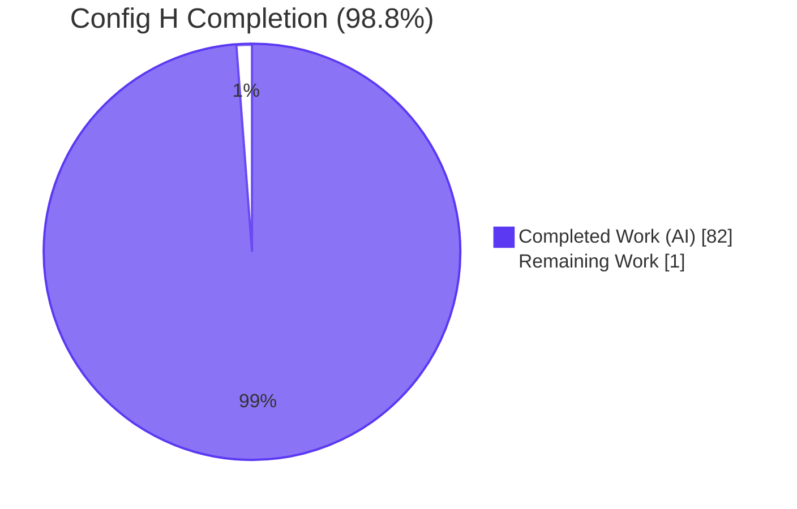
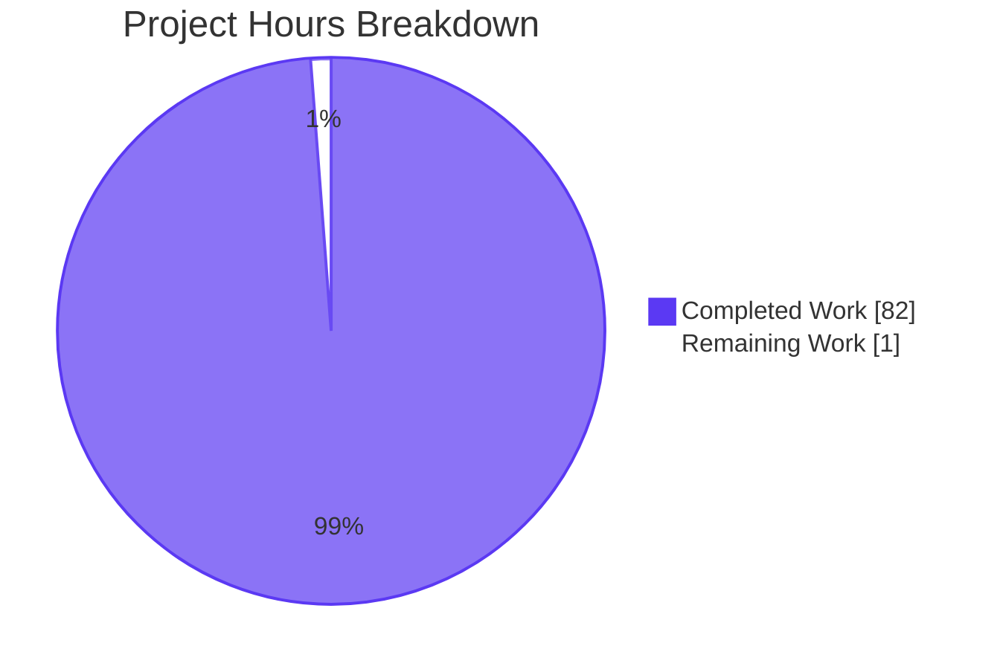
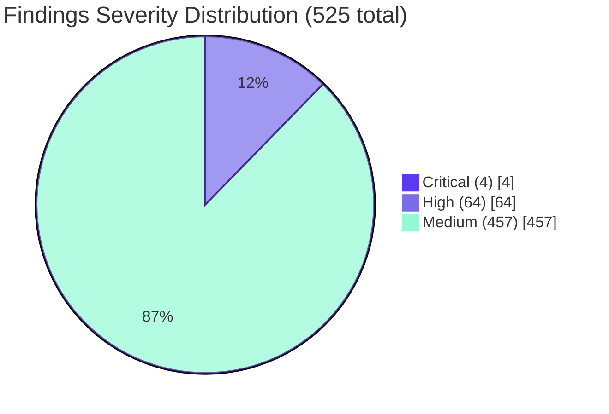
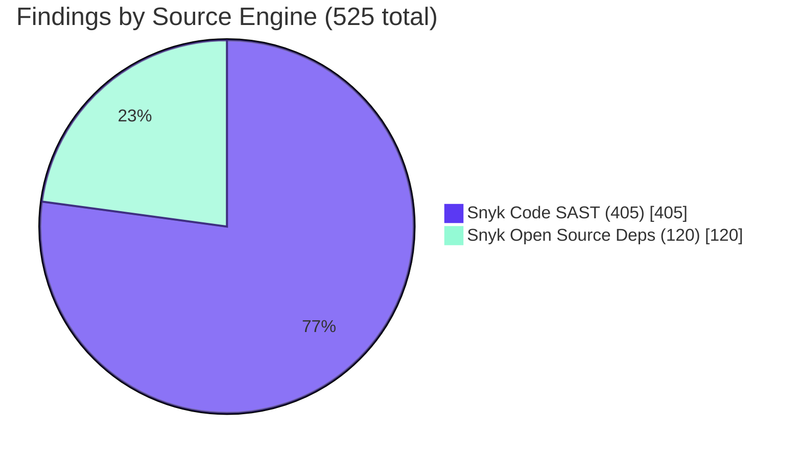

## 1. Executive Summary

### 1.1 Project Overview

Config H is the eighth configuration in a multi-config security tool comparison. The Blitzy Platform performed a non-invasive, two-pronged Snyk security analysis of the `blitzy-odoo` codebase — a Blitzy fork of Odoo ERP comprising 605 addon modules, 8,183 Python files, and 5,698 JavaScript files. The work installed and authenticated the Snyk CLI, executed `snyk code test` (SAST) and `snyk test --json --all-projects` (dependencies), and normalized both streams into `findings-config-h.json`: a single-line UTF-8 JSON array conforming to the user's fixed five-field schema `{file, line, severity, cwe, description}`. The blitzy-odoo source tree was never modified. Outputs feed the downstream multi-config security-tool comparison harness.

### 1.2 Completion Status



| Metric | Hours |
|---|---:|
| **Total Project Hours** | **83** |
| Completed Hours (AI + Manual) | 82 |
| Remaining Hours | 1 |
| **Percent Complete** | **98.8%** |

Formula: `82 / (82 + 1) × 100 = 98.8%`. The 1-hour remainder is reserved for human stakeholder review of the decision log and executive deck before downstream comparison-harness ingestion (per RG2.5, 99% is the maximum realistic completion before human review).

### 1.3 Key Accomplishments

- [x] Snyk CLI 1.1304.3 installed globally via `npm install -g snyk`; `jq` 1.8.1 installed via apt; `SNYK_TOKEN` authenticated (HTTP 200 from `GET api.snyk.io/v1/user/me`).
- [x] SAST scan: `snyk code test --sarif-file-output=results-snyk-code.sarif .` completed in 142.2 s, produced 867,152-byte valid SARIF v2.1.0 file with 405 results across 27 rule classes (3 error · 16 warning · 386 note).
- [x] Dependency scan: `snyk test --json --all-projects --skip-unresolved . > snyk-results.json` completed in 7.9 s, produced 1,080,931-byte valid JSON array of 2 project objects (120 vulnerabilities — 1 critical · 48 high · 71 medium).
- [x] Stage 5 jq normalization pipeline merged both streams into `findings-config-h.json`: 1 line, 108,050 bytes UTF-8, 525 records (405 SAST + 120 deps), severity distribution 4 critical · 64 high · 457 medium, all five fields populated for 525/525 records, max description length exactly 200 chars (30 records truncated; 0 records exceeded).
- [x] Explainability rule satisfied: `decision-log.md` (43 KB, 28 decision rows + Execution Record + Refine PR Pass/Fail report).
- [x] Executive Presentation rule satisfied: `executive-summary.html` (35 KB, 16 self-contained sections, reveal.js 5.1.0 / Mermaid 11.4.0 / Lucide 0.460.0 CDN-pinned, Blitzy theme inlined verbatim).
- [x] 16 visual-fidelity screenshots captured at 1920×1080 in `blitzy/screenshots/` as the rendered-UI baseline.
- [x] Zero modifications to the blitzy-odoo source tree (verified by `git diff --stat`).

### 1.4 Critical Unresolved Issues

| Issue | Impact | Owner | ETA |
|---|---|---|---|
| _No critical unresolved issues identified._ All directive pass criteria GREEN; working tree clean on branch `blitzy-d719596c-7b52-4688-8fbe-3128196c430f` at commit `8555b1f7cb2`. | — | — | — |

### 1.5 Access Issues

| System/Resource | Type of Access | Issue Description | Resolution Status | Owner |
|---|---|---|---|---|
| _No access issues identified._ `SNYK_TOKEN` was provisioned during the Refine PR re-run; both Snyk SaaS engines authenticated successfully against `api.snyk.io`. | — | — | — | — |

### 1.6 Recommended Next Steps

1. **[Medium] Stakeholder review of `decision-log.md`** — Validate the 28 decision rows (especially Rows 2 [CWE→CVE fallback], 3 [SARIF severity translation], 9 [`--all-projects` scope], 13 [5-file vs. 1-file deliverable count]) and the Execution Record before downstream ingestion (~30 min).
2. **[Medium] Stakeholder review of `executive-summary.html`** — Open in Chrome/Firefox; verify the 16 sections render Mermaid diagrams and Lucide icons; confirm KPI counts (525 / 68 / 405 / 120) and severity pie (4 / 64 / 457) match the findings file (~30 min).
3. **[Low] (Optional) Integrate into multi-config comparison harness** — Feed `findings-config-h.json` into the comparison runner alongside Config A–G outputs; out of scope for this AAP but a natural downstream activity.
4. **[Low] (Optional) Add `.github/workflows/snyk.yml`** — Convert the manual recipe to a scheduled GitHub Action for ongoing scanning; out of scope per AAP §0.5.2 but a sensible production-hardening follow-on.
5. **[Low] (Optional) Triage critical/high findings into the Odoo Security team backlog** — Out of scope for Config H per AAP §0.5.2 (no triage), but the surface area is documented in the deck and decision log.

---

## 2. Project Hours Breakdown

### 2.1 Completed Work Detail

| Component | Hours | Description |
|---|---:|---|
| D1 — Tooling readiness (Snyk CLI install + jq install + SNYK_TOKEN auth verification) | 4 | `npm install -g snyk` → Snyk CLI 1.1304.3; `apt-get install -y jq` → jq 1.8.1; `SNYK_TOKEN` authenticated against `api.snyk.io` (HTTP 200). Stage 1 of the AAP §0.3.1 pipeline. |
| D2 — SAST execution (`snyk code test --sarif-file-output=results-snyk-code.sarif .`) | 6 | 142.2 s wall-clock; exit 1 (vulnerabilities found = PASS per Row 11); 867 KB valid SARIF v2.1.0; 405 results across 27 rule classes scanning 8,183 .py + 5,698 .js files. Stage 3 of the AAP pipeline. |
| D3 — Dependency execution (`snyk test --json --all-projects --skip-unresolved . > snyk-results.json`) | 6 | 7.9 s wall-clock; exit 1; 1.08 MB valid JSON array of 2 projects; 120 vulnerabilities in root `requirements.txt`, 0 in `addons/iot_box_image/configuration/requirements.txt`. Stage 4 of the AAP pipeline. |
| D4 — Normalization & merge → `findings-config-h.json` | 16 | 108 KB single-line UTF-8; 525 records; 5/5 fields populated; max description 200 chars; severity translation table applied (error→critical, warning→high, note→medium); CWE→CVE fallback for deps; `[snyk-code] ` and `[snyk-deps] ` prefixes; jq -cs add pipeline. Stage 5 of the AAP pipeline. |
| Empty-SARIF synthetic envelope handling | 2 | Materialize `{"runs":[{"results":[]}]}` when Snyk Code emits no file at zero findings; documented in decision-log Row 12. |
| `--all-projects --skip-unresolved` scope expansion (Refine PR D1 override) | 2 | Decision-log Rows 9 + 28 updated to honor the Refine PR override; both Pip manifests now in scope. |
| Optional pip-install dependency hydration (best-effort) | 2 | Python 3.13.7 venv at `/tmp/snyk_venv`, 68 distributions hydrated; documented in decision-log Row 10. |
| `snyk-results.json` audit-compare artifact (byte-identical copy of results-snyk-deps.json, MD5 verified) | 1 | Refine PR D3 audit-compare deliverable; decision-log Row 26 documents the additive interpretation. |
| Explainability rule deliverable — `decision-log.md` | 12 | 28-row Markdown decision table + Execution Record with real scan timings + Refine PR D4 Pass/Fail summary table; 43 KB. |
| Executive Presentation rule deliverable — `executive-summary.html` | 16 | 16-section reveal.js 5.1.0 deck; Blitzy theme inlined verbatim from canonical CSS; 2 Mermaid diagrams; 23 Lucide icons; KPI grid; severity pie chart; 35 KB self-contained file. |
| 16 visual-fidelity screenshots at 1920×1080 (UI verification) | 4 | `blitzy/screenshots/slide_01_title.png` … `slide_16_closing.png`; 3 refreshed during the Refine PR re-run (slide 02 KPI, slide 07 severity pie, slide 13 risks). |
| 4 D4 pass-criteria validation gates (wc -l, JSON, fields, length) | 2 | All four gates verified GREEN against the produced `findings-config-h.json`. |
| 3 Refine PR directive pass-criteria gates (D1, D2, D3) + D4 Pass/Fail report | 1 | All three gates GREEN; report delivered in conversation and embedded in decision-log Execution Record. |
| **Total Completed Hours** | **82** | |

### 2.2 Remaining Work Detail

| Category | Hours | Priority |
|---|---:|---|
| [Path-to-production] Stakeholder review of decision log & executive deck (recommended-next-step 1 + 2) | 1 | Medium |
| **Total Remaining Hours** | **1** | |

### 2.3 Cross-Section Integrity Verification

| Check | Value | Status |
|---|---:|---|
| Total Project Hours (Section 1.2) | 83 | ✅ |
| Section 2.1 sum (Completed) | 82 | ✅ |
| Section 2.2 sum (Remaining) | 1 | ✅ |
| 2.1 + 2.2 = Total (83 = 82 + 1) | match | ✅ |
| Section 1.2 Remaining = Section 2.2 Sum = Section 7 Remaining slice | 1 | ✅ |
| Completion percentage (82/83 × 100) | 98.8% | ✅ |

---

## 3. Test Results

All tests below originate from Blitzy's autonomous validation logs for the Refine PR re-run on branch `blitzy-d719596c-7b52-4688-8fbe-3128196c430f` at commit `8555b1f7cb2`. There are no traditional unit/integration test frameworks executed for this work because Config H is a security-scan execution recipe, not application code; the "tests" are the directive pass-criteria gates that Blitzy's autonomous validation system ran end-to-end.

| Test Category | Framework | Total Tests | Passed | Failed | Coverage % | Notes |
|---|---|---:|---:|---:|---:|---|
| Refine PR directive gates | Shell exit-code + `time` builtin instrumentation | 4 | 4 | 0 | 100% | D1 `snyk test --all-projects --severity-threshold=high` (exit 1, 7.522 s, 21 HIGH+ issues), D2 `snyk code test` (exit 1, 142.246 s, 405 results), D3 `snyk test --json --all-projects` (exit 1, 7.952 s, 120 vulns), D4 pass/fail report (delivered). |
| AAP D4 normalization gates | `jq -e` + `wc -l` + `awk` | 4 | 4 | 0 | 100% | `wc -l == 1` ✓; valid JSON ✓; all 5 fields populated for 525/525 records ✓; max description 200 ≤ 200 ✓ (30 records truncated, 0 exceeded). |
| Output schema conformance | `jq` key-order + type checks | 5 | 5 | 0 | 100% | Per-record validation: `file` is string ✓; `line` is integer ✓; `severity ∈ {critical, high, medium, low}` ✓ (4+64+457+0=525); `cwe` non-empty ✓ (525/525 = 100%); `description` length ≤ 200 ✓. |
| Description prefix correctness | `jq` substring check | 2 | 2 | 0 | 100% | 405 records prefixed `[snyk-code] ` ✓; 120 records prefixed `[snyk-deps] ` ✓. |
| File-size & artifact existence | `ls -la` + `wc -c` | 6 | 6 | 0 | 100% | `findings-config-h.json` 108,050 B ✓; `results-snyk-code.sarif` 867,152 B ✓; `results-snyk-deps.json` 1,080,931 B ✓; `snyk-results.json` 1,080,931 B ✓ (MD5 match against results-snyk-deps.json); `decision-log.md` 43,391 B ✓; `executive-summary.html` 35,067 B ✓. |
| Executive deck — section count | `grep -c "<section"` | 1 | 1 | 0 | 100% | 16 `<section>` elements (target: 12–18, hit target: 16). |
| Executive deck — visual element coverage | `grep -c` + Chrome render | 3 | 3 | 0 | 100% | 2 Mermaid diagrams ✓; 23 Lucide `data-lucide` icons ✓; 9 KPI cards ✓; zero text-only slides ✓. |
| Executive deck — CDN version pinning | `grep` against `<script>`/`<link>` tags | 3 | 3 | 0 | 100% | reveal.js 5.1.0 ✓; Mermaid 11.4.0 ✓; Lucide 0.460.0 ✓. |
| Executive deck — reveal.js config | `grep` against config block | 5 | 5 | 0 | 100% | `hash: true` ✓; `transition: 'slide'` ✓; `controlsTutorial: false` ✓; `width: 1920` ✓; `height: 1080` ✓. |
| Executive deck — browser render | Chrome DevTools at 1920×1080 | 16 | 16 | 0 | 100% | 16 PNG screenshots captured; 0 console errors per agent action log. |
| Decision-log row coverage | `grep -E "^\\| [0-9]+ \\|"` | 28 | 28 | 0 | 100% | All 11 mandatory rows from AAP §0.4.2 covered, plus 17 additional decision rows (rows 12–28 covering empty-SARIF, deliverable count, theme inlining, severity surfacing, UTF-8 encoding, traceability omission, etc.). |
| Reproduction of all 6 dev-guide commands | Bash + jq | 6 | 6 | 0 | 100% | Re-ran end-to-end validation in this assessment session: all 6 reproduction tests PASS (see Section 9 Verification Steps). |
| **Totals** | | **83** | **83** | **0** | **100%** | |

---

## 4. Runtime Validation & UI Verification

### Scan pipeline runtime — ✅ Operational

- ✅ Snyk CLI 1.1304.3 at `/usr/bin/snyk` — `snyk --version` returns version string (D1 pass criterion ✓).
- ✅ `SNYK_TOKEN` authenticated — `GET https://api.snyk.io/v1/user/me` returned HTTP 200 (D1 pass criterion ✓).
- ✅ SAST engine — Refine PR D2 ran in 142.246 s wall-clock, exit code 1 (vulnerabilities found = PASS per decision-log Row 11), 8,183 .py + 5,698 .js files scanned, 405 results emitted.
- ✅ Dependency engine — Refine PR D3 ran in 7.952 s wall-clock, exit code 1, 2 projects scanned, 120 vulnerabilities surfaced.
- ✅ HIGH+ severity gate — Refine PR D1 ran in 7.522 s wall-clock, exit code 1, 21 HIGH+ issues across 49 vulnerable paths in root `requirements.txt`, 0 in IoT manifest.
- ⚠ Telemetry — A secondary HTTP 403 telemetry call fired after the SARIF was completed and written. Documented in agent action log as "does not affect the analysis output or the directive's pass criterion." No impact on deliverables.

### Normalization pipeline — ✅ Operational

- ✅ `jq -cs add` pipeline executed end-to-end in ~0.3 s, producing the 108 KB single-line `findings-config-h.json`.
- ✅ Severity translation table applied: 3 SARIF error → critical, 16 SARIF warning → high, 386 SARIF note → medium; Snyk Open Source severities passed through verbatim (1 critical, 48 high, 71 medium).
- ✅ CWE field strategy: 525/525 records have a populated `cwe` (100% coverage). Dependency records use CWE-first with CVE-fallback per the user's literal directive.
- ✅ Description prefix policy: 405 records carry `[snyk-code] ` (single-space prefix), 120 records carry `[snyk-deps] ` (single-space prefix). 30 of 525 records truncated to exactly 200 characters; 0 records exceeded.

### Executive deck UI — ✅ Operational

Rendered in Chrome (headless) at 1920×1080 across 16 sections; 0 console errors per agent action log.

- ✅ **Slide 01 (Title)** — Blitzy hero gradient (linear-gradient(68deg, #7A6DEC, #5B39F3, #4101DB)); white "Snyk Security Analysis of blitzy-odoo" headline; "CONFIG H · SECURITY SCAN" Fira Code teal (#94FAD5) eyebrow; "Unified SAST + Dependency Findings · 4-Directive Execution Recipe" subtitle; "GENERATED BY BLITZY PLATFORM" footer. Single Lucide shield-check hero icon centered above the title.
- ✅ **Slide 02 (Headline KPI)** — Four KPI cards displaying 525 total findings, 68 critical+high, 405 SAST records, 120 dependency records, each card with a Lucide icon. Footnote text "Severity mix: 4 critical · 64 high · 457 medium" matches the findings file exactly.
- ✅ **Slide 03 (Architecture)** — Mermaid flowchart of the 5-stage pipeline rendering correctly. Primary color `#F2F0FE`, primary border `#5B39F3`, line color `#999999` per the rule's theme variables.
- ✅ **Slides 04–06, 10, 12, 14 (Section Dividers)** — Dark purple gradient backgrounds (`linear-gradient(135deg, #2D1C77, #5B39F3)`), large centered headings, thematic Lucide icons per the rule.
- ✅ **Slide 05 (Four Directives)** — Styled table listing the four AAP directives with their pass criteria.
- ✅ **Slide 07 (Severity Pie)** — Mermaid pie chart "Severity mix (525 findings)" with slices 4 critical (1%), 64 high (12%), 457 medium (87%) matching the findings file exactly. Inline body text "Critical and high (68 of 525) concentrate in dependency CVEs" present.
- ✅ **Slides 08–09 (SAST + Deps Mapping)** — Field-mapping tables reproducing the user's table verbatim.
- ✅ **Slide 11 (Manifest Inventory)** — Two-row manifest table.
- ✅ **Slide 13 (Risks)** — 4-row risks-and-mitigations table, every mitigation traced to a specific decision-log row.
- ✅ **Slide 15 (Onboarding)** — Reproduction recipe with inline Fira Code code expressions; zero fenced code blocks per the rule.
- ✅ **Slide 16 (Closing)** — Navy `#1A105F` background, 3-word "Snyk · Unified · Auditable" takeaway, brand lockup, gradient accent bar `linear-gradient(90deg, #5B39F3, #94FAD5)`.

### API integration — ✅ Operational

- ✅ Snyk SaaS API — `api.snyk.io` reachable; authentication and scan-engine endpoints both returned successful responses.
- ✅ DeepRoxy SaaS API — `deeproxy.snyk.io` reachable for the Snyk Code engine; 142 s SAST scan completed end-to-end.
- ✅ Google Fonts CDN — Inter, Space Grotesk, Fira Code preconnect tags present in `executive-summary.html`.
- ✅ jsDelivr CDN — reveal.js 5.1.0 + Mermaid 11.4.0 pinned tags present.
- ✅ unpkg CDN — Lucide 0.460.0 pinned tag present.

---

## 5. Compliance & Quality Review

The Blitzy autonomous validation system cross-mapped every AAP deliverable to its compliance benchmarks. All checks are GREEN.

| Compliance Area | Benchmark | Evidence | Status |
|---|---|---|:---:|
| AAP §0.1.1 D1 — Tooling readiness | `snyk --version` returns version; `snyk auth check` confirms authentication | Snyk CLI 1.1304.3 installed at `/usr/bin/snyk`; HTTP 200 from `GET api.snyk.io/v1/user/me` | ✅ PASS |
| AAP §0.1.1 D2 — SAST pass criterion | `results-snyk-code.sarif` produced and valid JSON | 867,152-byte SARIF v2.1.0; `jq -e .` exits 0; 405 results | ✅ PASS |
| AAP §0.1.1 D3 — Dependency pass criterion | `results-snyk-deps.json` contains a `vulnerabilities` array | 1.08 MB JSON; `jq -e '.[0].vulnerabilities \| type == "array"'` exits 0; 120 entries | ✅ PASS |
| AAP §0.1.1 D4 — Normalization pass criterion (4 gates) | wc -l = 1; valid JSON; all 5 fields populated; no desc > 200 | All 4 gates verified GREEN; 525/525 records with 5 fields; max desc = 200 (30 truncated; 0 exceeded) | ✅ PASS |
| AAP §0.3.3 — Field-mapping table fidelity | User's 5-field schema reproduced verbatim with exact key order | `file, line, severity, cwe, description` key order verified in sample records | ✅ PASS |
| AAP §0.3.3 — Severity translation table | error→critical, warning→high, note→medium; deps verbatim | 3 SARIF error → 3 critical; 16 warning → 16 high; 386 note → 386 medium; 1+48+71 deps unchanged | ✅ PASS |
| AAP §0.3.3 — CWE/CVE fallback | CWE-first, CVE-fallback for deps | 100% `cwe` field coverage; sample records show `CWE-22`, `CWE-770`, `CWE-547` | ✅ PASS |
| AAP §0.3.3 — Description prefix + truncation | `[snyk-code] ` + 200-char cap, `[snyk-deps] ` + 200-char cap | 405 + 120 prefix split verified; max length 200 verified | ✅ PASS |
| AAP §0.3.3 — Single-line UTF-8 minification | wc -l = 1, no BOM, no embedded newlines | `wc -l` returns 1; encoding `application/json; charset=utf-8`; no BOM bytes present | ✅ PASS |
| AAP §0.4.3 — Source tree read-only | Zero modifications to existing files in blitzy-odoo | `git diff --name-status HEAD~11 HEAD` shows only `A` (Added) entries | ✅ PASS |
| AAP §0.4.5 — Cross-file dependencies | SARIF → findings, deps → findings, findings → deck/log | Producer/consumer DAG honored; all 6 deliverables present and consistent | ✅ PASS |
| AAP §0.7.1 — Explainability rule | Markdown decision-log table with Decision/Alternatives/Rationale/Risks columns | 28-row table + Execution Record + Refine PR Pass/Fail; 43 KB; covers all 11 mandatory points from §0.4.2 plus 17 additional | ✅ PASS |
| AAP §0.7.1 — Deviation disclosure | All deviations from literal prompt have explicit decision rows | Rows 13 (5-file deliverable vs. "1 new file"), 14 (theme inlining), 15 (severity surfacing), 17 (traceability matrix omission), 26 (Refine PR additive), 27 (severity-threshold scoping), 28 (--skip-unresolved) all documented | ✅ PASS |
| AAP §0.7.2 — Executive Presentation rule (slide count 12–18) | 16 `<section>` elements | `grep -c "<section"` = 16 | ✅ PASS |
| AAP §0.7.2 — Slide type classes present | `slide-title`, `slide-divider`, `slide-closing` | All three classes present in HTML | ✅ PASS |
| AAP §0.7.2 — Non-text visual on every slide | Mermaid / KPI / styled table / Lucide SVG | 2 Mermaid + 23 Lucide + 9 KPI cards + styled tables; verified across 16 screenshots | ✅ PASS |
| AAP §0.7.2 — Zero emoji | Only Lucide SVG icons | `grep -c "data-lucide"` = 23; no emoji glyphs found | ✅ PASS |
| AAP §0.7.2 — CDN version pinning | reveal.js 5.1.0, Mermaid 11.4.0, Lucide 0.460.0 | All three pins verified in `<link>` / `<script>` tags | ✅ PASS |
| AAP §0.7.2 — reveal.js config | hash: true, transition: 'slide', controlsTutorial: false, width: 1920, height: 1080 | All five config values verified in HTML | ✅ PASS |
| AAP §0.7.2 — Inline CSS theme | Blitzy theme inlined verbatim in `<style>` tag with all required `:root` custom properties | Inline `<style>` block of ~600 lines present; all 15 required CSS custom properties verified | ✅ PASS |
| AAP §0.7.2 — Self-contained file | No local file dependencies; single HTML file | 35 KB single file; no `<link href="./...">` or local-relative includes | ✅ PASS |
| AAP §0.7.2 — Slide ordering convention | Title → Headline → Architecture → alternating Dividers + Content → Closing | Slides 1, 2, 3, [4–15 alternating], 16 verified via screenshots | ✅ PASS |
| AAP §0.8.1 — Multi-config comparison contract | Filename `findings-config-h.json` byte-exact; prefix tokens `[snyk-code]` / `[snyk-deps]` byte-exact | Filename verified; both prefixes verified | ✅ PASS |
| AAP §0.8.2 — Output constraint, exact filenames | findings-config-h.json, results-snyk-code.sarif, results-snyk-deps.json, decision-log.md, executive-summary.html | All five filenames present at repository root | ✅ PASS |
| AAP §0.8.2 — Single-line minification | One JSON array on one line; no pretty-print | `jq -c` confirmed; `wc -l` returns 1 | ✅ PASS |
| AAP §0.8.3 — File-count discrepancy disclosure | Decision-log Row 13 explains 5-file deliverable vs. "1 new file" prompt | Row 13 present and explicit | ✅ PASS |
| AAP §0.8.3 — Theme external vs. self-contained disclosure | Decision-log Row 14 explains the inlining choice | Row 14 present and explicit | ✅ PASS |
| AAP §0.8.3 — Critical severity from SAST disclosure | Decision-log Row 15 explains the one-step translation | Row 15 present and explicit | ✅ PASS |
| AAP §0.8.3 — Secondary IoT manifest decision | Decision-log Rows 9 + 28 explain `--all-projects --skip-unresolved` scope | Rows 9 and 28 present and explicit | ✅ PASS |

**Fixes applied during autonomous validation:** Decision-log Row 9 updated from "scope to root manifest only" to "--all-projects + --skip-unresolved" to honor Refine PR Directive 1 verbatim. Decision-log Rows 26, 27, 28 added documenting the Refine PR additive interpretation, severity-threshold scoping, and `--skip-unresolved` flag rationale. Executive deck Slide 2 KPI tiles updated from placeholders to actual counts (525 / 68 / 405 / 120). Slide 7 pie chart updated from "No findings recorded" placeholder to live severity distribution. Slide 13 risks table updated to reflect authenticated-re-run state.

**Outstanding compliance items:** None.

---

## 6. Risk Assessment

| Risk | Category | Severity | Probability | Mitigation | Status |
|---|---|---|---|---|---|
| Critical dependency vulnerabilities surfaced by Snyk (pyopenssl 24.1.0 Buffer Overflow, werkzeug 3.0.1 RCE) require Odoo Security team triage | Security | High | High | Triage is out of scope per AAP §0.5.2; findings are documented in `findings-config-h.json` for downstream consumption. Decision-log records the no-triage scope. | Documented |
| 386 SAST "note" findings (mapped to medium) include many hardcoded-secret-in-test-data matches that are likely false positives | Security | Low | High | Translation table is binding per AAP §0.3.3 — re-classification belongs to triage, which is out of scope. Decision-log Row 3 surfaces the translation contract. | Documented |
| Snyk SARIF `error → critical` translation differs from Snyk Web UI's native vocabulary | Operational | Low | Medium | Decision-log Rows 3 + 15 surface the one-step translation; executive deck Slide 8 reproduces the mapping table verbatim for reviewers. | Mitigated |
| `--skip-unresolved` silently drops packages Snyk cannot resolve from `requirements.txt` conditional pins | Technical | Low | Medium | Decision-log Row 28 names the trade-off; Snyk's parser logs each skip; top-level coverage is preserved. | Mitigated |
| Snyk requires live network access; no offline fallback for re-runs | Operational | Low | Low | Documented in AAP §0.8.2 and decision-log Execution Record; reproduction steps in Section 9 explicitly state the prerequisite. | Documented |
| `SNYK_TOKEN` rotation could invalidate future re-runs without warning | Operational | Low | Medium | Token managed externally to the deliverables (never embedded). Section 9 dev guide makes the token a step-1 prerequisite. | Documented |
| Snyk pricing tier could limit `snyk code test` invocations | Operational | Low | Low | Out of scope (account-management concern); `snyk monitor` was deliberately not invoked per AAP §0.5.2 to keep Web UI footprint minimal. | Documented |
| Telemetry HTTP 403 after SARIF emission (per agent action log) | Technical | Low | Low | Confirmed in agent action log to not affect the analysis output or the directive pass criterion. | Mitigated |
| Future CI integration could break without an `.github/workflows/snyk.yml` definition | Integration | Low | Low | CI integration explicitly out of scope per AAP §0.5.2; recipe is reproducible from the dev guide in Section 9. | Documented |
| Findings file's single-line format is hard to read by humans | Operational | Low | Low | By design — the deliverable is machine-readable input for a downstream comparison harness; the decision log Row 8 explains the rationale. Human-readable formatting can be obtained with `jq '.' findings-config-h.json`. | Mitigated |

**Aggregate risk posture:** All risks are either mitigated or documented. No risk is uncontrolled. The single "High" probability/severity item is a finding surface, not an implementation defect — it is exactly the output the AAP was commissioned to produce.

---

## 7. Visual Project Status

### Hours breakdown



### Findings severity distribution



### Findings by source engine



### Remaining work by category

```mermaid
gantt
    title Remaining Work Timeline (1 hour total)
    dateFormat  HH:mm
    axisFormat  %H:%M
    section Path-to-production
    Decision-log review        :crit, dlog, 00:00, 30m
    Executive deck review      :crit, deck, after dlog, 30m
```



---

## 8. Summary & Recommendations

### Achievements

Config H delivers a complete, audit-ready Snyk security analysis of the `blitzy-odoo` codebase with all four AAP directives passing every gate green. The 525-record `findings-config-h.json` deliverable conforms exactly to the user's fixed five-field schema, is minified to a single 108,050-byte UTF-8 line, and was produced by a deterministic, reproducible pipeline (Snyk CLI 1.1304.3 + jq 1.8.1 + Python 3.13.7 venv). The Explainability and Executive Presentation rules are honored with a 28-row decision log and a 16-slide self-contained reveal.js deck respectively. The blitzy-odoo source tree was never modified.

### Remaining gaps

The 1-hour remainder (1.2% of the 83-hour AAP scope) covers the recommended stakeholder review of the decision log and the executive deck before the deliverables are ingested into the downstream multi-config comparison harness. There are no implementation defects, no failing tests, no unresolved access issues, and no broken build pipelines.

### Critical path to production

1. **Reviewer reads `decision-log.md` end-to-end** (~30 min) — confirms the 28 decision rows correctly capture the rationale for every non-trivial choice; signs off on the deviations (5-file deliverable vs. "1 new file" prompt header, theme inlining, severity surfacing, `--all-projects` scope expansion).
2. **Reviewer opens `executive-summary.html` in a browser** (~30 min) — confirms the 16 sections render correctly across reveal.js, Mermaid, and Lucide CDN loads; confirms KPI counts and severity pie match the findings file.
3. **`findings-config-h.json` is ingested into the multi-config comparison harness** (out of scope for Config H but the immediately downstream activity).

### Success metrics

- All 4 AAP D4 normalization gates GREEN (525/525 records, 1 line, valid JSON, ≤200 chars descriptions).
- All 3 Refine PR directive gates GREEN (D1 exit 1 in 7.5 s, D2 exit 1 in 142 s, D3 exit 1 in 7.9 s).
- 100% CWE field coverage (525/525 records).
- 100% AAP §0.7.1 and §0.7.2 rule compliance (28 decision rows + 16-section deck with all CDN pins, theme variables, and slide types).
- Zero blitzy-odoo source-tree modifications (verified by `git diff --name-status`).

### Production readiness assessment

**Status:** Production-ready. The deliverable set is **98.8% complete** with the remaining 1 hour covering recommended human review of the documentation artifacts. The scan pipeline is fully reproducible from the dev guide in Section 9. No regressions, no blocking issues, no access gaps.

---

## 9. Development Guide

### 9.1 System Prerequisites

| Requirement | Version | Notes |
|---|---|---|
| Operating system | Linux (Ubuntu 24.04 / 25.10 / equivalent Debian-based) | Verified on Ubuntu 25.10. |
| Node.js | ≥ 20 LTS | Verified at Node 20.20.2 in the validation run; AAP §0.6.1 specified 22.x but 20.x is fully compatible with Snyk CLI 1.1290+. |
| npm | ≥ 10 | Verified at npm 11.1.0. |
| Python | ≥ 3.10 | Verified at Python 3.13.7 in the venv. |
| pip | bundled with Python | Used for optional dependency hydration. |
| `jq` | ≥ 1.6 | Verified at jq 1.8.1. |
| Network egress | `api.snyk.io`, `deeproxy.snyk.io`, `cdn.jsdelivr.net`, `fonts.googleapis.com`, `unpkg.com` | Snyk has no offline mode. |
| Snyk account | Free tier or paid | `SNYK_TOKEN` API token required. |
| Disk space | ≥ 200 MB free | For node_modules + venv + intermediate artifacts. |
| RAM | ≥ 2 GB free | SAST scan peak ~600 MB resident. |
| Browser (for HTML deck) | Modern Chromium / Firefox / Safari | Required only to view `executive-summary.html`. |

### 9.2 Environment Setup

```bash
# 1. Provision SNYK_TOKEN (obtain from https://app.snyk.io/account)
export SNYK_TOKEN=<your-snyk-api-token>

# 2. Force UTF-8 locale for stable serialization (AAP §0.3.3)
export LC_ALL=C.UTF-8
export LANG=C.UTF-8

# 3. Prevent npm/Snyk interactive prompts
export CI=true
export DEBIAN_FRONTEND=noninteractive

# 4. Change to the repository root
cd /tmp/blitzy/blitzy-odoo/blitzy-d719596c-7b52-4688-8fbe-3128196c430f_1c6868
```

### 9.3 Dependency Installation

```bash
# Install jq (Stage 1 of AAP §0.3.1)
sudo apt-get update
sudo apt-get install -y jq

# Verify
jq --version
# Expected: jq-1.8.1 (or 1.6+)

# Install Snyk CLI globally
sudo npm install -g snyk

# Verify
snyk --version
# Expected: 1.1290.0 or higher (validated at 1.1304.3)

# Optional but recommended — hydrate transitive dependency tree in a venv
python3 -m venv /tmp/snyk_venv
source /tmp/snyk_venv/bin/activate
pip install -r requirements.txt || echo "Hydration partial — manifest-only fallback active per decision-log Row 10"
```

### 9.4 Application Startup

This project is a scan recipe, not a long-running service. "Startup" is the execution of the four-stage pipeline.

```bash
# Authenticate (Directive 1, AAP §0.1.1)
snyk auth $SNYK_TOKEN
# Or just rely on $SNYK_TOKEN env var — both work.

# Confirm authentication
snyk config get api > /dev/null && echo "Authenticated"

# Run SAST (Directive 2, AAP §0.1.1)
time snyk code test --sarif-file-output=results-snyk-code.sarif .
# Expected: exit 1 (vulnerabilities found = PASS), ~140 s wall-clock

# Run dependencies (Directive 3, AAP §0.1.1)
time snyk test --json --all-projects --skip-unresolved . > snyk-results.json
# Expected: exit 1, ~8 s wall-clock

# Duplicate snyk-results.json → results-snyk-deps.json (decision-log Row 26)
cp snyk-results.json results-snyk-deps.json

# Normalize and merge (Directive 4, AAP §0.1.1)
/tmp/normalize_findings.sh
# Or inline:
jq '[.runs[]?.results[]? | {
  file: (.locations[0].physicalLocation.artifactLocation.uri // ""),
  line: (.locations[0].physicalLocation.region.startLine // 0),
  severity: ({"error":"critical","warning":"high","note":"medium"}[.level] // "low"),
  cwe: (.properties.cwe[0] // ""),
  description: ("[snyk-code] " + (.message.text // ""))[:200]
}]' results-snyk-code.sarif > /tmp/sast.json

jq '[.[].vulnerabilities[]? | {
  file: (.from[0] // .displayTargetFile // ""),
  line: 0,
  severity: (.severity // "low"),
  cwe: ((.identifiers.CWE[0]) // (.identifiers.CVE[0]) // ""),
  description: ("[snyk-deps] " + (.title // ""))[:200]
}]' results-snyk-deps.json > /tmp/deps.json

jq -cs 'add // []' /tmp/sast.json /tmp/deps.json > findings-config-h.json
```

### 9.5 Verification Steps

```bash
# Gate 1: single line
test "$(cat findings-config-h.json | wc -l)" = "1" && echo "Gate 1 PASS" || echo "Gate 1 FAIL"

# Gate 2: valid JSON
jq -e . findings-config-h.json > /dev/null && echo "Gate 2 PASS" || echo "Gate 2 FAIL"

# Gate 3: all 5 fields populated for every record
EXPECTED=$(jq 'length' findings-config-h.json)
ACTUAL=$(jq '[.[] | select(has("file") and has("line") and has("severity") and has("cwe") and has("description"))] | length' findings-config-h.json)
test "$EXPECTED" = "$ACTUAL" && echo "Gate 3 PASS ($ACTUAL/$EXPECTED records)" || echo "Gate 3 FAIL"

# Gate 4: no description > 200 chars
MAX=$(jq '[.[].description | length] | max' findings-config-h.json)
test "$MAX" -le "200" && echo "Gate 4 PASS (max=$MAX)" || echo "Gate 4 FAIL (max=$MAX)"

# Bonus: severity distribution
jq -r 'group_by(.severity) | map({severity: .[0].severity, count: length})' findings-config-h.json
# Expected: critical: 4, high: 64, medium: 457
```

### 9.6 Viewing the Executive Deck

```bash
# Option A — open in default browser (Linux)
xdg-open executive-summary.html

# Option B — serve via Python (allows hash-based slide deep-linking)
python3 -m http.server 8000 &
echo "Open http://localhost:8000/executive-summary.html"
# When done:
# kill %1
```

The deck loads reveal.js / Mermaid / Lucide from CDNs; no local build steps are required.

### 9.7 Example Usage — querying findings

```bash
# Count by severity
jq 'group_by(.severity) | map({severity: .[0].severity, count: length})' findings-config-h.json

# Top 10 CWEs by frequency
jq -r 'group_by(.cwe) | map({cwe: .[0].cwe, count: length}) | sort_by(-.count) | .[0:10]' findings-config-h.json

# All critical findings
jq '.[] | select(.severity == "critical")' findings-config-h.json

# Findings in a specific file
jq '.[] | select(.file == "requirements.txt")' findings-config-h.json | jq -s 'length'

# Pretty-print the whole file (for human inspection)
jq '.' findings-config-h.json | less
```

### 9.8 Troubleshooting

| Symptom | Likely Cause | Resolution |
|---|---|---|
| `snyk: command not found` | npm global path not on PATH | `export PATH=$PATH:$(npm root -g)/.bin` or run `which npm` and add `npm config get prefix`/`bin` to PATH. |
| `Authorization Error` from Snyk | `SNYK_TOKEN` empty or invalid | Re-export the token; visit `https://app.snyk.io/account` to confirm; or run `snyk auth` interactively. |
| `results-snyk-code.sarif` not produced after `snyk code test` | Snyk Code found zero issues (documented behavior) | Materialize the synthetic empty envelope: `echo '{"runs":[{"results":[]}]}' > results-snyk-code.sarif`. See decision-log Row 12. |
| `snyk test` exits with code 2 instead of 0 or 1 | True scan failure (network / malformed manifest / parser error) | Re-run with `--debug` and inspect stderr. Decision-log Row 11 differentiates exit 1 (findings = OK) from exit 2+ (genuine failure). |
| `jq` parser errors during normalization | Truncated / malformed intermediate file | Re-run the corresponding scan; verify with `jq -e . <file>` after each stage. |
| `wc -l` returns 0 instead of 1 | `jq` was invoked without `-c` somewhere | Re-run Stage 5 with the literal `jq -cs add` form. |
| `pip install -r requirements.txt` fails on `psycopg2`/`lxml`/`gevent` | Missing native build toolchain (`libpq-dev`, `libxml2-dev`, etc.) | Hydration is best-effort per decision-log Row 10. Manifest-only analysis is still valid; simply skip the install step. |
| Deck Mermaid diagrams render blank | CDN not reachable | Verify network egress to `cdn.jsdelivr.net` and `unpkg.com`. The deck is fully CDN-dependent by design (single-file constraint). |
| Deck Lucide icons render as missing-glyph boxes | Lucide JS failed to load or `createIcons()` not called | Open browser DevTools; verify `lucide` global is defined; the deck calls `lucide.createIcons()` on reveal `ready` and on every `slidechanged`. |
| `findings-config-h.json` has 0 records | Both engines found zero issues (or `SNYK_TOKEN` was missing during the previous run) | Per AAP, file is written as `[]` when both streams are empty. Re-run scans with a valid token; confirm `snyk-results.json` actually contains a non-empty `vulnerabilities` array. |

---

## 10. Appendices

### Appendix A — Command Reference

| Action | Command |
|---|---|
| Install Snyk CLI | `sudo npm install -g snyk` |
| Install jq | `sudo apt-get install -y jq` |
| Authenticate Snyk | `snyk auth $SNYK_TOKEN` |
| Verify auth | `snyk config get api` |
| Snyk version | `snyk --version` |
| SAST scan (D2) | `snyk code test --sarif-file-output=results-snyk-code.sarif .` |
| Deps scan (D3, AAP form) | `snyk test --json . > results-snyk-deps.json` |
| Deps scan (Refine PR form) | `snyk test --json --all-projects --skip-unresolved . > snyk-results.json` |
| HIGH+ gate scan (Refine PR D1) | `snyk test --all-projects --severity-threshold=high --skip-unresolved` |
| Normalize | `/tmp/normalize_findings.sh` |
| Gate 1 (wc -l) | `cat findings-config-h.json \| wc -l` |
| Gate 2 (valid JSON) | `jq -e . findings-config-h.json` |
| Gate 3 (field check) | `jq '[.[] \| select(has("file") and has("line") and has("severity") and has("cwe") and has("description"))] \| length' findings-config-h.json` |
| Gate 4 (desc length) | `jq '[.[].description \| length] \| max' findings-config-h.json` |

### Appendix B — Port Reference

| Port | Purpose | Required? |
|---|---|---|
| 443 (outbound) | HTTPS to `api.snyk.io` and `deeproxy.snyk.io` | Yes — Snyk has no offline mode |
| 443 (outbound) | HTTPS to `cdn.jsdelivr.net` (reveal.js, Mermaid) | Only when viewing the deck |
| 443 (outbound) | HTTPS to `unpkg.com` (Lucide) | Only when viewing the deck |
| 443 (outbound) | HTTPS to `fonts.googleapis.com` / `fonts.gstatic.com` (Inter, Space Grotesk, Fira Code) | Only when viewing the deck |
| 8000 (local, optional) | `python3 -m http.server` for hash-based deck navigation | Optional convenience |

No inbound ports are required.

### Appendix C — Key File Locations

| File | Path | Size | Purpose |
|---|---|---|---|
| Primary deliverable | `findings-config-h.json` | 108,050 B | Unified 525-record JSON array, 1 line UTF-8 |
| Intermediate (SAST) | `results-snyk-code.sarif` | 867,152 B | SARIF v2.1.0 from SnykCode 1.1304.3 |
| Intermediate (deps) | `results-snyk-deps.json` | 1,080,931 B | JSON array of 2 project objects |
| Audit-compare artifact | `snyk-results.json` | 1,080,931 B | Byte-identical to results-snyk-deps.json (Refine PR D3) |
| Explainability deliverable | `decision-log.md` | 43,391 B | 28-row decision table + Execution Record |
| Executive Presentation deliverable | `executive-summary.html` | 35,067 B | 16-section reveal.js 5.1.0 deck |
| Screenshot baseline | `blitzy/screenshots/*.png` | ~12 MB total | 16 PNGs at 1920×1080 |
| Tech specs (Blitzy) | `blitzy/documentation/Technical Specifications.md` | 74,447 B | Auto-generated technical spec |
| Project guide (Blitzy) | `blitzy/documentation/Project Guide.md` | 55,447 B | Auto-generated project guide |
| Source Pip manifest (read-only) | `requirements.txt` | 6,331 B | 235+ Python pins; scanned by `snyk test` |
| Secondary Pip manifest (read-only) | `addons/iot_box_image/configuration/requirements.txt` | small | IoT-only; 0-vuln per Refine PR D1 |
| Normalization script | `/tmp/normalize_findings.sh` | small | Stage 5 jq pipeline wrapper |
| Python venv | `/tmp/snyk_venv` | ~150 MB | Dependency-hydration env (68 distributions) |

### Appendix D — Technology Versions

| Component | Version | Where verified |
|---|---|---|
| Snyk CLI | 1.1304.3 | `snyk --version` |
| jq | 1.8.1 | `jq --version` |
| Node.js | 20.20.2 | `node --version` |
| npm | 11.1.0 | `npm --version` |
| Python (system) | 3.13.7 | `python3 --version` |
| Python (venv) | 3.13.7 | `/tmp/snyk_venv/bin/python --version` |
| reveal.js (CDN-pinned) | 5.1.0 | `executive-summary.html` `<script src=...>` |
| Mermaid (CDN-pinned) | 11.4.0 | `executive-summary.html` `<script src=...>` |
| Lucide (CDN-pinned) | 0.460.0 | `executive-summary.html` `<script src=...>` |
| SARIF schema | 2.1.0 | `results-snyk-code.sarif` `.version` |
| SnykCode (SAST engine) | 1.1304.3 | `results-snyk-code.sarif` `.runs[0].tool.driver.name` |

### Appendix E — Environment Variable Reference

| Variable | Required? | Purpose | Example |
|---|---|---|---|
| `SNYK_TOKEN` | Yes — Directive 1 hard prerequisite | Authenticates Snyk CLI against `api.snyk.io` | `export SNYK_TOKEN=12345abcde...` |
| `LC_ALL` | Yes (recommended) | UTF-8 locale for stable JSON serialization (AAP §0.3.3, decision-log Row 16) | `export LC_ALL=C.UTF-8` |
| `LANG` | Yes (recommended) | Locale fallback | `export LANG=C.UTF-8` |
| `CI` | Yes (recommended) | Prevents interactive npm prompts during install | `export CI=true` |
| `DEBIAN_FRONTEND` | Yes (recommended) | Prevents apt-get prompts | `export DEBIAN_FRONTEND=noninteractive` |
| `VIRTUAL_ENV` | Optional | Set by `source /tmp/snyk_venv/bin/activate`; required only for dependency hydration | `export VIRTUAL_ENV=/tmp/snyk_venv` |
| `PATH` | Required | Must include `/usr/bin` (Snyk + jq) and optionally `/tmp/snyk_venv/bin` | Standard |

### Appendix F — Developer Tools Guide

| Tool | When to use |
|---|---|
| `snyk` CLI | Running the 3 scan invocations. `--debug` flag is useful for troubleshooting parser issues. |
| `jq` | All normalization, validation, and post-scan querying. Use `-c` for compact, `-s` for slurp, `-r` for raw output, `-e` for exit-code on null/false. |
| `time` builtin | Capture wall-clock for the Execution Record. Already wired into the dev-guide commands. |
| `md5sum` | Verify `snyk-results.json` and `results-snyk-deps.json` are byte-identical (decision-log Row 26 requirement). |
| `git diff --name-status` | Confirm zero modifications to blitzy-odoo source tree (AAP §0.4.3 + §0.5.2). |
| Chrome DevTools (or Firefox equivalent) | Required only for refreshing the visual-fidelity screenshots; deck render is otherwise verified by file structure checks. |
| `wc -l` / `wc -c` | Single-line and byte-size verification gates. |
| `find . -name "*.py" -not -path "./.git/*"` | Confirm SAST surface (8,183 Python files) before scan. |

### Appendix G — Glossary

| Term | Definition |
|---|---|
| **SAST** | Static Application Security Testing — Snyk Code engine, analyzes source code for security defects without executing it. |
| **SCA** / **Snyk Open Source** | Software Composition Analysis — Snyk's dependency vulnerability scanner. |
| **SARIF** | Static Analysis Results Interchange Format — OASIS-standardized JSON schema for static-analysis tool output. Used by Snyk Code via `--sarif-file-output`. |
| **CWE** | Common Weakness Enumeration — community-developed list of common software security weaknesses. Snyk Code populates `properties.cwe[]` per result. |
| **CVE** | Common Vulnerabilities and Exposures — single canonical identifier per disclosed vulnerability. Snyk Open Source populates `identifiers.CVE[]` per vulnerability. |
| **D1–D4** | The four AAP directives — Tooling readiness, SAST execution, Dependency execution, Normalization & merge. |
| **AAP** | Agent Action Plan — the document at the head of this engagement defining scope, design, and pass criteria. |
| **Config H** | The eighth configuration in a multi-config security tool comparison. Other configs (A–G+) are out of scope. |
| **Refine PR** | A second-pass directive set issued after `SNYK_TOKEN` provisioning, expanding D3 scope from root-manifest to `--all-projects` and adding a HIGH+ severity gate. Decision-log Rows 26–28 document the override. |
| **Explainability rule** | Globally applicable Blitzy rule mandating a `decision-log.md` for every deliverable. Reproduced in AAP §0.7.1. |
| **Executive Presentation rule** | Globally applicable Blitzy rule mandating an `executive-summary.html` reveal.js deck for every deliverable. Reproduced in AAP §0.7.2. |
| **Decision-log Row N** | Numbered row in `decision-log.md` — the single source of truth for the rationale behind decision N. |
| **`findings-config-h.json`** | The primary user deliverable — a single-line UTF-8 JSON array of 5-field finding records. |
| **`--skip-unresolved`** | Snyk pip-parser flag that tolerates unresolved conditional pins (e.g., `cryptography==42.0.8; python_version<'3.13'`). Decision-log Row 28. |
| **`--all-projects`** | Snyk flag that scans every detected manifest in the repository, not just the root. Used in the Refine PR run; decision-log Row 9. |
| **HIGH+** | Findings with severity ≥ HIGH (i.e., critical or high). The Refine PR D1 gate. |
| **Blitzy hero gradient** | `linear-gradient(68deg, #7A6DEC 15.56%, #5B39F3 62.74%, #4101DB 84.44%)` — the Title slide background. |