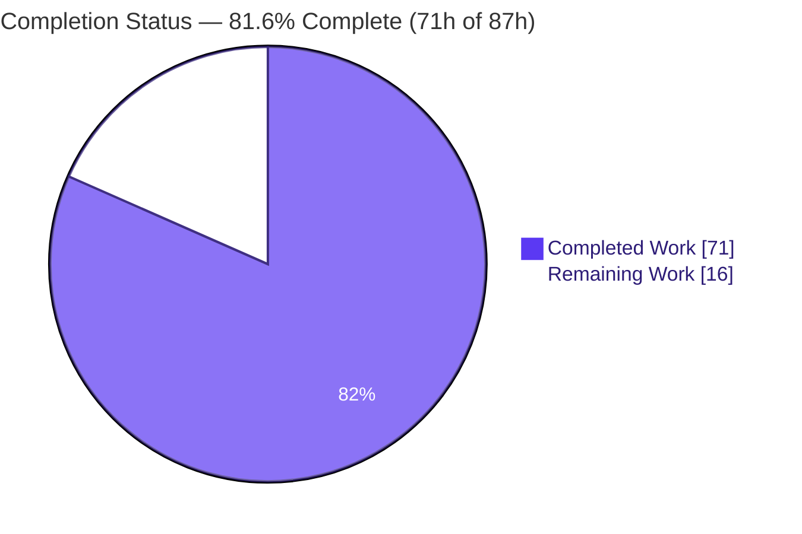
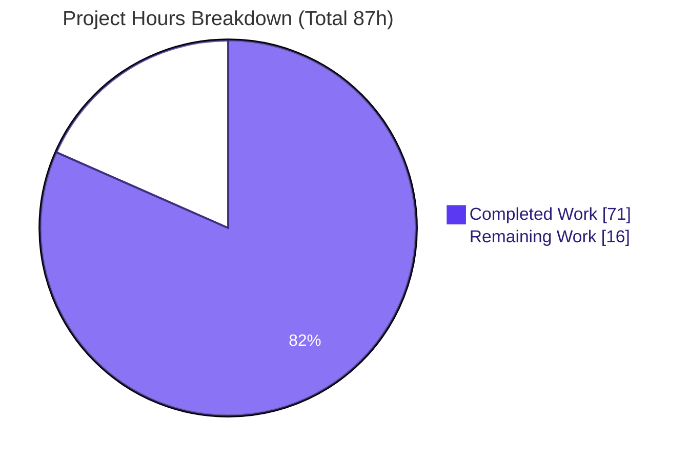
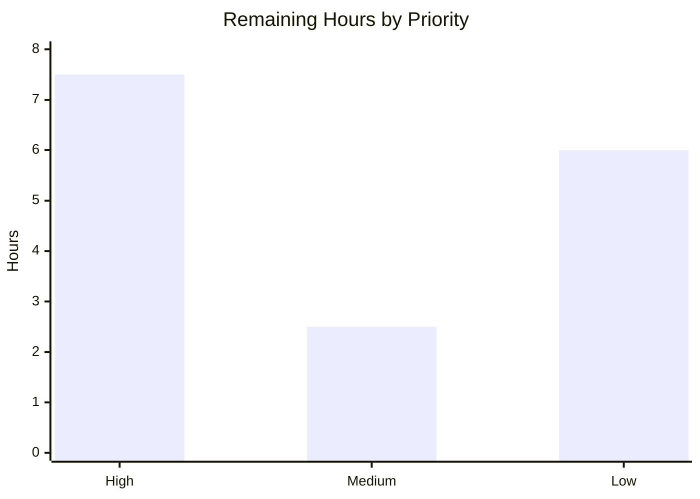

# Blitzy Project Guide — Enterprise Accounting Suite: Code Archaeology & Segmented PR Review (Odoo 19.0 CE)

> **Engagement type:** Retrospective Git-archaeology + Segmented PR Review + Executive Presentation (not a feature build).
> **Branch:** `blitzy-931bfff8-56d4-43e7-92c2-cd58063e4160` · **HEAD:** `e9750d9783a` · **Baseline:** `7bd7718bcd4` (Odoo 19.0.0 Final) · **Review subject tip:** `origin/pdlc@1389691509568206594224539d5495f87a310ed1`

---

## 1. Executive Summary

### 1.1 Project Overview

This engagement performed a forensic **code archaeology** of every change Blitzy Agents merged into an Odoo 19.0 Community Edition monorepo, framed that merged delta as active work, and subjected it to a rule-governed **Segmented PR Review**. The reviewed subject is the diff between the pristine Odoo baseline and the integration branch: **278 added files, +134,588 insertions, 0 deletions** across six new Community-Edition accounting addons plus planning, documentation, and test-fixture artifacts. Two deliverables were produced this run: `CODE_REVIEW.md` (the seven-domain review record with a nine-commit cadence) and `blitzy-deck/executive-summary.html` (a self-contained reveal.js executive presentation for non-technical leadership). Target users are engineering leadership and the maintainers who will own the merged accounting suite.

### 1.2 Completion Status

The project is **81.6% complete** on an AAP-scoped, hours-based basis (PA1). All autonomous work defined by the Agent Action Plan — archaeology, the full Segmented PR Review, and the executive deck — is complete and validated with **zero fixes required**. The remaining hours are exclusively human-gated path-to-production activities (independent sign-off, merge, leadership delivery) plus optional risk-register follow-ups.



| Metric | Value |
|--------|-------|
| **Total Hours** | **87 h** |
| **Completed Hours (AI + Manual)** | **71 h** (71 h AI autonomous · 0 h manual) |
| **Remaining Hours** | **16 h** |
| **Percent Complete** | **81.6%** |

> Color key — **Completed = Dark Blue `#5B39F3`**, **Remaining = White `#FFFFFF`**.

### 1.3 Key Accomplishments

- ✅ **Archaeology reconstructed and Git-verified** — the entire Blitzy contribution resolved as `git diff 7bd7718bcd4 origin/pdlc` = 278 files, all Added, +134,588/−0, authored by 307 `agent@blitzy.com` + 3 `blitzy[bot]` = 310 commits.
- ✅ **Deterministic 7-domain partition** — a first-match-wins classifier assigns all 278 files to exactly one review domain; the partition matrix reconciles by both rows and columns to 278 (Infra 40 · Security 12 · Backend 50 · QA 60 · Business 48 · Frontend 45 · Other 23).
- ✅ **Pre-flight gate PASSED (6/6 criteria)** — deliverables present; module-load build 0 errors / 0 warnings; **940 framework tests all passing**; static analysis clean under the pinned ruff 0.11.4; zero placeholder stubs across 79 production `.py` files; nine-commit artifact cadence.
- ✅ **All seven domain review phases + final verdict = `APPROVED`** — no `BLOCKED` verdicts; PR-READY per Rule 2.
- ✅ **`CODE_REVIEW.md` authored** (726 lines) with the mandated nine-commit cadence and timestamps strictly after the last code-generation commit.
- ✅ **Executive deck delivered** (`executive-summary.html`, 1,359 lines) — 16 slides, exact CDN pins (reveal.js 5.1.0, Mermaid 11.4.0, Lucide 0.460.0), full Blitzy brand identity, SRI-hardened; renders with 0 console errors (independently re-verified in Chrome 149).

### 1.4 Critical Unresolved Issues

There are **no critical unresolved issues**. Both mandated deliverables are complete, validated, and committed; the review verdict is `APPROVED` end-to-end. The items below are non-blocking and tracked as normal path-to-production follow-ups.

| Issue | Impact | Owner | ETA |
|-------|--------|-------|-----|
| Independent human sign-off of the `APPROVED` review verdict not yet recorded | Governance gate before merge; no code impact | Senior Engineer / Reviewer | 0.5 day |
| PR not yet merged to the integration branch | Deliverables not yet on the shared branch | Maintainer | 0.5 day |
| Executive deck not yet formally accepted/delivered to leadership | Presentation outstanding; no code impact | Eng. Lead / PM | 0.5 day |

### 1.5 Access Issues

**No access issues identified.** All required systems were reachable during autonomous execution and validation.

| System/Resource | Type of Access | Issue Description | Resolution Status | Owner |
|-----------------|----------------|-------------------|-------------------|-------|
| Git repository (`origin/pdlc`, baseline, branches) | Read/Write (branch) | None — full history and branch topology available | ✅ No issue | Platform |
| PostgreSQL 17.10 | Local service | None — online for build/test validation | ✅ No issue | Platform |
| CDN (jsDelivr / unpkg / Google Fonts) | Outbound HTTPS (deck runtime) | None — deck assets loaded and rendered in-browser | ✅ No issue | Platform |
| PyPI packages (`ofxparse`, `openpyxl`, Odoo deps) | Package install | None — present in `.venv`; `requirements.txt` unchanged | ✅ No issue | Platform |

### 1.6 Recommended Next Steps

1. **[High]** Independently review `CODE_REVIEW.md`, spot-check the 278-file partition and the seven `APPROVED` phase verdicts, and countersign the final verdict (**HT-1**, 4 h).
2. **[High]** Open `blitzy-deck/executive-summary.html` in a modern browser and confirm all 16 slides, 8 Mermaid diagrams, and Lucide icons render with no console errors (**HT-2**, 2 h).
3. **[High]** Merge branch `blitzy-931bfff8…` to the integration branch, satisfying branch-protection, and confirm both deliverables are present at the target HEAD (**HT-3**, 1.5 h).
4. **[Medium]** Present / hand off the executive deck to leadership, and decide on handling of the untracked `blitzy/` validation-evidence artifacts (**HT-4 + HT-5**, 2.5 h).
5. **[Low]** Action the optional risk-register follow-ups: add `README.rst` to the two addons lacking one, add a CE-only CI guard, and pin the ruff version to match `ruff.toml` (**HT-6…HT-8**, 6 h).

---

## 2. Project Hours Breakdown

### 2.1 Completed Work Detail

All completed hours were delivered autonomously by Blitzy agents and independently re-verified. Each component traces to a specific AAP requirement.

| Component | Hours | Description |
|-----------|------:|-------------|
| Git Archaeology reconstruction (R1/R2) | 8 | Resolved baseline/head coordinates; computed the authoritative 278-file delta; attributed every file to its addon/feature; confirmed authorship (307 + 3 commits). Recorded in `CODE_REVIEW.md` Phase A. |
| Pre-Flight Gate execution (R3.2) | 9 | Materialized the `origin/pdlc` tree; ran the module-load build of all six addons (0/0), the full 940-test framework suite, ruff static analysis, and a stub scan over 79 production `.py` files. |
| Seven-domain partition + 278-file mapping (R3.1) | 6 | Authored the first-match-wins classifier and the exhaustive per-file partition; reconciled the matrix to 278 by rows and columns. |
| Seven sequential domain review phases (R3.3) | 14 | Conducted Infrastructure, Security, Backend, QA/Test, Business/Domain, Frontend, and Other-SME reviews; each resolved `APPROVED` with findings routed to the risk register. |
| Final verdict + `CODE_REVIEW.md` authoring + 9-commit cadence (R3.4/R3.5/R4) | 8 | Final reviewer re-verification; authored the 726-line review record; executed the mandated nine-commit cadence; modeled the `BLOCKED`→restart remediation loop. |
| Executive presentation deck (R5 + Rule 1) | 16 | Built the 1,359-line self-contained reveal.js deck (16 slides, 8 Mermaid diagrams, 470-line inline brand theme, CDN pins, SRI hardening, WCAG target-size fix) and validated CDN version pins. |
| Autonomous validation & runtime verification | 10 | Isolated-scratch re-build/re-test of the six addons, dual-version ruff and AST stub scans, and browser runtime verification of the deck (0 console errors, all diagrams/icons render). |
| **Total Completed** | **71** | |

### 2.2 Remaining Work Detail

Every remaining item is human-gated path-to-production work or an optional, non-blocking risk-register follow-up. None represents an incomplete AAP deliverable.

| Category | Hours | Priority |
|----------|------:|----------|
| Human PR review & sign-off of the Segmented PR Review verdict (HT-1) | 4.0 | High |
| Merge PR to the integration branch + branch-protection (HT-3) | 1.5 | High |
| Executive deck acceptance & browser verification (HT-2) | 2.0 | High |
| Leadership presentation delivery (HT-4) | 1.5 | Medium |
| Validation-evidence (`blitzy/`) handling decision (HT-5) | 1.0 | Medium |
| RISK-001: add `README.rst` to 2 addons lacking one (HT-6) | 3.0 | Low |
| RISK-003: CI guard failing on Enterprise addon names (HT-7) | 2.0 | Low |
| ruff version-drift alignment to `ruff.toml` intent (HT-8) | 1.0 | Low |
| **Total Remaining** | **16.0** | High 7.5 · Medium 2.5 · Low 6.0 |

### 2.3 Hours Reconciliation

| Check | Result |
|-------|--------|
| Section 2.1 Completed | 71 h |
| Section 2.2 Remaining | 16 h |
| **2.1 + 2.2 = Total (Section 1.2)** | **71 + 16 = 87 h ✓** |
| Completion % = 71 / 87 | **81.6% ✓** |

---

## 3. Test Results

All tests below originate from **Blitzy's autonomous validation logs** for this project. The reviewed accounting suite uses the **Odoo 19 framework test runner** (`odoo-bin --test-enable`) with classes derived from `TransactionCase`/`HttpCase` — there is no pytest and there are no `.js` unit tests (the addons are server-rendered QWeb only). The suite was executed against the materialized `origin/pdlc` tree during the pre-flight gate and independently re-run in an isolated scratch environment.

| Test Category | Framework | Total Tests | Passed | Failed | Coverage % | Notes |
|---------------|-----------|------------:|-------:|-------:|-----------:|-------|
| account_asset_management (Unit + Integration) | Odoo `TransactionCase` | 86 | 86 | 0 | Not reported | Fixed-asset depreciation (AM-001…006) |
| account_bank_reconciliation_ce (Unit + Integration) | Odoo `TransactionCase` | 149 | 149 | 0 | Not reported | Statement import & matching (BR) |
| account_budget_management (Unit + Integration) | Odoo `TransactionCase` | 161 | 161 | 0 | Not reported | Budgeting & variance (BM-001…005) |
| account_deferred_revenue (Unit + Integration) | Odoo `TransactionCase` | 29 | 29 | 0 | Not reported | Deferred revenue recognition (DR-001…004) |
| account_financial_report_ce (Unit + Integration) | Odoo `TransactionCase` | 222 | 222 | 0 | Not reported | P&L, balance sheet, cash flow, GL, trial balance, aged partner |
| account_payment_followup (Unit + Integration) | Odoo `TransactionCase`/`HttpCase` | 293 | 293 | 0 | Not reported | Dunning / follow-up (PF-001…005) |
| **Total** | **Odoo 19 framework** | **940** | **940** | **0** | **Not reported** | **0 failed, 0 error(s) of 940 tests** |

**Notes on coverage:** a line-coverage percentage was not produced by the autonomous suite; test adequacy was assessed via the 940 passing framework tests exercising production paths plus the zero-stub scan across all 79 production modules. Generating a `coverage.py` report is a suggested (non-blocking) enhancement. The naive `grep 'def test_'` count is 942; the authoritative executable count is **940** (two matches are strings inside docstrings, not test methods).

---

## 4. Runtime Validation & UI Verification

Runtime health was verified for both deliverables. Deck results below were **independently re-confirmed** in this session (Chrome 149, `file://` load) and corroborate the autonomous validation logs.

**Executive deck (`blitzy-deck/executive-summary.html`)**
- ✅ **Loads with 0 console messages** across the deck (re-verified this session).
- ✅ **16 `<section>` slides** present (`Reveal.getTotalSlides() === 16`): 1 title · 2 dividers · 1 closing · 12 content.
- ✅ **Lucide icons render** — 40 SVG icons materialized, **0** leftover `<i data-lucide>` placeholders.
- ✅ **Mermaid diagrams render** — all 8 diagrams draw to SVG; verified lazy per-slide rendering via `mermaid.run()` on the reveal `slidechanged` event (architecture slide renders the six-addon → `account` base → Odoo ORM/PostgreSQL flow with branded theme colors).
- ✅ **Brand fidelity** — hero gradient, all six brand colors, and Inter/Space Grotesk/Fira Code typography present; title slide shows "SCOPE 278 FILES · 6 ADDONS · VERDICT APPROVED".
- ✅ **Self-contained & hardened** — inline theme, no local dependencies; 4 SRI `integrity` + 8 `crossorigin` attributes on CDN assets.

**Reviewed accounting suite (module-load runtime, from pre-flight logs)**
- ✅ **Operational** — `odoo-bin -i <six addons> --stop-after-init` exits 0 with **0 CRITICAL / 0 ERROR / 0 WARNING**; all six addons register against the CE-only dependency closure (`account`, `analytic`, `mail`).
- ✅ **Operational** — 940 framework tests pass at runtime against PostgreSQL.
- ⚠ **Partial (environmental, non-blocking)** — two benign environment warnings observed (an `odoo.conf` `logfile` parse note and an `http-interface` deprecation) unrelated to addon code.

**API / integration surface**
- ✅ **Operational** — external Python integrations (`ofxparse` for OFX import, `openpyxl` for XLSX export) resolve from the unchanged `requirements.txt`; Odoo verifies importability at install.

---

## 5. Compliance & Quality Review

This section cross-maps the AAP deliverables and the two governing Rules to Blitzy's quality benchmarks. All fixes were applied during the autonomous run (deck remediation, source-anchor refresh, SRI hardening, WCAG target-size fix); no outstanding compliance items remain.

| Benchmark | Requirement (source) | Status | Evidence / Progress |
|-----------|----------------------|--------|---------------------|
| Deliverables present | `CODE_REVIEW.md` (root) + `executive-summary.html` (Rule 2 / Rule 1) | ✅ Pass | Both committed on branch; pre-flight PF-1 |
| Build integrity | 0 errors / 0 warnings module-load (Pre-flight PF-2) | ✅ Pass | `odoo-bin -i … --stop-after-init` exit 0, 0/0/0 |
| Test integrity | All required tests pass (Pre-flight PF-3) | ✅ Pass | 940/940 passing, 0 failed / 0 error |
| Static analysis | 0 violations under pinned ruff (Pre-flight PF-4) | ✅ Pass | ruff 0.11.4 "All checks passed!"; `ruff.toml` target-version py310 |
| No placeholder stubs | 0 stubs on production paths (Pre-flight PF-5) | ✅ Pass | AST + marker scan over 79 production `.py` → 0 |
| Review artifact cadence | 9-commit cadence, artifact in final commit (Rule 2 / PF-6) | ✅ Pass | `git log --oneline -- CODE_REVIEW.md` = 9 commits w/ SHAs |
| Domain partition | Every file in exactly one of 7 domains (Rule 2) | ✅ Pass | Matrix reconciles to 278 by row & column; exhaustive per-file list |
| Verdict discipline | Each phase + final exactly `APPROVED`/`BLOCKED` (Rule 2) | ✅ Pass | 7 phases + final all `APPROVED`, no qualifiers |
| Review timing | Timestamps after last code-gen commit (Rule 2) | ✅ Pass | Review commits 2026-07-07 > code-gen tip 2026-06-09 |
| Deck slide constraints | 12–18 slides, 4 types, ≥1 visual/slide, 0 emoji, no code blocks (Rule 1) | ✅ Pass | 16 slides; 0 emoji; every slide has a visual |
| Deck technical delivery | Exact CDN pins + reveal config + Mermaid/Lucide wiring (Rule 1) | ✅ Pass | reveal.js 5.1.0 / Mermaid 11.4.0 / Lucide 0.460.0; config exact |
| Licensing / edition | Odoo 19 CE only, AGPL-3, no Enterprise dep (AAP §0.8.2) | ✅ Pass | Manifests depend on `account`/`analytic`/`mail` only |
| Dependency stability | `requirements.txt` unchanged (AAP §0.4) | ✅ Pass | Byte-identical baseline ↔ pdlc ↔ HEAD |

---

## 6. Risk Assessment

Risks are drawn from the `CODE_REVIEW.md` non-blocking Risk Register (RISK-001…005) plus deliverable/path-to-production analysis, categorized per PA3. None blocks the deliverables.

| Risk | Category | Severity | Probability | Mitigation | Status |
|------|----------|----------|-------------|------------|--------|
| ruff version drift — env ruff 0.15.x surfaces preview-gated `PLW0717` findings absent under the pinned 0.11.4 | Technical | Low | Medium | Pin ruff to `ruff.toml` intent (0.11.4) in dev/CI; clean under targeted version | Open (out-of-scope config) |
| Deck CDN runtime dependency — offline/CDN outage breaks rendering | Technical | Low | Low | SRI `integrity` + `crossorigin` on all 4 assets; optionally vendor assets locally for archival | Mitigated |
| Mermaid 11.4.0 pinned version carries a documented CVE risk | Technical / Security | Low | Low | Self-contained deck with no untrusted input; SRI-pinned; risk explicitly accepted & documented | Mitigated / Accepted |
| External Python deps `ofxparse`/`openpyxl` (reviewed addons) — supply-chain surface (RISK-004) | Security | Low | Low | Pre-pinned in `requirements.txt`; Odoo verifies importability at install | Mitigated |
| Deck loads third-party CDN scripts — supply-chain/XSS if a CDN is compromised | Security | Low | Low | SRI integrity hashes + `crossorigin` on all CDN assets | Mitigated |
| Single-author bus-factor — 278-file suite + both deliverables from one identity (RISK-002) | Operational | Medium | Medium | 940 tests + `tickets/` traceability + `CODE_REVIEW.md` provide transferable docs; schedule human sign-off + knowledge transfer | Open |
| Point-in-time screenshots (20 in corpus, 92 untracked evidence) can drift (RISK-005) | Operational | Low | Medium | Treat as historical evidence; regenerate on material view/deck change | Open |
| `blitzy/` validation evidence (~116 MB, 92 files) untracked — loss vs. repo-bloat tension | Operational | Low | Medium | Decide archive strategy (external artifact store, `.gitignore`, or PR attachment) | Open |
| PR merge to protected branch not yet performed — potential conflicts/branch-protection | Integration | Low | Low | Clean additive 3-file delta; branch in sync with origin; standard merge process | Open (human task) |
| CE-constraint maintenance — future changes must not add Enterprise deps (RISK-003) | Integration | Low | Low | Manifests document CE-only `depends`; add a CI guard failing on Enterprise addon names | Open |

---

## 7. Visual Project Status

**Project Hours — Completed vs. Remaining** (Completed = Dark Blue `#5B39F3`, Remaining = White `#FFFFFF`)



**Remaining Hours by Priority** (sums to 16 h = Section 1.2 Remaining = Section 2.2 total)



> **Integrity:** the pie "Remaining Work" value (16 h) equals Section 1.2 Remaining Hours (16 h) and the sum of the Section 2.2 Hours column (16 h). "Completed Work" (71 h) equals Section 2.1 total (71 h).

---

## 8. Summary & Recommendations

**Achievements.** Every autonomous requirement in the Agent Action Plan was delivered and validated. The archaeology precisely reconstructed the merged Blitzy contribution (278 files, +134,588/−0, 310 commits) and Git-verified every headline number. The Segmented PR Review executed as a single atomic pass — a six-criteria pre-flight gate (including a clean module-load build, 940 passing framework tests, clean static analysis, and a zero-stub scan), seven sequential single-domain reviews, and a final reviewer verdict — all resolving to `APPROVED` with the mandated nine-commit `CODE_REVIEW.md` cadence. The executive presentation was produced to the exact Rule-1 specification and renders cleanly with zero console errors.

**Remaining gaps.** The project is **81.6% complete**. The outstanding **16 hours** are not incomplete deliverables — they are human-gated path-to-production activities (independent verdict sign-off, PR merge, leadership delivery, evidence handling) and optional, non-blocking risk-register follow-ups (two addon READMEs, a CE-only CI guard, and ruff version pinning). Because a reviewer/agent cannot self-authorize a merge to a protected branch or present to leadership, these hours are inherently a human responsibility, which is why the completion is capped in the low-80s despite zero required fixes.

**Critical path to production.** (1) Independent human sign-off of the `APPROVED` verdict → (2) browser acceptance of the deck → (3) merge to the integration branch. These three High-priority tasks total **7.5 hours** and fully unblock production.

**Success metrics.** 278/278 files reviewed and partitioned; 940/940 tests passing; 7/7 domain phases + final verdict `APPROVED`; 16/16 deck slides rendering with 0 console errors; 0 required code fixes.

**Production readiness.** The two deliverables are **production-ready pending human governance**. Recommended posture: complete the three High-priority tasks first, then schedule the Medium/Low follow-ups in a subsequent hardening pass. Confidence is **High** — all claims are Git-verified and independently re-validated.

---

## 9. Development Guide

This guide covers viewing the two deliverables and reproducing the archaeology, build, and review verification. All commands were tested in the live environment.

### 9.1 System Prerequisites

- **OS:** Linux (validated on Ubuntu 25.10) or macOS
- **Python:** 3.10+ (validated 3.13.7)
- **PostgreSQL:** 12+ (validated 17.10) — required only to reproduce the build/test
- **Git:** 2.x (validated 2.51.0)
- **Browser:** any modern browser (validated Google Chrome 149) — required to view the deck; the deck loads CDN assets, so **internet access is required for diagrams/icons to render**
- **Optional:** `ruff==0.11.4` to reproduce static analysis exactly (matches `ruff.toml`)

### 9.2 Environment Setup

```bash
# From the repository root on the deliverables branch
git checkout blitzy-931bfff8-56d4-43e7-92c2-cd58063e4160

# Create and activate a virtual environment
python3 -m venv .venv
source .venv/bin/activate
```

### 9.3 Dependency Installation

```bash
# Install Odoo runtime + reviewed-addon external deps (ofxparse, openpyxl)
pip install -r requirements.txt

# Verify the key imports resolve
python -c "import odoo, openpyxl, ofxparse; print('imports OK')"
# Expected: imports OK
```

### 9.4 Viewing the Deliverables (primary outputs of this run)

```bash
# 1) Executive deck — open in a browser (internet required for CDN assets)
#    Linux:
xdg-open blitzy-deck/executive-summary.html
#    macOS:
open blitzy-deck/executive-summary.html
# Navigate with arrow keys; expect 16 slides, Mermaid diagrams, and Lucide icons.

# 2) Review record — render or read the Markdown
less CODE_REVIEW.md
```

### 9.5 Reproducing the Archaeology & Review Verification

```bash
# Authoritative change inventory (expect: 278)
git diff --name-status 7bd7718bcd4 origin/pdlc | wc -l

# Aggregate line counts (expect: 278 files changed, 134588 insertions(+))
git diff --shortstat 7bd7718bcd4 origin/pdlc

# Authorship (expect: 307 agent@blitzy.com + 3 blitzy[bot])
git log --format='%ae' 7bd7718bcd4..origin/pdlc | sort | uniq -c

# CODE_REVIEW.md nine-commit cadence (expect: 9)
git log --oneline -- CODE_REVIEW.md | wc -l

# Deck sanity (expect: 16 sections; exact CDN pins)
grep -c '<section' blitzy-deck/executive-summary.html
grep -oE '(reveal\.js|mermaid|lucide)[@/][0-9.]+' blitzy-deck/executive-summary.html | sort -u
```

**Reproducing the pre-flight build & tests** — the six reviewed addons live on `origin/pdlc` (the review branch carries only the deliverables), so materialize that tree first:

```bash
# Materialize the review subject into a scratch worktree
git worktree add /tmp/pdlc-review origin/pdlc
cd /tmp/pdlc-review

ADDONS=account_asset_management,account_bank_reconciliation_ce,account_budget_management,account_deferred_revenue,account_financial_report_ce,account_payment_followup

# PF-2 — module-load build (expect exit 0, 0 errors / 0 warnings)
python odoo-bin -i "$ADDONS" --stop-after-init --without-demo=True

# PF-3 — full framework test suite (expect: 0 failed, 0 error(s) of 940 tests)
python odoo-bin --test-enable --test-tags "$ADDONS" --stop-after-init

# PF-4 — static analysis with the pinned ruff (expect: All checks passed!)
ruff check
```

### 9.6 Verification Checklist

- Deck: 16 `<section>` elements; Mermaid renders as you navigate; Lucide icons appear; browser console shows **0 errors**.
- Review: every phase status and the final verdict read exactly `APPROVED`; the partition matrix reconciles to 278; `CODE_REVIEW.md` shows a nine-commit history.
- Build/test: `odoo-bin` build exits 0; the framework suite reports 940 passing.

### 9.7 Troubleshooting

- **Deck diagrams/icons are blank** → ensure internet access (CDN); Mermaid renders lazily per-slide (advance a slide to trigger it); check the console for blocked requests.
- **`ruff` reports extra findings** → use `ruff==0.11.4` (per the `ruff.toml` header "for ruff version 0.11.4 (or higher)"); newer versions enable preview rules (e.g., `PLW0717`) that create version-drift noise.
- **"module not found" for the six addons** → they exist on `origin/pdlc`, not on the review branch; materialize via `git worktree add /tmp/pdlc-review origin/pdlc` (or `git archive`).
- **Odoo build fails to connect** → ensure PostgreSQL is running and a role/database is available; pass `--db_host/--db_user` or use an `odoo.conf`.

---

## 10. Appendices

### Appendix A — Command Reference

| Purpose | Command |
|---------|---------|
| Change inventory count | `git diff --name-status 7bd7718bcd4 origin/pdlc \| wc -l` |
| Line-count summary | `git diff --shortstat 7bd7718bcd4 origin/pdlc` |
| Authorship breakdown | `git log --format='%ae' 7bd7718bcd4..origin/pdlc \| sort \| uniq -c` |
| Review cadence check | `git log --oneline -- CODE_REVIEW.md \| wc -l` |
| Materialize review subject | `git worktree add /tmp/pdlc-review origin/pdlc` |
| Module-load build | `python odoo-bin -i "$ADDONS" --stop-after-init --without-demo=True` |
| Framework test run | `python odoo-bin --test-enable --test-tags "$ADDONS" --stop-after-init` |
| Static analysis | `ruff check` |
| Open deck (Linux/macOS) | `xdg-open …/executive-summary.html` / `open …/executive-summary.html` |

### Appendix B — Port Reference

| Service | Port | Notes |
|---------|------|-------|
| Odoo HTTP (if launched without `--stop-after-init`) | 8069 | Default; not required for the deliverables |
| Odoo longpolling/gevent | 8072 | Default |
| PostgreSQL | 5432 | Default; required only for build/test reproduction |
| Executive deck | n/a | Static `file://` HTML; no server/port needed |

### Appendix C — Key File Locations

| Artifact | Path |
|----------|------|
| Segmented PR Review record | `CODE_REVIEW.md` (repository root) |
| Executive presentation | `blitzy-deck/executive-summary.html` |
| Canonical brand theme (reference) | `blitzy-deck/references/blitzy-reveal-theme.css` |
| Reviewed accounting addons (subject) | `addons/account_*` on `origin/pdlc` |
| Planning / traceability | `tickets/` on `origin/pdlc` |
| Validation evidence (untracked) | `blitzy/` (screenshots, screen recordings, Lighthouse reports) |
| Static-analysis config | `ruff.toml`, `setup.cfg` |
| Dependencies | `requirements.txt` |

### Appendix D — Technology Versions

| Technology | Version |
|------------|---------|
| Odoo | 19.0.0 Final (Community Edition) |
| Python | 3.13.7 (target py310) |
| PostgreSQL | 17.10 |
| Git | 2.51.0 |
| ruff | 0.11.4 (per `ruff.toml`) |
| Google Chrome (deck runtime) | 149.0.7827.155 |
| reveal.js (deck) | 5.1.0 |
| Mermaid (deck) | 11.4.0 |
| Lucide (deck) | 0.460.0 |
| ofxparse | 0.21 |
| openpyxl | 3.0.9 (py<3.12) / 3.1.2 (py≥3.12) |

### Appendix E — Environment Variable Reference

No environment variables are required to view the deliverables. For reproducing the Odoo build/test, standard Odoo connection settings apply (typically supplied via CLI flags or `odoo.conf` rather than environment variables):

| Setting | Purpose | Default |
|---------|---------|---------|
| `--db_host` / `db_host` | PostgreSQL host | local socket |
| `--db_user` / `db_user` | PostgreSQL role | current user |
| `--addons-path` | Addon search path | repo `addons/` + `odoo/addons` |

### Appendix F — Developer Tools Guide

- **Git archaeology:** `git diff`, `git log`, and `git worktree` reproduce the entire reviewed delta and cadence (see Appendix A).
- **Odoo test runner:** `odoo-bin --test-enable --test-tags <addons>` runs the framework suite; add `--stop-after-init` to exit after loading/testing.
- **ruff:** `ruff check` reads `ruff.toml` automatically; pin `ruff==0.11.4` to match the runbot configuration.
- **Browser (deck QA):** open `executive-summary.html`; use DevTools Console to confirm zero errors; advance slides to trigger per-slide Mermaid rendering.

### Appendix G — Glossary

| Term | Definition |
|------|------------|
| **AAP** | Agent Action Plan — the primary directive governing this engagement |
| **Archaeology** | Forensic reconstruction of merged changes from Git history (baseline → integration tip) |
| **Segmented PR Review** | The rule-mandated atomic multi-phase review: pre-flight gate → 7 domain phases → final verdict |
| **Pre-flight gate** | Six-criteria readiness check that must pass before any review phase begins |
| **`APPROVED` / `BLOCKED`** | The only permitted phase and final verdict values (no qualifiers) |
| **Nine-commit cadence** | The mandated `CODE_REVIEW.md` commit rhythm: pre-flight → after each of 7 phases → final verdict |
| **CE** | Community Edition (Odoo, AGPL-3, no Enterprise dependencies) |
| **QWeb** | Odoo's server-side templating engine (the addons ship no JavaScript bundles) |
| **`origin/pdlc`** | The integration branch carrying the 278-file reviewed subject |
