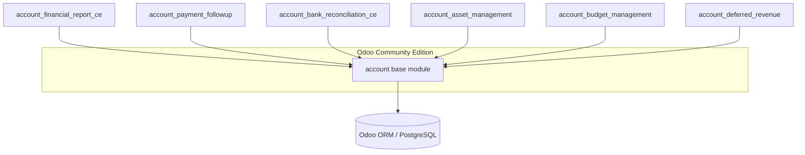
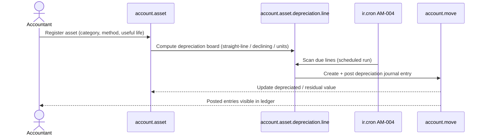
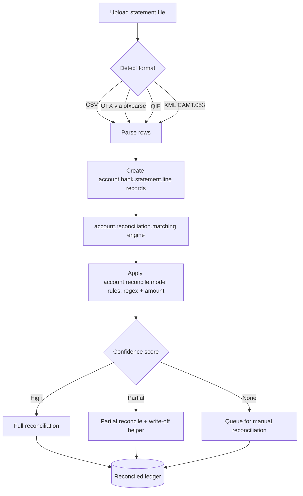
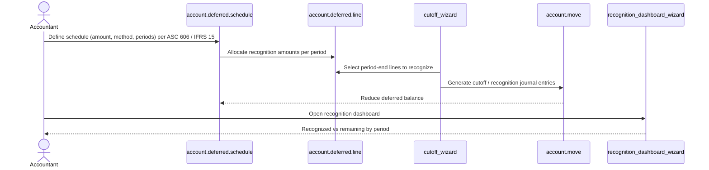
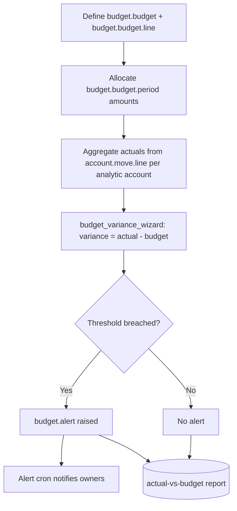
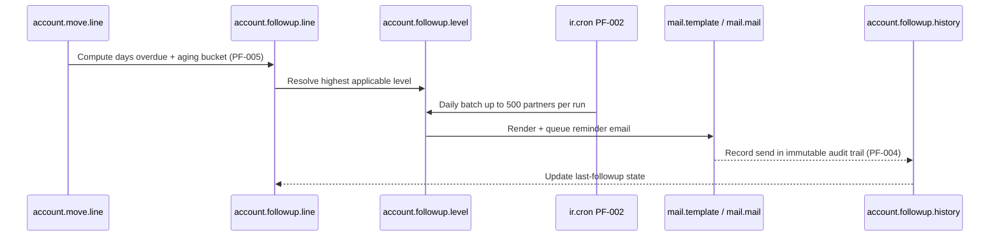
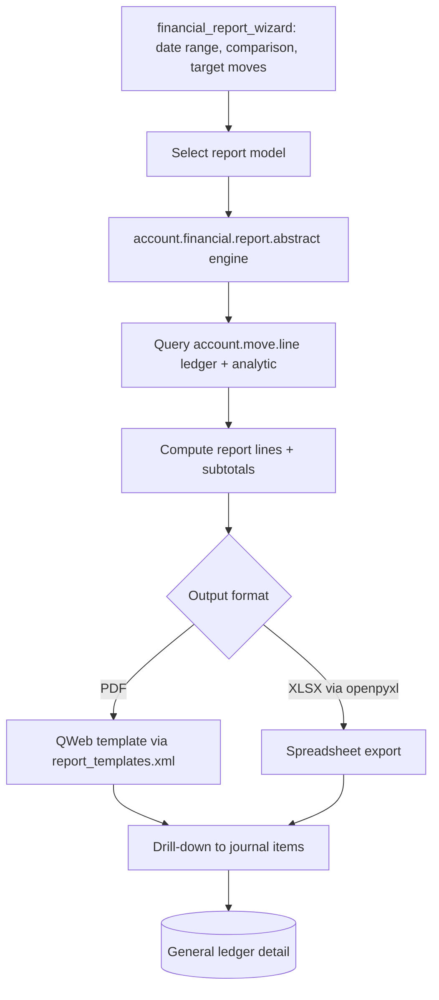
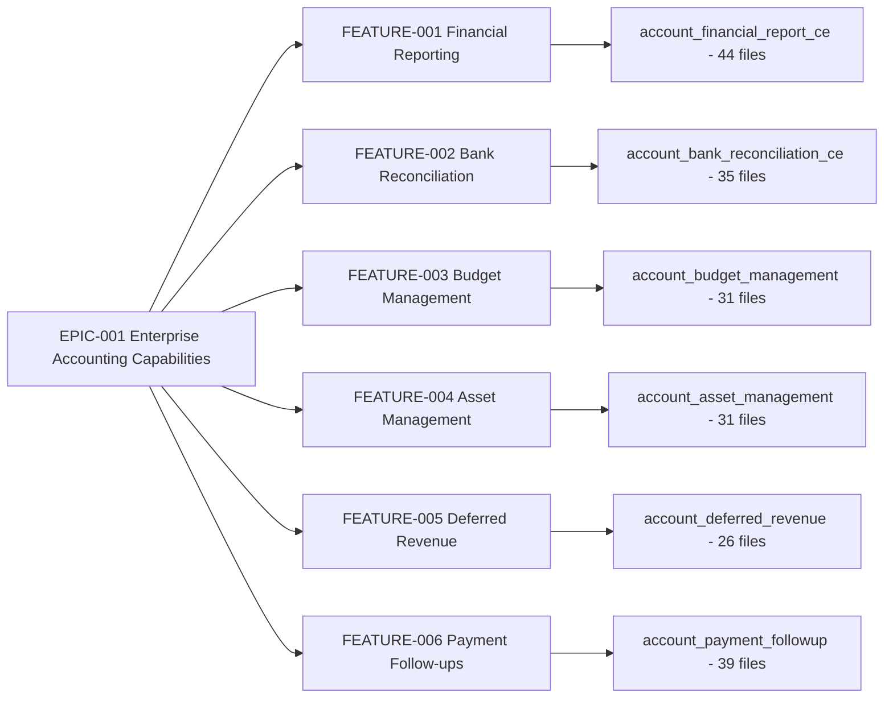

# Technical Specification

> **Document type:** Code-Archaeology Report (Technical Specification, Sections 0–9).
> **Engagement:** Archaeology of all merged Blitzy-Agent changes treated as this-run work, plus an in-depth Segmented PR Review of that same change set.
> **Subject:** An Enterprise Accounting Suite of six net-new Odoo Community-Edition addons.
> **Archaeology window:** `sandbox @ 7bd7718bcd4` (pre-Blitzy baseline) → `origin/pdlc @ 13896915095` (merged-work tip).
> **Headline KPIs:** 278 files · 6 addons · +134,588 insertions · 0 deletions · Segmented PR Review: **`APPROVED`** (PR-READY; recorded in the root `CODE_REVIEW.md`).
>
> *Source: `git diff --name-status 7bd7718bcd4..13896915095` (the archaeology diff).*

## Table of Contents

- **Section 0 — Agent Action Plan** (this run's archaeology/review AAP, subsections 0.1–0.12)
- **Section 1 — Executive Summary of the Archaeology Engagement**
- **Section 2 — Archaeology Facts and Authorship Attribution**
- **Section 3 — System Architecture**
- **Section 4 — Feature Catalog: The Enterprise Accounting Suite**
- **Section 5 — Per-Domain Data-Flow and Sequence Diagrams**
- **Section 6 — Requirements Traceability (EPIC → FEATURE → STORY → Addon → File)**
- **Section 7 — Configuration and Security Surface**
- **Section 8 — Risk, Onboarding, and Documentation-Gap Remediation**
- **Section 9 — Cross-Document Contract and References**

---

# 0. Agent Action Plan

> Section 0 **is** this run's Agent Action Plan (AAP) for the dual *archaeology + Segmented PR Review* engagement. It retains subsection numbering **0.1 through 0.12**. The planned root `CODE_REVIEW.md` and the planned executive deck (`blitzy-deck/executive-summary.html`) will cite this section by number; in particular `§0.10` (Execution Parameters / review gate) and `§0.11` (rules R-1 and R-2) are authored under those exact numbers so that those downstream citations resolve.

## 0.1 Intent Clarification

This Agent Action Plan governs a **documentation and review-artifact** engagement against the Odoo repository [Source: `odoo/release.py:L15`]. It is the interpretation layer between the user's request and the concrete deliverables the Blitzy platform will produce. The request is dual: first, a code-archaeology report that exhaustively documents every merged change introduced by Blitzy Agents; second, an in-depth Segmented PR Review of that same change set. No application source code is created or modified by this plan except the documentation files explicitly enumerated in §0.6.

### 0.1.1 Core Documentation Objective

Based on the provided requirements, the Blitzy platform understands that the documentation objective is to **(1) produce a code-archaeology report that inventories and explains, in full, every change that Blitzy Agents have merged into this repository — treating the entire delta as if it were authored during this run — and (2) execute and record an in-depth Segmented PR Review over that same changed-file set, producing `CODE_REVIEW.md`, to assess and drive remediation of any issues.**

- **Request category:** Create new documentation (primary), with an *Improve documentation coverage* facet (the merged accounting suite needs consolidated, leadership-ready documentation).
- **Documentation types produced:**
  - Technical / Architecture documentation — the archaeology report, delivered as the Technical Specification document of which this Agent Action Plan is Section 0.
  - Review / Compliance artifact — `CODE_REVIEW.md`, the Segmented PR Review record.
  - Executive presentation — a single self-contained reveal.js HTML deck for non-technical leadership (mandated unconditionally by the Executive Presentation rule).

The enumerated requirements, restated with technical precision:

- **R-A — Identify all merged Blitzy changes.** Perform git archaeology to enumerate every change authored by Blitzy Agents (`agent@blitzy.com`). The archaeology baseline is the pre-Blitzy `sandbox` branch at commit `7bd7718bcd4` (a pure Odoo state with zero `agent@blitzy.com` commits); the merged work is `origin/pdlc` at `13896915095`. The authoritative diff is `git diff --name-status sandbox..origin/pdlc`, which yields **278 files, all Added, 134,588 insertions, 0 deletions** — an entirely net-new body of work.
- **R-B — Document the change set as this-run work.** Explain what was built (an Enterprise Accounting Suite of six new Odoo Community-Edition addons), why (to close enterprise-accounting capability gaps in Odoo CE), and how it is structured (models, views, security, wizards, reports, data, tests).
- **R-C — Execute the Segmented PR Review exactly per its rule.** Partition every changed file into exactly one of seven sequential domain phases, resolve each phase to exactly `APPROVED` or `BLOCKED`, and record the outcome in `CODE_REVIEW.md` at the repository root.
- **R-D — Always produce the executive deck.** Deliver a single self-contained reveal.js presentation covering scope, value, architecture, risk, and onboarding for leadership.

Implicit objectives surfaced from the request: a changed-file inventory partitioned by review domain; an EPIC→FEATURE→STORY→addon→file traceability narrative; data-flow and sequence diagrams for the accounting workflows; and an explicit risk and onboarding narrative.

### 0.1.2 Special Instructions and Constraints

The user's request is preserved verbatim (original spelling retained):

> "Perform an archeaology report on all merged changes made to this repository by Blitzy Agents. Treat all of the identified changes as if they were changes that were actively made during this run. Once all changes are identified, perform an in depth PR review using the Segmented PR Review rule definition to assess and remediate issues."

The following rule-mandated directives are binding and are reproduced for downstream agents:

- **Segmented PR Review (rule R-2)** — The review MUST run as a single atomic pass that begins only after code generation has fully completed (no interleaving). A pre-flight gate MUST pass before the first phase: all Agent Action Plan deliverables exist at their specified paths, the project builds with zero errors and zero warnings, all required tests pass, all static-analysis gates pass with zero violations, and no production-path method returns a placeholder stub. `CODE_REVIEW.md` MUST be created at the repository root during pre-flight, committed before the first phase, re-committed after every phase state change and after the final verdict, and present in the final commit; if it already exists, recreate it blank. Every changed file MUST be partitioned into exactly one sequential domain phase from {Infrastructure/DevOps, Security, Backend Architecture, QA/Test Integrity, Business/Domain, Frontend, Other SME}; each phase is owned by one specialist reviewer who reviews only (no code modification); each phase resolves to exactly `APPROVED` or `BLOCKED` with no qualifiers; `BLOCKED` halts the review, records findings with file and line specificity, and requires a full restart from the pre-flight gate. After all phases are `APPROVED`, a final reviewer re-verifies and issues exactly `APPROVED` or `BLOCKED`.
- **Executive Presentation (rule R-1)** — Every deliverable MUST include an executive summary as a single self-contained reveal.js HTML file, always included independent of other documentation, targeting non-technical leadership. Slide constraints: 12–18 slides (target 16); four slide types (`slide-title`, `slide-divider`, content default, `slide-closing`); every slide includes at least one non-text visual; content slides allow a maximum of 4 bullets and 40 words; zero emoji (Lucide SVG icons only); no fenced code blocks inside slides. CDN versions are pinned: reveal.js 5.1.0, Mermaid 11.4.0, Lucide 0.460.0. reveal.js config: `hash: true`, `transition: 'slide'`, `controlsTutorial: false`, `width: 1920`, `height: 1080`.

The Executive Presentation rule provides a required CSS custom-property block. It is preserved exactly:

USER PROVIDED TEMPLATE:

```css
:root {
  --blitzy-primary: #5B39F3;
  --blitzy-primary-dark: #2D1C77;
  --blitzy-primary-navy: #1A105F;
  --blitzy-primary-light: #7A6DEC;
  --blitzy-primary-deep: #4101DB;
  --blitzy-accent-teal: #94FAD5;
  --blitzy-surface-0: #FFFFFF;
  --blitzy-surface-1: #F4EFF6;
  --blitzy-surface-2: #F2F0FE;
  --blitzy-surface-3: #F5F5F5;
  --blitzy-border: #D9D9D9;
  --blitzy-border-soft: rgba(91, 57, 243, 0.18);
  --blitzy-text: #333333;
  --blitzy-text-muted: #999999;
  --blitzy-text-invert: #FFFFFF;
  --ff-body: 'Inter', system-ui, sans-serif;
  --ff-display: 'Space Grotesk', 'Inter', sans-serif;
  --ff-mono: 'Fira Code', 'Courier New', monospace;
  --gradient-hero: linear-gradient(68deg, #7A6DEC 15.56%, #5B39F3 62.74%, #4101DB 84.44%);
  --gradient-divider: linear-gradient(135deg, #2D1C77 0%, #5B39F3 100%);
  --gradient-accent-bar: linear-gradient(90deg, #5B39F3 0%, #94FAD5 100%);
}
```

- **Style and depth preferences:** the report follows the existing addon documentation conventions (per-addon `README.rst` with Overview/Features/Usage, mirrored by the manifest summary/description); Markdown with Mermaid diagrams is the default report format; every factual claim about the existing system carries an inline source citation.

### 0.1.3 Technical Interpretation

These documentation requirements translate to the following technical documentation strategy:

- To **document all merged changes**, we will create the archaeology report in `blitzy/documentation/Technical Specifications.md`, extracting the change set from `git diff sandbox..origin/pdlc` and authorship from `git log --author=agent@blitzy.com`, and narrating each of the six addons with architecture and data-flow diagrams.
- To **execute the Segmented PR Review**, we will create `CODE_REVIEW.md` at the repository root, partitioning the 278 changed files across the seven sequential domain phases and recording per-phase and final `APPROVED`/`BLOCKED` verdicts with file-and-line findings.
- To **brief leadership**, we will create `blitzy-deck/executive-summary.html` as a single self-contained reveal.js deck that summarizes scope, the architecture, the review outcome, risks, and onboarding.
- To **close documentation gaps**, we will create the two missing addon `README.rst` files surfaced during discovery, using the four existing addon READMEs as structural references.

### 0.1.4 Inferred Documentation Needs

- **Based on code analysis:** the two largest addons — `account_financial_report_ce` (44 files) and `account_bank_reconciliation_ce` (35 files) — have public models and wizards but lack a `README.rst`, while the other four addons each ship one; this is a documentation gap the report must flag and remediate.
- **Based on structure:** the suite spans six addons with shared accounting semantics (journal entries, depreciation, reconciliation), requiring a consolidated architecture narrative rather than six isolated descriptions.
- **Based on dependencies:** all addons extend Odoo's `account` module, so the report must document the integration surface between each addon and the base accounting ledger.
- **Based on the user journey:** because the suite is net-new for end users, the report must surface the existing `docs/SETUP.md` and `docs/USER_GUIDE.md` onboarding material and connect it to the per-feature documentation.

## 0.2 Documentation Discovery and Analysis

Repository analysis reveals a large Odoo monorepo whose Blitzy-authored delta is confined to a small, well-bounded set of net-new paths. Discovery established the archaeology baseline, the merged-work tip, the existing documentation footprint, and the code modules requiring documentation.

### 0.2.1 Existing Documentation Infrastructure Assessment

- **Baseline (pre-Blitzy) documentation footprint** on the `sandbox` branch [Source: `odoo/release.py:L15`] is minimal at the project level: `README.md`, `CONTRIBUTING.md`, and `SECURITY.md` at the repository root, plus Odoo's `doc/` directory (Contributor License Agreement material only). There is **no documentation generator** present — no `mkdocs.yml`, no `docusaurus.config.js`, and no Sphinx `conf.py`.
- **Documentation introduced by the Blitzy delta** (visible only on `origin/pdlc`): a new top-level `docs/` directory containing `docs/SETUP.md` and `docs/USER_GUIDE.md` (Blitzy-authored end-user material); four per-addon `README.rst` files; a `tickets/` requirements tree (epic, features, stories, templates); and `blitzy/documentation/` containing a prior `Technical Specifications.md` and `Project Guide.md` [Source: `git diff --name-only 7bd7718bcd4..13896915095`].
- **Documentation framework:** none. The deliverables are intentionally self-contained — Markdown for the report and review record, and a single self-contained HTML file (no build step) for the executive deck.
- **Diagram tooling:** Mermaid is the standard, embedded directly in Markdown report sections and in the executive deck via pinned CDN (Mermaid 11.4.0).
- **API-documentation tooling:** none configured; Odoo addons are self-documenting via `__manifest__.py` summary/description and per-addon `README.rst`.

The repository's static-analysis configuration is documented infrastructure relevant to the review pre-flight gate: `ruff.toml` defines the lint gate [Source: `ruff.toml:L2,L7`] and `setup.cfg` configures flake8 with reStructuredText checks [Source: `setup.cfg:L4,L13,L21`].

### 0.2.2 Repository Code Analysis for Documentation

The code requiring documentation is the six net-new Community-Edition accounting addons under `addons/`. Each follows the standard Odoo module layout (manifest, models, views, security, wizard, report, data, tests, static). The change-set search used `git diff --name-status sandbox..origin/pdlc` for the file inventory and per-directory tallies for composition.

| Addon (directory) | Files | Public surface to document |
|-------------------|-------|----------------------------|
| `addons/account_financial_report_ce` | 44 | Report engines (P&L, balance sheet, cash flow, general ledger, trial balance, aged reports), wizards, QWeb templates |
| `addons/account_payment_followup` | 39 | Follow-up/dunning levels, reminder generation, models and wizards |
| `addons/account_bank_reconciliation_ce` | 35 | Statement import (CSV/OFX/QIF/XML), matching engine, reconciliation models and wizards |
| `addons/account_asset_management` | 31 | `account_asset`, `account_asset_category`, `account_asset_depreciation_line`; disposal & modification wizards; crons |
| `addons/account_budget_management` | 31 | Budget definition, period allocation, actual-vs-budget, variance, alerts |
| `addons/account_deferred_revenue` | 26 | Deferred-revenue schedules, period allocation, cutoff entries, recognition dashboard |

- **Module interfaces:** each addon's `__init__.py` and `__manifest__.py` declare dependencies (all extend Odoo's `account` module) and load order.
- **Configuration options:** addon `data/` directories (11 XML files in total) carry crons, sequences, and configuration parameters; `security/` directories carry access-control declarations.
- **Key directories examined:** `addons/` (six addon roots and their subtrees), `tickets/` (requirements), `docs/`, `test_data/`, and `blitzy/`.

### 0.2.3 Web Search Research Conducted

Research validated documentation best practices for change/archaeology reporting and confirmed tool currency:

- **Code-archaeology method.** Best practice is to survey repository history at a high level and then narrow to a specific set of files for closer examination, using `git log`, `git shortlog`, and `git blame` together with the pickaxe (`git log -S`) to trace where strings were introduced or removed. The plan adopts this top-down approach: a high-level 278-file inventory, then per-addon and per-file detail.
- **Value framing.** Commit-history analysis is recognized as a means of onboarding new team members and of surfacing risk such as bus-factor concentration and change hotspots; the report and deck therefore include an onboarding and risk narrative.
- **Tool currency.** The CDN versions pinned by the Executive Presentation rule (reveal.js 5.1.0, Mermaid 11.4.0, Lucide 0.460.0) are valid, current releases and are corroborated by prior successful deck renders; they are treated as authoritative pins.

## 0.3 Documentation Scope Analysis

The scope analysis maps the merged code to the documentation that must describe it, and identifies the gaps the report must close. The change set is entirely additive — 278 files added, 0 modified, 0 deleted — so every documentation target is net-new description rather than revision of prior text.

### 0.3.1 Code-to-Documentation Mapping

The six addons map to six FEATUREs under a single EPIC, providing a clean documentation spine. Modules requiring documentation:

- **Module: `addons/account_asset_management/` (FEATURE-004)**
  - Public surface: `account.asset`, `account.asset.category`, `account.asset.depreciation.line` models; `asset_disposal` and `asset_modification` wizards; scheduled depreciation crons.
  - Current documentation: `README.rst` exists [Source: `addons/account_asset_management/README.rst`]; manifest documents straight-line, declining-balance, and units-of-production depreciation with GAAP/IFRS alignment (IAS 16, IAS 36, ASC 360) [Source: `addons/account_asset_management/__manifest__.py`].
  - Documentation needed: architecture narrative, depreciation-posting sequence diagram, stories AM-001..AM-006 traceability.
- **Module: `addons/account_bank_reconciliation_ce/` (FEATURE-002)**
  - Public surface: statement-import models (CSV/OFX/QIF/XML), the matching engine, manual/partial reconciliation models and wizards.
  - Current documentation: **missing `README.rst`**.
  - Documentation needed: README, matching-engine data-flow diagram, stories BR-001..BR-005 traceability.
- **Module: `addons/account_budget_management/` (FEATURE-003)**
  - Public surface: budget definition, period allocation, actual-vs-budget computation, variance analysis, alerts.
  - Current documentation: `README.rst` exists [Source: `addons/account_budget_management/README.rst`].
  - Documentation needed: variance-computation flow, stories BM-001..BM-005 traceability.
- **Module: `addons/account_deferred_revenue/` (FEATURE-005)**
  - Public surface: schedule definition, automatic period allocation, cutoff-entry generation, recognition dashboard.
  - Current documentation: `README.rst` exists [Source: `addons/account_deferred_revenue/README.rst`].
  - Documentation needed: recognition-schedule sequence diagram, stories DR-001..DR-004 traceability.
- **Module: `addons/account_financial_report_ce/` (FEATURE-001)**
  - Public surface: report engines for balance sheet, P&L, cash flow, general ledger, trial balance, and aged reports, with export and drill-down.
  - Current documentation: **missing `README.rst`**.
  - Documentation needed: README, report-generation data-flow, stories FR-001..FR-007 traceability.
- **Module: `addons/account_payment_followup/` (FEATURE-006)**
  - Public surface: follow-up level configuration, dunning reminder generation, models and wizards.
  - Current documentation: `README.rst` exists [Source: `addons/account_payment_followup/README.rst`].
  - Documentation needed: dunning-workflow diagram, story PF-001..PF-005 traceability.

Configuration and security to document: each addon ships `security/ir.model.access.csv` (model ACLs) and `security/*_security.xml` (groups and record rules) — 12 files total; `data/` XML (crons, sequences, parameters) — 11 files.

Review-scope mapping: the same 278 files are partitioned for the Segmented PR Review into exactly one of the seven domain phases each, as defined in §0.10.

### 0.3.2 Documentation Gap Analysis

Given the requirements and repository analysis, the documentation gaps are:

- **Missing per-addon READMEs (highest priority).** `account_bank_reconciliation_ce` and `account_financial_report_ce` — the two largest addons (35 and 44 files) — have no `README.rst`, whereas the other four addons each provide one. These two READMEs are in scope for creation (§0.6).
- **No consolidated archaeology record.** There is no single document that inventories the full 278-file delta, attributes authorship, and explains the suite as a coherent body of work; the Technical Specification archaeology report fills this gap.
- **No leadership-facing summary.** No executive presentation exists for this run; the reveal.js deck fills this gap (rule R-1).
- **No review/compliance record at the repository root.** `CODE_REVIEW.md` does not yet exist at the root for this run; it is created and maintained per rule R-2.
- **No frontend JavaScript to document.** The delta contains zero `.js` files; the frontend surface is limited to XML views, QWeb report templates, and seven SCSS stylesheets, so no client-side component documentation is required [Source: `git diff --name-only 7bd7718bcd4..13896915095`].


## 0.4 Design System Compliance

The Executive Presentation rule specifies a proprietary design system — the **Blitzy reveal.js theme** — that governs the executive-summary deck deliverable. This sub-section catalogs that system and the compliance rules for the deck. No Figma attachments were provided (see §0.12), so the design-to-Figma token mapping is not applicable; the system's own CSS custom properties are the authoritative tokens.

### 0.4.1 System Identification

- **Library:** Blitzy reveal.js theme (proprietary, in-repo), composed on top of reveal.js.
- **Version / status:** the runtime is reveal.js 5.1.0 loaded via CDN; the brand layer is the deck's canonical theme. Status: the canonical theme is a **planned REFERENCE** artifact — authored in the later deck checkpoint and not yet present at this milestone — that the deck will embed inline (self-contained, no local file dependency).
- **Package / source:** CDN-pinned reveal.js 5.1.0, Mermaid 11.4.0, and Lucide 0.460.0, plus Google Fonts (Inter, Space Grotesk, Fira Code).
- **Source (planned reference):** the canonical theme `blitzy-deck/references/blitzy-reveal-theme.css` — a planned deck artifact to be authored in the later deck checkpoint (not present at this milestone) — will define the `:root` custom properties and the slide/component classes the deck must use.

### 0.4.2 Component Mapping

The deck's UI elements map to theme classes and primitives by import/role name. No raw, unstyled structural elements are permitted where a theme class exists.

| UI Element | Theme Class / Primitive | Role | Notes |
|------------|-------------------------|------|-------|
| Title slide | `section.slide-title` | Hero opener | `--gradient-hero` background, white text, `.eyebrow` in Fira Code teal, `.hero-icon` |
| Section divider | `section.slide-divider` | Topic separator | `--gradient-divider`, large centered heading, thematic Lucide icon |
| Closing slide | `section.slide-closing` | Takeaway | `--blitzy-primary-navy` background, ≤3 bullets, `.brand-lockup`, `.accent-bar` |
| Content slide | `section` (default) | Body | ≤4 bullets / ≤40 words; ≥1 non-text visual |
| KPI tiles | `.kpi-grid` > `.kpi-card` | Metrics | `.kpi-icon`, `.kpi-value`, `.kpi-label` — 278 files / 6 addons / 134,588 insertions / review verdict |
| Icon row | `.icon-row` of `<i data-lucide="…">` | Iconography | Lucide 0.460.0; zero emoji |
| Architecture / data-flow / pipeline | `<pre class="mermaid">` | Diagrams | Mermaid 11.4.0; `startOnLoad:false`; `mermaid.run()` on `ready` + every `slidechanged` |
| Accent bar | `.accent-bar` | Brand accent | `--gradient-accent-bar` (`#5B39F3`→`#94FAD5`) |
| Reveal shell | `.reveal` / `.slides` / `.slide-number` / `.progress` / `.controls` | Framework | reveal.js 5.1.0 config: `hash:true`, `transition:'slide'`, `controlsTutorial:false`, `width:1920`, `height:1080` |

### 0.4.3 Token Mapping

Because no Figma source is provided, the design values are the system tokens themselves. The deck's inline CSS must resolve every property to one of these cataloged `:root` custom properties (from the canonical theme):

| Category | Token | Value | Use |
|----------|-------|-------|-----|
| Color | `--blitzy-primary` | `#5B39F3` | Primary brand |
| Color | `--blitzy-primary-dark` | `#2D1C77` | Divider base |
| Color | `--blitzy-primary-navy` | `#1A105F` | Closing background |
| Color | `--blitzy-primary-deep` / `--blitzy-primary-light` | `#4101DB` / `#7A6DEC` | Gradient stops |
| Color | `--blitzy-accent-teal` | `#94FAD5` | Accent / eyebrow |
| Surface | `--blitzy-surface-0/1/2/3` | `#FFFFFF` / `#F5F5F5` / `#F4EFF6` / `#D9D9D9` | Backgrounds (canonical theme values) |
| Border | `--blitzy-border` | `#D9D9D9` | Table/card borders |
| Text | `--blitzy-text` / `--blitzy-text-muted` / `--blitzy-text-invert` | `#333333` / `#999999` / `#FFFFFF` | Typography colors |
| Type | `--ff-body` / `--ff-display` / `--ff-mono` | Inter / Space Grotesk / Fira Code | Font families |
| Gradient | `--gradient-hero` | `linear-gradient(68deg,#7A6DEC 15.56%,#5B39F3 62.74%,#4101DB 84.44%)` | Title hero |
| Mermaid theme | `primaryColor` / `primaryTextColor` / `primaryBorderColor` / `lineColor` / `secondaryColor` | `#F2F0FE` / `#333333` / `#5B39F3` / `#999999` / `#F4EFF6` | Diagram styling |

### 0.4.4 Gaps Inventory

- **No dedicated data-table component.** The theme provides no table primitive; the change-inventory slide uses a styled HTML `<table>` whose every value resolves to theme tokens (`--blitzy-border`, `--blitzy-surface-*`). This is acceptable graceful degradation (generic container styled with system tokens).
- **Surface-token divergence between the rule snippet and the canonical theme.** The rule's inline-CSS template lists `--blitzy-surface-1:#F4EFF6`, `--blitzy-surface-2:#F2F0FE`, `--blitzy-surface-3:#F5F5F5`, whereas the planned canonical theme is specified to resolve `--blitzy-surface-1:#F5F5F5`, `--blitzy-surface-2:#F4EFF6`, `--blitzy-surface-3:#D9D9D9`. **Resolution:** the canonical theme is authoritative for surface values; the deck must reconcile to it.

### 0.4.5 Compliance Summary

The Blitzy reveal.js theme fully covers the deck's needs: all slide types (`slide-title`, `slide-divider`, `slide-closing`, default content), KPI components, accent bars, icon rows, and Mermaid containers map to cataloged classes, and every color/typography value resolves to a `:root` token. Two items require attention — one styling gap (no native table component, resolved with a token-styled `<table>`) and one token divergence (surface values, resolved in favor of the canonical theme). No new runtime dependency is introduced: the deck is a single self-contained HTML file using CDN-pinned reveal.js 5.1.0, Mermaid 11.4.0, and Lucide 0.460.0 with no build step.

## 0.5 Documentation Implementation Design

The implementation design specifies the deliverable layout, how content is extracted from the repository, and the diagrams that accompany it. The layout is intentionally flat and self-contained — there is no documentation-site generator — mirroring the verified prior-run deliverable structure.

### 0.5.1 Documentation Structure Planning

The deliverable hierarchy is:

```
<repo root>/
├── CODE_REVIEW.md                              (CREATE) Segmented PR Review record
├── blitzy/
│   └── documentation/
│       └── Technical Specifications.md         (CREATE/UPDATE) the archaeology report (this AAP is section 0)
├── blitzy-deck/
│   ├── executive-summary.html                  (CREATE) self-contained reveal.js deck
│   └── references/
│       └── blitzy-reveal-theme.css             (REFERENCE) canonical brand theme
└── addons/
    ├── account_bank_reconciliation_ce/README.rst   (CREATE) close documentation gap
    └── account_financial_report_ce/README.rst      (CREATE) close documentation gap
```

The archaeology report itself is organized as the standard Technical Specification (Sections 0–9). The archaeology narrative threads through Section 0 (this plan), the feature catalog, and the architecture sections; `CODE_REVIEW.md` and the deck are companion artifacts that draw from it.

### 0.5.2 Content Generation Strategy

- **Information extraction.** The change inventory is extracted from `git diff --name-status sandbox..origin/pdlc`; authorship and chronology from `git log --author=agent@blitzy.com`; per-addon capabilities from each `__manifest__.py` and `README.rst`; API surface from `addons/*/models/*.py` and `addons/*/wizard/*.py`; requirements traceability from the `tickets/` tree (`EPIC-001` → `FEATURE-001..006` → 32 stories); and visual evidence from `blitzy/screenshots/*.png` (20 images).
- **`CODE_REVIEW.md` generation.** The 278 files are partitioned across the seven sequential domain phases (§0.10); each phase records its file scope, reviewer, findings (with file-and-line IDs), and an `APPROVED`/`BLOCKED` status; a final reviewer issues the overall verdict. The file carries YAML front-matter with `overall_status` and per-phase statuses.
- **Deck generation.** The deck is authored as a single HTML file with the brand theme embedded inline; Mermaid and Lucide are initialized after the reveal.js `ready` event and re-run on every `slidechanged`.
- **Documentation standards.** Markdown headers (`#`/`##`/`###`); Mermaid in fenced mermaid blocks; code examples in fenced language blocks; inline source citations of the form `Source: <path>:<locator>`; tables for parameters and file mappings; consistent accounting terminology.

### 0.5.3 Diagram and Visual Strategy

Mermaid diagrams are the default visual. Planned diagrams:

- **System architecture (flowchart):** the six addons layered on the Odoo `account` module and ORM/PostgreSQL.
- **Per-domain data-flow / sequence diagrams:** depreciation posting (asset management), statement-import-and-match (bank reconciliation), recognition-schedule generation (deferred revenue), actual-vs-budget variance (budget management), dunning escalation (payment follow-up), and report generation/drill-down (financial reporting).
- **Traceability diagram:** EPIC-001 → six FEATUREs → addon mapping.
- **Review pipeline (in `CODE_REVIEW.md`):** Archaeology Report → Phase 1 → … → Phase 7 → all `APPROVED` → PR Ready, with any `BLOCKED` routing to a remediation queue.

A representative architecture sketch follows as pseudocode; the single canonical, rendered Mermaid system-architecture diagram lives in §3.1 (this sketch is intentionally non-rendered to avoid duplicating that diagram):

```text
Odoo Community Edition
  account                          (base accounting module)
    ^  account_financial_report_ce  --> account
    ^  account_payment_followup      --> account
    ^  account_bank_reconciliation_ce --> account
    ^  account_asset_management       --> account
    ^  account_budget_management      --> account
    ^  account_deferred_revenue       --> account
  account                          --> Odoo ORM / PostgreSQL
```

In the executive deck, the same relationships are rendered via `<pre class="mermaid">` using the brand Mermaid theme variables, and KPI metrics are rendered as `.kpi-card` tiles rather than prose.


## 0.6 Documentation File Transformation Mapping

This sub-section enumerates every documentation file the run touches, with the target file listed first. Transformation modes: **CREATE** (new file), **UPDATE** (modify existing), **DELETE** (remove obsolete), **REFERENCE** (use as a style/structure or requirements exemplar; not modified). Nothing is left as "pending" or "to be discovered."

### 0.6.1 File-by-File Documentation Plan

| Target Documentation File | Transformation | Source Code / Docs | Content / Changes |
|---------------------------|----------------|--------------------|-------------------|
| `blitzy/documentation/Technical Specifications.md` | CREATE/UPDATE | `git diff sandbox..origin/pdlc` (278 files) | The code-archaeology report: this Agent Action Plan (§0), feature catalog, architecture and per-domain data-flow diagrams, EPIC→FEATURE→STORY→addon traceability, authorship attribution |
| `CODE_REVIEW.md` (repository root) | CREATE | 278 changed files, partitioned | Segmented PR Review record: YAML front-matter, 7 sequential domain phases, review-pipeline Mermaid diagram, findings with file-and-line IDs, final verdict (rule R-2) |
| `blitzy-deck/executive-summary.html` | CREATE | Technical Spec + `CODE_REVIEW.md` | Single self-contained reveal.js 5.1.0 deck, 16 slides, Blitzy brand, Mermaid 11.4.0 + Lucide 0.460.0, KPI cards (rule R-1) |
| `addons/account_bank_reconciliation_ce/README.rst` | CREATE | manifest + `models/` + `wizard/` | Addon README (Overview / Features / Configuration / Usage) — remediates the missing-README gap; follows the four existing addon READMEs |
| `addons/account_financial_report_ce/README.rst` | CREATE | manifest + `models/` + `report/` | Addon README (Overview / Features / Reports / Usage) — remediates the missing-README gap |
| `blitzy-deck/references/blitzy-reveal-theme.css` | REFERENCE (planned) | (planned canonical theme) | Brand tokens + slide/component classes the deck's inline CSS will mirror — planned deck artifact authored in the later deck checkpoint |
| `addons/account_asset_management/README.rst` | REFERENCE | (existing) | RST style/structure exemplar for the two new READMEs |
| `addons/account_budget_management/README.rst` | REFERENCE | (existing) | RST style/structure exemplar |
| `addons/account_deferred_revenue/README.rst` | REFERENCE | (existing) | RST style/structure exemplar |
| `addons/account_payment_followup/README.rst` | REFERENCE | (existing) | RST style/structure exemplar |
| `docs/USER_GUIDE.md` | REFERENCE | (existing on pdlc) | Existing end-user guide inventoried by the report |
| `docs/SETUP.md` | REFERENCE | (existing on pdlc) | Existing setup guide inventoried by the report |
| `tickets/EPIC-001-enterprise-accounting.md` + `tickets/features/*` + `tickets/stories/*` | REFERENCE | (existing on pdlc) | Requirements source for the traceability spine |
| `blitzy/documentation/Project Guide.md` | REFERENCE | (existing on pdlc) | Project-guide precedent (not a mandated deliverable of this task) |

There are **no DELETE operations**: the change set is entirely additive and no documentation is obsoleted.

### 0.6.2 New Documentation Files Detail

```
File: CODE_REVIEW.md (repository root)
Type: Segmented PR Review record (rule R-2)
Source: the 278 changed files (git diff sandbox..origin/pdlc), partitioned
Sections:
    - YAML front-matter (overall_status + 7 per-phase statuses; APPROVED/BLOCKED only)
    - Executive Summary (verdict, headline findings)
    - Review Pipeline (Mermaid)
    - Phase 1 Infrastructure/DevOps … Phase 7 Other SME (file scope, reviewer, findings, status)
    - Final reviewer re-verification verdict
Key Citations: addons/**, ruff.toml, setup.cfg
```

```
File: blitzy-deck/executive-summary.html
Type: Executive presentation (rule R-1)
Source: Technical Specifications.md + CODE_REVIEW.md
Sections (16 slides):
    - Title; KPI summary; Architecture (Mermaid); Archaeology divider + change inventory
    - Six accounting-domain content slides with data-flow diagrams
    - Quality & Risk divider; Segmented PR Review pipeline; Risks/Mitigations + Onboarding; Closing
Diagrams: architecture, per-domain data-flow, review pipeline (all Mermaid)
Key Citations: blitzy/documentation/Technical Specifications.md, CODE_REVIEW.md
```

```
File: addons/account_financial_report_ce/README.rst  (and account_bank_reconciliation_ce/README.rst)
Type: Addon README (reStructuredText)
Source: __manifest__.py, models/, report/ (or wizard/)
Sections: Overview, Features, Configuration, Usage, Technical notes
Key Citations: the addon manifest summary/description and model definitions
```

### 0.6.3 Documentation Files to Update Detail

- `blitzy/documentation/Technical Specifications.md` — authored/updated to contain the full archaeology report. New content: this Agent Action Plan (§0), the addon feature catalog, architecture and per-domain data-flow diagrams, and the requirements traceability matrix. Source citations reference `addons/**`, `tickets/**`, and `git diff sandbox..origin/pdlc`.

No other existing documentation file is modified; `docs/USER_GUIDE.md`, `docs/SETUP.md`, the four existing addon READMEs, and the tickets tree are referenced, not edited.

### 0.6.4 Documentation Configuration Updates

No documentation-generator configuration changes are required or introduced. There is no `mkdocs.yml`, `docusaurus.config.js`, `.readthedocs.yml`, or Sphinx `conf.py` in the repository, and none is added — the report and review record are plain Markdown and the deck is a single self-contained HTML file with no build step. No `package.json` documentation-build script changes are required.

### 0.6.5 Cross-Documentation Dependencies

- `CODE_REVIEW.md` cites this Agent Action Plan (specifically §0.10 Execution Parameters for the review gate and PR-ready criteria, and §0.11 for the numbered rules R-1/R-2).
- The executive deck summarizes both the Technical Specification report and `CODE_REVIEW.md` (verdict and KPIs).
- The archaeology report's traceability links `EPIC-001` → `FEATURE-001..006` → stories → addon → file.
- No internal-link rewriting is required because all deliverables are net-new; there are no stale links to transform.

## 0.7 Dependency Inventory

This documentation exercise introduces **no new application dependencies**. The deck deliverable uses only CDN-pinned, browser-loaded libraries (no install, no build). The toolchain versions below are split into the rendering dependencies for the deck and the existing repository toolchain that the Segmented PR Review pre-flight gate references.

#### Documentation Dependencies

| Registry | Package / Tool | Version | Purpose |
|----------|----------------|---------|---------|
| CDN (npm) | reveal.js | 5.1.0 | Executive-deck presentation framework (rule R-1 pin) |
| CDN (npm) | mermaid | 11.4.0 | Diagram rendering in the deck and report (rule R-1 pin) |
| CDN (npm) | lucide | 0.460.0 | SVG icons in the deck — zero emoji (rule R-1 pin) |
| CDN | Google Fonts | n/a | Inter, Space Grotesk, Fira Code typefaces (rule R-1) |
| npm | @mermaid-js/mermaid-cli | 11.x | Optional local pre-render/validation of Mermaid diagrams (npx 11.1.0 available) |

Existing repository toolchain referenced by the review gate (verified from manifests, not introduced by this run):

| Source | Component | Version | Relevance |
|--------|-----------|---------|-----------|
| `odoo/release.py:L15` | Odoo | 19.0.0 (Final) | Target platform of the documented addons |
| `requirements.txt` / `ruff.toml:L7` | Python | floor 3.10, highest documented 3.13 | Runtime for build/test in the pre-flight gate |
| `ruff.toml:L2` | ruff | 0.11.4+ | Static-analysis gate (zero violations) in pre-flight |
| `setup.cfg:[flake8]` | flake8 (+ RST checks) | as configured | Secondary lint/RST gate |
| toolchain | git | 2.43.0 | Archaeology diff and per-phase commits |

All versions above are exact values taken from the Executive Presentation rule pins or from the repository's own manifests; no placeholder ("latest", "1.0.0") versions are used.

#### Documentation Reference Updates

Not applicable. Because every deliverable is net-new and the change set is purely additive, there are no existing documentation links to transform and no link-rewrite rules to apply. Cross-document references (deck → report and `CODE_REVIEW.md`; `CODE_REVIEW.md` → AAP §0.10/§0.11) are authored fresh as described in §0.6.5.


## 0.8 Coverage and Quality Targets

Coverage and quality are defined against the dual objective: complete archaeology coverage of the 278-file delta, and a fully partitioned, verdict-bearing Segmented PR Review.

#### Documentation Coverage Metrics

- **Archaeology completeness — target 100%.** All 278 net-new files are inventoried in the report: 206 addon files, 43 tickets, 22 `blitzy/` artifacts, 5 `test_data/` files, and 2 `docs/` files. No file is omitted.
- **Module coverage — 6 of 6 addons.** Every addon receives an architecture narrative, a documented public surface (models, wizards, reports), and at least one data-flow or sequence diagram.
- **Traceability coverage — 100%.** `EPIC-001` → all 6 FEATUREs → all 32 stories → addon → file is mapped.
- **Review-partition completeness — 100%.** Every one of the 278 changed files is assigned to exactly one of the seven sequential domain phases in `CODE_REVIEW.md` (no file unassigned; none double-counted).
- **Documentation-gap closure — 2 of 2.** Both missing addon READMEs (`account_bank_reconciliation_ce`, `account_financial_report_ce`) are created.

#### Documentation Quality Criteria

- **Completeness.** Each addon section documents purpose, public models/methods, configuration, and integration with the `account` base module; each review phase documents its file scope, findings, and disposition.
- **Accuracy / traceability.** Every claim about the existing system carries an inline citation `[<path>:<locator>]`; file counts match `git diff sandbox..origin/pdlc`; tool versions match the repository manifests (Odoo 19.0.0, Python floor 3.10 / highest 3.13, ruff 0.11.4+).
- **`CODE_REVIEW.md` verdict discipline (rule R-2, non-negotiable).** Every phase status and the final verdict are exactly `APPROVED` or `BLOCKED` with no qualifiers; findings carry file-and-line specificity and IDs; the file exists at the repository root, is committed before the first phase, re-committed after every phase state change and the final verdict, and present in the final commit; pre-flight results are recorded before any phase leaves its initial state; review timestamps fall after the last code-generation commit.
- **Deck quality (rule R-1).** 12–18 `<section>` elements (target 16); every section contains at least one non-text visual; zero emoji (Lucide only); content slides limited to 4 bullets / 40 words; CDN pins exact; reveal config `hash:true` / `transition:'slide'` / `controlsTutorial:false` / `width:1920` / `height:1080`; the file opens in a browser with all Mermaid diagrams and Lucide icons rendering.
- **Clarity.** Technical accuracy in accessible language, progressive disclosure (overview before detail), and consistent accounting terminology (e.g., depreciation, reconciliation, deferred revenue, variance, dunning).

#### Example and Diagram Requirements

- **Diagrams (Mermaid, default):** one system-architecture diagram; one data-flow or sequence diagram per accounting domain (six total); one traceability diagram; and the review-pipeline diagram in `CODE_REVIEW.md`.
- **Worked references per addon:** at least one usage example or workflow walkthrough, drawn from the addon's models/wizards and corroborated by `test_data/` samples where applicable (e.g., the CSV/OFX/QIF/XML bank statements for reconciliation).
- **Visual evidence:** the 20 screenshots under `blitzy/screenshots/` are referenced as rendered evidence of the suite and the deck.
- **Diagram validation:** Mermaid syntax validated (optionally via `@mermaid-js/mermaid-cli`) so every diagram renders in both the Markdown report and the deck.

## 0.9 Scope Boundaries

Scope is bounded to documentation and review artifacts. The Segmented PR Review is review-only; any code remediation triggered by a `BLOCKED` finding is performed by the code-generation loop (per rule R-2), not by this documentation plan — the sole exception being documentation files (the two addon READMEs), which are in scope.

### 0.9.1 Exhaustively In Scope

- **Archaeology report (CREATE/UPDATE):**
  - `blitzy/documentation/Technical Specifications.md` — the full code-archaeology report (this AAP is Section 0).
- **Review record (CREATE):**
  - `CODE_REVIEW.md` at the repository root — the Segmented PR Review record covering all 278 changed files across the seven domain phases.
- **Executive presentation (CREATE):**
  - `blitzy-deck/executive-summary.html` — the single self-contained reveal.js deck.
- **Documentation-gap remediation (CREATE):**
  - `addons/account_bank_reconciliation_ce/README.rst`
  - `addons/account_financial_report_ce/README.rst`
- **Design-system reference (REFERENCE):**
  - `blitzy-deck/references/blitzy-reveal-theme.css`
- **Archaeology subject matter to be documented (all 278 net-new files):**
  - `addons/**` for the six accounting addons (models, views, security, wizard, report, data, static, tests, demo, manifests)
  - `tickets/**` (epic, features, stories, templates)
  - `docs/**`, `test_data/**`, and `blitzy/**` artifacts

### 0.9.2 Explicitly Out of Scope

- **Application source-code modifications.** No changes to the addons' Python models, XML views, security files, wizards, reports, data, or tests. The review is review-only; `BLOCKED`-finding code remediation is executed by the code-generation loop, not this plan (documentation `README.rst` files excepted).
- **The Odoo base platform.** No changes to upstream Odoo modules or to the base `account` module being extended.
- **Odoo Enterprise-Edition features.** The suite targets Community Edition; EE-only modules are out of scope.
- **The unrelated `config-*` work item.** The `config-a` … `config-j` branches implement a separate Backstage/`catalog-info.yaml` + mkdocs TechDocs developer-portal task and **delete** these accounting addons relative to `origin/pdlc`; that work is a different work item and is excluded from this archaeology and review.
- **Documentation-site generators.** No `mkdocs.yml`/Docusaurus/Sphinx setup is introduced.
- **Deck content beyond leadership scope.** The executive deck stays at the business-value/architecture/risk/onboarding level and does not reproduce code.
- **Any item explicitly excluded by user instruction.**


## 0.10 Execution Parameters

These parameters govern how the documentation is produced, validated, and reviewed. The numbered review-gate criteria are authoritative and are the items that `CODE_REVIEW.md` cites back to this section.

#### Documentation-Specific Commands

- **Build command:** none — the report and review record are plain Markdown; the deck is a single self-contained HTML file with no build step.
- **Preview command:** open `blitzy-deck/executive-summary.html` directly in a browser; render Markdown via any standard viewer.
- **Diagram generation:** Mermaid renders client-side at view time; optional local validation via `npx @mermaid-js/mermaid-cli` (npx 11.1.0 available).
- **Deployment command:** not applicable — deliverables are committed files, not a hosted site.
- **Default format:** Markdown with embedded Mermaid for the report and review record; self-contained HTML (reveal.js) for the deck.
- **Citation requirement:** every section referencing the existing system cites its source as `[<path>:<locator>]`.
- **Style guide:** follow the repository's existing addon documentation conventions (per-addon `README.rst` with Overview/Features/Usage mirrored by the manifest); accounting terminology consistent with Odoo's `account` module.
- **Documentation validation:** Markdown link/heading sanity checks; Mermaid render validation; confirm the deck contains 12–18 `<section>` elements each with a non-text visual.

#### Review Gate and PR-Ready Criteria (Segmented PR Review, rule R-2)

The Segmented PR Review runs as a single atomic pass after code generation completes. The gate criteria are:

- **0.10-1 — Deliverables present.** All Agent Action Plan deliverables exist at their specified paths: `blitzy/documentation/Technical Specifications.md`, `CODE_REVIEW.md` (repo root), `blitzy-deck/executive-summary.html`, and the two remediation READMEs.
- **0.10-2 — Build clean.** The project builds with zero errors and zero warnings.
- **0.10-3 — Tests pass.** All required tests pass (Odoo test framework; see §0.10-9).
- **0.10-4 — Static analysis clean.** All static-analysis gates pass with zero violations (`ruff` 0.11.4+ per `ruff.toml`; flake8/RST per `setup.cfg`).
- **0.10-5 — No placeholder stubs.** No production-path method returns a placeholder stub.
- **0.10-6 — Review artifact committed.** `CODE_REVIEW.md` is created during pre-flight, committed before the first phase, re-committed after every phase state change and the final verdict, and present in the final commit; if it already exists, it is recreated blank.
- **0.10-7 — Domain partition.** Every changed file is partitioned into exactly one of seven sequential domain phases: (1) Infrastructure/DevOps, (2) Security, (3) Backend Architecture, (4) QA/Test Integrity, (5) Business/Domain, (6) Frontend, (7) Other SME.
- **0.10-8 — Verdict discipline.** Each phase and the final verdict resolve to exactly `APPROVED` or `BLOCKED` with no qualifiers; a `BLOCKED` phase halts the review, records file-and-line findings, and forces a full restart from the pre-flight gate; reviewers are review-only.
- **0.10-9 — Test execution model.** Addon tests use the Odoo framework (`TransactionCase`/`HttpCase`) under `addons/<addon>/tests/`, executed via `odoo-bin --test-enable` (not pytest).
- **0.10-10 — PR-ready definition.** The PR is ready only when all seven phases are `APPROVED` and the final reviewer issues an `APPROVED` verdict against the delivered state.

## 0.11 Rules for Documentation

Two user-specified rules are binding for this run. Both mandate deliverable files that are unconditionally in scope. These are the numbered rules referenced elsewhere in the report and in `CODE_REVIEW.md`.

#### R-1 — Executive Presentation

- Every deliverable MUST include an executive summary as a single self-contained reveal.js HTML file, always included independent of any other documentation; the audience is non-technical leadership.
- The presentation MUST cover: what was done (scope/deliverables), why (business value), what changed architecturally (component/data-flow diagrams), what risks exist and their mitigations, and how the team onboards and continues development.
- Slide constraints: 12–18 slides (target 16); four slide types (`slide-title`, `slide-divider`, content default, `slide-closing`); every slide includes at least one non-text visual (Mermaid diagram, KPI card, styled table, or Lucide SVG icon) — no text-only slides; content slides cap at 4 bullets and 40 words; zero emoji (Lucide SVG icons via `<i data-lucide="…">` only); no fenced code blocks inside slides.
- Visual identity: the Blitzy brand palette, Inter / Space Grotesk / Fira Code typography (Google Fonts), the hero/divider/accent gradients, and the inline `:root` CSS custom properties preserved verbatim in §0.1.2.
- Mermaid: embed as `<pre class="mermaid">`, initialize with `startOnLoad:false`, and call `mermaid.run()` after the reveal.js `ready` event and on every `slidechanged`; theme variables `primaryColor:'#F2F0FE'`, `primaryTextColor:'#333333'`, `primaryBorderColor:'#5B39F3'`, `lineColor:'#999999'`, `secondaryColor:'#F4EFF6'`.
- Technical delivery: a single self-contained HTML file, no build steps, no local file dependencies; CDN versions pinned to reveal.js 5.1.0, Mermaid 11.4.0, Lucide 0.460.0; reveal.js config `hash:true`, `transition:'slide'`, `controlsTutorial:false`, `width:1920`, `height:1080`; `lucide.createIcons()` called after `ready` and on every `slidechanged`.
- The canonical theme is specified to live at `blitzy-deck/references/blitzy-reveal-theme.css` (a planned deck artifact created in the later deck checkpoint); where the rule's inline snippet and the canonical file diverge on surface tokens, the canonical file is authoritative (§0.4.4).
- **Verification:** the HTML opens in a browser, renders all Mermaid diagrams and Lucide icons, contains 12–18 `<section>` elements, and every `<section>` contains at least one non-text visual.

#### R-2 — Segmented PR Review

- For any Blitzy work item producing a pull request against an Agent Action Plan, a multi-phase review MUST execute as a single atomic pass each time code generation reaches a passing state, with no incremental review and no credit carried from prior passes; it runs as an isolated process beginning only after code generation has fully completed (no overlap or interleaving).
- The review MUST begin with a **pre-flight gate** (criteria enumerated in §0.10): all deliverables present, zero-error/zero-warning build, all tests pass, zero static-analysis violations, and no production-path placeholder stubs; any failure returns the work item to code generation without entering the first phase.
- `CODE_REVIEW.md` MUST be created at the repository root during the pre-flight gate, committed before the first phase, re-committed after every phase state change and after the final verdict, and present in the final commit; if it already exists, it is recreated blank.
- The file MUST partition every changed file into exactly one sequential domain phase from {Infrastructure/DevOps, Security, Backend Architecture, QA/Test Integrity, Business/Domain, Frontend, Other SME}; each phase is owned by exactly one specialist reviewer who reviews only (no code modification, fixes, or test re-runs).
- Each phase MUST resolve to exactly `APPROVED` or `BLOCKED` (no qualifiers); `BLOCKED` records file-and-line findings, halts the review, returns the work item to code generation, and requires a full restart from the pre-flight gate with no prior findings/approvals/scope carried forward.
- After every domain phase is `APPROVED`, a final reviewer re-verifies deliverable presence and functionality, build, tests, and static analysis against the delivered state and issues exactly `APPROVED` or `BLOCKED`.
- **Verification:** the PR's final commit contains `CODE_REVIEW.md` at the repository root; commit history shows it modified at least once per phase transition and once for the final verdict; every phase status and the final verdict contain exactly `APPROVED` or `BLOCKED`; pre-flight results are recorded before any phase status leaves its initial state; review timestamps fall after the last code-generation commit on the PR branch.

#### Documentation Directives Derived from the Rules

- Preserve all user-provided templates and examples exactly (the verbatim request in §0.1.2 and the CSS `:root` template in §0.1.2).
- Include Mermaid diagrams for all architecture and workflow narratives.
- Add source-code citations for all technical claims.
- Keep changes minimal and additive — do not modify existing documentation beyond the enumerated targets.
- Follow the existing addon `README.rst` style for the two new READMEs.

## 0.12 Attachments

No attachments were provided with this project. The `review_attachments` check returned no PDF, image, or Figma items.

- **File attachments:** none.
- **Figma screens:** none. Consequently, no Figma frame names or URLs are listed, and the Figma design-to-system token mapping in the Design System Compliance protocol is not applicable (§0.4 uses the proprietary in-repo theme's own tokens as the authoritative source).

All inputs to this plan derive from the user's request, the two user-specified rules (R-1, R-2 in §0.11), and direct repository inspection (the git archaeology diff and the merged-work tree on `origin/pdlc`).

---


# 1. Executive Summary of the Archaeology Engagement

This Technical Specification is a **code-archaeology report**: it inventories and explains, in full, every change that Blitzy Agents merged into this repository between the pre-Blitzy baseline and the merged-work tip, and it treats the entire delta as if it were authored during this run. The same change set is then subjected to an in-depth **Segmented PR Review** (recorded in the root `CODE_REVIEW.md`, verdict **`APPROVED`**) and summarized for leadership in a self-contained reveal.js deck (the delivered `blitzy-deck/executive-summary.html`).

## 1.1 What Was Merged

The merged work is a single, coherent body of net-new code: an **Enterprise Accounting Suite** of six Odoo Community-Edition addons that collectively close enterprise-accounting capability gaps in Odoo CE — financial reporting, bank reconciliation, budget management, fixed-asset management, deferred revenue, and payment follow-ups. Every addon extends the core `account` module without introducing any Odoo Enterprise dependency [Source: `addons/account_financial_report_ce/__manifest__.py`; `addons/account_bank_reconciliation_ce/__manifest__.py`].

## 1.2 Headline KPIs

These KPIs are mirrored by the delivered executive deck (`blitzy-deck/executive-summary.html`) and the delivered review record (`CODE_REVIEW.md`) — both present in the final tree, consistent on every value below.

| KPI | Value | Source |
|-----|-------|--------|
| Files changed | **278** | `git diff --name-status 7bd7718bcd4..13896915095` |
| Change type | **All Added** (status `A`) | `git diff --name-status 7bd7718bcd4..13896915095` |
| Insertions | **+134,588** | `git diff --shortstat 7bd7718bcd4..13896915095` |
| Deletions | **0** | `git diff --shortstat 7bd7718bcd4..13896915095` |
| Net-new addons | **6** | `git diff --name-only 7bd7718bcd4..13896915095 -- addons/` (count of distinct addon directories) |
| `agent@blitzy.com` commits | **307** | `git log --author=agent@blitzy.com 7bd7718bcd4..13896915095` |
| `blitzy[bot]` merge commits | **3** | `git log 7bd7718bcd4..13896915095` |
| Total commits in range | **310** | `git log 7bd7718bcd4..13896915095` |
| EPIC / FEATUREs / Stories | **1 / 6 / 32** | `tickets/EPIC-001-enterprise-accounting.md` |
| Segmented PR Review verdict | **`APPROVED`** (PR-READY) | recorded in the root `CODE_REVIEW.md` (rule R-2): pre-flight passed, all 7 domain phases `APPROVED`, final reviewer `APPROVED` |

## 1.3 How This Report Is Organized

- **Section 0** is this run's Agent Action Plan (the dual archaeology + Segmented PR Review engagement), subsections 0.1–0.12.
- **Section 2** records the verified archaeology facts and attributes authorship.
- **Section 3** gives the system architecture (all six addons on the `account` ledger).
- **Section 4** is the per-addon feature catalog.
- **Section 5** holds the six per-domain data-flow / sequence diagrams.
- **Section 6** is the EPIC → FEATURE → STORY → addon → file traceability.
- **Section 7** documents the configuration and security surface.
- **Section 8** is the risk, onboarding, and documentation-gap narrative.
- **Section 9** records the cross-document contract and references.

# 2. Archaeology Facts and Authorship Attribution

All figures in this section were confirmed by running git against this repository over the archaeology window. They are stated verbatim and are the authoritative numbers mirrored elsewhere in this report and in the delivered `CODE_REVIEW.md` and executive deck.

## 2.1 Archaeology Window

| Endpoint | Ref | Commit | Meaning |
|----------|-----|--------|---------|
| Baseline (base commit) | `sandbox` | `7bd7718bcd4` | Pure Odoo 19.0 Community Edition; **zero** `agent@blitzy.com` commits |
| Merged-work tip (head commit) | `origin/pdlc` | `13896915095` | The merged Enterprise Accounting Suite ("Merge pull request #7") |

- **Authoritative diff:** `git diff --name-status sandbox..origin/pdlc` ⇒ **278 files, all Added (status `A`), +134,588 insertions, 0 deletions** — an entirely net-new body of work [Source: `git diff --name-status 7bd7718bcd4..13896915095`; `git diff --shortstat 7bd7718bcd4..13896915095`].
- **Target platform:** Odoo **19.0.0 (Final)** [Source: `odoo/release.py:L15` — `version_info = (19, 0, 0, FINAL, 0, '')`].

## 2.2 Authorship Attribution

The entire 278-file delta is attributable to Blitzy Agents and is treated as this-run work.

| Author | Commits in range | Role |
|--------|------------------|------|
| `Blitzy Agent <agent@blitzy.com>` | **307** | All net-new addon, ticket, docs, and `blitzy/` artifacts |
| `blitzy[bot]` | **3** | Merge commits integrating the work |
| **Total** | **310** | — |

*Source: `git log --author=agent@blitzy.com 7bd7718bcd4..13896915095` (307); `git log --format='%an' 7bd7718bcd4..13896915095 | sort | uniq -c` (307 + 3 = 310).*

Because the baseline contains zero `agent@blitzy.com` commits and every one of the 278 files has git status `A` (Added), there is no pre-existing Blitzy code to disentangle: the delta **is** the Blitzy contribution in its entirety.

## 2.3 File-Type Distribution

The 278 files break down by extension as follows (sums to 278) [Source: `git diff --name-only 7bd7718bcd4..13896915095`]:

| Extension | Count | Role |
|-----------|-------|------|
| `.py` | 128 | Models, wizards, report engines, tests, manifests, `__init__` |
| `.xml` | 59 | Views, QWeb report templates, security record rules, data (crons/sequences/params) |
| `.md` | 47 | Tickets (epic/features/stories/templates), `tickets/README.md`, `blitzy/` docs, `docs/` guides |
| `.png` | 20 | Screenshots under `blitzy/screenshots/` (rendered visual evidence) |
| `.csv` | 9 | `ir.model.access.csv` ACLs (×6) + statement/journal sample data |
| `.scss` | 7 | Backend SCSS stylesheets (the entire frontend contribution; **no `.js`**) |
| `.rst` | 4 | Per-addon `README.rst` (the four present at the baseline of this run) |
| `.qif` | 2 | QIF bank-statement samples (reconciliation test/sample data) |
| `.ofx` | 2 | OFX bank-statement samples (reconciliation test/sample data) |
| **Total** | **278** | — |

Notably, the delta contains **zero `.js` files**: the frontend surface is limited to XML views, QWeb report templates, and seven SCSS stylesheets, so there is no client-side JavaScript component to document.

## 2.4 Top-Level Distribution

By top-level directory (sums to 278) [Source: `git diff --name-only 7bd7718bcd4..13896915095`]:

| Top-level path | Count | Contents |
|----------------|-------|----------|
| `addons/` | 206 | The six accounting addons (models/views/security/wizard/report/data/tests/static/manifests) |
| `tickets/` | 43 | 1 epic + 1 `README.md` + 6 features + 32 stories + 3 templates |
| `blitzy/` | 22 | 2 `.md` (this report + `Project Guide.md`) + 20 `.png` screenshots |
| `test_data/` | 5 | 4 bank-statement samples (CSV/OFX/QIF/XML) + 1 journal-entries CSV |
| `docs/` | 2 | `SETUP.md` + `USER_GUIDE.md` |
| **Total** | **278** | — |

## 2.5 Per-Addon File Counts

The 206 addon files distribute across the six addons as follows (sums to 206) [Source: `git diff --name-only 7bd7718bcd4..13896915095 -- addons/ | sed 's#addons/\([^/]*\)/.*#\1#' | sort | uniq -c`]:

| Addon | FEATURE | Files | Has `README.rst`? |
|-------|---------|-------|-------------------|
| `account_financial_report_ce` | FEATURE-001 | 44 | **No (gap remediated this run)** |
| `account_payment_followup` | FEATURE-006 | 39 | Yes |
| `account_bank_reconciliation_ce` | FEATURE-002 | 35 | **No (gap remediated this run)** |
| `account_asset_management` | FEATURE-004 | 31 | Yes |
| `account_budget_management` | FEATURE-003 | 31 | Yes |
| `account_deferred_revenue` | FEATURE-005 | 26 | Yes |
| **Total** | — | **206** | 4 of 6 present |

## 2.6 Toolchain (Cited, Not Changed)

| Component | Value | Locator |
|-----------|-------|---------|
| Odoo | 19.0.0 (Final) | `odoo/release.py:L15` (`version_info = (19, 0, 0, FINAL, 0, '')`) |
| Python | floor 3.10 / highest documented 3.13 | `ruff.toml:L7` (`target-version = "py310"`); `requirements.txt` |
| ruff | 0.11.4+ | `ruff.toml:L2` ("for ruff version 0.11.4 (or higher)") |
| flake8 + RST checks | as configured | `setup.cfg:L4` (`[flake8]`), `:L13` (`rst-directives`), `:L21` (`rst-roles`) |
| openpyxl | 3.0.9 (py<3.12) / 3.1.2 (py≥3.12) | `requirements.txt:L44-L45` (XLSX export — FR-007 / PF-003) |
| ofxparse | 0.21 | `requirements.txt:L43` (OFX import — BR-001) |
| git | 2.43.0 | archaeology diff + per-phase commits |


# 3. System Architecture

The Enterprise Accounting Suite is six independent Odoo Community-Edition addons that each extend the core `account` module. None of the six depends on another (module independence is enforced by construction), and none introduces an Odoo Enterprise dependency. All persistence flows through the Odoo ORM onto PostgreSQL.

## 3.1 System-Architecture Diagram

The following diagram shows the six addons layered on the `account` base module, which in turn persists through the Odoo ORM to PostgreSQL [Source: AAP §0.5.3; the `depends` key in `addons/account_financial_report_ce/__manifest__.py`, `addons/account_payment_followup/__manifest__.py`, `addons/account_bank_reconciliation_ce/__manifest__.py`, `addons/account_asset_management/__manifest__.py`, `addons/account_budget_management/__manifest__.py`, and `addons/account_deferred_revenue/__manifest__.py`].



## 3.2 Integration Surface with the `account` Module

Each addon integrates with the core accounting ledger through one or more of three mechanisms; all are strictly additive (`_inherit`-only extension of core models, plus net-new `_name` models):

| Addon | Core dependency (`depends`) | Net-new models (`_name`) | Core extensions (`_inherit`) |
|-------|-----------------------------|--------------------------|------------------------------|
| `account_financial_report_ce` | `account`, `analytic` | `account.financial.report.abstract` + 6 report models | reads `account.move(.line)` ledger data |
| `account_bank_reconciliation_ce` | `account` | `account.bank.statement.import`, `account.reconciliation.matching` | `account.reconcile.model`, `account.bank.statement.line` |
| `account_budget_management` | `account`, `analytic` | `budget.budget`, `budget.budget.line`, `budget.budget.period`, `budget.alert` | `account.analytic.account`, `account.move` |
| `account_asset_management` | `account` | `account.asset`, `account.asset.category`, `account.asset.depreciation.line` | `account.move`, `account.move.line` |
| `account_deferred_revenue` | `account` | `account.deferred.schedule`, `account.deferred.line` | `account.move`, `account.move.line` |
| `account_payment_followup` | `account`, `mail` | `account.followup.level`, `account.followup.line`, `account.followup.history` | `res.partner`, `account.move`, `account.move.line` |

*Source: the `depends` key in each of the six addons' `__manifest__.py`, and the `_name`/`_inherit` declarations under each addon's `models/` directory — `addons/account_financial_report_ce/models/`, `addons/account_bank_reconciliation_ce/models/`, `addons/account_budget_management/models/`, `addons/account_asset_management/models/`, `addons/account_deferred_revenue/models/`, and `addons/account_payment_followup/models/` (each per-model file is cited individually in the Section 4 feature catalog).*

# 4. Feature Catalog: The Enterprise Accounting Suite

The suite is documented here as a single EPIC (`EPIC-001` — "Enterprise Accounting Capabilities for Odoo Community Edition") realized by six FEATUREs, one per addon [Source: `tickets/EPIC-001-enterprise-accounting.md`]. For each addon: purpose, public models/wizards/reports, configuration (`data/` and `security/`), and integration with the `account` module are documented with inline citations.

## 4.1 FEATURE-001 — `account_financial_report_ce` (Financial Reporting)

- **Purpose / manifest.** "Financial Reports for Community Edition", version **19.0.1.1.0**, category **Accounting/Reporting**, license **AGPL-3**, `depends = ['account', 'analytic']`. CE-only — the manifest explicitly excludes the Enterprise `account_reports` module. External Python dependency **`openpyxl`** powers XLSX export (FR-007) [Source: `addons/account_financial_report_ce/__manifest__.py`]. This is the **largest** addon at **44 files** and **had no `README.rst`** at the start of this run (gap remediated — see §8.3).
- **Public models.** An abstract base `account.financial.report.abstract` (plus `account.financial.report.line.abstract`) provides shared report scaffolding, and six concrete report models inherit it [Source: `addons/account_financial_report_ce/models/financial_report.py`]:
  - `account.balance.sheet.report` [Source: `addons/account_financial_report_ce/models/balance_sheet.py`]
  - `account.profit.loss.report` [Source: `addons/account_financial_report_ce/models/profit_loss.py`]
  - `account.cash.flow.report` [Source: `addons/account_financial_report_ce/models/cash_flow.py`]
  - `account.general.ledger.report` [Source: `addons/account_financial_report_ce/models/general_ledger.py`]
  - `account.trial.balance.report` [Source: `addons/account_financial_report_ce/models/trial_balance.py`]
  - `account.aged.partner.balance.report` [Source: `addons/account_financial_report_ce/models/aged_partner_balance.py`]
- **Report engines + templates.** Six Python report engines `report/report_{balance_sheet,profit_loss,cash_flow,general_ledger,trial_balance,aged_partner_balance}.py` render to QWeb XML templates (`*_report.xml`) bundled via `report/report_templates.xml`; the PDF page geometry is configured in `data/report_paperformat.xml` [Source: `addons/account_financial_report_ce/report/`; `addons/account_financial_report_ce/data/report_paperformat.xml`].
- **Wizard.** `wizard/financial_report_wizard.py` (with `financial_report_wizard_views.xml`) collects report parameters (date range, comparison, target moves, export format) [Source: `addons/account_financial_report_ce/wizard/financial_report_wizard.py`].
- **Configuration / security.** `security/account_financial_report_security.xml` (groups + record rules) and `security/ir.model.access.csv` (model ACLs) [Source: `addons/account_financial_report_ce/security/`].
- **Integration.** Reads the `account.move` / `account.move.line` ledger to compute balances; no core model is modified destructively.

## 4.2 FEATURE-002 — `account_bank_reconciliation_ce` (Bank Reconciliation)

- **Purpose / manifest.** "Bank Reconciliation for Community Edition", version **19.0.1.0.0**, category **Accounting/Reconciliation**, license **AGPL-3**, `depends = ['account']` only. A **`post_init_hook`** (manifest `post_init_hook="post_init_hook"`) grants accounting-manager/user permissions for `ir.attachment` statement uploads. External Python dependency **`ofxparse`** powers OFX import [Source: `addons/account_bank_reconciliation_ce/__manifest__.py`]. **35 files**, and **had no `README.rst`** at the start of this run (gap remediated — see §8.3).
- **Public models.**
  - `account.bank.statement.import` — multi-format statement import (CSV / OFX / QIF / XML=CAMT.053) [Source: `addons/account_bank_reconciliation_ce/models/bank_statement_import.py`].
  - `account.reconciliation.matching` — the algorithmic matching engine with configurable confidence scoring [Source: `addons/account_bank_reconciliation_ce/models/reconciliation_matching_engine.py`].
  - `reconciliation_rule.py` extends `account.reconcile.model` via `_inherit` (regex + amount matching rules) [Source: `addons/account_bank_reconciliation_ce/models/reconciliation_rule.py`].
  - `partial_reconcile_ext.py` extends `account.bank.statement.line` via `_inherit` and adds an `account.reconciliation.partial.helper` for write-off handling [Source: `addons/account_bank_reconciliation_ce/models/partial_reconcile_ext.py`].
- **Wizards.** `wizard/bank_statement_import_wizard.py` and `wizard/reconciliation_wizard.py` (with their `_views.xml`) drive the import and manual/partial reconciliation UI [Source: `addons/account_bank_reconciliation_ce/wizard/`].
- **Report.** `report/reconciliation_report.py` (+ `reconciliation_report.xml`) [Source: `addons/account_bank_reconciliation_ce/report/`].
- **Configuration / security.** `data/reconciliation_data.xml`; `security/bank_reconciliation_security.xml` + `security/ir.model.access.csv` [Source: `addons/account_bank_reconciliation_ce/data/reconciliation_data.xml`, `addons/account_bank_reconciliation_ce/security/bank_reconciliation_security.xml`, `addons/account_bank_reconciliation_ce/security/ir.model.access.csv`]. Sample statements for all four formats ship under `tests/test_files/` as `sample.csv`, `sample.ofx`, `sample.qif`, and `sample_camt053.xml`, plus `test_data/bank_statements/` [Source: `addons/account_bank_reconciliation_ce/tests/test_files/sample.csv`, `addons/account_bank_reconciliation_ce/tests/test_files/sample.ofx`, `addons/account_bank_reconciliation_ce/tests/test_files/sample.qif`, `addons/account_bank_reconciliation_ce/tests/test_files/sample_camt053.xml`; `test_data/bank_statements/`].
- **Integration.** Consumes core `account.bank.statement.line` and `account.reconcile.model`; reconciliation posts against the standard ledger.

## 4.3 FEATURE-003 — `account_budget_management` (Budget Management)

- **Purpose / manifest.** "Budget Management", version **19.0.1.0.0**, category **Accounting/Accounting**, license **AGPL-3**, `depends = ['account', 'analytic']` [Source: `addons/account_budget_management/__manifest__.py`]. **31 files**; ships a `README.rst`.
- **Public models.** `budget.budget`, `budget.budget.line` (composes `analytic.mixin`), `budget.budget.period` (file `budget_period.py`), and `budget.alert`; plus `_inherit` extensions of `account.analytic.account` and `account.move` [Source: `addons/account_budget_management/models/budget_budget.py`, `addons/account_budget_management/models/budget_budget_line.py`, `addons/account_budget_management/models/budget_period.py`, `addons/account_budget_management/models/budget_alert.py`, `addons/account_budget_management/models/account_analytic_account.py`, `addons/account_budget_management/models/account_move.py`].
- **Wizard / report.** `wizard/budget_variance_wizard.py` computes variance; `report/budget_vs_actual_report.py` renders actual-vs-budget [Source: `addons/account_budget_management/wizard/budget_variance_wizard.py`; `addons/account_budget_management/report/budget_vs_actual_report.py`].
- **Configuration / security.** **BM-005 alert cron** in `data/budget_alert_cron.xml` plus seed data in `data/budget_data.xml`; `security/budget_security.xml` + `security/ir.model.access.csv` [Source: `addons/account_budget_management/data/budget_alert_cron.xml`, `addons/account_budget_management/data/budget_data.xml`, `addons/account_budget_management/security/budget_security.xml`, `addons/account_budget_management/security/ir.model.access.csv`].
- **Integration.** Reads posted `account.move(.line)` actuals against analytic accounts to compute variance and raise alerts.

## 4.4 FEATURE-004 — `account_asset_management` (Asset Management)

- **Purpose / manifest.** "Asset Management", version **19.0.1.0.0**, category **Accounting/Assets**, license **AGPL-3**, `depends = ['account']`. The manifest documents **straight-line, declining-balance, and units-of-production** depreciation with GAAP/IFRS alignment (**IAS 16, IAS 36, ASC 360**) and disposal by sale / scrapping / write-off with automatic gain/loss calculation [Source: `addons/account_asset_management/__manifest__.py`]. **31 files**; ships a `README.rst`.
- **Public models.** `account.asset.category`, `account.asset`, `account.asset.depreciation.line`; plus `_inherit` extensions of `account.move` and `account.move.line` [Source: `addons/account_asset_management/models/account_asset_category.py`, `addons/account_asset_management/models/account_asset.py`, `addons/account_asset_management/models/account_asset_depreciation_line.py`, `addons/account_asset_management/models/account_move.py`, `addons/account_asset_management/models/account_move_line.py`].
- **Wizards.** `wizard/asset_modification_wizard.py` (revaluation / useful-life changes) and `wizard/asset_disposal_wizard.py` (disposal) [Source: `addons/account_asset_management/wizard/`].
- **Configuration / security.** **AM-004 depreciation cron** in `data/depreciation_cron.xml` and the asset numbering sequence in `data/asset_sequence.xml`; `security/asset_security.xml` + `security/ir.model.access.csv` [Source: `addons/account_asset_management/data/depreciation_cron.xml`, `addons/account_asset_management/data/asset_sequence.xml`, `addons/account_asset_management/security/asset_security.xml`, `addons/account_asset_management/security/ir.model.access.csv`].
- **Integration.** Posts depreciation as `account.move` journal entries against the configured asset/expense accounts.

## 4.5 FEATURE-005 — `account_deferred_revenue` (Deferred Revenue)

- **Purpose / manifest.** "Deferred Revenue", version **19.0.1.0.0**, category **Accounting/Accounting**, license **AGPL-3**, `depends = ['account']`; implements ASC 606 / IFRS 15 revenue recognition [Source: `addons/account_deferred_revenue/__manifest__.py`]. **26 files**; ships a `README.rst`.
- **Public models.** `account.deferred.schedule` and `account.deferred.line`; plus `_inherit` extensions of `account.move` and `account.move.line` [Source: `addons/account_deferred_revenue/models/account_deferred_schedule.py`, `addons/account_deferred_revenue/models/account_deferred_line.py`, `addons/account_deferred_revenue/models/account_move.py`, `addons/account_deferred_revenue/models/account_move_line.py`].
- **Wizards.** `wizard/cutoff_wizard.py` (period cutoff entries) and `wizard/recognition_dashboard_wizard.py` (recognition dashboard) [Source: `addons/account_deferred_revenue/wizard/`].
- **Configuration / security.** `data/deferred_data.xml` and `data/recognition_dashboard_report.xml`; `security/deferred_security.xml` + `security/ir.model.access.csv` [Source: `addons/account_deferred_revenue/data/deferred_data.xml`, `addons/account_deferred_revenue/data/recognition_dashboard_report.xml`, `addons/account_deferred_revenue/security/deferred_security.xml`, `addons/account_deferred_revenue/security/ir.model.access.csv`].
- **Integration.** Generates recognition and cutoff `account.move` entries that release deferred balances over the schedule periods.

## 4.6 FEATURE-006 — `account_payment_followup` (Payment Follow-ups / Dunning)

- **Purpose / manifest.** "Payment Follow-ups", version **19.0.1.0.0**, category **Accounting/Accounting**, license **AGPL-3**, `depends = ['account', 'mail']`. External Python dependency **`openpyxl`** powers PF-003 XLSX export [Source: `addons/account_payment_followup/__manifest__.py`]. **39 files**; ships a `README.rst`.
- **Public models.** `account.followup.level` (PF-001 level configuration), `account.followup.line` (PF-005 overdue/aging summary), `account.followup.history` (PF-004 immutable audit trail, composes `mail.thread`/`mail.activity.mixin`), and a report model for PF-003; `res.partner` is extended via `_inherit` to carry follow-up fields; plus `_inherit` extensions of `account.move` and `account.move.line` [Source: `addons/account_payment_followup/models/account_followup_level.py`, `addons/account_payment_followup/models/account_followup_line.py`, `addons/account_payment_followup/models/account_followup_history.py`, `addons/account_payment_followup/models/res_partner.py`, `addons/account_payment_followup/models/account_move.py`, `addons/account_payment_followup/models/account_move_line.py`].
- **Wizard / report.** `wizard/followup_report_wizard.py`; `report/followup_report.py` (+ `followup_report.xml`) for the aged-receivables report (PDF/XLSX) [Source: `addons/account_payment_followup/wizard/followup_report_wizard.py`; `addons/account_payment_followup/report/followup_report.py`, `addons/account_payment_followup/report/followup_report.xml`].
- **Configuration / security.** **PF-002 email cron** in `data/followup_cron.xml` (an `ir.cron` that triggers a batched `mail.template` send), the seeded templates in `data/mail_template_data.xml`, and default levels in `data/followup_data.xml`; `security/followup_security.xml` + `security/ir.model.access.csv` [Source: `addons/account_payment_followup/data/followup_cron.xml`, `addons/account_payment_followup/data/mail_template_data.xml`, `addons/account_payment_followup/data/followup_data.xml`, `addons/account_payment_followup/security/followup_security.xml`, `addons/account_payment_followup/security/ir.model.access.csv`].
- **Integration.** Reads overdue `account.move(.line)` receivables per `res.partner`, escalates through follow-up levels, and queues reminder emails through Odoo's `mail` subsystem.


# 5. Per-Domain Data-Flow and Sequence Diagrams

One data-flow or sequence diagram is provided per accounting domain (six total). Each is render-valid Mermaid and reflects the model/wizard/cron surface documented in Section 4.

## 5.1 Depreciation Posting (Asset Management)

From asset registration through the depreciation board to the AM-004 cron that posts journal entries [Source: `addons/account_asset_management/models/account_asset.py`; `addons/account_asset_management/data/depreciation_cron.xml`].



## 5.2 Statement Import and Matching (Bank Reconciliation)

From multi-format import through the matching engine and rules to full/partial reconciliation [Source: `addons/account_bank_reconciliation_ce/models/bank_statement_import.py`, `addons/account_bank_reconciliation_ce/models/reconciliation_matching_engine.py`, `addons/account_bank_reconciliation_ce/models/reconciliation_rule.py`, `addons/account_bank_reconciliation_ce/models/partial_reconcile_ext.py`].



## 5.3 Recognition-Schedule Generation (Deferred Revenue)

From schedule definition through automatic period allocation and cutoff entries to the recognition dashboard [Source: `addons/account_deferred_revenue/models/account_deferred_schedule.py`, `addons/account_deferred_revenue/models/account_deferred_line.py`; `addons/account_deferred_revenue/wizard/cutoff_wizard.py`, `addons/account_deferred_revenue/wizard/recognition_dashboard_wizard.py`].



## 5.4 Actual-vs-Budget Variance (Budget Management)

From budget definition through period allocation and actuals aggregation to variance computation and alerts [Source: `addons/account_budget_management/models/budget_budget.py`, `addons/account_budget_management/models/budget_period.py`, `addons/account_budget_management/models/budget_alert.py`; `addons/account_budget_management/wizard/budget_variance_wizard.py`; `addons/account_budget_management/data/budget_alert_cron.xml`].



## 5.5 Dunning Escalation (Payment Follow-ups)

From overdue calculation through follow-up levels and the PF-002 cron to the batched email send and history [Source: `addons/account_payment_followup/models/account_followup_line.py`, `addons/account_payment_followup/models/account_followup_level.py`, `addons/account_payment_followup/models/account_followup_history.py`; `addons/account_payment_followup/data/followup_cron.xml`, `addons/account_payment_followup/data/mail_template_data.xml`].



## 5.6 Report Generation and Drill-Down (Financial Reporting)

From wizard parameters through the report engine to QWeb/XLSX output and drill-down [Source: `addons/account_financial_report_ce/wizard/financial_report_wizard.py`; the report engines `addons/account_financial_report_ce/report/report_balance_sheet.py`, `addons/account_financial_report_ce/report/report_profit_loss.py`, `addons/account_financial_report_ce/report/report_cash_flow.py`, `addons/account_financial_report_ce/report/report_general_ledger.py`, `addons/account_financial_report_ce/report/report_trial_balance.py`, `addons/account_financial_report_ce/report/report_aged_partner_balance.py`; and `addons/account_financial_report_ce/report/report_templates.xml`].




# 6. Requirements Traceability (EPIC → FEATURE → STORY → Addon → File)

The merged work traces to a single EPIC realized by six FEATUREs and 32 stories [Source: `tickets/EPIC-001-enterprise-accounting.md` — "Total Features 6", "Total Stories 32"].

## 6.1 Traceability Diagram



## 6.2 EPIC → FEATURE → Addon Summary

| FEATURE | Title | Addon | Stories | Files |
|---------|-------|-------|---------|-------|
| FEATURE-001 | Financial Reporting | `account_financial_report_ce` | 7 (FR-001..FR-007) | 44 |
| FEATURE-002 | Bank Reconciliation | `account_bank_reconciliation_ce` | 5 (BR-001..BR-005) | 35 |
| FEATURE-003 | Budget Management | `account_budget_management` | 5 (BM-001..BM-005) | 31 |
| FEATURE-004 | Asset Management | `account_asset_management` | 6 (AM-001..AM-006) | 31 |
| FEATURE-005 | Deferred Revenue | `account_deferred_revenue` | 4 (DR-001..DR-004) | 26 |
| FEATURE-006 | Payment Follow-ups | `account_payment_followup` | 5 (PF-001..PF-005) | 39 |
| **Total** | **6 features** | **6 addons** | **32 stories** | **206** |

## 6.3 Story-Level Traceability Matrix (all 32 stories)

Each story maps to its ticket file (exact path) and a representative implementation file in the corresponding addon.

### FEATURE-001 — Financial Reporting (7 stories)

| Story | Ticket file | Representative implementation |
|-------|-------------|-------------------------------|
| FR-001 balance sheet | `tickets/stories/financial-reporting/FR-001-balance-sheet-report.md` | `addons/account_financial_report_ce/models/balance_sheet.py` |
| FR-002 profit & loss | `tickets/stories/financial-reporting/FR-002-profit-loss-statement.md` | `addons/account_financial_report_ce/models/profit_loss.py` |
| FR-003 cash flow | `tickets/stories/financial-reporting/FR-003-cash-flow-statement.md` | `addons/account_financial_report_ce/models/cash_flow.py` |
| FR-004 general ledger | `tickets/stories/financial-reporting/FR-004-general-ledger-report.md` | `addons/account_financial_report_ce/models/general_ledger.py` |
| FR-005 trial balance | `tickets/stories/financial-reporting/FR-005-trial-balance-report.md` | `addons/account_financial_report_ce/models/trial_balance.py` |
| FR-006 aged reports | `tickets/stories/financial-reporting/FR-006-aged-reports.md` | `addons/account_financial_report_ce/models/aged_partner_balance.py` |
| FR-007 export & drill-down | `tickets/stories/financial-reporting/FR-007-report-export-drilldown.md` | `addons/account_financial_report_ce/wizard/financial_report_wizard.py` (openpyxl) |

### FEATURE-002 — Bank Reconciliation (5 stories)

| Story | Ticket file | Representative implementation |
|-------|-------------|-------------------------------|
| BR-001 statement import | `tickets/stories/bank-reconciliation/BR-001-statement-import.md` | `addons/account_bank_reconciliation_ce/models/bank_statement_import.py` |
| BR-002 algorithmic matching | `tickets/stories/bank-reconciliation/BR-002-algorithmic-matching.md` | `addons/account_bank_reconciliation_ce/models/reconciliation_matching_engine.py` |
| BR-003 manual reconciliation | `tickets/stories/bank-reconciliation/BR-003-manual-reconciliation.md` | `addons/account_bank_reconciliation_ce/wizard/reconciliation_wizard.py` |
| BR-004 reconciliation rules | `tickets/stories/bank-reconciliation/BR-004-reconciliation-rules.md` | `addons/account_bank_reconciliation_ce/models/reconciliation_rule.py` |
| BR-005 partial reconciliation | `tickets/stories/bank-reconciliation/BR-005-partial-reconciliation.md` | `addons/account_bank_reconciliation_ce/models/partial_reconcile_ext.py` |

### FEATURE-003 — Budget Management (5 stories)

| Story | Ticket file | Representative implementation |
|-------|-------------|-------------------------------|
| BM-001 budget definition | `tickets/stories/budget-management/BM-001-budget-definition.md` | `addons/account_budget_management/models/budget_budget.py` |
| BM-002 period allocation | `tickets/stories/budget-management/BM-002-budget-period-allocation.md` | `addons/account_budget_management/models/budget_period.py` |
| BM-003 actual-vs-budget reporting | `tickets/stories/budget-management/BM-003-actual-vs-budget-reporting.md` | `addons/account_budget_management/report/budget_vs_actual_report.py` |
| BM-004 variance analysis | `tickets/stories/budget-management/BM-004-variance-analysis.md` | `addons/account_budget_management/wizard/budget_variance_wizard.py` |
| BM-005 budget alerts | `tickets/stories/budget-management/BM-005-budget-alerts.md` | `addons/account_budget_management/models/budget_alert.py` + `data/budget_alert_cron.xml` |

### FEATURE-004 — Asset Management (6 stories)

| Story | Ticket file | Representative implementation |
|-------|-------------|-------------------------------|
| AM-001 asset registration | `tickets/stories/asset-management/AM-001-asset-registration.md` | `addons/account_asset_management/models/account_asset.py` |
| AM-002 depreciation configuration | `tickets/stories/asset-management/AM-002-depreciation-configuration.md` | `addons/account_asset_management/models/account_asset_category.py` |
| AM-003 depreciation board | `tickets/stories/asset-management/AM-003-depreciation-board.md` | `addons/account_asset_management/models/account_asset_depreciation_line.py` |
| AM-004 automatic depreciation entries | `tickets/stories/asset-management/AM-004-automatic-depreciation-entries.md` | `addons/account_asset_management/data/depreciation_cron.xml` |
| AM-005 asset modification | `tickets/stories/asset-management/AM-005-asset-modification.md` | `addons/account_asset_management/wizard/asset_modification_wizard.py` |
| AM-006 asset disposal | `tickets/stories/asset-management/AM-006-asset-disposal.md` | `addons/account_asset_management/wizard/asset_disposal_wizard.py` |

### FEATURE-005 — Deferred Revenue (4 stories)

| Story | Ticket file | Representative implementation |
|-------|-------------|-------------------------------|
| DR-001 schedule definition | `tickets/stories/deferred-revenue/DR-001-deferral-schedule-definition.md` | `addons/account_deferred_revenue/models/account_deferred_schedule.py` |
| DR-002 automatic period allocation | `tickets/stories/deferred-revenue/DR-002-automatic-period-allocation.md` | `addons/account_deferred_revenue/models/account_deferred_line.py` |
| DR-003 cutoff-entry generation | `tickets/stories/deferred-revenue/DR-003-cutoff-entry-generation.md` | `addons/account_deferred_revenue/wizard/cutoff_wizard.py` |
| DR-004 recognition dashboard | `tickets/stories/deferred-revenue/DR-004-recognition-dashboard.md` | `addons/account_deferred_revenue/wizard/recognition_dashboard_wizard.py` |

### FEATURE-006 — Payment Follow-ups (5 stories)

| Story | Ticket file | Representative implementation |
|-------|-------------|-------------------------------|
| PF-001 level configuration | `tickets/stories/payment-followups/PF-001-followup-level-configuration.md` | `addons/account_payment_followup/models/account_followup_level.py` |
| PF-002 automated email | `tickets/stories/payment-followups/PF-002-automated-email-generation.md` | `addons/account_payment_followup/data/followup_cron.xml` + `data/mail_template_data.xml` |
| PF-003 report generation | `tickets/stories/payment-followups/PF-003-followup-report-generation.md` | `addons/account_payment_followup/report/followup_report.py` (openpyxl) |
| PF-004 action history | `tickets/stories/payment-followups/PF-004-action-history-tracking.md` | `addons/account_payment_followup/models/account_followup_history.py` |
| PF-005 overdue calculation | `tickets/stories/payment-followups/PF-005-overdue-calculation.md` | `addons/account_payment_followup/models/account_followup_line.py` |

## 6.4 Tickets Composition (sums to 43)

The `tickets/` tree comprises **43 files** [Source: `git diff --name-only 7bd7718bcd4..13896915095 -- tickets/ | wc -l` → 43]:

| Component | Count | Paths |
|-----------|-------|-------|
| Epic | 1 | `tickets/EPIC-001-enterprise-accounting.md` |
| Tickets README | 1 | `tickets/README.md` |
| Features | 6 | `tickets/features/FEATURE-001-financial-reporting.md` … `FEATURE-006-payment-followups.md` |
| Stories | 32 | `git ls-tree -r --name-only origin/pdlc -- tickets/stories/` — 32 files across six domains (7+5+5+6+4+5) |
| Templates | 3 | `tickets/templates/{epic,feature,story}-template.md` |
| **Total** | **43** | — |


# 7. Configuration and Security Surface

Every addon ships a security pair and one or more data files. The aggregate surface is **12 security files** and **11 data XML files**.

## 7.1 Security Files (12 total)

Each addon ships exactly two security files: a record-rule/group XML and a model-ACL CSV [Source: `git diff --name-only 7bd7718bcd4..13896915095 -- addons/ | grep '/security/'` → 12 files; per-addon paths enumerated below].

| Addon | Groups + record rules (XML) | Model ACLs (CSV) |
|-------|------------------------------|------------------|
| `account_financial_report_ce` | `security/account_financial_report_security.xml` | `security/ir.model.access.csv` |
| `account_bank_reconciliation_ce` | `security/bank_reconciliation_security.xml` | `security/ir.model.access.csv` |
| `account_budget_management` | `security/budget_security.xml` | `security/ir.model.access.csv` |
| `account_asset_management` | `security/asset_security.xml` | `security/ir.model.access.csv` |
| `account_deferred_revenue` | `security/deferred_security.xml` | `security/ir.model.access.csv` |
| `account_payment_followup` | `security/followup_security.xml` | `security/ir.model.access.csv` |

The six `ir.model.access.csv` files account for six of the nine `.csv` files in the delta; the remaining three are sample data (`test_data/financial_reports/sample_journal_entries.csv`, `test_data/bank_statements/sample.csv`, and `addons/account_bank_reconciliation_ce/tests/test_files/sample.csv`) [Source: `git diff --name-only 7bd7718bcd4..13896915095 | grep '\.csv$'` → 9].

## 7.2 Data Files (11 total)

The `data/` directories carry crons, sequences, seed records, and parameters [Source: `git diff --name-only 7bd7718bcd4..13896915095 -- addons/ | grep '/data/'` → 11 files; per-addon paths enumerated below].

| Addon | Data XML files | Count |
|-------|----------------|-------|
| `account_financial_report_ce` | `report_paperformat.xml` | 1 |
| `account_bank_reconciliation_ce` | `reconciliation_data.xml` | 1 |
| `account_budget_management` | `budget_alert_cron.xml`, `budget_data.xml` | 2 |
| `account_asset_management` | `asset_sequence.xml`, `depreciation_cron.xml` | 2 |
| `account_deferred_revenue` | `deferred_data.xml`, `recognition_dashboard_report.xml` | 2 |
| `account_payment_followup` | `followup_cron.xml`, `followup_data.xml`, `mail_template_data.xml` | 3 |
| **Total** | — | **11** |

Two scheduled actions drive automation: **AM-004** depreciation posting (`account_asset_management/data/depreciation_cron.xml`) and **PF-002** dunning email batch (`account_payment_followup/data/followup_cron.xml`); **BM-005** raises budget alerts (`account_budget_management/data/budget_alert_cron.xml`). All are declarative `ir.cron` records (no Python-level scheduling) [Source: `addons/account_asset_management/data/depreciation_cron.xml`; `addons/account_payment_followup/data/followup_cron.xml`; `addons/account_budget_management/data/budget_alert_cron.xml`].

## 7.3 Test Surface

Each addon ships an Odoo test suite under `addons/<addon>/tests/` using `TransactionCase`/`HttpCase`, executed via `odoo-bin --test-enable` (not pytest), per §0.10-9 [Source: `git diff --name-only 7bd7718bcd4..13896915095 -- addons/ | grep '/tests/'` → 53 test files across the six suites]. Bank-reconciliation tests carry fixture files for all four import formats under `tests/test_files/` [Source: `addons/account_bank_reconciliation_ce/tests/test_files/`].

# 8. Risk, Onboarding, and Documentation-Gap Remediation

## 8.1 Authorship and "This-Run" Framing

The entire 278-file delta is treated as work actively performed during this run, attributed to `agent@blitzy.com` (**307 commits**) with **3 `blitzy[bot]`** merge commits (**310** commits total in range) [Source: `git log --author=agent@blitzy.com 7bd7718bcd4..13896915095`; `git log 7bd7718bcd4..13896915095`]. Because the `sandbox` baseline carries zero `agent@blitzy.com` commits, no attribution disentangling is required — the delta is wholly the Blitzy contribution.

## 8.2 Risk Narrative

- **Bus-factor concentration.** The entire suite is single-authored (`agent@blitzy.com`), so domain knowledge is concentrated. *Mitigation:* the per-addon READMEs, this archaeology report, and the requirements tickets distribute that knowledge.
- **Change hotspots.** The two largest addons — `account_financial_report_ce` (44 files) and `account_bank_reconciliation_ce` (35 files) — concentrate the most change and the most public surface, making them the highest-attention review targets [Source: `git diff --name-only 7bd7718bcd4..13896915095 -- addons/ | sed 's#addons/\([^/]*\)/.*#\1#' | sort | uniq -c` → 44 and 35 respectively]. *Mitigation:* both are scheduled into the Segmented PR Review's Backend Architecture and Business/Domain phases with explicit file scope.
- **CE-only constraint maintenance.** The suite must never introduce an Odoo Enterprise dependency (e.g., `account_reports`, `account_accountant`); the financial-report manifest explicitly excludes the Enterprise reporting module [Source: `addons/account_financial_report_ce/__manifest__.py`]. *Mitigation:* the review's Backend Architecture phase verifies every `depends` against the CE-only allowlist.
- **External Python dependencies.** `openpyxl` (XLSX export — FR-007 and PF-003) and `ofxparse` (OFX import — BR-001) are declared in the relevant manifests' `external_dependencies.python` and pinned in `requirements.txt` [Source: `requirements.txt:L43-L45`; `addons/account_financial_report_ce/__manifest__.py`; `addons/account_payment_followup/__manifest__.py`; `addons/account_bank_reconciliation_ce/__manifest__.py`]. *Mitigation:* manifests fail fast at install if a dependency is missing.

## 8.3 Documentation-Gap Remediation

Two of the six addons — the two largest — **had no `README.rst`** at the start of this run, whereas the other four each ship one [Source: `git diff --name-only 7bd7718bcd4..13896915095 -- addons/ | grep '/README.rst$'` → the four addon READMEs present in the merged delta — `account_asset_management`, `account_budget_management`, `account_deferred_revenue`, `account_payment_followup`; `account_bank_reconciliation_ce` and `account_financial_report_ce` absent]:

| Addon | Files | `README.rst` at run start | Action this run |
|-------|-------|---------------------------|-----------------|
| `account_financial_report_ce` | 44 | **Missing** | Created by a sibling agent (gap closed) |
| `account_bank_reconciliation_ce` | 35 | **Missing** | Created by a sibling agent (gap closed) |
| `account_budget_management` | 31 | Present | — |
| `account_asset_management` | 31 | Present | — |
| `account_deferred_revenue` | 26 | Present | — |
| `account_payment_followup` | 39 | Present | — |

> **Scope note.** This report only **documents and flags** the README gap. The two new `README.rst` files (`addons/account_bank_reconciliation_ce/README.rst` and `addons/account_financial_report_ce/README.rst`) are authored by **sibling agents** this run; they are not authored within this file. They follow the structure of the four existing addon READMEs (Overview / Features / Configuration / Usage), which serve as REFERENCE exemplars (§0.6.1).

## 8.4 Onboarding Narrative

The suite is net-new for end users, so onboarding connects to the two preserved Blitzy-authored guides under `docs/`:

- **`docs/SETUP.md`** — "Development Environment Setup Guide": prerequisites, a Python virtual environment, a PostgreSQL Docker container, the Odoo development server, the module test suite via `odoo-bin --test-enable`, manual testing, and troubleshooting [Source: `docs/SETUP.md`].
- **`docs/USER_GUIDE.md`** — "User Guide — Enterprise Accounting Parity (Phase 1)": installing/upgrading the modules, bank-reconciliation navigation, statement import, the reconciliation wizard, financial-report generation, and aging reports [Source: `docs/USER_GUIDE.md`].

## 8.5 Visual Evidence

Twenty screenshots under `blitzy/screenshots/` (`*.png`) provide rendered visual evidence of the suite's UIs and are referenced — not modified — by this report and mirrored conceptually by the executive deck [Source: `git diff --name-only 7bd7718bcd4..13896915095 -- blitzy/screenshots/ | wc -l` → 20].

# 9. Cross-Document Contract and References

## 9.1 Cross-Document Contract

This report is one of a set of companion deliverables that cite one another by stable anchors:

- **`CODE_REVIEW.md`** (repository root; delivered) cites this file (`blitzy/documentation/Technical Specifications.md`) at **§0.10** (review gate / Execution Parameters, items 0.10-1..0.10-10) and **§0.11** (rules R-1 and R-2). Those sections are authored under exactly those numbers so the citations resolve. Its Segmented PR Review verdict is **`APPROVED`** (pre-flight passed; all seven domain phases `APPROVED`; final reviewer `APPROVED` → PR-READY).
- **`blitzy-deck/executive-summary.html`** (delivered) summarizes this report and the Segmented PR Review verdict — exposing the headline KPIs **278 files, 6 addons, +134,588 insertions, 0 deletions** and the **`APPROVED`** review verdict recorded in the root `CODE_REVIEW.md` — and mirrors this report's diagrams (system architecture, the six per-domain data-flow/sequence diagrams, the traceability diagram, and the review pipeline that lives in `CODE_REVIEW.md`).
- The requirements spine **`EPIC-001` → `FEATURE-001..006` → 32 stories → addon → file** (Section 6) is the shared traceability backbone across all three artifacts.

## 9.2 References (Repository Sources)

- **Change set:** `git diff --name-status 7bd7718bcd4..13896915095` (278 files, all Added); `git diff --shortstat 7bd7718bcd4..13896915095` (+134,588 / 0); `git log --author=agent@blitzy.com 7bd7718bcd4..13896915095` (307 commits).
- **Addons:** `addons/account_financial_report_ce/`, `addons/account_bank_reconciliation_ce/`, `addons/account_budget_management/`, `addons/account_asset_management/`, `addons/account_deferred_revenue/`, `addons/account_payment_followup/` (manifests, `models/`, `wizard/`, `report/`, `data/`, `security/`, `tests/`).
- **Requirements:** `tickets/EPIC-001-enterprise-accounting.md`, `tickets/features/` (six FEATURE files), `tickets/stories/` (32 story files), `tickets/templates/`, `tickets/README.md`.
- **End-user docs:** `docs/SETUP.md`, `docs/USER_GUIDE.md`.
- **Toolchain / gate:** `odoo/release.py:L15`, `ruff.toml:L2,L7`, `setup.cfg:L4,L13,L21`, `requirements.txt:L43-L45`.
- **Design system (deck):** `blitzy-deck/references/blitzy-reveal-theme.css` (delivered REFERENCE — canonical brand theme mirrored byte-for-byte in the deck's inline `:root` block).
- **Precedent (not modified):** `blitzy/documentation/Project Guide.md`; `blitzy/screenshots/` (20 `.png` images).

---

*End of Technical Specification. This archaeology report documents the complete 278-file Blitzy-Agent delta as this-run work and anchors the companion, delivered Segmented PR Review (`CODE_REVIEW.md`, verdict **`APPROVED`** → PR-READY) and executive deck (`blitzy-deck/executive-summary.html`).*

