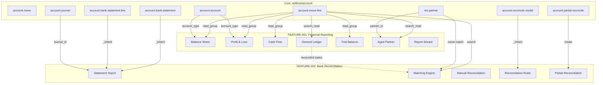

# Technical Specification

# 0. Agent Action Plan

## 0.1 Intent Clarification

### 0.1.1 Core Feature Objective

Based on the prompt, the Blitzy platform understands that the new feature requirement is to implement **Phase 1 of the Enterprise Accounting Parity initiative** for Odoo Community Edition 19.0, encompassing two critical capabilities:

- **Financial Reporting Engine (FEATURE-001)**: Deliver a full suite of GAAP/IFRS-compliant financial reports—Balance Sheet, Profit & Loss, Cash Flow Statement, General Ledger, Trial Balance, and Aged AR/AP—with drill-down navigation to source transactions, comparative period analysis, and multi-format export (PDF and Excel). This feature extends and completes the existing scaffolded module at `addons/account_financial_report_ce/`, which already contains transient model stubs, wizard definitions, QWeb report templates, security groups, and test scaffolds totaling approximately 6,667 lines across 37 files.

- **Bank Reconciliation System (FEATURE-002)**: Build a new module providing smart algorithmic matching of bank statement lines to journal entries (≥95% accuracy target), configurable reconciliation rules (regex, amount, partner matching), multi-format statement import (CSV, OFX, QIF, CAMT.053), manual reconciliation workflows, and partial reconciliation with write-off handling. This module does not yet exist in the repository and must be created from scratch.

- The user's instruction explicitly references `EPIC-001-enterprise-accounting-parity.md` as the governing epic, with 7 stories for FEATURE-001 (FR-001 through FR-007) and 5 stories for FEATURE-002 (BR-001 through BR-005). All stories contain acceptance criteria that define the "done" threshold.

- The user requires architectural proposals to be based on **codebase discovery** of the existing `addons/account` module structure and OCA (Odoo Community Association) patterns—not prescribed implementations.

**Implicit Requirements Detected:**
- The existing `account_financial_report_ce` scaffold must be enhanced from its current stub state to fully functional report generation with working `_compute_report_data` pipelines, validated accounting equations, and functional export handlers
- A new companion module (e.g., `account_bank_reconciliation_ce`) must be scaffolded and implemented for FEATURE-002
- Both modules must integrate with the core `account` module's models (`account.move`, `account.move.line`, `account.account`, `account.bank.statement`, `account.bank.statement.line`, `account.reconcile.model`) without modifying those core models—only extending them via Odoo's inheritance mechanism
- Security groups, access control lists, and record rules must be created for both modules
- Python 3.10–3.13 compatibility is mandatory per `odoo/release.py` (MIN_PY_VERSION = 3.10)

### 0.1.2 Special Instructions and Constraints

**User Directives:**
- "Analyze `addons/account` module structure and OCA patterns before implementation" — This mandates a discovery-first approach where architectural decisions are grounded in the existing codebase patterns found in `addons/account/models/`, `addons/account/report/`, `addons/account/wizard/`, and `addons/account/views/`
- "All stories contain acceptance criteria" — Each of the 12 stories (7 FR + 5 BR) has BDD-style Given/When/Then acceptance scenarios that serve as the definitive validation criteria
- "Propose architecture based on codebase discovery" — Implementation patterns must mirror those observed in the `account` module (e.g., `_auto = False` SQL view models, `TransientModel` wizards, `_inherits` delegation, `read_group` aggregation)

**Architectural Requirements:**
- AGPL-3.0 licensing for all new code (per EPIC-001 constraints)
- Zero dependencies on Odoo Enterprise modules—specifically excluded: `account_reports`, `account_accountant`, `account_asset`, `account_budget`, `account_followup`, `account_deferred_revenue`
- OCA coding standards compliance (pre-commit hooks, pylint-odoo)
- Minimum 80% test coverage per module
- Odoo 19.0 repository baseline with version-agnostic story specifications (stories reference Odoo 18.0 but repo is 19.0)
- BDD alignment: tests must map to story acceptance criteria

**Performance Requirements:**
- Financial reports: <30 seconds for 100,000 transactions; PDF export <15 seconds; Excel export <10 seconds; drill-down response <2 seconds
- Bank reconciliation: statement import <10 seconds for 500 lines; algorithmic matching <5 seconds for 1,000 lines; rule evaluation <1 second per rule

### 0.1.3 Technical Interpretation

These feature requirements translate to the following technical implementation strategy:

- To **complete the Financial Reporting Engine**, we will enhance the existing 8 transient model classes in `addons/account_financial_report_ce/models/` with production-grade `_compute_report_data()` implementations, optimize `read_group` aggregation queries against `account.move.line`, implement functional PDF export via QWeb report templates in `report/`, and build Excel export using `openpyxl`/`XlsxWriter` libraries already present in `requirements.txt`. Drill-down actions will return window actions filtered to source `account.move.line` records.

- To **implement the Bank Reconciliation System**, we will create a new Odoo module `addons/account_bank_reconciliation_ce/` following the identical structural pattern of `account_financial_report_ce` (models, wizard, report, views, security, tests, data, static, demo). The module will extend `account.bank.statement` and `account.bank.statement.line` with import parsing capabilities, implement a matching engine as a new model with configurable confidence scoring, extend `account.reconcile.model` for enhanced rule evaluation, and provide a reconciliation wizard with manual match/unmatch workflows.

- To **ensure integration**, both modules will read from but not modify the core `account` module's table schemas, using Odoo's `_inherit` mechanism for model extension and `ir.actions.act_window` for navigation between reports and source documents. Cross-feature integration will ensure the General Ledger report reflects reconciliation status and reconciled transaction markers.

## 0.2 Repository Scope Discovery

### 0.2.1 Comprehensive File Analysis

The repository is an Odoo 19.0 Community Edition monolith (`version_info = (19, 0, 0, FINAL, 0, '')` per `odoo/release.py`). The following tables exhaustively document every file and folder relevant to the Phase 1 implementation.

**Existing Module Files to Modify — `addons/account_financial_report_ce/`**

This module is scaffolded with 37 files totaling ~6,667 lines. All files require enhancement from stub/placeholder state to production-quality implementations.

| File Path | Lines | Modification Purpose |
|---|---|---|
| `addons/account_financial_report_ce/__manifest__.py` | 76 | Update version, add new dependencies if needed, register new data/view files |
| `addons/account_financial_report_ce/__init__.py` | 7 | Verify import chain completeness |
| `addons/account_financial_report_ce/models/__init__.py` | 11 | Verify all report model imports |
| `addons/account_financial_report_ce/models/financial_report.py` | 476 | Complete abstract base: optimize `_compute_account_balance` with SQL, implement drill-down, export contracts |
| `addons/account_financial_report_ce/models/balance_sheet.py` | 651 | Production-grade `_compute_report_data`, accounting equation enforcement, comparative periods |
| `addons/account_financial_report_ce/models/profit_loss.py` | 241 | Complete revenue/expense aggregation, gross/operating/net income calculations |
| `addons/account_financial_report_ce/models/cash_flow.py` | 415 | Implement indirect/direct method cash flow, activity categorization |
| `addons/account_financial_report_ce/models/general_ledger.py` | 296 | Complete per-account transaction listing, running balances, opening/closing |
| `addons/account_financial_report_ce/models/trial_balance.py` | 254 | Complete debit/credit column computation, balance verification |
| `addons/account_financial_report_ce/models/aged_partner_balance.py` | 385 | Implement 30/60/90/120+ day aging bucket computation, partner drill-down |
| `addons/account_financial_report_ce/wizard/financial_report_wizard.py` | 260 | Complete wizard-to-report model bridging, validation, and action dispatch |
| `addons/account_financial_report_ce/wizard/financial_report_wizard_views.xml` | 217 | Refine form layout, dynamic visibility, filter controls |
| `addons/account_financial_report_ce/report/report_balance_sheet.py` | 38 | Complete `_get_report_values` with line data and currency context |
| `addons/account_financial_report_ce/report/report_profit_loss.py` | 21 | Complete `_get_report_values` |
| `addons/account_financial_report_ce/report/report_cash_flow.py` | 21 | Complete `_get_report_values` |
| `addons/account_financial_report_ce/report/report_general_ledger.py` | 21 | Complete `_get_report_values` |
| `addons/account_financial_report_ce/report/report_trial_balance.py` | 21 | Complete `_get_report_values` |
| `addons/account_financial_report_ce/report/report_aged_partner_balance.py` | 21 | Complete `_get_report_values` |
| `addons/account_financial_report_ce/report/__init__.py` | 10 | Verify all report parser imports |
| `addons/account_financial_report_ce/report/report_templates.xml` | 137 | Refine `ir.actions.report` bindings, XLSX export actions |
| `addons/account_financial_report_ce/report/balance_sheet_report.xml` | 238 | Complete QWeb template with section hierarchy, comparison columns |
| `addons/account_financial_report_ce/report/profit_loss_report.xml` | 316 | Complete QWeb template with revenue/expense sections |
| `addons/account_financial_report_ce/report/cash_flow_report.xml` | 279 | Complete QWeb template with activity sections |
| `addons/account_financial_report_ce/report/general_ledger_report.xml` | 240 | Complete QWeb template with account/transaction detail |
| `addons/account_financial_report_ce/report/trial_balance_report.xml` | 274 | Complete QWeb template with debit/credit columns |
| `addons/account_financial_report_ce/report/aged_partner_balance_report.xml` | 367 | Complete QWeb template with aging buckets |
| `addons/account_financial_report_ce/security/account_financial_report_security.xml` | 24 | Extend security groups, add record rules for multi-company |
| `addons/account_financial_report_ce/security/ir.model.access.csv` | 16 | Add ACL rows for any new models/wizards |
| `addons/account_financial_report_ce/data/report_paperformat.xml` | 95 | Verify paper format bindings |
| `addons/account_financial_report_ce/static/src/scss/report.scss` | 236 | Refine interactive report styling |
| `addons/account_financial_report_ce/static/src/scss/report_print.scss` | 360 | Refine print layout styling |
| `addons/account_financial_report_ce/views/menuitem.xml` | 89 | Verify menu items and action bindings |
| `addons/account_financial_report_ce/tests/__init__.py` | 5 | Register new test modules |
| `addons/account_financial_report_ce/tests/test_financial_reports.py` | 528 | Expand to achieve 80% coverage, add per-story test cases |
| `addons/account_financial_report_ce/demo/demo_data.xml` | 16 | Optionally add demo financial data |

**Core Account Module — Read-Only Integration Touchpoints**

These files in `addons/account/` are not modified but serve as the data source and pattern reference for both features:

| File Path | Lines | Integration Role |
|---|---|---|
| `addons/account/models/account_account.py` | 1,628 | `account_type` field and classification used for report section grouping |
| `addons/account/models/account_move.py` | 7,211 | `account.move` model — journal entries, posting workflow, state management |
| `addons/account/models/account_move_line.py` | 3,600 | `account.move.line` — primary data source for all financial reports |
| `addons/account/models/account_bank_statement.py` | 373 | `account.bank.statement` — statement header model to extend for BR |
| `addons/account/models/account_bank_statement_line.py` | 863 | `account.bank.statement.line` — statement lines with `_inherits` on `account.move` |
| `addons/account/models/account_reconcile_model.py` | ~400 | `account.reconcile.model` — reconciliation rule engine to extend for BR-004 |
| `addons/account/models/account_partial_reconcile.py` | 701 | `account.partial.reconcile` — partial matching mechanics for BR-005 |
| `addons/account/models/account_full_reconcile.py` | ~100 | `account.full.reconcile` — full reconciliation records |
| `addons/account/models/account_journal.py` | 1,308 | `account.journal` — bank journal association for statement import |
| `addons/account/models/partner.py` | 1,076 | `res.partner` extension — partner matching for reconciliation |
| `addons/account/models/account_payment.py` | 1,173 | `account.payment` — payment records linked via reconciliation |
| `addons/account/models/company.py` | 1,146 | `res.company` — fiscal year, currency, report header settings |
| `addons/account/models/account_report.py` | 967 | `account.report` — Odoo's native report framework reference |
| `addons/account/report/account_invoice_report.py` | ~300 | SQL-view report pattern reference (`_auto = False`, `_table_query`) |
| `addons/account/views/account_bank_statement_views.xml` | 144 | Statement UI patterns to extend |
| `addons/account/views/account_reconcile_model_views.xml` | 160 | Reconciliation rule UI patterns |
| `addons/account/security/account_security.xml` | ~200 | Security group hierarchy reference |
| `addons/account/security/ir.model.access.csv` | ~100 | ACL pattern reference |
| `addons/account/tests/common.py` | ~500 | `AccountTestInvoicingCommon` — test fixture base class |
| `addons/account/tests/test_account_bank_statement.py` | ~300 | Bank statement test patterns |

### 0.2.2 Web Search Research Conducted

The following research areas are relevant to implementation:

- **OCA account-financial-reporting patterns** (`https://github.com/OCA/account-financial-reporting`): General Ledger, Trial Balance, and Aged Partner Balance module patterns for potential integration or pattern alignment
- **OCA bank-statement-import modules** (`https://github.com/OCA/bank-statement-import`): Multi-format statement import patterns for CSV, OFX, QIF, and CAMT.053
- **OCA account-reconcile** (`https://github.com/OCA/account-reconcile`): Community reconciliation interface patterns
- **ISO 20022 CAMT.053 specification** (`https://www.iso20022.org/catalogue-messages`): XML schema for European bank statement import
- **OFX specification** (`https://www.ofx.net/downloads.html`): Open Financial Exchange format parsing
- **GAAP/IFRS financial statement formats**: Presentation requirements for Balance Sheet (ASC 210), P&L (ASC 220), and Cash Flow (ASC 230)

### 0.2.3 New File Requirements

**New Module — `addons/account_bank_reconciliation_ce/`**

This module must be created from scratch following the Odoo module convention and the structural pattern established by `account_financial_report_ce`:

| File to Create | Purpose |
|---|---|
| `addons/account_bank_reconciliation_ce/__init__.py` | Module entry point importing models, wizard, report packages |
| `addons/account_bank_reconciliation_ce/__manifest__.py` | Module descriptor: name, version (19.0.1.0.0), AGPL-3, depends [account, base], data/security/views registration |
| `addons/account_bank_reconciliation_ce/models/__init__.py` | Import all model modules |
| `addons/account_bank_reconciliation_ce/models/bank_statement_import.py` | Statement import logic: file parsing (CSV, OFX, QIF, CAMT.053), validation, duplicate detection, line creation |
| `addons/account_bank_reconciliation_ce/models/reconciliation_matching_engine.py` | Algorithmic matching engine: scoring by amount, date, reference, partner; confidence levels; multi-match handling |
| `addons/account_bank_reconciliation_ce/models/reconciliation_rule.py` | Extended reconciliation rule model: inherits `account.reconcile.model` with enhanced trigger types, regex matching, priority ordering |
| `addons/account_bank_reconciliation_ce/models/partial_reconcile_ext.py` | Partial reconciliation extensions: split transaction support, write-off generation, tolerance handling |
| `addons/account_bank_reconciliation_ce/wizard/__init__.py` | Wizard package init |
| `addons/account_bank_reconciliation_ce/wizard/bank_statement_import_wizard.py` | Import wizard: file upload, format detection, column mapping (CSV), preview, execution |
| `addons/account_bank_reconciliation_ce/wizard/bank_statement_import_wizard_views.xml` | Import wizard form view with file upload widget, format selection, preview table |
| `addons/account_bank_reconciliation_ce/wizard/reconciliation_wizard.py` | Reconciliation interface wizard: match/unmatch actions, filter controls, batch operations |
| `addons/account_bank_reconciliation_ce/wizard/reconciliation_wizard_views.xml` | Reconciliation wizard form with suggestion display, manual match controls |
| `addons/account_bank_reconciliation_ce/views/menuitem.xml` | Menu items under Accounting menu for import and reconciliation |
| `addons/account_bank_reconciliation_ce/views/bank_reconciliation_views.xml` | Tree/form/search views for reconciliation status and statement browsing |
| `addons/account_bank_reconciliation_ce/security/bank_reconciliation_security.xml` | Security groups: `group_bank_reconciliation_user`, `group_bank_reconciliation_manager` |
| `addons/account_bank_reconciliation_ce/security/ir.model.access.csv` | ACL entries for all new models and wizards |
| `addons/account_bank_reconciliation_ce/data/reconciliation_data.xml` | Default reconciliation rules, matching thresholds, import format definitions |
| `addons/account_bank_reconciliation_ce/report/__init__.py` | Report package init |
| `addons/account_bank_reconciliation_ce/report/reconciliation_report.py` | Reconciliation status report parser |
| `addons/account_bank_reconciliation_ce/report/reconciliation_report.xml` | QWeb template for reconciliation status PDF |
| `addons/account_bank_reconciliation_ce/static/src/scss/reconciliation.scss` | Reconciliation interface styling |
| `addons/account_bank_reconciliation_ce/tests/__init__.py` | Test package init |
| `addons/account_bank_reconciliation_ce/tests/common.py` | Shared test fixtures: sample statement data, journal setup, reconciliation helpers |
| `addons/account_bank_reconciliation_ce/tests/test_statement_import.py` | Import tests: CSV, OFX, QIF, CAMT.053 format parsing, validation, duplicate detection |
| `addons/account_bank_reconciliation_ce/tests/test_matching_engine.py` | Matching algorithm tests: confidence scoring, multi-match, edge cases |
| `addons/account_bank_reconciliation_ce/tests/test_reconciliation_rules.py` | Rule engine tests: regex matching, amount tolerance, auto-reconcile triggers |
| `addons/account_bank_reconciliation_ce/tests/test_partial_reconciliation.py` | Partial reconciliation tests: split transactions, write-offs, multi-currency |
| `addons/account_bank_reconciliation_ce/tests/test_manual_reconciliation.py` | Manual workflow tests: match, unmatch, undo, audit trail |
| `addons/account_bank_reconciliation_ce/tests/test_files/` | Sample statement files: `sample.csv`, `sample.ofx`, `sample.qif`, `sample_camt053.xml` |
| `addons/account_bank_reconciliation_ce/demo/demo_data.xml` | Demo bank statements and reconciliation scenarios |

**New Test Files for Financial Reporting Module:**

| File to Create | Purpose |
|---|---|
| `addons/account_financial_report_ce/tests/test_balance_sheet.py` | Dedicated Balance Sheet tests: equation validation, section classification, comparative periods |
| `addons/account_financial_report_ce/tests/test_profit_loss.py` | P&L tests: revenue/expense aggregation, gross/operating/net income |
| `addons/account_financial_report_ce/tests/test_cash_flow.py` | Cash Flow tests: activity categorization, indirect method, reconciliation |
| `addons/account_financial_report_ce/tests/test_general_ledger.py` | General Ledger tests: per-account transactions, running balances, date filtering |
| `addons/account_financial_report_ce/tests/test_trial_balance.py` | Trial Balance tests: debit/credit equality, period filtering |
| `addons/account_financial_report_ce/tests/test_aged_partner.py` | Aged AR/AP tests: aging bucket classification, partner drill-down |
| `addons/account_financial_report_ce/tests/test_export.py` | Export tests: PDF generation, Excel export, drill-down navigation |

## 0.3 Dependency Inventory

### 0.3.1 Private and Public Packages

All packages listed below are sourced from **PyPI** (public) or from Odoo's own module registry (internal). No private package registries are required. Version ranges reflect the Python-version-conditional pinning strategy documented in `requirements.txt`.

**Core Platform Dependencies (Pre-existing in `requirements.txt`):**

| Registry | Package | Version (Python 3.12) | Purpose for Phase 1 |
|---|---|---|---|
| PyPI | `psycopg2` | 2.9.9 | PostgreSQL adapter for all report/reconciliation queries |
| PyPI | `openpyxl` | 3.1.2 | Excel (.xlsx) read/write for FR-007 report export and BR-001 statement import |
| PyPI | `XlsxWriter` | 3.1.9 | Excel file generation for financial report XLSX export |
| PyPI | `xlrd` | 2.0.1 | Legacy Excel (.xls) reading for bank statement import |
| PyPI | `ofxparse` | 0.21 | OFX (Open Financial Exchange) file parsing for BR-001 |
| PyPI | `lxml` | 5.2.1 | XML processing for CAMT.053 parsing and QWeb report rendering |
| PyPI | `reportlab` | 4.1.0 | PDF generation engine for QWeb-to-PDF financial report export |
| PyPI | `Pillow` | 10.2.0 | Image processing for report logo rendering |
| PyPI | `Babel` | 2.10.3 | Locale-aware number/date formatting in financial reports |
| PyPI | `python-dateutil` | 2.8.2 | Date range calculations for report period filtering |
| PyPI | `num2words` | 0.5.13 | Number-to-words conversion for report amount rendering |
| PyPI | `Werkzeug` | 3.0.1 | WSGI server for HTTP endpoints |
| PyPI | `Jinja2` | 3.1.2 | Server-side template engine |
| PyPI | `chardet` | 5.2.0 | Character encoding detection for imported bank statement files |
| PyPI | `freezegun` | 1.2.1 | Datetime mocking for deterministic test execution |
| PyPI | `pytz` | (unpinned) | Timezone database for date-aware reporting |

**Odoo Internal Module Dependencies:**

| Registry | Module | Version | Purpose for Phase 1 |
|---|---|---|---|
| Odoo Addons | `account` | 19.0 (LGPL-3) | Core accounting: `account.move`, `account.move.line`, `account.account`, `account.bank.statement`, `account.reconcile.model` |
| Odoo Addons | `analytic` | 19.0 | Analytic account/plan integration for report filtering |
| Odoo Addons | `base` | 19.0 | `res.partner`, `res.company`, `res.currency` base models |
| Odoo Addons | `base_import` | 19.0 | Generic import framework patterns (reference for BR-001 CSV import) |

**Explicitly Excluded Enterprise Modules:**

| Module | Reason |
|---|---|
| `account_reports` | Enterprise-only; replaced by FEATURE-001 |
| `account_accountant` | Enterprise-only; replaced by FEATURE-002 |
| `account_budget` | Enterprise-only; out of scope for Phase 1 |
| `account_asset` | Enterprise-only; out of scope for Phase 1 |
| `account_deferred_revenue` | Enterprise-only; out of scope for Phase 1 |
| `account_followup` | Enterprise-only; out of scope for Phase 1 |

### 0.3.2 Dependency Updates

**Import Updates for `account_financial_report_ce`:**

Files requiring import updates when models are enhanced:

- `addons/account_financial_report_ce/models/*.py` — Ensure all internal imports reference actual Odoo ORM classes (`from odoo import api, fields, models, _`), `UserError`/`ValidationError`, and any utility functions from `odoo.tools`
- `addons/account_financial_report_ce/report/*.py` — Report parser imports must reference the correct `AbstractModel` base
- `addons/account_financial_report_ce/tests/*.py` — Test imports must reference `TransactionCase`, `tagged`, and the common test fixtures from `addons/account/tests/common.py`

**Import Structure for New `account_bank_reconciliation_ce` Module:**

- `addons/account_bank_reconciliation_ce/models/*.py` — Standard Odoo imports plus `import re` for regex matching, `import csv` for CSV parsing, `from lxml import etree` for CAMT.053 XML parsing
- `addons/account_bank_reconciliation_ce/wizard/*.py` — Standard TransientModel imports plus `import base64` for file upload handling
- `addons/account_bank_reconciliation_ce/tests/*.py` — Test imports from `odoo.tests.common`, `freezegun`, and shared fixtures

**External Reference Updates:**

| File Pattern | Update Required |
|---|---|
| `addons/account_financial_report_ce/__manifest__.py` | Update version number, verify `data` list completeness |
| `addons/account_bank_reconciliation_ce/__manifest__.py` | Create with proper dependency declarations |
| `addons/account_financial_report_ce/security/ir.model.access.csv` | Add ACL rows for any new models |
| `addons/account_bank_reconciliation_ce/security/ir.model.access.csv` | Create full ACL matrix for all new models/wizards |

## 0.4 Integration Analysis

### 0.4.1 Existing Code Touchpoints

**Direct Model Integration — Financial Reporting (FEATURE-001):**

| Core Model | File | Integration Type | Usage in FEATURE-001 |
|---|---|---|---|
| `account.move.line` | `addons/account/models/account_move_line.py` | Read (read_group) | Primary data source for all 6 report types; aggregation by `account_id`, `partner_id`, `date` |
| `account.account` | `addons/account/models/account_account.py` | Read | `account_type` field (21 types) maps to Balance Sheet/P&L sections; `internal_group` for high-level classification |
| `account.move` | `addons/account/models/account_move.py` | Read | Filter by `state='posted'`; drill-down target from report lines |
| `res.partner` | `addons/account/models/partner.py` | Read | Aged AR/AP partner-level detail and drill-down |
| `res.company` | `addons/account/models/company.py` | Read | Company currency, fiscal year start, report header settings |
| `res.currency` | `addons/account/models/res_currency.py` | Read | Multi-currency conversion for report amounts |
| `account.analytic.account` | `addons/account/models/account_analytic_account.py` | Read | Analytic dimension filtering for report scope |

**Direct Model Integration — Bank Reconciliation (FEATURE-002):**

| Core Model | File | Integration Type | Usage in FEATURE-002 |
|---|---|---|---|
| `account.bank.statement` | `addons/account/models/account_bank_statement.py` | Extend (`_inherit`) | Add import metadata fields, statement validation hooks |
| `account.bank.statement.line` | `addons/account/models/account_bank_statement_line.py` | Extend (`_inherit`) | Add matching score fields, reconciliation status tracking |
| `account.reconcile.model` | `addons/account/models/account_reconcile_model.py` | Extend (`_inherit`) | Enhanced rule evaluation with priority, confidence thresholds |
| `account.partial.reconcile` | `addons/account/models/account_partial_reconcile.py` | Read/Create | Partial reconciliation record creation for split transactions |
| `account.full.reconcile` | `addons/account/models/account_full_reconcile.py` | Read | Full reconciliation status check |
| `account.move` | `addons/account/models/account_move.py` | Read | Open journal entries for matching candidates |
| `account.move.line` | `addons/account/models/account_move_line.py` | Read/Write | Reconciliation linkage via `full_reconcile_id` and `matched_debit_ids`/`matched_credit_ids` |
| `account.journal` | `addons/account/models/account_journal.py` | Read | Bank journal identification for statement association |
| `res.partner` | `addons/account/models/partner.py` | Read | Partner name/reference matching in algorithmic engine |

### 0.4.2 Dependency Injection and Service Registration

**Module Registration:**

- `addons/account_financial_report_ce/__manifest__.py` — Already registered in the Odoo addons path; `depends: ['account', 'analytic']` ensures load order
- `addons/account_bank_reconciliation_ce/__manifest__.py` — Must be created with `depends: ['account']` (minimum); optionally `'base_import'` for import pattern reuse

**Security Group Hierarchy:**

Both modules must integrate with the existing accounting security groups defined in `addons/account/security/account_security.xml`:

- `account.group_account_invoice` — Invoicing access (base read)
- `account.group_account_readonly` — Read-only accounting features
- `account.group_account_user` — Full accounting features
- `account.group_account_manager` — Administrator access

New security groups should be implied by these existing groups to maintain seamless access inheritance.

### 0.4.3 Database/Schema Impact

**No Schema Modifications to Existing Tables.** Both modules use Odoo's `_inherit` mechanism which adds fields to existing database tables without altering the core module's column definitions.

**New Tables Created by FEATURE-001:**

| ORM Model | Table Name | Type | Purpose |
|---|---|---|---|
| `account.balance.sheet.report` | `account_balance_sheet_report` | TransientModel | Ephemeral balance sheet wizard data |
| `account.balance.sheet.report.line` | `account_balance_sheet_report_line` | TransientModel | Balance sheet report line items |
| `account.profit.loss.report` | `account_profit_loss_report` | TransientModel | Ephemeral P&L wizard data |
| `account.cash.flow.report` | `account_cash_flow_report` | TransientModel | Ephemeral cash flow wizard data |
| `account.general.ledger.report` | `account_general_ledger_report` | TransientModel | General ledger wizard data |
| `account.trial.balance.report` | `account_trial_balance_report` | TransientModel | Trial balance wizard data |
| `account.aged.partner.balance.report` | `account_aged_partner_balance_report` | TransientModel | Aged AR/AP wizard data |
| `account.financial.report.wizard` | `account_financial_report_wizard` | TransientModel | Unified report parameter wizard |

**New Tables Created by FEATURE-002:**

| ORM Model | Table Name | Type | Purpose |
|---|---|---|---|
| `account.bank.statement.import` | `account_bank_statement_import` | TransientModel | Statement import wizard state |
| `account.reconciliation.matching` | `account_reconciliation_matching` | Model | Matching engine results and confidence scores |
| `account.reconciliation.wizard` | `account_reconciliation_wizard` | TransientModel | Manual reconciliation interface state |

### 0.4.4 Cross-Feature Integration

The following diagram illustrates the integration relationships between both Phase 1 features and the core `account` module:

## 0.5 Technical Implementation

### 0.5.1 File-by-File Execution Plan

Every file listed below **MUST** be created or modified. Files are organized into logical groups by feature and implementation dependency.

**Group 1 — Financial Reporting Core Models (FEATURE-001)**

| Action | File | Implementation Details |
|---|---|---|
| MODIFY | `addons/account_financial_report_ce/models/financial_report.py` | Complete `_compute_account_balance` with optimized SQL via `read_group`; implement `action_drilldown` returning `ir.actions.act_window` targeting `account.move.line`; implement `action_export_pdf` delegating to `ir.actions.report`; implement `action_export_xlsx` using `openpyxl` |
| MODIFY | `addons/account_financial_report_ce/models/balance_sheet.py` | Complete `_compute_report_data` classifying accounts by `account_type` into Assets/Liabilities/Equity sections using the 21 account types from `account.account`; enforce `Assets = Liabilities + Equity` validation; populate `line_ids` with section hierarchy; implement comparative period calculation |
| MODIFY | `addons/account_financial_report_ce/models/profit_loss.py` | Complete `_compute_report_data` aggregating income/expense accounts; compute Revenue, COGS (`expense_direct_cost`), Gross Profit, Operating Expenses, Operating Income, Other Income/Expenses, and Net Income; support date-range filtering |
| MODIFY | `addons/account_financial_report_ce/models/cash_flow.py` | Implement indirect method: start with Net Income, add back depreciation (`expense_depreciation`), compute working capital changes (receivable/payable deltas), investing activities (fixed asset changes), and financing activities; reconcile to closing cash balance |
| MODIFY | `addons/account_financial_report_ce/models/general_ledger.py` | Complete per-account transaction listing with opening balance, period transactions (sorted by date/sequence), running balance computation, and closing balance; support account code range filtering and partner filtering |
| MODIFY | `addons/account_financial_report_ce/models/trial_balance.py` | Compute opening debit/credit, period movement, and closing debit/credit per account; validate Total Debits = Total Credits; support hide-zero-balance toggle |
| MODIFY | `addons/account_financial_report_ce/models/aged_partner_balance.py` | Implement aging bucket computation using `date_maturity` on `account.move.line`; classify into Current/30/60/90/120+ day buckets; support both AR (`asset_receivable`) and AP (`liability_payable`) modes; partner-level drill-down |

**Group 2 — Financial Reporting Wizard and UI (FEATURE-001)**

| Action | File | Implementation Details |
|---|---|---|
| MODIFY | `addons/account_financial_report_ce/wizard/financial_report_wizard.py` | Complete `action_generate_report` bridging wizard parameters to report model creation; validate date ranges; handle comparison period logic; implement `action_print_pdf` and `action_export_xlsx` dispatchers |
| MODIFY | `addons/account_financial_report_ce/wizard/financial_report_wizard_views.xml` | Refine dynamic visibility rules per report type; ensure proper date field toggling for structural vs. period reports; add journal/partner/account filter notebooks |
| MODIFY | `addons/account_financial_report_ce/views/menuitem.xml` | Verify menu hierarchy under Accounting > Reporting; ensure each report type has a dedicated menu entry |

**Group 3 — Financial Reporting QWeb Templates and Export (FEATURE-001)**

| Action | File | Implementation Details |
|---|---|---|
| MODIFY | `addons/account_financial_report_ce/report/report_balance_sheet.py` | Complete `_get_report_values` returning line data, company currency, comparison columns, and equation validation status |
| MODIFY | `addons/account_financial_report_ce/report/report_profit_loss.py` | Complete `_get_report_values` with income/expense breakdown and subtotals |
| MODIFY | `addons/account_financial_report_ce/report/report_cash_flow.py` | Complete `_get_report_values` with activity section data |
| MODIFY | `addons/account_financial_report_ce/report/report_general_ledger.py` | Complete `_get_report_values` with per-account transaction data |
| MODIFY | `addons/account_financial_report_ce/report/report_trial_balance.py` | Complete `_get_report_values` with debit/credit column data |
| MODIFY | `addons/account_financial_report_ce/report/report_aged_partner_balance.py` | Complete `_get_report_values` with aging bucket data per partner |
| MODIFY | `addons/account_financial_report_ce/report/balance_sheet_report.xml` | Refine QWeb template: section headers, indentation, comparison columns, totals row, equation validation badge |
| MODIFY | `addons/account_financial_report_ce/report/profit_loss_report.xml` | Refine QWeb template: revenue/expense sections, subtotals, net income |
| MODIFY | `addons/account_financial_report_ce/report/cash_flow_report.xml` | Refine QWeb template: activity sections, opening/closing cash |
| MODIFY | `addons/account_financial_report_ce/report/general_ledger_report.xml` | Refine QWeb template: per-account detail with transaction lines |
| MODIFY | `addons/account_financial_report_ce/report/trial_balance_report.xml` | Refine QWeb template: debit/credit columns, totals row |
| MODIFY | `addons/account_financial_report_ce/report/aged_partner_balance_report.xml` | Refine QWeb template: aging buckets, partner detail, progress bars |
| MODIFY | `addons/account_financial_report_ce/report/report_templates.xml` | Verify `ir.actions.report` bindings for all 6 report types, PDF and XLSX |

**Group 4 — Financial Reporting Security and Config (FEATURE-001)**

| Action | File | Implementation Details |
|---|---|---|
| MODIFY | `addons/account_financial_report_ce/security/account_financial_report_security.xml` | Add record rules for multi-company isolation; ensure groups inherit from `account.group_account_readonly` and `account.group_account_manager` |
| MODIFY | `addons/account_financial_report_ce/security/ir.model.access.csv` | Add ACL rows for any new transient models or report line models |
| MODIFY | `addons/account_financial_report_ce/__manifest__.py` | Update version, verify all data files registered, add new test files to discovery |
| MODIFY | `addons/account_financial_report_ce/static/src/scss/report.scss` | Refine styling for section hierarchy, comparison columns, drill-down links |
| MODIFY | `addons/account_financial_report_ce/static/src/scss/report_print.scss` | Optimize print layout for all 6 report types |

**Group 5 — Bank Reconciliation Module Structure (FEATURE-002)**

| Action | File | Implementation Details |
|---|---|---|
| CREATE | `addons/account_bank_reconciliation_ce/__init__.py` | Module init: `from . import models, wizard, report` |
| CREATE | `addons/account_bank_reconciliation_ce/__manifest__.py` | Module manifest: version 19.0.1.0.0, AGPL-3, depends=['account'], data/security/view registration |
| CREATE | `addons/account_bank_reconciliation_ce/models/__init__.py` | Import: `bank_statement_import`, `reconciliation_matching_engine`, `reconciliation_rule`, `partial_reconcile_ext` |
| CREATE | `addons/account_bank_reconciliation_ce/models/bank_statement_import.py` | Statement import model: file type detection, CSV column mapping, OFX parsing via `ofxparse`, QIF text parsing, CAMT.053 XML parsing via `lxml.etree`; duplicate detection by hash; line creation with validation |
| CREATE | `addons/account_bank_reconciliation_ce/models/reconciliation_matching_engine.py` | Matching engine model: scoring algorithm with configurable weights (amount=highest, reference=high, partner=high, date=medium); confidence levels (High ≥90%, Medium 70-89%, Low 50-69%); multi-match resolution; one-to-many/many-to-one handling |
| CREATE | `addons/account_bank_reconciliation_ce/models/reconciliation_rule.py` | Rule extension: `_inherit = 'account.reconcile.model'` with priority ordering, enhanced condition evaluation, confidence threshold override, auto-reconcile trigger |
| CREATE | `addons/account_bank_reconciliation_ce/models/partial_reconcile_ext.py` | Partial reconciliation support: split transaction logic, write-off account selection, tolerance percentage configuration, multi-currency difference handling |

**Group 6 — Bank Reconciliation Wizard and UI (FEATURE-002)**

| Action | File | Implementation Details |
|---|---|---|
| CREATE | `addons/account_bank_reconciliation_ce/wizard/__init__.py` | Import: `bank_statement_import_wizard`, `reconciliation_wizard` |
| CREATE | `addons/account_bank_reconciliation_ce/wizard/bank_statement_import_wizard.py` | Import wizard: file upload via `base64`, format auto-detection, CSV column mapping interface, preview with first N rows, batch execution with progress, rollback on failure |
| CREATE | `addons/account_bank_reconciliation_ce/wizard/bank_statement_import_wizard_views.xml` | Import wizard form: file upload binary widget, format radio selection, column mapping table, preview notebook, action buttons |
| CREATE | `addons/account_bank_reconciliation_ce/wizard/reconciliation_wizard.py` | Reconciliation wizard: load unreconciled lines, display match suggestions with confidence badges, manual match/unmatch, partial match with write-off dialog, batch confirm |
| CREATE | `addons/account_bank_reconciliation_ce/wizard/reconciliation_wizard_views.xml` | Reconciliation form: split view with statement lines and matching candidates, confidence indicators, action buttons |

**Group 7 — Bank Reconciliation Views, Security, and Data (FEATURE-002)**

| Action | File | Implementation Details |
|---|---|---|
| CREATE | `addons/account_bank_reconciliation_ce/views/menuitem.xml` | Menu items: Accounting > Bank Reconciliation > Import Statements, Reconciliation, Rules |
| CREATE | `addons/account_bank_reconciliation_ce/views/bank_reconciliation_views.xml` | Tree/form/search views for reconciliation status, statement browsing |
| CREATE | `addons/account_bank_reconciliation_ce/security/bank_reconciliation_security.xml` | Groups: `group_bank_reconciliation_user` (implied by `account.group_account_user`), `group_bank_reconciliation_manager` (implied by `account.group_account_manager`) |
| CREATE | `addons/account_bank_reconciliation_ce/security/ir.model.access.csv` | Full ACL matrix for all models and wizards |
| CREATE | `addons/account_bank_reconciliation_ce/data/reconciliation_data.xml` | Default matching thresholds, sample reconciliation rules |
| CREATE | `addons/account_bank_reconciliation_ce/report/__init__.py` | Report package init |
| CREATE | `addons/account_bank_reconciliation_ce/report/reconciliation_report.py` | Reconciliation status report parser |
| CREATE | `addons/account_bank_reconciliation_ce/report/reconciliation_report.xml` | QWeb template for reconciliation report |
| CREATE | `addons/account_bank_reconciliation_ce/static/src/scss/reconciliation.scss` | Reconciliation interface styling |
| CREATE | `addons/account_bank_reconciliation_ce/demo/demo_data.xml` | Demo bank statements and reconciliation data |

**Group 8 — Tests (Both Features)**

| Action | File | Implementation Details |
|---|---|---|
| MODIFY | `addons/account_financial_report_ce/tests/__init__.py` | Register all new test modules |
| MODIFY | `addons/account_financial_report_ce/tests/test_financial_reports.py` | Expand existing test suite for comprehensive coverage |
| CREATE | `addons/account_financial_report_ce/tests/test_balance_sheet.py` | FR-001 acceptance criteria: Assets=L+E validation, GAAP/IFRS section format |
| CREATE | `addons/account_financial_report_ce/tests/test_profit_loss.py` | FR-002 acceptance criteria: revenue/expense aggregation accuracy |
| CREATE | `addons/account_financial_report_ce/tests/test_cash_flow.py` | FR-003 acceptance criteria: activity categorization, reconciliation |
| CREATE | `addons/account_financial_report_ce/tests/test_general_ledger.py` | FR-004 acceptance criteria: transaction listing, date filtering |
| CREATE | `addons/account_financial_report_ce/tests/test_trial_balance.py` | FR-005 acceptance criteria: debit/credit equality |
| CREATE | `addons/account_financial_report_ce/tests/test_aged_partner.py` | FR-006 acceptance criteria: aging bucket accuracy |
| CREATE | `addons/account_financial_report_ce/tests/test_export.py` | FR-007 acceptance criteria: PDF/Excel export, drill-down |
| CREATE | `addons/account_bank_reconciliation_ce/tests/__init__.py` | Register all BR test modules |
| CREATE | `addons/account_bank_reconciliation_ce/tests/common.py` | Shared fixtures: sample statements, journals, partners |
| CREATE | `addons/account_bank_reconciliation_ce/tests/test_statement_import.py` | BR-001 acceptance criteria: CSV/OFX/QIF/CAMT.053 parsing |
| CREATE | `addons/account_bank_reconciliation_ce/tests/test_matching_engine.py` | BR-002 acceptance criteria: ≥95% matching accuracy |
| CREATE | `addons/account_bank_reconciliation_ce/tests/test_manual_reconciliation.py` | BR-003 acceptance criteria: match/unmatch, audit trail |
| CREATE | `addons/account_bank_reconciliation_ce/tests/test_reconciliation_rules.py` | BR-004 acceptance criteria: rule evaluation, regex, priority |
| CREATE | `addons/account_bank_reconciliation_ce/tests/test_partial_reconciliation.py` | BR-005 acceptance criteria: split transactions, write-offs |

### 0.5.2 Implementation Approach per File

**Foundation Layer — Establish Core Abstractions:**
- Complete the `FinancialReportAbstract` model with production-grade `read_group` queries and SQL-optimized balance computation, following the pattern established by `account.invoice.report` in `addons/account/report/account_invoice_report.py` (which uses `_auto = False` and `_table_query` for SQL views)
- Create the bank reconciliation module scaffold with `__manifest__.py`, security, and initial model stubs

**Integration Layer — Connect to Existing Systems:**
- Wire all report models to `account.move.line` via domain-filtered `read_group` calls
- Extend `account.bank.statement` and `account.reconcile.model` via `_inherit` for bank reconciliation
- Register menu items under the existing Accounting menu tree defined in `addons/account/views/account_menuitem.xml`

**Quality Layer — Comprehensive Test Coverage:**
- Each test module maps to a specific user story's acceptance criteria
- Test fixtures extend `AccountTestInvoicingCommon` from `addons/account/tests/common.py` for realistic accounting data
- All tests tagged with `@tagged('post_install', '-at_install')` per Odoo convention

**Documentation Layer — Usage and Configuration:**
- Module `README.md` files documenting installation, configuration, and usage
- Python docstrings on all public methods following OCA standards
- QWeb report templates documented with section comments

### 0.5.3 User Interface Design

No Figma screens were provided for this implementation. The UI approach follows the established Odoo accounting UI patterns:

- **Report Wizard**: Form view with radio-button report type selector, date range pickers, filter notebooks, and action buttons (Generate, Print PDF, Export Excel) — following the pattern established in `addons/account_financial_report_ce/wizard/financial_report_wizard_views.xml`
- **Report Display**: Inline form views for generated reports with drill-down hyperlinks on report lines — following patterns in `addons/account/views/account_move_views.xml`
- **Bank Statement Import**: Wizard form with file upload binary widget and format selection — following patterns in `addons/account/wizard/` directory
- **Reconciliation Interface**: Split-panel form with statement lines on one side and matching candidates on the other, confidence badges, and action buttons — following reconciliation model views in `addons/account/views/account_reconcile_model_views.xml`

## 0.6 Scope Boundaries

### 0.6.1 Exhaustively In Scope

**FEATURE-001: Financial Reporting Engine — All Files**

| Pattern | Description |
|---|---|
| `addons/account_financial_report_ce/models/**/*.py` | All report transient models and abstract base |
| `addons/account_financial_report_ce/wizard/**/*.py` | Unified report wizard and action dispatchers |
| `addons/account_financial_report_ce/wizard/**/*.xml` | Wizard form views and window actions |
| `addons/account_financial_report_ce/report/**/*.py` | All 6 QWeb report parsers |
| `addons/account_financial_report_ce/report/**/*.xml` | All 6 QWeb report templates plus report action bindings |
| `addons/account_financial_report_ce/views/menuitem.xml` | Menu items and action bindings |
| `addons/account_financial_report_ce/security/*.xml` | Security groups and record rules |
| `addons/account_financial_report_ce/security/*.csv` | Access control list entries |
| `addons/account_financial_report_ce/data/*.xml` | Paper format and report configuration data |
| `addons/account_financial_report_ce/static/src/scss/*.scss` | Interactive and print report styling |
| `addons/account_financial_report_ce/tests/**/*.py` | All unit, integration, and acceptance tests |
| `addons/account_financial_report_ce/demo/*.xml` | Demo financial data |
| `addons/account_financial_report_ce/__manifest__.py` | Module manifest with version, dependencies, data registration |
| `addons/account_financial_report_ce/__init__.py` | Module entry point |

**FEATURE-002: Bank Reconciliation — All Files (New Module)**

| Pattern | Description |
|---|---|
| `addons/account_bank_reconciliation_ce/**/*.py` | All models, wizards, reports, and tests |
| `addons/account_bank_reconciliation_ce/**/*.xml` | All views, menus, security, data, demo, and report templates |
| `addons/account_bank_reconciliation_ce/**/*.csv` | Access control list entries |
| `addons/account_bank_reconciliation_ce/**/*.scss` | Reconciliation interface styling |
| `addons/account_bank_reconciliation_ce/tests/test_files/*` | Sample statement files for import testing |

**Integration Touchpoints (Read-Only References):**

| File | Scope |
|---|---|
| `addons/account/models/account_move_line.py` | Read via `read_group` and `search_read` for report data |
| `addons/account/models/account_account.py` | Read `account_type` field for report section classification |
| `addons/account/models/account_bank_statement.py` | Extend via `_inherit` for import metadata |
| `addons/account/models/account_bank_statement_line.py` | Extend via `_inherit` for matching fields |
| `addons/account/models/account_reconcile_model.py` | Extend via `_inherit` for enhanced rule evaluation |
| `addons/account/models/account_partial_reconcile.py` | Create records for partial reconciliation |
| `addons/account/tests/common.py` | Inherit test fixtures for test setup |

**Documentation Scope:**

| File | Description |
|---|---|
| `tickets/features/FEATURE-001-financial-reporting.md` | Feature specification with 7 stories |
| `tickets/features/FEATURE-002-bank-reconciliation.md` | Feature specification with 5 stories |
| `tickets/stories/financial-reporting/FR-001-*.md` through `FR-007-*.md` | All 7 financial reporting user stories |
| `tickets/stories/bank-reconciliation/BR-001-*.md` through `BR-005-*.md` | All 5 bank reconciliation user stories |
| `tickets/EPIC-001-enterprise-accounting.md` | Governing epic specification |

### 0.6.2 Explicitly Out of Scope

The following items are **not** part of Phase 1 and must not be implemented:

| Out-of-Scope Item | Rationale |
|---|---|
| **FEATURE-003: Budget Management** | Wave 2 implementation; not referenced in Phase 1 |
| **FEATURE-004: Asset Management** | Wave 2 implementation; not referenced in Phase 1 |
| **FEATURE-005: Deferred Revenue/Expenses** | Wave 3 implementation; not referenced in Phase 1 |
| **FEATURE-006: Payment Follow-ups** | Wave 3 implementation; not referenced in Phase 1 |
| Modifications to `addons/account/` core module source | Core module is read-only; all changes use `_inherit` in separate modules |
| Enterprise module compatibility | AGPL-3 only; zero Enterprise module integration |
| Bank feed API integration (live bank connections) | Per EPIC-001 out-of-scope; only file-based import |
| AI/ML-based matching or predictions | Per EPIC-001 out-of-scope; algorithmic matching only |
| Consolidation reporting (multi-entity) | Per EPIC-001 out-of-scope |
| Tax-specific report integrations (VAT, GST) | Per EPIC-001 out-of-scope |
| UI mockups or Figma-based design | No Figma assets provided; follow existing Odoo UI patterns |
| Performance optimization beyond feature requirements | No profiling or optimization beyond specified SLAs |
| Refactoring of existing `account` module code | Only extension via `_inherit`; no core refactoring |
| i18n/l10n translation files | Translation managed separately via Weblate |
| Node.js or frontend build toolchain changes | No npm; all frontend assets are SCSS registered via `__manifest__.py` |

## 0.7 Rules for Feature Addition

### 0.7.1 Licensing and Compliance Rules

- **AGPL-3.0 License**: Every new file must include the AGPL-3.0 license header: `# License AGPL-3.0 or later (https://www.gnu.org/licenses/agpl).`
- **Zero Enterprise Dependencies**: No imports from `account_reports`, `account_accountant`, `account_asset`, `account_budget`, `account_followup`, or `account_deferred_revenue`. This is validated by verifying that `__manifest__.py` `depends` lists contain only Community-licensed modules.
- **OCA Coding Standards**: All Python code must pass OCA quality checks including `pylint-odoo` and `pre-commit` hooks. Ruff linting targets Python 3.10 syntax per `ruff.toml` (`target-version = "py310"`).
- **PEP 8 Compliance**: Standard Python style with the Ruff configuration defined at the repository root.

### 0.7.2 Testing and Coverage Rules

- **Minimum 80% Test Coverage**: Both `account_financial_report_ce` and `account_bank_reconciliation_ce` must individually achieve ≥80% code coverage measured by `pytest-odoo` or equivalent.
- **BDD Alignment**: Each test class must map to a specific user story's acceptance criteria. Test method names should reference story IDs (e.g., `test_fr001_balance_sheet_equation`, `test_br002_matching_accuracy`).
- **Test Tagging**: All tests must use `@tagged('post_install', '-at_install')` decorator per Odoo convention, as demonstrated in `addons/account/tests/`.
- **Test Fixture Reuse**: Test classes should extend `AccountTestInvoicingCommon` from `addons/account/tests/common.py` to leverage pre-built company, account, journal, partner, and product fixtures.
- **Deterministic Dates**: Use `freezegun` for all date-sensitive tests to ensure reproducible results.

### 0.7.3 Architectural and Integration Rules

- **Odoo Inheritance Only**: All extensions to core `account` models must use `_inherit` (Python class inheritance) — never `_inherits` (delegation inheritance) unless creating a new model that wraps an existing one, and never direct SQL DDL modifications.
- **TransientModel for Wizards**: All report wizards and import wizards must use `models.TransientModel` (auto-vacuumed) per the pattern in `addons/account_financial_report_ce/models/` — not persistent `models.Model`.
- **Read-Only Core Access**: Financial report models must access `account.move.line` and `account.account` through read operations (`read_group`, `search_read`) — never creating, modifying, or deleting core accounting records.
- **Write Access for Reconciliation Only**: Bank reconciliation is permitted to create `account.partial.reconcile` and `account.full.reconcile` records and update `account.move.line` reconciliation fields as part of the matching workflow — this follows the same pattern used by `addons/account/wizard/account_payment_register.py`.
- **Multi-Company Isolation**: All domain queries must include `('company_id', '=', self.company_id.id)` or equivalent company-scoped filters. Record rules must enforce multi-company isolation per the pattern in `addons/account/security/account_security.xml`.
- **No Custom JavaScript Components**: UI interactions must use Odoo's standard OWL components and view types (form, list, kanban, search). No custom OWL components are required for Phase 1.

### 0.7.4 Performance Rules

- **Report Generation**: Financial reports must complete in <30 seconds for 100,000 `account.move.line` records. This mandates using `read_group` with SQL-level aggregation rather than Python-level iteration.
- **Statement Import**: File parsing and line creation must complete in <10 seconds for 500 statement lines.
- **Matching Algorithm**: The matching engine must evaluate 1,000 statement lines against open journal entries in <5 seconds. This requires efficient SQL queries with indexed lookups on `amount`, `date`, and `partner_id`.
- **Rule Evaluation**: Individual reconciliation rule evaluation must complete in <1 second.

### 0.7.5 Data Integrity Rules

- **Accounting Equation**: The Balance Sheet report must validate `Assets = Liabilities + Equity` and flag any imbalance.
- **Trial Balance Integrity**: The Trial Balance must validate `Total Debits = Total Credits` and display a warning if the equation fails.
- **Statement Balance Validation**: Imported bank statements must validate `balance_start + sum(line amounts) = balance_end_real` using the existing `is_complete` and `is_valid` computed fields on `account.bank.statement`.
- **Reconciliation Audit Trail**: Every reconciliation action (match, unmatch, partial match, write-off) must be traceable through the standard Odoo `account.partial.reconcile` and `account.full.reconcile` records.
- **Duplicate Import Prevention**: The statement import system must detect and reject duplicate imports by comparing statement reference, date, and line hashes against existing records.

### 0.7.6 Version Compatibility Rules

- **Python 3.10–3.13**: All code must be compatible across the full supported Python range as declared in `odoo/release.py` (`MIN_PY_VERSION = (3, 10)`).
- **Odoo 19.0 API**: Use Odoo 19.0 API conventions — `fields.Command` instead of `(0, 0, vals)` tuples, `fields.Domain` where applicable, and the current `read_group` method signature.
- **No Version-Specific Branching**: Stories are written version-agnostic; implementation should not contain `if odoo_version >= X` conditionals.

## 0.8 References

### 0.8.1 Repository Files and Folders Searched

The following files and folders were systematically explored to derive the conclusions in this Agent Action Plan:

**Root-Level Configuration Files:**

| File | Purpose of Analysis |
|---|---|
| `requirements.txt` | Python dependency inventory with version-conditional pins (100 lines) |
| `setup.py` | `install_requires`, `python_requires`, and `tests_require` declarations |
| `setup.cfg` | Flake8 and install configuration |
| `ruff.toml` | Linting target version (`py310`), rule families, import ordering |
| `odoo/release.py` | Odoo version (19.0.0 FINAL), MIN_PY_VERSION (3.10), product metadata |

**Ticket and Feature Specification Files:**

| File | Purpose of Analysis |
|---|---|
| `tickets/EPIC-001-enterprise-accounting.md` | Governing epic: 6 features, 3 implementation waves, constraints, success metrics |
| `tickets/README.md` | Documentation navigation hub: 6 features, 32 stories, contribution guidelines |
| `tickets/features/FEATURE-001-financial-reporting.md` | Financial Reporting spec: 7 stories, 9 capabilities, account type mapping, acceptance criteria, performance requirements |
| `tickets/features/FEATURE-002-bank-reconciliation.md` | Bank Reconciliation spec: 5 stories, 5 capabilities, import formats, matching algorithm, acceptance criteria |
| `tickets/features/FEATURE-003-budget-management.md` | Budget Management spec (reviewed for cross-feature dependency awareness) |
| `tickets/features/FEATURE-004-asset-management.md` | Asset Management spec (reviewed for cross-feature dependency awareness) |
| `tickets/features/FEATURE-005-deferred-revenue.md` | Deferred Revenue spec (reviewed for cross-feature dependency awareness) |
| `tickets/features/FEATURE-006-payment-followups.md` | Payment Follow-ups spec (reviewed for cross-feature dependency awareness) |
| `tickets/stories/financial-reporting/` | 7 story files: FR-001 through FR-007 (existence verified) |
| `tickets/stories/bank-reconciliation/` | 5 story files: BR-001 through BR-005 (existence verified) |

**Existing Financial Reporting Module:**

| File/Folder | Purpose of Analysis |
|---|---|
| `addons/account_financial_report_ce/__manifest__.py` | Module metadata: version 19.0.1.0.0, AGPL-3, depends, data registration |
| `addons/account_financial_report_ce/__init__.py` | Module entry point and import chain |
| `addons/account_financial_report_ce/models/` (8 files) | Transient report models: abstract base, 6 concrete reports; line counts and stub analysis |
| `addons/account_financial_report_ce/wizard/` (3 files) | Unified wizard: Python model, XML views |
| `addons/account_financial_report_ce/report/` (14 files) | QWeb templates and report parsers for all 6 report types |
| `addons/account_financial_report_ce/security/` (2 files) | Security groups and 16 ACL entries |
| `addons/account_financial_report_ce/views/menuitem.xml` | Menu hierarchy and action bindings |
| `addons/account_financial_report_ce/data/report_paperformat.xml` | Paper format definitions (A4/US Letter, portrait/landscape) |
| `addons/account_financial_report_ce/static/src/scss/` (2 files) | Interactive and print report stylesheets |
| `addons/account_financial_report_ce/tests/` (2 files) | Test infrastructure and existing test suite |
| `addons/account_financial_report_ce/demo/demo_data.xml` | Empty demo data placeholder |

**Core Account Module (Read-Only Reference):**

| File/Folder | Purpose of Analysis |
|---|---|
| `addons/account/__manifest__.py` | Core module dependencies and data registration |
| `addons/account/__init__.py` | Post-install hook pattern |
| `addons/account/models/` (52 files) | Complete ORM model inventory: account types, moves, lines, bank statements, reconciliation |
| `addons/account/report/` (5 files) | SQL view report pattern (`account.invoice.report`) and QWeb report services |
| `addons/account/wizard/` (28 files) | Wizard implementation patterns: payment register, reversals, import handlers |
| `addons/account/views/` (42 files) | UI patterns for all accounting entities |
| `addons/account/security/` (2 files) | Security group hierarchy and ACL patterns |
| `addons/account/tests/` (60+ files) | Test infrastructure: `common.py` fixtures, 60+ test modules |

**Odoo Platform Files:**

| File | Purpose of Analysis |
|---|---|
| `odoo/release.py` | Version info, MIN_PY_VERSION, product metadata |
| `addons/analytic/` | Analytic accounting module referenced as dependency |
| `addons/` root listing | Full addons inventory to verify no conflicting modules |

**Blitzy Documentation:**

| File/Folder | Purpose of Analysis |
|---|---|
| `blitzy/documentation/` | Project Guide.md and Technical Specifications.md for progress tracking and scope context |

### 0.8.2 Attachments

No file attachments were provided for this project. The `EPIC-001-enterprise-accounting-parity.md` reference maps to `tickets/EPIC-001-enterprise-accounting.md` within the repository.

| Attachment Reference | Resolved Location | Summary |
|---|---|---|
| `EPIC-001-enterprise-accounting-parity.md` | `tickets/EPIC-001-enterprise-accounting.md` | Master epic defining 6 features across 3 waves, with constraints (AGPL-3.0, no Enterprise deps, OCA standards, 80% coverage), success metrics, and implementation ordering |
| `FEATURE-001-01-financial-reporting-engine.md` | `tickets/features/FEATURE-001-financial-reporting.md` | Financial Reporting feature spec: 7 stories (FR-001–FR-007), 9 capabilities, account type mapping, performance targets, OCA compatibility notes |
| `FEATURE-001-02-bank-reconciliation.md` | `tickets/features/FEATURE-002-bank-reconciliation.md` | Bank Reconciliation feature spec: 5 stories (BR-001–BR-005), 4 import formats, matching algorithm specification, confidence levels, edge case handling |

### 0.8.3 External References

| Resource | URL | Relevance |
|---|---|---|
| OCA account-financial-reporting | `https://github.com/OCA/account-financial-reporting` | General Ledger, Trial Balance, Aged Partner Balance module patterns |
| OCA reporting-engine | `https://github.com/OCA/reporting-engine` | `report_xlsx` Excel export module patterns |
| OCA bank-statement-import | `https://github.com/OCA/bank-statement-import` | Multi-format statement import (CSV, OFX, CAMT.053) |
| OCA account-reconcile | `https://github.com/OCA/account-reconcile` | Community reconciliation interface patterns |
| ISO 20022 Message Catalogue | `https://www.iso20022.org/catalogue-messages` | CAMT.053 (bank-to-customer statement) specification |
| OFX Specification | `https://www.ofx.net/downloads.html` | Open Financial Exchange format for US/Canadian banks |
| Odoo Accounting Documentation | `https://www.odoo.com/documentation/18.0/applications/finance/accounting.html` | Official accounting module documentation |
| FASB ASC | `https://asc.fasb.org/` | US GAAP accounting standards (ASC 210, 220, 230) |
| IFRS Standards | `https://www.ifrs.org/issued-standards/` | International financial reporting standards |

### 0.8.4 Technical Specification Sections Referenced

The following sections of the existing Technical Specification document were consulted:

| Section | Key Information Extracted |
|---|---|
| 2.1 Feature Catalog | Feature metadata, status, module assignments, dependency matrices |
| 3.1 Programming Languages | Python 3.10–3.13 range, `py310` lint target, JavaScript/OWL conventions |
| 3.2 Frameworks & Libraries | Odoo 19.0 platform, OWL 2.8.1, Bootstrap 5.3.3, Chart.js 4.4.5, asset pipeline |
| 3.3 Open Source Dependencies | Complete PyPI dependency inventory with version ranges and feature relevance |
| 5.2 Component Details | Architecture layers, ORM engine detail, report rendering sequence, module structure |

