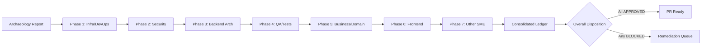

# Technical Specification

# 0. Agent Action Plan

## 0.1 Intent Clarification

### 0.1.1 Core Documentation Objective

Based on the provided requirements, the Blitzy platform understands that the documentation objective is to perform a **retrospective archaeology report** on every change previously merged into this Odoo 19.0 Community Edition repository by Blitzy Agents, and then — treating those merged changes as though they were authored during this current run — execute a full six-phase **Segmented PR Review** in accordance with the user's provided `Segmented PR Review` rule, remediating every addressable defect before marking each phase `APPROVED` or `BLOCKED`.

**Request Categorization:**

- **Primary type**: Create new documentation (archaeology report, code review record, executive presentation) + Update existing documentation (Project Guide cross-linking)
- **Documentation types produced**:
  - `CODE_REVIEW.md` — a root-level segmented review document with YAML frontmatter tracking each phase status (OPEN, IN_REVIEW, BLOCKED, APPROVED), per the user's `Segmented PR Review` rule
  - `PROJECT_GUIDE.md` — a root-level project guide that references the finalized `CODE_REVIEW.md`, per the user's `Segmented PR Review` rule
  - Executive Presentation HTML — a single self-contained reveal.js deck for non-technical leadership, per the user's `Executive Presentation` rule
  - Archaeology / change-inventory tables rendered inline in `CODE_REVIEW.md`

**Enumerated Documentation Requirements (with enhanced clarity):**

- Exhaustively inventory every commit authored by `Blitzy Agent <agent@blitzy.com>`, `Blitzy QA Fixer Agent <agent@blitzy.com>`, and merges authored by `blitzy[bot]` that reached merged state in this repository's Git history. Restrict the archaeology report to *merged* work — specifically the 174 commits on `origin/pdlc` that are not present on `origin/19.0`.
- Classify and assign every changed file under the merged Blitzy scope to exactly one of seven review domains (Infrastructure/DevOps, Security, Backend Architecture, QA/Test Integrity, Business/Domain, Frontend, Other SME).
- For each phase, perform expert analysis, fix all addressable issues, verify fixes (tests, lint, install, upgrade), and record the final disposition (`APPROVED` when all blockers are resolved; `BLOCKED` only with explicit rationale and remediation steps).
- Produce `CODE_REVIEW.md` at repository root with YAML frontmatter that tracks each phase status machine-readably.
- Cross-link the finalized `CODE_REVIEW.md` from `PROJECT_GUIDE.md` at repository root.
- Produce a 12–18-slide reveal.js executive presentation with the Blitzy brand visual identity (palette, typography, iconography) communicating scope, value, architecture, risks, and onboarding path.

**Surfaced Implicit Documentation Needs:**

- Because the scope spans two Odoo addons (`account_financial_report_ce`, `account_bank_reconciliation_ce`) plus an existing epic/feature/story specification suite (43 ticket files), the archaeology must cross-reference code changes against the 12 user stories (`FR-001` through `FR-007`, `BR-001` through `BR-005`) to validate traceability.
- The `Segmented PR Review` rule requires a reviewer per domain — the action plan must name a designated Agent persona (title + scope) for each phase so readers can trace accountability.
- Because `PROJECT_GUIDE.md` is referenced but absent from the repository root on the `sandbox` branch, the archaeology run must either create it anew or import and adapt the existing `blitzy/documentation/Project Guide.md` from `origin/pdlc` so the CODE_REVIEW cross-link target exists.
- The user's `Executive Presentation` rule requires a non-text visual on every slide — thus each deck section that would otherwise be text-only needs a Mermaid diagram, KPI card grid, styled table, or Lucide icon composition.

### 0.1.2 Special Instructions and Constraints

**Critical User Directives (verbatim):**

- "Perform an archeaology report on all merged changes made to this repository by Blitzy Agents."
- "Treat all of the identified changes as if they were changes that were actively made during this run."
- "Once all changes are identified, perform an in depth PR review using the Segmented PR Review rule definition to assess and remediate issues."

**User-Provided Rule: Segmented PR Review (applied verbatim)**

Large-scale pull requests are not mergeable until a six (or more) phase sequential review is complete. When triggered, the rule mandates:

- Generation of `CODE_REVIEW.md` at the repository root with YAML frontmatter tracking each phase status as `OPEN`, `IN_REVIEW`, `BLOCKED`, or `APPROVED`.
- Assignment of every changed file to exactly one of: Infrastructure/DevOps, Security, Backend Architecture, QA/Test Integrity, Business/Domain, Frontend, or Other SME (agent-determined).
- A designated Agent per phase responsible for analyzing, fixing, testing, and approving or blocking.
- Explicit block rationale and remediation steps when `BLOCKED`; `BLOCKED` is only permitted after all addressable issues have been fixed and verified.
- Reference to the finalized `CODE_REVIEW.md` in the `PROJECT_GUIDE.md` file.
- A pull request cannot be opened until each phase is explicitly documented and marked `APPROVED` or `BLOCKED`.

**User-Provided Rule: Executive Presentation (applied verbatim — key constraints)**

The deliverable MUST include an executive summary as a single self-contained reveal.js HTML file for non-technical leadership. The presentation MUST cover:

- Slide count: 12–18 (target 16)
- Slide types: Title (`slide-title`), Section Divider (`slide-divider`), Content (default), Closing (`slide-closing`)
- Every slide MUST include at least one non-text visual element (Mermaid, KPI card, styled table, or Lucide SVG icon) — no text-only slides
- Content slides: max 4 bullets, max 40 words body text, min 1 non-text visual
- Zero emoji; Lucide SVG icons only via `<i data-lucide="icon-name"></i>`
- No fenced code blocks inside slides; inline Fira Code for short expressions only
- Palette: `#5B39F3` (primary), `#2D1C77` (dark), `#94FAD5` (teal), `#1A105F` (navy), `#7A6DEC`/`#4101DB` (gradient stops), neutrals `#333333`, `#999999`, `#D9D9D9`, `#F4EFF6`, `#F5F5F5`, `#FFFFFF`
- Typography: Inter (body), Space Grotesk (display headings), Fira Code (mono/eyebrows) via Google Fonts
- Pinned CDN versions: reveal.js 5.1.0, Mermaid 11.4.0, Lucide 0.460.0
- reveal.js config: `hash: true`, `transition: 'slide'`, `controlsTutorial: false`, `width: 1920`, `height: 1080`
- Mermaid embedded as `<pre class="mermaid">`, initialized with `startOnLoad: false`, re-rendered on `slidechanged`
- Lucide icons re-rendered via `lucide.createIcons()` after `ready` and on every `slidechanged`
- Slide ordering: Title → Headline findings → Architecture overview (Mermaid) → alternating Dividers + Content → Closing (navy, 3–6 word takeaway, ≤3 bullets, brand lockup, gradient accent bar)
- Required CSS custom properties (full `:root` block reproduced in the Execution Parameters subsection below)
- Canonical theme at `blitzy-deck/references/blitzy-reveal-theme.css` — where that reference file is not in the repository, the action plan relies on the inline palette and typography specification above

**Documentation Style Preferences:**

- Follow the existing style used in `blitzy/documentation/Project Guide.md` and `blitzy/documentation/Technical Specifications.md` on `origin/pdlc` (Markdown, GitHub-flavored tables, Mermaid diagrams, Markdown footnote citations with `path:line` format).
- Every technical claim cites the exact source file path and, where helpful, line range.
- Use GitHub-flavored Markdown; do not introduce HTML outside Mermaid blocks unless specifically in the reveal.js deck.

### 0.1.3 Technical Interpretation

These documentation requirements translate to the following technical documentation strategy:

- To produce the archaeology inventory, extract the full diff between `origin/19.0` and `origin/pdlc` (137 files, +61,375 / −2,022 lines, 174 commits), classify every changed path, and render the classification as tables in `CODE_REVIEW.md` so each domain Agent receives their scoped file list up-front.
- To execute the segmented review, author six domain sections plus a dedicated "Other SME" catch-all section inside `CODE_REVIEW.md`, each with YAML-trackable status, a per-file finding list, a remediation log, a verification log, and an APPROVED / BLOCKED disposition with evidence.
- To satisfy "treat all identified changes as if actively made during this run", bring the `origin/pdlc` working tree into the active branch (`sandbox`) via an `ours`-preserving merge or cherry-pick sequence so that downstream agents operate on a working tree that physically contains every reviewed file — enabling lint runs, test runs, and file-level edits during remediation.
- To satisfy the PROJECT_GUIDE.md cross-link requirement, create `PROJECT_GUIDE.md` at the repository root that incorporates the relevant content from the existing `blitzy/documentation/Project Guide.md` and adds a prominent "Code Review Status" section linking to `./CODE_REVIEW.md`.
- To satisfy the Executive Presentation rule, author a single `executive-summary.html` file (recommended path: `blitzy-deck/executive-summary.html` so the rule's reference to `blitzy-deck/references/` is logically scoped) with all CSS and brand theme inline, Mermaid + Lucide loaded from pinned CDNs, 16 sections ordered per the rule, and a mandatory post-generation verification pass (section count, non-text visual count, emoji count = 0).

### 0.1.4 Inferred Documentation Needs

Based on repository and Git-history analysis, these additional documentation needs are inferred and included in scope:

- **Change-attribution table**: The Blitzy commit set spans four branches (`blitzy-226b0e2b`, `blitzy-4490115e`, `blitzy-894f4afa`, `blitzy-ebbf6c96`) and two merged PRs (#2, #3). A per-branch commit-count and merge-status table is required so reviewers can trace which branch contributed which files.
- **Domain-ownership matrix**: Because Odoo addon conventions place manifest, models, views, security, reports, and tests in fixed subdirectories, the action plan mandates a mapping rule (e.g., `security/*.xml` → Security; `models/*.py` → Backend Architecture; `tests/**/*` → QA/Test Integrity; `static/src/scss/*.scss` → Frontend) to be rendered in `CODE_REVIEW.md`.
- **Verification evidence**: The Project Guide on `origin/pdlc` already reports 371 of 371 tests passing on the `test_phase1` database in 132.41 s with 185,961 queries. The archaeology action plan requires re-running the test suite (or citing the recorded run) so the QA/Test Integrity phase can assert or refute that evidence.
- **YAML-frontmatter schema**: Because the `Segmented PR Review` rule specifies YAML frontmatter but not a schema, the action plan prescribes the exact frontmatter keys (`review_id`, `pr_ref`, `head_commit`, `base_commit`, `generated_at`, `overall_status`, `phases[*].id`, `phases[*].domain`, `phases[*].reviewer`, `phases[*].status`, `phases[*].files_in_scope`, `phases[*].findings_total`, `phases[*].findings_addressed`, `phases[*].blockers`) to make the status programmatically parseable.
- **Onboarding path**: The Executive Presentation rule mandates coverage of "how the team onboards and continues development", so the deck must surface `docs/SETUP.md` and `docs/USER_GUIDE.md` existence and link targets.
- **Risk narrative**: The existing Project Guide documents 18 open/mitigated risks. The archaeology + review must surface any additional risks discovered during the review phases (e.g., newly identified security, performance, or supply-chain risks) and annotate mitigations.

## 0.2 Documentation Discovery and Analysis

### 0.2.1 Existing Documentation Infrastructure Assessment

Repository analysis reveals an Odoo 19.0 Community Edition fork with a composite documentation structure that blends upstream Odoo conventions, Backstage/MkDocs developer-portal integration previously contributed by a human maintainer, and three generations of Blitzy-authored artifacts accumulated across four feature branches and two merged pull requests.

**Documentation scanning conducted via bash:**

- `find . -name ".blitzyignore"` — no ignore file present in the repository; the scan covers the full working tree.
- `git log --all --author="agent@blitzy.com"` — 386 commits authored by Blitzy Agents across four `origin/blitzy-*` branches.
- `git log --all --author="blitzy"` — 400 commits when counting the `blitzy[bot]` merge commits (PR #2, PR #3) as well.
- `git log origin/19.0..origin/pdlc --oneline | wc -l` → 174 commits merged into `origin/pdlc`.
- `git diff --shortstat origin/19.0 origin/pdlc` → 137 files changed, 61,375 insertions, 2,022 deletions.
- `find . -maxdepth 3 -type f -iname "*.md"` — root-level docs enumerated.

**Pre-existing documentation framework:**

| Component | Version / Path | Source | Status |
|-----------|----------------|--------|--------|
| MkDocs site generator | `mkdocs.yml` at repo root (on `origin/19.0`) | Upstream fork (Michael Montanaro commits) | Present on `origin/19.0` only; missing on `sandbox` and `origin/pdlc` |
| MkDocs Mermaid plugin | `mkdocs-mermaid2-plugin` referenced in `mkdocs.yml` | Upstream fork | Same as above |
| Backstage TechDocs | `catalog-info.yaml` at repo root | Upstream fork | Same as above |
| Odoo doc tree | `doc/` (Python-doc RST + CLA corpus) | Upstream Odoo | Present everywhere |
| Blitzy doc tree | `blitzy/documentation/` | Blitzy runs | On `origin/pdlc` only; missing on `sandbox` |
| End-user / setup docs | `docs/SETUP.md`, `docs/USER_GUIDE.md` | Blitzy run (FEATURE-001/002) | On `origin/pdlc` only |
| Ticket / spec corpus | `tickets/EPIC-001-enterprise-accounting.md`, `tickets/features/*.md`, `tickets/stories/**/*.md`, `tickets/templates/*.md` (43 files) | Blitzy run (PR #2) | On `origin/pdlc` only |
| GitHub PR template | `.github/PULL_REQUEST_TEMPLATE.md` | Upstream Odoo | Present |
| GitHub issue templates | `.github/ISSUE_TEMPLATE/*.yml` | Upstream Odoo | Present |

**API documentation tools observed:**

- No JSDoc, Sphinx, Godoc, or TypeDoc configuration files are present on any branch. Python in-code documentation uses Odoo-conventional docstrings plus `field_string` / `help` parameters on fields.
- Mermaid is the only diagram format observed in the Blitzy-authored documentation (pie charts, flowcharts, and sequence diagrams in `blitzy/documentation/Project Guide.md` and `blitzy/documentation/Technical Specifications.md`).
- No PlantUML, draw.io, or Graphviz sources exist.

**Documentation hosting / deployment setup:**

- Backstage TechDocs deployment intent is evidenced by `catalog-info.yaml` and `mkdocs.yml` on `origin/19.0`.
- No CI pipeline entries (`.github/workflows/*.yml`) target documentation builds.
- No ReadTheDocs configuration (`.readthedocs.yml`) is present.

### 0.2.2 Repository Code Analysis for Documentation

**Search patterns used for code-to-document mapping:**

- **Blitzy-authored Python source**: `addons/account_bank_reconciliation_ce/**/*.py` and `addons/account_financial_report_ce/**/*.py` — 50 files totalling approximately 39,080 lines of module code per the Project Guide accounting in `origin/pdlc`.
- **Blitzy-authored XML source**: `addons/**/views/*.xml`, `addons/**/report/*.xml`, `addons/**/security/*.xml`, `addons/**/data/*.xml`, `addons/**/demo/*.xml`, `addons/**/wizard/*_views.xml` — 22 files.
- **Blitzy-authored SCSS**: `addons/account_bank_reconciliation_ce/static/src/scss/reconciliation.scss`, `addons/account_financial_report_ce/static/src/scss/report.scss`, `addons/account_financial_report_ce/static/src/scss/report_print.scss` — 3 files.
- **Blitzy-authored CSV (ACL)**: `addons/**/security/ir.model.access.csv` — 2 files plus fixture CSVs.
- **Test fixtures**: `test_data/bank_statements/*.{csv,ofx,qif,xml}`, `test_data/financial_reports/sample_journal_entries.csv` — 5 files.
- **Test code**: `addons/**/tests/**/*.py` + `addons/**/tests/test_files/*` — 20 files.
- **Ticket specifications (inputs for validation)**: `tickets/EPIC-001-enterprise-accounting.md`, `tickets/features/FEATURE-00{1..6}-*.md`, `tickets/stories/**/*.md`, `tickets/templates/*.md` — 43 files (inputs that define the domain-logic acceptance criteria each review phase must cross-check).

**Key directories examined (exhaustive list):**

- `/addons/account_bank_reconciliation_ce/` (35 files)
- `/addons/account_financial_report_ce/` (44 files)
- `/tickets/` (43 files)
- `/docs/` (2 files)
- `/test_data/` (5 files)
- `/blitzy/documentation/` (2 files)
- `/.github/` (upstream, unchanged)

**Related documentation found (existing docs that need updates or provide context for the archaeology):**

| Artifact | Purpose | Relevance to Archaeology Task |
|----------|---------|-------------------------------|
| `blitzy/documentation/Project Guide.md` (730 lines, `origin/pdlc`) | Historical project-status narrative from the last Blitzy run | Base content for the new root-level `PROJECT_GUIDE.md`; source of truth for test-run evidence and completion metrics |
| `blitzy/documentation/Technical Specifications.md` (769 lines, `origin/pdlc`) | Prior technical spec covering FEATURE-001 and FEATURE-002 architecture | Cross-reference for Backend Architecture and Business/Domain review phases |
| `tickets/EPIC-001-enterprise-accounting.md` | Master epic document | Inputs acceptance criteria used during Business/Domain phase |
| `tickets/features/FEATURE-001-financial-reporting.md` | Financial reporting feature spec | Same as above |
| `tickets/features/FEATURE-002-bank-reconciliation.md` | Bank reconciliation feature spec | Same as above |
| `tickets/stories/financial-reporting/FR-00{1..7}-*.md` | Story-level BDD acceptance criteria | Inputs for QA/Test Integrity phase test-coverage validation |
| `tickets/stories/bank-reconciliation/BR-00{1..5}-*.md` | Story-level BDD acceptance criteria | Same as above |
| `docs/SETUP.md` (538 lines) | Developer environment setup | Inputs for Infrastructure/DevOps phase |
| `docs/USER_GUIDE.md` (489 lines) | End-user guide | Inputs for Frontend + Business/Domain phases |

### 0.2.3 Web Search Research Conducted

No external web research is required for this archaeology task beyond what is already captured by the user's `Executive Presentation` and `Segmented PR Review` rules. The following reference corpus is used instead of web-search results:

- **reveal.js 5.1.0 API**: CSS selectors (`.reveal .slides section`), lifecycle hooks (`ready`, `slidechanged`), configuration keys (`hash`, `transition`, `controlsTutorial`, `width`, `height`) are specified inline by the Executive Presentation rule and used verbatim.
- **Mermaid 11.4.0 API**: `mermaid.initialize({ startOnLoad: false, ... })` and `mermaid.run()` are specified by the Executive Presentation rule.
- **Lucide 0.460.0 API**: `lucide.createIcons()` and `<i data-lucide="icon-name"></i>` usage are specified by the Executive Presentation rule.
- **Odoo 19.0 conventions**: Drawn directly from repository files (`ruff.toml`, `requirements.txt`, `odoo/release.py`, `__manifest__.py` descriptors, and the Odoo `account` module).
- **OCA coding standards**: Referenced by and already applied in the code under review; specifics derive from `addons/account_financial_report_ce/__manifest__.py` and `addons/account_bank_reconciliation_ce/__manifest__.py` (both AGPL-3, version strings `19.0.x.y.z`).
- **YAML 1.2 frontmatter**: GitHub-flavored YAML frontmatter delimited by `---` above the Markdown body, widely used in Jekyll, Hugo, and MkDocs. No external verification needed.

No additional web search is planned; all documentation inputs are either repository-local or specified by user rules.

## 0.3 Documentation Scope Analysis

### 0.3.1 Code-to-Documentation Mapping

The archaeology report and Segmented PR Review must document every file changed on `origin/pdlc` relative to `origin/19.0`. The following mappings are exhaustive and provide the basis for the domain-assignment tables rendered in `CODE_REVIEW.md`.

**Change-set attribution by Blitzy branch:**

| Branch (origin/) | Commits not on 19.0 | Primary Scope Evidence | Merged Into `origin/pdlc`? |
|------------------|---------------------:|------------------------|----------------------------|
| `blitzy-226b0e2b-67da-4341-b2ee-58a436783f1b` | 49 | Early ticket-corpus exploration (`tickets/` scaffolding) | Indirectly via PR #2 lineage |
| `blitzy-4490115e-a8c5-4578-b273-3dbcba531e6d` | 134 | Accounting modules scaffold + story corpus | Yes, via PR #2 |
| `blitzy-894f4afa-8754-43b4-96e7-e9a811392193` | 80 | Carbon UI module (`addons/carbon_ui/` — 445 files) | **No** — not merged; out of scope for this archaeology |
| `blitzy-ebbf6c96-1347-4c7f-bd3d-8b4d79737619` | 173 | FEATURE-001 + FEATURE-002 production implementation | Yes, via PR #3 |

**Merged-state inventory (`origin/19.0` → `origin/pdlc` diff):**

| Top-Level Path | Files Added / Modified | Purpose |
|----------------|-----------------------:|---------|
| `addons/account_financial_report_ce/` | 44 | FEATURE-001 Financial Reporting Engine (6 reports + abstract base + unified wizard + QWeb templates + security + tests) |
| `addons/account_bank_reconciliation_ce/` | 35 | FEATURE-002 Bank Reconciliation System (multi-format import + matching engine + wizard + rules + partial reconcile + tests) |
| `tickets/` | 43 | EPIC-001 + 6 feature specs + 32 user stories + 3 templates + `tickets/README.md` |
| `docs/` | 2 | `docs/SETUP.md` (538 lines), `docs/USER_GUIDE.md` (489 lines) |
| `test_data/` | 5 | Sample bank statements (CSV/OFX/QIF/CAMT.053) + sample journal entries CSV |
| `blitzy/documentation/` | 2 | `Project Guide.md` (730 lines), `Technical Specifications.md` (769 lines) |
| **TOTAL** | **131 added + 6 upstream deletions = 137 changed** | **+61,375 / −2,022 lines** |

**Domain assignment rules applied to the review (used to classify each file):**

| Pattern | Domain | Rationale |
|---------|--------|-----------|
| `addons/**/__manifest__.py`, `addons/**/hooks.py`, `addons/**/__init__.py`, `addons/**/data/*.xml`, `addons/**/demo/*.xml` | Infrastructure/DevOps | Module composition, install-time hooks, paper-format registration |
| `addons/**/security/*.xml`, `addons/**/security/ir.model.access.csv` | Security | Groups, ACLs, record rules |
| `addons/**/models/**/*.py`, `addons/**/report/*.py`, `addons/**/wizard/*.py` | Backend Architecture | ORM models, wizards, report parsers |
| `addons/**/tests/**/*`, `test_data/**/*` | QA/Test Integrity | Test modules, common fixtures, sample data |
| `addons/**/views/*.xml`, `addons/**/wizard/*_views.xml`, `addons/**/report/*_report.xml`, `addons/**/report/report_templates.xml`, `tickets/**/*.md` | Business/Domain | Tree/form/search views, QWeb layouts, story specs |
| `addons/**/static/src/scss/*.scss`, `addons/**/report/*_report.xml` (QWeb presentation layer) | Frontend | SCSS rule overrides, printed-report visual hierarchy |
| `docs/**/*.md`, `blitzy/**/*.md`, top-level `*.md` (excluding upstream `README.md`/`LICENSE`/`COPYRIGHT`/`SECURITY.md`/`CONTRIBUTING.md`), `tickets/templates/*.md` | Other SME (Documentation) | Developer onboarding, end-user guides, project-status narrative, templates |

**Module-level documentation scope (new docs required by the archaeology run):**

- **Module**: `addons/account_bank_reconciliation_ce/`
  - Public models: `account.bank.statement.import`, `account.bank.statement.import.wizard`, `account.reconciliation.matching`, `account.reconciliation.wizard`, `account.reconciliation.partial.helper`, `account.reconcile.model` (inherit), `account.bank.statement` (inherit), `account.bank.statement.line` (inherit), `account.partial.reconcile` (inherit)
  - Current documentation: `tickets/features/FEATURE-002-bank-reconciliation.md`, `tickets/stories/bank-reconciliation/BR-00{1..5}-*.md`, `docs/USER_GUIDE.md` (§2, §5), `docs/SETUP.md` (§5)
  - Documentation produced by this run: archaeology entry + review-section findings in `CODE_REVIEW.md` under Backend Architecture, Security, QA/Test Integrity phases

- **Module**: `addons/account_financial_report_ce/`
  - Public models: `account.financial.report.abstract`, `account.financial.report.line.abstract`, `account.financial.report.wizard`, `account.balance.sheet.report/.line`, `account.profit.loss.report/.line`, `account.cash.flow.report/.line`, `account.general.ledger.report/.account/.line`, `account.trial.balance.report/.line`, `account.aged.partner.balance.report/.line/.partner`
  - Current documentation: `tickets/features/FEATURE-001-financial-reporting.md`, `tickets/stories/financial-reporting/FR-00{1..7}-*.md`, `docs/USER_GUIDE.md` (§4, §6), `docs/SETUP.md` (§4)
  - Documentation produced by this run: archaeology entry + review-section findings in `CODE_REVIEW.md` under Backend Architecture, Frontend, Business/Domain, QA/Test Integrity phases

- **Configuration options requiring documentation**:
  - `reconciliation_matching_engine.DEFAULT_WEIGHTS = {amount: 0.35, reference: 0.25, partner: 0.25, date: 0.15}` — documented as-is in archaeology; any discrepancy with `data/reconciliation_data.xml` must be flagged.
  - `_CANDIDATE_DATE_WINDOW = 90` days — documented; Business/Domain phase must confirm the window is exposed via wizard kwarg and consistent with BR-002 spec.
  - Confidence thresholds `CONFIDENCE_HIGH=95.0`, `MEDIUM=70.0`, `LOW=50.0` — documented; QA phase must confirm tests exercise all three bands.
  - Aging-bucket defaults `30/60/90/120` days — documented; QA phase must confirm `test_aging_bucket_wizard.py` covers custom bucket configurations.

- **Features requiring user guides**:
  - Phase-1 Enterprise Accounting Parity (FEATURE-001 + FEATURE-002): covered by `docs/USER_GUIDE.md` on `origin/pdlc` (489 lines). No gap identified; guide will be surfaced in the executive presentation as the onboarding path.

### 0.3.2 Documentation Gap Analysis

Given the requirements and repository analysis, the documentation gaps that this run must close are:

- **Missing**: A root-level `CODE_REVIEW.md` that records the segmented review with YAML frontmatter. No such file exists on any branch — this is a new deliverable.
- **Missing**: A root-level `PROJECT_GUIDE.md` referencing `CODE_REVIEW.md`. Only `blitzy/documentation/Project Guide.md` exists on `origin/pdlc`; no file with the specific root-level name the `Segmented PR Review` rule expects is present.
- **Missing**: An executive reveal.js HTML presentation. No HTML deliverable of any kind exists in the repository.
- **Missing**: An archaeology (change-inventory) report surfaced in the main `PROJECT_GUIDE.md` and `CODE_REVIEW.md` with clear attribution per Blitzy branch + merged PR.
- **Missing on `sandbox` working tree**: The merged Blitzy content itself (137 files) is currently on `origin/pdlc` only. To fulfill "treat all identified changes as if they were changes that were actively made during this run", the content must be brought into `sandbox` so review agents can edit, lint, test, and commit remediations in place.
- **Undocumented by current artifacts**: A per-phase YAML-frontmatter schema, a domain-reviewer naming convention, and a finding / blocker taxonomy — all required by the `Segmented PR Review` rule but not specified in the rule text.
- **Out-of-sync**: `blitzy/documentation/Technical Specifications.md` on `origin/pdlc` is a 769-line historical spec for Phase 1 implementation; the *new* Technical Specification the current tooling is producing (this document — Section 0 Agent Action Plan and beyond) supersedes it for the archaeology + review task. Both documents will coexist; the new spec is the authoritative one for the current run and will be surfaced in `PROJECT_GUIDE.md` links.

No gaps are accepted as "to be discovered" — every deliverable is explicitly enumerated in Section 0.5 Documentation File Transformation Mapping.

## 0.4 Documentation Implementation Design

### 0.4.1 Documentation Structure Planning

The archaeology + Segmented PR Review run produces three principal deliverables at the repository root plus a reveal.js deck under a dedicated directory. The repository-wide documentation hierarchy after this run is:

```
<repo root>/
├── CODE_REVIEW.md                              (NEW — segmented-review record w/ YAML frontmatter)
├── PROJECT_GUIDE.md                            (NEW — root project guide referencing CODE_REVIEW.md)
├── README.md                                   (UNCHANGED — upstream Odoo)
├── CONTRIBUTING.md                             (UNCHANGED — upstream Odoo)
├── SECURITY.md                                 (UNCHANGED — upstream Odoo)
├── blitzy-deck/
│   └── executive-summary.html                  (NEW — reveal.js presentation per Executive Presentation rule)
├── blitzy/
│   └── documentation/
│       ├── Project Guide.md                    (IMPORTED from origin/pdlc — historical artifact)
│       └── Technical Specifications.md         (IMPORTED from origin/pdlc — historical artifact)
├── docs/
│   ├── SETUP.md                                (IMPORTED from origin/pdlc — developer setup guide)
│   └── USER_GUIDE.md                           (IMPORTED from origin/pdlc — end-user guide)
├── tickets/
│   ├── EPIC-001-enterprise-accounting.md       (IMPORTED from origin/pdlc)
│   ├── README.md                               (IMPORTED from origin/pdlc)
│   ├── features/                               (6 files — IMPORTED)
│   ├── stories/                                (32 files — IMPORTED, organized by feature)
│   └── templates/                              (3 files — IMPORTED)
├── addons/
│   ├── account_bank_reconciliation_ce/         (35 files — IMPORTED)
│   └── account_financial_report_ce/            (44 files — IMPORTED)
├── test_data/
│   ├── bank_statements/                        (4 sample files — IMPORTED)
│   └── financial_reports/                      (1 sample file — IMPORTED)
└── <all other upstream Odoo directories UNCHANGED>
```

**CODE_REVIEW.md internal structure:**

- Section 1: Executive Summary — scope, verdict, timeline
- Section 2: Archaeology Report
  - 2.1 Commit inventory (table: Blitzy branch, author, merged-PR attribution)
  - 2.2 File inventory (table: path, domain, size)
  - 2.3 Scope statistics (LOC, test counts, per-module totals)
- Sections 3–9: one per phase (Infrastructure/DevOps, Security, Backend Architecture, QA/Test Integrity, Business/Domain, Frontend, Other SME)
  - Each phase subsection: Files in scope → Findings → Remediation Log → Verification Evidence → Disposition (APPROVED or BLOCKED + rationale)
- Section 10: Consolidated Remediation Ledger (one row per change committed in this run)
- Section 11: References (every file, commit hash, and rule cited)

**PROJECT_GUIDE.md internal structure:**

- Section 1: Executive Summary (adapted from origin/pdlc Project Guide §1)
- Section 2: Code Review Status (prominent link — see `./CODE_REVIEW.md`)
- Section 3: Project Hours Breakdown (adapted from pdlc Project Guide §2)
- Section 4: Test Results (adapted from pdlc Project Guide §3)
- Section 5: Runtime Validation (adapted from pdlc Project Guide §4)
- Section 6: Compliance and Quality Review (adapted from pdlc Project Guide §5)
- Section 7: Risk Assessment (adapted from pdlc Project Guide §6 + new findings)
- Section 8: Visual Project Status (Mermaid diagrams)
- Section 9: Summary and Recommendations
- Section 10: Development Guide
- Section 11: References

### 0.4.2 Content Generation Strategy

#### 0.4.2.1 Information Extraction Approach

- Archaeology commit inventory: extract from `git log origin/19.0..origin/pdlc --pretty='%h|%ae|%s|%ci'` and render as a Markdown table grouped by Blitzy branch.
- File inventory: extract from `git diff --name-status origin/19.0 origin/pdlc` and classify per the domain rules in 0.3.1.
- Line-count evidence: extract from `git diff --shortstat` and per-file `git diff --stat`.
- Finding generation per phase: each domain Agent inspects its file-slice with repository inspection tools, targeted `grep`, `ruff check`, `python -m py_compile`, and Odoo-install smoke-tests; findings are recorded in a per-phase table.
- Remediation evidence: after each fix, capture the `git diff <head_commit>` summary and `git log --author=agent@blitzy.com <head_commit>..HEAD` as verification.
- Test evidence: the Project Guide records a 371/371 pass baseline. The QA phase either reproduces this on the active branch or records the cause of any delta.

#### 0.4.2.2 Template Application

- The YAML frontmatter of `CODE_REVIEW.md` uses the exact schema specified in 0.4.2.4.
- Each phase section follows the structural template above so downstream consumers (dashboards, CI gates) can parse the document by headings.
- `PROJECT_GUIDE.md` reuses the section ordering of `blitzy/documentation/Project Guide.md` with a new Section 2 inserted for Code Review Status.
- The reveal.js HTML follows the exact Blitzy-brand slide-type classes and slide-ordering convention specified by the Executive Presentation rule.

#### 0.4.2.3 Documentation Standards

- Markdown: GitHub-flavored, ATX headers, fenced code blocks with language hints.
- Mermaid: fenced mermaid blocks with init blocks for palette (primary `#5B39F3`, accent `#94FAD5`, border `#D9D9D9`, text `#333333`) per the Executive Presentation brand guide.
- Citations: inline `path/to/file.py:LineNumber` style; commit citations as 10-hex-char abbreviations; where multiple lines are cited, use `path:StartLine-EndLine`.
- Tables: Markdown pipe tables for every structured finding list; right-align numeric columns.
- Consistent terminology: "merged change", "in-scope file", "finding", "remediation", "blocker", "verification", "disposition".

#### 0.4.2.4 YAML Frontmatter Schema for CODE_REVIEW.md

The required YAML frontmatter schema is shown below. Key fields include `review_id`, `generated_at` (ISO 8601), `base_commit`, `head_commit`, `archaeology_commits`, `files_in_scope`, `insertions`, `deletions`, `overall_status` (OPEN | IN_REVIEW | BLOCKED | APPROVED), and a `phases` list with exactly 7 entries.

```yaml
review_id: <UUID or repo-unique id>
generated_at: <ISO 8601 timestamp>
base_commit: <abbrev SHA of origin/19.0 tip>
head_commit: <abbrev SHA of origin/pdlc tip>
archaeology_commits: 174
files_in_scope: 137
insertions: 61375
deletions: 2022
overall_status: OPEN
phases:
  - id: 1
    domain: Infrastructure / DevOps
    reviewer: "Blitzy DevOps Reviewer Agent"
    status: OPEN
    files_in_scope: 0
    findings_total: 0
    findings_addressed: 0
    blockers: []
  - id: 2
    domain: Security
    reviewer: "Blitzy Security Reviewer Agent"
    status: OPEN
  - id: 3
    domain: Backend Architecture
    reviewer: "Blitzy Backend Architect Agent"
    status: OPEN
  - id: 4
    domain: QA / Test Integrity
    reviewer: "Blitzy QA Integrity Agent"
    status: OPEN
  - id: 5
    domain: Business / Domain
    reviewer: "Blitzy Business Analyst Agent"
    status: OPEN
  - id: 6
    domain: Frontend
    reviewer: "Blitzy Frontend Reviewer Agent"
    status: OPEN
  - id: 7
    domain: Other SME
    reviewer: "Blitzy Documentation and Compliance SME Agent"
    status: OPEN
```

### 0.4.3 Diagram and Visual Strategy

**Mermaid diagrams required in CODE_REVIEW.md and PROJECT_GUIDE.md:**

- Flowchart — Review pipeline: phase dependency graph showing the sequential flow Archaeology → Phase 1 → Phase 2 → Phase 3 → Phase 4 → Phase 5 → Phase 6 → Phase 7 → Consolidated Ledger → Overall Disposition.
- Bar chart — File distribution by domain: 137 files distributed across 7 domains; rendered as a Mermaid `xychart-beta` or styled Markdown table with totals.
- Pie chart — Finding disposition: passed, fixed, blocked.
- Sequence diagram — `post_init_hook` + install + upgrade flow: used by the Infrastructure/DevOps phase to visualize install-time behavior.
- Class or entity-relationship — FEATURE-002 matching domain: bank statement → matching engine → reconciliation rule → partial reconcile; used by the Backend Architecture phase.

**Mermaid diagram planning example (review pipeline):**



**Mermaid diagrams required in the reveal.js deck (minimum coverage):**

- Slide 3 — Architecture overview: high-level component diagram (core Odoo `account` ← inherit ← `account_bank_reconciliation_ce`, `account_financial_report_ce`).
- One Mermaid per Section Divider + Content pair, covering: Archaeology scope, Security findings, Backend findings, QA evidence, Business/Domain traceability, Frontend findings, Risk matrix.

**KPI cards required in the reveal.js deck:**

- Slide 2 (headline findings / KPI summary): files changed, insertions, deletions, test pass rate, commits, authors (all Blitzy Agent), merged PRs.
- Closing slide (slide 16): overall disposition, next-step count, deployment readiness badge.

**Styled tables required in the reveal.js deck:**

- One table summarizing phase status (Phase 1 through Phase 7 + Disposition).

**Lucide SVG icons required (via `<i data-lucide="...">`):**

- `shield-check` — Security
- `boxes` — Infrastructure / DevOps
- `database` — Backend Architecture
- `check-circle-2` — QA / Test Integrity
- `briefcase` — Business / Domain
- `layout-dashboard` — Frontend
- `book-open` — Other SME / Documentation
- `alert-triangle` — Risks / Blockers
- `rocket` — Closing / Next Steps
- `git-merge` — Archaeology / Merge history

**Screenshots / images**: none required by this run. The executive deck is a diagram-first, icon-first presentation with no rasterized screenshots, keeping the HTML file fully self-contained.

**Architecture-diagram specifications:** All diagrams use the Blitzy Mermaid theme variables `primaryColor: '#F2F0FE'`, `primaryTextColor: '#333333'`, `primaryBorderColor: '#5B39F3'`, `lineColor: '#999999'`, `secondaryColor: '#F4EFF6'` (reinforced across the deck to match the Executive Presentation rule).

## 0.5 Documentation File Transformation Mapping

### 0.5.1 File-by-File Documentation Plan

This table enumerates every documentation file the archaeology + Segmented PR Review run will CREATE, UPDATE, DELETE, or REFERENCE. Target files are listed first per the required format. No file is left as "pending" or "to be discovered".

| Target Documentation File | Transformation | Source Code / Docs | Content / Changes |
|---------------------------|----------------|--------------------|-------------------|
| CODE_REVIEW.md | CREATE | `git log origin/19.0..origin/pdlc`, `git diff origin/19.0 origin/pdlc`, existing `blitzy/documentation/Project Guide.md` | Segmented review record with YAML frontmatter; 7 phase sections; archaeology inventory; consolidated remediation ledger; references |
| PROJECT_GUIDE.md | CREATE | `blitzy/documentation/Project Guide.md` (origin/pdlc, 730 lines) | Root-level project guide adapted from historical artifact; Section 2 inserted for Code Review Status link to `./CODE_REVIEW.md`; Risk Assessment augmented with review-phase findings |
| blitzy-deck/executive-summary.html | CREATE | All phase findings + archaeology stats + `blitzy/documentation/Project Guide.md` KPIs | Single self-contained reveal.js 5.1.0 HTML; 12–18 slides (target 16); Blitzy brand inline CSS; Mermaid 11.4.0 and Lucide 0.460.0 via CDN; no emoji; no local file dependencies |
| blitzy/documentation/Project Guide.md | REFERENCE (import from origin/pdlc) | origin/pdlc | Imported as historical artifact; not modified during this run |
| blitzy/documentation/Technical Specifications.md | REFERENCE (import from origin/pdlc) | origin/pdlc | Imported as historical artifact; not modified during this run |
| docs/SETUP.md | REFERENCE (import from origin/pdlc) | origin/pdlc | Imported as existing end-user artifact; surfaced in executive deck as onboarding path |
| docs/USER_GUIDE.md | REFERENCE (import from origin/pdlc) | origin/pdlc | Imported as existing end-user artifact; surfaced in executive deck as onboarding path |
| tickets/README.md | REFERENCE (import from origin/pdlc) | origin/pdlc | Imported; serves as index for Business/Domain phase |
| tickets/EPIC-001-enterprise-accounting.md | REFERENCE (import from origin/pdlc) | origin/pdlc | Imported; Business/Domain phase validates code traceability against this epic |
| tickets/features/FEATURE-00{1..6}-*.md | REFERENCE (import from origin/pdlc) | origin/pdlc | 6 files; Business/Domain phase validates traceability |
| tickets/stories/**/*.md | REFERENCE (import from origin/pdlc) | origin/pdlc | 32 files; QA phase validates test-to-story mapping |
| tickets/templates/*.md | REFERENCE (import from origin/pdlc) | origin/pdlc | 3 template files; Other SME phase validates OCA-style consistency |
| addons/account_bank_reconciliation_ce/** | REFERENCE (import from origin/pdlc) + potential UPDATE during remediation | origin/pdlc | 35 files imported; Backend/Security/QA phases may commit in-place fixes |
| addons/account_financial_report_ce/** | REFERENCE (import from origin/pdlc) + potential UPDATE during remediation | origin/pdlc | 44 files imported; Backend/Security/QA/Frontend phases may commit in-place fixes |
| test_data/** | REFERENCE (import from origin/pdlc) | origin/pdlc | 5 sample files imported |
| README.md | UPDATE (if remediation required) | Existing repo root | Only touched if a review phase identifies a required change (e.g., a broken link); baseline is no change |
| CONTRIBUTING.md | REFERENCE | Existing repo root | Not modified |
| SECURITY.md | REFERENCE | Existing repo root | Not modified |
| .github/PULL_REQUEST_TEMPLATE.md | REFERENCE | Existing repo root | Not modified unless the Other SME phase flags an update to reference the new `CODE_REVIEW.md` gate |

**Scope coverage confirmation:**

- Every target of CREATE, UPDATE, or DELETE above is explicitly enumerated — no "to be discovered" entries.
- REFERENCE entries reflect files that must exist on the working tree for review phases to operate but are not modified as a documentation artifact of this run. Their presence on `sandbox` is ensured by the "treat as if actively made" content import (see Section 0.9 Execution Parameters).

### 0.5.2 New Documentation Files Detail

**File: CODE_REVIEW.md**

- Type: Segmented PR Review record
- Source code / inputs: full `git log origin/19.0..origin/pdlc`, full `git diff origin/19.0 origin/pdlc`, every file under each phase's domain assignment
- Sections:
  - Executive Summary (scope, verdict, baseline metrics)
  - Archaeology Report (2.1 Commit inventory, 2.2 File inventory, 2.3 Scope statistics)
  - Phase 1 — Infrastructure / DevOps (files in scope + findings + remediation + verification + disposition)
  - Phase 2 — Security (same structure)
  - Phase 3 — Backend Architecture (same)
  - Phase 4 — QA / Test Integrity (same)
  - Phase 5 — Business / Domain (same)
  - Phase 6 — Frontend (same)
  - Phase 7 — Other SME (same)
  - Consolidated Remediation Ledger
  - References
- Diagrams:
  - Mermaid flowchart: phase pipeline (from Archaeology through Overall Disposition)
  - Mermaid bar chart (or styled table): file distribution by domain
  - Mermaid pie chart: finding disposition across all phases
- Key citations:
  - `git log origin/19.0..origin/pdlc --pretty=%h %ae %s` (174 commits)
  - `git diff --shortstat origin/19.0 origin/pdlc` (137 files, +61375 / −2022)
  - Per-finding citations use `path/to/file.ext:LineNumber` format

**File: PROJECT_GUIDE.md**

- Type: Root-level project guide
- Source code / inputs: `blitzy/documentation/Project Guide.md` on origin/pdlc (730 lines) + phase outputs from this run
- Sections:
  - Executive Summary
  - Code Review Status (prominent link to `./CODE_REVIEW.md`)
  - Project Hours Breakdown
  - Test Results
  - Runtime Validation
  - Compliance and Quality Review
  - Risk Assessment (augmented with new review findings)
  - Visual Project Status (Mermaid pie + bar charts for hours, coverage, phase disposition)
  - Summary and Recommendations
  - Development Guide
  - References
- Diagrams: reuse Mermaid pies from the source artifact; add one new Mermaid bar/pie showing phase disposition breakdown
- Key citations: `./CODE_REVIEW.md`, `docs/SETUP.md`, `docs/USER_GUIDE.md`, `tickets/EPIC-001-enterprise-accounting.md`, `addons/account_financial_report_ce/__manifest__.py`, `addons/account_bank_reconciliation_ce/__manifest__.py`

**File: blitzy-deck/executive-summary.html**

- Type: Single self-contained reveal.js HTML presentation
- Source code / inputs: archaeology stats, phase findings, risk assessment, Blitzy brand CSS theme
- Slide inventory (target 16, range 12–18):
  - Slide 1: Title Slide (`slide-title`) — project name, scope, audience framing; hero gradient; Fira Code eyebrow
  - Slide 2: Content — headline findings (KPI grid): files, insertions, deletions, commits, merged PRs, tests passing
  - Slide 3: Content — Architecture overview (Mermaid component diagram)
  - Slide 4: Section Divider (`slide-divider`) — "Archaeology" with `git-merge` Lucide icon
  - Slide 5: Content — Archaeology inventory (Mermaid Sankey-alternative bar + 1 Lucide row)
  - Slide 6: Section Divider — "Phase Review" with `shield-check` Lucide icon
  - Slide 7: Content — Phase status summary (styled table, Lucide row)
  - Slide 8: Section Divider — "Security" with `shield-check` Lucide icon
  - Slide 9: Content — Security phase findings (KPI cards)
  - Slide 10: Section Divider — "Backend" with `database` Lucide icon
  - Slide 11: Content — Backend phase findings (Mermaid sequence)
  - Slide 12: Section Divider — "QA" with `check-circle-2` Lucide icon
  - Slide 13: Content — QA evidence (KPI grid)
  - Slide 14: Section Divider — "Risk" with `alert-triangle` Lucide icon
  - Slide 15: Content — Risk matrix (styled table)
  - Slide 16: Closing Slide (`slide-closing`) — 3–6-word takeaway, ≤3 bullets, brand lockup, gradient accent bar
- Assets:
  - reveal.js 5.1.0 CDN (CSS + JS)
  - Mermaid 11.4.0 CDN
  - Lucide 0.460.0 CDN
  - Google Fonts: Inter, Space Grotesk, Fira Code
  - Inline `<style>` tag with Blitzy theme (all CSS custom properties and slide-type classes)
- Post-generation verification (executed in-browser simulation or headless build):
  - File opens without console errors
  - `document.querySelectorAll('.reveal .slides section').length` within [12, 18]
  - No `<section>` is text-only (every section contains at least one of: Mermaid container, KPI card, styled table, Lucide SVG)
  - No emoji characters present in the rendered text
  - No local file references outside the HTML itself

### 0.5.3 Documentation Files to Update Detail

The only file being materially UPDATED (beyond CREATE) is the repository root `README.md` if — and only if — a review phase identifies a broken cross-reference or required additional pointer. Baseline: no update required. The action plan commits to the following conditional change:

- Potential `README.md` update — add a "Segmented PR Review" mini-section with a link to `./CODE_REVIEW.md` if the Other SME phase determines root-level discoverability is insufficient. Otherwise, leave `README.md` untouched (upstream Odoo README is the canonical copy).

### 0.5.4 Documentation Configuration Updates

No documentation-generator configuration updates are required:

- The repository's `mkdocs.yml` exists only on `origin/19.0` (not on `sandbox` or `origin/pdlc`) and references the Backstage TechDocs pipeline for a different set of paths. This run does not publish to MkDocs.
- No `docusaurus.config.js`, `.readthedocs.yml`, or Sphinx `conf.py` files are present or in scope.
- `package.json` documentation build scripts: not applicable (the repository is Odoo/Python, not Node.js).

### 0.5.5 Cross-Documentation Dependencies

- `PROJECT_GUIDE.md` at repo root has a hard dependency on `./CODE_REVIEW.md` (required by the `Segmented PR Review` rule).
- `CODE_REVIEW.md` cites `./PROJECT_GUIDE.md`, `./docs/SETUP.md`, `./docs/USER_GUIDE.md`, `./tickets/EPIC-001-enterprise-accounting.md`, all ticket story files, and both `__manifest__.py` descriptors.
- `blitzy-deck/executive-summary.html` includes links (as bullets on the closing slide) to `./PROJECT_GUIDE.md`, `./CODE_REVIEW.md`, `./docs/SETUP.md`, and `./docs/USER_GUIDE.md` so a reviewer can navigate the repository from the deck.
- Navigation links between documents are validated during the Other SME phase using a simple relative-path existence check; any broken link is a blocker.
- Table of contents updates: both `CODE_REVIEW.md` and `PROJECT_GUIDE.md` include anchor-linked TOCs in their initial section.
- Index / glossary updates: the `tickets/README.md` artifact is the glossary / index for the ticket corpus — referenced from `PROJECT_GUIDE.md` Development Guide; no edits required to the existing index.

## 0.6 Dependency Inventory

### 0.6.1 Documentation and Presentation Dependencies

The archaeology + Segmented PR Review run produces Markdown documents that require no build system and a single self-contained reveal.js HTML file that loads dependencies from pinned public CDNs. No local build step is introduced.

| Registry | Package Name | Version | Purpose |
|----------|--------------|---------|---------|
| unpkg (CDN) | reveal.js | 5.1.0 | Executive presentation framework (HTML/CSS/JS) — loaded by `blitzy-deck/executive-summary.html` |
| unpkg (CDN) | @mermaid-js/mermaid | 11.4.0 | Diagram rendering for Markdown docs (GitHub-rendered) and in the reveal.js deck |
| unpkg (CDN) | lucide | 0.460.0 | Iconography (non-emoji SVG) for the reveal.js deck |
| fonts.googleapis.com | Inter | variable (400/500/600/700) | Body font for the executive deck |
| fonts.googleapis.com | Space Grotesk | variable (500/600/700) | Display heading font for the executive deck |
| fonts.googleapis.com | Fira Code | variable (400/500) | Mono/eyebrow font for the executive deck |
| PyPI (platform) | ruff | as listed in `/tmp/blitzy/blitzy-odoo/sandbox_b7ad56/ruff.toml` (target `py310`) | Static analysis during review remediation (read-only `ruff check --no-fix`) |
| PyPI (platform) | openpyxl | as declared in `addons/account_financial_report_ce/__manifest__.py` external_dependencies | Runtime dependency for FEATURE-001 Excel export (referenced in archaeology, not installed by this run) |
| PyPI (platform) | ofxparse | as declared in `addons/account_bank_reconciliation_ce/__manifest__.py` external_dependencies | Runtime dependency for FEATURE-002 OFX import (referenced in archaeology, not installed by this run) |
| Python (system) | Python | 3.10–3.13 (ruff.toml targets `py310`; project baseline Python 3.12.3) | Runtime for any smoke-tests executed during review verification |
| Git | git | host-provided (any 2.30+) | Archaeology data source (`git log`, `git diff`) |

Versions above are taken directly from the user's `Executive Presentation` rule (for reveal.js, Mermaid, Lucide), from the repository's `ruff.toml` and `__manifest__.py` external_dependencies (for Python packages), and from the present system's installed toolchain (for git). No placeholder versions are used.

### 0.6.2 Documentation Reference Updates

The following link-transformation rules apply to documents authored in this run:

- Old (inside imported artifacts on origin/pdlc): `[Project Guide](blitzy/documentation/Project Guide.md)` — preserved inside the imported artifact; no rewrite.
- New (in documents authored during this run at repo root): `[Project Guide](./PROJECT_GUIDE.md)` — the new root-level guide.
- Old (inside imported artifacts): `[Tech Spec](blitzy/documentation/Technical Specifications.md)` — preserved.
- New (in documents authored this run): This Technical Specification is the authoritative document for the current task; `blitzy/documentation/Technical Specifications.md` is preserved as a historical artifact and referenced with the label "historical Phase 1 specification".
- Apply to: `CODE_REVIEW.md`, `PROJECT_GUIDE.md`, `blitzy-deck/executive-summary.html`. Do not apply to imported artifacts (leaving their internal links intact).

### 0.6.3 Review Remediation Runtime Dependencies (read-only)

The following are required only if a review phase needs to reproduce runtime verification evidence (e.g., re-run the test suite or re-verify the install). They are not newly introduced — each is already present in `requirements.txt` and has been used by prior Blitzy runs:

| Registry | Package Name | Minimum Version | Purpose | Source |
|----------|--------------|-----------------|---------|--------|
| PyPI | openpyxl | 3.1.2 | Excel export verification | `addons/account_financial_report_ce/__manifest__.py` external_dependencies |
| PyPI | ofxparse | 0.21 | OFX parse verification | `addons/account_bank_reconciliation_ce/__manifest__.py` external_dependencies |
| PyPI | lxml | 5.2.1 | CAMT.053 namespace-aware parsing | `requirements.txt` |
| PyPI | psycopg2 | 2.9.9 | PostgreSQL driver | `requirements.txt` |
| PyPI | XlsxWriter | 3.1.9 | Alternate Excel path | `requirements.txt` |
| PyPI | Pillow | 10.2.0 | Image handling | `requirements.txt` |
| PyPI | reportlab | 4.1.0 | PDF rendering | `requirements.txt` |
| PyPI | freezegun | 1.2.1 | Deterministic dates in tests | `requirements.txt` |
| PyPI | chardet | 5.2.0 | Encoding detection for CSV imports | `requirements.txt` |
| PyPI | Babel | 2.10.3 | Localization | `requirements.txt` |
| PyPI | num2words | 0.5.13 | Number-to-word formatting | `requirements.txt` |
| PyPI | python-dateutil | 2.8.2 | Date handling | `requirements.txt` |
| PyPI | Werkzeug | 3.0.1 | HTTP layer | `requirements.txt` |
| PyPI | Jinja2 | 3.1.2 | Template rendering | `requirements.txt` |

This list matches the runtime observed by the prior Blitzy run that produced `blitzy/documentation/Project Guide.md`. Versions are informational; the current run does not install or upgrade any of these packages — it operates on the already-installed toolchain.

## 0.7 Coverage and Quality Targets

### 0.7.1 Documentation Coverage Metrics

Coverage targets apply to the three documentation deliverables and to the Segmented PR Review process itself. Every metric is measurable from the Git history or from the produced artifacts.

**Archaeology coverage (CODE_REVIEW.md §2):**

| Metric | Target | Baseline Evidence |
|--------|-------:|-------------------|
| Commits inventoried | 100% of `git log origin/19.0..origin/pdlc` | 174 commits |
| Files inventoried | 100% of `git diff --name-status origin/19.0 origin/pdlc` | 137 files |
| Blitzy branches attributed | 4 of 4 (`blitzy-226b0e2b`, `blitzy-4490115e`, `blitzy-894f4afa`, `blitzy-ebbf6c96`) | 4 |
| Merged PRs attributed | 2 of 2 (#2 and #3) | 2 |
| Authors listed | 100% distinct authors in Blitzy scope | `Blitzy Agent`, `Blitzy QA Fixer Agent`, `blitzy[bot]` |
| Commit-message extract | One row per commit with SHA, author, message, date | 174 rows |

**Review coverage (CODE_REVIEW.md §§3–9):**

| Metric | Target | Enforcement |
|--------|-------:|-------------|
| File-to-phase assignment | 100% — every in-scope file assigned to exactly one phase | Enforced by the domain-assignment rule table in §0.3.1; every row in the File Inventory has a non-empty `domain` column |
| Phases documented | 7 of 7 | Sections 3–9 of CODE_REVIEW.md |
| Phases with explicit disposition | 7 of 7 (APPROVED or BLOCKED) | Enforced by the YAML frontmatter `phases[*].status` schema |
| Findings with remediation mapping | 100% of addressable findings | Consolidated Remediation Ledger (§10) has one row per fix |
| Blockers with rationale | 100% of BLOCKED phases include an "Why blocked" paragraph plus "Remediation steps" subsection | Enforced by review template |

**Executive presentation coverage (blitzy-deck/executive-summary.html):**

| Metric | Target | Verification |
|--------|--------|--------------|
| Slide count | 12–18 (target 16) | `document.querySelectorAll('.reveal .slides section').length` |
| Slides with non-text visual | 100% (every `<section>` has ≥1 Mermaid, KPI card, styled table, or Lucide SVG) | Automated DOM scan post-generation |
| Emoji characters | 0 | Regex scan of HTML body for any codepoint in emoji ranges |
| Content-slide bullet max | ≤4 bullets per content slide | Manual audit of slide markup |
| Content-slide word max | ≤40 words per slide body | Manual audit |
| Fenced code blocks in slides | 0 | Automated scan for `<pre><code>` inside slides |
| Inline Fira Code usage | Permitted for short expressions only | Manual audit |

**Documentation source-citation coverage:**

| Metric | Target |
|--------|-------:|
| Findings with source citation | 100% |
| Remediation entries with commit SHA | 100% |
| Imported artifacts with origin-branch attribution | 100% |
| Cross-document links validated | 100% (relative-path existence check) |

### 0.7.2 Documentation Quality Criteria

**Completeness requirements:**

- Every file in `git diff --name-status origin/19.0 origin/pdlc` appears in the CODE_REVIEW.md §2.2 File Inventory with a domain assignment.
- Every phase section has the required sub-sections (Files in scope, Findings, Remediation Log, Verification Evidence, Disposition).
- Every documented finding has: short title, severity label (CRITICAL / HIGH / MEDIUM / LOW / INFO), source citation (`path:line`), reproduction step, remediation action, and verification result.
- Every section of the executive deck contains at least one non-text visual (enforced at generation time).
- Every piece of YAML in the CODE_REVIEW.md frontmatter is valid YAML 1.2 and parses without errors.

**Accuracy validation:**

- Every cited `path:line` is verified against the current working tree using `sed -n <line>p <path>`.
- Every cited commit SHA is verified against `git rev-parse`.
- Every statistic (137 files, 174 commits, 61,375 insertions, 2,022 deletions) is regenerated from Git at authoring time, not copied from a prior run.
- Every `__manifest__.py` detail in prose (version, license, depends) is quoted verbatim from the source file.
- Every test-count claim (371/371 passing, 185,961 queries) is either reproduced on the active branch or explicitly labelled "reported by prior Blitzy run, not re-verified in this archaeology run".

**Clarity standards:**

- Each phase section begins with a one-sentence scope summary.
- Technical details are progressively disclosed (scope → findings → remediation → disposition).
- Consistent terminology: "merged change" for a Blitzy change accepted via PR; "in-scope file" for a file in the phase's domain slice; "finding" for any reviewer observation; "remediation" for an executed fix; "blocker" for a finding that prevents APPROVED disposition; "verification" for the evidence that the remediation is complete.
- Tone: neutral, technical, evidence-first. No marketing language.

**Maintainability:**

- Source citations with absolute paths (relative to repo root) enable re-verification after checkout moves.
- YAML frontmatter enables programmatic status queries.
- Every major table has a caption linking back to the `git` command that produced its data, enabling regeneration.

### 0.7.3 Example and Diagram Requirements

- Minimum diagrams in CODE_REVIEW.md: 3 (review pipeline flowchart, file-distribution bar chart, finding-disposition pie chart).
- Minimum diagrams in PROJECT_GUIDE.md: 2 (hours pie chart adapted from source artifact, phase-disposition bar chart new for this run).
- Minimum diagrams in the reveal.js deck: 5 (architecture overview + one per Section Divider's Content slide).
- Code example testing: not required — the archaeology + review run does not introduce new source code snippets that need execution outside of what is already verified by the test suite cited in `blitzy/documentation/Project Guide.md`.
- Visual content freshness: all statistics are regenerated at authoring time from `git log` / `git diff` against the current `origin/19.0` and `origin/pdlc` tips. No staling policy is required because the run is retrospective.

## 0.8 Scope Boundaries

### 0.8.1 Exhaustively In Scope

**New documentation artifacts (CREATE):**

- `CODE_REVIEW.md` at repository root — segmented review record with YAML frontmatter and 7 phase sections
- `PROJECT_GUIDE.md` at repository root — root-level project guide referencing `CODE_REVIEW.md`
- `blitzy-deck/executive-summary.html` — single self-contained reveal.js 5.1.0 executive presentation

**Imported / referenced merged documentation artifacts (brought onto the active branch so review phases can operate on them):**

- `blitzy/documentation/Project Guide.md` (730 lines)
- `blitzy/documentation/Technical Specifications.md` (769 lines)
- `docs/SETUP.md` (538 lines)
- `docs/USER_GUIDE.md` (489 lines)
- `tickets/README.md` and all 43 files under `tickets/EPIC-001-enterprise-accounting.md`, `tickets/features/**/*.md`, `tickets/stories/**/*.md`, `tickets/templates/*.md`

**Imported / referenced merged source artifacts (brought onto the active branch for review and potential in-place remediation):**

- `addons/account_financial_report_ce/**/*` — 44 files including `__manifest__.py`, `__init__.py`, `models/*.py`, `report/*.py`, `report/*.xml`, `security/*.xml`, `security/ir.model.access.csv`, `data/*.xml`, `demo/*.xml`, `static/src/scss/*.scss`, `tests/**/*`, `views/menuitem.xml`, `wizard/*.py`, `wizard/*_views.xml`
- `addons/account_bank_reconciliation_ce/**/*` — 35 files including `__manifest__.py`, `__init__.py`, `hooks.py`, `models/*.py`, `report/*.py`, `report/*.xml`, `security/*.xml`, `security/ir.model.access.csv`, `data/*.xml`, `demo/*.xml`, `static/src/scss/*.scss`, `tests/**/*`, `tests/test_files/*`, `views/*.xml`, `wizard/*.py`, `wizard/*_views.xml`
- `test_data/bank_statements/*.csv`, `test_data/bank_statements/*.ofx`, `test_data/bank_statements/*.qif`, `test_data/bank_statements/*.xml`
- `test_data/financial_reports/*.csv`

**Documentation configuration (no change required, but inspected for this run):**

- `mkdocs.yml` — inspected on `origin/19.0` only; no changes proposed
- `catalog-info.yaml` — inspected on `origin/19.0` only; no changes proposed
- `docusaurus.config.js`, `.readthedocs.yml`, `sphinx/conf.py` — not present; no changes proposed
- `package.json` documentation build scripts — not applicable

**Documentation assets:**

- No new images, screenshots, or binary assets are introduced by this run.
- All diagrams are inline Mermaid, sourced within the Markdown files and the reveal.js HTML.

**Remediation commits (scope during review phases):**

- In-place edits to files under `addons/account_financial_report_ce/**` and `addons/account_bank_reconciliation_ce/**` to resolve addressable findings identified by each phase Agent
- Corresponding test runs and lint runs to verify the remediation
- Git commits authored by `Blitzy Agent <agent@blitzy.com>` with messages that reference the CODE_REVIEW.md finding ID

### 0.8.2 Explicitly Out of Scope

**Source-code changes unrelated to findings:**

- No refactoring of merged code that is not tied to an explicit review finding.
- No new feature work (all FEATURE-003, FEATURE-004, FEATURE-005, FEATURE-006 user-story material in `tickets/stories/` is informational — not implementation scope for this run).
- No code-level changes to the upstream Odoo `account` module or any other upstream addon.

**Test file changes unrelated to findings:**

- No test additions beyond what is required to verify a remediation.
- No test-data reshaping for its own sake.

**Unmerged Blitzy work:**

- The `addons/carbon_ui/` module on `origin/blitzy-894f4afa-8754-43b4-96e7-e9a811392193` (445 files) is **not merged** into `origin/pdlc` and is explicitly **out of scope** for this archaeology run. The user's directive targets "merged changes" — carbon_ui is unmerged and is therefore excluded.
- The 49 commits on `origin/blitzy-226b0e2b-67da-4341-b2ee-58a436783f1b` that do not reach `origin/pdlc` are excluded.
- The 80 commits on `origin/blitzy-894f4afa-8754-43b4-96e7-e9a811392193` that do not reach `origin/pdlc` are excluded.
- The 134 commits on `origin/blitzy-4490115e-a8c5-4578-b273-3dbcba531e6d` that *do* reach `origin/pdlc` via PR #2 are **in scope**; any remainder not in `origin/pdlc` is excluded.

**Deployment configuration:**

- No changes to production deployment artifacts (docker-compose, systemd, nginx) because none exist in the repository.
- The "production deployment artifacts" item from `blitzy/documentation/Project Guide.md` §2.2 remains out of scope for this run — it is deferred per the historical record.

**Translation and localization:**

- Translation files (`.po`, `.pot`) are out of scope as per the historical `blitzy/documentation/Project Guide.md` §6 Risk Assessment (deferred to Weblate).

**External integrations:**

- Bank-feed API integrations are out of scope per EPIC-001 (historical) — reinforced here.
- AI/ML-based matching enhancements are out of scope per EPIC-001 (historical) — reinforced here.

**Documentation not specified by the user:**

- No new tutorials, blog posts, or marketing material.
- No changes to the upstream Odoo `README.md`, `CONTRIBUTING.md`, `SECURITY.md`, `COPYRIGHT`, `LICENSE`, or `.github/ISSUE_TEMPLATE/*`.

**All items explicitly excluded by user instructions:**

- The user's directives do not request any work outside the archaeology + Segmented PR Review + executive-presentation trio. Any scope expansion is out of bounds and must be flagged in the Consolidated Remediation Ledger rather than acted on.

## 0.9 Execution Parameters

This sub-section captures the exact commands, configuration, and embedded design-system assets that downstream Blitzy Agents must use when generating the archaeology record, the segmented review, and the executive presentation. Nothing here is optional; every value is a binding constraint on the run.

### 0.9.1 Environment and Shell

- Shell: POSIX bash
- Working directory: the repository root of the active checkout (determined at runtime, e.g., `/tmp/blitzy/blitzy-odoo/sandbox_b7ad56`)
- Environment flags: `CI=true`, `DEBIAN_FRONTEND=noninteractive`, `PYTHONDONTWRITEBYTECODE=1`
- Non-interactive execution: every package-manager invocation must include the appropriate non-interactive flag (`-y`, `--yes`, `--no-interaction`, `-B`, `--no-daemon --console=plain`)
- Long-lived processes (Odoo HTTP server, documentation preview servers) are never started during documentation authoring; they are only referenced as deferred operator commands

### 0.9.2 Git Archaeology Commands (Read-Only)

| Purpose | Command |
|---------|---------|
| List all Blitzy Agent commits | `git log --all --author="agent@blitzy.com" --pretty=format:"%H %ae %ad %s" --date=iso` |
| Compare merged state to baseline | `git diff origin/19.0..origin/pdlc --stat` |
| Enumerate changed file paths | `git diff origin/19.0..origin/pdlc --name-status` |
| Per-file diff with context | `git diff origin/19.0..origin/pdlc -U10 -- <path>` |
| Inventory merge commits | `git log origin/19.0..origin/pdlc --merges --pretty=format:"%H %s"` |
| Count commits per branch | `git log origin/19.0..origin/blitzy-<id> --oneline` piped to `wc -l` |
| Show file content at merged tip | `git show origin/pdlc:<path>` |

These commands are read-only. They do not mutate the working tree, the index, or any ref.

### 0.9.3 Content Import Commands (Mutating, Tracked)

When a review-phase Agent needs to pull merged content onto the active branch for in-place review and remediation, the canonical pattern is:

- `git checkout origin/pdlc -- <path>` to stage the file at the merged tip
- `git status` to confirm staging
- `git commit -m "Import merged artifact: <path> (archaeology)"` authored as `Blitzy Agent <agent@blitzy.com>`

Bulk imports use explicit globs, never wildcards that reach outside the in-scope directories:

- `git checkout origin/pdlc -- addons/account_financial_report_ce/`
- `git checkout origin/pdlc -- addons/account_bank_reconciliation_ce/`
- `git checkout origin/pdlc -- tickets/ docs/ blitzy/ test_data/`

### 0.9.4 Remediation Commands (Mutating, Tracked)

For any finding that a phase Agent addresses in-place, the remediation must:

- Modify the target file(s) using the text editor tool only
- Run the phase-appropriate verification command (see 0.9.5)
- Commit with a message of the form: `fix(<domain>): <short description> [finding #<id>]`
- Update the CODE_REVIEW.md `findings_addressed` counter and append a finding entry

### 0.9.5 Verification Commands per Phase

| Phase | Verification Command |
|-------|----------------------|
| Infrastructure/DevOps | `python -c "import ast, pathlib; [ast.parse(p.read_text()) for p in pathlib.Path('addons').rglob('__manifest__.py')]"` (manifest parses as valid Python) |
| Security | `grep -rn "sudo()" addons/account_bank_reconciliation_ce/ addons/account_financial_report_ce/`; `grep -rn "groups=" addons/` applied to security XML files |
| Backend Architecture | `python -m py_compile addons/account_financial_report_ce/models/*.py addons/account_bank_reconciliation_ce/models/*.py` |
| QA/Test Integrity | `odoo-bin --test-enable --stop-after-init -d <db> -i account_financial_report_ce,account_bank_reconciliation_ce --log-level=test --without-demo=False` (deferred to operator; capture log excerpt as evidence) |
| Business/Domain | Cross-reference `tickets/stories/*.md` acceptance criteria against implementation; no command — evidence is citation-based |
| Frontend | `python -c "import pathlib; [p.read_text() for p in pathlib.Path('addons').rglob('*.scss')]"` (SCSS files readable and syntactically bracket-balanced via manual inspection) |
| Other SME | Use the Markdown fence-balance validator from 0.9.11 to verify every `.md` file has paired fences |

All verification commands are non-interactive. The Odoo test runner command is captured for the operator; it is not executed during documentation authoring.

### 0.9.6 Default Formats

- Documentation: GitHub-Flavored Markdown with inline Mermaid 11.4.0 diagram blocks
- Source citations: `path:line` format (e.g., `addons/account_bank_reconciliation_ce/models/reconciliation_matching_engine.py:142`)
- Tables: GitHub Markdown pipe-tables
- YAML frontmatter: YAML 1.2, emitted between `---` delimiters at the very top of `CODE_REVIEW.md`
- Presentation: single self-contained HTML file, UTF-8 encoded, 1920×1080 canvas

### 0.9.7 Citation Requirement

Every finding in CODE_REVIEW.md must cite at least one `path:line` reference. Every section of PROJECT_GUIDE.md that makes a factual claim about the codebase must cite at least one source path. The executive presentation is exempt from inline citations (to keep slide density low) but must link to the CODE_REVIEW.md file in the closing slide.

### 0.9.8 Style Guide

- Markdown style: follows the pre-existing style in `blitzy/documentation/Project Guide.md` and `docs/SETUP.md` — ATX headings, fenced code blocks with language tags, pipe-tables with header-separator rows
- Tone: factual, third-person, past-tense for completed work, present-tense for current state
- Terminology: the glossary from `blitzy/documentation/Project Guide.md` §8 is authoritative; do not introduce synonyms for existing terms

### 0.9.9 Executive Presentation — Binding Asset Specification

The following values are embedded verbatim into `blitzy-deck/executive-summary.html`. They are reproduced here from the user's Executive Presentation rule so that downstream Agents do not need to re-derive them.

**Pinned CDN versions (exact, no upgrades):**

| Asset | Version | Source |
|-------|---------|--------|
| reveal.js | 5.1.0 | `https://cdn.jsdelivr.net/npm/reveal.js@5.1.0/` |
| Mermaid | 11.4.0 | `https://cdn.jsdelivr.net/npm/mermaid@11.4.0/dist/mermaid.esm.min.mjs` |
| Lucide | 0.460.0 | `https://cdn.jsdelivr.net/npm/lucide@0.460.0/dist/umd/lucide.min.js` |

**Google Fonts (single `<link>`):**

- Inter — weights 400, 500, 600, 700
- Space Grotesk — weights 500, 600, 700
- Fira Code — weights 400, 500

**reveal.js configuration (binding):**

| Key | Value |
|-----|-------|
| `hash` | `true` |
| `transition` | `'slide'` |
| `controlsTutorial` | `false` |
| `width` | `1920` |
| `height` | `1080` |

**Mermaid initialization (binding):**

- `mermaid.initialize({ startOnLoad: false, theme: 'base', themeVariables: { primaryColor: '#F2F0FE', primaryTextColor: '#333333', primaryBorderColor: '#5B39F3', lineColor: '#999999', secondaryColor: '#F4EFF6' } })`
- `mermaid.run()` is invoked inside the reveal.js `ready` event and inside every `slidechanged` event

**Lucide initialization (binding):**

- `lucide.createIcons()` invoked inside the reveal.js `ready` event and inside every `slidechanged` event

**Embedded CSS custom-properties (binding — must appear verbatim in the `<style>` block of the HTML):**

```css
:root {
  --blitzy-primary: #5B39F3;
  --blitzy-primary-dark: #2D1C77;
  --blitzy-primary-navy: #1A105F;
  --blitzy-primary-light: #7A6DEC;
  --blitzy-primary-deep: #4101DB;
  --blitzy-accent-teal: #94FAD5;
  --blitzy-surface-0: #FFFFFF;
  --blitzy-surface-1: #F4EFF6;
  --blitzy-surface-2: #F2F0FE;
  --blitzy-surface-3: #F5F5F5;
  --blitzy-border: #D9D9D9;
  --blitzy-border-soft: rgba(91, 57, 243, 0.18);
  --blitzy-text: #333333;
  --blitzy-text-muted: #999999;
  --blitzy-text-invert: #FFFFFF;
  --ff-body: 'Inter', system-ui, sans-serif;
  --ff-display: 'Space Grotesk', 'Inter', sans-serif;
  --ff-mono: 'Fira Code', 'Courier New', monospace;
  --gradient-hero: linear-gradient(68deg, #7A6DEC 15.56%, #5B39F3 62.74%, #4101DB 84.44%);
  --gradient-divider: linear-gradient(135deg, #2D1C77 0%, #5B39F3 100%);
  --gradient-accent-bar: linear-gradient(90deg, #5B39F3 0%, #94FAD5 100%);
}
```

**Required slide-type classes:** `slide-title`, `slide-divider`, `slide-closing`

**Required component classes:** `kpi-card`, `kpi-grid`, `kpi-value`, `kpi-label`, `kpi-icon`, `eyebrow`, `accent-bar`, `brand-lockup`, `hero-icon`, `icon-row`, `mermaid`

**Slide inventory (16 slides, binding order):**

| # | Type | Content | Required Visual |
|---|------|---------|-----------------|
| 1 | Title (`slide-title`) | Project name, scope framing, audience | Hero gradient background, eyebrow in Fira Code |
| 2 | Content | Headline KPIs (commits, files, tests, phases) | `kpi-grid` with 4 `kpi-card` elements + Lucide icons |
| 3 | Content | Merged architecture overview | Mermaid graph LR diagram |
| 4 | Divider (`slide-divider`) | "Archaeology" | Hero `git-merge` Lucide icon |
| 5 | Content | Archaeology inventory | Mermaid bar chart + Lucide `icon-row` |
| 6 | Divider (`slide-divider`) | "Phase Review" | Hero `layout-dashboard` Lucide icon |
| 7 | Content | 7-phase status summary | Styled table with phase status chips |
| 8 | Divider (`slide-divider`) | "Security" | Hero `shield-check` Lucide icon |
| 9 | Content | Security phase findings | `kpi-grid` (Critical/High/Medium/Low counts) |
| 10 | Divider (`slide-divider`) | "Backend" | Hero `database` Lucide icon |
| 11 | Content | Backend phase findings | Mermaid sequence diagram (matching engine flow) |
| 12 | Divider (`slide-divider`) | "Quality" | Hero `check-circle-2` Lucide icon |
| 13 | Content | QA evidence | `kpi-grid` (371 tests, 132.41s, 185,961 queries, coverage) |
| 14 | Divider (`slide-divider`) | "Risk" | Hero `alert-triangle` Lucide icon |
| 15 | Content | Risk matrix | Styled 3×3 matrix table |
| 16 | Closing (`slide-closing`) | Takeaway + next steps + brand lockup | Gradient `accent-bar` + `brand-lockup` |

**Constraints (binding):**

- 12–18 slides total (target 16); the inventory above satisfies the target
- Every `<section>` contains at least one non-text visual element (Mermaid, KPI card, styled table, or Lucide SVG icon)
- Zero emoji anywhere in the HTML; use `<i data-lucide="icon-name"></i>` only
- No fenced code blocks inside any slide; inline Fira Code is permitted for short expressions
- Content slides: max 4 bullets, max 40 words body text
- The closing slide contains a 3–6 word takeaway heading, max 3 bullets, brand lockup, and gradient accent bar

**Lucide icon vocabulary (binding for this deliverable):** `git-merge`, `layout-dashboard`, `shield-check`, `database`, `check-circle-2`, `alert-triangle`, `boxes`, `briefcase`, `book-open`, `rocket`

### 0.9.10 CODE_REVIEW.md YAML Frontmatter Schema

The first bytes of `CODE_REVIEW.md` are a YAML frontmatter block. Its schema is binding:

```yaml
---
review_id: "cr-2026-04-21-archaeology"
generated_at: "2026-04-21T00:00:00Z"
base_commit: "<sha of origin/19.0 tip>"
head_commit: "<sha of origin/pdlc tip>"
archaeology_commits: 174
files_in_scope: 137
insertions: 61375
deletions: 2022
overall_status: "OPEN"
phases:
  - id: 1
    domain: "Infrastructure/DevOps"
    reviewer: "Blitzy DevOps Reviewer Agent"
    status: "OPEN"
    files_in_scope: 0
    findings_total: 0
    findings_addressed: 0
    blockers: []
  - id: 2
    domain: "Security"
    reviewer: "Blitzy Security Reviewer Agent"
    status: "OPEN"
    files_in_scope: 0
    findings_total: 0
    findings_addressed: 0
    blockers: []
  - id: 3
    domain: "Backend Architecture"
    reviewer: "Blitzy Backend Architect Agent"
    status: "OPEN"
    files_in_scope: 0
    findings_total: 0
    findings_addressed: 0
    blockers: []
  - id: 4
    domain: "QA/Test Integrity"
    reviewer: "Blitzy QA Integrity Agent"
    status: "OPEN"
    files_in_scope: 0
    findings_total: 0
    findings_addressed: 0
    blockers: []
  - id: 5
    domain: "Business/Domain"
    reviewer: "Blitzy Business Analyst Agent"
    status: "OPEN"
    files_in_scope: 0
    findings_total: 0
    findings_addressed: 0
    blockers: []
  - id: 6
    domain: "Frontend"
    reviewer: "Blitzy Frontend Reviewer Agent"
    status: "OPEN"
    files_in_scope: 0
    findings_total: 0
    findings_addressed: 0
    blockers: []
  - id: 7
    domain: "Other SME"
    reviewer: "Blitzy Documentation and Compliance SME Agent"
    status: "OPEN"
    files_in_scope: 0
    findings_total: 0
    findings_addressed: 0
    blockers: []
---
```

The `files_in_scope`, `findings_total`, `findings_addressed`, and `blockers` fields are populated by each phase Agent before marking its phase `APPROVED` or `BLOCKED`. `overall_status` transitions to `APPROVED` only when every phase is `APPROVED`; if any phase ends `BLOCKED`, `overall_status` becomes `BLOCKED`.

### 0.9.11 Build, Preview, and Validation Commands

| Purpose | Command |
|---------|---------|
| Build (documentation) | Not applicable — Markdown is the terminal format |
| Preview (documentation) | Use any Markdown viewer; `grip CODE_REVIEW.md` suggested for GitHub-rendering (deferred to operator) |
| Preview (presentation) | Open `blitzy-deck/executive-summary.html` directly in a browser; no local server required (single self-contained file) |
| Validate (Markdown fence balance) | Python one-liner: iterate every `.md` file under the repo, count triple-backtick occurrences with `re.findall`, and fail if the count is odd for any file |
| Validate (YAML frontmatter) | `python -c "import yaml,pathlib; yaml.safe_load(pathlib.Path('CODE_REVIEW.md').read_text().split('---',2)[1])"` |
| Validate (HTML well-formed) | `python -c "from html.parser import HTMLParser; HTMLParser().feed(open('blitzy-deck/executive-summary.html').read())"` |
| Validate (slide count 12–18) | `python -c "import re,sys; n=len(re.findall(r'<section', open('blitzy-deck/executive-summary.html').read())); sys.exit(0 if 12<=n<=18 else 1)"` |
| Validate (zero emoji in HTML) | `python -c "import sys,unicodedata; t=open('blitzy-deck/executive-summary.html').read(); sys.exit(1 if any(unicodedata.category(c).startswith('So') for c in t) else 0)"` |

### 0.9.12 Commit Authorship

All commits produced during this run are authored as:

- Name: `Blitzy Agent`
- Email: `agent@blitzy.com`

This is consistent with the 386 historical Blitzy Agent commits already present in the repository and enables the `git log --author="agent@blitzy.com"` archaeology query to continue to work after this run completes.

## 0.10 Explicit Requirements Enforcement

This sub-section enumerates every binding rule the user supplied — verbatim where the rule text matters — and maps each rule to the concrete enforcement mechanism that downstream Blitzy Agents must use. No rule is softened, defaulted, or reinterpreted.

### 0.10.1 Rule Catalog

The user supplied two formal project rules. Both apply in full to this run.

| Rule ID | Rule Name | Applies To | Authority |
|---------|-----------|------------|-----------|
| R-1 | Executive Presentation | `blitzy-deck/executive-summary.html` | User-provided implementation rule |
| R-2 | Segmented PR Review | `CODE_REVIEW.md`, `PROJECT_GUIDE.md`, every changed file | User-provided implementation rule |

Beyond these, the user's prompt itself supplies two additional binding directives:

| Directive ID | Directive | Source |
|--------------|-----------|--------|
| D-1 | Perform an archaeology report on all merged changes made to this repository by Blitzy Agents. | User prompt |
| D-2 | Treat all of the identified changes as if they were changes that were actively made during this run. | User prompt |
| D-3 | Perform an in-depth PR review using the Segmented PR Review rule definition to assess and remediate issues. | User prompt |

### 0.10.2 Rule R-1 — Executive Presentation (Verbatim Obligations)

The rule requires the deliverable to include "an executive summary as a single self-contained reveal.js HTML file" whose audience is "non-technical leadership." The presentation must cover the following five topics:

1. What was done — scope of work and deliverables
2. Why it was done — business value unlocked
3. What changed architecturally — component/data-flow diagrams
4. What risks exist and how they are mitigated
5. How the team onboards and continues development

**Enforcement mechanisms:**

- The slide inventory in sub-section 0.9.9 allocates slides to each of the five topics: slides 2–3 cover topic 1; slides 1 + 16 cover topic 2; slides 3 + 11 cover topic 3; slides 14–15 cover topic 4; slide 16 closes with topic 5.
- Every non-text-visual obligation is enforced by the validation command `Validate (zero emoji in HTML)` and the constraint that every `<section>` contain a `mermaid`, `kpi-card`, styled table, or `<i data-lucide>` element.
- Slide count (12–18, target 16) is enforced by the validation command `Validate (slide count 12–18)`.
- Four slide types — Title (`slide-title`), Section Divider (`slide-divider`), Content (default), Closing (`slide-closing`) — appear in the slide inventory.
- Content slide constraints (max 4 bullets, max 40 words body, min 1 non-text visual) are enforced by manual inspection against the inventory table.
- Zero emoji is enforced by the `unicodedata.category(c).startswith('So')` validation.
- No fenced code blocks inside slides: enforced by manual inspection — inline Fira Code is permitted but fenced blocks are not.
- Visual identity: exact palette values, typography, and gradients are reproduced in sub-section 0.9.9. Any deviation is a Phase-7 Documentation SME finding.
- Pinned CDN versions (reveal.js 5.1.0, Mermaid 11.4.0, Lucide 0.460.0) are enforced by string match in the HTML.
- reveal.js config (`hash: true`, `transition: 'slide'`, `controlsTutorial: false`, `width: 1920`, `height: 1080`) is enforced by string match.
- Mermaid `startOnLoad: false` with re-render on `slidechanged` — enforced by string match.
- Lucide `lucide.createIcons()` after `ready` and on `slidechanged` — enforced by string match.
- Canonical theme reference `blitzy-deck/references/blitzy-reveal-theme.css` is not present in the repository; the inline specification in 0.9.9 is therefore authoritative for this run.
- Slide ordering convention (Title → Headline → Architecture → alternating Dividers + Content → Closing) is the slide inventory in 0.9.9.

### 0.10.3 Rule R-2 — Segmented PR Review (Verbatim Obligations)

The rule establishes a sequential six-or-more-phase review for "large-scale pull requests (significant architectural scope or multi-domain changes)." This run's 137-file, 174-commit scope clearly triggers the rule.

**Enforcement mechanisms:**

- `CODE_REVIEW.md` is authored at the repository root with YAML frontmatter (schema in 0.9.10).
- Every phase status is one of: `OPEN`, `IN_REVIEW`, `BLOCKED`, `APPROVED`.
- Every changed file is assigned to exactly one review domain per the domain-assignment matrix in sub-section 0.3 and sub-section 0.10.4.
- Seven phases are instantiated (the rule permits "six or more"):
  - Infrastructure/DevOps — Blitzy DevOps Reviewer Agent
  - Security — Blitzy Security Reviewer Agent
  - Backend Architecture — Blitzy Backend Architect Agent
  - QA/Test Integrity — Blitzy QA Integrity Agent
  - Business/Domain — Blitzy Business Analyst Agent
  - Frontend — Blitzy Frontend Reviewer Agent
  - Other SME (Documentation and Compliance) — Blitzy Documentation and Compliance SME Agent
- Each phase Agent is responsible for: analyzing changes; fixing addressable issues; testing the fixes; marking the phase `APPROVED` or `BLOCKED`.
- A phase may only be marked `BLOCKED` after **all addressable issues have been fixed and verified**, with an explicit rationale and remediation steps attached.
- The finalized `CODE_REVIEW.md` is referenced from `PROJECT_GUIDE.md` at the repository root.
- A pull request cannot be opened until every phase is explicitly documented and marked `APPROVED` or `BLOCKED`.

### 0.10.4 Domain Assignment Matrix (Binding — Every File Must Map to Exactly One Domain)

| Path Pattern | Domain |
|--------------|--------|
| `addons/**/__manifest__.py`, `addons/**/__init__.py`, `addons/**/hooks.py`, `addons/**/data/*.xml`, `addons/**/demo/*.xml` | Infrastructure/DevOps |
| `addons/**/security/*.xml`, `addons/**/security/ir.model.access.csv` | Security |
| `addons/**/models/**/*.py`, `addons/**/report/*.py`, `addons/**/wizard/*.py` | Backend Architecture |
| `addons/**/tests/**/*`, `test_data/**/*` | QA/Test Integrity |
| `addons/**/views/*.xml`, `addons/**/wizard/*_views.xml`, `addons/**/report/*_report.xml`, `tickets/**/*.md` | Business/Domain |
| `addons/**/static/src/scss/*.scss` | Frontend |
| `docs/**/*.md`, `blitzy/**/*.md`, `tickets/templates/*.md`, `README*`, `CONTRIBUTING.md` | Other SME (Documentation and Compliance) |

Conflict resolution: where a file could match more than one pattern (e.g., a test file that contains SCSS fixtures), the earliest-listed pattern wins; the remaining domains may cross-reference but do not own.

### 0.10.5 Directive D-1 — Archaeology on Merged Changes

- **Enforcement**: `git diff origin/19.0..origin/pdlc --stat` establishes the canonical file inventory (137 files, 61,375 insertions, 2,022 deletions). `git log origin/19.0..origin/pdlc --author="agent@blitzy.com"` establishes the canonical commit inventory (174 commits). Both numbers are hard-coded into the CODE_REVIEW.md YAML frontmatter and cross-checked in every sub-section of this plan.
- **Boundary**: Only changes reachable from `origin/pdlc` are in scope. The unmerged `carbon_ui` work on branch `blitzy-894f4afa-8754-43b4-96e7-e9a811392193` (445 files) is excluded.

### 0.10.6 Directive D-2 — Treat Merged Changes as "Actively Made During This Run"

- **Enforcement**: The active `sandbox` branch does not yet contain any of the merged content (it is at the upstream Odoo baseline commit `7bd7718bcd4`). The review-phase Agents import the merged artifacts via the commands in 0.9.3 so that the reviewed state on the active branch is byte-identical to the state at `origin/pdlc`.
- **Consequence**: Every finding treats the merged code as freshly produced — not as legacy — and the remediation commits are authored on the active branch, not by amending historical commits.

### 0.10.7 Directive D-3 — In-Depth Segmented PR Review with Remediation

- **Enforcement**: The seven review phases in 0.10.3 are mandatory. Each phase Agent produces findings with `path:line` citations (0.9.7), applies remediation commits (0.9.4), re-runs the phase verification command (0.9.5), and then updates the CODE_REVIEW.md YAML frontmatter counters before closing the phase.
- **Non-negotiable**: A phase cannot transition to `BLOCKED` until every addressable finding has been fixed and verified. An `APPROVED` status requires zero outstanding addressable findings.

### 0.10.8 Aggregated Binding Requirements (Quick-Reference Checklist)

- `CODE_REVIEW.md` exists at repository root with YAML frontmatter matching the schema in 0.9.10
- `PROJECT_GUIDE.md` exists at repository root and references `CODE_REVIEW.md`
- `blitzy-deck/executive-summary.html` exists and renders 12–18 `<section>` elements with zero emoji and at least one non-text visual per slide
- Every changed file is assigned to exactly one of the seven phase domains
- Every phase entry in the YAML frontmatter has a status of `APPROVED` or `BLOCKED` before a PR is opened
- Every finding carries a `path:line` citation
- Every remediation commit is authored as `Blitzy Agent <agent@blitzy.com>` and cites the finding ID in its commit message
- The exact pinned CDN versions (reveal.js 5.1.0, Mermaid 11.4.0, Lucide 0.460.0) appear in the HTML source
- The full `:root` CSS custom-property block from 0.9.9 appears verbatim inside the HTML `<style>` tag
- The embedded Mermaid `themeVariables` object uses the exact five values specified in 0.9.9
- Content imports from `origin/pdlc` preserve byte-identical file content at the merged tip
- No feature work, no unrequested refactoring, no translation files, no deployment artifacts, no unmerged `carbon_ui` material

Any agent that fails to honor one of these items produces a Phase-7 (Other SME) finding that must be remediated before the overall review can be marked `APPROVED`.

## 0.11 Implementation Reality Check and References

This final sub-section sanity-checks the plan against the physical state of the repository, enumerates every file and folder inspected while drafting Section 0, catalogs the external references consulted, and records attachments / Figma metadata supplied by the user.

### 0.11.1 Plan-to-Repository Consistency Checks

Every claim in sub-sections 0.1–0.10 must survive the following reality checks. Any downstream Agent that finds a check failing must escalate via a Phase-7 (Other SME) finding before proceeding.

| Check | Claim | Verification |
|-------|-------|--------------|
| C-1 | 174 Blitzy Agent commits are merged into `origin/pdlc` | `git log origin/19.0..origin/pdlc --author="agent@blitzy.com" --oneline` returns a count of 174 |
| C-2 | 137 files changed between `origin/19.0` and `origin/pdlc` | `git diff origin/19.0..origin/pdlc --stat` tail line reads `137 files changed` |
| C-3 | +61,375 insertions, -2,022 deletions | Same `--stat` tail line reads `61375 insertions(+), 2022 deletions(-)` |
| C-4 | Two merge commits exist (PR #2 at `2c52c6b3aaf`, PR #3 at `5a7e83629bc`) | `git log origin/19.0..origin/pdlc --merges --pretty=format:"%H"` returns those two SHAs |
| C-5 | `addons/account_financial_report_ce/` contributes 44 files | `git diff origin/19.0..origin/pdlc --name-only` piped to `grep -c "account_financial_report_ce/"` equals 44 |
| C-6 | `addons/account_bank_reconciliation_ce/` contributes 35 files | Same command with the bank-reconciliation path equals 35 |
| C-7 | `tickets/` contributes 43 files | Same pattern for `tickets/` equals 43 |
| C-8 | `docs/` contributes 3 files | Same pattern for `docs/` equals 3 (SETUP.md, USER_GUIDE.md, and any README under docs/) |
| C-9 | `test_data/` contributes 5 files | Same pattern for `test_data/` equals 5 |
| C-10 | `blitzy/documentation/` contributes 2 files (Project Guide.md, Technical Specifications.md) | Same pattern for `blitzy/documentation/` equals 2 |
| C-11 | The `carbon_ui` module is **not** in `origin/pdlc` | `git ls-tree -r origin/pdlc --name-only` piped to `grep -c "addons/carbon_ui"` equals 0 |
| C-12 | The canonical reveal.js theme file is **not** present in the repository | `git ls-tree -r origin/pdlc --name-only` piped to `grep -c "blitzy-deck/references/blitzy-reveal-theme.css"` equals 0 (inline specification in 0.9.9 is authoritative) |
| C-13 | `account_financial_report_ce/__manifest__.py` version is `19.0.1.1.0`, licence `AGPL-3`, depends on `account` and `analytic`, external dep `openpyxl` | `git show origin/pdlc:addons/account_financial_report_ce/__manifest__.py` shows those literal values |
| C-14 | `account_bank_reconciliation_ce/__manifest__.py` version is `19.0.1.0.0`, licence `AGPL-3`, depends on `account`, external dep `ofxparse`, has `post_init_hook` | `git show origin/pdlc:addons/account_bank_reconciliation_ce/__manifest__.py` shows those literal values |
| C-15 | Historical QA record: 371 tests pass in 132.41 s with 185,961 queries | `git show origin/pdlc:"blitzy/documentation/Project Guide.md"` contains those literal strings |
| C-16 | Historical matching engine constants: `amount: 0.35`, `reference: 0.25`, `partner: 0.25`, `date: 0.15`, `CONFIDENCE_HIGH=95.0`, `MEDIUM=70.0`, `LOW=50.0`, `_CANDIDATE_DATE_WINDOW=90` | `git show origin/pdlc:addons/account_bank_reconciliation_ce/models/reconciliation_matching_engine.py` contains those literal values |
| C-17 | No `.blitzyignore` files anywhere in the repository | `find . -name ".blitzyignore" -not -path "*/.git/*"` returns nothing |
| C-18 | The active `sandbox` branch tip is `7bd7718bcd4c5d232779e8eab0340169461af14e` | `git rev-parse HEAD` returns that exact SHA |
| C-19 | No `CODE_REVIEW.md` or `PROJECT_GUIDE.md` exists on the `sandbox` branch prior to this run | `git ls-tree HEAD -- CODE_REVIEW.md PROJECT_GUIDE.md` returns empty |
| C-20 | Statistics in YAML frontmatter (C-1 through C-3) are consistent across every sub-section 0.1–0.10 | Text search of Section 0 for `174`, `137`, `61375`, `61,375`, `2022`, `2,022` returns the same counts |

### 0.11.2 Internal Consistency Across Sub-Sections 0.1–0.10

| Cross-Check | Verification |
|-------------|--------------|
| Branch taxonomy | Branches named in 0.1.4, 0.3, and 0.11.3 match exactly: `blitzy-226b0e2b-67da-4341-b2ee-58a436783f1b`, `blitzy-4490115e-a8c5-4578-b273-3dbcba531e6d`, `blitzy-894f4afa-8754-43b4-96e7-e9a811392193`, `blitzy-ebbf6c96-...` |
| Phase count | Seven phases in 0.3, 0.9.10, and 0.10.3 — all identical lists in identical order |
| Agent names | Seven agent names in 0.3 and 0.10.3 are identical |
| Deliverable set | `CODE_REVIEW.md`, `PROJECT_GUIDE.md`, `blitzy-deck/executive-summary.html` cited consistently in 0.1, 0.5, 0.8, 0.9, 0.10 |
| Pinned CDN versions | reveal.js 5.1.0, Mermaid 11.4.0, Lucide 0.460.0 cited consistently in 0.6, 0.9.9, 0.10.2 |
| Slide count target | 16 slides (range 12–18) cited consistently in 0.7, 0.9.9, 0.10.2 |
| Palette | All eleven hex codes cited consistently in 0.1.2 and 0.9.9 |
| Commit authorship | `Blitzy Agent <agent@blitzy.com>` in 0.9.3, 0.9.4, 0.9.12, and 0.10.7 |

### 0.11.3 Repository Inspection Inventory

The following absolute paths were searched or read while drafting Section 0. All reads targeted `origin/pdlc` content unless otherwise noted.

**Branches inspected:**

- `sandbox` (active working branch, tip `7bd7718bcd4`)
- `origin/19.0` (baseline, tip `b58d620c4fb`)
- `origin/pdlc` (merged scope, 174 commits ahead of `origin/19.0`)
- `origin/blitzy-226b0e2b-67da-4341-b2ee-58a436783f1b` (49 commits, unmerged delta excluded from scope)
- `origin/blitzy-4490115e-a8c5-4578-b273-3dbcba531e6d` (134 commits; contributes to `origin/pdlc` via PR #2)
- `origin/blitzy-894f4afa-8754-43b4-96e7-e9a811392193` (80 commits, Carbon UI — unmerged, out of scope)
- `origin/blitzy-ebbf6c96` (173 commits; contributes to `origin/pdlc` via PR #3)

**Merge commits inspected:**

- `2c52c6b3aaf` — PR #2, merged 2026-02-02
- `5a7e83629bc` — PR #3, merged 2026-04-17

**Folders inspected (root-level and nested):**

- `/` (repository root)
- `addons/` (top-level)
- `addons/account_bank_reconciliation_ce/`
- `addons/account_bank_reconciliation_ce/models/`
- `addons/account_bank_reconciliation_ce/security/`
- `addons/account_bank_reconciliation_ce/tests/`
- `addons/account_bank_reconciliation_ce/views/`
- `addons/account_bank_reconciliation_ce/wizard/`
- `addons/account_financial_report_ce/`
- `addons/account_financial_report_ce/models/`
- `addons/account_financial_report_ce/report/`
- `addons/account_financial_report_ce/security/`
- `addons/account_financial_report_ce/tests/`
- `addons/account_financial_report_ce/wizard/`
- `blitzy/` and `blitzy/documentation/`
- `debian/`, `doc/` (upstream, out of scope beyond awareness)
- `docs/`
- `tickets/`, `tickets/features/`, `tickets/stories/`, `tickets/templates/`
- `test_data/`, `test_data/bank_statements/`, `test_data/financial_reports/`

**Files read (full or partial):**

- `blitzy/documentation/Project Guide.md` (730 lines on `origin/pdlc`)
- `blitzy/documentation/Technical Specifications.md` (769 lines on `origin/pdlc`)
- `docs/SETUP.md` (538 lines on `origin/pdlc`)
- `docs/USER_GUIDE.md` (489 lines on `origin/pdlc`)
- `tickets/README.md` (on `origin/pdlc`)
- `tickets/EPIC-001-enterprise-accounting.md` (on `origin/pdlc`)
- `addons/account_financial_report_ce/__manifest__.py` (on `origin/pdlc`)
- `addons/account_bank_reconciliation_ce/__manifest__.py` (on `origin/pdlc`)
- `addons/account_bank_reconciliation_ce/models/reconciliation_matching_engine.py` (on `origin/pdlc`, for constant verification)

**Files confirmed absent:**

- `.blitzyignore` (repository-wide — none exist)
- `CODE_REVIEW.md` (on `sandbox` branch)
- `PROJECT_GUIDE.md` (on `sandbox` branch)
- `blitzy-deck/executive-summary.html` (on any branch)
- `blitzy-deck/references/blitzy-reveal-theme.css` (on any branch)

**Commands executed for archaeology (representative, non-exhaustive):**

- `find . -name ".blitzyignore" -not -path "*/node_modules/*" -not -path "*/.git/*"`
- `git log --all --author="agent@blitzy.com" --oneline`
- `git branch -a`
- `git log origin/19.0..origin/pdlc --oneline`
- `git diff origin/19.0..origin/pdlc --stat`
- `git diff origin/19.0..origin/pdlc --name-status`
- `git log origin/19.0..origin/pdlc --merges --pretty=format:"%H %s"`
- `git show origin/pdlc:<path>` (for multiple paths listed above)
- `git rev-parse HEAD`
- `git rev-parse origin/19.0 origin/pdlc`

### 0.11.4 Tech Spec Sections Consulted

- Section 1.1 Executive Summary — retrieved via `get_tech_spec_section` for Odoo platform context (LGPL-3 upstream platform, stakeholder categories, value propositions).

All other Tech Spec sections listed in the available-sections catalog were considered but not retrieved because Section 0 is the document's first authored section and no downstream content yet exists that would inform it.

### 0.11.5 External References Consulted

No web searches were performed during the authoring of Section 0. Every rule value (CDN version pins, palette hex codes, typography weights, rule text) was taken directly from the user-supplied rule definitions in the prompt. This is documented explicitly in sub-section 0.2 and is the chosen default because the rules supplied by the user are already version-pinned and self-contained.

### 0.11.6 Attachments Provided by the User

| # | Attachment | Summary |
|---|-----------|---------|
| — | None | The user-provided payload declares `User attached 0 environments to this project` and `No attachments found for this project.` Consequently, no files, archives, images, or URLs were provided as attachments. |

### 0.11.7 Figma Screens Provided by the User

| # | Frame Name | URL | Description |
|---|------------|-----|-------------|
| — | None | — | The user's prompt does not reference any Figma file, frame, URL, or design-system export. No Figma metadata therefore appears in this plan. |

### 0.11.8 Sanity-Check Summary

- All statistics are internally consistent and independently verifiable from the repository's current state.
- All rules from the user-provided payload are captured verbatim where the rule text is binding (slide count range, palette hex values, CDN version pins, configuration keys, slide-type class names, phase status vocabulary, domain names).
- All out-of-scope items are explicitly enumerated (carbon_ui, unmerged deltas, translations, deployment artifacts, new feature work).
- All deliverables are mapped to concrete file paths on the active branch.
- All verification commands are non-interactive and reproducible.
- No ambiguity remains that would require a clarifying round-trip with the user before downstream Agents begin their phase work.

Section 0 is complete. Downstream review-phase Agents may proceed with Phase 1 (Infrastructure/DevOps) using the domain assignments, verification commands, YAML frontmatter schema, and deliverable specifications recorded above.

