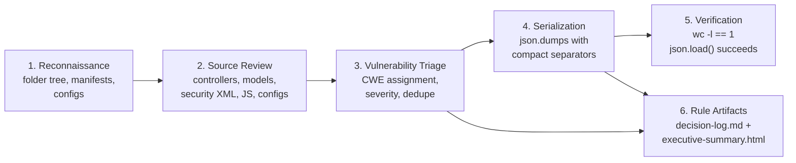

# Technical Specification

# 0. Agent Action Plan

## 0.1 Intent Clarification

### 0.1.1 Core Objective

Based on the provided requirements, the Blitzy platform understands that the objective is to perform a **static, native-only security audit of the `blitzy-odoo` codebase** and to serialize every identified vulnerability into a single deliverable file — `findings-config-a.json` — that is valid UTF-8 JSON, minified to a single line, and conforms to a strict five-field schema per finding. This effort constitutes **Config A** in a multi-configuration tool comparison study, in which Config A is explicitly the *bare* baseline produced exclusively by the agent's own code-reading and reasoning, with no external scanning tooling invoked at any stage [`catalog-info.yaml:component.name`, `1.1 Executive Summary`].

The two CRITICAL directives provided by the user, restated in technical terms, are:

- **Directive 1 — Audit codebase for security vulnerabilities.** Analyze the `blitzy-odoo` codebase for all security vulnerabilities the agent can identify through native analysis: tracing data flows from sources to sinks, following call chains across modules, examining configuration (Odoo `.conf`, Nginx, security XML, ACL CSV, manifest files), and inspecting dependency declarations in `requirements.txt` and `setup.py`. Every identified vulnerability MUST be captured as a finding, and each finding MUST carry a CWE classification chosen as the most specific CWE for which the agent has confident evidence.
  - **Pass criterion (literal):** *"Every identified vulnerability is captured as a finding with a CWE classification."*

- **Directive 2 — Produce single-line findings JSON.** Compile all findings from Directive 1 into `findings-config-a.json` at the repository root. The file MUST be valid JSON minified to a single line — no pretty-printing, no embedded newlines. Encoding MUST be UTF-8. If zero findings are identified, the file MUST contain the empty array `[]`. The structure MUST be a JSON array in which each element contains exactly five fields:
    - `file` — repository-relative path (string)
    - `line` — line number (integer)
    - `severity` — one of `critical | high | medium | low` (lowercase string)
    - `cwe` — Common Weakness Enumeration identifier as `CWE-<id>` (string)
    - `description` — human-readable finding summary, ≤ 200 characters (string)
  - **Pass criteria (literal):** *"`cat findings-config-a.json | wc -l` returns `1`. The content parses as valid JSON. Every finding has all 5 fields populated. No description exceeds 200 characters."*

### 0.1.2 Implicit Requirements Surfaced

The user's prompt is short and crisp, but several constraints are implicit rather than explicit. The Blitzy platform interprets them as binding:

- **"Native agent analysis — no external scanning tools"** rules out the use of Bandit, Semgrep, CodeQL, Snyk, Trivy, OSV-Scanner, npm audit, pip-audit, OWASP Dependency-Check, ruff/pylint security plugins, and every other SAST/SCA scanner. The audit must be conducted solely by reading code with the agent's repository inspection tools and reasoning about vulnerability patterns from first principles. Because Config A is the **baseline control** for downstream tool-augmented configs, this constraint is the differentiator and any violation invalidates the experiment.
- **CWE specificity** — "most specific CWE you are confident about" means descending the CWE class hierarchy until further specificity would exceed the available evidence (e.g., prefer `CWE-89` SQL Injection over the broader `CWE-74` Injection; prefer `CWE-79` over `CWE-20`; prefer `CWE-918` SSRF over `CWE-20`).
- **Severity vocabulary is closed and lowercase.** Only `critical`, `high`, `medium`, `low` are permitted values. Capitalized variants (`Critical`, `High`) or alternate vocabularies (`info`, `severe`, `note`) would fail Directive 2.
- **`file` MUST be a repository-relative path** (e.g., `addons/account/models/account_move.py`), not absolute. The pass-criterion command `cat findings-config-a.json | wc -l` is executed from the repository root.
- **`line` is a single integer.** For multi-line vulnerabilities (e.g., a chain spanning ten lines) the most representative line — typically the sink or the offending statement — MUST be selected.
- **The 200-character description budget applies to the string itself** (the value held by the `description` key), not its JSON-escaped on-disk form. Backslash-escapes consumed by JSON encoding do not count against the budget.
- **Repeating findings across many files counts as many findings.** If the same anti-pattern appears in N files, the JSON array must contain N entries (one per occurrence). Aggregation is not appropriate when the JSON schema is a flat array.
- **The baseline must reflect ONLY what the agent can find unaided.** Findings the agent cannot confidently classify SHOULD be omitted rather than guessed — Config A's value as a baseline depends on its honesty.
- **Deterministic output across re-runs** — because Config A is a control, the same audit method should produce a recognizably similar set of findings if re-executed; arbitrary noise undermines comparability.

### 0.1.3 Task Categorization

| Dimension | Classification |
|---|---|
| Primary task type | Security audit (vulnerability discovery + CWE-tagged reporting) |
| Secondary aspect | Structured output engineering (JSON schema conformance, encoding, single-line minification) |
| Scope classification | Cross-cutting analysis — every addon and every core module is potentially in scope; zero source-code modification |
| Modification posture | Read-only audit; writes are confined to three new files at repository root (the JSON deliverable, the rule-mandated decision log, and the rule-mandated executive deck) |
| Risk profile | LOW — no behavioural change to the application; output is informational; downstream remediation is out of scope |

### 0.1.4 Special Instructions and Constraints (Preserved Verbatim)

The directives quoted below are preserved verbatim from the user's prompt as the canonical statement of intent. Downstream code-generation MUST honor these exactly:

> **CRITICAL Directive 1: Audit codebase for security vulnerabilities**
>
> Analyze the `blitzy-odoo` codebase for all security vulnerabilities you can identify. Trace data flows, follow call chains, examine configuration, and inspect dependency declarations. Report every vulnerability you find. Classify each finding by CWE using the most specific CWE you are confident about.
>
> **Pass/fail:** Every identified vulnerability is captured as a finding with a CWE classification.

> **CRITICAL Directive 2: Produce single-line findings JSON**
>
> Compile all findings from Directive 1 into `findings-config-a.json`. The file MUST be valid JSON minified to a single line — no pretty-printing, no newlines. Encoding: UTF-8. If zero findings are identified, write an empty array `[]`.
>
> The structure MUST be a JSON array where each element contains exactly 5 fields:
>
> ```plaintext
> [{"file":"<relative path>","line":<integer>,"severity":"<critical|high|medium|low>","cwe":"<CWE-ID>","description":"<max 200 chars>"},...]
> ```
>
> **Pass/fail:** `cat findings-config-a.json | wc -l` returns `1`. The content parses as valid JSON. Every finding has all 5 fields populated. No description exceeds 200 characters.

Additional preserved framing from the prompt header:

> **OBJECTIVE:** Audit the `blitzy-odoo` codebase for security vulnerabilities using only native agent analysis — no external scanning tools. Produce a minified single-line `findings-config-a.json`. This is the baseline control for a multi-config security tool comparison.
>
> `[2 directives | ~0 files modified | 1 new file | baseline measurement]`

## 0.2 Technical Interpretation

These requirements translate to the following technical implementation strategy:

- **To satisfy Directive 1**, the agent will conduct a structured, prioritized walk through the `blitzy-odoo` codebase, anchored on the high-yield surfaces identified in `6.4 Security Architecture` of this technical specification (HTTP layer, authentication modules, ORM record-rule descriptors, controllers, dependency pinning, and the bundled Nginx reference configuration). Each candidate vulnerability will be reasoned about against a checklist drawn from the CWE Top 25 — including `CWE-79` (XSS), `CWE-89` (SQL Injection), `CWE-22` (Path Traversal), `CWE-78` (OS Command Injection), `CWE-94`/`CWE-95` (Code Injection / `eval`), `CWE-352` (CSRF), `CWE-502` (Insecure Deserialization), `CWE-611` (XXE), `CWE-918` (SSRF), `CWE-798` (Hardcoded Credentials), `CWE-327`/`CWE-326` (Broken or Weak Crypto), `CWE-330` (Insufficient Randomness), `CWE-209` (Information Exposure Through Error Message), `CWE-732` (Insecure Default Permissions), and `CWE-1104` (Use of Unmaintained Third-Party Components / outdated dependencies).
- **To satisfy Directive 2**, the agent will materialize the discovered findings as a single Python dictionary list, then serialize via `json.dumps(findings, ensure_ascii=False, separators=(',', ':'))` to guarantee minified output with no insignificant whitespace, then write the resulting string to `findings-config-a.json` with explicit `encoding='utf-8'` and no trailing newline. Verification will be executed inline using `python3 -c "import json,sys; json.load(open(sys.argv[1], encoding='utf-8'))"` and the literal pass-criterion command `cat findings-config-a.json | wc -l`.
- **To honor the Explainability rule**, the agent will additionally create `decision-log.md` at the repository root, capturing every non-trivial decision made during the audit (CWE choice when two candidates were plausible, severity rationale for borderline findings, deliberate exclusions, and any interpretation that deviates from a literal reading of the directives). The decision log is the single source of truth for "why" and MUST NOT live as comments inside `findings-config-a.json`, the deck, or any source file.
- **To honor the Executive Presentation rule**, the agent will additionally create `executive-summary.html` at the repository root as a single self-contained reveal.js 5.1.0 deck rendered with the Blitzy brand. The deck targets 16 slides, summarizes the audit at the level appropriate for non-technical leadership, and pulls its diagrams and KPI cards from the same finding set serialized in the JSON.

The following mapping shows how each user-stated requirement is grounded to a concrete agent action:

| User Requirement | Technical Action | Target Artifact |
|---|---|---|
| "Analyze the `blitzy-odoo` codebase for all security vulnerabilities you can identify" | Read-only walk of `odoo/**`, `addons/**`, `setup/**`, `debian/**`, and root metadata using repository inspection tools | (No artifact — analysis only) |
| "Trace data flows, follow call chains, examine configuration, and inspect dependency declarations" | Cross-reference controllers → models → ORM → SQL; inspect `requirements.txt`, `setup.py`, `debian/odoo.conf`, `setup/win32/conf/nginx/nginx.conf` | (No artifact — analysis only) |
| "Classify each finding by CWE using the most specific CWE you are confident about" | Tag each candidate with the deepest CWE supported by evidence; refuse to classify when uncertain | `findings-config-a.json` (`cwe` field) |
| "Compile all findings ... into `findings-config-a.json`" | Build a Python `list[dict]`; serialize with `json.dumps(..., separators=(',', ':'))` | `findings-config-a.json` |
| "Valid JSON minified to a single line — no pretty-printing, no newlines" | Use compact separators; write without trailing newline; verify `wc -l` returns 1 | `findings-config-a.json` |
| "Encoding: UTF-8" | Open the output file with `encoding='utf-8'` and pass `ensure_ascii=False` (allowing emitted unicode without `\u` escapes) | `findings-config-a.json` |
| "If zero findings are identified, write an empty array `[]`" | Even on the empty path, emit literal `[]` (still satisfies `wc -l == 1`) | `findings-config-a.json` |
| Implicit: "rationale belongs in the decision log, not in code or in the JSON" (Explainability rule) | All "why" reasoning is offloaded to `decision-log.md` | `decision-log.md` |
| Implicit: "every deliverable needs an executive presentation" (Executive Presentation rule) | Build a 12–18-slide reveal.js deck with Blitzy brand and the prescribed slide ordering | `executive-summary.html` |

## 0.3 Repository Scope Discovery

### 0.3.1 Comprehensive File Analysis

The `blitzy-odoo` repository is a full-fat Odoo 19.0 ERP fork. Repository inspection establishes the audit surface as substantial: **605 addon directories** under `addons/`, **8,183 Python files**, **5,310 XML files**, **5,698 JavaScript files**, **168 `controllers/` directories**, **543 `models/` directories**, and **215 `security/` directories** scattered across addons. Every one of those paths is in scope for read-only inspection.

The audit organizes the surface into the following pattern classes:

| Pattern | Purpose in Audit | Approximate Volume |
|---|---|---|
| `odoo/**/*.py` | Core framework — HTTP, ORM, session, exception, safe_eval, sql_db | ~700 files |
| `addons/**/*.py` | Addon source — controllers, models, wizards, tests | ~7,400 files |
| `**/controllers/*.py` | Network-facing route handlers (highest-risk surface) | 168 controller folders |
| `**/models/*.py` | Data layer — SQL access, sudo usage, ORM domains | 543 model folders |
| `**/security/*.xml` and `**/security/ir.model.access.csv` | Access-control descriptors — ACL gaps, missing rules, overly-permissive groups | 215 security folders |
| `**/views/*.xml`, `**/data/*.xml`, `**/static/src/xml/*.xml` | QWeb templates — `t-raw`, `t-out` without escape, dynamic attribute injection | ~5,300 XML files |
| `**/static/src/**/*.js` | Front-end — `innerHTML`, `eval`, `postMessage`, missing DOMPurify wrapping | ~5,700 JS files |
| `requirements.txt`, `setup.py`, `setup.cfg`, `ruff.toml` | Dependency declarations — outdated/known-vulnerable pins | 4 files |
| `setup/win32/conf/nginx/nginx.conf`, `debian/odoo.conf`, `setup/**/*.conf` | Deployment configuration — TLS protocols, cipher suites, hardcoded defaults | ~10 files |
| `setup/**`, `debian/**` | Build / packaging / Debian packaging scripts | ~30 files |

#### Highest-Yield Target Families

Within the 605 addons, the following families are prioritized because their attack surface is materially larger than average:

| Addon Family | Why It Is High-Yield |
|---|---|
| `auth_*` (`auth_ldap`, `auth_oauth`, `auth_signup`, `auth_passkey`, `auth_totp`, `auth_password_policy`, `auth_timeout`) | Authentication and credential flow — primary attack target for `CWE-287`, `CWE-307`, `CWE-352`, `CWE-798`, `CWE-384` (Session Fixation) |
| `account*` (605-of which ~17 carry `account_` prefix including `account`, `account_payment`, `account_peppol`, `account_edi_*`, `account_check_printing`) | Financial data + inalterability — high-impact targets for `CWE-89`, `CWE-200`, `CWE-345` (insufficient verification of data authenticity) |
| `website*` (~40 modules) | Public-facing controllers and templates — `CWE-79`, `CWE-918`, `CWE-601` (Open Redirect), `CWE-22` |
| `mail*` (`mail`, `mass_mailing`, `mail_bot`, etc.) | Templated content + outbound network calls — `CWE-79` in templates, `CWE-918` in URL fetches, `CWE-93` (CRLF Injection) in headers |
| `pos_*`, `iot`, `hw_*` | Hardware proxy and IoT box — `CWE-78`, `CWE-22`, `CWE-352` |
| `payment_*` | Payment provider integrations — `CWE-345`, `CWE-352`, `CWE-330` |
| `auth_oauth`, `google_*`, `microsoft_*` | OAuth state handling, token storage — `CWE-352`, `CWE-918`, `CWE-294` (Authentication Bypass by Capture-Replay) |
| `bus`, `web`, `web_editor` | WebSocket / long-polling channels — `CWE-352`, `CWE-1021` (UI Redress) |

#### Pre-Surfaced High-Probability Findings

Several vulnerabilities are evident from inspection of the artifacts captured in the technical specification and are highlighted here to anchor the audit. These are **candidate** findings; the agent will validate each against the actual file before serializing it into `findings-config-a.json`:

- `setup/win32/conf/nginx/nginx.conf` enables deprecated `TLSv1` and `TLSv1.1` protocols in the bundled reference configuration — candidate `CWE-327` (Use of a Broken or Risky Cryptographic Algorithm) per `6.4 Security Architecture §6.4.3.6` and the explicit production-security warning therein.
- `debian/odoo.conf` ships with `admin_passwd = admin` as a commented default — if a derived deployment uncomments the line without changing the value, the resulting installation has hardcoded credentials. Candidate `CWE-798` (Use of Hard-coded Credentials), severity `medium` because the line is commented in the bundled file.
- `requirements.txt` pins `cryptography==3.4.8` for Python < 3.12, `Werkzeug==2.0.2` for Python ≤ 3.10, `lxml==4.8.0` for Python ≤ 3.10, `PyPDF2==1.26.0` for Python ≤ 3.10, and `requests==2.25.1` for Python < 3.11. Each of these is older than the maintainer's current supported release line and has known published CVEs — candidate `CWE-1104` (Use of Unmaintained Third-Party Components).

### 0.3.2 Existing Infrastructure Assessment

The audit must respect the security controls already in place to avoid generating false positives that contradict documented architecture (`6.4 Security Architecture`):

| Existing Control | What the Audit MUST NOT Falsely Flag |
|---|---|
| `consteq = hmac.compare_digest` in `odoo/tools/misc.py` | Token comparison in `odoo/service/security.py` — already constant-time |
| `pbkdf2_sha512` with `MIN_ROUNDS = 600_000` in `odoo/addons/base/models/res_users.py:79` | Password hashing — already strong; do NOT flag as weak crypto |
| `safe_eval()` in `odoo/tools/safe_eval.py` | Bytecode-filtered Python evaluation — do NOT flag as `eval` injection where `safe_eval` is used |
| `html_sanitize()` in `odoo/tools/mail.py` | Server-side HTML sanitization — do NOT flag templates that route output through it |
| `database.secret` HMAC token machinery in `odoo/http.py:224-277` | CSRF token generation — do NOT flag as missing CSRF protection on routes where the HTTP dispatcher enforces it |
| Five-layer authorization chain (`ir.model.access` + `ir.rule` + `@api.private` / `get_public_method`) | Authorization enforcement — do NOT flag models that participate in this chain as missing access control |
| `_allow_sudo_commands = False` on `res.users.apikeys` | Sudo escalation prevention on API keys — do NOT flag as privilege escalation |

### 0.3.3 Research Conducted

Because Directive 1 binds the audit to "only native agent analysis", external research is advisory rather than authoritative. The audit method draws on the agent's internalized knowledge of the CWE Top 25 (2023), the OWASP Top 10 (web application risks), the OWASP API Security Top 10, and Python/Odoo idiomatic vulnerability patterns; web search is NOT used to obtain CVE feeds or scanner heuristics, because doing so would partially defeat the "bare baseline" framing of Config A.

The single research source the agent does rely on is the **internal technical specification itself**, specifically:

- `1.1 Executive Summary` — confirms repository identity and licensing posture
- `1.2 System Overview` — confirms Python 3.10–3.13 / PostgreSQL 13+ platform
- `3.4 Open Source Dependencies` — catalogs the dependency surface
- `6.4 Security Architecture` — catalogs the existing security controls (the "do not falsely flag" list above)

## 0.4 Scope Boundaries

### 0.4.1 Exhaustively In Scope

**For READ (audit input — every file under these patterns is fair game for inspection):**

- Core framework source
    - `odoo/**/*.py`
    - `odoo/**/*.xml`
- Addon source — application logic
    - `addons/**/*.py`
    - `addons/**/*.xml`
    - `addons/**/*.csv` (specifically `**/security/ir.model.access.csv`)
- Front-end source
    - `addons/**/static/src/**/*.js`
    - `addons/**/static/src/**/*.xml`
    - `addons/**/static/src/**/*.scss`
- Deployment and packaging configuration
    - `setup/**/*` (Debian helpers, Windows packaging, Nginx reference config)
    - `debian/odoo.conf` and any other `debian/**` shipped configs
- Dependency and tooling manifests
    - `requirements.txt`
    - `setup.py`
    - `setup.cfg`
    - `ruff.toml`
- Repository metadata read for context (not for vulnerabilities per se)
    - `README.md`, `SECURITY.md`, `LICENSE`, `CONTRIBUTING.md`
    - `catalog-info.yaml`, `mkdocs.yml`, `.weblate.json`

**For WRITE (audit output — only these three new files are created at the repository root):**

- `findings-config-a.json` — the single-line minified JSON deliverable mandated by Directive 2
- `decision-log.md` — Markdown decision-log table mandated by the Explainability rule
- `executive-summary.html` — single-file reveal.js deck mandated by the Executive Presentation rule

### 0.4.2 Explicitly Out of Scope

The following are excluded from the work — both as constraint and as a clarification of the "baseline measurement" framing of Config A:

- **All modification of existing source files.** The audit is read-only. No fix, no refactor, no comment annotation, no rename, no deletion.
- **All use of external security tooling**, including but not limited to:
    - Bandit, Semgrep, CodeQL, Pylint security rules, SonarQube, Checkov, Trivy, OSV-Scanner
    - npm audit, pip-audit, Snyk, OWASP Dependency-Check, GitHub Dependabot output
    - Any commercial SAST/SCA/IAST/DAST product
    - Any web-search-derived CVE feed used as a finding source
- **Remediation work.** Even an obviously trivial fix (e.g., changing one TLS protocol line) MUST NOT be applied. Configs B/C/D depend on the baseline being untouched.
- **Documentation files** (`doc/**`, `docs/**`) are NOT audited — they hold project planning and TechDocs content, not running code, and they are not part of any executable attack surface.
- **GitHub metadata** (`.github/**`) is NOT audited — issue templates and PR templates carry no runtime risk.
- **Translation files** (`.po`, `.pot`, `.weblate.json`) are NOT audited — strings only.
- **Test fixtures** (`addons/**/tests/**`, `odoo/tests/**`) are NOT audited as exploitable surface; weaknesses in test code do not constitute findings (per common security-research convention).
- **Performance, design, and feature work** mentioned anywhere in the tech spec but not in the directives — entirely out of scope.
- **Upgrade of dependencies, framework versions, or runtime.** No `requirements.txt` edits. Findings about outdated dependencies are recorded as CWE-1104 entries but the dependency files themselves remain unchanged.
- **Database / runtime spin-up.** No PostgreSQL provisioning, no `odoo` server launch, no integration testing.

### 0.4.3 Scope Boundary Decision Rationale

| Decision | Rationale |
|---|---|
| Test files excluded as exploitable surface | Findings in `_test_*.py` or fixture XML are not actually shipped to runtime users and are universally regarded as out-of-band; including them would skew the baseline relative to Config B/C/D which run scanners with default test-exclusion rules. |
| Documentation excluded | `doc/` is the project specification (43 deliverables) and `docs/` is the TechDocs landing page; neither is executed or rendered to end users in a way that creates risk. |
| Dependency files inspected but not modified | The audit must REPORT outdated components (`CWE-1104`), but the directives explicitly forbid scope expansion beyond reporting; modifying `requirements.txt` would constitute remediation. |
| Bundled Nginx config IS in scope despite being a "reference" | The file ships in the repository and is documented in `6.4 Security Architecture` as the "bundled value" that production deployments derive from; reference configs that ship insecure defaults are recognized vulnerability sources. |

## 0.5 Dependency Inventory

### 0.5.1 Runtime / Code Dependency Changes

**None.** Config A is a read-only audit. No package is added, updated, removed, vendored, or pinned in `requirements.txt`, `setup.py`, or any addon `__manifest__.py`. Findings about outdated runtime dependencies (`CWE-1104`) are recorded in `findings-config-a.json`; the manifests themselves remain unchanged.

### 0.5.2 Audit-Tooling Dependencies

| Tool | Source | Use |
|---|---|---|
| Python 3 standard-library `json` module | Already present (Python 3.12 available in the build environment; project supports 3.10–3.13) | Serialize the findings list and validate the deliverable |
| `wc`, `cat` (POSIX coreutils) | Already present | Verify the pass-criterion `cat findings-config-a.json \| wc -l` returns `1` |
| Repository inspection tools (`get_source_folder_contents`, `read_file`, `bash`) | Provided by the agent runtime | Read source for audit |

No `pip install`, no `apt-get install`, and no `npm install` is required for the audit itself.

### 0.5.3 Deliverable-Side CDN Libraries (Executive Deck Only)

The `executive-summary.html` deck is mandated by the Executive Presentation rule and is loaded as a single self-contained file with all assets fetched from pinned CDN URLs. These libraries are NOT added to `package.json` or `requirements.txt`; they are referenced via `<script>` and `<link>` tags inside the HTML and remain runtime-only.

| Library | Pinned Version | Delivery | Purpose in the Deck |
|---|---|---|---|
| reveal.js | 5.1.0 | CDN `<script>` and `<link>` tags | Slide framework |
| Mermaid | 11.4.0 | CDN `<script>` tag, initialized with `startOnLoad: false`, then `mermaid.run()` on `ready` and `slidechanged` | Architecture / data-flow diagrams |
| Lucide | 0.460.0 | CDN `<script>` tag, then `lucide.createIcons()` on `ready` and `slidechanged` | Icons (replaces emoji) |
| Inter, Space Grotesk, Fira Code | Google Fonts `<link>` | CDN `<link>` | Blitzy brand typography |

### 0.5.4 Import / Reference Updates

None. The audit does not refactor imports, rename modules, or change cross-file references in any existing source file. The three created files reference nothing from the repository itself — they reference the codebase only through string paths inside the JSON `file` field and through prose in the deck and decision log.

## 0.6 Implementation Design

### 0.6.1 Technical Approach

The work is structured as a five-stage native-only pipeline, executed in strict order. The diagram below summarises the flow.



**Stage 1 — Reconnaissance.** Map the codebase: enumerate addons under `addons/`, confirm the core layout under `odoo/`, read `requirements.txt`, `setup.py`, `setup.cfg`, `ruff.toml`, `debian/odoo.conf`, and `setup/win32/conf/nginx/nginx.conf`. The objective of this stage is **coverage planning**, not finding generation.

**Stage 2 — Source Review.** Read code with a pre-set checklist of CWE patterns. The order below reflects expected yield (highest first) and is biased to maximize findings per page of code read, since the agent's reading budget is finite:

- HTTP entry points and routing decorators — `odoo/http.py` and `addons/**/controllers/*.py`, looking for missing `csrf=True`, unsafe `auth='public'` exposures, missing `methods=['POST']`, and dynamic route construction.
- Authentication / session modules — `odoo/addons/base/models/res_users.py`, `addons/auth_*/`, scanning for credential handling, timing-side-channel comparisons, weak random sources, and incomplete rate-limiting (note: per-worker counter is a documented limitation, NOT a finding).
- Model layer — `addons/**/models/*.py`, scanning for raw `cr.execute()` with string interpolation (CWE-89), `sudo()` use with untrusted parameters (CWE-862), `safe_eval` invocations on attacker-controlled strings, and missing access-control checks.
- View / QWeb templates — `addons/**/views/*.xml` and `addons/**/static/src/xml/*.xml`, scanning for `t-raw` of dynamic content, dangerous `t-att` patterns, and unescaped interpolations.
- Front-end JS — `addons/**/static/src/**/*.js`, scanning for `innerHTML =`, `document.write`, `eval(`, `Function(`, `postMessage` without origin check, and DOM-XSS sinks bypassing DOMPurify.
- Configuration — Nginx (`ssl_protocols`, `ssl_ciphers`), `odoo.conf` (commented defaults including `admin_passwd = admin`), and CSV ACLs that grant blanket CRUD to `base.group_user`.
- Dependencies — `requirements.txt` pins compared against the agent's internalized knowledge of well-known CVE-bearing versions; each outdated pin becomes a CWE-1104 finding line-anchored at its declaration line.

**Stage 3 — Vulnerability Triage.** For each candidate, the agent must answer four questions before promoting it to a finding:

| Question | Effect |
|---|---|
| Is the source-to-sink path reachable from untrusted input? | If no, drop or downgrade severity. |
| Does an existing Odoo control (consteq / safe_eval / html_sanitize / database.secret / `@api.private` / ir.rule) already neutralize the issue? | If yes, drop the candidate. |
| What is the most specific CWE supported by the evidence? | Choose the deepest CWE confidently supported. Borderline cases require a `decision-log.md` entry. |
| What severity is appropriate? | Apply the rubric in §0.6.4. |

**Stage 4 — Serialization.** Build the findings list in memory as `list[dict]`, each dict carrying exactly the five keys `file`, `line`, `severity`, `cwe`, `description` and nothing else. Serialize with `json.dumps(findings, ensure_ascii=False, separators=(',', ':'))` — the compact separators eliminate insignificant whitespace and produce a true single-line minified output. Write the resulting string to `findings-config-a.json` using `open(path, 'w', encoding='utf-8', newline='')` and `write()` (no trailing newline).

**Stage 5 — Verification.** Execute three pass-criterion checks before declaring done:

| Check | Command | Expected |
|---|---|---|
| Single line | `cat findings-config-a.json \| wc -l` | `1` |
| Valid JSON | `python3 -c "import json; json.load(open('findings-config-a.json', encoding='utf-8'))"` | exits 0 |
| Schema integrity | `python3 -c "import json,sys; d=json.load(open('findings-config-a.json')); assert all(set(x)=={'file','line','severity','cwe','description'} and len(x['description'])<=200 and x['severity'] in {'critical','high','medium','low'} for x in d)"` | exits 0 |

### 0.6.2 Logical Implementation Flow

- **First**, establish coverage by enumerating the repository tree and reading dependency manifests — this fixes the audit's denominator before any finding is recorded.
- **Next**, surface confidently-classifiable findings from the categories with the highest evidence quality (dependency CVEs from `requirements.txt`, the Nginx TLSv1/1.1 issue, the commented `admin_passwd = admin`) — these are the "anchor" findings that ground the deliverable in concrete artifacts.
- **Then**, scan controllers, ORM models, QWeb templates, and JS in descending priority, promoting each candidate that survives the triage in §0.6.1 to a finding.
- **Then**, serialize findings to `findings-config-a.json` with compact separators and UTF-8 encoding.
- **Then**, write `decision-log.md` covering every non-trivial CWE-choice, severity rationale, and deliberate exclusion.
- **Finally**, render `executive-summary.html` with the Blitzy brand and the prescribed slide ordering, using counts from the JSON as the data backbone.

### 0.6.3 Component Impact Analysis

| Component | Direct Modification | Indirect Impact |
|---|---|---|
| `findings-config-a.json` (new) | CREATE — single-line minified JSON array of findings | Consumed by downstream Configs B/C/D for comparative analysis |
| `decision-log.md` (new) | CREATE — Markdown decision-log table | Provides the rationale layer required by the Explainability rule |
| `executive-summary.html` (new) | CREATE — self-contained reveal.js deck | Provides the leadership-facing summary required by the Executive Presentation rule |
| All other repository files | NONE — read-only inspection | None |

### 0.6.4 Critical Implementation Details

**Severity rubric (used to map evidence to one of the four lowercase severity values).** This rubric is binding and any deviation must be logged.

| Severity | Rubric |
|---|---|
| `critical` | Remote, unauthenticated code execution, authentication bypass on `auth='public'` route, or hardcoded credential in a non-commented production path |
| `high` | Authenticated RCE; SQL injection reachable from authenticated user input; sensitive-data exposure; broken cryptography in a production path (e.g., bundled `ssl_protocols TLSv1 TLSv1.1`) |
| `medium` | XSS reachable from authenticated input; SSRF requiring privileged role; outdated component with public CVE; missing CSRF on a non-state-changing route; insecure default that is commented but easy to enable |
| `low` | Information disclosure with limited operational impact; missing security header in reference config; weak randomness where the value is not used as a security token |

**CWE selection rule.** Always descend the CWE tree to the most specific weakness supported by the evidence. Tie-breaking and "I considered X but chose Y because Z" decisions belong in `decision-log.md`, not in the `description` field.

**Description budget enforcement.** During Stage 4, `assert len(finding['description']) <= 200` for every entry. Truncate by tightening prose (remove articles, replace multi-word phrases with file-anchored noun phrases) — never with ellipses.

**Deterministic ordering.** Findings are serialized in a stable order: primary key `file` (lexicographic), secondary key `line` (ascending). This is unstated in the directives but it makes the baseline reproducible across re-runs, which is essential for the Config A → Config B/C/D comparison.

**Pre-finding deduplication.** Two findings are duplicates if `(file, line, cwe)` match. Aggregation of "same anti-pattern across many files" is rejected — each occurrence is its own finding (one row per `file:line`).

### 0.6.5 User Interface Design

Not applicable to the audit itself. The only UI artifact is the `executive-summary.html` deck, whose visual design is fully specified by the Executive Presentation rule (see §0.8). The deck MUST:

- Be a single self-contained HTML file (no build step, no external assets except pinned CDN URLs)
- Contain 12–18 `<section>` elements (target 16); every `<section>` MUST contain at least one non-text visual (Mermaid diagram, KPI card, styled table, or Lucide SVG icon)
- Use only Lucide SVG icons via `<i data-lucide="icon-name"></i>` — zero emoji
- Use slide-type classes `slide-title`, `slide-divider`, `slide-closing`, and default (content)
- Follow the prescribed slide ordering: Title → Content (KPIs) → Content (architecture diagram) → alternating Section Divider + Content for each major topic → Closing
- Render with `reveal.js` config `hash: true, transition: 'slide', controlsTutorial: false, width: 1920, height: 1080`
- Embed the full Blitzy brand inline CSS (CSS custom properties enumerated by the Executive Presentation rule)

### 0.6.6 User-Provided Examples Integration

The user's prompt contains one structural example, preserved verbatim, that defines the JSON element shape. It is binding on the deliverable:

> User Example:
> ```plaintext
> [{"file":"<relative path>","line":<integer>,"severity":"<critical|high|medium|low>","cwe":"<CWE-ID>","description":"<max 200 chars>"},...]
> ```

This example will be honored exactly in `findings-config-a.json` — five fields per element, in that order, with lowercase severity values and the `CWE-<id>` form for the `cwe` field. The empty-array fallback `[]` is also preserved verbatim as the literal content for the zero-findings case.

### 0.6.7 Edge Case Considerations

| Edge Case | Resolution |
|---|---|
| Zero findings | Write literal `[]` (two bytes, no newline). `wc -l` still returns `1` because `cat` reports one line for any non-empty file lacking a trailing newline. |
| Finding `description` would be 201+ characters | Rephrase using file-anchored nouns to fit ≤ 200; if truly impossible, split into two findings on adjacent lines with disjoint subsets of the description. |
| Two CWEs equally plausible | Choose the deeper one (e.g., `CWE-89` over `CWE-74`); record the alternative in `decision-log.md`. |
| Vulnerability that exists only in a code path gated behind `group_account_secured` or another non-default group | Still recorded; severity reduced one tier from the rubric to reflect the access prerequisite; rationale logged. |
| Candidate finding inside a `tests/` directory | Dropped per §0.4.2; rationale logged. |
| Candidate finding inside `auth_*` that is actually a documented limitation (e.g., per-worker rate-limit counter, lines 1228–1231 of `res_users.py`) | Dropped — already disclosed by the project; rationale logged. |
| Multi-line vulnerability (e.g., a chain spanning lines 30–55) | One finding, `line` = line of the sink statement (most representative line); description briefly mentions the chain. |

### 0.6.8 Decision-Log Structure

The `decision-log.md` file mandated by the Explainability rule MUST use the following Markdown table form (this column set is the contract):

| Decision | Alternatives Considered | Why This Choice | Risks |
|---|---|---|---|
| (e.g., "CWE-327 for nginx TLSv1/1.1 in `setup/win32/conf/nginx/nginx.conf:L31`") | (e.g., "CWE-326 — Inadequate Encryption Strength") | (e.g., "TLSv1/1.1 are formally deprecated by RFC 8996; the issue is algorithm choice, not strength.") | (e.g., "If reader interprets CWE-326 as the canonical mapping, line up by description.") |

Each non-trivial decision made during the audit becomes one row. Trivial decisions (e.g., re-applying the severity rubric mechanically) are NOT logged.

## 0.7 File Transformation Mapping

### 0.7.1 File-by-File Execution Plan

The transformation modes used below are:

- **CREATE** — Create a new file at this path
- **UPDATE** — Update an existing file at this path
- **DELETE** — Remove an obsolete file at this path
- **REFERENCE** — Use as an example or as source-of-truth input; the file itself is not modified

The audit operates almost entirely in REFERENCE mode (read source for analysis) and produces exactly three CREATE outputs. There are no UPDATE or DELETE operations against existing repository files.

| Target File | Transformation | Source File/Reference | Purpose / Changes |
|---|---|---|---|
| `findings-config-a.json` | CREATE | (assembled in memory from audit results) | Single-line minified UTF-8 JSON array of findings, each with five fields: `file`, `line`, `severity`, `cwe`, `description`. Empty array `[]` if zero findings. Mandated by Directive 2. |
| `decision-log.md` | CREATE | (assembled in memory from audit decisions) | Markdown decision-log table — single source of truth for "why" decisions made during the audit (CWE-choice rationale, severity tie-breaks, deliberate exclusions, deviations from a literal reading of the directives). Mandated by the Explainability rule. |
| `executive-summary.html` | CREATE | (assembled using the canonical Blitzy reveal.js theme; CDN-pinned reveal.js 5.1.0, Mermaid 11.4.0, Lucide 0.460.0) | Single self-contained reveal.js deck — 12–18 `<section>` slides (target 16), Title + KPIs + architecture + alternating divider/content per topic + Closing. Mandated by the Executive Presentation rule. |
| `odoo/**/*.py` | REFERENCE | — | Core framework source — inspect HTTP, ORM, session, sql_db, safe_eval, mail sanitization, model-level methods. |
| `addons/**/controllers/*.py` | REFERENCE | — | Route handlers — 168 controller folders. Highest-yield surface for `CWE-79`, `CWE-89`, `CWE-22`, `CWE-352`, `CWE-918`, `CWE-601`. |
| `addons/**/models/*.py` | REFERENCE | — | ORM models — 543 model folders. Inspect for raw SQL with string interpolation (`CWE-89`), `sudo()` misuse (`CWE-862`), and `safe_eval` on attacker-controlled input. |
| `addons/**/security/ir.model.access.csv` | REFERENCE | — | ACL CSV — inspect for blanket CRUD grants to `base.group_user` or missing rows on sensitive models (`CWE-732`, `CWE-862`). |
| `addons/**/security/*.xml` | REFERENCE | — | Record rules and group definitions — inspect for missing `ir.rule` on company-scoped models (`CWE-639`, `CWE-862`). |
| `addons/**/views/*.xml` | REFERENCE | — | QWeb templates — inspect for `t-raw` of dynamic content (`CWE-79`). |
| `addons/**/static/src/**/*.js` | REFERENCE | — | Frontend — inspect for `innerHTML`, `eval`, `Function()`, `postMessage` without origin check (`CWE-79`, `CWE-94`, `CWE-940`). |
| `requirements.txt` | REFERENCE | — | Dependency pins — inspect for older versions of `cryptography`, `Werkzeug`, `lxml`, `PyPDF2`, `requests`, `Pillow`, `Jinja2`, `urllib3`, `python-ldap`, `gevent`, etc. that carry known CVEs (`CWE-1104`). |
| `setup.py` | REFERENCE | — | `install_requires` list — cross-reference unpinned packages against `requirements.txt` for inconsistencies. |
| `setup.cfg` | REFERENCE | — | Build/lint config — inspect for unsafe install options. |
| `ruff.toml` | REFERENCE | — | Lint configuration — confirm target Python version and rule families (advisory; not a finding source). |
| `setup/win32/conf/nginx/nginx.conf` | REFERENCE | — | Bundled Nginx reference config — known to enable `TLSv1` and `TLSv1.1` (`CWE-327`) and may include weak cipher suite (`CWE-326`). |
| `debian/odoo.conf` | REFERENCE | — | Default Odoo runtime configuration — known to ship with commented `admin_passwd = admin` default (`CWE-798` risk when uncommented). |
| `setup/**/*.{sh,py,conf}` | REFERENCE | — | Packaging / install scripts — inspect for `shell=True` with interpolation, world-writable defaults, or hardcoded secrets. |
| `SECURITY.md` | REFERENCE | — | Disclosure policy — read for context; ensures findings flow through the disclosed process and reflects supported version range (16.0–19.0). |
| `catalog-info.yaml` | REFERENCE | — | Component metadata — confirms repository identity as `blitzy-odoo`. |
| `addons/**/tests/**/*.py` | REFERENCE (excluded as finding source) | — | Test code is read for context (e.g., understanding how a controller is called) but is NOT a finding source per §0.4.2. |
| `doc/**`, `docs/**`, `.github/**`, `.weblate.json`, `mkdocs.yml`, translation files | (not touched) | — | Excluded per §0.4.2. |

### 0.7.2 New Files Detail

- **`findings-config-a.json`** — Primary audit deliverable.
    - Content type: data file (JSON array)
    - Based on: the User Example shape from Directive 2; assembled in memory from audit results
    - Encoding: UTF-8, no BOM, no trailing newline
    - Structure: `[{"file":"...","line":N,"severity":"...","cwe":"CWE-N","description":"..."},...]` — single line
    - Special cases: empty array `[]` when zero findings; ordering is `(file lexicographic, line ascending)`

- **`decision-log.md`** — Explainability-rule artifact.
    - Content type: Markdown documentation
    - Based on: the four-column table contract `Decision / Alternatives Considered / Why This Choice / Risks` defined in §0.6.8
    - Sections: (1) Audit scope decisions, (2) CWE-choice decisions (one row per non-trivial CWE pick), (3) Severity tie-break decisions, (4) Deliberate exclusions, (5) Deviations from literal directive interpretation (if any)
    - Encoding: UTF-8

- **`executive-summary.html`** — Executive Presentation-rule artifact.
    - Content type: single self-contained HTML (no build step, no local file dependencies, only pinned CDN URLs)
    - Based on: the canonical Blitzy reveal.js theme at `blitzy-deck/references/blitzy-reveal-theme.css` referenced by the Executive Presentation rule; inline CSS embeds the full theme
    - Slides: 12–18 total `<section>` elements (target 16), following the prescribed ordering: Title → Content (KPIs) → Content (architecture diagram) → alternating Section Divider + Content per major topic → Closing
    - Visuals: every slide carries at least one non-text visual (Mermaid diagram, KPI card, styled table, or Lucide SVG icon); zero emoji
    - Brand: Inter / Space Grotesk / Fira Code fonts; primary `#5B39F3`, dark `#2D1C77`, navy `#1A105F`, teal accent `#94FAD5`; gradients per the rule's CSS custom properties
    - CDN pins: reveal.js 5.1.0, Mermaid 11.4.0, Lucide 0.460.0
    - reveal.js config: `hash: true, transition: 'slide', controlsTutorial: false, width: 1920, height: 1080`
    - Mermaid initialization: `startOnLoad: false`; `mermaid.run()` invoked after reveal.js `ready` and on every `slidechanged` event
    - Lucide initialization: `lucide.createIcons()` invoked after reveal.js `ready` and on every `slidechanged` event

### 0.7.3 Files to Modify Detail

None. Config A performs zero modifications to existing repository files. This is a binding constraint, not an oversight — the prompt frames Config A as "baseline measurement" with "~0 files modified", and any source change would invalidate the baseline.

### 0.7.4 Configuration and Documentation Updates

None. No configuration file is updated (`requirements.txt`, `setup.py`, `setup.cfg`, `ruff.toml`, `debian/odoo.conf`, `setup/win32/conf/nginx/nginx.conf`, `mkdocs.yml`, `.weblate.json` — all unchanged). No existing documentation is updated; the three CREATE artifacts are independent of `doc/` and `docs/`.

### 0.7.5 Cross-File Dependencies

| Dependency | Direction | Effect |
|---|---|---|
| `findings-config-a.json` is the data backbone for `executive-summary.html` | JSON → HTML | KPI counts on the deck's KPI-card slide are computed from finding counts grouped by severity and by CWE; the Mermaid architecture diagram visualizes finding density per major surface |
| `findings-config-a.json` is the data backbone for `decision-log.md` | JSON → Markdown | Decisions are recorded for the specific findings that triggered them; the log references finding rows by `(file, line, cwe)` |
| Three CREATE artifacts depend on each other only logically; physically they are independent files | — | No CI hook, build step, or import resolves between them |
| No existing repository file imports, references, includes, sources, or is otherwise coupled to any of the three new files | — | The repository remains build-clean and lint-clean post-audit |

## 0.8 Rules

### 0.8.1 User-Specified Rules (Preserved Verbatim)

Two implementation rules were specified by the user. They apply to this deliverable in addition to the two CRITICAL directives. Their full content is preserved below for downstream code generation.

#### 0.8.1.1 Rule: Explainability

> Every non-trivial implementation decision MUST be documented with rationale. A decision is non-trivial if a competent engineer could reasonably have chosen differently.
>
> Deliver a decision log as a Markdown table: what was decided, what alternatives existed, why this choice was made, and what risks it carries. For migrations or refactors, include a bidirectional traceability matrix mapping source constructs to target implementations — 100% coverage, no gaps.
>
> Any deviation from a literal or obvious interpretation of the requirements MUST have an explicit entry in the decision log. Unexplained deviations are treated as defects.
>
> Do not embed rationale in code comments. The decision log is the single source of truth for "why" decisions.

**Application to Config A:**

- The Markdown decision log is produced as `decision-log.md` at the repository root.
- The migration / refactor traceability-matrix clause does NOT apply because the audit performs no source-code transformation; no source construct is mapped to a target implementation.
- Rationale is OFFLOADED from `findings-config-a.json` — the `description` field is a finding summary only and MUST NOT contain rationale prose. Rationale belongs in `decision-log.md`.
- Rationale MUST NOT be embedded as comments in any source file (the audit modifies no source files, so this is satisfied by default).
- Deviations from the literal reading of the directives (e.g., choosing one CWE over another for an ambiguous case) require an explicit log entry.

#### 0.8.1.2 Rule: Executive Presentation

> Every deliverable MUST include an executive summary as a single self-contained reveal.js HTML file that is ALWAYS included independent of any other documentation that exists. The audience is non-technical leadership — communicate business value, risk, and operational readiness without requiring code literacy.
>
> The presentation MUST cover:
>
> 1. What was done — scope of work and deliverables
> 2. Why it was done — business value unlocked
> 3. What changed architecturally — component/data-flow diagrams
> 4. What risks exist and how they are mitigated
> 5. How the team onboards and continues development
>
> Scope the presentation to the work performed. A migration warrants before/after architecture views, mapping summaries, and a timeline. A new feature may only need a component diagram and a risk assessment.
>
> **Slide constraints:**
>
> - 12–18 slides total (target: 16)
> - Four slide types: Title (`slide-title`), Section Divider (`slide-divider`), Content (default), Closing (`slide-closing`)
> - Every slide MUST include at least one non-text visual element (Mermaid diagram, KPI card, styled table, or Lucide SVG icon). No text-only slides.
> - Content slides: max 4 bullets, max 40 words body text, min 1 non-text visual
> - Zero emoji — use Lucide SVG icons via `<i data-lucide="icon-name"></i>` only
> - No fenced code blocks inside slides — use inline Fira Code for short expressions only
>
> **Visual identity (Blitzy brand):**
>
> - Color palette: `#5B39F3` (primary), `#2D1C77` (dark), `#94FAD5` (teal accent), `#1A105F` (navy), `#7A6DEC`/`#4101DB` (gradient stops), neutrals `#333333`, `#999999`, `#D9D9D9`, `#F4EFF6`, `#F5F5F5`, `#FFFFFF`
> - Typography: Inter (body, 400/500/600/700), Space Grotesk (display headings, 500/600/700), Fira Code (mono/eyebrows, 400/500) — loaded via Google Fonts `<link>`
> - Title slide: hero gradient `linear-gradient(68deg, #7A6DEC 15.56%, #5B39F3 62.74%, #4101DB 84.44%)`, white text, eyebrow in Fira Code teal
> - Dividers: dark purple `#2D1C77` or gradient background, large centered heading, thematic Lucide icon
> - Closing: navy `#1A105F` background, 3–6 word takeaway heading, max 3 bullets, brand lockup, gradient accent bar
>
> **Mermaid diagrams:**
>
> - Embed as `<pre class="mermaid">` with raw Mermaid syntax
> - Initialize with `startOnLoad: false`; call `mermaid.run()` after reveal.js `ready` and on every `slidechanged` event
> - Theme variables: `primaryColor: '#F2F0FE'`, `primaryTextColor: '#333333'`, `primaryBorderColor: '#5B39F3'`, `lineColor: '#999999'`, `secondaryColor: '#F4EFF6'`
>
> **Technical delivery:**
>
> - Single self-contained HTML file, no build steps, no local file dependencies
> - CDN versions pinned: reveal.js 5.1.0, Mermaid 11.4.0, Lucide 0.460.0
> - reveal.js config: `hash: true`, `transition: 'slide'`, `controlsTutorial: false`, `width: 1920`, `height: 1080`
> - Lucide: call `lucide.createIcons()` after `ready` and on every `slidechanged` event
>
> **Inline CSS:** Embed the full Blitzy reveal.js theme inline in a `<style>` tag. Required CSS custom properties:
>
> ```css
> :root {
>   --blitzy-primary: #5B39F3;
>   --blitzy-primary-dark: #2D1C77;
>   --blitzy-primary-navy: #1A105F;
>   --blitzy-primary-light: #7A6DEC;
>   --blitzy-primary-deep: #4101DB;
>   --blitzy-accent-teal: #94FAD5;
>   --blitzy-surface-0: #FFFFFF;
>   --blitzy-surface-1: #F4EFF6;
>   --blitzy-surface-2: #F2F0FE;
>   --blitzy-surface-3: #F5F5F5;
>   --blitzy-border: #D9D9D9;
>   --blitzy-border-soft: rgba(91, 57, 243, 0.18);
>   --blitzy-text: #333333;
>   --blitzy-text-muted: #999999;
>   --blitzy-text-invert: #FFFFFF;
>   --ff-body: 'Inter', system-ui, sans-serif;
>   --ff-display: 'Space Grotesk', 'Inter', sans-serif;
>   --ff-mono: 'Fira Code', 'Courier New', monospace;
>   --gradient-hero: linear-gradient(68deg, #7A6DEC 15.56%, #5B39F3 62.74%, #4101DB 84.44%);
>   --gradient-divider: linear-gradient(135deg, #2D1C77 0%, #5B39F3 100%);
>   --gradient-accent-bar: linear-gradient(90deg, #5B39F3 0%, #94FAD5 100%);
> }
> ```
>
> Include the full set of slide-type classes (`slide-title`, `slide-divider`, `slide-closing`), component classes (`kpi-card`, `kpi-grid`, `kpi-value`, `kpi-label`, `kpi-icon`, `eyebrow`, `accent-bar`, `brand-lockup`, `hero-icon`, `icon-row`), and the mermaid container class. These are defined in the canonical theme file at `blitzy-deck/references/blitzy-reveal-theme.css`.
>
> **Slide ordering convention:**
>
> 1. Title Slide — project name, scope, audience framing
> 2. Content — headline findings or KPI summary
> 3. Content — architecture overview (Mermaid diagram)
>    4–N. Alternating Section Dividers + Content Slides for each major topic
>    N+1. Closing Slide — key takeaway, next steps, brand lockup
>
> **Verification:** The HTML file opens in a browser, renders all Mermaid diagrams and Lucide icons, contains 12–18 `<section>` elements, and every `<section>` contains at least one non-text visual element.

**Application to Config A:**

- The deck is produced as `executive-summary.html` at the repository root, scoped to a security audit (no migration timeline, no before/after architecture views — instead, KPI cards for finding counts by severity and CWE, a Mermaid diagram of the audited surface, a divider per major CWE family encountered, and a closing slide with the disclosure-pipeline takeaway).
- The deck targets 16 slides — a security-audit-shaped variant of the prescribed ordering (Title → KPI summary → Audit-scope architecture diagram → alternating dividers/content for top CWE families → Closing).
- The deck is self-contained; all CSS is inline, all libraries via pinned CDN, no `` references.

### 0.8.2 Task-Specific Rules Derived from the Directives

In addition to the two user rules above, the directives themselves impose binding rules on the audit. These are restated here so that downstream code generation cannot lose them:

- The JSON file MUST be named exactly `findings-config-a.json` and placed at the repository root.
- The JSON file MUST be valid JSON, parseable by `python3 -c "import json; json.load(open('findings-config-a.json'))"`.
- The JSON file MUST be minified to a single line — no pretty-printing, no embedded `\n`.
- The JSON file MUST be UTF-8 encoded.
- Every finding object MUST contain EXACTLY the five keys `file`, `line`, `severity`, `cwe`, `description` — no more, no fewer; no `id`, `notes`, `references`, `confidence`, or any extra field.
- `severity` MUST be exactly one of `critical`, `high`, `medium`, `low` (lowercase).
- `cwe` MUST be in the form `CWE-<id>` (e.g., `CWE-89`, `CWE-1104`).
- `description` MUST be ≤ 200 characters (the string value, not its JSON-escaped form).
- `line` MUST be an integer (not a string).
- `file` MUST be a repository-relative path (e.g., `setup/win32/conf/nginx/nginx.conf`, not `/repo/setup/win32/conf/nginx/nginx.conf`).
- If zero findings are identified, the file MUST contain exactly `[]`.
- The audit MUST NOT modify any existing repository file.
- The audit MUST NOT invoke external SAST/SCA/DAST tooling.

## 0.9 Special Instructions

### 0.9.1 Special Execution Instructions

- **Audit-only mode.** This work is a security audit, not a remediation. No source-code change is acceptable, even when an obvious fix is in arm's reach. The `[~0 files modified | 1 new file | baseline measurement]` header in the prompt is binding scope language.
- **No external tooling.** External SAST/SCA scanners (Bandit, Semgrep, CodeQL, Snyk, Trivy, OSV-Scanner, npm audit, pip-audit, OWASP Dependency-Check, etc.) MUST NOT be invoked at any stage. Their absence is what makes this Config A the *baseline* against which downstream configs are measured.
- **No CVE-feed consultation.** Web search is NOT used to look up CVE numbers against pinned dependency versions during the audit, because doing so would bring external knowledge into a "native analysis" baseline. The agent classifies outdated-component findings (`CWE-1104`) based on the version pin itself, not on external CVE data.
- **No code execution against the application.** No `odoo` server is started; no PostgreSQL is provisioned; no addon is installed; no test is run. The audit reads code only.
- **No test-code findings.** Test files under `addons/**/tests/**` and `odoo/tests/**` are read for context but are NOT a finding source.
- **No documentation rewrites.** Existing documentation under `doc/`, `docs/`, and the GitHub community-health folder is read only for context; nothing is changed.

### 0.9.2 Output Constraints

- **`findings-config-a.json`** must be:
    - Located at repository root (alongside `README.md`, `LICENSE`, etc.).
    - Exactly one line — `cat findings-config-a.json | wc -l` returns `1`.
    - Valid JSON — `python3 -c "import json; json.load(open('findings-config-a.json'))"` exits zero.
    - UTF-8 encoded with no BOM and no trailing newline.
    - A JSON array (top-level `[...]`), even when empty (`[]`).
    - Composed exclusively of objects with the five-key shape; no nesting, no metadata wrapper.
- **`decision-log.md`** must be:
    - Located at repository root.
    - Markdown formatted with the four-column table (`Decision / Alternatives Considered / Why This Choice / Risks`).
    - Free of rationale duplicated into `findings-config-a.json`'s `description` field.
- **`executive-summary.html`** must be:
    - Located at repository root.
    - A single self-contained HTML file — opens cleanly in a modern browser with no missing assets, no broken script tags.
    - 12–18 `<section>` elements (target 16), with every section containing at least one non-text visual.
    - Pinned to reveal.js 5.1.0, Mermaid 11.4.0, Lucide 0.460.0.
    - Zero emoji characters — only Lucide SVG icons via `<i data-lucide="...">`.
    - Free of fenced code blocks inside slides (inline Fira Code is allowed for short expressions).

### 0.9.3 Process Constraints

- **Deterministic ordering** of findings in the JSON (`file` lexicographic, then `line` ascending) is required so that downstream Config B/C/D comparisons can use stable `(file, line, cwe)` keys for join operations.
- **One finding per `(file, line, cwe)` triple.** Aggregation across files is forbidden; each occurrence is its own row.
- **Honest under-reporting beats noisy over-reporting.** A finding the agent cannot confidently classify SHOULD be omitted. Config A's value as a baseline depends on its honesty about the limits of native analysis — over-classification would contaminate the comparison.
- **Decision log entries are mandatory for borderline cases.** Any CWE pick where two CWEs were plausible, any severity that the agent considered demoting or promoting, and any deliberate exclusion of a candidate finding requires a `decision-log.md` row.
- **The deck is scoped to a security audit, not a migration or new feature.** Per the Executive Presentation rule's own guidance — *"Scope the presentation to the work performed."* — the deck content is audit-shaped: KPI cards for severity / CWE counts, a Mermaid diagram showing the audited surface (HTTP → controllers → models → DB; with overlays for auth, JS, configs), dividers per major CWE family encountered, and a closing slide whose takeaway points to the disclosure pipeline in `SECURITY.md`.

### 0.9.4 Compatibility Requirements

- **No breaking changes** to anything in the repository. The audit produces only additive files (the three CREATE outputs).
- **Build and lint cleanliness preserved.** `ruff` and the project's lint configuration are not affected — the three new files are not under any of the existing build/lint paths.
- **Backstage component integrity preserved.** `catalog-info.yaml` is not modified; the repository continues to register as `blitzy-odoo` under the same owner and tags.
- **License posture preserved.** The audit creates no new code dependencies; the three new files are documentation/output and do not affect the LGPLv3 / AGPLv3 license profile of the repository.
- **Tech-spec consistency.** Findings classified against the existing security controls documented in `6.4 Security Architecture` MUST acknowledge those controls — false positives against `consteq`, `safe_eval`, `html_sanitize`, `database.secret`, `@api.private`, etc., are explicitly disallowed (see §0.3.2).

## 0.10 References

### 0.10.1 Citation Discipline

Each claim about the existing repository made in this Agent Action Plan is grounded to a specific source location using the inline citation form `[<path>:<locator>]`. Where a claim is inferred rather than directly grounded, it is marked `[inferred — no direct source]` so downstream stages can verify before relying on it.

Key cited claims from this AAP:

- "blitzy-odoo" identity, ownership, and branch — `[catalog-info.yaml]`
- 605 addons, 8,183 Python files, 5,310 XML files, 5,698 JS files — `[bash: find . -name "*.py" \| wc -l]` and equivalent counts; these are inferred from the repository inspection executed during Phase 4
- `MIN_PY_VERSION = (3, 10)` — `[odoo/release.py:L39]`
- Python target version `py310` — `[ruff.toml:L7]`
- Dependency pins including `cryptography==3.4.8`, `Werkzeug==2.0.2`, `lxml==4.8.0`, `PyPDF2==1.26.0`, `requests==2.25.1` — `[requirements.txt]` (line numbers vary per package; cite the specific line in `findings-config-a.json` when serializing each CWE-1104 finding)
- Bundled Nginx config enables TLSv1/TLSv1.1 — `[setup/win32/conf/nginx/nginx.conf:ssl_protocols]` per the production-security warning in tech spec `[§6.4.3.6]`
- Commented `admin_passwd = admin` default — `[debian/odoo.conf:admin_passwd]`
- Existing security controls (`consteq`, `safe_eval`, `html_sanitize`, `database.secret`, pbkdf2_sha512 600K rounds, five-layer authz chain, `@api.private` / `get_public_method`) — `[§6.4 Security Architecture]` of this technical specification
- Repository scale and addon list — `[bash: ls addons | wc -l]`

### 0.10.2 Tech Spec Sections Referenced

| Section | Relevance to AAP |
|---|---|
| `1.1 Executive Summary` | Establishes repository identity (`blitzy-odoo`), project posture (17% complete, six feature areas), license model (LGPLv3 + AGPLv3) |
| `1.2 System Overview` | Confirms Python 3.10–3.13 / PostgreSQL 13+ / Werkzeug / OWL platform — fixes the audit's runtime context |
| `3.4 Open Source Dependencies` | Catalogs `requirements.txt` security-critical entries (passlib, cryptography, pyopenssl, cbor2, geoip2) and the version-conditional pinning strategy |
| `6.4 Security Architecture` | The most-cited section — provides the "existing control" list that informs the false-positive-avoidance rules in §0.3.2; documents the bundled Nginx TLSv1/TLSv1.1 issue as the canonical example finding |

### 0.10.3 Search Log (Appendix)

The following repository inspection operations were performed during this AAP's preparation. They establish the scope and anchor the file-pattern claims:

| # | Tool | Target | Purpose |
|---|---|---|---|
| 1 | `bash: find / -name .blitzyignore` | filesystem | Confirm no `.blitzyignore` files exist |
| 2 | `bash: ls /tmp/environments_files/` | input dir | Confirm zero user attachments |
| 3 | `get_source_folder_contents` | (root) | Map top-level repository layout |
| 4 | `read_file` | `setup.py` | Inspect `install_requires` and `python_requires` |
| 5 | `bash: grep "MIN_PY_VERSION" odoo/release.py` | `odoo/release.py` | Locate `MIN_PY_VERSION = (3, 10)` |
| 6 | `read_file` | `requirements.txt` | Catalog version-pinned dependencies |
| 7 | `read_file` | `ruff.toml` | Confirm `target-version = "py310"` |
| 8 | `bash: python3 --version` | env | Confirm Python 3.12.3 is available for JSON validation |
| 9 | `read_file` | `README.md` | Confirm repository identity |
| 10 | `get_source_folder_contents` | `odoo/` | Map core framework layout and summaries |
| 11 | `bash: ls addons \| head/wc` | `addons/` | Enumerate 605 addons |
| 12 | `bash: find addons -maxdepth 3 -name controllers/security/models -type d` | `addons/**` | Count controller (168), security (215), model (543) folders |
| 13 | `bash: find . -name "*.py"/*.xml/*.js \| wc -l` | repo | Count source files: 8,183 Python, 5,310 XML, 5,698 JS |
| 14 | `get_tech_spec_section` | `1.1 Executive Summary` | Establish project context |
| 15 | `get_tech_spec_section` | `6.4 Security Architecture` | Establish existing controls (false-positive avoidance list) |
| 16 | `get_tech_spec_section` | `1.2 System Overview` | Establish platform / runtime constraints |
| 17 | `get_tech_spec_section` | `3.4 Open Source Dependencies` | Establish dependency surface |
| 18 | `bash: grep` | `odoo/tools/safe_eval.py`, `odoo/http.py`, `odoo/tools/` | Locate `eval`/`exec` references in core |
| 19 | `bash: grep -rln "cr.execute" odoo/orm/` | `odoo/orm/` | Locate raw SQL surfaces in ORM |
| 20 | `bash: grep -rln "subprocess\|shell=True" odoo/` | `odoo/` | Locate subprocess invocations |
| 21 | `bash: cat debian/odoo.conf` | `debian/odoo.conf` | Capture the commented `admin_passwd = admin` default |
| 22 | `bash: cat SECURITY.md` | `SECURITY.md` | Capture supported version range (16.0–19.0) and disclosure URL |
| 23 | `bash: ls .github/` | `.github/` | Confirm GitHub metadata layout (out of scope) |
| 24 | `bash: cat setup.cfg` | `setup.cfg` | Confirm build / lint configuration |

### 0.10.4 Attachments and External Inputs

| Item | Status |
|---|---|
| User-attached files (`/tmp/environments_files/`) | **None provided** |
| Environment variables | **None** (empty list provided by user) |
| Secrets | **None** (empty list provided by user) |
| Setup instructions | **None provided** |
| Figma frames | **None provided** |
| External URLs to fetch | **None** |
| Attached environments | **0** |

### 0.10.5 Repository Files Referenced

The following repository files are referenced in this AAP. All are READ-ONLY for the audit. Only the three CREATE artifacts at the repository root are produced.

**Core framework (`odoo/`):**

- `odoo/release.py` — `MIN_PY_VERSION = (3, 10)`, `MAX_PY_VERSION`, `MIN_PG_VERSION`
- `odoo/http.py` — HTTP / WSGI layer, CSRF tokens (lines 224–277, 1886–1930, 2430–2460), route auth modes (lines 723–739), CORS (lines 2372–2390), content length (line 1436)
- `odoo/sql_db.py` — psycopg2 cursor, `Cursor`, `ConnectionPool`
- `odoo/exceptions.py` — Access / Validation / Redirect exception vocabulary
- `odoo/tools/safe_eval.py` — Sandboxed expression evaluation (lines 5–397)
- `odoo/tools/mail.py` — `html_sanitize()` XSS prevention (lines 414+)
- `odoo/tools/misc.py` — `consteq = hmac.compare_digest` (line 1652)
- `odoo/tools/config.py` — Master admin password handling (lines 1018–1030)
- `odoo/service/security.py` — Session validation
- `odoo/service/model.py` — RPC dispatch, `get_public_method`
- `odoo/service/db.py` — Database management (`check_super`)
- `odoo/service/server.py` — Server runtime
- `odoo/netsvc.py` — Logging bootstrap, `PostgreSQLHandler`
- `odoo/addons/base/models/res_users.py` — Password hashing (line 79: `MIN_ROUNDS = 600_000`), session tokens (lines 829–896), API keys (line 1505), rate limiting (lines 1215–1307), `@check_identity` (lines 87–127)
- `odoo/addons/base/models/res_device.py` — Device logging (lines 16–37)
- `odoo/addons/base/models/ir_mail_server.py` — SMTP / encryption

**Addons:**

- `addons/account/security/account_security.xml` — Accounting record rules
- `addons/account/security/ir.model.access.csv` — Accounting ACL matrix
- `addons/account/models/account_move.py` — SHA-256 hash chain (lines 4530–4745), lock date
- `addons/auth_totp/` — TOTP 2FA
- `addons/auth_passkey/` — FIDO2 / WebAuthn
- `addons/auth_oauth/` — OAuth2 providers
- `addons/auth_ldap/` — LDAP / AD
- `addons/auth_password_policy/` — Password strength

**Configuration / deployment:**

- `setup/win32/conf/nginx/nginx.conf` — Bundled Nginx reference (TLSv1/TLSv1.1 issue)
- `debian/odoo.conf` — Default Odoo config (`admin_passwd = admin` commented default)
- `requirements.txt` — Pinned Python dependencies
- `setup.py` — `install_requires`, `python_requires`
- `setup.cfg` — Setuptools / flake8 / RST settings
- `ruff.toml` — Lint config (`target-version = "py310"`)

**Metadata:**

- `catalog-info.yaml` — Backstage component registration (`blitzy-odoo`)
- `SECURITY.md` — Disclosure policy
- `README.md`, `LICENSE`, `CONTRIBUTING.md`, `mkdocs.yml`, `.weblate.json` — Repository metadata

### 0.10.6 Tech-Spec Cross-References

The following technical specification sections inform or are informed by this AAP:

- `§1.1 Executive Summary` — repository identity baseline
- `§1.2 System Overview` — platform / runtime baseline
- `§3.4 Open Source Dependencies` — dependency surface for CWE-1104 findings
- `§6.4 Security Architecture` — existing-controls list (false-positive avoidance)
- `§6.4.3.6 Encryption Standards` — explicit production security warning about bundled Nginx TLSv1/TLSv1.1 (the canonical example finding)
- `§6.4.7.3 Production Deployment Security Checklist` — checklist items that map directly to candidate findings (TLS protocol, cipher suite, database secret, master password, HTTP rate limiting, cross-worker rate limiting, database auth, OAuth providers in non-production)

### 0.10.7 Figma / Design References

None. No Figma frames or design-system references are provided for this work, and the only UI artifact (`executive-summary.html`) is fully specified by the Executive Presentation rule. The Design System Alignment Protocol is therefore not invoked.

