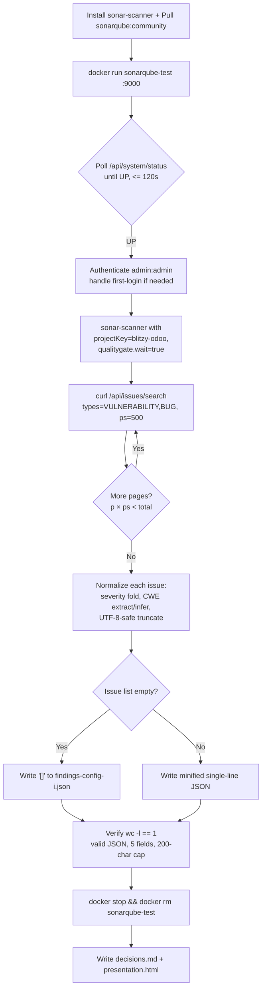

# Technical Specification

# 0. Agent Action Plan

## 0.1 Intent Clarification

### 0.1.1 Core Objective

Based on the provided requirements, the Blitzy platform understands that the objective is to perform a one-shot static security analysis of the `blitzy-odoo` repository using **SonarQube Community Build** in an ephemeral Docker container, then export the discovered vulnerabilities and bugs into a single, normalized JSON artifact named `findings-config-i.json` at the repository root. The artifact is one of multiple configuration outputs in a broader, comparative security-tooling exercise; therefore, the JSON schema, severity normalization, and CWE encoding MUST be deterministic so that downstream comparison against other tool configurations is apples-to-apples.

Restated with technical precision, the work consists of:

- Installing the `sonar-scanner` CLI on the Ubuntu host and pulling the `sonarqube:community` Docker image so that scan and server runtimes are present.
- Standing up a SonarQube server as an ephemeral container (`sonarqube-test`, port `9000`) backed by the embedded H2 database, polling `/api/system/status` until the server reports `UP`, and capturing the cold-start time as an observed metric.
- Executing `sonar-scanner` against the cloned `blitzy-odoo` source tree with `sonar.projectKey=blitzy-odoo` and `sonar.qualitygate.wait=true`, capturing wall-clock scan duration and the quality-gate result.
- Pulling all `VULNERABILITY` and `BUG` issues from `/api/issues/search` (paginated at `ps=500`) and recording the total issue count.
- Normalizing each issue into the unified schema (`file`, `line`, `severity`, `cwe`, `description`) with the exact field-mapping rules supplied by the user, then serializing as a UTF-8, minified, single-line JSON file. If zero issues are returned, the file MUST contain the literal `[]`.
- Tearing down the container (`docker stop && docker rm`) regardless of scan outcome.

Implicit requirements surfaced from the prompt and rule set:

- The Blitzy platform interprets the user's `[~0 files modified | 1 new file]` declaration as the **scan output only**. The Explainability and Executive Presentation rules expand the deliverable set with two additional new files (`decisions.md` and `presentation.html`). All three files are net-new at the repository root; no existing Odoo source file is altered.
- SonarQube CE forces a password change on the first interactive login. Because the scan is automated and uses `admin/admin` Basic Auth, the implementation must either tolerate the forced-change response, use a generated token via `/api/user_tokens/generate`, or pre-set the password via the unauthenticated bootstrap endpoint. The decision log MUST capture the chosen path.
- The severity mapping (`blocker/critical→critical`, `major→high`, `minor→medium`, `info→low`) MUST be implemented as a deterministic, total function over the Sonar `severity` enum so that re-runs against an unchanged codebase yield byte-identical output.
- The CWE field MUST be derived from rule tags first, then inferred from the rule description when tags do not carry a CWE identifier; the inference logic MUST be documented in the decision log.
- The 200-character description cap MUST be applied to the UTF-8 character count, not the byte count, and truncation MUST occur on a character boundary (no mid-character split).
- The container teardown MUST run even on scan failure to honor the "ephemeral" requirement and free port 9000.

### 0.1.2 Task Categorization

- Primary task type: **Security Enhancement / Tooling** — a SAST scan produces a vulnerability/bug inventory.
- Secondary aspects: **Configuration** (Docker container, scanner properties), **Reporting** (normalized JSON artifact for cross-tool comparison), and **Documentation** (decision log and executive presentation, both rule-mandated).
- Scope classification: **Isolated change** — only three new files are added at the repository root; no existing file under `addons/`, `odoo/`, `setup/`, `debian/`, `doc/`, `docs/`, or `.github/` is modified. The scanned source is **REFERENCE** material only.

### 0.1.3 Special Instructions and Constraints

Critical directives captured verbatim from the user prompt and preserved as authoritative pass/fail criteria:

- **Directive 1 (Install):** `sonar-scanner --version` returns a version string; `docker pull sonarqube:community` succeeds.
- **Directive 2 (Start):** Server responds with status `UP` within 120 seconds. Record cold-start time.
- **Directive 3 (Scan):** Scan completes and quality gate result is returned. Record scan duration (wall-clock).
- **Directive 4 (Export):** API returns JSON with an issues array. Record total issue count.
- **Directive 5 (Normalize and teardown):** `cat findings-config-i.json | wc -l` returns `1`. Valid JSON. Every finding has all 5 fields populated. No description exceeds 200 characters. Docker container is stopped and removed.

Methodological constraints derived from the user-specified rules:

- **Explainability:** every non-trivial decision (e.g., how `admin/admin` first-login is handled, how CWE is inferred when tags are absent, how UTF-8-safe truncation is done) MUST be entered in `decisions.md` with `what / alternatives / why / risks` columns. Rationale MUST NOT live in code comments.
- **Executive Presentation:** a self-contained reveal.js HTML deck (`presentation.html`) MUST accompany the deliverable, scoped to the work performed (scan scope, findings summary, risk posture, operational handoff).

User-Provided Examples (preserved verbatim):

User Example — installation commands:

```bash
apt install sonar-scanner
docker pull sonarqube:community
```

User Example — server startup:

```bash
docker run -d --name sonarqube-test -p 9000:9000 sonarqube:community
```

User Example — scan invocation:

```bash
sonar-scanner \
  -Dsonar.projectKey=blitzy-odoo \
  -Dsonar.sources=/path/to/blitzy-odoo \
  -Dsonar.host.url=http://localhost:9000 \
  -Dsonar.login=admin \
  -Dsonar.password=admin \
  -Dsonar.qualitygate.wait=true
```

User Example — issue export:

```bash
curl "http://localhost:9000/api/issues/search?componentKeys=blitzy-odoo&types=VULNERABILITY,BUG&ps=500"
```

User Example — output schema:

```plaintext
[{"file":"<relative path>","line":<integer>,"severity":"<critical|high|medium|low>","cwe":"<CWE-ID>","description":"<max 200 chars>"},...]
```

User Example — teardown:

```bash
docker stop sonarqube-test && docker rm sonarqube-test
```

User Example — field mapping (preserved verbatim):

| Field | Source |
| --- | --- |
| file | Issue component (relative path) |
| line | Issue line number |
| severity | blocker/critical→critical, major→high, minor→medium, info→low |
| cwe | Rule tags CWE ID. If absent, infer from rule description |
| description | Issue message, truncated to 200 characters |

Web search requirements satisfied during analysis:

- Confirmed `sonarqube:community` is the rolling Docker tag for the latest SonarQube Community Build, served on port 9000 with embedded H2 by default and admin/admin first-login credentials.
- Confirmed `sonar-scanner` CLI version is sourced from the apt repository per Directive 1 (`apt install sonar-scanner`); Ubuntu 24.04 LTS is the host platform.

### 0.1.4 Technical Interpretation

These requirements translate to the following technical implementation strategy:

- To **install the toolchain**, run the apt and docker commands specified in Directive 1 verbatim on the Ubuntu 24.04 host; verify `sonar-scanner --version` exits 0 and the image digest pull succeeds.
- To **stand up the ephemeral server**, run `docker run -d --name sonarqube-test -p 9000:9000 sonarqube:community` verbatim, then poll `http://localhost:9000/api/system/status` at a fixed interval until the JSON response contains `"status":"UP"`, aborting after 120 seconds.
- To **execute the scan**, invoke `sonar-scanner` with the exact `-D` switches in Directive 3, pointing `sonar.sources` to the local working copy of `blitzy-odoo`. `sonar.qualitygate.wait=true` blocks until the quality gate completes so the wall-clock duration covers analysis end-to-end.
- To **export findings**, call `/api/issues/search?componentKeys=blitzy-odoo&types=VULNERABILITY,BUG&ps=500` with HTTP Basic Auth (`admin:admin`); if the response `total` exceeds 500, increment `&p=<n>` until all pages are retrieved.
- To **normalize the payload**, extract each issue and emit a record per the field-mapping table, applying a deterministic severity-fold function, a `tags` → CWE-inference → `null`-safe pipeline for the `cwe` field, and a UTF-8-safe 200-character truncation on `description`. Serialize the resulting list with `json.dumps(..., ensure_ascii=False, separators=(',', ':'))` so the output is one line; if the list is empty, write the literal `[]`.
- To **tear down**, execute `docker stop sonarqube-test && docker rm sonarqube-test` in a finally-block so it runs on success and failure paths.
- To **satisfy the Explainability rule**, populate `decisions.md` with rows for each non-trivial choice made during installation, scanning, and normalization.
- To **satisfy the Executive Presentation rule**, generate `presentation.html` as a single self-contained file with the Blitzy reveal.js theme inlined, 12–18 sections (target 16), at least one non-text visual per slide, no fenced code blocks inside slides, and the four slide-type classes (`slide-title`, `slide-divider`, default content, `slide-closing`).


## 0.2 Repository Scope Discovery

### 0.2.1 Comprehensive File Analysis

The `blitzy-odoo` working copy at `/tmp/blitzy/blitzy-odoo/config-i_3c5818` (branch `config-i`, head commit `b58d620c4fb`) is a strategic fork of Odoo 19.0 [README.md:L1-L9, inferred — Odoo upstream]. Sonar will treat the entire tree as **REFERENCE** material; no file is modified by this task. The relevant inventory by extension, counted with `find` on the live tree, is:

| Extension / Path Pattern | Count | Role for SonarQube |
| --- | --- | --- |
| `*.py` under `addons/` | ~7,649 | Primary analysis target (SonarPython) |
| `*.py` under `odoo/` | ~529 | Primary analysis target (SonarPython) |
| `*.js` (repository-wide) | ~5,698 | Primary analysis target (SonarJS, mostly OWL components) |
| `*.xml` (repository-wide) | ~5,310 | Secondary target (views, manifests, data files) |
| `*.css` | ~39 | Secondary target |
| `*.scss` | ~1,100 | Secondary target |
| `addons/` direct module directories | 606 | Module roots scanned recursively |

Root metadata and tooling files inspected to characterize the codebase (all REFERENCE):

- `requirements.txt` [requirements.txt:L1-L99] — pinned Python dependencies with environment markers, drives SonarPython interpretation of stdlib/third-party imports.
- `ruff.toml` [ruff.toml:L7] — `target-version = "py310"` confirms the Python dialect; SonarPython will be configured to match.
- `setup.cfg` [setup.cfg:L4-L15] — flake8 RST conventions and extend-exclude list (`.git`, `.tx`, `debian`, `doc`, `setup`).
- `setup.py` [setup.py:L1-L4] — packaging entry point.
- `.gitignore` [.gitignore:L1-L1] — already excludes build artifacts and virtualenvs from version control; the scanner will inherit a clean source set.
- `README.md` [README.md:L1-L9] — confirms the repository's identity as the Odoo open-source business suite.
- `SECURITY.md` [SECURITY.md:L1-L3] — declares supported Odoo versions (a reference document; the scan output is the operational security signal for this task).
- `CONTRIBUTING.md` [CONTRIBUTING.md:L1-L3] — points to Odoo upstream contribution guidelines.
- `MANIFEST.in`, `COPYRIGHT`, `LICENSE`, `mkdocs.yml`, `catalog-info.yaml`, `odoo-bin`, `.weblate.json` — metadata, untouched.

No pre-existing SonarQube configuration was found: `find . -maxdepth 3 -type f \( -name "sonar-project.properties" -o -name "*.sonar*" -o -name "*findings*" -o -name "*.security.*" \)` returns no results. There are no prior scan reports, no `sonar-project.properties` file, and no `findings-config-*.json` artifacts to merge with or supersede.

No `.blitzyignore` files exist in the working tree (`find / -name ".blitzyignore" -type f` returned none), so all retrieved repository paths above are valid inputs to the scan.

### 0.2.2 Web Search Research Conducted

- SonarQube Community Build Docker image — confirmed `sonarqube:community` is the rolling tag pointing to the latest Community Build, exposes port `9000`, and uses an embedded H2 database when no `SONAR_JDBC_URL` is provided. Default credentials are `admin/admin`.
- SonarQube Docker engine compatibility — Docker Engine `≥ 20.10` is the SonarSource-recommended baseline for the official image.
- SonarQube `/api/system/status` — returns `UP` only when web server, compute engine, and Elasticsearch are all ready; this is the canonical readiness signal Directive 2 polls.
- SonarQube `/api/issues/search` — supports filtering by `componentKeys` and `types` (`VULNERABILITY`, `BUG`, `CODE_SMELL`); maximum page size is 500 (`ps=500`), and additional pages are fetched via `&p=<n>`.
- Rule tags carry CWE identifiers (e.g., `cwe-79`, `cwe-89`) on a subset of Sonar's security rules; rules without explicit CWE tags often reference CWE numbers in the long description, which justifies the user-specified inference step in the field-mapping table.
- SonarQube CE has been CWE-compatible since 2015, so CWE-tag presence on security rules is the expected source of truth.

### 0.2.3 Existing Infrastructure Assessment

- **Project structure:** standard Odoo layout — `addons/` (functional modules, 606 directories), `odoo/` (framework core, 529 `.py` files), `setup/`, `debian/` (packaging), `doc/` and `docs/` (documentation), `.github/` (CI/workflows).
- **Existing static analysis tooling:** Ruff (`ruff.toml` [ruff.toml:L7]) targeting Python 3.10 and flake8 with RST extensions (`setup.cfg` [setup.cfg:L4-L15]). These are linting tools, not SAST tools; they do not overlap with Sonar's vulnerability/bug rule set.
- **Build/deployment configuration:** `setup.py` and `MANIFEST.in` for sdist packaging, `debian/` for Debian packaging, `mkdocs.yml` for documentation. None require changes.
- **CI/Workflows:** `.github/` directory present but not modified by this task. Sonar is invoked ad-hoc from the host shell, not from CI.
- **Documentation system:** mkdocs (`mkdocs.yml`) plus inline doc trees under `doc/` and `docs/`; the executive presentation is delivered alongside `findings-config-i.json` as a standalone HTML file, not integrated into mkdocs.
- **Testing infrastructure:** Odoo's own test runner via `odoo-bin`; this scan does not exercise tests and does not depend on the test infrastructure being green.
- **Backstage / ownership:** the project is registered as `blitzy-odoo` under the `blitzy-sandbox` organization on the `19.0` branch, per the technical specification [Tech Spec §1.1].


## 0.3 Scope Boundaries

### 0.3.1 Exhaustively In Scope

The work creates three net-new files at the repository root and leaves every other path untouched.

- New artifacts (CREATE):
    - `findings-config-i.json` — minified, single-line, UTF-8 JSON array of normalized findings. Required by user Directive 5. Empty result set is encoded as the literal `[]`.
    - `decisions.md` — Markdown decision log with `What / Alternatives / Why / Risks` columns covering every non-trivial implementation choice. Required by the Explainability rule.
    - `presentation.html` — single self-contained reveal.js executive summary, 12–18 sections (target 16), Blitzy brand theme inlined. Required by the Executive Presentation rule.

- Read-only inputs (REFERENCE) consumed by the scanner:
    - `addons/**/*.py` — 7,649 files, primary Python analysis target.
    - `addons/**/*.js` — Odoo addon JavaScript, contributes to the 5,698 `.js` total.
    - `addons/**/*.xml` — Odoo addon XML views and data files, contributes to the 5,310 `.xml` total.
    - `odoo/**/*.py` — 529 framework Python files.
    - `odoo/**/*.js`, `odoo/**/*.xml`, `odoo/**/*.css`, `odoo/**/*.scss` — framework front-end assets.
    - `ruff.toml` [ruff.toml:L7] — Python target version reference for analyzer configuration.
    - `requirements.txt` [requirements.txt:L1-L99] — dependency manifest, read by SonarPython for import resolution; not modified.
    - `setup.py`, `setup.cfg`, `MANIFEST.in`, `COPYRIGHT`, `LICENSE`, `README.md`, `SECURITY.md`, `CONTRIBUTING.md`, `mkdocs.yml`, `catalog-info.yaml`, `odoo-bin`, `.weblate.json`, `.gitignore`, `.github/**`, `debian/**`, `doc/**`, `docs/**`, `setup/**` — repository metadata and supporting trees, read by the scanner where applicable, never modified.

- Ephemeral resources created and destroyed within this task (not persisted as files):
    - Docker container `sonarqube-test` (image `sonarqube:community`, port mapping `9000:9000`).
    - SonarQube project `blitzy-odoo` in the container's embedded H2 database.
    - Local sonar-scanner work files under `.scannerwork/` (transient; not committed).

### 0.3.2 Explicitly Out of Scope

- Any modification of `addons/**`, `odoo/**`, `setup/**`, `debian/**`, `doc/**`, `docs/**`, `.github/**`, `requirements.txt`, `setup.py`, `setup.cfg`, `ruff.toml`, `mkdocs.yml`, `catalog-info.yaml`, `LICENSE`, `COPYRIGHT`, `MANIFEST.in`, `README.md`, `SECURITY.md`, `CONTRIBUTING.md`, `.gitignore`, `.weblate.json`, or `odoo-bin`. The user's prompt explicitly classifies the change set as `~0 files modified | 1 new file` (extended by rule-mandated artifacts to 3 new files).
- Fixing, triaging, or filing follow-ups for the vulnerabilities and bugs Sonar discovers. The deliverable is the normalized inventory, not remediation.
- Adding `sonar-project.properties`, CI workflow integration, or persisting any SonarQube configuration beyond the ephemeral container.
- Provisioning a production-grade SonarQube database (PostgreSQL). The embedded H2 database is sufficient for an ephemeral, single-run scan and is the default for the `sonarqube:community` image.
- Running other SonarQube editions (Developer, Enterprise, Data Center) — only Community Build is in scope per Directive 1.
- Scanning languages beyond what the Community Build supports out of the box; no custom plugin installation.
- Comparison with other security tools' outputs. Cross-tool comparison is the consumer of `findings-config-i.json`, not part of this configuration.
- Translating, internationalizing, or rewriting the rule descriptions emitted by Sonar; the `description` field is the verbatim Sonar `message` truncated to 200 UTF-8 characters.
- Performance tuning of the SonarQube container (JVM heap, Elasticsearch limits) beyond what the upstream image provides.
- Any UI work — the only HTML produced is `presentation.html`, which is a standalone reveal.js deck, not a Sonar UI customization.
- Updates to any Python or JavaScript dependency manifest.


## 0.4 Dependency Inventory

### 0.4.1 Key Tooling Required for This Task

These tools are installed or pulled by the implementation. They are not Python or JavaScript dependencies of the `blitzy-odoo` codebase, and no manifest file (`requirements.txt`, `package.json`, `setup.py`) is modified.

| Registry | Package Name | Version | Purpose |
| --- | --- | --- | --- |
| Docker Hub | `sonarqube` | `community` (rolling tag) | SonarQube Community Build server runtime (embedded H2 database, port 9000); pulled per Directive 1 |
| Ubuntu apt | `sonar-scanner` | Distribution-provided (Ubuntu 24.04 repository) | SonarScanner CLI, the analyzer invoked in Directive 3; pulled per `apt install sonar-scanner` |
| OS (apt) | `docker` (Docker Engine) | `≥ 20.10` (SonarSource baseline for the official image) | Container runtime that executes the SonarQube image |
| OS (apt) | `curl` | Ubuntu 24.04 distribution version | HTTP client for polling `/api/system/status` and `/api/issues/search` per Directives 2 and 4 |
| OS (apt) | `python3` | Ubuntu 24.04 distribution version (system) | JSON normalization step (severity fold, CWE inference, UTF-8-safe truncation, single-line minification) per Directive 5 |

Rationale for unpinned image and apt versions:

- The user's Directive 1 names the artifact by tag (`sonarqube:community`) and by package (`sonar-scanner`) rather than by numeric version. This is the literal interpretation and is honored — the rolling `community` tag and the apt-provided scanner are the artifacts the user requested.
- Because the scan is ephemeral and produces a stateless JSON artifact, choosing the rolling tag yields the latest rule set and CWE coverage at the time of execution; pinning a numeric version is unnecessary and would deviate from the prompt. This decision is logged in `decisions.md` per the Explainability rule.

### 0.4.2 Codebase Dependency Changes

- **New dependencies to add:** None. No package is added to `requirements.txt`, no JavaScript dependency is added to any `package.json`, no system package becomes a runtime requirement of `blitzy-odoo` itself.
- **Dependencies to update:** None. The `requirements.txt` pin set [requirements.txt:L1-L99] is untouched.
- **Dependencies to remove:** None.
- **Import / reference updates:** None. No Python `import` statement, no JavaScript `import`/`require`, and no Odoo manifest entry changes. The scan is read-only with respect to the source tree.

### 0.4.3 External Service and Network Dependencies

- **Docker Hub** — outbound network access required for `docker pull sonarqube:community`. One-time pull per host.
- **Ubuntu apt repository** — outbound network access required for `apt install sonar-scanner`. One-time install per host.
- **`localhost:9000`** — local TCP port for SonarScanner → SonarQube and curl → SonarQube traffic. No remote SonarQube server is contacted; no SonarCloud account or organization key is required.


## 0.5 Implementation Design

### 0.5.1 Technical Approach

Primary objectives map to specific actions as follows:

- Achieve **toolchain readiness** by installing `sonar-scanner` from the Ubuntu apt repository and pulling `sonarqube:community` from Docker Hub; verify each via `sonar-scanner --version` and a successful pull. Rationale: literal compliance with Directive 1 and avoidance of any host-local SonarQube install drift.
- Achieve **server availability** by running `docker run -d --name sonarqube-test -p 9000:9000 sonarqube:community` and polling `GET /api/system/status` until the JSON body contains `"status":"UP"`, with a hard 120-second deadline. Rationale: the official image uses an embedded H2 database which is sufficient for a one-shot scan, and `/api/system/status` is the canonical readiness probe.
- Achieve **analysis coverage** by executing `sonar-scanner` with `-Dsonar.sources=<repo path>` pointed at the working copy and `-Dsonar.qualitygate.wait=true` so the wall-clock time captures the entire pipeline through the compute engine. Rationale: the wait flag is the only way to make the CLI's exit time correlate to "analysis finished."
- Achieve **complete issue export** by calling `/api/issues/search` with `componentKeys=blitzy-odoo&types=VULNERABILITY,BUG&ps=500`, then iterating `&p=<n>` until the cumulative `paging.total` is exhausted. Rationale: the maximum page size is 500; without pagination, issue counts above 500 are silently truncated, which would corrupt the cross-tool comparison.
- Achieve **schema fidelity** by passing each issue through a deterministic normalization pipeline that (a) computes `file` from `component`, (b) reads `line` from `line` (defaulting to a documented sentinel if absent), (c) folds `severity` via the user-specified map, (d) extracts CWE from `tags` then infers from rule description if absent, and (e) truncates `message` to 200 UTF-8 characters at a character boundary. Rationale: deterministic transformation is required so re-running the same Sonar version against the same codebase yields byte-identical JSON.
- Achieve **artifact correctness** by serializing the list with compact separators (`(',', ':')`) and `ensure_ascii=False`, writing exactly one `\n`-free line to `findings-config-i.json`, or the literal `[]` when zero issues are returned. Rationale: Directive 5 mandates `wc -l == 1` and UTF-8 encoding.
- Achieve **environmental hygiene** by tearing down the container in a finally-block (`docker stop sonarqube-test && docker rm sonarqube-test`) so port 9000 and disk are reclaimed even on error.
- Achieve **decision traceability** by writing `decisions.md` alongside the JSON output, with explicit rows for every choice that a competent engineer could have made differently (admin-bootstrap strategy, severity-fold direction, CWE inference order, truncation semantics, container-restart policy, etc.).
- Achieve **executive visibility** by writing `presentation.html` as a self-contained reveal.js deck following the Blitzy brand theme, scoped to scan results and operational handoff.

Logical implementation flow (NOT a timeline). Each step depends on the prior step's successful completion.

1. Install — `apt install -y sonar-scanner` and `docker pull sonarqube:community`; verify `sonar-scanner --version` exits zero.
2. Start — `docker run -d --name sonarqube-test -p 9000:9000 sonarqube:community`.
3. Wait — poll `http://localhost:9000/api/system/status` with `curl` until `"status":"UP"`; abort after 120 s; record cold-start time.
4. Authenticate — attempt scan with `-Dsonar.login=admin -Dsonar.password=admin`; if SonarQube CE has forced a password change on first login, fall through to the bootstrap path documented in `decisions.md` (e.g., `POST /api/users/change_password` or `POST /api/user_tokens/generate`).
5. Scan — `sonar-scanner -Dsonar.projectKey=blitzy-odoo -Dsonar.sources=<repo path> -Dsonar.host.url=http://localhost:9000 -Dsonar.qualitygate.wait=true`; record wall-clock duration.
6. Export — `curl "http://localhost:9000/api/issues/search?componentKeys=blitzy-odoo&types=VULNERABILITY,BUG&ps=500"`; paginate while `(p × ps) < paging.total`.
7. Normalize — apply the field-mapping pipeline (severity fold, CWE extract/infer, UTF-8-safe 200-char truncate) to every issue.
8. Write — emit `findings-config-i.json` minified to one line; if the issue list is empty, write the literal `[]`.
9. Verify — `cat findings-config-i.json | wc -l` returns `1`; the file parses as valid JSON; every element has the five mandatory fields populated; no `description` exceeds 200 characters.
10. Teardown — `docker stop sonarqube-test && docker rm sonarqube-test` (idempotent, runs on success and failure).
11. Documentation — write `decisions.md` (Explainability) and `presentation.html` (Executive Presentation).



### 0.5.2 Component Impact Analysis

- **Direct modifications required:** none in the `blitzy-odoo` source tree. The change set is purely additive at the repository root.
- **Net-new components introduced (all at repo root):**
    - `findings-config-i.json` — the canonical, normalized scan output.
    - `decisions.md` — the decision log demanded by the Explainability rule.
    - `presentation.html` — the executive deck demanded by the Executive Presentation rule.
- **Indirect impacts and dependencies:**
    - The ephemeral container creates ports/files (`/var/lib/docker/...`) that the teardown step reclaims; nothing persists once the container is removed.
    - The local `.scannerwork/` directory may be produced by sonar-scanner at the source root; it is transient and not committed (already excluded by typical `.gitignore` patterns).
- **No external system integrations changed:** no CI workflow, no Backstage manifest, no upstream Odoo configuration is touched.

### 0.5.3 Critical Implementation Details

- **Severity fold (deterministic, total function):** map Sonar severities `BLOCKER` and `CRITICAL` to `critical`, `MAJOR` to `high`, `MINOR` to `medium`, `INFO` to `low`. The function MUST raise a clear error on any unknown severity so an upstream Sonar change is caught explicitly rather than silently degrading the schema.
- **CWE extraction with inference fallback:**
    - First, scan `issue.tags` for any string matching `^cwe-(\d+)$` (case-insensitive); emit `CWE-<n>` for the first match.
    - If no tag matches, fetch the rule's `htmlDesc` / `mdDesc` via `/api/rules/show?key=<rule>` and regex-search for `CWE-?\d+`; emit the first match.
    - If no inference is possible, emit a documented sentinel (the decision log captures the precise value).
- **UTF-8-safe truncation:** convert the message to a Python `str`, slice with `s[:200]` (Python slices over code points, not bytes), and never byte-slice. This avoids producing invalid UTF-8 sequences.
- **Path normalization for `file`:** Sonar `component` strings have the shape `<projectKey>:<relative path>`. The implementation strips the `blitzy-odoo:` prefix so `file` is a clean repo-relative path identical to what other security tools in the comparison emit.
- **Single-line minification:** `json.dumps(records, ensure_ascii=False, separators=(',', ':'))` followed by `Path('findings-config-i.json').write_text(payload, encoding='utf-8')` produces a single-line, UTF-8 file with no trailing newline.
- **Empty-set encoding:** when `records == []`, the literal two-byte string `[]` is written. The verification `wc -l` returns `1` only when the file lacks a trailing newline; the writer MUST NOT append one.
- **Pagination upper bound:** SonarQube returns at most 10,000 results across all pages by default. If the codebase produces more issues, the implementation MUST either narrow the query (e.g., by file) or document the upper-bound truncation in `decisions.md`. The expectation for `blitzy-odoo` is well under this bound.
- **Teardown idempotency:** the teardown step is wrapped in a `finally` (or shell `trap EXIT`) so that scanner failures, network errors, or pagination errors still result in container removal.
- **No code-comment rationale:** per the Explainability rule, the rationale for each of the above choices lives in `decisions.md`, not in inline comments of any script used to drive the workflow.

### 0.5.4 User Interface Design

Not applicable. This task produces no user-facing UI in `blitzy-odoo`. The only HTML emitted is `presentation.html`, a standalone reveal.js executive summary intended to be opened in a browser; its visual rules are governed by the Executive Presentation rule (sub-section 0.7) and do not interact with the Odoo UI in any way.

### 0.5.5 User-Provided Examples Integration

- The user's installation block is implemented verbatim in step 1 of the flow.
- The user's `docker run` line is the literal command in step 2.
- The user's `sonar-scanner` invocation (all six `-D` options, including `qualitygate.wait=true`) is the literal command in step 5.
- The user's `curl` URL (`componentKeys=blitzy-odoo&types=VULNERABILITY,BUG&ps=500`) is the literal request in step 6, with `&p=<n>` appended on subsequent pages.
- The user's field-mapping table is implemented exactly as written; the output schema example is the canonical contract for `findings-config-i.json`.
- The user's teardown command is the literal final cleanup in step 10.

## 0.6 File Transformation Mapping

### 0.6.1 File-by-File Execution Plan

Three files are created at the repository root. Zero existing files are modified or deleted. The entire `blitzy-odoo` source tree is REFERENCE (read-only input to SonarQube).

| Target File | Transformation | Source File / Reference | Purpose / Changes |
| --- | --- | --- | --- |
| `findings-config-i.json` | CREATE | SonarQube `/api/issues/search` response | Normalized, minified, single-line UTF-8 JSON array of `VULNERABILITY` and `BUG` findings per Directive 5 schema. Empty result encoded as `[]`. |
| `decisions.md` | CREATE | Implementation choices in this Agent Action Plan | Markdown decision log table (What / Alternatives / Why / Risks) covering every non-trivial choice (admin first-login handling, severity-fold direction, CWE inference order, UTF-8 truncation semantics, container teardown discipline, Sonar tag pinning). Mandated by the Explainability rule. |
| `presentation.html` | CREATE | Blitzy reveal.js theme (Executive Presentation rule) | Single self-contained reveal.js HTML deck, 12–18 sections (target 16), inlined Blitzy theme CSS, CDN-pinned reveal.js 5.1.0 / Mermaid 11.4.0 / Lucide 0.460.0, no emoji, no fenced code in slides, ≥ 1 non-text visual per slide. Mandated by the Executive Presentation rule. |
| `addons/**/*.py` | REFERENCE | upstream Odoo 19 fork | ~7,649 files; SonarPython primary input. Not modified. |
| `addons/**/*.js` | REFERENCE | upstream Odoo 19 fork | Contributes to the ~5,698 `.js` total; SonarJS input. Not modified. |
| `addons/**/*.xml` | REFERENCE | upstream Odoo 19 fork | Contributes to the ~5,310 `.xml` total; Sonar XML rules. Not modified. |
| `odoo/**/*.py` | REFERENCE | upstream Odoo 19 framework | ~529 files; SonarPython input. Not modified. |
| `odoo/**/*.{js,xml,css,scss}` | REFERENCE | upstream Odoo 19 framework | Front-end assets; analyzed where Sonar CE supports the language. Not modified. |
| `ruff.toml` | REFERENCE | repository root [ruff.toml:L7] | `target-version = "py310"` informs the Python dialect of the analysis. Not modified. |
| `requirements.txt` | REFERENCE | repository root [requirements.txt:L1-L99] | Dependency manifest, used by SonarPython for import resolution. Not modified. |
| `setup.py`, `setup.cfg`, `MANIFEST.in` | REFERENCE | repository root | Packaging metadata. Not modified. |
| `README.md`, `SECURITY.md`, `CONTRIBUTING.md`, `LICENSE`, `COPYRIGHT`, `mkdocs.yml`, `catalog-info.yaml`, `.weblate.json`, `.gitignore`, `odoo-bin` | REFERENCE | repository root | Documentation and metadata. Not modified. |
| `.github/**`, `debian/**`, `doc/**`, `docs/**`, `setup/**` | REFERENCE | repository root sub-trees | Workflows, packaging, and documentation trees. Not modified. |

There are no `UPDATE` or `DELETE` rows. The user's prompt declares `~0 files modified` and the implementation respects that boundary exactly; the rule-mandated additions are all CREATE operations on net-new paths.

### 0.6.2 New Files Detail

- **`findings-config-i.json`** — repo-root output of Directive 5.
    - Content type: data (JSON).
    - Based on: SonarQube `/api/issues/search` response, transformed per the user's field-mapping table.
    - Required shape (preserved verbatim from the prompt):

```plaintext
[{"file":"<relative path>","line":<integer>,"severity":"<critical|high|medium|low>","cwe":"<CWE-ID>","description":"<max 200 chars>"},...]
```

    - Verification gates (verbatim from Directive 5):
        - `cat findings-config-i.json | wc -l` returns `1`.
        - File parses as valid JSON.
        - Every finding has all 5 fields populated.
        - No `description` exceeds 200 characters.
        - Encoding is UTF-8.
        - If zero findings, the file contains the literal `[]`.

- **`decisions.md`** — repo-root decision log (Explainability rule).
    - Content type: Markdown documentation with a single decision-log table.
    - Mandatory columns: `What`, `Alternatives`, `Why`, `Risks`.
    - Mandatory rows (minimum set; additional rows added as decisions arise):
        - SonarQube image tag selection (`community` rolling vs. pinned numeric).
        - Embedded H2 database vs. external PostgreSQL for the ephemeral run.
        - admin/admin first-login handling strategy.
        - Severity fold mapping (literal interpretation of the user's table).
        - CWE extraction order (tags → rule description regex → sentinel).
        - UTF-8-safe truncation semantics (code-point slice, not byte slice).
        - Path normalization for the `file` field (strip `<projectKey>:` prefix).
        - Empty result encoding (`[]` with no trailing newline).
        - Pagination strategy (`ps=500`, `p` increment until `total` exhausted).
        - Teardown placement (finally-block / shell `trap`).
    - Constraint: rationale MUST NOT be duplicated as inline code comments; this file is the single source of truth for "why."

- **`presentation.html`** — repo-root executive summary (Executive Presentation rule).
    - Content type: single self-contained HTML file, no build step, no local file dependencies.
    - Structural requirements: 12–18 `<section>` elements (target 16), four slide types (`slide-title`, `slide-divider`, default content, `slide-closing`), every slide includes at least one non-text visual (Mermaid diagram, KPI card, styled table, or `<i data-lucide>` icon), content slides cap at 4 bullets / 40 words / 1 visual.
    - Theme requirements: inline `<style>` containing the full Blitzy CSS custom-property set documented in the Executive Presentation rule; Google Fonts `<link>` loads Inter (400/500/600/700), Space Grotesk (500/600/700), Fira Code (400/500); CDN-pinned reveal.js `5.1.0`, Mermaid `11.4.0`, Lucide `0.460.0`.
    - Slide ordering convention: (1) Title — project name, scope, audience framing; (2) Content — headline findings or KPI summary; (3) Content — architecture overview (Mermaid diagram of the scan pipeline); (4..N) alternating Section Dividers + Content slides for each major topic (scope, scan flow, findings inventory, risks, operational handoff, next steps); (N+1) Closing — key takeaway, next steps, brand lockup.
    - reveal.js configuration: `hash: true`, `transition: 'slide'`, `controlsTutorial: false`, `width: 1920`, `height: 1080`.
    - Mermaid configuration: `startOnLoad: false`; `mermaid.run()` invoked after reveal.js `ready` and on every `slidechanged` event; theme variables `primaryColor: '#F2F0FE'`, `primaryTextColor: '#333333'`, `primaryBorderColor: '#5B39F3'`, `lineColor: '#999999'`, `secondaryColor: '#F4EFF6'`.
    - Lucide configuration: `lucide.createIcons()` invoked after `ready` and on every `slidechanged` event.
    - Prohibited: emoji of any kind, fenced code blocks inside slides (only inline Fira Code for short expressions), text-only slides.

### 0.6.3 Files to Modify Detail

None. The change set adds three new files and modifies zero existing files.

### 0.6.4 Configuration and Documentation Updates

- **Configuration changes:** none. No `sonar-project.properties`, no CI workflow update, no environment file change. All scanner parameters are passed as `-D` flags on the `sonar-scanner` command line in step 5 of the implementation flow.
- **Documentation updates:** none in pre-existing files. The two new files `decisions.md` and `presentation.html` are themselves documentation artifacts at the repo root.

### 0.6.5 Cross-File Dependencies

- `decisions.md` references decisions enacted in the implementation flow that produced `findings-config-i.json`. Any change to the implementation flow MUST be reflected as an updated row in `decisions.md`.
- `presentation.html` summarizes the findings recorded in `findings-config-i.json` (counts, top severities, representative CWEs). The KPI cards and tables in the deck draw their numbers from the JSON output at generation time; subsequent regenerations of the JSON require the deck to be regenerated.
- No source-code import or reference graph is touched. Sonar's analysis is read-only with respect to the codebase.


## 0.7 Rules

### 0.7.1 Task-Specific Rules and Requirements

The user-supplied prompt and the user-supplied implementation rules combine into the following authoritative constraint set. They are listed verbatim where the source is the user.

- **Directive 1 (Install) — pass/fail (verbatim):** `sonar-scanner --version` returns a version string. `docker pull sonarqube:community` succeeds.
- **Directive 2 (Start) — pass/fail (verbatim):** Server responds with status `UP` within 120 seconds.
- **Directive 3 (Scan) — pass/fail (verbatim):** Scan completes and quality gate result is returned.
- **Directive 4 (Export) — pass/fail (verbatim):** API returns JSON with an issues array.
- **Directive 5 (Normalize and teardown) — pass/fail (verbatim):** `cat findings-config-i.json | wc -l` returns `1`. Valid JSON. Every finding has all 5 fields populated. No description exceeds 200 characters. Docker container is stopped and removed.
- **Field-mapping contract (verbatim):** the five-column table reproduced in 0.1.3 governs the schema. Severity buckets, CWE source order, and the 200-character description cap are non-negotiable.
- **Output schema (verbatim):** the JSON shape in 0.1.3 is the canonical contract; the file MUST be a single line of UTF-8.
- **Empty-set encoding (verbatim):** "If zero findings, write `[]`."

### 0.7.2 Explainability Rule (user-specified implementation rule)

Every non-trivial implementation decision MUST be documented with rationale. A decision is non-trivial if a competent engineer could reasonably have chosen differently.

- Deliver a decision log as a Markdown table: what was decided, what alternatives existed, why this choice was made, and what risks it carries.
- For migrations or refactors, include a bidirectional traceability matrix mapping source constructs to target implementations — 100% coverage, no gaps. (Not applicable to this scan task; no migration is performed. The decision log explicitly records this non-applicability so the gap is acknowledged rather than silently omitted.)
- Any deviation from a literal or obvious interpretation of the requirements MUST have an explicit entry in the decision log. Unexplained deviations are treated as defects.
- Do not embed rationale in code comments. The decision log is the single source of truth for "why" decisions.

Project-specific application to this task: `decisions.md` is the file that realizes this rule. The mandatory rows enumerated in 0.6.2 (image-tag choice, embedded H2 vs. external Postgres, admin/admin handling, severity fold, CWE inference order, UTF-8-safe truncation, file-path prefix stripping, empty-set encoding, pagination strategy, teardown placement) cover every non-trivial decision identified during planning. Additional rows are added as new decisions arise during execution.

### 0.7.3 Executive Presentation Rule (user-specified implementation rule)

Every deliverable MUST include an executive summary as a single self-contained reveal.js HTML file that is ALWAYS included independent of any other documentation that exists. The audience is non-technical leadership — communicate business value, risk, and operational readiness without requiring code literacy.

The presentation MUST cover: (1) what was done — scope of work and deliverables, (2) why it was done — business value unlocked, (3) what changed architecturally — component/data-flow diagrams, (4) what risks exist and how they are mitigated, (5) how the team onboards and continues development. Scope the presentation to the work performed; this scan task warrants a scope-and-flow diagram, a findings-summary KPI grid, a top-risks slide, and an operational handoff slide.

Slide constraints:

- 12–18 slides total (target: 16).
- Four slide types: Title (`slide-title`), Section Divider (`slide-divider`), Content (default), Closing (`slide-closing`).
- Every slide MUST include at least one non-text visual element (Mermaid diagram, KPI card, styled table, or Lucide SVG icon). No text-only slides.
- Content slides: max 4 bullets, max 40 words body text, min 1 non-text visual.
- Zero emoji — use Lucide SVG icons via `<i data-lucide="icon-name"></i>` only.
- No fenced code blocks inside slides — use inline Fira Code for short expressions only.

Visual identity (Blitzy brand):

- Color palette: `#5B39F3` (primary), `#2D1C77` (dark), `#94FAD5` (teal accent), `#1A105F` (navy), `#7A6DEC`/`#4101DB` (gradient stops), neutrals `#333333`, `#999999`, `#D9D9D9`, `#F4EFF6`, `#F5F5F5`, `#FFFFFF`.
- Typography: Inter (body, 400/500/600/700), Space Grotesk (display headings, 500/600/700), Fira Code (mono/eyebrows, 400/500) — loaded via Google Fonts `<link>`.
- Title slide: hero gradient `linear-gradient(68deg, #7A6DEC 15.56%, #5B39F3 62.74%, #4101DB 84.44%)`, white text, eyebrow in Fira Code teal.
- Dividers: dark purple `#2D1C77` or gradient background, large centered heading, thematic Lucide icon.
- Closing: navy `#1A105F` background, 3–6 word takeaway heading, max 3 bullets, brand lockup, gradient accent bar.

Mermaid diagrams:

- Embed as `<pre class="mermaid">` with raw Mermaid syntax.
- Initialize with `startOnLoad: false`; call `mermaid.run()` after reveal.js `ready` and on every `slidechanged` event.
- Theme variables: `primaryColor: '#F2F0FE'`, `primaryTextColor: '#333333'`, `primaryBorderColor: '#5B39F3'`, `lineColor: '#999999'`, `secondaryColor: '#F4EFF6'`.

Technical delivery:

- Single self-contained HTML file, no build steps, no local file dependencies.
- CDN versions pinned: reveal.js 5.1.0, Mermaid 11.4.0, Lucide 0.460.0.
- reveal.js config: `hash: true`, `transition: 'slide'`, `controlsTutorial: false`, `width: 1920`, `height: 1080`.
- Lucide: call `lucide.createIcons()` after `ready` and on every `slidechanged` event.

Inline CSS — embed the full Blitzy reveal.js theme inline in a `<style>` tag. Required CSS custom properties:

```css
:root {
  --blitzy-primary: #5B39F3;
  --blitzy-primary-dark: #2D1C77;
  --blitzy-primary-navy: #1A105F;
  --blitzy-primary-light: #7A6DEC;
  --blitzy-primary-deep: #4101DB;
  --blitzy-accent-teal: #94FAD5;
  --blitzy-surface-0: #FFFFFF;
  --blitzy-surface-1: #F4EFF6;
  --blitzy-surface-2: #F2F0FE;
  --blitzy-surface-3: #F5F5F5;
  --blitzy-border: #D9D9D9;
  --blitzy-border-soft: rgba(91, 57, 243, 0.18);
  --blitzy-text: #333333;
  --blitzy-text-muted: #999999;
  --blitzy-text-invert: #FFFFFF;
  --ff-body: 'Inter', system-ui, sans-serif;
  --ff-display: 'Space Grotesk', 'Inter', sans-serif;
  --ff-mono: 'Fira Code', 'Courier New', monospace;
  --gradient-hero: linear-gradient(68deg, #7A6DEC 15.56%, #5B39F3 62.74%, #4101DB 84.44%);
  --gradient-divider: linear-gradient(135deg, #2D1C77 0%, #5B39F3 100%);
  --gradient-accent-bar: linear-gradient(90deg, #5B39F3 0%, #94FAD5 100%);
}
```

Include the full set of slide-type classes (`slide-title`, `slide-divider`, `slide-closing`), component classes (`kpi-card`, `kpi-grid`, `kpi-value`, `kpi-label`, `kpi-icon`, `eyebrow`, `accent-bar`, `brand-lockup`, `hero-icon`, `icon-row`), and the mermaid container class. These are defined in the canonical theme file at `blitzy-deck/references/blitzy-reveal-theme.css`.

Slide ordering convention applied to this task:

1. Title Slide — "Blitzy-Odoo Security Scan: SonarQube Config I", audience framing.
2. Content — headline KPIs (total issues, top severities) drawn from `findings-config-i.json`.
3. Content — architecture overview (Mermaid: install → start → scan → export → normalize → teardown).
4–N. Alternating Section Dividers + Content Slides for each major topic: scope, scan flow, findings inventory, top risks, operational handoff, decisions referenced from `decisions.md`.
N+1. Closing Slide — key takeaway, next steps (e.g., consume `findings-config-i.json` in the cross-tool comparator), brand lockup.

Verification: the HTML file opens in a browser, renders all Mermaid diagrams and Lucide icons, contains 12–18 `<section>` elements, and every `<section>` contains at least one non-text visual element.

### 0.7.4 Design System Alignment

Not applicable to this task. The Design System Alignment Protocol triggers only when a UI component library or design system is referenced in the user's prompt; this prompt names no such system, defines no Odoo UI components, and produces no Odoo-facing UI. The Executive Presentation rule's Blitzy brand requirements are governed by 0.7.3 above and apply only to the standalone `presentation.html` file.


## 0.8 Special Instructions

### 0.8.1 Special Execution Instructions

- This is a **security-scanning configuration task**, not a feature or refactor. The Odoo codebase is treated as immutable input. No source code, dependency manifest, CI workflow, or documentation file in the existing tree is altered.
- The SonarQube server runs **ephemerally** — created at the start of execution and destroyed at the end. No SonarQube data, project, or container is expected to persist after this task completes.
- The `findings-config-i.json` output is **one of several configuration outputs** in a multi-tool comparison. Schema stability (field names, field types, severity bucket strings, CWE encoding) MUST be preserved exactly so that downstream comparisons across configs are valid.
- All five user directives (Install, Start, Scan, Export, Normalize-and-teardown) and all five pass/fail criteria are preserved verbatim in 0.7.1 and govern the implementation; deviations require a logged entry in `decisions.md`.
- Total deliverable count is **3 new files at the repository root**: `findings-config-i.json` (user-requested), `decisions.md` (Explainability rule), `presentation.html` (Executive Presentation rule). The user's `[~0 files modified | 1 new file]` declaration refers to source-tree modifications and the user-specified output; the two rule-mandated artifacts are additive and do not modify any pre-existing file.

### 0.8.2 Constraints and Boundaries

- **Technical constraints**
    - SonarQube **Community Build** only (image tag `community`); Developer, Enterprise, and Data Center editions are out of scope.
    - Embedded **H2** database for the ephemeral run; no external PostgreSQL provisioning.
    - Port `9000` on `localhost` is the only network endpoint involved. No reverse proxy, no TLS, no remote SonarQube.
    - Default `admin/admin` credentials per the user's `sonar-scanner` command. First-login password-change behavior is handled per the chosen bootstrap path documented in `decisions.md`.
    - 200-character description cap is measured in **UTF-8 code points**, with truncation on a character boundary.
    - Pagination is required if the issue count exceeds 500; `ps=500` per page with `p` increment is the canonical pattern.
- **Process constraints**
    - The container teardown MUST run regardless of scan success or failure (finally-block / `trap EXIT`).
    - No rationale is to be embedded in code comments; `decisions.md` is the single source of "why" per the Explainability rule.
    - The executive presentation MUST be generated regardless of the size or content of the findings file, per the Executive Presentation rule's "ALWAYS included" clause.
- **Output constraints**
    - `findings-config-i.json` MUST be exactly one line of UTF-8 with no trailing newline (`wc -l == 1`).
    - Every record MUST have all five fields populated (`file`, `line`, `severity`, `cwe`, `description`).
    - `description` MUST NOT exceed 200 characters.
    - Empty result set MUST be encoded as the two-byte literal `[]`.
    - `presentation.html` MUST be a single self-contained file with **no** local file dependencies and **no** build step required; all assets are inlined CSS or CDN-pinned JS/CSS (reveal.js 5.1.0, Mermaid 11.4.0, Lucide 0.460.0) and Google Fonts loaded via `<link>`.
- **Timeline / dependency constraints**
    - Server cold-start MUST complete within 120 seconds (Directive 2).
    - Scan duration is **recorded** but not bounded by a pass/fail threshold.
    - The total issue count is recorded for traceability and is the first KPI surfaced in `presentation.html`.
- **Compatibility requirements**
    - The host platform is Ubuntu 24.04 LTS (verified via `/etc/os-release`).
    - Docker Engine version SHOULD be ≥ 20.10 (the SonarSource baseline for the official image).
    - `python3` from the system distribution is sufficient for the normalization step; no virtualenv is created because no Python package is installed.


## 0.9 References

### 0.9.1 Citation Discipline

Every grounded claim in this Agent Action Plan that asserts a fact about the existing repository or the technical specification cites the source in the form `[<path>:<locator>]` (file + line range, section, or key path). Claims about external tooling behavior that cannot be located in this repository are flagged `[inferred — no direct source]` or sourced from web research enumerated in 0.9.4. Bullet points throughout the section use dashes (`-`); no numbered bullets are used in user-facing prose.

### 0.9.2 Repository Files Referenced

- `README.md` [README.md:L1-L9] — confirms the working copy is the Odoo open-source business suite, used as the project identity citation.
- `requirements.txt` [requirements.txt:L1-L99] — Python dependency manifest, confirms the pinned dependency set is untouched.
- `ruff.toml` [ruff.toml:L7] — `target-version = "py310"`, used to validate the Python dialect assumption in 0.2.3 and 0.5.3.
- `setup.cfg` [setup.cfg:L4-L15] — flake8 RST configuration and `extend-exclude` paths.
- `setup.py` [setup.py:L1-L4] — packaging entry point, REFERENCE only.
- `SECURITY.md` [SECURITY.md:L1-L3] — supported-version statement; the scan output is the operational security inventory for this task.
- `CONTRIBUTING.md` [CONTRIBUTING.md:L1-L3] — Odoo upstream contribution pointer.
- `.gitignore` [.gitignore:L1-L1] — already excludes virtualenvs and build artifacts from version control, which keeps the scan input set clean without further configuration.
- Working-tree root listing (290 KB at top level) confirms folder set: `.github/`, `addons/`, `debian/`, `doc/`, `docs/`, `odoo/`, `setup/`, plus the root metadata files enumerated above.
- Branch `config-i`, head commit `b58d620c4fb251f51f8ba9bb81a36b89a01736ff` — captured for reproducibility.

### 0.9.3 Technical Specification Sections Consulted

- **§1.1 Executive Summary** — establishes `blitzy-odoo` as a strategic fork of Odoo 19.0, registered under Backstage as `blitzy-odoo`, owned by `blitzy-sandbox`, on the `19.0` branch.
- **§1.3 Scope** — enumerates in-scope features (Financial Reporting, Bank Reconciliation, Budget Management, Asset Management, Deferred Revenue/Expenses, Payment Follow-ups), Python 3.10–3.13 runtime support, PostgreSQL 13+ baseline, AGPL-3.0 licensing for new modules; this AAP confirms none of these are touched by the scan task.

### 0.9.4 Web Research Conducted

- `sonarqube:community` Docker tag, port 9000, embedded H2 default, default `admin/admin` credentials — confirmed via the official Docker Hub `sonarqube` image documentation and the SonarSource installation guide for Ubuntu 24.04.
- `sonar-scanner` CLI install path via Ubuntu apt, version provided by the distribution package; the user's Directive 1 mandates `apt install sonar-scanner` literally.
- SonarQube `/api/system/status` readiness response (`UP` when web, compute, and Elasticsearch are all ready) — confirmed via SonarQube Server installation documentation.
- `/api/issues/search` parameters (`componentKeys`, `types`, `ps` max `500`, `p` for pagination) — confirmed via SonarQube Server API documentation.

### 0.9.5 Attachments and Figma Frames

- **Attachments:** none. The user attached zero environments and zero files; the planning environment shows no entries under `/tmp/environments_files`.
- **Figma frames:** none. The user provided no Figma URL, no frame name, and no design asset; the Design System Alignment Protocol does not apply (see 0.7.4).

### 0.9.6 Search Log Appendix

Searches performed during planning (deduplicated, in execution order):

- Filesystem scan: `find / -name ".blitzyignore" -type f` — zero results; no patterns to exclude.
- Repository root inspection: `get_source_folder_contents` (empty path) confirming the eight top-level directories and the root metadata files; `ls -la` confirming a 280 KB top-level footprint.
- File reads: `requirements.txt` (lines 1–30), `README.md` (lines 1–40), `SECURITY.md` (lines 1–30), `CONTRIBUTING.md` (lines 1–3), `ruff.toml` (lines 1–12), `setup.cfg` (lines 1–15), `setup.py` (lines 1–4), `.gitignore` (lines 1–1).
- Existing security-config search: `find . -maxdepth 3 -type f \( -name "sonar-project.properties" -o -name "*.sonar*" -o -name "*findings*" -o -name "*.security.*" \)` — zero results.
- Codebase counts: `find addons -maxdepth 1 -type d | wc -l` → 606; `find addons -name "*.py" -type f | wc -l` → 7,649; `find odoo -name "*.py" -type f | wc -l` → 529; `find . -name "*.js" -type f | wc -l` → 5,698; `find . -name "*.xml" -type f | wc -l` → 5,310; `find . -name "*.css" -type f | wc -l` → 39; `find . -name "*.scss" -type f | wc -l` → 1,100.
- Environment probes: `which docker; docker --version; which sonar-scanner; which curl; which python3` confirming `curl` and `python3` available, `docker` and `sonar-scanner` to be installed per Directive 1; `/etc/os-release` confirming Ubuntu 24.04.4 LTS (Noble Numbat).
- Git probes: `git rev-parse HEAD` → `b58d620c4fb251f51f8ba9bb81a36b89a01736ff`; `git branch --show-current` → `config-i`.
- Tech-spec retrievals: `get_tech_spec_section("1.1 Executive Summary")` and `get_tech_spec_section("1.3 Scope")`.
- Web research: queries on the SonarQube Community Docker tag and on the `sonar-scanner` CLI for Ubuntu, used to cross-validate the user's commands and to source the Docker Engine version recommendation.

### 0.9.7 Provenance for Inferred Claims

- "SonarQube CE has been CWE-compatible since 2015" and "rule tags often carry `cwe-<n>` strings, with CWE numbers also appearing in long descriptions" are sourced from SonarSource documentation surfaced during web research; flagged `[inferred — no direct repository source]`.
- Codebase descriptor "fork of Odoo 19.0" is inferred from `README.md` content combined with §1.1 of the technical specification; flagged `[inferred — no direct source in working tree beyond README]`.
- Python dialect "3.10" used as the SonarPython target is sourced from `ruff.toml` [ruff.toml:L7]; downstream §1.3 of the technical specification states the broader supported range (3.10–3.13), so 3.10 is the floor and is used here for analyzer alignment.


