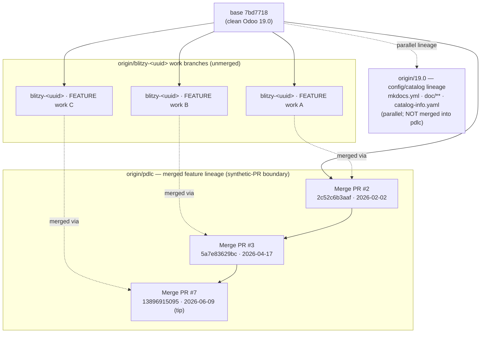
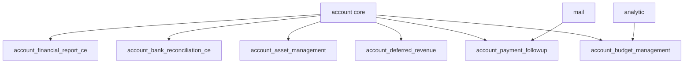
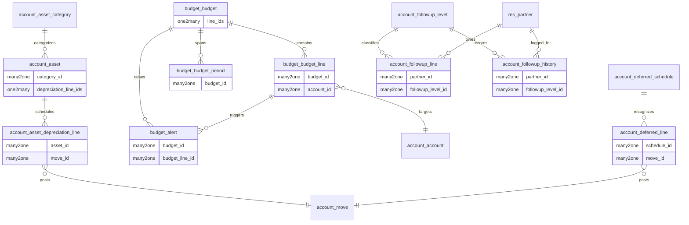
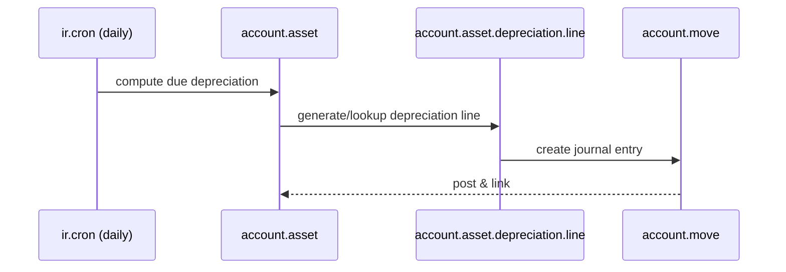
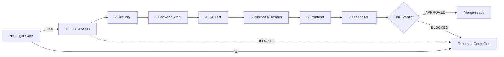

# Technical Specification

# 0. Agent Action Plan

## 0.1 Intent Clarification

### 0.1.1 Core Documentation Objective

Based on the provided requirements, the Blitzy platform understands that the documentation objective is to **(1)** produce a forensic *code-archaeology report* that identifies and documents every change merged into this repository by Blitzy Agents, **(2)** treat that complete body of merged work as a single synthetic change set "actively made during this run," and **(3)** execute an in-depth *Segmented PR Review* against that synthetic change set to assess and remediate issues, emitting the rule-mandated `CODE_REVIEW.md` artifact and the always-on executive presentation.

The user's request, preserved verbatim:

> **User Request:** "Perform an archaeology report on all merged changes made to this repository by Blitzy Agents. Treat all of the identified changes as if they were changes that were actively made during this run. Once all changes are identified, perform an in depth PR review using the Segmented PR Review rule definition to assess and remediate issues."

Repository forensics confirm that the merged Blitzy work resides on the `origin/pdlc` lineage — the clean upstream Odoo base commit `7bd7718bcd4c5d232779e8eab0340169461af14e` plus three `blitzy[bot]` merge pull requests (#2 on 2026-02-02, #3 on 2026-04-17, #7 on 2026-06-09). The cumulative diff is **278 files changed / +134,588 insertions** [git: `git diff --shortstat 7bd7718…origin/pdlc`], comprising six Odoo accounting addons plus supporting ticket, specification, and sample-data deliverables.

This document is therefore a **backward** reconstruction. Where the prior `blitzy/documentation/Technical Specifications.md` (1,214 lines on `origin/pdlc`) was a *forward* feature-development Agent Action Plan describing "what we will build," this regenerated specification inverts the direction: it documents *what was built, how it was merged, why, and what it risks* [origin/pdlc:blitzy/documentation/Technical Specifications.md:L1].

**Request Classification**

| Dimension | Classification |
|-----------|----------------|
| Primary category | Create new documentation (forensic archaeology report) |
| Secondary category | Fix documentation / quality gaps via review remediation |
| Documentation type 1 | Technical / forensic analysis report (the archaeology report) |
| Documentation type 2 | Code review artifact (`CODE_REVIEW.md`) |
| Documentation type 3 | Executive HTML presentation (reveal.js deck) |
| Subject system | "Enterprise Accounting for Odoo 19.0 Community Edition" — six AGPL-3.0 addons |
| Synthetic change set | `origin/pdlc` vs base `7bd7718…` (278 files / +134,588 insertions) |

Each documentation requirement, restated with enhanced clarity:

- Identify the complete set of Blitzy-Agent-authored changes through git-history mining (by author, branch, and merge commit) and define the precise boundary of the synthetic pull request under review.
- Reconstruct *what was built* and *why* — the intent behind the six accounting addons — and present it as a coherent archaeology narrative with a per-addon change manifest.
- Partition every changed file into exactly one Segmented PR Review domain phase and execute the seven-phase review, recording an `APPROVED`/`BLOCKED` verdict per phase and a final verdict.
- Produce the rule-mandated executive presentation summarizing scope, value, architecture, risk, and onboarding for non-technical leadership.

### 0.1.2 Special Instructions and Constraints

Two user-specified rules govern this work and are treated as binding constraints. They are documented in full in §0.10; the operative directives are summarized here.

**Segmented PR Review (binding):**

- The review MUST run as a single atomic pass each time code generation reaches a passing state, as an isolated process that begins only after code generation has fully completed — review activity MUST NOT overlap or interleave with code generation, and review timestamps MUST fall after the last code-generation commit (the #7 merge dated 2026-06-09 [git: `git log --merges 7bd7718..origin/pdlc`]).
- A **pre-flight gate** MUST pass before any review phase: all Agent Action Plan deliverables exist at their specified paths; the project builds with **zero errors and zero warnings**; all required tests pass; all static-analysis gates pass with **zero violations**; and no production-path method returns a placeholder stub. Any failure returns the work item to code generation without entering the first phase.
- `CODE_REVIEW.md` MUST be created at the repository root during the pre-flight gate, committed before the first phase, re-committed after every phase state change and after the final verdict, and present in the final commit (recreated blank if it already exists).
- Every changed file MUST be partitioned into exactly one of seven sequential domain phases — Infrastructure/DevOps, Security, Backend Architecture, QA/Test Integrity, Business/Domain, Frontend, Other SME — each owned by exactly one specialist reviewer who reviews only (no code edits, fixes, or test re-runs).
- Each phase and the final verdict MUST resolve to exactly `APPROVED` or `BLOCKED` (no qualifiers); `BLOCKED` records file-and-line-specific findings, halts the review, and requires a full restart from the pre-flight gate with no carried credit.

**Executive Presentation (binding):**

- Every deliverable MUST include an executive summary as a single self-contained reveal.js HTML file, ALWAYS included independent of any other documentation.
- Constraints: 12–18 slides (target 16); four slide types (`slide-title`, `slide-divider`, default content, `slide-closing`); every slide carries at least one non-text visual; content slides limited to four bullets and 40 words; zero emoji (Lucide SVG icons only); no fenced code blocks inside slides.
- Pinned CDN versions: reveal.js 5.1.0, Mermaid 11.4.0, Lucide 0.460.0. The full Blitzy brand theme (palette, Inter/Space Grotesk/Fira Code typography, CSS custom properties) MUST be embedded inline; the canonical theme file is referenced at `blitzy-deck/references/blitzy-reveal-theme.css`.

No user-provided examples or templates were supplied as attachments (see §0.11); all template structure derives from the two rules and the existing in-repository Blitzy deliverables used as style references.

### 0.1.3 Technical Interpretation

These documentation requirements translate to the following technical documentation strategy:

- **To document all merged Blitzy changes,** the platform mines git history by author and merge commit (`blitzy[bot]` PRs #2/#3/#7 on `origin/pdlc`; individual runs by `agent@blitzy.com`), diffs `origin/pdlc` against base `7bd7718…`, and *creates* the archaeology report as the regenerated `blitzy/documentation/Technical Specifications.md` with a per-addon change manifest.
- **To establish the "actively made this run" framing,** the platform defines the union of merged changes as the synthetic pull request; this Agent Action Plan is the referencing AAP whose deliverables the Segmented PR Review pre-flight gate verifies.
- **To execute the in-depth PR review,** the platform *creates* `CODE_REVIEW.md` at the repository root, partitions all 278 changed files into the seven domain phases, runs the documented pre-flight gate commands, and records `APPROVED`/`BLOCKED` per phase plus a final verdict.
- **To reconcile "remediate" with review-only reviewers,** remediation is achieved through the `BLOCKED` → return-to-code-generation → restart-from-pre-flight cycle, never through reviewer code edits.
- **To satisfy the executive-presentation mandate,** the platform *creates* a single self-contained reveal.js deck at `blitzy-deck/executive-summary.html` summarizing scope, value, architecture, risk, and onboarding.

### 0.1.4 Inferred Documentation Needs

Surfacing implicit requirements not explicitly stated but necessary for completeness:

- **Based on git topology:** the synthetic-PR boundary must be explicitly defined and justified, distinguishing the merged feature lineage (`origin/pdlc`) from the unmerged config/catalog lineage (`origin/19.0`) and the individual `origin/blitzy-<uuid>` work branches.
- **Based on the seven-domain partition requirement:** every one of the 278 files must be deterministically classified, which implies a documented path-based classifier so the partition is reproducible and exhaustive.
- **Based on the pre-flight gate:** the build, test, static-analysis, and verification commands must be documented precisely so a downstream run can execute them and record results before any phase opens.
- **Based on code analysis:** the four newest addons (`account_budget_management`, `account_asset_management`, `account_deferred_revenue`, `account_payment_followup`) extend core accounting models through `_inherit` and introduce net-new `_name` models, scheduled `ir.cron` jobs, security rules, QWeb reports, and wizards — each requiring domain-specific review documentation.
- **Based on the risk surface:** a risk register is needed, including the candidate finding that a security-scan branch bumped Mermaid to 11.10.0 for CVE-2025-54881 while the binding rule pins Mermaid 11.4.0.
- **Based on the executive-presentation mandate:** Mermaid architecture and data-flow diagrams must be authored once and reused across the archaeology report and the deck.

## 0.2 Documentation Discovery and Analysis

### 0.2.1 Existing Documentation Infrastructure Assessment

Repository analysis reveals **two distinct documentation surfaces on separate branch lineages**, a distinction that governs where the new deliverables are authored.

- **Code lineage (`origin/pdlc`)** — where the merged Blitzy feature work lives — has **no MkDocs generator**. `git cat-file -e origin/pdlc:mkdocs.yml` returns not-found [git: `git cat-file -e origin/pdlc:mkdocs.yml`]. The documentation present is hand-authored Markdown: the Blitzy deliverables `blitzy/documentation/Technical Specifications.md` and `blitzy/documentation/Project Guide.md` [origin/pdlc:blitzy/documentation/Project Guide.md:L1], the user docs `docs/SETUP.md` and `docs/USER_GUIDE.md` [origin/pdlc:docs/SETUP.md], the `tickets/` requirement tree, a `README.rst` inside each newer addon [origin/pdlc:addons/account_asset_management/README.rst], and Odoo's stock `README.md`, `CONTRIBUTING.md`, and `LICENSE`.
- **Config/catalog lineage (`origin/19.0`)** — NOT merged into `pdlc` — *does* carry a MkDocs site: `mkdocs.yml`, `doc/**`, and `catalog-info.yaml` [origin/19.0:mkdocs.yml]. This is a Backstage/MkDocs scaffold added by the config branches and is independent of the code under review.

Conclusion: the archaeology report, `CODE_REVIEW.md`, and executive deck target the `pdlc` lineage where the code resides. MkDocs is noted as an existing (separate-branch) generator; surfacing the new artifacts through it is out of scope unless explicitly requested (§0.8.2).

| Infrastructure aspect | Finding |
|-----------------------|---------|
| Documentation framework | MkDocs present on `origin/19.0` only; absent on `origin/pdlc` |
| Markdown deliverables (pdlc) | `blitzy/documentation/*.md`, `docs/SETUP.md`, `docs/USER_GUIDE.md`, `tickets/**`, per-addon `README.rst` |
| API documentation tooling | None detected (no Sphinx/JSDoc); Odoo self-documents via `__manifest__.py` + docstrings |
| Diagram tooling | Mermaid (used in existing Blitzy deliverables and mandated for the deck) |
| Static-analysis tooling | `ruff` (`ruff.toml`, "for ruff version 0.11.4 (or higher)", `target-version = "py310"`) [origin/pdlc:ruff.toml:L2,L7] |
| Hosting/deployment | MkDocs site config on the config lineage only |

### 0.2.2 Repository Code Analysis for Documentation

The subject of the archaeology is six Odoo accounting addons under `addons/`, all introduced by the merged PRs. The merged diff groups as follows [git: `git diff --name-only 7bd7718…origin/pdlc`]:

| Group | Files | Notes |
|-------|------:|-------|
| `addons/account_financial_report_ce` | 44 | FEATURE-001, prior "complete — do not touch" |
| `tickets/` | 43 | EPIC-001, 6 features, 32 stories, 3 templates, 1 README |
| `addons/account_payment_followup` | 39 | FEATURE-006, dunning / follow-up |
| `addons/account_bank_reconciliation_ce` | 35 | FEATURE-002, prior "complete — do not touch" |
| `addons/account_budget_management` | 31 | FEATURE-003, budgets / variance |
| `addons/account_asset_management` | 31 | FEATURE-004, fixed assets / depreciation |
| `addons/account_deferred_revenue` | 26 | FEATURE-005, deferred revenue / expense |
| `blitzy/` | 22 | Blitzy Technical Specs + Project Guide + 20 screenshots |
| `test_data/` | 5 | Sample bank statements + journal entries |
| `docs/` | 2 | `SETUP.md`, `USER_GUIDE.md` |

Each addon follows the standard Odoo module layout — `__manifest__.py`, `models/`, `views/`, `security/` (`ir.model.access.csv` + `*_security.xml`), `data/` (cron/sequences), `tests/`, `wizard/`, `report/`, and `static/src/scss/` [origin/pdlc:addons/account_asset_management/__manifest__.py:L1]. The model/wizard/report files that anchor the domain partition and citations are:

| Addon | Net-new (`_name`) domain models | Core extensions (`_inherit`) | Wizards / Report |
|-------|----------------------------------|------------------------------|------------------|
| `account_asset_management` | `account_asset.py` [addons/account_asset_management/models/account_asset.py:L133], `account_asset_category.py` [addons/account_asset_management/models/account_asset_category.py:L90], `account_asset_depreciation_line.py` [addons/account_asset_management/models/account_asset_depreciation_line.py:L95] | `account_move.py` [addons/account_asset_management/models/account_move.py:L119], `account_move_line.py` [addons/account_asset_management/models/account_move_line.py:L76] | `asset_disposal_wizard.py`, `asset_modification_wizard.py` |
| `account_budget_management` | `budget_budget.py` [addons/account_budget_management/models/budget_budget.py:L74], `budget_budget_line.py` [addons/account_budget_management/models/budget_budget_line.py:L127], `budget_period.py` [addons/account_budget_management/models/budget_period.py:L177], `budget_alert.py` [addons/account_budget_management/models/budget_alert.py:L114] | `account_analytic_account.py` [addons/account_budget_management/models/account_analytic_account.py:L126], `account_move.py` [addons/account_budget_management/models/account_move.py:L90] | `budget_variance_wizard.py`, `report/budget_vs_actual_report.py` |
| `account_deferred_revenue` | `account_deferred_schedule.py` [addons/account_deferred_revenue/models/account_deferred_schedule.py:L36], `account_deferred_line.py` [addons/account_deferred_revenue/models/account_deferred_line.py:L49] | `account_move.py` [addons/account_deferred_revenue/models/account_move.py:L55], `account_move_line.py` [addons/account_deferred_revenue/models/account_move_line.py:L34] | `cutoff_wizard.py`, `recognition_dashboard_wizard.py` |
| `account_payment_followup` | `account_followup_level.py` [addons/account_payment_followup/models/account_followup_level.py:L68], `account_followup_line.py` [addons/account_payment_followup/models/account_followup_line.py:L79], `account_followup_history.py` [addons/account_payment_followup/models/account_followup_history.py:L106] | `res_partner.py` [addons/account_payment_followup/models/res_partner.py:L78], `account_move.py` [addons/account_payment_followup/models/account_move.py:L95], `account_move_line.py` [addons/account_payment_followup/models/account_move_line.py:L56] | `followup_report_wizard.py`, `report/followup_report.py` |

Key directories examined: `addons/account_*/{models,wizard,report,views,security,data,tests,static}`, `tickets/{features,stories,templates}`, `blitzy/documentation/`, `docs/`, `test_data/`. Related documentation requiring regeneration: `blitzy/documentation/Technical Specifications.md` (1,214 lines, contains the feature-development AAP) and `blitzy/documentation/Project Guide.md` (785 lines) [origin/pdlc:blitzy/documentation/Project Guide.md:L1].

### 0.2.3 Research Conducted

Research validated the structure and quality bar for both deliverable types:

- **Code archaeology / git forensics:** the discipline is forensic git-history analysis answering *who changed what, when, and why* through `git log`, `git blame`, the pickaxe (`git log -S`), and `git log -L`; the seminal reference is Adam Tornhill's *Your Code as a Crime Scene* / `code-maat`, which frames change-coupling, hotspots, ownership, and bus-factor. This confirms the archaeology report should pair a change inventory with intent reconstruction rather than a raw diff dump.
- **Odoo / OCA review conventions:** authoritative review dimensions are correctness, security, performance, migrations, tests, manifests, and the official Odoo coding guidelines, including execution tracing through controllers, buttons, cron jobs, computes, onchanges, constraints, `sudo()` boundaries, and record rules. Odoo's coding guidelines emphasize minimal diffs in stable versions and the canonical module structure (`models/` with each inherited model in its own file, `wizard/` for `TransientModel`, `report/`, `security/`). Historic tooling is `pylint-odoo`/`flake8`/OCA MQT; **this repository standardizes on `ruff`** [origin/pdlc:ruff.toml:L2]. These dimensions map one-to-one onto the seven Segmented PR Review domains (§0.3.1).

## 0.3 Documentation Scope Analysis

### 0.3.1 Code-to-Documentation Mapping (Deterministic Partition Classifier)

The archaeology report documents *all* merged modules; the `CODE_REVIEW.md` artifact partitions *every* changed file into exactly one review domain. To make that partition reproducible and exhaustive, the following **deterministic, precedence-ordered path classifier** assigns each of the 278 changed files to exactly one of the seven domain phases (first match wins):

| Order | Domain Phase | File globs (per addon, plus repo-level) | Reviewer focus |
|------:|--------------|-----------------------------------------|----------------|
| 1 | Infrastructure/DevOps | `__manifest__.py`, `__init__.py`, `hooks.py`, `data/**`, `demo/**`, addon `README.rst`; repo `mkdocs.yml`, `doc/**`, `catalog-info.yaml` | manifest correctness, module load order, dependency declarations, cron/sequence data records |
| 2 | Security | `security/ir.model.access.csv`, `security/*_security.xml` | ACL completeness, record rules, groups, `sudo()` boundaries, multi-company rules |
| 3 | Backend Architecture | `models/**.py`, `wizard/**.py` | ORM structure, `_inherit` vs `_name`, fields, compute/onchange/constraints, transient flows |
| 4 | QA/Test Integrity | `tests/**.py`, `test_data/**` | coverage ≥ 80%, BDD parity, `TransactionCase`/`Form` correctness, no stubbed assertions |
| 5 | Business/Domain | `report/**` (`.py` + `.xml`); calculation methods within asset/budget/deferred/followup/reconciliation models (cross-referenced) | accounting correctness: depreciation, variance, recognition, matching, dunning; IAS 16 / IAS 36 / ASC 360 |
| 6 | Frontend | `views/**.xml`, `static/src/scss/**`, `static/**` | view validity, action/menu wiring, OWL/SCSS assets, UX |
| 7 | Other SME | `tickets/**`, `blitzy/documentation/**`, `docs/**`, `blitzy/screenshots/**` | requirement traceability, documentation accuracy |

Representative module-to-documentation mappings (the four newest addons drive the deepest review documentation):

- **`addons/account_asset_management/`** — Domain models `account_asset.py` [addons/account_asset_management/models/account_asset.py:L133], `account_asset_category.py`, `account_asset_depreciation_line.py`; core extensions `account_move.py`, `account_move_line.py`; wizards `asset_disposal_wizard.py`, `asset_modification_wizard.py`. Documentation needed: archaeology entry (depreciation methods, revaluation/impairment per IAS 16/IAS 36/ASC 360 [addons/account_asset_management/__manifest__.py:L24-25], disposal gain/loss) and review coverage across Backend, Business/Domain, Security, QA, Frontend phases.
- **`addons/account_budget_management/`** — Domain models `budget_budget.py`, `budget_budget_line.py`, `budget_period.py`, `budget_alert.py`; report `budget_vs_actual_report.py`; wizard `budget_variance_wizard.py`. Documentation needed: variance-analysis archaeology + review coverage; budget-alert `ir.cron` reviewed under Infrastructure/DevOps [addons/account_budget_management/data/budget_alert_cron.xml:L64].
- **`addons/account_deferred_revenue/`** — Domain models `account_deferred_schedule.py`, `account_deferred_line.py`; wizards `cutoff_wizard.py`, `recognition_dashboard_wizard.py`. Documentation needed: recognition-schedule archaeology + cutoff-flow review.
- **`addons/account_payment_followup/`** — Domain models `account_followup_level.py`, `account_followup_line.py`, `account_followup_history.py`; `res_partner.py` extension; report `followup_report.py`; wizard `followup_report_wizard.py`. Documentation needed: dunning-level archaeology; follow-up email `ir.cron` reviewed under Infrastructure/DevOps [addons/account_payment_followup/data/followup_cron.xml:L81].
- **`account_financial_report_ce/`, `account_bank_reconciliation_ce/`** — prior "complete" addons; documented in the archaeology report and partitioned into review domains, but **not edited** (§0.8.2).

Configuration options requiring documentation: scheduled-action records (`data/**` cron) — three `ir.cron` jobs total (asset depreciation daily, budget alert hourly, follow-up email daily) — and per-addon `__manifest__.py` dependency declarations (`['account']`, `['account','analytic']`, `['account','mail']`).

### 0.3.2 Documentation Gap Analysis

Given the requirements and repository analysis, the documentation gaps the deliverables must fill are:

- **No consolidated archaeology / change-manifest report exists.** The existing `blitzy/documentation/Technical Specifications.md` documents the *forward* feature-development run, not a backward forensic reconstruction of all merged changes [origin/pdlc:blitzy/documentation/Technical Specifications.md:L7]. The archaeology report (this regenerated specification) closes that gap.
- **No `CODE_REVIEW.md` exists at the repository root.** The rule-mandated review artifact, its pre-flight gate record, its seven-domain partition, and its `APPROVED`/`BLOCKED` verdicts are entirely absent and must be created.
- **No executive presentation exists on the code lineage.** The rule-mandated self-contained reveal.js deck must be created.
- **Review-traceability gap:** there is no document mapping each of the 278 changed files to a review domain and verdict; the partition classifier in §0.3.1 and the `CODE_REVIEW.md` partition table close it.
- **Risk-documentation gap:** no risk register currently captures cross-cutting concerns such as the unmerged Mermaid 11.10.0 / CVE-2025-54881 bump versus the rule-pinned 11.4.0, scheduled-job load, or per-story coverage adequacy [origin/pdlc:blitzy/documentation/Project Guide.md:L59].

No source-code documentation gaps (docstrings, inline comments) are in scope: the request targets archaeology and review artifacts, not in-code documentation, and source files are read-only (§0.8.2).


## 0.4 Documentation Implementation Design

### 0.4.1 Documentation Structure Planning

Three deliverables are produced, each with a defined internal structure. The deliverable file layout on the `pdlc` lineage:

```text
<repo-root>/
├── CODE_REVIEW.md                                  (CREATE — Segmented PR Review artifact at root)
├── blitzy/
│   └── documentation/
│       ├── Technical Specifications.md             (UPDATE/regenerate — the archaeology report; THIS FILE)
│       └── Project Guide.md                        (UPDATE/regenerate — companion guide)
└── blitzy-deck/
    ├── executive-summary.html                      (CREATE — self-contained reveal.js deck)
    └── references/
        └── blitzy-reveal-theme.css                 (CREATE — in-repo canonical brand theme; byte-for-byte inline in deck)
```

**Archaeology report (`blitzy/documentation/Technical Specifications.md`, this file)** — Section 0 (this Agent Action Plan) followed by the archaeology body (Sections 1–7):

- §1 Methodology — git mining by author/branch/merge-commit; diff `origin/pdlc` vs base `7bd7718…`.
- §2 Branch topology & provenance — `sandbox`/base, `origin/19.0` (config lineage), `origin/pdlc` (merged feature lineage), `origin/blitzy-<uuid>` work branches.
- §3 Synthetic-PR definition — `pdlc` vs base; merge PRs #2/#3/#7.
- §4 Per-addon change manifest — file-type counts (from §0.2.2).
- §5 Intent reconstruction — the "Enterprise Accounting for Odoo 19.0 CE" product; FEATURE-001..006; IAS 16/IAS 36/ASC 360 alignment.
- §6 Architecture — Mermaid module-dependency graph, ERD, data-flow sequence diagrams, branch-topology graph, and review-pipeline flowchart.
- §7 Risk register.

**`CODE_REVIEW.md`** — header/metadata (synthetic-PR ref, AAP ref, base/head commits, timestamps after the last code-gen commit) → pre-flight gate results block → file-to-phase partition table (all 278 files) → seven sequential domain phases (each `APPROVED`/`BLOCKED` with file:line findings) → final-reviewer verdict → commit-cadence log.

**Executive deck (`blitzy-deck/executive-summary.html`)** — 16-slide structure detailed in §0.4.3.

### 0.4.2 Content Generation Strategy

- **Information extraction approach:**
    - Extract the change manifest from `git diff --name-status <base> origin/pdlc` and per-addon `git ls-tree -r --name-only origin/pdlc -- addons/<addon>/`.
    - Extract module intent from each `addons/account_*/__manifest__.py` summary/description and the `tickets/` EPIC/feature/story tree.
    - Extract domain rules (depreciation, variance, recognition, matching, dunning) from `models/*.py` compute/constraint methods and cite by `file:line`.
- **Template application:** no user template was provided (§0.11); the archaeology report follows the structure and tone of the existing `blitzy/documentation/Technical Specifications.md` (Markdown headings, dense tables, inline file-path citations, "the Blitzy platform understands…" framing) [origin/pdlc:blitzy/documentation/Technical Specifications.md:L7], while *upgrading* the legacy backtick-path convention to the mandated bracket `[<path>:<locator>]` citation form. The executive deck follows the mandated slide ordering and the Blitzy brand theme.
- **Documentation standards:**
    - Markdown with proper headers; Mermaid fenced blocks for diagrams; short fenced code blocks for commands.
    - Source citations inline as `[<path>:<locator>]` immediately after each existing-system claim.
    - Tables for the change manifest, the domain partition, and the dependency inventory.
    - Consistent terminology drawn from the `tickets/` glossary and Odoo conventions.

### 0.4.3 Diagram and Visual Strategy

Mermaid diagrams are authored once (Section 6) and reused across the archaeology report and the executive deck. The required diagrams are:

- **Module-dependency graph** (architecture overview) — six addons extending Odoo `account` core, with `analytic` feeding `account_budget_management` and `mail` feeding `account_payment_followup` [addons/account_budget_management/__manifest__.py:L62-64, addons/account_payment_followup/__manifest__.py:L151-156]. Authored verbatim in §6.1 for deck reuse.
- **Entity-relationship diagram** for the budget/asset/deferred/followup model families (§6.2).
- **Representative data-flow** (asset depreciation posting) sequence diagram (§6.3), authored verbatim for deck reuse.
- **Segmented PR Review pipeline** flowchart (§6.4): Pre-Flight Gate → seven phases → Final Verdict, with `BLOCKED` → return-to-code-generation edges.
- **Branch-topology graph** for the provenance section (§2).

The executive deck (16 slides) uses these diagrams plus KPI cards and styled tables so that **every slide carries at least one non-text visual** per the rule. Slide ordering: (1) Title, (2) headline KPIs, (3) architecture Mermaid, (4) divider "What Was Built", (5) six-addon value, (6) divider "What Changed Architecturally", (7) data-flow Mermaid, (8) divider "How We Reviewed It", (9) review-pipeline Mermaid, (10) pre-flight KPIs, (11) divider "Risks & Mitigations", (12) risk table, (13) divider "Onboarding & Continuation", (14) dev-setup commands (inline Fira Code), (15) verdict KPI cards, (16) Closing.

## 0.5 Documentation File Transformation Mapping

### 0.5.1 File-by-File Documentation Plan

Every documentation file to be created, updated, deleted, or referenced is mapped below, with the **target documentation file listed first**. Transformation modes: **CREATE** (new file), **UPDATE** (modify existing), **DELETE** (remove obsolete), **REFERENCE** (used as example/source, not modified).

| Target Documentation File | Transformation | Source Code/Docs | Content/Changes |
|---------------------------|----------------|------------------|-----------------|
| `CODE_REVIEW.md` (repo root) | CREATE (recreate blank if pre-existing) | synthetic-PR diff `origin/pdlc` vs `7bd7718…` (278 files) | Pre-flight gate results; file-to-phase partition table; seven sequential domain phases each `APPROVED`/`BLOCKED` with file:line findings; final verdict; commit-cadence log |
| `blitzy-deck/executive-summary.html` | CREATE | full archaeology + review outcomes | Single self-contained reveal.js deck, 16 slides, Blitzy brand theme inline, Mermaid + Lucide, pinned CDNs |
| `blitzy/documentation/Technical Specifications.md` | UPDATE (regenerate) | git history (`pdlc` vs base) + `addons/account_*/**` | Archaeology report: Section 0 AAP, methodology, branch topology, synthetic-PR definition, per-addon change manifest, intent reconstruction, architecture diagrams, risk register |
| `blitzy/documentation/Project Guide.md` | UPDATE (regenerate) | review findings + `addons/account_*/**` | Compliance & Quality Review (review verdict summary), test results, runtime validation, risk assessment, development guide |
| `blitzy-deck/references/blitzy-reveal-theme.css` | CREATE | Executive Presentation rule text | Canonical Blitzy reveal.js theme — an **in-repository** brand asset (one of the five deliverables) created this run; must be present, verified, and synchronized **byte-for-byte** with the deck's inline `<style>` theme (verified identical, 20,427 bytes, `diff` → exit 0) |
| `tickets/EPIC-001-enterprise-accounting.md` | REFERENCE | — | Epic-level requirement traceability for archaeology + Business/Domain review [origin/pdlc:tickets/EPIC-001-enterprise-accounting.md:L1] |
| `tickets/features/*.md` | REFERENCE | — | Feature-level (FEATURE-001..006) intent and acceptance criteria |
| `tickets/stories/**/*.md` | REFERENCE | — | Story-level (AM/BM/DR/PF/BR/FR) acceptance criteria and BDD scenarios |
| `tickets/templates/*.md` | REFERENCE | — | Epic/feature/story templates (documentation-structure reference) |
| `docs/SETUP.md`, `docs/USER_GUIDE.md` | REFERENCE | — | Onboarding content reused in the deck "onboarding" slide and Project Guide development guide |
| `addons/account_asset_management/**` | REFERENCE/SOURCE | — | Subject of archaeology + review (read-only) |
| `addons/account_budget_management/**` | REFERENCE/SOURCE | — | Subject of archaeology + review (read-only) |
| `addons/account_deferred_revenue/**` | REFERENCE/SOURCE | — | Subject of archaeology + review (read-only) |
| `addons/account_payment_followup/**` | REFERENCE/SOURCE | — | Subject of archaeology + review (read-only) |
| `addons/account_financial_report_ce/**` | REFERENCE/SOURCE | — | Documented + partitioned; "complete — do not touch" (not edited) |
| `addons/account_bank_reconciliation_ce/**` | REFERENCE/SOURCE | — | Documented + partitioned; "complete — do not touch" (not edited) |
| `addons/account_*/README.rst` | REFERENCE | — | Per-addon descriptions feeding the change manifest |

No documentation files are DELETED. `CODE_REVIEW.md` is the only file whose pre-existing copy is discarded (recreated blank) per the Segmented PR Review rule. All documentation file names are enumerated above; nothing is left "pending."

### 0.5.2 New Documentation Files Detail

```text
File: CODE_REVIEW.md  (repository root)
Type: Segmented PR Review artifact
Source: synthetic PR = origin/pdlc vs 7bd7718 (278 files)
Sections:
    - Metadata (synthetic-PR ref, referencing-AAP ref, base/head commits, review timestamps)
    - Pre-Flight Gate Results (deliverables-exist, build 0/0, tests pass, ruff 0 violations, no stubs)
    - File-to-Phase Partition Table (all 278 files -> exactly one of 7 domains)
    - Phase 1 Infrastructure/DevOps  -> APPROVED | BLOCKED (file:line findings)
    - Phase 2 Security               -> APPROVED | BLOCKED
    - Phase 3 Backend Architecture   -> APPROVED | BLOCKED
    - Phase 4 QA/Test Integrity      -> APPROVED | BLOCKED
    - Phase 5 Business/Domain        -> APPROVED | BLOCKED
    - Phase 6 Frontend               -> APPROVED | BLOCKED
    - Phase 7 Other SME              -> APPROVED | BLOCKED
    - Final Reviewer Verdict         -> APPROVED | BLOCKED
    - Commit Cadence Log
Key Citations: addons/account_*/**, tickets/**
```

```text
File: blitzy-deck/executive-summary.html
Type: Executive presentation (reveal.js, self-contained)
Source: archaeology report + CODE_REVIEW.md outcomes
Slides (target 16):
    1 Title | 2 KPI summary | 3 Architecture (Mermaid) | 4 Divider "What Was Built"
    5 Six-addon value | 6 Divider "What Changed" | 7 Data-flow (Mermaid)
    8 Divider "How We Reviewed" | 9 Review pipeline (Mermaid) | 10 Pre-flight KPIs
    11 Divider "Risks" | 12 Risk table | 13 Divider "Onboarding"
    14 Dev-setup commands | 15 Verdict KPI cards | 16 Closing
Constraints: every slide >=1 non-text visual; zero emoji (Lucide SVG); pinned CDNs
    (reveal.js 5.1.0, Mermaid 11.4.0, Lucide 0.460.0); Blitzy brand theme inline
Diagrams: module dependency graph, review pipeline, asset-depreciation data-flow
Key Citations: addons/account_*/__manifest__.py, CODE_REVIEW.md
```

### 0.5.3 Documentation Files to Update Detail

- **`blitzy/documentation/Technical Specifications.md`** (this file) — regenerated as the archaeology report.
    - New/updated sections: Section 0 Agent Action Plan (this), §1 methodology, §2 branch topology & provenance, §3 synthetic-PR definition, §4 per-addon change manifest, §5 intent reconstruction, §6 architecture, §7 risk register.
    - New diagrams: module-dependency graph, ERD, data-flow sequence diagrams, branch-topology graph, review-pipeline flowchart.
    - Source citations: `addons/account_*/**`, `git diff origin/pdlc vs 7bd7718`.
- **`blitzy/documentation/Project Guide.md`** — regenerated as the companion guide.
    - New/updated sections: Compliance & Quality Review (consumes the `CODE_REVIEW.md` final verdict), Test Results, Runtime Validation, Risk Assessment, Development Guide.
    - Source citations: `CODE_REVIEW.md`, `docs/SETUP.md`, `requirements.txt`, `ruff.toml`.

### 0.5.4 Documentation Configuration Updates

No documentation-configuration changes are in scope on the `pdlc` lineage: `mkdocs.yml` is **absent** from `origin/pdlc` and present only on the `origin/19.0` config lineage [origin/19.0:mkdocs.yml]. Consequently:

- `mkdocs.yml`, `doc/**`, `catalog-info.yaml` — no change (different branch lineage; out of scope unless surfacing is explicitly requested).
- No `docusaurus.config.js`, `.readthedocs.yml`, or `sphinx/conf.py` exist in the repository.
- No `package.json` documentation build scripts exist; the executive deck is a single self-contained HTML file requiring no build step.

### 0.5.5 Cross-Documentation Dependencies

- **`CODE_REVIEW.md` → `Project Guide.md`:** the final review verdict and per-phase outcomes feed the Project Guide's Compliance & Quality Review section [origin/pdlc:blitzy/documentation/Project Guide.md:L235].
- **`CODE_REVIEW.md` → `executive-summary.html`:** the verdict drives the deck's verdict KPI cards (slide 15).
- **Archaeology change-manifest → `executive-summary.html`:** the per-addon counts and totals feed the deck's KPI summary (slide 2).
- **Shared diagrams:** the module-dependency graph, review-pipeline flowchart, and data-flow sequence diagram are authored once (Section 6) and embedded in both the archaeology report and the deck.
- **`tickets/**` → archaeology + Business/Domain review:** the EPIC/feature/story tree is the requirement-traceability backbone for intent reconstruction and domain-correctness review [origin/pdlc:tickets/EPIC-001-enterprise-accounting.md:L107-114].

## 0.6 Dependency Inventory

### 0.6.1 Documentation Dependencies

This is a documentation/review exercise; it introduces **no changes** to the project's Python or runtime dependency manifest. All application dependencies remain exactly as pinned in the repository-root `requirements.txt` of the merged feature work (e.g., `Babel==2.17.0` for Python ≥ 3.13 [origin/pdlc:requirements.txt], `lxml==5.2.1` for Python ≥ 3.12, `psycopg2==2.9.10` for Python ≥ 3.13). The only dependencies specific to the new documentation deliverables are the CDN libraries embedded by the executive presentation, pinned by the Executive Presentation rule:

| Registry | Package Name | Version | Purpose |
|----------|--------------|---------|---------|
| CDN (jsDelivr) | reveal.js | 5.1.0 | HTML presentation framework for `executive-summary.html` |
| CDN (jsDelivr) | mermaid | 11.4.0 | Render architecture/data-flow/pipeline diagrams inside the deck |
| CDN (jsDelivr) | lucide | 0.460.0 | SVG icon set (replaces emoji per rule) |
| Google Fonts | Inter | latest (link) | Body typography (400/500/600/700) |
| Google Fonts | Space Grotesk | latest (link) | Display/heading typography (500/600/700) |
| Google Fonts | Fira Code | latest (link) | Monospace / eyebrow / inline-code typography (400/500) |

Validation tooling invoked by the Segmented PR Review pre-flight gate (existing in the repository, not added by this exercise): `ruff` 0.11.4+ for static analysis [origin/pdlc:ruff.toml:L2], `coverage` 7.13.5 and the Odoo/`pytest` test runner for the ≥80% per-module coverage gate [origin/pdlc:blitzy/documentation/Project Guide.md:L445]. The MkDocs generator exists on the `origin/19.0` config lineage only and is **not** required for these deliverables.

### 0.6.2 Documentation Reference Updates

No legacy documentation links require rewriting; the deliverables are net-new or full regenerations rather than restructurings of an existing linked documentation tree. The only cross-document links to establish are forward references among the new artifacts:

- `blitzy/documentation/Project Guide.md` → `CODE_REVIEW.md` (Compliance & Quality Review cites the final verdict).
- `blitzy/documentation/Project Guide.md` → `blitzy/documentation/Technical Specifications.md` (architecture and risk cross-references).
- `blitzy-deck/executive-summary.html` → references the archaeology report and `CODE_REVIEW.md` as its data sources.

The executive deck embeds the canonical theme from `blitzy-deck/references/blitzy-reveal-theme.css` inline rather than linking to it, preserving the single-self-contained-file requirement.

## 0.7 Coverage and Quality Targets

### 0.7.1 Documentation Coverage Metrics

| Coverage dimension | Target | Basis |
|--------------------|--------|-------|
| File partition coverage | 100% of the 278 merged files assigned to exactly one of seven review domains | Segmented PR Review rule (every changed file partitioned) |
| Merge-PR coverage | All three merge PRs documented (#2 2026-02-02, #3 2026-04-17, #7 2026-06-09) | Synthetic-PR boundary |
| Change-group coverage | `addons/` (206), `tickets/` (43), `blitzy/` (22), `test_data/` (5), `docs/` (2) all documented | §0.2.2 manifest |
| Module coverage | All 6 addons documented; 4 newest reviewed at model/wizard/report granularity | §0.3.1 |
| Executive-deck topic coverage | All 5 mandated topics (what/why/architecture/risk/onboarding) across 12–18 slides (target 16) | Executive Presentation rule |
| Test coverage (carried gate) | ≥ 80% per module (referenced under QA/Test Integrity) [origin/pdlc:blitzy/documentation/Project Guide.md:L39] | Story acceptance gate from the feature work |

Coverage gaps to address are precisely the three net-new artifacts (archaeology report, `CODE_REVIEW.md`, executive deck) identified in §0.3.2; no merged change group is left undocumented.

### 0.7.2 Documentation Quality Criteria

- **Completeness:** the archaeology report covers methodology, provenance, synthetic-PR boundary, per-addon manifest, intent reconstruction, architecture, and risk; `CODE_REVIEW.md` covers the pre-flight gate, the full file partition, all seven domain phases, and a final verdict.
- **Accuracy / verdict discipline:** every `CODE_REVIEW.md` domain phase and the final verdict resolve to **exactly** `APPROVED` or `BLOCKED` (no qualifiers); `BLOCKED` findings carry **file-and-line** specificity; pre-flight results are recorded **before** any phase leaves its initial state; review timestamps fall **after** the last code-generation commit (2026-06-09); `CODE_REVIEW.md` is committed before phase 1, after every phase transition, and after the final verdict, and is present in the final commit.
- **Traceability:** every existing-system claim in the archaeology report carries an inline `[<path>:<locator>]` citation; intent reconstruction ties each addon to its `tickets/` EPIC/feature/story.
- **Clarity:** technical accuracy with progressive disclosure (overview → manifest → per-domain detail); consistent terminology from the `tickets/` glossary and Odoo conventions.
- **Pre-flight pass conditions (documented commands in §0.9):** all deliverables exist at their paths; `python odoo-bin … --stop-after-init` exits 0 with "Modules loaded" and **zero errors / zero warnings**; tests pass; `ruff check` reports **zero violations**; no production-path placeholder stub.

### 0.7.3 Example and Diagram Requirements

- **Diagrams required (Mermaid):** module-dependency graph; Segmented PR Review pipeline flowchart; at least one data-flow sequence diagram (asset depreciation posting); an entity-relationship diagram for the budget/asset/deferred/followup model families; a branch-topology graph for provenance.
- **Executive-deck visual requirement:** every one of the 12–18 `<section>` elements contains at least one non-text visual (Mermaid diagram, KPI card, styled table, or Lucide SVG icon); **zero emoji**.
- **Command examples:** the development-guide and execution-parameter content include working, copy-pasteable build/test/lint/verify commands (§0.9), validated against the repository's verified toolchain.
- **Verification of the deck:** the HTML opens in a browser, renders all Mermaid diagrams and Lucide icons, and contains 12–18 `<section>` elements each with a non-text visual.


## 0.8 Scope Boundaries

### 0.8.1 Exhaustively In Scope

- **Documentation deliverables (CREATE/UPDATE):**
    - `CODE_REVIEW.md` (repository root) — rule-mandated Segmented PR Review artifact.
    - `blitzy-deck/executive-summary.html` — rule-mandated self-contained reveal.js deck.
    - `blitzy/documentation/Technical Specifications.md` — the archaeology report (regenerated; this file).
    - `blitzy/documentation/Project Guide.md` — companion guide (regenerated).
- **Read-only source analysis (subject of archaeology + review):**
    - `addons/account_asset_management/**`, `addons/account_budget_management/**`, `addons/account_deferred_revenue/**`, `addons/account_payment_followup/**`
    - `addons/account_financial_report_ce/**`, `addons/account_bank_reconciliation_ce/**` (documented + partitioned, not edited)
    - `tickets/**`, `docs/**`, `test_data/**`, `blitzy/screenshots/**`
- **Reference assets:**
    - `blitzy-deck/references/blitzy-reveal-theme.css` — **in-repository** canonical brand theme (a CREATE deliverable this run); the single auditable source held byte-for-byte consistent with the deck's inline `<style>` theme
    - `tickets/templates/**` (documentation-structure references)
- **Review methodology scope:** partitioning of all 278 merged files into the seven domains; documentation of the pre-flight gate command set and verification queries.

### 0.8.2 Explicitly Out of Scope

- **Any source-code modification** to `addons/account_*/**` — this is a documentation and review task; per the Segmented PR Review rule, reviewers review only, and remediation is the `BLOCKED` → return-to-code-generation cycle, never reviewer edits.
- **Editing the two prior "complete — do not touch" addons** (`account_financial_report_ce`, `account_bank_reconciliation_ce`) — they remain within archaeology and review-partition scope but are not changed.
- **`origin/19.0` config/catalog lineage** — `mkdocs.yml`, `doc/**`, `catalog-info.yaml` live on a separate branch; surfacing the new artifacts through that MkDocs site is not requested.
- **Odoo core and unrelated modules** — `odoo/`, `odoo/addons/`, and the 300+ unrelated `addons/` modules are not documented or reviewed.
- **Feature additions, refactoring, test authoring, deployment configuration, and CI workflow creation** — no `.github/workflows/` pipelines exist, and none are created.
- **In-code documentation** (docstrings/inline comments) — not requested; source files are read-only.
- **All items explicitly excluded by user instructions or the binding rules.**

## 0.9 Execution Parameters

The following parameters govern execution of the deliverables and the Segmented PR Review pre-flight gate. Commands are verified against the merged feature work's toolchain (Python 3.13 supported [origin/pdlc:requirements.txt]; PostgreSQL 13+ [origin/pdlc:docs/SETUP.md]).

| Parameter | Value |
|-----------|-------|
| Build / install (pre-flight gate) | `python odoo-bin --db_host=localhost --db_port=5432 --db_user=odoo --db_password=odoo -d <db> -i <modules> --stop-after-init --without-demo=True --no-http` (expect exit 0, "Modules loaded", zero errors/zero warnings) |
| Test (full) | Odoo native `--test-enable` install variant |
| Test (per story) | `python -m pytest addons/<module>/tests/ -v --cov=addons/<module> --cov-report=term-missing` (gate ≥ 80%) |
| Static analysis | `ruff check addons/<module>/` (zero violations) [origin/pdlc:ruff.toml:L2] |
| Install verification | `psql` on `ir_module_module` (`state='installed'`) and `ir_cron` (three scheduled jobs: asset depreciation daily, budget alert hourly, follow-up email daily) [origin/pdlc:blitzy/documentation/Project Guide.md:L554-556] |
| Executive-deck preview | Open `blitzy-deck/executive-summary.html` in a browser; confirm 12–18 `<section>` elements, all Mermaid + Lucide rendered |
| Default documentation format | Markdown with Mermaid diagrams |
| Citation requirement | Every existing-system claim cites source as `[<path>:<locator>]` |
| Style guide | Existing Blitzy deliverables (`blitzy/documentation/Technical Specifications.md`, `Project Guide.md`) for the report; Blitzy brand theme for the deck |

Documentation validation: the archaeology report and Project Guide are validated by inline-citation completeness and Mermaid syntax correctness; `CODE_REVIEW.md` is validated by the verdict-discipline and commit-cadence checks in §0.7.2; the executive deck is validated by the browser-render check above.

## 0.10 Rules for Documentation

Two user-specified rules apply to this work and are binding. They are reproduced here as governing documentation rules; every directive is honored by the deliverables and scope above.

### 0.10.1 Segmented PR Review Rule

- For any Blitzy work item producing a pull request against an Agent Action Plan, a multi-phase review MUST execute as a **single atomic pass** each time code generation reaches a passing state — no incremental review, no credit carried from prior passes.
- The review MUST run as an **isolated process** beginning only after code generation has fully completed; review activity MUST NOT overlap, interleave with, or be performed by the code-generation run, and review timestamps MUST fall after the last code-generation commit.
- A **pre-flight gate** MUST pass before the first phase: all AAP deliverables exist at their specified paths; the project builds with **zero errors and zero warnings**; all required tests pass; all static-analysis gates pass with **zero violations**; and no production-path method returns a placeholder stub (e.g., `Iterator.empty`, `Future.successful(())`, `???`, or equivalent). Any failure returns the work item to code generation without entering the first phase.
- `CODE_REVIEW.md` MUST be created at the repository root during the pre-flight gate, committed to the PR branch before the first phase, re-committed after every phase state change and after the final verdict, and present in the PR's final commit; absence from any required commit is a pre-flight failure. If it already exists prior to the run, recreate it blank.
- `CODE_REVIEW.md` MUST partition **every** changed file into **exactly one** sequential domain phase from {Infrastructure/DevOps, Security, Backend Architecture, QA/Test Integrity, Business/Domain, Frontend, Other SME}; each phase is owned by exactly one specialist reviewer who MUST **review only** (modifying code, running fixes, or re-running tests is prohibited).
- Each phase MUST resolve to exactly `APPROVED` or `BLOCKED` (no qualifiers); `BLOCKED` records findings with file-and-line specificity, halts the review, returns the work item to code generation, and requires a full restart from the pre-flight gate with no prior findings, approvals, or scope carried forward.
- After every domain phase is `APPROVED`, a final reviewer MUST re-verify deliverable presence and functionality, build, tests, and static analysis against the delivered state and issue exactly `APPROVED` or `BLOCKED` (qualified verdicts are prohibited).
- **Verification:** the final commit contains `CODE_REVIEW.md` at the repository root; commit history shows the file modified at least once per phase transition and once for the final verdict; every phase status and the final verdict contain exactly `APPROVED` or `BLOCKED`; pre-flight results are recorded before any phase status leaves its initial state; review-activity timestamps fall after the last code-generation commit.
- **Scope:** all Blitzy code-generation work items producing a pull request that references an Agent Action Plan with required deliverables — which this Agent Action Plan is.

### 0.10.2 Executive Presentation Rule

- Every deliverable MUST include an executive summary as a **single self-contained reveal.js HTML file**, ALWAYS included independent of any other documentation; audience is non-technical leadership.
- The presentation MUST cover: (1) what was done, (2) why it was done (business value), (3) what changed architecturally (with diagrams), (4) what risks exist and how they are mitigated, (5) how the team onboards and continues development.
- **Slide constraints:** 12–18 slides (target 16); four slide types (`slide-title`, `slide-divider`, default content, `slide-closing`); every slide includes ≥ 1 non-text visual (Mermaid diagram, KPI card, styled table, or Lucide SVG icon) — no text-only slides; content slides limited to four bullets and 40 words; **zero emoji** (Lucide SVG icons via `<i data-lucide="icon-name"></i>` only); no fenced code blocks inside slides (inline Fira Code only).
- **Visual identity (Blitzy brand):** palette `#5B39F3` (primary), `#2D1C77` (dark), `#94FAD5` (teal accent), `#1A105F` (navy), `#7A6DEC`/`#4101DB` (gradient stops), with neutrals `#333333`, `#999999`, `#D9D9D9`, `#F4EFF6`, `#F5F5F5`, `#FFFFFF`; typography Inter (body), Space Grotesk (display), Fira Code (mono/eyebrows) via Google Fonts; title slide hero gradient `linear-gradient(68deg, #7A6DEC 15.56%, #5B39F3 62.74%, #4101DB 84.44%)`; dividers dark purple `#2D1C77` or gradient; closing navy `#1A105F` with brand lockup and gradient accent bar.
- **Mermaid:** embed as `<pre class="mermaid">` with raw syntax; initialize `startOnLoad: false`; call `mermaid.run()` after the reveal.js `ready` event and on every `slidechanged`; theme variables `primaryColor: '#F2F0FE'`, `primaryTextColor: '#333333'`, `primaryBorderColor: '#5B39F3'`, `lineColor: '#999999'`, `secondaryColor: '#F4EFF6'`.
- **Technical delivery:** single self-contained HTML, no build steps, no local file dependencies; CDN versions pinned — reveal.js 5.1.0, Mermaid 11.4.0, Lucide 0.460.0; reveal.js config `hash: true`, `transition: 'slide'`, `controlsTutorial: false`, `width: 1920`, `height: 1080`; call `lucide.createIcons()` after `ready` and on every `slidechanged`.
- **Inline CSS:** embed the full Blitzy reveal.js theme inline in a `<style>` tag, including the `:root` custom properties (`--blitzy-primary`, `--blitzy-primary-dark`, `--blitzy-primary-navy`, `--blitzy-primary-light`, `--blitzy-primary-deep`, `--blitzy-accent-teal`, `--blitzy-surface-0..3`, `--blitzy-border`, `--blitzy-border-soft`, `--blitzy-text`, `--blitzy-text-muted`, `--blitzy-text-invert`, `--ff-body`, `--ff-display`, `--ff-mono`, `--gradient-hero`, `--gradient-divider`, `--gradient-accent-bar`) and the slide-type/component classes (`slide-title`, `slide-divider`, `slide-closing`, `kpi-card`, `kpi-grid`, `kpi-value`, `kpi-label`, `kpi-icon`, `eyebrow`, `accent-bar`, `brand-lockup`, `hero-icon`, `icon-row`, mermaid container). The canonical theme file is referenced at `blitzy-deck/references/blitzy-reveal-theme.css`.
- **Slide ordering:** (1) Title, (2) headline findings/KPI summary, (3) architecture overview (Mermaid), (4..N) alternating section dividers + content slides per major topic, (N+1) closing with takeaway, next steps, and brand lockup.
- **Verification:** the HTML opens in a browser, renders all Mermaid diagrams and Lucide icons, contains 12–18 `<section>` elements, and every `<section>` contains at least one non-text visual.

### 0.10.3 Derived Documentation Directives

From the two rules and the request, the following directives apply to all deliverables:

- Include Mermaid diagrams for architecture and key workflows by default.
- Add `[<path>:<locator>]` source citations for every technical claim about the existing system.
- Keep changes to existing documentation minimal and regeneration-based; do not modify source code.
- Maintain consistent terminology with the `tickets/` glossary and Odoo conventions.
- Treat the executive presentation as a mandatory, always-included deliverable.

## 0.11 Attachments

No attachments were provided with this project. The `review_attachments` inspection returned "No attachments found for this project."

- **Document/image attachments:** none. No PDFs, images, or other files were supplied; all requirements derive from the user prompt, the two binding rules (§0.10), and repository inspection.
- **Figma attachments:** none. No Figma frames or URLs were provided; consequently no Figma design analysis and no design-to-system mapping apply, and no design-system component library was named for the subject product (Odoo renders its UI through XML views and OWL/SCSS assets, reviewed under the Frontend domain).

The executive-presentation theme at `blitzy-deck/references/blitzy-reveal-theme.css` is an **in-repository** canonical brand asset — created this run as one of the five deliverables — and is embedded **byte-for-byte inline** in the executive deck per the Executive Presentation rule (§0.10.2). It is the single auditable source of the deck's inline theme and is held synchronized with it (verified identical, 20,427 bytes).

---


# 1. Forensic Methodology

The Blitzy platform understands that an archaeology report differs fundamentally from a feature specification: it is a *backward* reconstruction grounded in evidence already committed to version control, not a *forward* plan of intended work. The method here is forensic git-history analysis — answering **who** changed **what**, **when**, and **why** — applied to the complete body of merged Blitzy work.

## 1.1 Discipline Framing

The approach draws on the established practice of treating a repository's history as an excavation site. As articulated in the code-archaeology discipline (Adam Tornhill's *Your Code as a Crime Scene* and the associated `code-maat` tooling), a version-control log is a behavioral record: it reveals **hotspots** (files that change most often), **change-coupling** (files that change together), **ownership** and **bus-factor** (how concentrated authorship is), and the temporal sequence of intent. The platform applies that lens here — pairing a precise *change inventory* with a reconstructed *intent narrative* rather than dumping a raw diff — so that the reader understands not only the surface of the change but the rationale behind it.

## 1.2 Evidence-Gathering Commands

Every forensic figure in this report is reproducible from the commands below, run against the merged feature lineage (`origin/pdlc`) and the clean upstream base `7bd7718bcd4c5d232779e8eab0340169461af14e`. In this clone the `origin/pdlc` lineage is materialized at merge-tip commit `1389691509568206594224539d5495f87a310ed1` (the #7 merge); the commands are written using the `origin/pdlc` name for portability.

**Boundary and headline magnitude** — the synthetic change set:

```bash
# Total files changed and insertions (the synthetic-PR magnitude)
git diff --shortstat 7bd7718bcd4c5d232779e8eab0340169461af14e origin/pdlc
# => 278 files changed, 134588 insertions(+)

# Per-file status (A/M/D) for the full partition
git diff --name-status 7bd7718bcd4c5d232779e8eab0340169461af14e origin/pdlc
```

**Provenance** — who authored the merged work and which merges introduced it:

```bash
# Total commits on the merged lineage, base-exclusive
git log --oneline 7bd7718bcd4c5d232779e8eab0340169461af14e..origin/pdlc | wc -l   # => 310

# Authorship breakdown
git log --format='%an <%ae>' 7bd7718bcd4c5d232779e8eab0340169461af14e..origin/pdlc | sort | uniq -c
# => 307 Blitzy Agent <agent@blitzy.com>
# =>   3 blitzy[bot] <...@users.noreply.github.com>

# The three merge pull requests that constitute the synthetic PR
git log --merges --format='%h %ad %s' --date=short 7bd7718bcd4c5d232779e8eab0340169461af14e..origin/pdlc
# => 13896915095 2026-06-09 Merge pull request #7
# => 5a7e83629bc 2026-04-17 Merge pull request #3
# => 2c52c6b3aaf 2026-02-02 Merge pull request #2
```

**Manifest, group, and extension inventory** — how the change set decomposes:

```bash
# Top-level group counts (sum = 278)
git diff --name-only 7bd7718…origin/pdlc | awk -F/ '{print $1}' | sort | uniq -c

# Per-addon counts (sum = 206)
git diff --name-only 7bd7718…origin/pdlc -- addons/ | awk -F/ '{print $2}' | sort | uniq -c

# Per-extension counts (sum = 278)
git diff --name-only 7bd7718…origin/pdlc | sed 's/.*\.//' | sort | uniq -c

# Per-addon module-area breakdown
git ls-tree -r --name-only origin/pdlc -- addons/<addon>/
```

**Deep tracing** — reconstructing *why* a change exists at the symbol level:

```bash
# Pickaxe: find when a symbol (e.g., a method) entered the history
git log -S'_compute_depreciation_totals' --oneline origin/pdlc

# Line-history: follow a specific function across revisions
git log -L'/def action_dispose/',+40:addons/account_asset_management/models/account_asset.py origin/pdlc

# Per-file authorship for ownership / bus-factor analysis
git blame origin/pdlc -- addons/account_asset_management/models/account_asset.py
```

## 1.3 Reading a File's Content at the Merged State

Because the destination working tree is checked out at the clean base `7bd7718…` (which has **no** `blitzy/` tree), all subject-file content is read at the merged state via `git show`:

```bash
git show "origin/pdlc:addons/account_asset_management/models/account_asset.py"
git show "origin/pdlc:blitzy/documentation/Technical Specifications.md"   # the regeneration basis
```

This is the mechanism behind every `[<path>:<locator>]` citation in this report: the locator (`L<n>` or a stable `def`/`_name` symbol) is verified against the file content as it exists at `origin/pdlc`. Line numbers are confirmed at authoring time; where a line may shift, the citation anchors on the stable symbol name as well.

## 1.4 From Evidence to the Synthetic Change Set

The methodology yields a single, well-bounded object of study: the **synthetic pull request** (defined precisely in §3) — the union of the three `blitzy[bot]` merges diffed against the base. Treating that union as "actively made during this run" lets the Segmented PR Review (§0.10.1) operate on it as one atomic, reviewable change set: 278 files partitioned across seven domains, each owned by exactly one reviewer, each resolving to `APPROVED` or `BLOCKED`.

## 1.5 Canonical Figures — Single Source of Truth

The table below is the **single, authoritative set of canonical figures** for this delivery. Every figure is git-verified against `origin/pdlc` (diffed against base `7bd7718…`) or sourced from the verified runtime/test evidence in `blitzy/documentation/Project Guide.md` §3–§4. **All other deliverables — `CODE_REVIEW.md`, the executive deck, and the Project Guide — derive their figures from this table and MUST match it exactly.** Where a row is a runtime/test result it is labelled `[provenance: Project Guide §3/§4]`; all change-set magnitudes are `[git: origin/pdlc vs 7bd7718]`.

| # | Metric | Canonical value | Source |
|---|--------|-----------------|--------|
| 1 | Files changed (synthetic PR) | **278** | [git: `git diff --name-status 7bd7718..origin/pdlc`] |
| 2 | Insertions | **+134,588** | [git: `git diff --shortstat 7bd7718..origin/pdlc`] |
| 3 | Commits (base-exclusive) | **310** — 307 `agent@blitzy.com` + 3 `blitzy[bot]` merges | [git: `git log --oneline 7bd7718..origin/pdlc`] |
| 4 | Base commit | `7bd7718` | [git: merge-base] |
| 5 | Head / tip commit | `13896915095` (full `1389691509568206594224539d5495f87a310ed1`) | [git: `origin/pdlc` tip] |
| 6 | Merge PRs | **#2** 2026-02-02 (`2c52c6b3aaf`), **#3** 2026-04-17 (`5a7e83629bc`), **#7** 2026-06-09 (`13896915095`) | [git: `--merges` log] |
| 7 | Top-level group counts (Σ=278) | addons **206**, tickets **43**, blitzy **22**, test_data **5**, docs **2** | [git: per-path counts] |
| 8 | Per-addon file counts (Σ=206) | financial_report **44**, payment_followup **39**, bank_recon **35**, budget **31**, asset **31**, deferred **26** | [git: `git ls-tree -r origin/pdlc -- addons/<addon>`] |
| 9 | Per-extension counts (Σ=278) | .py **128**, .xml **59**, .md **47**, .png **20**, .csv **9**, .scss **7**, .rst **4**, .qif **2**, .ofx **2** | [git: extension tally] |
| 10 | Net-new models / DB tables | **12** (`budget_budget`, `budget_budget_line`, `budget_budget_period`, `budget_alert`, `account_asset`, `account_asset_category`, `account_asset_depreciation_line`, `account_deferred_schedule`, `account_deferred_line`, `account_followup_level`, `account_followup_line`, `account_followup_history`) | [provenance: Project Guide §4.2] |
| 11 | Scheduled `ir.cron` jobs | **3** (asset depreciation — daily; budget alert — hourly; follow-up email — daily) | [provenance: Project Guide §4.3] |
| 12 | Modules installed | **4** newest addons `state='installed'`, `latest_version='19.0.1.0.0'` | [provenance: Project Guide §4.1] |
| 13 | Tests (combined) | **619 / 619** pass (0 failed / 0 errors) — **98 AM + 171 BM + 37 DR + 312 PF + 1 setup = 619** (PF standalone runtime is 313 incl. its setup test, i.e. 98 + 171 + 37 + 313 = 619 equivalently) | [provenance: Project Guide §3] |
| 14 | Coverage (per-module) | AM **87%**, BM **89%**, DR **87%**, PF **90%** (≥ 80%) | [provenance: Project Guide §3] |
| 15 | Review verdict | **7 / 7** domain phases `APPROVED`; **final `APPROVED`**; **278 / 278** files partitioned | [CODE_REVIEW.md §C–§E] |
| 16 | Deliverables | **5** — `CODE_REVIEW.md`, `Technical Specifications.md`, `Project Guide.md`, `executive-summary.html`, `blitzy-reveal-theme.css` | [first-hand on review branch] |
| 17 | CDN pins | reveal.js **5.1.0**, Mermaid **11.4.0**, Lucide **0.460.0** | [Executive Presentation rule §0.10.2] |

# 2. Branch Topology & Provenance

## 2.1 The Four Lineages

The Blitzy platform understands that the repository's branch graph carries four distinct lineages, only one of which is the subject of this archaeology.

| Lineage | Role | Carries | In synthetic-PR boundary? |
|---------|------|---------|---------------------------|
| `sandbox` / base — `7bd7718bcd4c5d232779e8eab0340169461af14e` | Clean upstream Odoo 19.0 base commit | Stock Odoo only; **no `blitzy/` tree** | Base (the diff floor) |
| `origin/pdlc` (merge-tip `1389691509568206594224539d5495f87a310ed1`) | **The merged feature lineage under review** | All six accounting addons, `tickets/**`, `blitzy/**`, `docs/**`, `test_data/**` | **Yes — this is the boundary** |
| `origin/19.0` | Config / catalog lineage | MkDocs/Backstage scaffold: `mkdocs.yml`, `doc/**`, `catalog-info.yaml` [origin/19.0:mkdocs.yml] | **No — separate, never merged into `pdlc`** |
| `origin/blitzy-<uuid>` work branches | Per-run individual agent work branches | Pre-merge per-feature commits authored by `agent@blitzy.com` | No — unmerged working branches; their content reaches the boundary only via the three merges |

The provenance count is exact: **310 commits** separate the base from the merged tip, comprising **307** commits authored by `Blitzy Agent <agent@blitzy.com>` and **3** merge commits authored by `blitzy[bot]` [git: `git log --format='%an' 7bd7718..origin/pdlc | sort | uniq -c`]. The three `blitzy[bot]` commits are precisely the merge pull requests that landed the feature work:

| Merge PR | Date | Merge commit | Cumulative effect |
|----------|------|--------------|-------------------|
| #2 | 2026-02-02 | `2c52c6b3aaf` | First tranche of merged feature work |
| #3 | 2026-04-17 | `5a7e83629bc` | Second tranche |
| #7 | 2026-06-09 | `13896915095` (= head/tip) | Final tranche; **last code-generation commit** |

Because #7 (2026-06-09) is the last code-generation commit, the Segmented PR Review (§0.10.1) — and every timestamp it records — MUST fall **after** 2026-06-09, satisfying the rule's isolation-and-ordering constraint that review activity never overlaps code generation.

## 2.2 Branch-Topology Graph

The following Mermaid graph depicts the topology: the clean base flows into per-feature `blitzy-<uuid>` work branches, which land on the merged `pdlc` lineage through the three merge PRs (#2 → #3 → #7); the `origin/19.0` config/catalog lineage runs in parallel and is never merged into `pdlc`.



The dashed "merged via" edges denote that the per-feature work branches contribute their commits to `pdlc` exclusively through the merge PRs — there is no direct fast-forward of a work branch into the reviewed boundary. The dotted edge to `origin/19.0` emphasizes its parallel, excluded status.


# 3. Synthetic Pull Request Definition

## 3.1 Precise Boundary

The Blitzy platform understands the user's directive — "treat all of the identified changes as if they were changes that were actively made during this run" — as the definition of a single **synthetic pull request**. That synthetic PR is defined exactly as:

- **Base (diff floor):** `7bd7718bcd4c5d232779e8eab0340169461af14e` — the clean upstream Odoo 19.0 Community Edition commit.
- **Head (tip):** `1389691509568206594224539d5495f87a310ed1` — the #7 merge-tip on the `origin/pdlc` lineage [git: `git log --merges 7bd7718..origin/pdlc`].
- **Content:** the **union** of the three `blitzy[bot]` merge pull requests — #2 (`2c52c6b3aaf`, 2026-02-02), #3 (`5a7e83629bc`, 2026-04-17), and #7 (`13896915095`, 2026-06-09) — collapsing the **307** `Blitzy Agent <agent@blitzy.com>` authored commits into one reviewable change set.
- **Magnitude:** **278 files changed / +134,588 insertions** [git: `git diff --shortstat 7bd7718…origin/pdlc`].

Diffing head against base yields exactly the 278-file change set partitioned in §4 and reviewed in `CODE_REVIEW.md`. This is the object the Segmented PR Review pre-flight gate verifies and the seven domain phases partition.

## 3.2 What Is Included

| Included group | Files | Rationale |
|----------------|------:|-----------|
| `addons/` (six accounting addons) | 206 | The feature payload; all introduced by the merges |
| `tickets/` (EPIC/features/stories/templates) | 43 | Requirement provenance for intent reconstruction |
| `blitzy/` (docs + screenshots) | 22 | Prior Blitzy deliverables + visual QA evidence |
| `test_data/` (sample statements/entries) | 5 | Fixtures supporting reconciliation/reporting |
| `docs/` (`SETUP.md`, `USER_GUIDE.md`) | 2 | Onboarding documentation |
| **Total** | **278** | The synthetic-PR boundary |

## 3.3 What Is Excluded — and Why

The boundary deliberately **excludes** two adjacent lineages so the review object remains exactly the merged feature work:

- **`origin/19.0` (config/catalog lineage).** This branch carries the MkDocs/Backstage scaffold — `mkdocs.yml`, `doc/**`, and `catalog-info.yaml` [origin/19.0:mkdocs.yml] — and was **never merged into `pdlc`**. None of its files appear in the base→`pdlc` diff. Including it would conflate documentation-site configuration with the code under review. It is therefore documented as context (§2.1) but excluded from the synthetic PR.
- **`origin/blitzy-<uuid>` work branches (unmerged).** These are the per-run agent working branches. Their commits enter the reviewed boundary *only* through the three merges; the branches themselves carry no additional merged state beyond what the merges captured. Reviewing them directly would double-count work already represented by the 307 authored commits inside the boundary.

This exclusion logic is what makes the synthetic PR *deterministic*: any downstream run that diffs `7bd7718…` against the `pdlc` tip reconstructs the identical 278-file set, and no file outside that diff is in scope.

# 4. Per-Addon Change Manifest

The Blitzy platform presents the change manifest at three resolutions: top-level groups (totaling 278), per-addon counts within `addons/` (totaling 206), and per-extension counts across the whole change set (totaling 278). Every figure is reproducible with the §1.2 commands.

## 4.1 Top-Level Group Manifest (Σ = 278)

| Group | Files | Share | FEATURE / role |
|-------|------:|------:|----------------|
| `addons/` | 206 | 74.1% | Six accounting addons (FEATURE-001..006) |
| `tickets/` | 43 | 15.5% | EPIC-001 + 6 features + 32 stories + 3 templates + README |
| `blitzy/` | 22 | 7.9% | Technical Specs + Project Guide + 20 screenshots |
| `test_data/` | 5 | 1.8% | Sample bank statements + journal entries |
| `docs/` | 2 | 0.7% | `SETUP.md`, `USER_GUIDE.md` |
| **Total** | **278** | **100%** | Synthetic-PR boundary |

## 4.2 Per-Addon Manifest (Σ = 206)

| Addon | Files | FEATURE | Version | Depends | Status |
|-------|------:|---------|---------|---------|--------|
| `account_financial_report_ce` | 44 | FEATURE-001 financial-reporting | `19.0.1.1.0` [addons/account_financial_report_ce/__manifest__.py:L11] | `['account','analytic']` [addons/account_financial_report_ce/__manifest__.py:L21-24] | Prior — complete, not edited |
| `account_payment_followup` | 39 | FEATURE-006 payment-followups | `19.0.1.0.0` | `['account','mail']` [addons/account_payment_followup/__manifest__.py:L151-156] | Newest — reviewed in depth |
| `account_bank_reconciliation_ce` | 35 | FEATURE-002 bank-reconciliation | `19.0.1.0.0` [addons/account_bank_reconciliation_ce/__manifest__.py:L14] | `['account']` | Prior — complete, not edited |
| `account_budget_management` | 31 | FEATURE-003 budget-management | `19.0.1.0.0` | `['account','analytic']` [addons/account_budget_management/__manifest__.py:L62-64] | Newest — reviewed in depth |
| `account_asset_management` | 31 | FEATURE-004 asset-management | `19.0.1.0.0` [addons/account_asset_management/__manifest__.py:L69] | `['account']` [addons/account_asset_management/__manifest__.py:L102-103] | Newest — reviewed in depth |
| `account_deferred_revenue` | 26 | FEATURE-005 deferred-revenue | `19.0.1.0.0` | `['account']` [addons/account_deferred_revenue/__manifest__.py:L69-70] | Newest — reviewed in depth |
| **Total** | **206** | — | — | — | — |

## 4.3 Per-Extension Manifest (Σ = 278)

| Extension | Files | Predominant role |
|-----------|------:|------------------|
| `.py` | 128 | Models, wizards, reports, tests, manifests, `__init__` |
| `.xml` | 59 | Views, security record rules, cron/sequence data, QWeb reports |
| `.md` | 47 | `tickets/**`, `blitzy/documentation/**`, `docs/**` |
| `.png` | 20 | `blitzy/screenshots/**` QA visual evidence |
| `.csv` | 9 | `security/ir.model.access.csv` (×6 addons) + sample data |
| `.scss` | 7 | `static/src/scss/**` per-addon styling |
| `.rst` | 4 | Per-addon `README.rst` (newest four addons) |
| `.qif` | 2 | Sample bank statements (Quicken Interchange) |
| `.ofx` | 2 | Sample bank statements (Open Financial Exchange) |
| **Total** | **278** | — |

## 4.4 Per-Addon Module-Area Breakdown

The four newest addons follow the canonical Odoo module layout. Each row is derived from `git ls-tree -r --name-only origin/pdlc -- addons/<addon>/` [git]. Counts include every file under each area; the per-addon totals reconcile with §4.2.

**`account_asset_management` — FEATURE-004 (Σ = 31)** [addons/account_asset_management/__manifest__.py:L1]

| Area | Files | Notes |
|------|------:|-------|
| `models/` | 6 | `account_asset.py`, `account_asset_category.py`, `account_asset_depreciation_line.py`, `account_move.py`, `account_move_line.py`, `__init__.py` |
| `tests/` | 8 | AM-001..006 story tests + setup/utility |
| `views/` | 6 | Asset form/list, depreciation board, category, menus, actions |
| `wizard/` | 3 | `asset_disposal_wizard.py`, `asset_modification_wizard.py`, `__init__.py` |
| `security/` | 2 | `ir.model.access.csv`, `asset_security.xml` |
| `data/` | 2 | `asset_sequence.xml`, `depreciation_cron.xml` |
| `static/` | 1 | `static/src/scss/asset_management.scss` |
| root | 3 | `__init__.py`, `__manifest__.py`, `README.rst` |

**`account_budget_management` — FEATURE-003 (Σ = 31)** [addons/account_budget_management/__manifest__.py:L1]

| Area | Files | Notes |
|------|------:|-------|
| `models/` | 7 | `budget_budget.py`, `budget_budget_line.py`, `budget_period.py`, `budget_alert.py`, `account_analytic_account.py`, `account_move.py`, `__init__.py` |
| `views/` | 6 | Budget form/list, period, alert, menus, actions |
| `tests/` | 6 | BM-001..005 story tests + setup |
| `report/` | 2 | `budget_vs_actual_report.py`, report view XML |
| `security/` | 2 | `ir.model.access.csv`, `budget_security.xml` |
| `data/` | 2 | `budget_data.xml`, `budget_alert_cron.xml` |
| `wizard/` | 2 | `budget_variance_wizard.py`, `__init__.py` |
| `static/` | 1 | `static/src/scss/budget_management.scss` |
| root | 3 | `__init__.py`, `__manifest__.py`, `README.rst` |

**`account_deferred_revenue` — FEATURE-005 (Σ = 26)** [addons/account_deferred_revenue/__manifest__.py:L1]

| Area | Files | Notes |
|------|------:|-------|
| `models/` | 5 | `account_deferred_schedule.py`, `account_deferred_line.py`, `account_move.py`, `account_move_line.py`, `__init__.py` |
| `views/` | 5 | Schedule form/list, line, menus, actions |
| `tests/` | 5 | DR-001..004 story tests + setup |
| `wizard/` | 3 | `cutoff_wizard.py`, `recognition_dashboard_wizard.py`, `__init__.py` |
| `security/` | 2 | `ir.model.access.csv`, `deferred_security.xml` |
| `data/` | 2 | Sequence + supporting data |
| `static/` | 1 | `static/src/scss/deferred_revenue.scss` |
| root | 3 | `__init__.py`, `__manifest__.py`, `README.rst` |

**`account_payment_followup` — FEATURE-006 (Σ = 39)** [addons/account_payment_followup/__manifest__.py:L1]

| Area | Files | Notes |
|------|------:|-------|
| `tests/` | 12 | PF-001..005 story tests (5 story-named + 5 descriptive) + setup |
| `models/` | 7 | `account_followup_level.py`, `account_followup_line.py`, `account_followup_history.py`, `res_partner.py`, `account_move.py`, `account_move_line.py`, `__init__.py` |
| `views/` | 6 | Level, line, history, partner, menus, actions |
| `report/` | 3 | `followup_report.py`, report views/templates |
| `data/` | 3 | `followup_cron.xml`, `followup_data.xml`, `mail_template_data.xml` |
| `security/` | 2 | `ir.model.access.csv`, `followup_security.xml` |
| `wizard/` | 2 | `followup_report_wizard.py`, `__init__.py` |
| `static/` | 1 | `static/src/scss/payment_followup.scss` |
| root | 3 | `__init__.py`, `__manifest__.py`, `README.rst` |

The two prior "complete — do not touch" addons remain in archaeology + partition scope but are not modified: **`account_financial_report_ce`** (Σ = 44; notably `report/` 14 and `models/` 8) and **`account_bank_reconciliation_ce`** (Σ = 35; notably `tests/` 12, `wizard/` 5, plus a top-level `hooks.py`) [addons/account_bank_reconciliation_ce/hooks.py:L1].


# 5. Intent Reconstruction

## 5.1 The Product

The Blitzy platform reconstructs the intent of the merged work as a single coherent product: **"Enterprise Accounting for Odoo 19.0 Community Edition"** — a suite of six AGPL-3.0-licensed addons that close the functional gap between Odoo Community Edition and Odoo Enterprise for core accounting capabilities, **without introducing a single Odoo Enterprise dependency**. The epic that frames this product is `tickets/EPIC-001-enterprise-accounting.md`, titled "Enterprise Accounting Capabilities for Odoo Community Edition," decomposed into **6 features and 32 stories** [tickets/EPIC-001-enterprise-accounting.md:L1,L12].

## 5.2 EPIC → Feature → Story Traceability

The epic comprises six features, each decomposed into INVEST-structured user stories [tickets/EPIC-001-enterprise-accounting.md:L103,L107-114]:

| Feature | Name | Stories | Priority | Addon | Story folder |
|---------|------|--------:|----------|-------|--------------|
| FEATURE-001 | Financial Reporting | 7 | Critical | `account_financial_report_ce` | `tickets/stories/financial-reporting/` (FR) |
| FEATURE-002 | Bank Reconciliation | 5 | Critical | `account_bank_reconciliation_ce` | `tickets/stories/bank-reconciliation/` (BR) |
| FEATURE-003 | Budget Management | 5 | High | `account_budget_management` | `tickets/stories/budget-management/` (BM-001..005) |
| FEATURE-004 | Asset Management | 6 | High | `account_asset_management` | `tickets/stories/asset-management/` (AM-001..006) |
| FEATURE-005 | Deferred Revenue/Expenses | 4 | High | `account_deferred_revenue` | `tickets/stories/deferred-revenue/` (DR-001..004) |
| FEATURE-006 | Payment Follow-ups | 5 | High | `account_payment_followup` | `tickets/stories/payment-followups/` (PF-001..005) |

The story-folder file counts (financial-reporting 7, bank-reconciliation 5, budget-management 5, deferred-revenue 4, asset-management 6, payment-followups 5) sum to **32**, matching the epic's declared total [tickets/EPIC-001-enterprise-accounting.md:L12]. Together with EPIC-001, the 6 feature files, 3 templates, and the `tickets/README.md`, the `tickets/` tree totals the **43** files in the change manifest (§4.1).

## 5.3 Accounting-Standard Alignment

The four newest addons are deliberately aligned with recognized accounting standards — the substantive reason the work exists, since these capabilities are what CE lacks relative to Enterprise:

| Addon | Domain capability | Standard alignment | Evidence |
|-------|-------------------|--------------------|----------|
| `account_asset_management` | Depreciation, revaluation, impairment, disposal | **IAS 16, IAS 36, ASC 360** | "asset revaluation and impairment per GAAP/IFRS (IAS 16, IAS 36, ASC 360)" [addons/account_asset_management/__manifest__.py:L24-25] |
| `account_deferred_revenue` | Deferred revenue/expense recognition | **ASC 606 / IFRS 15** | "ASC 606 / IFRS 15 compliant deferred revenue and deferred expense" [addons/account_deferred_revenue/__manifest__.py:L7] |
| `account_budget_management` | Budget vs. actual variance analysis | Management-accounting variance | Budget-vs-actual report model `budget.vs.actual.report` [addons/account_budget_management/report/budget_vs_actual_report.py:L103]; variance wizard `budget.variance.wizard` [addons/account_budget_management/wizard/budget_variance_wizard.py:L96] |
| `account_payment_followup` | Accounts-receivable dunning | Multi-level follow-up / dunning | `account_followup_level.py` [addons/account_payment_followup/models/account_followup_level.py:L68] |
| `account_bank_reconciliation_ce` | Statement matching | Reconciliation / matching | FEATURE-002 prior addon [addons/account_bank_reconciliation_ce/__manifest__.py:L5]; statement-matching engine [addons/account_bank_reconciliation_ce/models/reconciliation_matching_engine.py:L1] |
| `account_financial_report_ce` | GAAP/IFRS statements | Balance Sheet, P&L, Cash Flow, GL, Trial Balance, Aged | FEATURE-001 prior addon [addons/account_financial_report_ce/__manifest__.py:L5]; financial-report engine [addons/account_financial_report_ce/models/financial_report.py:L1] |

## 5.4 Architectural Intent — `_inherit` Extension + Net-New Models

The Blitzy platform observes a consistent architectural intent across the four newest addons: each **extends** core Odoo accounting through `_inherit` while introducing **net-new** `_name` domain models, scheduled `ir.cron` automation, per-module security, QWeb reports, and `TransientModel` wizards. This is the canonical Odoo extension pattern and the reason no Enterprise dependency is required.

**Net-new (`_name`) domain models introduced:**

| Addon | Net-new models (`_name`) | Anchor |
|-------|--------------------------|--------|
| `account_asset_management` | `account.asset`, `account.asset.category`, `account.asset.depreciation.line` | [addons/account_asset_management/models/account_asset.py:L133], [addons/account_asset_management/models/account_asset_category.py:L90], [addons/account_asset_management/models/account_asset_depreciation_line.py:L95] |
| `account_budget_management` | `budget.budget`, `budget.budget.line`, `budget.budget.period`, `budget.alert` | [addons/account_budget_management/models/budget_budget.py:L74], [addons/account_budget_management/models/budget_budget_line.py:L127], [addons/account_budget_management/models/budget_period.py:L177], [addons/account_budget_management/models/budget_alert.py:L114] |
| `account_deferred_revenue` | `account.deferred.schedule`, `account.deferred.line` | [addons/account_deferred_revenue/models/account_deferred_schedule.py:L36], [addons/account_deferred_revenue/models/account_deferred_line.py:L49] |
| `account_payment_followup` | `account.followup.level`, `account.followup.line`, `account.followup.history` | [addons/account_payment_followup/models/account_followup_level.py:L68], [addons/account_payment_followup/models/account_followup_line.py:L79], [addons/account_payment_followup/models/account_followup_history.py:L106] |

**Core extensions (`_inherit`) — additive only:**

| Core model extended | By addon(s) | Anchor |
|---------------------|-------------|--------|
| `account.move` | asset, budget, deferred, followup | [addons/account_asset_management/models/account_move.py:L119], [addons/account_budget_management/models/account_move.py:L90], [addons/account_deferred_revenue/models/account_move.py:L55], [addons/account_payment_followup/models/account_move.py:L95] |
| `account.move.line` | asset, deferred, followup | [addons/account_asset_management/models/account_move_line.py:L76], [addons/account_deferred_revenue/models/account_move_line.py:L34], [addons/account_payment_followup/models/account_move_line.py:L56] |
| `account.analytic.account` | budget | [addons/account_budget_management/models/account_analytic_account.py:L126] |
| `res.partner` | followup | [addons/account_payment_followup/models/res_partner.py:L78] |

Several net-new models additionally compose the `mail.thread` / `mail.activity.mixin` mixins for chatter and activity tracking — e.g., `account.asset` [addons/account_asset_management/models/account_asset.py:L134], `budget.budget` [addons/account_budget_management/models/budget_budget.py:L76], `account.deferred.schedule` [addons/account_deferred_revenue/models/account_deferred_schedule.py:L38], and `account.followup.history` [addons/account_payment_followup/models/account_followup_history.py:L108]; `budget.budget.line` composes `analytic.mixin` for analytic distribution [addons/account_budget_management/models/budget_budget_line.py:L129].

**Scheduled automation (`ir.cron`) — three unattended jobs:**

| Job | Cadence | Record | Anchor |
|-----|---------|--------|--------|
| Assets: Post Depreciation Entries | Daily (`interval_number=1`, `interval_type=days`) | `account.asset._cron_post_depreciation_entries` | [addons/account_asset_management/data/depreciation_cron.xml:L142,L147-148] |
| Budget Alert Threshold Evaluation | Hourly (`interval_number=1`, `interval_type=hours`) | `budget.alert` evaluation | [addons/account_budget_management/data/budget_alert_cron.xml:L64,L69-70] |
| Payment Follow-up: Send Reminders | Daily (`interval_number=1`, `interval_type=days`) | follow-up email batch | [addons/account_payment_followup/data/followup_cron.xml:L81,L86-87] |

**Domain behavior anchored by compute/constraint/action methods** (asset addon, the deepest model): the depreciation totals are computed in `_compute_depreciation_totals` [addons/account_asset_management/models/account_asset.py:L772]; lifecycle transitions run through `action_confirm` [addons/account_asset_management/models/account_asset.py:L1368] and `action_dispose` [addons/account_asset_management/models/account_asset.py:L1482]; and a battery of `@api.constrains` validators guards acquisition cost, salvage value, account configuration, and depreciation parameters [addons/account_asset_management/models/account_asset.py:L892,L915,L941,L1064]. These are the calculation surfaces the Business/Domain review phase (§0.3.1) traces for accounting correctness.

## 5.5 Why It Was Done (Business Value)

The reconstructed business value is direct: Odoo Community Edition omits fixed-asset management, budgeting/variance, deferred revenue recognition, and automated dunning that Enterprise customers rely on. By delivering these as independent, OCA-conformant, AGPL-3.0 addons that extend core `account` via `_inherit` only, the work grants CE deployments enterprise-grade accounting capability — auditable against IAS 16/IAS 36/ASC 360 (assets) and ASC 606/IFRS 15 (deferred revenue) — with **zero** Enterprise licensing exposure and **no** cross-addon coupling (each manifest depends only on Odoo core modules) [addons/account_asset_management/__manifest__.py:L102-103].


# 6. Architecture

The Blitzy platform authors the architecture diagrams **once** in this section; the executive deck (`blitzy-deck/executive-summary.html`) reuses the module-dependency graph (§6.1) and the asset-depreciation sequence (§6.3) verbatim, and the review-pipeline flowchart (§6.4). The branch-topology graph is in §2.2.

## 6.1 Module-Dependency Graph

All six addons extend Odoo `account` core; `account_budget_management` additionally depends on `analytic`, and `account_payment_followup` additionally depends on `mail`. There are **no cross-addon dependencies** — each manifest lists only Odoo core modules [addons/account_budget_management/__manifest__.py:L62-64, addons/account_payment_followup/__manifest__.py:L151-156].



## 6.2 Entity-Relationship Diagram

The diagram below depicts the net-new `_name` model families and their key relations, plus the core models they attach to. Entity identifiers use the Odoo SQL table-name form (underscores); the Odoo `_name` is the dotted equivalent (e.g., `account_asset` ⇔ `account.asset`). Relations are derived from the relational field definitions in the model files and cited inline beneath the diagram.



Relation evidence:

- `account.asset.category_id` → `account.asset.category` [addons/account_asset_management/models/account_asset.py:L280]; `account.asset.depreciation_line_ids` → `account.asset.depreciation.line` [addons/account_asset_management/models/account_asset.py:L540]; depreciation line back-references `asset_id` [addons/account_asset_management/models/account_asset_depreciation_line.py:L104] and the posted `move_id` → `account.move` [addons/account_asset_management/models/account_asset_depreciation_line.py:L114].
- `budget.budget.line_ids` → `budget.budget.line` [addons/account_budget_management/models/budget_budget.py:L232]; line `budget_id` [addons/account_budget_management/models/budget_budget_line.py:L136] and target `account_id` [addons/account_budget_management/models/budget_budget_line.py:L204]; `budget.budget.period.budget_id` [addons/account_budget_management/models/budget_period.py:L199]; `budget.alert.budget_id` [addons/account_budget_management/models/budget_alert.py:L165] and `budget.alert.budget_line_id` [addons/account_budget_management/models/budget_alert.py:L154].
- `account.deferred.line.schedule_id` → `account.deferred.schedule` [addons/account_deferred_revenue/models/account_deferred_line.py:L62]; posted `move_id` → `account.move` [addons/account_deferred_revenue/models/account_deferred_line.py:L175].
- `account.followup.line.partner_id` → `res.partner` [addons/account_payment_followup/models/account_followup_line.py:L88] and `followup_level_id` → `account.followup.level` [addons/account_payment_followup/models/account_followup_line.py:L190]; `account.followup.history.partner_id` [addons/account_payment_followup/models/account_followup_history.py:L123] and `followup_level_id` [addons/account_payment_followup/models/account_followup_history.py:L184].

## 6.3 Data-Flow — Asset Depreciation Posting

The representative data flow is the daily depreciation-posting cron: the scheduled job asks each due `account.asset` to compute its depreciation, the asset generates or looks up the `account.asset.depreciation.line`, the line creates the journal entry on `account.move`, and the move is posted and linked back to the asset. This is anchored by `_compute_depreciation_totals` [addons/account_asset_management/models/account_asset.py:L772] and the daily cron record [addons/account_asset_management/data/depreciation_cron.xml:L142].



## 6.4 Segmented PR Review Pipeline

The Segmented PR Review (§0.10.1) executes as a single atomic pass: the pre-flight gate must pass before phase 1 opens, the seven domain phases run sequentially, and a final verdict is issued only after all seven are `APPROVED`. Any `BLOCKED` outcome — at any phase or the final verdict — halts the review and returns the work item to code generation, requiring a full restart from the pre-flight gate with no carried credit.



The dotted `BLOCKED` edge from phase 1 is representative: an equivalent halt-and-return edge applies to **every** phase, reflecting the rule that a single `BLOCKED` finding ends the pass immediately and discards prior approvals.


# 7. Risk Register

The Blitzy platform records the following cross-cutting risks surfaced during the archaeology. Each carries a severity, a likelihood, file-and-line evidence, and a mitigation. These candidate findings feed the Segmented PR Review domain phases and the executive deck's risk slide; they are observations about the merged state, not reviewer code edits (remediation is the `BLOCKED` → return-to-code-generation cycle per §0.10.1).

| # | Risk | Severity | Likelihood | Evidence `[path:locator]` | Mitigation |
|---|------|----------|-----------|---------------------------|------------|
| R1 | **Mermaid CVE-2025-54881 vs. rule-pinned version.** The binding Executive Presentation rule pins **Mermaid 11.4.0**, which the delivered deck loads via CDN. **11.4.0 is inside the CVE's affected range** — human-readable `>=10.9.0-rc.1` through `<=11.9.0` (npm `>=11.0.0-alpha.1 <11.10.0` **and** `>=10.9.0-rc.1 <10.9.4`) — **fixed in 11.10.0** (and 10.9.4 on the 10.x line). The flaw is a **CWE-79 XSS** (CVSS ~5.3, **Moderate**): with KaTeX enabled, diagram labels reach `innerHTML` via `calculateMathMLDimensions`, exploitable **only with untrusted/user-supplied labels**. The deck renders **static, author-authored** diagrams with no user input and sets `securityLevel:'strict'`, so practical exploitability is **negligible** — but 11.4.0 is **not** patched and must **not** be presented as safe. Beyond CVE-2025-54881, current OSV advisories record **further** issues affecting 11.4.0 — notably **CVE-2025-54880 / GHSA-8gwm-58g9-j8pw** (architecture-diagram `iconText` XSS, fixed 11.10.0) and **CVE-2026-41150 / GHSA-6m6c-36f7-fhxh** (Gantt-chart `excludes` infinite-loop DoS), plus CVE-2026-41148 / CVE-2026-41149 / CVE-2026-41159. **None of these sinks is reachable in this deck:** it renders only `graph` / `sequenceDiagram` / `flowchart` diagrams (no architecture, KaTeX/math, or Gantt features) with `htmlLabels:false`, so the residual disposition is **unchanged**; a periodic advisory rescan of the pinned version is recommended. | Moderate (CVE); Low (residual for the static deck) | Low | Rule pin `Mermaid 11.4.0` [blitzy/documentation/Technical Specifications.md:§0.10.2]; CVE-2025-54881 / GHSA-7rqq-prvp-x9jh (external advisory); deck CDN pin [blitzy-deck/executive-summary.html:L1] | Resolve the pin-vs-CVE tension explicitly — do **not** silently diverge from the rule: either (a) **documented accept-risk** (static trusted diagrams + `securityLevel:'strict'` + a CSP restricting script/connect sources), or (b) obtain a **rule exception** to adopt patched **Mermaid 11.10.0** after re-validating render behavior. |
| R2 | **Unattended scheduled-job load.** Three `ir.cron` jobs run without supervision — asset depreciation **daily**, budget alert **hourly**, follow-up email **daily** — each performing batch writes (journal entries, alerts, emails). Concurrent or long-running runs could contend for locks or exceed the default cron timeout. | Medium | Medium | [addons/account_asset_management/data/depreciation_cron.xml:L142,L147-148]; [addons/account_budget_management/data/budget_alert_cron.xml:L64,L69-70]; [addons/account_payment_followup/data/followup_cron.xml:L81,L86-87] | Review batching/idempotency in the cron-invoked methods; bound batch size; monitor runtime against the cron timeout; ensure partial-failure re-run safety. |
| R3 | **Per-story coverage interpretation gap.** A literal per-story-file reading of the ≥ 80% gate returns **30–62%** per individual story file, whereas the **per-module aggregate** passes (asset 87%, budget 89%, deferred 87%, followup 90%). The gate's meaning is ambiguous between the two interpretations. | Medium | High | Per-story 30–62% [blitzy/documentation/Project Guide.md:L168]; per-module aggregates [blitzy/documentation/Project Guide.md:L161-164] | Adopt the per-module aggregate as the authoritative gate (documented decision) **or** invest the ~16h uplift to raise each `test_<story>.py` to ≥ 80% individually [blitzy/documentation/Project Guide.md:L128]; record the chosen interpretation in `CODE_REVIEW.md`. |
| R4 | **Multi-company / record-rule exposure.** Each newest addon is multi-company-aware via `company_id`, and the security XML contributes record rules using the `company_ids` placeholder; a rule authored without an explicit `groups` set applies globally, which can over- or under-scope access if mis-set. | Medium | Low | `company_id` fields [addons/account_payment_followup/models/account_followup_level.py:L105], [addons/account_budget_management/models/budget_alert.py:L175]; multi-company record rules + global-rule caveat [addons/account_asset_management/security/asset_security.xml:L24,L37-39,L47] | Security phase verifies every `ir.rule` has the intended `groups`/domain and that multi-company isolation holds across legal entities; confirm no unintended global rules. |
| R5 | **`sudo()` boundaries in cron/report paths.** Cron-invoked batch posting and report rendering are privilege-sensitive. The convention is R-07 (no unjustified `sudo()`); the asset model explicitly declares it contains no `.sudo()`, but any residual elevation in batch/report paths must be justified. | Medium | Low | R-07 no-`sudo()` declaration [addons/account_asset_management/models/account_asset.py:L45] | Security phase greps every `.sudo()` in cron/report/wizard paths and confirms each carries an inline justification; unjustified elevation is a `BLOCKED` finding. |
| R6 | **Demo-data independence vs. UAT readiness.** All four newest modules install cleanly with `--without-demo=all` (good for production determinism), but there is **no** seeded demo dataset for a stakeholder UAT walkthrough. | Low | Medium | Demo independence verified [blitzy/documentation/Project Guide.md:L154,L272]; no UAT demo data [blitzy/documentation/Project Guide.md:L62] | Keep production installs demo-free; optionally author an isolated demo data file (~6h) for UAT, loaded only outside `--without-demo` runs. |
| R7 | **`account.move` / `account.move.line` extension surface.** Four addons `_inherit` `account.move` (and three extend `account.move.line`), concentrating change-coupling on core posting models; a regression here cascades across features. | Medium | Low | [addons/account_asset_management/models/account_move.py:L119], [addons/account_budget_management/models/account_move.py:L90], [addons/account_deferred_revenue/models/account_move.py:L55], [addons/account_payment_followup/models/account_move.py:L95] | Backend phase confirms all extensions are additive (no core-field redefinition); QA phase exercises combined-install to catch cross-addon interaction on the shared models. |

## 7.1 Risk Summary

The dominant risk is **R1 (Mermaid pin vs. CVE)** — a direct conflict between a binding rule and a security advisory that must be resolved by an explicit decision rather than silent divergence. **R2** and **R3** are operational/quality risks already characterized in the existing Blitzy validation logs and carry documented mitigations. **R4–R7** are bounded, low-likelihood exposures that the Security, Backend, and QA review phases are designed to confirm. None of these findings is remediated by reviewer code edits; each is recorded for the `BLOCKED` → return-to-code-generation cycle should a phase reject the synthetic PR.

# 8. Document Provenance & Verification

This archaeology report is fully reproducible. Every figure and citation derives from the commands in §1.2 executed against the merged feature lineage.

| Verification target | Command | Expected result |
|---------------------|---------|-----------------|
| Synthetic-PR magnitude | `git diff --shortstat 7bd7718…origin/pdlc` | `278 files changed, 134588 insertions(+)` |
| Provenance | `git log --format='%an' 7bd7718..origin/pdlc \| sort \| uniq -c` | `307 Blitzy Agent` + `3 blitzy[bot]` = 310 |
| Merge PRs | `git log --merges 7bd7718..origin/pdlc` | #2 `2c52c6b3aaf` (2026-02-02), #3 `5a7e83629bc` (2026-04-17), #7 `13896915095` (2026-06-09) |
| Group counts | `git diff --name-only 7bd7718…origin/pdlc \| awk -F/ '{print $1}' \| sort \| uniq -c` | addons 206, tickets 43, blitzy 22, test_data 5, docs 2 |
| Per-addon counts | `git diff --name-only 7bd7718…origin/pdlc -- addons/ \| awk -F/ '{print $2}' \| sort \| uniq -c` | 44 / 39 / 35 / 31 / 31 / 26 |
| Extension counts | `git diff --name-only 7bd7718…origin/pdlc \| sed 's/.*\.//' \| sort \| uniq -c` | 128 py, 59 xml, 47 md, 20 png, 9 csv, 7 scss, 4 rst, 2 qif, 2 ofx |
| File content / citations | `git show "origin/pdlc:<path>"` | locator (`L<n>` or `def`/`_name` symbol) matches |

**Citation convention:** existing-system claims are cited inline as `[<path>:<locator>]` using `origin/pdlc`-relative paths; forensic figures derived from history are cited as `[git: <command>]`; cross-references within this document use `§<n>`. Where a line number could shift across revisions, the stable symbol (`_name`, `def <method>`, manifest key) is the authoritative anchor.

**Last code-generation commit:** the #7 merge dated **2026-06-09** (`13896915095`). Per the Segmented PR Review rule (§0.10.1), all review activity and `CODE_REVIEW.md` timestamps MUST fall after this date.

---

*End of archaeology report. The companion `CODE_REVIEW.md` (repository root) records the seven-domain partition and per-phase `APPROVED`/`BLOCKED` verdicts for the synthetic PR defined in §3; the executive deck `blitzy-deck/executive-summary.html` reuses the diagrams in §6 and the risk register in §7.*

