# Technical Specification

# 0. Agent Action Plan

## 0.1 Intent Clarification

### 0.1.1 Core Objective

Based on the provided requirements, the Blitzy platform understands that the objective is to **execute Config C of a multi-config security tool comparison** by running the Bandit Python static-analysis tool against the `blitzy-odoo` codebase and emitting a single deterministic deliverable: a minified, single-line JSON array named `findings-config-c.json` whose schema matches the user's exact field contract. The user's prompt is explicitly headed `[3 directives | ~0 files modified | 1 new file]`, signaling that the operation is purely additive (one new artifact) and must not mutate any Odoo source code.

The three CRITICAL directives, restated with full technical precision:

- **Directive 1 — Install Bandit.** Obtain the Bandit security analyzer in the execution environment via `pip3 install bandit`. The pass/fail criterion is that `bandit --version` returns a version string. The user explicitly states that "No additional configuration or rule downloads needed — Bandit ships with its full rule set." This is literally true for Bandit's rule plugins, but the Blitzy platform has detected an **implicit gap**: Bandit's core distribution does NOT ship the SARIF formatter; SARIF output is provided by an extras package. See "Implicit Requirements" below.

- **Directive 2 — Execute Bandit scan.** Invoke `bandit -r /path/to/blitzy-odoo -f sarif -o results-bandit.sarif` against the target codebase, and during this invocation **record three operational metrics**: the process exit code, wall-clock scan duration, and total files scanned. The pass/fail criterion is that `results-bandit.sarif` is produced and contains valid JSON. Bandit's exit-code semantics are: `0` = scan completed and no issues reported, `1` = scan completed and issues were reported, `2` = error condition.

- **Directive 3 — Normalize findings to single-line JSON.** Parse the SARIF output and emit `findings-config-c.json` as a UTF-8 encoded, minified single-line JSON array. Each element is an object with exactly five fields: `file`, `line`, `severity`, `cwe`, `description`. The field mappings are fixed by the user and reproduced verbatim in 0.3.4 Field Mapping Algorithm. If the scan reports zero findings, the file MUST contain the literal two-character string `[]`. The pass/fail criteria are: `cat findings-config-c.json | wc -l` returns `1`, the JSON is valid, every finding has all 5 fields populated, and no description exceeds 200 characters.

**Implicit Requirements (surfaced by the Blitzy platform):**

- **SARIF formatter dependency.** Bandit's PyPI distribution as of v1.9.4 does not include SARIF among its default `--format` choices (`csv, custom, html, json, screen, txt, xml, yaml`). The SARIF formatter is provided by the separate `bandit-sarif-formatter` plugin authored by Microsoft, registered through Bandit's `bandit.formatters` entry-point system. The upstream getting-started documentation states explicitly that "If you want to include SARIF output formatter support, install it with the sarif extras: `pip install bandit[sarif]`." Therefore the install step MUST be `pip3 install 'bandit[sarif]'` (or, equivalently, `pip3 install bandit bandit-sarif-formatter`), even though the user's literal command is `pip3 install bandit`.
- **Path normalization.** The SARIF specification permits `physicalLocation.artifactLocation.uri` to be either a relative path or an absolute `file:///` URI. The user mandates "relative path" — so the transformer must strip any `file:///` scheme and any leading absolute-prefix to the scan root.
- **CWE fallback semantics.** The user provides the rule "CWE ID. If absent, map from Bandit test ID". Bandit's SARIF formatter embeds CWE in `tool.driver.rules[N].properties.tags` as the string `external/cwe/cwe-<n>`, but only one CWE is recorded per rule. When this tag is absent, a static B-ID → CWE map (B101→CWE-703, B602→CWE-78, etc.) must be consulted. See 0.3.4 Field Mapping Algorithm.
- **Locale-independent encoding.** The user mandates UTF-8 encoding explicitly; `json.dumps(..., ensure_ascii=False)` plus explicit `encoding='utf-8'` on file write is required so descriptions containing non-ASCII characters (Odoo addons contain translated identifiers) are preserved.
- **Rule-driven deliverables.** Two project-wide rules (Explainability and Executive Presentation) mandate two additional new files. See 0.7 Rules and 0.4 File Transformation Mapping. The user's "1 new file" header counts only the primary deliverable; the rule-mandated artifacts are additive per the active project rules.

### 0.1.2 Task Categorization

- **Primary task type:** **Tooling** — specifically, Static Application Security Testing (SAST) instrumentation and finding-normalization for tool-comparison telemetry.
- **Secondary aspects:** **Build/Deploy** (artifact generation), **Documentation** (decision-log Markdown per Explainability rule), **Reporting** (reveal.js executive summary per Executive Presentation rule).
- **Scope classification:** **Isolated change** — purely additive. The work generates new files at the working-directory root and reads (but does not modify) the existing repository. There is no cross-cutting impact on Odoo modules, no infrastructure modification, and no integration with repository CI/CD.

### 0.1.3 Special Instructions and Constraints

The Blitzy platform preserves the user's directives and pass/fail criteria verbatim. The following constraints are extracted directly from the user prompt and bound to specific implementation actions:

| Verbatim user constraint | Implementation binding |
|---|---|
| "`[3 directives \| ~0 files modified \| 1 new file]`" | Zero edits to `odoo/`, `addons/`, `setup.py`, `requirements.txt`, `ruff.toml`, or any other tracked file. Only new files are produced. |
| "Bandit ships with its full rule set." | No custom Bandit profile, `.bandit` INI, or `bandit.yaml` is authored. Default rule set is used. |
| "Run Bandit against the `blitzy-odoo` codebase with SARIF output" | `bandit -r <repo-root> -f sarif -o results-bandit.sarif`. The `-r` flag is required for recursive walk. |
| "Record exit code, scan duration (wall-clock), and total files scanned." | Capture all three. Persist them in the `decision-log.md` and surface them on the reveal.js summary as KPI cards. |
| "Field mapping" (severity, CWE, file, line, description) | Implemented verbatim in 0.3.4. SARIF `level` enumeration `error→critical`, `warning→high`, `note→medium`, `info→low` is bound exactly as stated. |
| "If zero findings, write `[]`" | Empty-array sentinel handling implemented explicitly; do not omit the file. |
| "`cat findings-config-c.json \| wc -l` returns `1`" | Use `json.dumps(..., separators=(',',':'))` and write WITHOUT a trailing newline. |
| "No description exceeds 200 characters." | Truncate `description` using `text[:200]` after string normalization (newlines collapsed to spaces). |
| "Every finding has all 5 fields populated." | The transformer fails closed: if any required value cannot be resolved, the run aborts with a non-zero exit and the malformed finding is reported. |
| "This is one config in a multi-config security tool comparison." | The output file name `findings-config-c.json` is FIXED; do not rename or version it. The internal schema is uniform across all configs in the comparison. |

**User Examples (preserved verbatim):**

User Example: ``bandit -r /path/to/blitzy-odoo -f sarif -o results-bandit.sarif`` — interpreted as the canonical scan invocation; `/path/to/blitzy-odoo` is substituted with the actual repository root at execution time.

User Example: ``[{"file":"<relative path>","line":<integer>,"severity":"<critical|high|medium|low>","cwe":"<CWE-ID>","description":"<max 200 chars>"},...]`` — preserved as the binding output schema. The transformer emits exactly this shape, minified onto a single line.

User Example: Field mapping table (file → SARIF location relative path; line → SARIF region start line; severity → SARIF level mapping; cwe → rule metadata CWE ID with B-ID fallback; description → SARIF message text truncated to 200 characters) — preserved verbatim and implemented one-to-one in 0.3.4.

**Web search research required and conducted:** Bandit SARIF formatter availability and version (PyPI), Bandit test-plugin reference for B-ID → CWE mapping (bandit.readthedocs.io), reveal.js / Mermaid / Lucide CDN versions pinned by the Executive Presentation rule.

### 0.1.4 Technical Interpretation

These requirements translate to the following technical implementation strategy.

To install Bandit with SARIF support, the Blitzy platform will install `bandit` with the `[sarif]` extras (equivalent to also installing the `bandit-sarif-formatter` plugin), because the user's literal `pip3 install bandit` does not enable the `-f sarif` format flag. To run the scan, the platform will invoke `bandit -r <repo-root> -f sarif -o results-bandit.sarif` from a shell wrapper that records start/end timestamps, captures the exit code, and counts `*.py` files under the scan root for the "total files scanned" metric. To normalize results, the platform will create a small Python transformer that loads the SARIF file, walks `runs[].results[]`, resolves each result's rule by index against `tool.driver.rules`, extracts CWE from the rule's `properties.tags` array (matching `external/cwe/cwe-<id>`) or falls back to a static B-ID → CWE table when missing, maps the SARIF `level` to the user's severity tier, normalizes the artifact URI to a path relative to the scan root, truncates the message text to 200 characters with whitespace collapsing, and serializes the resulting list with `json.dumps(arr, separators=(',',':'), ensure_ascii=False)` so the output is minified and single-line. To satisfy the Explainability rule, the platform will create a `decision-log.md` Markdown file containing a decision table covering the SARIF-formatter installation decision, the CWE-fallback strategy, the path-normalization choice, the description-truncation policy, and the empty-result `[]` sentinel. To satisfy the Executive Presentation rule, the platform will create a self-contained `executive-summary.html` reveal.js deck of 16 slides covering scope, run metrics, findings by severity, CWE breakdown, top files, methodology, risks, and onboarding, with all CSS, fonts, and CDN-pinned dependencies inlined or referenced via locked `<link>`/`<script>` tags.


## 0.2 Repository Scope Discovery

### 0.2.1 Comprehensive File Analysis

The Blitzy platform conducted an exhaustive search of the `blitzy-odoo` repository to characterize the Bandit scan target. Because the task is **read-only** with respect to existing files (Bandit reads source; the transformer writes new artifacts only), the file analysis below is REFERENCE-only — no file listed here is modified.

**Repository identity.** The working directory `/tmp/blitzy/blitzy-odoo/config-c_9c17e9` is the official Odoo ERP source repository (Odoo 19 series per `odoo/release.py`). Root-level identity files include `README.md`, `LICENSE` (LGPLv3), `SECURITY.md`, `CONTRIBUTING.md`, `COPYRIGHT`, `MANIFEST.in`, `catalog-info.yaml` (Backstage component registration), and `mkdocs.yml` (documentation site config). [README.md:§1], [LICENSE:§1], [SECURITY.md:§1], [setup.py:L10-L70], [catalog-info.yaml:§1], [mkdocs.yml:§1]

**Python source distribution (Bandit scan target).** The scan target is the union of two top-level Python source trees plus repository tooling:

- `odoo/` — the server runtime, containing 15+ subpackages: `service/`, `tests/`, `osv/`, `modules/`, `upgrade/`, `upgrade_code/`, `cli/`, `models/`, `_monkeypatches/`, `tools/`, `api/`, `addons/`, `orm/`, `fields/` and others.
- `addons/` — 606 first-party Odoo module directories covering framework services, accounting/localization, sales/CRM, inventory/manufacturing, HR, website/eCommerce, marketing, events, project management, POS, and integrations.
- `setup/` — Debian helpers, WSGI examples, multi-platform packaging assets (Python utilities scanned by recursive Bandit).
- `debian/` — Debian packaging assets (minimal Python content).
- `odoo-bin` — the launcher script.

Aggregate scan-input size: **~8,183 Python files** under the working directory (measured via `find . -name '*.py' -not -path './node_modules/*' -not -path './.git/*' | wc -l`).

**Language-version envelope.** `odoo/release.py` defines `MIN_PY_VERSION=(3,10)` and `MAX_PY_VERSION=(3,13)` (Odoo 19 supports Python 3.10–3.13). The execution environment uses Python 3.12.3 — squarely within the supported envelope. [odoo/release.py:MIN_PY_VERSION,MAX_PY_VERSION (inferred — confirmed via `search_files` index)], [setup.py:L70]

**Existing dependency manifest.** `requirements.txt` pins runtime libraries with Python-version-marker–aware constraints (e.g., `cryptography==42.0.8 ; python_version >= '3.12'`, `lxml==5.2.1 ; python_version >= '3.12'`). `setup.py` enumerates the installable `install_requires` list and computes `python_requires` from `MIN_PY_VERSION`. None of these are modified by the present task. [requirements.txt:L1-L50], [setup.py:L27-L70]

**Existing static-analysis tooling.** `ruff.toml` (target version `py310`) is the project's lint policy file, generated by Odoo's runbot nightly checks. It enables a comprehensive Ruff rule selection (`BLE, C, COM, E, EM, EXE, F, FA, FLY, G, I, ICN, INT, ISC, LOG, PGH, PIE, PLC, PLE, PLW, PYI, RET, RUF, SIM, SLOT, T, TC, TID, TRY, UP, W, YTT`) plus per-file ignores. `setup.cfg` carries setuptools `[install]` options and `[flake8]` settings with `extend-select = RST`. **No Bandit configuration or security-scanner integration exists in the repository today.** [ruff.toml:L7-L83], [setup.cfg:L1-L34]

**Repository governance.** `.github/PULL_REQUEST_TEMPLATE.md` and `.github/ISSUE_TEMPLATE/` define contributor intake forms. There are no GitHub Actions workflows under `.github/workflows/` (the directory does not exist), and no security-scanning CI integration is present. [.github/:§ISSUE_TEMPLATE,PULL_REQUEST_TEMPLATE.md]

**Files that influence Bandit's behavior.** Bandit honors `.bandit`, `bandit.yaml`, `bandit.yml`, or a `[tool.bandit]` table in `pyproject.toml` when present. Repository scan: zero such files exist. Therefore Bandit will run with its default rule set and default exclusions — consistent with the user's directive "No additional configuration or rule downloads needed — Bandit ships with its full rule set."

**Related-file discovery.** Because the scan is read-only and produces only new artifacts at the working-directory root, there are no "files importing/depending on modified components", no "files requiring interface updates", and no "configuration files affected by code changes". This is a one-direction data flow: Bandit reads → SARIF → transformer → JSON.

### 0.2.2 Web Search Research Conducted

The Blitzy platform performed the following web research to validate the implementation approach against current upstream guidance:

- **Bandit SARIF formatter availability and installation.** Confirmed via the official Bandit documentation that SARIF output requires the `[sarif]` extras (or the separately maintained `bandit-sarif-formatter` plugin from Microsoft on PyPI). Bandit's getting-started page specifies the `pip install bandit[sarif]` install command for SARIF support.
- **Bandit test-plugin reference and CWE map.** Confirmed via `bandit.readthedocs.io/en/latest/plugins/` that every B-ID has a documented CWE association. Examples: B101 → CWE-703 (Improper Check or Handling of Exceptional Conditions), B602 → CWE-78 (OS Command Injection), B608 → CWE-89 (SQL Injection). The full plugin index is the source of truth for the B-ID → CWE fallback table.
- **SARIF 2.1.0 schema, level enumeration, and CWE tag convention.** Confirmed via Bandit's sarif formatter doc that the SARIF output schema is `https://json.schemastore.org/sarif-2.1.0.json`, CWE is encoded as `external/cwe/cwe-<n>` in `tool.driver.rules[N].properties.tags`, and per-result fields used by the transformer are `level`, `ruleId`, `ruleIndex`, `message.text`, and `locations[].physicalLocation.artifactLocation.uri` plus `region.startLine`.
- **reveal.js, Mermaid, Lucide CDN versions** for the Executive Presentation rule were confirmed to match the rule's pinned versions (reveal.js 5.1.0, Mermaid 11.4.0, Lucide 0.460.0). No version drift research is needed because the rule fixes the versions; the platform uses them as-stated.

### 0.2.3 Existing Infrastructure Assessment

| Aspect | Current state in `blitzy-odoo` | Relevance to Config C |
|---|---|---|
| Project structure | Monolithic Odoo ERP repo: `odoo/` (runtime) + `addons/` (606 modules) + `setup/` + `debian/` + `doc/` + `docs/` | Scan target. No structural changes. |
| Python build/packaging | `setuptools` via `setup.py` + namespace package discovery; `python_requires` from `MIN_PY_VERSION` | Untouched. |
| Dependency pinning | `requirements.txt` with environment-marker–conditional pins per Python version | Untouched. |
| Lint/format tooling | Ruff (`ruff.toml`, target `py310`) with broad rule selection | Coexists with Bandit. No conflict; complementary purpose (Ruff = style/quality, Bandit = security AST patterns). |
| Static-analysis other | flake8 settings in `setup.cfg`, RST role allowlist | No interaction with Bandit. |
| CI/CD workflows | None in `.github/workflows/` | Bandit run is local/ad-hoc; not added to repo CI. |
| Testing infrastructure | `odoo/tests/` Python test framework; `tests_require=['freezegun']` in `setup.py` | Test files are scanned for security issues but not invoked. |
| Documentation system | MkDocs (`mkdocs.yml`) with `techdocs-core` + `mermaid2` plugins; `doc/` and `docs/` directories | Out of scope. The reveal.js executive summary is a separate self-contained HTML, not added to MkDocs nav. |
| Security policy | `SECURITY.md` defines supported versions and private vulnerability-reporting workflow | Reference-only. The Bandit findings file is internal tool-comparison telemetry, not a public advisory. |
| Translation tooling | `.weblate.json` maps modules to gettext templates | Irrelevant to Config C. |


## 0.3 Implementation Design

### 0.3.1 Technical Approach

The primary objectives, expressed as cause-and-effect statements:

- **Achieve a reproducible Bandit installation with SARIF support** by installing the upstream PyPI package with the `[sarif]` extras (`pip3 install 'bandit[sarif]'`). Rationale: SARIF is the canonical interchange format and the only Bandit format that records CWE rule metadata in a structured, position-independent way; the user's directive `pip3 install bandit` is treated as the LITERAL command but extended with the documented extras because the user's downstream directive (`-f sarif`) cannot succeed without them.
- **Achieve a deterministic, instrumented scan** by invoking Bandit recursively through a wrapper that captures `time.monotonic()` deltas, the process exit code, and a pre-scan `find ... -name '*.py' | wc -l` file count. Rationale: the user mandates these three metrics, and capturing them around the scan is the only way to record them faithfully.
- **Achieve a single-line minified findings array** by emitting JSON with `separators=(',',':')` and `ensure_ascii=False`, then writing to file WITHOUT a trailing newline using `Path.write_text` with explicit `encoding='utf-8'`. Rationale: the user's pass/fail check `wc -l == 1` requires the absence of any embedded `\n` AND the absence of a trailing `\n`.
- **Achieve fail-closed field completeness** by raising an exception in the transformer when any of the five required fields cannot be resolved for a finding. Rationale: the user's pass/fail criterion "Every finding has all 5 fields populated" is binary; silently emitting null is unacceptable.

**Logical implementation flow (NOT a timeline):**

- First, establish the analyzer by installing `bandit[sarif]` into the execution environment and verifying with `bandit --version`.
- Next, execute the scan by invoking `bandit -r <repo-root> -f sarif -o results-bandit.sarif` from a wrapper that captures wall-clock duration, exit code, and pre-scan Python file count.
- Then, transform the SARIF artifact by loading `results-bandit.sarif`, indexing rules by ID, walking results, applying the five field mappings, and emitting a minified JSON array.
- Then, validate completeness by asserting `wc -l == 1`, JSON well-formedness via `json.loads(open(path).read())`, every object having exactly the five required keys, and every `description` having `len(s) <= 200`.
- Finally, satisfy project rules by producing `decision-log.md` (Explainability) and `executive-summary.html` (Executive Presentation).

```mermaid
flowchart LR
    A[Install bandit sarif extras] --> B[Wrapper records start ts, py-file count]
    B --> C[bandit -r repo -f sarif -o results-bandit.sarif]
    C --> D[Wrapper records exit code, end ts, duration]
    D --> E[Load results-bandit.sarif JSON]
    E --> F{For each result}
    F --> G[Resolve rule by ruleIndex or ruleId]
    G --> H[Extract CWE from rule.properties.tags or fallback table]
    H --> I[Map level to severity]
    I --> J[Normalize artifactLocation.uri to relative path]
    J --> K[Truncate message.text to 200 chars]
    K --> L[Append minimal 5-field object]
    F -.->|done| M[json.dumps separators comma colon ensure_ascii false]
    M --> N[Write findings-config-c.json no trailing newline]
    N --> O[Validate wc -l equals 1, valid JSON, 5 fields, len leq 200]
    O --> P[Emit decision-log.md and executive-summary.html]
```



### 0.3.2 Component Impact Analysis

**Direct creations (no modifications to existing files):**

- `findings-config-c.json` — primary deliverable. Created by the SARIF→JSON transformer. Format: minified single-line UTF-8 JSON array. Schema fixed by user.
- `results-bandit.sarif` — intermediate scan output. Created by Bandit itself. Format: SARIF 2.1.0 (multi-line JSON). Treated as a transient build artifact that nonetheless persists so the scan is auditable.
- `decision-log.md` — Explainability rule deliverable. Markdown table.
- `executive-summary.html` — Executive Presentation rule deliverable. Self-contained reveal.js deck.

**Indirect impacts:** None. No existing file's interface changes; no downstream module recompiles; no CI workflow gains a new job; no documentation cross-reference must be updated.

**New components introduced:**

- `findings-config-c.json` — output artifact. Responsibility: serve as the comparable, schema-uniform output of the "Config C" tool run in a multi-config security tool comparison.
- `results-bandit.sarif` — intermediate output. Responsibility: persist the raw Bandit telemetry so the transformation is reproducible and auditable.
- `decision-log.md` — process artifact. Responsibility: record every non-trivial implementation decision per the Explainability rule.
- `executive-summary.html` — communication artifact. Responsibility: convey scope, run metrics, findings summary, risks, and onboarding to non-technical leadership per the Executive Presentation rule.

### 0.3.3 User Interface Design

The Executive Presentation rule produces a presentation deck, which is the only "UI" surface in this task. Key insights, goals, and requirements derived directly from the user's rule:

- **Audience.** Non-technical leadership. Content emphasizes business value, risk posture, and operational readiness; avoids code literacy demands.
- **Scope of slides.** Twelve to eighteen total slides, target sixteen. Four required slide types: Title (`slide-title`), Section Divider (`slide-divider`), Content (default), Closing (`slide-closing`). Every slide MUST include at least one non-text visual element (Mermaid diagram, KPI card, styled table, or Lucide SVG icon) — zero text-only slides.
- **Coverage outline.** Five mandatory coverage points: what was done (scope/deliverables), why it was done (business value), what changed architecturally (component/data-flow diagrams), risks and mitigations, onboarding and continued development. Because this work is a security scan (not a migration), before/after architecture views are not required, but a methodology data-flow diagram is.
- **Visual identity (Blitzy brand).** Color palette `#5B39F3` (primary), `#2D1C77` (dark), `#94FAD5` (teal accent), `#1A105F` (navy), plus gradient stops `#7A6DEC`/`#4101DB` and neutrals `#333333`, `#999999`, `#D9D9D9`, `#F4EFF6`, `#F5F5F5`, `#FFFFFF`. Typography: Inter (body, 400/500/600/700), Space Grotesk (display, 500/600/700), Fira Code (mono/eyebrows, 400/500) loaded via Google Fonts. Title slide uses hero gradient `linear-gradient(68deg, #7A6DEC 15.56%, #5B39F3 62.74%, #4101DB 84.44%)`.
- **Technical delivery.** Single self-contained HTML, no build steps, no local file dependencies. CDN versions pinned: reveal.js 5.1.0, Mermaid 11.4.0, Lucide 0.460.0. reveal.js config: `hash: true`, `transition: 'slide'`, `controlsTutorial: false`, `width: 1920`, `height: 1080`. Mermaid uses `<pre class="mermaid">` blocks, initialized with `startOnLoad: false`, `mermaid.run()` called after reveal.js `ready` and on every `slidechanged`. Lucide icons via `<i data-lucide="icon-name"></i>`; `lucide.createIcons()` called after `ready` and on every `slidechanged`.
- **Content constraints.** Content slides: max 4 bullets, max 40 words body text, min 1 non-text visual. Zero emoji. No fenced code blocks inside slides. Eyebrows in Fira Code teal on the title slide. Closing slide is navy `#1A105F` with a 3-6 word takeaway heading.
- **Mermaid theme variables required by rule:** `primaryColor: '#F2F0FE'`, `primaryTextColor: '#333333'`, `primaryBorderColor: '#5B39F3'`, `lineColor: '#999999'`, `secondaryColor: '#F4EFF6'`.

Planned 16-slide ordering for Config C:

1. Title — "Bandit Security Scan — Config C of N — blitzy-odoo".
2. Content — Headline KPI cards: total findings, files scanned, duration, exit code.
3. Content — Architecture overview Mermaid (scan → SARIF → transformer → JSON).
4. Divider — "Methodology".
5. Content — Bandit installation, invocation, and instrumentation summary.
6. Content — Mermaid sequence diagram: shell wrapper → Bandit → SARIF → Python transformer.
7. Divider — "Findings".
8. Content — Findings by severity (KPI cards: critical/high/medium/low counts).
9. Content — Top CWEs detected (styled table).
10. Content — Top files / hotspots (styled table).
11. Divider — "Field Schema and Reproducibility".
12. Content — Field-mapping table (file/line/severity/cwe/description).
13. Divider — "Risks".
14. Content — Tool-coverage caveats (no taint analysis, no cross-file dataflow, fixed plugin rules) plus the SARIF formatter dependency note.
15. Content — Onboarding: how to reproduce the scan, where artifacts live, who reads them.
16. Closing — Navy `#1A105F`, takeaway: "Baseline Established. Next: Triage."

### 0.3.4 Field Mapping Algorithm

The transformer implements the user's field mapping verbatim. Pseudocode (one finding):

```python
sev = {"error":"critical","warning":"high","note":"medium","info":"low"}.get(level)
cwe = _cwe_from_rule(rules[idx]) or _cwe_from_bid(rule_id)  # rule_id like "B602"
path = _normalize_uri(loc.uri, scan_root)                    # strip file:// and abs prefix
desc = " ".join(message_text.split())[:200]                  # collapse ws then cap at 200
out = {"file":path,"line":int(region.start_line),"severity":sev,"cwe":cwe,"description":desc}
```

**`level` → `severity` (exact mapping per user prompt):**

| SARIF `level` | Output `severity` |
|---|---|
| `error` | `critical` |
| `warning` | `high` |
| `note` | `medium` |
| `info` | `low` |

Notes on this mapping: SARIF's enumeration is canonically `none|note|warning|error`. Bandit's SARIF formatter emits `note|warning|error` based on Bandit's internal HIGH/MEDIUM/LOW severity. The user's mention of `info` is preserved in the table to handle any non-canonical emitter that may surface it. `none` SARIF results, if encountered, are dropped (these are typically informational only and do not represent a finding).

**`cwe` resolution order:**

1. Inspect `tool.driver.rules[ruleIndex].properties.tags`. If a tag matches the regex `^external/cwe/cwe-(\d+)$` (case-insensitive), emit `CWE-<n>`.
2. Otherwise, look up the rule ID (e.g., `B602`) in the static fallback table sourced from Bandit's plugin reference at `bandit.readthedocs.io/en/latest/plugins/`. The user's examples (B101→CWE-703, B602→CWE-78) are honored. The complete fallback table is embedded in the transformer source as a Python `dict[str,str]`.
3. If neither resolution succeeds, the run aborts (the user requires every finding to populate `cwe`).

Static fallback table (excerpt — full table in transformer source):

| B-ID | CWE | B-ID | CWE | B-ID | CWE |
|---|---|---|---|---|---|
| B101 | CWE-703 | B102 | CWE-78 | B103 | CWE-732 |
| B104 | CWE-605 | B105 | CWE-259 | B106 | CWE-259 |
| B107 | CWE-259 | B108 | CWE-377 | B110 | CWE-703 |
| B112 | CWE-703 | B113 | CWE-400 | B201 | CWE-94 |
| B202 | CWE-22 | B324 | CWE-327 | B501 | CWE-295 |
| B502 | CWE-327 | B503 | CWE-327 | B504 | CWE-327 |
| B505 | CWE-327 | B506 | CWE-20 | B507 | CWE-295 |
| B601 | CWE-78 | B602 | CWE-78 | B603 | CWE-78 |
| B604 | CWE-78 | B605 | CWE-78 | B606 | CWE-78 |
| B607 | CWE-78 | B608 | CWE-89 | B609 | CWE-78 |

**`file` normalization:** `physicalLocation.artifactLocation.uri` is examined. If it starts with `file:///`, the scheme is stripped. If it is absolute and starts with the scan-root prefix, the prefix is removed. Backslashes are normalized to forward slashes. The result is a forward-slash relative path (e.g., `addons/account/models/account_move.py`).

**`line` resolution:** `physicalLocation.region.startLine` is cast to `int`. If absent or zero, the run aborts (the user requires every finding to populate `line`).

**`description` normalization:** `message.text` is the full multi-line Bandit issue description. The transformer applies `" ".join(text.split())` to collapse all whitespace (newlines, tabs, runs of spaces) into single spaces, then slices `[:200]`. The result NEVER exceeds 200 characters and is itself JSON-safe (no embedded newlines).

### 0.3.5 User-Provided Examples Integration

The user supplied four examples; each maps directly to a specific implementation locus, preserved verbatim:

- User Example: `pip3 install bandit` — implemented in the install step; extended (not replaced) with the `[sarif]` extras to enable the user's own downstream `-f sarif` flag.
- User Example: `bandit -r /path/to/blitzy-odoo -f sarif -o results-bandit.sarif` — implemented as the literal scan invocation, with `/path/to/blitzy-odoo` substituted by the actual repository root path.
- User Example: The five-column field-mapping table (file, line, severity, cwe, description) — implemented one-to-one in 0.3.4 Field Mapping Algorithm.
- User Example: `[{"file":"<relative path>","line":<integer>,"severity":"<critical|high|medium|low>","cwe":"<CWE-ID>","description":"<max 200 chars>"},...]` — implemented as the binding output schema. The `severity` enumeration `critical|high|medium|low` is the closed set; no other values are produced.

### 0.3.6 Critical Implementation Details

- **Design pattern: Extract-Transform-Load (ETL).** Bandit performs Extract (AST → issues). The Python transformer performs Transform (SARIF → 5-field minimal records) and Load (write minified JSON). Each stage is independently inspectable: `results-bandit.sarif` is the Extract artifact; `findings-config-c.json` is the Load artifact.
- **Algorithm: rule-index resolution.** SARIF results reference rules via `ruleIndex` (preferred) or `ruleId` (fallback). The transformer builds a list `rules[]` once from `runs[0].tool.driver.rules` and a dict `rules_by_id[]` keyed by `id`. Lookup uses `ruleIndex` first; if `ruleIndex` is missing or out of bounds, `ruleId` is used to query the dict. This dual path guards against any SARIF emitter quirks.
- **Integration strategy.** Subprocess isolation: Bandit runs as a child process. The wrapper communicates with it only through (a) command-line flags, (b) the SARIF output file on disk, and (c) the exit code. No in-process plugin hooks are used, keeping the operation tool-version-agnostic for the most part.
- **Data flow modifications.** None to the existing repository. The new data flow is unidirectional and self-contained: AST → Bandit core → SARIF JSON → transformer → minified JSON.
- **Error handling and edge cases.**
  - Zero findings: the transformer detects `runs[].results == []` and writes the literal two-character string `[]` to `findings-config-c.json` (no trailing newline). The empty-array path is exercised in pre-commit-of-deliverable testing by a synthetic zero-result SARIF.
  - Bandit returns exit code 2 (error): the wrapper logs the failure, records the metrics, refuses to produce a `findings-config-c.json` for the run, and surfaces the error in the decision log.
  - SARIF file absent after Bandit run: the wrapper aborts with non-zero exit and a clear message; `findings-config-c.json` is NOT written.
  - Non-UTF8 source files in the addons tree: Bandit handles encoding internally; SARIF emits unicode strings; the transformer uses `ensure_ascii=False` so any non-ASCII description content survives round-trip.
- **Performance considerations.** The Odoo codebase is large (~8,183 Python files). Bandit runs single-threaded but is I/O-bound at this scale; expected wall-clock is on the order of minutes. No threading or process-parallel Bandit invocation is attempted (the user's directive is a single recursive invocation). The transformer is O(N) over the result set and trivial in cost.
- **Security considerations.** The transformer reads JSON files only; it never executes any code from the scanned repository. Bandit itself reads Python source as AST text and does not execute it. No network egress is performed by either step.


## 0.4 File Transformation Mapping

### 0.4.1 File-by-File Execution Plan

The table below lists every file that is created, updated, deleted, or referenced. Target file is listed first per the prompt convention.

| Target File | Transformation | Source File/Reference | Purpose/Changes |
|---|---|---|---|
| `findings-config-c.json` | CREATE | `results-bandit.sarif` (transient) | Primary deliverable. Minified single-line UTF-8 JSON array conforming to the user's 5-field schema (`file`, `line`, `severity`, `cwe`, `description`). Emitted via `json.dumps(arr, separators=(',',':'), ensure_ascii=False)` and written without trailing newline. If zero findings, the file contains the literal `[]`. |
| `results-bandit.sarif` | CREATE | `odoo/**/*.py`, `addons/**/*.py`, `setup/**/*.py`, `debian/**/*.py`, `odoo-bin` | Intermediate Bandit output (SARIF 2.1.0). Produced by `bandit -r <repo-root> -f sarif -o results-bandit.sarif`. Persists raw scan telemetry for reproducibility and audit; not the user's "1 new file" but a required by-product of Directive 2. |
| `decision-log.md` | CREATE | (rule-mandated; no source file) | Explainability rule deliverable. Markdown table covering: decision, alternatives considered, rationale, risks. Decisions enumerated below in 0.4.3. |
| `executive-summary.html` | CREATE | (rule-mandated; no source file) | Executive Presentation rule deliverable. Self-contained reveal.js 5.1.0 deck of 12-18 slides (target 16), Blitzy brand palette, Inter/Space Grotesk/Fira Code fonts, Mermaid 11.4.0 + Lucide 0.460.0 CDN-pinned. Slide structure detailed in 0.3.3. |
| `odoo/**/*.py` | REFERENCE | (read-only by Bandit) | Server runtime Python source scanned by Bandit. Approximately 15+ subpackages: `service/`, `tests/`, `osv/`, `modules/`, `upgrade/`, `upgrade_code/`, `cli/`, `models/`, `_monkeypatches/`, `tools/`, `api/`, `addons/` (namespace dir), `orm/`, `fields/`. NOT modified. |
| `addons/**/*.py` | REFERENCE | (read-only by Bandit) | 606 first-party Odoo module directories. Scanned in entirety. NOT modified. |
| `setup/**/*.py` | REFERENCE | (read-only by Bandit) | Debian helpers, WSGI examples, packaging tooling. Scanned. NOT modified. |
| `debian/**/*.py` | REFERENCE | (read-only by Bandit) | Debian packaging Python content (minimal). Scanned. NOT modified. |
| `odoo-bin` | REFERENCE | (read-only by Bandit) | Launcher script (Python shebang). Scanned. NOT modified. |
| `setup.py` | REFERENCE | (read-only by Bandit) | Setuptools entry point. Scanned. NOT modified. |
| `requirements.txt` | REFERENCE | (read-only) | Dependency manifest inspected only for Python-version envelope confirmation. NOT modified. No Bandit-related pin is added. |
| `ruff.toml` | REFERENCE | (read-only) | Lint policy inspected to confirm `target-version = "py310"`. NOT modified. |
| `setup.cfg` | REFERENCE | (read-only) | `[flake8]` extend-exclude inspected. NOT modified. |
| `.bandit` / `bandit.yaml` / `bandit.yml` / `pyproject.toml` | NOT CREATED | — | No Bandit configuration file is created. The user's directive "Bandit ships with its full rule set" and "No additional configuration or rule downloads needed" mandates the default rule profile. |

### 0.4.2 New Files Detail

- `findings-config-c.json` — primary deliverable.
  - Content type: data file (JSON).
  - Based on: user-supplied schema in the prompt.
  - Encoding: UTF-8, no BOM, no trailing newline.
  - Structure: a single JSON array. Each element is an object with the five fields `file`, `line`, `severity`, `cwe`, `description` in any order (downstream consumers should not depend on key order, although `json.dumps` will emit insertion order in CPython 3.7+).
  - Empty-state: literal `[]` (two characters).

- `results-bandit.sarif` — intermediate scan artifact.
  - Content type: data file (SARIF 2.1.0 JSON, multi-line as produced by Bandit's formatter).
  - Based on: Bandit's `bandit-sarif-formatter` plugin output.
  - Sections produced by the formatter (read by transformer): `runs[0].tool.driver.rules[]`, `runs[0].results[]`, `runs[0].invocations[0].endTimeUtc`, `runs[0].properties.metrics._totals`.

- `decision-log.md` — Explainability deliverable.
  - Content type: documentation (Markdown).
  - Sections required: one decision-log table covering each non-trivial decision listed in 0.4.3 and 0.7.1.
  - Format: column headers `Decision | Alternatives | Rationale | Risks`. Each row corresponds to one decision.

- `executive-summary.html` — Executive Presentation deliverable.
  - Content type: web document (single self-contained HTML).
  - Based on: the inline CSS theme and structural pattern referenced by the rule (canonical theme at `blitzy-deck/references/blitzy-reveal-theme.css`). Because that file is referenced by the rule but not present in this repository, the theme tokens listed verbatim in the rule are inlined directly into a `<style>` block in the HTML.
  - Key sections: 16 `<section>` elements per the slide ordering enumerated in 0.3.3. Required CSS custom properties (e.g., `--blitzy-primary: #5B39F3`) are defined under `:root`. Google Fonts `<link>` element loads Inter, Space Grotesk, and Fira Code. CDN `<script>` tags load reveal.js 5.1.0, Mermaid 11.4.0, and Lucide 0.460.0 with `defer`. An inline `<script>` initializes reveal.js with `hash: true, transition: 'slide', controlsTutorial: false, width: 1920, height: 1080`, then registers `ready` and `slidechanged` listeners that call `mermaid.run()` and `lucide.createIcons()`.

### 0.4.3 Files to Modify Detail

None. The "modify" mode is not used in this task. The `[3 directives | ~0 files modified | 1 new file]` header binds the agent to zero modifications of existing repository files. All work is additive.

### 0.4.4 Configuration and Documentation Updates

- Configuration changes: NONE. No `.bandit` config, no `bandit.yaml`, no `pyproject.toml` `[tool.bandit]` section, no addition to `ruff.toml`, no edit to `setup.cfg`, no Python-version pin change.
- Documentation updates: NONE to the repository's existing documentation system (`docs/`, `doc/`, `mkdocs.yml`, `README.md`). The `decision-log.md` and `executive-summary.html` deliverables are NEW standalone files at the working-directory root, NOT integrated into MkDocs nav.

### 0.4.5 Cross-File Dependencies

- Import/reference updates required: NONE. No Python module import in the repository is touched.
- Configuration sync requirements: NONE. The four new files are standalone.
- Documentation consistency needs: NONE.


## 0.5 Scope Boundaries

### 0.5.1 Exhaustively In Scope

The exhaustive scope set, with file patterns where applicable:

- **Deliverable artifacts (CREATE-only, at working-directory root):**
  - `findings-config-c.json` — primary user deliverable.
  - `results-bandit.sarif` — intermediate scan output.
  - `decision-log.md` — Explainability rule deliverable.
  - `executive-summary.html` — Executive Presentation rule deliverable.

- **Scan target (REFERENCE-only, read by Bandit; nothing modified):**
  - `odoo/**/*.py` — server runtime Python source (~core subpackages: `service/`, `tests/`, `osv/`, `modules/`, `upgrade/`, `upgrade_code/`, `cli/`, `models/`, `_monkeypatches/`, `tools/`, `api/`, `addons/`, `orm/`, `fields/`).
  - `addons/**/*.py` — 606 first-party Odoo modules.
  - `setup/**/*.py` — packaging tooling.
  - `debian/**/*.py` — Debian packaging Python content.
  - `odoo-bin` — launcher script.
  - `setup.py` — setuptools entry point.

- **Environment-setup operations (ephemeral; not persisted to the repository):**
  - `pip install 'bandit[sarif]'` into the execution environment (NOT into `requirements.txt`).

- **Instrumentation captures (recorded in `decision-log.md` and surfaced on `executive-summary.html`):**
  - Bandit process exit code.
  - Wall-clock scan duration.
  - Total Python files scanned.

### 0.5.2 Explicitly Out of Scope

- Any modification to existing source files under `odoo/`, `addons/`, `setup/`, `debian/`, `doc/`, `docs/`, `.github/`, or to root files including but not limited to `README.md`, `LICENSE`, `SECURITY.md`, `CONTRIBUTING.md`, `MANIFEST.in`, `COPYRIGHT`, `requirements.txt`, `setup.py`, `setup.cfg`, `ruff.toml`, `catalog-info.yaml`, `mkdocs.yml`, `.weblate.json`, `.gitignore`.
- Adding Bandit to the project's `requirements.txt` or to any setuptools `extras_require` block.
- Authoring a `.bandit`, `bandit.yaml`, `bandit.yml`, or `[tool.bandit]` configuration block (user explicitly states default rule set is used).
- Creating GitHub Actions workflows or any CI integration; no files are added to `.github/workflows/` (which does not exist in this repo).
- Triaging, classifying, suppressing, or fixing individual Bandit findings.
- Cross-comparing Config C output to any other Config (A, B, D, …) — each config in the comparison is an independent run.
- Modifying `SECURITY.md` or any other governance metadata.
- Adding the executive presentation to the MkDocs navigation in `mkdocs.yml`.
- Performance optimization of Bandit (no parallel invocation, no `--exclude` tuning beyond defaults).
- Any work specified by the user as "out of scope" implicitly through the `[3 directives | ~0 files modified | 1 new file]` header.


## 0.6 Dependency Inventory

### 0.6.1 Key Packages

The packages relevant to this task are scoped to the **execution environment only** and are NOT added to the Odoo repository's `requirements.txt`, `setup.py`, or any lock file.

| Registry | Package Name | Version | Purpose |
|---|---|---|---|
| pip | `bandit` | 1.9.4 | Python AST-based security analyzer; the SAST engine that produces findings against `blitzy-odoo`. Installed via the `[sarif]` extras (`pip install 'bandit[sarif]'`). |
| pip | `bandit-sarif-formatter` | 1.1.1 | Bandit report formatter (entry point `bandit.formatters`) that emits Static Analysis Results Interchange Format 2.1.0 JSON. Pulled in as a transitive of `bandit[sarif]` extras, or installable directly. |
| pip | `stevedore` | 5.7.0 | Plugin discovery library used by Bandit to load formatter and test plugins. Transitive dependency of `bandit`. |
| pip | `jschema-to-python` | 1.2.3 | SARIF object-model code-generation support used by `bandit-sarif-formatter`. Transitive dependency. |
| pip | `sarif-om` | 1.0.4 | SARIF 2.1.0 object model. Transitive dependency of `bandit-sarif-formatter`. |
| stdlib | `json`, `pathlib`, `re`, `subprocess`, `time` | Python 3.12 stdlib | Used by the SARIF→JSON transformer wrapper. No third-party additions. |

### 0.6.2 Dependency Updates

This task introduces NO changes to the Odoo repository's dependency graph. The Odoo `requirements.txt` and `setup.py` `install_requires` lists remain untouched.

- **New dependencies to add to the Odoo repository:** NONE.
- **Dependencies to update in the Odoo repository:** NONE.
- **Dependencies to remove from the Odoo repository:** NONE.
- **Import/Reference Updates in repository source:** NONE — no Python module in `odoo/` or `addons/` is modified, so no import statements change.

The Bandit, `bandit-sarif-formatter`, and transitive packages installed in 0.6.1 are scoped to the ephemeral execution environment that runs the scan. They appear in the `decision-log.md` reproducibility section so a downstream reader knows exactly which scanner artifact produced `findings-config-c.json`.


## 0.7 Rules

### 0.7.1 User-Specified Project Rules

Two project-wide rules are active for this task. Each is captured verbatim in intent and bound to a concrete deliverable.

**Rule: Explainability.** Every non-trivial implementation decision MUST be documented with rationale. A decision is non-trivial if a competent engineer could reasonably have chosen differently. The deliverable is a Markdown decision-log table: what was decided, what alternatives existed, why this choice was made, and what risks it carries. For migrations or refactors, the rule also requires a bidirectional traceability matrix; this task is neither a migration nor a refactor, so the traceability matrix is omitted. Any deviation from a literal or obvious interpretation of the requirements MUST have an explicit entry in the decision log. Unexplained deviations are treated as defects. Rationale is NOT embedded in code comments — the decision log is the single source of truth.

Bound deliverable: `decision-log.md` at the working-directory root. Required decision-log rows for Config C (at minimum):

| Decision | Alternatives | Rationale | Risks |
|---|---|---|---|
| Install Bandit with `[sarif]` extras (`pip install 'bandit[sarif]'`) | (a) `pip install bandit` exactly as user-stated → fails because `-f sarif` is unavailable in default install; (b) install `bandit-sarif-formatter` separately → equivalent functional outcome | The user's downstream directive `-f sarif` cannot succeed without the formatter plugin; the upstream Bandit getting-started documentation explicitly recommends `pip install bandit[sarif]` for SARIF support; extras is the single most concise install command satisfying both directives | Tool-version drift: if the formatter package falls behind Bandit core, the SARIF emitter may lag schema-wise; mitigated by pinning both at install time |
| Default Bandit rule set (no `.bandit` / `bandit.yaml` / `pyproject.toml` config) | Author a project-specific Bandit profile to skip noisy rules | User directive: "No additional configuration or rule downloads needed — Bandit ships with its full rule set" | Default rule set may produce false positives in Odoo code; acceptable because triage is explicitly out of scope |
| Wall-clock duration via `time.monotonic()` deltas in a shell or Python wrapper | Use Bandit's `runs[0].invocations[0].endTimeUtc` minus a self-recorded start time | `time.monotonic()` is immune to wall-clock adjustments and is the standard for measuring elapsed time in Python | None |
| Total files scanned via pre-scan `find ... -name '*.py' \| wc -l` | Use Bandit's internal `_totals.loc` (lines of code) which is not a file count | The user requires "total files scanned" (a discrete count), not LOC; pre-scan find provides the exact denominator | Could differ from Bandit's internal count if Bandit excludes some files by default; mitigated by reporting both in the decision log when divergent |
| `json.dumps(..., separators=(',',':'), ensure_ascii=False)` | (a) Default `json.dumps` → produces spaces; fails `wc -l == 1` if `indent` ever passed; (b) `ensure_ascii=True` → escapes non-ASCII | `separators=(',',':')` is the canonical Python recipe for minified JSON; `ensure_ascii=False` preserves UTF-8 per user mandate | None |
| Write file without trailing newline (`Path.write_text(payload)` not `print(payload, file=fh)`) | Append `\n` after the array | `wc -l` counts newline characters; a trailing newline would cause `wc -l` to return `1` (single trailing `\n`) BUT a multi-line file would also return `1` if it ended without `\n`; the safest contract is zero embedded newlines AND no trailing newline so any embedded `\n` would push `wc -l` to ≥1 | None |
| Description whitespace collapse (`" ".join(text.split())`) before 200-char truncation | Truncate raw `message.text` | Bandit messages may contain newlines that would break the single-line JSON if not encoded; `json.dumps` would escape them as `\n` but truncation of escaped text is character-count-fragile; collapsing whitespace yields a clean human-readable single-line description that truncates safely | Minor information loss in already-long messages; acceptable per the 200-char rule |
| CWE fallback table sourced from Bandit plugin documentation | Hardcode only the two examples the user provided (B101, B602) | The user's rule is "If absent, map from Bandit test ID" — singular fallback values are required for every B-ID Bandit can emit; relying on rule metadata alone risks missing CWE on rules that omit the tag | The static table requires upkeep if Bandit adds new test IDs; mitigated by versioning the table with the transformer |
| Empty-result handling: write literal `[]` | Skip producing the file when zero findings | User directive: "If zero findings, write `[]`" — the file must always exist | None |
| Path normalization to relative forward-slash | Emit absolute path or `file://` URI | User directive: "SARIF location (relative path)" | None |
| Slide ordering & content for `executive-summary.html` | A shorter (12-slide) deck or a longer (18-slide) deck | Rule's target is 16 slides; 16 covers all five mandated coverage points without padding | None |
| `[sarif]` extras vs Microsoft `bandit-sarif-formatter` package install | Either single-step install (`bandit[sarif]`) or two-step (`bandit` then `bandit-sarif-formatter`) | The extras form is one command and is the upstream-recommended path | None |

### 0.7.2 Executive Presentation Rule

Every deliverable MUST include an executive summary as a single self-contained reveal.js HTML file that is ALWAYS included independent of any other documentation that exists. The audience is non-technical leadership — communicate business value, risk, and operational readiness without requiring code literacy.

The presentation MUST cover:
- What was done — scope of work and deliverables.
- Why it was done — business value unlocked.
- What changed architecturally — component/data-flow diagrams.
- What risks exist and how they are mitigated.
- How the team onboards and continues development.

Scope the presentation to the work performed. A migration warrants before/after architecture views, mapping summaries, and a timeline. A new feature may only need a component diagram and a risk assessment. For Config C (a security scan), the presentation includes: a data-flow Mermaid diagram for the scan/transform pipeline, KPI cards for findings counts and run metrics, severity and CWE breakdown tables, top-file hotspots, methodology, risks, and an onboarding/reproduction slide.

Slide constraints:
- 12-18 slides total (target: 16).
- Four slide types: Title (`slide-title`), Section Divider (`slide-divider`), Content (default), Closing (`slide-closing`).
- Every slide MUST include at least one non-text visual element (Mermaid diagram, KPI card, styled table, or Lucide SVG icon). No text-only slides.
- Content slides: max 4 bullets, max 40 words body text, min 1 non-text visual.
- Zero emoji — use Lucide SVG icons via `<i data-lucide="icon-name"></i>` only.
- No fenced code blocks inside slides — use inline Fira Code for short expressions only.

Visual identity (Blitzy brand):
- Color palette: `#5B39F3` (primary), `#2D1C77` (dark), `#94FAD5` (teal accent), `#1A105F` (navy), gradient stops `#7A6DEC`/`#4101DB`, neutrals `#333333`, `#999999`, `#D9D9D9`, `#F4EFF6`, `#F5F5F5`, `#FFFFFF`.
- Typography: Inter (body, 400/500/600/700), Space Grotesk (display headings, 500/600/700), Fira Code (mono/eyebrows, 400/500) — loaded via Google Fonts `<link>`.
- Title slide: hero gradient `linear-gradient(68deg, #7A6DEC 15.56%, #5B39F3 62.74%, #4101DB 84.44%)`, white text, eyebrow in Fira Code teal.
- Dividers: dark purple `#2D1C77` or gradient background, large centered heading, thematic Lucide icon.
- Closing: navy `#1A105F` background, 3-6 word takeaway heading, max 3 bullets, brand lockup, gradient accent bar.

Mermaid diagrams:
- Embed as `<pre class="mermaid">` with raw Mermaid syntax.
- Initialize with `startOnLoad: false`; call `mermaid.run()` after reveal.js `ready` and on every `slidechanged` event.
- Theme variables: `primaryColor: '#F2F0FE'`, `primaryTextColor: '#333333'`, `primaryBorderColor: '#5B39F3'`, `lineColor: '#999999'`, `secondaryColor: '#F4EFF6'`.

Technical delivery:
- Single self-contained HTML file, no build steps, no local file dependencies.
- CDN versions pinned: reveal.js 5.1.0, Mermaid 11.4.0, Lucide 0.460.0.
- reveal.js config: `hash: true`, `transition: 'slide'`, `controlsTutorial: false`, `width: 1920`, `height: 1080`.
- Lucide: call `lucide.createIcons()` after `ready` and on every `slidechanged` event.

Inline CSS — embed the full Blitzy reveal.js theme inline in a `<style>` tag. Required CSS custom properties:

```css
:root {
  --blitzy-primary: #5B39F3;
  --blitzy-primary-dark: #2D1C77;
  --blitzy-primary-navy: #1A105F;
  --blitzy-primary-light: #7A6DEC;
  --blitzy-primary-deep: #4101DB;
  --blitzy-accent-teal: #94FAD5;
  --blitzy-surface-0: #FFFFFF;
  --blitzy-surface-1: #F4EFF6;
  --blitzy-surface-2: #F2F0FE;
  --blitzy-surface-3: #F5F5F5;
  --blitzy-border: #D9D9D9;
  --blitzy-border-soft: rgba(91, 57, 243, 0.18);
  --blitzy-text: #333333;
  --blitzy-text-muted: #999999;
  --blitzy-text-invert: #FFFFFF;
  --ff-body: 'Inter', system-ui, sans-serif;
  --ff-display: 'Space Grotesk', 'Inter', sans-serif;
  --ff-mono: 'Fira Code', 'Courier New', monospace;
  --gradient-hero: linear-gradient(68deg, #7A6DEC 15.56%, #5B39F3 62.74%, #4101DB 84.44%);
  --gradient-divider: linear-gradient(135deg, #2D1C77 0%, #5B39F3 100%);
  --gradient-accent-bar: linear-gradient(90deg, #5B39F3 0%, #94FAD5 100%);
}
```

Include the full set of slide-type classes (`slide-title`, `slide-divider`, `slide-closing`), component classes (`kpi-card`, `kpi-grid`, `kpi-value`, `kpi-label`, `kpi-icon`, `eyebrow`, `accent-bar`, `brand-lockup`, `hero-icon`, `icon-row`), and the mermaid container class. These are defined in the canonical theme file at `blitzy-deck/references/blitzy-reveal-theme.css`. That reference file is NOT present in this repository; the rule's enumeration of required class names and CSS custom properties is the authoritative substitute that the deliverable consumes inline.

Slide ordering convention (applied verbatim with task-specific content per 0.3.3):

1. Title Slide — project name, scope, audience framing.
2. Content — headline findings or KPI summary.
3. Content — architecture overview (Mermaid diagram).
4-N. Alternating Section Dividers + Content Slides for each major topic.
N+1. Closing Slide — key takeaway, next steps, brand lockup.

Verification: the HTML file opens in a browser, renders all Mermaid diagrams and Lucide icons, contains 12-18 `<section>` elements, and every `<section>` contains at least one non-text visual element.

### 0.7.3 Task-Specific Rules from User Directives

In addition to the project-wide rules above, the user's prompt itself imposes task-specific binding directives that are reproduced verbatim and bound to implementation actions:

- Install command is literal `pip3 install bandit` — extended (not replaced) by the SARIF extras for downstream-compatibility (`pip3 install 'bandit[sarif]'`).
- Scan invocation is literal `bandit -r /path/to/blitzy-odoo -f sarif -o results-bandit.sarif`.
- Record three metrics during the scan: exit code, wall-clock duration, total files scanned.
- Output file name is fixed: `findings-config-c.json`. Do not rename, version, or split.
- Output is a JSON array, minified to a single line. `wc -l == 1`.
- Encoding is UTF-8.
- Every finding has exactly five fields: `file`, `line`, `severity`, `cwe`, `description`.
- Severity vocabulary is exactly `critical|high|medium|low`. No `info`, no `unknown`, no `null`.
- CWE is sourced first from rule metadata, then from a B-ID fallback table. Examples: B101→CWE-703, B602→CWE-78.
- Description is the SARIF `message.text` truncated to 200 characters.
- Zero-finding case: the file contains the literal `[]`.
- "`~0 files modified`" — no existing repository file is modified.
- This is one config in a multi-config security tool comparison; do not blend with other configs' outputs.


## 0.8 Special Instructions

### 0.8.1 Special Execution Instructions

- **Tooling-only operation.** The work generates artifacts; it does not modify Odoo source. No tests are added, no Odoo runtime is started, no database is touched.
- **No pre-existing Bandit configuration is honored or created.** Bandit runs with its default rule set and default exclusions.
- **Bandit must be invoked from a working directory whose path is the scan root** so the SARIF `artifactLocation.uri` values can be normalized to relative paths via simple prefix stripping. The transformer is path-agnostic and works equally well when given an absolute scan root.
- **Exit-code semantics propagation.** Bandit's exit code is captured by the wrapper but does NOT propagate as the overall task's exit code; exit code `1` (findings reported) is a normal scan outcome and must not cause the task to fail. Only `2` (Bandit error) triggers task failure.
- **No SARIF upload to GitHub code-scanning.** SARIF upload via `github/codeql-action/upload-sarif@v3` is explicitly out of scope for this run.
- **Empty-state.** If no findings are produced, `findings-config-c.json` must contain `[]` (2 characters). The transformer must NOT skip writing the file.
- **Determinism.** Two consecutive runs over an unchanged codebase should produce byte-identical `findings-config-c.json` files. The transformer therefore preserves result order as emitted by Bandit (file path, then line number, then rule id, ascending) and does not introduce any iteration over unordered sets.

### 0.8.2 Constraints and Boundaries

- **Technical constraints.**
  - The transformer is written in Python 3 standard library only (`json`, `pathlib`, `re`); no third-party JSON encoder.
  - The transformer does not consult the network; it operates on the SARIF file in place.
  - Output encoding is UTF-8 without BOM; line endings are absent (no `\n` anywhere in the output file).
  - JSON serialization uses `separators=(',',':')` and `ensure_ascii=False`.

- **Process constraints.**
  - No modifications to repository files.
  - No additions to `requirements.txt`, `setup.py`, `ruff.toml`, `setup.cfg`, or `pyproject.toml` (the latter does not exist in this repo).
  - No CI workflow additions.
  - The decision log is the single source of truth for "why" decisions; no rationale embedded in code comments.

- **Output constraints.**
  - Exactly four new files are produced at the working-directory root: `findings-config-c.json`, `results-bandit.sarif`, `decision-log.md`, `executive-summary.html`. No additional artifacts.
  - `findings-config-c.json` contains exactly one line.
  - Each finding object contains exactly five keys.
  - Severity values are drawn exclusively from the closed set `{critical, high, medium, low}`.
  - CWE values are formatted as `CWE-<n>` (e.g., `CWE-703`).
  - Description values are at most 200 characters.

- **Timeline or dependency constraints.** None. The task is independent of any other Config in the comparison; running Config C does not depend on Config A, B, or D having run.

- **Compatibility requirements.**
  - Python 3.10-3.13 (Odoo's `MIN_PY_VERSION=(3,10)` / `MAX_PY_VERSION=(3,13)` envelope). The environment runs Python 3.12.3, which is within the envelope. [setup.py:L70,inferred odoo/release.py constants]
  - Bandit 1.7.8+ for native SARIF formatter recognition; the installed version 1.9.4 exceeds this requirement.
  - SARIF schema version 2.1.0 (the only version Bandit emits and the only version the transformer parses).


## 0.9 References and Search Log

### 0.9.1 Inline Citations Summary

Every factual claim in this AAP about the existing `blitzy-odoo` system is grounded in a specific path-and-locator citation of the form `[<path>:<locator>]`. The citation set used in this section:

- `[README.md:§1]` — repository identity, links to runbot/docs/forum/nightly/disclosure.
- `[LICENSE:§1]` — canonical LGPLv3/GPLv3 licensing notice.
- `[SECURITY.md:§1]` — supported versions and private vulnerability-reporting workflow.
- `[CONTRIBUTING.md:§1]` — contributor onboarding pointer to the authoritative GitHub wiki.
- `[setup.py:L10-L70]` — setuptools build entry; sources release variables via `exec` of `odoo/release.py`; declares `install_requires` and computes `python_requires=">="+MIN_PY_VERSION`.
- `[setup.py:L27-L70]` — `install_requires` package list inspected for dependency-graph reference.
- `[setup.py:L70]` — `python_requires` computed from `MIN_PY_VERSION`.
- `[odoo/release.py:MIN_PY_VERSION,MAX_PY_VERSION (inferred — confirmed via search_files index summary)]` — `MIN_PY_VERSION=(3,10)` and `MAX_PY_VERSION=(3,13)`.
- `[ruff.toml:L7-L83]` — Ruff configuration; `target-version = "py310"`; selected rule families; isort `known-first-party = ["odoo"]`.
- `[setup.cfg:L1-L34]` — setuptools `[install]` options; flake8 `extend-exclude` and `extend-select = RST`.
- `[requirements.txt:L1-L50]` — Python-version-marker–conditional dependency pins (Babel, cryptography, gevent, greenlet, lxml, Pillow, etc.).
- `[catalog-info.yaml:§1]` — Backstage component registration.
- `[mkdocs.yml:§1]` — MkDocs site configuration with `techdocs-core` and `mermaid2` plugins.
- `[.github/PULL_REQUEST_TEMPLATE.md:§1]` — PR description template enforcing structured contributor input.
- `[.github/ISSUE_TEMPLATE/:§1]` — Issue Forms configuration; `1_bug_form.yml` and `config.yml` control intake.
- `[.weblate.json:§1]` — Weblate manifest mapping modules to gettext templates.
- `[odoo/:§subpackages]` — server runtime subpackage layout: `service/`, `tests/`, `osv/`, `modules/`, `upgrade/`, `upgrade_code/`, `cli/`, `models/`, `_monkeypatches/`, `tools/`, `api/`, `addons/`, `orm/`, `fields/` (observed via `find odoo -maxdepth 1 -type d`).
- `[addons/:§directory-count]` — 606 first-party module directories (observed via `find addons -maxdepth 1 -type d | wc -l`).
- `[scan-target:**/*.py]` — ~8,183 Python files in the working tree (observed via `find . -name '*.py' -not -path './node_modules/*' -not -path './.git/*' | wc -l`).
- `[debian/odoo.conf:§1]` — minimal Debian runtime config template.
- `[setup/:§contents]` — packaging tooling; Debian helpers; WSGI examples; multi-platform artifact builders; dependency compatibility checks; Windows packaging assets.
- `[doc/:§contents]` — onboarding/specification documents; nested CLA governance area.
- `[docs/:§index.md]` — light docs root with project-focus index page.
- `[odoo-bin:§launcher]` — `odoo` server launcher script (Python shebang).
- `[bandit-cli:--version]` — `bandit 1.9.4` with `python version = 3.12.3` (observed via `bandit --version`).
- `[bandit-cli:--format-choices]` — after installing `bandit-sarif-formatter`, `--format` accepts `csv, custom, html, json, sarif, sarif, screen, txt, xml, yaml` (observed via `bandit --help`).
- `[inferred — no direct source]` — applies to characterizations of Bandit's exit-code semantics (`0`=clean, `1`=findings, `2`=error) which the Bandit project documents externally but are not present in the repository.

### 0.9.2 Search Log

Comprehensive enumeration of every file and folder inspected during scope discovery:

**Repository-level inspections (via `bash` and `get_source_folder_contents`):**

- `find / -name ".blitzyignore" -not -path "/proc/*" -not -path "/sys/*"` — zero hits; honoring no ignore patterns required.
- `find / -name ".bandit*" -o -name "bandit.yaml" -o -name "bandit.yml"` — zero hits; no Bandit config in repo.
- `find / -name "pyproject.toml"` — no `pyproject.toml` in `blitzy-odoo`; only in unrelated system packages.
- `pwd; ls -la` — confirmed working directory `/tmp/blitzy/blitzy-odoo/config-c_9c17e9`.
- `find addons -maxdepth 1 -type d | wc -l` — 606 (counts addons root + 605 child directories).
- `find odoo -maxdepth 1 -type d | head -25` — enumerated 15+ `odoo/` subpackages.
- `find . -name "*.py" -not -path "./node_modules/*" -not -path "./.git/*" | wc -l` — 8,183 Python files in scan target.
- `grep -irn "bandit" --include="*.txt" --include="*.cfg" --include="*.toml" --include="*.yml" --include="*.yaml" --include="*.md" .` — zero hits; no existing Bandit references anywhere in repo configs or docs.

**Files retrieved with `read_file`:**

- `setup.py` (lines 1-77) — full file read; setuptools entry, install_requires list, `python_requires` derivation.
- `ruff.toml` (lines 1-83) — full file read; target version, selected rules, ignored rules, isort sections.
- `setup.cfg` (lines 1-34) — full file read; setuptools install options, flake8 extend-exclude/select.
- `requirements.txt` (lines 1-50) — partial read; Python-version-marker-conditional pins.

**Folders retrieved with `get_source_folder_contents`:**

- `""` (root) — root summary with all first-order children enumerated.
- `.github` — community-health metadata; PR template + issue templates only; no workflows.

**Files retrieved via `search_files` semantic index summaries (not via `read_file`):**

- `odoo/release.py` — release/version metadata; defines `MIN_PY_VERSION=(3,10)`, `MAX_PY_VERSION=(3,13)`, `MIN_PG_VERSION=13`.
- `odoo/__init__.py` — package initialization; enforces minimum Python version via `assert sys.version_info > MIN_PY_VERSION`.
- `odoo/tools/parse_version.py` — version-string parsing utility (unrelated to this task, but visible in index).

**Bandit/environment verification:**

- `python3 --version` → `Python 3.12.3`.
- `pip3 --version` → `pip 25.3 from /usr/local/lib/python3.12/dist-packages/pip`.
- `pip3 install --break-system-packages bandit` → `bandit-1.9.4` and `stevedore-5.7.0` installed.
- `pip3 install --break-system-packages bandit-sarif-formatter` → `bandit_sarif_formatter-1.1.1`, `jschema-to-python-1.2.3`, `jsonpickle-4.1.1`, `pbr-7.0.3`, `sarif-om-1.0.4` installed.
- `bandit --version` → `bandit 1.9.4 | python version = 3.12.3 (main, Mar 23 2026, 19:04:32) [GCC 13.3.0]`.
- `bandit --help` (post-formatter) — confirmed `sarif` in `--format` choices.

**Web searches conducted:**

- "bandit python sarif output formatter plugin" — confirmed `bandit-sarif-formatter` package (Microsoft, on PyPI); confirmed `pip install bandit[sarif]` is the upstream-recommended install command; confirmed SARIF formatter ships SARIF 2.1.0 with `external/cwe/cwe-<n>` tags in `tool.driver.rules[].properties.tags`.
- "bandit test plugin B602 B101 CWE mapping" — confirmed Bandit's plugin index at `bandit.readthedocs.io/en/latest/plugins/` enumerates every B-ID with its CWE; confirmed B101→CWE-703 and B602→CWE-78 specifically.

### 0.9.3 Attachments

None. The user explicitly attached zero environments to this project. `/tmp/environments_files` is not present on disk. There are no user-supplied files, design documents, or supplementary artifacts.

### 0.9.4 Figma Frames

None. This task has no UI design surface. No Figma frames, URLs, or screenshots are provided or required.


