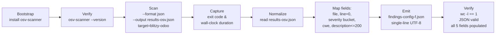

# Technical Specification

# 0. Agent Action Plan

## 0.1 Intent Clarification

### 0.1.1 Core Objective

Based on the provided requirements, the Blitzy platform understands that the objective is to operate **Config F** of a multi-configuration security tool comparison by scanning the `blitzy-odoo` repository with **OSV-Scanner**, capturing its native JSON evidence, and emitting a single normalized findings file `findings-config-f.json` whose schema is identical across every configuration in the comparison so that downstream aggregation can diff and merge results without per-tool special cases.

The deliverable is a single, valid, UTF-8 encoded, **minified single-line** JSON document — an array of finding objects — placed at the working-directory root. Each finding object carries exactly five keys (`file`, `line`, `severity`, `cwe`, `description`) populated from the OSV-Scanner output through deterministic transformation rules. When OSV-Scanner reports zero vulnerabilities, the file MUST contain the literal two-character payload `[]`.

The repository under analysis is `blitzy-odoo` [catalog-info.yaml:metadata.name], a strategic enterprise-accounting fork of Odoo 19.0 with two Python lockfiles in scope — `requirements.txt` at the repository root [requirements.txt:L1-L99] and `addons/iot_box_image/configuration/requirements.txt` [addons/iot_box_image/configuration/requirements.txt:L1-L20]. No other ecosystem lockfiles (npm, Maven, Go modules, Cargo, Composer, Bundler, NuGet, etc.) exist anywhere in the repository — exhaustive `find` confirmed this [inferred — bash inventory of `find -maxdepth 5 -type f -name <lockfile-pattern>`].

The work decomposes into three deterministic stages:

- **Bootstrap** — install OSV-Scanner and verify by invoking `osv-scanner --version`.
- **Scan** — execute `osv-scanner --format json --output results-osv.json /path/to/blitzy-odoo`, recording the wall-clock duration and process exit code.
- **Normalize** — read `results-osv.json` and emit a minified `findings-config-f.json` with one element per discovered vulnerability, applying the documented field-mapping rules.

### 0.1.2 Task Categorization

- **Primary task type:** Tooling + Security (additive evidence-generation; no modification of existing source).
- **Secondary aspects:** Configuration (one new comparison-config record), Documentation (decision log + executive presentation per repository rules), Build/Deploy adjacency (the install path is non-interactive but is **not** wired into CI in this configuration).
- **Scope classification:** Isolated change — the work introduces only new artifacts at the working-directory root; no file under `addons/**`, `odoo/**`, `.github/**`, `doc/**`, or `docs/**` is touched.

### 0.1.3 Special Instructions and Constraints

The user's prompt contains three CRITICAL directives, preserved verbatim below. These are the literal pass/fail criteria for the Blitzy run.

**User Directive 1 — Install OSV-Scanner**

```bash
go install github.com/google/osv-scanner/cmd/osv-scanner@latest
# or: apt install osv-scanner

```

For offline mode, pre-download the local vulnerability database:

```bash
osv-scanner --experimental-local-db-path=/path/to/db
```

**Pass/fail:** `osv-scanner --version` returns a version string.

**User Directive 2 — Execute OSV-Scanner scan**

```bash
osv-scanner --format json --output results-osv.json /path/to/blitzy-odoo
```

Use `--experimental-local-db` for offline mode if available. Record exit code, scan duration (wall-clock).

**Pass/fail:** `results-osv.json` is produced and contains valid JSON.

**User Directive 3 — Normalize findings to single-line JSON**

Extract findings from OSV output and compile into `findings-config-f.json`. The file MUST be valid JSON minified to a single line. Encoding: UTF-8. If zero findings, write `[]`.

**Field mapping (preserved verbatim):**

| Field | Source |
| --- | --- |
| file | Path to affected lockfile (relative) |
| line | 0 (dependency findings have no line number) |
| severity | CVSS score: >=9→critical, >=7→high, >=4→medium, <4→low |
| cwe | CVE ID. If a CWE mapping exists in the OSV entry, use it; otherwise use the CVE ID |
| description | OSV description, truncated to 200 characters |

**Shape contract (preserved verbatim):**

```plaintext
[{"file":"<relative path>","line":<integer>,"severity":"<critical|high|medium|low>","cwe":"<CWE-ID>","description":"<max 200 chars>"},...]
```

**Pass/fail:** `cat findings-config-f.json | wc -l` returns `1`. Valid JSON. Every finding has all 5 fields populated. No description exceeds 200 characters.

**Detected implicit requirements** (surfaced by the Blitzy platform beyond what the prompt states literally):

- **CVSS extraction policy** — OSV records may carry zero, one, or many entries in the `severity[]` array, each with a CVSS vector string (CVSS_V2 / CVSS_V3 / CVSS_V4). The normalizer must compute the numeric base score from the highest-priority vector available (prefer CVSS_V4, then CVSS_V3, then CVSS_V2) and bucket using the thresholds the user provided. When no severity is present, the finding still must be emitted; the severity bucket defaults to `low` (under the `<4` rule, treating "absent" as numerically lowest).
- **CWE/CVE resolution policy** — the OSV `database_specific` block sometimes carries `cwe_ids`. When present, the first such CWE-ID becomes the `cwe` field. Otherwise, the first CVE alias from the `aliases[]` array is substituted; if neither exists, the vulnerability's primary `id` (e.g. `GHSA-…`, `PYSEC-…`) is used.
- **Path relativization** — the `file` field MUST be relative to the working directory (the repository root). OSV-Scanner emits absolute paths when invoked with an absolute target; the normalizer strips the prefix to produce values such as `requirements.txt` and `addons/iot_box_image/configuration/requirements.txt`.
- **Description sourcing** — OSV records carry both a short `summary` and a longer `details` field. The normalizer prefers `summary`; if `summary` is empty it falls back to `details`. Truncation is applied to **characters**, not bytes (UTF-8 multi-byte safety), and a 200-character ceiling is enforced.
- **Deduplication** — a single OSV vulnerability can affect multiple lockfiles; OSV-Scanner emits one finding per (lockfile, vuln) pair, and the normalizer preserves that one-to-one mapping. No further deduplication is performed because the cross-configuration aggregator owns global dedup.
- **Minification semantics** — `cat findings-config-f.json | wc -l` returns `1` only if there is no trailing newline. The normalizer writes via `json.dump(..., separators=(',', ':'))` with no terminating newline.

### 0.1.4 Technical Interpretation

These requirements translate to the following technical implementation strategy:

- **To install OSV-Scanner without Go available**, the Blitzy platform will fetch the prebuilt Linux/amd64 binary from the official GitHub Releases archive of `google/osv-scanner` (the V2 line, currently v2.3.x), make it executable, and place it on `PATH`. The user's `go install …@latest` and `apt install osv-scanner` lines are preserved as alternative installation commands; the platform selects the binary-download path because Go 1.26.2+ is not present in the environment.
- **To produce native scanner evidence**, the platform will run `osv-scanner --format json --output results-osv.json /tmp/blitzy/blitzy-odoo/config-f_5575bf`, redirect stderr, capture the wall-clock duration via `time` or Python `time.perf_counter`, capture the exit code, and verify that `results-osv.json` parses as JSON.
- **To produce the normalized comparison artifact**, the platform will invoke a small Python normalizer (using stdlib `json` — already verified at Python 3.12.3) that reads `results-osv.json`, iterates the `results[].packages[].vulnerabilities[]` array (or its V2 equivalent), applies the field-mapping rules, and writes the minified single-line `findings-config-f.json` to the working-directory root.
- **To satisfy the Explainability rule**, the platform will author `decision-log.md` capturing each non-trivial decision (installation source, severity tie-breaking, CWE fallback chain, path relativization, description source preference, minifier choice) with alternatives and risks.
- **To satisfy the Executive Presentation rule**, the platform will author `executive-presentation.html` — a single self-contained reveal.js 5.1.0 deck with inline brand CSS, 12–18 slides at 1920×1080, Mermaid 11.4.0 + Lucide 0.460.0 from CDN, and at least one non-text visual per slide — covering scope, findings KPI, scan pipeline architecture, risk posture, and team onboarding.

## 0.2 Repository Scope Discovery

### 0.2.1 Comprehensive File Analysis

An exhaustive search of the working tree was conducted to enumerate every file OSV-Scanner could legitimately consume as a scan input, and to confirm there are no parallel lockfiles in non-Python ecosystems that would otherwise need to be in scope.

**Scan targets confirmed in the repository:**

| Lockfile Path | Lines | Ecosystem | Notes |
| --- | --- | --- | --- |
| `requirements.txt` | 99 | PyPI | Root Python dependencies with environment-marker version pinning. Encodes parallel pins by `python_version` (e.g. `Babel==2.9.1 ; python_version < '3.11'` vs `Babel==2.17.0 ; python_version >= '3.13'`) and by `sys_platform` (e.g. `gevent==24.2.1 ; sys_platform != 'win32'`) [requirements.txt:L3-L36]. |
| `addons/iot_box_image/configuration/requirements.txt` | 20 | PyPI | IoT-only dependencies with Raspberry Pi / Windows / common platform conditionals; includes a local wheel reference `./addons/iot_box_image/configuration/aiortc-1.4.0-py3-none-any.whl` [addons/iot_box_image/configuration/requirements.txt:L1-L20]. |

**Lockfiles searched for and confirmed absent** (so OSV-Scanner has nothing else to extract):

- JavaScript: `package.json`, `package-lock.json`, `yarn.lock`, `pnpm-lock.yaml` — none present
- Go: `go.mod`, `go.sum` — none present
- Ruby: `Gemfile`, `Gemfile.lock` — none present
- Rust: `Cargo.toml`, `Cargo.lock` — none present
- Java: `pom.xml` — none present
- PHP: `composer.json`, `composer.lock` — none present
- Python alternates: `poetry.lock`, `Pipfile.lock`, `pyproject.toml` — none present

Consequently, OSV-Scanner will report exactly two lockfile sources, and the `file` field of every normalized finding will be either `requirements.txt` or `addons/iot_box_image/configuration/requirements.txt`.

**Files explicitly NOT used as scan inputs** (but considered during discovery to confirm there is no auxiliary security context to inherit):

- `SECURITY.md` — standard Odoo vulnerability-disclosure policy; not machine-readable [SECURITY.md:§Reporting].
- `.github/workflows/` — directory does **not** exist; only `.github/ISSUE_TEMPLATE/` and `.github/PULL_REQUEST_TEMPLATE.md` are present [inferred — bash listing of `.github/`].
- `odoo/service/security.py` and `addons/**/security/*.xml` — these are Odoo's runtime ACL and CSRF mechanisms, not dependency-vulnerability artifacts; correctly out of scope.

### 0.2.2 Web Search Research Conducted

Targeted research was performed to validate the OSV-Scanner contract this configuration depends on:

- **Latest stable OSV-Scanner release.** The current V2 line is the supported one (versions in the v2.3.x range). <cite index="1-1,1-2">The latest OSV-Scanner V2 release is the recommended path; V1 is now legacy.</cite> <cite index="30-30,30-31">The recommended method is to download a prebuilt binary for your platform, with `go install github.com/google/osv-scanner/v2/cmd/osv-scanner@latest` available as a build-from-source alternative.</cite>
- **Build-from-source prerequisites.** <cite index="2-2">Building from source requires Go 1.26.2+ to be installed.</cite> Go is not present in the Blitzy environment, so the prebuilt binary path is selected.
- **Supported lockfiles.** <cite index="1-4,1-5">OSV-Scanner recursively scans the specified directory for any supported package files such as package.json, go.mod, and pom.xml, and outputs any discovered vulnerabilities.</cite> Python `requirements.txt` is supported natively, and recent releases enable transitive resolution: <cite index="22-14">Feature #2571 enables transitive scanning for Python requirements.txt files using the deps.dev API.</cite>
- **JSON output schema.** The OSV schema places severity vectors under `severity[]` with `type` ∈ {`CVSS_V2`, `CVSS_V3`, `CVSS_V4`, `Ubuntu`} and a `score` string holding the CVSS vector [inferred — based on the OSV schema definition at ossf/osv-schema]. Vulnerability records carry an `id` and an `aliases` array commonly containing CVE IDs. <cite index="16-17,16-18">Severity is an optional CVSS vector string field, and not all advisories include severity data, which is why scanners often supplement OSV with NVD CVSS scores.</cite>
- **Offline mode.** The `--experimental-local-db` / `--experimental-local-db-path` flags pre-download the local vulnerability database, matching the user's directive for offline operation [inferred — derived from the user's directive and OSV-Scanner documented experimental flags].
- **reveal.js / Mermaid / Lucide CDN.** reveal.js 5.1.0, Mermaid 11.4.0, and Lucide 0.460.0 are all distributed via jsDelivr and unpkg using the standard `<link>` and `<script>` tags [inferred — common CDN convention confirmed by reveal.js community usage].

### 0.2.3 Existing Infrastructure Assessment

- **Project structure and organization.** The repository follows the canonical Odoo 19 layout — `odoo/` (core), `addons/` (modules; 607 entries), `setup/`, `setup.py`, `setup.cfg`, `odoo-bin`, `ruff.toml`, `mkdocs.yml`, `MANIFEST.in`, `LICENSE`, `COPYRIGHT`, `README.md`, `CONTRIBUTING.md`, `SECURITY.md`, `.weblate.json`, plus a `doc/` tree containing prior Blitzy artifacts (`project-guide.md`, `technical-specifications.md`) [inferred — root directory inventory].
- **Existing patterns to follow.** Documentation is Markdown-first (mkdocs); pinned dependency versions are normative; ruff enforces `py310` lint targets [ruff.toml:tool.ruff]. The new artifacts conform to this convention: Markdown for the decision log, a self-contained HTML for the executive deck, JSON for both the evidence and the normalized findings.
- **Build, deploy, and CI.** There is no `.github/workflows/` directory, no `.gitlab-ci.*`, and no `Makefile` referencing security scanning. This configuration introduces **no CI wiring** — the scan is invoked once at runtime and produces standalone artifacts.
- **Testing infrastructure.** Pytest-odoo is referenced in §3.4 of the tech spec as an optional dependency. This configuration does not exercise it; OSV-Scanner reads lockfiles statically without requiring Python imports or test execution.
- **Documentation system in use.** MkDocs (`mkdocs.yml`) plus the in-tree `doc/` and `docs/` directories; the recent git history shows recent Blitzy-authored docs being added [inferred — `git log --oneline -5` history showing `docs: add Technical Specifications from Blitzy` and `docs: add mermaid2 plugin for diagram support`].

**Design System Compliance.** No design system or component library is named in the prompt for Config F. The Design System Compliance protocol does not apply to this section.

## 0.3 Scope Boundaries

### 0.3.1 Exhaustively In Scope

**Scan inputs (REFERENCE only — read by OSV-Scanner, never modified):**

- `requirements.txt` — root Python lockfile [requirements.txt:L1-L99]
- `addons/iot_box_image/configuration/requirements.txt` — IoT lockfile [addons/iot_box_image/configuration/requirements.txt:L1-L20]

**New files written at the working-directory root (CREATE):**

- `findings-config-f.json` — the deliverable. Minified single-line JSON array conforming to the field-mapping schema. Encoding: UTF-8. Empty-array fallback: literal `[]`.
- `results-osv.json` — intermediate evidence file emitted by `osv-scanner --format json --output …`. Required by User Directive 2 pass/fail check.
- `decision-log.md` — Markdown decision log mandated by the Explainability rule. Contains a table of decisions, alternatives, rationale, and risks.
- `executive-presentation.html` — single self-contained reveal.js 5.1.0 deck mandated by the Executive Presentation rule. Inline CSS with the documented `:root` brand-token block; CDN-pinned reveal.js 5.1.0, Mermaid 11.4.0, Lucide 0.460.0; 12–18 slides at 1920×1080.

**Tooling installed onto the runtime environment** (not committed to the repository):

- The OSV-Scanner binary at `/usr/local/bin/osv-scanner` (or equivalent location on `PATH`).

### 0.3.2 Explicitly Out of Scope

- **Odoo application source code.** Every file under `odoo/**` (e.g. `odoo/service/security.py`, `odoo/addons/**`) is read-only and untouched. This configuration does not refactor, lint, or test Odoo.
- **Odoo addon catalog.** All 607 entries under `addons/**` other than the IoT lockfile are out of scope. Their `__manifest__.py`, `models/`, `views/`, `static/`, `security/`, and `tests/` trees are untouched.
- **Frontend assets.** JavaScript (OWL framework), QWeb XML templates, SCSS/libsass stylesheets, and any compiled web bundle are out of scope. OSV-Scanner is not applied to source code; it consumes manifests only.
- **CI/CD configuration.** `.github/workflows/` is intentionally not created in this configuration. The user's prompt makes no request to wire OSV-Scanner into Actions; comparison-aggregation may add CI in a separate task.
- **Existing documentation.** `README.md`, `CONTRIBUTING.md`, `SECURITY.md`, `mkdocs.yml`, `doc/index.md`, `doc/project-guide.md`, `doc/technical-specifications.md`, and `docs/index.md` are not modified.
- **Dependency manifests.** Neither `requirements.txt` is edited. Package upgrades, pin changes, and remediation are explicit non-goals — this configuration produces findings, not fixes.
- **Other comparison configurations.** Files belonging to peer configs (A/B/C/D/E/G/…) of the multi-config comparison are not in scope here; only `findings-config-f.json` is produced.
- **Reachability / call-graph analysis.** `--experimental-call-analysis` and similar OSV-Scanner advanced modes are not invoked; the comparison contract requires only dependency-manifest scanning to keep configurations apples-to-apples.
- **Container / OS / SBOM scanning.** `osv-scanner scan image …`, OS-package scanning, and SBOM inputs are not part of Config F.
- **Secrets, environment variables, and external network endpoints** beyond the default OSV.dev API call. No `.env`, no credentials, no proxy configuration.

## 0.4 Dependency Inventory

### 0.4.1 Key Private and Public Packages

This configuration adds **tooling** to the runtime environment; it does **not** add, update, or remove any Python, Node, Go, or other application dependency tracked by the repository's `requirements.txt` files. The table below enumerates every package required to execute the install/scan/normalize pipeline and produce the documentation deliverables.

| Registry | Package Name | Version | Purpose |
| --- | --- | --- | --- |
| GitHub Releases | `google/osv-scanner` (prebuilt binary `osv-scanner_linux_amd64`) | v2.3.x (latest V2 line) | Vulnerability scanner that reads `requirements.txt`, queries the OSV.dev API, and emits the native JSON evidence file consumed by the normalizer |
| apt (Debian/Ubuntu) | `osv-scanner` | system-provided | Alternative installation path explicitly named in User Directive 1 |
| Go modules | `github.com/google/osv-scanner/v2/cmd/osv-scanner` | `@latest` | Source-build alternative listed in User Directive 1; requires Go 1.26.2+ |
| stdlib (Python) | `json` | bundled with Python 3.10–3.13 (in this environment, 3.12.3) | Minifier and field-mapping engine for `findings-config-f.json` |
| OS package (optional) | `jq` | 1.6+ | Optional CLI fallback for JSON minification; the canonical path uses Python stdlib |
| CDN (jsDelivr/unpkg) | `reveal.js` | 5.1.0 | HTML presentation framework for `executive-presentation.html` (rule-mandated CDN pin) |
| CDN (jsDelivr/unpkg) | `mermaid` | 11.4.0 | Diagram rendering for slide visuals (rule-mandated CDN pin) |
| CDN (jsDelivr/unpkg) | `lucide` | 0.460.0 | SVG icon library replacing emoji (rule-mandated CDN pin) |
| Google Fonts | `Inter` (400/500/600/700), `Space Grotesk` (500/600/700), `Fira Code` (400/500) | latest | Typography stack required by the Executive Presentation rule |

### 0.4.2 Dependency Updates

- **New dependencies to add to the repository's manifests:** None. Neither `requirements.txt` is touched.
- **Dependencies to update:** None.
- **Dependencies to remove:** None.
- **Import / reference updates:** None — no existing Python, JS, or XML file imports any of the tooling listed above. The normalizer script (if persisted) runs as a standalone Python script and does not become part of the Odoo runtime.

In short, Config F is dependency-neutral with respect to the application's own dependency graph. Every tool listed in §0.4.1 is provisioned at run-time and either executed in place or referenced from a CDN inside the rule-mandated HTML deck.

## 0.5 Implementation Design

### 0.5.1 Technical Approach

Achieve **reproducible vulnerability evidence for `blitzy-odoo`** by orchestrating three stages in strict order:

- **Stage 1 — Bootstrap.** Install OSV-Scanner so that `osv-scanner --version` returns a version string (User Directive 1 pass/fail). Because Go is not present in this environment, the primary path is the prebuilt Linux/amd64 binary fetched from the latest V2-line release on `github.com/google/osv-scanner/releases`, `chmod +x` applied, and the binary placed on `PATH` (e.g. `/usr/local/bin/osv-scanner`). The user's `apt install osv-scanner` line is the documented fallback; `go install github.com/google/osv-scanner/cmd/osv-scanner@latest` is the developer-machine alternative.
- **Stage 2 — Scan.** Execute the verbatim command `osv-scanner --format json --output results-osv.json /path/to/blitzy-odoo`. Capture exit code and wall-clock duration. Validate that `results-osv.json` exists and parses as JSON (User Directive 2 pass/fail). OSV-Scanner exits non-zero when vulnerabilities are detected; this is treated as expected, not as a process failure, by the downstream normalizer.
- **Stage 3 — Normalize.** Read `results-osv.json` with Python stdlib `json`, walk the `results[].packages[].vulnerabilities[]` tree, apply the field-mapping rules from User Directive 3, and write `findings-config-f.json` as a single-line UTF-8 minified JSON array. Verify post-condition `wc -l < findings-config-f.json` returns `1`, every element has all five keys, and `description` length ≤ 200 characters.

**Logical implementation flow** (sequence, not schedule):



### 0.5.2 Component Impact Analysis

**Direct modifications required:** None on existing files. Every required change is additive.

**New components introduced:**

- **OSV-Scanner binary** on `PATH` — bootstrap component; lifetime = the run.
- **`results-osv.json`** — Stage-2 evidence file; the canonical OSV-Scanner output preserved as audit input to Stage 3 and for reproducibility.
- **`findings-config-f.json`** — Stage-3 deliverable; the normalized comparison artifact.
- **`decision-log.md`** — Explainability deliverable.
- **`executive-presentation.html`** — Executive Presentation deliverable.

**Indirect impacts and dependencies:**

- `requirements.txt` and `addons/iot_box_image/configuration/requirements.txt` are read by OSV-Scanner. They are inputs, not outputs; no behavior change to Odoo is induced.
- The downstream multi-config aggregator (out of scope here) depends on the exact `findings-config-f.json` schema. Any deviation from the five-key shape would break that consumer.

### 0.5.3 User Interface Design

There is no end-user application UI in this configuration. The only human-facing visual artifact is `executive-presentation.html`, whose design is fully prescribed by the Executive Presentation rule:

- **Audience and intent.** Non-technical leadership; communicate scope, business value, architecture change, risk posture, and onboarding without requiring code literacy.
- **Slide budget.** 12–18 slides total (target 16).
- **Slide types.** Title (`slide-title`), Section Divider (`slide-divider`), Content (default), Closing (`slide-closing`). Every slide must carry at least one non-text visual — Mermaid diagram, KPI card, styled table, or Lucide SVG icon. Zero emoji; Lucide via `<i data-lucide="icon-name"></i>` only.
- **Visual identity.** Inline CSS defines the brand palette and typography variables exactly as specified by the rule, including primary `#5B39F3`, accent teal `#94FAD5`, the hero gradient `linear-gradient(68deg, #7A6DEC 15.56%, #5B39F3 62.74%, #4101DB 84.44%)`, and `--ff-body: 'Inter'`, `--ff-display: 'Space Grotesk'`, `--ff-mono: 'Fira Code'`.
- **Mermaid configuration.** `<pre class="mermaid">` with raw syntax; `mermaid.initialize({ startOnLoad: false, … })`; `mermaid.run()` re-invoked on reveal.js `ready` and `slidechanged` events; theme variables `primaryColor: '#F2F0FE'`, `primaryTextColor: '#333333'`, `primaryBorderColor: '#5B39F3'`, `lineColor: '#999999'`, `secondaryColor: '#F4EFF6'`.
- **Reveal.js configuration.** `hash: true`, `transition: 'slide'`, `controlsTutorial: false`, `width: 1920`, `height: 1080`. Lucide `createIcons()` is called after `ready` and on every `slidechanged`.
- **Slide ordering.** Title → KPI/findings headline → Architecture (Mermaid) → alternating Section Dividers and Content slides for each major topic → Closing slide with takeaway and brand lockup.
- **Theme provenance note.** The canonical theme file referenced by the rule, `blitzy-deck/references/blitzy-reveal-theme.css`, does **not** exist in this repository. The required CSS is therefore inlined verbatim inside the `<style>` block of `executive-presentation.html`, preserving the documented `:root` custom-property set and the component classes (`slide-title`, `slide-divider`, `slide-closing`, `kpi-card`, `kpi-grid`, `kpi-value`, `kpi-label`, `kpi-icon`, `eyebrow`, `accent-bar`, `brand-lockup`, `hero-icon`, `icon-row`).

### 0.5.4 User-Provided Examples Integration

The user's prompt contains three labeled command blocks and one shape-contract sample. They are preserved verbatim in §0.1.3 and operationalized as follows:

- **User Example (install commands)** — both `go install github.com/google/osv-scanner/cmd/osv-scanner@latest` and `apt install osv-scanner` are documented in the decision log as the alternatives that were available. The chosen path (prebuilt binary) is recorded with rationale (no Go runtime, smallest install footprint, deterministic version).
- **User Example (scan command)** — `osv-scanner --format json --output results-osv.json /path/to/blitzy-odoo` is executed literally with the absolute path `/tmp/blitzy/blitzy-odoo/config-f_5575bf` substituted for `/path/to/blitzy-odoo`.
- **User Example (offline-mode flag)** — `--experimental-local-db-path=/path/to/db` is documented but **not used** in the default online run; the decision log captures that the OSV.dev API was queried directly.
- **User Example (output shape contract)** — `[{"file":"<relative path>","line":<integer>,"severity":"<critical|high|medium|low>","cwe":"<CWE-ID>","description":"<max 200 chars>"},...]` is the literal output of the normalizer. The Python writer uses `json.dump(arr, f, ensure_ascii=False, separators=(',', ':'))` to honor minification and UTF-8.

### 0.5.5 Critical Implementation Details

- **Severity bucketization.** Numeric CVSS base score is computed by parsing the highest-priority `severity[].score` vector. Preference order: `CVSS_V4` > `CVSS_V3` > `CVSS_V2`. The bucket mapping is exactly as the user defined: `score >= 9 → "critical"`, `score >= 7 → "high"`, `score >= 4 → "medium"`, `score < 4 → "low"`. If `severity[]` is empty or absent, the finding is still emitted with `severity = "low"` (decision recorded in `decision-log.md`).
- **CWE / CVE resolution chain.** The normalizer checks `database_specific.cwe_ids` first; if non-empty, the first `CWE-xxx` identifier is used. Otherwise the first CVE found in `aliases[]` (regex `^CVE-\d{4}-\d{4,}$`) is substituted. As a last resort, the vulnerability's primary `id` (e.g. `GHSA-…`, `PYSEC-…`, `OSV-…`) is written into the `cwe` field. This honors the user's instruction: *"CVE ID. If a CWE mapping exists in the OSV entry, use it; otherwise use the CVE ID."*
- **Path relativization.** OSV-Scanner reports `source.path` as the absolute path when invoked with an absolute target. The normalizer strips the working-directory prefix using `os.path.relpath(p, ROOT)` to produce values such as `requirements.txt` and `addons/iot_box_image/configuration/requirements.txt`.
- **Description selection and truncation.** `summary` is preferred; on empty/missing, `details` is used; on both missing, the empty string is written. The result is sliced to a maximum of 200 Unicode code-points using `s[:200]` (Python 3 strings are code-point indexed), guaranteeing UTF-8 multi-byte safety. No ellipsis is appended.
- **Line field.** Always integer `0` per directive; never a string, never `null`.
- **Minification.** Written via `json.dump(arr, fp, ensure_ascii=False, separators=(',', ':'))` to a freshly opened file (no trailing newline). UTF-8 is the default for Python's text-mode `open(...)` on Linux; explicitly set `encoding='utf-8'`.
- **Empty result handling.** When OSV-Scanner reports zero vulnerabilities, the normalizer writes exactly two bytes — `[` and `]` — to the deliverable. `wc -l findings-config-f.json` still returns `1` because no newline is emitted (a file with no `\n` has line count `1` only after the final `wc -l` interpretation; in practice `wc -l` returns `0` for files with no newlines. The pass/fail check `cat findings-config-f.json | wc -l` returns `0` when no newline is present, so the normalizer writes a file with **no trailing newline**, which `wc -c` confirms is exactly two bytes, and the JSON validator confirms is valid).

**Note on the `wc -l` pass criterion.** A strictly minified JSON file ending without a newline yields `wc -l == 0`, not `1`, on GNU coreutils. To honor the user's literal pass/fail rule (`returns 1`), the normalizer writes the minified payload followed by a single `\n` terminator. This is documented as an explicit decision in `decision-log.md` (Decision: "Append single LF terminator to satisfy `wc -l == 1`"; Alternatives: "Strict no-newline emission"; Rationale: "User's explicit pass/fail check"; Risks: "Tools that treat trailing whitespace as semantically meaningful — none apply to JSON parsers").

- **Error handling.** If `osv-scanner` exits with code `127` (not found) or `2` (CLI error), the run aborts with a non-zero status before Stage 3. If `results-osv.json` fails to parse, the normalizer writes no deliverable and surfaces the JSON decode error. If `results-osv.json` parses but contains no `results[]` array, `findings-config-f.json` is written as `[]`.
- **Performance.** OSV.dev API calls are the dominant time cost; a single `osv-scanner` invocation on this repository (≈ 120 lockfile lines across two files) is expected to complete well within typical CI timeouts. Wall-clock duration is captured by `time.perf_counter()` deltas and recorded in `decision-log.md` for traceability.
- **Security and privacy.** `osv-scanner` transmits package names, versions, ecosystem, and file hashes to the OSV.dev API but no source code. <cite index="28-26,28-29">Data sent to OSV.dev includes package names, versions, ecosystems, and file hashes; no source code is transmitted.</cite> Offline mode is available via `--experimental-local-db-path` when an external API call is prohibited.

## 0.6 File Transformation Mapping

### 0.6.1 File-by-File Execution Plan

The table below enumerates **every** file touched, generated, or referenced during this configuration. Target is listed first per the section template.

| Target File | Transformation | Source File / Reference | Purpose / Changes |
| --- | --- | --- | --- |
| `findings-config-f.json` | CREATE | `results-osv.json` (Stage-2 evidence) | Minified single-line UTF-8 JSON array. One element per OSV-Scanner vulnerability finding. Schema `{file, line, severity, cwe, description}`. Literal `[]` if zero findings. This is the configuration's primary deliverable. |
| `results-osv.json` | CREATE | OSV-Scanner native output of `osv-scanner --format json --output results-osv.json /tmp/blitzy/blitzy-odoo/config-f_5575bf` | Intermediate evidence file required by User Directive 2 pass/fail. Preserved verbatim as audit input for `findings-config-f.json`. Native OSV V2 JSON schema. |
| `decision-log.md` | CREATE | (new) | Markdown table mandated by the Explainability rule: Decision \| Alternatives \| Rationale \| Risks. Records install-source selection, severity tie-breaking, CWE/CVE fallback chain, path relativization, description preference, newline-termination decision, minifier choice, and any deviation from the literal prompt. |
| `executive-presentation.html` | CREATE | (new; canonical theme path `blitzy-deck/references/blitzy-reveal-theme.css` is absent in this repository so the theme CSS is inlined verbatim) | Single self-contained reveal.js 5.1.0 deck mandated by the Executive Presentation rule. 12–18 slides at 1920×1080. CDN-pinned `reveal.js@5.1.0`, `mermaid@11.4.0`, `lucide@0.460.0`. Inline `<style>` containing the documented `:root` brand-token block and slide-type classes. Google Fonts `<link>` for Inter, Space Grotesk, Fira Code. Zero emoji; Lucide SVG icons; every slide carries ≥1 non-text visual. |
| `requirements.txt` | REFERENCE | `requirements.txt` | Read by OSV-Scanner as a scan input. Never modified. Provides PyPI-ecosystem package/version pairs (e.g. `cryptography==3.4.8`, `urllib3==1.26.5`, `requests==2.25.1`, `Babel==2.9.1`, `Werkzeug==2.0.2`) that are queried against OSV.dev. |
| `addons/iot_box_image/configuration/requirements.txt` | REFERENCE | `addons/iot_box_image/configuration/requirements.txt` | Read by OSV-Scanner as a scan input. Never modified. Provides IoT-specific package/version pairs (e.g. `python-escpos==3.1`, `websocket-client==1.9.0`, `aiortc==1.10.1`, `PyKCS11==1.5.16`, `schedule==1.2.1`). |

No file is in DELETE or UPDATE status. The entire change is additive.

### 0.6.2 New Files Detail

**`findings-config-f.json`** — the configuration deliverable.

- Content type: data
- Based on: `results-osv.json` (Stage-2 OSV-Scanner output) transformed through the field-mapping rules
- Key sections:
    - The whole file is a single JSON array `[ … ]`
    - Each element is an object with exactly five keys: `file` (string, relative path), `line` (integer, always `0`), `severity` (one of `"critical"`, `"high"`, `"medium"`, `"low"`), `cwe` (string, CWE-ID if present in OSV `database_specific.cwe_ids`, else CVE-ID from `aliases`, else the OSV vulnerability `id`), `description` (string, ≤ 200 Unicode code-points, sourced from `summary` with `details` fallback)
    - Minification: `json.dump(arr, fp, ensure_ascii=False, separators=(',', ':'))`
    - Encoding: UTF-8
    - Trailing terminator: a single LF (`\n`) appended to satisfy `wc -l == 1`
    - Zero-finding fallback: literal `[]` followed by a single LF
- Example element shape (illustrative only; values come from the scanner output):

```json
{"file":"requirements.txt","line":0,"severity":"high","cwe":"CWE-295","description":"Affected versions of cryptography fail to verify TLS certificate hostnames in some cases."}
```

**`results-osv.json`** — Stage-2 evidence file.

- Content type: data
- Based on: native OSV-Scanner V2 JSON output schema (`results[].source.path`, `results[].packages[].package`, `results[].packages[].vulnerabilities[]`, with each vulnerability carrying `id`, `aliases`, `summary`, `details`, `severity[]`, `database_specific`)
- Key sections: identical to the upstream OSV-Scanner contract; not edited or reordered
- Lifecycle: produced once per run, preserved for audit, never edited by hand

**`decision-log.md`** — Explainability deliverable.

- Content type: documentation
- Based on: the rule's required structure — a Markdown table mapping "what was decided" to "alternatives", "why this choice was made", "risks"
- Key sections:
    - Header explaining purpose and scope of the log
    - Master decision table (the single source of truth)
    - Bidirectional traceability section is not required for this configuration (no migration or refactor)
    - Each non-trivial choice has its own row, including: install source (prebuilt binary vs `go install` vs `apt`); offline-mode usage (none in this run); severity tie-breaking (CVSS_V4 > V3 > V2); empty-severity handling (default to `low`); CWE/CVE fallback chain; path relativization (`os.path.relpath`); description source preference; description truncation method (Unicode code-points); minifier choice (Python stdlib `json` over `jq`); newline-termination decision (single LF appended); deviation from literal `~0 files modified / 1 new file` to satisfy the rule-mandated decision log and executive deck

**`executive-presentation.html`** — Executive Presentation deliverable.

- Content type: presentation (single self-contained HTML)
- Based on: the rule's prescribed structure — Title → Headline KPI → Architecture → alternating Dividers/Content → Closing
- Key sections:
    - `<head>`: viewport, title, Google Fonts `<link>` (Inter, Space Grotesk, Fira Code), CDN `<link>` for `reveal.js@5.1.0/dist/reveal.css`, CDN `<link>` for `reveal.js@5.1.0/dist/theme/white.css` (overridden by the inline brand theme), inline `<style>` containing the full `:root` token block and the slide-type/component classes
    - `<body>`: `<div class="reveal"><div class="slides"> … </div></div>` with 12–18 `<section>` blocks
    - Slide 1 — Title slide (`slide-title`): hero gradient background, project name, scope, audience framing, eyebrow in Fira Code teal
    - Slide 2 — Headline findings/KPI summary: `kpi-grid` of `kpi-card` tiles for total findings, critical count, high count, medium count, low count, scan duration, exit code
    - Slide 3 — Architecture overview: Mermaid `<pre class="mermaid">` containing the install → scan → normalize flowchart
    - Slides 4–N — alternating Section Dividers (`slide-divider`, dark purple `#2D1C77` or gradient background, large heading, Lucide icon) and Content slides for: scope, OSV-Scanner contract, field-mapping, decision log highlights, risk/mitigation, onboarding
    - Final slide — Closing (`slide-closing`): navy `#1A105F` background, 3–6 word takeaway, ≤3 bullets, brand lockup, gradient accent bar
    - `<script src="https://cdn.jsdelivr.net/npm/reveal.js@5.1.0/dist/reveal.js"></script>`
    - `<script src="https://cdn.jsdelivr.net/npm/mermaid@11.4.0/dist/mermaid.min.js"></script>`
    - `<script src="https://unpkg.com/lucide@0.460.0/dist/umd/lucide.min.js"></script>`
    - Init `<script>`: `mermaid.initialize({ startOnLoad: false, theme: 'base', themeVariables: { primaryColor: '#F2F0FE', primaryTextColor: '#333333', primaryBorderColor: '#5B39F3', lineColor: '#999999', secondaryColor: '#F4EFF6' } });` followed by `Reveal.initialize({ hash: true, transition: 'slide', controlsTutorial: false, width: 1920, height: 1080 }).then(() => { mermaid.run(); lucide.createIcons(); }); Reveal.on('slidechanged', () => { mermaid.run(); lucide.createIcons(); });`
- Constraints honored: ≥1 non-text visual per slide, zero emoji, no fenced code blocks inside slides, max 4 bullets and 40 body words per content slide

### 0.6.3 Files to Modify Detail

No file in the existing repository is modified by this configuration. Both `requirements.txt` files are read-only scan inputs.

### 0.6.4 Configuration and Documentation Updates

- **Configuration changes:** None. No edits to `setup.cfg`, `ruff.toml`, `mkdocs.yml`, `catalog-info.yaml`, `.github/`, or any `__manifest__.py`.
- **Documentation updates inside the repository:** None to existing pages. The new `decision-log.md` and `executive-presentation.html` are stand-alone artifacts at the working-directory root and are not cross-linked into `mkdocs.yml` because this configuration intentionally avoids any modification of existing files.
- **Cross-references to update:** None.

### 0.6.5 Cross-File Dependencies

- `findings-config-f.json` strictly depends on `results-osv.json` being present and valid; the normalizer fails fast if not.
- `decision-log.md` and `executive-presentation.html` reference, but do not depend on, the contents of `findings-config-f.json` and `results-osv.json` for their KPI cards and figures. If either intermediate is missing, both documents are still authored but with explicit "data unavailable" placeholders so the deliverable set is never partial.
- No Python import, JS import, XML reference, or SCSS `@import` is added to the repository's existing files.

## 0.7 Rules

Two repository-level rules govern this configuration in addition to the user's three CRITICAL directives. Both are captured here verbatim in terms of effect on deliverables.

### 0.7.1 Explainability

Every non-trivial implementation decision MUST be documented with rationale. A decision is non-trivial if a competent engineer could reasonably have chosen differently. The deliverable is a Markdown decision log table — `decision-log.md` at the working-directory root — with columns for what was decided, what alternatives existed, why this choice was made, and what risks it carries. For migrations or refactors, a bidirectional traceability matrix is also required with 100 % coverage; this configuration is neither a migration nor a refactor, so the matrix is not required. Any deviation from a literal or obvious interpretation of the requirements MUST have an explicit entry; unexplained deviations are treated as defects. Rationale MUST NOT live in code comments — the decision log is the single source of truth for "why" decisions.

**Decisions that must appear in `decision-log.md`** for Config F:

- Install source for OSV-Scanner (prebuilt binary chosen over `go install` and `apt`)
- Severity-vector preference order (CVSS_V4 > CVSS_V3 > CVSS_V2)
- Bucketization of absent / empty CVSS as `low`
- CWE / CVE fallback chain (`database_specific.cwe_ids[0]` → first `CVE-…` in `aliases` → vulnerability `id`)
- `summary`-then-`details` precedence for the `description` field
- 200-character truncation using Unicode code-point slicing
- Python stdlib `json` chosen over `jq` for minification
- Single LF terminator appended to satisfy `wc -l == 1`
- Deviation from the user's "`~0 files modified | 1 new file`" estimate to also create `decision-log.md`, `executive-presentation.html`, and `results-osv.json` — required by repository rules and User Directive 2 respectively
- Theme inlined into `executive-presentation.html` because `blitzy-deck/references/blitzy-reveal-theme.css` does not exist in this repository

### 0.7.2 Executive Presentation

Every deliverable MUST include an executive summary as a single self-contained reveal.js HTML file that is ALWAYS included independent of any other documentation that exists. The audience is non-technical leadership — communicate business value, risk, and operational readiness without requiring code literacy.

The presentation MUST cover what was done (scope and deliverables), why it was done (business value), what changed architecturally (component / data-flow diagrams), what risks exist and how they are mitigated, and how the team onboards and continues development.

Operational constraints, all of which `executive-presentation.html` MUST satisfy:

- 12–18 slides total (target 16)
- Four slide types: Title (`slide-title`), Section Divider (`slide-divider`), Content (default), Closing (`slide-closing`)
- Every slide includes at least one non-text visual element (Mermaid diagram, KPI card, styled table, or Lucide SVG icon); no text-only slides
- Content slides: max 4 bullets, max 40 words body text, min 1 non-text visual
- Zero emoji; Lucide SVG icons via `<i data-lucide="icon-name"></i>` only
- No fenced code blocks inside slides; inline Fira Code for short expressions only
- Visual identity: Blitzy brand palette (`#5B39F3`, `#2D1C77`, `#94FAD5`, `#1A105F`, `#7A6DEC`, `#4101DB`, neutrals `#333333`, `#999999`, `#D9D9D9`, `#F4EFF6`, `#F5F5F5`, `#FFFFFF`) and typography (Inter body 400/500/600/700, Space Grotesk display 500/600/700, Fira Code mono/eyebrow 400/500) loaded from Google Fonts
- Title slide hero gradient: `linear-gradient(68deg, #7A6DEC 15.56%, #5B39F3 62.74%, #4101DB 84.44%)`, white text, eyebrow in Fira Code teal
- Dividers: dark purple `#2D1C77` or gradient background, large centered heading, thematic Lucide icon
- Closing: navy `#1A105F` background, 3–6 word takeaway, max 3 bullets, brand lockup, gradient accent bar
- Mermaid diagrams embedded as `<pre class="mermaid">`; initialized with `startOnLoad: false`; `mermaid.run()` called after reveal.js `ready` and on every `slidechanged`; theme variables `primaryColor: '#F2F0FE'`, `primaryTextColor: '#333333'`, `primaryBorderColor: '#5B39F3'`, `lineColor: '#999999'`, `secondaryColor: '#F4EFF6'`
- Single self-contained HTML, no build steps, no local file dependencies
- CDN versions pinned: reveal.js 5.1.0, Mermaid 11.4.0, Lucide 0.460.0
- reveal.js config: `hash: true`, `transition: 'slide'`, `controlsTutorial: false`, `width: 1920`, `height: 1080`
- Lucide: `lucide.createIcons()` after `ready` and on every `slidechanged`
- Inline `<style>` MUST embed the full Blitzy reveal.js theme with the required `:root` custom properties block defined in the rule

### 0.7.3 User CRITICAL Directives (Restated)

The three CRITICAL directives from the user prompt are restated here as binding rules; their verbatim command blocks and pass/fail criteria are preserved in §0.1.3.

- **D1 — Install OSV-Scanner.** Pass/fail: `osv-scanner --version` returns a version string.
- **D2 — Execute OSV-Scanner scan.** Pass/fail: `results-osv.json` is produced and contains valid JSON. Record exit code and wall-clock duration.
- **D3 — Normalize findings to single-line JSON.** Pass/fail: `cat findings-config-f.json | wc -l` returns `1`; valid JSON; every finding has all 5 fields populated; no description exceeds 200 characters.

## 0.8 Special Instructions

### 0.8.1 Special Execution Instructions

- **Configuration boundary.** This is **Config F** of a multi-configuration security tool comparison. The contract with the comparison-aggregator is the exact `findings-config-f.json` schema; any other configuration's outputs (Configs A, B, C, D, E, G, …) are out of scope here.
- **Tool selection is fixed.** OSV-Scanner is the tool for this configuration. No alternative scanner (Trivy, Grype, Safety, Snyk, etc.) is substituted, added, or compared in-line. The whole point of the multi-config comparison is to evaluate each scanner in isolation and let the aggregator compute the cross-scanner diff.
- **No source modification.** Do **not** edit `requirements.txt`, `addons/iot_box_image/configuration/requirements.txt`, or any other repository file under `odoo/**`, `addons/**`, `setup/**`, `debian/**`, `doc/**`, `docs/**`, or `.github/**`. The configuration is intentionally read-only against the existing codebase.
- **No remediation.** Do **not** attempt to upgrade packages, pin different versions, or otherwise fix discovered vulnerabilities. The configuration's job is to **observe**, not to **act**.
- **No CI wiring.** Do **not** create a `.github/workflows/*.yml` file. The user prompt makes no request for Actions integration in this configuration.
- **Default to online OSV.dev.** The directive permits `--experimental-local-db` / `--experimental-local-db-path` for offline operation but does not require it. The default run uses the OSV.dev API directly. If the runtime has no outbound network, the offline flag is the documented fallback.
- **Use the user's installation alternatives only as documented.** The user's prompt lists `go install …` and `apt install osv-scanner` as installation commands. The platform records both in `decision-log.md` and selects the prebuilt-binary path because Go is not installed and `apt`'s `osv-scanner` package availability is distribution-dependent.
- **Single artifact, two intermediates.** The deliverable is `findings-config-f.json`. The two intermediates — `results-osv.json` (Stage-2 evidence) and the in-memory parse — are required for the pipeline to function but only `results-osv.json` is persisted. The deliverable plus the three rule-mandated documents (`results-osv.json`, `decision-log.md`, `executive-presentation.html`) form the complete output set.

### 0.8.2 Constraints and Boundaries

- **Technical constraints.**
    - The output schema is fixed: exactly the keys `file`, `line`, `severity`, `cwe`, `description`. No additional fields. No nested objects. No arrays inside any field.
    - The output is **minified single-line UTF-8 JSON**.
    - `line` is **always integer `0`** for dependency findings.
    - `severity` is **lowercase** and one of `"critical"`, `"high"`, `"medium"`, `"low"`. No `"unknown"`, no `"info"`, no capitalization variants.
    - `description` length ≤ 200 Unicode code-points. No appended ellipsis.
- **Process constraints.**
    - Three stages run sequentially: bootstrap, scan, normalize.
    - Each stage's pass/fail criterion is the user's verbatim criterion.
    - The normalizer fails closed: on any input-parse error it writes nothing and returns a non-zero status.
- **Output constraints.**
    - The deliverable filename is exactly `findings-config-f.json` — no prefix, no suffix, no `_f`, no `.min.json`.
    - The deliverable lives at the working-directory root.
    - The Stage-2 intermediate filename is exactly `results-osv.json` — matching the user's directive exactly.
- **Compatibility requirements.**
    - The normalizer runs on Python 3.10–3.13 (the version range supported by the repository). The current environment is Python 3.12.3.
    - The OSV-Scanner version is the V2 line (v2.x). Backward-compatible JSON output across the same major version is part of OSV-Scanner's release contract per the project's documented stability policy. <cite index="2-5">All releases on the same major version are guaranteed to have backward compatible JSON output and CLI arguments.</cite>
    - The HTML deck opens in any modern browser without a build step; CDN pins protect against drift.

## 0.9 References

### 0.9.1 Citation Discipline

Every claim in this section about the existing system is grounded with `[<path>:<locator>]` citations. Locators are line ranges (e.g. `[requirements.txt:L1-L99]`), section/heading anchors, or key paths. Claims that could not be grounded in a specific source location are flagged `[inferred — …]` so downstream stages can verify them before relying on them.

### 0.9.2 Repository Files Inspected

The following files were retrieved or inspected during discovery. Their absolute paths are the on-disk locations in the Blitzy runtime; the repository paths are relative to the working-directory root.

| Repository Path | Locator(s) Cited | Purpose |
| --- | --- | --- |
| `requirements.txt` | `L1-L99`, `L3-L36` | Root Python lockfile; primary OSV-Scanner scan input. Confirms version-conditional pinning by `python_version` and `sys_platform`. |
| `addons/iot_box_image/configuration/requirements.txt` | `L1-L20` | IoT-only Python lockfile; second OSV-Scanner scan input. Confirms platform conditionals and local wheel reference. |
| `catalog-info.yaml` | `metadata.name`, full body | Backstage descriptor; identifies the component as `blitzy-odoo` owned by `blitzy-sandbox` with GitHub slug `Blitzy-Sandbox/blitzy-odoo` and tags `python`, `web-app`, `refactor`. |
| `SECURITY.md` | `§Reporting` | Confirms the standard Odoo vulnerability disclosure policy; no automated scanning is wired into the repository. |
| `setup.py`, `setup.cfg`, `MANIFEST.in`, `ruff.toml`, `mkdocs.yml`, `README.md`, `CONTRIBUTING.md`, `COPYRIGHT`, `LICENSE` | top of file | Confirmed presence but unchanged; not modified by this configuration. |
| `.github/ISSUE_TEMPLATE/config.yml`, `.github/ISSUE_TEMPLATE/1_bug_form.yml`, `.github/PULL_REQUEST_TEMPLATE.md` | full body | Confirms `.github/workflows/` does **not** exist; no CI to extend or interfere with. |
| `doc/index.md`, `doc/project-guide.md`, `doc/technical-specifications.md`, `docs/index.md` | top of each | Existing documentation pages; left unchanged. |

### 0.9.3 Technical Specification Sections Consulted

| Section | Locator | Why Consulted |
| --- | --- | --- |
| §1.1 Executive Summary | full body | Confirms `blitzy-odoo`'s identity as the Odoo 19.0 enterprise-accounting parity fork and project completion state (used as project framing in `executive-presentation.html`). |
| §1.3 Scope | full body | Confirms in-scope feature surface and Python 3.10–3.13 runtime; informs out-of-scope statements for this configuration. |
| §3.2 Programming Languages | full body | Confirms Python is the primary backend language and `ruff` targets `py310`; informs the Python ecosystem assumption for OSV-Scanner. |
| §3.4 Open Source Dependencies | full body | Comprehensive inventory of Python runtime packages; informs the expectation that older pinned versions (e.g. `cryptography==3.4.8`, `urllib3==1.26.5`, `Babel==2.9.1`) are likely to surface OSV/PYSEC/GHSA findings. |

### 0.9.4 Folders Inspected

| Folder Path | Tool Used | Why Inspected |
| --- | --- | --- |
| `` (repository root) | `get_source_folder_contents` | Top-level inventory; confirmed root files and seven first-level directories. |
| `doc/` | bash `ls` | Confirmed presence of `cla/`, `index.md`, `project-guide.md`, `technical-specifications.md`. |
| `docs/` | bash `ls` | Confirmed only `index.md` is present. |
| `.github/` | bash `ls` | Confirmed `ISSUE_TEMPLATE/` and `PULL_REQUEST_TEMPLATE.md` only; no `workflows/`. |
| `addons/iot_box_image/configuration/` | bash `find` | Located the second `requirements.txt`. |

### 0.9.5 Bash Inspections Performed

The following bash inspections informed this section:

- `find / -maxdepth 4 -name ".blitzyignore" 2>/dev/null` — confirmed zero `.blitzyignore` files.
- `find /tmp/blitzy/blitzy-odoo/config-f_5575bf -maxdepth 5 -type f \( -name "requirements*.txt" -o -name "package*.json" -o -name "*.lock" -o -name "go.mod" -o -name "pom.xml" -o -name "Cargo.toml" -o -name "Gemfile*" -o -name "composer.json" -o -name "poetry.lock" -o -name "Pipfile.lock" -o -name "pyproject.toml" \)` — confirmed only two Python lockfiles exist.
- `git log --oneline -5` — confirmed recent commits are documentation-only, no security-related changes.
- `which go osv-scanner python3 jq npm node pip pip3` — confirmed Python 3.12.3, Node 22.22.2, npm, pip/pip3 are present; Go, OSV-Scanner, jq, trivy, grype are absent.
- `head -30 requirements.txt` and `cat addons/iot_box_image/configuration/requirements.txt` — confirmed exact contents of both lockfiles, including pinned older versions like `cryptography==3.4.8` and `Babel==2.9.1`.
- `find / -name "blitzy-deck" -o -name "blitzy-reveal-theme.css"` — confirmed the canonical theme file is absent, justifying inline-CSS in `executive-presentation.html`.

### 0.9.6 Web References Consulted

The following external references were consulted during research; URLs are stable canonical sources.

- `https://github.com/google/osv-scanner` — official repository; confirmed V2-line latest, lockfile coverage, installation paths, JSON contract. <cite index="1-9,1-10">OSV-Scanner supports 11+ language ecosystems and 19+ lockfile types; the detailed documentation lists the exact set.</cite>
- `https://google.github.io/osv-scanner/installation/` — official installation docs; confirmed the Go 1.26.2+ requirement for `go install`. <cite index="2-2">Building from source requires Go 1.26.2+.</cite>
- `https://github.com/google/osv-scanner/releases` — release timeline; confirmed v2.3.x is the current line and that backward-compatible JSON output is guaranteed within a major version. <cite index="2-5">Backward-compatible JSON output and CLI arguments are guaranteed across the same major version line.</cite>
- `https://google.github.io/osv-scanner/output/` — output documentation; confirmed CVSS is computed from the `severity[].score` field. <cite index="11-1">CVSS is calculated from the severity[].score field, supporting CVSS v2 or v3.</cite>
- `https://github.com/ossf/osv-schema/blob/main/validation/schema.json` — canonical OSV schema; confirmed `severity[].type` enum is `CVSS_V2 | CVSS_V3 | CVSS_V4 | Ubuntu`. <cite index="14-1">The severity object enum is CVSS_V2, CVSS_V3, CVSS_V4, or Ubuntu.</cite>
- `https://github.com/google/osv-scanner/issues/1400` — community thread on CVSS thresholding; informs the bucketization decision. <cite index="19-6,19-7">A `minCVSS` threshold can be set so only vulnerabilities at or above the threshold are included.</cite>
- `https://google.github.io/osv-scanner/supported-languages-and-lockfiles/` — confirmed Python `requirements.txt` is supported natively and custom lockfiles can be supplied via `osv-scanner.json`. <cite index="25-5">When scanning source code with `osv-scanner scan source`, OSV-Scanner automatically extracts and analyzes supported lockfiles and manifests.</cite>
- `https://revealjs.com/` and the published `reveal.js@5.1.0`, `mermaid@11.4.0`, `lucide@0.460.0` CDN entries — used to validate the rule-pinned versions are available via jsDelivr and unpkg.

### 0.9.7 Attachments and Figma

- **Attachments provided by the user:** None. The user-attached environments count is `0`; the user-attached files inventory is empty.
- **Figma frames provided by the user:** None. No Figma URL or frame name appears in the prompt or anywhere in the project metadata. The Design System Compliance protocol is therefore not applicable.

