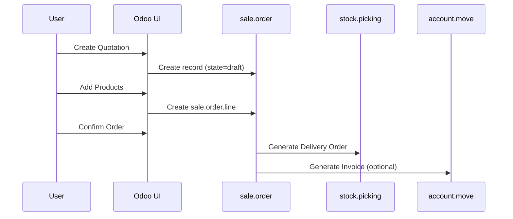
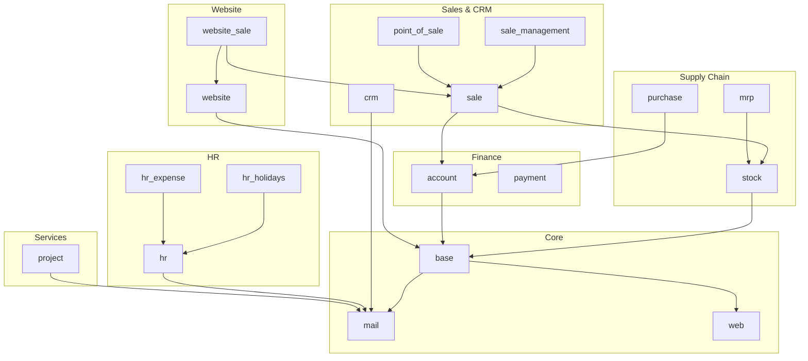
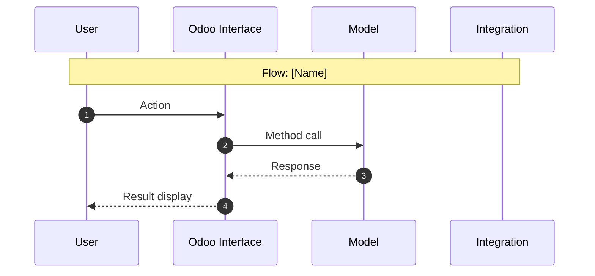
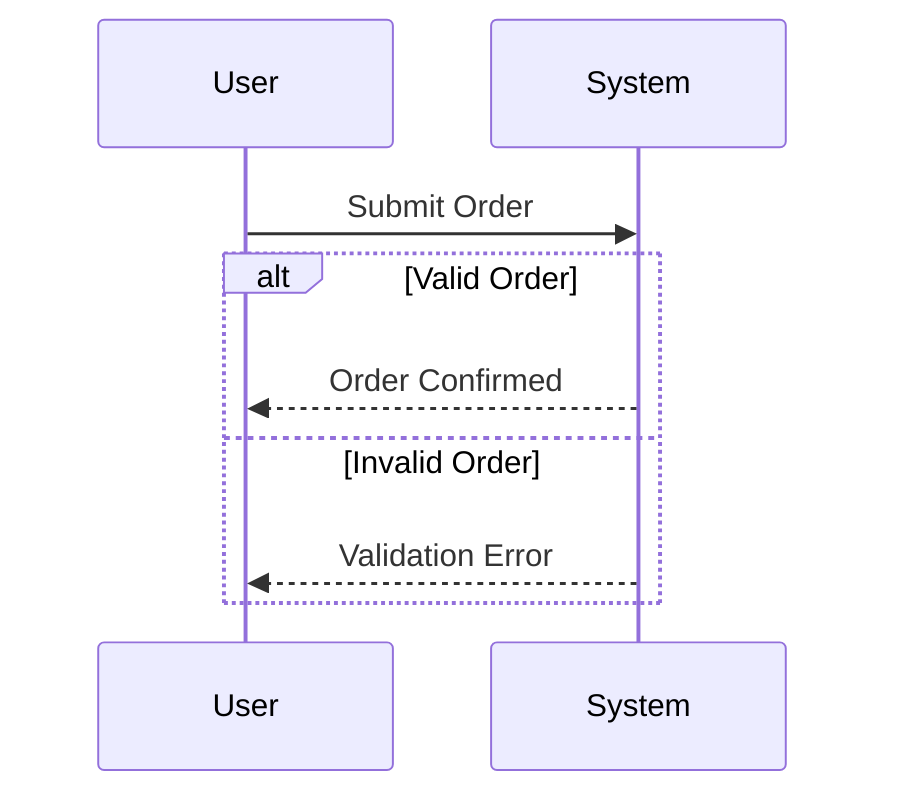

# Technical Specification

# 0. Agent Action Plan

## 0.1 Intent Clarification

### 0.1.1 Core Documentation Objective

Based on the provided requirements, the Blitzy platform understands that the documentation objective is to **create comprehensive functional documentation and user workflows for Odoo 19.0**, the open-source ERP platform. This documentation is specifically designed for customer support teams and business analysts, focusing exclusively on business capabilities, user workflows, and functional behavior rather than technical/developer documentation.

**Documentation Type Classification:**
- Primary: User guides and customer support documentation
- Secondary: Business process workflows with visual diagrams
- Tertiary: Business rules documentation and domain glossary

**Requirement Category:** Create new documentation

**Detailed Requirements with Enhanced Clarity:**

| Requirement ID | Requirement | Technical Interpretation |
|----------------|-------------|-------------------------|
| REQ-001 | Capabilities inventory across `addons/` modules | Analyze 605 modules, focus on 34 application-level modules, document functional areas and integration points |
| REQ-002 | 15 distinct user flows with screenshots | Identify core business processes spanning Sales, CRM, Inventory, Accounting, Manufacturing, Purchasing, HR |
| REQ-003 | Mermaid sequence diagrams for each flow | Create diagrams showing UI, model interactions, and module integrations |
| REQ-004 | Step-by-step breakdown with screenshots | Capture 3-6 screenshots per flow showing pre-action, action, and post-action states |
| REQ-005 | Business rules documentation | Document validation logic, state transitions, computation rules, and access control |
| REQ-006 | Domain terminology glossary | Capture Odoo-specific and business domain terminology |
| REQ-007 | Bug discovery documentation | Document any discovered issues in dedicated findings file without fixing |

### 0.1.2 Special Instructions and Constraints

**CRITICAL DIRECTIVES:**

- **READ-ONLY Constraint:** All source code in `addons/` and `odoo/` directories must remain completely untouched
- **Output Directory Restriction:** All documentation files must be created within `/odoo-functional-documentation/` only
- **Community Edition Focus:** Document Community Edition functionality; note Enterprise-only features when encountered
- **Actual Behavior Documentation:** Document existing behavior, not aspirational or planned features
- **Bug Handling:** Discover and document bugs but DO NOT attempt any fixes

**Documentation Style Preferences:**
- Use clear, non-technical language appropriate for customer support guides
- Focus on user perspective ("The user clicks 'Confirm Order'")
- Explain domain terms on first occurrence
- Include "What the user sees" descriptions for each UI state
- Document both success and failure scenarios

**Template Requirements:**
- USER PROVIDED TEMPLATE for Bug Documentation:
```
## BUG-[Sequential Number]: [Brief Title]

#### Discovery Context

- **Discovered During**: [Which documentation step revealed this issue]
- **Affected Component**: [File path or module name]
- **Severity Assessment**: [Critical | High | Medium | Low]

#### Issue Description

[Clear description of the unexpected behavior or defect]

#### Expected Behavior

[What should happen based on business logic or documentation]

#### Actual Behavior

[What actually occurs, with evidence if available]

#### Reproduction Steps

1. [Step 1]
2. [Step 2]
3. [Continue as needed]

#### Evidence

- Screenshot reference: [filename if applicable]
- Log output: [relevant log snippets]
- Test result: [pass/fail status if from test execution]

#### Recommended Fix

[Technical recommendation for resolution]

#### Impact Assessment

- **User Impact**: [How this affects end users]
- **Workflow Impact**: [Which flows are affected]
- **Documentation Impact**: [How this affects accuracy of generated documentation]
```

### 0.1.3 Technical Interpretation

These documentation requirements translate to the following technical documentation strategy:

**Part 1: Capabilities Overview**
- To document major functional areas, we will analyze all 605 modules in `addons/` directory examining `__manifest__.py` files for dependencies and purpose
- To identify core business processes, we will map the 34 application-level modules and their integration points
- To document multi-company and localization support, we will examine `base` module and `l10n_*` localization modules

**Part 2: User Flow Documentation**
- To document 15 user flows, we will identify processes across revenue (Sales, Invoicing), costs (Purchasing, Inventory, Manufacturing), compliance (Accounting), and resources (HR, Projects)
- To create sequence diagrams, we will trace model relationships from XML views through Python models
- To capture screenshots, we will execute actual workflows in running Odoo instance

**Part 3: Business Rules Documentation**
- To document validation logic, we will analyze Python model constraints (`@api.constrains`) and field definitions
- To document state transitions, we will trace `state` field selections and `action_*` methods
- To document computation rules, we will identify `@api.depends` computed fields

**Part 4: Domain Terminology**
- To create glossary, we will extract terminology from model docstrings, field help text, and README files

### 0.1.4 Inferred Documentation Needs

Based on code analysis, the following implicit documentation needs have been identified:

**Revenue-Generating Processes:**
- Sales quotation-to-order workflow (`sale.order` model with states: draft → sent → sale → cancel)
- CRM lead-to-opportunity conversion (`crm.lead` model with stage-based progression)
- Point of Sale retail transactions (`pos.order` model)
- eCommerce checkout flow (`website_sale` module)
- Invoice creation and payment processing (`account.move` model with states: draft → posted → cancel)

**Cost Management Processes:**
- Purchase requisition-to-order workflow (`purchase.order` states: draft → sent → to approve → purchase → cancel)
- Inventory receipt and delivery (`stock.picking` states: draft → waiting → confirmed → assigned → done → cancel)
- Manufacturing production orders (`mrp.production` model)

**Compliance Processes:**
- Bank reconciliation workflow
- Tax computation and reporting
- Multi-currency handling

**Resource Management Processes:**
- Employee time-off requests (`hr.leave` model)
- Project task management (`project.task` model)
- Timesheet entry (`account.analytic.line` model)

**Integration Documentation Needs:**
- Sales-to-Inventory integration (sale_stock module)
- Sales-to-Accounting integration (automatic invoice creation)
- Purchase-to-Inventory integration (purchase_stock module)
- Manufacturing-to-Inventory integration (mrp module consuming stock)

## 0.2 Documentation Discovery and Analysis

### 0.2.1 Existing Documentation Infrastructure Assessment

**Repository Analysis Findings:**

Repository analysis reveals a **minimal documentation structure** with scattered README files and no centralized functional documentation. The codebase at `/tmp/blitzy/blitzy-odoo/19.0/` contains:

| Documentation Type | Location | Coverage Status |
|-------------------|----------|-----------------|
| Project README | `/tmp/blitzy/blitzy-odoo/19.0/README.md` | Basic overview with external links |
| Contributing Guide | `/tmp/blitzy/blitzy-odoo/19.0/CONTRIBUTING.md` | Developer contribution guidelines |
| Security Policy | `/tmp/blitzy/blitzy-odoo/19.0/SECURITY.md` | Vulnerability reporting |
| Module READMEs | `addons/*/README.md` | Partial - marketing-focused descriptions |
| RST Documentation | `addons/crm/doc/*.rst` | Limited - CRM module only |
| CLA Documentation | `doc/cla/` | Legal contributor agreements |

**Documentation Files Discovered:**

```
/tmp/blitzy/blitzy-odoo/19.0/
├── README.md (project overview)
├── CONTRIBUTING.md (contribution guidelines)
├── SECURITY.md (security policy)
├── addons/
│   ├── account/README.md
│   ├── crm/README.md
│   ├── crm/doc/changelog.rst
│   ├── crm/doc/index.rst
│   ├── crm/doc/stage_status.rst
│   ├── hr/README.md
│   ├── mail/README.md
│   ├── mrp/README.md
│   └── [25+ payment provider READMEs]
└── doc/
    └── cla/ (Contributor License Agreement)
```

**Current Documentation Framework Assessment:**
- No documentation generator configuration found (no mkdocs.yml, docusaurus.config.js, sphinx.conf.py)
- No API documentation tools in use (no JSDoc, Sphinx autodoc setup)
- Mermaid diagrams: Supported via README markdown
- Documentation hosting: External at https://www.odoo.com/documentation/

### 0.2.2 Repository Code Analysis for Documentation

**Search Patterns Applied:**

| Pattern Category | Search Location | Files/Modules Found |
|-----------------|-----------------|---------------------|
| Application Modules | `addons/*/__manifest__.py` with `'application': True` | 34 application modules |
| Core Business Models | `addons/*/models/*.py` | 605 modules with models |
| User-Facing Views | `addons/*/views/*.xml` | View definitions per module |
| Workflow Actions | `addons/*/wizard/*.xml` | Wizard dialogs per module |
| Security Groups | `addons/*/security/*.xml` | Access control definitions |
| Demo Data | `addons/*/data/*_demo.xml` | Sample transaction data |

**Key Directories Examined:**

| Directory | Purpose | Documentation Relevance |
|-----------|---------|------------------------|
| `/tmp/blitzy/blitzy-odoo/19.0/addons/sale/` | Sales management | Primary workflow: Quote to Order |
| `/tmp/blitzy/blitzy-odoo/19.0/addons/purchase/` | Procurement | Primary workflow: RFQ to PO |
| `/tmp/blitzy/blitzy-odoo/19.0/addons/stock/` | Inventory management | Primary workflow: Receipts/Deliveries |
| `/tmp/blitzy/blitzy-odoo/19.0/addons/account/` | Accounting/Invoicing | Primary workflow: Invoice to Payment |
| `/tmp/blitzy/blitzy-odoo/19.0/addons/crm/` | CRM pipeline | Primary workflow: Lead to Opportunity |
| `/tmp/blitzy/blitzy-odoo/19.0/addons/mrp/` | Manufacturing | Primary workflow: Production Orders |
| `/tmp/blitzy/blitzy-odoo/19.0/addons/hr/` | Human Resources | Primary workflow: Employee Management |
| `/tmp/blitzy/blitzy-odoo/19.0/addons/project/` | Project Management | Primary workflow: Task Management |
| `/tmp/blitzy/blitzy-odoo/19.0/addons/point_of_sale/` | Retail POS | Primary workflow: POS Sessions |
| `/tmp/blitzy/blitzy-odoo/19.0/addons/website_sale/` | eCommerce | Primary workflow: Online Checkout |

**Application-Level Modules Identified (34 Total):**

| Category | Module | Name | Business Function |
|----------|--------|------|-------------------|
| Sales/CRM | `sale_management` | Sales | Sales quotations and orders |
| Sales/CRM | `crm` | CRM | Lead and opportunity management |
| Sales/CRM | `point_of_sale` | Point of Sale | Retail transactions |
| Sales/CRM | `contacts` | Contacts | Customer/Vendor management |
| Finance | `account` | Invoicing | Invoices and payments |
| Supply Chain | `stock` | Inventory | Warehouse management |
| Supply Chain | `purchase` | Purchase | Procurement |
| Supply Chain | `mrp` | Manufacturing | Production planning |
| Supply Chain | `maintenance` | Maintenance | Equipment maintenance |
| Supply Chain | `repair` | Repairs | Repair orders |
| HR | `hr` | Employees | Employee management |
| HR | `hr_attendance` | Attendances | Time tracking |
| HR | `hr_holidays` | Time Off | Leave management |
| HR | `hr_expense` | Expenses | Expense claims |
| HR | `hr_recruitment` | Recruitment | Job postings |
| HR | `hr_skills` | Skills Management | Skill matrices |
| HR | `fleet` | Fleet | Vehicle management |
| HR | `lunch` | Lunch | Lunch orders |
| Services | `project` | Project | Project management |
| Services | `project_todo` | To-Do | Task lists |
| Marketing | `mass_mailing` | Email Marketing | Campaigns |
| Marketing | `mass_mailing_sms` | SMS Marketing | SMS campaigns |
| Marketing | `survey` | Surveys | Survey creation |
| Marketing | `website_event` | Events | Event management |
| Marketing | `marketing_card` | Marketing Card | Business cards |
| Website | `website` | Website | Website builder |
| Website | `website_sale` | eCommerce | Online store |
| Website | `website_slides` | eLearning | Course management |
| Website | `website_hr_recruitment` | Online Jobs | Job portal |
| Website | `im_livechat` | Live Chat | Customer support chat |
| Productivity | `mail` | Discuss | Internal messaging |
| Productivity | `calendar` | Calendar | Event scheduling |
| Productivity | `data_recycle` | Data Recycle | Data cleanup |

### 0.2.3 Web Search Research Conducted

**Best Practices Research Findings:**

<cite index="1-1,1-8">Odoo documentation best practices include "User Documentation: Guides and manuals that cover the step-by-step use of different modules like CRM, Sales, and Inventory."</cite> This aligns with the requested functional documentation approach.

<cite index="2-10,2-11">"The functional documentation focuses on configuration and setup. It covers detailed steps on how to configure various Odoo modules according to best practices, making it ideal for consultants and system implementers."</cite>

<cite index="9-17,9-18,9-19">"For long-term success, thorough documentation is essential. Training materials, quick reference guides, and user manuals fall under this category. Well-written documentation lessens reliance on the support staff by assisting users in solving problems on their own."</cite>

**Key Documentation Structure Conventions:**
- Module-based organization following Odoo's application structure
- Step-by-step user guides with visual references
- Business process workflows with clear prerequisites
- Troubleshooting sections for common issues
- Glossary of domain-specific terminology

**Recommended Diagram Types:**
- Sequence diagrams for multi-step workflows
- State machine diagrams for document lifecycle
- Entity-relationship diagrams for data models
- Flowcharts for decision processes

## 0.3 Documentation Scope Analysis

### 0.3.1 Code-to-Documentation Mapping

**Modules Requiring Documentation:**

#### Sales Module (`sale`, `sale_management`)

| Aspect | Details |
|--------|---------|
| **Source Path** | `/tmp/blitzy/blitzy-odoo/19.0/addons/sale/` |
| **Key Models** | `sale.order`, `sale.order.line` |
| **Public APIs** | `action_draft()`, `action_quotation_send()`, `action_confirm()`, `action_cancel()`, `action_view_invoice()` |
| **States** | draft (Quotation) → sent (Quotation Sent) → sale (Sales Order) → cancel (Cancelled) |
| **Current Documentation** | README.md (marketing description only) |
| **Documentation Needed** | Complete workflow guide, field reference, state transitions, integration with inventory/invoicing |

#### CRM Module (`crm`)

| Aspect | Details |
|--------|---------|
| **Source Path** | `/tmp/blitzy/blitzy-odoo/19.0/addons/crm/` |
| **Key Models** | `crm.lead`, `crm.stage`, `crm.team` |
| **Public APIs** | `action_set_won()`, `action_set_lost()`, `action_restore()` |
| **States** | Stage-based pipeline with `is_won` flag |
| **Current Documentation** | README.md + doc/*.rst (partial) |
| **Documentation Needed** | Lead management guide, opportunity conversion, pipeline customization |

#### Inventory Module (`stock`)

| Aspect | Details |
|--------|---------|
| **Source Path** | `/tmp/blitzy/blitzy-odoo/19.0/addons/stock/` |
| **Key Models** | `stock.picking`, `stock.move`, `stock.quant`, `stock.warehouse`, `stock.location` |
| **Public APIs** | `action_confirm()`, `action_assign()`, `button_validate()`, `action_cancel()` |
| **States** | draft → waiting → confirmed → assigned → done → cancel |
| **Current Documentation** | Missing |
| **Documentation Needed** | Receipt processing, delivery orders, inventory adjustments, replenishment rules |

#### Accounting Module (`account`)

| Aspect | Details |
|--------|---------|
| **Source Path** | `/tmp/blitzy/blitzy-odoo/19.0/addons/account/` |
| **Key Models** | `account.move`, `account.move.line`, `account.payment`, `account.journal` |
| **Public APIs** | `action_post()`, `button_draft()`, `button_cancel()`, `action_register_payment()` |
| **States** | draft → posted → cancel; Payment states: not_paid, in_payment, paid, partial, reversed |
| **Current Documentation** | README.md (marketing only) |
| **Documentation Needed** | Invoice creation, payment registration, bank reconciliation, tax configuration |

#### Purchase Module (`purchase`)

| Aspect | Details |
|--------|---------|
| **Source Path** | `/tmp/blitzy/blitzy-odoo/19.0/addons/purchase/` |
| **Key Models** | `purchase.order`, `purchase.order.line` |
| **Public APIs** | `button_confirm()`, `button_approve()`, `button_cancel()`, `action_create_invoice()` |
| **States** | draft (RFQ) → sent (RFQ Sent) → to approve → purchase (Purchase Order) → cancel |
| **Current Documentation** | Missing |
| **Documentation Needed** | RFQ creation, vendor management, receipt matching, three-way matching |

#### Manufacturing Module (`mrp`)

| Aspect | Details |
|--------|---------|
| **Source Path** | `/tmp/blitzy/blitzy-odoo/19.0/addons/mrp/` |
| **Key Models** | `mrp.production`, `mrp.bom`, `mrp.workorder`, `mrp.workcenter` |
| **Public APIs** | `action_confirm()`, `action_assign()`, `button_mark_done()`, `action_cancel()` |
| **States** | draft → confirmed → progress → to_close → done → cancel |
| **Current Documentation** | README.md (marketing only) |
| **Documentation Needed** | BOM creation, production orders, work orders, component consumption |

#### Human Resources Module (`hr`, `hr_holidays`, `hr_expense`)

| Aspect | Details |
|--------|---------|
| **Source Path** | `/tmp/blitzy/blitzy-odoo/19.0/addons/hr*/` |
| **Key Models** | `hr.employee`, `hr.leave`, `hr.expense` |
| **Public APIs** | Employee CRUD, leave approval workflow, expense submission |
| **States** | Leave: draft → confirm → validate; Expense: draft → reported → approved → done |
| **Current Documentation** | README.md (marketing only) |
| **Documentation Needed** | Employee setup, leave requests, expense claims |

#### Project Module (`project`)

| Aspect | Details |
|--------|---------|
| **Source Path** | `/tmp/blitzy/blitzy-odoo/19.0/addons/project/` |
| **Key Models** | `project.project`, `project.task`, `project.milestone` |
| **Public APIs** | Task stage transitions, milestone management |
| **States** | Stage-based with customizable Kanban columns |
| **Current Documentation** | Missing |
| **Documentation Needed** | Project setup, task management, timesheet integration |

#### Point of Sale Module (`point_of_sale`)

| Aspect | Details |
|--------|---------|
| **Source Path** | `/tmp/blitzy/blitzy-odoo/19.0/addons/point_of_sale/` |
| **Key Models** | `pos.session`, `pos.order`, `pos.payment` |
| **Public APIs** | Session open/close, order processing, payment handling |
| **States** | Session: opening → opened → closing → closed |
| **Current Documentation** | Missing |
| **Documentation Needed** | POS session workflow, payment methods, receipts |

### 0.3.2 Configuration Options Requiring Documentation

| Config Area | Location | Options to Document |
|-------------|----------|---------------------|
| Company Settings | Settings → General Settings | Multi-company, multi-currency, fiscal positions |
| Sales Settings | Sales → Configuration → Settings | Quotation templates, pricelists, margins |
| Inventory Settings | Inventory → Configuration → Settings | Warehouse routes, traceability, units of measure |
| Accounting Settings | Invoicing → Configuration → Settings | Chart of accounts, taxes, payment terms |
| Purchase Settings | Purchase → Configuration → Settings | Vendor pricelists, purchase agreements |
| MRP Settings | Manufacturing → Configuration → Settings | Work centers, routing, planning |

### 0.3.3 Documentation Gap Analysis

**Given the requirements and repository analysis, documentation gaps include:**

| Gap Category | Current State | Target State | Priority |
|--------------|---------------|--------------|----------|
| End-to-end workflow guides | None | 15 complete user flows | Critical |
| Screenshot documentation | None | 45-90 screenshots (3-6 per flow) | Critical |
| Mermaid sequence diagrams | None | 15 diagrams minimum | Critical |
| Business rules documentation | None | Rules for each workflow | High |
| Domain glossary | None | Comprehensive terminology | High |
| Multi-company documentation | None | Configuration guide | Medium |
| Localization documentation | None | Country-specific notes | Low |

**Undocumented Public APIs (High Priority):**
- Sales: Order lifecycle, pricing calculations, discount handling
- CRM: Lead scoring, stage automation, win/loss analysis
- Inventory: Stock rules, reservation logic, valuation methods
- Accounting: Reconciliation models, payment matching, tax computation
- Purchase: Approval workflow, vendor evaluation, RFQ automation
- Manufacturing: MRP scheduling, component substitution, quality integration

**Missing User Guides:**
- Complete Sales-to-Cash process
- Procure-to-Pay process
- Order-to-Delivery process
- Production planning and execution
- HR onboarding and leave management
- Project billing and time tracking

**Incomplete Architecture Documentation:**
- Module dependency graphs
- Data flow between modules
- Integration trigger points
- Multi-company data isolation

## 0.4 Documentation Implementation Design

### 0.4.1 Documentation Structure Planning

**Documentation Hierarchy:**

```
/odoo-functional-documentation/
├── 01-capabilities-overview/
│   └── capabilities-inventory.md          # Module capabilities + domain glossary
├── 02-user-flows/
│   ├── 01-sales-quote-to-order/
│   │   ├── flow-document.md
│   │   └── screenshots/
│   │       ├── 01-01-create-quotation.png
│   │       ├── 01-02-add-products.png
│   │       ├── 01-03-send-quotation.png
│   │       ├── 01-04-confirm-order.png
│   │       └── 01-05-order-confirmed.png
│   ├── 02-crm-lead-to-opportunity/
│   │   ├── flow-document.md
│   │   └── screenshots/
│   ├── 03-purchase-rfq-to-po/
│   │   ├── flow-document.md
│   │   └── screenshots/
│   ├── 04-inventory-receipt-processing/
│   │   ├── flow-document.md
│   │   └── screenshots/
│   ├── 05-inventory-delivery-order/
│   │   ├── flow-document.md
│   │   └── screenshots/
│   ├── 06-invoice-creation-payment/
│   │   ├── flow-document.md
│   │   └── screenshots/
│   ├── 07-vendor-bill-payment/
│   │   ├── flow-document.md
│   │   └── screenshots/
│   ├── 08-manufacturing-production-order/
│   │   ├── flow-document.md
│   │   └── screenshots/
│   ├── 09-pos-session-transaction/
│   │   ├── flow-document.md
│   │   └── screenshots/
│   ├── 10-project-task-management/
│   │   ├── flow-document.md
│   │   └── screenshots/
│   ├── 11-employee-leave-request/
│   │   ├── flow-document.md
│   │   └── screenshots/
│   ├── 12-expense-claim-reimbursement/
│   │   ├── flow-document.md
│   │   └── screenshots/
│   ├── 13-website-ecommerce-checkout/
│   │   ├── flow-document.md
│   │   └── screenshots/
│   ├── 14-bank-reconciliation/
│   │   ├── flow-document.md
│   │   └── screenshots/
│   └── 15-inventory-adjustment/
│       ├── flow-document.md
│       └── screenshots/
├── 04-business-rules/
│   ├── sales-quote-to-order-rules.md
│   ├── crm-lead-to-opportunity-rules.md
│   ├── purchase-rfq-to-po-rules.md
│   ├── inventory-receipt-rules.md
│   ├── inventory-delivery-rules.md
│   ├── invoice-payment-rules.md
│   ├── vendor-bill-rules.md
│   ├── manufacturing-rules.md
│   ├── pos-session-rules.md
│   ├── project-task-rules.md
│   ├── leave-request-rules.md
│   ├── expense-claim-rules.md
│   ├── ecommerce-checkout-rules.md
│   ├── bank-reconciliation-rules.md
│   └── inventory-adjustment-rules.md
└── 05-bug-findings/
    └── discovered-issues.md               # Created only if bugs found
```

### 0.4.2 Content Generation Strategy

**Information Extraction Approach:**

| Information Type | Extraction Method | Source Files |
|------------------|-------------------|--------------|
| API signatures | Parse model method definitions | `addons/*/models/*.py` |
| Field definitions | Extract field declarations | `addons/*/models/*.py` |
| Workflow states | Parse Selection fields | `addons/*/models/*.py` |
| View layouts | Parse XML view definitions | `addons/*/views/*.xml` |
| User actions | Extract button actions | `addons/*/views/*.xml` |
| Wizard dialogs | Analyze wizard models | `addons/*/wizard/*.py` |
| Security groups | Parse access control files | `addons/*/security/*.xml` |
| Demo data | Extract sample transactions | `addons/*/data/*_demo.xml` |

**Example Extraction - Sales Order Flow:**
```python
# Source: addons/sale/models/sale_order.py

#### State transitions identified:

SALE_ORDER_STATE = [
    ('draft', "Quotation"),
    ('sent', "Quotation Sent"),
    ('sale', "Sales Order"),
    ('cancel', "Cancelled"),
]
```

**Template Application Strategy:**

Each flow document will follow this structure:
1. **Overview** - Business objective and personas
2. **Prerequisites** - Module requirements and permissions
3. **Flow Diagram** - Mermaid sequence diagram
4. **Step-by-Step Breakdown** - Numbered steps with screenshots
5. **Variations and Edge Cases** - Alternative paths
6. **Integration Points** - Connected modules

### 0.4.3 Documentation Standards

**Markdown Formatting:**
- Headers using proper hierarchy (# ## ###)
- Tables for structured data
- Code blocks with syntax highlighting
- Mermaid diagrams in fenced blocks

**Mermaid Diagram Integration:**



**Source Citation Format:**
- Inline: `Source: /addons/sale/models/sale_order.py:155`
- Footnote: References section at end of document

**Terminology Conventions:**
- First occurrence: **Bold** with definition
- Subsequent: Regular text
- Technical names: `monospace`

### 0.4.4 Diagram and Visual Strategy

**Mermaid Diagrams to Create:**

| Flow | Diagram Types |
|------|--------------|
| Sales Quote to Order | Sequence (UI→Model), State Machine |
| CRM Lead to Opportunity | Flowchart (decision points), Sequence |
| Purchase RFQ to PO | Sequence (multi-party), State Machine |
| Inventory Receipt | Sequence (with warehouse), State Machine |
| Inventory Delivery | Sequence (reservation→transfer), State Machine |
| Invoice to Payment | Sequence (with bank), State Machine |
| Vendor Bill Payment | Flowchart (matching), Sequence |
| Manufacturing Order | Sequence (BOM→Production), Gantt-like |
| POS Session | Sequence (session lifecycle), Flowchart |
| Project Task | Kanban stage flow, Sequence |
| Leave Request | Approval flow, State Machine |
| Expense Claim | Approval flow, State Machine |
| eCommerce Checkout | Sequence (cart→payment), Flowchart |
| Bank Reconciliation | Matching flowchart, Sequence |
| Inventory Adjustment | Sequence, State Machine |

**Screenshot Requirements:**

| Flow | Min Screenshots | Key States to Capture |
|------|-----------------|----------------------|
| Each of 15 flows | 3-6 | Pre-action, Action execution, Post-action confirmation |

**Naming Convention:**
`[FlowNumber]-[StepNumber]-[descriptive-name].png`

Example: `01-03-send-quotation.png`

### 0.4.5 User Flow Selection (15 Flows)

Based on business criticality and workflow coverage:

| # | Flow Name | Primary Module | Business Value |
|---|-----------|----------------|----------------|
| 1 | Sales Quote to Order | `sale` | Revenue generation |
| 2 | CRM Lead to Opportunity | `crm` | Pipeline management |
| 3 | Purchase RFQ to PO | `purchase` | Cost control |
| 4 | Inventory Receipt Processing | `stock` | Supply chain |
| 5 | Inventory Delivery Order | `stock` | Order fulfillment |
| 6 | Invoice Creation and Payment | `account` | Cash collection |
| 7 | Vendor Bill and Payment | `account` | Accounts payable |
| 8 | Manufacturing Production Order | `mrp` | Production planning |
| 9 | POS Session and Transaction | `point_of_sale` | Retail operations |
| 10 | Project Task Management | `project` | Service delivery |
| 11 | Employee Leave Request | `hr_holidays` | HR compliance |
| 12 | Expense Claim Reimbursement | `hr_expense` | Employee reimbursement |
| 13 | Website eCommerce Checkout | `website_sale` | Online revenue |
| 14 | Bank Reconciliation | `account` | Financial accuracy |
| 15 | Inventory Adjustment | `stock` | Inventory accuracy |

## 0.5 Documentation File Transformation Mapping

### 0.5.1 File-by-File Documentation Plan

**Documentation Transformation Modes:**
- **CREATE** - Create a new documentation file
- **UPDATE** - Update an existing documentation file
- **DELETE** - Remove an obsolete documentation file
- **REFERENCE** - Use as an example for documentation style and structure

**Complete File Transformation Table:**

| Target Documentation File | Transformation | Source Code/Docs | Content/Changes |
|---------------------------|----------------|------------------|-----------------|
| `/odoo-functional-documentation/01-capabilities-overview/capabilities-inventory.md` | CREATE | `addons/*/__manifest__.py`, `addons/*/README.md` | Complete module inventory, integration points, multi-company handling, domain glossary |
| `/odoo-functional-documentation/02-user-flows/01-sales-quote-to-order/flow-document.md` | CREATE | `addons/sale/models/sale_order.py`, `addons/sale/views/sale_order_views.xml` | Full sales workflow with Mermaid diagram, step-by-step guide, screenshots |
| `/odoo-functional-documentation/02-user-flows/01-sales-quote-to-order/screenshots/*.png` | CREATE | Live Odoo UI | 3-6 screenshots: create quote, add products, send quote, confirm order, view SO |
| `/odoo-functional-documentation/02-user-flows/02-crm-lead-to-opportunity/flow-document.md` | CREATE | `addons/crm/models/crm_lead.py`, `addons/crm/views/crm_lead_views.xml` | Lead to opportunity conversion workflow, stage progression, win/loss actions |
| `/odoo-functional-documentation/02-user-flows/02-crm-lead-to-opportunity/screenshots/*.png` | CREATE | Live Odoo UI | 3-6 screenshots: create lead, qualify, convert to opportunity, mark won |
| `/odoo-functional-documentation/02-user-flows/03-purchase-rfq-to-po/flow-document.md` | CREATE | `addons/purchase/models/purchase_order.py`, `addons/purchase/views/purchase_views.xml` | RFQ to PO workflow, vendor selection, approval process |
| `/odoo-functional-documentation/02-user-flows/03-purchase-rfq-to-po/screenshots/*.png` | CREATE | Live Odoo UI | 3-6 screenshots: create RFQ, add products, send RFQ, confirm PO |
| `/odoo-functional-documentation/02-user-flows/04-inventory-receipt-processing/flow-document.md` | CREATE | `addons/stock/models/stock_picking.py`, `addons/stock/views/stock_picking_views.xml` | Receipt processing workflow, quantity validation, putaway |
| `/odoo-functional-documentation/02-user-flows/04-inventory-receipt-processing/screenshots/*.png` | CREATE | Live Odoo UI | 3-6 screenshots: view receipt, process quantities, validate, view quants |
| `/odoo-functional-documentation/02-user-flows/05-inventory-delivery-order/flow-document.md` | CREATE | `addons/stock/models/stock_picking.py`, `addons/sale_stock/models/sale_order.py` | Delivery order processing from sales order |
| `/odoo-functional-documentation/02-user-flows/05-inventory-delivery-order/screenshots/*.png` | CREATE | Live Odoo UI | 3-6 screenshots: check availability, reserve stock, validate delivery |
| `/odoo-functional-documentation/02-user-flows/06-invoice-creation-payment/flow-document.md` | CREATE | `addons/account/models/account_move.py`, `addons/account/views/account_move_views.xml` | Invoice creation, posting, payment registration |
| `/odoo-functional-documentation/02-user-flows/06-invoice-creation-payment/screenshots/*.png` | CREATE | Live Odoo UI | 3-6 screenshots: create invoice, post invoice, register payment |
| `/odoo-functional-documentation/02-user-flows/07-vendor-bill-payment/flow-document.md` | CREATE | `addons/account/models/account_move.py`, `addons/purchase/models/purchase_order.py` | Vendor bill creation from PO, payment processing |
| `/odoo-functional-documentation/02-user-flows/07-vendor-bill-payment/screenshots/*.png` | CREATE | Live Odoo UI | 3-6 screenshots: create vendor bill, match to PO, pay bill |
| `/odoo-functional-documentation/02-user-flows/08-manufacturing-production-order/flow-document.md` | CREATE | `addons/mrp/models/mrp_production.py`, `addons/mrp/views/mrp_production_views.xml` | Production order creation from BOM, work order processing |
| `/odoo-functional-documentation/02-user-flows/08-manufacturing-production-order/screenshots/*.png` | CREATE | Live Odoo UI | 3-6 screenshots: create MO, confirm, process work orders, mark done |
| `/odoo-functional-documentation/02-user-flows/09-pos-session-transaction/flow-document.md` | CREATE | `addons/point_of_sale/models/pos_session.py`, `addons/point_of_sale/models/pos_order.py` | POS session lifecycle, transaction processing |
| `/odoo-functional-documentation/02-user-flows/09-pos-session-transaction/screenshots/*.png` | CREATE | Live Odoo UI | 3-6 screenshots: open session, process sale, payment, close session |
| `/odoo-functional-documentation/02-user-flows/10-project-task-management/flow-document.md` | CREATE | `addons/project/models/project_task.py`, `addons/project/views/project_task_views.xml` | Task creation, stage progression, assignment |
| `/odoo-functional-documentation/02-user-flows/10-project-task-management/screenshots/*.png` | CREATE | Live Odoo UI | 3-6 screenshots: create task, assign, move stages, complete |
| `/odoo-functional-documentation/02-user-flows/11-employee-leave-request/flow-document.md` | CREATE | `addons/hr_holidays/models/hr_leave.py`, `addons/hr_holidays/views/hr_leave_views.xml` | Leave request submission, approval workflow |
| `/odoo-functional-documentation/02-user-flows/11-employee-leave-request/screenshots/*.png` | CREATE | Live Odoo UI | 3-6 screenshots: request leave, manager approval, calendar view |
| `/odoo-functional-documentation/02-user-flows/12-expense-claim-reimbursement/flow-document.md` | CREATE | `addons/hr_expense/models/hr_expense.py`, `addons/hr_expense/views/hr_expense_views.xml` | Expense submission, manager approval, payment |
| `/odoo-functional-documentation/02-user-flows/12-expense-claim-reimbursement/screenshots/*.png` | CREATE | Live Odoo UI | 3-6 screenshots: create expense, submit, approve, reimburse |
| `/odoo-functional-documentation/02-user-flows/13-website-ecommerce-checkout/flow-document.md` | CREATE | `addons/website_sale/models/sale_order.py`, `addons/website_sale/controllers/main.py` | Shopping cart, checkout, payment, order confirmation |
| `/odoo-functional-documentation/02-user-flows/13-website-ecommerce-checkout/screenshots/*.png` | CREATE | Live Odoo UI | 3-6 screenshots: browse products, add to cart, checkout, confirm |
| `/odoo-functional-documentation/02-user-flows/14-bank-reconciliation/flow-document.md` | CREATE | `addons/account/models/account_reconcile_model.py`, `addons/account/views/account_bank_statement_views.xml` | Bank statement import, transaction matching |
| `/odoo-functional-documentation/02-user-flows/14-bank-reconciliation/screenshots/*.png` | CREATE | Live Odoo UI | 3-6 screenshots: import statement, match transactions, reconcile |
| `/odoo-functional-documentation/02-user-flows/15-inventory-adjustment/flow-document.md` | CREATE | `addons/stock/models/stock_quant.py`, `addons/stock/wizard/stock_inventory_adjustment_name.py` | Physical inventory count, adjustment posting |
| `/odoo-functional-documentation/02-user-flows/15-inventory-adjustment/screenshots/*.png` | CREATE | Live Odoo UI | 3-6 screenshots: select location, count inventory, apply adjustment |
| `/odoo-functional-documentation/04-business-rules/sales-quote-to-order-rules.md` | CREATE | `addons/sale/models/sale_order.py` | Validation rules, state transitions, computation rules, access control |
| `/odoo-functional-documentation/04-business-rules/crm-lead-to-opportunity-rules.md` | CREATE | `addons/crm/models/crm_lead.py` | Lead scoring rules, stage automation, probability calculations |
| `/odoo-functional-documentation/04-business-rules/purchase-rfq-to-po-rules.md` | CREATE | `addons/purchase/models/purchase_order.py` | Approval thresholds, vendor terms, delivery scheduling |
| `/odoo-functional-documentation/04-business-rules/inventory-receipt-rules.md` | CREATE | `addons/stock/models/stock_picking.py` | Quantity validation, backorder handling, quality checks |
| `/odoo-functional-documentation/04-business-rules/inventory-delivery-rules.md` | CREATE | `addons/stock/models/stock_picking.py`, `addons/stock/models/stock_move.py` | Reservation rules, availability checks, partial delivery |
| `/odoo-functional-documentation/04-business-rules/invoice-payment-rules.md` | CREATE | `addons/account/models/account_move.py`, `addons/account/models/account_payment.py` | Invoice posting rules, payment matching, reconciliation |
| `/odoo-functional-documentation/04-business-rules/vendor-bill-rules.md` | CREATE | `addons/account/models/account_move.py`, `addons/purchase/models/purchase_order.py` | Three-way matching, variance handling |
| `/odoo-functional-documentation/04-business-rules/manufacturing-rules.md` | CREATE | `addons/mrp/models/mrp_production.py`, `addons/mrp/models/mrp_bom.py` | BOM explosion, consumption rules, scrap handling |
| `/odoo-functional-documentation/04-business-rules/pos-session-rules.md` | CREATE | `addons/point_of_sale/models/pos_session.py` | Session opening balance, closing procedures, payment reconciliation |
| `/odoo-functional-documentation/04-business-rules/project-task-rules.md` | CREATE | `addons/project/models/project_task.py` | Stage rules, assignee permissions, deadline handling |
| `/odoo-functional-documentation/04-business-rules/leave-request-rules.md` | CREATE | `addons/hr_holidays/models/hr_leave.py` | Allocation limits, approval hierarchy, accrual rules |
| `/odoo-functional-documentation/04-business-rules/expense-claim-rules.md` | CREATE | `addons/hr_expense/models/hr_expense.py` | Expense limits, receipt requirements, approval workflow |
| `/odoo-functional-documentation/04-business-rules/ecommerce-checkout-rules.md` | CREATE | `addons/website_sale/models/sale_order.py` | Cart rules, shipping calculation, payment validation |
| `/odoo-functional-documentation/04-business-rules/bank-reconciliation-rules.md` | CREATE | `addons/account/models/account_reconcile_model.py` | Matching rules, tolerance thresholds |
| `/odoo-functional-documentation/04-business-rules/inventory-adjustment-rules.md` | CREATE | `addons/stock/models/stock_quant.py` | Variance limits, approval requirements, cost implications |
| `/odoo-functional-documentation/05-bug-findings/discovered-issues.md` | CREATE (if needed) | N/A | Bug documentation per template when issues discovered |

### 0.5.2 New Documentation Files Detail

**File: `/odoo-functional-documentation/01-capabilities-overview/capabilities-inventory.md`**

| Attribute | Value |
|-----------|-------|
| **Type** | Capabilities Inventory + Glossary |
| **Source Code** | All `addons/*/__manifest__.py` files |
| **Sections** | Module catalog, functional areas, integration matrix, multi-company support, glossary |
| **Diagrams** | Module dependency graph, integration flow diagram |
| **Key Citations** | 605 module manifests, 34 application modules |

**File: `/odoo-functional-documentation/02-user-flows/01-sales-quote-to-order/flow-document.md`**

| Attribute | Value |
|-----------|-------|
| **Type** | User Flow Documentation |
| **Source Code** | `addons/sale/models/sale_order.py`, `addons/sale/views/sale_order_views.xml` |
| **Sections** | Overview, Prerequisites, Flow Diagram, Step-by-Step (5-8 steps), Variations, Integration Points |
| **Diagrams** | Sequence diagram (User→UI→sale.order→stock.picking→account.move), State machine |
| **Screenshots** | 01-01-create-quotation.png through 01-05-order-confirmed.png |
| **Key Citations** | `sale_order.py:SALE_ORDER_STATE`, `sale_order.py:action_confirm()` |

**File: `/odoo-functional-documentation/04-business-rules/sales-quote-to-order-rules.md`**

| Attribute | Value |
|-----------|-------|
| **Type** | Business Rules Documentation |
| **Source Code** | `addons/sale/models/sale_order.py`, `addons/sale/security/*.xml` |
| **Sections** | Validation Logic, State Transitions, Computation Rules, Access Control, Integration Triggers |
| **Content Details** | Required fields, @api.constrains decorators, @api.depends computed fields, security group requirements |
| **Key Citations** | Constraint methods, field definitions, ir.model.access.csv |

### 0.5.3 Documentation Configuration Updates

Since no existing documentation framework is present, the following configuration will be created:

| Configuration File | Purpose | Content |
|--------------------|---------|---------|
| `/odoo-functional-documentation/README.md` | Documentation index | Table of contents, navigation guide |
| `/odoo-functional-documentation/.gitignore` | Version control exclusions | Generated files, screenshots |

### 0.5.4 Cross-Documentation Dependencies

**Navigation Structure:**

| Document | Links To |
|----------|----------|
| `01-capabilities-overview/capabilities-inventory.md` | All user flows, glossary terms |
| Each `flow-document.md` | Related business rules, other integrated flows |
| Each `*-rules.md` | Source flow document, related modules |

**Glossary Cross-References:**
- Terms defined in `capabilities-inventory.md` glossary section
- First occurrence in each document links to glossary entry
- Technical names mapped to user-facing labels

## 0.6 Dependency Inventory

### 0.6.1 Documentation Dependencies

**Documentation Tools and Packages:**

| Registry | Package Name | Version | Purpose |
|----------|--------------|---------|---------|
| N/A | Mermaid | 10.x | Diagram rendering in Markdown (browser-native) |
| N/A | Markdown | Standard | Documentation format |
| pip | pillow | 10.2.0 (as per Odoo requirements) | Screenshot processing if needed |

**Note:** This documentation task does not require additional documentation generation frameworks. All documentation will be in plain Markdown format with embedded Mermaid diagrams. Mermaid diagrams render natively in GitHub, GitLab, and most modern Markdown viewers.

### 0.6.2 Odoo Runtime Dependencies (For Screenshot Capture)

The following dependencies are required to run Odoo for screenshot capture:

| Registry | Package Name | Version | Purpose |
|----------|--------------|---------|---------|
| pip | psycopg2 | 2.9.9 | PostgreSQL database adapter |
| pip | werkzeug | 3.0.1 | HTTP/WSGI framework |
| pip | lxml | 5.2.1 | XML/HTML processing |
| pip | pillow | 10.2.0 | Image processing |
| pip | reportlab | 4.1.0 | PDF generation |
| pip | babel | 2.10.3 | Internationalization |
| pip | passlib | 1.7.4 | Password hashing |
| pip | python-dateutil | 2.8.2 | Date utilities |
| pip | pytz | latest | Timezone support |
| system | PostgreSQL | 13+ | Database server |
| system | Python | 3.12.3 | Runtime (currently installed) |

Source: `/tmp/blitzy/blitzy-odoo/19.0/requirements.txt`

### 0.6.3 Odoo Module Dependencies for Documentation Scope

**Core Module Dependencies (for 15 documented flows):**



**Module Dependency Summary:**

| Module | Direct Dependencies | Documentation Priority |
|--------|---------------------|----------------------|
| `base` | None | Critical |
| `mail` | base, bus, web_tour | Critical |
| `sale` | sales_team, account_payment, utm | Critical |
| `sale_management` | sale, portal, utm | Critical |
| `crm` | contacts, mail, calendar, resource, utm | High |
| `stock` | product, barcodes_gs1_nomenclature, digest | Critical |
| `purchase` | account | High |
| `account` | base_setup, onboarding, product, analytic, portal | Critical |
| `mrp` | product, stock, resource | High |
| `hr` | resource, mail, web | High |
| `hr_holidays` | hr, calendar | High |
| `hr_expense` | hr, account, analytic | High |
| `project` | mail, resource, portal, web_tour | High |
| `point_of_sale` | sale, barcodes, stock | High |
| `website_sale` | website, sale, delivery | High |

### 0.6.4 Documentation Reference Updates

**Internal Links to Create:**

| From Document | To Document | Link Purpose |
|---------------|-------------|--------------|
| capabilities-inventory.md | All flow-documents | Navigate to detailed workflows |
| Each flow-document.md | Related rules documentation | Link to business rules |
| Each flow-document.md | Glossary section | Define technical terms |
| Each rules.md | Source flow-document.md | Context reference |

**External Reference Links:**

| Link Type | URL Pattern | Usage |
|-----------|-------------|-------|
| Official Documentation | `https://www.odoo.com/documentation/19.0/applications/{app}.html` | Reference for advanced features |
| Module Source | `addons/{module}/` | Code reference for technical details |

### 0.6.5 Test Data Requirements

To properly capture screenshots and verify workflows, the following test data must be established:

| Data Category | Required Records | Module Source |
|---------------|------------------|---------------|
| Company | Multi-company with multi-currency | `base` |
| Customers | 5+ customer partners with varied settings | `base`, `sale` |
| Vendors | 5+ vendor partners | `base`, `purchase` |
| Products | 10+ products (storable, consumable, service) | `product`, `stock` |
| Product Categories | 3+ categories with hierarchy | `product` |
| Warehouses | 2+ warehouses with locations | `stock` |
| Employees | 5+ employees with departments | `hr` |
| Projects | 2+ projects with tasks | `project` |
| Chart of Accounts | Standard chart with configured taxes | `account` |
| Payment Methods | Cash, Bank, Credit Card | `account`, `payment` |
| Pricelists | Multiple pricelists with rules | `product` |
| Leave Types | Vacation, Sick, Personal | `hr_holidays` |
| Expense Categories | Travel, Meals, Supplies | `hr_expense` |
| BOM | 2+ bills of materials | `mrp` |
| POS Configuration | 1+ POS session configuration | `point_of_sale` |
| Website Products | 10+ products published on website | `website_sale` |

## 0.7 Coverage and Quality Targets

### 0.7.1 Documentation Coverage Metrics

**Current Coverage Analysis:**

| Category | Documented | Total | Percentage |
|----------|------------|-------|------------|
| Application Modules | 0 | 34 | 0% |
| User Workflows | 0 | 15 (target) | 0% |
| Business Rules | 0 | 15 (target) | 0% |
| Screenshots | 0 | 45-90 (target) | 0% |
| Sequence Diagrams | 0 | 15 (target) | 0% |
| Glossary Terms | 0 | ~100 (estimated) | 0% |

**Target Coverage Based on Requirements:**

| Metric | Target | Measurement |
|--------|--------|-------------|
| User Flows Documented | 15 flows | Complete flow documents with all sections |
| Screenshots per Flow | 3-6 screenshots | Pre-action, action, post-action states |
| Total Screenshots | 45-90 minimum | All UI states captured |
| Mermaid Diagrams | 15 minimum | Sequence diagrams per flow |
| Business Rules Documents | 15 documents | One per flow |
| Glossary Terms | 100% coverage | All domain terms defined |

**Coverage Gaps to Address:**

| Gap Area | Current State | Target State | Priority |
|----------|---------------|--------------|----------|
| Sales Module Documentation | Marketing README only | Complete workflow + rules | Critical |
| CRM Module Documentation | Partial RST docs | Complete workflow + rules | Critical |
| Inventory Module Documentation | None | Complete workflow + rules | Critical |
| Accounting Module Documentation | Marketing README only | Complete workflow + rules | Critical |
| Purchase Module Documentation | None | Complete workflow + rules | Critical |
| Manufacturing Module Documentation | Marketing README only | Complete workflow + rules | High |
| HR Module Documentation | Marketing README only | Complete workflow + rules | High |
| Project Module Documentation | None | Complete workflow + rules | High |
| POS Module Documentation | None | Complete workflow + rules | High |
| eCommerce Module Documentation | None | Complete workflow + rules | High |

### 0.7.2 Documentation Quality Criteria

**Completeness Requirements:**

| Document Type | Required Elements | Validation Criteria |
|---------------|-------------------|---------------------|
| Capabilities Inventory | Module catalog, integration matrix, glossary | All 34 application modules listed |
| Flow Document | Overview, Prerequisites, Diagram, Steps, Variations | All sections complete, no placeholders |
| Business Rules | Validation, Transitions, Computations, Access | All rule types documented with source citations |
| Screenshot | Clear UI state, labeled actions | Matches described step exactly |

**Accuracy Validation:**

| Validation Type | Requirement | Method |
|-----------------|-------------|--------|
| Code Examples | Must be tested and working | Verify against source code |
| API Signatures | Must match current codebase | Compare with model definitions |
| Screenshots | Must reflect current UI states | Capture from running Odoo 19.0 |
| State Transitions | Must match actual state machine | Verify against Selection fields |
| Field Requirements | Must list actual required fields | Check field definitions |

**Clarity Standards:**

| Standard | Description | Implementation |
|----------|-------------|----------------|
| Non-Technical Language | Accessible for support teams | Avoid developer jargon |
| User Perspective | Focus on what user does/sees | "The user clicks" format |
| Progressive Disclosure | Simple to complex | Overview → Details → Edge cases |
| Consistent Terminology | Same terms throughout | Use glossary definitions |
| First-Use Definitions | Define terms on first occurrence | Bold with inline definition |

**Maintainability Requirements:**

| Requirement | Implementation | Benefit |
|-------------|----------------|---------|
| Source Citations | File:LineNumber format | Trace back to code |
| Clear Ownership | Document metadata | Know who to update |
| Template-Based | Consistent structure | Easy updates |
| Version Tracking | Document version headers | Track changes |

### 0.7.3 Example and Diagram Requirements

**Minimum Examples per Flow:**

| Flow Type | Code Examples | Data Examples | Edge Cases |
|-----------|---------------|---------------|------------|
| Sales Quote to Order | 1 (order confirmation) | Customer, Products, Prices | Partial shipment, Backorder |
| CRM Lead to Opportunity | 0 | Lead data, Stages | Lost opportunity, Reopen |
| Purchase RFQ to PO | 1 (PO confirmation) | Vendor, Products | Split delivery, Approval |
| Inventory Operations | 0 | Stock moves, Locations | Partial receipt, Scrap |
| Accounting | 1 (payment registration) | Invoice lines, Taxes | Partial payment, Refund |

**Diagram Types Required:**

| Flow | Sequence Diagram | State Machine | Flowchart |
|------|------------------|---------------|-----------|
| All 15 flows | Required | Required | If decision logic exists |

**Mermaid Diagram Standards:**



**Screenshot Standards:**

| Standard | Requirement |
|----------|-------------|
| Resolution | Minimum 1280x720 |
| Format | PNG |
| Naming | `[FlowNum]-[StepNum]-[description].png` |
| Content | Full browser window or focused dialog |
| Annotations | Optional arrows/highlights for clarity |
| Privacy | No personal data visible |

### 0.7.4 Quality Assurance Checklist

**Pre-Completion Verification:**

- [ ] 15 distinct user flows documented with screenshots (3-6 per flow)
- [ ] Each screenshot has corresponding step documentation
- [ ] Mermaid sequence diagrams render without syntax errors
- [ ] All domain terms defined in glossary
- [ ] Edge cases documented with expected behaviors
- [ ] Business rules captured for each workflow
- [ ] Any discovered bugs documented per protocol

**Documentation Quality Standards:**

- [ ] Clear, non-technical language for support guides
- [ ] User perspective focus throughout
- [ ] Every UI element has screenshot evidence
- [ ] No undefined terms (all explained on first use)
- [ ] Diagrams include error paths, not just happy path
- [ ] Documentation reflects actual system behavior
- [ ] Screenshots match described UI states
- [ ] No placeholder content remains
- [ ] Cross-references between documents are valid

## 0.8 Scope Boundaries

### 0.8.1 Exhaustively In Scope

**New Documentation Files (CREATE):**

| Path Pattern | Description |
|--------------|-------------|
| `/odoo-functional-documentation/**/*.md` | All Markdown documentation files |
| `/odoo-functional-documentation/01-capabilities-overview/capabilities-inventory.md` | Module capabilities and glossary |
| `/odoo-functional-documentation/02-user-flows/*/flow-document.md` | All 15 user flow documents |
| `/odoo-functional-documentation/02-user-flows/*/screenshots/*.png` | All flow screenshots (45-90 files) |
| `/odoo-functional-documentation/04-business-rules/*-rules.md` | All 15 business rules documents |
| `/odoo-functional-documentation/05-bug-findings/discovered-issues.md` | Bug documentation (if any found) |
| `/odoo-functional-documentation/README.md` | Documentation index and navigation |

**Documentation Content Scope:**

| Content Type | In Scope |
|--------------|----------|
| User workflow documentation | 15 complete flows with diagrams |
| Business rules documentation | Validation, transitions, computations, access control |
| Screenshot capture | All UI states for documented flows |
| Mermaid diagrams | Sequence diagrams, state machines, flowcharts |
| Domain glossary | All Odoo-specific and business terminology |
| Bug documentation | Discovery and documentation only (no fixes) |
| Cross-references | Links between related documents |

**Source Code Analysis Scope (READ-ONLY):**

| Path Pattern | Purpose |
|--------------|---------|
| `/tmp/blitzy/blitzy-odoo/19.0/addons/*/__manifest__.py` | Module discovery and dependencies |
| `/tmp/blitzy/blitzy-odoo/19.0/addons/*/models/*.py` | Business logic analysis |
| `/tmp/blitzy/blitzy-odoo/19.0/addons/*/views/*.xml` | UI structure analysis |
| `/tmp/blitzy/blitzy-odoo/19.0/addons/*/wizard/*.py` | Wizard flow analysis |
| `/tmp/blitzy/blitzy-odoo/19.0/addons/*/security/*.xml` | Access control analysis |
| `/tmp/blitzy/blitzy-odoo/19.0/addons/*/data/*.xml` | Demo data analysis |
| `/tmp/blitzy/blitzy-odoo/19.0/addons/*/README.md` | Existing documentation reference |
| `/tmp/blitzy/blitzy-odoo/19.0/odoo/**/*.py` | Core framework analysis |

**Module Coverage Scope (34 Application Modules):**

| Category | Modules |
|----------|---------|
| Sales/CRM | `sale_management`, `crm`, `point_of_sale`, `contacts` |
| Finance | `account` |
| Supply Chain | `stock`, `purchase`, `mrp`, `maintenance`, `repair` |
| Human Resources | `hr`, `hr_attendance`, `hr_holidays`, `hr_expense`, `hr_recruitment`, `hr_skills`, `fleet`, `lunch` |
| Services | `project`, `project_todo` |
| Marketing | `mass_mailing`, `mass_mailing_sms`, `survey`, `website_event`, `marketing_card` |
| Website | `website`, `website_sale`, `website_slides`, `website_hr_recruitment`, `im_livechat` |
| Productivity | `mail`, `calendar`, `data_recycle` |

### 0.8.2 Explicitly Out of Scope

**Source Code Modifications (PROHIBITED):**

| Path Pattern | Reason |
|--------------|--------|
| `/tmp/blitzy/blitzy-odoo/19.0/addons/**/*.py` | No Python file modifications |
| `/tmp/blitzy/blitzy-odoo/19.0/addons/**/*.xml` | No XML view modifications |
| `/tmp/blitzy/blitzy-odoo/19.0/addons/**/*.js` | No JavaScript modifications |
| `/tmp/blitzy/blitzy-odoo/19.0/odoo/**/*.py` | No core framework modifications |
| `/tmp/blitzy/blitzy-odoo/19.0/setup.py` | No setup modifications |
| `/tmp/blitzy/blitzy-odoo/19.0/requirements.txt` | No dependency modifications |

**Test File Modifications (PROHIBITED):**

| Path Pattern | Reason |
|--------------|--------|
| `/tmp/blitzy/blitzy-odoo/19.0/addons/*/tests/*.py` | No test modifications |
| `/tmp/blitzy/blitzy-odoo/19.0/odoo/tests/*.py` | No core test modifications |

**Configuration Modifications (PROHIBITED):**

| Path Pattern | Reason |
|--------------|--------|
| `/tmp/blitzy/blitzy-odoo/19.0/.github/**` | No CI/CD modifications |
| `/tmp/blitzy/blitzy-odoo/19.0/setup/**` | No setup script modifications |
| `/tmp/blitzy/blitzy-odoo/19.0/*.toml` | No config modifications |
| `/tmp/blitzy/blitzy-odoo/19.0/*.cfg` | No config modifications |

**Content Explicitly Excluded:**

| Category | Exclusion |
|----------|-----------|
| Developer Documentation | API reference, code tutorials, customization guides |
| Enterprise Features | Enterprise-only modules (document existence but not detail) |
| Localization Details | Country-specific implementations beyond noting existence |
| Bug Fixes | No code fixes regardless of severity |
| Feature Additions | No new functionality |
| Performance Optimization | No optimization changes |
| Deployment Documentation | Installation, deployment, upgrade guides |

**Modules Out of Scope for Detailed Documentation:**

| Category | Modules | Reason |
|----------|---------|--------|
| Localization | `l10n_*` (100+ modules) | Country-specific, reference only |
| Payment Providers | `payment_*` (25+ modules) | Provider-specific, reference only |
| Bridge Modules | `sale_*`, `purchase_*`, `hr_*` (integration) | Integration modules, covered in main flows |
| Technical | `bus`, `web`, `http_routing` | Infrastructure, not user-facing |

### 0.8.3 Boundary Clarifications

**Documentation vs. Code Boundary:**

| Activity | Allowed | Not Allowed |
|----------|---------|-------------|
| Analyze source code | ✓ READ | ✗ MODIFY |
| Run Odoo for screenshots | ✓ Execute | ✗ Change configuration files |
| Document bugs | ✓ Report | ✗ Fix |
| Create test data | ✓ Via UI | ✗ Via code changes |
| Capture UI states | ✓ Screenshot | ✗ Modify UI |

**Community vs. Enterprise:**

| Edition | Documentation Approach |
|---------|----------------------|
| Community | Full detailed documentation |
| Enterprise | Note feature existence, mark as "Enterprise Only" |

**Actual vs. Expected Behavior:**

| Scenario | Action |
|----------|--------|
| System behaves as expected | Document the behavior |
| System behavior differs from expected | Document actual behavior, note discrepancy in bugs file |
| Uncertain about behavior | Document uncertainty, do not infer |
| Screenshot contradicts documentation | Screenshot takes precedence |

## 0.9 Execution Parameters

### 0.9.1 Documentation-Specific Instructions

**Documentation Build Command:**

No build process required. Documentation is in plain Markdown format with embedded Mermaid diagrams that render natively in GitHub, GitLab, and modern Markdown viewers.

**Documentation Preview Command:**

```bash
# View documentation locally with any Markdown viewer

#### For VS Code with Markdown Preview Enhanced extension:

code /odoo-functional-documentation/

#### For command-line preview with grip (GitHub-style):

pip install grip
grip /odoo-functional-documentation/README.md
```

**Diagram Generation:**

Mermaid diagrams are embedded directly in Markdown files and render automatically in supported viewers. No separate generation step required.

```
# Example Mermaid block in documentation:

` ` `mermaid
sequenceDiagram
    User->>UI: Action
    UI->>Model: Process
    Model-->>UI: Response
` ` `
```

**Screenshot Capture Process:**

1. Start Odoo development server
2. Create test data as specified in Dependency Inventory
3. Execute workflow steps
4. Capture screenshots at designated points
5. Save to appropriate `/screenshots/` directory

```bash
# Start Odoo server (for screenshot capture)

cd /tmp/blitzy/blitzy-odoo/19.0
./odoo-bin --addons-path=addons -d odoo_doc_test -i base,sale,crm,stock,account,purchase,mrp,hr,hr_holidays,hr_expense,project,point_of_sale,website_sale
```

### 0.9.2 Default Formats and Conventions

| Element | Format | Convention |
|---------|--------|------------|
| Documentation | Markdown (.md) | GFM (GitHub Flavored Markdown) |
| Diagrams | Mermaid | Embedded in Markdown |
| Screenshots | PNG | High resolution, clear UI state |
| File Names | kebab-case | Lowercase with hyphens |
| Directory Names | kebab-case | Lowercase with hyphens |
| Flow Numbers | Two-digit | 01, 02, 03, etc. |

### 0.9.3 Citation Requirements

**Every technical section must reference source files:**

| Citation Type | Format | Example |
|---------------|--------|---------|
| Model method | `Source: /path/to/file.py:LineNumber` | `Source: addons/sale/models/sale_order.py:1155` |
| Field definition | `Field: model.field_name` | `Field: sale.order.state` |
| View reference | `View: module.view_name` | `View: sale.view_order_form` |
| Security group | `Group: module.group_name` | `Group: sale.group_sale_manager` |

### 0.9.4 Style Guide Adherence

**Language Style:**
- First person plural avoided ("we" → "the system")
- Active voice preferred ("The user clicks" vs. "The button is clicked")
- Present tense for procedures
- Non-technical language for business users

**Document Structure:**
- Headers follow semantic hierarchy
- Numbered lists for sequential steps
- Bullet lists for non-sequential items
- Tables for structured data comparison

**Code and Technical References:**
- Inline code for: field names, technical names, states
- Code blocks for: multi-line examples, commands
- Mermaid blocks for: diagrams

### 0.9.5 Documentation Validation

**Syntax Validation:**

```bash
# Validate Markdown syntax (optional)

npm install -g markdownlint-cli
markdownlint /odoo-functional-documentation/**/*.md

#### Validate Mermaid diagrams (render test)

#### Diagrams are validated by rendering in Markdown viewer

```

**Link Checking:**

```bash
# Check for broken internal links (optional)

npm install -g markdown-link-check
find /odoo-functional-documentation -name "*.md" -exec markdown-link-check {} \;
```

**Screenshot Verification:**
- Each screenshot file exists in correct directory
- Naming convention followed: `[FlowNum]-[StepNum]-[description].png`
- Image is clear and readable
- No personal data visible

### 0.9.6 Odoo Environment Setup for Screenshots

**Prerequisites:**

```bash
# Database setup (PostgreSQL must be running)

createdb odoo_doc_test

#### Python virtual environment (optional but recommended)

python3.12 -m venv /tmp/odoo-venv
source /tmp/odoo-venv/bin/activate
pip install -r /tmp/blitzy/blitzy-odoo/19.0/requirements.txt
```

**Odoo Startup:**

```bash
cd /tmp/blitzy/blitzy-odoo/19.0
./odoo-bin \
    --addons-path=addons,odoo/addons \
    --database=odoo_doc_test \
    --init=base \
    --without-demo=False \
    --stop-after-init

#### Then start for screenshots:

./odoo-bin \
    --addons-path=addons,odoo/addons \
    --database=odoo_doc_test \
    --http-port=8069
```

**Test Data Initialization:**

Install required modules with demo data:
```bash
./odoo-bin \
    --addons-path=addons,odoo/addons \
    --database=odoo_doc_test \
    --init=sale_management,crm,purchase,stock,account,mrp,hr_holidays,hr_expense,project,point_of_sale,website_sale \
    --load-language=en_US \
    --stop-after-init
```

**Access Odoo UI:**

```
URL: http://localhost:8069
Database: odoo_doc_test
Username: admin
Password: admin (demo database default)
```

## 0.10 Rules for Documentation

### 0.10.1 User-Specified Documentation Rules

The following rules are explicitly specified by the user and MUST be followed without exception:

**Rule 1: READ-ONLY Documentation Task**
> "This is a READ-ONLY documentation task. Make absolutely NO changes to any existing code, tests, or infrastructure."

**Rule 2: Strict Preservation Mandates**
- DO NOT modify any Python model, controller, or view files
- DO NOT alter any JavaScript/OWL components
- DO NOT change XML view definitions or QWeb templates
- DO NOT update test files, security rules, or data files
- DO NOT fix any bugs discovered during analysis—document them only

**Rule 3: Output Directory Restriction**
> "Only create files within `/odoo-functional-documentation` directory structure"

**Rule 4: Community Edition Focus**
> "Focus on Community Edition functionality; note Enterprise-only features where encountered"

**Rule 5: Document Actual Behavior**
> "Document existing behavior, not aspirational or planned features"

**Rule 6: Bug Documentation Protocol**
> "If Blitzy identifies any bugs, defects, inconsistencies, or unexpected behaviors: DO NOT attempt to fix any discovered issues. Instead, document each finding in: `05-bug-findings/discovered-issues.md`"

**Rule 7: Screenshot Evidence Priority**
> "Screenshot evidence takes precedence over assumed behavior"

**Rule 8: Uncertainty Documentation**
> "When uncertain about business logic, document the uncertainty rather than inferring"

### 0.10.2 Documentation Style Rules

**Rule 9: Non-Technical Language**
> "Use clear, non-technical language appropriate for customer support guides"

**Implementation:**
- Avoid developer jargon (API, ORM, etc.) unless essential
- Explain technical terms on first use
- Use business terminology from user perspective

**Rule 10: User Perspective Focus**
> "Focus on the user perspective ('The sales manager approves the quotation')"

**Implementation:**
- Start steps with "The user..." or role-specific references
- Describe what the user sees and does
- Include "What the user sees" descriptions for each UI state

**Rule 11: Domain Term Explanation**
> "Explain domain terms on first occurrence"

**Implementation:**
- Bold the term on first use
- Provide inline definition or link to glossary
- Use consistent terminology throughout

**Rule 12: Success and Failure Scenarios**
> "Document both success and failure scenarios from user perspective"

**Implementation:**
- Happy path: Primary workflow completion
- Error scenarios: Validation failures, permission denials
- Edge cases: Partial operations, exceptional conditions

### 0.10.3 Quality Assurance Rules

**Rule 13: Complete Flow Documentation**
> "15 distinct user flows discovered and documented with screenshots (3-6 per flow)"

**Rule 14: Screenshot Correspondence**
> "Each screenshot has corresponding step documentation with user actions and system responses"

**Rule 15: Mermaid Diagram Quality**
> "Mermaid sequence diagrams render without syntax errors and accurately reflect model interactions"

**Rule 16: Comprehensive Glossary**
> "All domain terms defined in glossary"

**Rule 17: Edge Case Coverage**
> "Edge cases documented with expected behaviors"

**Rule 18: Business Rules Completeness**
> "Business rules captured for each workflow including validation logic and error scenarios"

**Rule 19: Bug Documentation Protocol Compliance**
> "Any discovered bugs documented per protocol in dedicated findings file"

### 0.10.4 Content Accuracy Rules

**Rule 20: Current Behavior Documentation**
> "Documentation accurately reflects current system behavior (not aspirational)"

**Rule 21: Screenshot Accuracy**
> "Screenshots match described UI states"

**Rule 22: No Placeholder Content**
> "No placeholder content remains"

**Rule 23: Valid Cross-References**
> "Cross-references between documents are valid"

### 0.10.5 Diagram Rules

**Rule 24: Error Path Inclusion**
> "Mermaid diagrams must include error paths, not just happy path"

**Implementation:**


### 0.10.6 Bug Handling Rules

**Rule 25: Bug Categories to Monitor**
- UI/UX inconsistencies between documented and actual behavior
- Workflow state machine violations or unexpected transitions
- Calculation errors in business logic
- Error message inaccuracies or missing error handling
- Screenshot evidence contradicting documented workflows
- Access control inconsistencies

**Rule 26: Bug Documentation Format**
Every discovered bug MUST follow the user-provided template with all sections completed:
- Discovery Context (step, component, severity)
- Issue Description
- Expected Behavior
- Actual Behavior
- Reproduction Steps
- Evidence
- Recommended Fix
- Impact Assessment

**Rule 27: Continue Despite Bugs**
> "Continue documentation using actual (potentially buggy) system behavior. Note in flow documentation where behavior may be affected by documented bugs."

## 0.11 References

### 0.11.1 Repository Files and Folders Searched

**Root Level Files:**

| File Path | Purpose | Key Information Extracted |
|-----------|---------|---------------------------|
| `/tmp/blitzy/blitzy-odoo/19.0/README.md` | Project overview | External documentation links, app descriptions |
| `/tmp/blitzy/blitzy-odoo/19.0/CONTRIBUTING.md` | Contribution guidelines | Code standards reference |
| `/tmp/blitzy/blitzy-odoo/19.0/SECURITY.md` | Security policy | Vulnerability reporting process |
| `/tmp/blitzy/blitzy-odoo/19.0/LICENSE` | License terms | LGPL-3 |
| `/tmp/blitzy/blitzy-odoo/19.0/requirements.txt` | Python dependencies | Package versions for Python 3.10-3.13 |
| `/tmp/blitzy/blitzy-odoo/19.0/setup.py` | Installation config | MIN_PY_VERSION, dependencies |
| `/tmp/blitzy/blitzy-odoo/19.0/odoo/release.py` | Version info | Version 19.0, Python 3.10-3.13 |

**Core Framework Directories:**

| Directory Path | Purpose | Key Information Extracted |
|----------------|---------|---------------------------|
| `/tmp/blitzy/blitzy-odoo/19.0/odoo/` | Core framework | ORM, HTTP, modules infrastructure |
| `/tmp/blitzy/blitzy-odoo/19.0/odoo/addons/base/` | Base module | Foundational models (res.users, res.company, res.partner) |
| `/tmp/blitzy/blitzy-odoo/19.0/doc/` | CLA documentation | Contributor licensing |

**Module Directories Analyzed:**

| Directory Path | Module | Key Files Examined |
|----------------|--------|-------------------|
| `/tmp/blitzy/blitzy-odoo/19.0/addons/sale/` | Sales | `__manifest__.py`, `models/sale_order.py`, `views/sale_order_views.xml` |
| `/tmp/blitzy/blitzy-odoo/19.0/addons/crm/` | CRM | `__manifest__.py`, `models/crm_lead.py`, `README.md`, `doc/*.rst` |
| `/tmp/blitzy/blitzy-odoo/19.0/addons/stock/` | Inventory | `__manifest__.py`, `models/stock_picking.py` |
| `/tmp/blitzy/blitzy-odoo/19.0/addons/purchase/` | Purchase | `__manifest__.py`, `models/purchase_order.py` |
| `/tmp/blitzy/blitzy-odoo/19.0/addons/account/` | Accounting | `__manifest__.py`, `models/account_move.py` |
| `/tmp/blitzy/blitzy-odoo/19.0/addons/mrp/` | Manufacturing | `__manifest__.py` |
| `/tmp/blitzy/blitzy-odoo/19.0/addons/hr/` | HR | `__manifest__.py` |
| `/tmp/blitzy/blitzy-odoo/19.0/addons/project/` | Project | Module structure |
| `/tmp/blitzy/blitzy-odoo/19.0/addons/point_of_sale/` | POS | Module structure |
| `/tmp/blitzy/blitzy-odoo/19.0/addons/website_sale/` | eCommerce | Module structure |

**Module Manifest Analysis (605 modules scanned):**

| Analysis Type | Files Examined | Key Findings |
|---------------|----------------|--------------|
| Application modules | 34 `__manifest__.py` with `'application': True` | Core business applications identified |
| Module dependencies | All `__manifest__.py` `depends` arrays | Integration relationships mapped |
| Module versions | All `__manifest__.py` `version` fields | Current version numbers |
| Module categories | All `__manifest__.py` `category` fields | Functional groupings |

### 0.11.2 External Resources Referenced

**Web Search Results Used:**

| Source | Information Extracted |
|--------|----------------------|
| abivin.com - Odoo Docs Guide | Documentation structure best practices, user vs. developer documentation separation |
| odoo.com - Documentation Index | Official documentation organization, training resources |
| opensourceintegrators.com | Customization documentation practices |
| odooimplementation.com | Implementation methodology, BRD/FRD documentation |
| odoo.com - User Docs | Application-specific documentation patterns |

**Official Odoo Resources:**

| Resource | URL | Purpose |
|----------|-----|---------|
| Odoo Documentation | https://www.odoo.com/documentation/19.0/ | Reference for documentation patterns |
| Odoo eLearning | https://www.odoo.com/slides | Training content structure reference |
| Odoo Apps | https://www.odoo.com/apps | Module descriptions |

### 0.11.3 Technical Specification Sections Referenced

| Section | Information Extracted |
|---------|----------------------|
| 1.1 Executive Summary | Project overview, version 19.0, LGPL-3 license, core business problem, stakeholders |
| 2.1 Feature Catalog | Feature IDs, module mappings, dependencies, technical context for 25+ features |

### 0.11.4 Attachments Provided

No attachments were provided with this project.

### 0.11.5 Figma Screens Provided

No Figma screens were provided with this project.

### 0.11.6 User Setup Instructions

No specific setup instructions were provided by the user. Environment setup determined from repository analysis:
- Python 3.10-3.13 supported (3.12.3 available in environment)
- PostgreSQL 13+ required
- Dependencies specified in `requirements.txt`

### 0.11.7 Key Source File References for Implementation

**Sales Workflow:**
- `addons/sale/models/sale_order.py` - SALE_ORDER_STATE definition (line ~50)
- `addons/sale/models/sale_order.py` - `action_confirm()` method (line ~1155)
- `addons/sale/views/sale_order_views.xml` - Form and tree views

**CRM Workflow:**
- `addons/crm/models/crm_lead.py` - Stage-based progression
- `addons/crm/models/crm_lead.py` - `action_set_won()`, `action_set_lost()` methods
- `addons/crm/views/crm_lead_views.xml` - Kanban and form views

**Inventory Workflow:**
- `addons/stock/models/stock_picking.py` - Picking states (draft through done)
- `addons/stock/views/stock_picking_views.xml` - Operation views

**Accounting Workflow:**
- `addons/account/models/account_move.py` - Invoice states, payment states
- `addons/account/views/account_move_views.xml` - Invoice form views

**Purchase Workflow:**
- `addons/purchase/models/purchase_order.py` - PO states (draft through purchase)
- `addons/purchase/views/purchase_views.xml` - RFQ and PO views

**Manufacturing Workflow:**
- `addons/mrp/models/mrp_production.py` - Production order model
- `addons/mrp/models/mrp_bom.py` - Bill of materials model

**HR Workflows:**
- `addons/hr/models/hr_employee.py` - Employee model
- `addons/hr_holidays/models/hr_leave.py` - Leave request model
- `addons/hr_expense/models/hr_expense.py` - Expense model

**Project Workflow:**
- `addons/project/models/project_task.py` - Task model with stages

**POS Workflow:**
- `addons/point_of_sale/models/pos_session.py` - Session lifecycle
- `addons/point_of_sale/models/pos_order.py` - Order processing

**eCommerce Workflow:**
- `addons/website_sale/models/sale_order.py` - Website sale order extensions
- `addons/website_sale/controllers/main.py` - Checkout controller

