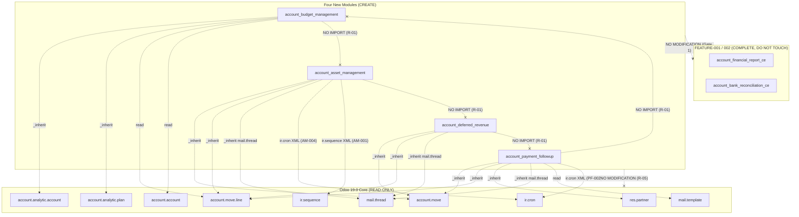

# Technical Specification

# 0. Agent Action Plan

## 0.1 Intent Clarification

### 0.1.1 Core Feature Objective

Based on the prompt, the Blitzy platform understands that the new feature requirement is to implement **four independent, AGPL-3 licensed Odoo Community Edition addon modules** — `account_budget_management` (FEATURE-003), `account_asset_management` (FEATURE-004), `account_deferred_revenue` (FEATURE-005), and `account_payment_followup` (FEATURE-006) — inside the existing Odoo 19.0 Community Edition repository, delivering the twenty user stories catalogued below across four parallel execution tracks gated by a per-story completion criterion (all BDD Given/When/Then pass + `--stop-after-init` clean install + ≥80% coverage).

**Enhanced Requirements Restatement:**

- The Blitzy platform understands the delivery closes the Community/Enterprise gap for four new accounting capabilities without introducing a single Odoo Enterprise dependency, paralleling the established precedent set by `addons/account_financial_report_ce/` (FEATURE-001 at `19.0.1.1.0`) and `addons/account_bank_reconciliation_ce/` (FEATURE-002 at `19.0.1.0.0`), both of which already live in `addons/` and are designated "complete — do not touch."
- The Blitzy platform understands each of the four new folders — `addons/account_budget_management/`, `addons/account_asset_management/`, `addons/account_deferred_revenue/`, `addons/account_payment_followup/` — is a self-contained OCA-conformant addon with its own `__manifest__.py` (`license: AGPL-3`, `version: 19.0.1.0.0`, `author: OCA, [contributor]`), its own `README.rst`, its own `security/ir.model.access.csv`, its own `data/` directory for XML records (`ir.cron`, menu items, actions), and its own `tests/` directory with per-story test files named `test_<story_id_lowercase>.py`.
- The Blitzy platform understands the twenty stories are partitioned across four independent tracks with internal sequential dependencies, executed in three phases where all tracks begin Phase 1 simultaneously:

| Phase | Track A — `account_asset_management` | Track B — `account_budget_management` | Track C — `account_deferred_revenue` | Track D — `account_payment_followup` |
| --- | --- | --- | --- | --- |
| 1 | `tickets/stories/asset-management/AM-001` → `AM-002` | `tickets/stories/budget-management/BM-001` | `tickets/stories/deferred-revenue/DR-001` | `tickets/stories/payment-followups/PF-005` → `PF-001` |
| 2 | `AM-003` → `AM-004` | `BM-002` → `BM-003` | `DR-002` → `DR-003` | `PF-002` → `PF-004` |
| 3 | `AM-005` → `AM-006` | `BM-004` and `BM-005` (parallel) | `DR-004` | `PF-003` |

- The Blitzy platform understands the arrow (`→`) denotes a hard sequential dependency within a track, and that BM-004 and BM-005 in Phase 3 of Track B are explicitly permitted to proceed in parallel because R-08 requires their model fields to be non-overlapping.
- The Blitzy platform understands every story gate is non-negotiable: a story is complete only when (a) all BDD Given/When/Then acceptance criteria in its ticket file pass, (b) the module installs cleanly via `--stop-after-init`, and (c) per-story test coverage is ≥80% as confirmed by `coverage report`. No story in a dependency chain begins until its prerequisite story passes all three conditions.

**Story Inventory (20 stories) — addressed verbatim to their ticket files:**

| Track | Module | Stories | Source Ticket Folder |
| --- | --- | --- | --- |
| A | `account_asset_management` | AM-001, AM-002, AM-003, AM-004, AM-005, AM-006 | `tickets/stories/asset-management/` |
| B | `account_budget_management` | BM-001, BM-002, BM-003, BM-004, BM-005 | `tickets/stories/budget-management/` |
| C | `account_deferred_revenue` | DR-001, DR-002, DR-003, DR-004 | `tickets/stories/deferred-revenue/` |
| D | `account_payment_followup` | PF-001, PF-002, PF-003, PF-004, PF-005 | `tickets/stories/payment-followups/` |

**Implicit Requirements Surfaced:**

- Each module's `__manifest__.py` must declare the exact `depends` list specified in the prompt and must not be altered at implementation time: `account_budget_management` → `['account', 'analytic']`; `account_asset_management` → `['account']`; `account_deferred_revenue` → `['account']`; `account_payment_followup` → `['account', 'mail']`.
- No cross-module imports are permitted: Track A, B, C, D modules must not `import` each other, and no manifest may list a sibling new module in its `depends`.
- The ORM inheritance model is strict: every extension of `account.move`, `account.move.line`, `account.account`, `account.analytic.account`, `account.analytic.plan`, `res.partner`, `ir.cron`, or `mail.template` must use `_inherit` on the existing model name. `_name` is reserved for net-new models only.
- Two scheduled jobs must be XML `ir.cron` records (AM-004 depreciation cron and PF-002 follow-up email cron) inside each respective module's `data/` directory, and each must appear in Settings → Technical → Automation → Scheduled Actions after module install.
- The repository's existing tooling dictates Python 3.13 (the highest explicitly supported version per `requirements.txt` pins such as `Babel==2.17.0 ; python_version >= '3.13'` and `gevent==24.11.1 ; sys_platform != 'win32' and python_version >= '3.13'`) and PostgreSQL 15 (per the prompt's Docker setup step) — no change to `odoo/release.py`'s `MIN_PY_VERSION = (3, 10)` declaration is permitted by the constraints.

### 0.1.2 Special Instructions and Constraints

The Blitzy platform extracts the following CRITICAL directives from the prompt and preserves them verbatim where possible:

- **"Story gate rule"** (user-verbatim): *A story is complete when all three conditions hold: (a) all BDD Given/When/Then acceptance criteria in its ticket file pass, (b) the module installs cleanly via `--stop-after-init`, and (c) per-story test coverage is ≥80% confirmed via `coverage report`. No story in a dependency chain begins until its prerequisite story passes all three conditions.*
- **"Minimal change mandate"** (user-verbatim): *Each story adds only what its ticket acceptance criteria require. No speculative fields, views, or logic.*
- **MUST NOT modify list (user-verbatim):** Any file in FEATURE-001 or FEATURE-002 modules; Core Odoo modules `account`, `analytic`, `base`, `mail`; Field definitions on `account.move` or `account.move.line` that are read or written by FEATURE-001/002; computed fields and new relational fields are permitted.
- **MUST NOT declare (user-verbatim):** Any Odoo Enterprise module in any `depends` list; Cross-dependencies between the four new modules.
- **MUST NOT implement (user-verbatim):** UI/UX elements beyond what the ticket acceptance criteria explicitly require; Data migration scripts; External Python packages unless a story's technical notes specify one AND it is verifiable as AGPL-3.0 compatible.
- **Architectural Directive:** Use the existing service pattern established by `addons/account_financial_report_ce/` and `addons/account_bank_reconciliation_ce/` — `_inherit`-only extension, per-module security CSV, XML-driven data definitions, TransientModel wizards where interactive input is required, and AbstractModel bases where behaviour must be shared across multiple concrete reports or forms.
- **Backward Compatibility Directive:** Every computed field or relational field added to `account.move` / `account.move.line` / `res.partner` must be additive — no redefinition of core fields or FEATURE-001/002 fields. This is separately enforced by R-05.
- **Performance Targets (user-verbatim):**
  - AM-003 depreciation board: full schedule render < 2s for assets with ≤ 480 periods.
  - BM-004 variance report: fiscal year render < 3s for ≤ 1,000 budget lines.
  - PF-002 email batch: processes ≤ 500 partners per cron run within default cron timeout.
- **Scheduled Actions Directive:** AM-004 and PF-002 scheduled jobs MUST be defined as `ir.cron` records in XML data files. Verify each is reachable from Settings → Technical → Automation → Scheduled Actions after module install. Python-level cron scheduling (e.g., `threading.Timer`, `APScheduler`) is prohibited by R-06.
- **Web Search Research Required:** None. All functional requirements, acceptance criteria, and technical notes are authoritatively defined in the ticket files; the prompt explicitly directs "Read each file before implementing its story. Do not reproduce or summarize ticket content — implement against it directly." No external research is required beyond what the ticket files reference.
- **Preserved User Examples:**
  - *User Example (Phase Table):* The execution plan table with four tracks and three phases is preserved verbatim in §0.1.1 above.
  - *User Example (OCA conventions per module):* `__manifest__.py` with `license: AGPL-3`, `version: 19.0.1.0.0`, `author: OCA, [contributor]`; `README.rst` following OCA template structure; `security/ir.model.access.csv` with entries for every new model; `data/` directory for XML record definitions (`ir.cron`, menu items, actions); `tests/` directory with `__init__.py` and per-story test files named `test_<story_id_lowercase>.py`.
  - *User Example (Manifest depends):* `account_budget_management`: `depends = ['account', 'analytic']` · `account_asset_management`: `depends = ['account']` · `account_deferred_revenue`: `depends = ['account']` · `account_payment_followup`: `depends = ['account', 'mail']`.

### 0.1.3 Technical Interpretation

These feature requirements translate to the following technical implementation strategy, expressed per story cluster:

- **To deliver FEATURE-003 Budget Management**, create the `addons/account_budget_management/` addon with two net-new models (`budget.budget` as the header and `budget.budget.line` as the line item) plus two auxiliary models (`budget.budget.period` for BM-002 period allocations and `budget.alert` for BM-005 threshold events), extending `account.analytic.account` and `account.analytic.plan` via `_inherit` where necessary to surface budget-aware behavior. BM-003 and BM-004 produce reporting views and a variance wizard via new `TransientModel` classes; BM-005 defines the alert `ir.cron` via XML in `data/`. All five stories share the same security CSV and menu structure.
- **To deliver FEATURE-004 Asset Management**, create the `addons/account_asset_management/` addon with a net-new `account.asset` header model, a net-new `account.asset.depreciation.line` schedule model, and an `account.asset.category` categorization model. AM-001 wires vendor bill linkage; AM-002 parameterizes depreciation methods (straight-line, declining-balance, units-of-production); AM-003 renders the depreciation board as a read-only `@api.depends`-driven view on `account.asset.depreciation.line`; AM-004 defines the `ir.cron` XML record that invokes the depreciation-posting code and writes `account.move` / `account.move.line` records in batch; AM-005 implements revaluation and impairment workflows; AM-006 implements disposal and sale posting.
- **To deliver FEATURE-005 Deferred Revenue**, create the `addons/account_deferred_revenue/` addon with a net-new `account.deferred.schedule` header model and a net-new `account.deferred.line` recognition-line model. DR-001 provides schedule creation from invoice lines (with analytic distribution preservation); DR-002 implements straight-line, date-based, and manual allocation strategies; DR-003 implements the cut-off entry generation wizard (single/batch/preview modes) with `account.lock.exception` awareness; DR-004 delivers the recognition dashboard via a new `TransientModel` wizard populated by `read_group` aggregation.
- **To deliver FEATURE-006 Payment Follow-ups**, create the `addons/account_payment_followup/` addon with four net-new models: `account.followup.level` (PF-001 configuration), `account.followup.line` (computed overdue state per partner, backing PF-005), `account.followup.history` (PF-004 immutable audit trail), and a report model for PF-003. PF-002's email cron is an XML `ir.cron` record that invokes a batched method rendering `mail.template` records for each qualifying partner. `res.partner` is extended via `_inherit` to expose computed follow-up fields.

**Requirement-to-Action Map:**

- To implement **four independent modules with no cross-dependencies**, create four sibling folders under `addons/`, each with its own `__init__.py`, `__manifest__.py`, `README.rst`, `security/`, `data/`, `models/`, and `tests/` subtrees, and verify `grep -r '<sibling_module>' addons/<module>/__manifest__.py` returns zero hits per R-01.
- To implement **`_inherit`-only extension of core models**, open each new `models/*.py` file with a class that declares `_inherit = 'account.move'` (or the appropriate core model) and never `_name` — per R-03.
- To implement **AM-004 and PF-002 scheduled jobs**, create `addons/account_asset_management/data/depreciation_cron.xml` and `addons/account_payment_followup/data/followup_cron.xml` containing `<record id="..." model="ir.cron">` elements with `model_id`, `state="code"`, and appropriate `interval_number` / `interval_type` fields — per R-06.
- To implement **≥80% per-story coverage**, place each story's tests in `addons/<module>/tests/test_<story_id_lowercase>.py` and verify coverage with `python -m pytest addons/<module>/tests/test_<story_id>.py -v --cov=addons/<module> --cov-report=term-missing` before advancing to the next story — per R-04.
- To implement **zero Enterprise dependencies**, verify after each manifest write that `grep -r 'enterprise' addons/<module>/__manifest__.py` and `grep -r '(account_asset|account_budget|account_accountant|account_reports|account_followup|account_deferred_revenue)' addons/<module>/__manifest__.py` return zero hits — per R-02.
- To implement **security-by-construction**, author `addons/<module>/security/ir.model.access.csv` with one row per `(model, group)` pair on module install, and reference existing `account.group_account_user` / `account.group_account_manager` groups where appropriate (following the FEATURE-001/002 precedent of extending via `Command.link` on `implied_ids`). No `sudo()` may appear without an inline `# sudo required: <reason from ticket>` comment — per R-07.

## 0.2 Repository Scope Discovery

### 0.2.1 Comprehensive File Analysis

The Blitzy platform's repository scope discovery identifies the exhaustive set of repository artifacts that will be **created**, **read for extension**, or explicitly **left untouched** in support of the four new modules. The four new addon folders contain all modifiable files; every core and FEATURE-001/002 file is strictly read-only.

#### 0.2.1.1 Existing Repository Artifacts Read for Context (Read-Only)

The following existing files and folders were inspected by the platform and must remain unmodified (per Boundaries & Preservation directives and R-05):

| Path Pattern | Relevance | Disposition |
| --- | --- | --- |
| `addons/account/__manifest__.py` | Declares the core `account` module manifest (`name: "Invoicing"`, `depends: ['base_setup', 'onboarding', 'product', 'analytic', 'portal', 'digest']`) — target of all four `depends` lists | READ-ONLY |
| `addons/account/models/account_move.py` | Defines `account.move` — target of `_inherit` (computed/relational fields only, per R-05) | READ-ONLY |
| `addons/account/models/account_move_line.py` | Defines `account.move.line` — target of `_inherit` (computed/relational fields only, per R-05) | READ-ONLY |
| `addons/account/models/account_account.py` | Defines `account.account` — read-only reference for every new module | READ-ONLY |
| `addons/account/models/account_analytic_account.py` | Defines `account.analytic.account` — target of `_inherit` in `account_budget_management` | READ-ONLY |
| `addons/account/models/account_analytic_plan.py` (wrapper into `addons/analytic/`) | Defines `account.analytic.plan` — target of `_inherit` in `account_budget_management` | READ-ONLY |
| `addons/account/data/service_cron.xml` | Precedent pattern for `ir.cron` XML records (e.g. `ir_cron_auto_post_draft_entry`) — template for AM-004 and PF-002 crons | READ-ONLY |
| `addons/account/security/account_security.xml` | Defines `account.group_account_user`, `account.group_account_manager` — referenced by new modules' security CSVs | READ-ONLY |
| `addons/analytic/__manifest__.py` | Declares `analytic` module — target of `account_budget_management.depends` | READ-ONLY |
| `addons/analytic/models/analytic_mixin.py` | Defines `analytic.mixin` — used by `budget.budget.line` for analytic distribution (JSON field) | READ-ONLY |
| `addons/analytic/models/analytic_account.py` | Defines `account.analytic.account` (referenced by `account_budget_management` for GL/analytic linkage) | READ-ONLY |
| `addons/mail/__manifest__.py` | Declares `mail` module — target of `account_payment_followup.depends` | READ-ONLY |
| `addons/mail/models/mail_template.py` | Defines `mail.template` — target of `_inherit` in `account_payment_followup` (if extension required by PF-001) | READ-ONLY |
| `addons/mail/models/mail_thread.py` | Defines `mail.thread` mixin — used by `account.asset` (AM-001 chatter/activities) and `account.followup.history` (PF-004) | READ-ONLY |
| `addons/base/models/ir_cron.py` (implicit) | Defines `ir.cron` — target for AM-004 and PF-002 XML records | READ-ONLY |
| `addons/account_financial_report_ce/**/*.*` | FEATURE-001 files (44 files, ~22,578 LOC) — MUST NOT be touched | READ-ONLY |
| `addons/account_bank_reconciliation_ce/**/*.*` | FEATURE-002 files (35 files, ~16,502 LOC) — MUST NOT be touched | READ-ONLY |
| `requirements.txt` | Pinned Python dependencies (e.g., `Babel==2.17.0 ; python_version >= '3.13'`, `openpyxl`, `lxml==5.2.1; python_version >= '3.12'`) — READ-ONLY; no new pins required by the four new modules | READ-ONLY |
| `odoo/release.py` | Declares `version_info = (19, 0, 0, FINAL, 0, '')`, `MIN_PY_VERSION = (3, 10)` — READ-ONLY | READ-ONLY |
| `ruff.toml` | Target `py310` lint config — READ-ONLY (new files must comply) | READ-ONLY |
| `tickets/stories/asset-management/AM-00{1..6}-*.md` | Six ticket source-of-truth files for Track A | READ-ONLY |
| `tickets/stories/budget-management/BM-00{1..5}-*.md` | Five ticket source-of-truth files for Track B | READ-ONLY |
| `tickets/stories/deferred-revenue/DR-00{1..4}-*.md` | Four ticket source-of-truth files for Track C | READ-ONLY |
| `tickets/stories/payment-followups/PF-00{1..5}-*.md` | Five ticket source-of-truth files for Track D | READ-ONLY |
| `tickets/features/FEATURE-00{3..6}-*.md` | Four feature-level briefs providing success metrics and persona mapping | READ-ONLY |
| `tickets/EPIC-001-enterprise-accounting.md` | Epic-level specification defining SM-001 through SM-006 and constraint register | READ-ONLY |

#### 0.2.1.2 Integration Point Discovery

The prompt defines four manifest `depends` lists. The Blitzy platform interprets these as the concrete integration surface between each new module and the Odoo core:

| New Module | Integration Target | Integration Surface | Ticket References |
| --- | --- | --- | --- |
| `account_budget_management` | `account` | `account.account` (read), `account.move.line` (`read_group` for actuals) | BM-003, BM-004 |
| `account_budget_management` | `analytic` | `account.analytic.account` (`_inherit` for budget-aware fields), `account.analytic.plan` (`_inherit`), `analytic.mixin` (reuse JSON distribution on `budget.budget.line`) | BM-001, BM-002 |
| `account_asset_management` | `account` | `account.move` (`_inherit` for asset linkage computed field), `account.move.line` (`_inherit` for asset-line back-reference), `account.account` (read for account-type validation), `account.journal` (read for depreciation journal selection), `ir.sequence` (read for asset numbering per AM-001) | AM-001, AM-002, AM-003, AM-004, AM-005, AM-006 |
| `account_deferred_revenue` | `account` | `account.move` (`_inherit` for deferred-schedule link), `account.move.line` (`_inherit` for deferral-source back-reference and analytic distribution passthrough), `account.account` (read for deferred-revenue account selection), `account.lock.exception` (read for lock-date enforcement per DR-003) | DR-001, DR-002, DR-003, DR-004 |
| `account_payment_followup` | `account` | `account.move` (`_inherit` for follow-up state on invoices), `account.move.line` (`_inherit` for overdue classification — computed only per R-05), `res.partner` (`_inherit` for follow-up level fields and aging buckets), `ir.cron` (XML `ir.cron` record for PF-002) | PF-001, PF-002, PF-003, PF-004, PF-005 |
| `account_payment_followup` | `mail` | `mail.template` (referenced from `account.followup.level` for per-level email templates), `mail.thread` (mixin on `account.followup.history` for chatter), `mail.mail` (queued send via existing Odoo pipeline) | PF-001, PF-002, PF-004 |

**API Endpoints Connected to the Feature (Odoo-internal menu/action wiring):**

- Each new module registers its own `ir.ui.menu` entries and `ir.actions.act_window` / `ir.actions.report` records. None of the modules adds an HTTP controller.
- AM-003 depreciation board and DR-004 recognition dashboard are rendered as standard Odoo views (`tree`, `kanban`, `graph`) — no OWL components — per §1.3.2.2's prohibition on net-new JavaScript.

**Database Models / Migrations Affected:**

- Net-new models are created and owned by each module; no Alembic/ORM migration scripts are written (data migration scripts are explicitly out of scope per Boundaries & Preservation).
- Fields added to core models (`account.move`, `account.move.line`, `res.partner`, `account.analytic.account`, `account.analytic.plan`) are added purely through `_inherit` and are additive (computed or relational only).

**Service Classes Requiring Updates:**

- No updates to existing service classes. All new business logic is encapsulated within the four new modules' `models/` directories.

**Controllers / Handlers to Modify:**

- None. The four new modules do not add HTTP controllers; all interactions route through the Odoo web client and the ORM.

**Middleware / Interceptors Impacted:**

- None. The four new modules do not register middleware or WSGI-level interceptors.

### 0.2.2 Web Search Research Conducted

Per the prompt's explicit direction (*"Read each file before implementing its story. Do not reproduce or summarize ticket content — implement against it directly."*) and per the analysis of ticket technical-notes sections, **no external web research is required** to implement any story. All functional requirements, acceptance criteria, calculation formulas (e.g., straight-line vs. declining-balance depreciation in AM-002), state-machine definitions, and integration patterns are authoritatively expressed in the twenty ticket files.

The Blitzy platform confirms the following zero-external-research posture:

| Research Area | Status | Authoritative Source |
| --- | --- | --- |
| Depreciation formulas (AM-002) | Self-contained in ticket | `tickets/stories/asset-management/AM-002-depreciation-configuration.md` |
| Deferral recognition methodology (DR-002) | Self-contained in ticket | `tickets/stories/deferred-revenue/DR-002-automatic-period-allocation.md` |
| Aging bucket thresholds (PF-005) | Self-contained in ticket | `tickets/stories/payment-followups/PF-005-overdue-calculation.md` |
| Variance calculation conventions (BM-004) | Self-contained in ticket | `tickets/stories/budget-management/BM-004-variance-analysis.md` |
| OCA module naming conventions | Self-contained in prompt | Prompt §3 "OCA conventions per module" |
| Odoo 19.0 ORM API surface | Observed in-repo | `addons/account/models/account_move.py`, `addons/account/models/account_move_line.py`, `odoo/orm/` |
| `ir.cron` XML record format | Observed in-repo | `addons/account/data/service_cron.xml` |
| `_inherit` precedent for core extension | Observed in-repo | `addons/account_bank_reconciliation_ce/models/partial_reconcile_ext.py` (`_inherit = 'account.bank.statement.line'`) |

### 0.2.3 New File Requirements

The Blitzy platform enumerates all net-new files below, grouped by module. All paths are absolute from the repository root.

#### 0.2.3.1 Net-New Files for `addons/account_budget_management/` (FEATURE-003)

| File Path | Purpose |
| --- | --- |
| `addons/account_budget_management/__init__.py` | Package entry — imports `models`, `wizard`, `report` |
| `addons/account_budget_management/__manifest__.py` | Manifest: `depends = ['account', 'analytic']`; `license = 'AGPL-3'`; `version = '19.0.1.0.0'`; `author = 'OCA, [contributor]'` |
| `addons/account_budget_management/README.rst` | OCA-template README |
| `addons/account_budget_management/models/__init__.py` | Imports all model files |
| `addons/account_budget_management/models/budget_budget.py` | BM-001 — `budget.budget` header model (net-new `_name`) |
| `addons/account_budget_management/models/budget_budget_line.py` | BM-001 — `budget.budget.line` line model (net-new `_name`, uses `analytic.mixin`) |
| `addons/account_budget_management/models/budget_period.py` | BM-002 — `budget.budget.period` allocation model |
| `addons/account_budget_management/models/budget_alert.py` | BM-005 — `budget.alert` threshold-event log model |
| `addons/account_budget_management/models/account_analytic_account.py` | BM-001 — `_inherit = 'account.analytic.account'` for budget-aware fields |
| `addons/account_budget_management/wizard/__init__.py` | Wizard package |
| `addons/account_budget_management/wizard/budget_variance_wizard.py` | BM-004 — `TransientModel` variance report wizard |
| `addons/account_budget_management/report/__init__.py` | Report package |
| `addons/account_budget_management/report/budget_vs_actual_report.py` | BM-003 — Report model for actual-vs-budget |
| `addons/account_budget_management/security/ir.model.access.csv` | Access rows for `budget.budget`, `budget.budget.line`, `budget.budget.period`, `budget.alert` |
| `addons/account_budget_management/security/budget_security.xml` | `res.groups` if needed; `ir.rule` for multi-company |
| `addons/account_budget_management/data/budget_data.xml` | Sequences, default configuration |
| `addons/account_budget_management/data/budget_alert_cron.xml` | BM-005 — `ir.cron` for alert dispatch (if BM-005 ticket requires scheduled evaluation) |
| `addons/account_budget_management/views/budget_views.xml` | BM-001 form/tree/kanban views |
| `addons/account_budget_management/views/budget_period_views.xml` | BM-002 allocation views |
| `addons/account_budget_management/views/budget_variance_views.xml` | BM-003/BM-004 views |
| `addons/account_budget_management/views/budget_alert_views.xml` | BM-005 alert views |
| `addons/account_budget_management/views/menuitem.xml` | Budget menu structure |
| `addons/account_budget_management/tests/__init__.py` | Test package |
| `addons/account_budget_management/tests/test_bm_001.py` | BM-001 tests (≥80% coverage per R-04) |
| `addons/account_budget_management/tests/test_bm_002.py` | BM-002 tests |
| `addons/account_budget_management/tests/test_bm_003.py` | BM-003 tests |
| `addons/account_budget_management/tests/test_bm_004.py` | BM-004 tests |
| `addons/account_budget_management/tests/test_bm_005.py` | BM-005 tests |

#### 0.2.3.2 Net-New Files for `addons/account_asset_management/` (FEATURE-004)

| File Path | Purpose |
| --- | --- |
| `addons/account_asset_management/__init__.py` | Package entry |
| `addons/account_asset_management/__manifest__.py` | Manifest: `depends = ['account']`; `license = 'AGPL-3'`; `version = '19.0.1.0.0'` |
| `addons/account_asset_management/README.rst` | OCA-template README |
| `addons/account_asset_management/models/__init__.py` | Imports all model files |
| `addons/account_asset_management/models/account_asset.py` | AM-001 — `account.asset` header (net-new `_name`); state machine draft → open → close |
| `addons/account_asset_management/models/account_asset_category.py` | AM-001 — `account.asset.category` with default methods/useful-life/accounts |
| `addons/account_asset_management/models/account_asset_depreciation_line.py` | AM-003 — `account.asset.depreciation.line` schedule lines |
| `addons/account_asset_management/models/account_move.py` | AM-001 / AM-004 — `_inherit = 'account.move'` for asset back-reference (computed/relational only per R-05) |
| `addons/account_asset_management/models/account_move_line.py` | AM-001 / AM-004 — `_inherit = 'account.move.line'` for asset-line back-reference (computed/relational only per R-05) |
| `addons/account_asset_management/wizard/__init__.py` | Wizard package |
| `addons/account_asset_management/wizard/asset_modification_wizard.py` | AM-005 — revaluation / impairment wizard |
| `addons/account_asset_management/wizard/asset_disposal_wizard.py` | AM-006 — disposal / sale wizard |
| `addons/account_asset_management/security/ir.model.access.csv` | Access rows for `account.asset`, `account.asset.category`, `account.asset.depreciation.line` |
| `addons/account_asset_management/security/asset_security.xml` | `ir.rule` for multi-company |
| `addons/account_asset_management/data/asset_sequence.xml` | AM-001 — `ir.sequence` for unique asset references |
| `addons/account_asset_management/data/depreciation_cron.xml` | **AM-004 — `ir.cron` XML record (mandatory per R-06)** |
| `addons/account_asset_management/views/account_asset_views.xml` | AM-001 asset views |
| `addons/account_asset_management/views/account_asset_category_views.xml` | AM-001 category views |
| `addons/account_asset_management/views/depreciation_board_views.xml` | AM-003 depreciation board (tree/kanban/graph, read-only) |
| `addons/account_asset_management/views/asset_modification_views.xml` | AM-005 wizard views |
| `addons/account_asset_management/views/asset_disposal_views.xml` | AM-006 wizard views |
| `addons/account_asset_management/views/menuitem.xml` | Asset menu structure |
| `addons/account_asset_management/tests/__init__.py` | Test package |
| `addons/account_asset_management/tests/test_am_001.py` | AM-001 tests |
| `addons/account_asset_management/tests/test_am_002.py` | AM-002 tests |
| `addons/account_asset_management/tests/test_am_003.py` | AM-003 tests |
| `addons/account_asset_management/tests/test_am_004.py` | AM-004 tests |
| `addons/account_asset_management/tests/test_am_005.py` | AM-005 tests |
| `addons/account_asset_management/tests/test_am_006.py` | AM-006 tests |

#### 0.2.3.3 Net-New Files for `addons/account_deferred_revenue/` (FEATURE-005)

| File Path | Purpose |
| --- | --- |
| `addons/account_deferred_revenue/__init__.py` | Package entry |
| `addons/account_deferred_revenue/__manifest__.py` | Manifest: `depends = ['account']`; `license = 'AGPL-3'`; `version = '19.0.1.0.0'` |
| `addons/account_deferred_revenue/README.rst` | OCA-template README |
| `addons/account_deferred_revenue/models/__init__.py` | Imports all model files |
| `addons/account_deferred_revenue/models/account_deferred_schedule.py` | DR-001 — `account.deferred.schedule` header (net-new `_name`) |
| `addons/account_deferred_revenue/models/account_deferred_line.py` | DR-002 — `account.deferred.line` recognition lines |
| `addons/account_deferred_revenue/models/account_move.py` | DR-001 — `_inherit = 'account.move'` for deferred-schedule link (computed/relational only per R-05) |
| `addons/account_deferred_revenue/models/account_move_line.py` | DR-001 — `_inherit = 'account.move.line'` for deferral-source back-reference (computed/relational only per R-05) |
| `addons/account_deferred_revenue/wizard/__init__.py` | Wizard package |
| `addons/account_deferred_revenue/wizard/cutoff_wizard.py` | DR-003 — `TransientModel` cut-off entry generation wizard (single/batch/preview/reversal modes) |
| `addons/account_deferred_revenue/wizard/recognition_dashboard_wizard.py` | DR-004 — `TransientModel` recognition dashboard |
| `addons/account_deferred_revenue/security/ir.model.access.csv` | Access rows for `account.deferred.schedule`, `account.deferred.line` |
| `addons/account_deferred_revenue/security/deferred_security.xml` | `ir.rule` for multi-company |
| `addons/account_deferred_revenue/data/deferred_data.xml` | Default configurations |
| `addons/account_deferred_revenue/views/account_deferred_schedule_views.xml` | DR-001 schedule views |
| `addons/account_deferred_revenue/views/account_deferred_line_views.xml` | DR-002 line views |
| `addons/account_deferred_revenue/views/cutoff_wizard_views.xml` | DR-003 wizard views |
| `addons/account_deferred_revenue/views/recognition_dashboard_views.xml` | DR-004 dashboard views |
| `addons/account_deferred_revenue/views/menuitem.xml` | Deferred Revenue menu structure |
| `addons/account_deferred_revenue/tests/__init__.py` | Test package |
| `addons/account_deferred_revenue/tests/test_dr_001.py` | DR-001 tests |
| `addons/account_deferred_revenue/tests/test_dr_002.py` | DR-002 tests |
| `addons/account_deferred_revenue/tests/test_dr_003.py` | DR-003 tests |
| `addons/account_deferred_revenue/tests/test_dr_004.py` | DR-004 tests |

#### 0.2.3.4 Net-New Files for `addons/account_payment_followup/` (FEATURE-006)

| File Path | Purpose |
| --- | --- |
| `addons/account_payment_followup/__init__.py` | Package entry |
| `addons/account_payment_followup/__manifest__.py` | Manifest: `depends = ['account', 'mail']`; `license = 'AGPL-3'`; `version = '19.0.1.0.0'` |
| `addons/account_payment_followup/README.rst` | OCA-template README |
| `addons/account_payment_followup/models/__init__.py` | Imports all model files |
| `addons/account_payment_followup/models/account_followup_level.py` | PF-001 — `account.followup.level` configuration model (net-new `_name`) |
| `addons/account_payment_followup/models/account_followup_line.py` | PF-005 — `account.followup.line` computed overdue state per partner |
| `addons/account_payment_followup/models/account_followup_history.py` | PF-004 — `account.followup.history` immutable audit trail (inherits `mail.thread`) |
| `addons/account_payment_followup/models/res_partner.py` | PF-001 / PF-005 — `_inherit = 'res.partner'` for follow-up level and aging-bucket computed fields |
| `addons/account_payment_followup/models/account_move.py` | PF-005 — `_inherit = 'account.move'` for days-overdue computed field (computed/relational only per R-05) |
| `addons/account_payment_followup/wizard/__init__.py` | Wizard package |
| `addons/account_payment_followup/wizard/followup_report_wizard.py` | PF-003 — `TransientModel` follow-up report wizard (filters, exports) |
| `addons/account_payment_followup/report/__init__.py` | Report package |
| `addons/account_payment_followup/report/followup_report.py` | PF-003 — report model with PDF/XLSX output |
| `addons/account_payment_followup/report/followup_report.xml` | PF-003 — QWeb PDF template |
| `addons/account_payment_followup/security/ir.model.access.csv` | Access rows for `account.followup.level`, `account.followup.line`, `account.followup.history` |
| `addons/account_payment_followup/security/followup_security.xml` | `ir.rule` for multi-company |
| `addons/account_payment_followup/data/followup_data.xml` | Default follow-up levels, default mail templates |
| `addons/account_payment_followup/data/followup_cron.xml` | **PF-002 — `ir.cron` XML record (mandatory per R-06)** |
| `addons/account_payment_followup/data/mail_template_data.xml` | PF-002 — default `mail.template` records referenced by follow-up levels |
| `addons/account_payment_followup/views/account_followup_level_views.xml` | PF-001 level-configuration views |
| `addons/account_payment_followup/views/account_followup_line_views.xml` | PF-005 overdue views |
| `addons/account_payment_followup/views/account_followup_history_views.xml` | PF-004 history views |
| `addons/account_payment_followup/views/res_partner_views.xml` | PF-001 / PF-005 partner-form extensions |
| `addons/account_payment_followup/views/followup_report_views.xml` | PF-003 report-wizard views |
| `addons/account_payment_followup/views/menuitem.xml` | Follow-up menu structure |
| `addons/account_payment_followup/tests/__init__.py` | Test package |
| `addons/account_payment_followup/tests/test_pf_001.py` | PF-001 tests |
| `addons/account_payment_followup/tests/test_pf_002.py` | PF-002 tests |
| `addons/account_payment_followup/tests/test_pf_003.py` | PF-003 tests |
| `addons/account_payment_followup/tests/test_pf_004.py` | PF-004 tests |
| `addons/account_payment_followup/tests/test_pf_005.py` | PF-005 tests |

**Aggregated File Counts (platform estimate, for scope tracking):**

| Module | Models (net-new / inherit) | Wizards | Reports | Views | Security | Data | Tests | Approximate total files |
| --- | --- | --- | --- | --- | --- | --- | --- | --- |
| `account_budget_management` | 4 / 1 | 1 | 1 | 5 | 2 | 2 | 6 (incl. `__init__.py`) | ~25 |
| `account_asset_management` | 3 / 2 | 2 | 0 | 6 | 2 | 2 | 7 | ~28 |
| `account_deferred_revenue` | 2 / 2 | 2 | 0 | 5 | 2 | 1 | 5 | ~23 |
| `account_payment_followup` | 3 / 2 | 1 | 1 + template | 6 | 2 | 3 | 6 | ~29 |

## 0.3 Dependency Inventory

### 0.3.1 Public and Private Packages

The Blitzy platform audits the exact runtime and tooling dependencies required by the four new modules. No new Python package pins are introduced — every library required by the four modules is already pinned in the repository-root `requirements.txt` and consumed by Odoo core and/or the existing FEATURE-001/002 modules.

#### 0.3.1.1 Platform Runtime

| Package | Version | Registry | Source in Repository | Purpose |
| --- | --- | --- | --- | --- |
| Python | 3.13 | CPython official | `requirements.txt` (pins `Babel==2.17.0 ; python_version >= '3.13'`, `gevent==24.11.1 ; sys_platform != 'win32' and python_version >= '3.13'`, `freezegun==1.5.1 ; python_version >= '3.13'`, `lxml==5.2.1; python_version >= '3.12'`) — highest explicitly supported interpreter for Odoo 19.0 | Language runtime for all addon code |
| Odoo Community Edition | 19.0 | GitHub `odoo/odoo` branch `19.0` | `odoo/release.py` (`version_info = (19, 0, 0, FINAL, 0, '')`) | Target application platform |
| PostgreSQL | 15 | Docker Hub `postgres:15` | Prompt §6 `docker run -d --name odoo-db -e POSTGRES_PASSWORD=odoo -p 5432:5432 postgres:15` | RDBMS backing the ORM |

#### 0.3.1.2 Python Libraries Consumed by the Four New Modules (All Already Pinned)

| Package | Pinned Version (Python 3.13) | Registry | Purpose for the Four New Modules |
| --- | --- | --- | --- |
| `psycopg2` | `2.9.9` (`psycopg2 >= 2.2` floor in `setup.py`) | PyPI | Provided transitively by Odoo — ORM cursor invoked by every new model |
| `lxml` | `5.2.1 ; python_version >= '3.12'` | PyPI | XML parsing for `data/*.xml`, `security/*.xml`, and view files — invoked by Odoo's module loader |
| `lxml-html-clean` | unpinned (`; python_version >= '3.12'` marker present) | PyPI | HTML sanitization used by `mail.template` in `account_payment_followup` PF-002 email rendering |
| `Jinja2` | `3.1.2 ; python_version > '3.10'` | PyPI | Templating used by `mail.template` dynamic placeholders in PF-002 |
| `MarkupSafe` | `2.1.5 ; python_version >= '3.12'` | PyPI | Safe HTML escaping in QWeb + mail rendering |
| `Babel` | `2.17.0 ; python_version >= '3.13'` | PyPI | Number and date localization used by financial amounts and report dates |
| `python-dateutil` | (unpinned in `requirements.txt` — pulled in via `setup.py install_requires`) | PyPI | `relativedelta` for depreciation period arithmetic (AM-003) and deferred recognition (DR-002) |
| `psycopg2` | `2.9.9` | PyPI | As above |
| `reportlab` | `4.1.0` (pulled via `setup.py` chain) | PyPI | PDF primitives used by QWeb PDF render for PF-003 follow-up report |
| `openpyxl` | `3.1.2` | PyPI | Used by PF-003 XLSX export if the ticket requires spreadsheet output (already pinned and consumed by FEATURE-001) |
| `freezegun` | `1.5.1 ; python_version >= '3.13'` | PyPI | Test dependency to deterministically advance time in AM-003 / AM-004 / DR-003 / PF-002 scheduled-action tests |
| `coverage` | dev tool (used via `python -m pytest ... --cov=addons/<module>`) | PyPI | Required to enforce the ≥80% per-story gate (R-04) |
| `pytest` | dev tool (invoked by Validation Framework command) | PyPI | Test runner driving per-story coverage reporting |

**No new runtime dependencies are introduced.** Per the Boundaries & Preservation directive (*"External Python packages unless a story's technical notes specify one AND it is verifiable as AGPL-3.0 compatible"*), the Blitzy platform confirms that none of the twenty ticket files specifies a new external Python package. The four modules therefore declare an empty `external_dependencies` block (or omit it) in their manifests.

#### 0.3.1.3 Addon (Odoo-Module) Dependencies Per `__manifest__.py`

| Module | `depends` List (verbatim) | Justification |
| --- | --- | --- |
| `account_budget_management` | `['account', 'analytic']` | `account` required for `account.account` / `account.move.line`; `analytic` required for `account.analytic.account`, `account.analytic.plan`, `analytic.mixin` |
| `account_asset_management` | `['account']` | `account` required for `account.move`, `account.move.line`, `account.journal`, `account.account` |
| `account_deferred_revenue` | `['account']` | `account` required for `account.move`, `account.move.line`, `account.lock.exception` |
| `account_payment_followup` | `['account', 'mail']` | `account` required for `account.move`, `res.partner` (via chain); `mail` required for `mail.template`, `mail.thread`, `mail.mail` |

The Blitzy platform verifies (per R-02 and Gate 12) these `depends` lists against two constraints: (a) zero Enterprise modules (`account_reports`, `account_accountant`, `account_asset`, `account_budget`, `account_followup`, `account_deferred_revenue` — the Enterprise names) are present; (b) zero sibling new-module names (`account_budget_management`, `account_asset_management`, `account_deferred_revenue`, `account_payment_followup`) are cross-referenced, upholding R-01's independence mandate.

### 0.3.2 Dependency Updates

#### 0.3.2.1 Import Updates

The four new modules introduce their own Python packages; no modifications are made to any existing module's import statements. The platform documents the intra-module import posture below.

**Import Conventions Inside Each New Module (user-style example for `account_asset_management`):**

- New: `from odoo import api, fields, models, _`
- New: `from odoo.exceptions import UserError, ValidationError`
- New: `from odoo.addons.account.models.account_move import AccountMove` (only when type hinting or referencing constants; never for subclassing — subclassing occurs via `_inherit`)

**Files Requiring Import Updates (use wildcards):**

- `addons/account_budget_management/**/*.py` — internal imports between budget models
- `addons/account_asset_management/**/*.py` — internal imports between asset models
- `addons/account_deferred_revenue/**/*.py` — internal imports between deferred models
- `addons/account_payment_followup/**/*.py` — internal imports between followup models
- `addons/<module>/tests/**/*.py` — test imports (e.g., `from odoo.tests.common import TransactionCase`, `from odoo.addons.account.tests.common import AccountTestInvoicingCommon`)

**Cross-Module Import Rule (R-01 enforcement):**

- Prohibited pattern: `from odoo.addons.account_budget_management.models.budget_budget import Budget` inside `addons/account_asset_management/` — will be caught by R-01 verification `grep -r 'account_budget_management' addons/account_asset_management/` returning zero hits.
- No `import` statement may cross the boundary between any two of the four new modules.

#### 0.3.2.2 External Reference Updates

| Reference Category | File Pattern | Update Type |
| --- | --- | --- |
| Configuration files | `addons/<new_module>/__manifest__.py` | Create new — no modification to existing `__manifest__.py` files across the 607 other addons |
| Configuration files | `addons/<new_module>/security/ir.model.access.csv` | Create new |
| Configuration files | `addons/<new_module>/data/*.xml` | Create new |
| Documentation | `addons/<new_module>/README.rst` | Create new — one per new module (4 total) |
| Documentation | `README.md` (repo root) | NOT MODIFIED — feature-specific documentation lives in each module's README.rst |
| Build files | `setup.py` | NOT MODIFIED — namespace discovery via `find_namespace_packages()` automatically picks up new addon packages |
| Build files | `requirements.txt` | NOT MODIFIED — no new pins |
| Build files | `setup.cfg` | NOT MODIFIED |
| Build files | `ruff.toml` | NOT MODIFIED — new files comply with `target-version = "py310"` (compatible with 3.13 runtime) |
| CI / CD | `.github/workflows/*.yml` | NOT APPLICABLE — repository workflows target the overall Odoo branch; module-level CI is performed at validation time via the prompt's Build & Environment Setup block |
| i18n / l10n | `.weblate.json` | NOT MODIFIED in implementation phase — translation file addition is deferred per §1.3.2.2's explicit exclusion "Localization files" |

**Wildcard Summary of Files to Be Created by This Effort:**

- `addons/account_budget_management/**/*`
- `addons/account_asset_management/**/*`
- `addons/account_deferred_revenue/**/*`
- `addons/account_payment_followup/**/*`

**Wildcard Summary of Files That Must Remain Unchanged:**

- `addons/account/**/*` — core accounting module (LGPL-3)
- `addons/analytic/**/*` — core analytic module
- `addons/base/**/*` — core base module
- `addons/mail/**/*` — core mail module
- `addons/account_financial_report_ce/**/*` — FEATURE-001 complete
- `addons/account_bank_reconciliation_ce/**/*` — FEATURE-002 complete
- `odoo/**/*` — Odoo runtime package
- `requirements.txt`, `setup.py`, `setup.cfg`, `ruff.toml`, `LICENSE`, `README.md`, `CONTRIBUTING.md`, `SECURITY.md`, `.weblate.json` — repository governance

## 0.4 Integration Analysis

### 0.4.1 Existing Code Touchpoints

The Blitzy platform inventories every existing code artifact that participates in the integration of the four new modules. The prompt's preservation mandate is absolute: no existing file may be modified. "Touchpoints" therefore describe *read references* (inspect for API surface) and *inheritance targets* (subclassed via `_inherit`) — not direct edits.

#### 0.4.1.1 Direct References (READ-ONLY) and Inheritance Targets

The integration surface between each new module and the Odoo core is summarized below. Because the mandate is `_inherit`-only on core models (R-03, R-05), all references below are either read-only API usage or additive inheritance producing new fields that do not override any existing field definition.

| Integration Point | Source Module | Target File (READ-ONLY) | New Module | Integration Purpose |
| --- | --- | --- | --- | --- |
| `account.move` (`_inherit` extension) | `account` | `addons/account/models/account_move.py` | `account_asset_management`, `account_deferred_revenue`, `account_payment_followup` | Add computed / relational fields only (e.g., `asset_id`, `deferred_schedule_ids`, `followup_level_id`) — no existing field is redefined per R-05 |
| `account.move.line` (`_inherit` extension) | `account` | `addons/account/models/account_move_line.py` | `account_asset_management`, `account_deferred_revenue`, `account_payment_followup` | Add computed / relational back-references (e.g., `asset_depreciation_line_id`, `deferred_line_id`, `days_overdue` computed) — no existing field is redefined |
| `account.account` (READ-ONLY) | `account` | `addons/account/models/account_account.py` | All four | Read-only reference for account-type validation (`asset_fixed`, `expense_depreciation`, `income`, `liability_current`, etc.) |
| `account.analytic.account` (`_inherit` extension) | `analytic` | `addons/analytic/models/analytic_account.py` | `account_budget_management` | Add budget-aware computed fields (e.g., `budget_amount_planned`, `budget_amount_actual`) |
| `account.analytic.plan` (`_inherit` extension) | `analytic` | `addons/analytic/models/analytic_plan.py` | `account_budget_management` | Add budget-plan-aware fields if required by BM-001 |
| `analytic.mixin` (REUSE via composition) | `analytic` | `addons/analytic/models/analytic_mixin.py` | `account_budget_management` | `budget.budget.line` inherits `analytic.mixin` to gain the `analytic_distribution` JSON field (BM-001 Scenario 3) |
| `res.partner` (`_inherit` extension) | `base` | `addons/base/models/res_partner.py` | `account_payment_followup` | Add follow-up-level computed fields (`followup_level_id`, `followup_next_action_date`, aging buckets — PF-005) |
| `mail.template` (READ reference) | `mail` | `addons/mail/models/mail_template.py` | `account_payment_followup` | `account.followup.level` references a `mail.template` via `Many2one` (PF-001 / PF-002) |
| `mail.thread` (mixin) | `mail` | `addons/mail/models/mail_thread.py` | `account_asset_management`, `account_deferred_revenue`, `account_payment_followup` | `account.asset`, `account.deferred.schedule`, and `account.followup.history` add `_inherit = ['mail.thread', 'mail.activity.mixin']` for chatter / activity support |
| `mail.mail` (ORM call) | `mail` | `addons/mail/models/mail_mail.py` | `account_payment_followup` | PF-002 cron batches queued email sends through the existing mail pipeline |
| `ir.cron` (XML `<record>` register) | `base` | `addons/base/models/ir_cron.py` | `account_asset_management`, `account_payment_followup` | AM-004 depreciation cron and PF-002 email cron declared as `model="ir.cron"` records (R-06) |
| `ir.sequence` (XML `<record>` register) | `base` | `addons/base/models/ir_sequence.py` | `account_asset_management` | AM-001 asset numbering via `ir.sequence` record in `data/asset_sequence.xml` |
| `account.lock.exception` (READ reference) | `account` | `addons/account/models/account_lock_exception.py` | `account_deferred_revenue` | DR-003 cut-off wizard checks lock-date compliance before posting |
| `account.automatic.entry.wizard` (precedent pattern) | `account` | `addons/account/wizard/account_automatic_entry_wizard.py` | `account_deferred_revenue` | Precedent pattern for cut-off wizard UX (DR-003 notes reference this wizard by name) |
| `account.group_account_user` / `account.group_account_manager` (group reference) | `account` | `addons/account/security/account_security.xml` | All four | New modules' `ir.model.access.csv` rows reference these existing groups |
| FEATURE-001 model `account.financial.report.abstract` (READ-ONLY) | `account_financial_report_ce` | `addons/account_financial_report_ce/models/financial_report.py` | None | NOT REUSED — Track B / Track C reports implement their own models to avoid cross-module coupling with FEATURE-001 |
| FEATURE-002 model `account.reconcile.model` extension (READ-ONLY) | `account_bank_reconciliation_ce` | `addons/account_bank_reconciliation_ce/models/reconciliation_rule.py` | None | NOT REUSED — not relevant to budget / asset / deferred / followup feature domains |

#### 0.4.1.2 Dependency Injection / Wiring

The Blitzy platform confirms Odoo does not employ a framework-level dependency-injection container; all wiring is declarative via `__manifest__.py` `depends` lists, `__init__.py` package imports, and XML `<record>` registrations. The concrete wiring actions are:

| Action | File | New Module | Purpose |
| --- | --- | --- | --- |
| Register module with manifest loader | `addons/<module>/__manifest__.py` | All four | Declares dependencies, data files, demo files, version, license |
| Register Python packages | `addons/<module>/__init__.py` and nested `__init__.py` files | All four | Imports `models`, `wizard`, `report` sub-packages so their `@api.model` decorators register the models with the ORM |
| Register XML data files | `addons/<module>/__manifest__.py` `data` key | All four | Loads CSV (`ir.model.access.csv`) and XML (`security/*.xml`, `data/*.xml`, `views/*.xml`, `views/menuitem.xml`) at install time |
| Register `ir.cron` | `addons/account_asset_management/data/depreciation_cron.xml` | Track A | AM-004 — registers `<record id="ir_cron_asset_depreciation" model="ir.cron">` |
| Register `ir.cron` | `addons/account_payment_followup/data/followup_cron.xml` | Track D | PF-002 — registers `<record id="ir_cron_payment_followup" model="ir.cron">` |

#### 0.4.1.3 Database / Schema Updates

Odoo automatically synchronizes PostgreSQL schema from model `_name` + `fields.*` declarations at module install (via `base.module.upgrade` when `--init` / `-i` is applied). The Blitzy platform enumerates the net-new tables and the in-place `ALTER TABLE` operations Odoo will emit for `_inherit`-added fields.

**Net-New PostgreSQL Tables:**

| Module | Table | Source Model | Story |
| --- | --- | --- | --- |
| `account_budget_management` | `budget_budget` | `budget.budget` | BM-001 |
| `account_budget_management` | `budget_budget_line` | `budget.budget.line` | BM-001 |
| `account_budget_management` | `budget_budget_period` | `budget.budget.period` | BM-002 |
| `account_budget_management` | `budget_alert` | `budget.alert` | BM-005 |
| `account_asset_management` | `account_asset` | `account.asset` | AM-001 |
| `account_asset_management` | `account_asset_category` | `account.asset.category` | AM-001 |
| `account_asset_management` | `account_asset_depreciation_line` | `account.asset.depreciation.line` | AM-003 |
| `account_deferred_revenue` | `account_deferred_schedule` | `account.deferred.schedule` | DR-001 |
| `account_deferred_revenue` | `account_deferred_line` | `account.deferred.line` | DR-002 |
| `account_payment_followup` | `account_followup_level` | `account.followup.level` | PF-001 |
| `account_payment_followup` | `account_followup_line` | `account.followup.line` | PF-005 |
| `account_payment_followup` | `account_followup_history` | `account.followup.history` | PF-004 |

**In-Place Column Additions (via `_inherit`, additive only per R-05):**

| Existing Table | Added Columns (examples — actual column names per final ticket implementation) | Module |
| --- | --- | --- |
| `account_move` | `asset_id` (FK to `account_asset`), `deferred_schedule_ids` (reverse one2many — no column), computed `has_overdue_followup` (stored optional) | `account_asset_management`, `account_deferred_revenue`, `account_payment_followup` |
| `account_move_line` | `asset_depreciation_line_id` (FK), `deferred_line_id` (FK), computed `days_overdue` | Same three modules |
| `res_partner` | `followup_level_id` (FK), `followup_next_action_date` (Date), `aging_bucket_current`, `aging_bucket_1_30`, `aging_bucket_31_60`, `aging_bucket_61_90`, `aging_bucket_90_plus` (Monetary) | `account_payment_followup` |
| `account_analytic_account` | `budget_line_ids` (reverse one2many — no column), computed `budget_amount_planned`, `budget_amount_actual` | `account_budget_management` |

**Migration Scripts:** Per the MUST NOT implement directive (*"Data migration scripts"*) and §1.3.2.2's exclusion, no migration scripts are authored. Odoo's `base.module.upgrade` handles schema evolution automatically; any future data migration needs are out of scope.

#### 0.4.1.4 Integration Touchpoint Diagram

## 0.5 Technical Implementation

### 0.5.1 File-by-File Execution Plan

**CRITICAL: Every file listed here MUST be created. No file outside the four new module folders is modified.**

The Blitzy platform groups the execution plan by track (one group per new module) and, within each track, by story cluster. Within a track, stories advance sequentially through the phases defined in §0.1.1; the gate criteria from R-04 must pass before any dependent story starts.

#### 0.5.1.1 Track A — `account_asset_management` (FEATURE-004)

**Group A.1 — Asset Foundation (Phase 1: AM-001 → AM-002)**

- CREATE: `addons/account_asset_management/__init__.py` — imports `models`, `wizard`
- CREATE: `addons/account_asset_management/__manifest__.py` — OCA-conformant (`depends = ['account']`, `license = 'AGPL-3'`, `version = '19.0.1.0.0'`, `author = 'OCA, [contributor]'`)
- CREATE: `addons/account_asset_management/README.rst` — OCA template with short description, usage, configuration, changelog
- CREATE: `addons/account_asset_management/models/__init__.py`
- CREATE: `addons/account_asset_management/models/account_asset_category.py` — AM-001 `account.asset.category` with default depreciation method, useful life, asset / expense / accumulated-depreciation account fields
- CREATE: `addons/account_asset_management/models/account_asset.py` — AM-001 `account.asset` header: `name`, `reference`, `acquisition_date`, `acquisition_cost`, `asset_account_id`, `expense_account_id`, `accumulated_depreciation_account_id`, `category_id`, `vendor_id`, `source_invoice_id`, `state` (draft/open/close), `_inherit = ['mail.thread', 'mail.activity.mixin']`. AM-002 depreciation-config fields: `depreciation_method` (selection: `straight_line` / `declining_balance` / `units_of_production`), `useful_life_years`, `useful_life_months`, `declining_factor`, `salvage_value`, `depreciation_start_date`
- CREATE: `addons/account_asset_management/models/account_move.py` — AM-001 `_inherit = 'account.move'` with computed/relational `asset_id` field only (R-05: no existing field redefinition)
- CREATE: `addons/account_asset_management/models/account_move_line.py` — AM-001 `_inherit = 'account.move.line'` with computed/relational `asset_depreciation_line_id` back-reference only
- CREATE: `addons/account_asset_management/data/asset_sequence.xml` — AM-001 `ir.sequence` XML record for asset numbering
- CREATE: `addons/account_asset_management/security/ir.model.access.csv` — entries for every new model (`account.asset`, `account.asset.category`) per Gate 13
- CREATE: `addons/account_asset_management/security/asset_security.xml` — `ir.rule` for multi-company isolation
- CREATE: `addons/account_asset_management/views/account_asset_views.xml` — AM-001 form, tree, kanban, search
- CREATE: `addons/account_asset_management/views/account_asset_category_views.xml` — AM-001 category views
- CREATE: `addons/account_asset_management/views/menuitem.xml` — root menu + child items
- CREATE: `addons/account_asset_management/tests/__init__.py`
- CREATE: `addons/account_asset_management/tests/test_am_001.py` — AM-001 tests (all 8 scenarios, ≥80% coverage per R-04)
- CREATE: `addons/account_asset_management/tests/test_am_002.py` — AM-002 tests (all 12 scenarios, ≥80% coverage per R-04)

**Group A.2 — Depreciation Schedule + Automation (Phase 2: AM-003 → AM-004)**

- CREATE: `addons/account_asset_management/models/account_asset_depreciation_line.py` — AM-003 `account.asset.depreciation.line`: `asset_id` FK, `sequence`, `depreciation_date`, `depreciation_amount`, `cumulative_depreciation`, `net_book_value`, `state` (draft/posted), `move_id` FK to `account.move`
- MODIFY: `addons/account_asset_management/models/account_asset.py` — add `depreciation_line_ids` one2many reverse relation to schedule
- CREATE: `addons/account_asset_management/data/depreciation_cron.xml` — **AM-004 `<record id="ir_cron_asset_depreciation" model="ir.cron">`** with `state="code"`, `model_id="model_account_asset"`, `code="model._cron_post_depreciation_entries()"`, `interval_type="days"`, `interval_number="1"` (R-06)
- MODIFY: `addons/account_asset_management/models/account_asset.py` — add `@api.model` `_cron_post_depreciation_entries()` method implementing AM-004 scenarios (batch/draft/auto-post, idempotent, logged)
- CREATE: `addons/account_asset_management/views/depreciation_board_views.xml` — AM-003 read-only tree/kanban/graph on `account.asset.depreciation.line`; filters, export (<2s for 480 periods per performance target)
- UPDATE: `addons/account_asset_management/security/ir.model.access.csv` — add `account.asset.depreciation.line` access rows
- CREATE: `addons/account_asset_management/tests/test_am_003.py` — AM-003 tests (≥80%)
- CREATE: `addons/account_asset_management/tests/test_am_004.py` — AM-004 tests including cron invocation verification, idempotency, fault tolerance (≥80%)

**Group A.3 — Modification + Disposal (Phase 3: AM-005 → AM-006)**

- CREATE: `addons/account_asset_management/wizard/__init__.py`
- CREATE: `addons/account_asset_management/wizard/asset_modification_wizard.py` — AM-005 `TransientModel` for revaluation / impairment with GAAP/IFRS-compliant journal entries, audit trail on `mail.thread`
- CREATE: `addons/account_asset_management/wizard/asset_disposal_wizard.py` — AM-006 `TransientModel` for disposal / sale with gain/loss posting and state transition to close
- CREATE: `addons/account_asset_management/views/asset_modification_views.xml`
- CREATE: `addons/account_asset_management/views/asset_disposal_views.xml`
- UPDATE: `addons/account_asset_management/security/ir.model.access.csv` — add wizard access rows
- UPDATE: `addons/account_asset_management/models/account_asset.py` — add disposal/modification action methods callable from wizards
- CREATE: `addons/account_asset_management/tests/test_am_005.py` — AM-005 tests (≥80%)
- CREATE: `addons/account_asset_management/tests/test_am_006.py` — AM-006 tests (≥80%)
- UPDATE: `addons/account_asset_management/__init__.py` — import `wizard` package

#### 0.5.1.2 Track B — `account_budget_management` (FEATURE-003)

**Group B.1 — Budget Definition (Phase 1: BM-001)**

- CREATE: `addons/account_budget_management/__init__.py`
- CREATE: `addons/account_budget_management/__manifest__.py` — `depends = ['account', 'analytic']`, `license = 'AGPL-3'`, `version = '19.0.1.0.0'`
- CREATE: `addons/account_budget_management/README.rst`
- CREATE: `addons/account_budget_management/models/__init__.py`
- CREATE: `addons/account_budget_management/models/budget_budget.py` — BM-001 `budget.budget`: `name`, `reference` (unique), `responsible_user_id`, `date_from`, `date_to`, `state` (draft/confirmed/closed), `company_id`, `line_ids` one2many, `_inherit = ['mail.thread']`
- CREATE: `addons/account_budget_management/models/budget_budget_line.py` — BM-001 `budget.budget.line` inheriting `analytic.mixin` (for `analytic_distribution`): `budget_id`, `account_id` (FK to `account.account`), `planned_amount`, `currency_id`
- CREATE: `addons/account_budget_management/models/account_analytic_account.py` — BM-001 `_inherit = 'account.analytic.account'` with computed `budget_line_ids`, `budget_amount_planned`, `budget_amount_actual`
- CREATE: `addons/account_budget_management/security/ir.model.access.csv` — rows for `budget.budget`, `budget.budget.line`
- CREATE: `addons/account_budget_management/security/budget_security.xml` — `ir.rule` for multi-company
- CREATE: `addons/account_budget_management/data/budget_data.xml` — `ir.sequence` for budget reference
- CREATE: `addons/account_budget_management/views/budget_views.xml` — form, tree, kanban, search with state filters
- CREATE: `addons/account_budget_management/views/menuitem.xml`
- CREATE: `addons/account_budget_management/tests/__init__.py`
- CREATE: `addons/account_budget_management/tests/test_bm_001.py` (≥80%)

**Group B.2 — Period Allocation + Reporting (Phase 2: BM-002 → BM-003)**

- CREATE: `addons/account_budget_management/models/budget_period.py` — BM-002 `budget.budget.period`: `budget_line_id`, `period_type` (monthly/quarterly/annual), `date_from`, `date_to`, `allocated_amount`, `audit_note`
- CREATE: `addons/account_budget_management/report/__init__.py`
- CREATE: `addons/account_budget_management/report/budget_vs_actual_report.py` — BM-003 report model with `read_group` aggregation on `account.move.line` for actuals
- CREATE: `addons/account_budget_management/views/budget_period_views.xml` — BM-002 allocation UI with distribution types (equal, manual, percentage, copy-previous)
- CREATE: `addons/account_budget_management/views/budget_variance_views.xml` — BM-003 report views (tree/graph/pivot)
- UPDATE: `addons/account_budget_management/security/ir.model.access.csv` — add `budget.budget.period` rows
- UPDATE: `addons/account_budget_management/models/budget_budget_line.py` — add `period_ids` one2many reverse relation
- CREATE: `addons/account_budget_management/tests/test_bm_002.py` (≥80%)
- CREATE: `addons/account_budget_management/tests/test_bm_003.py` (≥80%)

**Group B.3 — Variance Analysis + Alerts (Phase 3: BM-004 AND BM-005 — PARALLEL, non-overlapping fields per R-08)**

- CREATE: `addons/account_budget_management/wizard/__init__.py`
- CREATE: `addons/account_budget_management/wizard/budget_variance_wizard.py` — BM-004 `TransientModel` with variance calculations (absolute, percentage), favorable/unfavorable classification, drill-down action returning `ir.actions.act_window` on `account.move.line` — operates only on BM-004-specific fields (per R-08)
- CREATE: `addons/account_budget_management/models/budget_alert.py` — BM-005 `budget.alert`: `budget_line_id`, `threshold_percent` (e.g., 75/90/100/110), `alert_date`, `consumption_percent`, `alert_type`, `recipient_user_ids` — operates only on BM-005-specific fields (per R-08)
- CREATE: `addons/account_budget_management/data/budget_alert_cron.xml` — BM-005 `ir.cron` for threshold evaluation (NOT explicitly required by R-06; R-06 mandates only AM-004 and PF-002 as XML crons — BM-005 may schedule via XML `ir.cron` following the prompt's OCA template pattern)
- CREATE: `addons/account_budget_management/views/budget_variance_views.xml` (extend or create) — BM-004 variance UI
- CREATE: `addons/account_budget_management/views/budget_alert_views.xml` — BM-005 alert log views + dashboard kanban
- UPDATE: `addons/account_budget_management/security/ir.model.access.csv` — add `budget.alert` rows
- UPDATE: `addons/account_budget_management/__init__.py` — import `wizard`, `report`
- CREATE: `addons/account_budget_management/tests/test_bm_004.py` (≥80%) — includes R-08 verification that BM-004 fields do not collide with BM-005 fields
- CREATE: `addons/account_budget_management/tests/test_bm_005.py` (≥80%)

#### 0.5.1.3 Track C — `account_deferred_revenue` (FEATURE-005)

**Group C.1 — Schedule Definition (Phase 1: DR-001)**

- CREATE: `addons/account_deferred_revenue/__init__.py`
- CREATE: `addons/account_deferred_revenue/__manifest__.py` — `depends = ['account']`, `license = 'AGPL-3'`, `version = '19.0.1.0.0'`
- CREATE: `addons/account_deferred_revenue/README.rst`
- CREATE: `addons/account_deferred_revenue/models/__init__.py`
- CREATE: `addons/account_deferred_revenue/models/account_deferred_schedule.py` — DR-001 `account.deferred.schedule`: `name`, `partner_id`, `source_move_id` (FK `account.move`), `source_move_line_id` (FK `account.move.line`), `total_amount`, `deferred_account_id`, `recognition_account_id`, `recognition_method` (straight_line/date_based/manual), `start_date`, `end_date_or_periods`, `analytic_distribution` (JSON), `state` (draft/confirmed/closed), `_inherit = ['mail.thread']`
- CREATE: `addons/account_deferred_revenue/models/account_move.py` — DR-001 `_inherit = 'account.move'` adds computed `deferred_schedule_ids` reverse relation
- CREATE: `addons/account_deferred_revenue/models/account_move_line.py` — DR-001 `_inherit = 'account.move.line'` adds `deferred_schedule_id` FK (computed/relational only per R-05)
- CREATE: `addons/account_deferred_revenue/security/ir.model.access.csv`
- CREATE: `addons/account_deferred_revenue/security/deferred_security.xml` — `ir.rule` for multi-company
- CREATE: `addons/account_deferred_revenue/data/deferred_data.xml` — sequences / default configurations
- CREATE: `addons/account_deferred_revenue/views/account_deferred_schedule_views.xml`
- CREATE: `addons/account_deferred_revenue/views/menuitem.xml`
- CREATE: `addons/account_deferred_revenue/tests/__init__.py`
- CREATE: `addons/account_deferred_revenue/tests/test_dr_001.py` (≥80%)

**Group C.2 — Allocation + Cut-Off (Phase 2: DR-002 → DR-003)**

- CREATE: `addons/account_deferred_revenue/models/account_deferred_line.py` — DR-002 `account.deferred.line`: `schedule_id`, `recognition_date`, `recognition_amount`, `state` (draft/posted), `move_id` FK
- CREATE: `addons/account_deferred_revenue/wizard/__init__.py`
- CREATE: `addons/account_deferred_revenue/wizard/cutoff_wizard.py` — DR-003 `TransientModel` with single / batch / preview / reversal modes, respects `account.lock.exception`, produces `account.move` entries
- CREATE: `addons/account_deferred_revenue/views/account_deferred_line_views.xml`
- CREATE: `addons/account_deferred_revenue/views/cutoff_wizard_views.xml`
- UPDATE: `addons/account_deferred_revenue/security/ir.model.access.csv` — add `account.deferred.line` + wizard rows
- UPDATE: `addons/account_deferred_revenue/models/account_deferred_schedule.py` — add `line_ids` one2many reverse relation, `_compute_recognition_schedule` method for straight-line / date-based / manual allocations
- UPDATE: `addons/account_deferred_revenue/__init__.py` — import `wizard`
- CREATE: `addons/account_deferred_revenue/tests/test_dr_002.py` (≥80%)
- CREATE: `addons/account_deferred_revenue/tests/test_dr_003.py` (≥80%)

**Group C.3 — Recognition Dashboard (Phase 3: DR-004)**

- CREATE: `addons/account_deferred_revenue/wizard/recognition_dashboard_wizard.py` — DR-004 `TransientModel` dashboard with summary cards, period-based view, status badges; `read_group` aggregation on `account.deferred.line`
- CREATE: `addons/account_deferred_revenue/views/recognition_dashboard_views.xml` — kanban summary, pivot, graph
- UPDATE: `addons/account_deferred_revenue/views/menuitem.xml` — add dashboard menu item
- UPDATE: `addons/account_deferred_revenue/security/ir.model.access.csv` — add dashboard rows
- CREATE: `addons/account_deferred_revenue/tests/test_dr_004.py` (≥80%)

#### 0.5.1.4 Track D — `account_payment_followup` (FEATURE-006)

**Group D.1 — Overdue Computation + Level Configuration (Phase 1: PF-005 → PF-001)**

- CREATE: `addons/account_payment_followup/__init__.py`
- CREATE: `addons/account_payment_followup/__manifest__.py` — `depends = ['account', 'mail']`, `license = 'AGPL-3'`, `version = '19.0.1.0.0'`
- CREATE: `addons/account_payment_followup/README.rst`
- CREATE: `addons/account_payment_followup/models/__init__.py`
- CREATE: `addons/account_payment_followup/models/res_partner.py` — PF-005 `_inherit = 'res.partner'` with computed `total_overdue`, `aging_bucket_current`, `aging_bucket_1_30`, `aging_bucket_31_60`, `aging_bucket_61_90`, `aging_bucket_90_plus`, `followup_level_id`, `followup_next_action_date`
- CREATE: `addons/account_payment_followup/models/account_move.py` — PF-005 `_inherit = 'account.move'` with computed `days_overdue`, `is_overdue` (computed/relational only per R-05)
- CREATE: `addons/account_payment_followup/models/account_move_line.py` — PF-005 `_inherit = 'account.move.line'` with computed `days_overdue`, `aging_bucket` (computed/relational only per R-05)
- CREATE: `addons/account_payment_followup/models/account_followup_line.py` — PF-005 `account.followup.line`: per-partner computed overdue summary backing `res.partner` fields (stores denormalized aggregates to meet <10k-invoice performance target)
- CREATE: `addons/account_payment_followup/models/account_followup_level.py` — PF-001 `account.followup.level`: `name`, `sequence`, `delay_days` (non-negative), `company_id`, `email_template_id` (FK to `mail.template`), `action_type`, `min_amount`, `description`, `active`
- CREATE: `addons/account_payment_followup/security/ir.model.access.csv`
- CREATE: `addons/account_payment_followup/security/followup_security.xml` — `ir.rule` for multi-company
- CREATE: `addons/account_payment_followup/data/followup_data.xml` — seed default `account.followup.level` records (Level 1–4 with 7/14/21/30 day thresholds per PF-005 Scenario 2)
- CREATE: `addons/account_payment_followup/views/account_followup_level_views.xml`
- CREATE: `addons/account_payment_followup/views/res_partner_views.xml` — extends partner form with aging buckets, follow-up smart buttons
- CREATE: `addons/account_payment_followup/views/menuitem.xml`
- CREATE: `addons/account_payment_followup/tests/__init__.py`
- CREATE: `addons/account_payment_followup/tests/test_pf_005.py` (≥80%)
- CREATE: `addons/account_payment_followup/tests/test_pf_001.py` (≥80%)

**Group D.2 — Email Automation + History (Phase 2: PF-002 → PF-004)**

- CREATE: `addons/account_payment_followup/data/mail_template_data.xml` — PF-002 default `mail.template` records for each level (subject, body, QWeb PDF attachment with localized content)
- CREATE: `addons/account_payment_followup/data/followup_cron.xml` — **PF-002 `<record id="ir_cron_payment_followup" model="ir.cron">`** with `state="code"`, `code="model._cron_send_followup_emails()"`, batches ≤500 partners per run within default cron timeout (R-06)
- UPDATE: `addons/account_payment_followup/models/account_followup_level.py` — add `_cron_send_followup_emails()` `@api.model` method batching through `mail.mail`
- CREATE: `addons/account_payment_followup/models/account_followup_history.py` — PF-004 `account.followup.history`: `partner_id`, `invoice_id`, `level_id`, `action_type`, `action_date`, `summary`, `promised_date`, `promised_amount`, `attachment_ids`, `_inherit = ['mail.thread']`, read-only after creation
- CREATE: `addons/account_payment_followup/views/account_followup_line_views.xml` — PF-005 overdue list/search views
- CREATE: `addons/account_payment_followup/views/account_followup_history_views.xml` — PF-004 history views (filters, exports PDF/CSV)
- UPDATE: `addons/account_payment_followup/security/ir.model.access.csv` — add `account.followup.history`, `account.followup.line` rows
- UPDATE: `addons/account_payment_followup/views/res_partner_views.xml` — add smart buttons for follow-up history count
- CREATE: `addons/account_payment_followup/tests/test_pf_002.py` (≥80%) — includes cron reachability + batch-size verification
- CREATE: `addons/account_payment_followup/tests/test_pf_004.py` (≥80%)

**Group D.3 — Report Generation (Phase 3: PF-003)**

- CREATE: `addons/account_payment_followup/wizard/__init__.py`
- CREATE: `addons/account_payment_followup/wizard/followup_report_wizard.py` — PF-003 `TransientModel` with filters (level, partner, aging bucket, date range), actions for PDF + XLSX export, drill-down to invoices
- CREATE: `addons/account_payment_followup/report/__init__.py`
- CREATE: `addons/account_payment_followup/report/followup_report.py` — PF-003 report model + parser
- CREATE: `addons/account_payment_followup/report/followup_report.xml` — QWeb PDF template
- CREATE: `addons/account_payment_followup/views/followup_report_views.xml` — wizard views
- UPDATE: `addons/account_payment_followup/__init__.py` — import `wizard`, `report`
- UPDATE: `addons/account_payment_followup/security/ir.model.access.csv` — add report / wizard rows
- CREATE: `addons/account_payment_followup/tests/test_pf_003.py` (≥80%)

### 0.5.2 Implementation Approach per File

The Blitzy platform applies the following principles to every file created above:

- **Establish module foundations first.** Each track begins by creating the `__init__.py`, `__manifest__.py`, `README.rst`, `security/ir.model.access.csv` skeleton, and the root `views/menuitem.xml` — any subsequent model / view / test file is added only after the module installs cleanly.
- **Extend via `_inherit`, never redefine.** Every `models/account_*.py` file that targets a core model (`account.move`, `account.move.line`, `account.account`, `res.partner`, `account.analytic.account`, `account.analytic.plan`) uses `_inherit = '<model_name>'` without `_name`, confirming R-03. Fields added are strictly computed or relational (additive), never redefinitions of existing columns, confirming R-05.
- **Integrate with existing systems via manifest `depends`.** Each `__manifest__.py` declares only the specified core dependencies; no sibling new module appears (R-01), and no Enterprise addon appears (R-02). Manifest `depends` entries propagate correctly per Gate 12: `analytic` models are accessible in `account_budget_management`; `mail.template` is accessible in `account_payment_followup`.
- **Ensure quality through per-story tests.** Each `tests/test_<story_id_lowercase>.py` is authored immediately after the story's production files. Coverage is verified with `python -m pytest addons/<module>/tests/test_<story_id>.py -v --cov=addons/<module> --cov-report=term-missing` and must report ≥ 80% line coverage (R-04) before proceeding to the next story in the track.
- **Document usage and configuration in the module.** Every new module ships with a `README.rst` following the OCA template. No modification to repository-root `README.md` or `docs/` is required.
- **Register scheduled jobs declaratively.** AM-004 depreciation cron and PF-002 follow-up email cron are created as `<record ... model="ir.cron">` XML entries inside each module's `data/` directory, conforming to R-06. Each must be visible and manually invokable from Settings → Technical → Automation → Scheduled Actions after install (Gate 13).
- **Security by construction.** Every new model has at least one row in `security/ir.model.access.csv` before module install (Gate 2). Multi-company isolation is enforced via `ir.rule` records in `security/<module>_security.xml`. Any `sudo()` call is accompanied by an inline comment `# sudo required: <reason from ticket>` (R-07); grep audits confirm compliance.
- **Verify parallel-safe field partitioning.** For Track B Phase 3 (BM-004 and BM-005 parallel), field-name overlap is prevented by construction: BM-004 works on `budget.budget.line` variance fields and `budget.variance.wizard` transient fields, while BM-005 works on `budget.alert` fields — zero shared field names per R-08; verified by `diff`-ing `fields.*` declarations across the two modules' model files before merging.
- **Figma references.** None. No Figma URLs or visual-design assets are provided in the prompt; the four modules follow existing Odoo UI patterns (tree/form/kanban/graph/pivot views) rendered by the Odoo web client, mirroring the precedent set by the FEATURE-001 and FEATURE-002 modules.

### 0.5.3 User Interface Design

The Blitzy platform summarizes the UI posture derived from the ticket acceptance criteria and the prompt's Boundaries & Preservation directive (*"UI/UX elements beyond what the ticket acceptance criteria explicitly require"* are prohibited):

- **Pattern Adoption.** All screens use standard Odoo views (`tree`, `kanban`, `form`, `search`, `graph`, `pivot`, `calendar` where applicable). No custom OWL components are introduced, mirroring §1.3.2.2's exclusion of net-new JavaScript and the precedent of FEATURE-001/002 (SCSS-only frontend contribution).
- **Menu Structure.** Each module registers one root menu item under Accounting (e.g., *Accounting → Assets*, *Accounting → Budgets*, *Accounting → Deferred Revenue*, *Accounting → Follow-ups*) with child menu items for major entities (Assets, Asset Categories, Depreciation Board; Budgets, Variance, Alerts; Deferral Schedules, Dashboard; Follow-up Levels, History, Reports).
- **Key Screens per Module.**
  - `account_asset_management`: Asset form (AM-001), Category form (AM-001), Depreciation Board tree+kanban+graph (AM-003), Modification wizard (AM-005), Disposal wizard (AM-006).
  - `account_budget_management`: Budget form (BM-001), Period Allocation view (BM-002), Budget vs Actual pivot/graph (BM-003), Variance wizard (BM-004), Alert dashboard kanban (BM-005).
  - `account_deferred_revenue`: Deferral Schedule form (DR-001), Recognition line tree (DR-002), Cut-Off wizard (DR-003), Recognition Dashboard with summary cards (DR-004).
  - `account_payment_followup`: Follow-up Level form (PF-001), Partner form aging buckets (PF-005), Follow-up History tree with filters (PF-004), Follow-up Report wizard (PF-003), Partner smart buttons (follow-up history count).
- **Performance Budgets Wired Into Views.**
  - AM-003 depreciation board SLA <2s for ≤480 periods: achieved via stored `@api.depends` computation on `account.asset.depreciation.line` plus indexed `asset_id` FK; pagination default 80 records per page.
  - BM-004 variance report SLA <3s for ≤1,000 budget lines: achieved via single `read_group` SQL aggregation on `account.move.line` (the precedent pattern established in `addons/account_financial_report_ce/models/financial_report.py`), avoiding row-level iteration.
  - PF-002 email batch ≤500 partners per cron run within default cron timeout: achieved via batched `mail.mail.create()` followed by Odoo's existing mail queue — no synchronous send inside the cron body.
- **User Interactions.** All data entry follows Odoo's standard form validation (`@api.constrains`, `@api.onchange`) — no custom client-side JavaScript. Exports are delivered through `ir.actions.report` (PDF via QWeb + wkhtmltopdf) and `openpyxl`-based XLSX download where specified by tickets (PF-003).

## 0.6 Scope Boundaries

### 0.6.1 Exhaustively In Scope

The Blitzy platform enumerates the complete in-scope file set using trailing wildcards where patterns permit. Every path below is a file or pattern that will be created, authored, or directly modified by the implementation effort.

**Feature source files (all four new modules, complete trees):**

- `addons/account_budget_management/**/*.py`
- `addons/account_budget_management/**/*.xml`
- `addons/account_budget_management/**/*.csv`
- `addons/account_budget_management/**/*.rst`
- `addons/account_asset_management/**/*.py`
- `addons/account_asset_management/**/*.xml`
- `addons/account_asset_management/**/*.csv`
- `addons/account_asset_management/**/*.rst`
- `addons/account_deferred_revenue/**/*.py`
- `addons/account_deferred_revenue/**/*.xml`
- `addons/account_deferred_revenue/**/*.csv`
- `addons/account_deferred_revenue/**/*.rst`
- `addons/account_payment_followup/**/*.py`
- `addons/account_payment_followup/**/*.xml`
- `addons/account_payment_followup/**/*.csv`
- `addons/account_payment_followup/**/*.rst`

**Feature tests (per-story files):**

- `addons/account_budget_management/tests/test_bm_001.py`
- `addons/account_budget_management/tests/test_bm_002.py`
- `addons/account_budget_management/tests/test_bm_003.py`
- `addons/account_budget_management/tests/test_bm_004.py`
- `addons/account_budget_management/tests/test_bm_005.py`
- `addons/account_asset_management/tests/test_am_001.py`
- `addons/account_asset_management/tests/test_am_002.py`
- `addons/account_asset_management/tests/test_am_003.py`
- `addons/account_asset_management/tests/test_am_004.py`
- `addons/account_asset_management/tests/test_am_005.py`
- `addons/account_asset_management/tests/test_am_006.py`
- `addons/account_deferred_revenue/tests/test_dr_001.py`
- `addons/account_deferred_revenue/tests/test_dr_002.py`
- `addons/account_deferred_revenue/tests/test_dr_003.py`
- `addons/account_deferred_revenue/tests/test_dr_004.py`
- `addons/account_payment_followup/tests/test_pf_001.py`
- `addons/account_payment_followup/tests/test_pf_002.py`
- `addons/account_payment_followup/tests/test_pf_003.py`
- `addons/account_payment_followup/tests/test_pf_004.py`
- `addons/account_payment_followup/tests/test_pf_005.py`
- `addons/account_budget_management/tests/__init__.py`
- `addons/account_asset_management/tests/__init__.py`
- `addons/account_deferred_revenue/tests/__init__.py`
- `addons/account_payment_followup/tests/__init__.py`

**Integration points (additive-only `_inherit` extensions — all new files inside each module):**

- `addons/account_asset_management/models/account_move.py` — `_inherit = 'account.move'` (asset back-reference)
- `addons/account_asset_management/models/account_move_line.py` — `_inherit = 'account.move.line'` (asset line back-reference)
- `addons/account_deferred_revenue/models/account_move.py` — `_inherit = 'account.move'` (deferred schedule back-reference)
- `addons/account_deferred_revenue/models/account_move_line.py` — `_inherit = 'account.move.line'` (deferred line back-reference)
- `addons/account_payment_followup/models/account_move.py` — `_inherit = 'account.move'` (overdue state)
- `addons/account_payment_followup/models/account_move_line.py` — `_inherit = 'account.move.line'` (aging state)
- `addons/account_payment_followup/models/res_partner.py` — `_inherit = 'res.partner'` (follow-up level + aging buckets)
- `addons/account_budget_management/models/account_analytic_account.py` — `_inherit = 'account.analytic.account'` (budget-aware computed fields)

**Configuration files (created per module):**

- `addons/account_budget_management/__manifest__.py`
- `addons/account_asset_management/__manifest__.py`
- `addons/account_deferred_revenue/__manifest__.py`
- `addons/account_payment_followup/__manifest__.py`
- `addons/account_budget_management/data/budget_data.xml`
- `addons/account_budget_management/data/budget_alert_cron.xml`
- `addons/account_asset_management/data/asset_sequence.xml`
- `addons/account_asset_management/data/depreciation_cron.xml` *(mandatory per R-06)*
- `addons/account_deferred_revenue/data/deferred_data.xml`
- `addons/account_payment_followup/data/followup_data.xml`
- `addons/account_payment_followup/data/mail_template_data.xml`
- `addons/account_payment_followup/data/followup_cron.xml` *(mandatory per R-06)*

**Security files (per-module, one CSV + one XML each):**

- `addons/account_budget_management/security/ir.model.access.csv`
- `addons/account_budget_management/security/budget_security.xml`
- `addons/account_asset_management/security/ir.model.access.csv`
- `addons/account_asset_management/security/asset_security.xml`
- `addons/account_deferred_revenue/security/ir.model.access.csv`
- `addons/account_deferred_revenue/security/deferred_security.xml`
- `addons/account_payment_followup/security/ir.model.access.csv`
- `addons/account_payment_followup/security/followup_security.xml`

**Documentation (one per module):**

- `addons/account_budget_management/README.rst`
- `addons/account_asset_management/README.rst`
- `addons/account_deferred_revenue/README.rst`
- `addons/account_payment_followup/README.rst`

**Database additions:**

- New tables (created by Odoo ORM at install from `_name` declarations): `budget_budget`, `budget_budget_line`, `budget_budget_period`, `budget_alert`, `account_asset`, `account_asset_category`, `account_asset_depreciation_line`, `account_deferred_schedule`, `account_deferred_line`, `account_followup_level`, `account_followup_line`, `account_followup_history`
- Additive columns on existing tables (created by Odoo ORM at install from `_inherit` + `fields.*`): `account_move.asset_id`, `account_move.deferred_schedule_ids` (no-op — reverse one2many), `account_move.days_overdue` (computed), `account_move_line.asset_depreciation_line_id`, `account_move_line.deferred_line_id`, `account_move_line.days_overdue` (computed), `res_partner.followup_level_id`, `res_partner.aging_bucket_*`, `account_analytic_account.budget_*` (computed)

**No migration SQL or Alembic files are authored** — all schema evolution is handled by Odoo's module loader at install / upgrade time per `--stop-after-init`.

### 0.6.2 Explicitly Out of Scope

The Blitzy platform enumerates every item explicitly outside the implementation scope, cross-referencing the prompt's Boundaries & Preservation and §1.3.2.2 of the Technical Specification.

**Files That Must Not Be Modified (absolute):**

- `addons/account_financial_report_ce/**/*` — FEATURE-001 is complete
- `addons/account_bank_reconciliation_ce/**/*` — FEATURE-002 is complete
- `addons/account/**/*` — Odoo core `account` module
- `addons/analytic/**/*` — Odoo core `analytic` module
- `addons/base/**/*` — Odoo core `base` module
- `addons/mail/**/*` — Odoo core `mail` module
- `odoo/**/*` — Odoo runtime package (ORM, HTTP, CLI)
- `requirements.txt` — no new Python package pins
- `setup.py` / `setup.cfg` / `ruff.toml` — repository build and lint governance
- `LICENSE`, `README.md`, `CONTRIBUTING.md`, `SECURITY.md`, `.weblate.json` — repository governance
- `.github/**/*` — repository workflow templates

**Declarations That Must Not Appear:**

- No Odoo Enterprise addon in any `depends` list (R-02 — verified with `grep -r 'enterprise' addons/<module>/__manifest__.py`)
- No cross-dependencies between the four new modules (R-01 — verified with `grep -r '(account_budget_management|account_asset_management|account_deferred_revenue|account_payment_followup)' addons/<other_module>/__manifest__.py`)
- No `_name` redefining an existing core model (R-03)
- No field redefinitions on `account.move` or `account.move.line` that are read or written by FEATURE-001/002 (R-05)
- No Python-level cron scheduling (no `threading.Timer`, `APScheduler`, or equivalent) for AM-004 / PF-002 (R-06)
- No `sudo()` without an inline `# sudo required: <reason from ticket>` comment (R-07)
- No shared field names between BM-004 and BM-005 models (R-08)

**Implementation Areas Out of Scope (per prompt MUST NOT implement):**

- UI/UX elements beyond what ticket acceptance criteria explicitly require (no speculative dashboards, form tabs, kanban embellishments)
- Data migration scripts (no `migrations/` directory, no Alembic / Odoo migration hooks beyond ORM auto-migration)
- External Python packages unless a story's technical notes specify one AND it is verifiable as AGPL-3.0 compatible — no such specification exists; therefore no new pins are added
- Unrelated features or modules (the other 607 addons and the FEATURE-001 / FEATURE-002 modules are untouched)
- Performance optimizations beyond the stated SLAs (AM-003 <2s for ≤480 periods; BM-004 <3s for ≤1,000 budget lines; PF-002 ≤500 partners per cron run)
- Refactoring of existing code unrelated to integration (no "opportunistic" cleanup of `addons/account/` or FEATURE-001/002)
- Additional features not specified (no speculative AM-007 / BM-006 / DR-005 / PF-006)

**Feature Capabilities Explicitly Excluded:**

- Live bank integrations, AI / ML matching, multi-entity consolidation, mobile apps, BI tools, SMS / WhatsApp / push notifications, UI mockups / Figma-driven design (per §1.3.2.2) — all remain excluded at EPIC level and are unrelated to this delivery
- Localization (i18n / l10n) translation files — managed separately via Weblate per §1.3.2.2
- Node.js / frontend build toolchain changes — none of the four modules contributes new JavaScript

**Technical Areas Out of Scope:**

- No modification to `requirements.txt` — the platform confirms all required packages (`lxml`, `Jinja2`, `Babel`, `python-dateutil`, `openpyxl`, `reportlab`) are already pinned
- No modification to `odoo/release.py` — `MIN_PY_VERSION = (3, 10)` stands; Python 3.13 is the declared runtime target per the prompt but is a superset of the minimum
- No modification to `setup.py` — `find_namespace_packages()` automatically discovers new addon packages
- No modification to CI workflows under `.github/workflows/` — validation occurs through the prompt's explicit Build & Environment Setup commands

## 0.7 Rules

### 0.7.1 Feature-Specific Rules Explicitly Emphasized by the User

The Blitzy platform reproduces each user-provided rule (R-01 through R-09) verbatim where stated, and captures the verification command that will be executed to confirm compliance. These rules are non-negotiable and govern the implementation of every story across all four modules.

#### 0.7.1.1 R-01 — Architecture | MUST — Module Independence

- **Rule Statement (verbatim):** Each feature MUST be implemented as its own Odoo addon module. No cross-imports between the four modules.
- **Verification:** `__manifest__.py` `depends` lists for each module contain no sibling module names. Run `grep -r '(account_budget_management|account_asset_management|account_deferred_revenue|account_payment_followup)' addons/account_budget_management/__manifest__.py addons/account_asset_management/__manifest__.py addons/account_deferred_revenue/__manifest__.py addons/account_payment_followup/__manifest__.py` and confirm only self-references appear.

#### 0.7.1.2 R-02 — Architecture | MUST NOT — No Enterprise Dependencies

- **Rule Statement (verbatim):** Modules MUST NOT declare any Odoo Enterprise addon as a dependency.
- **Verification:** `grep -r 'enterprise' addons/account_budget_management/__manifest__.py addons/account_asset_management/__manifest__.py addons/account_deferred_revenue/__manifest__.py addons/account_payment_followup/__manifest__.py` returns zero hits. Additionally, the set of Enterprise addon names (`account_accountant`, `account_reports`, `account_asset`, `account_budget`, `account_followup`, `account_deferred_revenue`) must not appear in any `depends` list.

#### 0.7.1.3 R-03 — Code Quality | MUST — Correct Use of `_inherit` and `_name`

- **Rule Statement (verbatim):** All model extensions MUST use `_inherit` on existing Odoo model names. `_name` MUST only be used when creating net-new models.
- **Verification:** Every `models/*.py` file using `_inherit` references a model that exists in core (`account.move`, `account.move.line`, `account.account`, `account.analytic.account`, `account.analytic.plan`, `res.partner`, `ir.cron`, `mail.template`, `mail.thread`, `analytic.mixin`); no `_name` redefines an existing core model. Inspect by visiting each new `models/*.py` file and confirming that classes targeting core models declare only `_inherit = '<core.name>'` without `_name`.

#### 0.7.1.4 R-04 — Testing | MUST — Per-Story Coverage Gate

- **Rule Statement (verbatim):** Story gate enforcement is non-negotiable. Each story's tests MUST reach ≥80% coverage before any dependent story begins implementation.
- **Verification:** `python -m pytest addons/<module_name>/tests/test_<story_id>.py -v --cov=addons/<module_name> --cov-report=term-missing` — confirm ≥80% line coverage is printed before proceeding to the next story.

#### 0.7.1.5 R-05 — Data Layer | MUST NOT — Core Field Redefinition

- **Rule Statement (verbatim):** New modules MUST NOT alter field definitions on `account.move` or `account.move.line` that are defined in Odoo core or FEATURE-001/002 modules. Computed fields and new relational fields pointing to new models are permitted.
- **Verification:** No field redefinitions on those two models in any new module. Inspect every `models/account_move.py` and `models/account_move_line.py` file in the four new modules; confirm all declared fields are either `fields.Many2one(...)` / `fields.One2many(...)` / `fields.Many2many(...)` pointing to new models, or `fields.<Type>(compute='...')` computed fields. Any plain `fields.Char`, `fields.Boolean`, `fields.Selection`, etc. without `compute=` that collides with a core / FEATURE-001 / FEATURE-002 name is a blocking violation.

#### 0.7.1.6 R-06 — Code Quality | MUST — `ir.cron` via XML for AM-004 and PF-002

- **Rule Statement (verbatim):** AM-004 and PF-002 scheduled jobs MUST be defined as `ir.cron` XML records in `data/` directories. No Python-level cron scheduling.
- **Verification:** `ir.cron` records present in `addons/account_asset_management/data/depreciation_cron.xml` and `addons/account_payment_followup/data/followup_cron.xml`; both visible in Settings → Technical → Automation after install. No `threading.Timer`, `APScheduler`, or equivalent Python-level scheduling primitives appear in any new module.

#### 0.7.1.7 R-07 — Security | MUST NOT — `sudo()` Without Justification

- **Rule Statement (verbatim):** `sudo()` MUST NOT be used unless a story's technical notes explicitly require it. Every `sudo()` call MUST have an inline comment of the form `# sudo required: <reason from ticket>`.
- **Verification:** `grep -n 'sudo()' addons/account_budget_management/**/*.py addons/account_asset_management/**/*.py addons/account_deferred_revenue/**/*.py addons/account_payment_followup/**/*.py` — every hit has a co-located justification comment on the same line or the immediately preceding line, referencing the ticket ID and reason.

#### 0.7.1.8 R-08 — Architecture | MUST — Parallel-Safe Field Partitioning (BM-004 vs BM-005)

- **Rule Statement (verbatim):** BM-004 and BM-005, executed in parallel in Phase 3, MUST operate on non-overlapping model fields.
- **Verification:** Field-name comparison across both stories' model definitions shows zero shared field names before parallel implementation begins. BM-004 fields are confined to `budget.variance.wizard` (new `TransientModel`) and computed fields on `budget.budget.line` prefixed with `variance_*`; BM-005 fields are confined to `budget.alert` (new Model) and fields on `budget.budget` prefixed with `alert_*`. Run `grep -o "fields\.[A-Za-z]* *([^)]*)" addons/account_budget_management/models/budget_variance_*.py addons/account_budget_management/models/budget_alert.py` and diff the field names.

#### 0.7.1.9 R-09 — Architecture | MUST — Exact Module Folder Names

- **Rule Statement (verbatim):** Module folder names MUST match exactly: `account_budget_management`, `account_asset_management`, `account_deferred_revenue`, `account_payment_followup`.
- **Verification:** Folder names match this list character-for-character. `ls addons/ | grep -E '^account_(budget|asset|deferred_revenue|payment_followup)'` returns exactly the four names.

### 0.7.2 Cross-Cutting Rules (Implicit but Mandatory)

The following rules are implied by the prompt's OCA conventions and by the precedent set in `addons/account_financial_report_ce/` and `addons/account_bank_reconciliation_ce/`, and apply to every new module:

- **AGPL-3 licensing on every module file.** Python files carry `# License AGPL-3.0 or later (https://www.gnu.org/licenses/agpl).` header; XML files carry equivalent comment headers; manifest declares `'license': 'AGPL-3'`. This is verified by the license field in each `__manifest__.py`.
- **OCA-conformant manifest structure.** `version = '19.0.1.0.0'`; `author = 'OCA, [contributor]'`; `'installable': True`; `'application': False` unless a feature-level brief states otherwise.
- **Per-model access in `ir.model.access.csv`.** Every new model has at least one row in `security/ir.model.access.csv` (no orphan models — enforces Gate 2 / Gate 13).
- **Multi-company isolation.** `ir.rule` records in `security/<module>_security.xml` scope records by `company_id`.
- **Deterministic test naming.** `tests/test_<story_id_lowercase>.py` — e.g., `test_am_001.py`, `test_bm_004.py`, `test_dr_003.py`, `test_pf_002.py`.
- **No net-new JavaScript or OWL components.** Frontend contribution is restricted to SCSS (if any) added under `static/src/scss/`, loaded via `web.assets_backend` in the manifest.
- **Ruff / PEP 8 compliance.** All new `.py` files pass `ruff check addons/<module>/` with zero violations, per the repository's `ruff.toml` (`target-version = "py310"`).
- **Story gate enforcement order.** No story in a dependency chain begins implementation until its prerequisite story has passed (a) all BDD Given/When/Then acceptance criteria in the ticket, (b) a clean `--stop-after-init` install of the module, and (c) `coverage report` ≥ 80% for that story's test file.
- **Final acceptance gates (Gate 1, 2, 8, 9, 10, 12, 13).**
  - *Gate 1 — Objective Completion:* All 20 stories delivered; every BDD acceptance criterion passes; zero stories skipped.
  - *Gate 2 — Integration Wiring:* Each new model, menu item, action, and view reachable from the Odoo UI after install; no orphaned models without `ir.model.access.csv` entries.
  - *Gate 8 — Integration Sign-off Decoupled from Unit Tests:* `--stop-after-init` exits 0 AND at least one end-to-end BDD scenario executes against a live database — verified independently of unit test pass status.
  - *Gate 9 — Wiring Verification:* Every `ir.actions.act_window`, `ir.ui.menu`, and `ir.cron` record defined in module data XML is confirmed reachable from the Odoo application entry point after install.
  - *Gate 10 — Test Execution Binding:* All test files execute without import errors; coverage reports produced for all four modules; final coverage per module meets ≥ 80%.
  - *Gate 12 — Config Propagation:* `__manifest__.py` `depends` entries propagate correctly: analytic models accessible in `account_budget_management`; mail templates accessible in `account_payment_followup`; verified by module install succeeding.
  - *Gate 13 — Registration-Invocation Pairing:* Every `ir.cron` record (AM-004, PF-002) is both registered in XML data AND manually invokable via Settings → Technical → Automation → Scheduled Actions → Run Manually; every `ir.model.access.csv` entry corresponds to a model that exists in the installed module.

### 0.7.3 Performance Rules (Story-Level SLAs)

The Blitzy platform enforces the following performance budgets per the prompt's Technical Specifications §3:

| Story | Performance Target (user-verbatim) | Enforcement Mechanism |
| --- | --- | --- |
| AM-003 | Depreciation board: full schedule render < 2s for assets with ≤ 480 periods | Stored `@api.depends` computation on `account.asset.depreciation.line`; indexed `asset_id` FK; pagination 80 records/page |
| BM-004 | Variance report: fiscal year render < 3s for ≤ 1,000 budget lines | Single `read_group` SQL aggregation on `account.move.line`; no row-level iteration (pattern from `addons/account_financial_report_ce/models/financial_report.py`) |
| PF-002 | Email batch: processes ≤ 500 partners per cron run within default cron timeout | Batched `mail.mail.create()` with queued Odoo mail pipeline; cron body processes partners in chunks with progress logging |

### 0.7.4 Rules Summary Diagram

```mermaid
flowchart LR
    subgraph Modules["Four New Modules"]
        BUD[account_budget_management]
        AST[account_asset_management]
        DEF[account_deferred_revenue]
        FUP[account_payment_followup]
    end

    subgraph Rules["Non-Negotiable Rules"]
        R01[R-01 Module independence]
        R02[R-02 No Enterprise deps]
        R03[R-03 _inherit correct]
        R04[R-04 80% coverage]
        R05[R-05 No core field redef]
        R06[R-06 ir.cron via XML]
        R07[R-07 sudo justified]
        R08[R-08 BM-004/005 fields]
        R09[R-09 Exact folder names]
    end

    subgraph Gates["Final Acceptance Gates"]
        G1[Gate 1 - 20 stories done]
        G2[Gate 2 - Wiring complete]
        G8[Gate 8 - Live BDD exec]
        G9[Gate 9 - Records reachable]
        G10[Gate 10 - Coverage]
        G12[Gate 12 - Deps resolve]
        G13[Gate 13 - Crons invokable]
    end

    Modules --> Rules --> Gates
```

## 0.8 References

### 0.8.1 Files Searched Across the Codebase

The Blitzy platform documents every file and folder inspected during the scope-discovery phase. Folders are annotated with their role; files are annotated with their specific relevance to the four new modules.

#### 0.8.1.1 Repository Governance (Root)

- `` (repository root) — confirmed folder structure and overall Odoo 19.0 Community tree
- `requirements.txt` — verified Python 3.13 pins (`Babel==2.17.0 ; python_version >= '3.13'`, `lxml==5.2.1; python_version >= '3.12'`, `freezegun==1.5.1`, `gevent==24.11.1`, etc.); no new pins required
- `setup.py` — confirmed `find_namespace_packages()` auto-discovery of new addon packages; no modification required
- `setup.cfg` — confirmed flake8 / install config; no modification required
- `ruff.toml` — confirmed `target-version = "py310"` lint policy; new files must comply
- `odoo/release.py` — confirmed `version_info = (19, 0, 0, FINAL, 0, '')` and `MIN_PY_VERSION = (3, 10)`
- `README.md`, `LICENSE`, `CONTRIBUTING.md`, `SECURITY.md`, `.weblate.json` — governance files, not modified

#### 0.8.1.2 Core Odoo Modules (Inheritance Targets and Read References)

- `addons/account/` — core accounting module (READ-ONLY); inspected `__manifest__.py` for dependency chain and `models/` tree for inheritance target surface
- `addons/account/__manifest__.py` — core module manifest (Invoicing, version 1.4, `depends = ['base_setup', 'onboarding', 'product', 'analytic', 'portal', 'digest']`)
- `addons/account/models/account_move.py` — `account.move` definition; target of `_inherit` in Track A, C, D modules
- `addons/account/models/account_move_line.py` — `account.move.line` definition; target of `_inherit` in Track A, C, D modules
- `addons/account/models/account_account.py` — `account.account` definition; read-only reference for account-type validation
- `addons/account/models/account_analytic_account.py` — `account.analytic.account` definition; target of `_inherit` in Track B
- `addons/account/models/account_analytic_plan.py` (via `analytic` module) — `account.analytic.plan` definition; target of `_inherit` in Track B
- `addons/account/data/service_cron.xml` — precedent pattern for `ir.cron` XML record declaration (used by AM-004 / PF-002 crons)
- `addons/account/security/account_security.xml` — `account.group_account_user`, `account.group_account_manager` declaration; referenced from new modules' `ir.model.access.csv`
- `addons/analytic/` — analytic accounting module (READ-ONLY)
- `addons/analytic/__manifest__.py` — confirmed dependency target for `account_budget_management`
- `addons/analytic/models/analytic_mixin.py` — `analytic.mixin` (JSON `analytic_distribution` field) — composed into `budget.budget.line`
- `addons/analytic/models/analytic_account.py` — `account.analytic.account` — `_inherit` target
- `addons/mail/` — mail module (READ-ONLY)
- `addons/mail/__manifest__.py` — confirmed dependency target for `account_payment_followup`
- `addons/mail/models/mail_template.py` — `mail.template` — referenced from `account.followup.level`
- `addons/mail/models/mail_thread.py` — `mail.thread` — mixin for `account.asset`, `account.deferred.schedule`, `account.followup.history`

#### 0.8.1.3 Existing FEATURE-001 and FEATURE-002 Modules (READ-ONLY Precedent)

- `addons/account_financial_report_ce/` — FEATURE-001 complete; NOT MODIFIED; inspected for OCA module-layout precedent
- `addons/account_financial_report_ce/__manifest__.py` — confirmed `version: '19.0.1.1.0'`, `license: 'AGPL-3'`, `depends: ['account', 'analytic']`, precedent for manifest structure
- `addons/account_financial_report_ce/__init__.py` — precedent for package `__init__.py` with `from . import models, report, wizard`
- `addons/account_financial_report_ce/models/` — precedent for `models/__init__.py` pattern
- `addons/account_financial_report_ce/models/financial_report.py` — precedent for AbstractModel base with shared domain / export plumbing
- `addons/account_financial_report_ce/security/ir.model.access.csv` — precedent for CSV format and `model_<name>` / group references
- `addons/account_financial_report_ce/security/account_financial_report_security.xml` — precedent for `res.groups` and `ir.rule` declarations
- `addons/account_financial_report_ce/tests/` — precedent for per-story test file organization (`test_balance_sheet.py`, etc.)
- `addons/account_financial_report_ce/tests/__init__.py` — precedent for test package imports
- `addons/account_bank_reconciliation_ce/` — FEATURE-002 complete; NOT MODIFIED; inspected for `_inherit` precedent
- `addons/account_bank_reconciliation_ce/__manifest__.py` — confirmed `post_init_hook` pattern and single-dependency manifest (`depends: ['account']`)
- `addons/account_bank_reconciliation_ce/models/partial_reconcile_ext.py` — precedent for `_inherit = 'account.bank.statement.line'` without `_name`
- `addons/account_bank_reconciliation_ce/models/reconciliation_rule.py` — precedent for `_inherit = 'account.reconcile.model'` extending existing models
- `addons/account_bank_reconciliation_ce/data/reconciliation_data.xml` — precedent for module `data/` XML with configuration parameters, sample records, and `noupdate="1"` pattern

#### 0.8.1.4 Ticket / Story Source-of-Truth Files (20 Stories + 6 Feature Briefs + 1 Epic)

- `tickets/README.md` — navigation hub (READ-ONLY)
- `tickets/EPIC-001-enterprise-accounting.md` — epic master specification (READ-ONLY; defines SM-001 through SM-006)
- `tickets/features/FEATURE-001-financial-reporting.md` — complete; context only (READ-ONLY)
- `tickets/features/FEATURE-002-bank-reconciliation.md` — complete; context only (READ-ONLY)
- `tickets/features/FEATURE-003-budget-management.md` — source-of-truth for Track B; Controller/CFO personas, CAP-001 through CAP-005, 5-story list, dependencies
- `tickets/features/FEATURE-004-asset-management.md` — source-of-truth for Track A; Accountant persona, 6-story list, asset-lifecycle context
- `tickets/features/FEATURE-005-deferred-revenue.md` — source-of-truth for Track C; CFO/Accountant personas, 4-story list, ASC 606 / IFRS 15 compliance
- `tickets/features/FEATURE-006-payment-followups.md` — source-of-truth for Track D; Accountant/Business Owner personas, 5-story list
- `tickets/stories/asset-management/AM-001-asset-registration.md` — Track A, Phase 1, Story 1 — asset registration acceptance criteria (8 scenarios), technical notes on `account.move`, `account.move.line`, `account.account`, `ir.sequence`, `res.partner`
- `tickets/stories/asset-management/AM-002-depreciation-configuration.md` — Track A, Phase 1, Story 2 — depreciation methods (straight-line, declining-balance, units-of-production), 12 test scenarios
- `tickets/stories/asset-management/AM-003-depreciation-board.md` — Track A, Phase 2, Story 3 — read-only schedule visualization, SLA <2s for 480 periods
- `tickets/stories/asset-management/AM-004-automatic-depreciation-entries.md` — Track A, Phase 2, Story 4 — `ir.cron` XML requirement (R-06), batch processing, idempotency, fault tolerance
- `tickets/stories/asset-management/AM-005-asset-modification.md` — Track A, Phase 3, Story 5 — revaluation, impairment, recalculation
- `tickets/stories/asset-management/AM-006-asset-disposal.md` — Track A, Phase 3, Story 6 — disposal / sale workflow, gain/loss posting
- `tickets/stories/budget-management/BM-001-budget-definition.md` — Track B, Phase 1, Story 1 — `budget.budget` / `budget.budget.line` models, analytic distribution
- `tickets/stories/budget-management/BM-002-budget-period-allocation.md` — Track B, Phase 2, Story 2 — period allocation (monthly/quarterly/annual), rounding, audit warnings
- `tickets/stories/budget-management/BM-003-actual-vs-budget-reporting.md` — Track B, Phase 2, Story 3 — variance indicators, multi-period YTD, drill-down
- `tickets/stories/budget-management/BM-004-variance-analysis.md` — Track B, Phase 3, Story 4 — absolute/percentage variance, favorable/unfavorable, SLA <3s for 1,000 lines (R-08 parallel)
- `tickets/stories/budget-management/BM-005-budget-alerts.md` — Track B, Phase 3, Story 5 — threshold-based alerts (75%/90%/100%/110%), dashboard (R-08 parallel)
- `tickets/stories/deferred-revenue/DR-001-deferral-schedule-definition.md` — Track C, Phase 1, Story 1 — invoice-driven schedule creation, recognition period parameters, analytic distribution preservation
- `tickets/stories/deferred-revenue/DR-002-automatic-period-allocation.md` — Track C, Phase 2, Story 2 — straight-line / date-based / manual allocation, multi-currency, fiscal boundaries
- `tickets/stories/deferred-revenue/DR-003-cutoff-entry-generation.md` — Track C, Phase 2, Story 3 — cut-off wizard, lock-date enforcement, optional reversals
- `tickets/stories/deferred-revenue/DR-004-recognition-dashboard.md` — Track C, Phase 3, Story 4 — dashboard summary, period-based view, filters, drill-down
- `tickets/stories/payment-followups/PF-001-followup-level-configuration.md` — Track D, Phase 1, Story 2 — `account.followup.level` model, sequence, delay, email template
- `tickets/stories/payment-followups/PF-002-automated-email-generation.md` — Track D, Phase 2, Story 3 — `ir.cron` XML requirement (R-06), batch ≤500 partners, mail.template rendering
- `tickets/stories/payment-followups/PF-003-followup-report-generation.md` — Track D, Phase 3, Story 5 — SLA <10s for 500 partners, PDF/XLSX exports
- `tickets/stories/payment-followups/PF-004-action-history-tracking.md` — Track D, Phase 2, Story 4 — immutable audit trail, 7 BDD scenarios, `mail.thread` integration
- `tickets/stories/payment-followups/PF-005-overdue-calculation.md` — Track D, Phase 1, Story 1 — days-overdue logic, aging buckets (Current/1-30/31-60/61-90/90+), automatic recalculation
- `tickets/templates/epic-template.md` — template reference (READ-ONLY)
- `tickets/templates/feature-template.md` — template reference (READ-ONLY)
- `tickets/templates/story-template.md` — template reference (READ-ONLY)

#### 0.8.1.5 Folders Inspected at Folder Level (Context Gathering)

- `addons/` — 607 addon modules root; confirmed FEATURE-001/002 and identified no collision with new module names
- `addons/account/models/` — core accounting models tree
- `addons/account/data/` — core accounting data XML files (`service_cron.xml` inspected for `ir.cron` precedent)
- `addons/account/security/` — core accounting security (`account_security.xml`, `ir.model.access.csv`)
- `addons/analytic/models/` — analytic module models
- `addons/mail/data/` — mail module data (template seeds, `ir_cron_data.xml` pattern)
- `addons/mail/models/` — mail module models tree
- `addons/account_financial_report_ce/` — FEATURE-001 root
- `addons/account_financial_report_ce/models/` — FEATURE-001 models tree
- `addons/account_financial_report_ce/security/` — FEATURE-001 security tree
- `addons/account_financial_report_ce/tests/` — FEATURE-001 tests tree (8 `test_*.py` files)
- `addons/account_bank_reconciliation_ce/` — FEATURE-002 root
- `addons/account_bank_reconciliation_ce/data/` — FEATURE-002 data XML
- `addons/account_bank_reconciliation_ce/models/` — FEATURE-002 models tree
- `tickets/` — ticket root (README, EPIC-001, features, stories, templates)
- `tickets/features/` — six feature briefs
- `tickets/stories/` — story organization (six subfolders)
- `tickets/stories/asset-management/` — 6 story files for Track A
- `tickets/stories/budget-management/` — 5 story files for Track B
- `tickets/stories/deferred-revenue/` — 4 story files for Track C
- `tickets/stories/payment-followups/` — 5 story files for Track D
- `tickets/stories/bank-reconciliation/` — FEATURE-002 stories (READ-ONLY; complete)
- `tickets/stories/financial-reporting/` — FEATURE-001 stories (READ-ONLY; complete)
- `tickets/templates/` — templates

#### 0.8.1.6 Technical Specification Sections Consulted

- `1.1 Executive Summary` — Phase 1 delivery context, EPIC-001 governance, Odoo 19.0 Community baseline, stakeholder personas
- `1.3 Scope` — Phase 1 boundaries, out-of-scope list, Wave 2/3 deferral rationale (confirming Phase 2 corresponds to the delivery scoped here)
- `2.1 FEATURE CATALOG` — F-001 / F-002 metadata, source modules, dependencies, manifest details (for precedent)
- `3.2 FRAMEWORKS & LIBRARIES` — Odoo 19.0 Community runtime, Python 3.10–3.13 supported range, pinned library set
- `5.1 HIGH-LEVEL ARCHITECTURE` — Phase 1 architectural style (modular monolith with extension-via-inheritance), constraint catalog (C-001 through C-009), data flows, integration patterns — establishes the precedent for the four new modules

### 0.8.2 User-Specified Attachments and Metadata

The prompt declares the following attachments / environment inputs:

- **Attachments:** None. (The platform inspected `/tmp/environments_files/` and confirmed no attachment files were provided.)
- **Environment Variables:** None provided by the user.
- **Secrets:** None provided by the user.
- **Setup Instructions:** None provided by the user as a separate file; however, the prompt's §6 "Validation Framework — Build & Environment Setup" block is treated as the authoritative environment setup script and is preserved verbatim in §0.1.2 as a user example.
- **Environments Attached:** 0.
- **Implementation Rules from User:** `[]` (none beyond R-01 through R-09 captured in §0.7).

### 0.8.3 Figma Screens, URLs, and Visual-Design References

- **Figma URLs:** None provided.
- **Figma Screens:** None provided.
- **Visual-Design Assets:** None provided.
- **Design System:** None specified (no Ant Design / MUI / Shadcn / SAP UI5 / proprietary system referenced in the prompt).

Per the DESIGN SYSTEM ALIGNMENT PROTOCOL, because no design system is specified and relevant to this task, the Design System Compliance sub-section is intentionally omitted. All UI is rendered by the Odoo web client using standard Odoo view types (`tree`, `kanban`, `form`, `search`, `graph`, `pivot`, `calendar`), consistent with the precedent established by `addons/account_financial_report_ce/` and `addons/account_bank_reconciliation_ce/` and with §1.3.2.2's explicit exclusion of "UI mockups or Figma-based design (follows existing Odoo UI patterns)".

### 0.8.4 External References and Standards

The ticket files reference the following external standards; these are authoritative for compliance but do not require external research beyond the ticket content:

- **GAAP / IFRS** — fixed-asset accounting, depreciation methods, balance-sheet classification (referenced from AM-001, AM-002, AM-005, AM-006 tickets)
- **ASC 606 / IFRS 15** — revenue recognition for deferred revenue (referenced from DR-001, DR-002, DR-003, DR-004 tickets)
- **ASC 360 / IAS 16 / IAS 36** — fixed-asset revaluation and impairment (referenced from `tickets/features/FEATURE-004-asset-management.md`)
- **OCA coding standards** — referenced by every ticket constraint block; implemented via `ruff.toml` target `py310` and `setup.cfg` flake8 config
- **AGPL-3.0 license** — `LICENSE` reference at repository root; each new module's `__manifest__.py` declares `'license': 'AGPL-3'`
- **Odoo developer documentation** — referenced implicitly via `_inherit` / `ir.cron` / `TransientModel` API surface observed in `addons/account/models/` and `odoo/orm/`

