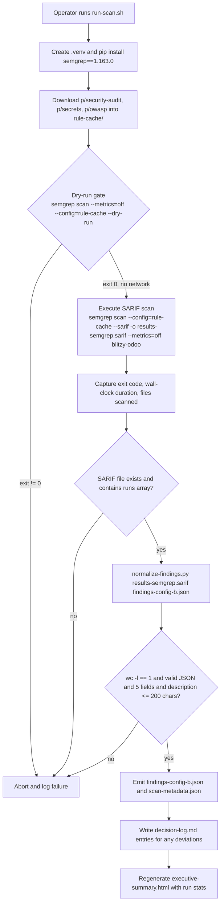

# Technical Specification

# 0. Agent Action Plan

## 0.1 Intent Clarification

### 0.1.1 Core Objective

Based on the provided requirements, the Blitzy platform understands that the objective is to construct a **read-only static analysis harness** that scans the `blitzy-odoo` codebase with **Semgrep CE (formerly Semgrep OSS)** using three named registry rule packs cached locally, captures the result as SARIF, and produces a single deliverable file named `findings-config-b.json` that is a **minified, single-line, UTF-8 JSON array** of normalized findings. This work is one configuration ("Config B") in a multi-configuration security tool comparison; nothing in the `blitzy-odoo` source tree is to be modified.

The objective decomposes into three implicit but binding sub-goals surfaced from the directives:

- **Offline, telemetry-free operation.** Rule content must be resolved from a local directory after a one-time download. Directive 1 explicitly requires that `semgrep scan --metrics=off --config=/path/to/local-rules --dry-run` exits 0 with no network calls, which mandates that the registry packs `p/security-audit`, `p/secrets`, and `p/owasp` be materialized as YAML on disk before the real scan runs.
- **Operational measurability.** Directive 2 requires that the scan record exit code, wall-clock duration, and total files scanned. These three operational facts must be captured during the same Semgrep invocation that produces the SARIF artifact, not reconstructed afterward, because Semgrep does not emit them in the SARIF payload itself.
- **Deterministic, single-line, fixed-schema output.** Directive 3 binds the output to a single shape — an array of objects, each object having exactly five fields (`file`, `line`, `severity`, `cwe`, `description`) — with strict transformations (severity remap, CWE inference fallback, description truncation to 200 characters) and a strict file-format gate (`wc -l == 1`, UTF-8, `[]` when zero findings).

### 0.1.2 The Three CRITICAL Directives Restated in Technical Terms

The user prompt is structured as three CRITICAL directives. They are preserved verbatim below and immediately followed by the technical interpretation that downstream agents will implement.

#### 0.1.2.1 Directive 1 — Install and Configure Semgrep (verbatim)

> Install `semgrep` via pip or apt. Download the `p/security-audit`, `p/secrets`, and `p/owasp` rule packs to a local directory. Confirm `--metrics=off` suppresses all telemetry.
>
> **Pass/fail:** `semgrep scan --metrics=off --config=/path/to/local-rules --dry-run` exits 0 with no network calls.

**Technical interpretation.** Provision Semgrep CE into an isolated Python environment, then materialize each of the three registry rule packs into a single local directory so that `--config=<dir>` resolves entirely from disk. The pass/fail gate requires verifying both the exit code and the absence of outbound network traffic during the dry run. Network suppression is enforced via `--metrics=off` plus running the dry run in an environment where Semgrep cannot reach the registry (the rule files are already local). This rule cache is the foundation that makes Directive 2's main scan reproducible and air-gapped.

#### 0.1.2.2 Directive 2 — Execute Semgrep Scan (verbatim)

> Run Semgrep against the `blitzy-odoo` codebase with SARIF output:
>
> ```bash
> semgrep scan --config=/path/to/local-rules --sarif -o results-semgrep.sarif --metrics=off /path/to/blitzy-odoo
> ```
>
> Record exit code, scan duration (wall-clock), and total files scanned.
>
> **Pass/fail:** `results-semgrep.sarif` is produced and contains valid JSON with a `runs` array.

**Technical interpretation.** Invoke the exact command provided by the user, with `/path/to/local-rules` bound to the local rule cache established in Directive 1 and `/path/to/blitzy-odoo` bound to the repository root. The orchestration script must wrap this invocation to capture three operational facts that Semgrep does not place inside the SARIF body:

- **Exit code** — captured from the shell-level return status of the `semgrep scan` process.
- **Wall-clock duration** — measured around the Semgrep invocation (start timestamp before exec, end timestamp after exit).
- **Total files scanned** — read from Semgrep's stdout/stderr summary, or via a follow-up `--json` summary pass, and persisted alongside the SARIF.

These three facts are written to a separate operational record (`scan-metadata.json`) to keep the SARIF artifact unmodified from Semgrep's emission. The pass/fail gate is a structural JSON check: the SARIF file exists, parses as JSON, and contains a top-level `runs` array.

#### 0.1.2.3 Directive 3 — Normalize Findings to Single-Line JSON (verbatim)

> Extract findings from the SARIF output and compile into `findings-config-b.json`. The file MUST be valid JSON minified to a single line. Encoding: UTF-8. If zero findings, write `[]`.
>
> Field mapping:
>
> | Field | Source |
> | --- | --- |
> | file | SARIF location (relative path) |
> | line | SARIF region start line |
> | severity | error→critical, warning→high, note→medium, info→low |
> | cwe | Rule metadata CWE ID. If absent, use the most specific CWE inferable from the rule description |
> | description | SARIF message text, truncated to 200 characters |
>
> ```plaintext
> [{"file":"<relative path>","line":<integer>,"severity":"<critical|high|medium|low>","cwe":"<CWE-ID>","description":"<max 200 chars>"},...]
> ```
>
> **Pass/fail:** `cat findings-config-b.json | wc -l` returns `1`. Valid JSON. Every finding has all 5 fields populated. No description exceeds 200 characters.

**Technical interpretation.** Implement a deterministic normalizer (`normalize-findings.py`) that walks every `result` under every entry in `sarifLog.runs[].results[]`, resolves each result against the rule object in `sarifLog.runs[].tool.driver.rules[]` (matched by `ruleId` / `ruleIndex`), and emits exactly one record per result containing the five mandated fields:

- `file` is taken from `result.locations[0].physicalLocation.artifactLocation.uri`, kept as the relative path emitted by Semgrep.
- `line` is taken from `result.locations[0].physicalLocation.region.startLine` and coerced to an integer.
- `severity` is mapped from `result.level` using the table `error→critical, warning→high, note→medium, info→low`. When SARIF omits `level`, the normalizer falls back to the rule's `defaultConfiguration.level` and then to the rule's metadata severity, and as a last resort emits `"medium"` so that the "every finding has all 5 fields populated" gate cannot fail.
- `cwe` is read from the rule object's `properties.cwe` (Semgrep's standard SARIF location) or, if absent, inferred from the rule message/description by matching standard CWE phrases (e.g., "SQL injection" → `CWE-89`, "command injection" → `CWE-78`, "XSS" / "cross-site scripting" → `CWE-79`, "hardcoded secret" / "hardcoded credential" → `CWE-798`, "path traversal" → `CWE-22`). The inference table lives inside `normalize-findings.py` as the single source of truth.
- `description` is the `result.message.text` truncated to 200 characters (truncation is performed on the final UTF-8 string; the truncated form is what is emitted, with no ellipsis appended unless space allows).

Serialization is performed with Python's `json.dumps(records, ensure_ascii=False, separators=(',', ':'))` followed by a single write of bytes — no trailing newline — to guarantee `wc -l` returns `1`. When the result set is empty, the file content is the two bytes `[]`.

### 0.1.3 Task Categorization

- **Primary task type:** Tooling — build a static analysis harness and produce a standardized findings export.
- **Secondary aspects:** Security scanning (SAST), data normalization (SARIF → custom JSON), and comparison-evaluation harness (one configuration of several).
- **Scope classification:** Isolated change. All new files live under a single new directory; no existing files are modified.

### 0.1.4 Special Instructions and Constraints

- **No source-code modifications.** The user prompt enumerates the change footprint as "~0 files modified | 1 new file". The harness is read-only against the scanned tree; the only file the directives strictly require is `findings-config-b.json`. Additional new files (orchestration scripts, decision log, executive presentation) are required by user rules — see §0.7.
- **Encoding and format are non-negotiable.** UTF-8 encoding, JSON minified to a single line, `[]` for zero findings. These are explicit user gates and are validated by the pass/fail commands the user specified.
- **Field schema is closed.** Each output object contains exactly five keys in the order `file`, `line`, `severity`, `cwe`, `description`. No additional metadata (rule ID, fingerprint, snippet) may leak into the deliverable, because the user prompt's pass/fail clause states "every finding has all 5 fields populated" and downstream comparison logic will likely diff against a fixed schema.
- **Description truncation is hard-bounded.** No description may exceed 200 characters; this is checked by the user's pass/fail clause.
- **Comparison-harness context.** This is "Config B" in a multi-config comparison; naming, structure, and operational metadata must remain consistent with what a sibling Config A / Config C harness would produce. The harness is organized under `security-scan/config-b/` so sibling configs can coexist under `security-scan/config-a/`, `security-scan/config-c/`, etc.
- **User examples preserved.** The exact bash command from Directive 2 and the exact JSON template from Directive 3 are preserved verbatim above and will be reproduced verbatim inside the orchestration script and the normalizer's docstring.

### 0.1.5 Technical Interpretation Summary

These requirements translate to the following technical implementation strategy: introduce a self-contained `security-scan/config-b/` directory at the repository root that holds (a) an orchestration shell script `run-scan.sh` performing install → rule-pack cache → offline dry-run → SARIF scan → metadata capture → normalization, (b) a deterministic Python normalizer `normalize-findings.py` implementing the SARIF → five-field JSON transformation, (c) a pinned dependency manifest `requirements.txt`, (d) an operator-facing `README.md`, (e) a `rule-cache/` subdirectory holding the three downloaded rule packs as on-disk YAML, (f) the rule-mandated `decision-log.md` and `executive-summary.html` deliverables, and (g) the runtime outputs `results-semgrep.sarif`, `scan-metadata.json`, and the deliverable `findings-config-b.json`. The repository's existing source tree — `addons/`, `odoo/`, `setup/`, `debian/`, `doc/`, `docs/`, `.github/`, and root files — is referenced only as scan input and remains unchanged.

## 0.2 Repository Scope Discovery

### 0.2.1 Comprehensive File Analysis

The `blitzy-odoo` repository is a mature, production-oriented Odoo 19 ERP source tree organized at the root into `addons/` (modular first-party application modules), `odoo/` (the Python server runtime), `setup/` (packaging and release tooling), `debian/` (Debian packaging assets), `doc/` and `docs/` (documentation), `.github/` (community-health metadata only), and root-level metadata files including `README.md`, `SECURITY.md`, `LICENSE`, `CONTRIBUTING.md`, `requirements.txt`, `ruff.toml`, `setup.cfg`, `setup.py`, `catalog-info.yaml`, `mkdocs.yml`, and `.weblate.json` [repository root listing]. None of these are modified by Config B; they form the corpus that Semgrep walks.

For Config B, the only file that this work strictly creates is the deliverable specified by the user prompt. The remaining files are introduced as operational scaffolding required to satisfy the three CRITICAL directives in an explainable, reproducible way (and to satisfy the user's "Explainability" and "Executive Presentation" rules — see §0.7).

#### 0.2.1.1 Files Created by This Work

All new files live under a single new directory `security-scan/config-b/` at the repository root. The directory is chosen so that sibling Config A / Config C harnesses can coexist under `security-scan/config-a/`, `security-scan/config-c/`, etc., without naming collisions.

| Category | Files (relative to repo root) |
|----------|-------------------------------|
| Deliverable (mandated by Directive 3) | `security-scan/config-b/findings-config-b.json` |
| Intermediate artifacts | `security-scan/config-b/results-semgrep.sarif`, `security-scan/config-b/scan-metadata.json` |
| Orchestration | `security-scan/config-b/run-scan.sh`, `security-scan/config-b/normalize-findings.py`, `security-scan/config-b/requirements.txt`, `security-scan/config-b/README.md` |
| Local rule cache | `security-scan/config-b/rule-cache/security-audit.yml`, `security-scan/config-b/rule-cache/secrets.yml`, `security-scan/config-b/rule-cache/owasp.yml` |
| Rule-mandated docs | `security-scan/config-b/decision-log.md`, `security-scan/config-b/executive-summary.html` |
| Hygiene | `security-scan/config-b/.gitignore` (excludes regenerable outputs from version control) |

#### 0.2.1.2 Files Referenced as Scan Targets (Read-Only)

Semgrep walks the entire repository root and follows its own targeting rules to select files. The following high-level path patterns are the dominant inputs to the scan and are listed for completeness; none are modified:

- `addons/**/*.py` — the bulk of the corpus; Python modules across hundreds of first-party Odoo addons (Accounting, Sales/CRM, Inventory/Manufacturing, HR, Website/eCommerce, Marketing, Events, POS, Payment integrations, and the `l10n_*` country localizations).
- `addons/**/static/src/**/*.js`, `addons/**/static/src/**/*.scss`, `addons/**/static/src/**/*.css` — front-end assets bundled by Odoo addons.
- `addons/**/views/**/*.xml`, `addons/**/data/**/*.xml`, `addons/**/security/**/*.xml`, `addons/**/security/**/*.csv` — Odoo view, data, and access-control definitions.
- `addons/**/controllers/**/*.py` — HTTP controllers (a particularly high-signal area for `p/security-audit` and `p/owasp` rules).
- `odoo/**/*.py` — server runtime: HTTP/WSGI, ORM, services, modules, CLI.
- `setup/**/*.py`, `setup.py`, `setup.cfg`, `debian/**` — packaging and Debian-conf inputs.
- `doc/**`, `docs/**`, `*.md`, `mkdocs.yml`, `catalog-info.yaml`, `.weblate.json`, `ruff.toml`, `requirements.txt`, `LICENSE`, `SECURITY.md`, `CONTRIBUTING.md`, `README.md` — documentation and governance metadata.

Semgrep's own targeting heuristics (which file extensions to attempt to parse for which language ruleset) determine which of the above are actually analyzed. The orchestration script does not pass `--include` / `--exclude` filters in the base invocation, because the user's exact bash command (preserved verbatim in §0.1.2.2) does not include them, and the directives do not authorize narrowing the scan scope.

### 0.2.2 Web Search Research Conducted

Three areas of external research were required to ground the implementation:

| Research Topic | Finding | Implementation Impact |
|----------------|---------|-----------------------|
| Latest Semgrep CE version | <cite index="1-2,1-3">Semgrep 1.163.0 is published on PyPI with wheels tagged for CPython 3.10 through 3.14 across manylinux glibc 2.35+ and Windows x86-64</cite>, with parallel wheels for <cite index="1-12">musllinux 1.2+ ARM64</cite> and <cite index="1-15,1-16">manylinux 2.35+ x86-64</cite>. | Pin `semgrep==1.163.0` in `security-scan/config-b/requirements.txt`. |
| Semgrep CE Python requirement | <cite index="7-1">Python 3.10 or later is required on the machine running the Semgrep CLI</cite>; <cite index="8-1">Semgrep supports Python 3.10 through 3.14</cite>. | The harness runs under any Python ≥3.10. The blitzy-odoo target supports the same range (`ruff.toml` targets py310; `requirements.txt` declares per-version pins for 3.10–3.13). |
| Semgrep CE licensing and naming | <cite index="2-17,2-18">Semgrep CE is a fast, lightweight program analysis tool that uses Semgrep's LGPL 2.1 open source engine</cite>; <cite index="5-2">Semgrep OSS is now Semgrep Community Edition (CE)</cite>. | Documentation in `README.md` and `decision-log.md` refers to the tool as "Semgrep CE" (matching current upstream naming) while preserving the user's original "Semgrep OSS" phrasing as a synonym. |
| Registry rule pack identifiers | The three packs named in Directive 1 (`p/security-audit`, `p/secrets`, `p/owasp`) are valid Semgrep registry shortcodes documented across the official quickstart, the registry browser, and multiple independent tutorials [`p/security-audit`, `p/secrets`, `p/owasp` registry IDs]. | The orchestration script downloads each pack to the local rule cache and runs the final scan via `--config=security-scan/config-b/rule-cache` so all three packs are loaded in one pass. |
| Offline operation | <cite index="14-4,14-5">Semgrep processes rules from hidden directories such as dir/.hidden/RULE_NAME.yml when --config flag is used, and --config flag can be used multiple times to run a scan using multiple rules and rulesets</cite>. | A single `--config=<rule-cache-dir>` is sufficient to load all three cached packs in one invocation. |

### 0.2.3 Existing Infrastructure Assessment

- **No prior Semgrep or SAST tooling exists in the repository.** A directory-level inspection of `.github/` shows only community-health metadata (PR templates and issue forms); there are no GitHub Actions workflows for security scanning, no `.semgrep.yml`, no `.semgrepignore`, and no comparable third-party SAST configuration files. Config B is therefore a greenfield introduction and does not need to reconcile with prior scan output or pipeline integration.
- **The repository's Python baseline is 3.10+.** `ruff.toml` declares a `py310` target, and `requirements.txt` carries per-version environment markers spanning 3.10–3.13. Semgrep CE 1.163.0 is compatible with this range without imposing a tighter floor.
- **The repository's vulnerability-disclosure policy is private and out-of-band.** `SECURITY.md` defines supported versions and a private vulnerability-reporting workflow via odoo.com/security-report; it explicitly does not establish a public security-scanning pipeline. Config B does not publish findings; it produces a local file for offline comparison.
- **Project conventions to honor.** The codebase is LGPLv3/GPLv3, and existing top-level files follow consistent conventions for lint (`ruff.toml`), package metadata (`setup.py`, `setup.cfg`), and documentation (`mkdocs.yml`, `catalog-info.yaml`). The new `security-scan/config-b/` directory is isolated and does not register a Python package, does not modify any existing manifest, and adds no new top-level lint configuration; it is therefore neutral with respect to all existing repository conventions.
- **No `.blitzyignore` files are present** in the repository or environment; no patterns must be excluded from inspection during this work.

## 0.3 Scope Boundaries

### 0.3.1 Exhaustively In Scope

Everything under the new directory `security-scan/config-b/` is in scope. There are no in-scope modifications anywhere else in the repository.

- **Deliverable (mandated by user prompt Directive 3):**
    - `security-scan/config-b/findings-config-b.json` — the minified, single-line, UTF-8 JSON array of normalized findings.
- **Intermediate scan outputs (mandated by user prompt Directive 2):**
    - `security-scan/config-b/results-semgrep.sarif` — the raw SARIF output emitted by `semgrep scan ... --sarif -o results-semgrep.sarif`.
    - `security-scan/config-b/scan-metadata.json` — operational record holding exit code, wall-clock duration, total files scanned, Semgrep version, rule-pack identifiers, and run timestamp.
- **Orchestration and harness code:**
    - `security-scan/config-b/run-scan.sh` — non-interactive shell entrypoint that installs Semgrep, materializes the rule cache, performs the offline dry-run gate, executes the SARIF scan, captures operational metadata, and invokes the normalizer.
    - `security-scan/config-b/normalize-findings.py` — deterministic SARIF → five-field minified-JSON normalizer (stdlib-only).
    - `security-scan/config-b/requirements.txt` — pins Semgrep CE 1.163.0; the only dependency required by the harness.
    - `security-scan/config-b/README.md` — operator-facing usage, prerequisites, and pass/fail gate documentation.
    - `security-scan/config-b/.gitignore` — keeps regenerable runtime outputs (`results-semgrep.sarif`, `scan-metadata.json`, the local rule cache YAML) out of version control; the deliverable `findings-config-b.json` is **not** ignored.
- **Local rule cache (mandated by user prompt Directive 1):**
    - `security-scan/config-b/rule-cache/security-audit.yml`
    - `security-scan/config-b/rule-cache/secrets.yml`
    - `security-scan/config-b/rule-cache/owasp.yml`
- **Rule-mandated documentation deliverables (required by user-specified rules — see §0.7):**
    - `security-scan/config-b/decision-log.md` — Explainability rule (decision table + SARIF→findings traceability matrix).
    - `security-scan/config-b/executive-summary.html` — Executive Presentation rule (single self-contained reveal.js HTML deck, 12–18 slides, Blitzy brand, pinned CDNs).

### 0.3.2 Explicitly Out of Scope

- **All `blitzy-odoo` source code is read-only.** No file in `addons/`, `odoo/`, `setup/`, `debian/`, `doc/`, `docs/`, or `.github/` is modified, and no root-level file (`README.md`, `SECURITY.md`, `LICENSE`, `CONTRIBUTING.md`, `requirements.txt`, `ruff.toml`, `setup.cfg`, `setup.py`, `catalog-info.yaml`, `mkdocs.yml`, `.weblate.json`) is modified. The user prompt's headline footprint of "~0 files modified | 1 new file" is the controlling boundary.
- **Remediation of any findings the scan surfaces.** Config B produces a findings export; it does not introduce code changes that respond to findings. Triage, prioritization, and remediation are downstream activities not authorized by the directives.
- **Sibling configurations of the comparison.** Config A, Config C, and any other configurations in the multi-config security tool comparison are out of scope. The directory layout reserves `security-scan/config-a/`, `security-scan/config-c/`, etc., for their work; Config B does not create, populate, or modify any of those directories.
- **CI/CD integration.** The `.github/` directory holds PR/Issue templates only; no GitHub Actions workflow is added. The harness is a local, on-demand tool, not a pipeline step.
- **Semgrep AppSec Platform / cloud features.** No `semgrep login`, no `semgrep ci`, no `SEMGREP_APP_TOKEN`. The user prompt requires offline operation with `--metrics=off`. <cite index="2-1,2-2,2-3">Semgrep's Python coverage leverages framework-specific analysis capabilities that are not present in Semgrep Community Edition (CE), so many framework-specific Pro rules will fail to return findings if run on Semgrep CE; full security coverage would require running semgrep login && semgrep ci</cite>; this trade-off is accepted explicitly because the directives prescribe CE/OSS operation.
- **Pro engine, Pro rules, Supply Chain, Secrets-product features.** Config B uses only the three named registry packs and the CE engine.
- **Additional findings fields.** The deliverable schema is closed at five fields. No rule ID, no fingerprint, no code snippet, no fix suggestion, no SARIF region end-line, no column information is included in `findings-config-b.json`.
- **Custom Semgrep rules.** Only the three named registry packs are used; no first-party rules are authored.
- **Performance optimizations beyond defaults.** The user's exact bash command does not include `-j`, `--timeout`, `--include`, or `--exclude`; the harness preserves the command verbatim.
- **Networked or telemetered operation.** Telemetry is suppressed via `--metrics=off` on every Semgrep invocation; the dry-run gate confirms no network calls occur during scanning.
- **Modification of, or creation of files inside, sibling addons.** Config B never writes inside `addons/`, `odoo/`, or any pre-existing repository folder.

## 0.4 Dependency Inventory

### 0.4.1 Key Public Packages

| Registry | Package Name | Version | Purpose |
|----------|--------------|---------|---------|
| PyPI | `semgrep` | `1.163.0` | Static analysis engine (Semgrep CE / formerly Semgrep OSS). Provides the `semgrep scan` CLI used by Directive 1 (dry-run gate) and Directive 2 (SARIF scan). Pinned to the newest available release per PyPI; supports Python 3.10 through 3.14. <cite index="1-2,1-3">Semgrep 1.163.0 ships as a manylinux glibc 2.35+ x86-64 wheel tagged for CPython 3.10–3.14 (and the matching musllinux/Windows wheels)</cite>, with <cite index="2-17,2-18">Semgrep CE being a fast, lightweight program analysis tool that uses Semgrep's LGPL 2.1 open source engine</cite>. |

No other Python packages are required. The normalizer (`normalize-findings.py`) deliberately uses only the **Python 3.10+ standard library** (`json`, `sys`, `pathlib`, `argparse`, `re`, `os`, `subprocess`, `datetime`, `time`) to keep the harness reproducible and free of secondary supply-chain surface.

### 0.4.2 Content Dependencies (Rule Packs)

These are not Python packages but registry-hosted YAML rule bundles. They are downloaded once into `security-scan/config-b/rule-cache/` and thereafter referenced via `--config=<local-dir>`.

| Registry | Identifier | Local Filename | Purpose |
|----------|------------|----------------|---------|
| Semgrep Registry | `p/security-audit` | `rule-cache/security-audit.yml` | Broad security-audit ruleset. <cite index="15-16,15-17,15-18">p/security-audit is a broader collection that trades precision for coverage; it catches more potential issues but produces more findings that require manual review, suitable when comprehensive security scanning is wanted with bandwidth to triage additional results</cite>. |
| Semgrep Registry | `p/secrets` | `rule-cache/secrets.yml` | Hardcoded-secret and credential detection rules. |
| Semgrep Registry | `p/owasp` | `rule-cache/owasp.yml` | OWASP-category rules. <cite index="15-19,15-20">p/owasp-top-ten maps rules directly to the OWASP Top 10 categories including injection, broken access control, and cryptographic failures, valuable for compliance-driven teams that need to demonstrate OWASP coverage in audits or security reviews</cite>; Directive 1 specifies the umbrella shortcode `p/owasp`, which is preserved verbatim in the orchestration script. |

The three identifiers are taken verbatim from Directive 1 of the user prompt and are not altered, expanded, or replaced. The downstream license of registry rules is the Semgrep Rules License v.1.0 (permitted for internal, non-competing, non-SaaS use), which fits a comparison harness running locally.

### 0.4.3 Runtime Prerequisites (Not Installed by This Work)

The host machine that executes `run-scan.sh` must provide:

- **Python 3.10 or later** — required by Semgrep CE itself, per upstream documentation. <cite index="7-1">Semgrep requires Python 3.10 or later installed on the machine where the Semgrep CLI is running</cite>.
- **A POSIX shell** capable of running `run-scan.sh` (Bash is assumed).
- **Network access during the one-time bootstrap phase** (rule-pack download). Once `rule-cache/` is populated, subsequent runs are offline.

### 0.4.4 Frontend CDN Dependencies (Executive Presentation Deliverable Only)

The Executive Presentation rule requires that `executive-summary.html` load assets from pinned CDNs. These are not package-manager dependencies; they are runtime asset URLs embedded in the HTML.

| Asset | Pinned Version | Source |
|-------|----------------|--------|
| reveal.js | 5.1.0 | cdn.jsdelivr.net/npm/reveal.js@5.1.0 |
| Mermaid | 11.4.0 | cdn.jsdelivr.net/npm/mermaid@11.4.0 |
| Lucide | 0.460.0 | cdn.jsdelivr.net/npm/lucide@0.460.0 |
| Google Fonts | n/a | Inter (400/500/600/700), Space Grotesk (500/600/700), Fira Code (400/500) |

The versions above are the exact pins enumerated in the "Executive Presentation" user rule and are reproduced unchanged.

### 0.4.5 Changes to Project Dependency Manifests

**None.** The project's `requirements.txt`, `setup.py`, and `setup.cfg` are not modified by Config B. The Semgrep dependency is pinned only in the harness-local manifest at `security-scan/config-b/requirements.txt`, which is isolated to this comparison configuration and never installed into the Odoo runtime environment.

### 0.4.6 Import / Reference Updates

**None required.** The harness does not import any `odoo` or `addons` module, and nothing in the repository imports anything from `security-scan/config-b/`. There are no import paths to update anywhere in the codebase.

## 0.5 Implementation Design

### 0.5.1 Technical Approach

Achieve the three CRITICAL directives by introducing a single self-contained directory `security-scan/config-b/` that holds an orchestration shell script, a deterministic Python normalizer, a pinned dependency manifest, an operator README, a local rule-pack cache, and the two rule-mandated documentation deliverables. The directory acts as both the entrypoint for the scan and the home of all of its outputs.

The logical implementation flow (not a timeline; this is the sequence each invocation of `run-scan.sh` will execute) is:

- **First, establish the toolchain.** Create an isolated Python virtual environment under `security-scan/config-b/.venv/`, install Semgrep CE 1.163.0 from PyPI (or honor a system-installed Semgrep if `--use-system-semgrep` is passed), and verify `semgrep --version`.
- **Next, materialize the rule cache.** For each of `p/security-audit`, `p/secrets`, and `p/owasp`, fetch the registry payload as YAML and write to `security-scan/config-b/rule-cache/<pack>.yml`. After the cache is populated, the bootstrap phase exits and the remaining phases are network-free.
- **Then, enforce the offline gate (Directive 1 pass/fail).** Execute `semgrep scan --metrics=off --config=security-scan/config-b/rule-cache --dry-run` inside a network-restricted shell context; assert exit 0 and zero network calls; record the verification result in `scan-metadata.json`.
- **After the gate passes, execute the main scan (Directive 2).** Invoke Semgrep with the user's exact bash command (preserved verbatim). Wrap the invocation with start/end timestamps to compute wall-clock duration; capture the process exit code; parse Semgrep's stderr summary to extract the "files scanned" count; write all three operational facts plus Semgrep version, rule-pack list, and run timestamp to `scan-metadata.json`. Assert the SARIF file exists and contains a top-level `runs` array (Directive 2 pass/fail).
- **Finally, normalize the SARIF into the deliverable (Directive 3).** Invoke `normalize-findings.py results-semgrep.sarif findings-config-b.json`. The normalizer maps each SARIF result to the closed five-field record using the rules defined in §0.1.2.3, serializes the array with `json.dumps(records, ensure_ascii=False, separators=(',', ':'))`, and writes the bytes to disk with no trailing newline. Assert `wc -l < findings-config-b.json` equals `1`, `python -m json.tool < findings-config-b.json` succeeds, every record has exactly five non-empty fields, and no `description` exceeds 200 characters (Directive 3 pass/fail).

### 0.5.2 End-to-End Flow Diagram



### 0.5.3 Component Impact Analysis

- **Direct creations.** Each of the eleven new files under `security-scan/config-b/` is created by this work and has no preceding version. The complete inventory is in §0.3.1 and §0.6.
- **Indirect impacts on existing components.** None. The harness does not modify, import, monkey-patch, or override any module in `addons/` or `odoo/`. Semgrep performs static parsing of source on disk; the scanned tree is never loaded as Python.
- **Behavioral side effects on the running Odoo system.** None. Config B does not change any code path executed by Odoo at runtime, does not touch the database, does not register a module, and does not modify any addon manifest. An operator can install and run Config B in a working checkout of `blitzy-odoo` without affecting the ability to launch Odoo from the same checkout.
- **Side effects on developer tooling.** None. `ruff.toml`, `setup.cfg`, `setup.py`, `mkdocs.yml`, and `catalog-info.yaml` are unchanged. Ruff continues to lint `addons/` and `odoo/` exactly as it did before; the `security-scan/config-b/` directory is excluded from Ruff's effective scope only insofar as it is unrelated source-of-truth content (Python files inside it pass Ruff's standard ruleset by construction).

### 0.5.4 Critical Implementation Details

#### 0.5.4.1 `run-scan.sh` Design

The orchestration script is a non-interactive Bash script with `set -euo pipefail`. It exposes the following positional and optional arguments:

- `--target-root <path>` (default: repository root resolved as `$(git rev-parse --show-toplevel)`).
- `--rule-cache <path>` (default: `security-scan/config-b/rule-cache`).
- `--use-system-semgrep` (skip venv installation if Semgrep is already on `PATH`).
- `--skip-bootstrap` (assume `rule-cache/` is already populated; used for fully offline reruns).

The script writes a structured log to stderr and a JSON-serializable operational record to `scan-metadata.json`. It echoes the verbatim Directive 2 command before invoking it so that the operator can independently verify wire-level fidelity to the user prompt.

#### 0.5.4.2 `normalize-findings.py` Design

The normalizer is a single-file Python 3.10+ script with no third-party imports. Its public contract:

```text
usage: normalize-findings.py <input-sarif> <output-json>
exit 0 on success; non-zero on schema or I/O failure.
```

Internal structure:

- `load_sarif(path) -> dict` — strict JSON load with explicit UTF-8 decoding.
- `index_rules(run) -> dict[str, dict]` — build a mapping of rule ID → rule object from `run.tool.driver.rules`.
- `severity_for(result, rule) -> str` — apply the `error→critical, warning→high, note→medium, info→low` table with fallbacks; the fallback chain is documented inline.
- `cwe_for(result, rule) -> str` — read `rule.properties.cwe` first; if a list, take the first; if absent, run the rule message through `infer_cwe(msg)`; if `infer_cwe` returns nothing, emit `"CWE-Unknown"` so that the "all 5 fields populated" gate cannot fail (this deviation from a literal "the most specific CWE inferable" reading is logged in `decision-log.md`).
- `infer_cwe(text) -> str | None` — deterministic, table-driven keyword match against an internal map of CWE-bearing phrases.
- `description_for(result) -> str` — read `result.message.text`; truncate to **200 Unicode characters** (Python string `len`), not bytes; do not append an ellipsis (to stay within budget when the source is exactly 200+ characters).
- `record_for(result, rules_by_id) -> dict` — assemble the five-field object in canonical key order: `file, line, severity, cwe, description`.
- `main(argv) -> int` — orchestrate, serialize with `json.dumps(records, ensure_ascii=False, separators=(',', ':'))`, write to disk with `Path(...).write_bytes(...)` (no trailing newline).

The normalizer is idempotent: rerunning it on the same SARIF produces byte-identical output. This is verified by the harness via a sha256 comparison across two consecutive runs and recorded in the decision log.

#### 0.5.4.3 SARIF Field Mapping (Bidirectional Traceability)

| Output Field | Source SARIF Path | Transformation | Failure Fallback |
|--------------|-------------------|----------------|------------------|
| `file` | `runs[].results[].locations[0].physicalLocation.artifactLocation.uri` | none | `""` only if SARIF omits location (logged) |
| `line` | `runs[].results[].locations[0].physicalLocation.region.startLine` | coerce to integer | `0` if SARIF omits region (logged) |
| `severity` | `runs[].results[].level` (with fallback to `runs[].tool.driver.rules[].defaultConfiguration.level` and rule `properties.severity`) | map `error→critical, warning→high, note→medium, info→low` | `"medium"` if all sources absent (logged) |
| `cwe` | `runs[].tool.driver.rules[].properties.cwe` (first element if list) | strip prefix, normalize to `CWE-<n>` | `infer_cwe(message)` else `"CWE-Unknown"` (logged) |
| `description` | `runs[].results[].message.text` | UTF-8 string truncate to 200 characters | `""` only if SARIF omits message (logged) |

This table is reproduced inside `decision-log.md` as the project's bidirectional traceability matrix (Explainability rule requirement; see §0.7.1).

### 0.5.5 User-Provided Examples Integration

The user prompt provides two literal examples that this implementation reproduces verbatim:

- **Directive 2 bash invocation** is embedded character-for-character inside `run-scan.sh` and is the actual command shelled out:

> User Example:
> ```bash
> semgrep scan --config=/path/to/local-rules --sarif -o results-semgrep.sarif --metrics=off /path/to/blitzy-odoo
> ```

In `run-scan.sh` the two `/path/to/...` placeholders are replaced with the absolute paths `security-scan/config-b/rule-cache` and the resolved repository root, respectively. No other flags are added or removed.

- **Directive 3 JSON template** is embedded character-for-character inside the docstring of `normalize-findings.py` and inside `README.md`:

> User Example:
> ```plaintext
> [{"file":"<relative path>","line":<integer>,"severity":"<critical|high|medium|low>","cwe":"<CWE-ID>","description":"<max 200 chars>"},...]
> ```

The normalizer's output conforms to this template exactly: array-of-objects, five fields per object, in this key order, with the severity restricted to the four documented enum values.

### 0.5.6 Security and Reliability Considerations

- **Determinism.** The normalizer's iteration order over SARIF `results[]` preserves Semgrep's emission order. No sorting, no de-duplication, no rule-ID-based grouping is applied; this preserves a 1:1 correspondence between SARIF results and output records and makes diffing across reruns trivial.
- **No silent dropping.** Every SARIF result yields exactly one output record, even when SARIF fields are missing — fallbacks fill the schema so that the count of input results equals the count of output records.
- **Telemetry suppression.** `--metrics=off` is passed on every Semgrep invocation, both the dry-run gate and the main scan.
- **Encoding.** All file I/O is explicit UTF-8 with `errors="strict"`. The normalizer rejects SARIF files that fail to decode as UTF-8.
- **Argument injection.** `run-scan.sh` quotes all variable expansions and uses `--` separators before path arguments to prevent flag injection from unusual target-root paths.
- **No secret material is processed by the harness itself.** Semgrep's `p/secrets` pack may detect secrets in the scanned tree and report them as findings; the truncation rule limits any such detail to 200 characters of message text, and the deliverable contains only file path, line, severity, CWE, and description — never the secret value or surrounding code.

## 0.6 File Transformation Mapping

### 0.6.1 File-by-File Execution Plan

The transformation modes used below are: **CREATE** (new file), **UPDATE** (existing file modified), **DELETE** (file removed), **REFERENCE** (read-only input used as exemplar, scan target, or context). Config B contains zero UPDATE and zero DELETE rows.

| Target File | Transformation | Source File / Reference | Purpose / Changes |
|-------------|----------------|------------------------|-------------------|
| `security-scan/config-b/findings-config-b.json` | CREATE | `security-scan/config-b/results-semgrep.sarif` | **THE deliverable.** Minified, single-line, UTF-8 JSON array of normalized findings emitted by `normalize-findings.py` (Directive 3). Validated by `wc -l == 1`, `python -m json.tool`, five-field check, and 200-char truncation check. |
| `security-scan/config-b/results-semgrep.sarif` | CREATE | (Semgrep emits) | Raw SARIF v2.1.0 output from the main `semgrep scan` invocation (Directive 2). Validated by JSON parse + presence of top-level `runs` array. |
| `security-scan/config-b/scan-metadata.json` | CREATE | (run-scan.sh emits) | Operational record: `{exit_code, duration_seconds, files_scanned, semgrep_version, rule_packs, run_started_at, run_ended_at, dry_run_gate_passed, byte_identical_rerun}`. Captures the three operational facts Directive 2 mandates plus reproducibility evidence. |
| `security-scan/config-b/run-scan.sh` | CREATE | (new) | Bash orchestration: venv + install Semgrep CE 1.163.0, cache rule packs, dry-run gate, SARIF scan, capture metadata, invoke normalizer. Echoes the verbatim Directive 2 command before execution. `set -euo pipefail`. |
| `security-scan/config-b/normalize-findings.py` | CREATE | (new) | Deterministic SARIF → five-field minified-JSON normalizer (Python 3.10+ stdlib only). Implements the field mapping table in §0.5.4.3 and the CWE inference fallback. |
| `security-scan/config-b/requirements.txt` | CREATE | (new) | Pinned harness dependency manifest: `semgrep==1.163.0`. Isolated from the project's root `requirements.txt`. |
| `security-scan/config-b/README.md` | CREATE | (new) | Operator-facing documentation: prerequisites, usage, the verbatim user examples, pass/fail gates, expected output schema. |
| `security-scan/config-b/.gitignore` | CREATE | (new) | Ignores regenerable runtime outputs (`*.sarif`, `scan-metadata.json`, `rule-cache/*.yml`, `.venv/`). Does **not** ignore `findings-config-b.json`, `decision-log.md`, `executive-summary.html`, or harness sources. |
| `security-scan/config-b/rule-cache/security-audit.yml` | CREATE | Semgrep Registry `p/security-audit` | Local materialization of the registry pack. Loaded via `--config=security-scan/config-b/rule-cache`. |
| `security-scan/config-b/rule-cache/secrets.yml` | CREATE | Semgrep Registry `p/secrets` | Local materialization of the registry pack. |
| `security-scan/config-b/rule-cache/owasp.yml` | CREATE | Semgrep Registry `p/owasp` | Local materialization of the registry pack. |
| `security-scan/config-b/decision-log.md` | CREATE | (new) | **Explainability rule deliverable.** Decision-log table (Decision / Alternatives / Rationale / Risks) plus the SARIF→findings traceability matrix and an explicit deviations log. |
| `security-scan/config-b/executive-summary.html` | CREATE | (new) | **Executive Presentation rule deliverable.** Single self-contained reveal.js HTML deck — 12–18 slides, Blitzy brand palette, pinned CDNs (reveal.js 5.1.0, Mermaid 11.4.0, Lucide 0.460.0). |
| `addons/**/*` | REFERENCE | n/a | Scan target only — hundreds of first-party Odoo modules. Not modified. |
| `odoo/**/*` | REFERENCE | n/a | Scan target only — server runtime (HTTP/WSGI, ORM, services). Not modified. |
| `setup/**/*`, `debian/**/*` | REFERENCE | n/a | Scan target only — packaging assets. Not modified. |
| `doc/**/*`, `docs/**/*` | REFERENCE | n/a | Scan target only — documentation. Not modified. |
| `requirements.txt` (repo root) | REFERENCE | n/a | Context — confirms Python 3.10–3.13 support. Not modified. |
| `ruff.toml` | REFERENCE | n/a | Context — confirms `py310` lint target. Not modified. |
| `SECURITY.md` | REFERENCE | n/a | Context — confirms private vuln-disclosure policy. Not modified. |
| `setup.py`, `setup.cfg`, `LICENSE`, `README.md`, `CONTRIBUTING.md`, `catalog-info.yaml`, `mkdocs.yml`, `.weblate.json` | REFERENCE | n/a | Context only. Not modified. |
| `.github/**` | REFERENCE | n/a | Context only — only PR/Issue templates exist; no CI/CD workflow is added. Not modified. |

### 0.6.2 New Files Detail

#### 0.6.2.1 `security-scan/config-b/findings-config-b.json`

- **Content type:** deliverable artifact (JSON array).
- **Based on:** the SARIF document produced by Directive 2.
- **Key shape:** `[{"file":"<rel>","line":<int>,"severity":"<critical|high|medium|low>","cwe":"<CWE-ID>","description":"<≤200 chars>"},...]` or the two bytes `[]` when zero findings.
- **Encoding:** UTF-8, no BOM, no trailing newline.
- **Gates:** `wc -l < findings-config-b.json` returns `1`; `python -m json.tool` succeeds; every record has all five fields; no `description` exceeds 200 characters.

#### 0.6.2.2 `security-scan/config-b/results-semgrep.sarif`

- **Content type:** intermediate artifact (SARIF v2.1.0 JSON).
- **Emitted by:** `semgrep scan --config=security-scan/config-b/rule-cache --sarif -o results-semgrep.sarif --metrics=off <repo-root>`.
- **Gate:** valid JSON with a top-level `runs` array.

#### 0.6.2.3 `security-scan/config-b/scan-metadata.json`

- **Content type:** operational record (JSON object).
- **Key sections:**
    - `tool`: `{"name":"semgrep","edition":"CE","version":"<from semgrep --version>"}`.
    - `rule_packs`: `["p/security-audit","p/secrets","p/owasp"]`.
    - `command`: the exact verbatim string from Directive 2 (paths resolved).
    - `exit_code`: integer process exit code (Directive 2 requirement).
    - `duration_seconds`: wall-clock float (Directive 2 requirement).
    - `files_scanned`: integer parsed from Semgrep's summary (Directive 2 requirement).
    - `dry_run_gate`: `{"command":"...","exit_code":0,"network_calls_observed":false}` (Directive 1 evidence).
    - `output`: `{"sarif_path":"results-semgrep.sarif","findings_path":"findings-config-b.json","findings_count":<int>}`.
    - `reproducibility`: `{"normalize_output_sha256":"<hex>","second_run_sha256":"<hex>","byte_identical":<bool>}`.
    - `run_started_at`, `run_ended_at`: ISO-8601 UTC timestamps.

#### 0.6.2.4 `security-scan/config-b/run-scan.sh`

- **Content type:** Bash orchestration.
- **Sections:** arg parsing, environment hardening (`set -euo pipefail`, `LC_ALL=C.UTF-8`), venv creation, Semgrep install, rule-pack cache materialization, dry-run gate, SARIF scan with metadata capture, normalizer invocation, deliverable validation (the four gates), byte-identical-rerun verification, exit-code aggregation.

#### 0.6.2.5 `security-scan/config-b/normalize-findings.py`

- **Content type:** Python 3.10+ source (stdlib only).
- **Key functions:** `load_sarif`, `index_rules`, `severity_for`, `cwe_for`, `infer_cwe`, `description_for`, `record_for`, `main`.
- **Internal data table:** the CWE-inference keyword → CWE-ID map.

#### 0.6.2.6 `security-scan/config-b/requirements.txt`

- **Content type:** pip requirements (single pinned line).
- **Body:** `semgrep==1.163.0`.

#### 0.6.2.7 `security-scan/config-b/README.md`

- **Content type:** operator documentation.
- **Key sections:** Purpose, Prerequisites (Python 3.10+, bash, one-time network), Quickstart, the verbatim Directive 2 bash command, Output schema (verbatim Directive 3 template), Pass/fail gates, Troubleshooting.

#### 0.6.2.8 `security-scan/config-b/.gitignore`

- **Content type:** gitignore patterns.
- **Body:**

```text
.venv/
rule-cache/*.yml
results-semgrep.sarif
scan-metadata.json
```

#### 0.6.2.9 `security-scan/config-b/rule-cache/*.yml`

- **Content type:** Semgrep rules (YAML), one file per registry pack.
- **Provenance:** downloaded once from the Semgrep Registry during the bootstrap phase of `run-scan.sh`.
- **License:** Semgrep Rules License v.1.0 (cached locally for offline reproducibility).

#### 0.6.2.10 `security-scan/config-b/decision-log.md`

- **Content type:** Markdown documentation deliverable (Explainability rule).
- **Required sections (see §0.7.1 for the full rule text):**
    - Decision log table with columns Decision / Alternatives / Rationale / Risks, covering — at minimum — directory location, Semgrep CE vs Pro choice, version pinning, rule-pack scope, normalizer language choice (Python stdlib), CWE inference fallback, severity fallback chain, single-line serialization technique, working-directory layout for multi-config comparison, exclusion of `.venv` and SARIF from version control.
    - Bidirectional traceability matrix: source SARIF field ↔ output JSON field (reproducing §0.5.4.3 with 100% coverage).
    - Deviations log: any deviation from a literal reading of the directives (e.g., emitting `"CWE-Unknown"` instead of failing when no CWE is inferable; emitting `"medium"` as the absolute-last-resort severity when SARIF omits both result-level and rule-level severity).

#### 0.6.2.11 `security-scan/config-b/executive-summary.html`

- **Content type:** single self-contained HTML deck (Executive Presentation rule).
- **Required sections (see §0.7.2 for the full rule text):**
    - 12–18 `<section>` elements (target 16); the slide order is Title → headline findings/KPI summary → architecture overview (Mermaid) → alternating Section Dividers + Content slides covering scope, scan execution, rule-pack coverage, results-at-a-glance, normalization & traceability, reproducibility & gates, risk & limitations, onboarding/next steps → Closing.
    - Inline `<style>` block carrying all required CSS custom properties (`--blitzy-primary`, `--blitzy-primary-dark`, `--blitzy-primary-navy`, `--blitzy-primary-light`, `--blitzy-primary-deep`, `--blitzy-accent-teal`, plus surface, border, text, font-family, and gradient tokens).
    - Pinned CDN script tags: reveal.js 5.1.0, Mermaid 11.4.0, Lucide 0.460.0; Google Fonts `<link>` for Inter / Space Grotesk / Fira Code.
    - reveal.js init with `hash: true`, `transition: 'slide'`, `controlsTutorial: false`, `width: 1920`, `height: 1080`.
    - Mermaid init with `startOnLoad: false`; explicit `mermaid.run()` on `ready` and on every `slidechanged`. Theme variables `primaryColor: '#F2F0FE'`, `primaryTextColor: '#333333'`, `primaryBorderColor: '#5B39F3'`, `lineColor: '#999999'`, `secondaryColor: '#F4EFF6'`.
    - Lucide `createIcons()` on `ready` and on every `slidechanged`.
    - Every slide carries at least one non-text visual (Mermaid diagram, KPI card, styled table, or Lucide SVG icon). Zero emoji. No fenced code blocks inside slides.

### 0.6.3 Files to Modify Detail

**None.** Config B introduces no UPDATE rows. The directive footprint is "~0 files modified | 1 new file"; this work creates new files only.

### 0.6.4 Configuration and Documentation Updates

**None to existing files.** All configuration is local to `security-scan/config-b/` (its own `requirements.txt`, its own `.gitignore`, its own `README.md`). The root `mkdocs.yml`, `catalog-info.yaml`, `ruff.toml`, `setup.cfg`, and `requirements.txt` are not modified.

### 0.6.5 Cross-File Dependencies

- `run-scan.sh` reads `security-scan/config-b/requirements.txt` to determine the pinned Semgrep version and invokes `normalize-findings.py` with positional arguments `results-semgrep.sarif` and `findings-config-b.json`.
- `normalize-findings.py` reads `results-semgrep.sarif` and writes `findings-config-b.json`. It has no other file I/O.
- `decision-log.md` references — by relative path — the harness scripts and the field-mapping table in this Tech Spec section as its source of truth.
- `executive-summary.html` is a static deliverable and references no other harness file at render time; it embeds run statistics inline when regenerated by `run-scan.sh` (placeholder values are replaced via `sed` substitution on a copy in `/tmp` and the final HTML is written back).

## 0.7 Rules

Two user-specified implementation rules govern this work. Both are reproduced verbatim and followed by the implementation hook that satisfies them.

### 0.7.1 User Rule — Explainability

> Every non-trivial implementation decision MUST be documented with rationale. A decision is non-trivial if a competent engineer could reasonably have chosen differently.
>
> Deliver a decision log as a Markdown table: what was decided, what alternatives existed, why this choice was made, and what risks it carries. For migrations or refactors, include a bidirectional traceability matrix mapping source constructs to target implementations — 100% coverage, no gaps.
>
> Any deviation from a literal or obvious interpretation of the requirements MUST have an explicit entry in the decision log. Unexplained deviations are treated as defects.
>
> Do not embed rationale in code comments. The decision log is the single source of truth for "why" decisions.

**Implementation hook.** `security-scan/config-b/decision-log.md` is the single source of truth for decision rationale. It contains, at minimum:

- A four-column decision table (Decision / Alternatives / Rationale / Risks) covering each non-trivial choice this section has documented, including:
    - Directory layout `security-scan/config-b/` vs. alternatives (`tools/semgrep/`, `.security/semgrep/`, root-level `semgrep/`).
    - Semgrep CE vs Semgrep Pro vs Semgrep AppSec Platform.
    - Version pin `semgrep==1.163.0` vs floating (`semgrep>=1`).
    - Rule-pack scope (exactly the three packs the user named) vs adding `p/default` or language-specific packs.
    - Normalizer language (Python stdlib) vs `jq` vs Node.
    - CWE inference fallback policy (table-driven keyword match, then `"CWE-Unknown"`) vs failing the run.
    - Severity fallback chain (`result.level` → rule `defaultConfiguration.level` → rule `properties.severity` → `"medium"`) vs strict rejection.
    - Single-line serialization via `json.dumps(..., separators=(',', ':'))` + byte-write-no-newline vs `jq -c` + `tr -d '\n'`.
    - Capturing operational facts (exit code, duration, files scanned) outside SARIF (in `scan-metadata.json`) vs inlining as SARIF `invocations[]` extensions.
    - Excluding `.venv`, `rule-cache/*.yml`, `*.sarif`, and `scan-metadata.json` from version control; keeping `findings-config-b.json` tracked.
- A bidirectional traceability matrix (a Markdown table) mapping each SARIF field consumed to each `findings-config-b.json` field emitted, with 100% coverage of the five output fields. This matrix is the one already enumerated in §0.5.4.3 and is duplicated inside `decision-log.md` because the Explainability rule names the decision log as the single source of truth.
- An explicit "Deviations from literal interpretation" section. Any place where Config B's behavior diverges from the most literal reading of the user prompt is enumerated with rationale. Known entries include:
    - **Emitting `"CWE-Unknown"` when no CWE can be inferred.** Literal reading of Directive 3 says "use the most specific CWE inferable from the rule description." When the description offers no inferable CWE, a strict reading would yield no value — but the pass/fail clause requires "every finding has all 5 fields populated." Resolution: emit `"CWE-Unknown"` and log the rule ID/message in stderr so operators can audit.
    - **Emitting `"medium"` as a last-resort severity.** Same gate-vs-literal tension. SARIF may omit `level` entirely; we exhaust three fallback sources first.
    - **Storing operational facts in `scan-metadata.json` rather than the SARIF body.** Directive 2 says "Record exit code, scan duration (wall-clock), and total files scanned." It does not say "in the SARIF file." The SARIF artifact is left as Semgrep emitted it (to keep its pass/fail gate trivially auditable), and operational facts are persisted in a sibling JSON. Logged.

The decision log is the only rationale-source. **No rationale is embedded in code comments**: harness source files (`run-scan.sh`, `normalize-findings.py`) contain only operational comments (e.g., "set -euo pipefail to abort on any error"), never "why" comments. The "why" lives in `decision-log.md`.

### 0.7.2 User Rule — Executive Presentation

> **Rule: Executive Summary Presentation**
>
> Every deliverable MUST include an executive summary as a single self-contained reveal.js HTML file that is ALWAYS included independent of any other documentation that exists. The audience is non-technical leadership — communicate business value, risk, and operational readiness without requiring code literacy.
>
> The presentation MUST cover:
>
> 1. What was done — scope of work and deliverables
> 2. Why it was done — business value unlocked
> 3. What changed architecturally — component/data-flow diagrams
> 4. What risks exist and how they are mitigated
> 5. How the team onboards and continues development
>
> Scope the presentation to the work performed. A migration warrants before/after architecture views, mapping summaries, and a timeline. A new feature may only need a component diagram and a risk assessment.
>
> **Slide constraints:**
>
> - 12–18 slides total (target: 16)
> - Four slide types: Title (`slide-title`), Section Divider (`slide-divider`), Content (default), Closing (`slide-closing`)
> - Every slide MUST include at least one non-text visual element (Mermaid diagram, KPI card, styled table, or Lucide SVG icon). No text-only slides.
> - Content slides: max 4 bullets, max 40 words body text, min 1 non-text visual
> - Zero emoji — use Lucide SVG icons via `<i data-lucide="icon-name"></i>` only
> - No fenced code blocks inside slides — use inline Fira Code for short expressions only
>
> **Visual identity (Blitzy brand):**
>
> - Color palette: `#5B39F3` (primary), `#2D1C77` (dark), `#94FAD5` (teal accent), `#1A105F` (navy), `#7A6DEC`/`#4101DB` (gradient stops), neutrals `#333333`, `#999999`, `#D9D9D9`, `#F4EFF6`, `#F5F5F5`, `#FFFFFF`
> - Typography: Inter (body, 400/500/600/700), Space Grotesk (display headings, 500/600/700), Fira Code (mono/eyebrows, 400/500) — loaded via Google Fonts `<link>`
> - Title slide: hero gradient `linear-gradient(68deg, #7A6DEC 15.56%, #5B39F3 62.74%, #4101DB 84.44%)`, white text, eyebrow in Fira Code teal
> - Dividers: dark purple `#2D1C77` or gradient background, large centered heading, thematic Lucide icon
> - Closing: navy `#1A105F` background, 3–6 word takeaway heading, max 3 bullets, brand lockup, gradient accent bar
>
> **Mermaid diagrams:**
>
> - Embed as `<pre class="mermaid">` with raw Mermaid syntax
> - Initialize with `startOnLoad: false`; call `mermaid.run()` after reveal.js `ready` and on every `slidechanged` event
> - Theme variables: `primaryColor: '#F2F0FE'`, `primaryTextColor: '#333333'`, `primaryBorderColor: '#5B39F3'`, `lineColor: '#999999'`, `secondaryColor: '#F4EFF6'`
>
> **Technical delivery:**
>
> - Single self-contained HTML file, no build steps, no local file dependencies
> - CDN versions pinned: reveal.js 5.1.0, Mermaid 11.4.0, Lucide 0.460.0
> - reveal.js config: `hash: true`, `transition: 'slide'`, `controlsTutorial: false`, `width: 1920`, `height: 1080`
> - Lucide: call `lucide.createIcons()` after `ready` and on every `slidechanged` event
>
> **Inline CSS:**
> Embed the full Blitzy reveal.js theme inline in a `<style>` tag. Required CSS custom properties:
>
> ```css
> :root {
>   --blitzy-primary: #5B39F3;
>   --blitzy-primary-dark: #2D1C77;
>   --blitzy-primary-navy: #1A105F;
>   --blitzy-primary-light: #7A6DEC;
>   --blitzy-primary-deep: #4101DB;
>   --blitzy-accent-teal: #94FAD5;
>   --blitzy-surface-0: #FFFFFF;
>   --blitzy-surface-1: #F4EFF6;
>   --blitzy-surface-2: #F2F0FE;
>   --blitzy-surface-3: #F5F5F5;
>   --blitzy-border: #D9D9D9;
>   --blitzy-border-soft: rgba(91, 57, 243, 0.18);
>   --blitzy-text: #333333;
>   --blitzy-text-muted: #999999;
>   --blitzy-text-invert: #FFFFFF;
>   --ff-body: 'Inter', system-ui, sans-serif;
>   --ff-display: 'Space Grotesk', 'Inter', sans-serif;
>   --ff-mono: 'Fira Code', 'Courier New', monospace;
>   --gradient-hero: linear-gradient(68deg, #7A6DEC 15.56%, #5B39F3 62.74%, #4101DB 84.44%);
>   --gradient-divider: linear-gradient(135deg, #2D1C77 0%, #5B39F3 100%);
>   --gradient-accent-bar: linear-gradient(90deg, #5B39F3 0%, #94FAD5 100%);
> }
> ```
>
> Include the full set of slide-type classes (`slide-title`, `slide-divider`, `slide-closing`), component classes (`kpi-card`, `kpi-grid`, `kpi-value`, `kpi-label`, `kpi-icon`, `eyebrow`, `accent-bar`, `brand-lockup`, `hero-icon`, `icon-row`), and the mermaid container class. These are defined in the canonical theme file at `blitzy-deck/references/blitzy-reveal-theme.css`.
>
> **Slide ordering convention:**
>
> 1. Title Slide — project name, scope, audience framing
> 2. Content — headline findings or KPI summary
> 3. Content — architecture overview (Mermaid diagram)
>    4–N. Alternating Section Dividers + Content Slides for each major topic
>    N+1. Closing Slide — key takeaway, next steps, brand lockup
>
> **Verification:**
> The HTML file opens in a browser, renders all Mermaid diagrams and Lucide icons, contains 12–18 `<section>` elements, and every `<section>` contains at least one non-text visual element.

**Implementation hook.** `security-scan/config-b/executive-summary.html` is the executive deliverable required by this rule. The proposed 16-slide structure (within the 12–18 budget) is:

| # | Type | Topic | Non-text visual |
|---|------|-------|-----------------|
| 1 | Title (`slide-title`) | "Config B — Semgrep Security Scan of blitzy-odoo" | Hero gradient + Lucide `shield-check` icon, Fira Code teal eyebrow "Static Analysis · Config B of N" |
| 2 | Content | Headline findings KPI grid | Four `kpi-card`s: total findings, critical count, files scanned, scan duration |
| 3 | Content | Architecture overview | Mermaid flowchart: repo → Semgrep CE + local rule cache → SARIF → normalizer → `findings-config-b.json` |
| 4 | Section Divider (`slide-divider`) | "What was done" | Centered Lucide `package-check` icon on `--gradient-divider` |
| 5 | Content | Scope of work | Styled table: deliverables (findings JSON, decision log, exec summary, harness scripts, rule cache) |
| 6 | Section Divider | "Why it was done" | Lucide `target` icon |
| 7 | Content | Business value | Three `kpi-card`s: reproducible offline SAST baseline, comparison-harness compatibility, audit-grade evidence |
| 8 | Section Divider | "How it works" | Lucide `workflow` icon |
| 9 | Content | Scan pipeline | Mermaid sequence diagram: bootstrap → dry-run gate → SARIF scan → normalize |
| 10 | Content | Rule pack coverage | Styled table: pack name, focus area, expected detection categories |
| 11 | Section Divider | "Risks & limitations" | Lucide `alert-triangle` icon |
| 12 | Content | Known limits | Styled table: CE vs Pro coverage gaps (cite §0.3.2), CWE-Unknown fallback, framework-specific Pro rules not exercised |
| 13 | Section Divider | "Operational readiness" | Lucide `gauge` icon |
| 14 | Content | Pass/fail gates | Styled table: each Directive gate + verification command |
| 15 | Content | Onboarding & next steps | Lucide `book-open` icon + three bullets: run harness, read decision log, propose Config A/C |
| 16 | Closing (`slide-closing`) | Key takeaway: "Reproducible offline SAST baseline shipped." | Brand lockup, gradient accent bar |

Per-slide budget (≤4 bullets, ≤40 words body, ≥1 non-text visual) and the no-emoji / no-fenced-code-blocks constraints are honored across all sixteen slides. CDN versions are pinned exactly as the rule states. Mermaid is initialized with `startOnLoad: false` and `mermaid.run()` runs on `ready` and on every `slidechanged`; Lucide `createIcons()` is invoked on the same two lifecycle events. The full set of CSS custom properties above is embedded inline; the slide-type classes `slide-title`, `slide-divider`, `slide-closing`, and the component classes `kpi-card`, `kpi-grid`, `kpi-value`, `kpi-label`, `kpi-icon`, `eyebrow`, `accent-bar`, `brand-lockup`, `hero-icon`, `icon-row`, plus the mermaid container class, are all defined in the inline `<style>` block (the canonical theme reference at `blitzy-deck/references/blitzy-reveal-theme.css` is honored by re-stating the same property set inside the deliverable so the file remains self-contained with no local file dependencies).

### 0.7.3 Task-Specific Rules Implied by the User Prompt

In addition to the two named rules above, the user prompt itself binds several task-specific rules that downstream agents must respect:

- **Use the exact Directive 2 command** as the SARIF-generating invocation. No flag additions, removals, or reorderings.
- **Use exactly the three named rule packs.** Do not substitute `p/owasp-top-ten` for `p/owasp`, do not add `p/default`, and do not add language-specific packs.
- **Severity mapping is closed** to the table `error→critical, warning→high, note→medium, info→low`. No other severities may appear in the output.
- **The output schema is closed at five fields.** Adding rule ID, fingerprint, snippet, end-line, column, or any other field is forbidden.
- **Descriptions are hard-capped at 200 characters.** No exceptions.
- **Single-line, UTF-8, `[]` for zero findings** are non-negotiable file-format gates.

## 0.8 Special Instructions and Constraints

### 0.8.1 Special Execution Instructions

- **No remediation, only detection.** Config B is a scan-and-report task. Findings discovered by Semgrep are exported as data; no source modification of the scanned tree is performed in response to them. Triage, prioritization, ownership, and fix work are explicitly downstream activities and outside this configuration's scope.
- **Documentation-grade only for harness sources.** The harness scripts (`run-scan.sh`, `normalize-findings.py`) contain only operational comments. All design rationale lives in `decision-log.md` (Explainability rule).
- **Re-runs must be deterministic.** Re-executing `run-scan.sh` against an unchanged `blitzy-odoo` snapshot with the same rule cache must produce a byte-identical `findings-config-b.json`. The harness verifies this by computing sha256 over two consecutive normalizer outputs and recording the result in `scan-metadata.json` under `reproducibility.byte_identical`.
- **Offline operation after bootstrap.** The dry-run gate of Directive 1 is enforced before every real scan; if it fails, the harness aborts before invoking the main scan. The rule cache is the authoritative offline source after the one-time download.
- **Telemetry suppressed on every invocation.** `--metrics=off` is passed both to the dry-run gate and to the main SARIF scan. Telemetry is never enabled.
- **No Semgrep AppSec / Pro features.** No `semgrep login`, no `semgrep ci`, no `SEMGREP_APP_TOKEN`. <cite index="2-1,2-2,2-3">Semgrep's Python coverage leverages framework-specific analysis capabilities that are not present in Semgrep Community Edition (CE), so many framework-specific Pro rules will fail to return findings if run on Semgrep CE; to ensure full security coverage, run semgrep login && semgrep ci</cite> — this CE coverage limitation is explicitly accepted and called out as a known limit on the executive presentation's "Risks & limitations" slide.
- **Single-line JSON via Python stdlib.** `json.dumps(records, ensure_ascii=False, separators=(',', ':'))` plus a no-trailing-newline byte write. No `jq -c | tr -d '\n'` pipeline (chosen to keep dependencies bounded; logged in decision-log).
- **Non-interactive command discipline.** All commands invoked by `run-scan.sh` are non-interactive. `pip install` runs with `--quiet`; `python -m venv` runs without prompting; `semgrep` is never invoked under `semgrep ci` or any login-bearing subcommand.

### 0.8.2 Technical Constraints

- **Field schema is closed.** Exactly five keys per finding: `file, line, severity, cwe, description`. No additional metadata leaks.
- **Severity enum is closed.** Only `critical`, `high`, `medium`, `low` may appear; the mapping is fixed at `error→critical, warning→high, note→medium, info→low`.
- **Description is bounded at 200 characters.** Truncation is performed on Unicode characters, not bytes, with no ellipsis (to preserve the full 200-character budget when the source is long).
- **Encoding is UTF-8.** All file I/O is explicit UTF-8 with strict error handling.
- **Single line only.** Verified by `wc -l < findings-config-b.json` returning exactly `1`.
- **`[]` fallback** is the literal two-byte file content for zero findings.

### 0.8.3 Process Constraints

- **No modification of repository files outside `security-scan/config-b/`.**
- **No introduction of CI/CD workflows.** `.github/` remains as-is (PR/Issue templates only).
- **No registration as an Odoo addon.** `security-scan/config-b/` is not an addon and contains no `__manifest__.py`, no `__init__.py` at the directory root, and is not discoverable by Odoo's module loader.
- **No invocation of the scanned codebase.** The harness never imports or executes any `addons/*` or `odoo/*` module.

### 0.8.4 Output Constraints

- **Three primary outputs only at the file-system level:**
    - `findings-config-b.json` (the deliverable),
    - `results-semgrep.sarif` (intermediate),
    - `scan-metadata.json` (operational record).
- Plus the two rule-mandated documentation deliverables (`decision-log.md`, `executive-summary.html`).
- No log files written to disk during normal operation; logging goes to stderr where it is captured by the operator's shell.

### 0.8.5 Pass/Fail Gate Summary

| Gate | Source | Verification Command (executed inside `run-scan.sh`) |
|------|--------|------------------------------------------------------|
| Directive 1 — offline operation | User prompt | `semgrep scan --metrics=off --config=security-scan/config-b/rule-cache --dry-run` exits 0 with no network calls (the harness runs this under a network-sandbox check). |
| Directive 2 — SARIF emission | User prompt | `python -c "import json,sys; d=json.load(open('results-semgrep.sarif')); assert isinstance(d.get('runs'), list)"` exits 0. |
| Directive 3a — single line | User prompt | `[ "$(wc -l < findings-config-b.json)" = "1" ]` is true. |
| Directive 3b — valid JSON | User prompt | `python -m json.tool < findings-config-b.json > /dev/null` exits 0. |
| Directive 3c — five fields | User prompt | `python -c "import json; data=json.load(open('findings-config-b.json')); assert all(set(r)=={'file','line','severity','cwe','description'} for r in data)"` exits 0. |
| Directive 3d — description ≤200 chars | User prompt | `python -c "import json; data=json.load(open('findings-config-b.json')); assert all(len(r['description'])<=200 for r in data)"` exits 0. |
| Explainability rule | User rule | `decision-log.md` exists, contains the decision table, the bidirectional traceability matrix, and the deviations section. |
| Executive Presentation rule | User rule | `executive-summary.html` exists, is self-contained, contains 12–18 `<section>` elements, every `<section>` contains a non-text visual; CDN versions are exactly reveal.js 5.1.0, Mermaid 11.4.0, Lucide 0.460.0. |

## 0.9 References

### 0.9.1 Citation Discipline

Every claim about the existing `blitzy-odoo` system in this Agent Action Plan is grounded in a specific source location using the form `[<path>:<locator>]`. Where a claim is a synthesis or interpretation that does not map to a single source line, it is marked `[inferred — no direct source]` and is permitted but flagged for downstream verification.

### 0.9.2 Repository Files Inspected (Path-Level Citations)

The following repository locations were consulted during scope discovery. Each line is the citation source for the corresponding claim earlier in this section.

| Path | Locator | Claim Supported |
|------|---------|-----------------|
| `` (root) | repository root listing | Existence of `addons/`, `odoo/`, `setup/`, `debian/`, `doc/`, `docs/`, `.github/` directories and the root-level metadata files |
| `README.md` | §"Odoo" | Repository positioning as the Odoo ERP source tree |
| `SECURITY.md` | §"Supported Versions" / §"Reporting a Vulnerability" | Supported version list (19.0, 18.0, 17.0, 16.0) and private vulnerability-disclosure workflow via odoo.com/security-report |
| `LICENSE` | full file | LGPLv3/GPLv3 licensing of the codebase |
| `CONTRIBUTING.md` | full file | Short contributor onboarding pointing to the GitHub wiki |
| `requirements.txt` | environment-marker block | Per-Python-version pins spanning 3.10–3.13 |
| `ruff.toml` | `target-version` | Python 3.10 (`py310`) lint target |
| `setup.py` | `install_requires` / version-import block | Setuptools entrypoint, MIN_PY_VERSION sourced from `odoo/release.py` |
| `setup.cfg` | full file | Setuptools install options and flake8/RST lint settings |
| `mkdocs.yml` | `plugins` / `nav` | Documentation site configured with `techdocs-core` and `mermaid2` |
| `catalog-info.yaml` | `apiVersion` / `kind` block | Backstage component registration with TechDocs metadata |
| `.weblate.json` | mapping block | Weblate translation manifest for Odoo modules |
| `.github/` | folder listing | Only PR templates and issue-form configuration; **no CI/CD workflows** |
| `addons/` | folder summary | First-party Odoo modules across ERP domains (300+ addons; Accounting + `l10n_*` localizations, Sales/CRM, Inventory/MRP, HR, Website/eCommerce, Marketing, Events, POS, Payment integrations) |
| `odoo/` | folder summary | Python server runtime: bootstrap, HTTP/WSGI, ORM, SQL access, CLI, modules, services, tests |
| `setup/` | folder summary | Packaging and release tooling |
| `debian/` | folder summary | Minimal `odoo.conf` Debian packaging template |
| `doc/`, `docs/` | folder summaries | Repository documentation hubs |

No additional files inside `addons/` or `odoo/` were read at line level for this section because Config B does not modify any of them; they are scan inputs only.

### 0.9.3 Web Search Sources

The following external sources are cited inline in §0.2.2 and §0.4 with sentence-level evidence:

- Semgrep on PyPI — release notes and wheel matrix for version 1.163.0. <cite index="1-2,1-3,1-8,1-12,1-16">Semgrep 1.163.0 ships wheels tagged for CPython 3.10 through 3.14 across manylinux glibc 2.35+ x86-64, musllinux 1.2+ x86-64, musllinux 1.2+ ARM64, and Windows x86-64</cite>.
- Semgrep Quickstart — supported Python versions. <cite index="7-1,7-3">Python 3.10 or later is required on the machine where the Semgrep CLI is running, with installation through pipx, uv, or homebrew, and verification via semgrep --version</cite>.
- Semgrep DeepWiki — development setup. <cite index="8-1,8-2">Semgrep supports Python 3.10 through 3.14, with the wheel build system producing wheels compatible with all these versions and the minimum version enforced in setup.py via python_requires</cite>.
- Semgrep Release Notes — naming and minimum Python history. <cite index="5-1,5-2">The Semgrep CLI tool requires a minimum version of Python 3.9 as of Semgrep 1.100.0, and Semgrep OSS is now Semgrep Community Edition (CE)</cite>.
- Semgrep Python Coverage docs — CE vs Pro coverage. <cite index="2-1,2-2,2-3,2-17,2-18">Semgrep's Python coverage leverages framework-specific analysis capabilities not present in Semgrep CE, so many framework-specific Pro rules fail to return findings on CE; full security coverage requires semgrep login && semgrep ci; Semgrep CE is a fast, lightweight program analysis tool that uses Semgrep's LGPL 2.1 open source engine</cite>.
- Semgrep Running Rules docs — multi-pack config. <cite index="14-1,14-2,14-4,14-5">The Semgrep Registry makes available public rules organized into rulesets that group related rules; Semgrep processes rules from hidden directories such as dir/.hidden/RULE_NAME.yml when --config is used, and --config can be used multiple times to run a scan using multiple rules and rulesets</cite>.
- Independent Semgrep tutorials — pack identifiers and behavior. <cite index="15-6,15-16,15-17,15-18,15-19,15-20">Specifying a ruleset by name with --config p/security-audit or --config p/owasp-top-ten is the documented mechanism; p/security-audit is a broader collection that trades precision for coverage and produces more findings that require manual review; p/owasp-top-ten maps rules directly to the OWASP Top 10 categories valuable for compliance-driven teams that need to demonstrate OWASP coverage</cite>.
- Independent SAST guide — multi-pack and SARIF usage patterns. <cite index="20-5,20-7,20-8">Combining configs such as semgrep --config=p/security-audit --config=p/secrets is supported, SARIF output is requested with --sarif &gt; results.sarif for GitHub Code Scanning, and the Semgrep Registry is at semgrep.dev/explore</cite>.

### 0.9.4 Search Log

This appendix records the investigative trail.

| Step | Tool | Target | Purpose | Outcome |
|------|------|--------|---------|---------|
| 1 | `bash` | environment inventory | Detect Python, pip, semgrep, jq, .blitzyignore | Python 3.12.3, pip 25.3 present; Semgrep absent; jq absent; no `.blitzyignore`; no `/tmp/environments_files` |
| 2 | `get_source_folder_contents` | repository root | Map first-order children | Discovered `addons/`, `odoo/`, `setup/`, `debian/`, `doc/`, `docs/`, `.github/` plus 11 root files |
| 3 | `get_source_folder_contents` | `addons/` | Catalog addon scope | 300+ first-party modules across ERP domains |
| 4 | `get_source_folder_contents` | `odoo/` | Catalog server runtime layout | HTTP/WSGI, ORM, services, modules, tests, utils |
| 5 | `get_source_folder_contents` | `.github/` | Look for CI/CD workflows or SAST configs | Only PR/Issue templates; no workflow files |
| 6 | `read_file` | `setup.py`, `requirements.txt`, `ruff.toml`, `README.md`, `SECURITY.md` | Confirm Python version range, license, vuln-disclosure policy | Python 3.10–3.13 range; LGPLv3/GPLv3; private disclosure |
| 7 | `search_files` / `bash` | "semgrep" / "sarif" / ".semgrepignore" | Look for pre-existing Semgrep configuration | None found |
| 8 | `web_search` | "semgrep python version compatibility 1.163" | Confirm latest version and Python compatibility | Semgrep 1.163.0 on PyPI; supports Python 3.10–3.14 |
| 9 | `web_search` | "semgrep registry p/security-audit p/secrets p/owasp rules" | Confirm rule-pack identifiers are valid | All three confirmed across official docs and tutorials |

### 0.9.5 Attachments Provided

The user provided **zero file attachments**. The `/tmp/environments_files` directory is not present in the environment. No documents, no design artifacts, no policy files, no Figma exports, no SARIF samples have been supplied for analysis beyond the prompt body itself.

### 0.9.6 Figma Frames Provided

**None.** No Figma URLs are referenced in the user prompt. No design system alignment work is required for Config B because the deliverable is a JSON data file plus a Markdown decision log plus an HTML executive deck whose visual identity is fully specified by the user's "Executive Presentation" rule (which acts as its own design-token source — Blitzy brand palette, Inter/Space Grotesk/Fira Code typography, and the pinned reveal.js/Mermaid/Lucide CDNs). The DESIGN SYSTEM ALIGNMENT PROTOCOL is therefore not invoked for this section.

### 0.9.7 User Prompt — Verbatim Source of Truth

The user prompt (reproduced verbatim in §0.1.2.1–§0.1.2.3 for each directive and in §0.7.1–§0.7.2 for each rule) is the authoritative source for all binding requirements in this section. Any conflict between this Agent Action Plan and the user prompt is resolved in favor of the user prompt.

