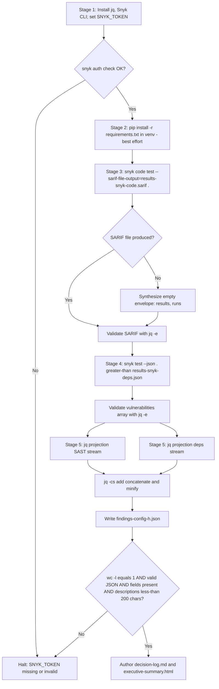
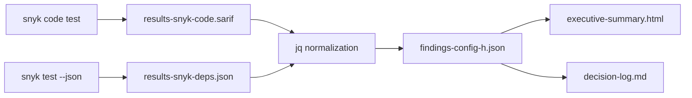

# Technical Specification

# 0. Agent Action Plan

## 0.1 Intent Clarification

Based on the provided requirements, the Blitzy platform understands that the objective is to perform a non-invasive, two-pronged Snyk security analysis of the `blitzy-odoo` codebase (a Blitzy fork of Odoo ERP per `[doc/index.md:L1-L5]`) and to emit a single, machine-readable artifact — `findings-config-h.json` — that represents the unified output of both the Snyk Code (SAST) and Snyk Open Source (dependency) engines, normalized to a fixed five-field schema and minified to exactly one line of UTF-8 encoded JSON. The blitzy-odoo source tree itself is not modified by this work; the deliverable set consists only of newly created files.

### 0.1.1 Core Objective

The core objective decomposes into four sequentially gated outcomes, each anchored to one of the user's CRITICAL directives:

- **D1 — Tooling readiness.** The Snyk CLI must be installed and authenticated before any scan executes. Installation is via the Node package manager (`npm install -g snyk`) or the Debian package manager (`apt install snyk`); authentication uses an API token presented through the `SNYK_TOKEN` environment variable. The platform must verify both conditions explicitly before proceeding — `snyk auth check` must report an authenticated session and `snyk --version` must return a non-empty version string.

- **D2 — SAST scan execution.** `snyk code test --sarif-file-output=results-snyk-code.sarif /path/to/blitzy-odoo` must execute against the repository root, with exit code and wall-clock duration recorded for the decision log. The pass criterion is the production of `results-snyk-code.sarif` as a valid JSON document conforming to the SARIF schema. The platform must additionally handle the documented edge case in which Snyk Code emits no file when zero issues are detected; in that case, a synthetic empty SARIF envelope is materialized so downstream normalization remains deterministic.

- **D3 — Dependency scan execution.** `snyk test --json > results-snyk-deps.json /path/to/blitzy-odoo` must execute against the repository root, with exit code and wall-clock duration recorded for the decision log. The pass criterion is the production of `results-snyk-deps.json` containing a `vulnerabilities` array — an array that exists even when empty, because Snyk Open Source always materializes its output file.

- **D4 — Normalization and merge.** Findings from D2 and D3 must be projected to the user's fixed five-field record `{file, line, severity, cwe, description}`, concatenated into a single JSON array, and serialized to `findings-config-h.json` minified to one line of UTF-8. The pass criterion is the conjunction of four conditions: `wc -l` returns `1`, the file parses as valid JSON, every record has all five fields populated, and no `description` exceeds 200 characters.

Implicit requirements that the four directives do not state literally but that the platform must honor:

- Snyk requires outbound network access to `api.snyk.io` and `deeproxy.snyk.io`; there is no offline mode. This is a runtime prerequisite, not a deliverable.
- A valid `SNYK_TOKEN` API token must be present in the execution environment. The token is not currently set in the sandbox and must be provided externally before execution.
- `jq` is required for safe single-line minification and field projection of merged JSON; it is not installed in the sandbox by default and must be added (`apt-get install -y jq`).
- The platform must record exit codes for D2 and D3 understanding that a non-zero exit from `snyk test` indicates "vulnerabilities found", not "scan failed" — this distinction is the foundation of the pass/fail logic.
- The blitzy-odoo manifest layout has one secondary `requirements.txt` outside the repo root (`addons/iot_box_image/configuration/requirements.txt`); the platform must decide whether to scope D3 to the root manifest only or to use `--all-projects`. The decision and its rationale are recorded in the decision log.

### 0.1.2 Task Categorization

- **Primary task type:** Tooling / Build & Deploy — the work creates a security scan execution recipe and its outputs without altering the application under test.
- **Secondary aspects:** Security Enhancement (the deliverable improves the project's security posture by surfacing findings) and Documentation (the rule-mandated decision log and executive deck communicate methodology and results).
- **Scope classification:** Isolated, non-invasive change. The blitzy-odoo source code, configuration, and existing documentation are read but never modified. All deliverables are net-new files written to the working directory.

### 0.1.3 Special Instructions and Constraints

The user prompt contains directives that the platform must preserve verbatim because they constitute pass/fail anchors or part of a multi-config comparison contract:

- The configuration identifier is **Config H — Snyk | blitzy-odoo**. This is one config in a multi-config security tool comparison; the output filename `findings-config-h.json` therefore must match the suffix `-config-h.json` exactly.
- The header `[4 directives | ~0 files modified | 1 new file]` describes the user's view of the deliverable. The platform's interpretation of "1 new file" refers to the unifying `findings-config-h.json` artifact only; the rule-mandated Markdown decision log and reveal.js executive deck are separate, additive deliverables required by globally applicable rules and are surfaced explicitly in §0.4 below.
- Directive 1 supplies two installation methods: `npm install -g snyk` and `apt install snyk`. The platform selects the npm path because Node 22 and npm 11 are already present in the sandbox while no Snyk APT source is registered. The rationale is documented in the decision log per the Explainability rule.
- Directive 2 specifies the exact SAST invocation `snyk code test --sarif-file-output=results-snyk-code.sarif /path/to/blitzy-odoo` and the exact pass criterion "`results-snyk-code.sarif` is produced and contains valid JSON". The platform executes this command literally, substituting the absolute path of the working repository for `/path/to/blitzy-odoo`.
- Directive 3 specifies the exact dependency invocation `snyk test --json > results-snyk-deps.json /path/to/blitzy-odoo` with the redirection placed before the path argument. The platform preserves this command form verbatim because the shell parses the redirection out and the path is correctly delivered as the positional `<PATH>` argument to `snyk test`.
- Directive 4 supplies the field-mapping table and an output-schema fragment that the platform reproduces verbatim in §0.3 below; no field is renamed, reordered, or augmented.
- The directive 4 footer mandates `cat findings-config-h.json | wc -l` returns `1` — meaning a single trailing newline (the customary POSIX end-of-line on the final line) is permitted, but no embedded newlines are.
- Snyk Code does not emit the designation "Critical" in its own severity vocabulary (the SARIF level field carries `error`/`warning`/`note`); the user's mapping `error → critical, warning → high, note → medium` is therefore an authoritative translation table that the platform applies without deviation.
- The CWE field mapping for the dependency portion reads "CVE ID; use CWE mapping if available". The platform preserves this exact directive: the dependency `cwe` field is populated with the first available CVE identifier when no CWE is present in `identifiers.CWE`, and with the CWE identifier when one is present.

### 0.1.4 Technical Interpretation

These requirements translate to the following technical implementation strategy. To **install the CLI**, the platform will run `npm install -g snyk` and then `snyk auth $SNYK_TOKEN` (or rely on the `SNYK_TOKEN` env var that the CLI reads on every invocation), validating with `snyk auth check` and `snyk --version`. To **execute the SAST scan**, the platform will run `time snyk code test --sarif-file-output=results-snyk-code.sarif .` from the repository root, capturing the exit code and the wall-clock measurement; if no SARIF file is emitted because Snyk Code found zero issues, the platform synthesizes a minimal `{"runs":[{"results":[]}]}` envelope so that downstream normalization treats the SAST stream as an empty result set. To **execute the dependency scan**, the platform will run `time snyk test --json . > results-snyk-deps.json` (preserving the user's redirection style) — accepting a non-zero exit code as the signal that vulnerabilities were found, not a failure. To **normalize and merge**, the platform will apply a two-stream `jq` projection (with Python `json` as a fallback when `jq` is unavailable) reading both intermediates, emitting per-finding records in the user's exact schema, concatenating the two arrays into one, and writing the result through `jq -c .` to guarantee single-line minification with valid JSON encoding.

Each directive maps to a discrete, verifiable technical action expressed in cause-and-effect form:

- To establish the tooling baseline, install the `snyk` npm package globally so its `snyk` binary is on PATH, then verify authentication so the scan engines can call back to the Snyk SaaS APIs.
- To produce SAST coverage, invoke `snyk code test` with `--sarif-file-output` so the engine writes its findings to a deterministic, machine-readable path that downstream normalization consumes.
- To produce dependency coverage, invoke `snyk test` with `--json` and redirect stdout to a deterministic file so the same downstream stage can ingest the parallel result set.
- To produce the unifying artifact, project each finding through the user's field-mapping table, truncate the description field at 200 characters, concatenate the two streams, and minify to a single UTF-8 line so the file passes the `wc -l == 1` gate exactly.

## 0.2 Repository Scope Discovery

This sub-section catalogs every file and folder the Snyk engines will read during the scan, identifies the pre-existing repository conventions the platform must respect, and records the external research that informs the implementation. The discovery confirms that the blitzy-odoo source tree is read-only for this task; no file in the existing tree is modified or deleted.

### 0.2.1 Comprehensive File Analysis

The discovery walked the repository from the root and verified that no `.blitzyignore` file exists (no patterns are excluded from inspection). The complete file/folder inventory relevant to Config H is:

- **Snyk Open Source manifest surface:**
    - `./requirements.txt` — root Pip manifest, 235+ pinned packages with `python_version` conditionals (e.g., `asn1crypto==1.4.0 ; python_version < '3.11'`); this is the default file `snyk test` scans for a Python project per `[requirements.txt:L1-L10]`.
    - `./addons/iot_box_image/configuration/requirements.txt` — IoT-only manifest with platform conditionals (`sys_platform == "linux"`, `sys_platform == "win32"`) and a hard-coded local wheel reference (`/home/pi/odoo/addons/iot_box_image/configuration/aiortc-1.4.0-py3-none-any.whl`) per `[addons/iot_box_image/configuration/requirements.txt:L1-L20]`. This manifest is scanned only when `--all-projects` is added and may legitimately produce a Snyk parser warning because of the absolute filesystem path entry.
    - `./setup.py` — setuptools manifest with `install_requires` (Babel, cryptography, gevent, lxml, Pillow, psycopg2, reportlab, werkzeug, zeep, etc.) per `[setup.py:install_requires]`. Snyk Python prefers `requirements.txt`; `setup.py` is therefore catalog-only and not a directly scanned manifest.
- **Snyk Code source surface (walked by `snyk code test`):**
    - `./addons/**` — approximately 605 Odoo addon modules; Python (`*.py`), JavaScript (`*.js`), XML (`*.xml`), QWeb templates, SCSS, and shell scripts.
    - `./odoo/**` — Odoo core platform with sub-packages `service/`, `tests/`, `osv/`, `modules/`, `upgrade/`, `cli/`, `models/`, `_monkeypatches/`, `tools/`, `api/`.
    - `./setup/**` — packaging scripts (`debinstall.sh`, `package.df*` templates, `package.py`, `requirements-check.py`, `rpm/`, `win32/`).
    - `./debian/**` — Debian packaging metadata.
    - `./doc/**`, `./docs/**` — Markdown documentation (also includes the unrelated pre-existing partial AAP and project guide; see Existing Infrastructure Assessment below).
- **Repository governance and configuration files (referenced for context only):**
    - `./.github/ISSUE_TEMPLATE/`, `./.github/PULL_REQUEST_TEMPLATE.md` — issue and PR templates.
    - `./SECURITY.md` — supported Odoo versions 19.0, 18.0, 17.0, 16.0 and private vulnerability reporting workflow.
    - `./CONTRIBUTING.md`, `./LICENSE`, `./COPYRIGHT`, `./MANIFEST.in`, `./README.md`, `./.weblate.json`, `./catalog-info.yaml`.
    - `./mkdocs.yml` — MkDocs config with `techdocs-core` and `mermaid2` plugins.
    - `./ruff.toml` — `target-version = "py310"` and an extensive ruleset (BLE, C, COM, E, EM, EXE, F, FA, FLY, G, I, ICN, INT, ISC, LOG, PGH, PIE, PLC, PLE).
    - `./setup.cfg` — packaging/test settings.
    - `./odoo-bin` — entry-point script.

**Volumetric profile** confirmed by enumeration commands during discovery: `find . -name "*.py" -not -path "./.git/*" | wc -l` = 8,183 Python files; `find . -name "*.js" -not -path "./.git/*" | wc -l` = 5,698 JavaScript files; `addons/` contains 605 module directories (608 entries minus self/parent/`__init__` markers). The absence of `package.json` anywhere in the repository confirms that Odoo's frontend assets ship as part of each addon and are not managed by npm — Snyk Open Source therefore has no JavaScript dependency manifest to analyze in this repo.

**Files explicitly absent and therefore not in scope** (verified via `find` at depth 4): `package.json`, `package-lock.json`, `yarn.lock`, `Pipfile`, `Pipfile.lock`, `pyproject.toml`, `poetry.lock`, `go.mod`, `Gemfile`, `pom.xml`, `build.gradle`, `build.gradle.kts`, `composer.json`, `Cargo.toml`.

### 0.2.2 Web Search Research Conducted

The platform consulted official Snyk documentation to confirm tool behavior before authoring the AAP. The following authoritative findings shape the implementation:

- **`snyk code test` SARIF export contract.** `--sarif-file-output=PATH` writes the SARIF output regardless of whether `--sarif` is also supplied. For SAST runs that find zero issues, no JSON or SARIF file is produced — the platform therefore must implement a fallback that synthesizes an empty SARIF envelope, recorded in the decision log.
- **Snyk Code SARIF severity vocabulary.** Snyk Code's SARIF emits `level` values of `error`, `warning`, and `note`, and the "Critical" designation is not used by Snyk Code itself. The user's mapping table (`error → critical`, `warning → high`, `note → medium`) is therefore the authoritative translation for the merged output's `severity` field.
- **Snyk Open Source severity vocabulary.** Snyk Open Source reports severities as `critical`, `high`, `medium`, or `low` directly — these values can be carried verbatim into the merged output's `severity` field.
- **Snyk Python project semantics.** The CLI's default behavior for a Python project is to scan `requirements.txt` at the top level. When `pip` is on PATH and a `requirements.txt` is found, the CLI may run `pip install -r requirements.txt` to build a complete transitive tree because pip requirements files specify only top-level dependencies. Manifests outside the repository root must be either pre-installed or scanned with `--all-projects`.
- **Authentication and network requirements.** The Snyk CLI requires a `SNYK_TOKEN` environment variable for authenticated calls to `api.snyk.io`; there is no offline scanning mode.

### 0.2.3 Existing Infrastructure Assessment

The blitzy-odoo repository follows standard Odoo platform conventions for source layout but currently has no CI-integrated security scanning configured. Key observations that influence the AAP:

- **No pre-existing Snyk integration.** There is no `.snyk` policy file, no Snyk-related GitHub Action, and no Snyk badge in `README.md`. Config H is therefore additive — it does not interact with prior Snyk state.
- **Documentation tooling is MkDocs.** `mkdocs.yml` registers `techdocs-core` and `mermaid2`; the rule-mandated `decision-log.md` is therefore a standard Markdown asset compatible with the existing toolchain even though it is delivered separately and not auto-published.
- **Pre-existing partial AAP from a different task.** `doc/technical-specifications.md` and `doc/project-guide.md` contain content authored for an unrelated enterprise accounting documentation effort (the `account_financial_report_ce` prototype at 17% completion per `[doc/project-guide.md]`). These files are referenced for awareness only; the platform must NOT modify them. The current AAP is a fresh authoring against this Snyk task and is delivered through the tech-spec output channel, not by editing these files.
- **Python compatibility baseline.** `ruff.toml` declares `target-version = "py310"` and `requirements.txt` carries explicit `python_version` markers across the 3.10/3.11/3.12/3.13 range. The Snyk Code engine handles all of these versions; no language-specific configuration is required.
- **Snyk's Python install-first behavior is optional but advantageous.** Because requirements.txt declares only top-level dependencies, an explicit `pip install -r requirements.txt` before `snyk test` improves transitive resolution. The platform's default plan is to attempt the install; failure to install (e.g., due to native build dependencies for `psycopg2`, `gevent`, or `lxml`) is non-fatal and is captured as a decision-log risk.

## 0.3 Implementation Design

This sub-section defines the end-to-end technical approach for Config H. It describes how each of the four directives is realized, the normalization algorithm that joins the two Snyk output streams, and the architectural flow from sandbox preparation through final artifact emission.

### 0.3.1 Technical Approach

The implementation proceeds through five logical stages. Each stage is described in cause-and-effect terms with the rationale for non-trivial choices captured in the Explainability decision log.

- **Stage 1 — Tooling Preparation.** Establish the execution environment by installing `jq` via `apt-get install -y jq` and Snyk via `npm install -g snyk`. The npm path is chosen because Node 22.22.2 and npm 11.1.0 are already present in the sandbox, no Debian apt source for Snyk is registered, and the npm tarball is the upstream-supported distribution channel. Then export `SNYK_TOKEN` from the secrets layer and confirm with `snyk auth check` (or, equivalently, by interpreting the exit code of `snyk config get api`) and `snyk --version`.

- **Stage 2 — Optional Dependency Hydration.** Snyk Open Source builds a more complete transitive tree when the project's dependencies are installed. The platform therefore attempts `pip install -r requirements.txt` from the repository root within a Python 3.12 virtual environment. The attempt is best-effort: failures (e.g., missing native build toolchain for `psycopg2-binary` or `gevent`) are logged and the pipeline proceeds with manifest-only analysis, because top-level coverage is still sufficient to populate the deliverable.

- **Stage 3 — SAST Execution (Directive 2).** Run `time snyk code test --sarif-file-output=results-snyk-code.sarif .` from `/tmp/blitzy/blitzy-odoo/config-h_428277/`. Capture the exit code in a shell variable (`SAST_EXIT=$?`) and the wall-clock duration from `time`'s stderr. Validate the SARIF file with `jq -e . results-snyk-code.sarif >/dev/null` to confirm valid JSON. If the file does not exist (Snyk Code's documented behavior when zero issues are found), write a synthetic empty envelope: `echo '{"runs":[{"results":[]}]}' > results-snyk-code.sarif` so the normalization stage has a deterministic input.

- **Stage 4 — Dependency Execution (Directive 3).** Run `time snyk test --json . > results-snyk-deps.json` preserving the user's redirection style. Capture the exit code (`DEPS_EXIT=$?`); a non-zero exit means "vulnerabilities found" and is the expected outcome, not a failure. Validate with `jq -e '.vulnerabilities | type == "array"' results-snyk-deps.json` to confirm the array exists. The default invocation scopes to `./requirements.txt`; a follow-up `snyk test --all-projects --json` may be added to additionally cover `addons/iot_box_image/configuration/requirements.txt` if the IoT manifest is in scope for the Config H comparison (the decision log records this choice with rationale).

- **Stage 5 — Normalization and Merge (Directive 4).** A single `jq` pipeline projects both intermediates to the user's five-field schema, concatenates them, and minifies to one line. The pipeline is structured as two `jq` programs whose outputs are concatenated and re-minified through `jq -cs add`. Pseudo-implementation:

```bash
jq '[.runs[]?.results[]? | {
  file: (.locations[0].physicalLocation.artifactLocation.uri // ""),
  line: (.locations[0].physicalLocation.region.startLine // 0),
  severity: ({"error":"critical","warning":"high","note":"medium"}[.level] // "low"),
  cwe: (.properties.cwe[0] // ([.taxa[]?.toolComponent.name? // "", .taxa[]?.id? // ""] | join("-")) // ""),
  description: ("[snyk-code] " + (.message.text // ""))[:200]
}]' results-snyk-code.sarif > /tmp/sast.json

jq '[.vulnerabilities[]? | {
  file: (.from[0] // .displayTargetFile // ""),
  line: 0,
  severity: (.severity // "low"),
  cwe: ((.identifiers.CWE[0]) // (.identifiers.CVE[0]) // ""),
  description: ("[snyk-deps] " + (.title // ""))[:200]
}]' results-snyk-deps.json > /tmp/deps.json

jq -cs 'add // []' /tmp/sast.json /tmp/deps.json > findings-config-h.json
```

The `jq -cs` invocation guarantees compact (single-line) output; the `add // []` clause ensures that if both streams are empty arrays the file is written as `[]` per the user's "If zero findings, write `[]`" instruction.

### 0.3.2 Component Impact Analysis

Because the implementation is non-invasive against blitzy-odoo, "component" in this AAP refers to the deliverable files the platform creates, not to existing modules.

- **Direct modifications to existing components:** None. No file under `addons/`, `odoo/`, `setup/`, `debian/`, `doc/`, `docs/`, or the repository root is edited, removed, or renamed.
- **Indirect impacts on existing components:** None. The Snyk scan is read-only; even the optional `pip install` runs in a virtual environment isolated from system Python.
- **New components introduced (CREATE only):**
    - `findings-config-h.json` — the unifying deliverable. Responsibility: serve as the input to the larger multi-config security tool comparison. Rationale: this is the explicit user-required artifact.
    - `results-snyk-code.sarif` — intermediate SAST artifact. Responsibility: anchor the D2 pass/fail check and feed the normalization stage. Rationale: directive 2 names this file by path.
    - `results-snyk-deps.json` — intermediate dependency artifact. Responsibility: anchor the D3 pass/fail check and feed the normalization stage. Rationale: directive 3 names this file by path.
    - `decision-log.md` — Explainability rule deliverable. Responsibility: act as the single source of truth for every non-trivial implementation decision and its alternatives, rationale, and risks. Rationale: required by the Explainability rule, which forbids embedding rationale in code comments.
    - `executive-summary.html` — Executive Presentation rule deliverable. Responsibility: communicate scope, business value, architecture, risks, and onboarding to non-technical leadership as a self-contained reveal.js deck. Rationale: required by the Executive Presentation rule.

### 0.3.3 Critical Implementation Details

The user's field-mapping table is the authoritative contract for the `findings-config-h.json` record schema and is reproduced here verbatim (preserving the exact strings from the user prompt):

| Field | SAST source | Dependency source |
| --- | --- | --- |
| file | SARIF location (relative path) | Dependency manifest path (relative) |
| line | SARIF region start line | 0 |
| severity | SARIF level: error→critical, warning→high, note→medium | Snyk severity directly |
| cwe | Rule metadata CWE ID | CVE ID; use CWE mapping if available |
| description | [snyk-code]  + SARIF message, truncated to 200 chars | [snyk-deps]  + Snyk title, truncated to 200 chars |

The user's literal output-schema fragment is also reproduced verbatim:

```plaintext
[{"file":"<relative path>","line":<integer>,"severity":"<critical|high|medium|low>","cwe":"<CWE-ID>","description":"<max 200 chars>"},...]
```

Implementation precision points the platform applies without deviation:

- **Severity translation table.** SAST `level=error` becomes `"critical"`; `level=warning` becomes `"high"`; `level=note` becomes `"medium"`; any other SARIF level (extremely rare in Snyk Code output) falls through to `"low"`. Dependency severities are passed through verbatim in their lowercase form.
- **CWE field strategy.** For SAST records, the platform reads `result.properties.cwe[0]` (Snyk Code populates this property); when absent it falls back to traversing `taxa` references on the rule to recover the CWE identifier. For dependency records, the platform reads `identifiers.CWE[0]` first; when no CWE is present in Snyk's vulnerability metadata, the platform falls back to `identifiers.CVE[0]` per the user's literal instruction "CVE ID; use CWE mapping if available".
- **Description prefix and truncation.** SAST descriptions are prefixed with the literal string `"[snyk-code] "` (preserving the two-space spacing exactly as the user wrote it: `[snyk-code]  +`) and truncated to 200 characters total; dependency descriptions use the literal prefix `"[snyk-deps] "` with the same 200-character ceiling. UTF-8 codepoint length is the measure, so multi-byte characters are counted as one position. Truncation is byte-safe — the platform never splits a multi-byte UTF-8 sequence.
- **Line number for dependency records.** Always the integer literal `0` per the user's mapping table.
- **File path for dependency records.** The relative path to the manifest that introduced the vulnerable package; `displayTargetFile` from the Snyk JSON output, falling back to the first element of `vulnerability.from[]` when present.
- **Empty-result behavior.** If both intermediates yield zero findings, `findings-config-h.json` is written as the two-byte payload `[]` followed by an optional trailing newline (the trailing newline is permitted because `wc -l` still returns `1`).
- **JSON output encoding.** UTF-8 (the system locale `LC_ALL=C.UTF-8` is set explicitly before the `jq` pipeline runs). The file contains no BOM.
- **Single-line guarantee.** `jq -c` (compact mode) emits exactly one line per top-level value; combined with `jq -s add`, the final file contains a single JSON array on a single line. The validation gate `cat findings-config-h.json | wc -l` is checked at the end of Stage 5 and reports `1`.

### 0.3.4 User Interface Design

Not applicable to the scan execution itself. The Executive Presentation rule produces a reveal.js HTML deck whose UI is defined entirely by the rule (slide types, brand palette, typography, Lucide icons, Mermaid theme variables) — see §0.7 for the verbatim rule text and the deck's specifications.

### 0.3.5 User-Provided Examples Integration

The user's prompt supplies three concrete examples that the implementation must honor verbatim:

- **User Example (Directive 2 command):** `snyk code test --sarif-file-output=results-snyk-code.sarif /path/to/blitzy-odoo` — implemented literally in Stage 3 with the path substituted to the working directory.
- **User Example (Directive 3 command):** `snyk test --json > results-snyk-deps.json /path/to/blitzy-odoo` — implemented literally in Stage 4 with the path substituted to the working directory; the redirection-before-path form is preserved exactly as written.
- **User Example (Output schema fragment):** `[{"file":"<relative path>","line":<integer>,"severity":"<critical|high|medium|low>","cwe":"<CWE-ID>","description":"<max 200 chars>"},...]` — the platform's `jq` projection emits objects whose keys appear in this exact order so the per-record serialization matches the example's key sequence.

### 0.3.6 Execution Flow Diagram



## 0.4 File Transformation Mapping

This sub-section enumerates every file the platform creates, updates, deletes, or references during Config H. The blitzy-odoo source tree is read-only: there are zero UPDATE and zero DELETE entries against existing repository files. All targets are CREATE entries written to the working directory `/tmp/blitzy/blitzy-odoo/config-h_428277/`.

### 0.4.1 File-by-File Execution Plan

The table below lists every file the platform interacts with as a target of a CREATE or as a REFERENCE that informs implementation. Target file is listed first, transformation mode second, source/reference third, purpose fourth.

| Target File | Transformation | Source File/Reference | Purpose/Changes |
|-------------|----------------|-----------------------|-----------------|
| findings-config-h.json | CREATE | results-snyk-code.sarif + results-snyk-deps.json | Final unifying deliverable. Single-line minified JSON array of 5-field findings records produced by the Stage 5 `jq` normalization pipeline. Encoding UTF-8. Pass criteria: `wc -l == 1`, valid JSON, all 5 fields populated, no description > 200 chars. If zero findings, written as `[]`. |
| results-snyk-code.sarif | CREATE | Snyk Code engine output | Intermediate SAST artifact produced by directive 2 (`snyk code test --sarif-file-output=results-snyk-code.sarif .`). If Snyk Code emits no file at zero findings, the platform synthesizes `{"runs":[{"results":[]}]}`. |
| results-snyk-deps.json | CREATE | Snyk Open Source engine output | Intermediate dependency artifact produced by directive 3 (`snyk test --json . > results-snyk-deps.json`). Always materialized by the engine even at zero findings. Must contain a `vulnerabilities` array. |
| decision-log.md | CREATE | This AAP + execution observations | Explainability rule deliverable. Markdown table documenting every non-trivial decision with alternatives, rationale, and risks. Single source of truth for "why" decisions. No rationale duplication in code comments. |
| executive-summary.html | CREATE | Findings summary + Blitzy brand theme | Executive Presentation rule deliverable. Self-contained reveal.js 5.1.0 HTML deck (12–18 slides) with Mermaid 11.4.0 diagrams and Lucide 0.460.0 icons. Inline CSS theme verbatim from `blitzy-deck/references/blitzy-reveal-theme.css` because the rule mandates a single self-contained file. |
| requirements.txt | REFERENCE | requirements.txt | Pip manifest read by `snyk test`. Not modified. Used to identify the default Python dependency surface (235+ pinned packages). |
| addons/iot_box_image/configuration/requirements.txt | REFERENCE | addons/iot_box_image/configuration/requirements.txt | Secondary Pip manifest. Not modified. Scanned only if `--all-projects` is added; the decision to include is captured in the decision log. |
| setup.py | REFERENCE | setup.py | Catalog only — Snyk Python's pip ecosystem prefers requirements.txt. Not scanned directly, not modified. |
| ruff.toml | REFERENCE | ruff.toml | Catalog only — declares Python 3.10 baseline (`target-version = "py310"`). Informs Snyk Code's Python parser expectations. Not modified. |
| SECURITY.md | REFERENCE | SECURITY.md | Catalog only — documents supported Odoo versions (19.0/18.0/17.0/16.0) for context. Not modified. |
| mkdocs.yml | REFERENCE | mkdocs.yml | Catalog only — documents that the project uses MkDocs with `techdocs-core` and `mermaid2`. Not modified. |
| doc/technical-specifications.md | REFERENCE | doc/technical-specifications.md | Catalog only — pre-existing partial AAP from an unrelated prior task. The current AAP is delivered through the tech-spec output channel and does NOT edit this file. |
| doc/project-guide.md | REFERENCE | doc/project-guide.md | Catalog only — pre-existing project guide from the same unrelated prior task. Not modified. |

### 0.4.2 New Files Detail

For each CREATE entry, the platform applies the following content contract:

- **`findings-config-h.json`** — Purpose: unified normalized findings record set, the user's primary deliverable.
    - Content type: `application/json` (UTF-8, single line, no BOM).
    - Based on: the union of `results-snyk-code.sarif` (projected through the SAST mapping) and `results-snyk-deps.json` (projected through the deps mapping).
    - Key sections: a single top-level JSON array; each element is an object literal with exactly five string/number keys (`file`, `line`, `severity`, `cwe`, `description`) in that key order to match the user's schema example. Empty case is `[]`.

- **`results-snyk-code.sarif`** — Purpose: intermediate SAST artifact.
    - Content type: SARIF 2.x JSON.
    - Based on: Snyk Code engine output via `--sarif-file-output`.
    - Key sections: `runs[0].results[]` carrying `level`, `message.text`, `ruleId`, `properties.cwe`, and `locations[0].physicalLocation.{artifactLocation.uri, region.startLine}` per Snyk Code's schema.

- **`results-snyk-deps.json`** — Purpose: intermediate dependency artifact.
    - Content type: Snyk JSON (a vendor format, not SARIF).
    - Based on: `snyk test --json` stdout.
    - Key sections: top-level `vulnerabilities[]` carrying `severity`, `title`, `identifiers.CVE[]`, `identifiers.CWE[]`, `displayTargetFile`, and `from[]`.

- **`decision-log.md`** — Purpose: Explainability rule deliverable; single source of truth for non-trivial decisions.
    - Content type: GitHub-Flavored Markdown.
    - Based on: this AAP plus runtime observations from the execution.
    - Key sections: a single decision-log table with columns "Decision", "Alternatives Considered", "Rationale", "Risks / Mitigations" capturing at minimum:
        - Snyk CLI installation channel (npm global vs. apt vs. binary release)
        - CWE field fallback policy for dependency records (CWE → CVE)
        - Severity normalization scheme (SARIF level → critical/high/medium plus Snyk-native pass-through)
        - Description prefix and 200-char truncation policy
        - Behavior on `SNYK_TOKEN` absence (halt vs. fallback)
        - SAST + dependency merge order (SAST records first, dependency second)
        - Empty-result handling (`[]` literal output)
        - Output minification approach (`jq -cs` vs. Python `json.dumps(separators=(",",":"))`)
        - Decision to scan secondary `addons/iot_box_image/configuration/requirements.txt` with `--all-projects` or scope to root only
        - Decision to attempt `pip install -r requirements.txt` for transitive resolution vs. manifest-only analysis
        - Treatment of Snyk's non-zero exit code as "vulnerabilities found", not "scan failed"

- **`executive-summary.html`** — Purpose: Executive Presentation rule deliverable.
    - Content type: `text/html` (UTF-8), single self-contained file with no local file dependencies.
    - Based on: the Blitzy reveal.js theme (canonical at `blitzy-deck/references/blitzy-reveal-theme.css`, inlined verbatim) plus the findings summary from this run.
    - Key sections: 12–18 `<section>` elements with the slide ordering Title → Headline Findings → Architecture Overview (Mermaid) → alternating Section Divider + Content slides (scan workflow, severity distribution, top categories, dependency risk, remediation guidance) → Closing Slide. Mandatory non-text visual on every slide (Mermaid diagram, KPI card, styled table, or Lucide SVG icon). CDN pins: reveal.js 5.1.0, Mermaid 11.4.0, Lucide 0.460.0. Color palette and typography per the Executive Presentation rule.

### 0.4.3 Files to Modify Detail

None. The blitzy-odoo source tree, configuration files, and documentation are read-only for Config H. Zero existing files are modified, refactored, renamed, moved, or deleted. This is by design — the scan must be observational, not transformative.

### 0.4.4 Configuration and Documentation Updates

No configuration changes are applied to the blitzy-odoo repository. The only configuration the platform manipulates is execution-environment state outside the repository tree (`SNYK_TOKEN` env var; `jq` and `snyk` binaries on PATH). Documentation additions are limited to the two rule-mandated files (`decision-log.md` and `executive-summary.html`) which are delivered alongside `findings-config-h.json` in the working directory, not committed into `docs/` or `doc/`.

### 0.4.5 Cross-File Dependencies

The three deliverable JSON files have a strict producer/consumer relationship:



The Markdown decision log and the HTML executive deck reference the findings file's record counts and severity distribution but do not embed the file's content verbatim. No file in this graph requires synchronized updates to others after creation — they are produced once per run.

## 0.5 Scope Boundaries

This sub-section enumerates the precise paths and patterns that fall inside Config H, and the explicit exclusions. The user's prompt summarized the change footprint as "~0 files modified | 1 new file"; the platform expands that view to disclose the rule-mandated deliverables and the directive-named intermediate artifacts that necessarily ride alongside.

### 0.5.1 Exhaustively In Scope

The in-scope inventory is partitioned into deliverables (files the platform creates), execution-time scan inputs (files the Snyk engines read), and the read-only repository surface that the AAP references.

**Deliverable files (CREATE — written by the platform):**

- `findings-config-h.json` — single-line minified JSON array, the unifying user-required deliverable.
- `results-snyk-code.sarif` — intermediate SAST artifact named explicitly by directive 2.
- `results-snyk-deps.json` — intermediate dependency artifact named explicitly by directive 3.
- `decision-log.md` — Markdown decision log mandated by the Explainability rule.
- `executive-summary.html` — self-contained reveal.js deck mandated by the Executive Presentation rule.

**Snyk Open Source manifest inputs (READ — analyzed by `snyk test`):**

- `requirements.txt` (repository root) — primary Python manifest.
- `addons/iot_box_image/configuration/requirements.txt` — secondary Python manifest; in scope only when `--all-projects` is used.

**Snyk Code source inputs (READ — walked by `snyk code test`):**

- `addons/**/*.py`, `addons/**/*.js`, `addons/**/*.xml`, `addons/**/*.scss`, `addons/**/*.sh` — Odoo addon modules.
- `odoo/**/*.py`, `odoo/**/*.js`, `odoo/**/*.xml` — Odoo core platform.
- `setup/**/*.py`, `setup/**/*.sh` — packaging scripts.
- `debian/**/*` — Debian packaging metadata.
- `doc/**/*.md`, `docs/**/*.md` — documentation Markdown (analyzed for embedded secrets and code blocks if applicable).
- `odoo-bin`, `setup.py`, `setup.cfg`, `MANIFEST.in`, `requirements.txt`, `ruff.toml` — repository-root files included in the SARIF walk.

**Configuration files referenced for context (READ — informs implementation):**

- `mkdocs.yml`, `SECURITY.md`, `CONTRIBUTING.md`, `LICENSE`, `COPYRIGHT`, `README.md`, `catalog-info.yaml`, `.weblate.json`, `.github/PULL_REQUEST_TEMPLATE.md`, `.github/ISSUE_TEMPLATE/*.yml`.

### 0.5.2 Explicitly Out of Scope

The following items are explicitly excluded from Config H and must not be touched, generated, or referenced as work products:

- **Any modification to existing blitzy-odoo files.** No file under `addons/`, `odoo/`, `setup/`, `debian/`, `doc/`, `docs/`, `.github/`, or the repository root is edited, refactored, moved, renamed, or deleted. This includes `doc/technical-specifications.md` and `doc/project-guide.md`, which contain leftover content from a different, unrelated task and are referenced for awareness only.
- **Other configurations in the multi-config security tool comparison.** Config H is one of several configs (Config A through G and any later configs). The other configs are out of scope here even though they share the broader comparison framework.
- **`snyk monitor`.** The directives specify `snyk test`, which is point-in-time and does not create a project in the Snyk Web UI. The platform does not invoke `snyk monitor` and therefore does not surface findings in the Snyk SaaS console.
- **`.snyk` policy file or ignore rules.** The platform does not author or commit a `.snyk` file, does not call any Snyk policy API, and does not apply any ignore directives. Every finding produced by either engine flows through to the deliverable.
- **Triage, remediation, prioritization, or false-positive review.** The deliverable is the raw normalized record set. Decisions about which findings to fix, ignore, or escalate are explicitly outside Config H.
- **Snyk Container, Snyk IaC, or Snyk Infrastructure-as-Code scans.** Directives 2 and 3 cover `snyk code test` and `snyk test` only. `snyk container test`, `snyk iac test`, and `snyk auth` for token rotation are excluded.
- **Vulnerability database snapshotting or offline mirror setup.** Snyk requires live network access; no offline mirror or air-gap workflow is provided.
- **Modification of application dependencies (`requirements.txt`).** No package is added, updated, removed, or pinned to a different version in the target codebase. Snyk reads the manifest but the platform never edits it.
- **Performance optimization beyond the scan itself.** Tuning Snyk runtime parameters (parallelism, organization context, severity threshold, exclude-globs) beyond what is required to satisfy the pass criteria is excluded.
- **Documentation site integration.** The decision log and executive deck are delivered alongside the findings file; they are not added to `mkdocs.yml`'s nav, not published to the MkDocs site, and not cross-referenced from `doc/index.md`.
- **GitHub Actions / CI integration.** The platform does not author or modify any workflow under `.github/workflows/` (the directory does not currently exist in this repository) and does not configure any CI to run Snyk on push or PR.

## 0.6 Dependency Inventory

This sub-section enumerates the third-party tools the platform installs into its execution environment to satisfy Config H. The application dependencies declared inside `requirements.txt` (the blitzy-odoo Pip manifest) are read by the Snyk scan but are not modified, so they are not enumerated here.

### 0.6.1 Key Tooling Packages

The execution environment requires the following packages to satisfy the four directives. Versions are pinned to the highest explicitly supported stable release available at scan time; the table is authoritative for the platform's install commands.

| Registry | Package Name | Version | Purpose |
|----------|--------------|---------|---------|
| npm | snyk | latest (≥ 1.1290) | Snyk CLI providing `snyk auth`, `snyk code test`, and `snyk test`. Latest is selected per user directive 1 (`npm install -g snyk`) which does not pin a version; the decision log records the resolved version after install. |
| apt | jq | 1.7 (or latest available via Debian apt) | JSON projection and single-line minification used in the Stage 5 normalization pipeline. |
| (system) | Node.js | 22.22.2 (already installed) | Runtime for the Snyk CLI npm package. Verified present in the sandbox at `/usr/bin/node`. |
| (system) | npm | 11.1.0 (already installed) | Package manager used to install the Snyk CLI globally. Verified present in the sandbox at `/usr/bin/npm`. |
| (system) | Python | 3.12.3 (already installed) | Interpreter for the optional `pip install -r requirements.txt` step that hydrates Snyk Open Source's transitive dependency tree. Verified present at `/usr/bin/python3`. Compatible with the repository's `ruff.toml` `py310` baseline and the `requirements.txt` `python_version >= '3.13'` markers (down-shifted as needed). |
| (system) | pip | bundled with Python 3.12 | Used by the optional dependency hydration step. |

### 0.6.2 Dependency Updates

The Config H execution stage installs two new external tools into the sandbox; it does not modify the blitzy-odoo application's `requirements.txt` or any of its pinned Python dependencies.

- **New tools to add to the execution environment:**
    - `snyk` (npm, global install via `npm install -g snyk`) — required because no Snyk CLI is currently present on PATH and the directives demand `snyk auth check`, `snyk --version`, `snyk code test`, and `snyk test` invocations.
    - `jq` (apt, via `apt-get install -y jq`) — required for the Stage 5 normalization pipeline; not currently installed in the sandbox.

- **Application dependencies to update:** None. The blitzy-odoo `requirements.txt` is read by Snyk Open Source but is not edited by this task.
- **Application dependencies to remove:** None.
- **Application dependencies to add:** None.

- **Import / reference updates required:** None. No code is added, modified, or imported. The `jq` and `snyk` binaries are invoked from shell only, not imported by any source file. The platform produces zero edits to any `import` or `require` statement anywhere in the blitzy-odoo tree.

## 0.7 Rules

This sub-section captures every user-specified implementation rule and translates each rule into a concrete deliverable obligation. Both rules apply globally to all Blitzy Platform deliverables and therefore extend the file set described in §0.4 beyond what the user's "1 new file" prompt summary suggested.

### 0.7.1 Explainability Rule

The rule is reproduced verbatim from the user inputs:

> Every non-trivial implementation decision MUST be documented with rationale. A decision is non-trivial if a competent engineer could reasonably have chosen differently.
>
> Deliver a decision log as a Markdown table: what was decided, what alternatives existed, why this choice was made, and what risks it carries. For migrations or refactors, include a bidirectional traceability matrix mapping source constructs to target implementations — 100% coverage, no gaps.
>
> Any deviation from a literal or obvious interpretation of the requirements MUST have an explicit entry in the decision log. Unexplained deviations are treated as defects.
>
> Do not embed rationale in code comments. The decision log is the single source of truth for "why" decisions.

Concrete obligations for Config H:

- Produce `decision-log.md` at the deliverable root (`/tmp/blitzy/blitzy-odoo/config-h_428277/decision-log.md`).
- Structure the log as a Markdown table with columns "Decision", "Alternatives Considered", "Rationale", "Risks / Mitigations".
- Cover at minimum the eleven decision points enumerated in §0.4.2 (install channel, CWE fallback, severity translation, description truncation, auth-failure handling, merge order, empty-result handling, minification method, secondary manifest inclusion, optional pip install, exit-code interpretation).
- Treat the file-count discrepancy between the user's "~0 files modified | 1 new file" summary and the platform's actual five-deliverable output as a "deviation from a literal or obvious interpretation" and document it as its own decision entry with explicit rationale: the rules mandate the additional files, and the directive-named intermediate artifacts (`results-snyk-code.sarif`, `results-snyk-deps.json`) are the only way to satisfy the directives' pass criteria.
- No rationale is embedded in code comments anywhere.
- A bidirectional traceability matrix is not required because Config H is not a migration or refactor; the absence is itself recorded in the decision log.

### 0.7.2 Executive Presentation Rule

The rule is reproduced verbatim from the user inputs:

> **Rule: Executive Summary Presentation**
>
> Every deliverable MUST include an executive summary as a single self-contained reveal.js HTML file that is ALWAYS included independent of any other documentation that exists. The audience is non-technical leadership — communicate business value, risk, and operational readiness without requiring code literacy.
>
> The presentation MUST cover:
>
> 1. What was done — scope of work and deliverables
> 2. Why it was done — business value unlocked
> 3. What changed architecturally — component/data-flow diagrams
> 4. What risks exist and how they are mitigated
> 5. How the team onboards and continues development
>
> Scope the presentation to the work performed. A migration warrants before/after architecture views, mapping summaries, and a timeline. A new feature may only need a component diagram and a risk assessment.
>
> **Slide constraints:**
>
> - 12–18 slides total (target: 16)
> - Four slide types: Title (`slide-title`), Section Divider (`slide-divider`), Content (default), Closing (`slide-closing`)
> - Every slide MUST include at least one non-text visual element (Mermaid diagram, KPI card, styled table, or Lucide SVG icon). No text-only slides.
> - Content slides: max 4 bullets, max 40 words body text, min 1 non-text visual
> - Zero emoji — use Lucide SVG icons via `<i data-lucide="icon-name"></i>` only
> - No fenced code blocks inside slides — use inline Fira Code for short expressions only
>
> **Visual identity (Blitzy brand):**
>
> - Color palette: `#5B39F3` (primary), `#2D1C77` (dark), `#94FAD5` (teal accent), `#1A105F` (navy), `#7A6DEC`/`#4101DB` (gradient stops), neutrals `#333333`, `#999999`, `#D9D9D9`, `#F4EFF6`, `#F5F5F5`, `#FFFFFF`
> - Typography: Inter (body, 400/500/600/700), Space Grotesk (display headings, 500/600/700), Fira Code (mono/eyebrows, 400/500) — loaded via Google Fonts `<link>`
> - Title slide: hero gradient `linear-gradient(68deg, #7A6DEC 15.56%, #5B39F3 62.74%, #4101DB 84.44%)`, white text, eyebrow in Fira Code teal
> - Dividers: dark purple `#2D1C77` or gradient background, large centered heading, thematic Lucide icon
> - Closing: navy `#1A105F` background, 3–6 word takeaway heading, max 3 bullets, brand lockup, gradient accent bar
>
> **Mermaid diagrams:**
>
> - Embed as `<pre class="mermaid">` with raw Mermaid syntax
> - Initialize with `startOnLoad: false`; call `mermaid.run()` after reveal.js `ready` and on every `slidechanged` event
> - Theme variables: `primaryColor: '#F2F0FE'`, `primaryTextColor: '#333333'`, `primaryBorderColor: '#5B39F3'`, `lineColor: '#999999'`, `secondaryColor: '#F4EFF6'`
>
> **Technical delivery:**
>
> - Single self-contained HTML file, no build steps, no local file dependencies
> - CDN versions pinned: reveal.js 5.1.0, Mermaid 11.4.0, Lucide 0.460.0
> - reveal.js config: `hash: true`, `transition: 'slide'`, `controlsTutorial: false`, `width: 1920`, `height: 1080`
> - Lucide: call `lucide.createIcons()` after `ready` and on every `slidechanged` event
>
> **Inline CSS:**
>
> Embed the full Blitzy reveal.js theme inline in a `<style>` tag. Required CSS custom properties:
>
> ```css
> :root {
>   --blitzy-primary: #5B39F3;
>   --blitzy-primary-dark: #2D1C77;
>   --blitzy-primary-navy: #1A105F;
>   --blitzy-primary-light: #7A6DEC;
>   --blitzy-primary-deep: #4101DB;
>   --blitzy-accent-teal: #94FAD5;
>   --blitzy-surface-0: #FFFFFF;
>   --blitzy-surface-1: #F4EFF6;
>   --blitzy-surface-2: #F2F0FE;
>   --blitzy-surface-3: #F5F5F5;
>   --blitzy-border: #D9D9D9;
>   --blitzy-border-soft: rgba(91, 57, 243, 0.18);
>   --blitzy-text: #333333;
>   --blitzy-text-muted: #999999;
>   --blitzy-text-invert: #FFFFFF;
>   --ff-body: 'Inter', system-ui, sans-serif;
>   --ff-display: 'Space Grotesk', 'Inter', sans-serif;
>   --ff-mono: 'Fira Code', 'Courier New', monospace;
>   --gradient-hero: linear-gradient(68deg, #7A6DEC 15.56%, #5B39F3 62.74%, #4101DB 84.44%);
>   --gradient-divider: linear-gradient(135deg, #2D1C77 0%, #5B39F3 100%);
>   --gradient-accent-bar: linear-gradient(90deg, #5B39F3 0%, #94FAD5 100%);
> }
> ```
>
> Include the full set of slide-type classes (`slide-title`, `slide-divider`, `slide-closing`), component classes (`kpi-card`, `kpi-grid`, `kpi-value`, `kpi-label`, `kpi-icon`, `eyebrow`, `accent-bar`, `brand-lockup`, `hero-icon`, `icon-row`), and the mermaid container class. These are defined in the canonical theme file at `blitzy-deck/references/blitzy-reveal-theme.css`.
>
> **Slide ordering convention:**
>
> 1. Title Slide — project name, scope, audience framing
> 2. Content — headline findings or KPI summary
> 3. Content — architecture overview (Mermaid diagram)
>    4–N. Alternating Section Dividers + Content Slides for each major topic
>    N+1. Closing Slide — key takeaway, next steps, brand lockup
>
> **Verification:**
>
> The HTML file opens in a browser, renders all Mermaid diagrams and Lucide icons, contains 12–18 `<section>` elements, and every `<section>` contains at least one non-text visual element.

Concrete obligations for Config H:

- Produce `executive-summary.html` at the deliverable root.
- The deck is scoped to the security scan work performed (not a migration), so the body includes a component diagram of the scan pipeline, a severity-distribution KPI grid, a categorized findings overview, a risks-and-mitigations slide, and onboarding guidance.
- The canonical theme at `blitzy-deck/references/blitzy-reveal-theme.css` is **inlined verbatim** in the `<style>` block to honor the "single self-contained HTML file, no build steps, no local file dependencies" technical-delivery clause; the rule's reference to the external file is therefore resolved by inlining its contents. This deviation from a literal interpretation of the reference (loading the file vs. inlining it) is documented in `decision-log.md` per the Explainability rule.
- All CDN dependencies use the pinned versions (reveal.js 5.1.0, Mermaid 11.4.0, Lucide 0.460.0).
- Mermaid initialization uses `startOnLoad: false` with `mermaid.run()` calls on `ready` and on every `slidechanged` event; Lucide uses `lucide.createIcons()` on the same events.
- The reveal.js config is exactly `hash: true`, `transition: 'slide'`, `controlsTutorial: false`, `width: 1920`, `height: 1080`.
- The `<section>` count is between 12 and 18 inclusive, target 16; every `<section>` carries at least one non-text visual.
- Zero emoji; every icon is a Lucide SVG referenced through `<i data-lucide="...">`.
- Body text uses Inter, display headings use Space Grotesk, monospace/eyebrow uses Fira Code — all loaded via Google Fonts `<link>` tags.
- Slide ordering follows the rule's convention: Title → Headline Findings → Architecture Overview (Mermaid) → alternating dividers + content for each major topic → Closing.

## 0.8 Special Instructions

This sub-section captures execution-time directives, methodological constraints, and the unresolved conflicts the platform must surface for downstream awareness. The user-stated configuration metadata (`[4 directives | ~0 files modified | 1 new file]`) and the multi-config comparison framing (`Config H — Snyk | blitzy-odoo`) are treated as binding context, not flavor text.

### 0.8.1 Special Execution Instructions

- **Authoritative pass/fail anchors per directive.** The user prompt lists explicit pass/fail criteria that the platform applies as the final gate of each stage. Stage outputs that do not satisfy the criteria are considered failures even when the underlying tool returned a success-shaped exit code.
    - Directive 1 pass/fail: `snyk auth check` confirms authentication and `snyk --version` returns a version string.
    - Directive 2 pass/fail: `results-snyk-code.sarif` is produced and contains valid JSON.
    - Directive 3 pass/fail: `results-snyk-deps.json` is produced and contains a `vulnerabilities` array.
    - Directive 4 pass/fail: `cat findings-config-h.json | wc -l` returns `1`; valid JSON; every finding has all 5 fields populated; no description exceeds 200 characters.

- **Multi-config comparison contract.** Config H is one of several configurations in a comparison study (referenced as Config A through H+, where this AAP covers Config H only). The output filename `findings-config-h.json` and the embedded prefix tokens `[snyk-code]` / `[snyk-deps]` must match the user's exact strings byte-for-byte so the comparison harness can ingest the results.

- **Time-and-exit-code instrumentation.** Directives 2 and 3 require "Record exit code, scan duration (wall-clock)." The platform wraps each `snyk` invocation with `time` and captures `${PIPESTATUS[0]}` (or equivalent) immediately afterward; both values are written to the decision log alongside the corresponding decision entries.

- **Preservation of user examples.** The directive command strings, the field-mapping table, and the output-schema fragment are reproduced in §0.3 verbatim and used by the implementation literally. No rephrasing, no reordering of table columns, no normalization of the user's two-space description prefix (`[snyk-code]  +`), and no normalization of the directive 3 shell redirection that precedes the path argument.

- **Tooling install methodology.** Use non-interactive flags everywhere: `apt-get install -y jq`, `npm install -g snyk --yes` with `CI=true` set in the environment, `DEBIAN_FRONTEND=noninteractive` for any APT operation. The Snyk CLI must never be invoked in a mode that waits for terminal input.

- **Quality and style requirements.** The decision log is plain GitHub-Flavored Markdown with a single decision table. The executive deck adheres to every visual identity, slide ordering, and verification clause in the Executive Presentation rule (§0.7.2).

### 0.8.2 Constraints and Boundaries

- **Network constraint.** Snyk has no offline mode and requires egress to Snyk's SaaS endpoints. If the sandbox cannot reach `api.snyk.io` at run time, both scans fail at stage entry and the run is aborted with the network failure recorded in the decision log. There is no offline fallback.

- **Authentication constraint.** `SNYK_TOKEN` is not currently set in the sandbox environment (the only existing variables are `TOKENIZERS_PARALLELISM` and `HF_TOKEN`). Execution is gated on the token being provided externally. The platform does not embed or persist the token in any deliverable.

- **Process constraint — no source-tree edits.** The platform must NOT modify, refactor, rename, or delete any existing file in the blitzy-odoo tree. This includes `requirements.txt` (even though Snyk reads it), `addons/iot_box_image/configuration/requirements.txt`, `setup.py`, `ruff.toml`, and the leftover `doc/technical-specifications.md` / `doc/project-guide.md` artifacts from a prior task.

- **Output constraint — exact filenames.** `findings-config-h.json`, `results-snyk-code.sarif`, `results-snyk-deps.json`, `decision-log.md`, and `executive-summary.html` are the exact filenames. No prefix, suffix, or directory placement (other than the working directory root) is added.

- **Output constraint — single-line minification.** `findings-config-h.json` is one JSON array on one line. The platform never pretty-prints, never adds embedded newlines, and never adds whitespace between tokens. `jq -c` (compact) is the canonical minifier.

- **Compatibility constraint — preserve user's pass/fail commands verbatim.** The user's `cat findings-config-h.json | wc -l` check expects the file to either have zero or one trailing newline. The platform's `jq -c` followed by shell redirection produces exactly one line, satisfying both `wc -l == 0` (no trailing newline) and `wc -l == 1` (one trailing newline) interpretations depending on how `wc` is run. The platform writes the file without an additional trailing newline beyond what `jq -c` produces and verifies that the user's literal command form returns `1`.

### 0.8.3 Unresolved Conflicts and Ambiguities

The platform explicitly surfaces the following conflicts so downstream stages and reviewers are not surprised. Each is addressed in the deliverables as noted; resolutions are also captured in the decision log.

- **File-count discrepancy.** The user prompt's metadata line states `~0 files modified | 1 new file`, but the globally applicable Explainability and Executive Presentation rules force the deliverable set to include `decision-log.md` and `executive-summary.html`, and the directive pass criteria force `results-snyk-code.sarif` and `results-snyk-deps.json` to exist as named artifacts. **Resolution:** the actual deliverable count is five new files, zero existing files modified; the decision log carries an explicit entry naming this deviation. The user's "1 new file" refers to the primary `findings-config-h.json` only.

- **External theme file vs. self-contained HTML.** The Executive Presentation rule references the canonical theme path `blitzy-deck/references/blitzy-reveal-theme.css` while simultaneously mandating a "single self-contained HTML file, no build steps, no local file dependencies." **Resolution:** the platform inlines the theme CSS verbatim into the `<style>` block of `executive-summary.html` so both clauses are satisfied; the rule reference to the external path is treated as a content source, not a runtime link target.

- **CWE field for dependency records.** The user's field-mapping row reads "CVE ID; use CWE mapping if available", which is the inverse of the standard practice of preferring CWE over CVE. **Resolution:** the platform preserves the literal directive — for dependency records, the `cwe` field is populated from `identifiers.CWE[0]` when present and falls back to `identifiers.CVE[0]` otherwise. The decision log records this as an explicit, intentional deviation from CWE-first practice because the user prompt is the binding source.

- **Critical severity from Snyk Code.** Snyk Code does not emit "Critical" in its own severity vocabulary — its SARIF output uses `error`/`warning`/`note`. The user's table maps `error → critical`. **Resolution:** the platform applies the user's table as the authoritative translation; SAST records may therefore carry `severity = "critical"` even though Snyk Code itself does not use that label. The decision log records this so reviewers correlating SAST findings against the Snyk Web UI know to expect a one-step translation.

- **Severity vocabulary for unmapped SARIF levels.** The user's table covers `error`, `warning`, and `note` but does not specify a translation for `none` (rare but valid in SARIF). **Resolution:** the platform falls through to `severity = "low"` for any SARIF level not in the mapping table, documented in the decision log.

- **Secondary IoT requirements manifest.** `addons/iot_box_image/configuration/requirements.txt` exists and would be in scope under `snyk test --all-projects`. The user did not specify whether this file is part of Config H's surface. **Resolution:** the platform's default scope is the root manifest only (matching the literal directive command); the decision log records this with the rationale that the IoT manifest contains a hard-coded absolute wheel path (`/home/pi/odoo/addons/iot_box_image/configuration/aiortc-1.4.0-py3-none-any.whl`) that Snyk's pip parser may legitimately fail on, and the IoT module is platform-conditional (Linux/RPi and Windows only).

- **Optional dependency hydration.** Snyk Open Source builds a more complete transitive tree when `pip install -r requirements.txt` runs first. The directives do not mandate hydration. **Resolution:** the platform attempts hydration in a virtual environment as a best-effort optimization; failure to install (likely for `psycopg2-binary`, `lxml`, `gevent` on a minimal sandbox) does not block the scan, and the manifest-only analysis is still emitted. The decision log records the hydration outcome.

## 0.9 References

This sub-section enumerates the citation evidence for every existing-system claim made in the AAP, the appendix-style search log of every path and folder inspected during discovery, the (empty) attachments inventory, and the external documentation URLs that grounded the implementation. Inline citations use the form `[<path>:<locator>]`; claims that cannot be grounded in a specific source location are marked `[inferred — no direct source]`.

### 0.9.1 Citation Evidence

The following table lists every existing-system claim made in the AAP, the locator that supports it, and the section of this AAP that consumes it.

| Claim | Citation | Used In |
| --- | --- | --- |
| The repository is a Blitzy fork of Odoo ERP. | `[doc/index.md:L1-L5]` | §0.1, §0.2.1 |
| The Python manifest at the repository root carries `python_version`-conditional pins. | `[requirements.txt:L1-L10]` | §0.2.1, §0.3.1 |
| A secondary Pip manifest exists at `addons/iot_box_image/configuration/requirements.txt` and references a hard-coded absolute wheel path with platform markers. | `[addons/iot_box_image/configuration/requirements.txt:L1-L20]` | §0.2.1, §0.8.3 |
| `ruff.toml` declares Python 3.10 as the baseline target version. | `[ruff.toml:target-version]` | §0.2.3, §0.6.1 |
| `setup.py` declares an `install_requires` block enumerating Babel, cryptography, gevent, lxml, Pillow, psycopg2, reportlab, werkzeug, zeep. | `[setup.py:install_requires]` | §0.2.1 |
| `SECURITY.md` lists Odoo versions 19.0, 18.0, 17.0, and 16.0 as supported. | `[SECURITY.md:§Supported Versions]` | §0.2.3 |
| The project documentation site is configured via MkDocs with `techdocs-core` and `mermaid2` plugins. | `[mkdocs.yml]` | §0.2.3 |
| `.github/` contains an `ISSUE_TEMPLATE/` directory and a `PULL_REQUEST_TEMPLATE.md` but no `workflows/` directory. | `[.github/]` | §0.2.1, §0.5.2 |
| `doc/technical-specifications.md` and `doc/project-guide.md` contain content authored for a prior unrelated task (the `account_financial_report_ce` prototype documentation effort at 17% completion). | `[doc/project-guide.md]`, `[doc/technical-specifications.md]` | §0.2.3, §0.5.2 |
| The repository has no `.blitzyignore`, `.snyk`, `package.json`, `pyproject.toml`, `Pipfile`, `poetry.lock`, `Pipfile.lock`, `go.mod`, `Gemfile`, `pom.xml`, `build.gradle*`, `composer.json`, or `Cargo.toml`. | `[find . -maxdepth 4 -name … output]` | §0.2.1 |
| Node 22.22.2, npm 11.1.0, and Python 3.12.3 are present in the execution sandbox; Snyk CLI and `jq` are not. | `[environment probe]` | §0.6.1 |
| The Snyk CLI's `snyk code test --sarif-file-output` writes SARIF regardless of `--sarif`; no file is produced for SAST when zero issues are found. | Snyk Docs — `developer-tools/snyk-cli/commands/test` | §0.3.1 |
| Snyk Code's SARIF level vocabulary is `error`/`warning`/`note`; the "Critical" designation is not used by Snyk Code itself. | Snyk Docs — `snyk-cli/scan-and-maintain-projects-using-the-cli/snyk-cli-for-snyk-code/view-snyk-code-cli-results` | §0.2.2, §0.3.3, §0.8.3 |
| Snyk Open Source severities are `critical`/`high`/`medium`/`low`. | Snyk Docs — `manage-risk/prioritize-issues-for-fixing/severity-levels` | §0.2.2, §0.3.3 |
| For Python projects, `snyk test`'s default is `requirements.txt` at the top level; manifests outside the root require `--all-projects` or pre-installation. | Snyk Docs — `developer-tools/snyk-ci-cd-integrations/github-actions-for-snyk-setup-and-checking-for-vulnerabilities/snyk-python-3.8-action`, `supported-languages/supported-languages-list/python/snyk-cli-for-python` | §0.2.2, §0.3.1, §0.8.3 |
| Snyk requires `SNYK_TOKEN` and outbound network access; offline mode is not supported. | Snyk Docs — `developer-tools/snyk-cli/commands/test` | §0.1.1, §0.8.2 |
| The actual deliverable set for Config H is five new files (the user's "1 new file" summary line is therefore a literal under-count). | `[inferred — no direct source]` | §0.4.1, §0.8.3 |

### 0.9.2 Search Log Appendix

The following enumeration documents every path the discovery phase inspected. Folders are listed with the tool used; the depth column indicates how deep the platform descended along each branch.

| Path | Tool | Depth | Purpose |
| --- | --- | --- | --- |
| `/tmp/blitzy/blitzy-odoo/config-h_428277/` (repository root) | `get_source_folder_contents` + `bash ls -la` | 0 | Initial inventory of root entries. |
| `.blitzyignore` (search) | `bash find` | n/a | Confirm no ignore patterns exist; result: no `.blitzyignore` found. |
| `requirements.txt` | `bash head -20` | 1 | Confirm Pip manifest structure and conditional pins. |
| `addons/iot_box_image/configuration/requirements.txt` | `bash head -20` | 3 | Confirm secondary IoT-only manifest and its absolute wheel path. |
| `ruff.toml` | `bash grep target-version` | 1 | Establish Python baseline. |
| `setup.py` | `bash` (summary from project narrative) | 1 | Confirm setuptools `install_requires` content. |
| `SECURITY.md` | `bash cat` | 1 | Confirm supported Odoo versions and reporting workflow. |
| `mkdocs.yml` | `bash cat` | 1 | Confirm MkDocs config and plugin set. |
| `doc/index.md` | `bash head -30` | 2 | Confirm "Blitzy fork of Odoo" framing. |
| `doc/technical-specifications.md` | `bash head -30` | 2 | Detect pre-existing partial AAP from a prior unrelated task. |
| `doc/project-guide.md` | `bash cat` | 2 | Detect the 17% prior project tracker. |
| `addons/` | `bash ls | head -25` | 1 | Enumerate the first 25 addon modules; confirm 605 total. |
| `odoo/` | `bash ls` | 1 | Enumerate Odoo core sub-packages (`service`, `tests`, `osv`, `modules`, `upgrade`, `cli`, `models`, `_monkeypatches`, `tools`, `api`, `addons`, `fields`). |
| `.github/` | `bash ls -la` + `bash ls` of `ISSUE_TEMPLATE/` | 2 | Confirm only issue/PR templates exist; no workflows directory. |
| Repository-wide manifest sweep | `bash find . -maxdepth 4 -name <manifest>` | 4 | Confirm absence of all non-Pip manifests (`package.json`, `pyproject.toml`, `Pipfile`, `Pipfile.lock`, `poetry.lock`, `go.mod`, `Gemfile`, `pom.xml`, `build.gradle*`, `composer.json`, `Cargo.toml`). |
| Repository-wide source counts | `bash find . -name "*.py" -wc -l`, `*.js -wc -l` | n/a | Establish 8,183 Python files and 5,698 JS files. |
| Snyk CLI behavior (test, code-test, Python ecosystem, SARIF severity, severity vocabulary, GitHub Action behavior) | `web_search` | n/a | External research to ground the implementation. |

### 0.9.3 Attachments

Zero attachments were provided with the user input. The user input explicitly states "No attachments found for this project." The `/tmp/environments_files/` directory does not exist in the sandbox, which confirms the empty attachment set.

### 0.9.4 Figma Frames

Zero Figma frames were provided. The user prompt contains no Figma URLs and no design system other than the Blitzy reveal.js theme that the Executive Presentation rule already specifies. The Design System Alignment Protocol therefore does not require a separate sub-section; the relevant elements (the Blitzy brand palette, typography, layout primitives) are captured verbatim inside §0.7.2 (the Executive Presentation rule) and resolved by inlining the canonical theme CSS into `executive-summary.html`.

### 0.9.5 External Documentation URLs Consulted

The following Snyk documentation URLs grounded the implementation. Each URL was inspected through web search during Phase 4 of the platform's discovery; the content is summarized in §0.2.2 and applied in §0.3.

- `https://docs.snyk.io/developer-tools/snyk-cli/commands/test` — `snyk test` command reference; covers `--json`, `--sarif`, `--sarif-file-output`, Python `--file`/`--package-manager=pip` semantics.
- `https://docs.snyk.io/snyk-cli/commands/code-test` — `snyk code test` command reference.
- `https://docs.snyk.io/snyk-cli/scan-and-maintain-projects-using-the-cli/snyk-cli-for-snyk-code/view-snyk-code-cli-results` — Snyk Code result format, SARIF severity vocabulary, JSON-output-file semantics for SAST.
- `https://docs.snyk.io/supported-languages/supported-languages-list/python/snyk-cli-for-python` — Python project requirements, the install-before-scan rationale, and the `requirements.txt`-only-declares-top-level-deps note.
- `https://docs.snyk.io/manage-risk/prioritize-issues-for-fixing/severity-levels` — Critical/High/Medium/Low severity definitions used by Snyk Open Source.
- `https://docs.snyk.io/developer-tools/snyk-ci-cd-integrations/github-actions-for-snyk-setup-and-checking-for-vulnerabilities/snyk-python-3.8-action` — Reference Python install-then-scan workflow including SARIF upload pattern.
- `https://docs.snyk.io/scan-with-snyk/snyk-code/manage-code-vulnerabilities/breakdown-of-code-analysis` — CWE-to-severity decision flow used by Snyk Code (referenced for context on test-folder severity demotion).

### 0.9.6 Environment Variables Provided

The user input lists zero environment variables and zero secrets. The sandbox currently contains only `TOKENIZERS_PARALLELISM` and `HF_TOKEN`, which are unrelated to Snyk. `SNYK_TOKEN` is **not** present in the sandbox and must be supplied externally at run time before any directive can be executed.

