# 0. Agent Action Plan

## 0.1 Intent Clarification

### 0.1.1 Core Feature Objective

Based on the prompt, the Blitzy platform understands that the new feature requirement is to **redesign the Odoo 19.0 Community Edition backend UI by replacing its current Bootstrap 5.3.3 / Odoo-native design catalog with a comprehensive design system built on IBM Carbon Design System v11, using the "Productive" theme**. The implementation must be delivered as a standalone Odoo addon module — no modifications to Odoo core files. **Must** include screenshots of all new aspects of the updated UI.

The feature requirements are:

- **Complete Component Mapping**: Audit every existing Odoo UI component rendered by the OWL 2.8.1 framework and map each to its Carbon Design System equivalent. Priority is given to high-usage elements: list views, form views, navigation bars, breadcrumbs, dashboards, and the app switcher. Each mapping must document what Carbon improves in terms of density, readability, and interaction efficiency.

- **Navigation Overhaul**: Replace Odoo's current top navbar (`NavBar` OWL component with `AppsMenu` grid-icon dropdown and horizontal `SectionsMenu`) with Carbon's UI Shell model. This introduces a persistent left-side rail for module navigation and a prominently placed global search in the header — fundamentally changing the navigation paradigm from a horizontal top-bar menu to a vertical side-rail layout.

- **SCSS Token-Based Theming**: Override Odoo's existing SCSS variable pipeline (`$o-*` prefix variables in `primary_variables.scss`, `secondary_variables.scss`, and `bootstrap_overridden.scss`) with Carbon Design Tokens rather than rewriting styles from scratch. Adopt IBM Plex as the primary typeface via Carbon's recommended typography scale. Enable both light and dark modes through token swapping using Carbon's four built-in themes (White, Gray 10, Gray 90, Gray 100).

- **Spacing and Layout Normalization**: Apply Carbon's spacing scale (based on multiples of 2, 4, and 8) consistently across all form views and data-heavy screens to reduce visual clutter and improve scanning speed. Adapt label positioning strategies for both desktop and mobile contexts using Carbon's responsive grid breakpoints.

- **Data Visualization Replacement**: Replace the existing Chart.js 4.4.5 integration in Odoo's graph views with Carbon Charts (D3.js-based), ensuring WCAG 2.1 AA compliance and color-blind-friendly palettes across all chart types (bar, line, pie, doughnut).

- **Standalone Module Constraint**: The entire implementation must be a self-contained Odoo module using standard QWeb template inheritance (`inherit_id`) and SCSS asset bundle extension — zero modifications to Odoo core source code under `addons/web/` or `odoo/`. Full backward compatibility with existing views and actions is mandatory.

### 0.1.2 Special Instructions and Constraints

- **No Core Modifications**: The module must use Odoo's standard template inheritance (`inherit_id` with `xpath` expressions) and asset bundle extension (via `__manifest__.py` `assets` dictionary) exclusively. The `addons/web/` directory and `odoo/` core server package must remain completely untouched.

- **Backward Compatibility**: All existing views, actions, controllers, and third-party modules that extend Odoo's web client must continue to function without modification after the Carbon redesign module is installed. The module must be installable and uninstallable without breaking the system.

- **Carbon Responsive Grid**: Follow Carbon's responsive grid breakpoints rather than Bootstrap's default breakpoints. The 2x Grid with 16-column layout at large breakpoints is the target layout system.

- **Accessibility First**: The entire redesign is driven by accessibility requirements. Carbon's WCAG 2.1 AA compliance, including contrast ratios, focus indicators, keyboard navigation, and screen reader support, must be maintained across all components.

- **Productive Theme**: The "Productive" theme variant of Carbon is specified, meaning typography styles optimized for product UI and prolonged daily usage — smaller, denser type scales compared to the "Expressive" variant.

- **Odoo OWL Framework Compatibility**: Since Odoo uses its proprietary OWL 2.8.1 reactive framework (not React, Angular, or Vue), Carbon's CSS/SCSS-only approach via `@carbon/styles` is the integration path — Carbon's JavaScript component implementations (`@carbon/react`, `@carbon/web-components`) cannot be used directly and must be re-implemented as OWL components styled with Carbon tokens.

### 0.1.3 Technical Interpretation

These feature requirements translate to the following technical implementation strategy:

- To **implement the SCSS token bridge**, we will create a new SCSS layer within the custom module that imports `@carbon/styles/scss/theme` and `@carbon/styles/scss/themes` and maps Carbon design tokens to Odoo's `$o-*` SCSS variables, thereby overriding Bootstrap's variable cascade without altering any core files.

- To **overhaul the navigation**, we will create new OWL components (`CarbonHeader`, `CarbonSideNav`, `CarbonSideRail`, `CarbonGlobalSearch`) that implement Carbon's UI Shell layout pattern, then use QWeb template inheritance to replace the existing `web.NavBar` template with the new Carbon-styled shell.

- To **map all existing components**, we will create Carbon-styled SCSS overrides for every Odoo OWL core component (dialog, dropdown, popover, tooltip, notebook, pager, select_menu, checkbox, badge, tags_list, autocomplete, datetime picker, file_upload, etc.) so they visually conform to Carbon's design language while preserving their OWL JavaScript behavior.

- To **replace data visualization**, we will create a new OWL graph renderer that wraps the vanilla `@carbon/charts` JavaScript library (D3.js-based) instead of Chart.js, registered as an alternative graph renderer and activated via template inheritance.

- To **enable light/dark mode**, we will leverage Carbon's theme token system to emit CSS custom properties (e.g., `--cds-background`, `--cds-text-primary`) and switch themes by swapping the active token set — integrating with Odoo's existing `color_scheme` cookie mechanism for dark mode toggling.

## 0.2 Repository Scope Discovery

### 0.2.1 Comprehensive File Analysis

The Odoo 19.0 repository is a modular monolith with a core server in `odoo/` and 300+ addon modules in `addons/`. The UI redesign centers on `addons/web/`, which is the core frontend module providing the entire backend web client.

**Existing SCSS Theming Pipeline (Files to Override)**

| File Path | Purpose | Carbon Impact |
| --- | --- | --- |
| addons/web/static/src/scss/primary_variables.scss | Core design tokens: font sizes, gray scale, brand colors, semantic colors, opacities, font families | Override with Carbon token equivalents via SCSS cascade |
| addons/web/static/src/scss/secondary_variables.scss | UI-specific variables: webclient background, list colors, form sheet width, tag/kanban color palettes | Map to Carbon layer and component tokens |
| addons/web/static/src/scss/bootstrap_overridden.scss | Maps $o-* variables to Bootstrap $ equivalents; disables dark mode ($enable-dark-mode: false) | Redirect Bootstrap variables to Carbon tokens instead |
| addons/web/static/src/scss/pre_variables.scss | Bootstrap 5 compatibility hack defining base color maps before Bootstrap loads | Intercept with Carbon color maps |
| addons/web/static/src/scss/functions.scss | SCSS helper functions for color manipulation | Extend with Carbon-aware utility functions |
| addons/web/static/src/scss/import_bootstrap.scss | Bootstrap SCSS entrypoint loader | Layer Carbon SCSS imports before Bootstrap |
| addons/web/static/src/scss/ui.scss | Core UI styles (scrollbars, selections, body, links) | Override with Carbon global styles |
| addons/web/static/src/scss/utilities_custom.scss | Custom Bootstrap utilities | Replace/extend with Carbon utility classes |
| addons/web/static/src/**/*.variables.scss | Per-component variable overrides (loaded via _assets_primary_variables bundle) | Override per-component with Carbon tokens |
| addons/web/static/src/**/*.dark.scss | Dark mode overrides (currently only 3 files: emoji_picker, file_viewer, calendar_renderer) | Replace with comprehensive Carbon dark theme |

**Webclient Shell Components (Navigation Overhaul Targets)**

| File Path | Purpose | Carbon Replacement |
| --- | --- | --- |
| addons/web/static/src/webclient/webclient.js | Root WebClient OWL component | Wrap with Carbon UI Shell layout |
| addons/web/static/src/webclient/webclient.xml | Template: <NavBar/> + <ActionContainer/> + <MainComponentsContainer/> | Replace with Carbon Header + SideNav + Content layout |
| addons/web/static/src/webclient/webclient.scss | WebClient layout styles | Restyle with Carbon grid and spacing |
| addons/web/static/src/webclient/navbar/navbar.js | NavBar OWL component (AppsMenu, SectionsMenu, systray) | Replace with Carbon Header + SideRail |
| addons/web/static/src/webclient/navbar/navbar.xml | NavBar template with app grid, section menus, mobile sidebar | Rewrite as Carbon UI Shell template |
| addons/web/static/src/webclient/navbar/navbar.scss | NavBar styling | Replace with Carbon Header/SideNav styles |
| addons/web/static/src/webclient/menus/menu_service.js | Menu data service providing app and section menus | Adapt data format for side-rail rendering |
| addons/web/static/src/webclient/burger_menu/ | Mobile hamburger menu (burger_menu.js/scss/xml) | Replace with Carbon responsive side-nav collapse |
| addons/web/static/src/webclient/switch_company_menu/ | Company switcher dropdown | Restyle as Carbon dropdown |
| addons/web/static/src/webclient/user_menu/ | User profile/settings menu | Restyle as Carbon HeaderGlobalAction |

**Search and Breadcrumbs (Navigation Subcomponents)**

| File Path | Purpose | Carbon Replacement |
| --- | --- | --- |
| addons/web/static/src/search/search_bar/search_bar.js | Main search bar component | Promote to Carbon global search in header |
| addons/web/static/src/search/search_bar/search_bar.xml | Search bar template | Restyle with Carbon Search component pattern |
| addons/web/static/src/search/search_bar/search_bar.scss | Search bar styles | Apply Carbon Search token styles |
| addons/web/static/src/search/breadcrumbs/breadcrumbs.js | Breadcrumb trail component | Restyle with Carbon Breadcrumb pattern |
| addons/web/static/src/search/breadcrumbs/breadcrumbs.xml | Breadcrumb template | Apply Carbon Breadcrumb markup/styles |

**Core UI Components (50+ Components to Map)**

| Component Group | Files | Carbon Mapping Target |
| --- | --- | --- |
| Dialog system | core/dialog/dialog.js/scss/xml | Carbon Modal |
| Dropdown | core/dropdown/dropdown.js/scss/xml | Carbon Dropdown / OverflowMenu |
| Popover | core/popover/popover.js/scss/xml | Carbon Popover / Toggletip |
| Tooltip | core/tooltip/tooltip.js/scss/xml | Carbon Tooltip |
| Notebook/Tabs | core/notebook/notebook.js/scss/xml | Carbon Tabs |
| Pager | core/pager/pager.js/scss/xml | Carbon Pagination |
| Select menu | core/select_menu/select_menu.js/scss/xml | Carbon Select / Dropdown |
| Checkbox | core/checkbox/checkbox.js/scss/xml | Carbon Checkbox |
| Badge | core/badge/badge.js/scss/xml | Carbon Tag |
| Tags list | core/tags_list/tags_list.js/scss/xml | Carbon Tag group |
| Autocomplete | core/autocomplete/autocomplete.js/scss/xml | Carbon ComboBox |
| Datetime picker | core/datetime/datetime*.js/scss/xml | Carbon DatePicker / TimePicker |
| Color picker | core/color_picker/color_picker.js/scss/xml | Custom Carbon-styled picker |
| Notifications | core/notifications/notification*.js/scss/xml | Carbon InlineNotification / ToastNotification |
| Confirmation dialog | core/confirmation_dialog/confirmation_dialog.js/scss/xml | Carbon Modal (danger variant) |
| File input/upload | core/file_input/, core/file_upload/ | Carbon FileUploader |
| File viewer | core/file_viewer/file_viewer.js/scss/xml | Carbon-styled viewer |
| Code editor | core/code_editor/code_editor.js/scss/xml | Carbon CodeSnippet (wrapper) |
| Signature | core/signature/name_and_signature.js/scss/xml | Carbon-styled signature pad |
| Avatar | core/avatar/avatar.js/scss/xml | Custom Carbon-styled avatar |
| Command palette | core/commands/command_palette.js/scss/xml | Carbon-styled command palette |
| Bottom sheet | core/bottom_sheet/bottom_sheet.js/scss/xml | Carbon ActionableNotification (mobile) |
| Resizable panel | core/resizable_panel/resizable_panel.js/scss/xml | Carbon-styled splitter |

**View Types (High-Usage Screens)**

| View Type | Files | Carbon Impact |
| --- | --- | --- |
| List view | views/list/list_renderer.js/scss/xml, list_controller.js/xml | Carbon DataTable (structured list) with sorting, pagination, inline editing |
| Form view | views/form/form_renderer.js, form_controller.js/scss/xml, form_group/, form_label.js/xml, status_bar_buttons/, button_box/ | Carbon Form layout with Carbon grid spacing, input fields, label positioning |
| Kanban view | views/kanban/kanban_renderer.js/scss/xml, kanban_record.js/scss/xml | Carbon Tile-based kanban cards |
| Graph view | views/graph/graph_renderer.js/xml, graph_model.js, graph_view.js, graph_view.scss | Replace Chart.js with Carbon Charts (D3.js) |
| Pivot view | views/pivot/pivot_renderer.js/scss/xml, pivot_model.js | Carbon DataTable with structured headers |
| Calendar view | views/calendar/calendar_renderer.scss (FullCalendar 6.1.11) | Carbon-token overlay on FullCalendar |
| View components | views/view_components/report_view_measures.js/xml | Carbon-styled measurement controls |
| View dialogs | views/view_dialogs/ | Carbon Modal variants |
| Field widgets | views/fields/** (50+ field widgets) | Carbon form control equivalents |

**Asset Bundles (Manifest Integration Points)**

| Bundle | Location | Purpose |
| --- | --- | --- |
| web.assets_backend | addons/web/__manifest__.py | Primary backend asset bundle — main injection point |
| web.assets_backend_lazy | addons/web/__manifest__.py | Lazy-loaded backend assets (graph, pivot) — secondary injection |
| web.assets_web_dark | addons/web/__manifest__.py | Dark mode SCSS bundle — dark theme injection point |
| web.assets_backend_lazy_dark | addons/web/__manifest__.py | Dark mode lazy assets — dark chart theme injection |
| web._assets_primary_variables | addons/web/__manifest__.py | Primary variable bundle (loads *.variables.scss) |
| web._assets_secondary_variables | addons/web/__manifest__.py | Secondary variable bundle |

**Vendored Libraries (Replacement Targets)**

| Library | Location | Replacement |
| --- | --- | --- |
| Chart.js 4.4.5 | addons/web/static/lib/Chart/Chart.js | @carbon/charts 1.27.x (D3.js-based) |
| Bootstrap 5.3.3 | addons/web/static/lib/bootstrap/ | Retained but overridden by Carbon tokens |
| Lato font | addons/web/static/fonts/lato/ | IBM Plex Sans/Mono via @ibm/plex |
| FontAwesome 4.7 | Bundled with Bootstrap | Carbon Icons (@carbon/icons) alongside or replacing FA |

### 0.2.2 Web Search Research Conducted

- **IBM Carbon Design System v11 architecture**: Token-based theming with four built-in themes (White, G10, G90, G100), CSS custom properties for runtime theme switching, Dart Sass required for compilation
- **Carbon UI Shell components**: Header, SideNav, SideNavRail, SideNavItems, SideNavLink, HeaderGlobalBar, HeaderGlobalAction, Switcher — providing persistent side navigation with collapsible rail mode
- **Carbon Charts**: Vanilla JavaScript library (`@carbon/charts` v1.27.x) with 26 chart types, D3.js-based, framework-agnostic — suitable for direct OWL integration without React dependency
- **Carbon spacing scale**: Multiples of 2/4/8 (spacing-01 through spacing-13: 2px, 4px, 8px, 12px, 16px, 24px, 32px, 40px, 48px, 64px, 80px, 96px, 160px) complementing the 2x Grid
- **Carbon Productive typography**: IBM Plex Sans at 14px base size, 20px line height for body-long-01, letter-spacing 0.16px — closely matching Odoo's current 14px base
- `@carbon/styles` **SCSS package**: Standalone Sass package providing all tokens and component styles without framework dependency, compatible with Dart Sass (Odoo uses libsass — migration consideration)
- `@carbon/web-components` **v2.48.0**: Web Components implementation of Carbon — potential alternative to pure SCSS approach for some interactive components

### 0.2.3 New File Requirements

**New module root**: `addons/carbon_ui/`

- **Module configuration**:

  - `addons/carbon_ui/__manifest__.py` — Module manifest with dependency on `web`, asset bundle definitions
  - `addons/carbon_ui/__init__.py` — Python package initializer

- **SCSS theme bridge**:

  - `addons/carbon_ui/static/src/scss/carbon_tokens.scss` — Carbon design token import and configuration
  - `addons/carbon_ui/static/src/scss/carbon_primary_overrides.scss` — Override `$o-*` primary variables with Carbon tokens
  - `addons/carbon_ui/static/src/scss/carbon_secondary_overrides.scss` — Override secondary UI variables
  - `addons/carbon_ui/static/src/scss/carbon_bootstrap_bridge.scss` — Bridge Carbon tokens into Bootstrap variable space
  - `addons/carbon_ui/static/src/scss/carbon_utilities.scss` — Carbon-specific utility classes
  - `addons/carbon_ui/static/src/scss/carbon_dark_theme.scss` — Dark mode token set (G90/G100 theme)

- **Component style overrides**:

  - `addons/carbon_ui/static/src/scss/components/dialog.scss` — Carbon Modal styling for Odoo dialogs
  - `addons/carbon_ui/static/src/scss/components/dropdown.scss` — Carbon Dropdown styling
  - `addons/carbon_ui/static/src/scss/components/tooltip.scss` — Carbon Tooltip styling
  - `addons/carbon_ui/static/src/scss/components/notification.scss` — Carbon Notification styling
  - `addons/carbon_ui/static/src/scss/components/tabs.scss` — Carbon Tabs for notebook
  - `addons/carbon_ui/static/src/scss/components/pagination.scss` — Carbon Pagination for pager
  - `addons/carbon_ui/static/src/scss/components/forms.scss` — Carbon form controls (inputs, selects, checkboxes)
  - `addons/carbon_ui/static/src/scss/components/datatable.scss` — Carbon DataTable for list views
  - `addons/carbon_ui/static/src/scss/components/tags.scss` — Carbon Tag for badges and tag lists
  - `addons/carbon_ui/static/src/scss/components/breadcrumb.scss` — Carbon Breadcrumb styling
  - `addons/carbon_ui/static/src/scss/components/search.scss` — Carbon Search styling
  - `addons/carbon_ui/static/src/scss/components/kanban.scss` — Carbon Tile for kanban cards

- **Navigation OWL components**:

  - `addons/carbon_ui/static/src/webclient/carbon_shell.js` — Carbon UI Shell wrapper OWL component
  - `addons/carbon_ui/static/src/webclient/carbon_shell.xml` — Carbon Shell QWeb template
  - `addons/carbon_ui/static/src/webclient/carbon_shell.scss` — Carbon Shell styles
  - `addons/carbon_ui/static/src/webclient/carbon_header.js` — Carbon Header OWL component
  - `addons/carbon_ui/static/src/webclient/carbon_header.xml` — Carbon Header template
  - `addons/carbon_ui/static/src/webclient/carbon_sidenav.js` — Carbon SideNav / SideRail OWL component
  - `addons/carbon_ui/static/src/webclient/carbon_sidenav.xml` — SideNav template with app list and section menus
  - `addons/carbon_ui/static/src/webclient/carbon_sidenav.scss` — SideNav styles
  - `addons/carbon_ui/static/src/webclient/carbon_global_search.js` — Global search in header
  - `addons/carbon_ui/static/src/webclient/carbon_global_search.xml` — Global search template
  - `addons/carbon_ui/static/src/webclient/carbon_switcher.js` — Carbon Switcher (app switcher replacement)
  - `addons/carbon_ui/static/src/webclient/carbon_switcher.xml` — Switcher template

- **Data visualization**:

  - `addons/carbon_ui/static/src/views/graph/carbon_graph_renderer.js` — OWL graph renderer wrapping `@carbon/charts`
  - `addons/carbon_ui/static/src/views/graph/carbon_graph_renderer.xml` — Carbon graph template
  - `addons/carbon_ui/static/src/views/graph/carbon_graph_renderer.scss` — Carbon chart styles
  - `addons/carbon_ui/static/src/views/graph/carbon_graph_view.js` — Carbon graph view registration

- **Vendored libraries**:

  - `addons/carbon_ui/static/lib/carbon-charts/carbon-charts.min.js` — Bundled `@carbon/charts` vanilla JS
  - `addons/carbon_ui/static/lib/carbon-charts/carbon-charts.min.css` — Carbon Charts styles
  - `addons/carbon_ui/static/lib/d3/d3.min.js` — D3.js dependency for Carbon Charts
  - `addons/carbon_ui/static/lib/ibm-plex/` — IBM Plex Sans and Plex Mono font files
  - `addons/carbon_ui/static/lib/carbon-icons/` — Carbon icon SVG sprites or font

- **Views (template inheritance)**:

  - `addons/carbon_ui/views/webclient_templates.xml` — QWeb template inheritance for webclient layout
  - `addons/carbon_ui/views/carbon_assets.xml` — Asset bundle registration (alternative to manifest)

- **Tests**:

  - `addons/carbon_ui/static/tests/carbon_shell.test.js` — UI Shell component tests
  - `addons/carbon_ui/static/tests/carbon_graph.test.js` — Carbon Charts integration tests
  - `addons/carbon_ui/static/tests/carbon_theme.test.js` — Theme switching tests

- **Documentation**:

  - `addons/carbon_ui/README.md` — Module documentation, installation, and configuration guide
  - `addons/carbon_ui/doc/component_mapping.md` — Complete component mapping reference

## 0.3 Dependency Inventory

### 0.3.1 Private and Public Packages

The following packages are relevant to this Carbon Design System integration feature. Since Odoo uses a server-side asset bundling system (not npm/webpack), Carbon packages will be vendored into the module's `static/lib/` directory after being built/extracted from npm.

**Existing Dependencies (Already in Repository)**

| Registry | Package | Version | Purpose |
| --- | --- | --- | --- |
| Vendored | Bootstrap | 5.3.3 | CSS framework — retained but overridden by Carbon tokens |
| Vendored | Chart.js | 4.4.5 | Data visualization — to be replaced by Carbon Charts |
| Vendored | chartjs-adapter-luxon | bundled | Date adapter for Chart.js — replaced along with Chart.js |
| Vendored | jQuery | 3.6.3 | Legacy DOM manipulation — unaffected |
| Vendored | Luxon | 3.5.0 | Date/time formatting — unaffected |
| Vendored | FullCalendar | 6.1.11 | Calendar view — remains, styled with Carbon tokens |
| Vendored | OWL | 2.8.1 | Reactive JS framework — core framework, unmodified |
| Vendored | Popper.js | 2.11.8 | Tooltip/dropdown positioning — retained for Bootstrap compat |
| PyPI | libsass | varies | SCSS compilation — needs evaluation for Dart Sass compat |
| PyPI | Werkzeug | 2.0.2–3.0.1 | WSGI framework — unaffected |

**New Dependencies (To Be Added)**

| Registry | Package | Version | Purpose |
| --- | --- | --- | --- |
| npm (vendored) | @carbon/styles | 1.67.x | Core Carbon SCSS tokens, themes, component styles — the primary design token source |
| npm (vendored) | @carbon/themes | 11.x | Theme definitions (White, G10, G90, G100) with all color tokens |
| npm (vendored) | @carbon/type | 11.x | Typography tokens and IBM Plex type styles for Productive theme |
| npm (vendored) | @carbon/layout | 11.x | Spacing scale tokens and 2x grid definitions |
| npm (vendored) | @carbon/colors | 11.x | IBM Design Language color palettes (10-step swatches) |
| npm (vendored) | @carbon/motion | 11.x | Motion/animation curves (productive and expressive easing) |
| npm (vendored) | @carbon/charts | 1.27.x | Vanilla JS charting library (26 chart types, D3-based) |
| npm (vendored) | d3 | 7.x | D3.js — peer dependency of @carbon/charts |
| npm (vendored) | @ibm/plex | 6.x | IBM Plex Sans, Plex Mono, and Plex Serif font files |
| npm (vendored) | @carbon/icons | 11.x | Carbon icon SVGs (1600+ icons) |

**Dart Sass Consideration**: Carbon v11 requires Dart Sass (`sass` npm package) for SCSS compilation. Odoo 19.0 currently uses `libsass` (via the Python `libsass` binding). Two strategies exist:

- **Strategy A (Preferred)**: Pre-compile Carbon SCSS into CSS during module build/packaging and include the compiled CSS in asset bundles, avoiding runtime Sass compatibility issues.
- **Strategy B**: Use Carbon's CSS custom properties approach — Carbon tokens are emitted as `--cds-*` CSS custom properties, which can be consumed in Odoo's SCSS via the `var()` function without requiring Dart Sass at Odoo's compile time.

### 0.3.2 Dependency Updates

**Import Updates**

Files requiring import changes within the custom module (no changes to existing Odoo files):

- `addons/carbon_ui/static/src/views/graph/carbon_graph_renderer.js` — Import `@carbon/charts` vanilla JS (via vendored path) instead of Chart.js
- `addons/carbon_ui/static/src/webclient/carbon_*.js` — Import new OWL components for navigation shell
- `addons/carbon_ui/static/src/scss/**/*.scss` — Import Carbon token files via `@use` or `@import` from vendored `@carbon/styles`

**SCSS Import Transformation**

The module's SCSS files will use Carbon's modular import system:

- `@use '@carbon/styles/scss/theme'` — Access current theme tokens
- `@use '@carbon/styles/scss/themes'` — Access all four theme definitions
- `@use '@carbon/styles/scss/type'` — Access typography tokens and mixins
- `@use '@carbon/styles/scss/spacing'` — Access spacing scale tokens

These paths will be resolved relative to the vendored `node_modules/` path within the module's build directory, then compiled to CSS for inclusion in Odoo's asset bundles.

**External Reference Updates**

| File | Update Required |
| --- | --- |
| addons/carbon_ui/__manifest__.py | Define all asset bundle contributions (backend, dark, lazy) |
| addons/carbon_ui/views/webclient_templates.xml | Inherit web.webclient template to inject Carbon shell |
| addons/carbon_ui/views/carbon_assets.xml | Optional: register additional asset bundles via XML |

## 0.4 Integration Analysis

### 0.4.1 Existing Code Touchpoints

All touchpoints are achieved through Odoo's standard module extension mechanisms — template inheritance, SCSS cascade, and registry-based component override. No direct modifications to existing files are made.

**Direct Template Inheritance Required**

- `addons/web/static/src/webclient/webclient.xml` (`web.WebClient` template): The root webclient template currently renders `<NavBar/>` + `<ActionContainer/>` + `<MainComponentsContainer/>`. The Carbon module will inherit this template via `xpath` to wrap the layout in a Carbon UI Shell structure, replacing `<NavBar/>` with the Carbon Header + SideNav combination while preserving the `<ActionContainer/>` content area.

- `addons/web/static/src/webclient/navbar/navbar.xml` (`web.NavBar` template): The navbar template defines AppsMenu, SectionsMenu, systray items, and mobile burger menu. The Carbon module will override this template to render a Carbon-styled header bar with global search, notifications, user menu, and company switcher aligned to Carbon's header utility pattern.

- `addons/web/static/src/search/breadcrumbs/breadcrumbs.xml`: Breadcrumb rendering must be restyled to follow Carbon's Breadcrumb component pattern — text links separated by forward-slash separators with Carbon typography tokens.

- `addons/web/static/src/search/search_bar/search_bar.xml`: The search bar template will be inherited to apply Carbon's Search component styling — an expandable search input with clear/close affordances following Carbon's interaction pattern.

**SCSS Asset Bundle Injection Points**

The module injects its SCSS into Odoo's asset bundles via the `__manifest__.py` `assets` dictionary. The critical injection points are:

- `web.assets_backend`: Primary injection point for all Carbon theme overrides, component styles, and navigation styles. Carbon SCSS files must be loaded *after* Odoo's `primary_variables.scss` and `bootstrap_overridden.scss` to properly cascade and override.

- `web.assets_web_dark`: Dark mode bundle injection for Carbon G90/G100 theme tokens. Currently this bundle only includes 3 `.dark.scss` files — the Carbon module will add comprehensive dark mode coverage.

- `web.assets_backend_lazy`: Lazy-loaded bundle where graph and pivot views are loaded. The Carbon Charts replacement renderer will be injected here.

**OWL Component Registry Overrides**

Odoo's OWL components are registered in various registries (view registry, systray registry, etc.). The Carbon module uses these registries to:

- **View Registry** (`registry.category("views")`): Register the `carbon_graph` view type as a replacement for the default graph view, so that graph view actions automatically render with Carbon Charts.

- **Systray Registry** (`registry.category("systray")`): Modify systray items to render with Carbon header utility styling.

- **Main Components Registry**: Inject the Carbon theme-switcher control as a main component for light/dark mode toggling.

### 0.4.2 Database/Schema Updates

This feature addition requires **no database schema changes**. The redesign is purely a presentation-layer modification:

- No new database models are introduced
- No migration scripts are required
- No changes to existing ORM models
- All configuration (theme preference, sidebar state) can be stored using Odoo's existing `res.users` preferences or browser-side cookies/localStorage

### 0.4.3 Integration Dependency Map

```mermaid
flowchart TD
    subgraph CarbonModule["addons/carbon_ui Module"]
        Manifest["__manifest__.py<br/>Asset bundle definitions"]
        SCSSTokens["scss/carbon_tokens.scss<br/>Carbon design token bridge"]
        SCSSOverrides["scss/carbon_*_overrides.scss<br/>Variable overrides"]
        CompStyles["scss/components/*.scss<br/>Component style overrides"]
        ShellJS["webclient/carbon_shell.js<br/>UI Shell OWL component"]
        ShellXML["webclient/carbon_shell.xml<br/>Shell template"]
        SideNavJS["webclient/carbon_sidenav.js<br/>SideNav OWL component"]
        GraphJS["views/graph/carbon_graph_renderer.js<br/>Carbon Charts renderer"]
        DarkSCSS["scss/carbon_dark_theme.scss<br/>Dark mode tokens"]
    end

    subgraph OdooWeb["addons/web (Untouched)"]
        PrimaryVars["scss/primary_variables.scss<br/>$o-* tokens"]
        SecondaryVars["scss/secondary_variables.scss<br/>UI variables"]
        BSOverride["scss/bootstrap_overridden.scss<br/>Bootstrap bridge"]
        NavBarXML["webclient/navbar/navbar.xml<br/>NavBar template"]
        WebClientXML["webclient/webclient.xml<br/>Root template"]
        GraphRenderer["views/graph/graph_renderer.js<br/>Chart.js renderer"]
        AssetBackend["web.assets_backend bundle"]
        AssetDark["web.assets_web_dark bundle"]
        AssetLazy["web.assets_backend_lazy bundle"]
    end

    subgraph VendoredLibs["Vendored Libraries"]
        CarbonStyles["@carbon/styles<br/>SCSS tokens"]
        CarbonCharts["@carbon/charts<br/>D3.js charts"]
        IBMPlex["@ibm/plex<br/>Font files"]
        CarbonIcons["@carbon/icons<br/>SVG icons"]
    end

    Manifest -->|extends| AssetBackend
    Manifest -->|extends| AssetDark
    Manifest -->|extends| AssetLazy
    SCSSTokens -->|imports| CarbonStyles
    SCSSOverrides -->|overrides| PrimaryVars
    SCSSOverrides -->|overrides| SecondaryVars
    SCSSOverrides -->|overrides| BSOverride
    CompStyles -->|cascades over| AssetBackend
    ShellXML -->|inherits| WebClientXML
    ShellXML -->|inherits| NavBarXML
    ShellJS -->|wraps| SideNavJS
    GraphJS -->|replaces| GraphRenderer
    GraphJS -->|imports| CarbonCharts
    DarkSCSS -->|extends| AssetDark
    ShellJS -->|uses fonts| IBMPlex
    CompStyles -->|uses icons| CarbonIcons
```

### 0.4.4 Cross-Module Impact Assessment

Since the Carbon redesign is implemented as a standalone module that operates through SCSS cascade and template inheritance, the impact on other Odoo addons is confined to visual presentation:

- **All 300+ addon modules**: Any module that extends `web.assets_backend` with custom SCSS will inherit Carbon token values through the variable cascade. Custom module styles that use `$o-brand-primary`, `$o-gray-*`, or Bootstrap `$primary`, `$secondary` variables will automatically pick up Carbon color tokens.

- **Dashboard modules** (`board/`, `spreadsheet_dashboard_*`): Dashboard layouts will inherit Carbon spacing and typography. No functional changes, but visual density may shift.

- **Point of Sale** (`point_of_sale/`): Uses its own frontend (`web.assets_frontend`) — not affected by backend redesign.

- **Website modules** (`website/`, `website_sale/`): Use frontend assets — not affected by backend redesign.

- **Third-party OCA modules**: Modules following Odoo conventions (using `$o-*` variables and Bootstrap utilities) will automatically adopt Carbon styling. Modules with hardcoded color values or custom CSS may have visual inconsistencies requiring manual adjustment.

## 0.5 Design System Compliance

### 0.5.1 System Identification

- **Library**: IBM Carbon Design System, **Version**: v11 (latest stable)
- **Status**: To-be-added (vendored into module's `static/lib/` directory)
- **Primary Package**: `@carbon/styles` (SCSS-only — no framework dependency)
- **Supporting Packages**: `@carbon/themes`, `@carbon/type`, `@carbon/layout`, `@carbon/colors`, `@carbon/motion`, `@carbon/icons`, `@carbon/charts`
- **Typography Font**: `@ibm/plex` v6.x (IBM Plex Sans, Plex Mono)
- **Documentation Source**: <https://carbondesignsystem.com/> (v11)
- **Package Registry**: npm (built and vendored, not installed via npm in Odoo runtime)

### 0.5.2 Component Mapping

The following table maps every high-usage Odoo UI element to its Carbon Design System equivalent, documenting the improvement each mapping delivers.

| Odoo UI Element | Current Implementation | Carbon Component | Carbon Import Path | Props / Variant | Improvement Over Current |
| --- | --- | --- | --- | --- | --- |
| Top NavBar | NavBar OWL + Bootstrap navbar | Header + SideNav | @carbon/styles/scss/components/ui-shell | persistent side-rail, expandable | Persistent navigation reduces clicks; side-rail frees vertical space |
| Apps Menu (grid dropdown) | AppsMenu with CSS grid icon list | SideNav with SideNavItems | @carbon/styles/scss/components/ui-shell | SideNavLink, SideNavMenu | Always-visible app list; no hidden dropdown discovery |
| Section Menus (horizontal tabs) | SectionsMenu horizontal overflow | SideNavMenu (nested) | @carbon/styles/scss/components/ui-shell | collapsible category | Hierarchical nesting clearer than horizontal overflow |
| Search Bar | SearchBar OWL (inline form) | Search (expandable) | @carbon/styles/scss/components/search | size="lg", global placement | Prominent header placement; Carbon search interaction patterns |
| Breadcrumbs | Breadcrumbs OWL | Breadcrumb | @carbon/styles/scss/components/breadcrumb | noTrailingSlash | Consistent typography, better spacing tokens |
| Company Switcher | SwitchCompanyMenu dropdown | HeaderGlobalAction + Dropdown | @carbon/styles/scss/components/dropdown | type="inline" | Carbon dropdown accessibility (ARIA), keyboard nav |
| User Menu | UserMenu dropdown | HeaderGlobalAction + OverflowMenu | @carbon/styles/scss/components/overflow-menu | flipped | Accessible menu with focus trap, Carbon motion |
| List View Rows | Bootstrap table with custom SCSS | DataTable | @carbon/styles/scss/components/data-table | sortable, selectable, expandable | Higher density, better zebra striping, built-in sort indicators |
| Form View Layout | Bootstrap grid with $o-form-* vars | CSS Grid + Carbon spacing | @carbon/styles/scss/grid | 16-column 2x grid | Consistent spacing scale, improved label density |
| Form Inputs | Bootstrap form-control | TextInput / NumberInput | @carbon/styles/scss/components/text-input | size="md", labelText | Integrated label-above pattern, clearer focus states |
| Select/Dropdown | SelectMenu OWL + Bootstrap | Dropdown / ComboBox | @carbon/styles/scss/components/dropdown | filterable, titleText | Type-ahead filtering, accessibility labels |
| Checkbox | CheckBox OWL | Checkbox | @carbon/styles/scss/components/checkbox | labelText | Larger click target, clearer checked/indeterminate states |
| Dialog/Modal | Dialog OWL + Bootstrap modal | Modal | @carbon/styles/scss/components/modal | size="md", danger variant | Focus trap, standard button order, Carbon motion |
| Notification | Toast notifications | InlineNotification / ToastNotification | @carbon/styles/scss/components/notification | kind="info/success/warning/error" | Action links, auto-dismiss, accessible alerts |
| Tabs (Notebook) | Notebook OWL + custom tabs | Tabs (line variant) | @carbon/styles/scss/components/tabs | type="line" | Cleaner underline indicator, auto-scroll overflow |
| Pagination | Pager OWL | Pagination | @carbon/styles/scss/components/pagination | pageSize, pageSizes | Items-per-page selector, page input, accessible labels |
| Tooltip | Tooltip OWL + Popper.js | Tooltip / Toggletip | @carbon/styles/scss/components/tooltip | align, direction | Carbon caret positioning, accessible ARIA |
| Badge | Badge OWL | Tag | @carbon/styles/scss/components/tag | type="blue/green/red", filter | Consistent semantic colors, filterable tag variant |
| Tags List | TagsList OWL | Tag (group) | @carbon/styles/scss/components/tag | dismissible | Dismiss button, color tokens, accessible |
| Autocomplete | AutoComplete OWL | ComboBox | @carbon/styles/scss/components/combo-box | filterable | Better dropdown with type-ahead, clear selection |
| DateTime Picker | DateTimePicker OWL | DatePicker + TimePicker | @carbon/styles/scss/components/date-picker | datePickerType="single" | Calendar flyout, Carbon input pattern |
| File Upload | FileInput/FileUpload OWL | FileUploader | @carbon/styles/scss/components/file-uploader | accept, multiple | Drag-and-drop zone, file list, status indicators |
| Color Picker | ColorPicker OWL | — | — | — | GAP: No Carbon equivalent — use custom component with Carbon tokens |
| Code Editor | CodeEditor OWL (Ace) | CodeSnippet (wrapper) | @carbon/styles/scss/components/code-snippet | type="multi" | Carbon code styling around Ace editor |
| Kanban Cards | Kanban record with OWL | ClickableTile | @carbon/styles/scss/components/tile | light variant | Consistent tile elevation, spacing, interaction |
| Graph/Charts | Chart.js 4.4.5 renderer | Carbon Charts (D3.js) | @carbon/charts CSS + JS | 26 chart types | WCAG 2.1 AA colors, color-blind palettes, better tooltips |
| Pager/Stepper | Status bar buttons | ProgressIndicator | @carbon/styles/scss/components/progress-indicator | currentIndex | Step-by-step progress with labels |
| Loading Indicator | LoadingIndicator OWL | Loading / InlineLoading | @carbon/styles/scss/components/loading | withOverlay | Accessible loading pattern, Carbon motion |
| Popover | Popover OWL | Popover | @carbon/styles/scss/components/popover | align, caret | Standard positioning, Carbon animation |
| Resizable Panel | ResizablePanel OWL | — | — | — | GAP: No Carbon equivalent — retain with Carbon token styling |
| Signature Pad | NameAndSignature OWL | — | — | — | GAP: No Carbon equivalent — retain with Carbon token styling |
| Calendar View | FullCalendar 6.1.11 | — | — | — | GAP: No Carbon calendar — overlay Carbon tokens on FullCalendar |
| Emoji Picker | EmojiPicker OWL | — | — | — | GAP: No Carbon emoji picker — retain with Carbon token styling |

### 0.5.3 Token Mapping (Odoo → Carbon)

| Category | Odoo Variable | Current Value | Carbon Token | Carbon Value (White Theme) | Resolution |
| --- | --- | --- | --- | --- | --- |
| Color | $o-brand-primary | #71639e (purple) | $interactive | #0f62fe (Blue 60) | Remap — Carbon blue replaces Odoo purple |
| Color | $o-brand-secondary | derived | $background-brand | #0f62fe | Remap |
| Color | $o-success | #28a745 | $support-success | #24a148 (Green 60) | Snap (close match) |
| Color | $o-info | #17a2b8 | $support-info | #0043ce (Blue 70) | Remap |
| Color | $o-warning | #ffac00 | $support-warning | #f1c21b (Yellow 30) | Remap |
| Color | $o-danger | #dc3545 | $support-error | #da1e28 (Red 60) | Snap (close match) |
| Color | $o-webclient-background-color | $o-gray-100 (#f8f9fa) | $background | #ffffff (White) | Remap to Carbon background |
| Color | $o-gray-100 through $o-gray-900 | Bootstrap gray scale | Carbon $layer-* tokens | Gray 10–100 scale | Remap to Carbon gray palette |
| Color | $o-view-background-color | $o-gray-200 | $layer-01 | #f4f4f4 (Gray 10) | Snap (close match) |
| Typography | $o-font-size-base | 14px | body-compact-01 size | 14px | Exact match |
| Typography | $o-system-fonts | System font stack | $font-family-sans | 'IBM Plex Sans', sans-serif | Remap to IBM Plex |
| Typography | $o-font-weight-normal | 400 | body weight | 400 | Exact match |
| Typography | $o-font-weight-bold | 700 | heading weight | 600 (semibold) | Snap — Carbon uses 600 for emphasis |
| Typography | $o-line-height-base | 1.5 | body-compact-01 line-height | 1.29 (18px/14px) | Remap — Carbon Productive is denser |
| Spacing | $o-horizontal-padding | computed | $spacing-05 | 16px | Snap to Carbon spacing scale |
| Spacing | $o-form-sheet-min-width | 990px | Grid breakpoint lg | 1056px | Remap to Carbon breakpoint |
| Border | $border-radius | Bootstrap default (0.375rem) | $border-radius (Carbon) | 0 (none by default) | Note — Carbon uses 0 border-radius generally |

### 0.5.4 Gaps Inventory

| Element | Gap Description | Proposed Resolution |
| --- | --- | --- |
| Color Picker | Carbon has no native color picker component | Retain Odoo's ColorPicker OWL component; restyle with Carbon tokens (backgrounds, borders, spacing) |
| Resizable Panel | Carbon has no splitter/resizable panel | Retain Odoo's ResizablePanel; apply Carbon drag-handle styling and spacing tokens |
| Signature Pad | Carbon has no signature capture component | Retain Odoo's NameAndSignature with signature_pad library; wrap with Carbon form-item pattern |
| Calendar View | Carbon has no calendar/scheduler equivalent to FullCalendar | Retain FullCalendar 6.1.11; overlay Carbon color tokens, typography, and spacing on its CSS |
| Emoji Picker | Carbon has no emoji picker | Retain Odoo's EmojiPicker; restyle with Carbon tokens and Carbon popover pattern |
| Kanban Column Headers | Carbon Tile doesn't have a column-header concept | Use Carbon's StructuredList heading pattern for Kanban column headers |
| App Grid View | Carbon Switcher is a list, not a grid | Create custom Carbon-styled grid layout for app selection using Carbon Tile components |
| Border Radius | Carbon defaults to 0 border-radius; Odoo uses rounded corners | Override Carbon's $border-radius token to 4px for continuity, or adopt sharp corners per Carbon spec |

### 0.5.5 Compliance Summary

The IBM Carbon Design System v11 provides comprehensive coverage for the Odoo backend redesign. Out of approximately 25 high-usage Odoo UI components, Carbon offers direct equivalents for 20, representing roughly 80% coverage. The remaining 5 components (Color Picker, Resizable Panel, Signature Pad, Calendar, Emoji Picker) have no Carbon equivalents but can be gracefully accommodated by retaining their existing OWL implementations and restyling them with Carbon design tokens.

The SCSS token bridge is well-suited because Odoo's `$o-*` variable system and Carbon's `$token` system share a similar abstraction model — both use Sass variables that cascade through components. The key font size (`14px`) is an exact match between Odoo's current base and Carbon's `body-compact-01` style. The Carbon dependency must be added as a vendored library since Odoo does not use npm at runtime. The `@carbon/styles` package must be pre-compiled or consumed via CSS custom properties to avoid Dart Sass compatibility issues with Odoo's `libsass`-based compilation pipeline.

## 0.6 Technical Implementation

### 0.6.1 File-by-File Execution Plan

**Group 1 — Module Foundation and SCSS Token Bridge**

| Action | File Path | Purpose |
| --- | --- | --- |
| CREATE | addons/carbon_ui/__manifest__.py | Module manifest declaring dependency on web, module metadata, and all asset bundle contributions to web.assets_backend, web.assets_web_dark, web.assets_backend_lazy, and test bundles |
| CREATE | addons/carbon_ui/__init__.py | Empty Python package initializer |
| CREATE | addons/carbon_ui/static/lib/carbon-styles/ | Vendored pre-compiled Carbon SCSS output or CSS custom property definitions extracted from @carbon/styles v11 |
| CREATE | addons/carbon_ui/static/lib/ibm-plex/ | IBM Plex Sans (300/400/500/600), Plex Mono (400/600) WOFF2 font files from @ibm/plex |
| CREATE | addons/carbon_ui/static/lib/carbon-icons/ | Carbon icon SVGs or icon font extracted from @carbon/icons |
| CREATE | addons/carbon_ui/static/src/scss/carbon_tokens.scss | Core token definitions: imports Carbon theme tokens and exposes them as Sass variables; configures Productive theme with White as default |
| CREATE | addons/carbon_ui/static/src/scss/carbon_font_face.scss | @font-face declarations for IBM Plex Sans and Plex Mono pointing to vendored font files |
| CREATE | addons/carbon_ui/static/src/scss/carbon_primary_overrides.scss | Overrides Odoo $o-* primary variables: maps $o-brand-primary to Carbon $interactive, gray scale to Carbon grays, font stack to IBM Plex, base font size retained at 14px |
| CREATE | addons/carbon_ui/static/src/scss/carbon_secondary_overrides.scss | Overrides secondary variables: $o-webclient-background-color to Carbon $background, form sheet width to Carbon grid breakpoint, tag colors to Carbon semantic palette |
| CREATE | addons/carbon_ui/static/src/scss/carbon_bootstrap_bridge.scss | Redirects Bootstrap $primary, $secondary, $success, etc. to Carbon token values; adjusts contrast ratio, enables CSS grid, configures dark mode flag |
| CREATE | addons/carbon_ui/static/src/scss/carbon_utilities.scss | Carbon-specific utility classes for spacing (.cds--spacing-*), typography (.cds--type-*), and grid (cds--grid, cds--col) |

**Group 2 — Navigation Shell (Carbon UI Shell)**

| Action | File Path | Purpose |
| --- | --- | --- |
| CREATE | addons/carbon_ui/static/src/webclient/carbon_shell.js | Root Carbon UI Shell OWL component wrapping the entire webclient in Carbon's Header + SideNav + Content layout |
| CREATE | addons/carbon_ui/static/src/webclient/carbon_shell.xml | QWeb template defining the Carbon shell structure: fixed header at top, collapsible side-rail on left, main content area on right |
| CREATE | addons/carbon_ui/static/src/webclient/carbon_shell.scss | Layout styles for the shell: header height (48px per Carbon spec), side-nav width (256px expanded, 48px rail), content margin adjustments |
| CREATE | addons/carbon_ui/static/src/webclient/carbon_header.js | Carbon Header OWL component: hamburger toggle, product name, global search trigger, notification bell, user avatar, company switcher |
| CREATE | addons/carbon_ui/static/src/webclient/carbon_header.xml | Header template following Carbon UI Shell header anatomy: left (hamburger + name), center (search), right (utilities) |
| CREATE | addons/carbon_ui/static/src/webclient/carbon_sidenav.js | Carbon SideNav OWL component consuming Odoo's menu_service to render app list and section menus as SideNavLink and SideNavMenu items |
| CREATE | addons/carbon_ui/static/src/webclient/carbon_sidenav.xml | SideNav template with collapsible categories for each Odoo app's sub-menus, icon rendering, and active-state highlighting |
| CREATE | addons/carbon_ui/static/src/webclient/carbon_sidenav.scss | SideNav styles: Carbon side-nav tokens, hover states, active indicators, scroll behavior |
| CREATE | addons/carbon_ui/static/src/webclient/carbon_global_search.js | Global search OWL component placed in Carbon header; expands on click/hotkey; queries Odoo's command palette service |
| CREATE | addons/carbon_ui/static/src/webclient/carbon_global_search.xml | Search template with Carbon Search component pattern (icon, expandable input, clear button) |
| CREATE | addons/carbon_ui/static/src/webclient/carbon_switcher.js | App switcher panel OWL component (replaces Odoo's grid-icon AppsMenu) rendered as Carbon Switcher panel |
| CREATE | addons/carbon_ui/static/src/webclient/carbon_switcher.xml | Switcher template listing all installed Odoo apps |
| CREATE | addons/carbon_ui/views/webclient_templates.xml | QWeb template inheritance: inherits web.WebClient to replace root layout with Carbon Shell; inherits web.NavBar to disable default rendering |

**Group 3 — Component Style Overrides**

| Action | File Path | Purpose |
| --- | --- | --- |
| CREATE | addons/carbon_ui/static/src/scss/components/datatable.scss | Carbon DataTable styles for Odoo list views: row height (48px compact), header styles, zebra striping, sort indicators, selection checkboxes |
| CREATE | addons/carbon_ui/static/src/scss/components/forms.scss | Carbon form control styles for all Odoo form fields: TextInput, NumberInput, TextArea, Select, with label-above positioning, helper text, and validation states |
| CREATE | addons/carbon_ui/static/src/scss/components/dialog.scss | Carbon Modal styles for Odoo's Dialog component: header with close button, body scrolling, footer button order (secondary left, primary right) |
| CREATE | addons/carbon_ui/static/src/scss/components/dropdown.scss | Carbon Dropdown styles for Odoo's Dropdown/SelectMenu components: menu items, dividers, icons, keyboard focus |
| CREATE | addons/carbon_ui/static/src/scss/components/tooltip.scss | Carbon Tooltip styles: caret, background (Gray 80/100), max-width, typography |
| CREATE | addons/carbon_ui/static/src/scss/components/notification.scss | Carbon Notification styles for Odoo's toast/inline notifications: kind variants (info, success, warning, error), action links, dismiss button |
| CREATE | addons/carbon_ui/static/src/scss/components/tabs.scss | Carbon Tabs (line variant) styles for Odoo's Notebook component: underline indicator, active/hover states, auto-scrollable |
| CREATE | addons/carbon_ui/static/src/scss/components/pagination.scss | Carbon Pagination styles for Odoo's Pager: page size selector, page number input, navigation arrows |
| CREATE | addons/carbon_ui/static/src/scss/components/tags.scss | Carbon Tag styles for Odoo's Badge and TagsList components: semantic color variants, dismissible, filter tag |
| CREATE | addons/carbon_ui/static/src/scss/components/breadcrumb.scss | Carbon Breadcrumb styles: slash separators, link typography, current-page styling |
| CREATE | addons/carbon_ui/static/src/scss/components/search.scss | Carbon Search styles for Odoo's SearchBar: expandable, icon, clear button, focus ring |
| CREATE | addons/carbon_ui/static/src/scss/components/kanban.scss | Carbon Tile styles for Kanban cards: clickable tile, subtle elevation, hover lift |
| CREATE | addons/carbon_ui/static/src/scss/components/loading.scss | Carbon Loading/InlineLoading styles for Odoo's LoadingIndicator |
| CREATE | addons/carbon_ui/static/src/scss/components/popover.scss | Carbon Popover styles for Odoo's Popover component |
| CREATE | addons/carbon_ui/static/src/scss/components/checkbox.scss | Carbon Checkbox styles with larger hit target and clear checked/indeterminate states |
| CREATE | addons/carbon_ui/static/src/scss/components/file_uploader.scss | Carbon FileUploader styles for Odoo's FileInput/FileUpload components |
| CREATE | addons/carbon_ui/static/src/scss/components/date_picker.scss | Carbon DatePicker styles for Odoo's DateTime picker |
| CREATE | addons/carbon_ui/static/src/scss/components/accordion.scss | Carbon Accordion styles for collapsible sections (e.g., settings form) |
| CREATE | addons/carbon_ui/static/src/scss/components/status_bar.scss | Carbon ProgressIndicator styles for Odoo's form status bars |

**Group 4 — Dark Mode Theme**

| Action | File Path | Purpose |
| --- | --- | --- |
| CREATE | addons/carbon_ui/static/src/scss/carbon_dark_theme.scss | Comprehensive dark mode token set: switches all Carbon tokens to G90 or G100 theme values, covering backgrounds, text, borders, interactive states |
| CREATE | addons/carbon_ui/static/src/scss/carbon_dark_components.scss | Dark mode overrides for component-specific tokens that do not automatically switch via theme tokens |
| CREATE | addons/carbon_ui/static/src/webclient/carbon_theme_toggle.js | OWL component for light/dark mode toggle, integrating with Odoo's existing color_scheme cookie |
| CREATE | addons/carbon_ui/static/src/webclient/carbon_theme_toggle.xml | Toggle button template placed in Carbon header utilities |

**Group 5 — Data Visualization (Carbon Charts)**

| Action | File Path | Purpose |
| --- | --- | --- |
| CREATE | addons/carbon_ui/static/lib/carbon-charts/carbon-charts.min.js | Vendored @carbon/charts v1.27.x vanilla JS bundle |
| CREATE | addons/carbon_ui/static/lib/carbon-charts/carbon-charts.min.css | Vendored Carbon Charts CSS |
| CREATE | addons/carbon_ui/static/lib/d3/d3.min.js | Vendored D3.js v7.x (peer dependency) |
| CREATE | addons/carbon_ui/static/src/views/graph/carbon_graph_renderer.js | OWL component wrapping @carbon/charts vanilla JS: instantiates Carbon bar, line, pie, doughnut charts based on Odoo's graph model data |
| CREATE | addons/carbon_ui/static/src/views/graph/carbon_graph_renderer.xml | Template with chart container div and Carbon-styled legend/title |
| CREATE | addons/carbon_ui/static/src/views/graph/carbon_graph_renderer.scss | Carbon Charts style overrides for Odoo integration |
| CREATE | addons/carbon_ui/static/src/views/graph/carbon_graph_view.js | View registration: registers carbon_graph view type in Odoo's view registry, replacing default graph renderer |

**Group 6 — Tests and Documentation**

| Action | File Path | Purpose |
| --- | --- | --- |
| CREATE | addons/carbon_ui/static/tests/carbon_shell.test.js | HOOT tests for Carbon Shell component: rendering, sidenav toggle, header elements |
| CREATE | addons/carbon_ui/static/tests/carbon_graph.test.js | HOOT tests for Carbon Charts renderer: data binding, chart type switching |
| CREATE | addons/carbon_ui/static/tests/carbon_theme.test.js | HOOT tests for theme toggle: light/dark switching, token application |
| CREATE | addons/carbon_ui/README.md | Module documentation: installation instructions, configuration, component mapping reference, troubleshooting |
| CREATE | addons/carbon_ui/doc/component_mapping.md | Detailed component-by-component mapping reference |

### 0.6.2 Implementation Approach per File

**Phase A — Foundation**: Establish the SCSS token bridge by creating `carbon_tokens.scss`, `carbon_primary_overrides.scss`, and `carbon_bootstrap_bridge.scss`. These files form the theming foundation — once loaded in `web.assets_backend`, every Odoo component automatically inherits Carbon colors, typography, and spacing through the existing `$o-*` → Bootstrap `$` variable cascade.

**Phase B — Navigation**: Create the Carbon UI Shell OWL components (`carbon_shell.js`, `carbon_header.js`, `carbon_sidenav.js`). Use QWeb template inheritance on `web.WebClient` to replace the default navbar-centric layout with the Carbon Header + SideRail layout. The `menu_service` data source remains unchanged — only the rendering template changes.

**Phase C — Components**: Apply Carbon component styles by creating per-component SCSS files in `scss/components/`. Each file targets Odoo's existing CSS class selectors (e.g., `.o_dialog`, `.o_list_view`, `.o_form_view`) and applies Carbon's styling patterns through CSS cascade, preserving all OWL JavaScript behavior.

**Phase D — Charts**: Create the Carbon Charts renderer OWL component and register it in the view registry. The component consumes the same data model (`graph_model.js`) as the existing Chart.js renderer but renders using `@carbon/charts` APIs, applying WCAG 2.1 AA color palettes.

**Phase E — Dark Mode**: Create the comprehensive dark mode token set and theme toggle. Wire the toggle to Odoo's existing `color_scheme` cookie so it persists across sessions and integrates with Odoo's dark mode asset bundle system.

### 0.6.3 User Interface Design

The Carbon Productive theme redesign targets these key UX outcomes:

- **Navigation efficiency**: Replacing the horizontal top-nav with a persistent side-rail reduces the number of clicks to navigate between apps and sub-menus. The always-visible side-rail eliminates the "hidden menu" discovery problem of the current grid-icon dropdown.

- **Information density**: Carbon's `body-compact-01` typography (14px/18px) and 48px compact row heights in DataTable create denser screens compared to Bootstrap's default spacing, allowing more data per viewport in list and form views.

- **Scanning speed**: Carbon's consistent spacing scale (multiples of 2/4/8) creates rhythmic layouts that are easier to scan than arbitrary spacing values, particularly in data-heavy ERP screens.

- **Accessibility**: Carbon's built-in WCAG 2.1 AA compliance ensures all color combinations meet minimum contrast ratios (4.5:1 for normal text, 3:1 for large text), all interactive elements have visible focus indicators, and all components support keyboard navigation.

- **Dark mode**: Full dark mode support reduces eye strain for prolonged daily usage, particularly important for ERP operators who spend 8+ hours per day in the interface. Carbon's G90 (gray-90 background) and G100 (gray-100 background) themes provide two dark mode density levels.

## 0.7 Scope Boundaries

### 0.7.1 Exhaustively In Scope

**Module Source Files**

- `addons/carbon_ui/**/*.py` — Module Python files (manifest, init)
- `addons/carbon_ui/static/src/scss/**/*.scss` — All Carbon SCSS token bridges, overrides, and component styles
- `addons/carbon_ui/static/src/webclient/**/*.js` — Carbon UI Shell OWL components (header, sidenav, shell, search, switcher, theme toggle)
- `addons/carbon_ui/static/src/webclient/**/*.xml` — Carbon Shell QWeb templates
- `addons/carbon_ui/static/src/webclient/**/*.scss` — Carbon Shell layout styles
- `addons/carbon_ui/static/src/views/graph/**/*.js` — Carbon Charts OWL renderer
- `addons/carbon_ui/static/src/views/graph/**/*.xml` — Carbon Charts templates
- `addons/carbon_ui/static/src/views/graph/**/*.scss` — Carbon Charts styles

**Vendored Libraries**

- `addons/carbon_ui/static/lib/carbon-styles/` — Pre-compiled `@carbon/styles` assets
- `addons/carbon_ui/static/lib/carbon-charts/` — `@carbon/charts` vanilla JS bundle + CSS
- `addons/carbon_ui/static/lib/d3/` — D3.js peer dependency
- `addons/carbon_ui/static/lib/ibm-plex/` — IBM Plex Sans and Mono font files (WOFF2)
- `addons/carbon_ui/static/lib/carbon-icons/` — Carbon icon assets

**Template Inheritance Targets (Override via inherit_id, Not Modified Directly)**

- `addons/web/static/src/webclient/webclient.xml` — Root layout template (inherited)
- `addons/web/static/src/webclient/navbar/navbar.xml` — Navbar template (inherited)
- `addons/web/static/src/search/breadcrumbs/breadcrumbs.xml` — Breadcrumb template (inherited)
- `addons/web/static/src/search/search_bar/search_bar.xml` — Search bar template (inherited)

**SCSS Cascade Targets (Overridden via Load Order, Not Modified Directly)**

- `addons/web/static/src/scss/primary_variables.scss` — Overridden by `carbon_primary_overrides.scss`
- `addons/web/static/src/scss/secondary_variables.scss` — Overridden by `carbon_secondary_overrides.scss`
- `addons/web/static/src/scss/bootstrap_overridden.scss` — Overridden by `carbon_bootstrap_bridge.scss`
- `addons/web/static/src/scss/**/*.variables.scss` — Component-level variables overridden per-component
- `addons/web/static/src/**/*.dark.scss` — Dark mode files supplemented by Carbon dark theme

**Asset Bundle Integration Points (Module Manifest)**

- `web.assets_backend` — Primary backend bundle; module injects all Carbon SCSS and JS
- `web.assets_web_dark` — Dark mode bundle; module injects Carbon dark theme SCSS
- `web.assets_backend_lazy` — Lazy bundle; module injects Carbon Charts renderer
- `web.assets_backend_lazy_dark` — Lazy dark bundle; module injects dark chart styles
- `web.assets_unit_tests` — Test bundle; module injects Carbon UI tests

**View Inheritance Files**

- `addons/carbon_ui/views/webclient_templates.xml` — Template inheritance definitions

**Configuration and Documentation**

- `addons/carbon_ui/__manifest__.py` — Module metadata, dependencies, asset definitions
- `addons/carbon_ui/README.md` — Installation and usage documentation
- `addons/carbon_ui/doc/component_mapping.md` — Full component mapping reference

**Tests**

- `addons/carbon_ui/static/tests/**/*.test.js` — HOOT framework tests for all Carbon OWL components

### 0.7.2 Explicitly Out of Scope

- **Odoo core source code**: No files under `odoo/` (server framework) or `addons/web/` (web module) will be modified directly. All changes operate through module inheritance mechanisms.

- **Frontend/Website modules**: `addons/website*/`, `addons/website_sale/`, and all website-facing modules use `web.assets_frontend` which is separate from the backend bundle. The Carbon redesign targets only the backend (`web.assets_backend`).

- **Point of Sale**: `addons/point_of_sale/` has its own dedicated UI and is not affected by backend theming changes.

- **Mobile native apps**: The redesign targets the web browser interface only. Native mobile apps (if any) are out of scope.

- **Third-party/OCA module remediation**: While third-party modules will inherit Carbon tokens through the variable cascade, identifying and fixing visual inconsistencies in specific third-party modules is not part of this scope.

- **Database schema changes**: No ORM models, migrations, or data files are created or modified.

- **Business logic modifications**: No changes to Python controllers, services, or ORM method behavior.

- **Performance optimization**: General performance improvements unrelated to the Carbon integration are out of scope.

- **Print layout modifications**: `web.assets_common_minimal_report` and print-specific SCSS bundles are not targeted.

- **FullCalendar replacement**: The calendar view retains FullCalendar 6.1.11; only Carbon token overlays are applied (no alternative calendar library).

- **Icon migration**: A full migration from FontAwesome 4.7 to Carbon Icons is out of scope for the initial implementation. Carbon Icons will be used for new components; existing FA icons in Odoo core will be retained.

## 0.8 Rules for Feature Addition

### 0.8.1 Module Isolation Rule

The Carbon UI redesign must be implemented as a completely standalone Odoo module (`addons/carbon_ui/`) that can be installed and uninstalled without any side effects on the base Odoo system. This means:

- **Zero core modifications**: Not a single file in `addons/web/` or `odoo/` may be edited, added, or removed
- **Standard template inheritance only**: All QWeb template changes must use `inherit_id` with `xpath` expressions — the standard Odoo view inheritance mechanism
- **SCSS cascade only**: All style changes must be achieved by adding new SCSS files that override existing variables through Sass cascade priority or by appending after the existing styles — never by modifying existing SCSS files
- **Installable/uninstallable**: When the module is uninstalled, the original Odoo interface must be fully restored with zero residual artifacts

### 0.8.2 Backward Compatibility Rule

Full backward compatibility is mandatory:

- All existing views (list, form, kanban, graph, pivot, calendar, hierarchy) must continue to render and function identically in terms of data display and user interaction after the module is installed
- All existing actions, menu items, and URL routes must remain functional
- All third-party modules that follow standard Odoo conventions must continue working without modification
- All server-side logic (controllers, models, RPC endpoints) is untouched and therefore inherently backward compatible
- The module must gracefully handle any Odoo module that adds custom CSS — Carbon overrides must not break specificity assumptions made by other modules

### 0.8.3 Carbon Design Token Compliance Rule

All visual styling must be expressed through Carbon design tokens — no hardcoded pixel values, hex colors, or font declarations outside the token system:

- Every color value must trace to a Carbon theme token (e.g., `$background`, `$text-primary`, `$interactive`)
- Every spacing value must use Carbon's spacing scale tokens (`$spacing-01` through `$spacing-13`)
- Every font-size, line-height, and font-weight must use Carbon type tokens (`body-compact-01`, `heading-compact-01`, etc.)
- The only exceptions are: `0`, `none`, `auto`, `inherit`, `currentColor`, `transparent`
- This ensures that theme switching (light ↔ dark) works correctly by swapping token definitions

### 0.8.4 Accessibility Rule

The redesign must maintain or exceed WCAG 2.1 AA compliance:

- All text must meet minimum contrast ratios: 4.5:1 for normal text (below 18px), 3:1 for large text (18px+ or 14px bold+)
- All interactive elements must have visible focus indicators (Carbon's focus ring: 2px outline, `$focus` token color)
- All form controls must have associated labels (using Carbon's label-above pattern)
- All dynamic content changes must be announced to screen readers via ARIA live regions
- Color must not be the sole means of conveying information in data visualizations (Carbon Charts' pattern fills and accessible palettes)
- Keyboard navigation must work for all components: Tab for focus movement, Enter/Space for activation, Escape for dismissal, Arrow keys for menu navigation

### 0.8.5 Responsive Grid Rule

Follow Carbon's responsive grid breakpoints instead of Bootstrap's defaults:

| Breakpoint | Carbon Name | Min Width | Columns | Margin |
| --- | --- | --- | --- | --- |
| Small | sm | 320px | 4 | 16px |
| Medium | md | 672px | 8 | 16px |
| Large | lg | 1056px | 16 | 16px |
| X-Large | xlg | 1312px | 16 | 16px |
| Max | max | 1584px | 16 | 24px |

The side navigation must collapse to a rail (48px) at the `md` breakpoint and fully collapse behind a hamburger menu at the `sm` breakpoint.

### 0.8.6 Sass Compilation Compatibility Rule

Since Odoo 19.0 uses `libsass` (via the Python `libsass` package) for SCSS compilation, and Carbon v11 requires Dart Sass:

- Carbon SCSS must be pre-compiled to CSS during the module's build/packaging phase
- The resulting CSS must be included in the module's asset bundles as pre-compiled assets
- Alternatively, Carbon tokens must be emitted as CSS custom properties (`--cds-*`) that can be consumed in Odoo's SCSS via `var()` functions, which are valid in `libsass`
- The module must not introduce a runtime dependency on Dart Sass or any npm toolchain in the Odoo server environment

### 0.8.7 IBM Plex Typography Rule

- IBM Plex Sans must be the primary body typeface, replacing Odoo's system font stack
- IBM Plex Mono must be used for code snippets and technical content
- Font files must be self-hosted within the module (in `static/lib/ibm-plex/`) — no external CDN dependencies
- Font loading must be optimized with `font-display: swap` and WOFF2 format
- The Productive type scale must be used (not Expressive), keeping type styles compact and optimized for data-dense ERP screens

## 0.9 References

### 0.9.1 Repository Files and Folders Searched

The following files and folders were systematically explored to derive the conclusions in this Agent Action Plan:

**Root Level**

- `/` (repository root) — Identified top-level structure: `odoo/`, `addons/`, `setup/`, `doc/`, `.github/`
- `requirements.txt` — Python dependency pins for Ubuntu 24.04/Debian 12
- `setup.py` — Setuptools packaging with `find_namespace_packages()`
- `odoo/release.py` — Version: 19.0, Python 3.10–3.13 compatibility

**Core Server**

- `odoo/` — Server package structure: `http.py`, `sql_db.py`, `netsvc.py`, `release.py`
- `odoo/release.py` — MIN_PY_VERSION=(3,10), MAX_PY_VERSION=(3,13)

**Addons Overview**

- `addons/` — 300+ first-party addon modules (all modules listed)
- `addons/web*/` — Web-related modules identified
- `addons/board/__manifest__.py` — Dashboard module manifest (asset bundle pattern reference)
- `addons/web_hierarchy/__manifest__.py` — Module inheritance pattern reference (dark mode bundle extension)
- `addons/web_hierarchy/` — Full file listing for module structure reference

**Core Frontend Module (addons/web)**

- `addons/web/` — Core UI module structure
- `addons/web/__manifest__.py` — Asset bundle definitions (`web.assets_backend`, `web.assets_web_dark`, `web.assets_backend_lazy`, `web._assets_primary_variables`, `web._assets_secondary_variables`)
- `addons/web/static/` — Static root (src/, lib/, tests/, fonts/, img/)
- `addons/web/static/src/` — Top-level source directories (core/, views/, webclient/, scss/, search/, model/, libs/)
- `addons/web/views/webclient_templates.xml` — QWeb template structure (`web.layout`, `web.frontend_layout`)

**SCSS Theming Pipeline**

- `addons/web/static/src/scss/primary_variables.scss` — Core design tokens (`$o-font-size-base: 14px`, `$o-community-color: #71639e`, gray scale, semantic colors, font stack)
- `addons/web/static/src/scss/secondary_variables.scss` — UI variables (`$o-webclient-background-color`, `$o-form-sheet-min-width: 990px`, tag color palettes, form variables)
- `addons/web/static/src/scss/bootstrap_overridden.scss` — Bootstrap bridge (`$primary: $o-brand-primary`, `$enable-dark-mode: false`, contrast ratio, CSS grid)
- `addons/web/static/src/scss/pre_variables.scss` — Bootstrap compatibility color maps
- `addons/web/static/src/scss/` — All 24 SCSS files listed and analyzed

**WebClient Shell**

- `addons/web/static/src/webclient/webclient.xml` — Root template: `<NavBar/>` + `<ActionContainer/>` + `<MainComponentsContainer/>`
- `addons/web/static/src/webclient/navbar/navbar.js` — NavBar OWL component (imports, structure, setup)
- `addons/web/static/src/webclient/navbar/navbar.xml` — NavBar template (AppsMenu grid, SectionsMenu, mobile sidebar, systray)
- `addons/web/static/src/webclient/` — All webclient subdirectories (actions/, burger_menu/, menus/, switch_company_menu/, user_menu/, debug/, errors/, etc.)

**Core UI Components**

- `addons/web/static/src/core/` — All 60+ core component directories listed and analyzed
- `addons/web/static/src/search/breadcrumbs/` — Breadcrumb component files
- `addons/web/static/src/search/search_bar/` — Search bar component files

**View Types**

- `addons/web/static/src/views/` — All view type directories (form/, list/, kanban/, graph/, pivot/, calendar/, fields/, view_components/, view_dialogs/, widgets/)
- `addons/web/static/src/views/graph/` — Graph view files (graph_renderer.js, graph_model.js, graph_view.js, etc.)
- `addons/web/static/src/views/graph/graph_renderer.js` — Chart.js integration code examined (color scheme, gridOnTop plugin, Chart.js imports)
- `addons/web/static/src/views/list/` — List view files
- `addons/web/static/src/views/form/` — Form view files

**Vendored Libraries**

- `addons/web/static/lib/` — Library listing (Bootstrap 5.3.3, jQuery 3.6.3, Chart.js 4.4.5, Luxon 3.5.0, FullCalendar 6.1.11, OWL, Popper.js, Ace, PDF.js, DOMPurify, signature_pad, ZXing)

**Dark Mode Infrastructure**

- `addons/web/static/src/**/*.dark.scss` — Only 3 dark mode files found (emoji_picker, file_viewer, calendar_renderer)
- `addons/web/__manifest__.py` — Dark mode bundle definitions examined

**Dashboard Modules**

- `addons/board/` — Basic dashboard module
- `addons/spreadsheet_dashboard*/` — 13+ domain-specific dashboard modules

### 0.9.2 Technical Specification Sections Referenced

- **1.1 Executive Summary** — Odoo 19.0 overview, target market (SMBs with 20–1,000 employees), LGPL-3 license
- **3.3 FRAMEWORKS & LIBRARIES** — Frontend technology stack details (OWL 2.8.1, Bootstrap 5.3.3, Chart.js 4.4.5, jQuery 3.6.3, Luxon 3.5.0, FullCalendar 6.1.11)
- **5.1 HIGH-LEVEL ARCHITECTURE** — Three-tier architecture, modular monolith pattern, request-response flow
- **7.2 CORE UI TECHNOLOGIES** — OWL framework specifications, Bootstrap integration, supporting library versions, icon systems

### 0.9.3 External Web Sources Consulted

- **IBM Carbon Design System** (<https://carbondesignsystem.com/>) — Official documentation for components, themes, spacing, typography
- **Carbon GitHub Repository** (<https://github.com/carbon-design-system/carbon>) — Package structure, migration guides v10→v11
- `@carbon/styles` **npm** (<https://www.npmjs.com/package/@carbon/styles>) — SCSS package documentation, theming API, Dart Sass requirement
- `@carbon/charts` **npm** (<https://www.npmjs.com/package/@carbon/charts>) — v1.27.x, 26 chart types, D3.js-based
- `@carbon/web-components` **npm** (<https://www.npmjs.com/package/@carbon/web-components>) — v2.48.0, Web Components implementation
- **Carbon UI Shell Header** (<https://carbondesignsystem.com/components/UI-shell-header/usage/>) — Header anatomy, side navigation patterns, responsive behavior
- **Carbon UI Shell React components** (<https://github.com/carbon-design-system/carbon/tree/main/packages/react/src/components/UIShell>) — Component catalog (Header, SideNav, SideNavItems, SideNavLink, SideNavMenu, Switcher)
- **Carbon Spacing** (<https://carbondesignsystem.com/elements/spacing/overview/>) — Spacing scale, layout tokens, 2x grid
- **Carbon Themes** (<https://carbondesignsystem.com/elements/themes/overview/>) — Four themes (White, G10, G90, G100), token customization, CSS custom properties
- **Carbon Productive Typography** (<https://v10.carbondesignsystem.com/guidelines/typography/productive/>) — body-long-01 (14px/20px), heading scales, IBM Plex specifications
- **Carbon v11 Migration Guide** (<https://github.com/carbon-design-system/carbon/blob/main/docs/migration/v11.md>) — Package changes, Dart Sass requirement, IBM Plex font loading
- **Carbon Charts Documentation** (<https://charts.carbondesignsystem.com/>) — 26 chart types for vanilla JS, Svelte, React, Vue, Angular

### 0.9.4 Attachments

No attachments were provided for this project. No Figma URLs were specified.
