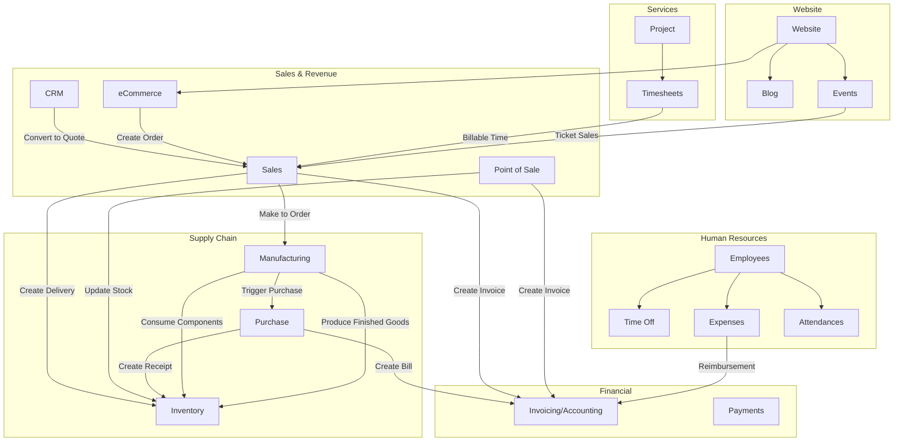

# Odoo 19.0 Community Edition - Capabilities Inventory

## Document Overview

### Purpose and Audience

This document provides a comprehensive inventory of the functional capabilities available in **Odoo 19.0 Community Edition**, the open-source enterprise resource planning (ERP) platform. It serves as the foundational reference for all user flow documentation and business rules guides in this documentation set.

**Target Audience:**
- **Customer Support Teams**: Use this guide to understand module capabilities when assisting end users
- **Business Analysts**: Reference this inventory when evaluating Odoo's functional coverage for business requirements

**How to Use This Guide:**
1. Start with the **Module Catalog** to identify which modules provide the functionality you need
2. Use the **Integration Matrix** to understand how modules work together
3. Refer to the **Domain Glossary** for definitions of Odoo-specific and business terms
4. Follow the **Related Documentation Links** to detailed user flows and business rules

### Documentation Conventions

| Convention | Description |
|------------|-------------|
| **Bold terms** | First occurrence of a glossary term |
| `Technical names` | Internal Odoo identifiers (model names, field names) |
| *Italics* | User interface labels as they appear in Odoo |
| [Links] | Cross-references to other documentation |

### Version Information

| Attribute | Value |
|-----------|-------|
| Odoo Version | 19.0 Community Edition |
| License | LGPL-3 (GNU Lesser General Public License v3) |
| Python Support | 3.10, 3.11, 3.12, 3.13 |
| Documentation Date | January 2026 |

---

## Module Catalog by Functional Category

Odoo 19.0 organizes its functionality into **34 application-level modules** across 8 functional categories. Each application can be installed independently or combined for comprehensive ERP coverage.

### Sales & CRM (5 Modules)

#### Sales (`sale_management`)

| Attribute | Details |
|-----------|---------|
| **Display Name** | Sales |
| **Technical Name** | `sale_management` |
| **Category** | Sales/Sales |
| **Summary** | From quotations to invoices |
| **Website** | https://www.odoo.com/app/sales |

**Description:**
The Sales module manages the complete sales workflow from initial customer inquiries through quotation creation, order confirmation, and invoicing. It handles the full sales lifecycle: **Quotation** → **Sales Order** → **Invoice**.

**Key Business Objects:**
- **Quotation** (`sale.order` with state='draft'): Initial price proposal to a customer
- **Sales Order** (`sale.order` with state='sale'): Confirmed customer order
- **Order Line** (`sale.order.line`): Individual product entries within an order
- **Quotation Template** (`sale.order.template`): Reusable templates for common quotations

**Integration Points:**
- **Invoicing** (`account`): Automatically creates invoices from confirmed orders
- **Inventory** (`stock`): Generates delivery orders when products are confirmed
- **CRM** (`crm`): Converts opportunities into quotations

**Primary User Roles:**
- *Sales Manager* (`sale.group_sale_manager`): Full access to all sales operations
- *Salesperson* (`sale.group_sale_salesman`): Create and manage own quotations and orders

---

#### CRM (`crm`)

| Attribute | Details |
|-----------|---------|
| **Display Name** | CRM |
| **Technical Name** | `crm` |
| **Category** | Sales/CRM |
| **Summary** | Track leads and close opportunities |
| **Website** | https://www.odoo.com/app/crm |

**Description:**
The CRM module provides customer relationship management with a visual **Kanban pipeline** for tracking sales opportunities. It supports lead generation, opportunity qualification, and sales forecasting through stage-based progression.

**Key Business Objects:**
- **Lead** (`crm.lead` with type='lead'): Unqualified potential customer
- **Opportunity** (`crm.lead` with type='opportunity'): Qualified sales prospect
- **Pipeline Stage** (`crm.stage`): Customizable stages for tracking progress
- **Sales Team** (`crm.team`): Groups of salespeople with shared targets
- **Lost Reason** (`crm.lost.reason`): Predefined reasons for lost opportunities

**Integration Points:**
- **Sales** (`sale`): Converts opportunities to quotations
- **Calendar** (`calendar`): Schedules meetings with prospects
- **Email** (`mail`): Automated follow-up communications
- **Marketing** (`mass_mailing`): Lead nurturing campaigns

**Primary User Roles:**
- *Sales Manager*: Pipeline oversight and team management
- *Salesperson*: Lead and opportunity management

---

#### Point of Sale (`point_of_sale`)

| Attribute | Details |
|-----------|---------|
| **Display Name** | Point of Sale |
| **Technical Name** | `point_of_sale` |
| **Category** | Sales/Point of Sale |
| **Summary** | Handle checkouts and payments for shops and restaurants |
| **Website** | https://www.odoo.com/app/point-of-sale-shop |

**Description:**
The Point of Sale module provides a retail checkout interface for brick-and-mortar stores and restaurants. It operates as a web-based application that can function offline and synchronizes transactions when connectivity is restored.

**Key Business Objects:**
- **POS Session** (`pos.session`): Daily cash register session with opening/closing procedures
- **POS Order** (`pos.order`): Individual customer transaction
- **POS Payment** (`pos.payment`): Payment record within an order
- **POS Configuration** (`pos.config`): Settings for each physical point of sale

**Integration Points:**
- **Inventory** (`stock`): Real-time stock updates
- **Accounting** (`account`): Journal entries for sales and payments
- **Sales** (`sale`): Customer order history

**Primary User Roles:**
- *POS Manager*: Configure POS settings and close sessions
- *Cashier*: Process customer transactions

---

#### Contacts (`contacts`)

| Attribute | Details |
|-----------|---------|
| **Display Name** | Contacts |
| **Technical Name** | `contacts` |
| **Category** | Sales/CRM |
| **Summary** | Centralize your address book |

**Description:**
The Contacts module provides a centralized directory for managing all business contacts including customers, vendors, and other partners. It serves as the foundation for partner-related data across all Odoo applications.

**Key Business Objects:**
- **Partner** (`res.partner`): Unified contact record for individuals and companies
- **Contact Type**: Company, individual, or address
- **Bank Account** (`res.partner.bank`): Banking information for payments

**Integration Points:**
- **All modules**: Partners are used across Sales, Purchasing, Accounting, HR, and more
- **Email** (`mail`): Communication history per contact

**Primary User Roles:**
- All users with appropriate access can view and edit contacts

---

#### Restaurant POS (`pos_restaurant`)

| Attribute | Details |
|-----------|---------|
| **Display Name** | Restaurant |
| **Technical Name** | `pos_restaurant` |
| **Category** | Sales/Point of Sale |
| **Summary** | Restaurant features for Point of Sale |

**Description:**
An extension to Point of Sale specifically designed for restaurant operations, adding table management, kitchen printing, and bill splitting functionality.

**Key Business Objects:**
- **Floor Plan** (`restaurant.floor`): Visual table layout
- **Table** (`restaurant.table`): Individual dining table
- **Kitchen Printer**: Separate ticket printing for kitchen orders

**Integration Points:**
- **Point of Sale** (`point_of_sale`): Extends core POS functionality

---

### Finance (1 Module)

#### Invoicing (`account`)

| Attribute | Details |
|-----------|---------|
| **Display Name** | Invoicing |
| **Technical Name** | `account` |
| **Category** | Accounting/Accounting |
| **Summary** | Invoices & Payments |
| **Website** | https://www.odoo.com/app/invoicing |

**Description:**
The Invoicing module provides comprehensive financial management including customer invoices, vendor bills, payment processing, and bank reconciliation. It serves as the financial backbone of Odoo, connecting to all other modules that have financial implications.

**Key Business Objects:**
- **Invoice/Bill** (`account.move`): Financial document (customer invoice, vendor bill, credit note)
- **Journal Entry** (`account.move.line`): Individual accounting line items
- **Payment** (`account.payment`): Customer or vendor payment record
- **Journal** (`account.journal`): Categorized transaction repository (Sales, Purchases, Bank, Cash)
- **Account** (`account.account`): Chart of accounts entry
- **Tax** (`account.tax`): Tax calculation rules
- **Payment Terms** (`account.payment.term`): Customer credit terms
- **Fiscal Position** (`account.fiscal.position`): Tax mapping rules for different jurisdictions

**Integration Points:**
- **Sales** (`sale`): Automatic invoice creation from sales orders
- **Purchase** (`purchase`): Vendor bill creation from purchase orders
- **Inventory** (`stock`): Inventory valuation and cost tracking
- **HR Expense** (`hr_expense`): Employee reimbursement

**Primary User Roles:**
- *Billing Manager* (`account.group_account_manager`): Full accounting access
- *Accountant* (`account.group_account_user`): Invoice and payment processing
- *Billing User* (`account.group_account_invoice`): Basic invoice creation

---

### Supply Chain (5 Modules)

#### Inventory (`stock`)

| Attribute | Details |
|-----------|---------|
| **Display Name** | Inventory |
| **Technical Name** | `stock` |
| **Category** | Supply Chain/Inventory |
| **Summary** | Manage your stock and logistics activities |
| **Website** | https://www.odoo.com/app/inventory |

**Description:**
The Inventory module provides complete warehouse management including stock tracking, multi-warehouse operations, traceability, and replenishment planning. It supports various inventory strategies from simple first-in-first-out (FIFO) to complex multi-step warehouse operations.

**Key Business Objects:**
- **Stock Move** (`stock.move`): Planned or executed inventory movement
- **Transfer/Picking** (`stock.picking`): Document grouping related stock moves
- **Warehouse** (`stock.warehouse`): Physical storage facility
- **Location** (`stock.location`): Specific storage area within a warehouse
- **Quant** (`stock.quant`): On-hand quantity at a specific location
- **Lot/Serial Number** (`stock.lot`): Product traceability identifier
- **Reordering Rule** (`stock.warehouse.orderpoint`): Automatic replenishment trigger

**Integration Points:**
- **Sales** (`sale_stock`): Delivery orders from sales
- **Purchase** (`purchase_stock`): Receipts from purchases
- **Manufacturing** (`mrp`): Raw material consumption and finished goods
- **Accounting** (`stock_account`): Inventory valuation

**Primary User Roles:**
- *Inventory Manager*: Warehouse configuration and oversight
- *Warehouse User*: Process transfers and adjustments

---

#### Purchase (`purchase`)

| Attribute | Details |
|-----------|---------|
| **Display Name** | Purchase |
| **Technical Name** | `purchase` |
| **Category** | Supply Chain/Purchase |
| **Summary** | Purchase orders, tenders and agreements |
| **Website** | https://www.odoo.com/app/purchase |

**Description:**
The Purchase module manages the procurement process from vendor selection through order creation, receipt confirmation, and invoice matching. It supports both direct purchases and more complex procurement workflows including approval processes.

**Key Business Objects:**
- **Request for Quotation (RFQ)** (`purchase.order` with state='draft'): Vendor price inquiry
- **Purchase Order (PO)** (`purchase.order` with state='purchase'): Confirmed vendor order
- **Purchase Order Line** (`purchase.order.line`): Individual items within an order

**Integration Points:**
- **Inventory** (`purchase_stock`): Receipt creation from purchase orders
- **Accounting** (`account`): Vendor bill matching and payment
- **Manufacturing** (`mrp`): Component procurement for production

**Primary User Roles:**
- *Purchase Manager* (`purchase.group_purchase_manager`): Approval and vendor management
- *Purchase User* (`purchase.group_purchase_user`): Order creation and tracking

---

#### Manufacturing (`mrp`)

| Attribute | Details |
|-----------|---------|
| **Display Name** | Manufacturing |
| **Technical Name** | `mrp` |
| **Category** | Supply Chain/Manufacturing |
| **Summary** | Manufacturing Orders & BOMs |
| **Website** | https://www.odoo.com/app/manufacturing |

**Description:**
The Manufacturing module provides production planning and execution capabilities including Bill of Materials (BOM) management, work order scheduling, and production tracking. It supports both discrete manufacturing and process manufacturing workflows.

**Key Business Objects:**
- **Bill of Materials (BOM)** (`mrp.bom`): Product recipe defining components
- **Manufacturing Order (MO)** (`mrp.production`): Production job
- **Work Order** (`mrp.workorder`): Individual task within a manufacturing order
- **Work Center** (`mrp.workcenter`): Production equipment or station
- **Routing** (`mrp.routing.workcenter`): Sequence of work center operations
- **Unbuild Order** (`mrp.unbuild`): Disassemble finished goods into components

**Integration Points:**
- **Inventory** (`stock`): Component consumption and finished goods production
- **Purchase** (`purchase_mrp`): Automatic component procurement
- **Sales** (`sale_mrp`): Make-to-order production
- **Quality** (Enterprise): Production quality checks

**Primary User Roles:**
- *Manufacturing Manager*: Production planning and BOM management
- *Manufacturing User*: Work order execution

---

#### Maintenance (`maintenance`)

| Attribute | Details |
|-----------|---------|
| **Display Name** | Maintenance |
| **Technical Name** | `maintenance` |
| **Category** | Supply Chain/Maintenance |
| **Summary** | Track equipment and manage maintenance requests |

**Description:**
The Maintenance module tracks equipment assets and schedules preventive maintenance activities. It helps organizations minimize downtime through planned maintenance and efficient repair request handling.

**Key Business Objects:**
- **Equipment** (`maintenance.equipment`): Asset being maintained
- **Maintenance Request** (`maintenance.request`): Work order for maintenance activity
- **Equipment Category** (`maintenance.equipment.category`): Classification of equipment

**Integration Points:**
- **Manufacturing** (`mrp`): Work center equipment tracking
- **Employees** (`hr`): Technician assignment

---

#### Repairs (`repair`)

| Attribute | Details |
|-----------|---------|
| **Display Name** | Repairs |
| **Technical Name** | `repair` |
| **Category** | Supply Chain/Repair |
| **Summary** | Repair broken or damaged products |

**Description:**
The Repairs module manages the repair workflow for returned or damaged products, tracking repair orders from receipt through completion and delivery.

**Key Business Objects:**
- **Repair Order** (`repair.order`): Repair job ticket
- **Repair Line** (`repair.line`): Parts and labor within a repair

**Integration Points:**
- **Inventory** (`stock`): Spare parts consumption
- **Sales** (`sale`): Billable repairs to customers

---

### Human Resources (8 Modules)

#### Employees (`hr`)

| Attribute | Details |
|-----------|---------|
| **Display Name** | Employees |
| **Technical Name** | `hr` |
| **Category** | Human Resources/Employees |
| **Summary** | Centralize employee information |
| **Website** | https://www.odoo.com/app/employees |

**Description:**
The Employees module provides the foundation for all HR operations, managing employee records, organizational structure, job positions, and departments. It serves as the central repository for employee data across all HR applications.

**Key Business Objects:**
- **Employee** (`hr.employee`): Individual worker record
- **Department** (`hr.department`): Organizational unit
- **Job Position** (`hr.job`): Role definition
- **Contract** (`hr.contract`): Employment agreement template
- **Work Location** (`hr.work.location`): Physical work site

**Integration Points:**
- **All HR modules**: Foundation for time off, expenses, attendance
- **Project** (`project`): Task assignment
- **Accounting** (`account`): Expense reimbursement

**Primary User Roles:**
- *HR Manager* (`hr.group_hr_manager`): Full employee management
- *HR Officer* (`hr.group_hr_user`): Day-to-day HR operations

---

#### Attendances (`hr_attendance`)

| Attribute | Details |
|-----------|---------|
| **Display Name** | Attendances |
| **Technical Name** | `hr_attendance` |
| **Category** | Human Resources/Attendances |
| **Summary** | Track employee presence |

**Description:**
The Attendances module tracks employee check-in and check-out times for time and attendance management. It supports both manual entry and integration with physical time clocks.

**Key Business Objects:**
- **Attendance** (`hr.attendance`): Time record with check-in/check-out timestamps

**Integration Points:**
- **Employees** (`hr`): Employee records
- **Time Off** (`hr_holidays`): Absence correlation

---

#### Time Off (`hr_holidays`)

| Attribute | Details |
|-----------|---------|
| **Display Name** | Time Off |
| **Technical Name** | `hr_holidays` |
| **Category** | Human Resources/Time Off |
| **Summary** | Allocate time off and follow leave requests |
| **Website** | https://www.odoo.com/app/time-off |

**Description:**
The Time Off module manages employee leave requests including vacation, sick time, and other absence types. It supports configurable approval workflows and automatic balance tracking.

**Key Business Objects:**
- **Leave Request** (`hr.leave`): Individual absence request
- **Leave Allocation** (`hr.leave.allocation`): Available leave balance
- **Leave Type** (`hr.leave.type`): Category of leave (vacation, sick, etc.)
- **Accrual Plan** (`hr.leave.accrual.plan`): Automatic leave balance accumulation

**Integration Points:**
- **Employees** (`hr`): Employee records
- **Calendar** (`calendar`): Calendar visibility of absences
- **Project** (`project_timesheet_holidays`): Timesheet impact

**Primary User Roles:**
- *Time Off Manager*: Approve requests and manage allocations
- *Employee*: Submit own leave requests

---

#### Expenses (`hr_expense`)

| Attribute | Details |
|-----------|---------|
| **Display Name** | Expenses |
| **Technical Name** | `hr_expense` |
| **Category** | Human Resources/Expenses |
| **Summary** | Submit, validate and reinvoice employee expenses |
| **Website** | https://www.odoo.com/app/expenses |

**Description:**
The Expenses module handles the complete expense management workflow from employee submission through manager approval to accounting reimbursement. It supports receipt attachments and can automatically re-invoice expenses to customers.

**Key Business Objects:**
- **Expense** (`hr.expense`): Individual expense item
- **Expense Sheet** (`hr.expense.sheet`): Collection of expenses for approval
- **Expense Category** (`product.product`): Type of expense

**Integration Points:**
- **Employees** (`hr`): Employee records
- **Accounting** (`account`): Reimbursement processing
- **Project** (`sale_expense`): Re-invoicing to customers

**Primary User Roles:**
- *Expenses Manager*: Approve expense reports
- *Employee*: Submit expenses

---

#### Recruitment (`hr_recruitment`)

| Attribute | Details |
|-----------|---------|
| **Display Name** | Recruitment |
| **Technical Name** | `hr_recruitment` |
| **Category** | Human Resources/Recruitment |
| **Summary** | Post job offers and track applicants |

**Description:**
The Recruitment module manages the hiring process from job posting through candidate evaluation to onboarding. It provides a Kanban-style pipeline for tracking applicants through recruitment stages.

**Key Business Objects:**
- **Job Position** (`hr.job`): Open position for recruitment
- **Applicant** (`hr.applicant`): Candidate record
- **Recruitment Stage** (`hr.recruitment.stage`): Pipeline stage

**Integration Points:**
- **Employees** (`hr`): Convert applicant to employee
- **Website** (`website_hr_recruitment`): Online job applications
- **Surveys** (`hr_recruitment_survey`): Candidate assessments

---

#### Skills Management (`hr_skills`)

| Attribute | Details |
|-----------|---------|
| **Display Name** | Skills Management |
| **Technical Name** | `hr_skills` |
| **Category** | Human Resources/Employees |
| **Summary** | Manage employee skills, knowledge and résumés |

**Description:**
The Skills Management module tracks employee competencies, certifications, and career development. It helps organizations identify skill gaps and plan training programs.

**Key Business Objects:**
- **Skill** (`hr.skill`): Competency definition
- **Skill Type** (`hr.skill.type`): Skill category
- **Employee Skill** (`hr.employee.skill`): Skill assigned to an employee with proficiency level

---

#### Fleet (`fleet`)

| Attribute | Details |
|-----------|---------|
| **Display Name** | Fleet |
| **Technical Name** | `fleet` |
| **Category** | Human Resources/Fleet |
| **Summary** | Manage your fleet and track car costs |
| **Website** | https://www.odoo.com/app/fleet |

**Description:**
The Fleet module tracks company vehicles including leases, insurance, maintenance, and fuel costs. It provides comprehensive vehicle lifecycle management.

**Key Business Objects:**
- **Vehicle** (`fleet.vehicle`): Company vehicle record
- **Vehicle Model** (`fleet.vehicle.model`): Car make and model
- **Vehicle Contract** (`fleet.vehicle.log.contract`): Lease or insurance agreement
- **Vehicle Cost** (`fleet.vehicle.cost`): Expense associated with a vehicle
- **Odometer Log** (`fleet.vehicle.odometer`): Mileage tracking

**Integration Points:**
- **Employees** (`hr_fleet`): Driver assignment
- **Expenses** (`hr_expense`): Vehicle-related expenses

---

#### Lunch (`lunch`)

| Attribute | Details |
|-----------|---------|
| **Display Name** | Lunch |
| **Technical Name** | `lunch` |
| **Category** | Human Resources/Lunch |
| **Summary** | Handle lunch orders of your employees |

**Description:**
The Lunch module manages employee meal orders from vendors, supporting pre-orders and group ordering with delivery coordination.

**Key Business Objects:**
- **Lunch Order** (`lunch.order`): Employee food order
- **Lunch Product** (`lunch.product`): Available menu item
- **Lunch Vendor** (`lunch.supplier`): Restaurant or caterer

---

### Services (1 Module)

#### Project (`project`)

| Attribute | Details |
|-----------|---------|
| **Display Name** | Project |
| **Technical Name** | `project` |
| **Category** | Services/Project |
| **Summary** | Organize and plan your projects |
| **Website** | https://www.odoo.com/app/project |

**Description:**
The Project module provides project management with Kanban task boards, milestone tracking, and team collaboration. It supports both internal projects and customer-facing service delivery.

**Key Business Objects:**
- **Project** (`project.project`): Container for related tasks
- **Task** (`project.task`): Individual work item
- **Task Stage** (`project.task.type`): Kanban column for task status
- **Milestone** (`project.milestone`): Key project deliverable date
- **Project Update** (`project.update`): Status report

**Integration Points:**
- **Timesheets** (`hr_timesheet`): Time tracking on tasks
- **Sales** (`sale_project`): Billable projects
- **Expenses** (`project_hr_expense`): Project-related expenses

**Primary User Roles:**
- *Project Manager*: Create projects and manage tasks
- *Project User*: Work on assigned tasks

---

### Productivity (4 Modules)

#### Discuss (`mail`)

| Attribute | Details |
|-----------|---------|
| **Display Name** | Discuss |
| **Technical Name** | `mail` |
| **Category** | Productivity/Discuss |
| **Summary** | Chat, mail gateway and private channels |
| **Website** | https://www.odoo.com/app/discuss |

**Description:**
The Discuss module provides internal communication through real-time chat, private channels, and email integration. It powers the "chatter" feature found on all Odoo records for contextual communication.

**Key Business Objects:**
- **Channel** (`discuss.channel`): Group chat or private channel
- **Message** (`mail.message`): Communication record
- **Follower** (`mail.followers`): Subscription to record updates
- **Activity** (`mail.activity`): Scheduled follow-up task

**Integration Points:**
- **All modules**: Chatter appears on most business records
- **Email**: Incoming and outgoing mail gateway

---

#### Calendar (`calendar`)

| Attribute | Details |
|-----------|---------|
| **Display Name** | Calendar |
| **Technical Name** | `calendar` |
| **Category** | Productivity/Calendar |
| **Summary** | Schedule employees' meetings |

**Description:**
The Calendar module provides event scheduling and meeting management with support for recurring events, invitations, and integration with external calendar services.

**Key Business Objects:**
- **Event** (`calendar.event`): Scheduled meeting or appointment
- **Attendee** (`calendar.attendee`): Event participant
- **Recurrence** (`calendar.recurrence`): Repeating event pattern

**Integration Points:**
- **CRM** (`crm`): Meeting scheduling with prospects
- **Employees** (`hr`): Team calendar view
- **Google Calendar** (`google_calendar`): External synchronization
- **Microsoft Calendar** (`microsoft_calendar`): External synchronization

---

#### Data Recycle (`data_recycle`)

| Attribute | Details |
|-----------|---------|
| **Display Name** | Data Recycle |
| **Technical Name** | `data_recycle` |
| **Category** | Productivity |
| **Summary** | Find and merge duplicate records |

**Description:**
The Data Recycle module helps maintain data quality by identifying and merging duplicate records, cleaning up obsolete data.

**Key Business Objects:**
- **Recycle Record** (`data_recycle.record`): Identified duplicate or obsolete record
- **Recycle Model** (`data_recycle.model`): Configuration for data cleanup

---

#### To-Do (`project_todo`)

| Attribute | Details |
|-----------|---------|
| **Display Name** | To-Do |
| **Technical Name** | `project_todo` |
| **Category** | Services/Project |
| **Summary** | Manage personal tasks and to-do lists |

**Description:**
The To-Do module provides personal task management as a simplified interface to the Project module, allowing users to track individual to-do items.

**Key Business Objects:**
- Uses **Task** (`project.task`) from the Project module

---

### Marketing (5 Modules)

#### Email Marketing (`mass_mailing`)

| Attribute | Details |
|-----------|---------|
| **Display Name** | Email Marketing |
| **Technical Name** | `mass_mailing` |
| **Category** | Marketing/Email Marketing |
| **Summary** | Design, send and track emails |

**Description:**
The Email Marketing module enables creation and sending of marketing email campaigns with drag-and-drop email design, mailing list management, and campaign analytics.

**Key Business Objects:**
- **Mailing** (`mailing.mailing`): Email campaign
- **Mailing List** (`mailing.list`): Subscriber list
- **Mailing Contact** (`mailing.contact`): Email recipient
- **Mailing Campaign** (`utm.campaign`): Marketing campaign grouping

**Integration Points:**
- **CRM** (`mass_mailing_crm`): Lead generation
- **Events** (`mass_mailing_event`): Event promotion
- **Sales** (`mass_mailing_sale`): Product promotions

---

#### SMS Marketing (`mass_mailing_sms`)

| Attribute | Details |
|-----------|---------|
| **Display Name** | SMS Marketing |
| **Technical Name** | `mass_mailing_sms` |
| **Category** | Marketing/SMS Marketing |
| **Summary** | Design, send and track SMS |

**Description:**
The SMS Marketing module extends email marketing capabilities to SMS text messaging for mobile marketing campaigns.

**Key Business Objects:**
- Uses **Mailing** (`mailing.mailing`) with SMS channel

---

#### Surveys (`survey`)

| Attribute | Details |
|-----------|---------|
| **Display Name** | Surveys |
| **Technical Name** | `survey` |
| **Category** | Marketing/Surveys |
| **Summary** | Send your surveys or share them live |
| **Website** | https://www.odoo.com/app/surveys |

**Description:**
The Surveys module creates online questionnaires for customer feedback, market research, employee assessments, and quizzes. It supports various question types and live survey sessions.

**Key Business Objects:**
- **Survey** (`survey.survey`): Questionnaire definition
- **Survey Question** (`survey.question`): Individual question
- **Survey Answer** (`survey.question.answer`): Answer option
- **User Input** (`survey.user_input`): Completed survey response

**Integration Points:**
- **Recruitment** (`hr_recruitment_survey`): Candidate assessments
- **eLearning** (`website_slides_survey`): Course certifications
- **CRM** (`survey_crm`): Lead scoring surveys

---

#### Events (`website_event`)

| Attribute | Details |
|-----------|---------|
| **Display Name** | Events |
| **Technical Name** | `website_event` |
| **Category** | Marketing/Events |
| **Summary** | Publish events, sell tickets |

**Description:**
The Events module manages event organization including registration, ticketing, and attendee communication. It supports both in-person and virtual events.

**Key Business Objects:**
- **Event** (`event.event`): Conference, seminar, or webinar
- **Event Registration** (`event.registration`): Attendee registration
- **Event Ticket** (`event.event.ticket`): Ticket type and pricing
- **Event Track** (`event.track`): Session within an event

**Integration Points:**
- **Website** (`website`): Online registration page
- **Sales** (`event_sale`): Paid event tickets
- **CRM** (`event_crm`): Lead capture at events

---

#### Marketing Card (`marketing_card`)

| Attribute | Details |
|-----------|---------|
| **Display Name** | Marketing Card |
| **Technical Name** | `marketing_card` |
| **Category** | Marketing |
| **Summary** | Create and share digital business cards |

**Description:**
The Marketing Card module creates shareable digital business cards for employees and marketing purposes.

---

### Website (5 Modules)

#### Website (`website`)

| Attribute | Details |
|-----------|---------|
| **Display Name** | Website |
| **Technical Name** | `website` |
| **Category** | Website/Website |
| **Summary** | Enterprise website builder |
| **Website** | https://www.odoo.com/app/website |

**Description:**
The Website module provides a drag-and-drop website builder for creating company websites. It includes page management, SEO tools, and building blocks (snippets) for common website elements.

**Key Business Objects:**
- **Website Page** (`website.page`): Individual web page
- **Website Menu** (`website.menu`): Navigation structure
- **Website** (`website`): Multi-website configuration

**Integration Points:**
- **eCommerce** (`website_sale`): Online store
- **Blog** (`website_blog`): Content marketing
- **Events** (`website_event`): Event registration
- **Forum** (`website_forum`): Community discussions

---

#### eCommerce (`website_sale`)

| Attribute | Details |
|-----------|---------|
| **Display Name** | eCommerce |
| **Technical Name** | `website_sale` |
| **Category** | Website/Website |
| **Summary** | Sell your products online |
| **Website** | https://www.odoo.com/app/ecommerce |

**Description:**
The eCommerce module adds online shopping functionality to the website, including product catalog, shopping cart, checkout process, and payment integration.

**Key Business Objects:**
- **Product** (`product.template`): Items for sale online
- **eCommerce Category** (`product.public.category`): Online catalog organization
- **Cart** (`sale.order` in draft state): Shopping cart
- **Pricelist** (`product.pricelist`): Online pricing rules

**Integration Points:**
- **Sales** (`sale`): Order processing
- **Inventory** (`website_sale_stock`): Stock availability display
- **Payment** (`payment`): Payment provider integration
- **Delivery** (`delivery`): Shipping methods and rates

---

#### eLearning (`website_slides`)

| Attribute | Details |
|-----------|---------|
| **Display Name** | eLearning |
| **Technical Name** | `website_slides` |
| **Category** | Website/eLearning |
| **Summary** | Manage and publish learning content |

**Description:**
The eLearning module creates online courses with videos, documents, quizzes, and certifications. It tracks learner progress and completion.

**Key Business Objects:**
- **Course** (`slide.channel`): Learning program
- **Slide/Content** (`slide.slide`): Course material (video, document, quiz)
- **Course Enrollment** (`slide.channel.partner`): Learner enrollment

**Integration Points:**
- **Surveys** (`website_slides_survey`): Certification quizzes
- **Forum** (`website_slides_forum`): Course discussions
- **Website** (`website`): Public course catalog

---

#### Online Jobs (`website_hr_recruitment`)

| Attribute | Details |
|-----------|---------|
| **Display Name** | Online Jobs |
| **Technical Name** | `website_hr_recruitment` |
| **Category** | Website/Website |
| **Summary** | Publish job positions and receive applications online |

**Description:**
The Online Jobs module publishes job openings on the website and allows candidates to submit applications directly through online forms.

**Key Business Objects:**
- Uses **Job Position** (`hr.job`) and **Applicant** (`hr.applicant`) from Recruitment module

**Integration Points:**
- **Recruitment** (`hr_recruitment`): Application processing
- **Website** (`website`): Job posting pages

---

#### Live Chat (`im_livechat`)

| Attribute | Details |
|-----------|---------|
| **Display Name** | Live Chat |
| **Technical Name** | `im_livechat` |
| **Category** | Website/Live Chat |
| **Summary** | Chat with your website visitors |

**Description:**
The Live Chat module adds real-time customer support chat to the website, allowing visitors to communicate with support agents directly.

**Key Business Objects:**
- **Live Chat Channel** (`im_livechat.channel`): Chat configuration
- **Chat Session**: Live conversation instance

**Integration Points:**
- **Website** (`website`): Chat widget on pages
- **CRM** (`crm_livechat`): Lead creation from chats
- **Helpdesk** (Enterprise): Ticket creation from chats

---

## Integration Matrix

The following diagram illustrates the key integration flows between Odoo application modules:



### Key Integration Flows

| Flow Name | Source Module | Target Module | Trigger |
|-----------|---------------|---------------|---------|
| Quote to Order | CRM | Sales | Opportunity marked as won |
| Order to Invoice | Sales | Accounting | Order confirmed or delivered |
| Order to Delivery | Sales | Inventory | Order confirmed |
| Purchase to Receipt | Purchase | Inventory | PO confirmed |
| Purchase to Bill | Purchase | Accounting | Receipt validated |
| Manufacturing to Stock | Manufacturing | Inventory | MO completed |
| Expense to Payment | Expenses | Accounting | Expense approved |
| Timesheet to Invoice | Project | Sales | Time invoiced to customer |
| Event to Sales | Events | Sales | Ticket purchased |
| eCommerce to Sales | Website Sale | Sales | Checkout completed |

---

## Multi-Company Support

Odoo 19.0 provides comprehensive multi-company support enabling organizations to manage multiple legal entities, branches, or business units within a single database.

### Company Model (`res.company`)

The company model serves as the foundation for multi-company operations:

**Key Fields:**
- `name`: Company display name
- `parent_id`: Parent company for hierarchical structures
- `child_ids`: Subsidiary companies
- `currency_id`: Primary currency for the company
- `partner_id`: Associated partner record for the company
- `country_id`: Country for localization settings

### Company Hierarchies

Odoo supports hierarchical company structures through the `parent_id` and `child_ids` fields:

```
Parent Company (Headquarters)
├── Subsidiary A (Branch 1)
│   ├── Sub-branch A1
│   └── Sub-branch A2
└── Subsidiary B (Branch 2)
```

### Company-Dependent Records

Many business records in Odoo are company-specific:

| Record Type | Company Behavior |
|-------------|------------------|
| Products | Shared across companies with company-specific pricing |
| Partners | Shared across companies |
| Journal Entries | Company-specific |
| Inventory | Company and location specific |
| Employees | Company-specific |
| Purchase Orders | Company-specific |
| Sales Orders | Company-specific |

### Multi-Company Access Rules

Users can be granted access to multiple companies:
- Users see data only for companies they have access to
- Users can switch between companies using the company selector
- Certain data (partners, products) can be shared across companies
- Financial data is always company-isolated

### Currency Handling

Each company can operate in its own currency:
- Transactions are recorded in the company's currency
- Multi-currency transactions track both original and company currency
- Exchange rate differences are automatically calculated

---

## Localization Overview

Odoo 19.0 includes extensive localization support for country-specific requirements including charts of accounts, tax structures, and regulatory compliance.

### Localization Modules

The repository includes **209+ localization modules** (prefixed `l10n_`) covering:

| Region | Module Count | Key Localizations |
|--------|--------------|-------------------|
| Europe | 45+ | Belgium, France, Germany, Italy, Spain, UK, Netherlands |
| Americas | 25+ | USA, Canada, Mexico, Brazil, Argentina, Colombia |
| Asia-Pacific | 30+ | India, Indonesia, Japan, Australia, Singapore, Malaysia |
| Middle East | 15+ | Saudi Arabia, UAE, Jordan, Egypt |
| Africa | 25+ | South Africa, Kenya, Nigeria, SYSCOHADA countries |

### Key Localization Features

**Chart of Accounts:**
- Pre-configured account structures matching local accounting standards
- Examples: SKR03/SKR04 (Germany), PCG (France), CoA (US GAAP)

**Tax Configuration:**
- Local tax rates and rules
- VAT/GST handling by country
- Withholding tax support

**Fiscal Positions:**
- Automatic tax mapping based on customer/vendor location
- Intra-community (EU) transactions
- Export/Import handling

**Electronic Invoicing (EDI):**
- Country-specific e-invoicing formats
- Examples: Factur-X (France), FatturaPA (Italy), ZATCA (Saudi Arabia)
- Peppol network integration

### Payment Provider Integrations

The repository includes **20+ payment provider modules** (prefixed `payment_`):

| Provider | Module | Region Focus |
|----------|--------|--------------|
| Stripe | `payment_stripe` | Global |
| PayPal | `payment_paypal` | Global |
| Adyen | `payment_adyen` | Global |
| Authorize.net | `payment_authorize` | North America |
| Razorpay | `payment_razorpay` | India |
| Mercado Pago | `payment_mercado_pago` | Latin America |
| Mollie | `payment_mollie` | Europe |

---

## Module Statistics

### Repository Summary

| Category | Count |
|----------|-------|
| **Total Modules** | 605+ |
| **Application Modules** | 34 |
| **Localization Modules** | 209+ |
| **Payment Provider Modules** | 20+ |
| **Bridge/Integration Modules** | 150+ |
| **Technical/Framework Modules** | 100+ |

### Modules by Category

| Category | Application Modules | Total Modules |
|----------|---------------------|---------------|
| Sales/CRM | 5 | 25+ |
| Finance/Accounting | 1 | 50+ (including localizations) |
| Supply Chain | 5 | 35+ |
| Human Resources | 8 | 30+ |
| Services | 1 | 15+ |
| Productivity | 4 | 20+ |
| Marketing | 5 | 15+ |
| Website | 5 | 30+ |
| Technical/Framework | - | 50+ |

### Module Dependencies

Most business modules depend on these core modules:
- `base`: Fundamental Odoo framework
- `mail`: Communication and chatter functionality
- `web`: User interface framework
- `product`: Product management (for modules involving products)
- `account`: Financial operations (for modules with financial impact)

---

## Domain Terminology Glossary

This glossary defines key terms used throughout Odoo and this documentation. Terms are organized alphabetically by category.

### General Odoo Terms

| Term | Definition | Where Encountered |
|------|------------|-------------------|
| **Action** | An operation triggered by user interaction, such as opening a view or running a report | Menu items, buttons |
| **Application** | A top-level Odoo module providing core business functionality (appears in main menu) | Apps menu, module installation |
| **Company** | A legal entity in Odoo; database can contain multiple companies | Company selector (top bar) |
| **Chatter** | The communication panel on records showing messages, activities, and history | Right side of form views |
| **Field** | An attribute storing data on a record (e.g., name, date, amount) | Form views, list views |
| **Follower** | A user or partner subscribed to receive notifications about a record | Chatter section |
| **Menu** | Navigation structure in Odoo interface | Left sidebar, top bar |
| **Model** | A business object type (e.g., Sale Order, Invoice, Employee) | Database tables |
| **Module** | An installable package adding functionality to Odoo | Apps menu |
| **Partner** | A contact record representing a person or company (customer, vendor, etc.) | Contacts app |
| **Record** | A single instance of a model (e.g., one specific sale order) | Form views, list items |
| **Security Group** | A permission set controlling what users can access and modify | Settings → Users |
| **View** | A visual representation of data (form, list, kanban, calendar, etc.) | All screens |

### Sales Terms

| Term | Definition | Where Encountered |
|------|------------|-------------------|
| **Quotation** | A sales proposal sent to a customer before confirmation | Sales → Quotations |
| **Sales Order (SO)** | A confirmed customer order ready for fulfillment | Sales → Orders |
| **Order Line** | An individual product entry within a quotation or order | Order form |
| **Pricelist** | A set of pricing rules for products | Sales → Configuration |
| **Discount** | Price reduction applied to order lines (percentage or fixed) | Order lines |
| **Incoterms** | International commercial terms defining delivery responsibilities | Order form |
| **Sales Team** | A group of salespeople with shared targets and pipeline | Sales → Configuration |
| **Margin** | Difference between selling price and cost | Sales reports |
| **Down Payment** | Partial payment collected before full delivery | Invoice wizard |

### CRM Terms

| Term | Definition | Where Encountered |
|------|------------|-------------------|
| **Lead** | An unqualified potential customer requiring evaluation | CRM → Leads |
| **Opportunity** | A qualified sales prospect actively being pursued | CRM → Pipeline |
| **Pipeline** | Visual representation of opportunities across sales stages | CRM main view |
| **Stage** | A step in the sales process (e.g., New, Qualified, Proposal) | Pipeline columns |
| **Win Rate** | Percentage of opportunities successfully closed | CRM reports |
| **Lost Reason** | Explanation recorded when an opportunity is marked lost | Lost opportunity wizard |
| **Activity** | A scheduled follow-up task (call, meeting, email) | Chatter activities |
| **Expected Revenue** | Projected value of an opportunity if won | Opportunity form |
| **Probability** | Likelihood of winning an opportunity (percentage) | Opportunity form |

### Inventory Terms

| Term | Definition | Where Encountered |
|------|------------|-------------------|
| **Warehouse** | A physical storage facility containing locations | Inventory → Configuration |
| **Location** | A specific storage area within a warehouse | Inventory → Configuration |
| **Stock Move** | A planned or executed movement of inventory | Transfer details |
| **Picking** | A document grouping related stock moves (receipt, delivery) | Inventory → Operations |
| **Delivery Order** | An outbound transfer to customer | Inventory → Delivery Orders |
| **Receipt** | An inbound transfer from vendor | Inventory → Receipts |
| **Quant** | On-hand quantity of a product at a specific location | Inventory adjustments |
| **Lot Number** | A tracking identifier for a batch of identical products | Product traceability |
| **Serial Number** | A unique identifier for an individual product unit | Product traceability |
| **Reordering Rule** | Automatic replenishment trigger when stock reaches minimum | Inventory → Configuration |
| **Backorder** | Remaining items to be delivered when partial shipment occurs | Transfer validation |
| **Reservation** | Stock allocated to a specific order or transfer | Picking form |

### Accounting Terms

| Term | Definition | Where Encountered |
|------|------------|-------------------|
| **Invoice** | A document requesting payment from a customer | Invoicing → Invoices |
| **Vendor Bill** | A document received from a vendor requesting payment | Invoicing → Vendor Bills |
| **Credit Note** | A document reducing the amount owed (refund, discount) | Invoicing → Credit Notes |
| **Payment** | A transaction recording money received or paid | Invoicing → Payments |
| **Journal** | A categorized repository for transactions (Sales, Bank, etc.) | Accounting → Configuration |
| **Account** | An entry in the chart of accounts for categorizing transactions | Accounting → Configuration |
| **Tax** | A calculation applied to transactions for government compliance | Accounting → Configuration |
| **Fiscal Position** | Rules for mapping taxes based on customer/vendor jurisdiction | Accounting → Configuration |
| **Reconciliation** | Matching bank statement lines with system transactions | Accounting → Bank Reconciliation |
| **Payment Terms** | Credit terms defining when payment is due | Customer/Vendor records |
| **Due Date** | Date by which payment should be received | Invoice form |
| **Aging Report** | Analysis of outstanding receivables or payables by age | Accounting → Reports |

### Purchase Terms

| Term | Definition | Where Encountered |
|------|------------|-------------------|
| **RFQ (Request for Quotation)** | A document requesting pricing from a vendor | Purchase → RFQ |
| **Purchase Order (PO)** | A confirmed order to a vendor | Purchase → Purchase Orders |
| **Vendor** | A partner from whom products or services are purchased | Purchase → Vendors |
| **Lead Time** | Expected days between order and delivery | Product form |
| **Approval** | Authorization step required before PO confirmation | Purchase workflow |
| **Three-Way Matching** | Verification of PO, receipt, and vendor bill agreement | Bill validation |

### Manufacturing Terms

| Term | Definition | Where Encountered |
|------|------------|-------------------|
| **BOM (Bill of Materials)** | Recipe defining components needed to produce a product | Manufacturing → Products |
| **Manufacturing Order (MO)** | A production job to create products | Manufacturing → Operations |
| **Work Order** | An individual task within a manufacturing order | MO form |
| **Work Center** | A production station or equipment | Manufacturing → Configuration |
| **Routing** | Sequence of work center operations for production | BOM form |
| **Component** | A raw material or sub-assembly consumed in production | BOM lines |
| **By-product** | Secondary output created during production | BOM form |
| **Scrap** | Materials discarded during production | Manufacturing → Operations |
| **Unbuild** | Process of disassembling finished goods into components | Manufacturing → Operations |

### HR Terms

| Term | Definition | Where Encountered |
|------|------------|-------------------|
| **Employee** | An individual working for the company | Employees app |
| **Department** | An organizational unit grouping employees | Employees → Configuration |
| **Job Position** | A defined role within the organization | Employees → Configuration |
| **Contract** | An employment agreement defining terms | Employee form |
| **Leave** | Time off from work (vacation, sick, etc.) | Time Off app |
| **Allocation** | Leave balance available to an employee | Time Off → Allocations |
| **Attendance** | Record of employee check-in/check-out times | Attendances app |
| **Expense** | A cost incurred by an employee for reimbursement | Expenses app |
| **Expense Report** | A collection of expenses submitted for approval | Expenses → Reports |

### Project Terms

| Term | Definition | Where Encountered |
|------|------------|-------------------|
| **Project** | A container for organizing related tasks | Project app |
| **Task** | An individual work item within a project | Project → Tasks |
| **Stage** | A status column in the Kanban task board | Project configuration |
| **Milestone** | A key deliverable date within a project | Project form |
| **Subtask** | A task nested under a parent task | Task form |
| **Timesheet** | A record of time spent on project tasks | Timesheets app |
| **Assignee** | The user responsible for completing a task | Task form |

### Website/eCommerce Terms

| Term | Definition | Where Encountered |
|------|------------|-------------------|
| **Page** | An individual web page on the Odoo website | Website → Pages |
| **Snippet** | A reusable building block for website content | Website editor |
| **Theme** | Visual design template for the website | Website → Configuration |
| **Cart** | Temporary collection of products before checkout | eCommerce |
| **Checkout** | Process of completing an online purchase | eCommerce |
| **Payment Provider** | External service processing online payments | Website → Configuration |
| **Wishlist** | Saved products for future purchase | eCommerce (customer account) |
| **Product Category** | Organizational grouping for online catalog | eCommerce → Configuration |

---

## Related Documentation Links

### User Flow Guides

| Flow | Document Path | Description |
|------|---------------|-------------|
| Sales Quote to Order | [02-user-flows/01-sales-quote-to-order/flow-document.md](../02-user-flows/01-sales-quote-to-order/flow-document.md) | Complete sales cycle workflow |
| CRM Lead to Opportunity | [02-user-flows/02-crm-lead-to-opportunity/flow-document.md](../02-user-flows/02-crm-lead-to-opportunity/flow-document.md) | Pipeline management workflow |
| Purchase RFQ to PO | [02-user-flows/03-purchase-rfq-to-po/flow-document.md](../02-user-flows/03-purchase-rfq-to-po/flow-document.md) | Procurement workflow |
| Inventory Receipt | [02-user-flows/04-inventory-receipt-processing/flow-document.md](../02-user-flows/04-inventory-receipt-processing/flow-document.md) | Receiving goods workflow |
| Inventory Delivery | [02-user-flows/05-inventory-delivery-order/flow-document.md](../02-user-flows/05-inventory-delivery-order/flow-document.md) | Shipping goods workflow |
| Invoice and Payment | [02-user-flows/06-invoice-creation-payment/flow-document.md](../02-user-flows/06-invoice-creation-payment/flow-document.md) | Accounts receivable workflow |
| Vendor Bill Payment | [02-user-flows/07-vendor-bill-payment/flow-document.md](../02-user-flows/07-vendor-bill-payment/flow-document.md) | Accounts payable workflow |
| Manufacturing Order | [02-user-flows/08-manufacturing-production-order/flow-document.md](../02-user-flows/08-manufacturing-production-order/flow-document.md) | Production workflow |
| POS Transaction | [02-user-flows/09-pos-session-transaction/flow-document.md](../02-user-flows/09-pos-session-transaction/flow-document.md) | Retail checkout workflow |
| Project Task | [02-user-flows/10-project-task-management/flow-document.md](../02-user-flows/10-project-task-management/flow-document.md) | Task management workflow |
| Leave Request | [02-user-flows/11-employee-leave-request/flow-document.md](../02-user-flows/11-employee-leave-request/flow-document.md) | Time off request workflow |
| Expense Claim | [02-user-flows/12-expense-claim-reimbursement/flow-document.md](../02-user-flows/12-expense-claim-reimbursement/flow-document.md) | Expense reimbursement workflow |
| eCommerce Checkout | [02-user-flows/13-website-ecommerce-checkout/flow-document.md](../02-user-flows/13-website-ecommerce-checkout/flow-document.md) | Online purchase workflow |
| Bank Reconciliation | [02-user-flows/14-bank-reconciliation/flow-document.md](../02-user-flows/14-bank-reconciliation/flow-document.md) | Financial reconciliation workflow |
| Inventory Adjustment | [02-user-flows/15-inventory-adjustment/flow-document.md](../02-user-flows/15-inventory-adjustment/flow-document.md) | Stock count workflow |

### Business Rules Documentation

| Module | Document Path |
|--------|---------------|
| Sales | [04-business-rules/sales-quote-to-order-rules.md](../04-business-rules/sales-quote-to-order-rules.md) |
| CRM | [04-business-rules/crm-lead-to-opportunity-rules.md](../04-business-rules/crm-lead-to-opportunity-rules.md) |
| Purchase | [04-business-rules/purchase-rfq-to-po-rules.md](../04-business-rules/purchase-rfq-to-po-rules.md) |
| Inventory | [04-business-rules/inventory-receipt-rules.md](../04-business-rules/inventory-receipt-rules.md) |
| Accounting | [04-business-rules/invoice-payment-rules.md](../04-business-rules/invoice-payment-rules.md) |
| Manufacturing | [04-business-rules/manufacturing-rules.md](../04-business-rules/manufacturing-rules.md) |
| HR | [04-business-rules/leave-request-rules.md](../04-business-rules/leave-request-rules.md) |
| Project | [04-business-rules/project-task-rules.md](../04-business-rules/project-task-rules.md) |

### External Resources

| Resource | URL | Description |
|----------|-----|-------------|
| Official Documentation | https://www.odoo.com/documentation/19.0/ | Odoo's official user and developer documentation |
| Odoo eLearning | https://www.odoo.com/slides | Video tutorials and certification courses |
| Odoo Forum | https://www.odoo.com/forum | Community support and discussions |
| Odoo Apps | https://www.odoo.com/apps | Third-party module marketplace |

---

## Document Metadata

| Attribute | Value |
|-----------|-------|
| Document Version | 1.0 |
| Created Date | January 2026 |
| Last Updated | January 2026 |
| Odoo Version | 19.0 Community Edition |
| Documentation Type | Capabilities Inventory |
| Target Audience | Customer Support Teams, Business Analysts |

---

*Source: This document was generated from analysis of the Odoo 19.0 Community Edition source code located at `/tmp/blitzy/blitzy-odoo/19.0/`.*
