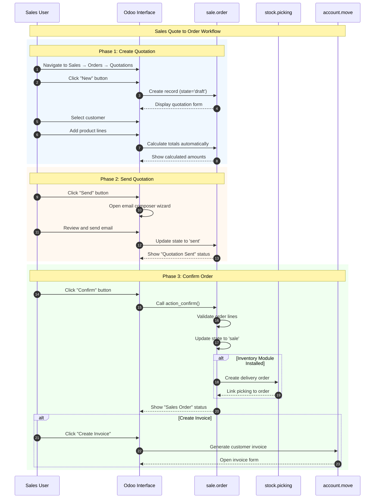
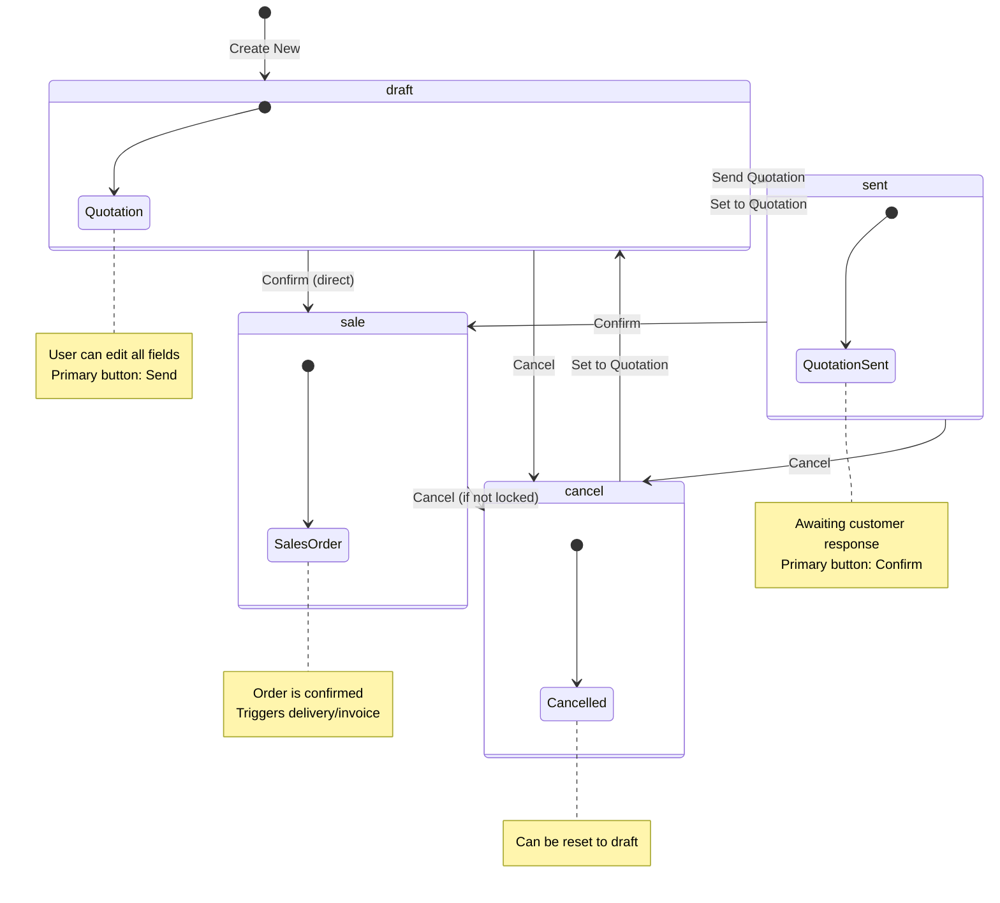

# Sales Quote to Order Workflow

## Overview

### Business Objective

The Sales Quote to Order workflow is the **primary revenue-generating process** in Odoo. It enables your sales team to create price proposals for customers, send professional quotations, and convert accepted quotes into confirmed sales orders that trigger fulfillment activities.

**What This Workflow Accomplishes:**
- Creates professional quotations with products, prices, and terms
- Tracks quotation status from draft through customer acceptance
- Converts approved quotations into actionable sales orders
- Automatically initiates delivery preparation and invoicing

### Target Personas

| Role | Responsibilities | Typical Actions |
|------|------------------|-----------------|
| **Sales Representative** | Create quotations, follow up with customers | Creates quotes, sends to customers, confirms orders |
| **Sales Manager** | Oversee sales team, approve large orders | Reviews quotations, monitors pipeline, handles escalations |
| **Customer** | Reviews and approves quotations | Receives quotation email, signs online, makes payment |

### Business Value

This workflow is critical because:
- **Revenue Generation**: Every confirmed sales order represents committed revenue
- **Customer Experience**: Professional quotations build trust and credibility
- **Process Efficiency**: Automatic triggers reduce manual data entry
- **Visibility**: Sales managers can track quotation status in real-time

---

## Prerequisites

### Required Modules

Before using this workflow, ensure the following modules are installed:

| Module | Technical Name | Purpose |
|--------|----------------|---------|
| **Sales** | `sale_management` | Core quotation and order management |
| **Contacts** | `contacts` | Customer database |

**Optional modules that enhance this workflow:**
- **Inventory** (`stock`): Enables automatic delivery order creation
- **Invoicing** (`account`): Enables invoice generation from orders
- **CRM** (`crm`): Enables quotation creation from opportunities

### Required User Permissions

The user must belong to one of these security groups:

| Group | Access Level | Can Perform |
|-------|--------------|-------------|
| *Sales / User: Own Documents Only* | Basic | Create and manage own quotations |
| *Sales / User: All Documents* | Standard | View all quotations, create and manage own |
| *Sales / Administrator* | Full | All operations including settings |

To check your permissions: Navigate to *Settings → Users & Companies → Users → [Your User] → Access Rights*.

### Required Data Setup

Before creating quotations, ensure the following are configured:

1. **At least one customer** in the Contacts database
2. **Products** available for sale (with "Can be Sold" checkbox enabled)
3. **Company settings** including address and currency
4. **Pricelist** (optional, for custom pricing)

---

## Workflow Diagram

### Sequence Diagram

The following diagram shows the complete interaction flow from user action through system processing:

### State Machine Diagram

A **Quotation/Sales Order** progresses through the following states:

**State Definitions:**

| State | Display Name | Description |
|-------|--------------|-------------|
| `draft` | Quotation | Initial state; fully editable price proposal |
| `sent` | Quotation Sent | Quotation has been sent to customer; awaiting response |
| `sale` | Sales Order | Customer has accepted; order is confirmed |
| `cancel` | Cancelled | Order has been cancelled |

*Source: `addons/sale/models/sale_order.py:26-31`*

---

## Step-by-Step Guide

### Step 1: Create a New Quotation

**What You Want to Accomplish:** Start a new price proposal for a customer.

**Navigation Path:** *Sales → Orders → Quotations*

**Actions:**

1. **Click the "New" button** in the top-left corner of the quotations list
   - A blank quotation form opens
   - The system automatically assigns a reference number (e.g., "S00001" or "New")

2. **Select the customer** from the "Customer" dropdown field
   - Start typing the customer name to search
   - If the customer doesn't exist, click "Create" to add them

3. **Set optional details:**
   - *Expiration*: How long the quotation remains valid
   - *Payment Terms*: When the customer should pay (e.g., "30 Days")
   - *Pricelist*: Special pricing rules for this customer

**What the User Sees:**

At this point, the screen displays:
- A form with the quotation reference at the top
- Customer information section (left side)
- Order details section (right side)
- An empty "Order Lines" section at the bottom
- Status bar showing "Quotation" as the current state
- **"Send"** button highlighted as the primary action
- "Confirm" button available as a secondary action

**Screenshot Reference:** `screenshots/01-01-create-quotation.png`

---

### Step 2: Add Products to the Quotation

**What You Want to Accomplish:** Specify what products the customer wants to purchase.

**Actions:**

1. **Click "Add a line"** in the Order Lines section
   - A new row appears in the product table

2. **Select a product** from the "Product" dropdown
   - The system automatically fills in:
     - Product description
     - Unit price (from product record or pricelist)
     - Default taxes

3. **Enter the quantity** in the "Quantity" column
   - The system automatically calculates the subtotal

4. **Adjust the unit price or discount** if needed
   - Price changes are highlighted for transparency

5. **Repeat** for additional products as needed

**What the User Sees:**

The Order Lines section now shows:
- Product name and description for each line
- Quantity, unit price, and discount columns
- Calculated subtotal for each line
- **Automatic totals** at the bottom:
  - *Untaxed Amount*: Sum before taxes
  - *Taxes*: Calculated tax amounts
  - *Total*: Final amount including taxes

**Important:** The system prevents saving if any order line is missing a product.

**Screenshot Reference:** `screenshots/01-02-add-products.png`

---

### Step 3: Send the Quotation to the Customer

**What You Want to Accomplish:** Email a professional quotation PDF to the customer.

**Actions:**

1. **Click the "Send" button**
   - An email composition window opens
   - The quotation PDF is automatically attached

2. **Review the email content**
   - The customer's email address is pre-filled from the "To" field
   - The subject line includes the quotation reference
   - A standard template message is loaded

3. **Customize the message** if desired
   - Add a personal note or additional information
   - You can also change the email template

4. **Click "Send"** to dispatch the email
   - The system sends the email with PDF attachment
   - The quotation status changes to "Quotation Sent"

**What the User Sees:**

After sending:
- The status bar changes from "Quotation" to **"Quotation Sent"**
- The **"Confirm"** button becomes the primary (highlighted) action
- The "Send" button remains available for resending
- A message appears in the chatter: "Quotation sent by email"

**Alternative:** If you want to mark the quotation as sent without actually emailing (e.g., you handed a printed copy to the customer), click *Action → Mark as Sent*.

**Screenshot Reference:** `screenshots/01-03-send-quotation.png`

---

### Step 4: Confirm the Sales Order

**What You Want to Accomplish:** Convert the accepted quotation into a confirmed sales order.

**Actions:**

1. **Click the "Confirm" button**
   - The system validates the order
   - The status changes to "Sales Order"

2. **Observe the automatic actions:**
   - The order reference changes format (e.g., "S00001" becomes confirmed)
   - The confirmation date is recorded
   - If Inventory is installed: A delivery order is automatically created
   - A "Delivery" smart button appears (showing pending deliveries)

**What the User Sees:**

After confirmation:
- Status bar shows **"Sales Order"** (green indicator)
- The **"Create Invoice"** button appears as the primary action
- If Inventory is installed: A **"Delivery"** smart button shows "1" (or more)
- Most fields become read-only (the order is now locked for editing)

**Important Validation:**
- The system checks that all order lines have products assigned
- The system verifies the customer exists and is valid
- Any validation errors are displayed as a warning message

**Screenshot Reference:** `screenshots/01-04-confirm-order.png`

---

### Step 5: View the Confirmed Sales Order

**What You Want to Accomplish:** Review the confirmed order and access related documents.

**Actions:**

1. **Review the confirmed order details:**
   - Order reference and confirmation date
   - Customer information
   - Confirmed product lines and totals

2. **Access related documents using smart buttons:**
   - **Delivery** button: View/process the delivery order
   - **Invoice** button: View linked invoices (after creation)

3. **Create an invoice** (if needed):
   - Click "Create Invoice" button
   - Choose invoice timing (now, at delivery, etc.)
   - Review and confirm the invoice wizard

**What the User Sees:**

The confirmed order displays:
- **Order reference** prominently at the top (e.g., "S00001")
- **Confirmation date** in the header
- All customer and product details
- **Smart buttons** for quick navigation:
  - *Delivery*: Shows count of delivery orders
  - *Invoice*: Shows count of invoices (once created)
- Chatter showing order history and communications

**Screenshot Reference:** `screenshots/01-05-order-confirmed.png`

---

## Variations and Edge Cases

### Direct Confirmation (Skip Send Step)

**Scenario:** The customer accepts the quotation immediately (e.g., during a phone call).

**How to Handle:**
1. Create the quotation with products (Steps 1-2)
2. Click **"Confirm"** directly (skip the Send step)
3. The quotation converts directly from "draft" to "sale" state

**Note:** This is a valid workflow for in-person sales or phone orders.

---

### Quotation Cancellation

**Scenario:** The customer declines the quotation or you need to void it.

**How to Handle:**
1. Open the quotation (in any state except "locked")
2. Click **"Cancel"** button
3. Confirm the cancellation when prompted
4. The status changes to "Cancelled"

**What Happens:**
- Any draft invoices linked to the order are also cancelled
- Confirmed deliveries are NOT automatically cancelled (must be handled separately)

*Source: `addons/sale/models/sale_order.py:1313-1322`*

---

### Resetting a Cancelled Order

**Scenario:** A cancelled order needs to be reactivated.

**How to Handle:**
1. Open the cancelled order
2. Click **"Set to Quotation"** button
3. The order returns to "draft" state

**What Happens:**
- The order becomes editable again
- Any signatures are cleared
- You can modify and resend the quotation

*Source: `addons/sale/models/sale_order.py:1047-1054`*

---

### Locked Orders

**Scenario:** A confirmed order needs to be protected from accidental changes.

**Understanding Locked Orders:**
- When the "Lock confirmed orders" setting is enabled, orders automatically lock upon confirmation
- Locked orders cannot be modified or cancelled
- Only Sales Managers can unlock orders

**How to Unlock:**
1. Navigate to the locked order
2. As a Sales Manager, click **"Unlock"** button
3. The order becomes editable

**How to Lock Manually:**
1. Navigate to a confirmed order
2. Click **"Lock"** button (if available)
3. The order becomes protected

---

### Resending a Quotation

**Scenario:** The customer didn't receive the email or requests another copy.

**How to Handle:**
1. Open the existing quotation (in "sent" or "draft" state)
2. Click the **"Send"** button again
3. The email wizard opens with the same template
4. Customize if needed and click "Send"

**Note:** Resending does not change the quotation state if it's already "sent".

---

### Creating a Quotation from an Opportunity

**Scenario:** Converting a CRM opportunity into a quotation (requires CRM module).

**How to Handle:**
1. Open the opportunity in CRM
2. Click **"New Quotation"** button
3. The quotation form opens with customer information pre-filled
4. Add products and continue with standard workflow

---

## Integration Points

### Integration with Inventory Module

**When Active:** If the Inventory (`stock`) module is installed alongside Sales.

**Automatic Behavior:**
- When a sales order is confirmed, the system automatically creates a **Delivery Order** (`stock.picking`)
- The delivery order contains the same products as the sales order
- The "Delivery" smart button on the sales order shows the count of linked deliveries

**User Impact:**
- The sales user sees a "Delivery" smart button after order confirmation
- Clicking this button navigates to the warehouse transfer document
- Warehouse staff can then process the physical shipment

---

### Integration with Invoicing Module

**When Active:** If the Invoicing (`account`) module is installed alongside Sales.

**Automatic Behavior:**
- Confirmed orders show a "Create Invoice" button
- Invoices can be created for the full amount or as down payments
- The invoice references the sales order as its source document

**User Impact:**
- The sales user can create invoices directly from the order
- The "Invoice" smart button shows linked invoice count
- Invoice status is tracked on the order (e.g., "To Invoice", "Fully Invoiced")

---

### Integration with CRM Module

**When Active:** If the CRM module is installed alongside Sales.

**Automatic Behavior:**
- Opportunities can be converted to quotations with one click
- Customer data flows from the opportunity to the quotation
- The opportunity tracks all linked quotations

**User Impact:**
- Sales users can seamlessly move from prospect to quotation
- Full sales pipeline visibility from lead to order

---

## Error Scenarios

### Missing Product on Order Line

**Error Message:** "Some order lines are missing a product, you need to correct them before going further."

**When It Occurs:** The user tries to confirm an order where at least one order line has no product selected.

**What the User Sees:**
- A warning popup appears when clicking "Confirm"
- The order remains in its current state

**How to Resolve:**
1. Review all order lines
2. Either add a product to empty lines or delete the empty lines
3. Try confirming again

*Source: `addons/sale/models/sale_order.py:1197-1203`*

---

### Attempting to Confirm a Cancelled Order

**Error Message:** "Some orders are not in a state requiring confirmation."

**When It Occurs:** The user tries to confirm an order that is in "cancelled" state.

**What the User Sees:**
- A warning popup appears
- The confirm action is blocked

**How to Resolve:**
1. First click "Set to Quotation" to reset the order to draft state
2. Then proceed with the normal confirmation workflow

*Source: `addons/sale/models/sale_order.py:1195-1196`*

---

### Cancelling a Locked Order

**Error Message:** "You cannot cancel a locked order. Please unlock it first."

**When It Occurs:** The user tries to cancel an order that has been locked.

**What the User Sees:**
- A warning popup appears
- The cancel action is blocked

**How to Resolve:**
1. Contact a Sales Manager
2. The manager must click "Unlock" first
3. Then the order can be cancelled

*Source: `addons/sale/models/sale_order.py:1315-1316`*

---

### Company Mismatch

**Error Context:** Products from a different company are added to an order.

**When It Occurs:** In multi-company setups, if a product belongs to Company B but the order is for Company A.

**What the User Sees:**
- Validation error when saving or confirming
- Message indicates company inconsistency

**How to Resolve:**
1. Verify you're working in the correct company
2. Use the company switcher in the top-right menu
3. Select products that belong to the current company

---

## What the User Sees: UI State Reference

### Draft State (Quotation)

| UI Element | Appearance |
|------------|------------|
| Status Bar | Shows "Quotation" highlighted |
| Primary Button | **Send** (blue/highlighted) |
| Secondary Buttons | Confirm, Preview, Cancel |
| Form Fields | All editable |
| Smart Buttons | None or minimal |

### Sent State (Quotation Sent)

| UI Element | Appearance |
|------------|------------|
| Status Bar | Shows "Quotation Sent" highlighted |
| Primary Button | **Confirm** (blue/highlighted) |
| Secondary Buttons | Send, Preview, Cancel, Set to Quotation |
| Form Fields | All editable |
| Smart Buttons | None or minimal |

### Sale State (Sales Order)

| UI Element | Appearance |
|------------|------------|
| Status Bar | Shows "Sales Order" highlighted (green) |
| Primary Button | **Create Invoice** (if applicable) |
| Secondary Buttons | Send, Cancel (if not locked), Lock/Unlock |
| Form Fields | Most fields read-only |
| Smart Buttons | Delivery (count), Invoice (count) |

### Cancelled State

| UI Element | Appearance |
|------------|------------|
| Status Bar | Shows "Cancelled" |
| Primary Button | **Set to Quotation** |
| Form Fields | Read-only |
| Visual Indicator | Greyed out or muted appearance |

---

## Business Rules Reference

For detailed information about validation logic, computation rules, and access control for this workflow, see:

**[Sales Quote to Order Business Rules](../../04-business-rules/sales-quote-to-order-rules.md)**

Key rules documented there include:
- Required fields for order confirmation
- State transition validation
- Automatic total calculations
- Tax computation logic
- Access control by security group

---

## Related Documentation

- **[Capabilities Inventory](../../01-capabilities-overview/capabilities-inventory.md)** - Complete module reference including Sales module details
- **[Inventory Delivery Order Flow](../05-inventory-delivery-order/flow-document.md)** - Processing deliveries generated from sales orders
- **[Invoice Creation and Payment Flow](../06-invoice-creation-payment/flow-document.md)** - Creating invoices from confirmed orders
- **[CRM Lead to Opportunity Flow](../02-crm-lead-to-opportunity/flow-document.md)** - Converting opportunities to quotations

---

## Glossary of Terms Used

| Term | Definition |
|------|------------|
| **Quotation** | A price proposal sent to a customer; not yet a committed order |
| **Sales Order** | A confirmed customer order that triggers fulfillment activities |
| **Order Line** | An individual product entry within a quotation or order |
| **Pricelist** | A set of pricing rules that determine product prices for specific customers or conditions |
| **Delivery Order** | A warehouse document that authorizes shipping products to the customer |
| **Smart Button** | A clickable button on a record that shows a count and links to related records |
| **Chatter** | The communication history panel on records showing messages and activity |
| **State** | The current status of a document in its workflow lifecycle |

---

*Document Version: 1.0*  
*Source References:*
- *`addons/sale/models/sale_order.py`*
- *`addons/sale/views/sale_order_views.xml`*
- *Odoo 19.0 Community Edition*
