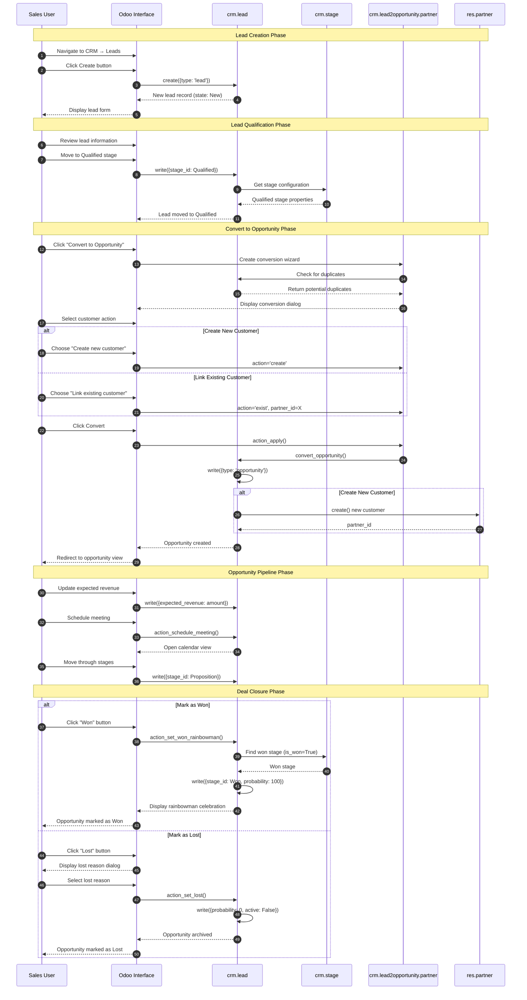
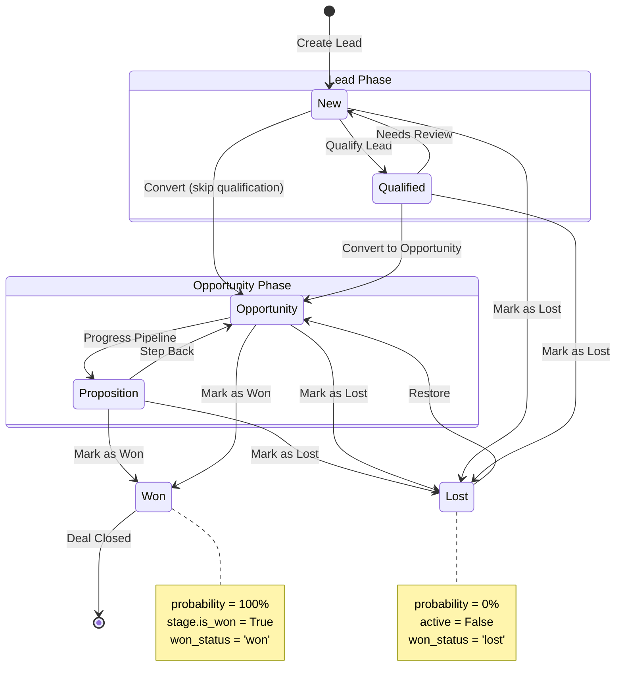
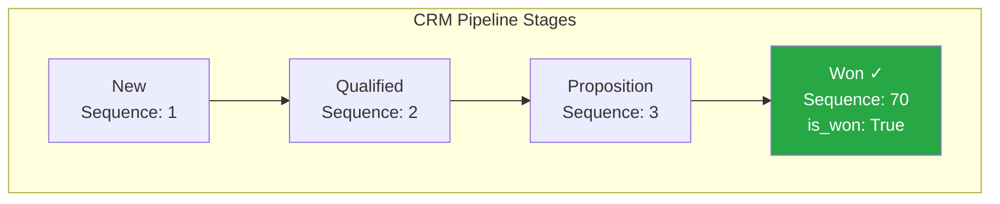

# CRM Lead to Opportunity Workflow

## Document Information

| Attribute | Value |
|-----------|-------|
| **Flow Number** | 02 |
| **Flow Name** | CRM Lead to Opportunity |
| **Primary Module** | `crm` (CRM) |
| **Business Value** | Pipeline management and revenue forecasting |
| **Odoo Version** | 19.0 Community Edition |
| **Last Updated** | January 2026 |

---

## 1. Overview

### Business Objective

The CRM Lead to Opportunity workflow enables organizations to manage their sales pipeline from initial prospect contact through deal closure. This workflow supports:

- **Lead Generation**: Capturing potential customer information from various sources
- **Lead Qualification**: Evaluating leads to determine sales readiness
- **Opportunity Management**: Tracking qualified prospects through the sales pipeline
- **Revenue Forecasting**: Predicting future revenue based on opportunity probability and expected values
- **Win/Loss Analysis**: Recording outcomes to improve future sales performance

### Target Personas

| Role | Responsibility in This Workflow |
|------|--------------------------------|
| **Sales Representative** | Creates and qualifies leads, manages opportunities, schedules meetings, updates deal status |
| **Sales Manager** | Oversees pipeline, reviews team performance, approves high-value deals |
| **Marketing Team** | Generates leads through campaigns, monitors lead source effectiveness |

### Key Terminology

| Term | Definition |
|------|------------|
| **Lead** | An unqualified potential customer that has shown initial interest but has not yet been evaluated for sales readiness |
| **Opportunity** | A qualified sales prospect that has been determined to have genuine potential for a deal |
| **Pipeline** | The visual representation of sales opportunities organized by progression stages |
| **Stage** | A defined step in the sales pipeline representing the current status of a lead or opportunity |
| **Probability** | The estimated likelihood (0-100%) that an opportunity will result in a successful sale |
| **Won** | The final status indicating a successful deal closure |
| **Lost** | The final status indicating an unsuccessful deal outcome |

---

## 2. Prerequisites

### Required Modules

| Module | Technical Name | Installation Purpose |
|--------|---------------|---------------------|
| **CRM** | `crm` | Core lead and opportunity management |
| **Contacts** | `contacts` | Customer and partner management |
| **Calendar** | `calendar` | Meeting scheduling with prospects |
| **Discuss** | `mail` | Email tracking and activity management |

### User Permissions

| Security Group | Technical Name | Access Level |
|---------------|----------------|--------------|
| *Sales / User: Own Documents Only* | `sales_team.group_sale_salesman` | Create and manage own leads/opportunities |
| *Sales / User: All Documents* | `sales_team.group_sale_salesman_all_leads` | Access to all team leads/opportunities |
| *Sales / Administrator* | `sales_team.group_sale_manager` | Full configuration and management access |

**Note:** The "CRM Leads" feature must be enabled in the CRM settings to use the two-step lead-to-opportunity workflow. Without this feature, records are created directly as opportunities.

### Initial Setup Requirements

Before using this workflow, ensure the following are configured:

1. **Sales Teams**: At least one sales team must be created with assigned members
2. **Pipeline Stages**: The default stages (New, Qualified, Proposition, Won) are automatically created, but can be customized
3. **Lost Reasons**: Predefined reasons for lost opportunities should be configured for analytics

---

## 3. Flow Diagram

### Sequence Diagram - Lead to Opportunity Flow

### State Machine Diagram - Pipeline Progression

### Default Pipeline Stages

*Source: `addons/crm/data/crm_stage_data.xml`*

---

## 4. Step-by-Step Breakdown

### Step 1: Create a New Lead

**Business Context:**
When a potential customer shows interest—through a website form, trade show contact, or phone inquiry—the sales representative captures this information as a new lead.

**Navigation Path:**
*CRM* → *Leads* → *Create*

**What the User Does:**
1. From the main Odoo menu, click on **CRM** to open the CRM application
2. In the left menu, click on **Leads** (this option appears only if the "CRM Leads" feature is enabled)
3. Click the **Create** button in the upper left corner
4. Fill in the lead information:
   - **Lead Name**: Enter a descriptive name for the lead (e.g., "Website inquiry - ABC Company")
   - **Company Name**: Enter the potential customer's company name
   - **Contact Name**: Enter the name of the person you spoke with
   - **Email**: Enter the contact's email address
   - **Phone**: Enter the contact's phone number

**What the System Does:**
- Creates a new `crm.lead` record with `type='lead'`
- Automatically assigns the lead to the current user as the **Salesperson**
- Sets the initial stage to **New**
- Calculates an initial **Probability** based on the stage (if predictive lead scoring is enabled)

**Screenshot Reference:** `02-01-create-lead.png`

**What the User Sees After This Step:**
The lead form is displayed with the entered information. The header shows:
- The lead name at the top
- The **Convert to Opportunity** button (highlighted in blue)
- No stage statusbar (stages only appear after conversion to opportunity)

*Source: `addons/crm/models/crm_lead.py:123-125` - type field default*

---

### Step 2: Qualify the Lead

**Business Context:**
Before investing significant sales effort, the lead should be evaluated to determine if it represents a genuine sales opportunity. Qualification criteria may include budget availability, decision-making authority, need, and timeline (BANT).

**Navigation Path:**
*CRM* → *Leads* → *[Select Lead]* or use Kanban view

**What the User Does:**
1. Review the lead information to assess qualification criteria
2. Add notes in the **Internal Notes** section about qualification findings
3. Optionally, update additional fields:
   - **Expected Revenue**: Estimated deal value
   - **Priority**: Set to High/Very High for hot leads (star rating)
4. To mark as qualified, either:
   - **Option A (Kanban)**: Drag the lead card to the "Qualified" column
   - **Option B (Form)**: The stage can also be updated via the conversion wizard

**What the System Does:**
- Updates the `stage_id` field to the **Qualified** stage
- Recalculates `automated_probability` based on stage and other factors
- Records the stage change in the activity log (chatter)

**Screenshot Reference:** `02-02-qualify-lead.png`

**What the User Sees After This Step:**
- In Kanban view: The lead card appears in the "Qualified" column
- In form view: The qualification status is reflected in the lead details
- The activity log shows the stage change with timestamp

*Source: `addons/crm/data/crm_stage_data.xml:8-12` - Qualified stage definition*

---

### Step 3: Convert Lead to Opportunity

**Business Context:**
When a lead is qualified and ready for active sales pursuit, it should be converted to an opportunity. This conversion optionally creates a customer record and allows duplicate detection to prevent creating redundant records.

**Navigation Path:**
*CRM* → *Leads* → *[Select Lead]* → *Convert to Opportunity*

**What the User Does:**
1. Open the lead you want to convert
2. Click the **Convert to Opportunity** button (blue button in the header)
3. The "Convert to Opportunity" dialog appears with the following options:

   **Conversion Action:**
   - **Convert to opportunity**: Standard conversion (default)
   - **Merge with existing opportunities**: Combine with detected duplicates

   **Related Customer:**
   - **Create a new customer**: Creates a new partner record from lead data
   - **Link to an existing customer**: Associate with an existing partner

4. If duplicates are detected, review the **Potential Duplicates** section
5. Optionally adjust:
   - **Salesperson**: Assign or reassign the opportunity
   - **Sales Team**: Select the appropriate team
6. Click **Create Opportunity** to complete the conversion

**What the System Does:**
- Changes the record's `type` from `'lead'` to `'opportunity'`
- Sets `date_conversion` to the current timestamp
- If "Create new customer" was selected:
  - Creates a new `res.partner` record with the lead's contact information
  - Links the partner to the opportunity via `partner_id`
- If "Link existing customer" was selected:
  - Associates the selected partner with the opportunity
- Assigns the specified salesperson and team
- Redirects to the opportunity form view

**Screenshot Reference:** `02-03-convert-opportunity.png`

**What the User Sees After This Step:**
- The record now appears in the **Pipeline** view (opportunities)
- The header displays the **Won** and **Lost** buttons
- A stage **statusbar** appears showing pipeline progression
- The **Customer** field shows the linked partner
- Expected revenue and probability fields are prominently displayed

*Source: `addons/crm/wizard/crm_lead_to_opportunity.py:121-127` - action_apply method*

---

### Step 4: Work the Opportunity Through the Pipeline

**Business Context:**
Once an opportunity is created, the sales representative actively works to progress the deal through the pipeline stages by engaging with the customer, presenting proposals, and addressing concerns.

**Navigation Path:**
*CRM* → *Pipeline* → *[Select Opportunity]*

**What the User Does:**

**A. Update Opportunity Details:**
1. Open the opportunity from the Pipeline Kanban view
2. Update key fields as the deal progresses:
   - **Expected Revenue**: The anticipated deal value
   - **Probability**: Manually adjust if automated probability doesn't reflect reality
   - **Expected Closing Date**: When you expect to close the deal

**B. Move Through Pipeline Stages:**
1. Use one of these methods to advance the opportunity:
   - **Kanban Drag**: Drag the opportunity card to the next stage column
   - **Statusbar Click**: Click on the desired stage in the form view header
2. Common stage progression:
   - **Qualified** → **Proposition** (proposal sent to customer)

**C. Schedule Meetings:**
1. Click the **Meeting** button (calendar icon) in the opportunity form
2. Select a date and time for the customer meeting
3. Add meeting details and attendees
4. Save the meeting

**What the System Does:**
- Updates `stage_id` when moving through stages
- Recalculates `prorated_revenue` (expected_revenue × probability)
- Creates `calendar.event` records linked to the opportunity
- Tracks time spent in each stage via `duration_tracking`
- Logs all changes in the activity chatter

**Screenshot Reference:** `02-04-opportunity-pipeline.png`

**What the User Sees After This Step:**
- Kanban view shows opportunities organized by stage columns
- Each opportunity card displays:
  - Customer name
  - Expected revenue
  - Probability percentage
  - Next activity indicator (if scheduled)
- The **Proposition** stage indicates active proposals

*Source: `addons/crm/views/crm_lead_views.xml:18-21` - stage_id widget*

---

### Step 5: Mark Opportunity as Won

**Business Context:**
When the customer agrees to the deal and the sale is confirmed, the opportunity is marked as Won. This final step completes the sales cycle and contributes to revenue reporting.

**Navigation Path:**
*CRM* → *Pipeline* → *[Select Opportunity]* → *Won*

**What the User Does:**
1. Open the won opportunity
2. Click the **Won** button (green button in the header)
3. The system immediately processes the win

**What the System Does:**
- Calls `action_set_won_rainbowman()` method
- Finds the first stage with `is_won=True` (typically "Won" stage)
- Updates the opportunity:
  - Sets `stage_id` to the Won stage
  - Sets `probability` to 100%
  - Sets `date_closed` to the current timestamp
  - Computes `won_status` as `'won'`
- Displays a **celebration effect** (rainbowman animation) with a congratulatory message
- The message may highlight achievements such as:
  - First win from a particular source
  - Largest deal in the team
  - Quick progression through the pipeline

**Screenshot Reference:** `02-05-mark-won.png`

**What the User Sees After This Step:**
- A celebratory "rainbowman" animation appears
- A green **Won** ribbon appears on the opportunity form
- The probability shows 100%
- The **Won** button is no longer visible
- The opportunity remains accessible for reference

**Congratulatory Messages (Examples):**
- "Boom! Team record for the past 7 days with this deal!"
- "First victory! Congrats on your first deal!"
- "You just expanded the map! First win in [Country]."
- "Yay, your first win from [Source]!"

*Source: `addons/crm/models/crm_lead.py:1159-1173` - action_set_won_rainbowman method*

---

### Step 6 (Alternative): Mark Opportunity as Lost

**Business Context:**
When an opportunity does not result in a sale—perhaps the customer chose a competitor, decided not to proceed, or the deal stalled—it should be marked as Lost. Recording the reason helps improve future sales strategies.

**Navigation Path:**
*CRM* → *Pipeline* → *[Select Opportunity]* → *Lost*

**What the User Does:**
1. Open the opportunity that will not close
2. Click the **Lost** button (in the header)
3. In the "Mark as Lost" dialog:
   - Select a **Lost Reason** from the dropdown (e.g., "Too expensive", "Went with competitor")
   - Optionally add a **Closing Note** with additional details
4. Click **Mark as Lost** to confirm

**What the System Does:**
- Opens the `crm.lead.lost` wizard
- When confirmed, calls `action_set_lost()` method
- Updates the opportunity:
  - Sets `probability` to 0%
  - Sets `automated_probability` to 0%
  - Sets `active` to False (archives the record)
  - Records the `lost_reason_id`
  - Computes `won_status` as `'lost'`
- Logs the closing note in the chatter if provided
- The opportunity is automatically archived

**Screenshot Reference:** `02-06-mark-lost.png`

**What the User Sees After This Step:**
- The opportunity form shows a red **Lost** ribbon
- The **Restore** button appears (to reopen if needed)
- The lost reason is displayed on the form
- The opportunity no longer appears in the active Pipeline view
- It can be found by enabling "Archived" filter

*Source: `addons/crm/models/crm_lead.py:1121-1125` - action_set_lost method*

---

## 5. Variations and Edge Cases

### Variation A: Direct Opportunity Creation

**Scenario:** Some organizations prefer to skip the lead qualification phase and create opportunities directly.

**Configuration:**
1. Go to *CRM* → *Configuration* → *Settings*
2. Uncheck the **Leads** option under "CRM"
3. Save the settings

**Behavior Change:**
- The *Leads* menu item is hidden
- New records are created directly as opportunities (type='opportunity')
- The "Convert to Opportunity" button does not appear
- Users work exclusively with the Pipeline view

---

### Variation B: Merging Duplicate Leads

**Scenario:** Multiple leads exist for the same customer, and they should be consolidated during conversion.

**Steps:**
1. Open a lead and click **Convert to Opportunity**
2. Review the **Potential Duplicates** section
3. Check the duplicates you want to merge
4. Select **Merge with existing opportunities** as the conversion action
5. Click **Create Opportunity**

**What Happens:**
- The system calls `merge_opportunity()` method
- Data from all selected leads is consolidated into one opportunity
- The merged lead/opportunities are deleted
- The resulting opportunity contains the combined information

*Source: `addons/crm/wizard/crm_lead_to_opportunity.py:129-146` - _action_merge method*

---

### Variation C: Restoring a Lost Opportunity

**Scenario:** A lost opportunity becomes viable again—perhaps the customer returned or circumstances changed.

**Steps:**
1. Navigate to *CRM* → *Pipeline*
2. Enable the **Archived** filter to see lost opportunities
3. Open the lost opportunity
4. Click the **Restore** button

**What Happens:**
- The `action_restore()` method is called
- The opportunity is unarchived (`active=True`)
- The probability is reset to the automated probability
- The lost reason remains recorded for reference
- The opportunity returns to the active Pipeline

*Source: `addons/crm/models/crm_lead.py:1112-1119` - action_restore method*

---

### Variation D: Using Automated Probability (Predictive Lead Scoring)

**Scenario:** The system can automatically calculate opportunity probability based on historical patterns.

**How It Works:**
- Odoo analyzes won and lost opportunities to identify patterns
- Factors considered include: stage, team, source, country, and custom fields
- The `automated_probability` field is computed based on these patterns
- When probability equals automated probability, the value updates automatically

**Manual Override:**
1. Open an opportunity
2. Modify the **Probability** field manually
3. The probability is now independent of the automated calculation
4. Click the AI icon to switch back to automated probability

*Source: `addons/crm/models/crm_lead.py:551-566` - _compute_probabilities method*

---

### Edge Case: Converting Already-Won Leads

**Scenario:** A user attempts to convert a lead that has already been marked as won.

**System Behavior:**
- The conversion wizard checks if `probability == 100`
- Displays error: "Closed/Dead leads cannot be converted into opportunities."
- The user must first change the status before conversion

*Source: `addons/crm/wizard/crm_lead_to_opportunity.py:22-24` - validation check*

---

### Edge Case: Inactive Lead Conversion

**Scenario:** A user attempts to convert an archived (inactive) lead.

**System Behavior:**
- The `convert_opportunity()` method checks `if not lead.active`
- Inactive leads are skipped during conversion
- The lead must be restored before conversion

*Source: `addons/crm/models/crm_lead.py:1850` - active check*

---

## 6. Integration Points

### Calendar Module Integration

**Purpose:** Schedule meetings with prospects and customers

| Integration Aspect | Details |
|-------------------|---------|
| **Button Location** | Opportunity form - "Meeting" stat button |
| **Action** | Opens calendar with opportunity context |
| **Linked Model** | `calendar.event` with `opportunity_id` field |
| **Features** | Tracks upcoming and past meetings, syncs with user calendar |

**Source:** `addons/crm/models/crm_lead.py:1263-1291` - action_schedule_meeting method

---

### Mail Module Integration

**Purpose:** Email tracking and communication management

| Integration Aspect | Details |
|-------------------|---------|
| **Chatter** | Activity log below opportunity form |
| **Email Tracking** | Incoming emails linked to opportunities |
| **Activities** | Schedule follow-up tasks and reminders |
| **Templates** | Send emails using predefined templates |

The `crm.lead` model inherits from `mail.thread.cc`, `mail.thread.blacklist`, and `mail.activity.mixin` for full mail integration.

---

### Sales Module Integration

**Purpose:** Create quotations from won opportunities

| Integration Aspect | Details |
|-------------------|---------|
| **Action** | Create quotation button (if Sale module installed) |
| **Data Transfer** | Customer, expected revenue, and context passed to quotation |
| **Linking** | Quotations/Orders linked back to opportunity |

---

### Partner Management Integration

**Purpose:** Customer record creation and management

| Integration Aspect | Details |
|-------------------|---------|
| **Creation** | New partner created during lead conversion |
| **Linking** | Opportunity's `partner_id` field |
| **Sync** | Contact information syncs between lead and partner |
| **Fields Synced** | Email, phone, address, language, function, website |

**Source:** `addons/crm/models/crm_lead.py:1860-1875` - _handle_partner_assignment method

---

## 7. Field Reference

### Core Fields

| Field Name | Technical Name | Type | Description |
|-----------|---------------|------|-------------|
| **Name** | `name` | Char | Opportunity or lead name (required) |
| **Type** | `type` | Selection | 'lead' or 'opportunity' |
| **Stage** | `stage_id` | Many2one | Current pipeline stage (`crm.stage`) |
| **Won/Lost Status** | `won_status` | Selection | Computed: 'won', 'lost', or 'pending' |
| **Active** | `active` | Boolean | False when archived (lost opportunities) |

### Revenue Fields

| Field Name | Technical Name | Type | Description |
|-----------|---------------|------|-------------|
| **Expected Revenue** | `expected_revenue` | Monetary | Anticipated deal value |
| **Probability** | `probability` | Float | Win likelihood (0-100%) |
| **Prorated Revenue** | `prorated_revenue` | Monetary | expected_revenue × probability / 100 |
| **Recurring Revenue** | `recurring_revenue` | Monetary | For subscription-based deals |

### Customer Fields

| Field Name | Technical Name | Type | Description |
|-----------|---------------|------|-------------|
| **Customer** | `partner_id` | Many2one | Linked customer (`res.partner`) |
| **Company Name** | `partner_name` | Char | Company name (for leads) |
| **Contact Name** | `contact_name` | Char | Individual contact name |
| **Email** | `email_from` | Char | Contact email address |
| **Phone** | `phone` | Char | Contact phone number |

### Assignment Fields

| Field Name | Technical Name | Type | Description |
|-----------|---------------|------|-------------|
| **Salesperson** | `user_id` | Many2one | Assigned sales representative |
| **Sales Team** | `team_id` | Many2one | Assigned sales team (`crm.team`) |
| **Priority** | `priority` | Selection | Lead priority (0-3 stars) |

### Date Fields

| Field Name | Technical Name | Type | Description |
|-----------|---------------|------|-------------|
| **Expected Closing** | `date_deadline` | Date | When the deal is expected to close |
| **Conversion Date** | `date_conversion` | Datetime | When lead was converted to opportunity |
| **Closed Date** | `date_closed` | Datetime | When opportunity was won or lost |
| **Assignment Date** | `date_open` | Datetime | When salesperson was assigned |

### Won/Lost Fields

| Field Name | Technical Name | Type | Description |
|-----------|---------------|------|-------------|
| **Lost Reason** | `lost_reason_id` | Many2one | Reason for lost deal (`crm.lost.reason`) |
| **Automated Probability** | `automated_probability` | Float | System-calculated probability |

*Source: `addons/crm/models/crm_lead.py:100-260` - Field definitions*

---

## 8. Pipeline Stage Configuration

### Default Stages

| Stage | Sequence | Is Won | Color | Purpose |
|-------|----------|--------|-------|---------|
| **New** | 1 | No | Yellow (11) | Initial stage for new leads/opportunities |
| **Qualified** | 2 | No | Cyan (5) | Lead has been evaluated and qualified |
| **Proposition** | 3 | No | Blue (8) | Proposal sent, awaiting customer response |
| **Won** | 70 | Yes | Green (10) | Deal successfully closed |

*Source: `addons/crm/data/crm_stage_data.xml:1-25`*

### Stage Configuration Fields

| Field | Technical Name | Purpose |
|-------|---------------|---------|
| **Name** | `name` | Display name of the stage |
| **Sequence** | `sequence` | Order in the pipeline (lower = earlier) |
| **Is Won Stage** | `is_won` | Marks this as a success stage |
| **Folded** | `fold` | Hide empty column in Kanban |
| **Days to Rot** | `rotting_threshold_days` | Alert after X days without activity |
| **Requirements** | `requirements` | Internal notes about stage criteria |
| **Sales Teams** | `team_ids` | Restrict stage to specific teams |

*Source: `addons/crm/models/crm_stage.py:14-36`*

### Priority Levels

| Value | Label | Description |
|-------|-------|-------------|
| 0 | Low | Standard priority |
| 1 | Medium | Moderate importance |
| 2 | High | Important opportunity |
| 3 | Very High | Critical/hot opportunity |

*Source: `addons/crm/models/crm_stage.py:6-11` - AVAILABLE_PRIORITIES*

---

## 9. Troubleshooting Guide

### Common Issues and Solutions

#### Issue: "Leads" menu not visible

**Cause:** The CRM Leads feature is not enabled.

**Solution:**
1. Go to *CRM* → *Configuration* → *Settings*
2. Enable the **Leads** checkbox
3. Save the settings
4. The Leads menu will appear in the CRM application

---

#### Issue: Cannot convert lead to opportunity

**Possible Causes and Solutions:**

| Cause | Solution |
|-------|----------|
| Lead is already won (probability=100%) | Change probability to less than 100 before converting |
| Lead is archived (inactive) | Restore the lead first using the Restore button |
| Insufficient permissions | Ensure user has Sales User role or higher |

---

#### Issue: Won button not visible

**Possible Causes and Solutions:**

| Cause | Solution |
|-------|----------|
| Record is still a lead | Convert to opportunity first |
| Record is already won | Won status already applied |
| Record is inactive/lost | Restore the opportunity first |

---

#### Issue: Probability not updating automatically

**Cause:** The probability has been manually modified and is no longer synced with automated probability.

**Solution:**
1. Open the opportunity
2. Click the **AI icon** next to the probability field
3. The probability will reset to the automated value

---

#### Issue: Lost opportunities not appearing in Pipeline

**Cause:** Lost opportunities are automatically archived and hidden from default views.

**Solution:**
1. Go to *CRM* → *Pipeline*
2. Click the filter icon
3. Add filter: "Archived" = True
4. Lost opportunities will be displayed

---

## 10. Source Citations

### Model Files

| File | Key Content | Line References |
|------|-------------|-----------------|
| `addons/crm/models/crm_lead.py` | Lead/Opportunity model | type field: 123-125, won_status: 228-236, action_set_won: 1127-1151, action_set_lost: 1121-1125 |
| `addons/crm/models/crm_stage.py` | Pipeline stages | AVAILABLE_PRIORITIES: 6-11, Stage model: 14-67 |
| `addons/crm/models/crm_lost_reason.py` | Lost reasons | Lost reason model definition |

### View Files

| File | Key Content | Line References |
|------|-------------|-----------------|
| `addons/crm/views/crm_lead_views.xml` | Lead/Opportunity forms | Form view: 3-100, Won/Lost buttons: 9-17, stage widget: 18-21 |

### Data Files

| File | Key Content | Line References |
|------|-------------|-----------------|
| `addons/crm/data/crm_stage_data.xml` | Default stages | New: 3-7, Qualified: 8-12, Proposition: 13-17, Won: 18-24 |

### Wizard Files

| File | Key Content | Line References |
|------|-------------|-----------------|
| `addons/crm/wizard/crm_lead_to_opportunity.py` | Conversion wizard | Model: 9-57, action_apply: 121-127, _action_convert: 148-152 |
| `addons/crm/wizard/crm_lead_lost.py` | Lost reason wizard | action_lost_reason_apply: 19-30 |

---

## 11. Related Documentation

| Document | Description |
|----------|-------------|
| [Capabilities Inventory](../../01-capabilities-overview/capabilities-inventory.md) | Complete module capabilities and glossary |
| [Sales Quote to Order](../01-sales-quote-to-order/flow-document.md) | Creating quotations from opportunities |
| [CRM Business Rules](../../04-business-rules/crm-lead-to-opportunity-rules.md) | Validation logic and computation rules |

---

## 12. Screenshot Index

| Filename | Description | Step |
|----------|-------------|------|
| `02-01-create-lead.png` | New lead form with fields filled in | Step 1 |
| `02-02-qualify-lead.png` | Lead in Qualified stage | Step 2 |
| `02-03-convert-opportunity.png` | Convert to Opportunity wizard dialog | Step 3 |
| `02-04-opportunity-pipeline.png` | Pipeline Kanban view with opportunities | Step 4 |
| `02-05-mark-won.png` | Won opportunity with celebration effect | Step 5 |
| `02-06-mark-lost.png` | Lost reason selection dialog | Step 6 |

---

*Document generated for Odoo 19.0 Community Edition functional documentation.*
