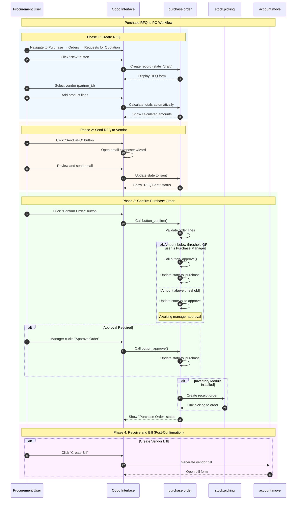
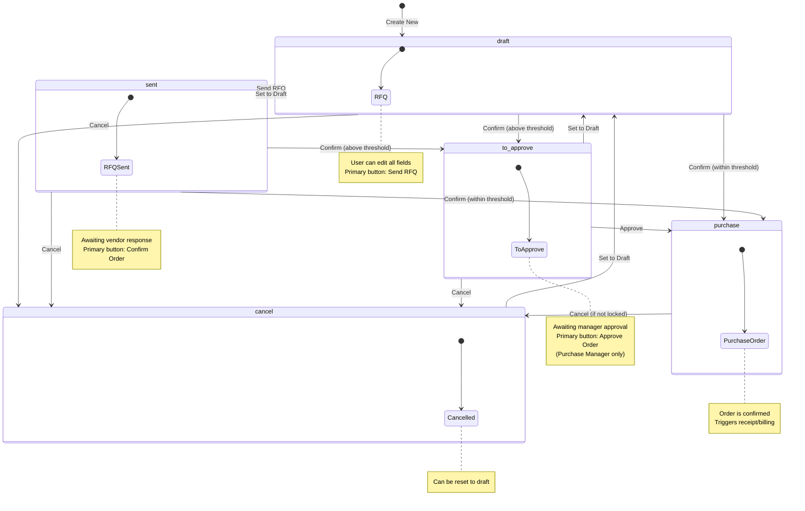

# Purchase RFQ to PO Workflow

## Overview

### Business Objective

The Purchase RFQ to PO workflow is the **primary cost control process** in Odoo. It enables your procurement team to request pricing from vendors, compare offers, and convert the best quotations into confirmed purchase orders that trigger receiving activities and vendor bill creation.

**What This Workflow Accomplishes:**
- Creates **Requests for Quotation (RFQs)** to solicit vendor pricing
- Manages the vendor negotiation process through email communication
- Supports multi-vendor comparison for best pricing decisions
- Converts approved quotations into confirmed **Purchase Orders (POs)**
- Automatically initiates inventory receipts and vendor billing workflows

### Target Personas

| Role | Responsibilities | Typical Actions |
|------|------------------|-----------------|
| **Procurement Officer** | Create purchase requests, manage vendor communications | Creates RFQs, sends to vendors, confirms orders |
| **Purchase Manager** | Oversee procurement, approve large orders | Reviews orders, approves above-threshold purchases, manages vendors |
| **Warehouse Staff** | Receive ordered goods | Processes receipts generated from confirmed POs |
| **Accounts Payable** | Process vendor payments | Creates and pays vendor bills linked to POs |

### Business Value

This workflow is critical because:
- **Cost Control**: Structured procurement prevents unauthorized spending
- **Vendor Management**: Centralized vendor communications and price tracking
- **Compliance**: Approval workflow ensures proper authorization for purchases
- **Efficiency**: Automatic receipt and bill generation reduces manual data entry
- **Visibility**: Managers can track purchase status and vendor performance

---

## Prerequisites

### Required Modules

Before using this workflow, ensure the following modules are installed:

| Module | Technical Name | Purpose |
|--------|----------------|---------|
| **Purchase** | `purchase` | Core RFQ and purchase order management |
| **Contacts** | `contacts` | Vendor database |

**Optional modules that enhance this workflow:**
- **Inventory** (`stock` with `purchase_stock`): Enables automatic receipt creation
- **Invoicing** (`account`): Enables vendor bill creation from POs
- **Manufacturing** (`mrp`): Enables procurement triggers from production orders

### Required User Permissions

The user must belong to one of these security groups:

| Group | Access Level | Can Perform |
|-------|--------------|-------------|
| *Purchase / User* | Standard | Create RFQs, send to vendors, confirm orders within approval limits |
| *Purchase / Administrator* | Full | All operations including approval of any amount, vendor management, settings |

To check your permissions: Navigate to *Settings → Users & Companies → Users → [Your User] → Access Rights*.

### Required Data Setup

Before creating purchase orders, ensure the following are configured:

1. **At least one vendor** in the Contacts database (with "Vendor" checkbox enabled)
2. **Products** available for purchase (with "Can be Purchased" checkbox enabled)
3. **Company settings** including address and currency
4. **Approval settings** (optional, for double validation workflow)

---

## Workflow Diagram

### Sequence Diagram

The following diagram shows the complete interaction flow from user action through system processing:

### State Machine Diagram

A **Request for Quotation / Purchase Order** progresses through the following states:

**State Definitions:**

| State | Display Name | Description |
|-------|--------------|-------------|
| `draft` | RFQ | Initial state; fully editable request for quotation |
| `sent` | RFQ Sent | RFQ has been sent to vendor; awaiting response |
| `to approve` | To Approve | Order exceeds approval threshold; awaiting manager approval |
| `purchase` | Purchase Order | Order is confirmed and active |
| `cancel` | Cancelled | Order has been cancelled |

*Source: `addons/purchase/models/purchase_order.py:105-111`*

---

## Step-by-Step Guide

### Step 1: Create a New Request for Quotation

**What You Want to Accomplish:** Start a new price inquiry to send to a vendor.

**Navigation Path:** *Purchase → Orders → Requests for Quotation*

**Actions:**

1. **Click the "New" button** in the top-left corner of the RFQ list
   - A blank RFQ form opens
   - The system automatically assigns a reference number (e.g., "PO00001" or "New")

2. **Select the vendor** from the "Vendor" dropdown field
   - Start typing the vendor name to search
   - The system searches by Name, TIN (Tax Identification Number), Email, or Internal Reference
   - If the vendor doesn't exist, click "Create" to add them

3. **Set optional details:**
   - *Vendor Reference*: External reference number from the vendor
   - *Order Deadline*: Date by which the quotation should be confirmed
   - *Expected Arrival*: Delivery date expected from the vendor
   - *Currency*: If different from company default (multi-currency environments)

**What the User Sees:**

At this point, the screen displays:
- A form with the RFQ reference at the top
- The label "Request for Quotation" above the reference number
- Vendor information section (left side)
- Order details section (right side) including dates
- An empty "Products" tab with order lines
- Status bar showing "RFQ" as the current state
- **"Send RFQ"** button highlighted as the primary action
- "Confirm Order" button available as a secondary action

**Screenshot Reference:** `screenshots/03-01-create-rfq.png`

---

### Step 2: Select or Create a Vendor

**What You Want to Accomplish:** Specify which vendor will receive this price inquiry.

**Actions:**

1. **Click the "Vendor" field** to open the dropdown
   - A search box appears with vendor suggestions

2. **Search for the vendor:**
   - Type part of the vendor name, email, or TIN
   - The system displays matching partners marked as vendors

3. **Select an existing vendor** from the list
   - The vendor's information populates the form
   - Default payment terms and currency are applied if configured

4. **Alternatively, create a new vendor:**
   - If no match is found, click "Create and Edit"
   - Fill in the vendor details (name, address, contact info)
   - Enable the "Vendor" checkbox under the Sales & Purchase tab
   - Save and return to the RFQ

**What the User Sees:**

After vendor selection:
- The vendor name appears in the Vendor field
- The system may display a **warning message** if the vendor has a purchase warning configured
- Payment terms and currency may auto-update based on vendor defaults
- The "Expected Arrival" date may update based on vendor lead times

**Screenshot Reference:** `screenshots/03-02-select-vendor.png`

---

### Step 3: Add Products to the Order

**What You Want to Accomplish:** Specify what products you want to purchase from this vendor.

**Actions:**

1. **Navigate to the "Products" tab** (if not already selected)

2. **Click "Add a product"** in the Order Lines section
   - A new row appears in the product table
   - You can also click "Catalog" to browse products visually

3. **Select a product** from the "Product" dropdown
   - The system automatically fills in:
     - Product description
     - Default unit price (from vendor pricelist if configured)
     - Default taxes
     - Expected arrival date

4. **Enter the quantity** in the "Quantity" column
   - The system automatically calculates the subtotal

5. **Review or adjust the unit price**
   - Price may be pre-filled from vendor pricelist
   - You can override with negotiated pricing

6. **Set the expected arrival date** for each line (optional)
   - Defaults to the header date or vendor lead time

7. **Repeat** for additional products as needed

**What the User Sees:**

The Products section now shows:
- Product name and description for each line
- Quantity, unit price, and discount columns
- Tax information for each line
- Calculated subtotal for each line
- **Automatic totals** at the bottom:
  - *Untaxed Amount*: Sum before taxes
  - *Taxes*: Calculated tax amounts
  - *Total*: Final amount including taxes

**Important:** The system prevents confirmation if any order line is missing a product.

**Screenshot Reference:** `screenshots/03-03-add-products.png`

---

### Step 4: Send the RFQ to the Vendor

**What You Want to Accomplish:** Email the request for quotation to the vendor for pricing confirmation.

**Actions:**

1. **Click the "Send RFQ" button**
   - An email composition window opens
   - The RFQ PDF is automatically attached

2. **Review the email content**
   - The vendor's email address is pre-filled in the "To" field
   - The subject line includes the RFQ reference
   - A standard template message is loaded

3. **Customize the message** if desired
   - Add specific questions about pricing or availability
   - Request confirmation of delivery dates
   - You can change the email template if needed

4. **Click "Send"** to dispatch the email
   - The system sends the email with PDF attachment
   - The RFQ status changes to "RFQ Sent"

**What the User Sees:**

After sending:
- The status bar changes from "RFQ" to **"RFQ Sent"**
- The **"Confirm Order"** button becomes the primary (highlighted) action
- The "Send RFQ" button remains available for resending
- A message appears in the chatter: "RFQ sent by email"
- The label above the reference changes to reflect the sent status

**Alternative:** If you want to mark the RFQ as sent without actually emailing (e.g., you faxed or called the vendor), click *Print → Request for Quotation* which also marks it as sent.

**Screenshot Reference:** `screenshots/03-04-send-rfq.png`

---

### Step 5: Confirm the Purchase Order

**What You Want to Accomplish:** Convert the vendor's accepted quotation into a confirmed purchase order.

**Actions:**

1. **Update pricing if needed**
   - If the vendor responded with different prices, update the order lines
   - The vendor reference field can store the vendor's quotation number

2. **Click the "Confirm Order" button**
   - The system validates the order
   - The system checks approval requirements

3. **Observe the outcome:**

   **Scenario A - Direct Approval:**
   - If the order amount is within your approval limit, OR
   - If your company uses one-step validation, OR
   - If you are a Purchase Manager
   - → The status changes directly to "Purchase Order"

   **Scenario B - Approval Required:**
   - If the order amount exceeds the approval threshold
   - → The status changes to "To Approve"
   - → A Purchase Manager must click "Approve Order"

**What the User Sees:**

After confirmation (with direct approval):
- Status bar shows **"Purchase Order"**
- The label changes from "Request for Quotation" to "Purchase Order"
- The confirmation date is recorded and displayed
- If Inventory is installed: A **"Receipt"** smart button appears
- The **"Create Bill"** button becomes available
- Most fields become read-only (the order is now locked for editing)

If approval is required:
- Status bar shows **"To Approve"**
- The **"Approve Order"** button appears (visible only to Purchase Managers)
- The order remains editable pending approval

**Screenshot Reference:** `screenshots/03-05-confirm-order.png`

---

### Step 6: View the Confirmed Purchase Order

**What You Want to Accomplish:** Review the confirmed order and access related documents.

**Actions:**

1. **Review the confirmed order details:**
   - Order reference and confirmation date
   - Vendor information
   - Confirmed product lines and totals
   - Invoice status showing "Nothing to Bill" initially

2. **Access related documents using smart buttons:**
   - **Receipt** button: View/process the incoming shipment (if Inventory is installed)
   - **Vendor Bills** button: View linked bills (after creation)

3. **Send the confirmed PO to the vendor** (optional):
   - Click "Send PO" button to email the confirmed order
   - This notifies the vendor of the official purchase commitment

4. **Create a vendor bill** (when ready):
   - Click "Create Bill" button
   - The system generates a draft vendor bill
   - Review and confirm the bill amount

**What the User Sees:**

The confirmed order displays:
- **Order reference** prominently at the top (e.g., "PO00001")
- **Confirmation date** in the header
- Label shows "Purchase Order" instead of "Request for Quotation"
- All vendor and product details
- **Smart buttons** for quick navigation:
  - *Receipt*: Shows count of incoming shipments
  - *Vendor Bills*: Shows count of bills (once created)
- **Invoice Status** indicator showing billing progress
- Chatter showing order history and communications
- "Acknowledged" checkbox to track vendor confirmation

**Screenshot Reference:** `screenshots/03-06-po-confirmed.png`

---

## Variations and Edge Cases

### Direct Confirmation (Skip Send Step)

**Scenario:** The vendor has already quoted a price (e.g., via phone) and you want to proceed immediately.

**How to Handle:**
1. Create the RFQ with vendor and products (Steps 1-3)
2. Enter the agreed pricing in the order lines
3. Click **"Confirm Order"** directly (skip the Send step)
4. The RFQ converts directly from "draft" to "purchase" state (or "to approve" if above threshold)

**Note:** This is a valid workflow for standing orders or pre-negotiated contracts.

---

### Double Approval Process

**Scenario:** The order amount exceeds the company's approval threshold.

**Understanding the Approval Workflow:**
- Companies can configure double validation in *Purchase → Configuration → Settings*
- When enabled, orders exceeding a specified amount require manager approval
- The threshold is defined in *Purchase Settings → Approval Amount*

**How the Process Works:**
1. User creates and confirms the RFQ
2. System checks: `amount_total > approval_threshold`
3. If above threshold: Order moves to "To Approve" state
4. Purchase Manager reviews and clicks **"Approve Order"**
5. Order moves to "Purchase Order" state

**Who Can Approve:**
- Users in the *Purchase / Administrator* group can approve any amount
- The approval check uses company currency for comparison

*Source: `addons/purchase/models/purchase_order.py:1249-1258`*

---

### Comparing Multiple Vendor Quotations

**Scenario:** You want to request prices from multiple vendors for the same products.

**How to Handle:**
1. Create separate RFQs for each vendor with the same products
2. Send all RFQs to respective vendors
3. Wait for vendor responses and update prices
4. Use the **"Price Comparison"** smart button to compare pricing
5. Confirm the order with the best pricing
6. Cancel the remaining RFQs

**Note:** The "Price Comparison" button appears when products have multiple vendor quotes in the system.

---

### RFQ Cancellation

**Scenario:** The purchase request is no longer needed.

**How to Handle:**
1. Open the RFQ (in any state except locked)
2. Click **"Cancel"** button
3. Confirm the cancellation when prompted
4. The status changes to "Cancelled"

**What Happens:**
- The RFQ is marked as cancelled
- No receipts or bills are created
- The order can still be reset to draft if needed later

*Source: `addons/purchase/models/purchase_order.py:641-649`*

---

### Resetting a Cancelled Order

**Scenario:** A cancelled order needs to be reactivated.

**How to Handle:**
1. Open the cancelled order
2. Click **"Set to Draft"** button
3. The order returns to "draft" state

**What Happens:**
- The order becomes editable again
- You can modify and resend the RFQ
- Previous state history is preserved in the chatter

*Source: `addons/purchase/models/purchase_order.py:621-623`*

---

### Locked Purchase Orders

**Scenario:** A confirmed order needs to be protected from accidental changes.

**Understanding Locked Orders:**
- When the "Lock Confirmed Orders" setting is enabled in Purchase Settings, orders automatically lock upon confirmation
- Locked orders cannot be modified or cancelled
- A "Locked" badge appears on locked orders

**How to Unlock:**
1. Navigate to the locked order
2. As a Purchase Manager, click **"Unlock"** button
3. The order becomes editable

**How to Lock Manually:**
1. Navigate to a confirmed order
2. Click **"Lock"** button (if the auto-lock setting is enabled)
3. The order becomes protected

**Attempting to Cancel Locked Order:**
- Error message: "Unable to cancel purchase order(s): [Order Name]. You must first unlock them."

*Source: `addons/purchase/models/purchase_order.py:642-644`*

---

### Updating Vendor Supplier Information

**Scenario:** When confirming a PO, the vendor pricing should be saved for future orders.

**Automatic Behavior:**
When a purchase order is confirmed, the system automatically:
1. Checks if the vendor is already listed as a supplier for each product
2. If not listed, adds the vendor to the product's supplier list
3. Records the negotiated price for future reference

**Limitation:** The system limits suppliers to 10 per product to avoid cluttering generic products.

*Source: `addons/purchase/models/purchase_order.py:682-708`*

---

## Integration Points

### Integration with Inventory Module

**When Active:** If the Inventory (`stock`) module is installed alongside Purchase (via `purchase_stock` bridge module).

**Automatic Behavior:**
- When a purchase order is confirmed, the system automatically creates a **Receipt** (`stock.picking` of type incoming)
- The receipt contains the same products and quantities as the purchase order
- The "Receipt" smart button on the purchase order shows the count of linked receipts

**User Impact:**
- The procurement user sees a "Receipt" smart button after order confirmation
- Clicking this button navigates to the warehouse receipt document
- Warehouse staff can then process the physical receipt of goods
- Quantities received update the purchase order line's "Received" column

---

### Integration with Accounting Module

**When Active:** If the Invoicing (`account`) module is installed alongside Purchase.

**Automatic Behavior:**
- Confirmed orders show a "Create Bill" button
- Vendor bills reference the purchase order as the source document
- Invoice status tracks billing progress (Nothing to Bill → Waiting Bills → Fully Billed)

**User Impact:**
- The procurement user can create vendor bills directly from the order
- The "Vendor Bills" smart button shows linked bill count
- Three-way matching is supported (PO vs Receipt vs Bill)

**Invoice Status Values:**
| Status | Display | Meaning |
|--------|---------|---------|
| `no` | Nothing to Bill | No invoiceable quantities yet |
| `to invoice` | Waiting Bills | Products received, ready for billing |
| `invoiced` | Fully Billed | All quantities have been billed |

*Source: `addons/purchase/models/purchase_order.py:127-131`*

---

### Integration with Manufacturing Module

**When Active:** If the Manufacturing (`mrp`) module is installed alongside Purchase.

**Automatic Behavior:**
- Manufacturing orders can trigger automatic purchase requisitions for components
- The purchase order's "Source" field references the originating MO
- Procurement rules can be configured to auto-generate RFQs

**User Impact:**
- Production planners see purchase orders generated from manufacturing needs
- The supply chain is automatically managed based on production schedules

---

## Error Scenarios

### Missing Product on Order Line

**Error Message:** "Some order lines are missing a product, you need to correct them before going further."

**When It Occurs:** The user tries to confirm an order where at least one order line has no product selected.

**What the User Sees:**
- A warning popup appears when clicking "Confirm Order"
- The order remains in its current state

**How to Resolve:**
1. Review all order lines in the Products tab
2. Either add a product to empty lines or delete the empty lines
3. Try confirming again

*Source: `addons/purchase/models/purchase_order.py:660-668`*

---

### Cancelling Order with Posted Bills

**Error Message:** "Unable to cancel purchase order(s): [Order Name]. You must first cancel their related vendor bills."

**When It Occurs:** The user tries to cancel a purchase order that has vendor bills in posted (confirmed) state.

**What the User Sees:**
- A warning popup appears
- The cancel action is blocked

**How to Resolve:**
1. Navigate to the linked vendor bills (use the smart button)
2. Cancel or reverse each posted bill
3. Return to the purchase order and cancel

*Source: `addons/purchase/models/purchase_order.py:646-648`*

---

### Cancelling a Locked Order

**Error Message:** "Unable to cancel purchase order(s): [Order Name]. You must first unlock them."

**When It Occurs:** The user tries to cancel an order that has been locked.

**What the User Sees:**
- A warning popup appears
- The cancel action is blocked

**How to Resolve:**
1. Contact a Purchase Manager
2. The manager must click "Unlock" first
3. Then the order can be cancelled

*Source: `addons/purchase/models/purchase_order.py:642-644`*

---

### Company Mismatch

**Error Context:** Products from a different company are added to an order.

**When It Occurs:** In multi-company setups, if a product belongs to Company B but the order is for Company A.

**What the User Sees:**
- Validation error when saving or confirming
- Message indicates company inconsistency with affected products listed

**How to Resolve:**
1. Verify you're working in the correct company
2. Use the company switcher in the top-right menu
3. Select products that belong to the current company or are shared across companies

*Source: `addons/purchase/models/purchase_order.py:184-199`*

---

### Duplicate Order Warning

**Warning Context:** System detects potential duplicate orders.

**When It Occurs:** When creating an RFQ that appears similar to an existing order (same vendor, similar products).

**What the User Sees:**
- A yellow warning banner appears on the form
- Text: "Warning: this order might be a duplicate of [Order Reference]"
- Links to potentially duplicated orders

**How to Resolve:**
1. Review the linked potential duplicates
2. If truly a duplicate, cancel the new RFQ
3. If legitimate, proceed with the order (warning is informational)

---

## What the User Sees: UI State Reference

### Draft State (RFQ)

| UI Element | Appearance |
|------------|------------|
| Page Title | "Request for Quotation" |
| Status Bar | Shows "RFQ" highlighted |
| Primary Button | **Send RFQ** (blue/highlighted) |
| Secondary Buttons | Confirm Order, Print, Cancel |
| Form Fields | All editable |
| Smart Buttons | None or minimal |

### Sent State (RFQ Sent)

| UI Element | Appearance |
|------------|------------|
| Page Title | "Request for Quotation" |
| Status Bar | Shows "RFQ Sent" highlighted |
| Primary Button | **Confirm Order** (blue/highlighted) |
| Secondary Buttons | Send RFQ, Print, Cancel, Set to Draft |
| Form Fields | All editable |
| Smart Buttons | None or minimal |

### To Approve State

| UI Element | Appearance |
|------------|------------|
| Page Title | "Request for Quotation" |
| Status Bar | Shows "To Approve" highlighted |
| Primary Button | **Approve Order** (visible to Purchase Managers only) |
| Secondary Buttons | Cancel, Set to Draft |
| Form Fields | Most editable pending approval |
| Smart Buttons | None |

### Purchase State (Purchase Order)

| UI Element | Appearance |
|------------|------------|
| Page Title | "Purchase Order" |
| Status Bar | Shows "Purchase Order" highlighted |
| Primary Button | **Create Bill** or **Send PO** |
| Secondary Buttons | Cancel (if not locked), Lock/Unlock, Acknowledge |
| Form Fields | Most fields read-only |
| Smart Buttons | Receipt (count), Vendor Bills (count), Bill Matching |
| Additional | Invoice Status indicator, Acknowledgment checkbox |

### Cancelled State

| UI Element | Appearance |
|------------|------------|
| Page Title | "Request for Quotation" or "Purchase Order" |
| Status Bar | Shows "Cancelled" |
| Primary Button | **Set to Draft** |
| Form Fields | Read-only |
| Visual Indicator | Greyed out or muted appearance |

---

## Business Rules Reference

For detailed information about validation logic, computation rules, and access control for this workflow, see:

**[Purchase RFQ to PO Business Rules](../../04-business-rules/purchase-rfq-to-po-rules.md)**

Key rules documented there include:
- Required fields for order confirmation
- Double validation approval thresholds
- State transition validation
- Automatic total calculations
- Tax computation logic
- Access control by security group
- Vendor supplier information updates

---

## Related Documentation

- **[Capabilities Inventory](../../01-capabilities-overview/capabilities-inventory.md)** - Complete module reference including Purchase module details
- **[Inventory Receipt Processing Flow](../04-inventory-receipt-processing/flow-document.md)** - Processing receipts generated from purchase orders
- **[Vendor Bill and Payment Flow](../07-vendor-bill-payment/flow-document.md)** - Creating and paying vendor bills from confirmed orders
- **[Sales Quote to Order Flow](../01-sales-quote-to-order/flow-document.md)** - The sales side counterpart to procurement

---

## Glossary of Terms Used

| Term | Definition |
|------|------------|
| **RFQ (Request for Quotation)** | A document requesting pricing from a vendor; not yet a committed order |
| **Purchase Order (PO)** | A confirmed order to a vendor that commits to purchasing goods or services |
| **Vendor** | A partner from whom products or services are purchased; also called Supplier |
| **Order Line** | An individual product entry within an RFQ or purchase order |
| **Approval Threshold** | The maximum order amount a user can confirm without manager approval |
| **Double Validation** | A workflow requiring two levels of approval for orders above a threshold |
| **Receipt** | A warehouse document that records incoming goods from a vendor |
| **Vendor Bill** | An invoice received from a vendor for goods or services purchased |
| **Smart Button** | A clickable button on a record that shows a count and links to related records |
| **Chatter** | The communication history panel on records showing messages and activity |
| **State** | The current status of a document in its workflow lifecycle |
| **Procurement** | The process of acquiring goods or services from external vendors |
| **Three-Way Matching** | Verification that PO, receipt, and vendor bill quantities and amounts match |
| **Lead Time** | The expected number of days between ordering and receiving goods from a vendor |

---

*Document Version: 1.0*  
*Source References:*
- *`addons/purchase/models/purchase_order.py`*
- *`addons/purchase/models/purchase_order_line.py`*
- *`addons/purchase/views/purchase_views.xml`*
- *`addons/purchase/security/purchase_security.xml`*
- *Odoo 19.0 Community Edition*
