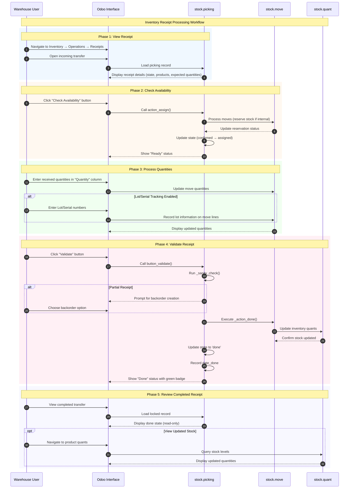
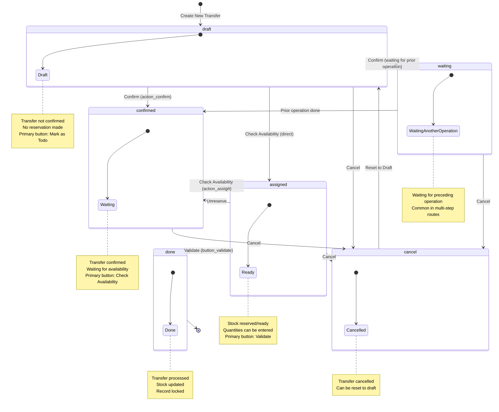

# Inventory Receipt Processing Workflow

## Overview

### Business Objective

The Inventory Receipt Processing workflow is a **critical supply chain function** that enables warehouse staff to receive incoming goods and update inventory levels accurately. This process ensures that purchased products are properly recorded in the system, making them available for sales fulfillment, manufacturing, or internal use.

**What This Workflow Accomplishes:**
- Receives incoming shipments from vendors or other locations
- Validates received quantities against expected deliveries
- Updates warehouse inventory levels (stock quants)
- Handles partial receipts through automatic backorder creation
- Records lot/serial numbers for traceability when required

### Target Personas

| Role | Responsibilities | Typical Actions |
|------|------------------|-----------------|
| **Warehouse Clerk** | Process daily receipts | Validates quantities, enters lot numbers |
| **Receiving Staff** | Physically count incoming goods | Verifies products against documentation |
| **Inventory Manager** | Oversee warehouse operations | Reviews receipt status, handles exceptions |
| **Quality Controller** | Inspect received goods | Verifies product quality (if quality module installed) |

### Business Value

This workflow is critical because:
- **Inventory Accuracy**: Properly processed receipts ensure stock levels reflect physical inventory
- **Supply Chain Visibility**: Real-time updates on received goods enable better planning
- **Vendor Management**: Receipt records support vendor performance tracking
- **Traceability**: Lot/serial tracking enables recall management and quality control
- **Purchase Order Closure**: Linked receipts allow automatic PO completion tracking

---

## Prerequisites

### Required Modules

Before using this workflow, ensure the following modules are installed:

| Module | Technical Name | Purpose |
|--------|----------------|---------|
| **Inventory** | `stock` | Core warehouse and stock management |

**Optional modules that enhance this workflow:**
- **Purchase** (`purchase`): Automatic receipt creation from confirmed purchase orders
- **Barcode** (`stock_barcode`): Mobile scanning for efficient receipt processing
- **Quality** (Enterprise): Quality checks during receipt validation

### Required User Permissions

The user must belong to one of these security groups:

| Group | Access Level | Can Perform |
|-------|--------------|-------------|
| *Inventory / User* (`stock.group_stock_user`) | Basic | View and process receipts |
| *Inventory / Manager* (`stock.group_stock_manager`) | Full | All operations including configuration |

To check your permissions: Navigate to *Settings → Users & Companies → Users → [Your User] → Access Rights*.

### Required Data Setup

Before processing receipts, ensure the following are configured:

1. **Warehouse** with at least one configured location (e.g., WH/Stock)
2. **Vendor Location** (automatically created as "Partners/Vendors")
3. **Products** configured as "Storable Product" type
4. **Receipt Operation Type** configured for incoming transfers
5. **Lot/Serial tracking** configured on products (if traceability required)

---

## Workflow Diagram

### Sequence Diagram

The following diagram shows the complete interaction flow from viewing a receipt through validation:

### State Machine Diagram

A **Receipt (Stock Picking)** progresses through the following states:

**State Definitions:**

| State | Display Name | Description |
|-------|--------------|-------------|
| `draft` | Draft | Transfer not confirmed yet; no reservations made |
| `waiting` | Waiting Another Operation | Waiting for a preceding operation to complete (multi-step routes) |
| `confirmed` | Waiting | Transfer confirmed; waiting for stock availability |
| `assigned` | Ready | Stock reserved (for outgoing) or ready to process (for incoming) |
| `done` | Done | Transfer has been processed; inventory updated |
| `cancel` | Cancelled | Transfer has been cancelled |

*Source: `addons/stock/models/stock_picking.py:575-589`*

---

## Step-by-Step Guide

### Step 1: View the Receipt

**What You Want to Accomplish:** Access and review an incoming receipt before processing.

**Navigation Path:** *Inventory → Operations → Receipts*

**Actions:**

1. **Navigate to the Receipts list:**
   - Click on the "Inventory" application in the main menu
   - Click "Operations" in the left navigation
   - Select "Receipts"

2. **Open the receipt to process:**
   - Locate the receipt in the list (identified by reference like "WH/IN/00001")
   - Click on the receipt row to open the form view
   - Alternatively, use filters to find receipts in "Ready" or "Waiting" state

3. **Review receipt details:**
   - **Source Location**: Shows where goods are coming from (e.g., "Partners/Vendors")
   - **Destination Location**: Shows where goods will be stored (e.g., "WH/Stock")
   - **Scheduled Date**: Expected delivery date
   - **Source Document**: Link to purchase order (e.g., "PO00001") if applicable
   - **Products**: List of expected items with quantities

**What the User Sees:**

At this point, the screen displays:
- Receipt reference number prominently at the top (e.g., "WH/IN/00001")
- Status bar showing current state (Draft, Waiting, or Ready)
- Partner field showing vendor name (for vendor receipts)
- Source and destination locations in the header
- "Operations" tab with expected product lines showing:
  - Product name
  - Demand (expected quantity)
  - Quantity column (for entering received amounts)

**Important:** For receipts created from purchase orders, the "Source Document" field shows the linked PO reference.

**Screenshot Reference:** `screenshots/04-01-view-receipt.png`

---

### Step 2: Check Availability

**What You Want to Accomplish:** Confirm the receipt is ready to process and reserve any necessary resources.

**When This Step Applies:**
- For incoming receipts from vendors: This step confirms the system is ready to receive goods
- For internal transfers: This step reserves stock from the source location

**Actions:**

1. **Click the "Check Availability" button:**
   - Located in the header when the receipt is in "Waiting" (confirmed) state
   - The button is highlighted (blue) as the primary action

2. **Observe the status change:**
   - The state changes from "Waiting" to "Ready"
   - The "Validate" button becomes the new primary action

**What the User Sees:**

After clicking Check Availability:
- Status bar updates to show **"Ready"** (assigned state)
- The **"Validate"** button is now highlighted as the primary action
- The "Check Availability" button is replaced or hidden
- For internal transfers: Reserved quantities appear in the product lines

**Technical Note:** The system calls `action_assign()` which:
- For incoming receipts: Confirms the transfer can proceed
- For internal/outgoing: Reserves available stock quantities

**When "Check Availability" Fails:**
- For internal transfers: If insufficient stock exists, the state remains "Waiting"
- A message may appear indicating stock cannot be reserved
- You can still proceed with partial quantities or wait for stock replenishment

*Source: `addons/stock/models/stock_picking.py:1190-1203`*

**Screenshot Reference:** `screenshots/04-02-check-availability.png`

---

### Step 3: Process Quantities

**What You Want to Accomplish:** Enter the actual quantities received for each product line.

**Actions:**

1. **Locate the "Quantity" column** in the Operations tab
   - This column shows "0.00" initially for each product line
   - It's editable when the receipt is in "Ready" state

2. **Enter received quantities:**
   - Click in the "Quantity" field for each product
   - Enter the actual quantity received
   - Press Tab or Enter to move to the next line

3. **Handle lot/serial numbers** (if tracking is enabled):
   - Click the "Details" button on the product line (or the line itself)
   - A dialog opens showing detailed operations
   - Enter lot numbers in the "Lot/Serial Number" field
   - For serial-tracked products: Enter one serial per unit

4. **Use "Set Quantities" for bulk updates** (optional):
   - Click "Set Quantities" wizard if available
   - This sets the done quantity equal to demand for all lines
   - Useful when receiving complete shipments

**What the User Sees:**

While processing quantities:
- The "Quantity" column becomes editable
- As you enter values, the system validates against the demand
- If you enter MORE than expected:
  - The quantity shows in a contrasting color (orange/red)
  - The system allows over-receipts with appropriate permissions
- If you enter LESS than expected:
  - Normal display, but partial receipt handling applies at validation
- For tracked products:
  - A "Details" button appears on each line
  - Lot/Serial fields are required before validation

**Important Validation Rules:**
- Lot/serial numbers are required for tracked products
- The system prevents duplicate serial numbers in the same receipt
- Quantities must be positive numbers

**Screenshot Reference:** `screenshots/04-03-process-quantities.png`

---

### Step 4: Validate the Receipt

**What You Want to Accomplish:** Confirm the receipt and update inventory with received quantities.

**Actions:**

1. **Review all quantities** before validation
   - Ensure all product lines have received quantities entered
   - Verify lot/serial numbers are complete for tracked products

2. **Click the "Validate" button:**
   - Located in the header (highlighted/blue when in Ready state)
   - The system performs validation checks

3. **Handle partial receipt** (if quantities are less than demand):
   - A dialog appears asking about backorder handling
   - **Create Backorder**: Creates a new receipt for remaining quantities
   - **No Backorder**: Closes the receipt, remaining demand is lost
   - Choose the appropriate option based on your situation

4. **Observe the completion:**
   - The state changes to "Done"
   - The "Date of Transfer" field is populated
   - The receipt becomes read-only

**What the User Sees:**

After successful validation:
- Status bar shows **"Done"** with a green badge
- The **"Return"** and **"Print"** buttons appear
- The form becomes read-only (locked)
- A "Date of Transfer" (date_done) appears in the header showing when processed
- The chatter shows a record of the validation

**If Partial Receipt with Backorder:**
- The original receipt shows "Done" status
- A new receipt is created with reference like "WH/IN/00001-02"
- The new receipt contains only the remaining quantities
- The "Backorder" field on the original shows the new receipt reference

*Source: `addons/stock/models/stock_picking.py:1391-1451`*

**Screenshot Reference:** `screenshots/04-04-validate-receipt.png`

---

### Step 5: View the Completed Receipt

**What You Want to Accomplish:** Review the processed receipt and verify inventory updates.

**Actions:**

1. **Review the completed receipt:**
   - Observe the "Done" status and green badge
   - Note the Date of Transfer showing processing time
   - Review the final processed quantities

2. **Access related records:**
   - Click **"Return"** button to create a return shipment (if needed)
   - Click **"Traceability"** button (if available) to see product history
   - Click on the **Source Document** link to return to the purchase order

3. **Verify inventory updates:**
   - Navigate to *Inventory → Reporting → Inventory Report*
   - Or: Go to the product form and view "On Hand" quantity
   - Confirm the received quantities appear in stock

**What the User Sees:**

The completed receipt displays:
- **"Done"** status prominently displayed (green badge in status bar)
- **Date of Transfer** showing exactly when the receipt was processed
- All fields in read-only mode (locked record)
- **Smart Buttons** that may appear:
  - *Returns*: Count of return shipments (if any)
  - *Scraps*: Scrap records related to this transfer
  - *Packages*: Packages involved (if package tracking used)
  - *Traceability*: Product tracing information (if lot tracking used)
  - *Next Transfer*: Links to follow-on operations (in multi-step routes)

**Viewing Updated Stock Levels:**
- Product "On Hand" quantity reflects the received amounts
- Stock quants show the specific location quantities
- If lot/serial tracking: Individual lots/serials are recorded

**Screenshot Reference:** `screenshots/04-05-receipt-done.png`

---

## Variations and Edge Cases

### Partial Receipt (Creating a Backorder)

**Scenario:** You receive fewer items than expected (e.g., vendor shipped 8 units instead of 10).

**How to Handle:**
1. Enter the actual received quantity (8 units)
2. Click "Validate"
3. When prompted, select **"Create Backorder"**
4. The system creates a new receipt for the remaining 2 units

**What Happens:**
- Original receipt is marked "Done" with 8 units
- New backorder receipt is created for 2 units
- Backorder is linked via the "Backorder" field
- Purchase order remains open until backorder is received

*Source: `addons/stock/models/stock_picking.py:1412-1421`*

---

### Over-Receipt (Receiving More Than Expected)

**Scenario:** Vendor ships more items than ordered (e.g., 12 units instead of 10).

**How to Handle:**
1. Enter the actual received quantity (12 units)
   - The quantity displays in orange/red to highlight the difference
2. Click "Validate"
3. The system accepts the over-receipt
4. Inventory is updated with actual received quantity

**Business Impact:**
- Stock levels reflect actual goods received
- Purchase order may show over-delivery
- Consider contacting vendor regarding discrepancy
- Accounting implications should be reviewed

---

### Multi-Step Receipt Processing

**Scenario:** Your warehouse uses a 2-step or 3-step receipt process (e.g., Input → Quality → Stock).

**How It Works:**
1. First transfer receives goods into Input location
2. Internal transfer moves goods from Input to Stock (or through Quality)
3. Each step is a separate picking that must be processed

**What the User Sees:**
- First receipt shows Input as destination
- After validating first receipt, a "Next Transfer" button appears
- Click to access the internal transfer
- Process the internal transfer separately

**Configuration:** Multi-step routes are configured in *Inventory → Configuration → Warehouses → [Warehouse] → Shipments → Incoming Shipments*

---

### Lot/Serial Number Requirements

**Scenario:** Products require lot or serial number tracking.

**How to Handle:**
1. During quantity processing, click "Details" on the product line
2. Enter lot number (for "By Lots" tracking)
3. Or enter unique serial number for each unit (for "By Unique Serial Number" tracking)

**Validation Rules:**
- All tracked products MUST have lot/serial numbers assigned
- Serial numbers must be unique (no duplicates)
- The system blocks validation until tracking requirements are met

**Error Message:** "You need to supply a Lot/Serial number for products [Product Name]."

*Source: `addons/stock/models/stock_picking.py:1373-1374`*

---

### Return to Vendor

**Scenario:** Received goods need to be returned (damaged, wrong items, etc.).

**How to Handle:**
1. Open the completed (Done) receipt
2. Click the **"Return"** button
3. A wizard opens showing products that can be returned
4. Select products and quantities to return
5. Validate to create the return transfer
6. Process the return transfer (outgoing to vendor)

**What Happens:**
- A new delivery (outgoing picking) is created
- It references the original receipt as "Return of [reference]"
- Processing the return reduces inventory accordingly

---

### Cancelled Receipt

**Scenario:** A receipt needs to be cancelled (e.g., shipment cancelled, wrong receipt created).

**How to Handle:**
1. Open the receipt (must NOT be in "Done" state)
2. Click **"Cancel"** button in the header
3. Confirm the cancellation when prompted

**What Happens:**
- State changes to "Cancelled"
- Any reservations are released
- The receipt can be reset to draft if needed

**Note:** Done receipts cannot be cancelled. Use the Return process instead.

*Source: `addons/stock/models/stock_picking.py:1205-1209`*

---

### No Quantity Entered (Validation Block)

**Scenario:** User attempts to validate without entering any quantities.

**What Happens:**
- System displays error: "You can't validate an empty transfer. Please add some products to move before proceeding." or similar quantity warning
- Validation is blocked
- User must enter quantities before proceeding

*Source: `addons/stock/models/stock_picking.py:1370-1372`*

---

## Integration Points

### Integration with Purchase Module

**When Active:** If the Purchase (`purchase`) module is installed alongside Inventory.

**Automatic Behavior:**
- When a purchase order is confirmed, the system automatically creates a **Receipt** (`stock.picking`)
- The receipt contains the same products and quantities as the purchase order
- The "Source Document" field on the receipt shows the PO reference (e.g., "PO00001")
- The "Receive Products" smart button on the PO links to the receipt

**User Impact:**
- Purchase users see pending receipts on their purchase orders
- Warehouse staff find receipts pre-created with expected products
- Processing receipts updates PO delivery status
- The PO shows received vs. ordered quantities

**Navigation from PO:** Click "Receipt" or "Receive Products" smart button on the purchase order.

---

### Integration with Accounting Module

**When Active:** If Accounting (`account`) or stock valuation is enabled.

**Automatic Behavior:**
- Validating receipts updates stock valuation
- Journal entries are created for inventory value changes
- Cost prices are updated based on valuation method (FIFO, Average, Standard)

**User Impact:**
- Stock moves include valuation layer information
- Financial reports reflect inventory value changes
- For landed costs: Additional cost allocations can be applied to receipts

---

### Putaway Rules

**When Active:** When putaway rules are configured for the warehouse.

**Automatic Behavior:**
- The system automatically suggests destination locations based on putaway rules
- Rules can be based on: Product, Product Category, or Package Type
- The final destination is recorded in the `location_final_id` field

**User Impact:**
- Warehouse staff see suggested put-away locations
- Consistent storage organization is maintained
- Can override suggestions when needed

**Configuration:** *Inventory → Configuration → Warehouses → [Warehouse] → Putaway Rules*

---

### Quality Control (Enterprise)

**When Active:** If the Quality module (Enterprise) is installed.

**Automatic Behavior:**
- Quality checks can be triggered at receipt validation
- Products may require inspection before stock update
- Quality alerts can block receipt validation

**User Impact:**
- Quality check prompts appear during validation
- Products may be quarantined pending inspection
- Quality records are linked to receipts

---

## Error Scenarios

### Missing Lot/Serial Numbers

**Error Message:** "You need to supply a Lot/Serial number for products [Product Names]."

**When It Occurs:** Attempting to validate a receipt when tracked products don't have lot/serial numbers assigned.

**What the User Sees:**
- Error popup appears when clicking "Validate"
- Validation is blocked
- The error lists which products are missing tracking info

**How to Resolve:**
1. Click "Details" on each product line with tracking
2. Enter the lot number or serial number
3. Ensure every unit has tracking assigned
4. Try validating again

*Source: `addons/stock/models/stock_picking.py:1373-1374`*

---

### Empty Transfer Validation

**Error Message:** "You can't validate an empty transfer. Please add some products to move before proceeding."

**When It Occurs:** Attempting to validate a receipt with no product lines or zero quantities.

**What the User Sees:**
- Error popup appears when clicking "Validate"
- Validation is blocked

**How to Resolve:**
1. Add product lines to the receipt, OR
2. Enter quantities greater than zero on existing lines
3. Try validating again

*Source: `addons/stock/models/stock_picking.py:1369-1372`*

---

### No Quantities Processed

**Error Context:** All product lines have zero in the "Quantity" field.

**When It Occurs:** User clicks Validate without entering any received quantities.

**What the User Sees:**
- Warning message about no quantities done
- May be prompted to enter quantities

**How to Resolve:**
1. Enter the actual received quantities in the "Quantity" column
2. Use "Set Quantities" to copy demand to done quantities
3. Try validating again

---

### Permission Denied

**Error Message:** Access error related to stock.picking or validation permissions.

**When It Occurs:** User lacks the `stock.group_stock_user` security group.

**What the User Sees:**
- Access denied error
- Unable to process or validate receipts

**How to Resolve:**
1. Contact system administrator
2. Request addition to "Inventory / User" or "Inventory / Manager" group
3. Navigate to *Settings → Users → Access Rights* to verify permissions

---

### Company Mismatch

**Error Context:** Products or locations belong to a different company than the receipt.

**When It Occurs:** In multi-company environments, when cross-company resources are used incorrectly.

**What the User Sees:**
- Validation error about company inconsistency
- May mention specific field or record

**How to Resolve:**
1. Verify you're working in the correct company (company switcher in top right)
2. Ensure products, locations, and the receipt all belong to the same company
3. Contact administrator if company settings need adjustment

---

### Attempting to Modify Done Receipt

**Error Context:** User tries to change quantities or add products to a validated receipt.

**When It Occurs:** Attempting to edit a receipt after it has been validated (state = 'done').

**What the User Sees:**
- Fields are read-only
- Edit attempts are blocked
- No error message, just inability to modify

**How to Resolve:**
- Done receipts cannot be modified
- To correct quantities: Use the "Return" function to return incorrect amounts
- To add products: Create a new receipt for additional items
- For investigation: Check the chatter history for original transaction details

---

## What the User Sees: UI State Reference

### Draft State

| UI Element | Appearance |
|------------|------------|
| Status Bar | Shows "Draft" |
| Primary Button | **Mark as Todo** (blue/highlighted) |
| Secondary Buttons | Check Availability, Cancel |
| Form Fields | Editable |
| Operations | Products can be added/removed |

### Waiting State (Confirmed)

| UI Element | Appearance |
|------------|------------|
| Status Bar | Shows "Waiting" highlighted |
| Primary Button | **Check Availability** (blue/highlighted) |
| Secondary Buttons | Cancel |
| Form Fields | Limited editing |
| Operations | Product lines visible, quantities not yet editable |

### Ready State (Assigned)

| UI Element | Appearance |
|------------|------------|
| Status Bar | Shows "Ready" highlighted |
| Primary Button | **Validate** (blue/highlighted) |
| Secondary Buttons | Print, Cancel, Unreserve |
| Form Fields | "Quantity" column editable |
| Operations | Enter received quantities, lot/serial numbers |

### Done State

| UI Element | Appearance |
|------------|------------|
| Status Bar | Shows "Done" (green badge) |
| Primary Button | **Return** (create return shipment) |
| Secondary Buttons | Print |
| Form Fields | All read-only (locked) |
| Smart Buttons | Returns count, Traceability, Packages |
| Special Fields | Date of Transfer (date_done) displayed |

### Cancelled State

| UI Element | Appearance |
|------------|------------|
| Status Bar | Shows "Cancelled" |
| Primary Button | **Set to Draft** (reset option) |
| Form Fields | Read-only |
| Visual Indicator | Muted/greyed appearance |

---

## Business Rules Reference

For detailed information about validation logic, computation rules, and access control for this workflow, see:

**[Inventory Receipt Business Rules](../../04-business-rules/inventory-receipt-rules.md)**

Key rules documented there include:
- Quantity validation and sanity checks
- State transition requirements
- Lot/serial number enforcement
- Backorder creation logic
- Stock quant update mechanics
- Access control by security group

---

## Related Documentation

- **[Capabilities Inventory](../../01-capabilities-overview/capabilities-inventory.md)** - Complete module reference including Inventory module details
- **[Purchase RFQ to PO Flow](../03-purchase-rfq-to-po/flow-document.md)** - Creating purchase orders that generate receipts
- **[Inventory Delivery Order Flow](../05-inventory-delivery-order/flow-document.md)** - Processing outgoing shipments
- **[Inventory Adjustment Flow](../15-inventory-adjustment/flow-document.md)** - Correcting inventory quantities
- **[Vendor Bill Payment Flow](../07-vendor-bill-payment/flow-document.md)** - Matching receipts to vendor bills

---

## Glossary of Terms Used

| Term | Definition |
|------|------------|
| **Receipt** | An incoming stock transfer (picking) that brings goods into the warehouse |
| **Stock Picking** | The internal name for any inventory transfer operation (`stock.picking`) |
| **Stock Move** | An individual product movement within a picking (`stock.move`) |
| **Stock Quant** | A record of product quantities at a specific location (`stock.quant`) |
| **Backorder** | A follow-up receipt created when partial quantities are received |
| **Lot Number** | A batch identifier used to track groups of products together |
| **Serial Number** | A unique identifier for an individual product unit |
| **Putaway Rule** | A configuration that determines where received products should be stored |
| **Operation Type** | The type of transfer (Receipt, Delivery, Internal) configured for a warehouse |
| **Source Location** | Where products come from in a transfer |
| **Destination Location** | Where products go to in a transfer |
| **Reservation** | Stock set aside for a specific transfer operation |

---

*Document Version: 1.0*  
*Source References:*
- *`addons/stock/models/stock_picking.py`*
- *`addons/stock/models/stock_move.py`*
- *`addons/stock/models/stock_quant.py`*
- *`addons/stock/views/stock_picking_views.xml`*
- *Odoo 19.0 Community Edition*
