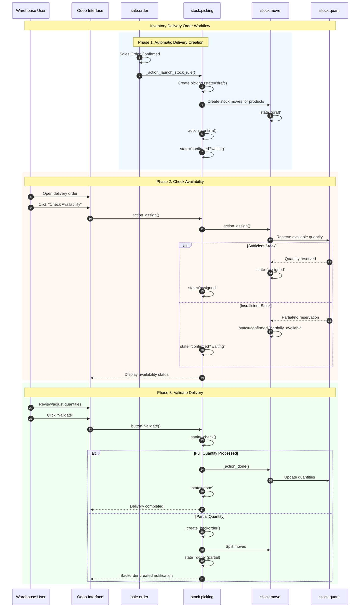
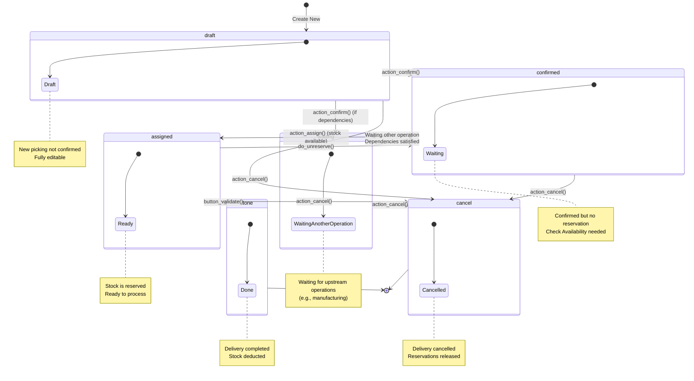

# Inventory Delivery Order Workflow

## Overview

### Business Objective

The Inventory Delivery Order workflow manages the **outbound logistics process** for fulfilling customer orders. When a sales order is confirmed, Odoo automatically creates a delivery order (also called a **picking**) that authorizes warehouse staff to pick, pack, and ship products to the customer.

**What This Workflow Accomplishes:**
- Tracks products reserved for customer delivery
- Manages stock reservation and availability checking
- Enables partial shipments with automatic backorder creation
- Records delivery completion for invoicing and reporting

### Target Personas

| Role | Responsibilities | Typical Actions |
|------|------------------|-----------------|
| **Warehouse Staff** | Pick and pack products for shipment | Check availability, process quantities, validate delivery |
| **Stock Manager** | Oversee inventory operations | Monitor delivery status, handle exceptions, manage backorders |
| **Sales Coordinator** | Track order fulfillment | View delivery status from sales orders, communicate with customers |
| **Delivery Driver** | Execute physical shipment | Mark delivery as complete on mobile device |

### Business Value

This workflow is critical because:
- **Order Fulfillment**: Ensures customer orders are delivered accurately and on time
- **Inventory Accuracy**: Updates stock levels automatically upon delivery validation
- **Visibility**: Provides real-time tracking of delivery status for all stakeholders
- **Integration**: Connects sales orders to physical warehouse operations seamlessly

---

## Prerequisites

### Required Modules

Before using this workflow, ensure the following modules are installed:

| Module | Technical Name | Purpose |
|--------|----------------|---------|
| **Inventory** | `stock` | Core warehouse and delivery management |
| **Contacts** | `contacts` | Customer database for delivery addresses |

**Optional modules that enhance this workflow:**
- **Sales** (`sale_management`): Enables automatic delivery creation from sales orders
- **Invoicing** (`account`): Enables invoice generation post-delivery
- **Barcode** (`barcodes`): Enables barcode scanning for faster processing

### Required User Permissions

The user must belong to one of these security groups:

| Group | Access Level | Can Perform |
|-------|--------------|-------------|
| *Inventory / User* | Basic | View and process own delivery orders |
| *Inventory / Administrator* | Full | All operations including configuration |

**Additional permission considerations:**
- Users need access to the warehouse locations involved in the delivery
- Multi-location users require *Inventory / Multi-Locations* group

To check your permissions: Navigate to *Settings → Users & Companies → Users → [Your User] → Access Rights*.

### Required Data Setup

Before processing deliveries, ensure the following are configured:

1. **Warehouse** with defined delivery location (default: WH/Stock)
2. **Customer location** (default: Partner Locations/Customers)
3. **Products** defined as storable with available stock
4. **Delivery operation type** configured (default: Delivery Orders)

---

## Workflow Diagram

### Sequence Diagram

The following diagram shows the complete interaction flow from sales order confirmation through delivery completion:

### State Machine Diagram

A **Delivery Order** (`stock.picking`) progresses through the following states:

**State Definitions:**

| State | Display Name | Description |
|-------|--------------|-------------|
| `draft` | Draft | New delivery not yet confirmed; fully editable |
| `waiting` | Waiting Another Operation | Blocked by upstream operation (e.g., receipt, manufacturing) |
| `confirmed` | Waiting | Confirmed but stock not yet reserved |
| `assigned` | Ready | Stock is reserved; ready for processing |
| `done` | Done | Delivery has been validated and completed |
| `cancel` | Cancelled | Delivery has been cancelled; reservations released |

*Source: `addons/stock/models/stock_picking.py:575-589`*

---

## Step-by-Step Guide

### Step 1: Navigate to Delivery Order from Sales Order

**What You Want to Accomplish:** Access the delivery order that was automatically created when a sales order was confirmed.

**Navigation Path:** *Sales → Orders → Sales Orders → [Select Order] → Delivery Smart Button*

**Alternative Path:** *Inventory → Operations → Delivery Orders → [Select Delivery]*

**Actions:**

1. **Open the confirmed sales order** where you want to track delivery
   - The sales order must be in "Sales Order" state (confirmed)

2. **Click the "Delivery" smart button** in the top-right area
   - The button shows a count (e.g., "1") indicating linked delivery orders
   - Clicking opens the delivery order form directly (if only one) or a list (if multiple)

**What the User Sees:**

The delivery order form displays:
- **Reference number** at the top (e.g., "WH/OUT/00001")
- **Status bar** showing current state (e.g., "Waiting")
- **Delivery Address** (customer shipping address)
- **Source Location** (warehouse location, e.g., "WH/Stock")
- **Scheduled Date** indicating planned delivery date
- **Origin** field showing the source sales order reference
- **Operations tab** with product lines to deliver

**Screenshot Reference:** `screenshots/05-01-delivery-from-sales.png`

---

### Step 2: View Delivery Order Details and Stock Requirements

**What You Want to Accomplish:** Understand what products need to be delivered and their current availability status.

**Actions:**

1. **Review the header information:**
   - *Delivery Address*: Confirms where products will be shipped
   - *Operation Type*: Confirms this is a "Delivery Orders" operation
   - *Scheduled Date*: Target date for delivery
   - *Source Document*: Reference to the originating sales order

2. **Examine the Operations tab:**
   - Each line shows a product that needs to be delivered
   - The *Demand* column shows the quantity ordered
   - The *Quantity* column (if visible) shows quantity to process
   - The *Forecast* indicator shows availability status

**What the User Sees:**

The Operations tab displays a table with:

| Column | Purpose |
|--------|---------|
| **Product** | The item to be delivered |
| **Demand** | Quantity requested from sales order |
| **Quantity** | Quantity being processed (editable) |
| **Unit** | Unit of measure |
| **Forecast** | Visual indicator of stock availability |

The **Forecast widget** shows availability status:
- 🟢 **Green**: Stock is available now
- 🟡 **Yellow**: Stock will be available (expected receipt)
- 🔴 **Red**: Stock is unavailable or late

**Screenshot Reference:** `screenshots/05-02-delivery-details.png`

---

### Step 3: Check Availability and Reserve Stock

**What You Want to Accomplish:** Reserve the required products from warehouse stock for this specific delivery.

**Navigation:** On the delivery order form

**Actions:**

1. **Click the "Check Availability" button** (visible when state is 'Waiting' or 'Confirmed')
   - The system searches for available stock in the source location
   - Available stock is reserved (locked) for this delivery

2. **Observe the state change:**
   - If all products are available: State changes to **"Ready"** (assigned)
   - If some products available: State may change to "Ready" based on shipping policy
   - If no products available: State remains "Waiting" (confirmed)

**What the User Sees:**

After checking availability:
- The **status bar** updates to show the new state
- The **Quantity** column updates with reserved amounts
- The **"Validate" button** becomes prominently available (if Ready)
- The **availability indicator** updates with reservation status

**System Behavior (Based on Shipping Policy):**

| Shipping Policy | Reservation Behavior |
|-----------------|---------------------|
| *As soon as possible* | Partial reservations accepted; can process available stock |
| *When all products are ready* | Full reservation required; all products must be available |

*Source: `addons/sale_stock/models/sale_order.py:21-26`*

**Screenshot Reference:** `screenshots/05-03-check-availability.png`

---

### Step 4: Review Reserved Quantities

**What You Want to Accomplish:** Verify that the correct quantities are reserved and ready for delivery.

**Actions:**

1. **Review each product line** in the Operations tab:
   - Confirm the *Quantity* column matches the *Demand* (for full delivery)
   - Note any discrepancies that may require attention

2. **Click the "Details" button** on any line (if visible) to see:
   - Specific lot/serial numbers (if tracked)
   - Source location details
   - Package information (if applicable)

3. **Adjust quantities if needed:**
   - The *Quantity* field can be modified to process partial amounts
   - Reducing quantity will create a backorder for the remaining

**What the User Sees:**

When fully reserved, each product line shows:
- **Demand**: Original requested quantity (e.g., "5")
- **Quantity**: Reserved quantity matching demand (e.g., "5")
- Visual confirmation that quantities match

The status bar shows **"Ready"** indicating all products are reserved.

**Important:** If products have tracking (lots/serials), you must specify which specific units are being shipped.

**Screenshot Reference:** `screenshots/05-04-reserved-quantities.png`

---

### Step 5: Validate the Delivery Order

**What You Want to Accomplish:** Confirm that products have been picked, packed, and are ready to ship. This action deducts inventory and marks the delivery complete.

**Actions:**

1. **Ensure all quantities are correct:**
   - Verify *Quantity* column reflects what is actually being shipped
   - Adjust if physical count differs from reserved amount

2. **Click the "Validate" button:**
   - This is the primary action button when status is "Ready"
   - The system performs final validation checks

3. **Handle validation prompts if they appear:**
   - **Backorder prompt**: If quantities are less than demand, choose whether to create a backorder
   - **Lot/Serial prompt**: If products require tracking, enter the specific units

**What the User Sees:**

The validation process may show one of these dialogs:

**If processing partial quantity:**
> "You have processed less products than the initial demand. Create a backorder for the remaining products?"
> - **Create Backorder**: Creates new delivery for remaining quantity
> - **No Backorder**: Cancels remaining quantity (demand reduced)

**If lot/serial tracking required:**
> A form to enter specific lot numbers or scan serial numbers for tracked products.

**Screenshot Reference:** `screenshots/05-05-validate-delivery.png`

---

### Step 6: Confirm Completed Delivery Status

**What You Want to Accomplish:** Verify that the delivery has been successfully completed and review the final state.

**Actions:**

1. **Observe the status change:**
   - The status bar changes to **"Done"** (typically displayed in green)
   - The *Effective Date* field is populated with the completion timestamp

2. **Review the completed delivery:**
   - All fields are now read-only
   - The delivery reference is preserved for records

3. **Access related documents:**
   - Click the **"Back Orders"** button (if any) to see pending deliveries
   - Return to the sales order via the *Source Document* link

**What the User Sees:**

After successful validation:
- **Status bar** shows "Done" in green/success color
- **Effective Date** displays the delivery completion timestamp
- **Product lines** show final delivered quantities
- **Chatter** logs the validation action with timestamp
- Most form fields are now **read-only**

**System Effects:**
- **Inventory**: Stock quantities are deducted from source location
- **Customer Location**: Virtual inventory added at customer location
- **Sales Order**: Delivery status updated (if all deliveries done: "Fully Delivered")

**Screenshot Reference:** `screenshots/05-06-delivery-done.png`

---

## Variations and Edge Cases

### Partial Delivery and Backorder Creation

**Scenario:** The warehouse can only ship part of the ordered quantity (e.g., 3 of 5 items ordered).

**How to Handle:**

1. After checking availability, **adjust the Quantity field** to the amount you can ship
2. Click **"Validate"**
3. When prompted, select **"Create Backorder"**
4. The original delivery is completed with the partial amount
5. A new delivery order is automatically created for the remaining quantity

**What Happens:**
- Original delivery: state='done', quantity=3
- Backorder created: state='confirmed', quantity=2
- Sales order shows: Delivery status "Partially Delivered"

**Navigation:** The backorder link appears in the chatter message and can be accessed via the "Back Orders" smart button.

*Source: `addons/stock/models/stock_picking.py:1569-1594`*

---

### Insufficient Stock Scenarios

**Scenario:** The warehouse doesn't have enough stock to fulfill the delivery.

**Possible Situations:**

| Situation | State After Check | Recommended Action |
|-----------|-------------------|-------------------|
| Zero stock available | Waiting (confirmed) | Wait for receipt or cancel |
| Partial stock available | Ready (if shipping policy = "As soon as possible") | Process partial or wait |
| Stock reserved elsewhere | Waiting (confirmed) | Unreserve from other orders or wait |

**How to Handle:**

1. **Check Availability** to see current reservation status
2. **Review forecast widget** for expected receipt dates
3. Options:
   - **Wait** for incoming stock (receipt from purchase order)
   - **Process partial** if shipping policy allows
   - **Contact sales** to communicate delay to customer
   - **Cancel** the delivery if order is cancelled

---

### Manual Quantity Adjustment

**Scenario:** The physical count differs from the system reservation (e.g., damaged items found during picking).

**How to Handle:**

1. On the delivery order in "Ready" state
2. **Edit the Quantity field** for the affected product line
3. Enter the actual quantity you can ship
4. **Validate** the delivery
5. Choose **"Create Backorder"** when prompted

**Important Considerations:**
- Adjusting quantity below reserved amount releases the excess reservation
- The unreserved quantity becomes available for other orders
- An audit trail is created in the chatter

---

### Unreserving Stock

**Scenario:** Reserved stock needs to be released (e.g., order priority changed, items needed elsewhere).

**How to Handle:**

1. Open the delivery order in "Ready" (assigned) state
2. Click **"Unreserve"** button (in Additional Info or header actions)
3. Stock is released back to available inventory
4. Delivery state changes to "Waiting" (confirmed)

**System Effects:**
- Reserved quantities return to available stock
- Other orders can now reserve this stock
- The delivery still exists but needs availability check again

*Source: `addons/stock/models/stock_picking.py:1388-1389`*

---

### Cancellation Workflow

**Scenario:** The delivery order needs to be cancelled (e.g., order cancelled by customer).

**How to Handle:**

1. Open the delivery order (in any state except "Done")
2. Click **"Cancel"** button
3. Confirm the cancellation when prompted

**What Happens:**
- Any reserved stock is released
- Delivery state changes to "Cancelled"
- The delivery order remains in the system for audit purposes
- Sales order delivery count updates accordingly

**Important:** Cancelling a delivery does NOT automatically cancel the sales order. Handle the sales order separately if needed.

*Source: `addons/stock/models/stock_picking.py:1205-1209`*

---

### Multiple Deliveries from One Sales Order

**Scenario:** A single sales order generates multiple delivery orders (e.g., products from different warehouses or backorders).

**Understanding Multiple Deliveries:**
- The sales order "Delivery" smart button shows total count
- Click the button to see a list of all related deliveries
- Each delivery can be processed independently

**Common Causes:**
- Products routed through different warehouses
- Backorders from partial deliveries
- Drop shipping directly from vendors

---

## Integration Points

### Integration with Sales Module (sale_stock)

**When Active:** If the Sales (`sale_management`) module is installed alongside Inventory.

**Automatic Behavior:**
- When a sales order is confirmed, `_action_launch_stock_rule()` creates delivery order(s)
- The delivery inherits shipping policy from the sales order
- Customer address flows from sales order to delivery
- Delivery status updates reflect back to sales order

**User Impact:**
- Sales users can monitor delivery status via smart buttons
- The sales order "Delivery Status" field shows: Not Delivered → Started → Partially Delivered → Fully Delivered

*Source: `addons/sale_stock/models/sale_order.py:213-215`*

---

### Integration with Invoicing Module (account)

**When Active:** If the Invoicing (`account`) module is installed alongside Inventory.

**Configuration Option:**
- Invoice policy can be set to "Delivered quantities" in Sales settings
- When enabled, invoices are based on what was actually delivered

**User Impact:**
- Only delivered quantities appear on invoices
- Partial deliveries result in partial invoice amounts
- Full delivery tracking ensures accurate billing

---

### Integration with Stock Moves (stock.move)

**How It Works:**
- Each delivery order contains one or more **stock moves**
- A stock move represents the transfer of a specific product quantity
- Moves track: product, quantity, source location, destination location

**Relationship:**
- `stock.picking` (Delivery Order) → contains → multiple `stock.move` records
- Each order line on sales order creates one stock move
- Move states mirror picking states but operate at product level

*Source: `addons/stock/models/stock_move.py:18-22`*

---

### Integration with Stock Quants (stock.quant)

**How It Works:**
- **Quants** represent actual inventory quantities at specific locations
- Reservation creates a link between stock moves and available quants
- Validation updates quant quantities (decreases source, increases destination)

**Key Concepts:**
- `reserved_quantity`: Amount locked for specific operations
- `quantity`: Total quantity at location (including reserved)
- `available_quantity`: Quantity free for new reservations

---

## Error Scenarios

### Nothing to Check Availability For

**Error Message:** "Nothing to check the availability for."

**When It Occurs:** Clicking "Check Availability" when all moves are already done, cancelled, or in draft state.

**What the User Sees:**
- A warning popup appears
- No state change occurs

**How to Resolve:**
1. Verify the delivery is in 'confirmed' or 'waiting' state
2. Ensure there are actual product moves that need reservation
3. If state is 'draft', first confirm the delivery

*Source: `addons/stock/models/stock_picking.py:1200-1201`*

---

### Validation Without Quantities

**Error Message:** "You cannot validate a transfer if no quantities are reserved nor done."

**When It Occurs:** Attempting to validate a delivery where no products have quantities set or reserved.

**What the User Sees:**
- A warning popup prevents validation
- The delivery remains in its current state

**How to Resolve:**
1. Click "Check Availability" first to reserve stock
2. If no stock available, either wait for stock or cancel
3. Ensure at least one product line has quantity > 0

---

### Lot/Serial Number Required

**Error Message:** "You need to supply a Lot/Serial number for product [Product Name]."

**When It Occurs:** Validating a delivery containing products with lot or serial tracking but no tracking information entered.

**What the User Sees:**
- A popup requesting lot/serial information
- Must enter tracking details before proceeding

**How to Resolve:**
1. Click "Details" on the product line
2. Enter the lot/serial numbers being shipped
3. Complete validation

---

### Company Mismatch

**Error Context:** The delivery involves locations or products from different companies.

**When It Occurs:** In multi-company setups, attempting operations across company boundaries.

**What the User Sees:**
- Validation error indicating company inconsistency
- Operation blocked

**How to Resolve:**
1. Verify you're working in the correct company context
2. Use the company switcher if necessary
3. Ensure all locations belong to the same company

---

## What the User Sees: UI State Reference

### Draft State

| UI Element | Appearance |
|------------|------------|
| Status Bar | Shows "Draft" |
| Primary Button | **Confirm** |
| Secondary Buttons | Cancel |
| Form Fields | All editable |
| Operations Tab | Products can be added/removed |

### Waiting/Confirmed State

| UI Element | Appearance |
|------------|------------|
| Status Bar | Shows "Waiting" |
| Primary Button | **Check Availability** |
| Secondary Buttons | Cancel, Print |
| Form Fields | Limited editing |
| Availability | Shows forecast widget per line |

### Ready/Assigned State

| UI Element | Appearance |
|------------|------------|
| Status Bar | Shows "Ready" (often highlighted in blue) |
| Primary Button | **Validate** (prominent) |
| Secondary Buttons | Unreserve, Print |
| Form Fields | Quantity editable |
| Reservation Status | Shows reserved quantities |

### Done State

| UI Element | Appearance |
|------------|------------|
| Status Bar | Shows "Done" (green/success) |
| Primary Button | None (completed) |
| Secondary Buttons | Print, Return |
| Form Fields | Read-only |
| Smart Buttons | Back Orders count (if any) |

### Cancelled State

| UI Element | Appearance |
|------------|------------|
| Status Bar | Shows "Cancelled" |
| Primary Button | None |
| Form Fields | Read-only |
| Visual Indicator | Muted/greyed appearance |

---

## Business Rules Reference

For detailed information about validation logic, computation rules, and access control for this workflow, see:

**[Inventory Delivery Order Business Rules](../../04-business-rules/inventory-delivery-rules.md)**

Key rules documented there include:
- Stock reservation logic and priority
- Availability computation rules
- Backorder creation criteria
- Validation constraints
- Access control by security group

---

## Related Documentation

- **[Capabilities Inventory](../../01-capabilities-overview/capabilities-inventory.md)** - Complete module reference including Inventory module details
- **[Sales Quote to Order Flow](../01-sales-quote-to-order/flow-document.md)** - Creating sales orders that generate deliveries
- **[Inventory Receipt Processing Flow](../04-inventory-receipt-processing/flow-document.md)** - Receiving products into warehouse
- **[Invoice Creation and Payment Flow](../06-invoice-creation-payment/flow-document.md)** - Invoicing for delivered goods
- **[Inventory Adjustment Flow](../15-inventory-adjustment/flow-document.md)** - Adjusting stock quantities

---

## Glossary of Terms Used

| Term | Definition |
|------|------------|
| **Delivery Order** | A warehouse document authorizing the shipment of products to a customer; also called a picking or transfer |
| **Picking** | Alternative term for delivery order; the act of selecting products from warehouse locations |
| **Stock Move** | An individual product transfer record within a delivery order |
| **Quant** | A record representing the quantity of a product at a specific warehouse location |
| **Reservation** | The act of locking available stock for a specific delivery order |
| **Backorder** | A new delivery order created for remaining quantities when a partial shipment is processed |
| **Shipping Policy** | Determines whether partial deliveries are allowed ("As soon as possible") or all products must be ready ("When all products are ready") |
| **Operation Type** | Configuration that defines the behavior of transfers (e.g., Receipts, Delivery Orders, Internal Transfers) |
| **Source Location** | The warehouse location from which products are taken |
| **Destination Location** | The location where products are delivered (e.g., Customer location) |
| **Availability** | The status indicating whether sufficient stock is available for reservation |
| **Forecast Widget** | Visual indicator showing current and expected stock availability |
| **Smart Button** | A clickable button on a record that shows a count and links to related records |
| **Chatter** | The communication history panel on records showing messages and activity |

---

*Document Version: 1.0*  
*Source References:*
- *`addons/stock/models/stock_picking.py:575-589` (State definitions)*
- *`addons/stock/models/stock_picking.py:1181-1203` (action_confirm, action_assign)*
- *`addons/stock/models/stock_picking.py:1391-1451` (button_validate)*
- *`addons/sale_stock/models/sale_order.py:21-26` (Shipping policy)*
- *`addons/stock/views/stock_picking_views.xml` (Form view structure)*
- *Odoo 19.0 Community Edition*
