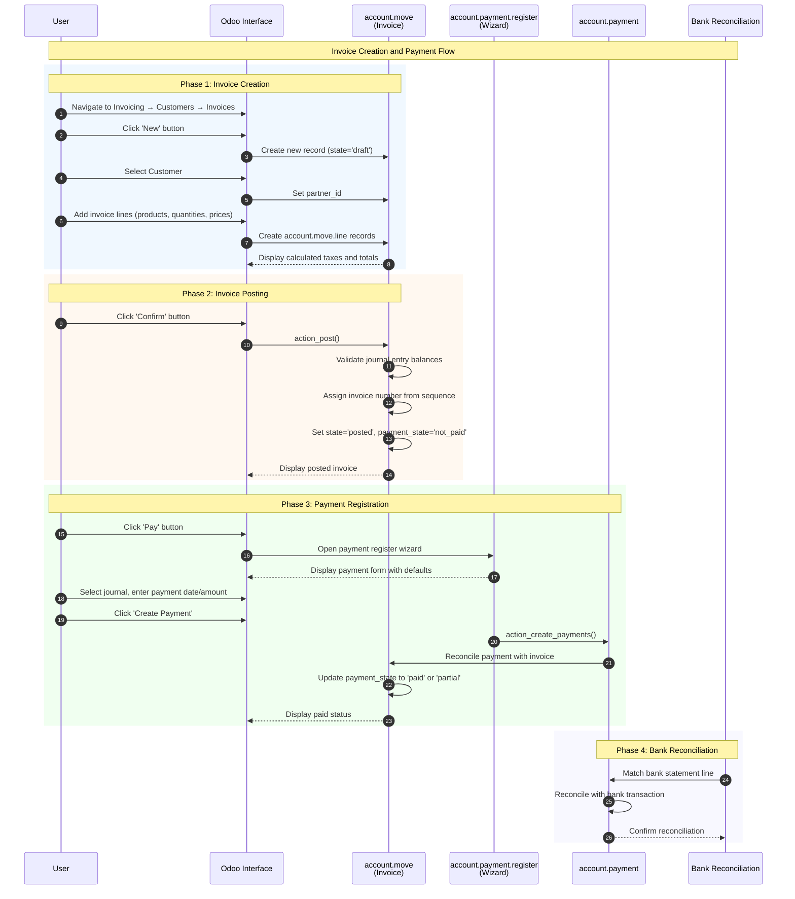
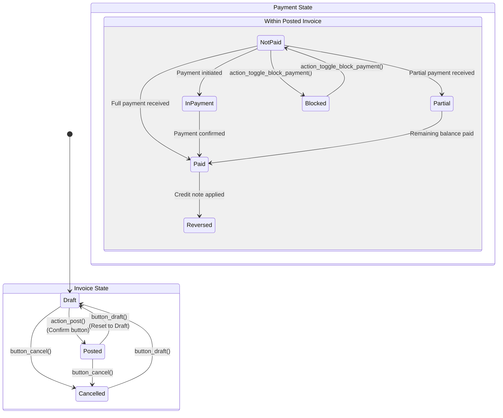

# User Flow 06: Invoice Creation and Payment

## Overview

### Business Objective

Create customer invoices and collect payments to recognize revenue and manage accounts receivable effectively. This workflow enables businesses to bill customers for goods and services, track payment status, and maintain accurate financial records.

### Target Personas

| Persona | Role | Primary Activities |
|---------|------|-------------------|
| Accounts Receivable Clerk | Day-to-day invoice processing | Create invoices, register payments, follow up on outstanding balances |
| Billing Specialist | Invoice preparation and verification | Review invoice details, ensure accuracy, send to customers |
| Finance Manager | Oversight and reporting | Monitor payment status, review aging reports, approve credit notes |

### Business Value

The Invoice Creation and Payment workflow is the **core cash collection process** for any business using Odoo. This workflow:

- **Converts services/products delivered into recognized revenue** through proper invoicing
- **Tracks payment status** from unpaid through partial to fully paid
- **Integrates with bank reconciliation** for automated payment matching
- **Generates accounting entries automatically** for accurate financial reporting
- **Supports multiple payment methods** including bank transfers, cash, and checks

---

## Prerequisites

### Required Modules

| Module | Technical Name | Purpose |
|--------|---------------|---------|
| Invoicing | `account` | Core invoicing and payment functionality |

### Required Permissions

The user must belong to one of the following security groups:

| Group | Technical Name | Access Level |
|-------|---------------|--------------|
| Billing | `account.group_account_invoice` | Create and manage invoices, register payments |
| Accountant | `account.group_account_user` | Full accounting access including journal entries |

### Data Requirements

Before creating invoices, ensure the following are configured:

1. **Customers**: At least one customer (partner) record must exist
2. **Products/Services**: Items to invoice must be defined in the product catalog
3. **Chart of Accounts**: Income accounts for revenue recognition
4. **Payment Journals**: Bank or Cash journals for payment registration
5. **Taxes** (optional): Tax configurations if applicable to your business

---

## Flow Diagram

### Sequence Diagram

The following diagram shows the complete interaction flow from invoice creation through payment:

### State Machine Diagram

The invoice lifecycle involves two interconnected state machines:

#### Invoice States

| State | Label | Description |
|-------|-------|-------------|
| `draft` | Draft | Invoice is being prepared; all fields are editable |
| `posted` | Posted | Invoice is confirmed; invoice number assigned; lines are locked |
| `cancel` | Cancelled | Invoice has been cancelled; no further actions allowed |

*Source: `addons/account/models/account_move.py` lines 128-140*

#### Payment States

| State | Label | Description |
|-------|-------|-------------|
| `not_paid` | Not Paid | No payment has been received for this invoice |
| `in_payment` | In Payment | Payment has been initiated but not yet confirmed at the bank |
| `paid` | Paid | Invoice has been fully paid |
| `partial` | Partially Paid | Some payment received; balance remains outstanding |
| `reversed` | Reversed | Invoice was paid but payment was reversed (e.g., refund) |
| `blocked` | Blocked | Payment collection is intentionally blocked |

*Source: `addons/account/models/account_move.py` lines 47-55 (PAYMENT_STATE_SELECTION)*

---

## Step-by-Step Guide

### Step 1: Create a New Invoice

**Screenshot Reference**: `06-01-create-invoice.png`

**What the User Does**:

1. Navigate to **Invoicing → Customers → Invoices** in the main menu
2. Click the **New** button in the top-left corner of the invoice list view

**What the User Sees**:

- A new invoice form opens in **Draft** state
- The **Confirm** button appears prominently at the top (highlighted in blue)
- All fields are editable
- The **Invoice Date** field auto-populates with today's date

**Required Actions**:

| Field | Action | Notes |
|-------|--------|-------|
| Customer | Select from dropdown | Required field; type to search |
| Invoice Date | Verify or change | Defaults to today |
| Payment Terms | Select if applicable | Affects due date calculation |

**System Behavior**:

- The system creates a new `account.move` record with `move_type='out_invoice'` and `state='draft'`
- No invoice number is assigned yet (displays as "Draft" or placeholder)
- The journal defaults to the company's default sales journal

---

### Step 2: Add Invoice Lines

**Screenshot Reference**: `06-02-add-invoice-lines.png`

**What the User Does**:

1. In the **Invoice Lines** tab, click **Add a line**
2. Select a **Product** from the dropdown (or create a new one)
3. Enter the **Quantity** and verify the **Unit Price**
4. Repeat for additional products/services as needed

**What the User Sees**:

- Each line shows: Product, Description, Quantity, Unit Price, Taxes, Subtotal
- The **Tax Totals** section at the bottom displays:
  - **Untaxed Amount**: Sum of line subtotals before tax
  - **Taxes**: Calculated tax amounts
  - **Total**: Grand total including taxes

**Field Details**:

| Field | Description | Auto-calculated |
|-------|-------------|-----------------|
| Product | The item being invoiced | No |
| Description | Text description for customer | Defaults from product |
| Quantity | Number of units | No (default: 1) |
| Unit Price | Price per unit | Defaults from product |
| Taxes | Applicable tax rates | Defaults from product/customer |
| Subtotal | Quantity × Unit Price | Yes |

**System Behavior**:

- Each line creates an `account.move.line` record with `display_type='product'`
- Taxes are computed automatically based on product and customer fiscal position
- Totals update in real-time as lines are added or modified
- The system validates that at least one line exists before posting

**Business Rules**:

- Invoice lines must have a positive quantity
- Unit price can be zero (for free items) but not negative
- Tax calculation follows the company's rounding method (per-line or global)

---

### Step 3: Post the Invoice

**Screenshot Reference**: `06-03-post-invoice.png`

**What the User Does**:

1. Review all invoice details for accuracy:
   - Customer information
   - Invoice lines and totals
   - Payment terms and due date
2. Click the **Confirm** button at the top of the form

**What the User Sees Before Posting**:

- Invoice in **Draft** state
- **Confirm** button highlighted as the primary action
- All fields remain editable

**What the User Sees After Posting**:

- Invoice state changes to **Posted**
- An **invoice number** is assigned (e.g., "INV/2024/00001")
- The **Pay** button appears prominently
- Invoice lines become read-only (locked)
- Payment state shows **Not Paid**
- The **Send** button appears for emailing to customer

**System Behavior**:

When the user clicks **Confirm**, the system executes `action_post()`:

1. **Validates** the journal entry (debits must equal credits)
2. **Assigns** an invoice number from the journal's sequence
3. **Changes state** from `draft` to `posted`
4. **Sets** `payment_state` to `not_paid`
5. **Creates** the underlying accounting journal entry
6. **Locks** the invoice to prevent modification

*Source: `addons/account/models/account_move.py` line 5954*

**Validation Rules**:

- Invoice must have at least one line
- Customer field must be filled
- Journal entry must balance (total debits = total credits)

---

### Step 4: Register Payment

**Screenshot Reference**: `06-04-register-payment.png`

**What the User Does**:

1. On the posted invoice, click the **Pay** button
2. In the **Payment Registration** wizard that opens:
   - Select the **Payment Journal** (e.g., "Bank" or "Cash")
   - Verify the **Payment Date** (defaults to today)
   - Verify the **Amount** (defaults to invoice total)
   - Optionally enter a **Memo** for reference
3. Click **Create Payment**

**What the User Sees**:

The Payment Registration wizard displays:

| Field | Default Value | Description |
|-------|---------------|-------------|
| Journal | Company's default bank journal | Where to record the payment |
| Payment Date | Today's date | When payment was received |
| Amount | Invoice total | Full amount due |
| Memo | Invoice reference | Communication/reference text |

**System Behavior**:

When the user clicks **Create Payment**:

1. The wizard calls `action_create_payments()` to create an `account.payment` record
2. The payment is automatically reconciled with the invoice
3. The invoice's `payment_state` updates:
   - **Paid** if full amount received
   - **Partial** if less than full amount
4. The invoice's `amount_residual` (Amount Due) updates to reflect remaining balance

*Source: `addons/account/wizard/account_payment_register.py` line 1299*

**Important Notes**:

- Payments can only be registered on **posted** invoices (not draft)
- Attempting to register payment on a draft invoice shows error: *"You can only register payment for posted journal entries."*

*Source: `addons/account/models/account_move.py` line 5876-5877*

---

### Step 5: View Paid Invoice

**Screenshot Reference**: `06-05-invoice-paid.png`

**What the User Sees**:

After successful payment registration:

- A **green banner** appears showing the payment status:
  - "IN PAYMENT" (payment initiated but pending bank confirmation)
  - "PAID" (payment confirmed)
- The **Pay** button is no longer visible (or shows faded)
- The **Amount Due** field shows **$0.00** (or remaining balance for partial payment)
- A **smart button** appears showing payment count (e.g., "1 Payment")
- The **chatter** (message history) shows payment activity

**Verifying Payment Details**:

1. Click the **Payment** smart button to view linked payment(s)
2. In the chatter, view the automatic message: "Payment of [Amount] registered"

**System State**:

| Field | Value for Fully Paid Invoice |
|-------|------------------------------|
| State | Posted |
| Payment State | Paid |
| Amount Due | 0.00 |
| Residual Amount | 0.00 |

---

## Variations and Edge Cases

### Partial Payment

**Scenario**: Customer pays only part of the invoice amount

**How to Handle**:

1. Register payment as normal (Step 4)
2. In the wizard, change the **Amount** field to the partial amount received
3. Click **Create Payment**

**Result**:

- Payment state shows **Partially Paid**
- Amount Due shows remaining balance
- The **Pay** button remains available for additional payments
- Multiple payments can be registered until full amount is collected

---

### Overpayment Handling

**Scenario**: Customer pays more than the invoice amount

**How to Handle**:

1. Register the full payment amount received
2. The system creates an **outstanding credit** for the customer
3. This credit can be applied to future invoices

**Result**:

- Invoice shows as **Paid**
- Customer has a credit balance
- Credit appears in the **Outstanding Payments** section on future invoices

---

### Credit Note Creation

**Scenario**: Need to reduce or cancel an invoice after posting

**How to Handle**:

1. On the posted invoice, click **Credit Note** button
2. Complete the Credit Note wizard:
   - Select reason for credit note
   - Choose whether to create a draft or post immediately
3. The credit note creates a reversal entry

**Technical Details**:

- Credit notes have `move_type='out_refund'`
- They can be reconciled with the original invoice
- Payment state may change to **Reversed** if fully credited

---

### Reset to Draft

**Scenario**: Need to edit a posted invoice that hasn't been paid

**How to Handle**:

1. On the posted invoice, click **Reset to Draft** button
2. Invoice returns to draft state
3. Make necessary corrections
4. Post the invoice again

**Restrictions**:

- Cannot reset if invoice has payments reconciled
- Cannot reset if invoice is hashed (locked for audit trail)
- Cannot reset exchange difference journal entries
- Cannot reset tax cash basis entries

*Source: `addons/account/models/account_move.py` lines 6043-6111*

**Error Messages**:

- "You cannot reset to draft a locked journal entry." (if hashed)
- "Only posted/cancelled journal entries can be reset to draft."

---

### Cancelling Invoices

**Scenario**: Invoice was created in error and needs to be voided

**How to Handle**:

1. If invoice is in **Draft** state: Click **Cancel** button directly
2. If invoice is **Posted**: Click **Reset to Draft** first (if allowed), then **Cancel**

**Technical Details**:

- Cancelled invoices set `state='cancel'`
- Any reconciled payments are automatically unreconciled
- The `button_cancel()` method handles the state transition

*Source: `addons/account/models/account_move.py` lines 6122-6134*

---

### Blocking Payment Collection

**Scenario**: Need to temporarily stop payment collection (e.g., dispute)

**How to Handle**:

1. On the invoice, access the action menu
2. Select **Block Payment** action
3. Invoice payment state changes to **Blocked**

**Result**:

- Invoice is excluded from follow-up reports
- Payment state shows **Blocked**
- Can be unblocked using the same action

*Source: `addons/account/models/account_move.py` lines 6136-6144*

---

## Integration Points

### Sales Module Integration

When the Sales module is installed (`sale`), invoices can be created directly from confirmed sales orders:

| Trigger | Result |
|---------|--------|
| Sales Order confirmed with "Ordered quantities" invoicing policy | Invoice can be created immediately |
| Sales Order confirmed with "Delivered quantities" invoicing policy | Invoice created after delivery validation |
| Click "Create Invoice" on Sales Order | Opens invoice creation wizard |

The invoice maintains a link to the source sales order via smart button.

---

### Bank Reconciliation Integration

Payments registered through invoices integrate with bank reconciliation:

| Process | Integration |
|---------|-------------|
| Manual payment registration | Creates payment to be matched with bank statement |
| Bank statement import | Auto-suggests matching with open invoices |
| Reconciliation completion | Updates invoice payment_state automatically |

---

### Credit Notes and Reversals

Credit notes are linked to original invoices:

| Original Document | Credit Note Type | Relationship |
|-------------------|------------------|--------------|
| Customer Invoice (out_invoice) | Customer Credit Note (out_refund) | Reversal entries created |
| Vendor Bill (in_invoice) | Vendor Credit Note (in_refund) | Reversal entries created |

The **Reverse Entry** action creates properly linked credit notes.

---

### Journal Entries

Every posted invoice automatically creates journal entries:

| Invoice Type | Debit Account | Credit Account |
|--------------|---------------|----------------|
| Customer Invoice | Accounts Receivable | Revenue Account |
| Tax Line | Tax Receivable | Tax Payable |

These entries are visible in the invoice's **Journal Items** tab.

---

## Business Rules Reference

For detailed validation rules, state transitions, computation rules, and access controls, see:

**[Invoice and Payment Business Rules](../../04-business-rules/invoice-payment-rules.md)**

### Key Validations Summary

| Validation | Triggered When | Error Message |
|------------|----------------|---------------|
| Posted state required | Registering payment on draft | "You can only register payment for posted journal entries." |
| Balance validation | Posting invoice | "Cannot create unbalanced journal entry." |
| Locked entry protection | Resetting hashed entry | "You cannot reset to draft a locked journal entry." |
| Line requirement | Posting without lines | "There are no journal items in the draft state to post." |

---

## Error Scenarios and Troubleshooting

### Common Errors

#### Error: "You can only register payment for posted journal entries."

**Cause**: Attempting to register payment on a draft invoice

**Solution**: 
1. Ensure the invoice is in **Posted** state
2. Click **Confirm** to post the invoice first
3. Then register the payment

---

#### Error: "You cannot reset to draft a locked journal entry."

**Cause**: The invoice has been hashed for audit trail purposes

**Solution**:
- This invoice cannot be modified
- Create a credit note to reverse it instead
- Contact your accountant for guidance

---

#### Error: Unbalanced Journal Entry

**Cause**: The invoice lines don't result in balanced accounting entries

**Solution**:
1. Check that all lines have valid accounts
2. Verify tax configurations
3. Ensure no rounding issues in line amounts

---

#### Error: Missing Customer

**Cause**: Attempting to confirm invoice without customer selected

**Solution**:
1. Select a customer from the **Customer** dropdown
2. Then confirm the invoice

---

## What the User Sees: UI State Summary

### Draft State

| UI Element | Status |
|------------|--------|
| Primary Button | **Confirm** (blue, highlighted) |
| Invoice Lines | Fully editable |
| Invoice Number | Not assigned (shows "Draft") |
| Payment State | Not displayed |
| Pay Button | Not visible |

### Posted State (Unpaid)

| UI Element | Status |
|------------|--------|
| Primary Button | **Pay** (blue, highlighted) |
| Secondary Buttons | Send, Print |
| Invoice Lines | Read-only (locked) |
| Invoice Number | Assigned (e.g., "INV/2024/00001") |
| Payment State Banner | "NOT PAID" |
| Amount Due | Full invoice amount |

### Posted State (Paid)

| UI Element | Status |
|------------|--------|
| Primary Button | None prominent |
| Secondary Buttons | Credit Note, Reverse Entry |
| Invoice Lines | Read-only (locked) |
| Payment State Banner | "PAID" (green) or "IN PAYMENT" (blue) |
| Amount Due | $0.00 |
| Payment Smart Button | Shows count (e.g., "1 Payment") |

### Cancelled State

| UI Element | Status |
|------------|--------|
| Available Button | **Reset to Draft** |
| Invoice Lines | Read-only |
| State Indicator | Cancelled |
| Payment Actions | Not available |

---

## Glossary

| Term | Definition |
|------|------------|
| **Invoice** | A document requesting payment from a customer for goods or services. In Odoo, this is an `account.move` record with `move_type='out_invoice'` |
| **Posted** | The validated and locked state of an invoice. Once posted, the invoice number is assigned and lines cannot be edited |
| **Payment State** | A tracking field that indicates the collection status of an invoice (Not Paid, In Payment, Paid, Partial, Reversed, Blocked) |
| **Residual Amount** | The remaining unpaid balance on an invoice. Calculated as Total Amount minus Payments Received |
| **Payment Register Wizard** | The modal dialog (`account.payment.register`) that opens when clicking "Pay" to quickly create and reconcile a payment |
| **Journal Entry** | The underlying accounting record that balances debits and credits. Every posted invoice creates a journal entry |
| **Credit Note** | A document that reduces the amount owed by a customer. Used to correct or cancel invoices |
| **Reconciliation** | The process of matching payments with invoices to track what has been paid |
| **Amount Due** | The remaining balance to be collected, same as Residual Amount |
| **Fiscal Position** | Configuration that determines tax behavior based on customer location |

---

## Related Documentation

- [Sales Quote to Order Flow](../01-sales-quote-to-order/flow-document.md) - For creating invoices from sales orders
- [Bank Reconciliation Flow](../14-bank-reconciliation/flow-document.md) - For matching payments with bank statements
- [Vendor Bill and Payment Flow](../07-vendor-bill-payment/flow-document.md) - Similar workflow for accounts payable
- [Invoice and Payment Business Rules](../../04-business-rules/invoice-payment-rules.md) - Detailed validation and computation rules
- [Capabilities Inventory](../../01-capabilities-overview/capabilities-inventory.md) - Complete module reference

---

## Source References

| Component | File Path | Key Lines |
|-----------|-----------|-----------|
| Invoice Model | `addons/account/models/account_move.py` | State field: 128-140, PAYMENT_STATE: 47-55 |
| Post Action | `addons/account/models/account_move.py` | action_post(): 5954 |
| Register Payment | `addons/account/models/account_move.py` | action_register_payment(): 5875 |
| Reset to Draft | `addons/account/models/account_move.py` | button_draft(): 6043 |
| Cancel | `addons/account/models/account_move.py` | button_cancel(): 6122 |
| Block Payment | `addons/account/models/account_move.py` | action_toggle_block_payment(): 6136 |
| Payment Wizard | `addons/account/wizard/account_payment_register.py` | action_create_payments(): 1299 |
| Invoice Form View | `addons/account/views/account_move_views.xml` | view_move_form: 695 |

---

*Documentation generated for Odoo 19.0 Community Edition*
*Last Updated: January 2026*
