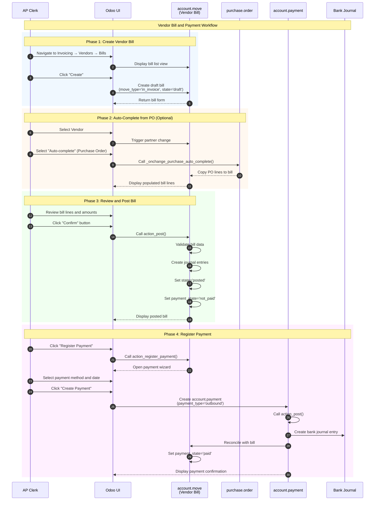
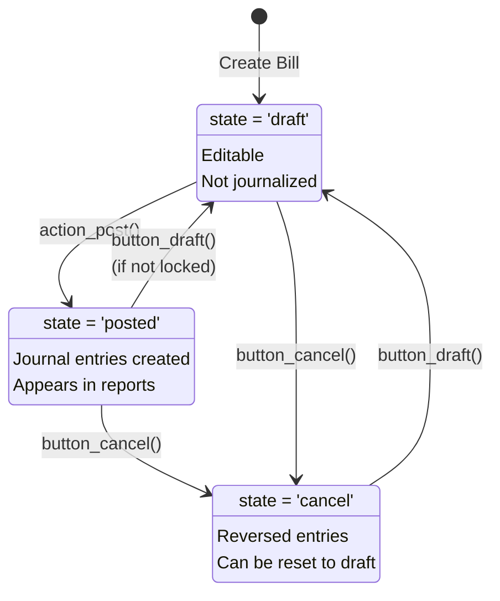
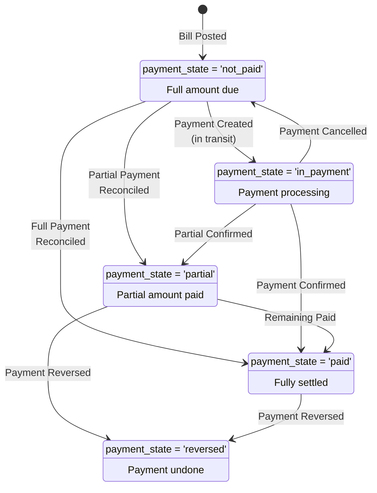
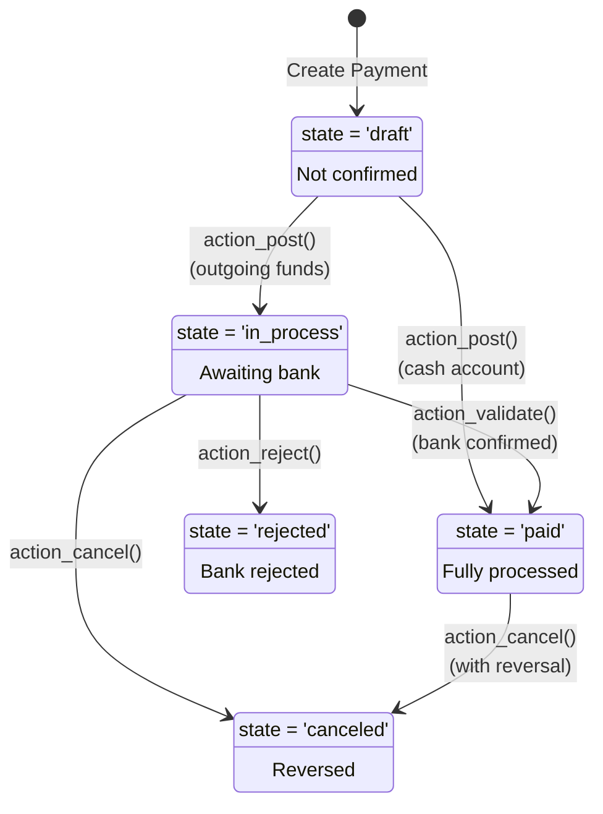

# User Flow 07: Vendor Bill and Payment

## Document Overview

### Purpose

This document provides a comprehensive guide to the **Vendor Bill and Payment** workflow in Odoo 19.0 Community Edition. The workflow covers the complete accounts payable process from receiving vendor invoices, matching them to purchase orders, posting bills, and processing payments to vendors.

### Target Audience

| Role | Use Case |
|------|----------|
| **Accounts Payable Clerk** | Day-to-day bill entry, payment processing, and vendor account management |
| **Finance Manager** | Payment approval, cash flow monitoring, and accounts payable oversight |
| **Customer Support** | Assisting end users with bill and payment workflow questions |

### Related Documentation

| Document | Description |
|----------|-------------|
| [Vendor Bill Rules](../../04-business-rules/vendor-bill-rules.md) | Detailed validation logic, approval thresholds, and business rules |
| [Capabilities Inventory](../../01-capabilities-overview/capabilities-inventory.md) | Module overview and glossary of terms |
| [Purchase RFQ to PO](../03-purchase-rfq-to-po/flow-document.md) | Upstream purchase order workflow |
| [Invoice Creation and Payment](../06-invoice-creation-payment/flow-document.md) | Customer invoice workflow for comparison |

---

## 1. Overview

### Business Objective

The Vendor Bill and Payment workflow enables organizations to:

1. **Record vendor obligations** - Capture incoming vendor invoices (bills) accurately
2. **Match bills to purchase orders** - Ensure three-way matching between PO, receipt, and bill
3. **Control cash outflows** - Manage payment timing and vendor relationships
4. **Maintain accurate financials** - Properly record accounts payable and payment transactions

### Business Value

| Value Area | Description |
|------------|-------------|
| **Cash Flow Management** | Control payment timing to optimize working capital |
| **Audit Compliance** | Three-way matching ensures proper authorization before payment |
| **Vendor Relations** | Timely, accurate payments maintain supplier relationships |
| **Financial Accuracy** | Proper accrual accounting for liabilities and expenses |

### Key Personas

#### Accounts Payable Clerk

The **Accounts Payable Clerk** performs daily bill entry and payment processing tasks:
- Creates vendor bills from received invoices
- Matches bills to existing purchase orders
- Posts approved bills for payment
- Initiates payment transactions

**Required Permission Group**: `account.group_account_invoice` (Invoicing)

#### Finance Manager

The **Finance Manager** oversees the accounts payable process:
- Reviews and approves bills above threshold amounts
- Monitors aging payables and cash requirements
- Authorizes payment batches
- Reconciles vendor accounts

**Required Permission Group**: `account.group_account_manager` (Adviser)

---

## 2. Prerequisites

### Required Modules

| Module | Technical Name | Purpose |
|--------|----------------|---------|
| **Invoicing** | `account` | Core accounting and bill management |
| **Purchase** | `purchase` | Purchase order integration for bill matching |

### User Permissions

| Permission Group | Technical Name | Access Level |
|------------------|----------------|--------------|
| Invoicing | `account.group_account_invoice` | Create and post vendor bills |
| Adviser | `account.group_account_manager` | Full access including configuration |
| Show Full Accounting Features | `account.group_account_user` | Extended accounting features |

### System Configuration

Before using this workflow, ensure the following are configured:

| Configuration Area | Location | Requirements |
|--------------------|----------|--------------|
| **Chart of Accounts** | *Invoicing → Configuration → Charts of Accounts* | Accounts Payable account configured |
| **Vendors** | *Contacts → Contacts* | Vendor partners with payment terms |
| **Payment Methods** | *Invoicing → Configuration → Payment Methods* | At least one outbound payment method |
| **Bank Journal** | *Invoicing → Configuration → Journals* | Bank journal for payments |
| **Purchase Journal** | *Invoicing → Configuration → Journals* | Purchase journal for vendor bills |

### Initial Data Requirements

| Data Type | Minimum Requirements |
|-----------|---------------------|
| Vendors | At least one vendor with bank account |
| Products | Products to appear on bills |
| Purchase Orders | Confirmed PO to link bills (for matching workflow) |

---

## 3. Workflow Diagrams

### 3.1 Complete Workflow Sequence Diagram



### 3.2 Bill State Machine Diagram

The vendor bill (`account.move`) follows a simple state progression:



**Source**: `addons/account/models/account_move.py:128-140`

```python
state = fields.Selection(
    selection=[
        ('draft', 'Draft'),
        ('posted', 'Posted'),
        ('cancel', 'Cancelled'),
    ],
    string='Status',
    required=True,
    readonly=True,
    copy=False,
    tracking=True,
    default='draft',
)
```

### 3.3 Payment State Machine Diagram

The payment status of a vendor bill tracks the amount paid:



**Source**: `addons/account/models/account_move.py:47-55`

```python
PAYMENT_STATE_SELECTION = [
    ('not_paid', 'Not Paid'),
    ('in_payment', 'In Payment'),
    ('paid', 'Paid'),
    ('partial', 'Partially Paid'),
    ('reversed', 'Reversed'),
    ('blocked', 'Blocked'),
    ('invoicing_legacy', 'Invoicing App Legacy'),
]
```

### 3.4 Payment Record State Machine

The payment record (`account.payment`) has its own state progression:



**Source**: `addons/account/models/account_payment.py:35-48`

```python
state = fields.Selection(
    selection=[
        ('draft', "Draft"),
        ('in_process', "In Process"),
        ('paid', "Paid"),
        ('canceled', "Canceled"),
        ('rejected', "Rejected"),
    ],
    required=True,
    default='draft',
    compute='_compute_state', store=True, readonly=False,
    tracking=True,
    copy=False,
)
```

---

## 4. Step-by-Step Workflow

### Step 1: Navigate to Vendor Bills

**What the user does:**
1. From the main Odoo menu, click *Invoicing*
2. Navigate to *Vendors → Bills*
3. The system displays a list of existing vendor bills

**What the user sees:**
- A list view showing all vendor bills with columns for vendor name, bill reference, bill date, due date, amount, and payment status
- Filter options to show draft, posted, or paid bills
- A "Create" button in the top-left corner

**Screenshot**: `screenshots/07-01-vendor-bills-list.png`

---

### Step 2: Create New Vendor Bill

**What the user does:**
1. Click the *Create* button
2. The system opens a new vendor bill form in draft state

**What the user sees:**
- An empty bill form with move_type automatically set to 'in_invoice' (Vendor Bill)
- The bill state shows "Draft" in the header
- Editable fields for vendor, bill date, due date, and reference

**System behavior:**
- A new `account.move` record is created with `move_type='in_invoice'` and `state='draft'`
- The journal is automatically set to the purchase journal

**Screenshot**: `screenshots/07-01-create-vendor-bill.png`

---

### Step 3: Select Vendor and Auto-Complete from Purchase Order

**What the user does:**
1. Click the *Vendor* field and select the vendor from the dropdown
2. If linking to a purchase order, click the *Auto-complete* field
3. Select the appropriate purchase order from the list
4. The system populates the bill lines from the PO

**What the user sees:**
- After selecting a vendor, the payment terms and fiscal position update automatically
- The Auto-complete dropdown shows available purchase orders and previous bills from this vendor
- After selecting a PO, the bill lines are populated with product details, quantities, and prices

**System behavior:**
- The `_onchange_purchase_auto_complete()` method is called
- Purchase order lines are copied to bill lines via `_add_purchase_order_lines()`
- The invoice_origin field is set to the PO number
- The link between bill lines and PO lines is established through `purchase_line_id`

**Source**: `addons/purchase/models/account_invoice.py:33-75`

```python
@api.onchange('purchase_vendor_bill_id', 'purchase_id')
def _onchange_purchase_auto_complete(self):
    # Copy data from PO
    invoice_vals = self.purchase_id.with_company(self.purchase_id.company_id)._prepare_invoice()
    # ... update bill with PO data ...
    # Copy purchase lines
    po_lines = self.purchase_id.order_line - self.invoice_line_ids.mapped('purchase_line_id')
    self._add_purchase_order_lines(po_lines)
```

**Screenshot**: `screenshots/07-02-select-purchase-order.png`

---

### Step 4: Review and Edit Bill Lines

**What the user does:**
1. Review each bill line for accuracy:
   - Product matches the received goods
   - Quantity matches what was received
   - Unit price matches the PO and vendor invoice
2. If needed, edit quantities or prices
3. Add any additional charges (shipping, handling, etc.)
4. Enter the vendor's invoice reference in the *Bill Reference* field

**What the user sees:**
- Bill lines showing products, quantities, unit prices, taxes, and subtotals
- Tax totals calculated automatically
- Running total at the bottom of the form
- Any warnings about pricing discrepancies highlighted

**Business rule:**
The bill amounts should match both:
- The vendor's physical invoice document
- The quantities actually received (for three-way matching)

---

### Step 5: Post the Vendor Bill

**What the user does:**
1. Click the *Confirm* button in the action bar
2. The system validates and posts the bill

**What the user sees:**
- The bill state changes from "Draft" to "Posted"
- The payment status shows "Not Paid"
- The bill number is generated (e.g., BILL/2026/0001)
- The Confirm button is replaced with payment options

**System behavior:**
The `action_post()` method is called, which:
1. Validates that all required fields are filled
2. Creates journal entries in the purchase journal
3. Sets `state='posted'` and `payment_state='not_paid'`
4. Assigns the next sequence number

**Source**: `addons/account/models/account_move.py:5954-5975`

```python
def action_post(self):
    if self:
        self._post(soft=False)
    return False
```

**Screenshot**: `screenshots/07-03-post-vendor-bill.png`

---

### Step 6: Register Payment

**What the user does:**
1. With the posted bill open, click *Register Payment* button
2. The payment wizard opens
3. Fill in payment details:
   - **Journal**: Select the bank account to pay from
   - **Payment Method**: Choose the payment method (e.g., Manual, Check)
   - **Amount**: Defaults to the bill total (can be changed for partial payment)
   - **Payment Date**: Defaults to today
   - **Memo**: Optional reference for the payment
4. Click *Create Payment* button

**What the user sees:**
- A popup wizard with pre-filled payment information
- The amount defaults to the full bill amount
- Payment method options based on configured methods
- A summary of the bill being paid

**System behavior:**
The `action_register_payment()` method:
1. Validates that the bill is in 'posted' state
2. Opens the payment registration wizard
3. Creates an `account.payment` record with `payment_type='outbound'`
4. On confirmation, calls `action_post()` on the payment

**Source**: `addons/account/models/account_move.py:5875-5883`

```python
def action_register_payment(self):
    if any(m.state != 'posted' for m in self):
        raise UserError(_("You can only register payment for posted journal entries."))
    return self.action_force_register_payment()
```

**Screenshot**: `screenshots/07-04-register-payment.png`

---

### Step 7: Verify Payment Status

**What the user does:**
1. After creating the payment, observe the bill status change
2. Click the payment smart button to view payment details
3. Verify the payment in the bank journal

**What the user sees:**
- The payment status changes to "Paid" (green badge)
- A new smart button appears showing payment count
- The bill shows "In Payment" or "Paid" status depending on payment method:
  - **Paid**: For immediate payment methods (cash)
  - **In Payment**: For bank transfers awaiting confirmation

**System behavior:**
- The payment record is posted with `state='in_process'` or `state='paid'`
- Journal entries are created in the bank journal
- The bill's `payment_state` is updated to 'in_payment' or 'paid'
- Automatic reconciliation links the payment to the bill

**Source**: `addons/account/models/account_payment.py:1053-1071`

```python
def action_post(self):
    ''' draft -> posted '''
    self.filtered(lambda pay: pay.outstanding_account_id.account_type == 'asset_cash').state = 'paid'
    self.filtered(lambda pay: pay.state in {False, 'draft', 'in_process'}).state = 'in_process'
```

**Screenshot**: `screenshots/07-05-payment-confirmed.png`

---

## 5. Three-Way Matching

### Overview

Three-way matching is a control process that ensures a vendor bill is authorized before payment by comparing:

1. **Purchase Order (PO)**: What was ordered (quantities, prices)
2. **Goods Receipt**: What was actually received
3. **Vendor Bill**: What the vendor is charging

### Matching in Odoo

Odoo provides a dedicated view for matching purchase order lines with vendor bill lines through the `purchase.bill.line.match` model.

**Source**: `addons/purchase/models/purchase_bill_line_match.py:9-28`

```python
class PurchaseBillLineMatch(models.Model):
    _name = 'purchase.bill.line.match'
    _description = "Purchase Line and Vendor Bill line matching view"
    _auto = False
    
    pol_id = fields.Many2one(comodel_name='purchase.order.line', readonly=True)
    aml_id = fields.Many2one(comodel_name='account.move.line', readonly=True)
    product_id = fields.Many2one(comodel_name='product.product', readonly=True)
    line_qty = fields.Float(readonly=True)
    qty_invoiced = fields.Float(readonly=True)
    qty_to_invoice = fields.Float('Qty to invoice', readonly=True)
```

### Accessing Purchase Matching

**What the user does:**
1. Open a vendor bill
2. Click *Purchase Matching* action in the action menu

**What the user sees:**
- A list view showing both PO lines and bill lines side-by-side
- For each product:
  - PO line quantity and price
  - Bill line quantity and price
  - Quantity already invoiced
  - Quantity remaining to invoice

### Matching Indicators

| Status | Indicator | Description |
|--------|-----------|-------------|
| **Fully Matched** | Green checkmark | Bill lines match PO exactly |
| **Partial Match** | Yellow warning | Some quantities or prices differ |
| **Unmatched** | Red warning | Bill line not linked to any PO |

The `is_purchase_matched` field indicates whether all bill lines are linked to PO lines:

**Source**: `addons/purchase/models/account_invoice.py:102-108`

```python
@api.depends('line_ids.purchase_line_id')
def _compute_is_purchase_matched(self):
    for move in self:
        if any(il.display_type == 'product' and not bool(il.purchase_line_id) 
               for il in move.invoice_line_ids):
            move.is_purchase_matched = False
            continue
        move.is_purchase_matched = True
```

---

## 6. Variations and Edge Cases

### 6.1 Creating a Bill Without a Purchase Order

**Scenario**: Receiving a bill for services or items not ordered through the purchase system.

**Process**:
1. Create a new vendor bill
2. Select the vendor
3. Manually add bill lines (do not use Auto-complete)
4. Enter product/service, quantity, and price
5. Post and pay as normal

**Impact**: The bill will show `is_purchase_matched = False` since no PO link exists.

---

### 6.2 Partial Payments

**Scenario**: Paying a portion of a bill amount now, with the remainder later.

**Process**:
1. Open the posted bill
2. Click *Register Payment*
3. Change the *Amount* field to the partial payment amount
4. Create the payment

**What the user sees**:
- After partial payment, the payment status shows "Partially Paid"
- The *Amount Due* field shows the remaining balance
- Multiple payments can be registered until fully paid

**System behavior**:
- `payment_state` is set to 'partial'
- `amount_residual` tracks the remaining balance

---

### 6.3 Overpayments

**Scenario**: A payment is made for more than the bill amount.

**System behavior**:
- Odoo allows payments up to the outstanding amount by default
- To overpay, the user must create a payment separately and reconcile manually
- Overpayments create credit balances on the vendor's account

---

### 6.4 Vendor Credit Notes

**Scenario**: Receiving a credit note from a vendor (e.g., for returns or price adjustments).

**Process**:
1. Navigate to *Invoicing → Vendors → Refunds*
2. Create a new record (move_type='in_refund')
3. Or, from an existing bill, click *Actions → Add Credit Note*
4. Enter the credit note details
5. Post the credit note
6. Apply against outstanding bills or leave as credit

**System behavior**:
- Credit note is created with `move_type='in_refund'`
- Can be linked to original bill through `reversed_entry_id`
- Reduces the vendor's outstanding balance

**Source**: `addons/account/models/account_move.py:57-65`

```python
TYPE_REVERSE_MAP = {
    'entry': 'entry',
    'out_invoice': 'out_refund',
    'out_refund': 'out_invoice',
    'in_invoice': 'in_refund',  # Vendor Bill -> Vendor Credit Note
    'in_refund': 'in_invoice',
    'out_receipt': 'out_refund',
    'in_receipt': 'in_refund',
}
```

---

### 6.5 Multi-Currency Bills

**Scenario**: Receiving a bill from a foreign vendor in their currency.

**Process**:
1. Create a new vendor bill
2. Select the vendor (currency may auto-populate)
3. Manually change the currency if needed
4. Enter amounts in the bill currency
5. Post the bill (Odoo calculates company currency equivalent)
6. Pay in the bill currency

**What the user sees**:
- Bill amounts shown in bill currency
- Company currency equivalent shown in totals
- Exchange rate calculated automatically or manually overridable

**System behavior**:
- `currency_id` stores the bill currency
- `invoice_currency_rate` stores the exchange rate
- `amount_total_signed` stores the company currency amount

---

### 6.6 Bills Requiring Approval

**Scenario**: Company policy requires approval for bills above a threshold.

**Configuration**: Configure using Odoo's approval workflows (Studio or custom development)

**Process**:
1. Create and submit bill for approval
2. Approver reviews and approves
3. Only then can the bill be posted

---

### 6.7 Cancelled Payments

**Scenario**: A payment needs to be cancelled or reversed.

**Process**:
1. Open the payment record
2. Click *Cancel* action
3. Confirm the cancellation

**System behavior**:
- Payment state changes to 'canceled'
- Reversal journal entries are created
- Bill's payment_state reverts to 'not_paid' or 'partial'

---

## 7. Integration Points

### 7.1 Purchase Module Integration

| Integration | Description |
|-------------|-------------|
| **PO to Bill** | Bills can be created directly from confirmed POs via `action_create_invoice()` |
| **Auto-Complete** | Bill lines auto-populate from PO via `_onchange_purchase_auto_complete()` |
| **Matching** | Three-way matching via `purchase.bill.line.match` model |
| **Invoice Status** | PO shows billing status ('to invoice', 'invoiced') based on linked bills |

**Source**: `addons/purchase/models/purchase_order.py:760-833`

---

### 7.2 Inventory Integration

| Integration | Description |
|-------------|-------------|
| **Receipt Matching** | Quantities on bills compared to received quantities |
| **Valuation** | Bill amounts can affect inventory valuation (for perpetual costing) |
| **Landed Costs** | Additional vendor charges can be distributed to product costs |

---

### 7.3 Payment Integration

| Integration | Description |
|-------------|-------------|
| **Payment Methods** | Configurable outbound payment methods (Manual, Check, SEPA, etc.) |
| **Bank Journals** | Payments create entries in selected bank journal |
| **Reconciliation** | Automatic reconciliation between bill and payment |
| **Payment Batches** | Multiple bills can be paid in a single batch (requires module) |

---

### 7.4 Reporting Integration

| Report | Description |
|--------|-------------|
| **Aged Payables** | Aging analysis of unpaid vendor bills |
| **Partner Ledger** | Transaction history by vendor |
| **Journal Entries** | All bill and payment journal entries |
| **Trial Balance** | Accounts Payable account balance |

---

## 8. Business Rules Summary

For detailed validation logic and business rules, see [Vendor Bill Rules](../../04-business-rules/vendor-bill-rules.md).

### Key Validation Rules

| Rule | Description | Source |
|------|-------------|--------|
| **Posting Requirement** | Bills must have at least one line to be posted | `action_post()` validation |
| **Payment State Trigger** | Payment can only be registered on posted bills | `account_move.py:5876-5877` |
| **Sequence Generation** | Bill number assigned only upon posting | `_post()` method |
| **Partner Required** | Vendor must be selected before posting | Model constraint |
| **Balanced Entry** | Journal entries must be balanced | Core accounting validation |

### State Transition Rules

| From State | To State | Trigger | Conditions |
|------------|----------|---------|------------|
| Draft | Posted | `action_post()` | Valid data, user permission |
| Posted | Draft | `button_draft()` | Not locked, not reconciled |
| Posted | Cancelled | `button_cancel()` | User permission |
| Draft | Cancelled | `button_cancel()` | None |
| Cancelled | Draft | `button_draft()` | None |

---

## 9. Error Handling

### Common Errors and Solutions

| Error Message | Cause | Solution |
|---------------|-------|----------|
| "You can only register payment for posted journal entries" | Attempting to pay a draft bill | Post the bill first |
| "The move could not be posted because there are no lines" | Bill has no lines | Add at least one bill line |
| "Cannot post journal entry with unbalanced journal items" | Accounting entries don't balance | Check tax configuration |
| "Payment amount exceeds the amount to pay" | Payment amount greater than remaining balance | Reduce payment amount |

---

## 10. Screenshots Reference

| Screenshot | Description |
|------------|-------------|
| `07-01-vendor-bills-list.png` | Vendor bills list view |
| `07-01-create-vendor-bill.png` | Empty vendor bill form |
| `07-02-select-purchase-order.png` | Auto-complete from PO |
| `07-03-post-vendor-bill.png` | Posted vendor bill |
| `07-04-register-payment.png` | Payment wizard |
| `07-05-payment-confirmed.png` | Paid vendor bill |

---

## 11. Source Citations

| Component | File Path | Lines |
|-----------|-----------|-------|
| Bill State Selection | `addons/account/models/account_move.py` | 128-140 |
| Payment State Selection | `addons/account/models/account_move.py` | 47-55 |
| Move Type Selection | `addons/account/models/account_move.py` | 141-158 |
| action_register_payment | `addons/account/models/account_move.py` | 5875-5883 |
| action_post (bill) | `addons/account/models/account_move.py` | 5954-5975 |
| Payment State Selection | `addons/account/models/account_payment.py` | 35-48 |
| action_post (payment) | `addons/account/models/account_payment.py` | 1053-1071 |
| PO State Selection | `addons/purchase/models/purchase_order.py` | 105-111 |
| action_create_invoice | `addons/purchase/models/purchase_order.py` | 760-833 |
| _onchange_purchase_auto_complete | `addons/purchase/models/account_invoice.py` | 33-75 |
| is_purchase_matched | `addons/purchase/models/account_invoice.py` | 102-108 |
| PurchaseBillLineMatch | `addons/purchase/models/purchase_bill_line_match.py` | 9-100 |

---

## Document Information

| Attribute | Value |
|-----------|-------|
| **Document Version** | 1.0 |
| **Last Updated** | January 2026 |
| **Odoo Version** | 19.0 Community Edition |
| **Flow Number** | 07 |
| **Category** | Finance / Accounts Payable |
