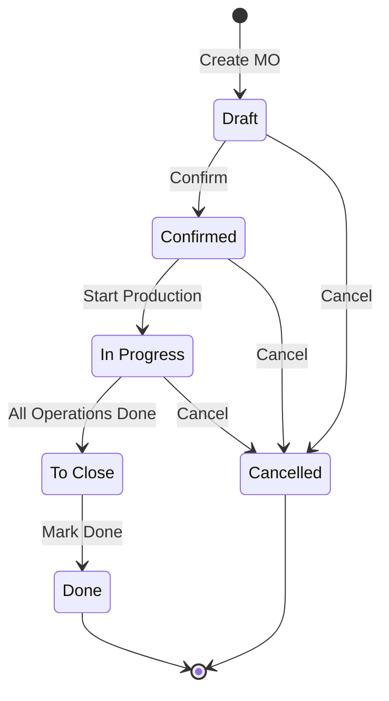
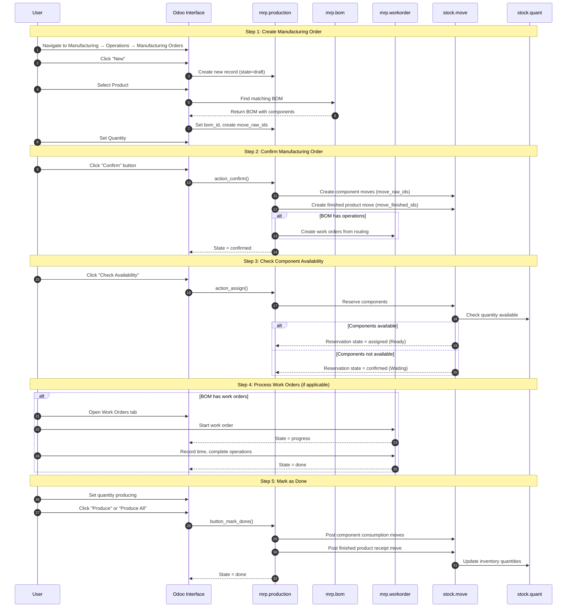

# Manufacturing Production Order Workflow

## Document Overview

This guide describes the complete workflow for creating and processing **Manufacturing Orders (MOs)** in Odoo 19.0. A Manufacturing Order transforms raw materials and components into finished products through a controlled production process.

### Purpose and Audience

**Target Audience:**
- **Production Managers**: Use this guide to understand the complete manufacturing workflow and monitor production progress
- **Manufacturing Users**: Follow these steps to create production orders and process work orders
- **Inventory Controllers**: Reference this guide to understand component consumption and finished goods receipt

**Business Value:**
Manufacturing Orders enable organizations to:
- Transform raw materials into sellable finished products
- Track component consumption and production costs
- Schedule and monitor production operations
- Maintain inventory accuracy through integrated stock movements

### Documentation Conventions

| Convention | Description |
|------------|-------------|
| **Bold terms** | First occurrence of a glossary term (see Glossary section) |
| `Technical names` | Internal Odoo identifiers for reference |
| *Italics* | User interface labels as they appear on screen |
| [Screenshot: filename] | Reference to screenshot in the screenshots folder |

---

## Prerequisites

Before creating a Manufacturing Order, ensure the following requirements are met:

### Required Modules

| Module | Technical Name | Purpose |
|--------|----------------|---------|
| Manufacturing | `mrp` | Core manufacturing functionality |
| Inventory | `stock` | Stock movements for components and finished goods |

### Required Permissions

| Permission Group | Access Level | Capabilities |
|------------------|--------------|--------------|
| Manufacturing / User | `mrp.group_mrp_user` | Create and process manufacturing orders |
| Manufacturing / Manager | `mrp.group_mrp_manager` | Full access including BOM management and configuration |

To verify your permissions:
1. Click on your user avatar in the top-right corner
2. Select *My Profile*
3. Check the *Manufacturing* section under *Access Rights*

### Data Requirements

Before creating a Manufacturing Order, you need:

| Requirement | Description | Where to Configure |
|-------------|-------------|--------------------|
| Product | The finished product to manufacture (must be of type "Storable" or "Consumable") | *Inventory → Products → Products* |
| **Bill of Materials (BOM)** | Recipe defining the components needed | *Manufacturing → Products → Bills of Materials* |
| Components | Raw materials listed in the BOM (must have sufficient stock or purchase configured) | *Inventory → Products → Products* |
| **Work Centers** (optional) | Equipment or stations for operations | *Manufacturing → Configuration → Work Centers* |

---

## Workflow Overview

### State Machine Diagram

A Manufacturing Order progresses through the following states:

### State Descriptions

| State | Display Name | Description |
|-------|--------------|-------------|
| `draft` | Draft | Manufacturing Order is created but not confirmed. Components are not reserved. |
| `confirmed` | Confirmed | MO is confirmed. Stock rules triggered, components reserved if available. Work orders generated for BOMs with operations. |
| `progress` | In Progress | Production has started. Work orders are being processed or quantities are being produced. |
| `to_close` | To Close | Production is complete but the order needs final validation. |
| `done` | Done | Manufacturing Order is complete. Stock moves are posted, finished products are in inventory. |
| `cancel` | Cancelled | Manufacturing Order is cancelled. Cannot be confirmed again. |

### Sequence Diagram

---

## Step-by-Step Guide

### Step 1: Create Manufacturing Order

**Objective:** Create a new Manufacturing Order to produce finished goods.

**Navigation Path:** *Manufacturing → Operations → Manufacturing Orders*

**What the User Sees:**
When you open the Manufacturing Orders list, you see a table of existing orders with columns for Reference, Product, Quantity, and State. A *New* button appears in the top-left corner.

**Actions:**

1. Click the **New** button in the top-left corner
   - A blank Manufacturing Order form opens with the state set to "Draft"

2. In the **Product** field, select the product you want to manufacture
   - Only products configured with a Bill of Materials appear in the dropdown
   - If no BOM exists for the product, you will need to create one first
   - The system automatically loads the default BOM for the selected product

3. Set the **Quantity** to produce
   - Enter the number of units you want to manufacture
   - The Unit of Measure is set based on the product's default UoM

4. (Optional) Adjust additional settings:
   - **Scheduled Date**: When production should begin
   - **Responsible**: The user assigned to this order
   - **Source Document**: Reference to the originating document (e.g., sales order)

**What Happens in the System:**
- A new `mrp.production` record is created with `state='draft'`
- The system finds the applicable BOM based on the product
- Component moves (`move_raw_ids`) are pre-populated based on BOM lines
- The finished product move (`move_finished_ids`) is created

**Screenshot Reference:** [Screenshot: 08-01-create-mo.png]

---

### Step 2: Confirm Manufacturing Order

**Objective:** Confirm the Manufacturing Order to reserve components and generate work orders.

**What the User Sees:**
In Draft state, you see a highlighted **Confirm** button in the header area. The Components tab shows the list of required raw materials with quantities.

**Actions:**

1. Review the components list in the *Components* tab
   - Verify all required materials are listed
   - Quantities are calculated based on the BOM and quantity to produce

2. Click the **Confirm** button
   - The button changes from highlighted to a regular button
   - The state indicator shows "Confirmed"

**What Happens in the System:**
- The `action_confirm()` method executes
- Component stock moves are confirmed (`stock.move` records transition to 'confirmed' state)
- If the BOM includes operations (routing), **Work Orders** are created automatically
- Stock procurement rules are triggered for missing components
- The MO state changes from `draft` to `confirmed`

**What the User Sees After Confirmation:**
- The header now shows **Check Availability** and **Start** buttons
- A *Reservation* status indicator appears (Waiting or Ready)
- If the BOM has operations, a *Work Orders* tab becomes available

**Screenshot Reference:** [Screenshot: 08-02-confirm-mo.png]

---

### Step 3: Check Component Availability

**Objective:** Reserve the required components from inventory for this Manufacturing Order.

**What the User Sees:**
After confirmation, the *Reservation* field shows either "Waiting" (components not available) or "Ready" (all components reserved). The **Check Availability** button appears in the header.

**Actions:**

1. Click the **Check Availability** button
   - The system attempts to reserve required component quantities from inventory

2. Review the reservation status:
   - **Ready**: All components are reserved and available
   - **Waiting**: Some components are not available or partially reserved

3. If components are not available, you can:
   - Wait for incoming receipts (from purchase orders or other MOs)
   - Manually adjust the source location
   - Use the *Unreserve* button to release reservations if needed

**What Happens in the System:**
- The `action_assign()` method executes
- For each component move (`move_raw_ids`), the system:
  - Checks available quantity in the source location (`stock.quant`)
  - Creates reservations for available stock
  - Updates the move's reservation state

**Reservation States:**

| State | Display | Meaning |
|-------|---------|---------|
| `confirmed` | Waiting | Components not yet available |
| `assigned` | Ready | All required components are reserved |
| `waiting` | Waiting Another Operation | Depends on another move to complete first |

**Screenshot Reference:** [Screenshot: 08-03-check-availability.png]

---

### Step 4: Process Work Orders (If Applicable)

**Objective:** Execute the production operations defined in the BOM routing.

> **Note:** This step only applies if the Bill of Materials includes operations. For simple manufacturing without routing, skip to Step 5.

**What the User Sees:**
If the BOM has operations configured, a *Work Orders* tab appears with a list of operations to perform. Each work order shows:
- Operation name
- Work Center where the operation is performed
- Expected duration
- Current status (Blocked, Ready, In Progress, Finished)

**Work Order States:**

| State | Display | Description |
|-------|---------|-------------|
| `blocked` | Blocked | Waiting for a previous operation to complete (when using operation dependencies) |
| `ready` | To Do | Ready to start, all prerequisites met |
| `progress` | In Progress | Currently being worked on |
| `done` | Finished | Operation completed |
| `cancel` | Cancelled | Work order cancelled |

**Actions:**

1. Click on the *Work Orders* tab to view all operations

2. For each work order (in sequence):
   
   a. Click on the work order to open it
   
   b. Click **Start** to begin the operation
      - A timer starts tracking the actual duration
      - The work order state changes to "In Progress"
   
   c. Perform the physical manufacturing operation
   
   d. (Optional) Register intermediate production quantities
   
   e. Click **Done** or **Mark as Done** when the operation is complete
      - The timer stops
      - Actual duration is recorded
      - The next work order becomes available (if using sequential operations)

3. Repeat for all work orders in the production

**What Happens in the System:**
- Each work order tracks time spent on the operation
- Component moves may be tied to specific operations
- When all work orders are done, the MO may transition to "To Close" state automatically

**Screenshot Reference:** [Screenshot: 08-04-process-workorders.png]

---

### Step 5: Mark Production as Done

**Objective:** Complete the Manufacturing Order and post inventory movements.

**What the User Sees:**
When production is ready to complete, you see either a **Produce** or **Produce All** button in the header:
- **Produce**: Set a specific quantity to produce (for partial production)
- **Produce All**: Produce the full remaining quantity

The Components tab shows consumed quantities, and the header area displays the quantity to produce.

**Actions:**

1. In the form header, verify the **Quantity Producing** field
   - This shows how many units will be recorded as produced
   - For full production, this equals the ordered quantity
   - For partial production, enter the actual quantity completed

2. Click **Produce** or **Produce All**
   - If producing less than ordered, you may be prompted to create a backorder

3. If prompted about backorders:
   - **Create Backorder**: Generates a new MO for the remaining quantity
   - **No Backorder**: Marks the order as done with the partial quantity

**What Happens in the System:**
- The `button_mark_done()` method executes
- All work orders are marked as finished
- Component consumption moves are posted (inventory decreases for raw materials)
- Finished product receipt move is posted (inventory increases for finished goods)
- The MO state changes to `done`
- Production is locked (no further changes allowed by default)

**What the User Sees After Completion:**
- The state shows "Done" with a green badge
- The form becomes read-only
- An **Unbuild** button appears (to reverse the production if needed)
- *Traceability* and *Product Moves* buttons show the posted transactions

**Screenshot Reference:** [Screenshot: 08-05-mark-done.png]

---

## Variations and Edge Cases

### Manufacturing Without Work Orders (Simple Production)

For products with a BOM that has no operations defined, the workflow is simplified:

1. Create the Manufacturing Order
2. Confirm the order
3. Check availability
4. Directly click **Produce** or **Produce All**

Work orders are not created, and there's no intermediate "In Progress" phase. The MO transitions directly from Confirmed to Done.

### Partial Production and Backorders

When you cannot produce the full ordered quantity:

1. In Step 5, set the **Quantity Producing** to the actual amount completed
2. Click **Produce**
3. When prompted, select **Create Backorder**
4. A new Manufacturing Order is created for the remaining quantity
5. The original MO is marked as done with the partial quantity

**What the User Sees:**
- Original MO shows "Done" with the partial quantity
- A *Backorders* smart button appears showing "2 Backorders"
- The backorder MO is in "Confirmed" state, ready to process

### Component Substitution

If a component is unavailable, you can substitute it:

1. In the Components tab, locate the unavailable component
2. Click on the component line to expand it
3. Change the product to an approved substitute
4. Adjust quantity if needed based on the substitute's specifications

**Important:** Component substitution should follow your organization's quality procedures. Not all components may have approved substitutes.

### Scrap Handling During Production

If materials are damaged or defective during production:

1. From the Manufacturing Order form, click **Actions** → **Scrap**
2. Select the product to scrap (component or finished product)
3. Enter the quantity being scrapped
4. Select a scrap location
5. Click **Done**

**What Happens:**
- A scrap move is created
- Inventory is moved to the scrap location
- The scrap is recorded for reporting and costing purposes

### Cancelling a Manufacturing Order

To cancel an MO that is not yet complete:

1. From the Manufacturing Order form, click the **Cancel** button
2. Confirm the cancellation when prompted

**Restrictions:**
- Cannot cancel an MO in "Done" state (use Unbuild instead)
- Cancellation releases all component reservations
- Related work orders are also cancelled

**What Happens:**
- The `action_cancel()` method executes
- All pending stock moves are cancelled
- Reservations are released
- Work orders are cancelled
- The MO state changes to "Cancelled"

---

## Integration Points

### Bill of Materials (BOM) Module

| Integration Aspect | Description |
|--------------------|-------------|
| **BOM Selection** | MOs automatically load the applicable BOM based on product |
| **Component List** | BOM lines define the raw materials consumed |
| **Routing** | BOM operations define the work orders generated |
| **Quantity Calculation** | Component quantities are calculated based on BOM ratios |

**Where to Configure:** *Manufacturing → Products → Bills of Materials*

### Inventory Module (Stock)

| Integration Aspect | Description |
|--------------------|-------------|
| **Component Reservation** | Stock quantities are reserved when checking availability |
| **Component Consumption** | Raw materials are consumed (decremented) when production completes |
| **Finished Goods Receipt** | Finished products are added to inventory when production completes |
| **Warehouse Operations** | MO uses the configured operation type for source/destination locations |

**Where to Configure:** *Inventory → Configuration → Warehouses*

### Purchase Module (Optional)

| Integration Aspect | Description |
|--------------------|-------------|
| **Automatic Replenishment** | Missing components can trigger purchase orders via reordering rules |
| **Make-to-Order** | Components with "Buy" route are purchased when MO is confirmed |

**Where to Configure:** *Purchase → Configuration → Reordering Rules*

### Quality Module (Optional, Enterprise)

| Integration Aspect | Description |
|--------------------|-------------|
| **Quality Checks** | Quality control points can be added to work orders |
| **Quality Alerts** | Non-conformances are recorded during production |

> **Note:** Quality features require additional configuration and may be Enterprise-only features.

---

## Business Rules Reference

For detailed business rules including validation logic, computation rules, and access controls, see:

**[Business Rules: Manufacturing](../04-business-rules/manufacturing-rules.md)**

### Key Validation Rules Summary

| Rule | Description | Triggered When |
|------|-------------|----------------|
| Product Type | Product must be of type "Consumable" (`type='consu'`) | Creating MO, selecting product |
| BOM Required | A Bill of Materials must exist for the product | Confirming MO |
| Company Consistency | Product, BOM, and MO must belong to same company | Creating and confirming MO |
| Quantity Positive | Quantity to produce must be greater than zero | Creating MO |
| Cannot Cancel Done | Completed MOs cannot be cancelled | Attempting to cancel |

---

## Error Scenarios

### No BOM Found for Selected Product

**What Happens:**
When you select a product without a Bill of Materials, the system cannot determine the required components.

**What the User Sees:**
- An error message: "No BoM defined for this product"
- The manufacturing order cannot be confirmed

**Resolution:**
1. Navigate to *Manufacturing → Products → Bills of Materials*
2. Click **New** to create a BOM for the product
3. Add the component lines (raw materials)
4. Save the BOM
5. Return to the Manufacturing Order and refresh

### Insufficient Components Available

**What Happens:**
When clicking "Check Availability," not all component quantities can be reserved.

**What the User Sees:**
- Reservation status shows "Waiting" instead of "Ready"
- Component lines show partial or zero reserved quantities
- The *Components Availability* field shows "Waiting" or "Late"

**Resolution Options:**
1. **Wait**: Check availability again later when stock arrives
2. **Procure**: Create purchase orders or internal transfers to get components
3. **Substitute**: Replace unavailable components with approved alternatives
4. **Force**: Proceed with production using available components (may result in partial production)

### Attempting to Produce More Than Ordered

**What Happens:**
If you try to set a quantity producing that exceeds the order quantity.

**What the User Sees:**
- The BOM consumption setting determines behavior:
  - **Flexible**: Allowed without warning
  - **With Warning**: Warning message displayed but can continue
  - **Strict**: Blocked, only managers can override

**Resolution:**
- If strict consumption, a manager must approve the overproduction
- Consider creating a new MO for additional quantity instead

### Company Mismatch Error

**What Happens:**
When the product or BOM belongs to a different company than the Manufacturing Order.

**What the User Sees:**
- Error message about company mismatch
- The MO cannot be saved or confirmed

**Resolution:**
1. Verify the company on the Manufacturing Order (check *Other Info* tab)
2. Ensure the product is available for the same company
3. If multi-company, switch to the correct company before creating the MO

---

## What the User Sees - Quick Reference

| State | Header Buttons | Key UI Elements |
|-------|----------------|-----------------|
| **Draft** | [Confirm] highlighted, [Cancel] | Product field editable, Quantity editable |
| **Confirmed** | [Check Availability], [Start], [Cancel] | Reservation status visible, Components tab active |
| **In Progress** | [Produce] or [Produce All], [Cancel] | Work Orders tab active (if applicable), Timer running |
| **To Close** | [Produce] or [Mark Done] | Production summary visible |
| **Done** | [Unbuild] | Form is read-only, Traceability available |
| **Cancelled** | None | Form is read-only, greyed out |

---

## Glossary

| Term | Definition | Where Used |
|------|------------|------------|
| **Manufacturing Order (MO)** | A document that instructs the production of a specific quantity of a finished product. Technical model: `mrp.production` | Throughout manufacturing workflow |
| **Bill of Materials (BOM)** | A recipe that defines the components (raw materials) and operations needed to produce a finished product. Technical model: `mrp.bom` | *Manufacturing → Products → Bills of Materials* |
| **Work Order** | An individual production operation within a Manufacturing Order. Each operation is performed at a specific work center. Technical model: `mrp.workorder` | *Work Orders* tab on MO form |
| **Work Center** | A production station, machine, or area where manufacturing operations are performed. Technical model: `mrp.workcenter` | *Manufacturing → Configuration → Work Centers* |
| **Component** | A raw material or sub-assembly consumed during production. Listed in the BOM as component lines. | *Components* tab on MO form |
| **Byproduct** | A secondary product created as a result of the manufacturing process, in addition to the main finished product. | Advanced BOM configuration |
| **Routing** | The sequence of operations (work orders) needed to complete production. Defined in the BOM's operations. | BOM configuration |
| **Reservation** | The process of allocating specific inventory quantities for a Manufacturing Order, preventing them from being used elsewhere. | *Check Availability* action |
| **Backorder** | A new Manufacturing Order created for the remaining quantity when production is partially completed. | Partial production completion |
| **Scrap** | Materials that are damaged, defective, or unusable and removed from the production process. | *Actions → Scrap* menu |
| **Unbuild** | The process of reversing a completed Manufacturing Order, returning finished goods to components. | *Unbuild* button on completed MO |

---

## Related Documentation

| Document | Description |
|----------|-------------|
| [Capabilities Inventory](../01-capabilities-overview/capabilities-inventory.md) | Overview of all Odoo modules including Manufacturing |
| [Business Rules: Manufacturing](../04-business-rules/manufacturing-rules.md) | Detailed validation rules and business logic |
| [Inventory Receipt Processing](../04-inventory-receipt-processing/flow-document.md) | Receiving components into inventory |
| [Inventory Delivery Order](../05-inventory-delivery-order/flow-document.md) | Shipping finished products |

---

## Source References

This documentation is based on analysis of the following Odoo 19.0 source files:

| File | Key Content |
|------|-------------|
| `addons/mrp/models/mrp_production.py` | Manufacturing Order model, state definitions (lines 177-191), action methods |
| `addons/mrp/models/mrp_bom.py` | Bill of Materials model and structure |
| `addons/mrp/models/mrp_workorder.py` | Work Order model and state transitions |
| `addons/mrp/views/mrp_production_views.xml` | User interface definitions and button visibility |
