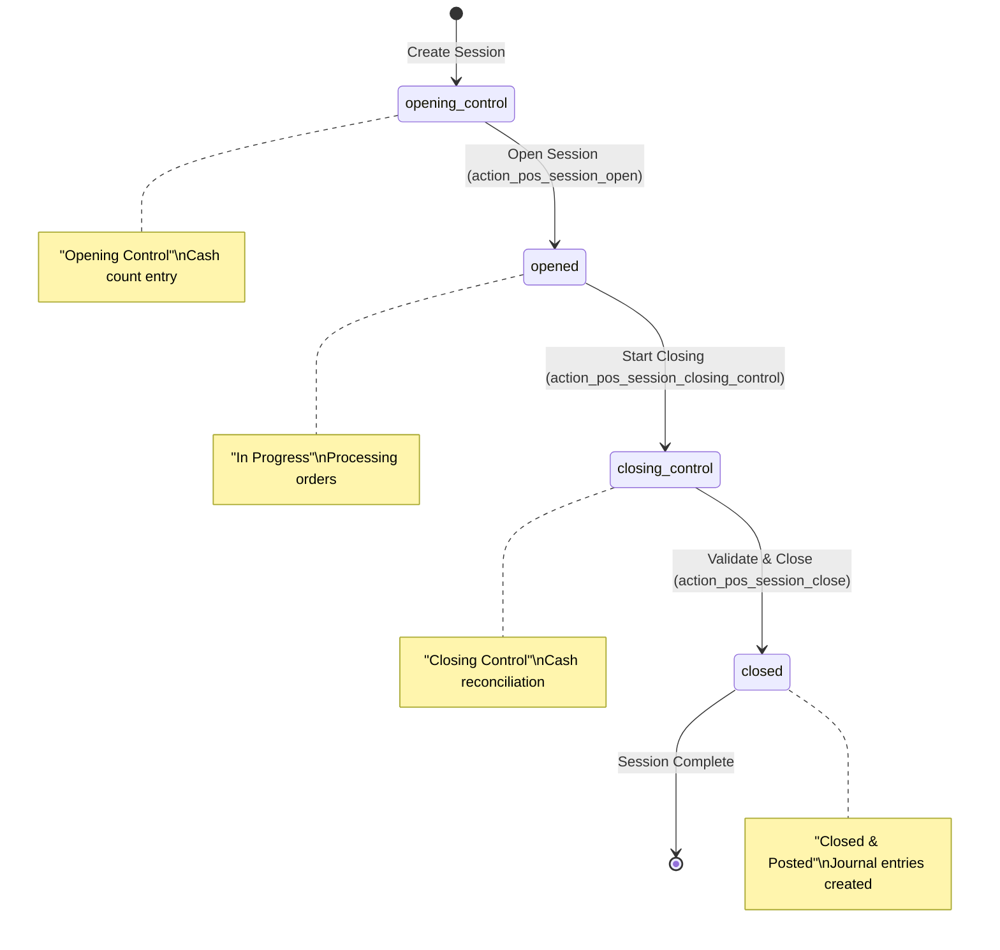
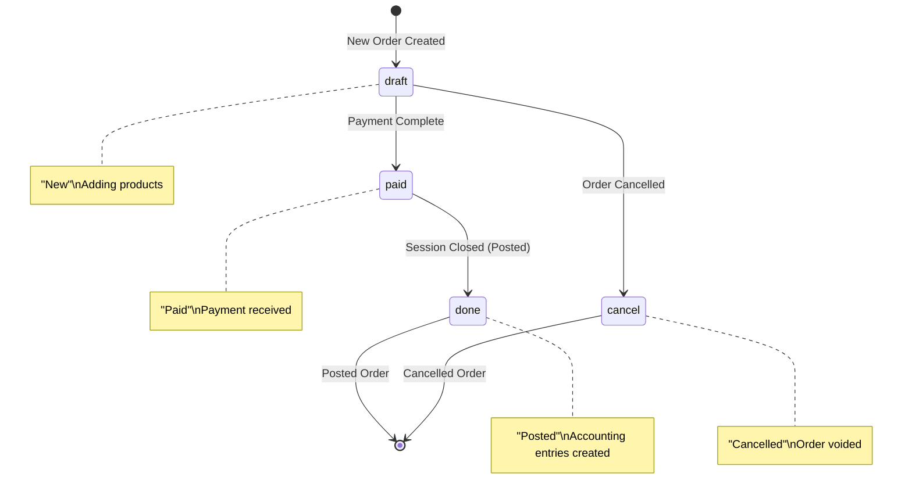
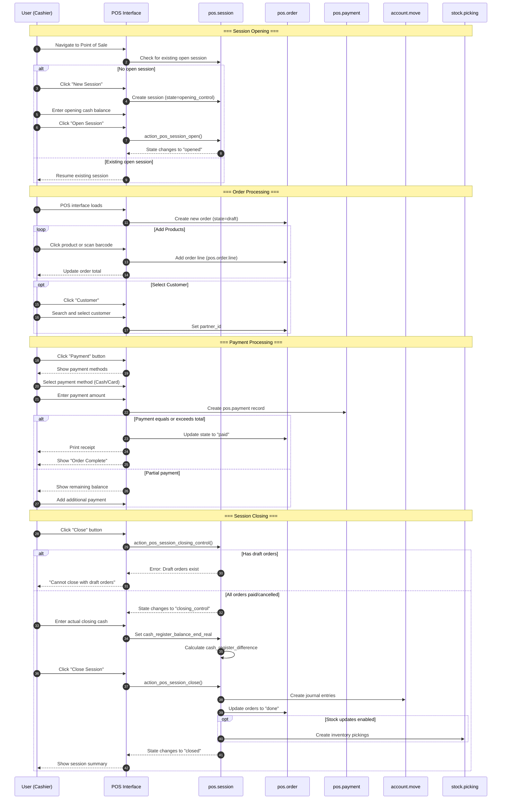

# User Flow 09: POS Session and Transaction

## Overview

### Business Objective

The **Point of Sale (POS) Session and Transaction** workflow enables retail businesses to process customer checkouts and payments efficiently. This workflow covers the complete lifecycle of a retail sales session—from opening the point of sale at the start of a shift to closing out and reconciling all transactions at the end of the day.

### Target Personas

| Persona | Role Description | Key Activities |
|---------|------------------|----------------|
| **Cashier** | Front-line retail employee handling customer transactions | Processing sales, accepting payments, printing receipts |
| **Store Manager** | Supervisor responsible for daily operations | Opening/closing sessions, reviewing sales reports, handling discrepancies |
| **POS Operator** | Restaurant or shop floor staff using the POS terminal | Order entry, payment processing, customer service |
| **Shift Supervisor** | Team lead managing a specific shift | Cash counts, session handoffs, transaction oversight |

### Business Value

The POS workflow provides significant business value by:

- **Enabling efficient retail operations** for shops, restaurants, cafes, and service businesses
- **Streamlining checkout processes** to reduce customer wait times
- **Ensuring accurate cash management** through opening and closing cash control procedures
- **Creating automatic accounting entries** when sessions close, eliminating manual bookkeeping
- **Tracking all transactions** for audit, compliance, and business analysis purposes
- **Supporting multiple payment methods** including cash, cards, and digital payments

---

## Prerequisites

### Required Modules

| Module | Technical Name | Purpose |
|--------|----------------|---------|
| **Point of Sale** | `point_of_sale` | Core POS functionality |
| **Resource** | `resource` | Work schedules and time management |
| **Stock Account** | `stock_account` | Inventory valuation and movements |
| **Barcodes** | `barcodes` | Product barcode scanning |
| **Digest** | `digest` | Periodic email summaries |

> **Source:** `addons/point_of_sale/__manifest__.py` line 10

### Required Permissions

Users must belong to one of the following security groups to access POS functionality:

| Security Group | Technical Name | Capabilities |
|----------------|----------------|--------------|
| **Point of Sale / User** | `point_of_sale.group_pos_user` | Process transactions, open sessions assigned to them |
| **Point of Sale / Manager** | `point_of_sale.group_pos_manager` | Full POS administration, configure settings, view all sessions |

### Data Requirements

Before using the POS, ensure the following data is configured:

| Data Type | Description | Configuration Location |
|-----------|-------------|------------------------|
| **Products** | Items available for sale with prices | Inventory → Products |
| **Payment Methods** | Cash, Card, and other payment types | Point of Sale → Configuration → Payment Methods |
| **POS Configuration** | Terminal setup including journal, warehouse, and options | Point of Sale → Configuration → Point of Sale |
| **Tax Configuration** | Sales taxes applicable to products | Accounting → Configuration → Taxes |

### Hardware Requirements (Optional)

The POS interface supports optional hardware for enhanced operations:

| Hardware | Purpose | Integration Method |
|----------|---------|-------------------|
| **Receipt Printer** | Print customer receipts and order tickets | IoT Box or direct connection |
| **Cash Drawer** | Secure cash storage with automatic opening | Connected to receipt printer |
| **Barcode Scanner** | Quick product entry via scanning | USB or Bluetooth connection |
| **Payment Terminal** | Process card payments | Payment provider integration |
| **Customer Display** | Show transaction details to customer | Secondary screen or tablet |

---

## Session State Machine

The POS session moves through distinct states during its lifecycle. Understanding these states helps users and support teams track where a session is in its workflow.



### Session State Details

| State | Display Name | Description | User Actions Available |
|-------|--------------|-------------|----------------------|
| `opening_control` | Opening Control | Session created, awaiting opening cash count | Enter opening balance, open session |
| `opened` | In Progress | Session is active for processing transactions | Create orders, process payments, view orders |
| `closing_control` | Closing Control | Session is being closed, awaiting final cash count | Enter closing balance, review differences |
| `closed` | Closed & Posted | Session complete, accounting entries posted | View-only, access reports |

> **Source:** `addons/point_of_sale/models/pos_session.py` lines 23-28

---

## Order State Machine

Within an active session, individual orders also follow a state progression:



### Order State Details

| State | Display Name | Description | Transitions From | Transitions To |
|-------|--------------|-------------|------------------|----------------|
| `draft` | New | Order is being built, products being added | Initial state | `paid`, `cancel` |
| `cancel` | Cancelled | Order was voided before payment | `draft` | Final state |
| `paid` | Paid | Payment successfully received | `draft` | `done` |
| `done` | Posted | Session closed, accounting entries created | `paid` | Final state |

> **Source:** `addons/point_of_sale/models/pos_order.py` lines 309-311

---

## Sequence Diagram

The following diagram shows the complete flow of interactions between the user, the POS interface, and the underlying system models:



---

## Step-by-Step Guide

### Step 1: Open POS Session

**Business Context:** At the start of a shift or business day, the cashier or manager must open a POS session before any sales can be processed.

**What the User Sees:**
When the user navigates to the Point of Sale application, they see a dashboard showing all configured POS terminals. Each terminal displays either a "New Session" button (if no session is open) or a "Continue Selling" button (if a session is already active).

**Actions:**

1. **Navigate to Point of Sale**
   - From the main Odoo menu, click **Point of Sale**
   - The POS dashboard appears showing available terminals

2. **Select POS Configuration**
   - Identify the POS terminal to use (e.g., "Shop", "Restaurant", "Counter 1")
   - Click **New Session** on the desired terminal card

3. **Enter Opening Cash Balance** (if cash control is enabled)
   - A form appears requesting the opening cash count
   - Enter the amount of cash in the drawer at the start of the session
   - This amount should match the physical cash counted
   
   > **Tip:** The system may suggest the closing balance from the previous session as the default opening balance.

4. **Click "Open Session"**
   - The system creates the session and transitions it from `opening_control` to `opened`
   - The full POS interface loads, ready for transactions

**Screenshot Reference:** `screenshots/09-01-open-session.png`

**Technical Details:**
- The `action_pos_session_open()` method is triggered
- If cash control is enabled, the system carries forward the previous session's closing balance
- Session state: `opening_control` → `opened`

> **Source:** `addons/point_of_sale/models/pos_session.py` line 366-374

---

### Step 2: Start New Order

**Business Context:** With the session open, the POS interface is ready to process customer orders. Each customer checkout begins as a new order.

**What the User Sees:**
The POS interface displays:
- A product catalog (grid or list view) on the left or center
- The current order panel on the right showing line items
- A customer selection button at the top
- Category filters to browse products
- A search bar for finding products quickly
- The session status showing "In Progress"

**Actions:**

1. **Review the POS Interface**
   - Confirm the session shows "In Progress" (state: `opened`)
   - A new blank order is automatically created when the interface loads

2. **Select a Customer (Optional)**
   - Click the **Customer** button (or guest icon)
   - Search for an existing customer or create a new one
   - Selecting a customer enables:
     - Invoice generation
     - Customer-specific pricing (if configured)
     - Loyalty program benefits (if enabled)

3. **Begin Adding Products**
   - The order panel shows an empty order with $0.00 total
   - The order is in `draft` state, ready for product additions

**Screenshot Reference:** `screenshots/09-02-start-order.png`

**Technical Details:**
- A new `pos.order` record is created with `state='draft'`
- The order is linked to the current `pos.session`
- If no customer is selected, the order remains anonymous

---

### Step 3: Add Products to Order

**Business Context:** The cashier adds products to the customer's order by clicking on product tiles, scanning barcodes, or searching by name.

**What the User Sees:**
As products are added:
- Each product appears as a line in the order panel
- The line shows: product name, quantity, unit price, and line total
- The order subtotal, taxes, and grand total update in real-time
- Quantity can be adjusted using +/- buttons or by entering a number

**Actions:**

1. **Browse or Search for Products**
   - Click on category buttons to filter the product catalog
   - Use the search bar to find products by name, reference, or barcode
   - Products display with name, price, and image (if configured)

2. **Add Products to the Order**
   - **Click Method:** Click on a product tile to add one unit
   - **Barcode Method:** Scan the product barcode with a scanner
   - **Search Method:** Search for the product and click the result

3. **Adjust Quantities**
   - Click on an order line to select it
   - Use the **numpad** to change the quantity
   - Press **+/-** buttons for increment/decrement
   - Enter fractional quantities for weighted items (if allowed)

4. **Apply Discounts** (if configured)
   - Click the **Discount** button (if available)
   - Enter a percentage or fixed amount discount
   - The discount applies to the selected line or entire order

5. **Review the Order**
   - Verify all products and quantities are correct
   - Check that taxes are correctly calculated
   - Confirm the total matches what the customer owes

**Screenshot Reference:** `screenshots/09-03-add-products.png`

**Technical Details:**
- Each product addition creates a `pos.order.line` record
- Lines are linked to the parent `pos.order` via `order_id`
- Tax calculations happen automatically based on product configuration
- The order remains in `draft` state until payment

---

### Step 4: Process Payment

**Business Context:** When all products are added, the cashier proceeds to collect payment from the customer.

**What the User Sees:**
The payment screen displays:
- The total amount due prominently
- Available payment method buttons (Cash, Card, etc.)
- A numpad for entering the payment amount
- The remaining balance to be paid
- An option to split payment across multiple methods

**Actions:**

1. **Click the "Payment" Button**
   - The view switches from the product catalog to the payment screen
   - All configured payment methods are displayed as buttons

2. **Select a Payment Method**
   - **Cash:** Click "Cash" to accept cash payment
     - Enter the amount tendered by the customer
     - The system calculates and displays any change due
   - **Card:** Click "Card" (or specific card type)
     - If a payment terminal is connected, follow on-screen prompts
     - Otherwise, process payment externally and confirm in POS
   - **Other Methods:** Click the appropriate button for vouchers, mobile payments, etc.

3. **Enter the Payment Amount**
   - Use the numpad to enter the exact amount received
   - Quick amount buttons may be available (e.g., $5, $10, $20)
   - For cash, enter the amount tendered (not the order total)

4. **Handle Split Payments** (if needed)
   - If the customer pays with multiple methods:
     - Enter the first payment amount and method
     - The remaining balance updates
     - Add additional payments until the balance is zero

5. **Validate the Payment**
   - Click **Validate** or the equivalent confirmation button
   - The system:
     - Creates a `pos.payment` record for each payment
     - Updates the order state from `draft` to `paid`
     - Triggers receipt printing (if configured)

6. **Provide Receipt and Change**
   - Give the customer their printed receipt
   - Return any change due for cash payments

**Screenshot Reference:** `screenshots/09-04-process-payment.png`

**Technical Details:**
- Payment creation triggers validation against allowed payment methods
- The order state changes: `draft` → `paid`
- A `pos.payment` record is created with `payment_method_id` and `amount`
- Payments cannot exceed the order total unless tips are enabled

> **Source:** `addons/point_of_sale/models/pos_payment.py` lines 66-70

---

### Step 5: Close POS Session

**Business Context:** At the end of a shift or business day, the session must be closed to reconcile cash and create accounting entries.

**What the User Sees:**
The closing screen displays:
- A summary of all transactions processed during the session
- Expected (theoretical) cash balance based on transactions
- A field to enter the actual (counted) cash balance
- Any difference between expected and actual amounts
- A breakdown by payment method

**Actions:**

1. **Ensure All Orders Are Complete**
   - Before closing, all orders must be either paid or cancelled
   - Any draft orders must be finalized or removed
   
   > **Important:** The system will not allow closing if draft orders exist for the current day.

2. **Initiate Session Closing**
   - Click the **Close** button (typically in the top-right corner)
   - Or navigate to Point of Sale → Orders → Sessions and select the session

3. **Count the Physical Cash**
   - Count all bills and coins in the cash drawer
   - Record the total amount

4. **Enter the Closing Cash Balance**
   - In the **Ending Balance** field, enter the actual counted amount
   - The system displays:
     - **Theoretical Balance:** Opening balance + cash sales - cash returns - cash out
     - **Difference:** The variance between theoretical and actual

5. **Review Differences**
   - If there's a difference:
     - Positive difference (overage): More cash than expected
     - Negative difference (shortage): Less cash than expected
   - Investigate significant differences before proceeding
   
   > **Note:** Small differences may occur due to rounding in cash transactions.

6. **Close the Session**
   - Click **Close Session** to finalize
   - The system:
     - Changes session state: `opened` → `closing_control` → `closed`
     - Creates journal entries (`account.move`) for all transactions
     - Updates all paid orders to `done` state
     - Creates inventory movements (if configured)
     - Posts any cash difference to profit/loss accounts

**Screenshot Reference:** `screenshots/09-05-close-session.png`

**Technical Details:**
- The `action_pos_session_closing_control()` method validates no draft orders exist
- Cash differences are posted to the journal's profit/loss accounts
- Journal entry creation groups all transactions into a single `account.move`
- Order states change: `paid` → `done`

> **Source:** `addons/point_of_sale/models/pos_session.py` lines 381-403, 456-477

---

## Variations and Edge Cases

### Cash Control vs. No Cash Control Sessions

| Aspect | Cash Control Enabled | Cash Control Disabled |
|--------|---------------------|----------------------|
| Opening | Requires opening balance entry | Opens immediately |
| Closing | Requires closing balance count | Closes without cash count |
| Difference Tracking | Calculates and posts differences | No cash tracking |
| Use Case | Cash-based retail, restaurants | Card-only locations, self-service |

**Configuration:** Cash control is enabled per POS configuration in Point of Sale → Configuration → Point of Sale → (select config) → Payments tab.

### Multiple Payment Methods on Single Order

The user can accept multiple payment types for a single order:

1. Customer wants to pay $50 cash and $25 by card for a $75 order
2. On the payment screen, enter $50 and select "Cash"
3. The remaining balance shows $25
4. Enter $25 and select "Card"
5. Validate to complete the transaction

Each payment method creates a separate `pos.payment` record linked to the same `pos.order`.

### Order Cancellation

Orders can be cancelled before payment:

1. On an unpaid order, click the **Delete Order** or **Cancel** button
2. Confirm the cancellation when prompted
3. The order state changes to `cancel`
4. Cancelled orders appear in session reports but do not affect totals

**Restrictions:**
- Only `draft` orders can be cancelled
- Paid orders cannot be cancelled (use refund instead)

### Refund Processing

To refund a previously paid order:

1. Find the original order in Orders or use the Refund button
2. Click **Refund** on the order
3. The system creates a new order with `is_refund=True`
4. Product quantities are negative
5. Process a refund payment (typically cash or original method)
6. The refund order reduces session totals

### Session Rescue (Orphan Orders)

If orders are received after a session closes (network sync issues):

1. The system creates a **rescue session** automatically
2. Rescue sessions have `rescue=True` flag
3. They capture orphan orders that arrived late
4. Close rescue sessions normally when all orders are received

### Partial Orders and Drafts

Draft orders can be saved and recalled:

1. Start an order but don't complete payment
2. Click **Save** or **New Order** to set the order aside
3. The order remains in `draft` state
4. Later, select the order from the order list to resume
5. Complete the order normally

**End of Day:** All draft orders must be completed or deleted before session closing.

---

## Integration Points

The POS workflow integrates with several other Odoo modules:

### Accounting Module Integration

| Trigger | Action | Result |
|---------|--------|--------|
| Session Close | Create journal entries | `account.move` records posted |
| Cash Difference | Post profit/loss entries | Variance recorded in designated accounts |
| Individual Invoice | Invoice generation | Customer-specific invoice created |

**Flow:** When a session closes, all transactions are aggregated into a single journal entry. This entry debits receivable accounts and credits sales accounts, with separate lines for each payment method and tax.

### Inventory Module Integration

| Trigger | Action | Result |
|---------|--------|--------|
| Order Paid (real-time) | Create picking | Stock moves immediately |
| Session Close (batch) | Create pickings | Stock moves on close |

**Configuration:** The `update_stock_at_closing` flag determines when inventory movements occur:
- **Real-time:** Each order creates immediate stock movements
- **At Closing:** All movements batched when session closes

### Mail Module Integration

| Trigger | Action | Result |
|---------|--------|--------|
| Receipt Email | Send receipt to customer | Email with order details |
| Invoice Email | Send invoice to customer | PDF invoice attached |

---

## Business Rules Reference

For detailed validation rules, state transitions, and computation logic, see:

**[POS Session Business Rules](../04-business-rules/pos-session-rules.md)**

### Key Validations Summary

| Rule | Description | Source |
|------|-------------|--------|
| **No Draft Orders on Close** | Sessions cannot close if draft orders exist for the current day | `pos_session.py` line 384-385 |
| **Payment Method Validation** | Payments must use methods allowed in the session's POS config | `pos_payment.py` line 69-70 |
| **Posted Order Protection** | Payments cannot be edited on posted orders | `pos_payment.py` line 63-64 |
| **Session State Protection** | Closed sessions cannot be modified | `pos_session.py` line 386-387 |

---

## What the User Sees

### Opening State (POS Dashboard)

When navigating to Point of Sale with no open session:

| Element | Description |
|---------|-------------|
| **Terminal Cards** | Each configured POS displays as a card |
| **Session Status** | Shows "No session" or "Session open by [user]" |
| **New Session Button** | Green button to start a new session |
| **Last Session Info** | Date and time of previous session |
| **Daily Sales** | Quick summary if sessions exist today |

### In Progress State (POS Interface)

During active transaction processing:

| Element | Description |
|---------|-------------|
| **Product Catalog** | Grid or list of available products with images and prices |
| **Category Bar** | Clickable categories to filter products |
| **Search Bar** | Quick product search functionality |
| **Order Panel** | Current order with line items, quantities, and totals |
| **Customer Button** | Select or view current customer |
| **Payment Button** | Proceed to payment when order is ready |
| **More Actions** | Discounts, notes, split order, etc. |
| **Session Info** | Current session name and status |

### Closing State (Session Summary)

When closing the session:

| Element | Description |
|---------|-------------|
| **Orders Summary** | Count of orders processed |
| **Total Sales** | Gross sales amount for the session |
| **By Payment Method** | Breakdown of totals per payment type |
| **Theoretical Balance** | Calculated cash that should be in drawer |
| **Ending Balance Field** | Input for actual counted cash |
| **Difference Display** | Shows overage/shortage in cash |
| **Close Session Button** | Finalize and post the session |

### Closed State (Read-Only View)

After session is closed:

| Element | Description |
|---------|-------------|
| **Session Header** | Name, dates, and "Closed & Posted" status |
| **Journal Entry Link** | Click to view the accounting entry |
| **Orders Tab** | List of all orders in the session |
| **Cash Movements Tab** | Cash in/out transactions |
| **Session Summary** | Final totals and differences |
| **Reprint Reports** | Generate reports for this session |

---

## Error Scenarios

### Session Already Closed

**Error Message:** "This session is already closed."

**Cause:** Attempting to close or modify a session that has already been finalized.

**User Action:**
- Navigate to a different session
- If you need to adjust posted transactions, create a manual journal entry or contact accounting

> **Source:** `pos_session.py` line 386-387

### Draft Orders Exist When Closing

**Error Message:** "You cannot close the POS while there are still draft orders for the day."

**Cause:** Attempting to close the session while unpaid orders exist for today's date.

**User Action:**
1. Return to the POS interface
2. Find the draft orders in the order list
3. Either complete payment or cancel each draft order
4. Retry closing the session

> **Source:** `pos_session.py` line 384-385

### Payment Method Not Allowed

**Error Message:** "The payment method selected is not allowed in the config of the POS session."

**Cause:** Attempting to use a payment method that is not configured for this POS terminal.

**User Action:**
1. Select a different, allowed payment method
2. Or contact a manager to add the payment method to the POS configuration

> **Source:** `pos_payment.py` line 69-70

### Cannot Edit Posted Order Payment

**Error Message:** "You cannot edit a payment for a posted order."

**Cause:** Attempting to modify a payment on an order that has already been posted (state = `done`).

**User Action:**
- Process a refund instead of editing the original payment
- Contact accounting for journal-level adjustments

> **Source:** `pos_payment.py` line 63-64

### Cash Journal Missing Profit/Loss Account

**Error Message:** "Please go on the [Journal] journal and define a Loss Account (or Profit Account)."

**Cause:** A cash difference exists but the cash journal doesn't have profit/loss accounts configured.

**User Action:**
1. Contact your system administrator
2. Configure profit and loss accounts on the cash journal:
   - Navigate to Accounting → Configuration → Journals
   - Select the cash journal used by POS
   - In the Advanced Settings tab, set the Profit and Loss accounts

> **Source:** `pos_session.py` line 490-502

### Network Disconnection During Order

**Symptoms:**
- Orders may not save to server
- Payment confirmation delayed
- Duplicate orders possible

**User Action:**
1. Wait for connection to restore
2. Check if the order synced successfully
3. If unsure, check the Orders list for duplicates
4. Contact support if orders are missing

**Prevention:** The POS can work offline but requires connection to complete sessions.

---

## Related Documentation

- **[POS Session Business Rules](../04-business-rules/pos-session-rules.md)** - Detailed validation rules and state transitions
- **[Capabilities Inventory](../01-capabilities-overview/capabilities-inventory.md)** - Complete module listing including Point of Sale capabilities
- **[Invoice Creation and Payment](../02-user-flows/06-invoice-creation-payment/flow-document.md)** - For understanding accounting integration
- **[Inventory Receipt Processing](../02-user-flows/04-inventory-receipt-processing/flow-document.md)** - For stock movement details

---

## Quick Reference

### Session State Transitions

```
opening_control → opened → closing_control → closed
```

### Order State Transitions

```
draft → paid → done
draft → cancel
```

### Key Keyboard Shortcuts (if enabled)

| Shortcut | Action |
|----------|--------|
| **Enter** | Confirm action / Add selected product |
| **Backspace** | Delete last character in input |
| **Esc** | Cancel current dialog |
| **+/-** | Increase/decrease quantity |

---

*Document Version: 1.0*
*Last Updated: Based on Odoo 19.0 source code analysis*
*Target Audience: Customer Support Teams, Business Analysts, Store Managers*
