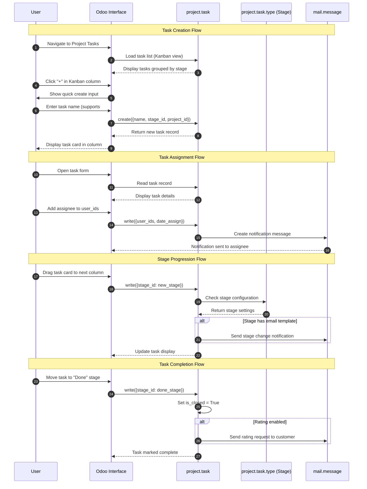
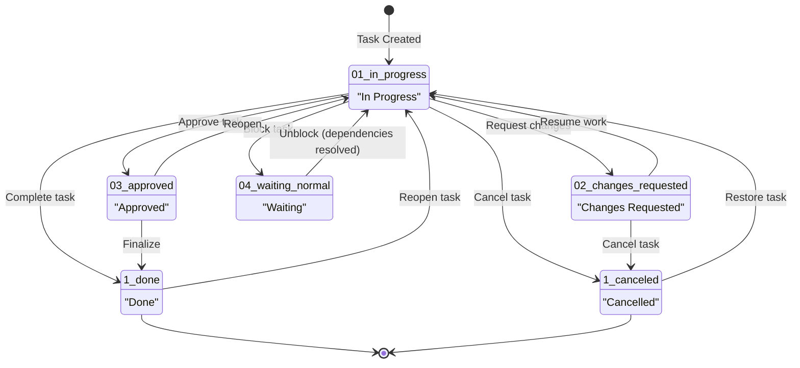

# Project Task Management Workflow

## Overview

### Business Objective

The Project Task Management workflow enables organizations to track and manage project work from task creation through completion. This workflow supports service delivery teams by providing a structured way to define, assign, track, and complete work items within projects. Tasks progress through customizable stages on a visual Kanban board, providing clear visibility into project status and team workload.

### Target Personas

| Persona | Role in Workflow |
|---------|------------------|
| **Project Manager** | Creates projects, defines task stages, assigns work, monitors progress, manages priorities |
| **Team Member** | Receives task assignments, updates task progress, logs work, moves tasks through stages |
| **Service Coordinator** | Oversees multiple projects, ensures deadlines are met, coordinates between team members |
| **Customer (Portal User)** | Views project tasks assigned to them, provides feedback and rating |

### Business Value

- **Service Delivery Tracking**: Monitor work progress from assignment to completion
- **Team Productivity**: Clear task ownership and stage visibility improves efficiency
- **Customer Satisfaction**: Transparency through portal access and rating requests
- **Resource Planning**: Deadline and assignee tracking enables workload balancing
- **Process Standardization**: Kanban stages enforce consistent workflow across projects

---

## Prerequisites

### Required Modules

| Module | Technical Name | Purpose |
|--------|----------------|---------|
| **Project** | `project` | Core task management functionality |

**Optional Enhanced Modules:**

| Module | Technical Name | Enhancement |
|--------|----------------|-------------|
| Timesheets | `hr_timesheet` | Time tracking on tasks |
| Project Update | `project_update` | Project status reporting |
| Task Dependencies | Built-in feature | Blocking relationships between tasks |

### Required Permissions

| Security Group | Technical Name | Access Level |
|----------------|----------------|--------------|
| **Project / User** | `project.group_project_user` | Create, edit, and manage own tasks |
| **Project / Manager** | `project.group_project_manager` | Full access including project configuration |

### Data Requirements

Before starting this workflow, ensure the following data exists:

1. **Project Created**: At least one project with defined task stages
2. **Task Stages**: Kanban columns configured for the project (e.g., "To Do", "In Progress", "Done")
3. **Team Members**: Users assigned to the project for task assignment
4. **Working Calendar** (optional): Resource calendar for deadline calculations

---

## Workflow Diagram

### Sequence Diagram

The following diagram shows the interaction between the user, Odoo interface, and underlying models during task management:

*Source: `addons/project/models/project_task.py`*

---

### State Machine Diagram

Tasks in Odoo have two complementary tracking mechanisms:

1. **Stage (stage_id)**: Visual Kanban columns - customizable per project
2. **State (state field)**: Built-in status indicators for workflow tracking

**State Definitions:**

| State Code | Display Name | Description | Closed? |
|------------|--------------|-------------|---------|
| `01_in_progress` | In Progress | Task is actively being worked on | No |
| `02_changes_requested` | Changes Requested | Task requires modifications before proceeding | No |
| `03_approved` | Approved | Task work is approved and ready for completion | No |
| `04_waiting_normal` | Waiting | Task is blocked by dependencies or external factors | No |
| `1_done` | Done | Task is completed successfully | Yes |
| `1_canceled` | Cancelled | Task has been cancelled and will not be completed | Yes |

*Source: `addons/project/models/project_task.py:168-177`*

**Understanding Stages vs. States:**

- **Stages** (`project.task.type`) are the Kanban columns visible on the board. Project managers can customize these per project (e.g., "To Do", "Development", "Testing", "Done").
- **States** are system-defined workflow indicators that track task progress independent of visual stages.
- A task can be in stage "Development" with state "Changes Requested" to indicate it's in the dev column but needs revisions.

---

## Step-by-Step Guide

### Step 1: Navigate to Project Tasks

**What the User Does:**

1. From the main Odoo menu, click on **"Project"**
2. Select **"All Tasks"** to see all tasks across projects, OR
3. Click on a specific project name to see only that project's tasks

**What the User Sees:**

The task list opens in Kanban view by default, showing task cards organized into stage columns:

| View Element | Description |
|--------------|-------------|
| **Column Headers** | Stage names with task count (e.g., "To Do (5)") |
| **Task Cards** | Individual task cards showing name, assignees, priority, deadline |
| **"+" Button** | Quick create button in each column header |
| **Search Bar** | Filter and search tasks by various criteria |
| **View Switcher** | Toggle between Kanban, List, Gantt, Calendar, and Graph views |

**Screenshot Reference:** `screenshots/10-01-project-tasks-view.png`

*Source: `addons/project/views/project_task_views.xml:653-730` (Kanban view definition)*

---

### Step 2: Create a New Task

**What the User Does:**

**Quick Create Method (Recommended):**
1. Click the **"+"** button in the desired stage column
2. Type the task name in the input field
3. Press **Enter** to create the task

**Advanced Create Method:**
1. Click the **"+"** button or the **"New"** button in the top-left
2. Click on the input area to open the full task form
3. Fill in the task details (see Step 3)

**Quick Create Shortcuts:**

Odoo supports special syntax in the task name for quick setup:

| Syntax | Example | Effect |
|--------|---------|--------|
| `#tag` | `Fix bug #urgent` | Adds the "urgent" tag to the task |
| `@user` | `Review code @john` | Assigns the task to user "john" |
| `!priority` | `Deploy site !high` | Sets priority to "High" |

**What the User Sees:**

After entering the task name:
- The new task card appears in the selected column
- The card shows the task name and creator avatar
- Quick create input resets for the next task

**Screenshot Reference:** `screenshots/10-02-create-task.png`

*Source: `addons/project/models/project_task.py:1090-1180` (create method)*

---

### Step 3: Configure Task Details

**What the User Does:**

1. Click on the task card to open the task form
2. Fill in the following fields:

**Required and Important Fields:**

| Field | Description | Location in Form |
|-------|-------------|------------------|
| **Task Title** | Name of the task (required) | Top header |
| **Project** | Parent project (auto-filled if created from project) | Top area |
| **Assignees** | Team members responsible for the task | Below title |
| **Deadline** | Due date for task completion | Right panel |
| **Tags** | Labels for categorization | Below assignees |
| **Priority** | Low, Medium, High, or Urgent (star icons) | Top right |

**Description Tab:**
- Add detailed task description and instructions
- Use rich text formatting (bold, lists, links)
- Attach files using the attachment button

**Sub-tasks Tab** (if project supports sub-tasks):
- Create child tasks that roll up to this parent
- Sub-tasks have their own stages and assignments

3. Click **Save** or the form auto-saves on navigation

**What the User Sees:**

The task form displays with:
- Main task information at the top
- Tabbed sections for Description, Sub-tasks, Blocked By, and Extra Info
- Chatter panel on the right showing activity history
- Smart buttons showing related records (Timesheets, Sub-tasks count)

**Screenshot Reference:** `screenshots/10-03-task-form.png`

*Source: `addons/project/views/project_task_views.xml:327-550` (Form view definition)*

---

### Step 4: Assign the Task

**What the User Does:**

1. Open the task (click on task card)
2. Click on the **"Assignees"** field (shows user avatars or "Add Assignees")
3. Start typing the team member's name
4. Select the user from the dropdown
5. Repeat to add multiple assignees if needed
6. Click away or Save to confirm

**What Happens Behind the Scenes:**

- The `user_ids` field is updated with the selected users
- The `date_assign` field is automatically set to the current timestamp
- A mail notification is sent to each new assignee
- The assignee sees the task in their "My Tasks" filter

**What the User Sees:**

| Before Assignment | After Assignment |
|-------------------|------------------|
| "Add Assignees" placeholder | User avatar(s) displayed |
| No notification | Assignee receives email/Odoo notification |
| Task not in assignee's My Tasks | Task appears in assignee's filtered view |

**Screenshot Reference:** `screenshots/10-04-assign-task.png`

*Source: `addons/project/models/project_task.py:230-235` (user_ids and date_assign fields)*

---

### Step 5: Progress Task Through Stages

**What the User Does:**

**Kanban Drag-and-Drop Method:**
1. From the Kanban view, click and hold the task card
2. Drag the card to the target stage column
3. Release to drop the task in the new stage

**Form View Method:**
1. Open the task form
2. Click on the status bar at the top showing stage buttons
3. Click the desired stage button to move the task

**What Happens Behind the Scenes:**

- The `stage_id` field is updated to the new stage
- If the stage has an email template configured (`mail_template_id`), an automatic email is sent
- The stage change is logged in the chatter
- If moved to a stage with `is_closed=True`, the task's `is_closed` field becomes True

**Stage Configuration Options:**

| Setting | Effect |
|---------|--------|
| **Folded in Kanban** | Stage column appears collapsed by default |
| **Email Template** | Automatic email sent on entering this stage |
| **Is Closed Stage** | Tasks in this stage are considered complete |
| **Rating Email Template** | Customer satisfaction survey sent on entering |

**What the User Sees:**

- Task card smoothly moves to the new column
- Column task counts update automatically
- Chatter shows "Stage changed from X to Y" message
- If email template exists, recipient receives notification

**Screenshot Reference:** `screenshots/10-05-kanban-stages.png`

*Source: `addons/project/models/project_task_type.py:11-55` (Stage model definition)*

---

### Step 6: Complete the Task

**What the User Does:**

1. Move the task to the final "Done" stage using drag-and-drop OR
2. Open the task form and click the **"Done"** stage button OR
3. Use the state dropdown to set state to "Done" directly

**What Happens Behind the Scenes:**

- The `stage_id` changes to the "Done" stage
- The `is_closed` field becomes `True`
- If customer rating is enabled for the project:
  - A rating request email is sent to the customer
  - The customer can rate the task on a satisfaction scale
- The completion is logged in the chatter with timestamp

**Recurring Tasks Behavior:**

If the task has **Repeat** enabled:
- A new copy of the task is automatically created
- The new task appears in the first stage (e.g., "To Do")
- The new task has the next occurrence date as deadline
- Original task remains in "Done" for records

**What the User Sees:**

| Element | Before Completion | After Completion |
|---------|-------------------|------------------|
| Task Stage | Previous stage (e.g., "Review") | "Done" stage |
| Stage Bar | Current stage highlighted | "Done" highlighted |
| Task State | "In Progress" or "Approved" | "Done" |
| Kanban Card | In active column | In "Done" column (often folded) |
| Customer | No rating email | Rating request received (if enabled) |

**Screenshot Reference:** `screenshots/10-06-task-completed.png`

*Source: `addons/project/models/project_task.py:402-410` (_compute_is_closed method)*

---

## Variations and Edge Cases

### Working with Task Dependencies

**Scenario:** A task cannot start until another task is completed.

**How to Set Up Dependencies:**

1. Open the dependent task (the one that must wait)
2. Navigate to the **"Blocked By"** tab
3. Click **"Add a line"**
4. Search and select the blocking task(s)
5. Save the task

**What Happens:**

- The dependent task shows a visual indicator that it's blocked
- The task's `depend_on_ids` field links to blocking tasks
- When all blocking tasks reach a closed stage, the dependency is resolved
- The `state` may automatically change to "Waiting" (`04_waiting_normal`) for blocked tasks

**How to View Dependencies:**

- **Blocked By tab**: Shows tasks that must complete first
- **Blocking tab**: Shows tasks that are waiting on this task
- Visual indicators on Kanban cards show blocked status

*Source: `addons/project/models/project_task.py:281-285` (depend_on_ids field)*

---

### Managing Sub-tasks

**Scenario:** A large task needs to be broken into smaller work items.

**How to Create Sub-tasks:**

1. Open the parent task
2. Navigate to the **"Sub-tasks"** tab
3. Click **"Add a line"**
4. Enter the sub-task name
5. Optionally configure the sub-task by clicking the expand icon

**Sub-task Characteristics:**

| Aspect | Behavior |
|--------|----------|
| **Hierarchy** | Sub-tasks link to parent via `parent_id` field |
| **Inheritance** | Sub-tasks inherit project from parent |
| **Progress** | Parent shows sub-task completion percentage |
| **Independence** | Sub-tasks have their own stages, assignees, and deadlines |
| **Nesting** | Sub-tasks can have their own sub-tasks (multi-level) |

**What the User Sees:**

- Parent task shows "Sub-tasks" smart button with count
- Sub-tasks tab lists all child tasks with their status
- Clicking a sub-task opens its form view

**Note:** Private tasks (tasks without a project) cannot have sub-tasks.

*Source: `addons/project/models/project_task.py:259-270` (child_ids and parent_id fields)*

---

### Recurring Tasks

**Scenario:** A task needs to repeat on a regular schedule.

**How to Configure Recurring Tasks:**

1. Open or create a task
2. Scroll to the **"Extra Info"** tab
3. Enable the **"Repeat"** toggle
4. Configure recurrence settings:
   - **Repeat Every**: Number of units (e.g., "2")
   - **Repeat Unit**: Day, Week, Month, Year
   - **Repeat On** (weekly): Select days of the week
   - **Until**: End date or number of occurrences

**What Happens:**

- When the task is marked as done, a new task is automatically created
- The new task has an adjusted deadline based on the recurrence pattern
- A link is maintained between recurrences via `recurrence_id`
- The **Recurrence** smart button shows all related occurrences

**Limitations:**

- Recurring tasks cannot have a parent task (cannot be sub-tasks)
- All recurrence copies are linked to the same `task.recurrence` record

*Source: `addons/project/models/project_task.py:513-550` (_compute_repeat method)*

---

### Private Tasks (Personal Tasks)

**Scenario:** A user wants to track personal tasks without a project.

**How to Create Private Tasks:**

1. Navigate to **Project → All Tasks**
2. Click **"New"** without selecting a project
3. Leave the **Project** field empty
4. Fill in task details and save

**Private Task Characteristics:**

| Aspect | Behavior |
|--------|----------|
| **Visibility** | Only visible to the creator and assignees |
| **Stages** | Uses personal stages (user-specific Kanban columns) |
| **Limitations** | Cannot have sub-tasks or parent tasks |
| **Project Field** | Empty (no `project_id` set) |

**Personal Stages:**

- Each user can create their own stages for private tasks
- These stages are not shared with other users
- Managed via `project.task.type` with `user_id` set

*Source: `addons/project/models/project_task.py:714-730` (personal stage handling)*

---

### Task Templates

**Scenario:** Common tasks need to be created repeatedly with the same structure.

**How to Use Task Templates:**

1. Create a task with `is_template = True` (via developer mode or API)
2. When creating a new task, reference the template
3. The new task copies the template's structure, description, and sub-tasks

**Note:** Task templates are an advanced feature typically configured by administrators or project managers with technical access.

*Source: `addons/project/models/project_task.py` (is_template field)*

---

### Changing Task State Manually

**Scenario:** Change the workflow state without moving the visual stage.

**How to Change State:**

1. Open the task form
2. Look for the **"State"** dropdown in the top-right area or status bar
3. Select the desired state:
   - In Progress
   - Changes Requested
   - Approved
   - Waiting
   - Done
   - Cancelled

**When to Use State vs. Stage:**

| Use State When | Use Stage When |
|----------------|----------------|
| Indicating workflow status (blocked, approved) | Moving through visual Kanban process |
| Task needs attention regardless of column | Normal progression through work phases |
| Communicating approval/rejection status | Organizing work visually |

---

## Integration Points

### Integration with Mail Module

**When Active:** The Mail (`mail`) module is a dependency and always installed with Project.

**Automatic Behavior:**

- **Assignment Notifications**: When a user is added to `user_ids`, they receive an email notification
- **Stage Change Emails**: If a stage has `mail_template_id` configured, emails are sent automatically
- **Chatter Integration**: All task activities are logged in the chatter panel
- **Follower Notifications**: Users following a task receive updates on changes

**User Impact:**

- Assignees automatically receive task assignments via email/Odoo inbox
- The chatter shows complete task history with timestamps
- Users can @mention colleagues to notify them

*Source: `addons/project/__manifest__.py:13` (mail dependency)*

---

### Integration with Resource Module

**When Active:** The Resource (`resource`) module is a dependency and always installed with Project.

**Automatic Behavior:**

- **Working Time Calculations**: Deadlines respect resource calendars
- **Availability Tracking**: System considers employee working hours
- **Calendar Integration**: Tasks can sync with employee calendars

**User Impact:**

- Deadline calculations account for weekends and holidays
- Resource planning considers actual working capacity

*Source: `addons/project/__manifest__.py:17` (resource dependency)*

---

### Integration with Rating Module

**When Active:** The Rating (`rating`) module is a dependency and always installed with Project.

**Configuration:**

1. Open Project settings
2. Enable **"Customer Ratings"** for the project
3. Configure which stages trigger rating requests
4. Customize the rating email template

**Automatic Behavior:**

- When a task moves to a stage with rating enabled, an email is sent to the customer
- The customer can rate the task (satisfied/neutral/dissatisfied)
- Ratings are stored and visible on the task and project dashboards

**User Impact:**

- Tasks show a rating indicator after customer responds
- Project managers can monitor team performance via ratings
- Customer satisfaction metrics are available in reports

*Source: `addons/project/__manifest__.py:16` (rating dependency)*

---

### Integration with Portal Module

**When Active:** The Portal (`portal`) module is a dependency and always installed with Project.

**Automatic Behavior:**

- External customers/partners can view tasks assigned to them via the portal
- Portal users see a simplified task view
- Customers can add comments via the chatter

**User Impact:**

- Share project progress with clients without giving them backend access
- Customers can track their requests and provide feedback
- Portal access is controlled by `portal.group_portal` security group

*Source: `addons/project/__manifest__.py:14` (portal dependency)*

---

### Integration with Timesheet Module

**When Active:** If HR Timesheet (`hr_timesheet`) module is installed.

**Automatic Behavior:**

- Tasks show a "Timesheets" smart button
- Team members can log hours directly on tasks
- Time is recorded in `account.analytic.line` records

**User Impact:**

- Track time spent on each task
- Generate reports on project time allocation
- Bill customers based on timesheet entries (with invoicing integration)

**Note:** This integration requires additional module installation.

---

## Error Scenarios

### Cyclic Dependencies Between Tasks

**Error Message:** "Cyclic dependencies are not allowed."

**When It Occurs:** The user attempts to create a dependency where Task A depends on Task B, but Task B already depends on Task A (directly or indirectly).

**What the User Sees:**

- A validation error appears when saving
- The dependency is not created
- The form remains open for correction

**How to Resolve:**

1. Review the dependency chain for both tasks
2. Remove the circular reference
3. Redesign the dependency structure to avoid loops

*Source: `addons/project/models/project_task.py` (dependency validation)*

---

### Company Mismatch Between Task and Partner

**Error Message:** "The following tasks have to be updated with a partner or a partner company in line with their company..."

**When It Occurs:** In multi-company setups, if a task's partner belongs to a different company than the task.

**What the User Sees:**

- Validation error on save or during certain operations
- Message indicates the company inconsistency

**How to Resolve:**

1. Verify the correct company is selected in the company switcher
2. Ensure the partner (customer) belongs to the same company
3. Update either the task's company or the partner assignment

*Source: `addons/project/models/project_task.py:1015-1030` (company validation)*

---

### Attempting to Create Sub-task of Private Task

**Error Message:** "A private task cannot have a parent task."

**When It Occurs:** The user tries to set a parent task for a task that has no project (private task).

**What the User Sees:**

- Validation error appears
- The parent relationship is not created

**How to Resolve:**

1. Assign the task to a project first
2. Then set the parent task relationship
3. Alternatively, create the task directly as a sub-task from the parent

*Source: `addons/project/models/project_task.py` (parent validation constraint)*

---

### Recurring Task Cannot Have Parent

**Error Message:** "A recurring task cannot have a parent task."

**When It Occurs:** The user tries to set a parent for a task that has recurrence enabled, or enable recurrence on a sub-task.

**What the User Sees:**

- Validation error appears when saving
- The configuration is not allowed

**How to Resolve:**

1. If recurrence is needed: Remove the parent task relationship first
2. If hierarchy is needed: Disable the recurring task setting
3. Consider creating the recurring task at the parent level and manually manage sub-tasks

*Source: `addons/project/models/project_task.py` (recurrence constraint)*

---

### Missing Required Fields

**Error Message:** "Task Title is required" or similar field-specific messages

**When It Occurs:** The user tries to save a task without filling required fields.

**What the User Sees:**

- Validation error highlighting the missing field
- The field is marked with a red indicator
- Save action is blocked

**How to Resolve:**

1. Fill in the required field (task name is typically the only required field)
2. Try saving again

---

## What the User Sees: UI State Reference

### Kanban View

| UI Element | Appearance |
|------------|------------|
| **Stage Columns** | Vertical columns with stage names and task counts |
| **Task Cards** | Cards showing name, assignees (avatars), priority stars, deadline |
| **Folded Columns** | Collapsed columns for completed/less active stages |
| **"+" Button** | Quick create button in each column header |
| **Progress Bar** | Optional progress indicator on task cards |
| **Color Indicators** | Priority-based colors, overdue indicators |

### Form View

| UI Element | Appearance |
|------------|------------|
| **Header** | Task title (large, editable), project name, stage buttons |
| **Stage Bar** | Clickable stage buttons showing workflow progression |
| **State Indicator** | State badge/dropdown showing current state |
| **Assignees** | User avatars with add/remove capability |
| **Priority** | Star icons (0-3 stars for priority levels) |
| **Deadline** | Date field with calendar picker |
| **Smart Buttons** | Timesheets, Sub-tasks count, related records |
| **Tabs** | Description, Sub-tasks, Blocked By, Extra Info |
| **Chatter** | Right panel with message history and activity scheduling |

### List View

| UI Element | Appearance |
|------------|------------|
| **Columns** | Task name, Project, Assignees, Stage, Deadline, Priority |
| **Row Selection** | Checkboxes for bulk actions |
| **Sorting** | Clickable column headers for sorting |
| **Grouping** | Optional row grouping by stage, project, or assignee |

### Task Card States

| State | Visual Indicator |
|-------|------------------|
| **In Progress** | Default appearance |
| **Changes Requested** | May show warning color |
| **Approved** | May show success color |
| **Waiting/Blocked** | Blocked icon or muted appearance |
| **Done** | Checkmark or strikethrough, often in folded column |
| **Cancelled** | Greyed out or muted appearance |
| **Overdue** | Red deadline text, warning indicators |
| **High Priority** | Filled star icons, may have colored border |

---

## Business Rules Reference

For detailed information about validation logic, computation rules, and access control for this workflow, see:

**[Project Task Business Rules](../../04-business-rules/project-task-rules.md)** *(if available)*

Key rules documented there include:

- Required fields for task creation
- State transition validation
- Dependency rules and constraints
- Recurrence computation logic
- Access control by security group
- Stage assignment rules
- Sub-task hierarchy constraints

---

## Related Documentation

- **[Capabilities Inventory](../../01-capabilities-overview/capabilities-inventory.md)** - Complete module reference including Project module details
- **[Employee Leave Request Flow](../11-employee-leave-request/flow-document.md)** - Related HR workflow for team availability
- **[Expense Claim Flow](../12-expense-claim-reimbursement/flow-document.md)** - Project expense tracking
- **[Sales Quote to Order Flow](../01-sales-quote-to-order/flow-document.md)** - Service projects from sales

---

## Glossary of Terms Used

| Term | Definition |
|------|------------|
| **Task** | A unit of work within a project, tracked through stages to completion |
| **Stage** | A Kanban column representing a phase in the workflow (e.g., "To Do", "In Progress", "Done") |
| **State** | A system-defined status indicator independent of visual stages (e.g., "Approved", "Waiting") |
| **Kanban Board** | A visual board organizing tasks into stage columns for drag-and-drop management |
| **Assignee** | A user responsible for completing the task |
| **Sub-task** | A child task that breaks down a larger parent task into smaller work items |
| **Task Dependency** | A relationship where one task must wait for another to complete before starting |
| **Recurring Task** | A task that automatically creates a new copy when completed, based on a schedule |
| **Private Task** | A task without a project, visible only to its creator and assignees |
| **Personal Stage** | User-specific Kanban columns for organizing private tasks |
| **Chatter** | The communication history panel showing messages, notes, and activity log |
| **Smart Button** | A clickable button on a record showing a count and linking to related records |
| **Rating** | Customer satisfaction feedback collected after task completion |
| **Portal** | External-facing interface allowing customers to view and interact with their tasks |
| **Blocked Task** | A task that cannot proceed because its dependencies are not yet complete |
| **Milestone** | A project checkpoint that groups related tasks for progress tracking |

---

*Document Version: 1.0*  
*Source References:*
- *`addons/project/models/project_task.py`*
- *`addons/project/models/project_task_type.py`*
- *`addons/project/views/project_task_views.xml`*
- *`addons/project/__manifest__.py`*
- *Odoo 19.0 Community Edition*
