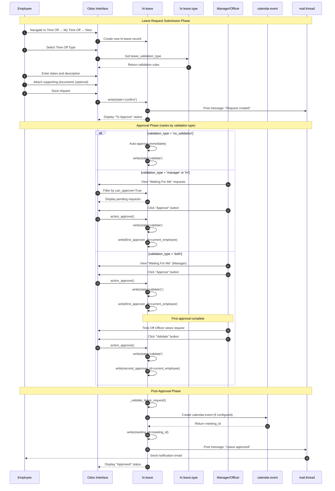
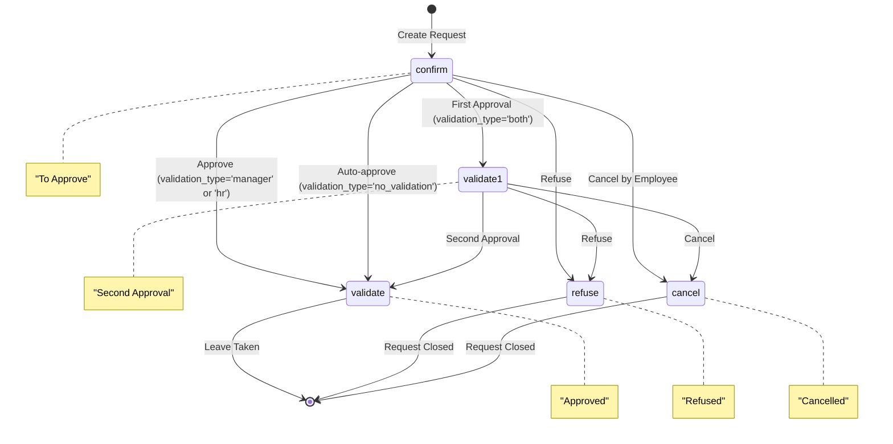
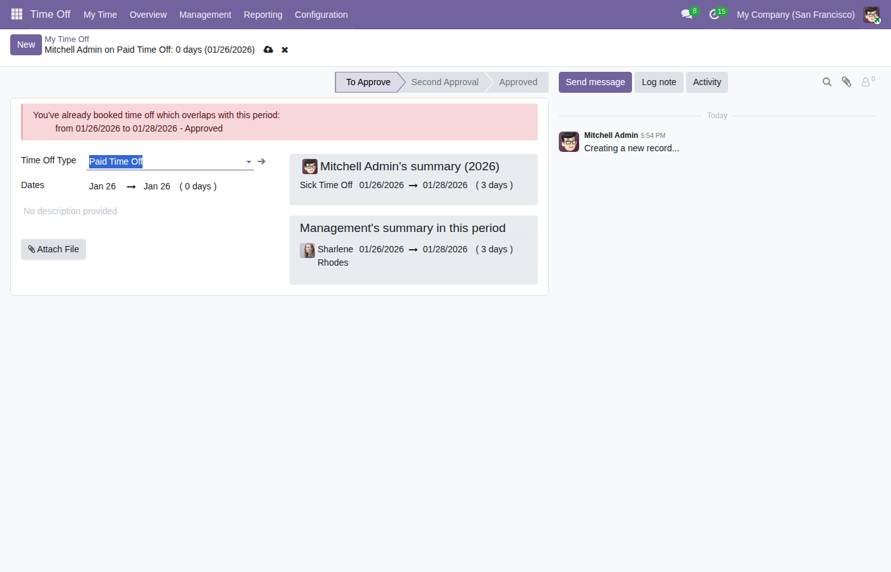
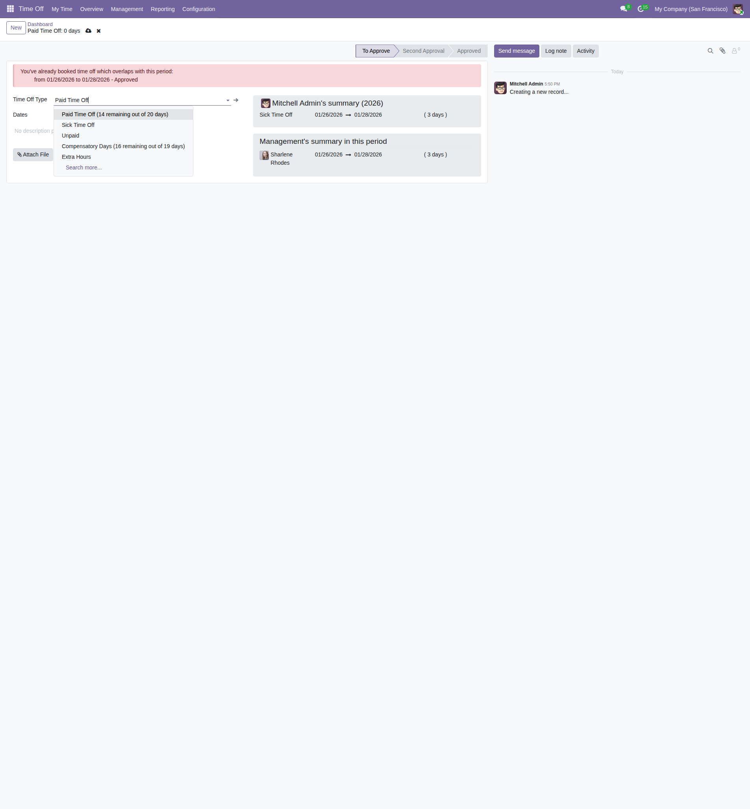
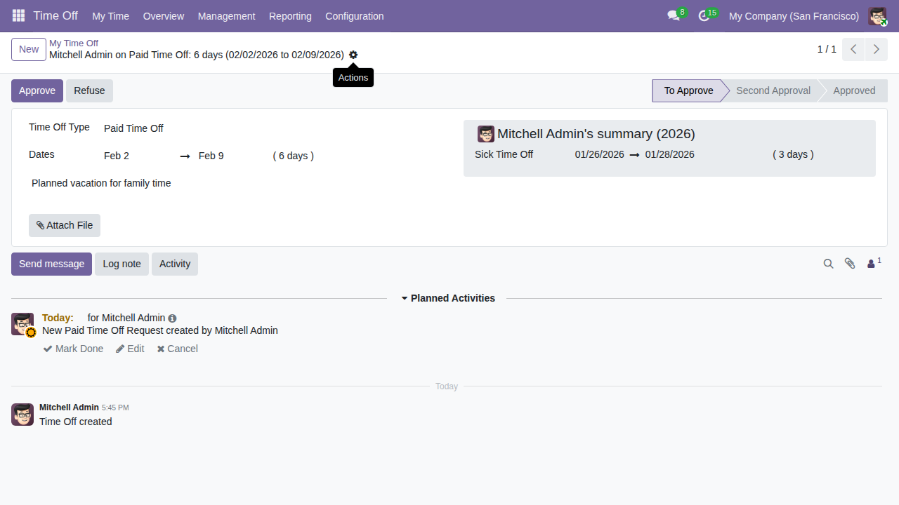
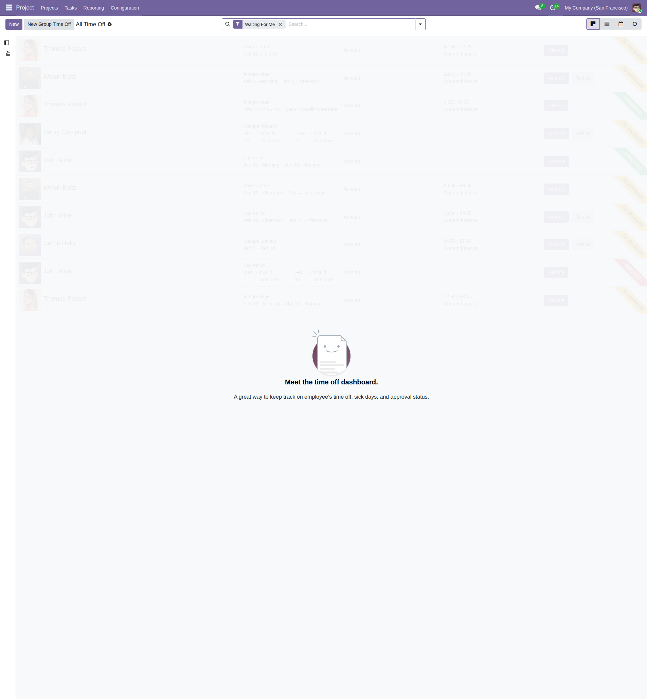
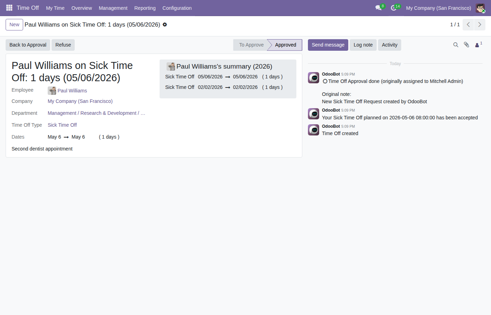
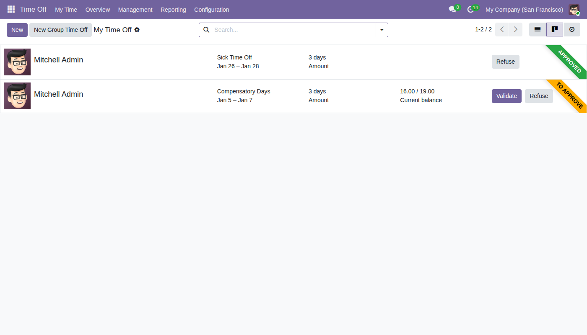

# User Flow 11: Employee Leave Request

## Overview

### Business Objective

The Employee Leave Request workflow enables employees to request time off from work and ensures proper approval processes are followed before the leave is granted. This workflow is fundamental to HR compliance, workforce planning, and maintaining accurate records of employee absences.

### Target Users

| Role | Description |
|------|-------------|
| **Employee** | Any staff member who needs to request time off |
| **Employee's Approver** | The designated manager responsible for approving an employee's leave requests |
| **Time Off Officer** | HR personnel with authority to manage and approve leave requests |
| **Time Off Manager** | Senior HR personnel with full administrative access to the Time Off module |

### Business Value

- **HR Compliance**: Ensures all leave requests follow company policies and approval hierarchies
- **Workforce Planning**: Provides visibility into planned absences for scheduling purposes
- **Employee Self-Service**: Empowers employees to manage their own time off requests
- **Audit Trail**: Maintains complete history of requests, approvals, and rejections
- **Calendar Integration**: Automatically reflects approved time off in shared calendars

### Core Model

The workflow centers around the `hr.leave` model, which represents a time off request. Each request tracks:
- The employee requesting leave
- The type of time off (vacation, sick leave, etc.)
- The requested dates and duration
- The approval status
- Any supporting documentation

---

## Prerequisites

### Required Modules

The Employee Leave Request workflow requires the following Odoo modules to be installed:

| Module | Technical Name | Purpose |
|--------|---------------|---------|
| **Time Off** | `hr_holidays` | Core leave management functionality |
| **Employees** | `hr` | Employee records and organizational structure |
| **Calendar** | `calendar` | Calendar integration for approved leaves |
| **Resource** | `resource` | Working hours and resource calendar management |

**Module Dependencies** (from `__manifest__.py`):
```
'depends': ['hr', 'calendar', 'resource']
```

### Security Groups

Users must belong to appropriate security groups to perform actions in this workflow:

| Security Group | Technical Name | Permissions |
|----------------|---------------|-------------|
| **Employee** | `base.group_user` | Can create and view own leave requests |
| **Time Off: Responsible** | `hr_holidays.group_hr_holidays_responsible` | Can view team leave requests |
| **Time Off: Officer** | `hr_holidays.group_hr_holidays_user` | Can approve/refuse requests within scope |
| **Time Off: Manager** | `hr_holidays.group_hr_holidays_manager` | Full access to all time off records |

### Initial Configuration

Before employees can request leave, the following must be configured:

1. **Time Off Types**: At least one leave type (e.g., "Paid Time Off", "Sick Leave") must exist
2. **Employee Records**: Employees must have active employee records in the system
3. **Leave Manager Assignment**: Each employee should have a designated approver (`leave_manager_id` field)
4. **Leave Allocations**: For time off types that require allocation, employees must have valid allocations

---

## Workflow Diagram

### Sequence Diagram

The following diagram illustrates the complete leave request flow from submission to approval:



### State Machine Diagram

The leave request progresses through the following states:



**State Definitions** (Source: `hr_leave.py:129-135`):

| State | Label | Description |
|-------|-------|-------------|
| `confirm` | To Approve | Initial state when request is submitted, awaiting approval |
| `validate1` | Second Approval | Used only for 'both' validation type - first approval completed |
| `validate` | Approved | Request has been fully approved |
| `refuse` | Refused | Request was rejected by an approver |
| `cancel` | Cancelled | Request was cancelled by the employee |

---

## Step-by-Step Workflow

### Step 1: Navigate to Time Off Request Form

**What the user does**: The employee accesses the Time Off module to create a new leave request.

**Navigation path**: 
- From the main menu, click **Time Off**
- Select **My Time Off** from the submenu
- Click the **New** button to create a new request

**What the user sees**: The system displays an empty leave request form with fields for entering the time off details.



**System behavior**: 
- The form defaults to the current user's employee record
- The system pre-selects a default Time Off Type based on available allocations
- Today's date is set as the default for both start and end dates

---

### Step 2: Select Time Off Type

**What the user does**: The employee selects the type of leave they are requesting.

**Field**: `holiday_status_id` (Time Off Type)

**What the user sees**: A dropdown menu showing available time off types, with information about remaining balances displayed in the statistics widget on the right side of the form.



**Available options typically include**:
- Paid Time Off
- Sick Time Off
- Unpaid Leave
- Compensatory Days
- (Other company-specific leave types)

**System behavior**:
- Only time off types with valid allocations or types that don't require allocation are shown
- The system displays the **Available Time Off** balance for the selected type
- The validation type for the selected leave type determines the approval workflow

**Business rule**: The domain filter ensures employees can only select leave types where:
- The type does not require allocation (`requires_allocation = False`), OR
- The employee has a valid allocation with remaining balance

---

### Step 3: Enter Request Dates

**What the user does**: The employee specifies the dates for their time off request.

**Fields**:
- `request_date_from` (Request Start Date)
- `request_date_to` (Request End Date)

**What the user sees**: A date range picker allowing selection of start and end dates. The system automatically calculates and displays the duration.

**Duration display options**:
- **Full days**: For standard day-based requests
- **Half days**: Morning (AM) or Afternoon (PM) options when the leave type supports half-day requests
- **Hours**: Specific time ranges when the leave type uses hour-based tracking

**System behavior**:
- The system calculates `number_of_days` based on the employee's working calendar
- Public holidays and weekends are automatically excluded from the calculation
- A warning appears if the requested period overlaps with existing leave requests

**Validation rule**: The start date must be before or equal to the end date (`request_date_from <= request_date_to`).

---

### Step 4: Add Description and Attachments (Optional)

**What the user does**: The employee provides additional context for the request and attaches any required documentation.

**Fields**:
- `name` (Description): Text field for explaining the reason for the leave
- `supported_attachment_ids` (Attachments): File upload for supporting documents

**What the user sees**: A text area for the description and an attachment upload widget (visible only if the leave type supports document attachments).

**Common attachments include**:
- Medical certificates for sick leave
- Travel itineraries for vacation requests
- Legal documents for family leave

**System behavior**:
- The description is visible to approvers when reviewing the request
- Attachments are stored securely and linked to the leave request record

---

### Step 5: Submit the Request

**What the user does**: The employee saves the leave request form to submit it for approval.

**What the user sees**: After saving, the form displays:
- Status bar showing **"To Approve"** state
- The request details in read-only format
- A chatter section showing the submission activity



**System behavior**:
- The request is created with `state = 'confirm'`
- An activity is scheduled for the appropriate approver
- The system sends a notification to the designated approver(s)
- For `validation_type = 'no_validation'`, the request is automatically approved

**What happens next** depends on the Time Off Type's validation setting:

| Validation Type | Next Step |
|-----------------|-----------|
| No Validation | Request auto-approved, skips to Step 9 |
| By Time Off Officer | Time Off Officer receives notification |
| By Employee's Approver | Employee's Manager receives notification |
| By Both | Employee's Manager receives notification first |

---

### Step 6: Manager Reviews Pending Requests

**What the user does**: The manager or Time Off Officer views requests awaiting their approval.

**Navigation path**:
- From the main menu, click **Time Off**
- The **"Waiting For Me"** filter shows requests pending the current user's approval

**What the user sees**: A list or kanban view of leave requests that require the manager's action, showing:
- Employee name and avatar
- Requested dates and duration
- Time off type
- Current status



**System behavior**:
- The "Waiting For Me" filter uses different logic based on the user's security group
- For Time Off Officers: Shows requests where `validation_type = 'hr'` or requests in `validate1` state
- For Managers: Shows requests from their direct reports where `validation_type = 'manager'` or `'both'`

---

### Step 7: Approve the Request (First Approval)

**What the user does**: The approver clicks the **"Approve"** button to grant the leave request.

**Button**: `action_approve` method

**What the user sees**: 
- For single-approval types: The status changes directly to **"Approved"**
- For two-step approval: The status changes to **"Second Approval"**

**System behavior** (Source: `hr_leave.py:1095-1110`):

```
For validation_type = 'both':
1. State changes from 'confirm' to 'validate1'
2. first_approver_id is set to the current employee
3. Activity is scheduled for the Time Off Officer

For validation_type = 'manager' or 'hr':
1. State changes directly to 'validate'
2. first_approver_id is set to the current employee
3. Calendar event is created
4. Employee receives approval notification
```

**Alternative action**: The approver can click **"Refuse"** to reject the request, which changes the state to `'refuse'` and notifies the employee.

---

### Step 8: Second Approval (For 'both' Validation Type Only)

**What the user does**: After the manager's first approval, the Time Off Officer completes the second approval step.

**What the user sees**: The request appears with:
- Status showing **"Second Approval"**
- The **"Validate"** button (instead of "Approve")
- First approver's name displayed

**System behavior**:
- The `can_validate` computed field returns `True` for authorized officers
- Clicking "Validate" calls `action_approve()` which triggers `_action_validate()`
- State changes from `validate1` to `validate`
- `second_approver_id` is set to the current employee

---

### Step 9: Request Approved - Final State

**What the user does**: The employee views their approved leave request.

**What the user sees**: The form displays:
- Status bar showing **"Approved"** state
- Calendar icon indicating integration with the employee's calendar
- Approval history in the chatter



**System behavior** (Source: `hr_leave.py:1007-1040`):

1. **Calendar Event Creation**: If the Time Off Type has `create_calendar_meeting = True`:
   - A `calendar.event` record is created
   - The event is linked via `meeting_id` field
   - Event appears on the employee's calendar

2. **Resource Leave Creation**: The system creates a resource leave record to block the time in scheduling

3. **Notification**: The employee receives a message confirming approval:
   > "Your [Leave Type] planned on [Date] has been accepted"

4. **Allocation Update**: The used leave days are deducted from the employee's available balance

---

### Step 10: View Leave in Calendar

**What the user does**: The employee or manager views the approved leave in the calendar.

**Navigation path**:
- Click the calendar icon on the approved leave request, OR
- Navigate to **Calendar** application to see the time off event

**What the user sees**: The calendar displays the time off as a confidential event with:
- Employee's name and "on Time Off"
- Duration of the leave
- Privacy set to "confidential"



**System behavior**:
- The calendar event is created with `privacy = 'confidential'`
- The event duration matches the approved leave duration
- The employee is added as an attendee

---

## Approval Workflow Variants

The Time Off Type configuration determines which approval workflow is used. Here are the four variants:

### Variant 1: No Validation Required

**Configuration**: `leave_validation_type = 'no_validation'`

**Use Case**: Trust-based leave types or automatic accrual adjustments

**Flow**:
```
Employee submits request → Request auto-approved → Calendar event created
```

**States visited**: `confirm` → `validate`

---

### Variant 2: Time Off Officer Approval

**Configuration**: `leave_validation_type = 'hr'`

**Use Case**: Centralized HR approval for all leave types

**Flow**:
```
Employee submits request → Time Off Officer reviews → Officer approves/refuses
```

**Approver**: Any user in the `hr_holidays.group_hr_holidays_user` group who is listed in the Time Off Type's `responsible_ids` field

**States visited**: `confirm` → `validate` (or `refuse`)

---

### Variant 3: Manager Approval

**Configuration**: `leave_validation_type = 'manager'`

**Use Case**: Department-level approval by direct supervisors

**Flow**:
```
Employee submits request → Employee's Manager reviews → Manager approves/refuses
```

**Approver**: The employee's `leave_manager_id` or, if not set, the `parent_id.user_id` (department manager)

**States visited**: `confirm` → `validate` (or `refuse`)

---

### Variant 4: Two-Step Approval (Both)

**Configuration**: `leave_validation_type = 'both'`

**Use Case**: High-value leave types requiring dual authorization (e.g., extended leave, sabbatical)

**Flow**:
```
Employee submits → Manager first approval → Time Off Officer second approval
```

**First Approver**: Employee's Manager (`leave_manager_id` or `parent_id.user_id`)
**Second Approver**: Time Off Officer (from `responsible_ids`)

**States visited**: `confirm` → `validate1` → `validate` (or `refuse` at either step)

---

## Access Control and Permissions

### Computed Permission Fields

The system uses computed fields to determine button visibility and action permissions:

| Field | Purpose | Logic |
|-------|---------|-------|
| `can_approve` | Shows "Approve" button | User can move request to `validate1` state |
| `can_validate` | Shows "Validate" button | User can move request to `validate` state |
| `can_refuse` | Shows "Refuse" button | User can reject the request |
| `can_cancel` | Shows "Cancel" button | User can cancel their own request |

**Permission Logic** (Source: `hr_leave.py:678-702`):

- **Approve**: Available when `validation_type = 'both'` and user is the employee's manager
- **Validate**: Available when user can complete the final approval step
- **Refuse**: Available for officers on requests in `confirm` or `validate1` state
- **Cancel**: Available for employees on their own pending requests

### Self-Approval Restriction

**Important Rule**: Users cannot approve their own leave requests. The system enforces this through the `_check_approval_update` method (Source: `hr_leave.py:1365-1420`).

### Security Group Access

| Action | Required Group(s) |
|--------|------------------|
| Create own request | `base.group_user` |
| View team requests | `group_hr_holidays_responsible` |
| Approve requests | `group_hr_holidays_user` or be designated approver |
| Refuse requests | `group_hr_holidays_user` |
| Manage all requests | `group_hr_holidays_manager` |

---

## Integration Points

### Calendar Module Integration

**Connection**: `meeting_id` → `calendar.event`

**Behavior**:
- When a leave is approved, a calendar event is automatically created (if `create_calendar_meeting = True` on the Time Off Type)
- The event is marked as "confidential" and displays as blocked time
- If the leave is cancelled or refused, the calendar event is deactivated

**Calendar Event Details** (Source: `hr_leave.py:1043-1077`):
- **Name**: "[Employee] on Time Off : [Duration]"
- **Duration**: Matches the leave duration
- **Privacy**: Set to "confidential"
- **Attendees**: The employee (as partner)

---

### HR Module Integration

**Connection**: `employee_id` → `hr.employee`

**Key relationships**:
- `employee_id`: Links the leave request to the employee record
- `department_id`: Inherited from employee for departmental filtering
- `leave_manager_id`: Determines who approves 'manager' type requests

---

### Mail Module Integration

**Inheritance**: `hr.leave` inherits from `mail.thread.main.attachment` and `mail.activity.mixin`

**Features enabled**:
- **Chatter**: Full message history and activity tracking on each request
- **Activities**: Scheduled tasks for approvers
- **Notifications**: Automatic emails for status changes
- **Attachments**: Document storage for supporting files

---

### Resource Module Integration

**Connection**: `resource_calendar_id` → `resource.calendar`

**Purpose**:
- Determines working hours for duration calculation
- Excludes non-working days from leave duration
- Supports different working schedules per employee

---

## Error Scenarios and Edge Cases

### Insufficient Leave Balance

**Scenario**: Employee requests more days than available in their allocation.

**System behavior**: 
- A validation error prevents submission
- Message: "There is no valid allocation to cover that request."

**User action**: Request fewer days or ask for additional allocation.

---

### Overlapping Leave Requests

**Scenario**: Employee tries to request leave for dates already covered by another request.

**System behavior**:
- A warning message appears in the form header
- The system prevents duplicate leave requests for the same period

---

### Mandatory Day Restriction

**Scenario**: Employee requests leave on a day marked as mandatory (e.g., company-wide event).

**System behavior**:
- Regular employees receive error: "You are not allowed to request time off on a Mandatory Day"
- Time Off Officers can override this restriction

---

### Cancellation After Approval

**Scenario**: Employee needs to cancel an already-approved leave request.

**System behavior**:
- The "Cancel" button triggers a wizard for entering a cancellation reason
- Upon cancellation, the calendar event is deactivated
- The leave allocation is restored
- Approvers are notified of the cancellation

---

## Related Documentation

- [Business Rules: Leave Request Rules](../../04-business-rules/leave-request-rules.md)
- [Capabilities Overview](../../01-capabilities-overview/capabilities-inventory.md)
- [User Flow: Expense Claim Reimbursement](../12-expense-claim-reimbursement/flow-document.md)

---

## Source References

| Reference | File Path | Line Numbers |
|-----------|-----------|--------------|
| State definitions | `addons/hr_holidays/models/hr_leave.py` | 129-135 |
| Validation types | `addons/hr_holidays/models/hr_leave_type.py` | 83-87 |
| action_approve method | `addons/hr_holidays/models/hr_leave.py` | 1095-1110 |
| _action_validate method | `addons/hr_holidays/models/hr_leave.py` | 1183-1208 |
| Calendar event creation | `addons/hr_holidays/models/hr_leave.py` | 1007-1040 |
| Permission checking | `addons/hr_holidays/models/hr_leave.py` | 1365-1420 |
| Form view definition | `addons/hr_holidays/views/hr_leave_views.xml` | 327-421 |
| Module dependencies | `addons/hr_holidays/__manifest__.py` | 27 |

---

*Document Version: 1.0*
*Odoo Version: 19.0 Community Edition*
*Last Updated: Based on source code analysis*
