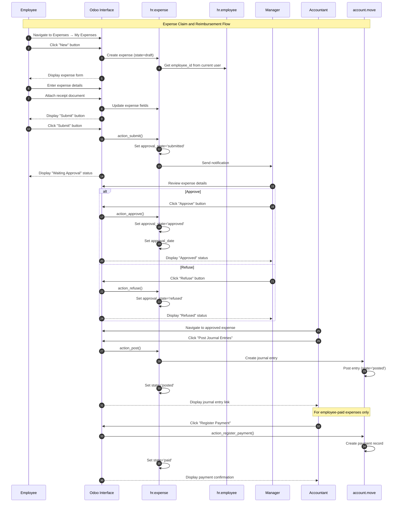
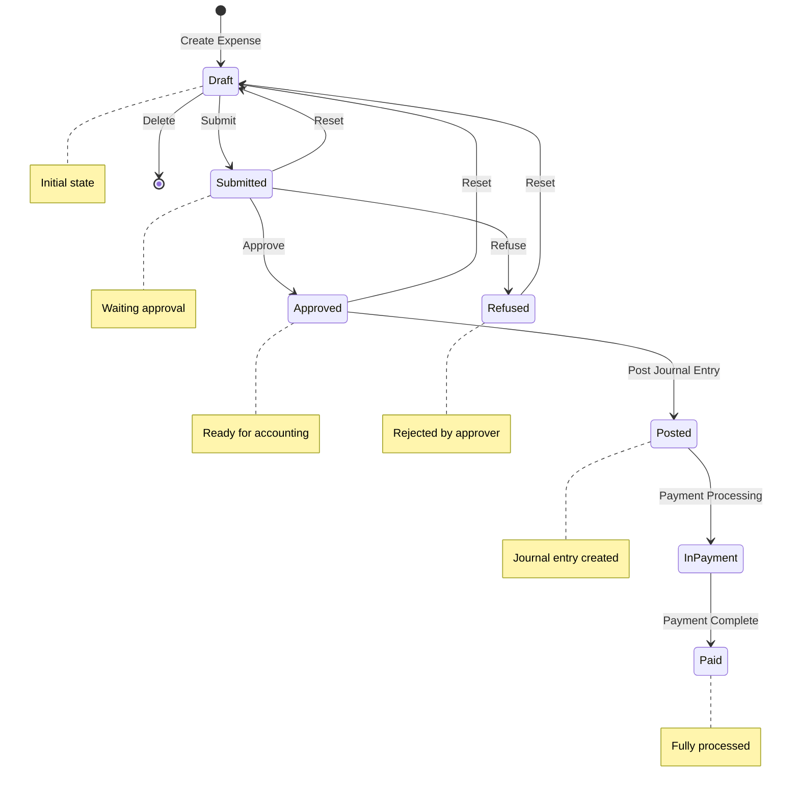
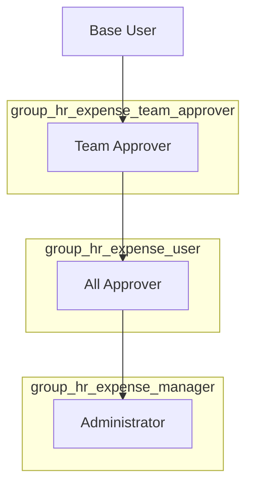

# User Flow 12: Expense Claim and Reimbursement

## Overview

### Business Objective

The Expense Claim and Reimbursement workflow enables employees to submit business-related expenses for approval and subsequent reimbursement. This process ensures proper documentation, approval, and accounting of employee expenditures while maintaining financial compliance and control.

### Target Users

| User Role | Description | Primary Actions |
|-----------|-------------|-----------------|
| **Employee** | Any employee with an associated user account | Create expenses, attach receipts, submit for approval |
| **Team Approver** | Manager responsible for approving team expenses | Review and approve/refuse expenses for direct reports |
| **All Approver** | HR officer with broader approval authority | Approve expenses across departments |
| **Administrator** | Expense system administrator | Full access to all expense operations, configuration |
| **Accountant** | Accounting team member | Post journal entries, process reimbursements |

### Business Value

- **Compliance**: Enforces proper approval hierarchy before expenses are reimbursed
- **Documentation**: Requires receipt attachment for expense verification
- **Audit Trail**: Maintains complete history of expense lifecycle with timestamps
- **Integration**: Seamlessly connects to accounting for automated journal entries
- **Flexibility**: Supports both employee-paid (reimbursement required) and company-paid expenses

---

## Prerequisites

### Required Modules

| Module | Technical Name | Purpose |
|--------|----------------|---------|
| Expenses | `hr_expense` | Core expense management functionality |
| Employees | `hr` | Employee records and organizational structure |
| Invoicing | `account` | Accounting integration and journal entries |

*Source: addons/hr_expense/__manifest__.py:29*

### User Permissions

Before using the expense workflow, users must have appropriate access rights:

| Permission Level | Security Group | Capabilities |
|------------------|----------------|--------------|
| Base User | `base.group_user` | Submit own expenses only |
| Team Approver | `hr_expense.group_hr_expense_team_approver` | Approve expenses for direct reports and managed departments |
| All Approver | `hr_expense.group_hr_expense_user` | Approve any expense in the system |
| Administrator | `hr_expense.group_hr_expense_manager` | Full administrative access, including configuration |

*Source: addons/hr_expense/security/hr_expense_security.xml:9-29*

### Configuration Requirements

1. **Expense Categories**: At least one product must be configured with `can_be_expensed = True` to serve as an expense category (e.g., "Travel", "Meals", "Office Supplies")
2. **Employee Records**: Users must have an associated employee record to submit expenses
3. **Expense Accounts**: Appropriate expense accounts must be defined in the chart of accounts
4. **Payment Methods**: Payment methods configured for company-paid expenses (if applicable)

---

## Process Flow Diagram

### Main Expense Workflow

### State Machine Diagram

---

## Step-by-Step Breakdown

### Step 1: Create New Expense

**Actor**: Employee

**Starting Point**: The employee navigates to the Expenses application from the main Odoo menu.

**What the User Sees**: A list view of existing expenses with a dashboard header showing expense totals by status (To Submit, Waiting Approval, Waiting Reimbursement).

**Actions**:
1. The employee clicks **Expenses** in the main application menu
2. The employee clicks **My Expenses** in the submenu
3. The employee clicks the **New** button in the top-left corner
4. A new expense form opens with the following pre-filled values:
   - **Employee**: Current user's employee record
   - **Expense Date**: Today's date
   - **Paid By**: "Employee (to reimburse)" selected by default
   - **Currency**: Company's default currency

**Key Fields to Complete**:
| Field | Description | Required |
|-------|-------------|----------|
| Description | Short description of the expense | Yes |
| Category | Expense category (product with can_be_expensed=True) | Yes |
| Total | Expense amount | Yes |
| Paid By | Employee (to reimburse) or Company | Yes |
| Date | Date of the expense | Yes |

**System Response**: The expense is created in **Draft** status. The expense ID is assigned automatically.

**Screenshot Reference**: `screenshots/12-01-create-expense.png`

*Source: addons/hr_expense/models/hr_expense.py:48-70*

---

### Step 2: Attach Receipt Document

**Actor**: Employee

**Starting Point**: The expense form is open in edit mode with basic details filled in.

**What the User Sees**: The expense form with an "Attach Receipt" button prominently displayed in the header area (highlighted when no attachments exist).

**Actions**:
1. The employee clicks the **Attach Receipt** button in the form header
2. A file browser dialog opens
3. The employee selects a receipt image or PDF from their computer
4. The receipt uploads and appears in the attachment preview panel on the right side of the form

**Important Notes**:
- Receipt attachment is required before the Submit button becomes active
- The system supports common image formats (PNG, JPG) and PDF files
- If an expense with the same receipt already exists, a warning message appears: *"An expense with the same receipt already exists."*

**System Response**: 
- The attachment count increases (visible in the form)
- The **Submit** button becomes available (no longer grayed out)
- The receipt preview displays alongside the expense form

**Screenshot Reference**: `screenshots/12-02-attach-receipt.png`

*Source: addons/hr_expense/views/hr_expense_views.xml:111, 133*

---

### Step 3: Submit Expense for Approval

**Actor**: Employee

**Starting Point**: The expense form is complete with all required fields filled and at least one receipt attached.

**What the User Sees**: The expense form in Draft status with the **Submit** button highlighted in the header.

**Actions**:
1. The employee reviews all expense details for accuracy
2. The employee clicks the **Submit** button
3. The system validates the expense data

**Validation Checks**:
- An expense category (product) must be selected
- The total amount cannot be zero
- At least one receipt must be attached

**System Response**:
- The expense status changes from **Draft** to **Submitted**
- The status bar updates to show the new state
- A notification is sent to the assigned approver (manager)
- If no approver is assigned, the expense may be auto-validated (skipping to Approved status)

**Auto-Validation Rule**: If the employee has no expense manager assigned AND no manager set on the expense, the expense is automatically approved.

**Screenshot Reference**: `screenshots/12-03-submit-expense.png`

*Source: addons/hr_expense/models/hr_expense.py:1125-1139*

---

### Step 4: Manager Approves Expense

**Actor**: Team Approver, All Approver, or Administrator

**Starting Point**: The approver receives a notification about a pending expense or navigates to **Expenses → Expenses to Process**.

**What the User Sees**: 
- The expense form in **Submitted** status
- **Approve** and **Refuse** buttons visible in the header
- Employee details, expense category, amount, and attached receipt

**Actions (Approval Path)**:
1. The approver clicks **Expenses to Process** to view pending approvals
2. The approver selects an expense to review
3. The approver examines the expense details and receipt
4. The approver clicks the **Approve** button

**Actions (Refusal Path)**:
1. If the expense is not valid, the approver clicks **Refuse**
2. A dialog prompts for a refusal reason
3. The approver enters the reason and confirms

**Approval Authorization**:
The system verifies the approver has one of these relationships to the expense:
- Is the employee's expense manager (`employee.expense_manager_id`)
- Is the employee's department manager
- Is a parent in the employee hierarchy
- Has All Approver or Administrator rights

**System Response (Approved)**:
- The expense status changes to **Approved**
- The `approval_date` is recorded
- The `manager_id` is set to the approving user
- The expense moves to the "To Post" queue for accountants

**System Response (Refused)**:
- The expense status changes to **Refused**
- A message with the refusal reason is posted to the expense chatter
- The employee is notified of the refusal

**Duplicate Warning**: If a potential duplicate expense is detected, a confirmation dialog appears asking the approver to verify this is not a duplicate submission.

**Screenshot Reference**: `screenshots/12-04-approve-expense.png`

*Source: addons/hr_expense/models/hr_expense.py:1146-1167*

---

### Step 5: Accountant Posts Journal Entry

**Actor**: Accountant (requires `account.group_account_invoice` permission)

**Starting Point**: The expense is in **Approved** status and appears in the expense list filtered by "To Post".

**What the User Sees**:
- The expense form showing **Approved** status
- **Post Journal Entries** button highlighted in the header
- Expense account and journal information visible

**Actions**:
1. The accountant navigates to **Expenses → Expenses to Process**
2. The accountant filters by "To Post" status
3. The accountant selects the approved expense
4. The accountant verifies the expense account assignment
5. The accountant clicks **Post Journal Entries**

**For Employee-Paid Expenses** (`payment_mode = 'own_account'`):
- A wizard dialog opens to configure the journal entry
- The accountant selects the expense journal and confirms
- A vendor bill (payable to the employee) is created

**For Company-Paid Expenses** (`payment_mode = 'company_account'`):
- A payment is created directly using the configured payment method
- The payment is posted automatically

**System Response**:
- A journal entry (`account.move`) is created and linked to the expense
- The expense status changes to **Posted**
- A "Journal Entry" smart button appears on the expense form
- The entry records:
  - Debit: Expense account
  - Credit: Accounts payable (for employee reimbursement) or Bank/Cash account (company-paid)

**Screenshot Reference**: `screenshots/12-05-post-expense.png`

*Source: addons/hr_expense/models/hr_expense.py:1169-1189*

---

### Step 6: Process Reimbursement Payment

**Actor**: Accountant

**Starting Point**: The expense is in **Posted** status with a linked journal entry (employee-paid expenses only).

**What the User Sees**:
- The expense form showing **Posted** status
- A "Journal Entry" smart button linking to the vendor bill
- The "Register Payment" option available on the linked journal entry

**Actions**:
1. The accountant clicks the **Journal Entry** button to open the vendor bill
2. The accountant clicks **Register Payment** on the journal entry
3. The payment registration wizard opens:
   - Select payment journal (bank account)
   - Enter payment date
   - Verify payment amount
4. The accountant confirms the payment

**Alternative Path**: 
- The accountant can use the **Register Payment** action directly from the expense if available
- Multiple expenses can be paid together through batch payment functionality

**System Response**:
- A payment record is created
- The journal entry is reconciled with the payment
- The expense status changes to **In Payment** (processing) and then **Paid**
- The employee can view their expense as fully processed

**Screenshot Reference**: `screenshots/12-06-reimburse-expense.png`

*Source: addons/hr_expense/models/hr_expense.py:1191-1195*

---

## Variations and Edge Cases

### Variation 1: Auto-Validation (No Approver)

**Scenario**: An employee submits an expense but has no expense manager assigned.

**System Behavior**:
- When `action_submit()` is called, the system checks `_can_be_autovalidated()`
- If no manager is found and no expense manager is set, the expense bypasses submission and goes directly to **Approved** status
- The expense is ready for accounting processing immediately

**User Impact**: Employees without managers can still submit expenses, but there's no approval checkpoint.

*Source: addons/hr_expense/models/hr_expense.py:1141-1144*

---

### Variation 2: Company-Paid Expenses

**Scenario**: The expense was paid by company credit card or direct company payment.

**Configuration**: The user selects "Company" in the **Paid By** field instead of "Employee (to reimburse)".

**Differences in Flow**:
- Step 6 (Reimbursement) is skipped entirely
- When posting, a direct payment is created instead of a vendor bill
- The payment method field becomes required
- The expense goes directly from Posted to Paid

**User Impact**: No reimbursement process needed; accounting records the company payment directly.

*Source: addons/hr_expense/models/hr_expense.py:242-251*

---

### Variation 3: Expense Refusal

**Scenario**: The approver determines the expense is invalid or improperly documented.

**Process**:
1. Approver clicks **Refuse** button
2. A wizard prompts for the refusal reason (required)
3. The approver enters a description and confirms
4. The expense moves to **Refused** status

**System Actions**:
- The `approval_state` is set to `'refused'`
- The refusal reason is posted to the expense chatter
- The employee receives a notification with the refusal reason
- If a draft journal entry existed, it is deleted

**Recovery Path**: The employee can click **Reset** to return the expense to Draft status and make corrections.

*Source: addons/hr_expense/models/hr_expense.py:1164-1167, 1443-1460*

---

### Variation 4: Reset to Draft

**Scenario**: An expense needs to be corrected after submission or even after posting.

**Available When**:
- Expense is in Submitted, Approved, or Refused status (always available)
- Expense is in Posted status (if journal entry is still in draft)

**Process**:
1. User with appropriate permissions clicks **Reset**
2. The system reverses any posted journal entries (creates reversal entry)
3. Draft journal entries are deleted
4. The expense returns to **Draft** status
5. All approval information is cleared

**User Impact**: Allows correction of errors at any stage before payment processing.

*Source: addons/hr_expense/models/hr_expense.py:1197-1209*

---

### Variation 5: Duplicate Expense Detection

**Scenario**: The system detects a potential duplicate expense based on matching receipt checksum.

**Detection Method**:
- The system compares the `message_main_attachment_checksum` field
- If two expenses share the same receipt file, they are flagged

**User Experience**:
- A warning banner appears: *"An expense with the same receipt already exists."*
- The warning includes a link to view the similar expense
- During approval, a confirmation dialog requires the approver to acknowledge the potential duplicate

**Resolution**: The approver can confirm the expenses are distinct (e.g., different items on same receipt) or refuse the duplicate.

*Source: addons/hr_expense/models/hr_expense.py:144-145*

---

### Variation 6: Split Expense

**Scenario**: An employee needs to split a single expense into multiple records (e.g., to assign different cost centers).

**Availability**:
- Only available for expenses in Draft status
- Not available for products with fixed costs

**Process**:
1. The employee clicks **Split Expense** button
2. A wizard opens showing the expense divided into two equal parts
3. The employee can adjust amounts and modify details for each split
4. Confirming creates multiple expense records from the original
5. The original expense maintains a link to its split records

**User Impact**: Enables proper cost allocation when a single receipt covers multiple budget categories.

*Source: addons/hr_expense/models/hr_expense.py:1305-1327*

---

### Edge Case: Zero Amount Validation

**Scenario**: An expense is submitted with a total amount of zero.

**System Behavior**: The system prevents submission of zero-amount expenses:
- Validation error: *"Only draft expenses can have a total of 0."*
- The expense must have a non-zero amount before leaving Draft status

*Source: addons/hr_expense/models/hr_expense.py:285-292*

---

### Edge Case: Missing Employee Record

**Scenario**: A user tries to create an expense but has no employee record.

**System Behavior**:
- If the user is not a Team Approver or higher, an error is raised
- Error message: *"The current user has no related employee. Please, create one."*
- Users with approval rights can create expenses for other employees

*Source: addons/hr_expense/models/hr_expense.py:48-53*

---

## Integration Points

### Accounting Module Integration (`account`)

**Journal Entry Creation**:
- When an expense is posted, the system creates an `account.move` record
- For employee-paid expenses: Creates a vendor bill (type='in_invoice') with the employee as the partner
- For company-paid expenses: Creates a payment record directly

**Account Assignment**:
- The expense uses the account defined on the expense category (product)
- Falls back to the default expense account if not specified
- Respects analytic distribution for cost center allocation

**Tax Handling**:
- Taxes defined on the expense category are applied
- Both price-inclusive and price-exclusive taxes are treated as price-inclusive for expenses
- Tax amounts are displayed separately on the expense form

*Source: addons/hr_expense/models/hr_expense.py:218-270*

---

### Human Resources Module Integration (`hr`)

**Employee Relationship**:
- Each expense is linked to an `hr.employee` record
- The employee's department determines available approvers
- The employee's expense manager (`expense_manager_id`) has primary approval authority

**Manager Hierarchy**:
- The system follows the employee hierarchy for approval routing
- Department managers can approve expenses for their department
- Direct managers (parent employees) can approve for their subordinates

**Access Control**:
- Employees can only view and edit their own expenses (unless they have approver rights)
- Team Approvers see expenses for their direct reports
- All Approvers and Administrators see all expenses

*Source: addons/hr_expense/models/hr_expense.py:62-85*

---

### Payment Processing Integration

**Register Payment Flow**:
- Uses the standard `account.move.action_register_payment()` method
- Supports multiple payment methods (bank transfer, check, etc.)
- Records the employee's bank account for direct deposit if configured

**State Synchronization**:
- The expense `state` field is computed based on the linked `account.move` status
- When the journal entry is paid, the expense automatically updates to "Paid"
- The `amount_residual` field shows the remaining balance due

*Source: addons/hr_expense/models/hr_expense.py:187-191, 1191-1195*

---

## Security Groups and Access Rights

### Security Group Hierarchy

### Detailed Permission Matrix

| Action | Base User | Team Approver | All Approver | Administrator |
|--------|-----------|---------------|--------------|---------------|
| Create own expense | ✓ | ✓ | ✓ | ✓ |
| Submit own expense | ✓ | ✓ | ✓ | ✓ |
| View own expenses | ✓ | ✓ | ✓ | ✓ |
| View team expenses | ✗ | ✓ | ✓ | ✓ |
| View all expenses | ✗ | ✗ | ✓ | ✓ |
| Approve team expenses | ✗ | ✓ | ✓ | ✓ |
| Approve any expense | ✗ | ✗ | ✓ | ✓ |
| Approve own expense | ✗ | ✗ | ✗ | ✗ |
| Refuse expenses | ✗ | ✓ | ✓ | ✓ |
| Post journal entries | ✗ | ✗ | ✗ | ✓* |
| Configure expense settings | ✗ | ✗ | ✗ | ✓ |

*\*Requires additional `account.group_account_invoice` permission*

*Source: addons/hr_expense/security/hr_expense_security.xml*

---

## Error Messages and Troubleshooting

### Common Validation Errors

| Error Message | Cause | Resolution |
|---------------|-------|------------|
| *"The current user has no related employee."* | User lacks an employee record | Administrator must create an employee record for the user |
| *"You can not submit an expense without a category."* | No expense category selected | Select a valid expense category (product) |
| *"Only draft expenses can have a total of 0."* | Attempting to submit zero-amount expense | Enter a valid expense amount |
| *"You cannot delete a posted or approved expense."* | Trying to delete a processed expense | Use Reset function instead |
| *"You can only generate an accounting entry for approved expense(s)."* | Posting non-approved expense | Ensure expense is in Approved status |
| *"Only one expense can be linked to a particular payment"* | Multiple expenses on single payment | Post expenses individually or use batch processing |

### Permission-Related Errors

| Error Message | Cause | Resolution |
|---------------|-------|------------|
| *"You do not have the required permission to submit this expense."* | Submitting another employee's expense without rights | Submit only your own expenses or request proper permissions |
| *"You are neither a Manager nor a HR Officer"* | Approving without authority | Contact someone with approval rights |
| *"You cannot edit the security fields of an expense manually"* | Direct field manipulation attempted | Use proper workflow buttons instead |

---

## Related Documentation

- [Business Rules: Expense Claim Reimbursement](../../04-business-rules/expense-claim-rules.md)
- [Capabilities Overview: HR Modules](../../01-capabilities-overview/capabilities-inventory.md#human-resources)
- [User Flow 06: Invoice Creation and Payment](../06-invoice-creation-payment/flow-document.md)

---

## Source Code References

| Component | File Path | Line Reference |
|-----------|-----------|----------------|
| State definitions | `addons/hr_expense/models/hr_expense.py` | Lines 121-141 |
| Approval state enum | `addons/hr_expense/models/hr_expense.py` | Lines 16-20 |
| Payment mode selection | `addons/hr_expense/models/hr_expense.py` | Lines 242-251 |
| Submit action | `addons/hr_expense/models/hr_expense.py` | Lines 1125-1139 |
| Approve action | `addons/hr_expense/models/hr_expense.py` | Lines 1146-1162 |
| Refuse action | `addons/hr_expense/models/hr_expense.py` | Lines 1164-1167 |
| Post action | `addons/hr_expense/models/hr_expense.py` | Lines 1169-1189 |
| Pay action | `addons/hr_expense/models/hr_expense.py` | Lines 1191-1195 |
| Reset action | `addons/hr_expense/models/hr_expense.py` | Lines 1197-1209 |
| Auto-validation logic | `addons/hr_expense/models/hr_expense.py` | Lines 1141-1144 |
| Approval check logic | `addons/hr_expense/models/hr_expense.py` | Lines 1351-1400 |
| Security groups | `addons/hr_expense/security/hr_expense_security.xml` | Lines 9-29 |
| Form view | `addons/hr_expense/views/hr_expense_views.xml` | Lines 96-291 |
| Module manifest | `addons/hr_expense/__manifest__.py` | Lines 5-81 |

---

## Glossary

| Term | Definition |
|------|------------|
| **Expense** | A record of a business-related cost incurred by an employee that may be eligible for reimbursement |
| **Expense Category** | A product configured with `can_be_expensed=True` that classifies the type of expense (e.g., Travel, Meals) |
| **Draft** | Initial state of an expense before submission |
| **Submitted** | State indicating the expense is awaiting manager approval |
| **Approved** | State indicating the expense has been approved and is ready for accounting |
| **Posted** | State indicating the journal entry has been created |
| **In Payment** | Transitional state while the payment is being processed |
| **Paid** | Final state indicating the employee has been reimbursed |
| **Refused** | State indicating the expense was rejected by an approver |
| **Team Approver** | Security group for users who can approve expenses of their direct reports |
| **All Approver** | Security group for users who can approve any expense |
| **Administrator** | Security group with full expense module access |
| **Journal Entry** | The accounting record created when an expense is posted |
| **Vendor Bill** | For employee-paid expenses, the invoice created payable to the employee |
| **Payment Mode** | Setting that determines whether the expense was paid by the employee or the company |
| **Auto-validation** | Automatic approval of expenses when no approver is assigned |
| **Split Expense** | Function to divide a single expense into multiple records |
| **Expense Manager** | Employee designated to approve another employee's expenses |

---

*Document Version: 1.0*
*Last Updated: Based on Odoo 19.0 Community Edition*
*Module Version: hr_expense 2.1*
