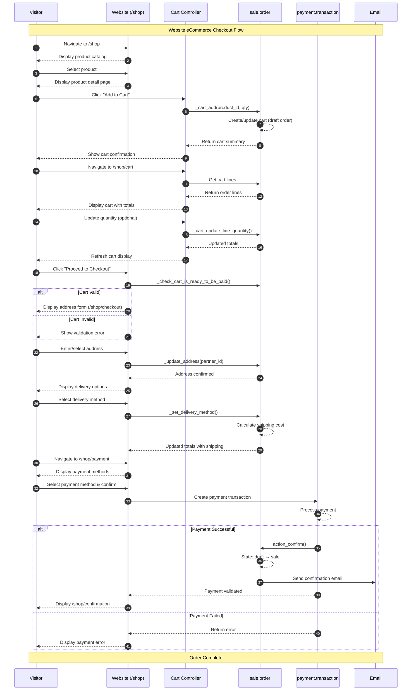
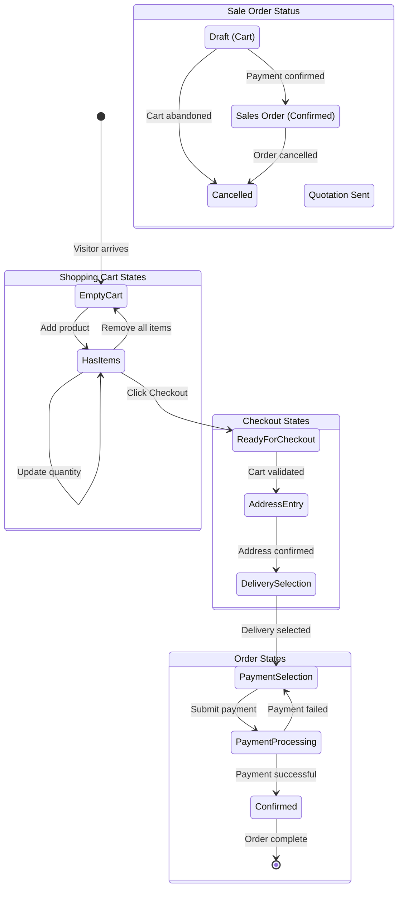

# User Flow 13: Website eCommerce Checkout

## Overview

### Business Objective

The Website eCommerce Checkout flow enables customers to complete online purchases through Odoo's self-service web storefront. This workflow allows visitors to browse products, add items to their shopping cart, enter shipping and billing information, select a payment method, and complete their purchase—all without requiring assistance from sales staff.

### Target Personas

| Persona | Description | Typical Actions |
|---------|-------------|-----------------|
| **Online Customer (Guest)** | A website visitor making a purchase without creating an account | Browse products, add to cart, checkout as guest |
| **Registered Customer** | A returning customer with a portal account | Log in, use saved addresses, view order history |
| **eCommerce Manager** | Administrator who configures the online store | Manage products, payment methods, shipping options |
| **Customer Support Agent** | Support staff assisting customers with online orders | Review orders, troubleshoot checkout issues |

### Business Value

- **Revenue Generation:** Primary channel for online sales without sales staff involvement
- **24/7 Availability:** Customers can purchase at any time without business hour constraints
- **Reduced Sales Costs:** Self-service reduces manual order entry and processing time
- **Customer Convenience:** Streamlined checkout with saved addresses and multiple payment options
- **Global Reach:** Multi-currency and multi-language support for international customers

---

## Prerequisites

### Required Modules

| Module | Technical Name | Purpose |
|--------|----------------|---------|
| Website | `website` | Core website functionality and routing |
| eCommerce | `website_sale` | Product catalog, cart, and checkout features |
| Sales | `sale` | Sales order creation and management |
| Payment | `payment` | Payment provider integration |
| Delivery *(optional)* | `delivery` | Shipping method configuration |

*Source: `addons/website_sale/__manifest__.py`*

### User Permissions

| User Type | Access Level | Capabilities |
|-----------|--------------|--------------|
| Public User | View Products | Browse catalog, add to cart |
| Portal User | Full Checkout | Complete purchases, view order history |
| Internal User | Administration | Manage orders, products, and settings |

**Note:** Guest checkout creates a temporary cart linked to the browser session. Converting to a confirmed order requires at least an email address.

### Data Setup Requirements

Before customers can complete checkout, the following must be configured:

1. **Products Published on Website:**
   - Products must have "Is Published" enabled
   - Products must have valid prices configured
   - Product images and descriptions should be complete

2. **Payment Providers Configured:**
   - At least one payment provider must be active (e.g., Wire Transfer, Credit Card)
   - Payment providers must be enabled for the website

3. **Delivery Methods *(for physical products)*:**
   - Shipping carriers must be configured
   - Delivery pricing rules must be set
   - Delivery destinations must be defined

4. **Website Settings:**
   - Customer account policy configured (B2C/B2B)
   - Default pricelist assigned
   - Currency and taxes configured

---

## Workflow Diagram

### Sequence Diagram

The following diagram illustrates the complete checkout flow from browsing to order confirmation:

*Source: `addons/website_sale/controllers/main.py`, `addons/website_sale/controllers/cart.py`, `addons/website_sale/controllers/payment.py`*

### State Machine Diagram

The checkout process involves multiple state transitions:

**Cart States Explained:**

| State | Description | User Action to Progress |
|-------|-------------|------------------------|
| Empty Cart | No items in cart | Add a product |
| Has Items | Products added to cart | Click "Proceed to Checkout" |
| Ready for Checkout | Cart validated | Enter shipping address |
| Address Entry | Entering billing/shipping info | Confirm address |
| Delivery Selection | Choosing shipping method | Select carrier |
| Payment Selection | Choosing payment method | Submit payment |
| Confirmed | Payment successful | Order complete |

*Source: `addons/website_sale/models/sale_order.py`*

---

## Step-by-Step Guide

### Step 1: Browse Products on the Shop

**What You Want to Accomplish:** Find and explore products available for purchase on the website.

**Actions:**

1. **Navigate to the shop** by clicking "Shop" in the website navigation or going to `/shop`
   - The system displays the product catalog in a grid or list view

2. **Browse product categories** using the sidebar filters
   - Categories are displayed hierarchically
   - Click a category to filter products

3. **Use search and filters** to find specific products
   - Enter keywords in the search box
   - Filter by price range, attributes, or tags
   - Sort by price, name, or newest first

4. **View product details** by clicking on a product card
   - See full description, images, and specifications
   - View available variants (size, color, etc.)
   - Check stock availability

**What the User Sees:**

The shop page displays:
- **Product grid** with thumbnail images, names, and prices
- **Category sidebar** for filtering by product category
- **Search bar** at the top for keyword search
- **Sort dropdown** to change display order (Price: Low to High, etc.)
- **Filter options** for attributes like color, size, brand
- **Price display** showing the configured currency
- **"Add to Cart"** button on each product card (or on product detail page)

**Important:** Only products marked as "Published" and belonging to the website's allowed categories appear in the shop.

**Screenshot Reference:** `screenshots/13-01-browse-products.png`

---

### Step 2: Add Products to Cart

**What You Want to Accomplish:** Select desired products and quantities to add to your shopping cart.

**Actions:**

1. **Click on a product** to open its detail page
   - View the full product description and images
   - See available options and variants

2. **Select product variants** if applicable
   - Choose size, color, or other configurable options
   - Each combination may have different prices or stock levels

3. **Enter the quantity** you wish to purchase
   - Use the quantity selector (+/- buttons or type directly)
   - The system validates against available stock

4. **Click "Add to Cart"** button
   - The system calls `/shop/cart/add` with the product details
   - A cart confirmation appears (popup or sidebar)
   - The cart icon in the header updates with the item count

**What the User Sees:**

After clicking "Add to Cart":
- A **confirmation popup** or **cart sidebar** appears showing:
  - Product name and image
  - Selected variants
  - Quantity added
  - Subtotal for that item
- The **cart icon** in the header shows the updated item count
- **"Continue Shopping"** and **"View Cart"** buttons are available
- If the product has **suggested accessories**, they may be shown for cross-selling

**Alternative - Quick Add:**
- Some product listings show an "Add to Cart" button directly
- Clicking this adds one unit without going to the product page

**Technical Note:** The cart is stored as a draft `sale.order` record linked to the user's session or portal account.

*Source: `addons/website_sale/controllers/cart.py:107-180` - `add_to_cart` method*

**Screenshot Reference:** `screenshots/13-02-add-to-cart.png`

---

### Step 3: View and Manage Shopping Cart

**What You Want to Accomplish:** Review your selected items, update quantities, and prepare for checkout.

**Actions:**

1. **Navigate to the cart** by clicking the cart icon or going to `/shop/cart`
   - The system displays all items currently in your cart

2. **Review your items:**
   - Product name, image, and selected variants
   - Unit price and quantity
   - Line subtotal for each product
   - Order totals at the bottom

3. **Update quantities** if needed
   - Use the quantity input field to change amounts
   - Click the update button or the changes auto-save
   - The totals recalculate automatically

4. **Remove items** you no longer want
   - Click the trash/remove icon next to an item
   - Or set the quantity to zero

5. **Apply a promo code** if available
   - Enter the code in the promotional code field
   - Click "Apply" to see the discount reflected

**What the User Sees:**

The cart page displays:
- **Product list table** with columns:
  - Product image and name
  - Unit price
  - Quantity input field
  - Line total
  - Remove button
- **Order summary section:**
  - *Subtotal*: Sum of all line totals
  - *Shipping*: Displays "Calculated at checkout" or selected method
  - *Taxes*: Applicable tax amounts
  - *Total*: Final amount to pay
- **Promo code field** for discount codes
- **"Continue Shopping"** link to return to the shop
- **"Proceed to Checkout"** button (primary action)

**Empty Cart State:**
If the cart is empty, the user sees:
- Message: "Your cart is empty"
- Link to browse products

*Source: `addons/website_sale/controllers/cart.py:42-105` - `cart` route*

**Screenshot Reference:** `screenshots/13-03-view-cart.png`

---

### Step 4: Enter Shipping and Billing Address

**What You Want to Accomplish:** Provide delivery and billing information required to fulfill your order.

**Actions:**

1. **Click "Proceed to Checkout"** from the cart page
   - The system validates the cart is ready for checkout
   - You're redirected to `/shop/checkout` or `/shop/address`

2. **For Guest Users:**
   - Enter your email address (required)
   - Fill in the billing address form:
     - Full name
     - Street address
     - City, State/Province, ZIP/Postal code
     - Country
     - Phone number (optional or required based on settings)

3. **For Logged-in Portal Users:**
   - Select from saved addresses (if any exist)
   - Or enter a new address

4. **Specify shipping address** (if different from billing)
   - Check "Ship to a different address" option
   - Fill in the shipping address form
   - Or select from saved shipping addresses

5. **Review and confirm** the address information
   - Click "Continue" or "Next" to proceed
   - The system validates all required fields

**What the User Sees:**

The checkout address page displays:
- **Email field** (for guests) prominently at the top
- **Billing address form** with fields:
  - Name, Street, City, State, ZIP, Country
  - Phone number
  - Company name (for B2B)
- **"Ship to different address" checkbox**
  - When checked, shows a separate shipping address form
- **Saved addresses dropdown** (for logged-in users)
  - "Use this address" button for each saved option
  - "Add new address" option
- **"Continue" button** to proceed to delivery/payment
- **Order summary sidebar** showing cart contents and totals

**Validation Messages:**
If required fields are missing, the system shows:
- Field-level error messages in red
- A summary message listing all issues

*Source: `addons/website_sale/controllers/main.py:990-1110` - `shop_checkout` and `shop_address` routes*

**Screenshot Reference:** `screenshots/13-04-checkout-address.png`

---

### Step 5: Select Delivery Method and Payment

**What You Want to Accomplish:** Choose how you want the order shipped and how you will pay.

**Actions:**

1. **Select a delivery method** (for physical products)
   - View available shipping options with prices
   - Each option shows:
     - Carrier name (e.g., "Standard Shipping", "Express Delivery")
     - Estimated delivery time
     - Shipping cost
   - Click to select your preferred option
   - The order total updates to include shipping

2. **Review the updated order total**
   - Subtotal: Product prices
   - Shipping: Selected delivery cost
   - Taxes: Calculated taxes
   - Total: Final amount to pay

3. **Select a payment method**
   - Available options depend on configured payment providers
   - Common options include:
     - Credit/Debit Card
     - PayPal
     - Bank Transfer (Wire Transfer)
     - Cash on Delivery (if enabled)

4. **Enter payment details** (for card payments)
   - Card number, expiration date, CVV
   - Payment forms are typically handled by the payment provider's secure form

5. **Click "Pay Now"** or **"Confirm Order"**
   - The system processes the payment
   - You're redirected based on the result

**What the User Sees:**

The payment page (`/shop/payment`) displays:
- **Delivery methods section** (if physical products):
  - Radio buttons or cards for each shipping option
  - Price displayed next to each option
  - Selected option is highlighted
- **Order summary** with final totals including shipping
- **Payment methods section**:
  - Available payment provider logos/options
  - Secure payment form fields (for card payments)
  - Terms and conditions checkbox (if required)
- **"Pay Now"** button (primary action)
- **"Back" link** to return to address/cart

**For Service-Only Orders:**
If the cart contains only services (no physical delivery):
- The delivery selection step is skipped
- Shipping cost is zero

*Source: `addons/website_sale/controllers/main.py:1563-1618` - `shop_payment` route*

**Screenshot Reference:** `screenshots/13-05-payment-method.png`

---

### Step 6: Receive Order Confirmation

**What You Want to Accomplish:** Complete the purchase and receive confirmation that your order has been placed.

**Actions:**

1. **Complete payment processing**
   - The payment provider processes your transaction
   - This may involve:
     - 3D Secure verification (for cards)
     - Redirect to payment provider site
     - Instant validation

2. **View the order confirmation page**
   - After successful payment, you're redirected to `/shop/confirmation`
   - The order reference number is displayed

3. **Receive confirmation email**
   - The system automatically sends an order confirmation email
   - The email includes:
     - Order reference number
     - Ordered items summary
     - Delivery address
     - Expected delivery information
     - Total amount paid

4. **Access your order** (for portal users)
   - Click "View Order" to see full details
   - The order appears in "My Account" → "My Orders"

**What the User Sees:**

The confirmation page displays:
- **"Thank you for your order!"** heading
- **Order reference number** (e.g., "S00001")
- **Order summary table:**
  - Products purchased
  - Quantities and prices
  - Shipping method and cost
  - Total paid
- **Delivery information:**
  - Shipping address
  - Estimated delivery date (if available)
- **Billing information:**
  - Billing address
  - Payment method used
- **Next steps:**
  - "Continue Shopping" button
  - "View Order" link (for logged-in users)
  - Print/Download receipt option
- **Contact information** for customer support

**Email Confirmation Contains:**
- Order reference and date
- Itemized list of products
- Shipping and billing addresses
- Payment summary
- Links to track order (if tracking enabled)

*Source: `addons/website_sale/controllers/main.py:1659-1685` - `shop_payment_confirmation` route*

**Screenshot Reference:** `screenshots/13-06-order-confirmed.png`

---

## Variations and Edge Cases

### Guest Checkout (Anonymous Cart)

**Scenario:** A visitor completes a purchase without logging in or creating an account.

**How It Works:**
1. The cart is stored in the session and linked to an anonymous partner
2. At checkout, the guest enters their email address
3. The system creates a minimal partner record with the provided information
4. The order is processed normally
5. After completion, the guest can:
   - Create an account to track the order
   - Continue as guest (order confirmation sent by email)

**Technical Note:** The `_is_anonymous_cart` method identifies carts without a logged-in user.

*Source: `addons/website_sale/models/sale_order.py:230-240`*

---

### Returning Customer with Saved Addresses

**Scenario:** A logged-in customer uses previously saved shipping/billing addresses.

**How It Works:**
1. At checkout, saved addresses appear in a dropdown/list
2. The customer clicks "Use this address" to select
3. The address is linked to the order without re-entry
4. The customer can also add a new address which is saved for future orders

**User Benefit:** Faster checkout for repeat customers.

---

### Cart Abandonment and Recovery

**Scenario:** A customer adds items to cart but doesn't complete the purchase.

**How It Works:**
1. The system tracks abandoned carts (orders that remain in draft state)
2. If configured, an automated email can be sent to remind the customer
3. The `is_abandoned_cart` computed field identifies eligible orders
4. The `cart_recovery_email_sent` flag prevents duplicate emails

**Abandonment Criteria:**
- Order is in draft state
- Order has at least one product line
- A configured time has passed since last activity
- Customer has provided an email address

*Source: `addons/website_sale/models/sale_order.py:75-90` - `is_abandoned_cart` field*

---

### Express Checkout

**Scenario:** A customer uses a streamlined checkout process (e.g., Apple Pay, Google Pay).

**How It Works:**
1. Express checkout providers offer one-click payment with pre-filled information
2. The `process_express_checkout` method handles address auto-fill
3. Customer's address is extracted from the payment provider
4. The system creates/updates the partner and order in one step

**User Benefit:** Complete checkout in seconds without manual data entry.

*Source: `addons/website_sale/controllers/main.py:1355-1415` - `process_express_checkout` method*

---

### Services Only Orders (No Delivery Required)

**Scenario:** A customer purchases only service products (no physical delivery).

**How It Works:**
1. The cart contains only service-type products
2. The delivery selection step is skipped
3. Shipping cost is zero
4. No delivery order is created after confirmation
5. Only an invoice is generated

**Identification:** Service products have `type = 'service'` in their product configuration.

---

### Multi-Currency Checkout

**Scenario:** A customer views prices and pays in a different currency.

**How It Works:**
1. The website pricelist determines the displayed currency
2. Prices are calculated based on the pricelist rules
3. The cart and order use the pricelist currency
4. Payment is processed in the order's currency
5. Multi-currency payment providers handle conversion

**Configuration:** Set up pricelists with different currencies and assign to the website or customer segments.

---

### Minimum Order Amount

**Scenario:** The store requires a minimum purchase amount.

**How It Works:**
1. Website settings define the minimum order amount
2. The checkout button is disabled if cart total is below minimum
3. A message displays: "Minimum order amount is [X]"
4. The customer must add more items to proceed

*Source: `addons/website_sale/models/sale_order.py:870-880` - `_is_cart_ready` method*

---

## Integration Points

### Integration with Payment Module

**When Active:** Always required for online checkout.

**Automatic Behavior:**
- Available payment providers are displayed at `/shop/payment`
- A `payment.transaction` is created when the customer submits payment
- The transaction state drives the order confirmation
- Successful payment triggers `action_confirm()` on the sale order

**Key Routes:**
- `/shop/payment/transaction/<order_id>`: Creates the payment transaction

**User Impact:**
- The customer sees configured payment options
- Payment processing happens through the provider's secure flow
- Order confirmation depends on successful payment validation

*Source: `addons/website_sale/controllers/payment.py:25-100`*

---

### Integration with Delivery Module

**When Active:** When the `delivery` module is installed and configured.

**Automatic Behavior:**
- Available delivery methods are shown at checkout
- Shipping costs are calculated based on:
  - Delivery address
  - Product weights and dimensions
  - Carrier pricing rules
- The selected delivery method is stored on the order

**Key Methods:**
- `_get_delivery_methods()`: Returns available shipping options
- `_set_delivery_method()`: Applies selected carrier to order
- `_update_delivery_line()`: Updates shipping line when method changes

**User Impact:**
- The customer chooses from available shipping options
- Shipping costs display in the order total
- Delivery information appears on the confirmation

*Source: `addons/website_sale/models/sale_order.py:790-860`*

---

### Integration with Sales Module

**When Active:** Core dependency for all eCommerce orders.

**Automatic Behavior:**
- The shopping cart is a draft `sale.order` record
- Order confirmation converts the cart to a confirmed sales order
- Standard sales workflows apply after confirmation
- Invoicing follows the configured policy

**User Impact:**
- Orders appear in the Sales module for processing
- Sales staff can view and manage website orders
- Standard reporting includes eCommerce sales

---

### Integration with Inventory Module

**When Active:** When the `stock` module is installed.

**Automatic Behavior:**
- Confirmed orders generate delivery orders (`stock.picking`)
- Stock availability affects product display
- Reservations are made at order confirmation

**User Impact:**
- Customers see stock availability on product pages
- Orders trigger warehouse operations
- Tracking information can be provided to customers

---

### Integration with Accounting Module

**When Active:** When the `account` module is installed.

**Automatic Behavior:**
- Confirmed orders can generate invoices automatically
- Payment transactions are reconciled with invoices
- Revenue is properly recorded

**User Impact:**
- Customers receive invoices via email or portal
- Accounting staff see website sales in reports

---

## Error Scenarios

### Product Out of Stock

**Error Message:** "The product [Product Name] is out of stock."

**When It Occurs:** The customer tries to add a product with zero available quantity, or during checkout validation if stock was depleted.

**What the User Sees:**
- On product page: "Out of Stock" label replaces "Add to Cart"
- During checkout: Warning message about unavailable items
- The customer cannot proceed until the item is removed or restocked

**How to Resolve:**
1. Remove the out-of-stock item from the cart
2. Choose an alternative product
3. Wait for restock (if backorders not allowed)

---

### Payment Declined

**Error Message:** "Your payment was declined. Please try again or use a different payment method."

**When It Occurs:** The payment provider rejects the transaction (insufficient funds, card expired, fraud detection, etc.).

**What the User Sees:**
- Error message on the payment page
- The order remains in draft state
- Cart contents are preserved

**How to Resolve:**
1. Verify payment details are correct
2. Try a different payment method
3. Contact the bank if the issue persists
4. Contact customer support for assistance

---

### Invalid Address

**Error Message:** "Please fill in all required address fields."

**When It Occurs:** The customer submits the checkout form with missing or invalid information.

**What the User Sees:**
- Field-level validation errors (red borders and messages)
- Cannot proceed to next step
- Summary of issues at top of form

**How to Resolve:**
1. Fill in all required fields
2. Verify address format matches expected pattern
3. Select a valid country/state combination

---

### Cart Modified During Checkout

**Error Message:** "Your cart has been modified. Please review your order."

**When It Occurs:** Product availability or pricing changed while the customer was completing checkout.

**What the User Sees:**
- Redirect back to cart page
- Message explaining what changed
- Updated prices or quantities displayed

**How to Resolve:**
1. Review the updated cart
2. Accept the changes and proceed
3. Or modify the cart as needed

*Source: `addons/website_sale/models/sale_order.py:655-700` - `_verify_cart_after_update` method*

---

### Session Timeout

**Error Message:** "Your session has expired. Please refresh the page."

**When It Occurs:** The customer's browser session expires during checkout (typically after extended inactivity).

**What the User Sees:**
- Error message or redirect to login page
- For guests: Cart may need to be rebuilt
- For logged-in users: Cart is preserved in their account

**How to Resolve:**
1. Refresh the page
2. Log in again (if applicable)
3. Cart contents should be restored for logged-in users

---

### Promo Code Invalid

**Error Message:** "The promo code [CODE] is not valid."

**When It Occurs:** The customer enters a promotional code that doesn't exist, is expired, or doesn't apply to the cart contents.

**What the User Sees:**
- Error message in the promo code field
- Discount not applied
- Order total remains unchanged

**How to Resolve:**
1. Verify the code is entered correctly
2. Check code expiration date
3. Review code conditions (minimum purchase, specific products)
4. Contact support if the code should be valid

---

### Delivery Not Available

**Error Message:** "No delivery methods available for your address."

**When It Occurs:** The customer's delivery address is outside the configured shipping zones.

**What the User Sees:**
- No delivery options displayed
- Cannot proceed to payment
- Message explaining the issue

**How to Resolve:**
1. Verify the address is correct
2. Try a different delivery address
3. Contact support for special arrangements

---

## What the User Sees: UI State Reference

### Shop Page (Product Catalog)

| UI Element | Appearance |
|------------|------------|
| Page Header | Website navigation with Shop link active |
| Search Bar | Prominent search input at top |
| Category Sidebar | Hierarchical category tree |
| Product Grid | Responsive grid of product cards |
| Product Cards | Image, name, price, "Add to Cart" button |
| Filters | Price range, attributes, tags |
| Sort Dropdown | Options: Relevance, Price, Name, Newest |
| Pagination | Page numbers or "Load More" button |

### Product Detail Page

| UI Element | Appearance |
|------------|------------|
| Product Images | Main image with thumbnail gallery |
| Product Name | Large heading at top |
| Price | Prominent price display with currency |
| Variants | Dropdown or button selectors |
| Quantity | Input field with +/- buttons |
| Add to Cart | Primary action button (highlighted) |
| Description | Detailed product information |
| Specifications | Technical details table |
| Reviews | Customer reviews section (if enabled) |

### Shopping Cart Page

| UI Element | Appearance |
|------------|------------|
| Cart Header | "Shopping Cart" with item count |
| Cart Table | Rows for each product line |
| Product Column | Image, name, variant details |
| Price Column | Unit price |
| Quantity Column | Editable input field |
| Total Column | Line subtotal |
| Remove Button | Trash icon per line |
| Promo Code | Input field with "Apply" button |
| Order Summary | Subtotal, Shipping, Taxes, Total |
| Continue Shopping | Secondary link |
| Proceed to Checkout | Primary action button |

### Checkout Address Page

| UI Element | Appearance |
|------------|------------|
| Progress Steps | Visual indicator: Address → Delivery → Payment |
| Email Field | Input for guest email (required) |
| Billing Address | Form with name, street, city, country fields |
| Shipping Toggle | Checkbox: "Ship to different address" |
| Shipping Address | Form appears when toggle is checked |
| Saved Addresses | Dropdown/cards for logged-in users |
| Order Summary | Sidebar showing cart contents |
| Continue Button | Primary action to proceed |

### Payment Page

| UI Element | Appearance |
|------------|------------|
| Progress Steps | Payment step highlighted |
| Delivery Methods | Radio buttons or cards with prices |
| Order Summary | Complete breakdown with shipping |
| Payment Methods | Payment provider options |
| Card Form | Secure input fields (if applicable) |
| Terms Checkbox | Required acceptance |
| Pay Now Button | Primary action button |
| Total Display | Final amount prominently shown |

### Order Confirmation Page

| UI Element | Appearance |
|------------|------------|
| Success Message | "Thank you for your order!" |
| Order Number | Reference prominently displayed |
| Order Details | Complete order summary |
| Delivery Info | Address and estimated delivery |
| Payment Info | Method and amount confirmed |
| Continue Shopping | Link to return to shop |
| View Order | Link to order details (portal) |
| Support Info | Contact information |

---

## Business Rules Reference

For detailed information about validation logic, computation rules, and access control for this workflow, see:

**[eCommerce Checkout Business Rules](../../04-business-rules/ecommerce-checkout-rules.md)**

### Key Validation Rules (Summary)

| Rule | Description | Source |
|------|-------------|--------|
| Cart must have products | Cannot checkout with empty cart | `_check_cart_is_ready_to_be_paid()` |
| Valid email required | Guest checkout requires email address | Address form validation |
| Address required | Billing address mandatory; shipping if different | `_check_addresses()` |
| Payment method required | Must select a payment option | Payment form validation |
| Delivery required | Physical products require delivery selection | `_set_delivery_method()` |
| Stock availability | Products must be available (if stock tracking) | `_verify_cart_after_update()` |
| Minimum order | Cart total must meet minimum (if configured) | `_is_cart_ready()` |

### Key Computation Rules (Summary)

| Computation | Description | Source |
|-------------|-------------|--------|
| Cart totals | Sum of line amounts plus taxes | `sale.order` amount fields |
| Shipping cost | Based on delivery method and address | `_set_delivery_method()` |
| Tax calculation | Based on fiscal position and product taxes | Standard tax computation |
| Discounts | Applied from pricelist rules or promo codes | Pricelist integration |
| Currency conversion | Based on website pricelist currency | Pricelist currency settings |

---

## Key Technical References

### Controller Routes

| Route | Controller | Purpose |
|-------|------------|---------|
| `/shop` | `main.py:shop()` | Product catalog display |
| `/shop/product/<slug>` | `main.py:shop_product()` | Product detail page |
| `/shop/cart` | `cart.py:cart()` | Shopping cart display |
| `/shop/cart/add` | `cart.py:add_to_cart()` | Add product to cart (JSON-RPC) |
| `/shop/cart/update` | `cart.py:update_cart()` | Update cart quantities |
| `/shop/checkout` | `main.py:shop_checkout()` | Checkout address page |
| `/shop/address` | `main.py:shop_address()` | Address management |
| `/shop/payment` | `main.py:shop_payment()` | Payment method selection |
| `/shop/payment/transaction/<id>` | `payment.py:shop_payment_transaction()` | Create payment transaction |
| `/shop/payment/validate` | `main.py:shop_payment_validate()` | Validate payment |
| `/shop/confirmation` | `main.py:shop_payment_confirmation()` | Order confirmation page |

### Key Model Methods

| Method | Model | Purpose |
|--------|-------|---------|
| `_cart_add()` | `sale.order` | Add product to cart |
| `_cart_update_line_quantity()` | `sale.order` | Update cart line quantity |
| `_is_anonymous_cart()` | `sale.order` | Check if guest cart |
| `_get_delivery_methods()` | `sale.order` | Get available shipping options |
| `_set_delivery_method()` | `sale.order` | Apply delivery method to order |
| `_check_cart_is_ready_to_be_paid()` | `sale.order` | Validate cart for checkout |
| `_verify_cart_after_update()` | `sale.order` | Check for price/stock changes |
| `action_confirm()` | `sale.order` | Confirm the sales order |

*Source: `addons/website_sale/models/sale_order.py`, `addons/website_sale/controllers/main.py`, `addons/website_sale/controllers/cart.py`*
