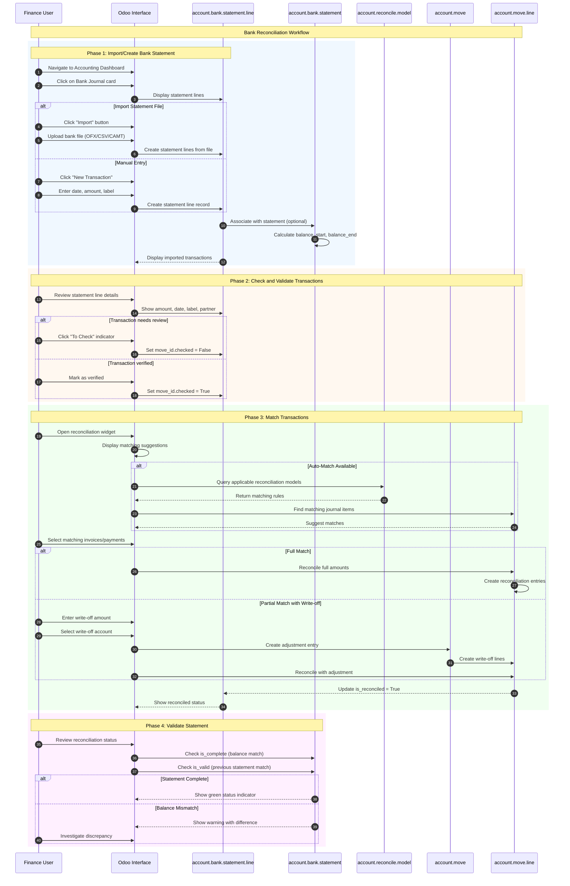
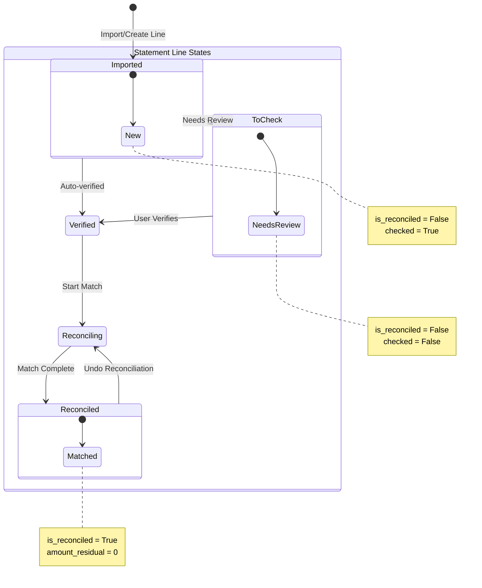
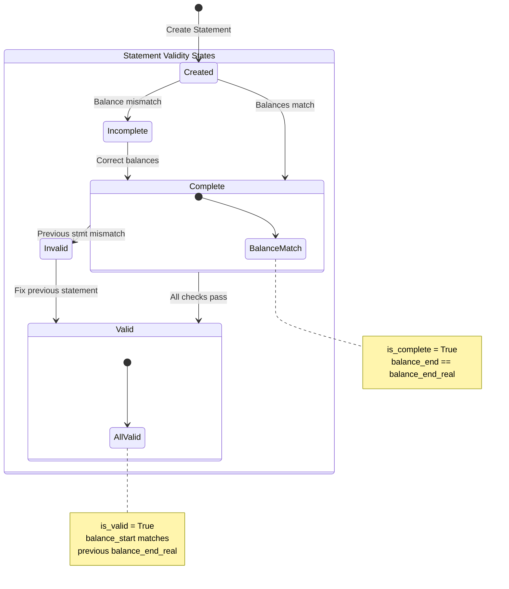

# Bank Reconciliation Workflow

## Overview

### Business Objective

The Bank Reconciliation workflow is a **critical financial accuracy process** in Odoo. It enables your finance team to verify that the transactions recorded in your accounting system accurately match the transactions shown on your bank statements, ensuring complete financial integrity and accurate cash position reporting.

**What This Workflow Accomplishes:**
- Imports or creates bank statements from external bank sources
- Matches bank transactions with recorded invoices, bills, and payments
- Identifies discrepancies between bank records and accounting entries
- Creates adjusting entries for bank fees, interest, and unrecorded transactions
- Provides audit trail for financial compliance

### Target Personas

| Role | Responsibilities | Typical Actions |
|------|------------------|-----------------|
| **Accountant** | Process daily/weekly bank reconciliations | Imports statements, matches transactions, resolves differences |
| **Finance Manager** | Oversee reconciliation accuracy and completeness | Reviews unreconciled items, approves write-offs, monitors cash position |
| **Controller** | Ensure financial statement accuracy | Validates reconciliation status, reviews exceptions, authorizes adjustments |
| **Bookkeeper** | Handle routine transaction matching | Processes standard matches, applies reconciliation models |

### Business Value

This workflow is critical because:
- **Cash Position Accuracy**: Ensures your recorded bank balance matches actual bank balance
- **Fraud Detection**: Identifies unauthorized transactions or errors early
- **Audit Compliance**: Provides documentation trail for financial audits
- **Error Correction**: Catches data entry mistakes before they compound
- **Financial Reporting**: Guarantees accurate financial statements

---

## Prerequisites

### Required Modules

Before using this workflow, ensure the following modules are installed:

| Module | Technical Name | Purpose |
|--------|----------------|---------|
| **Invoicing** | `account` | Core accounting and bank journal management |
| **Contacts** | `contacts` | Customer and vendor database for partner matching |

**Optional modules that enhance this workflow:**
- **Sales** (`sale`): Enables matching with customer invoices
- **Purchase** (`purchase`): Enables matching with vendor bills
- **Bank Synchronization** (Enterprise): Automatic statement import from banks

### Required User Permissions

The user must belong to one of these security groups:

| Group | Access Level | Can Perform |
|-------|--------------|-------------|
| *Invoicing / Billing* | Basic | View statements, process basic reconciliation |
| *Invoicing / Accountant* | Standard | Full reconciliation access, create adjustments |
| *Invoicing / Billing Manager* | Full | All operations including reconciliation models |

To check your permissions: Navigate to *Settings → Users & Companies → Users → [Your User] → Access Rights*.

### Required Data Setup

Before performing bank reconciliation, ensure the following are configured:

1. **Bank Journal** created and configured
   - Navigate to *Invoicing → Configuration → Journals*
   - Create a journal with Type = "Bank"
   - Set the bank account number and default accounts

2. **Chart of Accounts** established with:
   - Bank account (asset account)
   - Suspense account (for unreconciled items)
   - Bank fees account (expense)
   - Interest income/expense accounts

3. **Bank Feeds** configured (optional)
   - Online synchronization setup, OR
   - Import file format known (OFX, QIF, CSV, CAMT)

4. **Reconciliation Models** created (optional)
   - Predefined rules for common transactions (bank fees, transfers)

---

## Workflow Diagram

### Sequence Diagram

The following diagram shows the complete interaction flow from statement import through reconciliation completion:



### State Machine Diagram

Bank statement lines and statements progress through the following states:





**Statement Line Flag Definitions:**

| Flag | Field | Description |
|------|-------|-------------|
| `is_reconciled` | Boolean | True when statement line is fully matched to journal entries |
| `amount_residual` | Float | Remaining amount left to reconcile (0 when fully reconciled) |
| `checked` | Boolean | True when transaction has been verified (not flagged for review) |

**Statement Validity Definitions:**

| Flag | Field | Description |
|------|-------|-------------|
| `is_complete` | Boolean | True when sum of lines equals difference between start and end balance |
| `is_valid` | Boolean | True when starting balance matches previous statement's ending balance |

*Source: `addons/account/models/account_bank_statement.py:82-95`, `addons/account/models/account_bank_statement_line.py:104-133`*

---

## Step-by-Step Guide

### Step 1: Navigate to the Bank Journal

**What You Want to Accomplish:** Access the bank reconciliation interface for your bank account.

**Navigation Path:** *Invoicing → Dashboard* (or *Accounting → Dashboard*)

**Actions:**

1. **Locate your bank journal card** on the accounting dashboard
   - Bank journals display with a bank icon
   - The card shows:
     - Current **bank balance** (recorded in Odoo)
     - **Number to reconcile** count (transactions needing attention)
     - **Last statement balance** (if statements are used)

2. **Click on the journal card** or the **"Reconcile"** link
   - This opens the bank reconciliation interface
   - The default view shows unreconciled transactions

3. **Review the dashboard indicators:**
   - "To Check" count: Transactions flagged for review
   - "To Reconcile" count: Verified but unmatched transactions

**What the User Sees:**

The dashboard displays:
- Bank journal card with current balance
- **Number to Reconcile** badge showing pending items
- Outstanding payments/receipts amounts
- Last statement information (if applicable)

**Screenshot Reference:** `screenshots/14-01-accounting-dashboard.png`

---

### Step 2: Import Bank Statement

**What You Want to Accomplish:** Load bank transactions from your financial institution into Odoo.

**Actions:**

**Option A: File Import**

1. **Click the "Import" button** (upload icon) on the bank journal
   - Or navigate to the bank transactions view and click "Import"

2. **Select your bank statement file**
   - Supported formats: OFX, QIF, CSV, MT940, CAMT.053
   - The file should contain transaction date, amount, and description

3. **Map columns** (for CSV files)
   - Date column → Transaction Date
   - Amount column → Transaction Amount
   - Description column → Label/Reference

4. **Click "Import"** to process the file
   - Transactions are created as statement lines
   - System attempts to identify partners from descriptions

**Option B: Manual Entry**

1. **Click "New Transaction"** button
   - A new line appears in the transaction list

2. **Enter the transaction details:**
   - **Date**: Transaction date from bank
   - **Amount**: Positive for deposits, negative for withdrawals
   - **Label**: Bank's transaction description
   - **Partner** (optional): Customer or vendor if known

3. **Save the transaction**
   - Click away from the line or press Enter

**What the User Sees:**

After import:
- List of bank transactions with:
  - Date, Label, Amount columns
  - Running balance column
  - "Reconciled" status indicator
- Transactions marked with different colors:
  - Regular text: Verified transactions
  - Orange/warning: Transactions "To Check"

**Important:** Imported transactions are automatically posted as journal entries linked to the suspense account until reconciled.

**Screenshot Reference:** `screenshots/14-02-import-statement.png`

---

### Step 3: Review Statement Lines

**What You Want to Accomplish:** Verify transaction details and identify the partner for each transaction.

**Actions:**

1. **Review each imported transaction:**
   - Check the date matches your bank statement
   - Verify the amount is correct
   - Read the label/description for transaction type

2. **Assign partners** to transactions:
   - Click on the Partner field
   - Search for the customer or vendor
   - Select the appropriate partner
   - System remembers this for future similar transactions

3. **Mark transactions for review** (if needed):
   - Click the warning icon to flag suspicious transactions
   - These appear in the "To Check" filter
   - Use this for transactions requiring investigation

4. **View transaction details:**
   - Click on a transaction line to expand details
   - View the linked journal entry
   - Check the suspense account posting

**What the User Sees:**

For each statement line:
- **Date**: When the bank processed the transaction
- **Label**: Bank's description (payee name, reference)
- **Amount**: Transaction amount (positive/negative)
- **Partner**: Assigned customer/vendor (if identified)
- **Running Balance**: Cumulative balance after this transaction
- **Status indicators**:
  - Checkmark: Reconciled
  - Clock/pending: To reconcile
  - Warning: To check

**Screenshot Reference:** `screenshots/14-03-review-statement-lines.png`

---

### Step 4: Match Transactions Using Reconciliation Widget

**What You Want to Accomplish:** Link bank transactions to corresponding invoices, bills, or payments in Odoo.

**Actions:**

1. **Click on an unreconciled transaction**
   - The reconciliation widget opens
   - System displays matching suggestions

2. **Review suggested matches:**
   - Odoo automatically suggests matching journal items:
     - Open invoices with similar amounts
     - Outstanding payments
     - Customer/vendor account entries
   - Matches are scored by relevance

3. **Select the correct match:**
   - Click on a suggested item to select it
   - Multiple items can be selected for split matches
   - Selected items show a blue highlight

4. **Verify the match:**
   - Compare amounts: Transaction amount vs. selected items
   - Check partner consistency
   - Review any difference amount

5. **Complete the reconciliation:**
   - If amounts match exactly: Click **"Validate"**
   - If amounts differ: See "Handling Differences" below

**What the User Sees:**

The reconciliation widget shows:
- **Left panel**: Current bank transaction details
- **Right panel**: Suggested matches with:
  - Document reference (INV/0001, BILL/0001)
  - Partner name
  - Amount
  - Due date
- **Bottom section**: 
  - Total amount to reconcile
  - Remaining difference (should be 0 for exact match)
  - "Validate" button

**Screenshot Reference:** `screenshots/14-04-match-transactions.png`

---

### Step 5: Apply Reconciliation Models for Automated Matching

**What You Want to Accomplish:** Use predefined rules to automatically categorize recurring transactions like bank fees or transfers.

**Navigation Path:** To configure models: *Invoicing → Configuration → Reconciliation Models*

**Actions:**

1. **Review existing reconciliation models:**
   - Navigate to Configuration → Reconciliation Models
   - View the list of predefined rules

2. **Create a new reconciliation model** (if needed):
   - Click "New"
   - **Name**: Descriptive title (e.g., "Bank Service Fee")
   - **Trigger**: Select automation level:
     - "Manual": User must click to apply
     - "Automated": Applied automatically when conditions match

3. **Configure matching conditions:**
   - **Journals**: Limit to specific bank journals
   - **Partners**: Apply only for specific partners
   - **Amount**: Match transactions within amount range
   - **Label**: Match text patterns in transaction description

4. **Define counterpart entries:**
   - Add line items for the reconciliation
   - Specify account (e.g., Bank Fees Expense)
   - Choose amount type:
     - Fixed: Always this amount
     - Percentage: % of transaction
     - From Label: Extract from description using regex

5. **Apply model during reconciliation:**
   - In the reconciliation widget, matching models appear
   - Click the model name to apply it
   - Review and validate the created entry

**What the User Sees:**

Reconciliation models configuration:
- List view showing model name, trigger type, journals
- Form view with:
  - Model name at top
  - Conditions section (journals, amounts, labels)
  - Counterpart items section (accounts, amounts)
  - Status bar showing Manual/Automated

**Example Model: Bank Service Fee**
```
Name: Bank Service Fee
Trigger: Automated
Match Label Contains: "SERVICE CHARGE" or "MONTHLY FEE"
Match Amount: Between 5.00 and 100.00
Counterpart: 100% to 5400 Bank Charges (Expense)
```

*Source: `addons/account/models/account_reconcile_model.py:80-97`*

**Screenshot Reference:** `screenshots/14-05-reconciliation-models.png`

---

### Step 6: Validate Reconciled Items

**What You Want to Accomplish:** Confirm the reconciliation is complete and accurate.

**Actions:**

1. **Review the reconciliation result:**
   - Check that amount_residual = 0
   - Verify the matched documents are correct
   - Confirm the journal entry is properly created

2. **Click "Validate"** to complete the reconciliation:
   - The transaction is marked as reconciled
   - Journal items are linked together
   - The is_reconciled flag is set to True

3. **Handle exceptions:**
   
   **For write-offs (small differences):**
   - Click "Add a line" or use write-off suggestion
   - Select the appropriate account (e.g., Rounding Difference)
   - Enter the difference amount
   - Validate with the adjustment

   **For partial payments:**
   - Select the invoice(s) that match
   - The system shows partial payment status
   - Validate to record partial reconciliation
   - Invoice remains partially paid

4. **Undo reconciliation** (if mistake):
   - Open the reconciled transaction
   - Click "Reset to Reconcile" or similar option
   - The is_reconciled flag resets to False
   - Journal entries are unlinked

**What the User Sees:**

After validation:
- Transaction line shows green checkmark/reconciled indicator
- The "To Reconcile" count decreases
- Statement balance updates (if using statements)
- Linked documents (invoices/bills) show payment status change

**Screenshot Reference:** `screenshots/14-06-validate-reconciliation.png`

---

### Step 7: Review Reconciliation Status on Dashboard

**What You Want to Accomplish:** Verify overall reconciliation completeness and identify remaining items.

**Actions:**

1. **Return to the Accounting Dashboard:**
   - Navigate to *Invoicing → Dashboard*
   - Locate your bank journal card

2. **Review key indicators:**
   - **To Reconcile**: Should show 0 when complete
   - **Bank Balance**: Should match your actual bank balance
   - **Statement Status**: Check for any invalid statements

3. **Investigate remaining items:**
   - Click on "To Reconcile" count to view pending items
   - Filter by date range to focus on specific period
   - Review "To Check" items for flagged transactions

4. **Verify statement validity** (if using statements):
   - Navigate to *Invoicing → Bank → Statements*
   - Check that statements show green indicators
   - Red/orange indicators mean:
     - **Incomplete**: Balance mismatch (is_complete = False)
     - **Invalid**: Previous statement balance mismatch (is_valid = False)

5. **Generate reconciliation reports:**
   - Access reports for audit documentation
   - Export reconciliation status for external review

**What the User Sees:**

Dashboard status after complete reconciliation:
- **To Reconcile: 0** (green or no badge)
- Bank balance matches expected amount
- Statement list shows all items with green status
- No outstanding alerts or warnings

**Screenshot Reference:** `screenshots/14-07-reconciliation-complete.png`

---

## Variations and Edge Cases

### Partial Matching (Multiple Invoices to One Payment)

**Scenario:** A customer pays multiple invoices with a single bank transfer.

**How to Handle:**
1. Select the bank transaction in reconciliation widget
2. Select **all invoices** being paid from the suggestions
3. Verify total of selected invoices matches the payment amount
4. Click "Validate" to reconcile all at once

**What Happens:**
- All selected invoices are partially or fully paid
- A single reconciliation links all items
- Each invoice shows updated payment status

---

### Write-Off Handling for Small Differences

**Scenario:** Bank amount differs slightly from invoice (bank fees, rounding).

**How to Handle:**
1. Select the matching invoice/payment
2. Note the difference amount shown at bottom
3. Click "Add a line" for the write-off
4. Select appropriate account:
   - Bank charges expense (for fees)
   - Exchange difference account (for FX)
   - Rounding difference account (for small amounts)
5. Enter the difference amount
6. Validate the reconciliation

**Tolerance Configuration:**
- Companies can configure automatic write-off thresholds
- Amounts below threshold can be auto-written-off

*Source: Based on reconciliation widget behavior*

---

### Currency Exchange Differences

**Scenario:** Transaction is in foreign currency with exchange rate variation.

**How to Handle:**
1. The system calculates exchange difference automatically
2. Review the suggested exchange rate adjustment
3. Confirm the exchange gain/loss account is correct
4. Validate to record the exchange difference

**What Happens:**
- Exchange difference is posted to designated account
- Foreign currency amounts are properly tracked
- Balance maintains accuracy in base currency

---

### Unreconciled Items Handling

**Scenario:** Bank transaction doesn't match any existing document.

**How to Handle:**

**Option 1: Create a New Entry**
1. In reconciliation widget, click "Manual Entry"
2. Select the appropriate account
3. Enter description and amount
4. Validate to create balancing entry

**Option 2: Mark for Later**
1. Close the reconciliation widget
2. Leave transaction unreconciled
3. Return when matching document exists

**Option 3: Use Reconciliation Model**
1. Apply appropriate model (e.g., "Unknown Credit")
2. Model creates standard entry
3. Follow up to identify source later

---

### Statement Validation Issues

**Scenario:** Statement shows incomplete or invalid status.

**Issue: is_complete = False (Balance Mismatch)**

**Symptoms:**
- Computed balance doesn't match ending balance
- Warning message displayed on statement

**How to Resolve:**
1. Check for missing transactions
2. Verify all amounts are correctly entered
3. Review the balance_start value
4. Check the balance_end_real value matches bank

**Issue: is_valid = False (Previous Statement Mismatch)**

**Symptoms:**
- Starting balance doesn't match previous ending balance
- Error indicates statement sequence issue

**How to Resolve:**
1. Review the previous statement's ending balance
2. Check for transactions between statements
3. Correct the starting balance if needed
4. Ensure statements are in chronological order

*Source: `addons/account/models/account_bank_statement.py:190-217`*

---

### Multi-Currency Bank Account

**Scenario:** Bank journal is configured in a foreign currency.

**How to Handle:**
1. Transactions are recorded in the journal currency
2. Odoo converts to company currency using exchange rate
3. Exchange differences are calculated at reconciliation
4. Foreign currency balances tracked separately

**Important Configuration:**
- Bank journal must have currency set
- Exchange rate journal must exist
- Exchange gain/loss accounts configured

---

## Integration Points

### Integration with Journal Entries (account.move)

**When Active:** Always active as part of core accounting.

**Automatic Behavior:**
- Each bank statement line creates a journal entry
- Entry posts to suspense account until reconciled
- Reconciliation updates the journal entry with proper counterpart

**User Impact:**
- Clicking a statement line shows the journal entry
- Entry details available in the chatter/log
- Audit trail maintained for all changes

---

### Integration with Payment Matching (account.payment)

**When Active:** When payments are registered in Odoo.

**Automatic Behavior:**
- Registered payments appear as reconciliation suggestions
- Customer payments match with customer invoices
- Vendor payments match with vendor bills
- Payment status updates upon reconciliation

**User Impact:**
- Payments created from invoice "Register Payment" appear here
- Bank transfers between accounts show as matches
- Payment reconciliation syncs invoice status

---

### Integration with Invoice Reconciliation (account.move.line)

**When Active:** When invoices exist in the system.

**Automatic Behavior:**
- Open invoices/bills appear as matching suggestions
- Amounts are compared for matching proposals
- Partner and reference fields used for matching score
- Invoice payment status updates when reconciled

**User Impact:**
- Reconciling payment marks invoice as paid
- Partial payments update invoice payment status
- Overpayments create credit balance

---

### Dashboard Statistics (number_to_reconcile)

**When Active:** Always shown on accounting dashboard.

**Automatic Behavior:**
- Counter updates in real-time as reconciliation progresses
- Shows count of statement lines where:
  - is_reconciled = False
  - checked = True (verified)
  - state = 'posted'

**User Impact:**
- Quick visibility of pending reconciliation work
- Click count to jump to unreconciled items
- Track reconciliation progress over time

*Source: `addons/account/models/account_journal_dashboard.py:452-468`*

---

## Error Scenarios

### Import File Format Error

**Error Message:** "Unable to import file. The file format is not recognized."

**When It Occurs:** The uploaded file is corrupted or in an unsupported format.

**What the User Sees:**
- Error popup after clicking Import
- File is rejected

**How to Resolve:**
1. Verify the file format (OFX, QIF, CSV, MT940, CAMT.053)
2. Ensure file isn't corrupted or empty
3. Check for encoding issues (UTF-8 recommended)
4. Try exporting from bank in different format

---

### Amount Mismatch During Reconciliation

**Error Context:** Selected items don't match the bank transaction amount.

**What the User Sees:**
- Difference amount shown in reconciliation widget
- Cannot validate without resolving difference

**How to Resolve:**
1. Add additional matching items
2. Create write-off entry for the difference
3. Verify correct items are selected
4. Check for data entry errors

---

### Statement Balance Inconsistency

**Error Message:** "The running balance doesn't match the specified ending balance."

**When It Occurs:** Statement `is_complete` becomes False.

**What the User Sees:**
- Warning indicator on statement
- problem_description displays the issue

**How to Resolve:**
1. Review all statement line amounts
2. Check balance_start is correct
3. Verify balance_end_real matches bank
4. Look for missing or duplicate transactions

*Source: `addons/account/models/account_bank_statement.py:209-217`*

---

### Cannot Delete Reconciled Transaction

**Error Message:** "You cannot delete a transaction from a valid statement. Please remove the statement first."

**When It Occurs:** Trying to delete a statement line that belongs to a complete, valid statement.

**What the User Sees:**
- Error popup preventing deletion

**How to Resolve:**
1. First undo the reconciliation
2. Remove the line from the statement
3. Then delete if needed
4. Or archive instead of delete

*Source: `addons/account/models/account_bank_statement_line.py:478-482`*

---

## What the User Sees: UI State Reference

### Unreconciled Statement Line

| UI Element | Appearance |
|------------|------------|
| Status Icon | Clock/pending indicator |
| Background | Standard white |
| Running Balance | Displayed in gray |
| Actions Available | Click to reconcile, edit partner |
| Reconciliation Widget | Opens on click |

### To Check Statement Line

| UI Element | Appearance |
|------------|------------|
| Status Icon | Warning/orange indicator |
| Background | Light orange highlight |
| "To Check" Label | Displayed |
| Actions Available | Review, verify, or dismiss |
| Filter | Appears in "To Check" filter |

### Reconciled Statement Line

| UI Element | Appearance |
|------------|------------|
| Status Icon | Green checkmark |
| Background | Light green or standard |
| Matched Items | Reference shown |
| Actions Available | View details, undo reconciliation |
| Reconciliation Widget | Shows matched entries |

### Valid Statement

| UI Element | Appearance |
|------------|------------|
| Status Indicator | Green (both is_complete and is_valid) |
| Balance Display | Start and end balances shown |
| Line Count | Number of lines displayed |
| Problem Description | Empty (no issues) |

### Invalid/Incomplete Statement

| UI Element | Appearance |
|------------|------------|
| Status Indicator | Red/orange warning |
| Problem Description | Text explaining the issue |
| Suggested Action | Link to resolve |
| Balance Difference | Highlighted if applicable |

---

## Business Rules Reference

For detailed information about validation logic, computation rules, matching conditions, and access control for this workflow, see:

**[Bank Reconciliation Business Rules](../../04-business-rules/bank-reconciliation-rules.md)**

This companion document covers:
- Reconciliation model matching conditions
- Statement validity computation rules
- Balance calculation formulas
- Access control requirements
- Audit trail requirements

---

## Related Documentation

- [Capabilities Inventory: Invoicing Module](../../01-capabilities-overview/capabilities-inventory.md)
- [Invoice Creation and Payment Flow](../06-invoice-creation-payment/flow-document.md)
- [Vendor Bill Payment Flow](../07-vendor-bill-payment/flow-document.md)

---

## Source Code References

This documentation is based on analysis of the following Odoo 19.0 source files:

| File | Key Content |
|------|-------------|
| `addons/account/models/account_bank_statement.py` | Statement model, validity checks, balance computation |
| `addons/account/models/account_bank_statement_line.py` | Statement line model, is_reconciled, amount_residual |
| `addons/account/models/account_reconcile_model.py` | Reconciliation model configuration |
| `addons/account/views/account_bank_statement_views.xml` | Bank statement list and form views |
| `addons/account/views/account_reconcile_model_views.xml` | Reconciliation model configuration views |
| `addons/account/models/account_journal_dashboard.py` | Dashboard statistics, number_to_reconcile |
