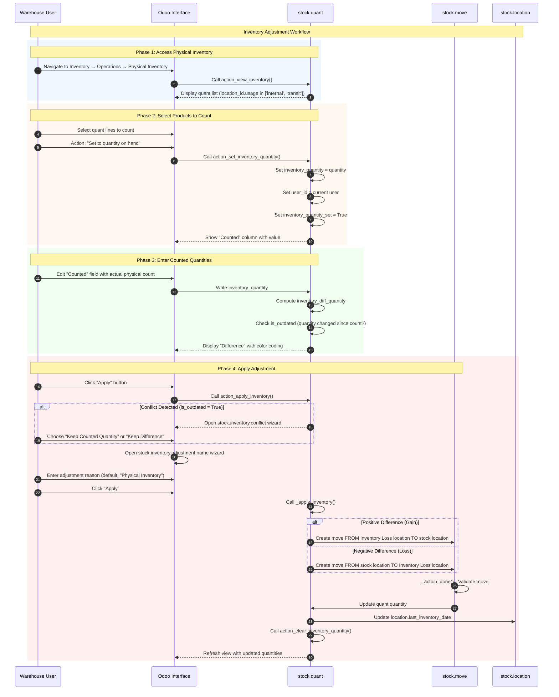
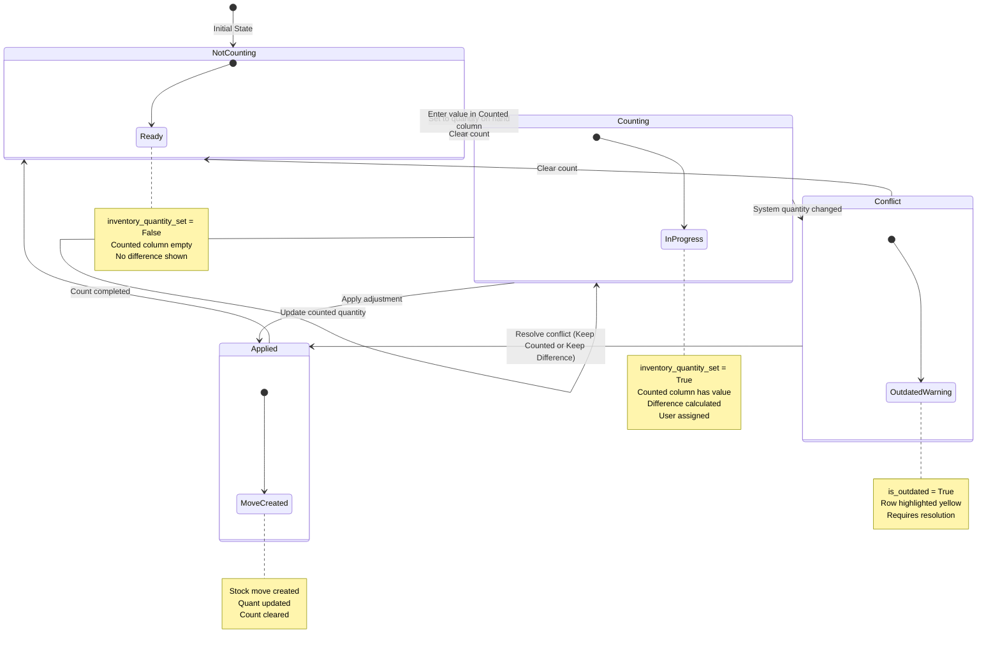

# Inventory Adjustment Workflow

## Overview

### Business Objective

The Inventory Adjustment workflow is the **primary process for ensuring inventory accuracy** in Odoo. It enables warehouse staff to perform physical inventory counts, compare actual stock levels with system records, and adjust quantities to reconcile any differences.

**What This Workflow Accomplishes:**
- Performs physical counts of inventory at specific locations
- Compares counted quantities against system-recorded on-hand quantities
- Identifies discrepancies (gains or losses) between physical and system inventory
- Creates adjustment moves to reconcile system quantities with actual stock levels
- Maintains audit trails of all inventory adjustments with reasons

### Target Personas

| Role | Responsibilities | Typical Actions |
|------|------------------|-----------------|
| **Warehouse Staff** | Perform physical counts | Enters counted quantities for assigned products/locations |
| **Inventory Manager** | Oversee inventory accuracy | Reviews differences, approves adjustments, investigates variances |
| **Stock Controller** | Maintain inventory records | Schedules counts, assigns counters, reviews adjustment reports |
| **Operations Manager** | Monitor warehouse performance | Reviews inventory accuracy metrics, addresses systemic issues |

### Business Value

This workflow is critical because:
- **Inventory Accuracy**: Physical counts reveal discrepancies that affect order fulfillment and purchasing decisions
- **Financial Compliance**: Accurate inventory values are required for financial reporting and audits
- **Loss Prevention**: Regular counts help identify shrinkage, theft, or damage patterns
- **Operational Efficiency**: Knowing actual stock levels prevents overselling and stockouts
- **Cost Control**: Adjustments update inventory valuation for accurate cost accounting

---

## Prerequisites

### Required Modules

Before using this workflow, ensure the following modules are installed:

| Module | Technical Name | Purpose |
|--------|----------------|---------|
| **Inventory** | `stock` | Core warehouse and stock management |

**Optional modules that enhance this workflow:**
- **Barcode** (`stock_barcode`): Mobile scanning for efficient counting
- **Accounting** (`account`): Automatic valuation updates when adjustments create moves

### Required User Permissions

The user must belong to one of these security groups:

| Group | Access Level | Can Perform |
|-------|--------------|-------------|
| *Inventory / User* (`stock.group_stock_user`) | Basic | View inventory, enter counted quantities, start counts |
| *Inventory / Manager* (`stock.group_stock_manager`) | Full | Apply adjustments, delete quants, clear counts, request counts |

**Permission Details:**
- **Counting**: Requires *Inventory / User* group minimum
- **Applying Adjustments**: Requires *Inventory / Manager* group
- **Clearing All Counts**: Requires *Inventory / Manager* group
- **Requesting Counts**: Requires *Inventory / Manager* group

To check your permissions: Navigate to *Settings → Users & Companies → Users → [Your User] → Access Rights*.

### Required Data Setup

Before performing inventory adjustments, ensure the following are configured:

1. **At least one warehouse** with internal stock locations
2. **Products** configured as **Storable Product** type (only storable products create quants)
3. **Stock on hand** for products you want to count (or create new quant lines for items found)
4. **Lot/Serial tracking** configured on products (if traceability is required)
5. **Cyclic inventory frequency** on locations (optional, for scheduled counts)

---

## Workflow Diagram

### Sequence Diagram

The following diagram shows the complete interaction flow from accessing Physical Inventory through applying adjustments:

### State Machine Diagram

A **quant** being counted progresses through the following inventory states:

**Inventory Count Field Definitions:**

| Field | Technical Name | Description |
|-------|----------------|-------------|
| `On Hand` | `quantity` | Current system-recorded quantity at the location |
| `Counted` | `inventory_quantity` | Physical count entered by the user |
| `Difference` | `inventory_diff_quantity` | Computed: `inventory_quantity - quantity` |
| `Count Active` | `inventory_quantity_set` | Boolean indicating count is in progress |
| `Outdated` | `is_outdated` | True if system quantity changed since count began |
| `Assigned To` | `user_id` | User assigned to perform this count |
| `Scheduled` | `inventory_date` | Next scheduled count date for this quant |

*Source: `addons/stock/models/stock_quant.py:96-117`*

---

## Step-by-Step Guide

### Step 1: Access Physical Inventory

**What You Want to Accomplish:** Open the Physical Inventory screen to view current stock levels and begin counting.

**Navigation Path:** *Inventory → Operations → Physical Inventory*

**Actions:**

1. **Click on the Inventory module** in the main application menu
   - The Inventory dashboard opens showing various operations

2. **Navigate to Operations → Physical Inventory**
   - Alternatively, you can use the keyboard shortcut or search for "Physical Inventory"
   - The system calls `action_view_inventory()` to display the inventory view

3. **Review the displayed quant list**
   - The list shows all quants (stock quantities) in internal and transit locations
   - Each row represents a unique combination of: Product, Location, Lot/Serial (if tracked), Package, and Owner

4. **Apply filters as needed:**
   - *My Counts*: Shows only counts assigned to you
   - *To Count*: Shows items with scheduled count date ≤ today
   - *To Apply*: Shows items with pending adjustments
   - *Conflicts*: Shows items where quantity changed since count began
   - *Negative Stock*: Shows items with negative quantity (errors to investigate)

**What the User Sees:**

The Physical Inventory list displays:
- **Column headers**: Location, Product, Lot/Serial, Package, On Hand, Counted, Difference, Unit of Measure
- **Header action buttons**: "Apply All", "Apply", "Clear", "Request a Count"
- **Each row** shows current inventory data with editable "Counted" column
- **Scheduled** column shows the next inventory date (bold/blue if ≤ today)
- **User** column shows assigned counter (if any)

**Screenshot Reference:** `screenshots/15-01-access-inventory.png`

---

### Step 2: Select Products to Count

**What You Want to Accomplish:** Identify which products/locations to count and prepare them for the counting process.

**Actions:**

1. **Select one or more quant lines** by clicking the checkbox on the left side of each row
   - You can select multiple lines for batch operations
   - Use Ctrl+Click for multi-select or Shift+Click for range select

2. **Use the "Set to quantity on hand" action** from the Actions menu (gear icon)
   - This sets the `inventory_quantity` equal to the current `quantity`
   - The user is automatically assigned (`user_id` = current user)
   - The `inventory_quantity_set` flag becomes True

   **Alternative method:** Click directly in the "Counted" column
   - The column becomes editable
   - Enter your counted quantity directly

3. **Observe the changes:**
   - The "Counted" column now shows a value
   - If using "Set to quantity on hand", the Counted equals On Hand initially
   - The "Difference" column appears (showing 0 if no change yet)

**What the User Sees:**

After setting quantities to count:
- **Counted column**: Displays the initial value (same as On Hand if using the action)
- **Difference column**: Now visible, showing 0 initially
- **User column**: Shows your username (assigned to count)
- **Row appearance**: Ready for you to enter the actual physical count

**Important:** At this point, you have not made any adjustments yet—you have only prepared the line for counting.

**Screenshot Reference:** `screenshots/15-02-select-products.png`

---

### Step 3: Enter Counted Quantities

**What You Want to Accomplish:** Record the actual physical count for each selected product/location.

**Actions:**

1. **Perform the physical count** at the warehouse location
   - Go to the physical location
   - Count the actual quantity of the product
   - Note any lot/serial numbers if applicable

2. **Enter the counted quantity** in the "Counted" column
   - Click on the Counted field for the quant line
   - Replace the value with your actual physical count
   - Press Enter or Tab to save

3. **Review the calculated difference:**
   - The system automatically calculates: `Difference = Counted - On Hand`
   - **Positive difference** (green): You found more than expected (gain)
   - **Negative difference** (red): You found less than expected (loss)
   - **Zero difference** (muted/grey): Count matches system records

4. **For empty locations**, use the "Set to 0" action:
   - Select the quant line
   - Choose "Set to 0" from the Actions menu
   - This sets inventory_quantity to 0, creating a negative difference equal to On Hand

**What the User Sees:**

The list now shows:
- **Counted column**: Your entered physical count
- **Difference column** with color coding:
  - Green text for positive values (stock gain)
  - Red text for negative values (stock loss)
  - Grey/muted for zero (no change)
- **Bold formatting** on difference if non-zero

**Tip:** You can edit multiple lines before applying. The system tracks all pending counts.

**Screenshot Reference:** `screenshots/15-03-enter-quantities.png`

---

### Step 4: Review Differences

**What You Want to Accomplish:** Review all pending inventory adjustments before applying them to ensure accuracy.

**Actions:**

1. **Apply the "To Apply" filter** to see only pending adjustments
   - Click on the filter dropdown
   - Select "To Apply"
   - This shows all quants where `inventory_quantity_set = True`

2. **Review each line for accuracy:**
   - Verify the Location is correct
   - Verify the Product is correct
   - Check the Lot/Serial number if applicable
   - Confirm the Difference is reasonable

3. **Check for conflicts (yellow highlighted rows):**
   - Rows with `is_outdated = True` are highlighted in yellow
   - This means the system quantity changed since you started counting
   - Common causes: goods received, goods shipped, transfers completed

4. **Clear individual counts if needed:**
   - Click the "Clear" button (X icon) on any row to reset that count
   - This sets `inventory_quantity_set = False` and clears the counted quantity

5. **Use "Clear" header action to reset all counts** (Manager only):
   - Click the "Clear" button in the header
   - A confirmation dialog appears
   - This clears all pending counts in the current view

**What the User Sees:**

The filtered list shows:
- **Only rows with pending counts** (inventory_quantity_set = True)
- **Yellow highlighted rows**: Conflicts that need resolution
- **Difference column**: Review all adjustments to be made
- **Clear button on each row**: Option to cancel individual counts

**Important:** Take time to review significant differences before applying. Large variances may indicate counting errors or process issues.

**Screenshot Reference:** `screenshots/15-04-review-differences.png`

---

### Step 5: Apply Adjustment

**What You Want to Accomplish:** Finalize the inventory adjustments by creating stock moves to reconcile system quantities with physical counts.

**Actions:**

1. **For individual quant adjustment:**
   - Click the "Apply" button (save icon) on the specific row
   - This applies only that single adjustment

2. **For multiple quants (Apply All):**
   - Click the "Apply All" button in the header
   - Or select multiple quants and use the "Apply" action
   - The Inventory Adjustment wizard opens

3. **Handle conflicts if detected:**
   - If any selected quants have `is_outdated = True`, a Conflict wizard appears
   - You must choose:
     - **"Keep Counted Quantity"**: Apply exactly what you counted
     - **"Keep Difference"**: Maintain the same difference but adjust for the new base quantity

4. **Enter the adjustment reason:**
   - The "Inventory Adjustment Reference / Reason" wizard opens
   - Default reason: "Physical Inventory"
   - Optionally modify the reason (e.g., "Cycle count - Warehouse A", "Annual inventory 2026")
   - Optionally set a "Counting Date" to backdate the adjustment moves

5. **Click "Apply" to confirm:**
   - The system calls `_apply_inventory()`
   - Stock moves are created:
     - Gains: Move FROM virtual "Inventory Adjustment" location TO stock location
     - Losses: Move FROM stock location TO virtual "Inventory Adjustment" location
   - Moves are immediately validated (state = 'done')
   - Quant quantities are updated to match counted values
   - Count flags are cleared

**What the User Sees:**

During the apply process:
- **Conflict wizard** (if applicable): Two button options for resolution
- **Adjustment wizard**: Text field for reason, datetime field for date
- **After apply**: 
  - The quant row shows updated On Hand quantity
  - Counted and Difference columns are cleared
  - The row may disappear from filtered view (no longer "To Apply")

**Screenshot Reference:** `screenshots/15-05-apply-adjustment.png`

---

### Step 6: View Results

**What You Want to Accomplish:** Verify the adjustment was applied correctly and review the history of changes.

**Actions:**

1. **Review the updated quant:**
   - The "On Hand" quantity now reflects your counted amount
   - The "Counted" and "Difference" columns are cleared
   - The "Scheduled" date is recalculated for next count

2. **View adjustment history:**
   - Click the "History" button (clock icon) on the quant row
   - This opens the stock move line history filtered for this quant
   - Filter by "Inventory" to see only adjustment moves

3. **Review the created stock move:**
   - The history shows the adjustment move details:
     - From/To locations (one is the Inventory Adjustment virtual location)
     - Quantity adjusted
     - Reference showing the adjustment reason you entered
     - Date of the adjustment

4. **Verify location inventory date:**
   - The location's `last_inventory_date` is updated to today
   - This is used for scheduling future counts

5. **Run reports if needed:**
   - Inventory Valuation report reflects updated quantities
   - Stock moves report shows the adjustment transactions

**What the User Sees:**

After successful adjustment:
- **Updated On Hand**: Matches your counted quantity
- **Cleared count fields**: Counted and Difference columns empty
- **History button**: Click to see the adjustment move
- **Move details**: Shows source, destination, quantity, and reason

**Screenshot Reference:** `screenshots/15-06-view-results.png`

---

## Variations and Edge Cases

### Conflict Resolution

**Scenario:** The system quantity changed while you were performing the count (another user shipped goods, received goods, or made a transfer).

**How to Identify:**
- Row is highlighted in yellow (warning decoration)
- The `is_outdated` field is True
- The difference you see may not reflect the actual current discrepancy

**How to Handle:**

When you click "Apply" on a conflicted quant, the system presents the **Conflict in Inventory Adjustment** wizard with two options:

1. **"Keep Counted Quantity"** (`action_keep_counted_quantity`)
   - Uses your counted value as the new target quantity
   - The difference is recalculated against the NEW system quantity
   - Use when: You trust your physical count is accurate as of right now

2. **"Keep Difference"** (`action_keep_difference`)
   - Maintains the same difference you saw, but applies it to the new base quantity
   - The counted quantity is adjusted to preserve the difference
   - Use when: You want to apply the same variance regardless of interim changes

**Example:**
- Original On Hand: 100
- You counted: 95 (Difference: -5)
- Meanwhile, 10 units were shipped
- New On Hand: 90

**Keep Counted Quantity**: Final quantity = 95 (your count), Difference becomes +5
**Keep Difference**: Final quantity = 85 (90 - 5), Difference stays -5

*Source: `addons/stock/wizard/stock_inventory_conflict.py:16-24`*

---

### Creating New Quant Lines

**Scenario:** You find products at a location that don't exist in the system (no quant record).

**How to Handle:**

1. Click "New" or "Add a line" in the Physical Inventory view
2. Fill in the required fields:
   - **Product**: Select the product found
   - **Location**: Select where you found it
   - **Lot/Serial**: If the product is tracked, select or create the lot
   - **Counted**: Enter the quantity found
3. The system creates a new quant with quantity = 0
4. When you apply, a stock move creates the positive adjustment

**Important:** Only storable products can have quants created.

---

### Negative Stock Correction

**Scenario:** The system shows negative stock for a product (should not happen in normal operations).

**How to Handle:**

1. Use the "Negative Stock" filter to find affected quants
2. Investigate the cause:
   - Were goods shipped before being received?
   - Was there a processing error?
3. Perform a physical count at the location
4. Enter the actual quantity (usually 0 if the location is empty)
5. Apply the adjustment to correct the negative

**Note:** Negative stock often indicates a process issue that should be investigated and addressed.

---

### Serial Number Products

**Scenario:** Products tracked by serial number require individual counting.

**How to Handle:**

1. Each unique serial number appears as a separate quant line
2. The quantity is always 1 (or 0 if missing)
3. Count each serial number individually
4. For found serials not in system, create new quant lines
5. For missing serials, set counted quantity to 0

**Constraint:** Serial number products should have quantity ≤ 1 per location. The system validates this.

---

### Lot-Tracked Products

**Scenario:** Products tracked by lot require counting per lot at each location.

**How to Handle:**

1. Each unique lot number appears as a separate quant line per location
2. Count the quantity of each lot separately
3. Enter the counted quantity for each lot line
4. Different lots can have different quantities at the same location

---

### Multi-Location Counting

**Scenario:** You need to count the same product across multiple warehouse locations.

**How to Handle:**

1. Filter by product to see all locations
2. Select all relevant quant lines
3. Use "Set to quantity on hand" to prepare all for counting
4. Visit each physical location and update the counted quantity
5. Apply all adjustments together or individually

**Tip:** Use the "Location" grouping to organize by physical location.

---

### Scheduled Counts (Cyclic Inventory)

**Scenario:** Automatically scheduling counts based on location settings.

**How It Works:**

1. Each location has a `cyclic_inventory_frequency` setting (days between counts)
2. When an adjustment is applied, `last_inventory_date` is updated
3. The system calculates `inventory_date` for each quant
4. Use the "To Count" filter to see quants with scheduled date ≤ today

**How to Configure:**

1. Navigate to *Inventory → Configuration → Locations*
2. Edit the location
3. Set "Inventory Frequency (Days)" to desired interval (e.g., 30 for monthly)

*Source: `addons/stock/models/stock_quant.py:63, 124-129`*

---

### Request a Count

**Scenario:** An Inventory Manager needs to schedule a count for specific products/locations.

**How to Handle:**

1. Select the quant lines to be counted
2. Click "Request a Count" header button
3. The selected quants are prepared for counting:
   - `inventory_quantity_set` is set
   - Users are assigned if specified
4. Warehouse staff can then filter by "My Counts" or "To Apply"

**Note:** This action requires *Inventory / Manager* permissions.

---

## Integration Points

### Integration with Location Settings

**Configuration:** `cyclic_inventory_frequency` on `stock.location`

**Automatic Behavior:**
- When set, the system automatically calculates the next inventory date for quants at that location
- After adjustment, `last_inventory_date` is updated on the location
- The "To Count" filter shows due counts based on this scheduling

**User Impact:**
- Inventory managers can set counting schedules per location
- High-value or high-velocity locations can be counted more frequently
- The system highlights due counts for warehouse staff

---

### Integration with Product Settings

**Requirement:** `is_storable = True` on `product.product`

**Automatic Behavior:**
- Only storable products create `stock.quant` records
- Consumable and service products do not appear in Physical Inventory
- A validation error occurs if you try to create a quant for non-storable products

**User Impact:**
- Ensure products requiring inventory tracking are set to "Storable Product" type
- Consumables are not tracked at the quantity level (assumed always available)

*Source: `addons/stock/models/stock_quant.py:581-584`*

---

### Integration with Accounting (Inventory Valuation)

**When Active:** If the product category has automated inventory valuation enabled.

**Automatic Behavior:**
- Stock moves created by adjustments update the inventory valuation
- The accounting entries are created for the value of adjusted stock
- The Inventory Adjustment account (usually an expense account) is debited/credited

**User Impact:**
- Inventory adjustments affect the general ledger
- Valuation reports reflect the new quantities
- Period-end inventory values are accurate for financial reporting

---

### Integration with User Assignment

**Field:** `user_id` on `stock.quant`

**Automatic Behavior:**
- When a count is started, the current user is assigned
- The "My Counts" filter shows counts assigned to the logged-in user
- Managers can reassign counts by editing the User field

**User Impact:**
- Warehouse staff see only their assigned counts
- Managers can distribute counting workload
- Accountability is tracked for each count

---

### Integration with Security Groups

**Permission Model:**

| Action | Required Group |
|--------|----------------|
| View Physical Inventory | `stock.group_stock_user` |
| Enter counted quantities | `stock.group_stock_user` |
| Apply adjustments | `stock.group_stock_manager` |
| Clear all counts | `stock.group_stock_manager` |
| Request a count | `stock.group_stock_manager` |
| Delete quant records | `stock.group_stock_manager` |

**User Impact:**
- Basic warehouse users can count but cannot apply
- This separation allows for review/approval workflows
- Managers have full control over inventory adjustments

---

## Error Scenarios

### Attempting to Count Non-Storable Products

**Error Message:** "Quants cannot be created for consumables or services."

**When It Occurs:** The user tries to create a new quant line for a product that is not storable.

**What the User Sees:**
- A validation error popup appears
- The quant creation is blocked

**How to Resolve:**
1. Verify the product type in *Inventory → Products → Products → [Product]*
2. Change the product type to "Storable Product" if inventory tracking is needed
3. Or use a different product that is already storable

*Source: `addons/stock/models/stock_quant.py:581-584`*

---

### User Lacks Permission to Apply Adjustments

**Error Message:** "You don't have the rights to perform this action." or action button is hidden.

**When It Occurs:** A user with only *Inventory / User* permissions tries to apply an adjustment.

**What the User Sees:**
- The "Apply" button may be hidden or disabled
- If trying via code, an access error occurs

**How to Resolve:**
1. Contact an Inventory Manager to apply the adjustment
2. Or request elevated permissions from a system administrator

---

### Conflict Detected - Quantity Changed Since Count

**Error Message:** The Conflict wizard appears instead of the Adjustment wizard.

**When It Occurs:** The system quantity (`quantity`) changed after the count was started but before it was applied.

**What the User Sees:**
- Yellow-highlighted rows in the list
- When clicking "Apply", the Conflict wizard opens
- Two options: "Keep Counted Quantity" or "Keep Difference"

**How to Resolve:**
1. Understand what caused the change (review recent stock moves)
2. Decide which resolution method is appropriate
3. Select the appropriate button in the Conflict wizard
4. The adjustment proceeds after resolution

*Source: `addons/stock/models/stock_quant.py:437-448`*

---

### Modifying Protected Fields on Existing Quant

**Error Message:** "Quant's creation is restricted, you can't do this operation."

**When It Occurs:** The user tries to change product_id, location_id, or lot_id on an existing quant through inventory mode.

**What the User Sees:**
- Validation error when saving
- The change is blocked

**How to Resolve:**
1. Create a new quant line for the correct product/location/lot
2. Set the existing quant's counted quantity to 0 (to remove it)
3. Apply both adjustments

---

### Warehouse Not Configured with Stock Location

**Error Message:** Operations may fail if no default stock location is found.

**When It Occurs:** The system cannot determine a valid stock location for the company.

**What the User Sees:**
- Empty Physical Inventory view
- Or errors when trying to apply adjustments

**How to Resolve:**
1. Navigate to *Inventory → Configuration → Warehouses*
2. Ensure at least one warehouse is configured
3. Verify the warehouse has a stock location (Lot/Stock Location)
4. Refresh the Physical Inventory view

---

### Attempting to Apply Zero-Difference Adjustment

**Behavior:** The system skips creating moves when the difference is zero.

**When It Occurs:** User applies an adjustment where counted = on hand.

**What the User Sees:**
- The apply action completes successfully
- No stock move is created (no change was needed)
- The count is cleared

**Note:** This is expected behavior—there's nothing to adjust if the count matches.

*Source: `addons/stock/models/stock_quant.py:1000-1003`*

---

## What the User Sees: UI State Reference

### Physical Inventory List View

| Column | Description | Notes |
|--------|-------------|-------|
| Location | Warehouse location containing the stock | Required, read-only for existing quants |
| Product | Product being counted | Required, read-only for existing quants |
| Lot/Serial Number | Tracking identifier (if applicable) | Shows only when product has tracking enabled |
| Package | Container package (if applicable) | Requires "Packages" feature enabled |
| On Hand | Current system quantity | Read-only, shows actual stock level |
| Counted | User-entered count | Editable, accepts decimal values |
| Difference | Calculated variance | Read-only, Counted - On Hand |
| UoM | Unit of measure | From product settings |
| Scheduled | Next inventory date | Based on location cyclic frequency |
| User | Assigned counter | Editable by managers |

### Header Actions

| Button | Description | Permission |
|--------|-------------|------------|
| **Apply All** | Apply all pending adjustments in view | Manager |
| **Apply** | Open adjustment wizard for selected | Manager |
| **Clear** | Reset all pending counts | Manager |
| **Request a Count** | Schedule selected items for counting | Manager |

### Row Actions

| Button | Icon | Description |
|--------|------|-------------|
| **History** | Clock | View stock move history for this quant |
| **Apply** | Save/Check | Apply this single adjustment |
| **Clear** | X | Clear this count (reset to not counting) |

### Visual Indicators

| Indicator | Meaning |
|-----------|---------|
| **Yellow row** | Conflict detected (is_outdated = True) |
| **Green difference** | Positive variance (gain) |
| **Red difference** | Negative variance (loss) |
| **Grey/Muted difference** | Zero variance (no change) |
| **Bold difference** | Non-zero variance |
| **Bold/Blue scheduled date** | Count is due (date ≤ today) |

*Source: `addons/stock/views/stock_quant_views.xml:272-323`*

---

## Business Rules Reference

For detailed information about validation logic, computation rules, and access control for this workflow, see:

**[Inventory Adjustment Business Rules](../../04-business-rules/inventory-adjustment-rules.md)**

This document covers:
- Validation rules for storable products and valid locations
- Computation formulas for difference calculation
- State transition rules for inventory count flags
- Access control requirements for different operations
- Integration trigger conditions

---

## Source Code References

| Component | File Path | Line Numbers |
|-----------|-----------|--------------|
| StockQuant Model | `addons/stock/models/stock_quant.py` | 19-1100+ |
| Inventory Fields | `addons/stock/models/stock_quant.py` | 96-117 |
| action_view_inventory() | `addons/stock/models/stock_quant.py` | 401-431 |
| action_apply_inventory() | `addons/stock/models/stock_quant.py` | 433-450 |
| _apply_inventory() | `addons/stock/models/stock_quant.py` | 995-1025 |
| action_set_inventory_quantity() | `addons/stock/models/stock_quant.py` | 497-516 |
| Conflict Wizard | `addons/stock/wizard/stock_inventory_conflict.py` | 7-24 |
| Adjustment Name Wizard | `addons/stock/wizard/stock_inventory_adjustment_name.py` | 7-23 |
| Inventory List View | `addons/stock/views/stock_quant_views.xml` | 272-323 |

---

## Related Documentation

- [Capabilities Inventory](../../01-capabilities-overview/capabilities-inventory.md) - Complete module catalog and glossary
- [Inventory Receipt Processing](../04-inventory-receipt-processing/flow-document.md) - Receiving goods into stock
- [Inventory Delivery Order](../05-inventory-delivery-order/flow-document.md) - Shipping goods from stock
- [Inventory Adjustment Business Rules](../../04-business-rules/inventory-adjustment-rules.md) - Detailed business rules

---

*Document Version: 1.0*
*Last Updated: January 2026*
*Odoo Version: 19.0 Community Edition*
