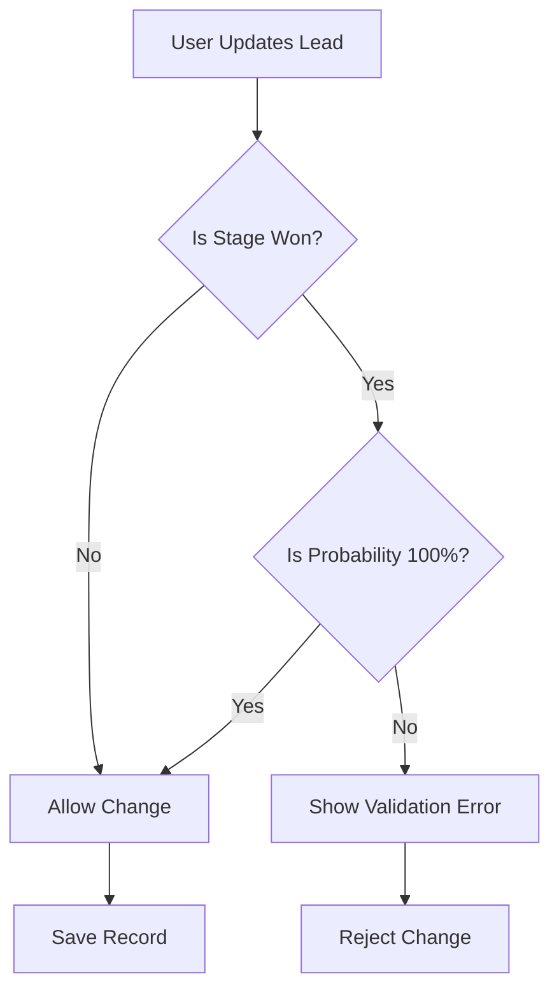
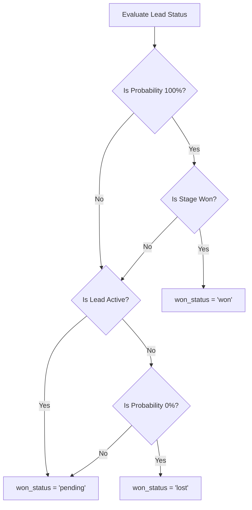
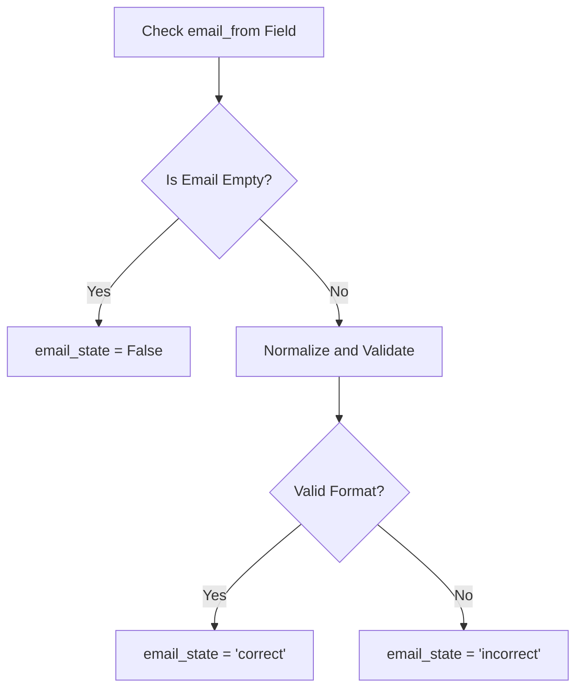
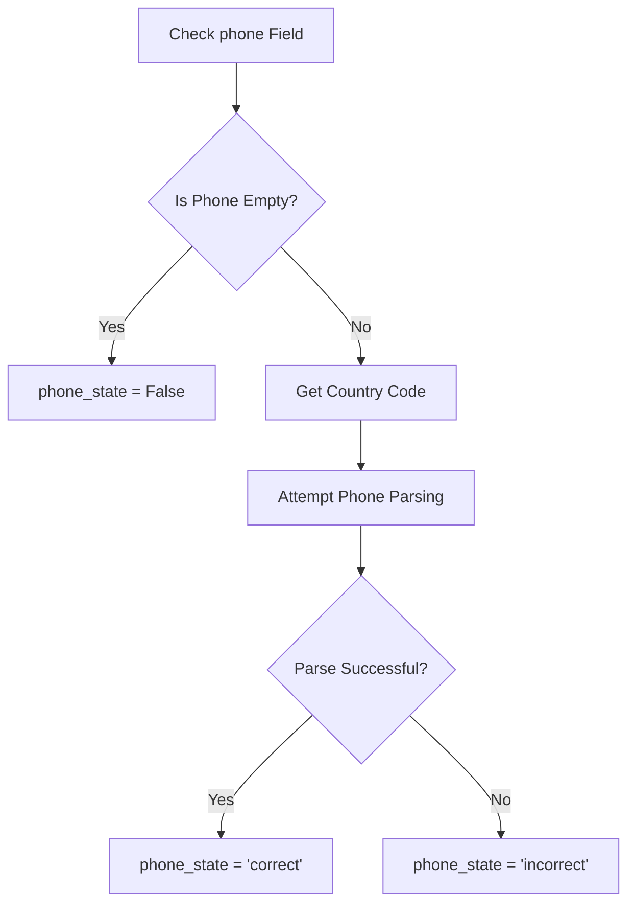
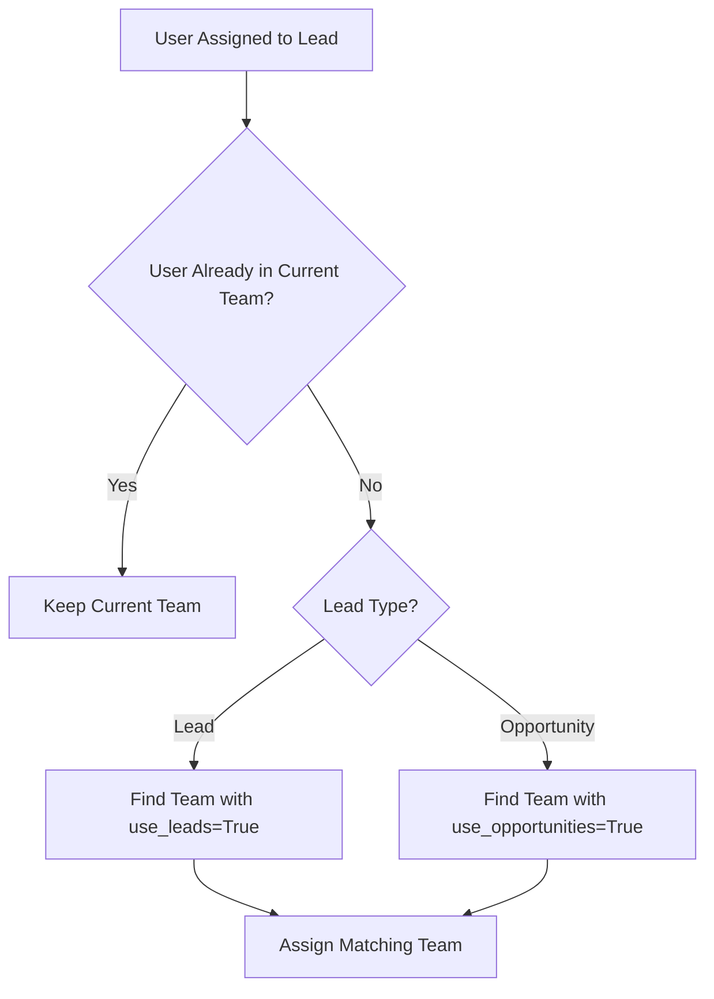
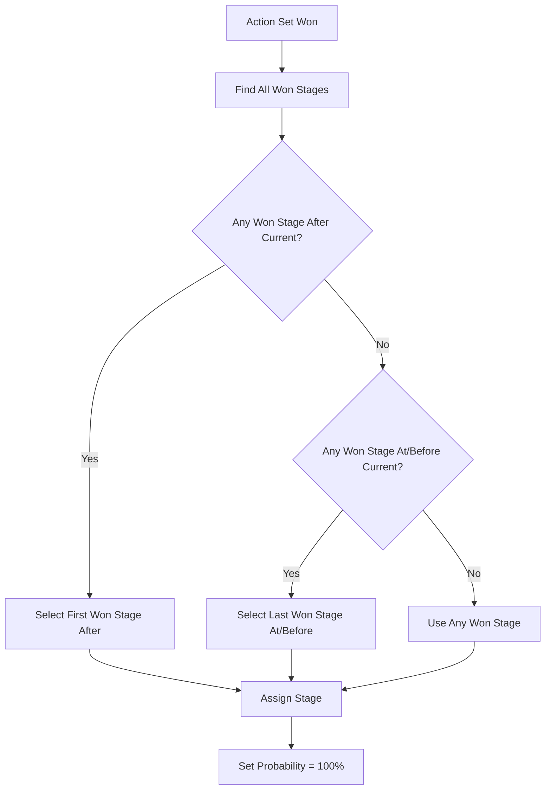
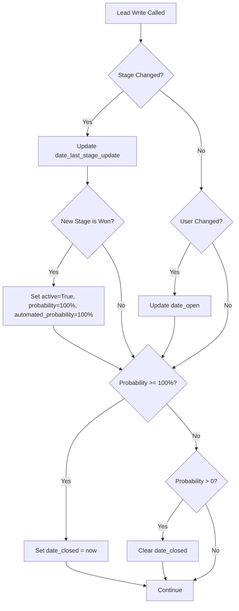

# CRM Lead to Opportunity Business Rules

## Document Information

| Attribute | Value |
|-----------|-------|
| **Flow Reference** | [02 - CRM Lead to Opportunity](../02-user-flows/02-crm-lead-to-opportunity/flow-document.md) |
| **Primary Model** | `crm.lead` |
| **Supporting Model** | `crm.stage` |
| **Odoo Version** | 19.0 Community Edition |
| **Last Updated** | January 2026 |

---

## 1. Overview

This document describes the business rules that govern the CRM Lead to Opportunity workflow in Odoo 19.0. These rules ensure data integrity, enforce business constraints, and automate calculations throughout the sales pipeline lifecycle.

### Covered Business Rule Categories

| Category | Description |
|----------|-------------|
| **Validation Logic** | Rules that prevent invalid data from being saved |
| **Computation Rules** | Automated calculations that derive field values |
| **State Transitions** | Rules controlling how leads progress through pipeline stages |
| **Selection Fields** | Defined choices for categorical data fields |
| **Access Control** | Security rules determining who can perform which actions |
| **Integration Triggers** | Automated actions when records change |

---

## 2. Validation Logic

### 2.1 Probability Range Constraint

**Rule Description:**
The probability of closing a deal must always be a percentage value between 0 and 100, inclusive.

**What This Means for Users:**
When entering or modifying the probability field on a lead or opportunity, the system will not allow values below 0% or above 100%.

**Technical Implementation:**
```
SQL Constraint: probability >= 0 AND probability <= 100
```

**Error Message Displayed:**
> "The probability of closing the deal should be between 0% and 100%!"

**When This Rule Applies:**
- Creating a new lead or opportunity
- Manually updating the probability field
- When automated probability is calculated (system enforces range internally)

*Source: `addons/crm/models/crm_lead.py:254-257`*

---

### 2.2 Won Stage Probability Validation

**Rule Description:**
When a lead or opportunity is in a **Won** stage (where `stage.is_won = True`), the probability must be exactly 100%. This ensures data consistency—a won deal cannot have any uncertainty about its outcome.

**What This Means for Users:**
- If you move an opportunity to a Won stage, the system automatically sets probability to 100%
- You cannot manually set the probability to anything other than 100% while in a Won stage
- If you try to set a different probability value while in a Won stage, an error is displayed

**Error Message Displayed:**
> "A lead in a Won stage cannot be lost. Move it to another stage first."

**Technical Validation Logic:**



**When This Rule Applies:**
- Moving an opportunity to a Won stage
- Attempting to change probability while in a Won stage
- Creating a lead directly in a Won stage

*Source: `addons/crm/models/crm_lead.py:262-266`*

---

### 2.3 Won and Lost Mutual Exclusivity

**Rule Description:**
A lead cannot be simultaneously in both Won and Lost states. These are mutually exclusive outcomes.

**What This Means for Users:**
The system prevents any data state where `is_won = True` and `is_lost = True` at the same time. This is a logical safeguard since a deal cannot be both won and lost.

**Error Message Displayed:**
> "The lead [Lead Name] cannot be won and lost at the same time."

*Source: `addons/crm/models/crm_lead.py:1003-1004`*

---

## 3. Computation Rules

### 3.1 Company-Based User Filtering

**Rule Description:**
The `user_company_ids` field determines which companies are valid for selecting a salesperson. If the lead has no company assigned, all companies are available. If a company is assigned, only that company is valid.

**What This Means for Users:**
When assigning a salesperson to a lead with a specific company, only users who belong to that company can be selected. This prevents cross-company data access issues.

**Computation Logic:**

| Lead Company Status | Available Companies for Salesperson |
|---------------------|-------------------------------------|
| No company assigned | All active companies |
| Company assigned | Only the assigned company |

**Triggers on Change to:**
- `company_id` field

*Source: `addons/crm/models/crm_lead.py:268-275`*

---

### 3.2 Company Currency Derivation

**Rule Description:**
The currency used for monetary fields (Expected Revenue, Recurring Revenue) is automatically derived from the lead's company. If no company is assigned, the current user's company currency is used.

**What This Means for Users:**
You don't need to manually set the currency—it follows the company assignment. This ensures all financial calculations within a company use consistent currency.

**Computation Logic:**

| Lead Company Status | Currency Used |
|---------------------|---------------|
| No company assigned | Current user's company currency |
| Company assigned | That company's currency |

**Triggers on Change to:**
- `company_id` field

*Source: `addons/crm/models/crm_lead.py:277-283`*

---

### 3.3 Prorated Revenue Calculation

**Rule Description:**
The prorated revenue represents the probability-weighted expected value of the deal. It is calculated as:

**Formula:**
```
Prorated Revenue = Expected Revenue × (Probability / 100)
```

**What This Means for Users:**
This value helps with revenue forecasting by adjusting the expected revenue based on how likely the deal is to close. For example:
- A $100,000 opportunity at 50% probability shows $50,000 prorated revenue
- A $100,000 opportunity at 100% probability shows $100,000 prorated revenue

**Example Calculations:**

| Expected Revenue | Probability | Prorated Revenue |
|------------------|-------------|------------------|
| $10,000 | 25% | $2,500 |
| $50,000 | 60% | $30,000 |
| $100,000 | 100% | $100,000 |

**Triggers on Change to:**
- `expected_revenue` field
- `probability` field

*Source: `addons/crm/models/crm_lead.py:568-571`*

---

### 3.4 Recurring Revenue Monthly Calculation

**Rule Description:**
For opportunities with recurring revenue, the monthly recurring revenue (MRR) is calculated by dividing the recurring revenue by the plan duration in months.

**Formula:**
```
Monthly Recurring Revenue = Recurring Revenue / Number of Months in Plan
```

**What This Means for Users:**
If you set a recurring revenue of $12,000 on an annual plan (12 months), the system calculates an MRR of $1,000. This helps compare opportunities with different billing cycles.

**Triggers on Change to:**
- `recurring_revenue` field
- `recurring_plan.number_of_months` field

*Source: `addons/crm/models/crm_lead.py:573-576`*

---

### 3.5 Prorated Recurring Revenue Calculations

**Rule Description:**
Similar to prorated revenue, the recurring revenue fields are also adjusted by probability:

**Formulas:**
```
Prorated MRR = Monthly Recurring Revenue × (Probability / 100)
Prorated Recurring Revenue = Recurring Revenue × (Probability / 100)
```

**What This Means for Users:**
These calculations help forecast recurring revenue considering the deal's likelihood of closing.

**Triggers on Change to:**
- `recurring_revenue_monthly` field
- `recurring_revenue` field
- `probability` field

*Source: `addons/crm/models/crm_lead.py:578-586`*

---

### 3.6 Won/Lost Status Derivation

**Rule Description:**
The `won_status` field is a computed indicator that categorizes each lead into one of three states based on multiple conditions:

**Status Determination Logic:**



**Status Values:**

| Status | Conditions | Meaning |
|--------|------------|---------|
| **Won** | probability = 100 AND stage.is_won = True | Deal successfully closed |
| **Lost** | active = False AND probability = 0 | Deal did not close |
| **Pending** | All other combinations | Deal still in progress |

**Triggers on Change to:**
- `active` field
- `probability` field
- `stage_id` field

*Source: `addons/crm/models/crm_lead.py:612-620`*

---

### 3.7 Automated Probability Scoring (Predictive Lead Scoring)

**Rule Description:**
The Predictive Lead Scoring (PLS) system automatically calculates the probability of closing a deal based on historical data patterns. This uses a Naive Bayes statistical model that learns from past won and lost opportunities.

**What This Means for Users:**
When you create or update a lead, the system suggests a probability based on how similar leads have performed historically. Factors that may influence this include:
- The current stage
- The assigned sales team
- Email quality (valid/invalid)
- Phone quality (valid/invalid)
- Tags assigned to the lead
- Country and other configurable fields

**How Probability Automation Works:**

| Scenario | Probability Behavior |
|----------|---------------------|
| Lead/opportunity modified | `automated_probability` recalculated |
| Probability was previously automated | `probability` syncs to `automated_probability` |
| User manually changed probability | Manual value retained until automated |
| Lead moved to Won stage | Both probabilities set to 100% |

**Is Probability Automated Check:**
The system determines if probability is "automated" by comparing if `probability` equals `automated_probability` (within floating point precision).

**Triggers on Change to:**
- `stage_id` field
- `team_id` field
- Any fields configured in PLS settings (e.g., `country_id`, `tag_ids`, `email_state`, `phone_state`)

*Source: `addons/crm/models/crm_lead.py:558-566`*

---

### 3.8 Email Quality State Detection

**Rule Description:**
The `email_state` field automatically evaluates whether the email address provided for a lead is in a valid format.

**Validation Logic:**



**Selection Values:**

| Value | Label | Meaning |
|-------|-------|---------|
| `correct` | Correct | Email passes format validation |
| `incorrect` | Incorrect | Email fails format validation |
| *empty* | *(not set)* | No email provided |

**What This Means for Users:**
A small indicator shows whether the email address is likely valid. This helps identify data quality issues early, such as typos or missing email addresses.

**Triggers on Change to:**
- `email_from` field

*Source: `addons/crm/models/crm_lead.py:539-549`*

---

### 3.9 Phone Quality State Detection

**Rule Description:**
The `phone_state` field automatically evaluates whether the phone number provided is valid for the lead's country.

**Validation Logic:**



**Selection Values:**

| Value | Label | Meaning |
|-------|-------|---------|
| `correct` | Correct | Phone passes validation for country |
| `incorrect` | Incorrect | Phone fails validation |
| *empty* | *(not set)* | No phone provided |

**What This Means for Users:**
Similar to email validation, this indicates whether the phone number appears valid. The validation considers the country code when available.

**Triggers on Change to:**
- `phone` field
- `country_id.code` field

*Source: `addons/crm/models/crm_lead.py:526-537`*

---

### 3.10 Partner Information Derivation

**Rule Description:**
When a customer (partner) is linked to a lead, several fields are automatically populated or synchronized from the partner record.

**Fields Derived from Partner:**

| Lead Field | Source | Behavior |
|------------|--------|----------|
| `contact_name` | `partner_id.name` (if not company) | Set when partner linked |
| `partner_name` | `partner_id.parent_id.name` or company name | Derived from company hierarchy |
| `function` | `partner_id.function` | Job position |
| `website` | `partner_id.website` | Company website |
| `email_from` | `partner_id.email` | Email synchronization |
| `phone` | `partner_id.phone` | Phone synchronization |
| `lang_id` | `partner_id.lang` | Language preference |
| `street`, `street2`, `city`, `zip`, `state_id`, `country_id` | Partner address fields | Full address sync |

**Address Synchronization Rule:**
Address fields are synchronized as a complete set—either all address fields from the partner are used, or none. This prevents mixed or incomplete addresses.

**Triggers on Change to:**
- `partner_id` field

*Source: `addons/crm/models/crm_lead.py:440-494`*

---

### 3.11 Sales Team Assignment

**Rule Description:**
The sales team is automatically computed based on the assigned salesperson. When a user is assigned, the system attempts to find an appropriate team.

**Team Assignment Logic:**



**What This Means for Users:**
When you assign a salesperson who isn't in the current team, the system may reassign the lead to a team the salesperson belongs to.

**Triggers on Change to:**
- `user_id` field
- `type` field

*Source: `addons/crm/models/crm_lead.py:300-314`*

---

### 3.12 Company Assignment

**Rule Description:**
The company assigned to a lead is computed based on team, user, and partner information to ensure data consistency.

**Company Derivation Priority:**
1. **From Team**: If the sales team has a company, use it
2. **From User**: If no team company, use the salesperson's company (preferring current environment company)
3. **From Partner**: If no team or user, use the customer's company
4. **Void**: If none of the above, leave company empty

**Company Validation Rules:**
- Company must be in the salesperson's allowed companies
- Company must match the team's company (if team has one)
- Invalid configurations reset the company

**Triggers on Change to:**
- `user_id` field
- `team_id` field
- `partner_id` field

*Source: `addons/crm/models/crm_lead.py:316-351`*

---

### 3.13 Stage Assignment

**Rule Description:**
When a lead doesn't have a stage or its current stage doesn't match the team, a default stage is automatically assigned.

**Stage Selection Logic:**
1. Filter stages that either have no team restriction or include the lead's team
2. Prefer non-folded stages
3. Order by sequence (lowest first)
4. Select the first matching stage

**Triggers on Change to:**
- `team_id` field
- `type` field

*Source: `addons/crm/models/crm_lead.py:353-357`*

---

### 3.14 Date Tracking Fields

**Rule Description:**
Several date fields are automatically computed to track the lead's lifecycle:

| Date Field | Computation Rule | Purpose |
|------------|------------------|---------|
| `date_open` | Set when salesperson first assigned | Track assignment time |
| `date_last_stage_update` | Set when stage changes | Track pipeline movement |
| `date_closed` | Set when probability reaches 100% or lead archived | Track deal closure |
| `date_conversion` | Set when lead converts to opportunity | Track conversion time |

**Days Calculations:**

| Metric | Formula | Use Case |
|--------|---------|----------|
| `day_open` | `date_open - create_date` | Time to assign lead |
| `day_close` | `date_closed - create_date` | Sales cycle length |

*Source: `addons/crm/models/crm_lead.py:359-391`*

---

### 3.15 Meeting Display Information

**Rule Description:**
The lead displays information about scheduled meetings to help salespeople track their activities.

**Display Logic:**

| Scenario | Display Label | Display Date |
|----------|---------------|--------------|
| No meetings scheduled | "No Meeting" | *(none)* |
| Future meetings exist | "Next Meeting" | Earliest upcoming meeting start |
| Only past meetings | "Last Meeting" | Most recent meeting date |

**Triggers on Change to:**
- `calendar_event_ids` field
- Meeting start dates

*Source: `addons/crm/models/crm_lead.py:588-610`*

---

### 3.16 Duplicate Lead Detection

**Rule Description:**
The system automatically identifies potential duplicate leads based on matching criteria.

**Duplicate Detection Criteria:**

| Match Type | Description |
|------------|-------------|
| **Email Domain** | Leads with same email domain (e.g., @company.com) |
| **Commercial Partner** | Leads linked to same parent company |
| **Phone Number** | Leads with same sanitized phone number |

**What This Means for Users:**
A count of potential duplicates is displayed on the lead. Users can review these to merge or clean up duplicate records.

*Source: `addons/crm/models/crm_lead.py:622-677`*

---

## 4. Stage Progression

### 4.1 Pipeline Stage Model

**Model:** `crm.stage`

Stages define the progression steps in the sales pipeline. Each stage has properties that affect lead behavior.

**Stage Properties:**

| Property | Type | Description |
|----------|------|-------------|
| `name` | Text | Display name of the stage (e.g., "New", "Qualified", "Proposition", "Won") |
| `sequence` | Integer | Order in pipeline (lower = earlier) |
| `is_won` | Boolean | If True, this is a winning stage |
| `fold` | Boolean | If True, stage is collapsed in Kanban view |
| `team_ids` | Many2many | Sales teams this stage applies to (empty = all teams) |
| `rotting_threshold_days` | Integer | Days before lead is considered "rotting" (0 = disabled) |
| `requirements` | Text | Internal notes about stage requirements |

*Source: `addons/crm/models/crm_stage.py:14-36`*

---

### 4.2 Stage Transition: Mark as Won

**Action Method:** `action_set_won()`

**What Happens When a User Clicks "Won":**

1. **Unarchive Lead**: Ensure the lead is active (in case it was previously lost)
2. **Find Won Stage**: Search for a stage where `is_won = True`
   - Prefer stage with sequence just above current stage
   - If none higher, use highest won stage at or below current
3. **Update Lead**: Set `stage_id` to the Won stage and `probability` to 100%
4. **Track Frequencies**: Update predictive lead scoring statistics

**Stage Selection Logic:**



**Rainbowman Celebration:**
After marking as won, a celebratory message may appear based on achievements:
- First deal ever won
- Team record for past 30 days
- Best deal in past 7 days
- Personal records
- Winning streaks
- Fast deal closure

*Source: `addons/crm/models/crm_lead.py:1127-1151`*

---

### 4.3 Stage Transition: Mark as Lost

**Action Method:** `action_set_lost()`

**What Happens When a User Clicks "Lost":**

1. **Archive Lead**: Set `active = False` to remove from active pipeline
2. **Set Probability**: Set both `probability` and `automated_probability` to 0
3. **Optional Parameters**: Accept `lost_reason_id` and other values
4. **Track Frequencies**: Update predictive lead scoring statistics

**Result State:**
- `active = False`
- `probability = 0`
- `automated_probability = 0`
- `won_status = 'lost'`
- Lead disappears from main pipeline views (filtered by active=True)

*Source: `addons/crm/models/crm_lead.py:1121-1125`*

---

### 4.4 Stage Transition: Restore Lost Lead

**Action Method:** `action_restore()`

**What Happens When a User Restores a Lost Lead:**

1. **Unarchive Lead**: Set `active = True` to bring back to pipeline
2. **Clear Lost Reason**: Remove the `lost_reason_id`
3. **Recalculate Probability**: Recompute `automated_probability` for current stage
4. **Sync Probability**: Set `probability` equal to `automated_probability`

**What This Means for Users:**
A lost opportunity can be brought back to the active pipeline. It returns to its previous stage with a fresh probability calculation.

*Source: `addons/crm/models/crm_lead.py:1112-1119`*

---

### 4.5 Stage Change Automation

**When Stages Change, the Following Occurs:**

| Trigger | Automated Action |
|---------|------------------|
| Move to Won stage | Set probability = 100%, set date_closed |
| Probability reaches 100% | Set date_closed |
| Probability goes above 0% | Clear date_closed |
| User assignment | Update date_open |
| Stage change | Update date_last_stage_update |

**Write Operation Logic:**



*Source: `addons/crm/models/crm_lead.py:829-891`*

---

### 4.6 Stage Won Property Change

**When a Stage's "Is Won" Property Changes:**

**Setting a Stage as Won (`is_won = True`):**
- All leads currently in that stage have probability set to 100%
- All leads have automated_probability set to 100%

**Removing Won Status from a Stage (`is_won = False`):**
- All leads in that stage have their probability recalculated based on predictive scoring

**Warning Displayed:**
> "Changing the value of 'Is Won Stage' may induce a large number of operations, as the probabilities of opportunities in this stage will be recomputed on saving."

*Source: `addons/crm/models/crm_stage.py:52-67`*

---

## 5. Selection Fields Reference

### 5.1 Lead/Opportunity Type

**Field:** `type`

| Value | Label | Description |
|-------|-------|-------------|
| `lead` | Lead | Unqualified potential customer |
| `opportunity` | Opportunity | Qualified sales prospect |

**Default Value:** `lead` if user has "CRM Leads" feature enabled, otherwise `opportunity`

*Source: `addons/crm/models/crm_lead.py:123-125`*

---

### 5.2 Priority

**Field:** `priority`

| Value | Label | Stars |
|-------|-------|-------|
| `0` | Low | ☆☆☆ |
| `1` | Medium | ★☆☆ |
| `2` | High | ★★☆ |
| `3` | Very High | ★★★ |

**Default Value:** `0` (Low)

*Source: `addons/crm/models/crm_stage.py:6-11`*

---

### 5.3 Email Quality State

**Field:** `email_state`

| Value | Label | Meaning |
|-------|-------|---------|
| `correct` | Correct | Email format is valid |
| `incorrect` | Incorrect | Email format is invalid |

*Source: `addons/crm/models/crm_lead.py:200-202`*

---

### 5.4 Phone Quality State

**Field:** `phone_state`

| Value | Label | Meaning |
|-------|-------|---------|
| `correct` | Correct | Phone number is valid for country |
| `incorrect` | Incorrect | Phone number is invalid |

*Source: `addons/crm/models/crm_lead.py:197-199`*

---

### 5.5 Won/Lost Status

**Field:** `won_status`

| Value | Label | Conditions |
|-------|-------|------------|
| `won` | Won | probability = 100 AND stage.is_won = True |
| `lost` | Lost | active = False AND probability = 0 |
| `pending` | Pending | All other cases |

*Source: `addons/crm/models/crm_lead.py:228-233`*

---

## 6. Access Control

### 6.1 Security Groups

**Available CRM Security Groups:**

| Group | Technical Name | Description |
|-------|----------------|-------------|
| **Sales / User: Own Documents Only** | `sales_team.group_sale_salesman` | Access only to own leads and opportunities |
| **Sales / User: All Documents** | `sales_team.group_sale_salesman_all_leads` | Access to all team leads and opportunities |
| **Sales / Administrator** | `sales_team.group_sale_manager` | Full administration access |

---

### 6.2 Feature Groups

**CRM Feature Visibility Groups:**

| Group | Technical Name | Effect |
|-------|----------------|--------|
| **Show Lead Menu** | `crm.group_use_lead` | Enables two-step lead → opportunity workflow |
| **Show Recurring Revenues** | `crm.group_use_recurring_revenues` | Shows recurring revenue fields |

---

### 6.3 Model Access Rights

**Lead Model (`crm.lead`) Permissions:**

| Group | Create | Read | Update | Delete |
|-------|--------|------|--------|--------|
| Sales Manager | ✓ | ✓ | ✓ | ✓ |
| Salesperson | ✓ | ✓ | ✓ | ✗ |

**Stage Model (`crm.stage`) Permissions:**

| Group | Create | Read | Update | Delete |
|-------|--------|------|--------|--------|
| Sales Manager | ✓ | ✓ | ✓ | ✓ |
| Base User | ✗ | ✓ | ✗ | ✗ |

**Lost Reason Model (`crm.lost.reason`) Permissions:**

| Group | Create | Read | Update | Delete |
|-------|--------|------|--------|--------|
| Sales Manager | ✓ | ✓ | ✓ | ✓ |
| Salesperson | ✗ | ✓ | ✗ | ✗ |
| Base User | ✗ | ✓ | ✗ | ✗ |

*Source: `addons/crm/security/ir.model.access.csv`*

---

### 6.4 Record Rules

**Personal Leads Rule:**
- **Group:** Sales / User: Own Documents Only
- **Domain:** `user_id = current_user OR user_id is empty`
- **Effect:** Salespeople only see their assigned leads or unassigned leads

**All Leads Rule:**
- **Group:** Sales / User: All Documents
- **Domain:** Always true (no restriction)
- **Effect:** Users can see all leads

**Multi-Company Rule:**
- **Applies to:** All users
- **Domain:** `company_id in user's companies OR company_id is empty`
- **Effect:** Users only see leads from their allowed companies

*Source: `addons/crm/security/crm_security.xml`*

---

## 7. Integration Points

### 7.1 Calendar Integration

**Meeting Scheduling:**
- Leads can have linked calendar events (`calendar_event_ids`)
- The `action_schedule_meeting()` method opens calendar to schedule meetings
- Meetings display as "Next Meeting" or "Last Meeting" on the lead
- When a lead is deleted, linked calendar events are updated to remove the reference

**Smart Calendar Mode:**
When opening calendar from a lead with meetings:
- Single meeting: Opens week view at meeting date
- Multiple meetings in same week: Opens week view
- Multiple meetings across weeks: Opens month view

*Source: `addons/crm/models/crm_lead.py:1278-1362`*

---

### 7.2 Email Tracking

**Email Synchronization:**
- Lead email (`email_from`) syncs bidirectionally with partner email
- Changes to lead email can update partner email (based on user confirmation)
- Email tracking via `mail.thread` inheritance

**Email Derivation from Partner:**
- When partner linked, email copied if lead email is empty or matches partner
- `partner_email_update` computed field indicates if sync will occur

*Source: `addons/crm/models/crm_lead.py:496-505, 679-682`*

---

### 7.3 Phone Validation

**Phone Formatting:**
- Phone numbers automatically formatted to international format
- Validation uses country code when available
- Phone tracking via `mail.thread.phone` inheritance

**Phone Synchronization:**
- Lead phone syncs bidirectionally with partner phone
- `partner_phone_update` computed field indicates if sync will occur

*Source: `addons/crm/models/crm_lead.py:515-524, 684-688, 707-710`*

---

### 7.4 Partner (Customer) Integration

**Partner Creation During Conversion:**
- Lead can create new partner when converted to opportunity
- Partner inherits lead's contact information
- Commercial partner hierarchy maintained

**Partner Synchronization:**
- Address fields sync as complete set (all or none)
- Contact name, company name, function, website sync individually
- Language preference derived from partner

*Source: `addons/crm/models/crm_lead.py:712-737*

---

### 7.5 Predictive Lead Scoring Integration

**Frequency Table Updates:**
The predictive lead scoring system maintains frequency tables that are updated when:

| Event | Action |
|-------|--------|
| Lead moves to Won | Increment won frequency |
| Lead moves to Lost | Increment lost frequency |
| Lead leaves Won status | Decrement won frequency |
| Lead leaves Lost status | Decrement lost frequency |

**Configurable PLS Fields:**
Administrators can configure which fields influence probability scoring through system parameters:
- Default fields: `stage_id`, `team_id`
- Configurable: `country_id`, `tag_ids`, `email_state`, `phone_state`, and others

*Source: `addons/crm/models/crm_lead.py:974-1021, 2643-2651`*

---

## 8. Quick Reference Card

### Field Constraints Summary

| Field | Constraint | Error When Violated |
|-------|------------|---------------------|
| `probability` | 0-100 | "The probability of closing the deal should be between 0% and 100%!" |
| `probability` (in Won stage) | Must be 100 | "A lead in a Won stage cannot be lost. Move it to another stage first." |
| `won_status` | Cannot be both won and lost | "The lead cannot be won and lost at the same time." |

### Key Computed Fields

| Field | Depends On | Purpose |
|-------|------------|---------|
| `prorated_revenue` | expected_revenue, probability | Weighted revenue forecast |
| `won_status` | active, probability, stage_id | Deal outcome classification |
| `automated_probability` | stage_id, team_id, PLS fields | AI-suggested probability |
| `email_state` | email_from | Email format validation |
| `phone_state` | phone, country_id | Phone number validation |
| `company_currency` | company_id | Currency for monetary fields |

### Status Values Quick Reference

| Status | Probability | Active | Stage |
|--------|-------------|--------|-------|
| **Won** | 100% | True | is_won = True |
| **Lost** | 0% | False | Any |
| **Pending** | 1-99% | True | is_won = False |

---

## Related Documentation

- [CRM Lead to Opportunity Flow Document](../02-user-flows/02-crm-lead-to-opportunity/flow-document.md)
- [Capabilities Inventory](../01-capabilities-overview/capabilities-inventory.md)

---

*Document generated based on Odoo 19.0 Community Edition source code analysis.*
*Source references point to `addons/crm/models/crm_lead.py` and `addons/crm/models/crm_stage.py`.*
