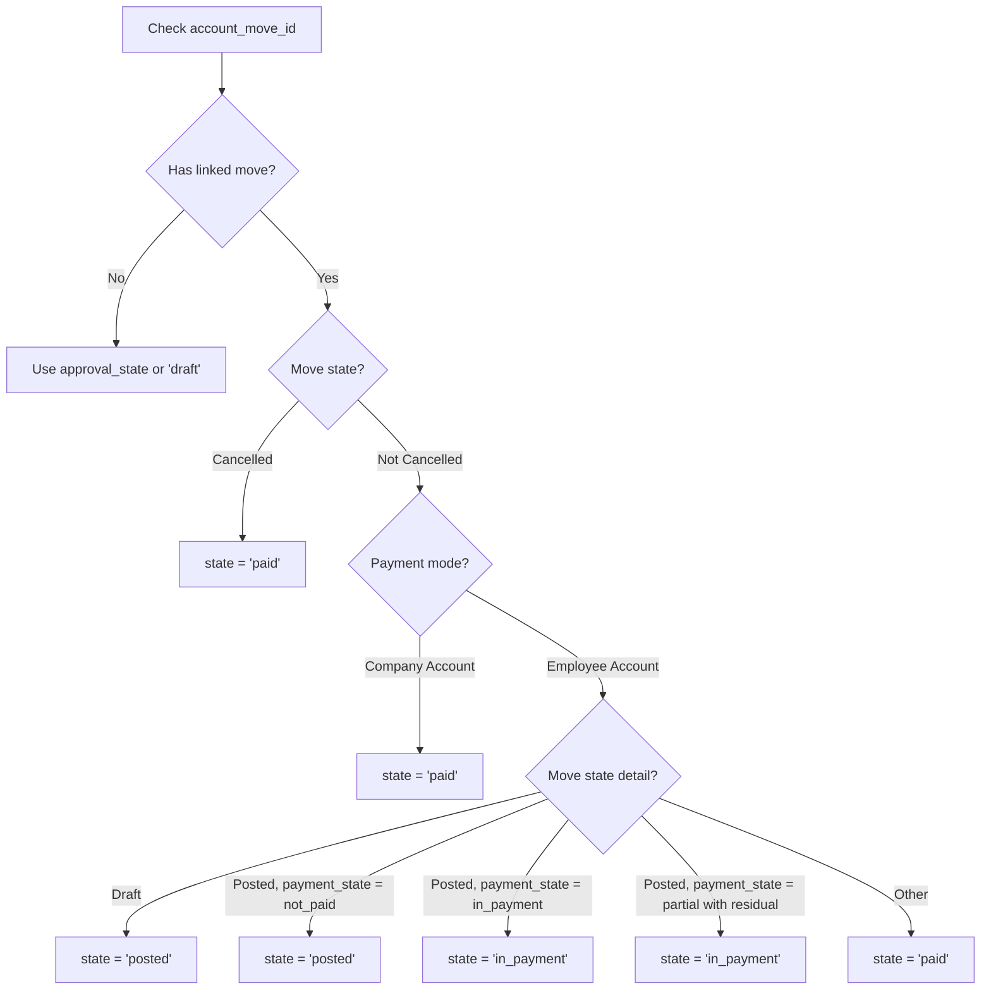
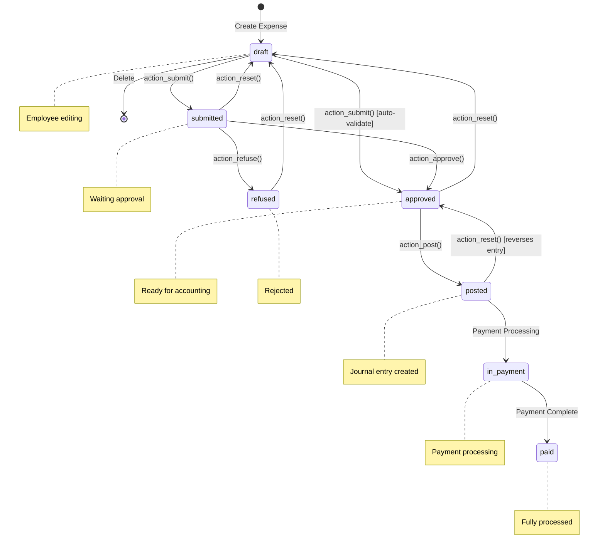
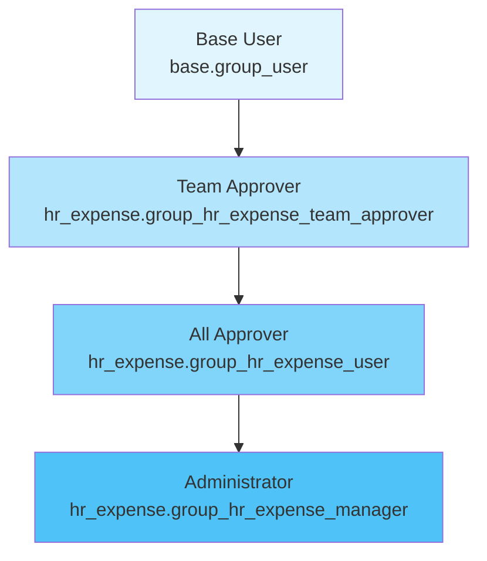
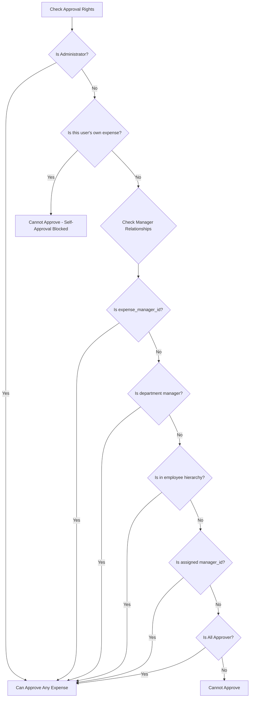

# Business Rules: Expense Claim and Reimbursement

## Document Information

| Attribute | Value |
|-----------|-------|
| **Workflow** | Expense Claim and Reimbursement |
| **Primary Module** | `hr_expense` |
| **Primary Model** | `hr.expense` |
| **Related Flow Document** | [User Flow 12: Expense Claim and Reimbursement](../02-user-flows/12-expense-claim-reimbursement/flow-document.md) |
| **Last Updated** | Based on Odoo 19.0 Community Edition |

---

## Overview

This document describes the business rules governing the expense claim and reimbursement workflow in Odoo 19.0. It covers validation rules that prevent incorrect data entry, computation rules that automatically calculate values, state transition rules that control workflow progression, and access control rules that determine who can perform various actions.

**Target Audience**: Customer support teams, business analysts, and system administrators who need to understand how expense processing works in Odoo.

---

## 1. Validation Rules

Validation rules ensure data integrity by checking that expense records meet specific criteria before allowing certain operations. When a validation rule is violated, the system displays an error message and prevents the operation from completing.

### 1.1 Non-Zero Amount Rule

**Rule Name**: `_check_non_zero`

**Business Purpose**: Prevents employees from submitting expenses with no monetary value, which would be meaningless for reimbursement processing.

**When It Applies**: This rule is evaluated whenever an expense's state changes from **Draft** to any other state, or when the amount is modified on a non-draft expense.

**Rule Logic**:
| Condition | Result |
|-----------|--------|
| Expense is in Draft status AND has no approval state | Zero amounts are allowed (user is still editing) |
| Expense is NOT in Draft status OR has an approval state | Zero amounts are NOT allowed |

**What the System Checks**:
- The `total_amount` field (in company currency)
- The `total_amount_currency` field (in expense currency)

If either amount is zero and the expense is not in draft state, the operation fails.

**Error Message Displayed**:
> "Only draft expenses can have a total of 0."

**User Impact**: 
- Employees must enter a valid expense amount before clicking "Submit"
- If an employee accidentally enters zero, they can only save as draft—submission will be blocked
- This prevents empty expense records from entering the approval queue

*Source: addons/hr_expense/models/hr_expense.py:285-292*

---

### 1.2 One-to-One Payment Linkage Rule

**Rule Name**: `_check_o2o_payment`

**Business Purpose**: Ensures each payment record is linked to exactly one expense, preventing accounting confusion when multiple expenses are incorrectly associated with the same payment.

**When It Applies**: This rule is evaluated when an expense is linked to a payment (when the `account_move_id` field changes).

**Rule Logic**:
| Scenario | Result |
|----------|--------|
| A payment is linked to one expense | Allowed |
| A payment is linked to multiple expenses | Blocked with error |
| No payment linked yet | Allowed (normal state before posting) |

**Error Message Displayed**:
> "Only one expense can be linked to a particular payment"

**User Impact**:
- Each company-paid expense generates its own separate payment record
- The accounting system maintains clear audit trails
- Prevents duplicate reimbursements

*Source: addons/hr_expense/models/hr_expense.py:294-298*

---

### 1.3 Cannot Delete Approved/Posted Expenses

**Rule Name**: `_unlink_except_approved`

**Business Purpose**: Protects financial records from being deleted after they have been approved or posted to the accounting system.

**When It Applies**: When a user attempts to delete an expense record.

**Deletion Rules**:
| Expense State | Can Be Deleted? |
|---------------|-----------------|
| Draft | Yes |
| Submitted | Yes (by authorized users) |
| Approved | No |
| Posted | No |
| In Payment | No |
| Paid | No |
| Refused | Yes |

**Error Message Displayed**:
> "You cannot delete a posted or approved expense."

**User Impact**:
- Employees can delete their draft expenses freely
- Once approved, the expense becomes a permanent financial record
- To remove an incorrect approved expense, it must be "Reset to Draft" first (which creates a reversal entry if posted)

*Source: addons/hr_expense/models/hr_expense.py:801-805*

---

### 1.4 Employee Record Required

**Rule Name**: `_default_employee_id`

**Business Purpose**: Ensures that only users with an associated employee record can create expenses (unless they have approval authority).

**When It Applies**: When creating a new expense record.

**Rule Logic**:
| User Type | Can Create Expenses? |
|-----------|---------------------|
| User with employee record | Yes (for themselves) |
| User without employee record but with Team Approver rights | Yes (for other employees) |
| User without employee record and without approval rights | No |

**Error Message Displayed**:
> "The current user has no related employee. Please, create one."

**User Impact**:
- Standard employees must have an HR employee record to submit expenses
- Managers and administrators can create expenses on behalf of other employees
- New users need their employee record configured before accessing the expense system

*Source: addons/hr_expense/models/hr_expense.py:48-53*

---

### 1.5 Category Required for Submission

**Business Purpose**: Ensures all submitted expenses have a proper categorization for accounting purposes.

**When It Applies**: When clicking the "Submit" button.

**Rule Logic**: The `product_id` field (expense category) must be set before submission.

**Error Message Displayed**:
> "You can not submit an expense without a category."

**User Impact**:
- Employees must select an expense category (like "Travel", "Meals", "Office Supplies")
- This ensures proper account assignment for journal entries
- Categories are products configured with `can_be_expensed = True`

*Source: addons/hr_expense/models/hr_expense.py:1131-1132*

---

## 2. Computation Rules

Computation rules automatically calculate field values based on other fields or system data. These rules ensure consistency and reduce manual data entry.

### 2.1 Currency Determination

**Computed Field**: `currency_id`

**Business Purpose**: Automatically sets the expense currency based on the product configuration.

**Computation Logic**:
| Condition | Currency Set To |
|-----------|-----------------|
| Product has a cost defined AND expense is in Draft | Company's default currency |
| Product has no cost (user enters amount manually) | User can select any currency |
| Expense is not in Draft | Currency remains unchanged |

**Dependencies**: This field recomputes when `product_has_cost` changes.

**User Impact**:
- For products with fixed costs (like mileage rates), the system uses company currency
- For products without costs (like "General Expense"), employees can select any enabled currency
- Multi-currency expenses are supported for international travel

*Source: addons/hr_expense/models/hr_expense.py:304-308*

---

### 2.2 Editability Determination

**Computed Field**: `is_editable`

**Business Purpose**: Controls whether the current user can modify expense fields based on their role and the expense's state.

**Computation Logic**:

The system evaluates editability in this order:

| Check Order | Condition | Result |
|-------------|-----------|--------|
| 1 | Expense state is Posted, In Payment, or Paid (and user is not superuser) | Not editable |
| 2 | User is Administrator (`group_hr_expense_manager`) | Always editable |
| 3 | User is the expense owner AND expense is Draft | Editable |
| 4 | User is a designated manager for this expense AND not their own expense | Editable |
| 5 | None of the above | Not editable |

**Manager Relationships Checked**:
- The expense's assigned `manager_id`
- The employee's `expense_manager_id`
- The employee's department manager
- Users in the employee hierarchy (parent employees)
- All Approvers (if configured)

**Dependencies**: This field recomputes when `employee_id`, `manager_id`, or `state` changes.

**Error Message When Blocked**:
> "Uh-oh! You can't edit this expense. Reach out to the administrators, flash your best smile, and see if they'll grant you the magical access you seek."

**User Impact**:
- Employees can freely edit their own draft expenses
- Once submitted, only managers can make changes
- After posting, only administrators can modify expenses (by resetting first)

*Source: addons/hr_expense/models/hr_expense.py:310-368*

---

### 2.3 State Computation

**Computed Field**: `state`

**Business Purpose**: Determines the expense's display status by combining the approval state with the linked accounting document status.

**State Computation Logic**:

**State Mapping Table**:

| Approval State | Account Move State | Payment State | Resulting Expense State |
|----------------|-------------------|---------------|------------------------|
| None/False | None | N/A | Draft |
| submitted | None | N/A | Submitted |
| approved | None | N/A | Approved |
| refused | Any | N/A | Refused |
| approved | Draft | N/A | Posted |
| approved | Posted | not_paid | Posted |
| approved | Posted | in_payment | In Payment |
| approved | Posted | partial (with balance) | In Payment |
| approved | Posted | paid/partial (no balance) | Paid |
| approved | Cancelled | Any | Paid |

**Dependencies**: This field recomputes when `amount_residual`, `account_move_id.state`, `account_move_id.payment_state`, or `approval_state` changes.

**User Impact**:
- Users see a single unified status that reflects both approval and payment progress
- The system automatically updates the status as payments are processed
- Company-paid expenses skip payment states and go directly to "Paid"

*Source: addons/hr_expense/models/hr_expense.py:449-483*

---

### 2.4 Tax Calculation

**Computed Fields**: `tax_amount_currency`, `tax_amount`, `untaxed_amount_currency`, `untaxed_amount`

**Business Purpose**: Automatically calculates tax amounts based on the expense amount and configured tax rates.

**Computation Logic**:

| Field | Calculation |
|-------|-------------|
| `tax_amount_currency` | Tax portion in the expense's currency |
| `untaxed_amount_currency` | Amount before tax in expense currency |
| `tax_amount` | Tax portion in company currency |
| `untaxed_amount` | Amount before tax in company currency |

**Tax Behavior**:
- All taxes configured on the expense category are treated as **price-inclusive**
- This means if you enter $110 and there's 10% tax, the system calculates:
  - Untaxed: $100
  - Tax: $10
  - Total: $110 (as entered)

**Dependencies**: 
- `tax_amount_currency` and `untaxed_amount_currency` recompute when `total_amount_currency` or `tax_ids` changes
- `tax_amount` and `untaxed_amount` recompute when `total_amount`, `currency_rate`, `tax_ids`, or `is_multiple_currency` changes

**User Impact**:
- Employees enter the total receipt amount
- Tax breakdown is calculated automatically
- Proper tax amounts are recorded in journal entries for tax reporting

*Source: addons/hr_expense/models/hr_expense.py:573-626*

---

### 2.5 Total Amount Calculation

**Computed Field**: `total_amount_currency`

**Business Purpose**: For products with defined costs (like mileage rates), automatically calculates the total based on quantity and unit price.

**Computation Logic**:
| Product Type | Calculation |
|--------------|-------------|
| Product with standard price | `quantity × price_unit` (including taxes) |
| Product without cost | User enters total directly |

**Dependencies**: Recomputes when `quantity`, `price_unit`, or `tax_ids` changes.

**User Impact**:
- For mileage: Enter number of kilometers/miles, system calculates total
- For other expenses: Enter the receipt total directly
- Taxes are always calculated as price-inclusive

*Source: addons/hr_expense/models/hr_expense.py:491-498*

---

### 2.6 Can Reset Determination

**Computed Field**: `can_reset`

**Business Purpose**: Determines whether the current user can reset an expense back to Draft status.

**Reset Permission Logic**:

| User Role | States They Can Reset |
|-----------|----------------------|
| Employee (own expense) | Draft, Submitted |
| Expense Manager of Employee | Draft, Submitted, Approved, Refused |
| Parent in Employee Hierarchy | Draft, Submitted, Approved, Refused |
| All Approver + Manager | All states (with conditions) |

**Additional Conditions**:
- The expense must belong to a company the user has access to
- Posted expenses with non-draft journal entries require entry reversal

**User Impact**:
- Employees can reset their own submitted expenses if they need to make changes
- Managers can reset expenses they've approved if an error is discovered
- Accountants cannot reset expenses with posted journal entries without reversal

*Source: addons/hr_expense/models/hr_expense.py:763-788*

---

### 2.7 Can Approve Determination

**Computed Field**: `can_approve`

**Business Purpose**: Determines whether the current user has authority to approve a specific expense.

**Approval Authority Logic**:

The system checks these conditions in order:

| Check | Condition | Result |
|-------|-----------|--------|
| 1 | Expense belongs to a different company than user's companies | Cannot approve |
| 2 | User is not a Team Approver for this employee | Cannot approve |
| 3 | User is Administrator (`group_hr_expense_manager`) | Can approve |
| 4 | Expense belongs to the user themselves | Cannot approve (self-approval blocked) |
| 5 | User is not in the employee's manager hierarchy | Cannot approve |
| 6 | All other checks passed | Can approve |

**Approval Error Messages**:
| Scenario | Error Message |
|----------|---------------|
| Wrong company | "Your are neither a Manager nor a HR Officer of this expense's company" |
| Not a team approver | "You are neither a Manager nor a HR Officer" |
| Self-approval attempt | "It is your own expense" |
| Wrong department | "It is not from your department" |

**User Impact**:
- Prevents self-approval of expenses (segregation of duties)
- Ensures proper management oversight
- Administrators can approve any expense

*Source: addons/hr_expense/models/hr_expense.py:790-795, 1351-1407*

---

## 3. State Transitions

State transitions define the allowed paths through the expense workflow. Each transition is triggered by a specific action and may have preconditions.

### 3.1 State Overview

**Expense States (hr.expense.state)**:

| State | Label | Description |
|-------|-------|-------------|
| `draft` | Draft | Initial state; expense is being created/edited |
| `submitted` | Submitted | Awaiting manager approval |
| `approved` | Approved | Approved; ready for accounting |
| `posted` | Posted | Journal entry created |
| `in_payment` | In Payment | Payment is being processed |
| `paid` | Paid | Fully paid/reimbursed |
| `refused` | Refused | Rejected by approver |

### 3.2 State Transition Diagram

### 3.3 Transition: Submit (Draft → Submitted/Approved)

**Action Method**: `action_submit()`

**Triggering Event**: Employee clicks "Submit" button

**Preconditions**:
| Requirement | Validation |
|-------------|------------|
| Expense category selected | `product_id` must be set |
| Non-zero amount | Total amount cannot be zero |
| User authorization | Must be expense owner or have approval rights |

**Auto-Validation Logic**:
The expense may skip directly to "Approved" status if:
- No manager is assigned to the expense (`manager_id` is empty) AND
- No expense manager is set on the employee (`expense_manager_id` is empty)
- OR the assigned manager is the same as the employee

**Post-Transition Actions**:
1. Sets `approval_state = 'submitted'` (or 'approved' if auto-validated)
2. Assigns a manager if none exists (finds from hierarchy)
3. Creates an activity for the approver ("Review this expense")
4. Sends notification email to the approver

*Source: addons/hr_expense/models/hr_expense.py:1125-1139*

---

### 3.4 Transition: Approve (Submitted → Approved)

**Action Method**: `action_approve()`

**Triggering Event**: Approver clicks "Approve" button

**Preconditions**:
| Requirement | Validation |
|-------------|------------|
| User has approval authority | `can_approve = True` |
| Not self-approval | Cannot approve own expense (unless Administrator) |
| Proper company access | Must have access to expense's company |
| Analytic distribution valid | If configured, must be complete |

**Duplicate Check**:
If potential duplicate expenses are detected (same employee, product, date, and amount), a confirmation wizard appears before approval completes.

**Post-Transition Actions**:
1. Sets `approval_state = 'approved'`
2. Records `approval_date` (current timestamp)
3. Sets `manager_id` to the approving user
4. Marks the review activity as done
5. Notifies the employee of approval

*Source: addons/hr_expense/models/hr_expense.py:1146-1162, 1427-1437*

---

### 3.5 Transition: Refuse (Submitted → Refused)

**Action Method**: `action_refuse()`

**Triggering Event**: Approver clicks "Refuse" button

**Preconditions**:
- User must have approval authority for this expense
- A refusal reason wizard opens to capture the reason

**Post-Transition Actions**:
1. Opens refusal reason wizard
2. When confirmed, sets `approval_state = 'refused'`
3. Posts refusal reason to the expense's message thread
4. Notifies the employee with the refusal reason
5. Deletes any draft journal entries that may exist

*Source: addons/hr_expense/models/hr_expense.py:1164-1167, 1443-1460*

---

### 3.6 Transition: Post (Approved → Posted)

**Action Method**: `action_post()`

**Triggering Event**: Accountant clicks "Post Journal Entries" button

**Preconditions**:
| Requirement | Validation |
|-------------|------------|
| State is Approved | Must be exactly `state = 'approved'` |
| Payment mode selected | `payment_mode` must be set |
| User has accounting rights | `account.group_account_invoice` required |

**Behavior by Payment Mode**:

| Payment Mode | Journal Entry Created | Flow |
|--------------|----------------------|------|
| Employee (to reimburse) | Vendor bill (in_receipt) | Opens wizard for journal selection |
| Company | Payment with journal entry | Creates and posts automatically |

**Post-Transition Actions**:
1. Creates `account.move` (journal entry)
2. Links move to expense via `account_move_id`
3. Attaches receipt documents to the journal entry
4. Posts the move (or payment)
5. State becomes "Posted" (computed from move state)

*Source: addons/hr_expense/models/hr_expense.py:1169-1189*

---

### 3.7 Transition: Pay (Posted → In Payment → Paid)

**Action Method**: `action_pay()`

**Triggering Event**: Accountant clicks "Register Payment" on the expense or linked journal entry

**Flow**:
1. Opens standard payment registration wizard
2. User selects payment journal and date
3. Payment record is created
4. Journal entry is reconciled with payment
5. State automatically updates based on payment status:
   - `in_payment`: Payment created but not fully processed
   - `paid`: Payment complete, no residual balance

**Note**: This transition is automatic based on the linked journal entry's payment state.

*Source: addons/hr_expense/models/hr_expense.py:1191-1195*

---

### 3.8 Transition: Reset (Any → Draft)

**Action Method**: `action_reset()`

**Triggering Event**: User clicks "Reset" button

**Preconditions**:
| Requirement | Validation |
|-------------|------------|
| User can reset | `can_reset = True` |
| If posted with non-draft entry | Entry will be reversed |

**Reset Behavior by State**:

| From State | Journal Entry Action | Result |
|------------|---------------------|--------|
| Submitted | None needed | Returns to Draft |
| Approved | None needed | Returns to Draft |
| Refused | None needed | Returns to Draft |
| Posted (draft move) | Move is deleted | Returns to Draft |
| Posted (posted move) | Reversal entry created | Returns to Draft |

**Post-Transition Actions**:
1. Clears `approval_state` and `approval_date`
2. Clears `account_move_id` link
3. Removes the review activity
4. Expense returns to Draft for editing

*Source: addons/hr_expense/models/hr_expense.py:1197-1209, 1439-1441*

---

## 4. Access Control Rules

Access control rules determine which users can view, create, edit, and delete expense records. These rules operate at both the group level (permissions) and record level (what specific records are visible).

### 4.1 Security Group Hierarchy

The expense module defines three security groups in a hierarchical structure:

| Group | Technical Name | Description |
|-------|----------------|-------------|
| **Base User** | `base.group_user` | All internal users; can create own expenses |
| **Team Approver** | `hr_expense.group_hr_expense_team_approver` | Can approve expenses for direct reports |
| **All Approver** | `hr_expense.group_hr_expense_user` | Can approve any expense in the system |
| **Administrator** | `hr_expense.group_hr_expense_manager` | Full access to all expense operations |

*Source: addons/hr_expense/security/hr_expense_security.xml:9-29*

---

### 4.2 Model-Level Permissions

Model-level permissions (Access Control Lists) define what operations each group can perform on the `hr.expense` model:

| Group | Read | Write | Create | Delete |
|-------|------|-------|--------|--------|
| Base User | ✓ | ✓ | ✓ | ✓ |
| Team Approver | ✓ | ✓ | ✓ | ✓ |
| All Approver | ✓ | ✓ | ✓ | ✓ |
| Administrator | ✓ | ✓ | ✓ | ✓ |
| Accountant | ✓ | ✓ | ✓ | ✗ |

**Note**: While model-level permissions grant broad access, record-level rules (see below) further restrict which specific records each user can access.

*Source: addons/hr_expense/security/ir.model.access.csv*

---

### 4.3 Record-Level Access Rules

Record rules limit which expense records each user can see and modify. These rules are evaluated on every database access.

#### 4.3.1 Administrator/All Approver Rule

**Rule Name**: `ir_rule_hr_expense_manager`

**Applies To**: Accountants (`account.group_account_user`) and All Approvers (`hr_expense.group_hr_expense_user`)

**Access Domain**: All expenses (no restrictions)

**Effect**: Users in these groups can see all expense records in the system.

*Source: addons/hr_expense/security/ir_rule.xml:4-11*

---

#### 4.3.2 Team Approver Rule

**Rule Name**: `ir_rule_hr_expense_approver`

**Applies To**: Team Approvers (`hr_expense.group_hr_expense_team_approver`)

**Access Domain**: Can see expenses where:
- The employee is the current user, OR
- The employee's department manager is the current user, OR
- The employee is a subordinate of the current user (in employee hierarchy), OR
- The employee's expense manager is the current user, OR
- The expense's assigned manager is the current user

**Effect**: Team Approvers see expenses for their team members and direct reports.

*Source: addons/hr_expense/security/ir_rule.xml:13-23*

---

#### 4.3.3 Employee Rule

**Rule Name**: `ir_rule_hr_expense_employee`

**Applies To**: All internal users (`base.group_user`)

**Access Domain**: Can see expenses where:
- User is the expense manager AND state is Draft/Submitted/Approved/Refused, OR
- User is the employee AND state is Draft

**Effect**: Basic employees can only see their own draft expenses (and submitted/approved if they have manager rights).

*Source: addons/hr_expense/security/ir_rule.xml:24-32*

---

#### 4.3.4 Non-Draft Modification Restriction

**Rule Name**: `ir_rule_hr_expense_employee_not_draft`

**Applies To**: All internal users (`base.group_user`)

**Permissions**: Read-only (cannot create, write, or delete)

**Access Domain**: Expenses where:
- User is the employee AND state is not Draft, OR
- User is the expense manager AND state is Submitted/Approved/Refused

**Effect**: Employees cannot modify their expenses after submission. Only read access is allowed for submitted expenses.

*Source: addons/hr_expense/security/ir_rule.xml:34-45*

---

#### 4.3.5 Multi-Company Rule

**Rule Name**: `hr_expense_comp_rule`

**Applies To**: All users (global rule)

**Access Domain**: Expenses where the company matches one of the user's allowed companies.

**Effect**: Users can only see expenses belonging to companies they have access to. This is essential for multi-company deployments.

*Source: addons/hr_expense/security/ir_rule.xml:47-52*

---

### 4.4 Field-Level Access Restrictions

Certain fields have additional write restrictions enforced in code:

| Field | Write Restriction |
|-------|-------------------|
| `is_editable` | Cannot be modified manually |
| `can_approve` | Cannot be modified manually |
| `can_refuse` | Cannot be modified manually |
| `tax_ids` | Requires edit permission |
| `analytic_distribution` | Requires edit permission |
| `account_id` | Requires edit permission |
| `manager_id` | Requires edit permission |

**Error Message for Security Field Modification**:
> "You cannot edit the security fields of an expense manually"

*Source: addons/hr_expense/models/hr_expense.py:807-816*

---

## 5. Approval Workflow Rules

The approval workflow determines who can approve which expenses and how approval authority is determined.

### 5.1 Approval Authority Hierarchy

The system checks approval authority in this priority order:

### 5.2 Manager Assignment Rules

When an expense is submitted, the system assigns a manager (approver) using this logic:

| Priority | Source | Description |
|----------|--------|-------------|
| 1 | `employee.expense_manager_id` | Explicitly designated expense manager |
| 2 | `employee.department_id.manager_id` | The employee's department manager |
| 3 | `employee.parent_id` | The employee's direct supervisor |
| 4 | No manager | Expense may auto-approve |

**Auto-Approval Trigger**: If no manager can be found AND the expense has no explicitly assigned manager, the expense bypasses approval and goes directly to "Approved" status.

*Source: addons/hr_expense/models/hr_expense.py:1483-1500*

---

### 5.3 Approval Notification Rules

When an expense enters "Submitted" state, the system:

1. **Creates an Activity**: A "Review this expense" activity is assigned to the approver
2. **Sends Email Notification**: The approver receives an email about pending expenses
3. **Dashboard Update**: The expense appears in the approver's "To Process" queue

**Activity Management**:
| State Transition | Activity Action |
|------------------|-----------------|
| → Submitted | Create review activity |
| → Approved | Mark activity as done |
| → Refused | Delete activity |
| → Draft (reset) | Delete activity |

*Source: addons/hr_expense/models/hr_expense.py:995-1024*

---

## 6. Business Process Integration Rules

### 6.1 Employee Integration

**Related Model**: `hr.employee`

| Employee Field | Expense Behavior |
|----------------|------------------|
| `expense_manager_id` | Primary approver for employee's expenses |
| `department_id.manager_id` | Secondary approver |
| `parent_id` | Tertiary approver (direct supervisor) |
| `user_id` | Links employee to Odoo user |
| `work_contact_id` | Used as partner for reimbursement payments |

**Rule**: Employees must have a linked `user_id` to submit expenses themselves. Expenses can be created for employees without users by managers.

*Source: addons/hr_expense/models/hr_expense.py:62-85*

---

### 6.2 Accounting Integration

**Related Model**: `account.move`

**Journal Entry Rules**:

| Payment Mode | Move Type | Partner | Debit Account | Credit Account |
|--------------|-----------|---------|---------------|----------------|
| Employee (reimburse) | `in_receipt` | Employee | Expense Account | Accounts Payable |
| Company | Payment | Vendor (if any) | Expense Account | Bank/Cash |

**Account Selection Priority**:
1. Account specified on expense category (product)
2. Default expense account on company settings
3. Standard purchase expense account

*Source: addons/hr_expense/models/hr_expense.py:253-260, 1553-1581*

---

### 6.3 Tax Handling Rules

**Rule**: All taxes on expenses are treated as **price-inclusive**.

| Tax Configuration | Expense Behavior |
|-------------------|------------------|
| Price-inclusive tax | Calculated normally |
| Price-exclusive tax | Treated as price-inclusive |
| No tax | No tax calculation |

**Example**:
- Employee enters: $110 total
- Tax rate: 10%
- System calculates:
  - Untaxed: $100
  - Tax: $10
  - Total: $110 (as entered)

*Source: addons/hr_expense/views/hr_expense_views.xml (tax_ids field help), addons/hr_expense/models/hr_expense.py:270*

---

## 7. Error Scenarios and Recovery

### 7.1 Common Error Scenarios

| Error | Cause | Resolution |
|-------|-------|------------|
| "Only draft expenses can have a total of 0" | Submitting expense with zero amount | Enter a valid amount |
| "You can not submit an expense without a category" | Missing expense category | Select an expense category |
| "The current user has no related employee" | User lacks employee record | Administrator must create employee |
| "You cannot approve... It is your own expense" | Self-approval attempt | Different manager must approve |
| "You cannot delete a posted or approved expense" | Deleting processed expense | Reset to draft first |

### 7.2 Recovery Actions

| Situation | Recovery Steps |
|-----------|----------------|
| Submitted wrong amount | Click Reset → Edit amount → Resubmit |
| Wrong category assigned | (If Draft) Change category directly; (If Submitted+) Reset → Change → Resubmit |
| Posted expense incorrect | Click Reset (will create reversal) → Correct → Resubmit |
| Expense incorrectly refused | Click Reset → Review/edit → Resubmit |

---

## 8. Related Documentation

| Document | Description |
|----------|-------------|
| [User Flow 12: Expense Claim and Reimbursement](../02-user-flows/12-expense-claim-reimbursement/flow-document.md) | Step-by-step workflow guide with screenshots |
| [Capabilities Inventory](../01-capabilities-overview/capabilities-inventory.md) | Module overview and glossary |

---

## 9. Source Code References

| Rule Category | Primary Source File | Key Line Numbers |
|---------------|--------------------|--------------------|
| Validation Rules | `addons/hr_expense/models/hr_expense.py` | 285-298, 801-805 |
| Computed Fields | `addons/hr_expense/models/hr_expense.py` | 304-368, 449-483, 573-626 |
| State Transitions | `addons/hr_expense/models/hr_expense.py` | 1125-1209, 1427-1460 |
| Access Control | `addons/hr_expense/security/hr_expense_security.xml` | 9-29 |
| Record Rules | `addons/hr_expense/security/ir_rule.xml` | 1-100 |
| Model Permissions | `addons/hr_expense/security/ir.model.access.csv` | 1-16 |
