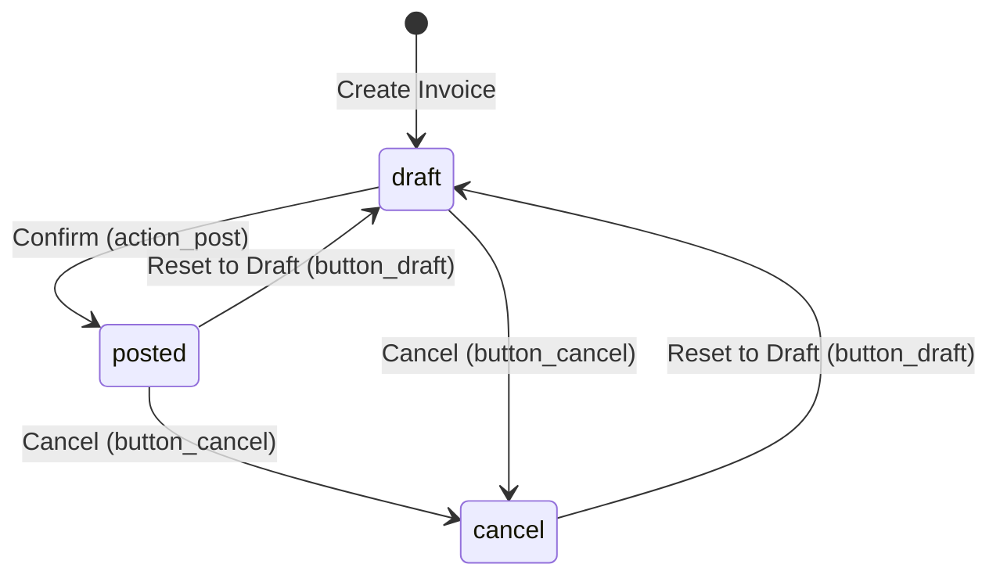
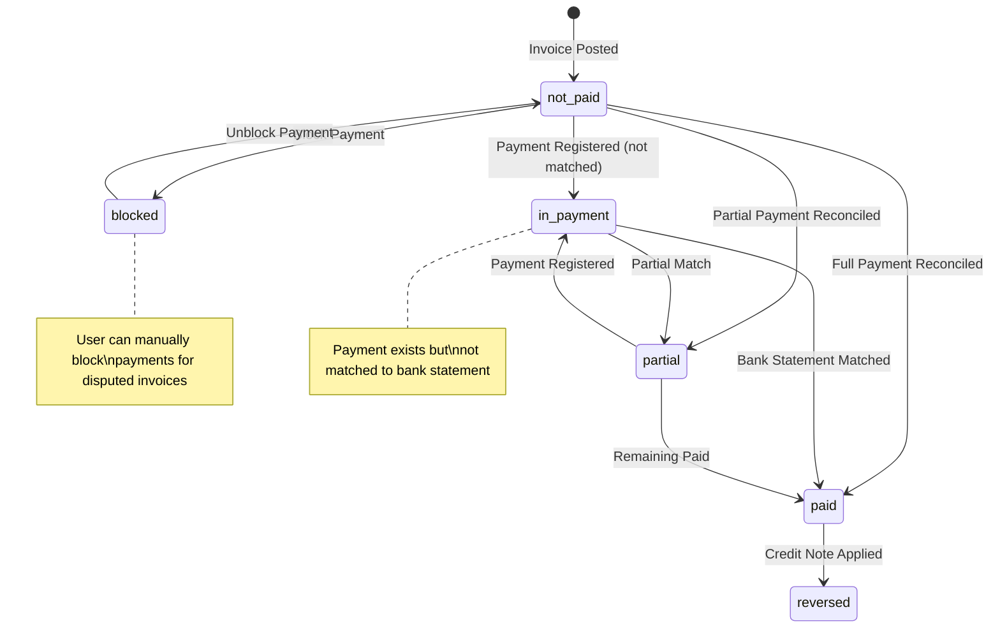

# Business Rules: Invoice Creation and Payment

## Overview

This document describes the business rules governing customer invoice creation and payment processing in Odoo 19.0. These rules ensure data integrity, proper financial tracking, and consistent behavior across the invoicing workflow.

**Related User Flow**: [Invoice Creation and Payment](../02-user-flows/06-invoice-creation-payment/flow-document.md)

**Primary Model**: `account.move` (Journal Entry/Invoice)  
**Supporting Model**: `account.payment` (Payment)

---

## Document Types (Move Types)

Odoo uses a single model (`account.move`) to handle different types of financial documents. The **Move Type** field determines the document's behavior and available actions.

### Customer Document Types

| Move Type | Display Name | Description | Journal Type Required |
|-----------|--------------|-------------|----------------------|
| `out_invoice` | Customer Invoice | Standard invoice sent to customers for goods/services | Sale |
| `out_refund` | Customer Credit Note | Reversal of a customer invoice (credit) | Sale |
| `out_receipt` | Sales Receipt | Immediate payment receipt (no receivable tracking) | Sale |

### Vendor Document Types

| Move Type | Display Name | Description | Journal Type Required |
|-----------|--------------|-------------|----------------------|
| `in_invoice` | Vendor Bill | Bill received from vendors for purchases | Purchase |
| `in_refund` | Vendor Credit Note | Reversal of a vendor bill (credit) | Purchase |
| `in_receipt` | Purchase Receipt | Immediate payment receipt from vendor | Purchase |

### General Accounting

| Move Type | Display Name | Description | Journal Type Required |
|-----------|--------------|-------------|----------------------|
| `entry` | Journal Entry | General accounting entry (debits and credits) | Any |

**Business Rule**: The document type cannot be changed after creation. To correct a wrong document type, the user must cancel the document and create a new one with the correct type.

---

## Invoice State Transitions

### State Definitions

An invoice progresses through the following states during its lifecycle:

| State | Display Name | Description |
|-------|--------------|-------------|
| `draft` | Draft | Invoice is being prepared; can be freely edited |
| `posted` | Posted | Invoice is confirmed; accounting entries created; number assigned |
| `cancel` | Cancelled | Invoice is cancelled; no longer affects accounting |

### State Transition Diagram

### Transition Actions and Rules

#### Draft → Posted (Confirm Invoice)

**Action**: `action_post()`  
**Source**: `addons/account/models/account_move.py:5954`

The system validates the following before posting:

| Validation | Error Message | Business Reason |
|------------|---------------|-----------------|
| Partner required for sales invoices | "The 'Customer' field is required to validate the invoice" | Revenue must be attributed to a customer |
| Partner required for purchase invoices | "The field 'Vendor' is required" | Expenses must be attributed to a vendor |
| Invoice date required for vendor bills | "The Bill/Refund date is required" | Vendor bills need original invoice date |
| At least one line item | "Even magicians can't post nothing!" | An empty invoice has no business purpose |
| Invoice must be in draft state | "The entry must be in draft" | Already posted entries cannot be reposted |
| Journal must be active | "You cannot post an entry in an archived journal" | Inactive journals cannot accept new entries |
| Currency must be active | "You cannot validate a document with an inactive currency" | Inactive currencies cannot be used |
| No negative total | "You cannot validate an invoice with a negative total" | Use credit notes for negative amounts |
| Accounts must be active | "A line is using an archived account" | Archived accounts cannot receive entries |
| Recipient bank account must be active | "The recipient bank account is archived" | Archived banks cannot receive payments |

**What happens when posted:**
1. Invoice number is assigned from the journal's sequence
2. Accounting entries are created in the general ledger
3. Invoice date is set to today if not specified (sales invoices only)
4. Payment state is set to `not_paid`
5. The invoice is marked as `posted_before = True`

#### Posted → Draft (Reset to Draft)

**Action**: `button_draft()`  
**Source**: `addons/account/models/account_move.py:6043`

**Prerequisites for resetting to draft:**

| Condition | Error Message | Business Reason |
|-----------|---------------|-----------------|
| Invoice must be posted or cancelled | "Only posted/cancelled entries can be reset" | Draft invoices are already in draft |
| No cancellation request pending | "You need to request a cancellation instead" | E-invoices sent to government require special handling |
| Not an exchange difference entry | "Cannot reset an exchange difference entry" | Exchange entries are system-generated |
| Not a tax cash basis entry | "Cannot reset a tax cash basis entry" | Cash basis entries are auto-managed |
| Not locked by hash | "Cannot reset a locked journal entry" | Hashed entries are immutable |

**What happens when reset to draft:**
1. All analytic entries are deleted
2. State changes to `draft`
3. Attached PDF reports are detached (allows regeneration)
4. Sending status is cleared

#### Posted → Cancel (Cancel Invoice)

**Action**: `button_cancel()`  
**Source**: `addons/account/models/account_move.py:6122`

**Cancellation process:**
1. If invoice is posted, it is first reset to draft
2. All reconciliations with payments are removed
3. Associated payments are set to "Canceled"
4. Auto-post setting is disabled
5. State changes to `cancel`

**Business Rule**: Cancelling a posted invoice that has payments will unreconcile those payments. The payments themselves remain but are no longer linked to this invoice.

---

## Payment State Tracking

### Payment State Definitions

The **Payment State** tracks whether an invoice has been paid. This is a computed field that updates automatically based on payment reconciliation.

| Payment State | Display Name | Description |
|---------------|--------------|-------------|
| `not_paid` | Not Paid | No payments have been applied to this invoice |
| `in_payment` | In Payment | Payment has been initiated but not yet confirmed at the bank |
| `partial` | Partially Paid | Some amount has been paid, but balance remains |
| `paid` | Paid | Invoice is fully paid and reconciled |
| `reversed` | Reversed | Invoice was paid but payment was reversed (e.g., via credit note) |
| `blocked` | Blocked | Payment is manually blocked by user (used for disputed invoices) |
| `invoicing_legacy` | Invoicing App Legacy | Legacy state from older Odoo versions |

### Payment State Diagram

### Payment State Computation Rules

**Source**: `addons/account/models/account_move.py:1226-1319`

The payment state is computed based on these conditions:

| Condition | Resulting State |
|-----------|-----------------|
| Invoice is not posted and has no amount | `not_paid` |
| Payment state manually set to `blocked` | `blocked` (preserved) |
| Payment state is `invoicing_legacy` | `invoicing_legacy` (preserved) |
| Amount residual is zero AND paid via payment/statement | `paid` or `in_payment` |
| Amount residual is zero AND paid via credit note only | `reversed` |
| Amount residual is not zero AND has partial reconciliation | `partial` |
| Payment exists but not matched at bank | `in_payment` |
| No payments and no reconciliation | `not_paid` |

**Business Rule**: The payment state cannot be manually edited except for the `blocked` state. All other states are computed automatically based on payment reconciliation.

#### Toggle Payment Block

**Action**: `action_toggle_block_payment()`

- If current state is `blocked`: Changes to `not_paid` and triggers recomputation
- If current state is `paid` or `in_payment`: Error - "You can't block a paid invoice"
- Otherwise: Changes to `blocked`

---

## Validation Rules (Constraints)

Odoo enforces several validation rules to ensure data integrity. These rules are checked when saving invoice records.

### Auto-Post Validation

**Constraint**: `_require_bill_date_for_autopost`  
**Source**: `addons/account/models/account_move.py:2809-2814`

**Rule**: Vendor bills configured for automatic posting must have an invoice date.

| Trigger | Error Message |
|---------|---------------|
| `auto_post` is not 'no' AND document is a purchase document AND `invoice_date` is empty | "For this entry to be automatically posted, it required a bill date" |

**Business Reason**: Auto-posted bills need a date to know when to post automatically. Without a date, the system cannot determine the correct posting date.

### Journal and Move Type Compatibility

**Constraint**: `_check_journal_move_type`  
**Source**: `addons/account/models/account_move.py:2816-2822`

**Rule**: The journal type must match the document type.

| Document Type | Required Journal Type | Error Message |
|---------------|----------------------|---------------|
| Vendor Bill, Vendor Credit Note, Purchase Receipt | Purchase | "Cannot create a purchase document in a non purchase journal" |
| Customer Invoice, Customer Credit Note, Sales Receipt | Sale | "Cannot create a sale document in a non sale journal" |

**Business Reason**: Sales and purchase documents must use their respective journals to ensure proper accounting treatment and reporting.

### Fiscal Position Tax Validation

**Constraint**: `_validate_taxes_country`  
**Source**: `addons/account/models/account_move.py:2824-2837`

**Rule**: Taxes on invoice lines must be compatible with the fiscal position's country.

| Condition | Error Message |
|-----------|---------------|
| Taxes belong to a different country than fiscal position | "This entry contains taxes that are not compatible with your fiscal position" |
| Taxes belong to a different country than company fiscal country | "This entry contains taxes incompatible with your fiscal country" |

**Business Reason**: Using taxes from the wrong country can cause incorrect tax reporting and compliance issues.

### Currency Rate Validation

**Constraint**: `_check_invoice_currency_rate`  
**Source**: `addons/account/models/account_move.py:2839-2850`

**Rule**: When using a foreign currency, the exchange rate must be positive.

| Condition | Error Message |
|-----------|---------------|
| Currency differs from company currency AND rate is <= 0 | "The currency rate must be strictly positive" |

**Business Reason**: A zero or negative exchange rate would create invalid accounting entries and incorrect currency conversions.

---

## Computed Fields and Calculations

### Amount Calculations

**Compute Method**: `_compute_amount`  
**Source**: `addons/account/models/account_move.py:1158-1224`

The following amounts are automatically calculated based on invoice lines:

| Field | Description | Calculation Logic |
|-------|-------------|-------------------|
| `amount_untaxed` | Subtotal before taxes | Sum of all product line amounts |
| `amount_tax` | Total tax amount | Sum of all tax line amounts |
| `amount_total` | Invoice total | `amount_untaxed` + `amount_tax` |
| `amount_residual` | Amount still due | Total minus reconciled payments |

**Signed Amount Fields** (for reporting):

| Field | Description |
|-------|-------------|
| `amount_untaxed_signed` | Untaxed amount in company currency (negative for outbound) |
| `amount_tax_signed` | Tax amount in company currency |
| `amount_total_signed` | Total in company currency |
| `amount_residual_signed` | Residual in company currency |

### Direction Sign Logic

**Compute Method**: `_compute_direction_sign`  
**Source**: `addons/account/models/account_move.py:1150-1156`

The direction sign determines how amounts are displayed:

| Document Type | Direction Sign | Effect |
|---------------|----------------|--------|
| Customer Invoice (out_invoice) | +1 | Amounts shown as positive |
| Customer Credit Note (out_refund) | -1 | Amounts shown as negative |
| Vendor Bill (in_invoice) | -1 | Amounts shown as negative |
| Vendor Credit Note (in_refund) | +1 | Amounts shown as positive |
| Journal Entry (entry) | +1 | Amounts shown as positive |

### Due Date Calculation

**Compute Method**: `_compute_invoice_date_due`  
**Dependencies**: `invoice_date`, `invoice_payment_term_id`, `invoice_date_due`

The due date is calculated based on:
1. If payment terms are specified: Calculate due date from invoice date using payment term rules
2. If no payment terms: Due date equals invoice date (immediate payment)
3. If manually set: Manual due date is preserved

---

## Access Control

### Security Groups

Access to invoice and payment features is controlled by security groups:

| Group | Technical Name | Permissions |
|-------|---------------|-------------|
| Billing | `account.group_account_invoice` | Create, edit, and manage invoices and payments |
| Show Accounting (Readonly) | `account.group_account_readonly` | View-only access to invoices and accounting |
| Accountant | `account.group_account_user` | Full access including journal entries |
| Billing Manager | `account.group_account_manager` | Administrative access, period management |

### Key Permission Rules

| Action | Required Group |
|--------|----------------|
| Create/Edit invoices | `group_account_invoice` |
| Post invoices | `group_account_invoice` |
| View payment widgets | `group_account_invoice` OR `group_account_readonly` |
| Reset to draft | `group_account_invoice` |
| Cancel invoices | `group_account_invoice` |
| View journal entries | `group_account_readonly` |
| Manage lock dates | `group_account_manager` |

---

## Lock Date Enforcement

### Fiscal Lock Dates

Posted invoices are protected by lock dates to prevent changes to closed accounting periods.

**Check Method**: `_check_fiscal_lock_dates`  
**Source**: `addons/account/models/account_move.py:2790-2807`

| Lock Date Type | Applies To | Who Can Modify |
|----------------|------------|----------------|
| Fiscal Year Lock | All journal entries | Only advisors |
| Sales Lock | Sale journal entries | Accountants with permission |
| Purchase Lock | Purchase journal entries | Accountants with permission |
| Tax Lock | Entries affecting tax reports | Only advisors |
| Hard Lock | All entries up to date | No one |

**Error Message**: "You cannot add/modify entries prior to and inclusive of: [lock date info]"

---

## Integration Points

### Invoice to Payment Flow

When registering a payment from an invoice:

1. User clicks "Pay" button on posted invoice
2. Payment Registration wizard opens (`account.payment.register`)
3. User selects payment journal, date, and amount
4. System creates `account.payment` record
5. Payment creates corresponding `account.move` (journal entry)
6. Invoice and payment are reconciled automatically
7. Invoice `payment_state` updates to `paid` or `partial`

### Automatic Reversals

When a customer invoice is fully paid by a credit note:

1. Credit note is posted
2. Credit note is reconciled with original invoice
3. Both documents show `payment_state = 'reversed'`
4. No cash movement occurs (accounting offset only)

---

## Error Scenarios and Handling

### Common Validation Errors

| Scenario | Error Message | Resolution |
|----------|---------------|------------|
| Missing customer on sales invoice | "The 'Customer' field is required" | Select a customer before confirming |
| Missing vendor on purchase bill | "The field 'Vendor' is required" | Select a vendor before confirming |
| Negative invoice total | "You cannot validate an invoice with a negative total" | Create a credit note instead |
| Posting to locked period | "Cannot add/modify entries prior to..." | Change invoice date or adjust lock dates |
| Archived journal | "Cannot post in an archived journal" | Use an active journal |
| Inactive currency | "Cannot validate with inactive currency" | Activate currency or choose another |

### Recovery Actions

| Problem | Recovery Steps |
|---------|----------------|
| Invoice posted with errors | 1. Reset to draft, 2. Make corrections, 3. Repost |
| Wrong payment applied | 1. Unreconcile payment, 2. Apply to correct invoice |
| Need to change posted invoice | 1. Create credit note, 2. Create new invoice with corrections |

---

## Best Practices

### For Accurate Financial Records

1. **Always verify customer/vendor** before posting invoices
2. **Review tax calculations** to ensure correct tax treatment
3. **Check due dates** align with agreed payment terms
4. **Use appropriate journals** for different transaction types
5. **Reconcile payments promptly** to maintain accurate aging reports

### For Efficient Processing

1. **Use payment terms** instead of manual due dates for consistency
2. **Group similar invoices** when registering batch payments
3. **Review outstanding credits** before creating new invoices
4. **Set up automatic posting** for recurring invoices where appropriate

---

## Source Code References

| Feature | File | Line |
|---------|------|------|
| State definitions | `addons/account/models/account_move.py` | 128-140 |
| Payment state selection | `addons/account/models/account_move.py` | 47-55 |
| Move type selection | `addons/account/models/account_move.py` | 141-158 |
| Payment state computation | `addons/account/models/account_move.py` | 1226-1319 |
| Amount computation | `addons/account/models/account_move.py` | 1158-1224 |
| Auto-post constraint | `addons/account/models/account_move.py` | 2809-2814 |
| Journal type constraint | `addons/account/models/account_move.py` | 2816-2822 |
| Tax country constraint | `addons/account/models/account_move.py` | 2824-2837 |
| Currency rate constraint | `addons/account/models/account_move.py` | 2839-2850 |
| Post action | `addons/account/models/account_move.py` | 5954-5975 |
| Reset to draft action | `addons/account/models/account_move.py` | 6043-6055 |
| Cancel action | `addons/account/models/account_move.py` | 6122-6134 |
| Payment model | `addons/account/models/account_payment.py` | 6-200 |
| Security groups | `addons/account/security/account_security.xml` | 1-60 |
