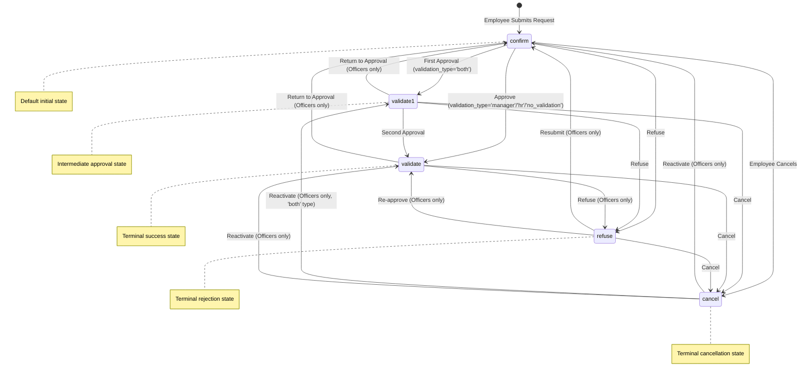

# Business Rules: Employee Leave Request

## Overview

This document describes the business rules that govern the employee leave request workflow in Odoo 19.0. These rules ensure that time off requests are properly validated, approved according to organizational policies, and accurately tracked against available allocations.

**Core Model**: `hr.leave` (Time Off Request)

**Related Flow Document**: [Employee Leave Request Flow](../02-user-flows/11-employee-leave-request/flow-document.md)

**Source Reference**: `addons/hr_holidays/models/hr_leave.py`

---

## 1. Validation Logic

This section documents the validation rules that are automatically enforced when leave requests are created or modified. These validations ensure data integrity and business policy compliance.

### 1.1 Contract Schedule Consistency

**Rule Name**: Leave Cannot Span Multiple Schedules

**Source**: `hr_leave.py:400-427` (`@api.constrains('date_from', 'date_to')` - `_check_contracts`)

**Business Purpose**: Ensures accurate duration calculations by preventing leaves from crossing contract boundaries with different working schedules.

**When It Applies**:
- When a leave request is created
- When the dates of an existing request are modified
- Only applies to employees with contract records

**What Gets Validated**:

The system checks whether the leave period overlaps with multiple employee contracts (versions) that have different working calendars. If the employee has multiple contracts during the requested leave period with different schedules, the request is rejected.

**User-Facing Behavior**:

| Scenario | System Response |
|----------|-----------------|
| Leave is within a single contract period | Request proceeds normally |
| Leave spans two contracts with the **same** schedule | Request proceeds normally |
| Leave spans two contracts with **different** schedules | Error message displayed |

**Error Message**:
> "A leave cannot be set across multiple versions with different working schedules. Please create one time off for each version period."

The error message also lists the affected contract versions with their date ranges.

**Example**:

An employee has:
- Contract A (8-hour schedule): January 1 - March 31
- Contract B (4-hour schedule): April 1 - ongoing

If the employee requests leave from March 28 to April 5:
- The system detects two contracts with different schedules
- The request is rejected
- The employee must submit two separate requests: March 28-31 and April 1-5

**Business Rationale**: Different working schedules mean different durations would be calculated for the same calendar period, leading to inaccurate leave balance tracking.

---

### 1.2 Overlapping Leave Prevention

**Rule Name**: No Overlapping Time Off Requests

**Source**: `hr_leave.py:735-741` (`@api.constrains('date_from', 'date_to', 'employee_id')` - `_check_date`)

**Business Purpose**: Prevents employees from having multiple concurrent leave requests for the same time period.

**When It Applies**:
- When a leave request is created
- When dates are modified on an existing request
- Can be bypassed with context flag `leave_skip_date_check=True` (for administrative operations)

**What Gets Validated**:

The system checks the `dashboard_warning_message` computed field, which identifies any existing overlapping leave requests for the same employee. The validation excludes:
- Cancelled requests (state = 'cancel')
- Refused requests (state = 'refuse')
- Leave types that explicitly allow stacking (`allow_request_on_top = True`)

**User-Facing Behavior**:

| Scenario | System Response |
|----------|-----------------|
| No existing leave for the period | Request proceeds normally |
| Existing active leave overlaps | Error with details of conflicting leave |
| Existing cancelled/refused leave overlaps | Request proceeds normally |
| Leave type allows stacking | Request proceeds normally |

**Error Message**:

The error displays details about the conflicting leave request(s):
> "[Employee Name] already has a [State] leave request from [Date From] to [Date To]"

**Business Rationale**: Ensures accurate absence tracking and prevents double-counting of leave days.

---

### 1.3 Validated Leave Protection

**Rule Name**: Cannot Modify Approved Leaves

**Source**: `hr_leave.py:743-749` (`@api.constrains('date_from', 'date_to', 'employee_id')` - `_check_date_state`)

**Business Purpose**: Protects the integrity of approved leave records by preventing date modifications after approval.

**When It Applies**:
- When attempting to modify dates on a leave request
- Can be bypassed with context flag `leave_skip_state_check=True` (for administrative operations)

**What Gets Validated**:

The system checks if the leave request is in state `validate1` (first approval complete) or `validate` (fully approved). If so, date modifications are blocked.

**User-Facing Behavior**:

| Leave State | Can Modify Dates? |
|-------------|-------------------|
| `confirm` (To Approve) | Yes |
| `validate1` (Second Approval) | No |
| `validate` (Approved) | No |
| `refuse` (Refused) | Yes |
| `cancel` (Cancelled) | Yes |

**Error Message**:
> "This modification is not allowed in the current state."

**Business Rationale**: Once a leave has been approved, calendar events and resource allocations have been created. Changing dates would desynchronize these related records.

**Alternative Actions**: To change dates on an approved leave, the user must:
1. Cancel the existing leave request
2. Create a new request with the correct dates

---

### 1.4 Allocation Balance Validation

**Rule Name**: Sufficient Leave Balance Required

**Source**: `hr_leave.py:751-788` (`_check_validity` method called from `create` and `write`)

**Business Purpose**: Ensures employees cannot request more leave than their allocated balance allows.

**When It Applies**:
- When a leave request is created
- When dates, employee, or leave type are modified
- Does NOT apply when state changes to 'refuse' or 'cancel'

**What Gets Validated**:

For leave types that require allocation (`requires_allocation = True`), the system verifies:

1. **Allocation Exists**: The employee must have at least one valid allocation for the leave type
2. **Sufficient Balance**: The requested duration must not exceed available balance

**Negative Balance Handling**:

If the leave type allows negative balance (`allows_negative = True`):
- Requests can exceed available balance up to `max_allowed_negative` limit
- Beyond that limit, the request is rejected

**User-Facing Behavior**:

| Scenario | System Response |
|----------|-----------------|
| No allocation exists | Error: "You do not have any allocation for this time off type..." |
| Insufficient balance | Error: "There is no valid allocation to cover that request." |
| Balance available | Request proceeds normally |
| Negative allowed and within limit | Request proceeds normally |
| Negative allowed but exceeds limit | Error: "There is no valid allocation to cover that request." |

**Error Messages**:

For no allocation:
> "You do not have any allocation for this time off type. Please request an allocation before submitting your time off request."

For insufficient balance:
> "There is no valid allocation to cover that request."

**Business Rationale**: Prevents overbooking of leave entitlements and ensures compliance with company leave policies.

---

### 1.5 Mandatory Day Restrictions

**Rule Name**: Non-HR Users Cannot Request Leave on Mandatory Days

**Source**: `hr_leave.py:786-788` (within `_check_validity`)

**Business Purpose**: Enforces organizational policies about mandatory work days where time off is restricted.

**When It Applies**:
- When any user without Time Off Officer privileges submits a leave request
- The `has_mandatory_day` computed field identifies affected requests

**What Gets Validated**:

If the leave request overlaps with any dates configured as mandatory days in the system, and the requesting user is not a Time Off Officer, the request is blocked.

**User-Facing Behavior**:

| User Role | Request Overlaps Mandatory Day | Result |
|-----------|-------------------------------|--------|
| Regular Employee | Yes | Blocked |
| Regular Employee | No | Allowed |
| Time Off Officer | Yes | Allowed |
| Time Off Officer | No | Allowed |

**Error Message**:
> "You are not allowed to request time off on a Mandatory Day"

**Mandatory Day Configuration**:

Mandatory days are configured per:
- Resource calendar
- Department (or all departments)
- Company

**Business Rationale**: Allows organizations to define critical business periods where employee presence is required, such as inventory counts, year-end processing, or major events.

---

### 1.6 Database-Level Constraints

The following constraints are enforced at the database level for data integrity:

**Date Ordering Constraint** (Source: `hr_leave.py:235-238`):
```sql
CHECK ((date_from <= date_to))
```
> "The start date must be before or equal to the end date."

**Request Date Ordering Constraint** (Source: `hr_leave.py:239-242`):
```sql
CHECK ((request_date_from <= request_date_to))
```
> "The request start date must be before or equal to the request end date."

**Duration Non-Negative Constraint** (Source: `hr_leave.py:243-246`):
```sql
CHECK ( number_of_days >= 0 )
```
> "If you want to change the number of days you should use the 'period' mode"

---

## 2. State Transitions

This section documents the leave request lifecycle and the rules governing state changes.

### 2.1 State Definitions

**Source**: `hr_leave.py:129-135`

| State Code | Display Label | Description |
|------------|---------------|-------------|
| `confirm` | To Approve | Initial state when request is submitted; awaiting first approval |
| `validate1` | Second Approval | First approval complete; awaiting second approval (only for 'both' validation type) |
| `validate` | Approved | Request fully approved; leave is confirmed |
| `refuse` | Refused | Request rejected by an approver |
| `cancel` | Cancelled | Request cancelled by the employee |

### 2.2 State Transition Diagram



### 2.3 Transition Rules by Role

**Source**: `hr_leave.py:1319-1363` (`_get_next_states_by_state`)

The allowed state transitions depend on the user's role and relationship to the leave request:

#### Employee (Own Leave)

| Current State | Allowed Transitions | Notes |
|--------------|---------------------|-------|
| `confirm` | - | Cannot self-approve |
| `validate1` | `cancel` | Can cancel after first approval |
| `validate` | `cancel` | Can cancel approved leave |
| `refuse` | `cancel` | Can cancel refused request |
| `cancel` | - | Terminal state |

**Restriction**: Past leaves (where `date_from < today`) cannot be cancelled unless the user is also a Time Off Officer.

#### Employee's Manager (`leave_manager_id`)

| Current State | Allowed Transitions | Condition |
|--------------|---------------------|-----------|
| `confirm` | `validate1` | Only if validation_type='both' |
| `confirm` | `validate` | Only if validation_type='manager' |
| `confirm` | `refuse` | If validation_type is 'manager' or 'both' |
| `validate1` | `refuse` | For validation_type='both' |
| `validate` | `refuse` | For validation_type='manager' |
| `refuse` | `validate` | Only if validation_type='manager' |

#### Time Off Officer (`group_hr_holidays_user`)

Officers have expanded transition capabilities:

| Current State | Allowed Transitions |
|--------------|---------------------|
| `confirm` | `validate1`, `validate`, `refuse` |
| `validate1` | `confirm`, `validate`, `refuse` |
| `validate` | `confirm`, `refuse` |
| `refuse` | `confirm`, `validate` |
| `cancel` | `confirm`, `validate`, `refuse`, `validate1`* |

*`validate1` is only allowed for validation_type='both'

### 2.4 Actions Triggered by State Changes

#### Transition to `validate1` (First Approval)

**Source**: `hr_leave.py:1095-1110` (`action_approve`)

When moving from `confirm` to `validate1`:
1. `first_approver_id` is set to the approving employee
2. Activity is updated to notify the second approver
3. State changes to 'validate1'

#### Transition to `validate` (Final Approval)

**Source**: `hr_leave.py:1183-1208` (`_action_validate`)

When moving to `validate`:
1. For validation_type='both': `second_approver_id` is set
2. For other types: `first_approver_id` is set
3. Resource leave is created (blocks time in scheduling)
4. Calendar event is created (if configured on leave type)
5. Notification is sent to the employee
6. Allocation balance is updated

#### Transition to `refuse`

**Source**: `hr_leave.py:1210-1229` (`action_refuse`)

When refusing a request:
1. `first_approver_id` or `second_approver_id` is set based on prior state
2. Associated calendar meeting is deactivated
3. Employee receives refusal notification
4. If previously approved, the manager is notified

#### Transition to `cancel`

**Source**: `hr_leave.py:1249-1306` (`_action_user_cancel`, `_force_cancel`)

When cancelling:
1. Reason can be optionally provided
2. Calendar meeting is deactivated
3. Resource leave is removed
4. Notifications sent to relevant approvers
5. Allocation balance is restored

---

## 3. Computation Rules

This section documents the computed fields that automatically calculate values based on other field changes.

### 3.1 Date and Time Calculation

**Field Names**: `date_from`, `date_to`

**Source**: `hr_leave.py:429-465` (`@api.depends` - `_compute_date_from_to`)

**Dependencies**:
- `request_date_from_period` (morning/afternoon selection)
- `request_date_to_period` (morning/afternoon selection)
- `request_hour_from` (specific start hour)
- `request_hour_to` (specific end hour)
- `request_date_from` (start date)
- `request_date_to` (end date)
- `request_unit_half` (half-day mode)
- `request_unit_hours` (hourly mode)
- `employee_id`

**Computation Logic**:

The system converts user-friendly date inputs into precise datetime values stored in UTC:

| Input Mode | How Start/End Times are Determined |
|------------|-----------------------------------|
| **Full Day** | Start: Beginning of first work interval on start date<br>End: End of last work interval on end date |
| **Half Day** | Uses `request_date_from_period` and `request_date_to_period` (morning/afternoon) to determine work intervals |
| **Hourly** | Uses `request_hour_from` and `request_hour_to` directly |

**Timezone Handling**:
- User inputs are interpreted in the employee's timezone
- Stored values are converted to UTC
- The `tz` computed field determines the applicable timezone from the resource calendar

**Example**:

Employee in "Europe/Paris" timezone requests:
- Date: January 15, 2025
- Type: Full day

System calculates:
1. Looks up work intervals from employee's calendar
2. Finds work starts at 8:00 and ends at 17:00 (local)
3. Converts to UTC: `date_from = 2025-01-15 07:00:00`, `date_to = 2025-01-15 16:00:00`

---

### 3.2 Duration Calculation

**Field Names**: `number_of_days`, `number_of_hours`

**Source**: `hr_leave.py:632-638` (`@api.depends` - `_compute_duration`)

**Dependencies**:
- `date_from`
- `date_to`
- `resource_calendar_id`
- `holiday_status_id.request_unit`

**Computation Logic**:

Duration is calculated based on the employee's working calendar:

1. **Standard Calculation**: Uses `_get_work_days_data_batch` to compute actual work hours between dates
2. **Day-Based Leave Types**: If `request_unit = 'day'`, days are rounded up to whole numbers
3. **Flexible Employees**: For employees marked as flexible, single-day leaves use actual duration
4. **Public Holidays**: Optionally excluded based on leave type setting `include_public_holidays_in_duration`

**Calculation Scenarios**:

| Scenario | Calculation Method |
|----------|-------------------|
| Full week, 40hr/week employee | Count work days and hours from calendar |
| Half day | 0.5 days or actual hours |
| Hourly request | Actual hours requested |
| Spans public holiday | Holiday excluded unless leave type includes them |
| Day-based leave type | Duration rounded up to whole days |

**Example**:

Employee with standard 8-hour days requests Monday through Friday:
- System checks calendar for work intervals
- Excludes any public holidays
- Result: `number_of_days = 5`, `number_of_hours = 40`

---

### 3.3 Allocation Balance Display

**Field Names**: `max_leaves`, `virtual_remaining_leaves`

**Source**: `hr_leave.py:716-728` (`@api.depends` - `_compute_leaves`)

**Dependencies**:
- `employee_id`
- `holiday_status_id`

**Computation Logic**:

These fields calculate the employee's leave balance for display purposes:

| Field | Meaning |
|-------|---------|
| `max_leaves` | Total allocated leave for the selected type |
| `virtual_remaining_leaves` | Remaining balance after all pending and approved requests |

**Calculation**:
1. Retrieves all active allocations for the employee and leave type
2. Sums up `max_leaves` from valid allocations (not expired)
3. Calculates `virtual_remaining_leaves` by subtracting consumed and pending leave

**Display Context**:
- Shows on the leave request form to help employees see their balance
- "Virtual" remaining includes pending requests not yet approved

---

### 3.4 Department Derivation

**Field Name**: `department_id`

**Source**: `hr_leave.py:501-504` (`@api.depends` - `_compute_department_id`)

**Dependencies**:
- `employee_id`

**Computation Logic**:

The department is automatically populated from the selected employee:

```
department_id = employee_id.department_id
```

**Business Purpose**:
- Enables filtering and reporting by department
- Determines which officers can approve (some rules are department-based)

---

### 3.5 Working Hours Derivation

**Field Name**: `request_hour_from`, `request_hour_to`

**Source**: `hr_leave.py:255-267` (`@api.depends` - `_compute_request_hour_from_to`)

**Dependencies**:
- `employee_id`
- `request_date_from`
- `request_date_to`
- `request_unit_hours`

**Computation Logic**:

When not in hourly mode, default work hours are populated from the employee's calendar:

1. Look up the resource calendar
2. Find work intervals for the requested dates
3. Set `request_hour_from` to start of first interval
4. Set `request_hour_to` to end of last interval

**Example**:
Employee's calendar shows work from 9:00-17:00:
- `request_hour_from` = 9.0
- `request_hour_to` = 17.0

---

### 3.6 Duration Display Formatting

**Field Name**: `duration_display`

**Source**: `hr_leave.py:661-676` (`@api.depends` - `_compute_duration_display`)

**Dependencies**:
- `number_of_hours`
- `number_of_days`
- `leave_type_request_unit`

**Computation Logic**:

Formats the duration for user-friendly display:

| Leave Type Unit | Display Format |
|-----------------|----------------|
| Day or Half-Day | "X days" (e.g., "2 days", "0.5 days") |
| Hour | "H:MM hours" (e.g., "4:30 hours") |

**Example**:
- 2.5 days → "2.5 days"
- 4 hours 30 minutes → "4:30 hours"

---

### 3.7 Can Approve/Validate/Refuse/Cancel Permissions

**Field Names**: `can_approve`, `can_validate`, `can_refuse`, `can_cancel`, `can_back_to_approve`

**Source**: `hr_leave.py:678-702`

**Dependencies**:
- `state`
- `employee_id`
- `department_id`

**Computation Logic**:

These fields determine which action buttons to display:

| Field | True When |
|-------|-----------|
| `can_approve` | User can perform first approval (move to validate1) |
| `can_validate` | User can perform final validation (move to validate) |
| `can_refuse` | User can refuse the request |
| `can_cancel` | User can cancel the request |
| `can_back_to_approve` | User can return an approved request to confirm state |

The logic uses `_check_approval_update` to verify permissions based on:
- Current state
- User's security groups
- User's relationship to the employee (manager, same department, etc.)
- Validation type configured on the leave type

---

## 4. Validation Types

The Time Off Type configuration determines the approval workflow. The `leave_validation_type` field on `hr.leave.type` specifies which approval process to use.

### 4.1 No Validation (`no_validation`)

**Description**: Leave requests are automatically approved upon submission.

**Use Cases**:
- High-trust environments
- Certain leave types that don't require oversight
- Automatic time-off for specific conditions

**Workflow**:
```
Submit → Auto-approve → Calendar Created
```

**States Visited**: `confirm` → `validate`

---

### 4.2 HR Officer Approval (`hr`)

**Description**: Leave requests require approval from a Time Off Officer.

**Approvers**: Any user with `group_hr_holidays_user` security group

**Approval Criteria**:
The officer can approve if they:
- Are the employee's manager, OR
- Are the department manager, OR
- Belong to the same department, OR
- The employee has no manager and no department manager

**Workflow**:
```
Submit → Officer Reviews → Approve/Refuse → Calendar Created (if approved)
```

**States Visited**: `confirm` → `validate` (or `refuse`)

---

### 4.3 Manager Approval (`manager`)

**Description**: Leave requests require approval from the employee's designated Time Off Manager.

**Approvers**: The user set in the employee's `leave_manager_id` field

**Workflow**:
```
Submit → Manager Reviews → Approve/Refuse → Calendar Created (if approved)
```

**States Visited**: `confirm` → `validate` (or `refuse`)

---

### 4.4 Double Approval (`both`)

**Description**: Leave requests require two levels of approval.

**First Approval**: Manager (employee's `leave_manager_id`)
**Second Approval**: Time Off Officer (`group_hr_holidays_user`)

**Workflow**:
```
Submit → Manager Approves → Officer Validates → Calendar Created
           ↓                    ↓
         Refuse              Refuse
```

**States Visited**: `confirm` → `validate1` → `validate`

**Fields Used**:
- `first_approver_id`: Set after manager approval
- `second_approver_id`: Set after officer validation

---

### 4.5 Validation Type Summary

| Type | Approval Levels | Approvers | Intermediate State |
|------|-----------------|-----------|-------------------|
| `no_validation` | 0 | Automatic | None |
| `hr` | 1 | Time Off Officer | None |
| `manager` | 1 | Employee's Manager | None |
| `both` | 2 | Manager, then Officer | `validate1` |

---

## 5. Access Control

This section documents the security groups and record-level access rules that control who can view and modify leave requests.

### 5.1 Security Groups

**Source**: `addons/hr_holidays/security/hr_holidays_security.xml`

#### Group Hierarchy

```
base.group_user (Internal User)
        ↓
group_hr_holidays_responsible (Time Off: Responsible)
        ↓
group_hr_holidays_user (Time Off: Officer)
        ↓
group_hr_holidays_manager (Time Off: Administrator)
```

#### Group Definitions

| Group | Technical Name | Permissions |
|-------|---------------|-------------|
| **Time Off Responsible** | `hr_holidays.group_hr_holidays_responsible` | Can view team time off requests. Implied by internal user. |
| **Time Off Officer** | `hr_holidays.group_hr_holidays_user` | Can manage and approve time off requests within scope. Also has HR user access. |
| **Time Off Administrator** | `hr_holidays.group_hr_holidays_manager` | Full administrative access to all time off records. Includes root and admin users. |

### 5.2 Model-Level Access (CRUD)

**Source**: `addons/hr_holidays/security/ir.model.access.csv`

| Group | Create | Read | Update | Delete |
|-------|--------|------|--------|--------|
| Internal User | Yes | Yes | Yes | Yes |
| Time Off Officer | Yes | Yes | Yes | Yes |
| Time Off Manager | Yes | Yes | Yes | Yes |

**Note**: All internal users can perform CRUD operations on `hr.leave`, but record rules (below) restrict which records they can access.

### 5.3 Record-Level Access Rules

The following record rules determine which specific leave requests a user can access:

#### Read Access Rules

| Rule | Applies To | Domain |
|------|-----------|--------|
| Employee sees own | Internal Users | Leave belongs to user's employee record |
| Manager sees team | Internal Users | Leave belongs to employees the user manages |
| Officer sees all | Time Off Officer | All leaves (no domain restriction) |
| Multi-company | All Users | Leave's company matches user's allowed companies |

#### Write/Delete Access Rules

| Action | Allowed For | Conditions |
|--------|-------------|------------|
| Create own request | All employees | - |
| Modify own request | Request owner | State is `confirm` only |
| Modify any request | Officer/Manager | Based on validation type and state |
| Delete own request | Request owner | State is `confirm`, `validate1`, or `cancel`; not in the past |
| Delete any request | Manager only | Confirmed or cancelled requests |

### 5.4 Field-Level Security

Certain fields have restricted visibility:

| Field | Visible To | Reason |
|-------|-----------|--------|
| `private_name` | Time Off Responsible and above | May contain sensitive information |
| `name` (computed) | Shows generic text for non-owners | Privacy protection |

**Name Field Behavior**:
- For the request owner: Shows the private description
- For other employees: Shows generic "Time Off" label
- For HR personnel: Shows full description

### 5.5 State-Based Write Restrictions

**Source**: `hr_leave.py:903-942`

| User Role | Can Modify States |
|-----------|-------------------|
| Request Owner | `confirm` only (with restrictions on past leaves) |
| Time Off Officer | All states except `cancel` (for non-own requests) |
| Time Off Manager | All states |

**Past Leave Modification**:
- Non-officers cannot modify leaves where `date_from < today` unless:
  - They are the employee's leave manager, AND
  - The leave is in `confirm` or `draft` state

---

## 6. Integration Rules

### 6.1 Calendar Event Creation

**Trigger**: Leave enters `validate` state

**Conditions**: Leave type has `create_calendar_meeting = True`

**Source**: `hr_leave.py:1007-1040`

**Event Properties**:
| Property | Value |
|----------|-------|
| Name | "[Employee] on Time Off : [Duration]" |
| Privacy | Confidential |
| Attendees | Employee (via partner) |
| Duration | Leave duration in hours |
| All-day | True for full-day leaves |

### 6.2 Resource Calendar Leave

**Trigger**: Leave enters `validate` state

**Purpose**: Blocks the time period in resource scheduling

**Source**: `hr_leave.py:996-1005`

**Created Record**:
- Model: `resource.calendar.leaves`
- Links to employee's resource
- Used by scheduling systems to know employee is unavailable

### 6.3 Allocation Balance Updates

**Trigger**: Leave state changes

**Source**: Multiple locations; balance computed from `hr.leave.allocation`

**Behavior**:
- Approved leaves reduce `virtual_remaining_leaves`
- Cancelled/refused leaves restore balance
- Pending leaves show in "virtual" balance

---

## 7. Error Scenarios and Handling

### 7.1 Common Error Messages

| Error | Cause | Resolution |
|-------|-------|------------|
| "A leave cannot be set across multiple versions..." | Leave spans contracts with different schedules | Submit separate requests for each period |
| "You do not have any allocation..." | No allocation for this leave type | Request an allocation first |
| "There is no valid allocation..." | Insufficient balance | Reduce duration or request more allocation |
| "This modification is not allowed..." | Attempting to modify approved leave | Cancel and recreate the request |
| "You are not allowed to request time off on a Mandatory Day" | Overlaps with mandatory work day | Choose different dates or contact HR |
| "Only a Time Off Officer/Manager can approve/refuse..." | Insufficient permissions | Request from authorized approver |
| "You can only cancel your own leave" | Attempting to cancel another's leave | Contact HR or the request owner |

### 7.2 Validation Timing

| Validation | When Checked |
|------------|--------------|
| Date overlap | On create and date modification |
| Allocation balance | On create and date/employee/type modification |
| Contract consistency | On create and date modification |
| Mandatory days | On create and date modification |
| State transitions | On explicit state change |

---

## 8. Related Documentation

- **User Flow**: [Employee Leave Request Flow](../02-user-flows/11-employee-leave-request/flow-document.md)
- **Capabilities**: [Capabilities Inventory - Time Off Module](../01-capabilities-overview/capabilities-inventory.md)
- **Allocation Rules**: [Leave Allocation Business Rules](./leave-allocation-rules.md) (if available)

---

## Source Citations

| Rule/Feature | Source File | Line Numbers |
|--------------|-------------|--------------|
| State definitions | `hr_leave.py` | 129-135 |
| Database constraints | `hr_leave.py` | 235-246 |
| Contract check | `hr_leave.py` | 400-427 |
| Date computation | `hr_leave.py` | 429-465 |
| Department computation | `hr_leave.py` | 501-504 |
| Duration computation | `hr_leave.py` | 632-638 |
| Balance computation | `hr_leave.py` | 716-728 |
| Date overlap check | `hr_leave.py` | 735-741 |
| State modification check | `hr_leave.py` | 743-749 |
| Validity check | `hr_leave.py` | 751-788 |
| Approve action | `hr_leave.py` | 1095-1110 |
| Validate action | `hr_leave.py` | 1183-1208 |
| Refuse action | `hr_leave.py` | 1210-1229 |
| Cancel action | `hr_leave.py` | 1249-1306 |
| State transitions | `hr_leave.py` | 1319-1363 |
| Approval check | `hr_leave.py` | 1365-1420 |
| Security groups | `hr_holidays_security.xml` | Various |
| Model access | `ir.model.access.csv` | Various |
