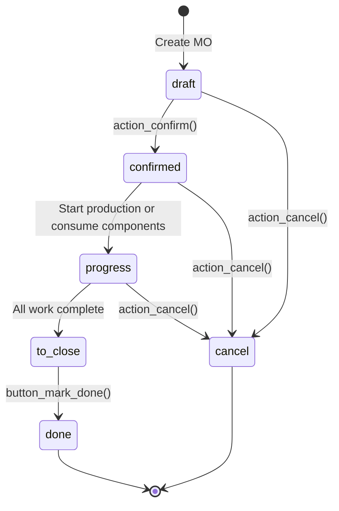

# Manufacturing Production Order Business Rules

## Document Overview

This document describes the business rules governing Manufacturing Orders in Odoo 19.0. It covers the validation logic, state transitions, computation rules, Bill of Materials (BOM) rules, and access control that ensure manufacturing processes operate correctly and consistently.

**Related Documentation:**
- [Manufacturing Production Order Workflow](../02-user-flows/08-manufacturing-production-order/flow-document.md)

### Purpose and Audience

**Target Audience:**
- **Customer Support Teams**: Use this reference to understand why certain operations succeed or fail
- **Business Analysts**: Reference these rules when designing manufacturing processes
- **Production Managers**: Understand the constraints that govern production operations

---

## 1. Validation Logic

This section documents the constraints that Odoo enforces to maintain data integrity in manufacturing operations. These rules trigger automatically when records are created or modified, preventing invalid data from being saved.

### 1.1 By-Product Cost Share Validation

**Rule Name:** `_check_byproducts`

**Source:** `addons/mrp/models/mrp_production.py:952-958`

**When This Rule Triggers:**
This validation runs whenever the finished product moves (`move_finished_ids`) are modified on a Manufacturing Order.

**Business Purpose:**
When manufacturing produces by-products alongside the main product, the total production cost can be allocated among the finished products. This rule ensures that cost allocations are mathematically valid.

**Validation Rules:**

| Rule | Description | Error Message |
|------|-------------|---------------|
| Positive Cost Shares | Each by-product's cost share must be zero or positive | "By-products cost shares must be positive." |
| Maximum Total | The sum of all by-product cost shares cannot exceed 100% | "The total cost share for a manufacturing order's by-products cannot exceed 100." |

**What This Means for Users:**
- When adding by-products to a Manufacturing Order, you must specify a cost share between 0% and 100% for each by-product
- The combined cost share of all by-products cannot exceed 100%
- The remaining percentage (100% minus total by-product shares) is automatically allocated to the main product

**Example Scenario:**
If a Manufacturing Order produces:
- Main Product: Chair (cost share will be the remainder)
- By-Product A: Wood Scraps (cost share: 5%)
- By-Product B: Sawdust (cost share: 3%)

The main product (Chair) would receive 92% of the production cost (100% - 5% - 3%).

If you tried to set By-Product A to 60% and By-Product B to 50%, the system would reject the change because the total (110%) exceeds 100%.

---

### 1.2 Lot/Serial Number Validation for Lot-Tracked Products

**Rule Name:** `_check_lot_producing_ids`

**Source:** `addons/mrp/models/mrp_production.py:960-964`

**When This Rule Triggers:**
This validation runs whenever the lot producing field (`lot_producing_ids`) is modified on a Manufacturing Order.

**Business Purpose:**
For products tracked by lot numbers (as opposed to serial numbers), each Manufacturing Order should produce into a single lot. This ensures proper lot traceability and prevents accidental mixing of production batches.

**Validation Rule:**

| Condition | Requirement | Error Message |
|-----------|-------------|---------------|
| Product tracking = "By Lots" | Maximum one lot number allowed | "You cannot set more than 1 lot" |

**What This Means for Users:**
- If your finished product is tracked by **lot numbers**, you can only assign one lot number per Manufacturing Order
- If you need to produce into multiple lots, create separate Manufacturing Orders for each lot
- This rule does **not** apply to products tracked by **serial numbers** (where multiple serial numbers are expected)

**Tracking Types Explained:**

| Tracking Type | Behavior | Lot Assignment |
|---------------|----------|----------------|
| No Tracking | No lot/serial required | Not applicable |
| By Lots | Single lot per MO | One lot number maximum |
| By Serial Numbers | One serial per unit | Multiple serials allowed (one per unit produced) |

---

### 1.3 BOM Cycle Detection

**Rule Name:** `_check_bom_cycle`

**Source:** `addons/mrp/models/mrp_bom.py:129-179`

**When This Rule Triggers:**
This validation runs when creating or modifying a Bill of Materials, checking the `product_id`, `product_tmpl_id`, and `bom_line_ids` fields.

**Business Purpose:**
Prevents circular references in the bill of materials structure where a product would require itself (directly or indirectly) as a component, which would make manufacturing impossible.

**Validation Rule:**
The system checks recursively through all BOM components and their sub-BOMs to ensure no product appears as both a finished product and a component in the same manufacturing chain.

**Error Message:**
"The current configuration is incorrect because it would create a cycle between these products: [product names]."

**Example of Invalid Configuration:**
- Product A requires Product B as a component
- Product B requires Product C as a component
- Product C requires Product A as a component (CYCLE DETECTED)

---

### 1.4 BOM Line Validation

**Rule Name:** `_check_bom_lines`

**Source:** `addons/mrp/models/mrp_bom.py:181-207`

**When This Rule Triggers:**
This validation runs when creating or modifying a Bill of Materials.

**Validation Rules:**

| Rule | Description | Error Message |
|------|-------------|---------------|
| Variant Conflict | Cannot use "Apply on Variant" feature when the BOM is already for a specific variant | "You cannot use the 'Apply on Variant' functionality and simultaneously create a BoM for a specific variant." |
| Attribute Mismatch | Attribute values must belong to the BOM's product template | "The attribute value [attribute] set on product [product] does not match the BoM product [bom_product]." |
| By-Product Self-Reference | A by-product cannot be the same as the BOM's finished product | "By-product [product] should not be the same as BoM product." |
| By-Product Cost Share | By-product cost shares in the BOM must be positive | "By-products cost shares must be positive." |
| Total Cost Share | Total by-product cost share cannot exceed 100% | "The total cost share for a BoM's by-products cannot exceed 100." |

---

### 1.5 Kit Reordering Rule Validation

**Rule Name:** `check_kit_has_not_orderpoint`

**Source:** `addons/mrp/models/mrp_bom.py:345-350`

**When This Rule Triggers:**
This validation runs when creating or modifying a Bill of Materials with type "Kit" (`phantom`).

**Business Purpose:**
Kit-type BOMs are used to automatically expand a product into its components during sales or inventory operations. Since kits are not manufactured (they're assembled virtually), having reordering rules for kits would be illogical and could cause procurement issues.

**Validation Rule:**
Products with a Kit-type BOM cannot have reordering rules (stock warehouse orderpoints).

**Error Message:**
"You can not create a kit-type bill of materials for products that have at least one reordering rule."

---

### 1.6 Batch Size Validation

**Rule Name:** `_check_valid_batch_size`

**Source:** `addons/mrp/models/mrp_bom.py:352-354`

**When This Rule Triggers:**
This validation runs when the batch size feature is enabled on a Bill of Materials.

**Validation Rule:**
When batch size is enabled (`enable_batch_size = True`), the batch size value must be positive (greater than zero).

**Error Message:**
"The batch size must be positive!"

---

## 2. State Transitions

Manufacturing Orders follow a defined lifecycle with specific states and allowed transitions. Understanding these states helps users track production progress and troubleshoot workflow issues.

### 2.1 Manufacturing Order States

**Source:** `addons/mrp/models/mrp_production.py:177-191`

| State Code | Display Name | Description |
|------------|--------------|-------------|
| `draft` | Draft | The Manufacturing Order has been created but not confirmed. Components are not reserved, and no stock rules are triggered. The order can be freely edited or deleted. |
| `confirmed` | Confirmed | The Manufacturing Order is confirmed. Stock rules are triggered, component reordering is initiated, and work orders are generated (if the BOM has operations). |
| `progress` | In Progress | Production has actively started. Either work orders are being processed, quantities are being produced, or components have been consumed. |
| `to_close` | To Close | Production is complete but the order awaits final closure. All work orders are done, or the quantity producing meets or exceeds the quantity to produce. |
| `done` | Done | The Manufacturing Order is closed. All stock moves have been posted, finished products are in inventory, and component consumption is recorded. |
| `cancel` | Cancelled | The Manufacturing Order has been cancelled and cannot be confirmed again. |

### 2.2 State Transition Diagram



### 2.3 State Computation Logic

**Source:** `addons/mrp/models/mrp_production.py:569-603`

The Manufacturing Order state is automatically computed based on the status of related stock moves and work orders. Here is the decision logic:

| Condition | Resulting State |
|-----------|-----------------|
| No state set, no product UOM, or new record | `draft` |
| State is `cancel` OR all finished moves are cancelled | `cancel` |
| State is `done` OR all raw moves done/cancelled AND all finished moves done/cancelled | `done` |
| All work orders are done or cancelled | `to_close` |
| No work orders AND quantity producing ≥ quantity to produce | `to_close` |
| Any work order is in progress or done, OR quantity producing > 0, OR any component is picked | `progress` |
| Otherwise | Remains in current state (typically `confirmed`) |

### 2.4 Allowed Actions by State

| Current State | Allowed Actions |
|---------------|-----------------|
| Draft | Confirm, Cancel, Edit all fields, Delete |
| Confirmed | Start production, Check availability, Cancel, Edit quantities |
| In Progress | Continue production, Mark done, Cancel, Record work order time |
| To Close | Mark done (finalize) |
| Done | View only, Print reports |
| Cancelled | View only |

---

## 3. Reservation States

The reservation state indicates whether components are available for production. This is separate from the main Manufacturing Order state and helps production planners prioritize orders.

### 3.1 Reservation State Definitions

**Source:** `addons/mrp/models/mrp_production.py:192-201`

| State Code | Display Name | Description |
|------------|--------------|-------------|
| `confirmed` | Waiting | Components are not available. Production cannot start until materials arrive. |
| `assigned` | Ready | All required components are reserved and available. Production can begin. |
| `waiting` | Waiting Another Operation | The Manufacturing Order is waiting for another operation to complete (used in multi-step manufacturing). |

### 3.2 Reservation State Computation

**Source:** `addons/mrp/models/mrp_production.py:661-687`

The reservation state is computed based on the status of component moves:

| Condition | Resulting State |
|-----------|-----------------|
| MO is in draft, done, or cancelled state | No reservation state (blank) |
| Component moves are partially available AND BOM uses "ASAP" readiness | Ready if first operation materials available, otherwise Waiting |
| Component moves are partially available (standard) | Waiting |
| All component moves are assigned | Ready |
| Component moves are in "waiting" state | Waiting Another Operation |

### 3.3 Manufacturing Readiness Configuration

**Source:** `addons/mrp/models/mrp_bom.py:53-56`

The Bill of Materials can be configured with different readiness strategies:

| Setting | Technical Value | Behavior |
|---------|-----------------|----------|
| When all components are available | `all_available` | MO shows "Ready" only when ALL components are fully reserved |
| When components for 1st operation are available | `asap` | MO shows "Ready" when components for the first work order operation are available |

**Where to Configure:**
*Manufacturing → Products → Bills of Materials → [Select BOM] → Manufacturing Readiness field*

---

## 4. Computation Rules

This section documents the automatically computed fields that drive Manufacturing Order behavior.

### 4.1 State Computation

**Field:** `state`

**Source:** `addons/mrp/models/mrp_production.py:569-603`

**Depends On:**
- `move_raw_ids.state` - Status of component moves
- `move_raw_ids.quantity` - Quantities on component moves
- `move_finished_ids.state` - Status of finished product moves
- `workorder_ids.state` - Status of work orders
- `product_qty` - Quantity to produce
- `qty_producing` - Quantity currently being produced
- `move_raw_ids.picked` - Whether components have been marked as consumed

**Computation Logic:**
See Section 2.3 (State Computation Logic) for detailed rules.

---

### 4.2 Reservation State Computation

**Field:** `reservation_state`

**Source:** `addons/mrp/models/mrp_production.py:661-687`

**Depends On:**
- `state` - Current Manufacturing Order state
- `move_raw_ids.state` - Status of component stock moves

**Computation Logic:**
See Section 3.2 (Reservation State Computation) for detailed rules.

---

### 4.3 Components Availability Computation

**Field:** `components_availability` and `components_availability_state`

**Source:** `addons/mrp/models/mrp_production.py:388-418`

**Depends On:**
- `state` - Current Manufacturing Order state
- `reservation_state` - Component reservation status
- `date_start` - Scheduled production start date
- `move_raw_ids` - Component moves
- `move_raw_ids.forecast_availability` - Forecasted available quantity
- `move_raw_ids.forecast_expected_date` - When stock is expected to be available

**Availability States:**

| State | Display Text | Meaning |
|-------|--------------|---------|
| `available` | "Available" | All components are currently in stock and reserved |
| `expected` | "Exp [date]" | Components will be available by the forecasted date (before scheduled start) |
| `late` | "Exp [date]" | Components will be available, but after the scheduled start date |
| `unavailable` | "Not Available" | Some components have no expected availability |

---

### 4.4 Automatic BOM Selection

**Field:** `bom_id`

**Source:** `addons/mrp/models/mrp_production.py:435-452`

**Depends On:**
- `product_id` - The product to manufacture
- `never_product_template_attribute_value_ids` - Excluded variant attributes

**Computation Logic:**
When a product is selected on a Manufacturing Order:

1. The system searches for active BOMs matching the product
2. BOMs are prioritized by:
   - Sequence number (lower = higher priority)
   - Product-specific BOMs over product template BOMs
   - BOMs matching the operation type (if specified)
3. The first matching BOM is automatically assigned

**BOM Search Criteria:**
- BOM must be active
- BOM's company must match the MO's company (or be company-independent)
- BOM's product or product template must match the MO's product
- BOM type must be "normal" (not "kit")

---

### 4.5 Quantity to Produce Computation

**Field:** `product_qty`

**Source:** `addons/mrp/models/mrp_production.py:454-462`

**Depends On:**
- `bom_id` - The assigned Bill of Materials

**Computation Logic:**
- In draft state: When the BOM changes, the quantity is set to the BOM's default quantity
- Without a BOM: Default quantity is 1.0
- After confirmation: Quantity is no longer automatically computed (can only be changed manually)

---

### 4.6 Unit of Measure Computation

**Field:** `product_uom_id`

**Source:** `addons/mrp/models/mrp_production.py:357-367`

**Depends On:**
- `bom_id` - The assigned Bill of Materials
- `product_id` - The product to manufacture

**Computation Logic:**
- In draft state only
- If BOM changes: Use the BOM's unit of measure
- If only product is set: Use the product's default unit of measure

---

### 4.7 Production Capacity Computation

**Field:** `production_capacity`

**Source:** `addons/mrp/models/mrp_production.py:464-471`

**Depends On:**
- `move_raw_ids` - Component stock moves

**Computation Logic:**
Calculates the maximum quantity that can be produced with the current stock of components:

1. For each component move with a unit factor (ratio of component to finished product):
   - Calculate: Available quantity ÷ Unit factor
2. The production capacity is the minimum of these values, limited to the quantity to produce

**What This Tells Users:**
- Shows how many units can be produced right now without waiting for more materials
- Helps identify which component is the bottleneck

---

### 4.8 Work Order Generation

**Field:** `workorder_ids`

**Source:** `addons/mrp/models/mrp_production.py:604-659`

**Depends On:**
- `bom_id` - Bill of Materials
- `product_id` - Product to manufacture
- `product_qty` - Quantity to produce
- `product_uom_id` - Unit of measure
- `never_product_template_attribute_value_ids` - Excluded variants

**Computation Logic:**
Work orders are automatically generated when:
1. The MO is in draft state
2. A BOM with operations is assigned
3. The BOM is "exploded" to determine all operations from the BOM and any phantom (kit) sub-BOMs

For each operation in the BOM:
- A work order is created with the operation's work center
- Work orders inherit their sequence from operation sequence
- Operations can be conditionally skipped based on variant attributes

---

## 5. Bill of Materials Rules

The Bill of Materials (BOM) defines the recipe for manufacturing a product. This section covers the rules governing BOM structure and behavior.

### 5.1 BOM Types

**Source:** `addons/mrp/models/mrp_bom.py:27-29`

| Type | Technical Value | Purpose |
|------|-----------------|---------|
| Manufacture this product | `normal` | Standard BOM for manufacturing - creates Manufacturing Orders |
| Kit | `phantom` | Virtual assembly - automatically expands into components during sales/inventory |

### 5.2 BOM Matching Rules

When Odoo searches for a BOM to use for a product, it follows these rules:

**Search Priority (Source: `addons/mrp/models/mrp_bom.py:377-407`):**

1. **Product-Specific BOMs**: A BOM that specifies the exact product variant takes precedence over template-level BOMs
2. **Sequence Number**: Lower sequence numbers have higher priority
3. **Operation Type Match**: If an operation type is specified, BOMs with matching operation types are preferred
4. **Company Match**: BOMs for the specific company or company-independent BOMs

**BOM Eligibility Criteria:**
- BOM must be active
- BOM's product template must match the product's template
- If BOM specifies a variant, it must match exactly
- BOM's company must be the MO's company or empty (all companies)

### 5.3 BOM Explosion (Explode Method)

**Source:** `addons/mrp/models/mrp_bom.py:409-463`

When a Manufacturing Order is created or confirmed, the BOM is "exploded" to determine all required components:

**Explosion Process:**

1. Start with the main BOM's components
2. For each component:
   - Check if the component has a phantom (kit) BOM
   - If yes, recursively explode that BOM and include its components
   - If no, add the component to the final list
3. Calculate quantities based on the production quantity and BOM ratios
4. Apply variant-specific filtering (skip lines not applicable to the product variant)

**Quantity Calculation:**
```
Component Quantity = (MO Quantity / BOM Quantity) × BOM Line Quantity
```

For example, if:
- MO produces 10 units
- BOM makes 2 units and requires 3 components of Item A
- Final component quantity = (10 / 2) × 3 = 15 units of Item A

### 5.4 Consumption Control

**Source:** `addons/mrp/models/mrp_bom.py:67-79`

The BOM's consumption setting controls how strictly component quantities must match the BOM specifications:

| Setting | Technical Value | Behavior |
|---------|-----------------|----------|
| Allowed | `flexible` | Users can consume any quantity without restrictions |
| Allowed with warning | `warning` | Users can consume different quantities, but see a warning when closing the MO |
| Blocked | `strict` | Only managers can close MOs where consumption differs from expected |

**Where to Configure:**
*Manufacturing → Products → Bills of Materials → [Select BOM] → Flexible Consumption field*

---

## 6. Work Order Integration

When a Bill of Materials includes operations (routing), work orders are automatically generated for each Manufacturing Order.

### 6.1 Work Order Generation Rules

**Source:** `addons/mrp/models/mrp_production.py:604-659`

Work orders are created when:
- The Manufacturing Order is in draft state
- The BOM has operations defined
- The product variant matches operation filters (if any)

**Work Order Properties:**
- Each operation creates one work order
- Work orders are assigned to the operation's work center
- Duration is estimated based on work center capacity and quantity
- Work orders can have dependencies (sequential or parallel execution)

### 6.2 Work Order Dependencies

**Source:** `addons/mrp/models/mrp_bom.py:83-85`

If "Operation Dependencies" is enabled on the BOM:
- Work orders can be blocked by other work orders
- Planning considers dependencies when scheduling
- Components can be tied to specific operations

If disabled:
- Work orders follow a linear sequence based on operation sequence numbers
- Each work order is blocked by the previous one

### 6.3 Ready to Produce State

**Source:** `addons/mrp/models/mrp_production.py:1424-1442`

When a BOM uses the "ASAP" (as soon as possible) readiness setting:
- The MO can show "Ready" even if not all components are available
- Only the components needed for the first operation must be available
- Subsequent operations can wait for their components while production begins

---

## 7. Access Control

Manufacturing operations are governed by user permission groups that determine who can perform various actions.

### 7.1 Security Groups

**Source:** `addons/mrp/security/mrp_security.xml`

| Group | Technical Name | Capabilities |
|-------|----------------|--------------|
| Manufacturing User | `mrp.group_mrp_user` | Create and process Manufacturing Orders, work orders, view BOMs |
| Manufacturing Manager | `mrp.group_mrp_manager` | Full access including BOM creation, configuration, reports, and closing MOs with consumption variances |
| Manage Work Order Operations | `mrp.group_mrp_routings` | Create and edit routing operations and work centers |
| Produce Residual Products | `mrp.group_mrp_byproducts` | Add by-products to BOMs and Manufacturing Orders |
| Use Operation Dependencies | `mrp.group_mrp_workorder_dependencies` | Configure work order dependencies between operations |
| Use Reception Report | `mrp.group_mrp_reception_report` | View reception reports for manufactured goods |
| Unlocked by Default | `mrp.group_unlocked_by_default` | Manufacturing Orders are editable after creation without explicit unlock |

### 7.2 Permission Matrix

| Action | User | Manager |
|--------|------|---------|
| Create Manufacturing Order | ✓ | ✓ |
| Confirm Manufacturing Order | ✓ | ✓ |
| Process Work Orders | ✓ | ✓ |
| Mark Manufacturing Order as Done | ✓ | ✓ |
| Close MO with Consumption Variance (Blocked) | ✗ | ✓ |
| Cancel Manufacturing Order | ✓ | ✓ |
| Create/Edit Bills of Materials | ✗ | ✓ |
| Configure Work Centers | ✗ | ✓ |
| Access Manufacturing Reports | ✓ | ✓ |
| Manage Manufacturing Settings | ✗ | ✓ |

### 7.3 Multi-Company Rules

**Source:** `addons/mrp/security/mrp_security.xml:50-78`

Odoo enforces company-level data isolation for manufacturing:

| Model | Rule |
|-------|------|
| Manufacturing Orders | Users can only access MOs belonging to their assigned companies |
| Unbuilds | Users can only access unbuild orders in their companies |
| Work Centers | Users can access work centers in their companies OR company-independent work centers |
| Work Orders | Users can only access work orders in their companies |
| Bills of Materials | Users can access BOMs in their companies OR company-independent BOMs |

---

## 8. Integration Rules

Manufacturing Orders integrate with other Odoo modules through automatic triggers and linked documents.

### 8.1 Inventory Integration (Stock Module)

**Component Consumption:**
- When an MO is confirmed, stock moves are created for each component
- Moves source from the component location to the production location
- Components are reserved based on the picking type's reservation method

**Finished Goods Receipt:**
- A stock move is created for the finished product
- Move sources from production location to finished goods location
- The move is posted when the MO is marked as done

### 8.2 Procurement Integration

**Automatic Reordering:**
- When an MO is confirmed, component moves trigger procurement rules
- If components are below reorder point, purchase orders or sub-MOs may be created
- The scheduler processes these procurements based on lead times

### 8.3 Costing Integration

**Manufacturing Costs:**
- Component costs are accumulated from consumption moves
- Work order time is valued based on work center costs
- By-product cost shares allocate costs between finished products
- Final product cost is computed when MO is marked done

---

## 9. Error Scenarios and Troubleshooting

This section describes common error scenarios and their causes.

### 9.1 Cannot Confirm Manufacturing Order

**Possible Causes:**
- Product has no Bill of Materials assigned
- BOM is archived (inactive)
- BOM is for a different product variant
- User lacks Manufacturing User permissions

### 9.2 Components Not Reserving

**Possible Causes:**
- Insufficient stock in the component location
- Stock is reserved for other orders with higher priority
- Product is not properly configured as storable
- Reservation method is set to "Manual"

### 9.3 Cannot Mark as Done

**Possible Causes:**
- Quantity producing is zero
- Work orders are not complete (for BOMs with operations)
- Consumption variance exists and user is not a manager (when BOM is "Blocked")
- Required lot/serial numbers not assigned for tracked products

### 9.4 BOM Cycle Error

**Cause:**
The Bill of Materials structure creates a circular reference where a product requires itself.

**Resolution:**
Review the BOM structure and remove the circular dependency. Check phantom (kit) BOMs that may indirectly create the cycle.

---

## 10. Glossary

| Term | Definition |
|------|------------|
| **Bill of Materials (BOM)** | A recipe or formula that defines the components, quantities, and operations needed to manufacture a product |
| **By-Product** | An additional product that is produced alongside the main product during manufacturing |
| **Component** | A raw material or semi-finished product consumed during manufacturing |
| **Cost Share** | The percentage of total production cost allocated to a finished product or by-product |
| **Kit (Phantom BOM)** | A virtual product that automatically expands into its components during sales or inventory operations |
| **Manufacturing Order (MO)** | A document that authorizes and tracks the production of a specific quantity of a product |
| **Operation** | A single manufacturing step performed at a work center, defined in the BOM routing |
| **Production Location** | A virtual inventory location representing goods in the production process |
| **Reservation** | The allocation of inventory to a specific manufacturing order |
| **Routing** | The sequence of operations (work steps) required to manufacture a product |
| **Work Center** | A resource (machine, workstation, or labor pool) where manufacturing operations are performed |
| **Work Order** | A specific task within a manufacturing order, representing one operation at one work center |

---

## Document Information

| Attribute | Value |
|-----------|-------|
| **Document Version** | 1.0 |
| **Odoo Version** | 19.0 |
| **Last Updated** | Documentation generated from source analysis |
| **Primary Sources** | `addons/mrp/models/mrp_production.py`, `addons/mrp/models/mrp_bom.py`, `addons/mrp/security/mrp_security.xml` |

---

*This document is part of the Odoo 19.0 Functional Documentation project. For workflow guidance, see the related [Manufacturing Production Order Workflow](../02-user-flows/08-manufacturing-production-order/flow-document.md) document.*
