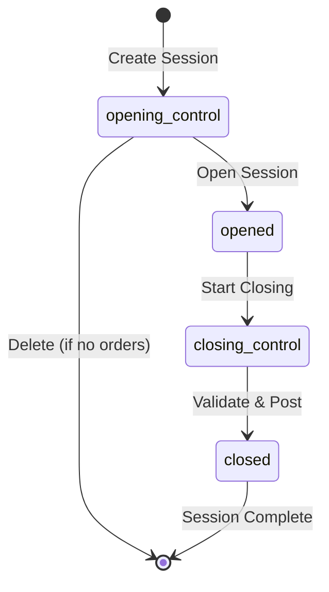
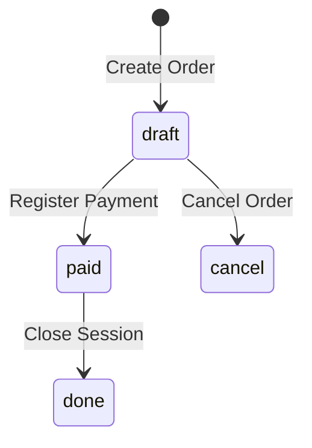
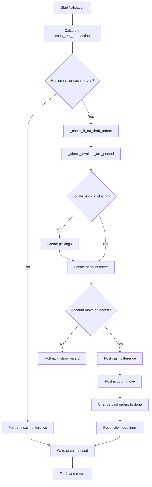
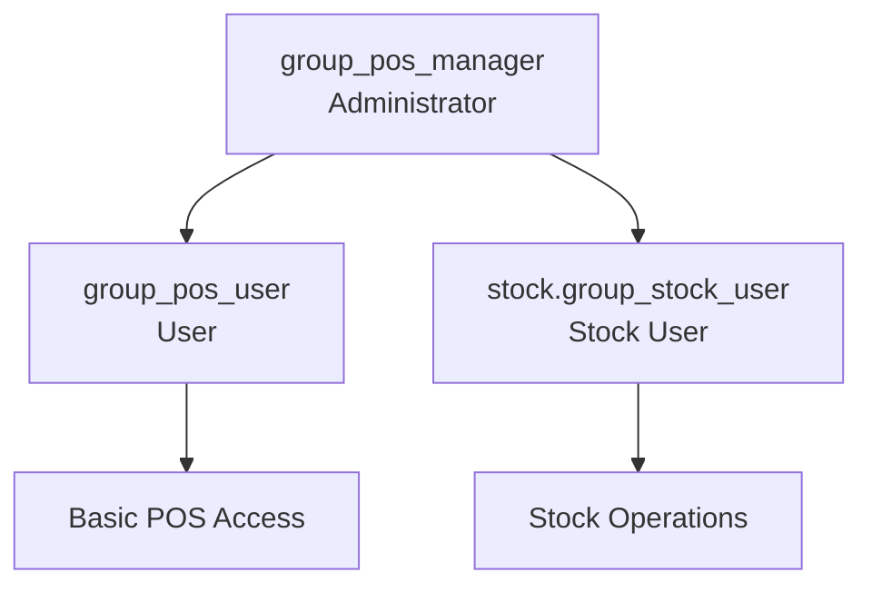

# POS Session and Transaction - Business Rules Documentation

> **Module:** `point_of_sale` (Point of Sale)  
> **Primary Models:** `pos.session`, `pos.order`  
> **Source Files:** `addons/point_of_sale/models/pos_session.py`, `addons/point_of_sale/models/pos_order.py`  
> **Related Flow:** [POS Session and Transaction User Flow](../02-user-flows/09-pos-session-transaction/flow-document.md)

---

## Table of Contents

1. [Overview](#1-overview)
2. [Session State Machine and Transitions](#2-session-state-machine-and-transitions)
3. [Order State Definitions](#3-order-state-definitions)
4. [Validation Constraints (@api.constrains)](#4-validation-constraints-apiconstrains)
5. [Computed Fields (@api.depends)](#5-computed-fields-apidepends)
6. [Session Lifecycle Methods](#6-session-lifecycle-methods)
7. [Session Closing Validation Checks](#7-session-closing-validation-checks)
8. [Cash Handling and Balancing](#8-cash-handling-and-balancing)
9. [Security Groups and Access Control](#9-security-groups-and-access-control)
10. [Record Rules (Row-Level Security)](#10-record-rules-row-level-security)
11. [Integration Triggers](#11-integration-triggers)
12. [Business Rule Summary Table](#12-business-rule-summary-table)

---

## 1. Overview

The **POS Session and Transaction** workflow manages retail point-of-sale operations in Odoo. This document describes the business rules governing how POS sessions are opened, transactions are processed, and sessions are closed with proper cash reconciliation.

### Business Context

A **POS Session** (internally called `pos.session`) represents a cashier's work period on a specific point-of-sale terminal. The session tracks:
- The time period the POS is active
- All orders processed during the session
- Cash movements (cash in/out transactions)
- Cash balancing between theoretical and actual amounts

A **POS Order** (internally called `pos.order`) represents an individual retail transaction within a session.

### Key Business Rules Summary

| Rule Category | Description |
|---------------|-------------|
| Session Exclusivity | Only one active session per POS configuration at any time |
| Lock Date Compliance | Sessions cannot start before accounting lock dates |
| Cash Control | Sessions can require opening/closing cash counts |
| Draft Order Blocking | Sessions cannot close while draft orders exist |
| Invoice Posting | All invoices must be posted before session closure |
| Cash Difference Handling | Cash differences require configured profit/loss accounts |
| Access Control | Two-tier security model: User → Administrator |

---

## 2. Session State Machine and Transitions

### 2.1 Session State Definitions

The session state is controlled by the `POS_SESSION_STATE` selection field defined at:  
**Source:** `addons/point_of_sale/models/pos_session.py:23-28`

```
POS_SESSION_STATE = [
    ('opening_control', 'Opening Control'),
    ('opened', 'In Progress'),
    ('closing_control', 'Closing Control'),
    ('closed', 'Closed & Posted'),
]
```

| State Value | Display Name | Business Meaning |
|-------------|--------------|------------------|
| `opening_control` | Opening Control | Initial state; cashier verifies opening cash balance |
| `opened` | In Progress | Session is active; orders can be processed |
| `closing_control` | Closing Control | Session is being closed; cashier counts ending cash |
| `closed` | Closed & Posted | Session fully closed; accounting entries posted |

### 2.2 Session State Transition Diagram



### 2.3 Session State Transition Rules

| From State | To State | Action Method | Business Rule |
|------------|----------|---------------|---------------|
| `opening_control` | `opened` | `action_pos_session_open()` | Sets starting cash balance from previous session's ending balance |
| `opened` | `closing_control` | `action_pos_session_closing_control()` | Checks for draft orders; records stop time |
| `closing_control` | `closed` | `action_pos_session_close()` | Validates session, creates journal entries, posts accounting move |
| `opening_control` | (deleted) | `delete_opening_control_session()` | Only if no orders exist in the session |

### 2.4 Session State Field Configuration

**Source:** `addons/point_of_sale/models/pos_session.py:48-51`

```
state = fields.Selection(
    POS_SESSION_STATE, string='Status',
    required=True, readonly=True,
    index=True, copy=False, default='opening_control')
```

**Field Properties:**
- **Required:** Every session must have a state
- **Readonly:** State can only be changed through action methods
- **Indexed:** Optimized for filtering sessions by state
- **Not Copied:** Duplicating a session would create a new opening_control session
- **Default:** New sessions start in `opening_control` state

---

## 3. Order State Definitions

### 3.1 POS Order State Selection

The order state tracks the payment and posting status of individual transactions.

**Source:** `addons/point_of_sale/models/pos_order.py:309-311`

```
state = fields.Selection(
    [('draft', 'New'), ('cancel', 'Cancelled'), ('paid', 'Paid'), ('done', 'Posted')],
    'Status', readonly=True, copy=False, default='draft', index=True)
```

| State Value | Display Name | Business Meaning |
|-------------|--------------|------------------|
| `draft` | New | Order in progress; not yet paid |
| `cancel` | Cancelled | Order has been cancelled |
| `paid` | Paid | Payment received; awaiting session close for posting |
| `done` | Posted | Session closed; order included in accounting entries |

### 3.2 Order State Transition Diagram



### 3.3 Order State Transition Rules

| From State | To State | Trigger | Business Rule |
|------------|----------|---------|---------------|
| `draft` | `paid` | Payment registration | Order is fully paid |
| `draft` | `cancel` | Cancel action | Order can be cancelled while in draft |
| `paid` | `done` | Session close | `_validate_session()` changes paid orders to done after posting |

**Order State Transition During Session Close:**

**Source:** `addons/point_of_sale/models/pos_session.py:457`

```python
# Set the uninvoiced orders' state to 'done'
self.env['pos.order'].search([('session_id', '=', self.id), ('state', '=', 'paid')]).write({'state': 'done'})
```

---

## 4. Validation Constraints (@api.constrains)

### 4.1 Single Active Session Per Configuration

**Method:** `_check_pos_config()`  
**Source:** `addons/point_of_sale/models/pos_session.py:305-313`

```python
@api.constrains('config_id')
def _check_pos_config(self):
    onboarding_creation = self.env.context.get('onboarding_creation', False)
    if not onboarding_creation and self.search_count([
            ('state', '!=', 'closed'),
            ('config_id', '=', self.config_id.id),
            ('rescue', '=', False)
        ]) > 1:
        raise ValidationError(_("Another session is already opened for this point of sale."))
```

**Business Rule:**
- Only **one active session** (not in `closed` state) can exist for each POS configuration at any time
- This prevents multiple cashiers from creating conflicting sessions on the same terminal
- **Rescue sessions** (auto-generated for orphan orders) are excluded from this check
- **Onboarding sessions** (created during initial setup) bypass this check

**Triggered When:**
- Creating a new session
- Changing the `config_id` of an existing session

**Error Message:**  
`"Another session is already opened for this point of sale."`

**What the User Sees:**
When attempting to open a new session while another is already active, a validation error popup appears preventing the action.

---

### 4.2 Lock Date Validation

**Method:** `_check_start_date()`  
**Source:** `addons/point_of_sale/models/pos_session.py:315-324`

```python
@api.constrains('start_at')
def _check_start_date(self):
    for record in self:
        journal = record.config_id.journal_id
        company = journal.company_id
        start_date = record.start_at.date()
        violated_lock_dates = company._get_violated_lock_dates(start_date, True, journal)
        if violated_lock_dates:
            raise ValidationError(_("You cannot create a session starting before: %(lock_date_info)s",
                                    lock_date_info=self.env['res.company']._format_lock_dates(violated_lock_dates)))
```

**Business Rule:**
- Sessions cannot be created with a start date **before** any applicable accounting lock dates
- This ensures proper fiscal period compliance
- The check considers both company-level and journal-level lock dates

**Triggered When:**
- Creating a new session (which sets `start_at`)
- Changing the `start_at` field

**Error Message Format:**  
`"You cannot create a session starting before: [Lock Date Information]"`

**What the User Sees:**
If attempting to backdate a session to before a lock date, a validation error shows the applicable lock date that prevents the action.

---

## 5. Computed Fields (@api.depends)

### 5.1 Cash Balance Computation

**Method:** `_compute_cash_balance()`  
**Source:** `addons/point_of_sale/models/pos_session.py:242-260`

**Dependencies:**
```python
@api.depends('payment_method_ids', 'order_ids', 'cash_register_balance_start')
```

**Computed Fields:**

| Field | Type | Description |
|-------|------|-------------|
| `cash_register_balance_end` | Monetary | Theoretical closing balance (starting + all cash transactions) |
| `cash_register_difference` | Monetary | Difference between theoretical and actual closing balance |

**Computation Logic:**

```python
for session in self:
    cash_payment_method = session.payment_method_ids.filtered('is_cash_count')[:1]
    if cash_payment_method:
        # Calculate total cash payments
        total_cash_payment = sum of cash payments from orders
        
        if session.state == 'closed':
            total_cash = session.cash_real_transaction + total_cash_payment
        else:
            total_cash = sum(session.statement_line_ids.mapped('amount')) + total_cash_payment
        
        session.cash_register_balance_end = session.cash_register_balance_start + total_cash
        session.cash_register_difference = session.cash_register_balance_end_real - session.cash_register_balance_end
    else:
        session.cash_register_balance_end = 0.0
        session.cash_register_difference = 0.0
```

**Business Rule:**
- **Theoretical Balance** = Starting Balance + Cash Payments + Cash In/Out Transactions
- **Cash Difference** = Actual Counted Cash - Theoretical Balance
- A positive difference means more cash than expected (profit)
- A negative difference means less cash than expected (loss)

---

### 5.2 Cash Control Computation

**Method:** `_compute_cash_control()`  
**Source:** `addons/point_of_sale/models/pos_session.py:289-296`

**Dependencies:**
```python
@api.depends('cash_journal_id')
```

**Computed Field:**

| Field | Type | Description |
|-------|------|-------------|
| `cash_control` | Boolean | Whether cash counting is required for this session |

**Computation Logic:**

```python
for session in self:
    if session.cash_journal_id:
        session.cash_control = session.config_id.cash_control
    else:
        session.cash_control = False
```

**Business Rule:**
- Cash control is enabled only if:
  1. The session has a cash journal configured
  2. The POS configuration has `cash_control` enabled
- When enabled, cashiers must count cash at opening and closing

---

### 5.3 Cash Journal Computation

**Method:** `_compute_cash_journal()`  
**Source:** `addons/point_of_sale/models/pos_session.py:298-303`

**Dependencies:**
```python
@api.depends('config_id', 'payment_method_ids')
```

**Computed Field:**

| Field | Type | Description |
|-------|------|-------------|
| `cash_journal_id` | Many2one | The journal used for cash transactions |

**Computation Logic:**

```python
for session in self:
    cash_journal = session.payment_method_ids.filtered('is_cash_count')[:1].journal_id
    session.cash_journal_id = cash_journal
```

**Business Rule:**
- Only **one cash journal** is supported per session
- The cash journal is derived from the first payment method marked for cash counting
- This journal is used for cash in/out transactions and cash difference posting

---

### 5.4 Total Payments Amount

**Method:** `_compute_total_payments_amount()`  
**Source:** `addons/point_of_sale/models/pos_session.py:262-267`

**Dependencies:**
```python
@api.depends('order_ids.payment_ids.amount')
```

**Computed Field:**

| Field | Type | Description |
|-------|------|-------------|
| `total_payments_amount` | Float | Sum of all payments in the session |

**Business Rule:**
- Aggregates the `amount` field from all `pos.payment` records in the session
- Used for reporting and session summary displays

---

### 5.5 Company Currency Check

**Method:** `_compute_is_in_company_currency()`  
**Source:** `addons/point_of_sale/models/pos_session.py:237-240`

**Dependencies:**
```python
@api.depends('currency_id', 'company_id.currency_id')
```

**Computed Field:**

| Field | Type | Description |
|-------|------|-------------|
| `is_in_company_currency` | Boolean | Whether session uses company's default currency |

**Computation Logic:**

```python
for session in self:
    session.is_in_company_currency = session.currency_id == session.company_id.currency_id
```

**Business Rule:**
- Determines if currency conversion is needed for accounting entries
- When `False`, amounts must be converted to company currency for journal entries

---

## 6. Session Lifecycle Methods

### 6.1 Opening Session

**Method:** `action_pos_session_open()`  
**Source:** `addons/point_of_sale/models/pos_session.py:366-374`

```python
def action_pos_session_open(self):
    # we only open sessions that haven't already been opened
    for session in self.filtered(lambda session: session.state == 'opening_control'):
        values = {}
        if session.config_id.cash_control and not session.rescue:
            last_session = self.search([('config_id', '=', session.config_id.id), ('id', '!=', session.id)], limit=1)
            session.cash_register_balance_start = last_session.cash_register_balance_end_real
        session.write(values)
    return True
```

**Business Rules:**
- Only sessions in `opening_control` state can be opened
- For sessions with cash control enabled:
  - Starting cash balance is automatically set to the **previous session's ending balance**
  - This provides continuity of cash tracking between sessions
- Rescue sessions skip the cash balance inheritance

**What the User Sees:**
When opening a session with cash control, the opening balance automatically shows the previous session's counted closing balance.

---

### 6.2 Starting Closing Control

**Method:** `action_pos_session_closing_control()`  
**Source:** `addons/point_of_sale/models/pos_session.py:381-403`

```python
def action_pos_session_closing_control(self, balancing_account=False, amount_to_balance=0, bank_payment_method_diffs=None):
    for session in self:
        if any(order.state == 'draft' for order in self.get_session_orders()):
            raise UserError(_("You cannot close the POS while there are still draft orders for the day."))
        if session.state == 'closed':
            raise UserError(_('This session is already closed.'))
        stop_at = self.stop_at or fields.Datetime.now()
        session.write({'state': 'closing_control', 'stop_at': stop_at})
        if not session.config_id.cash_control:
            return session.action_pos_session_close(balancing_account, amount_to_balance, bank_payment_method_diffs)
```

**Business Rules:**
- **Draft Order Check:** Cannot proceed if any orders are in `draft` state
- **Already Closed Check:** Prevents re-closing an already closed session
- **Stop Time Recording:** Sets the `stop_at` timestamp
- **No Cash Control Path:** If cash control is disabled, proceeds directly to close

**Error Messages:**
- `"You cannot close the POS while there are still draft orders for the day."`
- `"This session is already closed."`

---

### 6.3 Closing Session

**Method:** `action_pos_session_close()`  
**Source:** `addons/point_of_sale/models/pos_session.py:410-415`

```python
def action_pos_session_close(self, balancing_account=False, amount_to_balance=0, bank_payment_method_diffs=None):
    # Session without cash payment method will not have a cash register.
    # However, there could be other payment methods, thus, session still
    # needs to be validated.
    return self._validate_session(balancing_account, amount_to_balance, bank_payment_method_diffs)
```

**Business Rule:**
- This method delegates to `_validate_session()` for the actual closing process
- Sessions without cash payment methods can still be closed

---

### 6.4 Session Validation and Posting

**Method:** `_validate_session()`  
**Source:** `addons/point_of_sale/models/pos_session.py:417-477`

**Validation Steps:**



**Key Actions:**
1. **Draft Orders Check:** Prevents closing if draft orders exist
2. **Invoice Posting Check:** Ensures all related invoices are posted
3. **Stock Update:** Creates inventory pickings if configured
4. **Accounting Entry Creation:** Generates `account.move` with all session transactions
5. **Balance Check:** Verifies the accounting entry balances
6. **Cash Difference Posting:** Posts any cash difference to profit/loss accounts
7. **Journal Entry Posting:** Posts the main journal entry
8. **Order State Update:** Changes all `paid` orders to `done`
9. **Reconciliation:** Reconciles receivable lines

---

## 7. Session Closing Validation Checks

### 7.1 Draft Orders Check

**Method:** `_check_if_no_draft_orders()`  
**Source:** `addons/point_of_sale/models/pos_session.py:1757-1765`

```python
def _check_if_no_draft_orders(self):
    draft_orders = self.get_session_orders().filtered(lambda order: order.state == 'draft')
    if draft_orders:
        raise UserError(_(
                'There are still orders in draft state in the session. '
                'Pay or cancel the following orders to validate the session:\n%s',
                ', '.join(draft_orders.mapped('name'))
        ))
    return True
```

**Business Rule:**
- Sessions **cannot be closed** while orders remain in `draft` state
- All orders must be either **paid** or **cancelled** before closing
- The error message lists the specific order numbers that need attention

**Error Message Format:**
```
"There are still orders in draft state in the session. 
Pay or cancel the following orders to validate the session:
[Order Names]"
```

**What the User Sees:**
A popup listing all draft orders that need to be completed or cancelled before the session can close.

---

### 7.2 Invoice Posting Check

**Method:** `_check_invoices_are_posted()`  
**Source:** `addons/point_of_sale/models/pos_session.py:326-332`

```python
def _check_invoices_are_posted(self):
    unposted_invoices = self._get_closed_orders().sudo().with_company(self.company_id).account_move.filtered(lambda x: x.state != 'posted')
    if unposted_invoices:
        raise UserError(_(
            'You cannot close the POS when invoices are not posted.\nInvoices: %s',
            '\n'.join(f'{invoice.name} - {invoice.state}' for invoice in unposted_invoices)
        ))
```

**Business Rule:**
- All invoices created from POS orders **must be posted** before session closure
- Draft or cancelled invoices prevent session closing
- This ensures accounting consistency

**Error Message Format:**
```
"You cannot close the POS when invoices are not posted.
Invoices: [Invoice Name - State]"
```

**What the User Sees:**
A popup listing all unposted invoices that need to be posted before the session can close.

---

### 7.3 Cannot Close Session Check

**Method:** `_cannot_close_session()`  
**Source:** `addons/point_of_sale/models/pos_session.py:648-684`

**Validation Checks:**

```python
def _cannot_close_session(self, bank_payment_method_diffs=None):
    # Check for draft orders
    if any(order.state == 'draft' for order in self.get_session_orders()):
        return {'successful': False, 'message': _("You cannot close the POS while there are still draft orders for the day."), 'redirect': False}
    
    # Check if already closed
    if self.state == 'closed':
        return {
            'successful': False,
            'type': 'alert',
            'title': 'Session already closed',
            'message': _("The session has been already closed by another User..."),
            'redirect': True
        }
    
    # Check for missing profit/loss accounts
    if bank_payment_method_diffs:
        # Validate that profit/loss accounts exist for journals with differences
        ...
```

**Business Rules:**
- Returns error information if session cannot be closed
- Checks include:
  1. **Draft Orders:** Must be completed or cancelled
  2. **Already Closed:** Prevents double-closing
  3. **Missing Accounts:** For bank payment differences, profit/loss accounts must be configured

---

## 8. Cash Handling and Balancing

### 8.1 Cash Balance Fields

| Field | Type | Description |
|-------|------|-------------|
| `cash_register_balance_start` | Monetary | Opening cash count |
| `cash_register_balance_end_real` | Monetary | Actual closing cash count |
| `cash_register_balance_end` | Monetary (computed) | Theoretical closing balance |
| `cash_register_difference` | Monetary (computed) | Difference between actual and theoretical |
| `cash_real_transaction` | Monetary | Total of cash in/out transactions |

### 8.2 Cash Difference Posting

**Method:** `_post_statement_difference()`  
**Source:** `addons/point_of_sale/models/pos_session.py:479-513`

**Business Rules:**

**For Cash Loss (negative difference):**
```python
if amount < 0.0:
    if not self.cash_journal_id.loss_account_id:
        raise UserError(
            _('Please go on the %s journal and define a Loss Account. This account will be used to record cash difference.',
              self.cash_journal_id.name))
    st_line_vals['payment_ref'] = _("Cash difference observed during the counting (Loss) - closing")
    st_line_vals['counterpart_account_id'] = self.cash_journal_id.loss_account_id.id
```

**For Cash Profit (positive difference):**
```python
else:
    if not self.cash_journal_id.profit_account_id:
        raise UserError(
            _('Please go on the %s journal and define a Profit Account. This account will be used to record cash difference.',
              self.cash_journal_id.name))
    st_line_vals['payment_ref'] = _("Cash difference observed during the counting (Profit) - closing")
    st_line_vals['counterpart_account_id'] = self.cash_journal_id.profit_account_id.id
```

**Required Account Configuration:**
- **Loss Account:** Required on cash journal for recording cash shortages
- **Profit Account:** Required on cash journal for recording cash overages

**Error Messages:**
- `"Please go on the [Journal Name] journal and define a Loss Account. This account will be used to record cash difference."`
- `"Please go on the [Journal Name] journal and define a Profit Account. This account will be used to record cash difference."`

**What the User Sees:**
If cash difference exists but the required account is not configured, an error prompts the user to configure the account on the cash journal.

---

### 8.3 Cash In/Out Transactions

**Method:** `try_cash_in_out()`  
**Source:** `addons/point_of_sale/models/pos_session.py:1777-1788`

```python
def try_cash_in_out(self, _type, amount, reason, partner_id, extras):
    sign = 1 if _type == 'in' else -1
    sessions = self.filtered('cash_journal_id')
    if not sessions:
        raise UserError(_("There is no cash payment method for this PoS Session"))
    
    vals_list = [
        self._prepare_account_bank_statement_line_vals(session, sign, amount, reason, partner_id, extras)
        for session in sessions
    ]
    
    self.env['account.bank.statement.line'].with_context(no_retrieve_partner=True).create(vals_list)
```

**Business Rules:**
- Cash in transactions use positive amounts (sign = 1)
- Cash out transactions use negative amounts (sign = -1)
- Requires a cash journal to be configured
- Creates bank statement lines for tracking

**Error Message:**
`"There is no cash payment method for this PoS Session"`

---

## 9. Security Groups and Access Control

### 9.1 Security Group Definitions

**Source:** `addons/point_of_sale/security/point_of_sale_security.xml:3-24`

#### POS User (group_pos_user)

```xml
<record id="group_pos_user" model="res.groups">
    <field name="name">User</field>
    <field name="sequence">10</field>
    <field name="privilege_id" ref="res_groups_privilege_point_of_sale"/>
</record>
```

| Attribute | Value |
|-----------|-------|
| **Technical Name** | `point_of_sale.group_pos_user` |
| **Display Name** | User |
| **Category** | Point of Sale |
| **Purpose** | Basic POS operations access |

**Permissions:**
- Open and use POS sessions
- Process orders and payments
- Access cash in/out functions
- View session data

---

#### POS Administrator (group_pos_manager)

```xml
<record id="group_pos_manager" model="res.groups">
    <field name="name">Administrator</field>
    <field name="sequence">20</field>
    <field name="privilege_id" ref="res_groups_privilege_point_of_sale"/>
    <field name="implied_ids" eval="[(4, ref('group_pos_user')), (4, ref('stock.group_stock_user'))]"/>
    <field name="user_ids" eval="[(4, ref('base.user_root')), (4, ref('base.user_admin'))]"/>
</record>
```

| Attribute | Value |
|-----------|-------|
| **Technical Name** | `point_of_sale.group_pos_manager` |
| **Display Name** | Administrator |
| **Category** | Point of Sale |
| **Inherits From** | POS User, Stock User |
| **Default Users** | Root, Admin |

**Permissions:**
- All POS User permissions
- Configure POS terminals
- Access POS configuration settings
- Manage payment methods
- Access closing control data
- Override cash differences

---

#### POS Preset Group (group_pos_preset)

```xml
<record id="group_pos_preset" model="res.groups">
    <field name="name">Preset Menu</field>
    <field name="sequence">30</field>
</record>
```

| Attribute | Value |
|-----------|-------|
| **Technical Name** | `point_of_sale.group_pos_preset` |
| **Display Name** | Preset Menu |
| **Purpose** | Access to preset menu functionality |

---

### 9.2 Security Group Hierarchy



---

### 9.3 Permission Matrix by Group

| Feature | POS User | POS Administrator |
|---------|----------|-------------------|
| Open POS session | ✓ | ✓ |
| Process orders | ✓ | ✓ |
| Cash in/out | ✓ | ✓ |
| Close session | ✓ | ✓ |
| Configure POS | ✗ | ✓ |
| Manage payment methods | ✗ | ✓ |
| Access all sessions | ✗ | ✓ |
| Override cash differences | ✗ | ✓ |

---

## 10. Record Rules (Row-Level Security)

### 10.1 Multi-Company Rules

**Source:** `addons/point_of_sale/security/point_of_sale_security.xml:46-80`

#### POS Session Multi-Company Rule

```xml
<record id="rule_pos_session_multi_company" model="ir.rule">
    <field name="name">Point Of Sale Session</field>
    <field name="model_id" ref="model_pos_session" />
    <field name="domain_force">[('config_id.company_id', 'in', company_ids)]</field>
</record>
```

**Domain:** `[('config_id.company_id', 'in', company_ids)]`

**Business Rule:**
- Users can only access sessions whose POS configuration belongs to their allowed companies
- Ensures multi-company data isolation

---

#### POS Order Multi-Company Rule

```xml
<record id="rule_pos_multi_company" model="ir.rule">
    <field name="name">Point Of Sale Order</field>
    <field name="model_id" ref="model_pos_order" />
    <field name="domain_force">[('company_id', 'in', company_ids)]</field>
</record>
```

**Domain:** `[('company_id', 'in', company_ids)]`

**Business Rule:**
- Users can only access orders belonging to their allowed companies

---

#### POS Configuration Multi-Company Rule

```xml
<record id="rule_pos_config_multi_company" model="ir.rule">
    <field name="name">Point Of Sale Config</field>
    <field name="model_id" ref="model_pos_config" />
    <field name="domain_force">[('company_id', 'in', company_ids)]</field>
</record>
```

**Domain:** `[('company_id', 'in', company_ids)]`

**Business Rule:**
- Users can only access POS configurations for their allowed companies

---

### 10.2 Bank Statement Rules

#### Bank Statement Line POS User Rule

```xml
<record id="rule_pos_bank_statement_line_user" model="ir.rule">
    <field name="name">Point Of Sale Bank Statement Line POS User</field>
    <field name="model_id" ref="account.model_account_bank_statement_line" />
    <field name="groups" eval="[(4, ref('group_pos_user'))]"/>
    <field name="domain_force">[('pos_session_id', '!=', False)]</field>
</record>
```

**Domain:** `[('pos_session_id', '!=', False)]`

**Business Rule:**
- POS users can access bank statement lines that are linked to POS sessions
- This allows viewing cash in/out transactions

---

### 10.3 Invoice Access Rules

#### Invoice POS User Rule

```xml
<record id="rule_invoice_pos_user" model="ir.rule">
    <field name="name">Invoice POS User</field>
    <field name="model_id" ref="account.model_account_move" />
    <field name="groups" eval="[(4, ref('group_pos_user'))]"/>
    <field name="domain_force">[('pos_order_ids', '!=', False)]</field>
</record>
```

**Domain:** `[('pos_order_ids', '!=', False)]`

**Business Rule:**
- POS users can access invoices that are linked to POS orders
- This allows viewing and printing customer invoices from POS

---

## 11. Integration Triggers

### 11.1 Session Creation Triggers

**Source:** `addons/point_of_sale/models/pos_session.py:334-360`

When a session is created:
1. **Automatic Opening:** `action_pos_session_open()` is called to transition from `opening_control` to `opened`
2. **Stock Settings:** `update_stock_at_closing` is set based on company configuration
3. **Sequence Assignment:** Session name is assigned from sequence

```python
@api.model_create_multi
def create(self, vals_list):
    ...
    sessions = super().create(vals_list)
    sessions.action_pos_session_open()
    return sessions
```

---

### 11.2 Session Close Triggers

When a session is closed:

| Trigger | Integration | Description |
|---------|-------------|-------------|
| Stock Pickings | Inventory | Creates delivery orders for sold products |
| Account Move | Accounting | Creates journal entry for all session transactions |
| Bank Statements | Banking | Creates statement lines for cash transactions |
| Order State | Orders | Updates paid orders to `done` state |

---

### 11.3 Order Processing Triggers

When an order is processed:

| Trigger | Integration | Description |
|---------|-------------|-------------|
| Payments | POS Payments | Creates `pos.payment` records for each payment |
| Invoices | Accounting | Creates customer invoice if requested |
| Stock | Inventory | Reserves or immediately moves stock based on settings |

---

## 12. Business Rule Summary Table

| Rule ID | Rule Name | Model | Enforcement | Error Impact |
|---------|-----------|-------|-------------|--------------|
| POS-001 | Single Active Session | pos.session | @api.constrains | Prevents opening duplicate sessions |
| POS-002 | Lock Date Compliance | pos.session | @api.constrains | Prevents backdated sessions |
| POS-003 | Draft Order Blocking | pos.session | Method check | Prevents premature session closure |
| POS-004 | Invoice Posting Required | pos.session | Method check | Ensures accounting completeness |
| POS-005 | Cash Account Required | pos.session | Method check | Ensures cash differences can be posted |
| POS-006 | Cash Balance Computation | pos.session | @api.depends | Automatic theoretical balance |
| POS-007 | Cash Control Inheritance | pos.session | @api.depends | From POS configuration |
| POS-008 | Company Isolation | pos.session, pos.order | Record rules | Multi-company security |
| POS-009 | Order State Flow | pos.order | State machine | Draft → Paid → Done |
| POS-010 | Session State Flow | pos.session | State machine | Opening → Opened → Closing → Closed |

---

## Related Documentation

- [POS Session and Transaction User Flow](../02-user-flows/09-pos-session-transaction/flow-document.md)
- [Capabilities Inventory](../01-capabilities-overview/capabilities-inventory.md)
- [Domain Glossary](../01-capabilities-overview/capabilities-inventory.md#domain-glossary)

---

**Document Version:** 1.0  
**Last Updated:** Generated from Odoo 19.0 source code  
**Source Reference:** `addons/point_of_sale/models/pos_session.py`, `addons/point_of_sale/models/pos_order.py`, `addons/point_of_sale/security/point_of_sale_security.xml`
