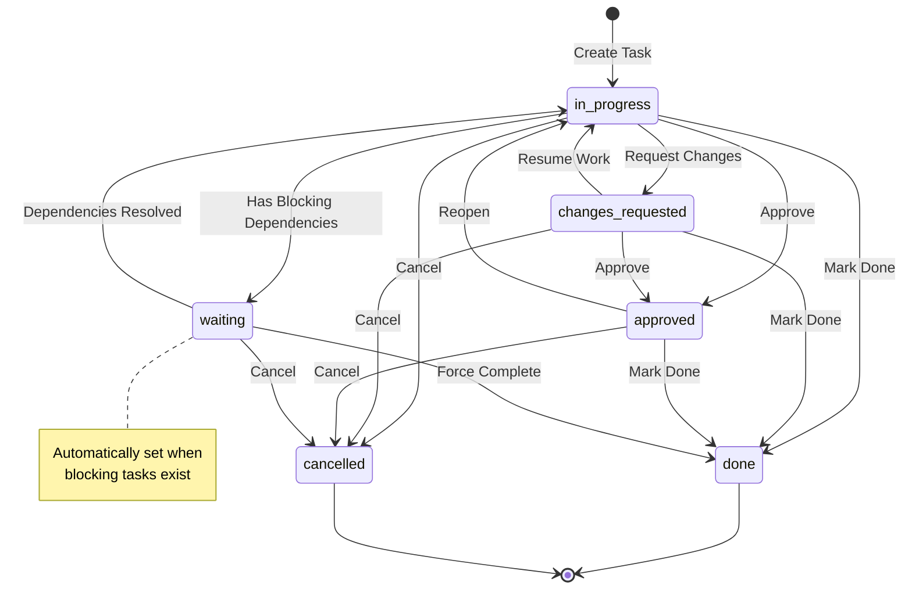
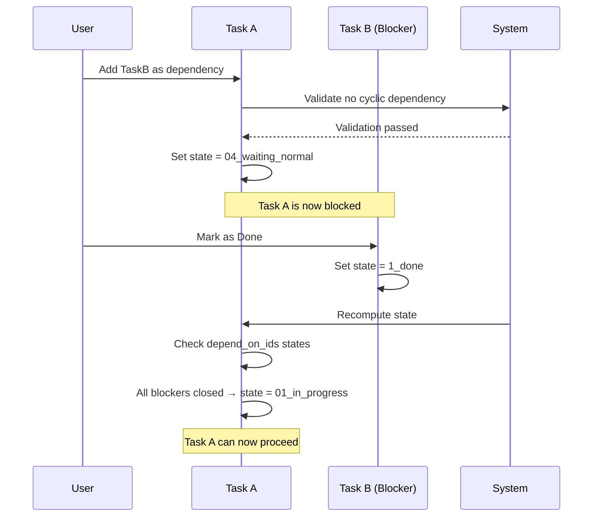
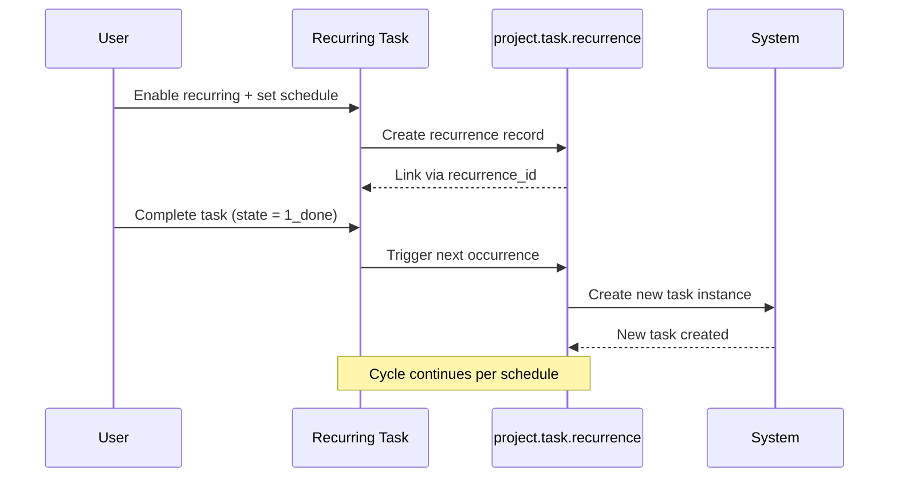

# Project Task Management Business Rules

## Overview

This document describes the business rules governing the Project Task Management workflow in Odoo 19.0. The project task model (`project.task`) handles task creation, assignment, state management, dependencies, and recurrence within the project management module.

**Target Audience:** Customer support teams and business analysts who need to understand how task management operates within Odoo, including validation rules, state transitions, and access control.

**Related User Flow:** [Project Task Management](../02-user-flows/10-project-task-management/flow-document.md)

---

## 1. Task State Machine

The project task follows a defined state machine that controls the lifecycle of tasks from creation through completion or cancellation.

### 1.1 State Definitions

| State Code | Display Label | Description |
|------------|--------------|-------------|
| `01_in_progress` | In Progress | Task is actively being worked on (default state for new tasks) |
| `02_changes_requested` | Changes Requested | Task requires modifications before proceeding |
| `03_approved` | Approved | Task has been approved and is ready for final completion |
| `04_waiting_normal` | Waiting | Task is blocked by one or more dependent tasks |
| `1_done` | Done | Task has been completed successfully (closed state) |
| `1_canceled` | Cancelled | Task has been cancelled (closed state) |

### 1.2 Closed vs Open States

The system categorizes states into two groups:

**Closed States (CLOSED_STATES):**
- `1_done` (Done)
- `1_canceled` (Cancelled)

**Open States:**
- `01_in_progress` (In Progress)
- `02_changes_requested` (Changes Requested)
- `03_approved` (Approved)
- `04_waiting_normal` (Waiting)

> **Business Rule:** A task is considered "closed" when its state is in the CLOSED_STATES set. The `is_closed` field is automatically computed based on this rule.

### 1.3 State Transition Diagram



### 1.4 Automatic State Transitions

The system automatically manages certain state transitions based on task dependencies:

**Rule: Automatic Waiting State**
- When a task has blocking dependencies (tasks in `depend_on_ids` that are not in closed states), the system automatically sets the task state to `04_waiting_normal`
- This only applies if the task is not already in a closed state

**Rule: Automatic Return to In Progress**
- When all blocking dependencies are resolved (all tasks in `depend_on_ids` are now in closed states), the system automatically returns the task to `01_in_progress`
- This only applies if the task is not already in a closed state

**Rule: State Reset on Project Change**
- When a task is moved to a different project, if the task state is not `04_waiting_normal`, it is automatically reset to `01_in_progress`

**Rule: Blocked Task State Protection**
- When attempting to change a blocked task's state to an open state (other than `04_waiting_normal`), the system forces the state back to `04_waiting_normal` if blocking dependencies still exist

> **Source Reference:** `addons/project/models/project_task.py`, `_compute_state()` method

---

## 2. Validation Constraints

The project task model enforces several validation rules to maintain data integrity. Violations of these rules result in a `ValidationError` that prevents the operation from completing.

### 2.1 Company Consistency with Partner

**Rule Name:** `_ensure_company_consistency_with_partner`

**Triggered By:** Changes to `company_id` or `partner_id` fields

**Validation Logic:**
```
IF task.partner_id exists
   AND task.partner_id.company_id exists
   AND task.company_id exists
   AND task.company_id ≠ task.partner_id.company_id
THEN raise ValidationError
```

**Error Message:** "The task and the associated partner must be linked to the same company."

**Business Impact:**
- Ensures multi-company data isolation
- Prevents assigning tasks to customers from different companies
- Maintains consistent company context for customer-related tasks

**User Guidance:** When creating or editing a task:
1. If the task has an assigned customer (partner), ensure the task's company matches the customer's company
2. If you need to assign a customer from a different company, first change the task's company or remove the existing customer assignment

> **Source Reference:** `addons/project/models/project_task.py:342-347`

### 2.2 Super Task Cannot Be Private

**Rule Name:** `_ensure_super_task_is_not_private`

**Triggered By:** Changes to `child_ids` (subtasks) or `project_id` fields

**Validation Logic:**
```
IF task.project_id is NOT set (task is private)
   AND task.subtask_count > 0 (task has subtasks)
THEN raise ValidationError
```

**Error Message:** "This task has sub-tasks, so it can't be private."

**Business Impact:**
- Private tasks (tasks without a project) cannot have subtasks
- Ensures subtask hierarchies maintain project context
- Prevents orphaned subtask structures

**User Guidance:** 
- If you need to add subtasks to a task, the parent task must be assigned to a project
- Before making a task private (removing its project), you must first remove or reassign all subtasks

> **Source Reference:** `addons/project/models/project_task.py:349-354`

### 2.3 No Cyclic Task Dependencies

**Rule Name:** `_check_no_cyclic_dependencies`

**Triggered By:** Changes to `depend_on_ids` field

**Validation Logic:**
```
IF circular dependency detected in depend_on_ids relationship
THEN raise ValidationError
```

**Error Message:** "Two tasks cannot depend on each other."

**Business Impact:**
- Prevents circular dependency chains (Task A depends on Task B, which depends on Task A)
- Ensures task dependency graphs are directed acyclic graphs (DAGs)
- Maintains logical task execution order

**User Guidance:**
- When setting blocking tasks, the system checks for circular references
- You cannot create a dependency chain where a task directly or indirectly depends on itself
- Example of invalid configuration: Task A → blocks → Task B → blocks → Task A

> **Source Reference:** `addons/project/models/project_task.py:498-501`

### 2.4 No Recursive Parent Hierarchy

**Rule Name:** `_check_parent_id`

**Triggered By:** Changes to `parent_id` field

**Validation Logic:**
```
IF task hierarchy contains a cycle (task is its own ancestor)
THEN raise ValidationError
```

**Error Message:** "Error! You cannot create a recursive hierarchy of tasks."

**Business Impact:**
- Prevents a task from being set as a subtask of its own subtask (or any descendant)
- Ensures the parent-child relationship forms a proper tree structure
- Maintains predictable task hierarchy navigation

**User Guidance:**
- You cannot set a task's parent to be one of its own subtasks
- The system checks the entire subtask tree to prevent indirect cycles

> **Source Reference:** `addons/project/models/project_task.py:580-583`

### 2.5 SQL-Level Constraints

The following constraints are enforced at the database level:

**Recurring Task Cannot Have Parent:**
```sql
CHECK (NOT (recurring_task IS TRUE AND parent_id IS NOT NULL))
```
**Error Message:** "You cannot convert this task into a sub-task because it is recurrent."

**Private Task Cannot Have Parent:**
```sql
CHECK (NOT (project_id IS NULL AND parent_id IS NOT NULL))
```
**Error Message:** "A private task cannot have a parent."

> **Source Reference:** `addons/project/models/project_task.py:331-338`

---

## 3. Computed Fields and Automatic Calculations

The project task model uses computed fields to automatically derive values based on related data. Understanding these computations helps support teams explain automatic field updates to users.

### 3.1 State Computation

**Field:** `state`

**Dependencies:** `stage_id`, `depend_on_ids.state`

**Computation Logic:**
1. Check if task has blocking dependencies enabled (`allow_task_dependencies`)
2. Find any blocking tasks that are not in closed states
3. If blocking tasks exist and current task is not closed → set state to `04_waiting_normal` (Waiting)
4. If no blocking tasks and task is not closed → set state to `01_in_progress` (In Progress)

**What the User Sees:** Task state may automatically change to "Waiting" when blocking tasks are added, or return to "In Progress" when blocking tasks are completed.

> **Source Reference:** `addons/project/models/project_task.py:385-399`

### 3.2 Is Closed Computation

**Field:** `is_closed`

**Dependencies:** `state`

**Computation Logic:**
```
is_closed = (state in CLOSED_STATES)
```

Where CLOSED_STATES = {`1_done`, `1_canceled`}

**What the User Sees:** A boolean indicator that reflects whether the task is in a completed or cancelled state.

> **Source Reference:** `addons/project/models/project_task.py:401-404`

### 3.3 Project ID Computation

**Field:** `project_id`

**Dependencies:** `parent_id.project_id`

**Computation Logic:**
- If task is not displayed in its own project context AND has a parent task
- AND parent's project differs from current project
- THEN inherit parent's project

**What the User Sees:** Subtasks may automatically update their project assignment when the parent task's project changes.

> **Source Reference:** `addons/project/models/project_task.py:364-369`

### 3.4 Display in Project Computation

**Field:** `display_in_project`

**Dependencies:** `project_id`, `parent_id`

**Computation Logic:**
```
display_in_project = (
    NOT project_id 
    OR (NOT parent_id OR project_id ≠ parent_id.project_id)
)
```

**What the User Sees:** Controls whether the task appears in project task lists or is hidden as a nested subtask.

> **Source Reference:** `addons/project/models/project_task.py:371-376`

### 3.5 Dependency Count Computations

**Field:** `depend_on_count` and `closed_depend_on_count`

**Dependencies:** `depend_on_ids`

**Computation Logic:**
- `depend_on_count` = total number of blocking tasks
- `closed_depend_on_count` = number of blocking tasks that are in closed states

**What the User Sees:** Numeric counters showing how many tasks are blocking this task and how many of those blockers have been completed.

> **Source Reference:** `addons/project/models/project_task.py:540-562`

### 3.6 Dependent Tasks Count Computation

**Field:** `dependent_tasks_count`

**Dependencies:** `dependent_ids`

**Computation Logic:** Count of non-closed tasks that depend on (are blocked by) this task.

**What the User Sees:** Shows how many other tasks are waiting for this task to be completed.

> **Source Reference:** `addons/project/models/project_task.py:564-578`

### 3.7 Elapsed Time Computation

**Fields:** `working_hours_open`, `working_hours_close`, `working_days_open`, `working_days_close`

**Dependencies:** `create_date`, `date_end`, `date_assign`

**Computation Logic:**
- Uses the project's resource calendar to calculate working time
- `working_hours_open` / `working_days_open`: Time from creation to assignment
- `working_hours_close` / `working_days_close`: Time from creation to completion

**What the User Sees:** Metrics showing how long tasks take to be assigned and completed, useful for performance analysis.

> **Source Reference:** `addons/project/models/project_task.py:595-622`

---

## 4. Task Dependencies Logic

Task dependencies allow users to define blocking relationships between tasks, ensuring work is completed in the proper sequence.

### 4.1 Dependency Fields

| Field | Type | Description |
|-------|------|-------------|
| `depend_on_ids` | Many2many | Tasks that block this task ("Blocked By") |
| `dependent_ids` | Many2many | Tasks that this task blocks ("Blocks") |
| `allow_task_dependencies` | Boolean | Related field from project settings |

### 4.2 Dependency Behavior

**Blocking Relationship:**
- When Task B is added to Task A's `depend_on_ids`, Task A is "blocked by" Task B
- Task A enters the `04_waiting_normal` state while Task B is open
- When Task B is closed (Done or Cancelled), Task A can proceed

**Dependency Domain Restrictions:**
- Tasks can only depend on other tasks that have a project assigned
- Tasks cannot depend on themselves (`('id', '!=', id)` domain)

### 4.3 Dependency Sequence Diagram



### 4.4 Copy Behavior for Dependencies

When copying tasks:
- `depend_on_ids` and `dependent_ids` are NOT copied by default
- If tasks are copied as part of a project copy, dependencies are resolved to point to the copied tasks instead of originals

> **Source Reference:** `addons/project/models/project_task.py:278-289, 831-836`

---

## 5. Recurring Task Support

Odoo supports recurring tasks that automatically create new instances based on a defined schedule.

### 5.1 Recurrence Fields

| Field | Type | Description |
|-------|------|-------------|
| `recurring_task` | Boolean | Indicates if task is part of a recurrence |
| `recurrence_id` | Many2one | Link to `project.task.recurrence` record |
| `recurring_count` | Integer | Number of tasks in the recurrence series |
| `repeat_interval` | Integer | Interval between occurrences (default: 1) |
| `repeat_unit` | Selection | Unit: day, week, month, year (default: week) |
| `repeat_type` | Selection | forever, until (default: forever) |
| `repeat_until` | Date | End date for recurrence (if repeat_type = until) |

### 5.2 Recurrence Rules

**Enabling Recurrence:**
- Set `recurring_task` to True on a task
- Configure `repeat_interval`, `repeat_unit`, `repeat_type`, and optionally `repeat_until`
- System creates a `project.task.recurrence` record to manage the series

**Recurrence Validation:**
```
Valid recurrence requires:
  - repeat_interval > 0
  - IF repeat_type = 'until' THEN repeat_until > today
```

**Constraint: Recurring Tasks Cannot Be Subtasks:**
- A recurring task cannot have a `parent_id`
- SQL constraint prevents setting parent on recurring tasks

### 5.3 Recurrence Sequence Diagram



### 5.4 Disabling Recurrence

When `recurring_task` is set to False:
- The associated `recurrence_id` record is unlinked
- All tasks in the recurrence series have `recurring_task` set to False
- The recurrence stops creating new instances

> **Source Reference:** `addons/project/models/project_task.py:296-313, 503-529`

---

## 6. Security Groups and Access Control

Access to project tasks is controlled through security groups and record rules that determine which users can view, create, edit, and delete tasks.

### 6.1 Security Groups

| Group ID | Display Name | Description |
|----------|--------------|-------------|
| `group_project_user` | User | Basic project user access. Implied by `base.group_user` (internal users) |
| `group_project_manager` | Administrator | Full project management access. Can see all tasks and projects |
| `group_project_stages` | Use Stages on Project | Enables stage-based task organization |
| `group_project_recurring_tasks` | Use Recurring Tasks | Enables recurring task functionality |
| `group_project_task_dependencies` | Use Task Dependencies | Enables task dependency features |
| `group_project_milestone` | Use Milestones | Enables milestone tracking |

### 6.2 Access Control Matrix

| Action | Project User | Project Manager | Portal User |
|--------|--------------|-----------------|-------------|
| View own tasks | ✓ | ✓ | ✓ (with restrictions) |
| View all tasks | Limited by project visibility | ✓ | × |
| Create tasks | ✓ | ✓ | ✓ (via project sharing) |
| Edit tasks | ✓ (own/allowed) | ✓ | Limited fields |
| Delete tasks | ✓ (own/allowed) | ✓ | × |
| Manage stages | Own stages only | ✓ (all stages) | × |

### 6.3 Record Rules Summary

**Multi-Company Rule (`task_comp_rule`):**
- Tasks are filtered by the user's allowed companies
- Domain: `[('company_id', 'in', company_ids + [False])]`

**Visibility Rule for Employees (`task_visibility_rule`):**
- For projects with `privacy_visibility` in ['employees', 'portal']: all employees can view
- For follower-only projects: user must be a follower or assignee
- Read-only rule (does not affect write/create/delete)

**Project Manager Rule (`project_manager_all_project_tasks_rule`):**
- Managers can see all tasks linked to a project OR their own private tasks
- Full CRUD access

**Portal User Rule (`project_task_rule_portal`):**
- Can only see tasks where:
  - Project has portal/invited_users visibility
  - Task is active
  - User is a follower OR project collaborator with full access
- Read-only by default; write access enabled via project sharing

### 6.4 Portal User Field Restrictions

Portal users have limited access to task fields:

**Readable Fields (partial list):**
- `id`, `name`, `active`, `priority`, `project_id`, `state`, `is_closed`
- `partner_id`, `tag_ids`, `stage_id`, `user_ids`, `date_deadline`
- `subtask_count`, `depend_on_ids`, `dependent_ids`

**Writable Fields:**
- `name`, `description`, `partner_id`, `date_deadline`, `tag_ids`
- `sequence`, `stage_id`, `child_ids`, `color`, `parent_id`
- `priority`, `state`, `is_closed`

> **Source Reference:** `addons/project/security/project_security.xml:10-41, 74-175`

---

## 7. Additional Business Rules

### 7.1 Task Priority Levels

| Priority Value | Display Label |
|---------------|---------------|
| `0` | Low priority (default) |
| `1` | Medium priority |
| `2` | High priority |
| `3` | Urgent |

**Quick Creation Shortcuts:**
- `!` in task title = Medium priority
- `!!` in task title = High priority
- `!!!` in task title = Urgent

### 7.2 Date Assignment Rules

**Assignment Date (`date_assign`):**
- Automatically set when `user_ids` is first populated
- Cleared when all assignees are removed
- Not directly editable by users

**Stage Update Date (`date_last_stage_update`):**
- Updated whenever `stage_id` or `state` changes
- Used for tracking task progression metrics

**End Date (`date_end`):**
- Automatically set when task moves to a folded stage
- Cleared when task moves to an unfolded stage

### 7.3 Subtask Behavior

**Subtask Allocated Hours:**
- `subtask_allocated_hours` field sums allocated hours from all child tasks
- Provides rollup visibility for parent tasks

**Subtask Counting:**
- `subtask_count` = total number of direct child tasks
- `closed_subtask_count` = child tasks in closed states
- `subtask_completion_percentage` derived from these counts

### 7.4 Task Assignment Notifications

When users are assigned to a task:
- System sends notification to newly assigned users
- Existing assignees are not re-notified
- The user making the assignment is excluded from notifications

### 7.5 Stage Rating

Tasks can trigger customer satisfaction rating requests:
- Controlled by `rating_active` and `rating_status` on the stage
- When `rating_status = 'stage'`, moving to that stage sends a rating email

> **Source Reference:** `addons/project/models/project_task.py:154-159, 178-191, 629-649`

---

## 8. Integration Points

### 8.1 Related Models

| Model | Relationship | Purpose |
|-------|--------------|---------|
| `project.project` | Many2one | Parent project containing the task |
| `project.task.type` | Many2one | Stage/status of the task |
| `project.milestone` | Many2one | Associated project milestone |
| `project.task.recurrence` | Many2one | Recurrence configuration |
| `res.partner` | Many2one | Customer associated with task |
| `res.users` | Many2many | Assigned users |
| `project.tags` | Many2many | Task labels/tags |

### 8.2 Inherited Mixins

The `project.task` model inherits behavior from:
- `portal.mixin` - Portal access and URLs
- `mail.thread.cc` - Email threading and CC handling
- `mail.activity.mixin` - Activity/follow-up scheduling
- `rating.mixin` - Customer satisfaction ratings
- `mail.tracking.duration.mixin` - Stage duration tracking
- `html.field.history.mixin` - HTML field version history

---

## 9. Troubleshooting Common Issues

### 9.1 "Task cannot be private" Error

**Symptom:** User receives error when trying to remove project from task

**Cause:** The task has subtasks, and private tasks cannot have subtasks

**Resolution:**
1. Remove or reassign all subtasks first
2. Then remove the project assignment

### 9.2 Task Stuck in "Waiting" State

**Symptom:** Task shows "Waiting" state and cannot be moved to "In Progress"

**Cause:** Task has unresolved blocking dependencies

**Resolution:**
1. Check the "Blocked By" field to see blocking tasks
2. Complete or cancel all blocking tasks
3. Task will automatically return to "In Progress"

**Alternative:** Force the task to "Done" or "Cancelled" state to bypass dependency checking

### 9.3 Cannot Set Task as Subtask

**Symptom:** Error when setting parent task

**Possible Causes:**
1. Target parent task would create a cycle (task is a descendant of itself)
2. Task is a recurring task (recurring tasks cannot be subtasks)
3. Task would become private (parent has no project)

**Resolution:** Check the specific error message and address the constraint violation

### 9.4 Company Mismatch Error

**Symptom:** "Task and partner must be linked to same company" error

**Cause:** Task's company differs from the assigned customer's company

**Resolution:**
1. Change the task's company to match the customer's company, OR
2. Remove the customer assignment, OR
3. Select a customer from the same company

---

## Document Information

| Attribute | Value |
|-----------|-------|
| **Odoo Version** | 19.0 |
| **Module** | `project` |
| **Primary Model** | `project.task` |
| **Source Files** | `addons/project/models/project_task.py`, `addons/project/security/project_security.xml` |
| **Last Updated** | Documentation generated from Odoo 19.0 Community Edition source |
