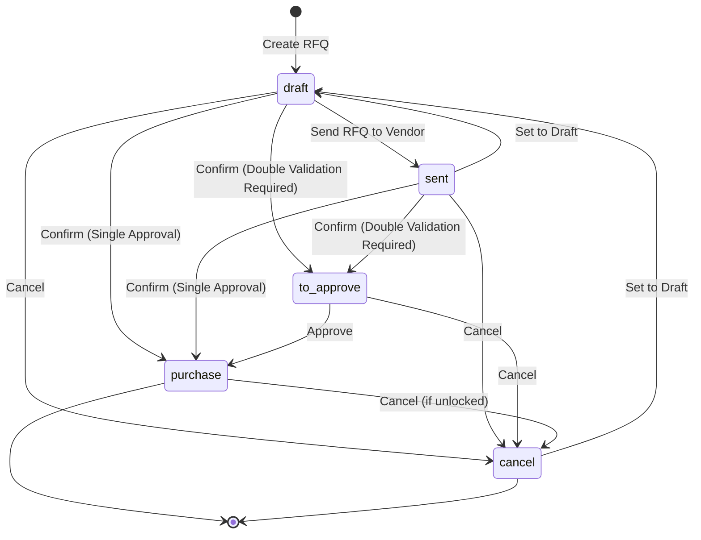
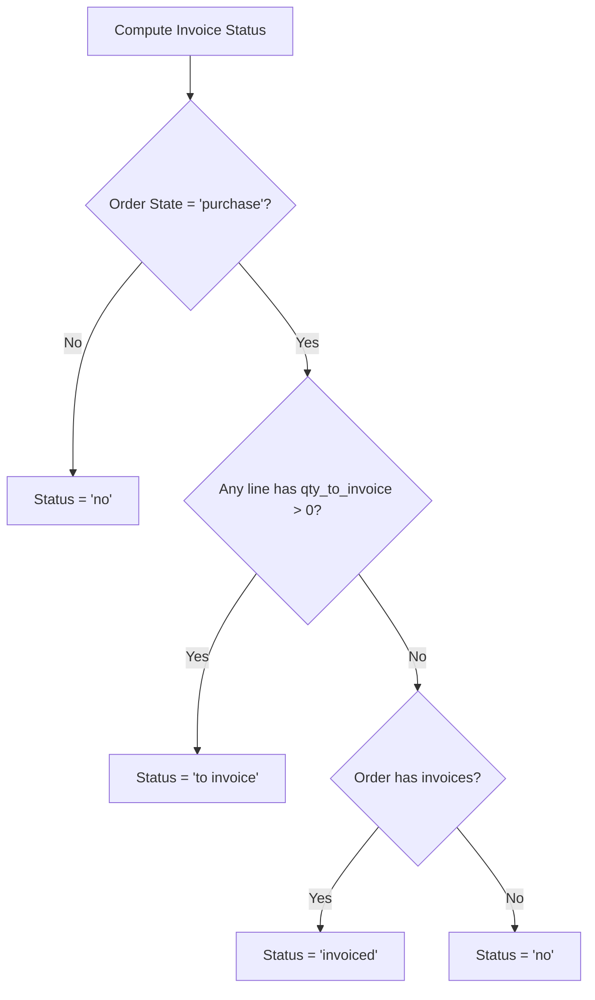
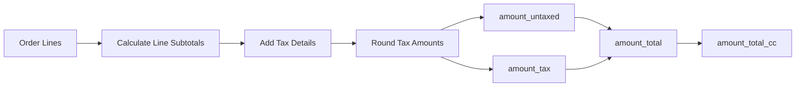
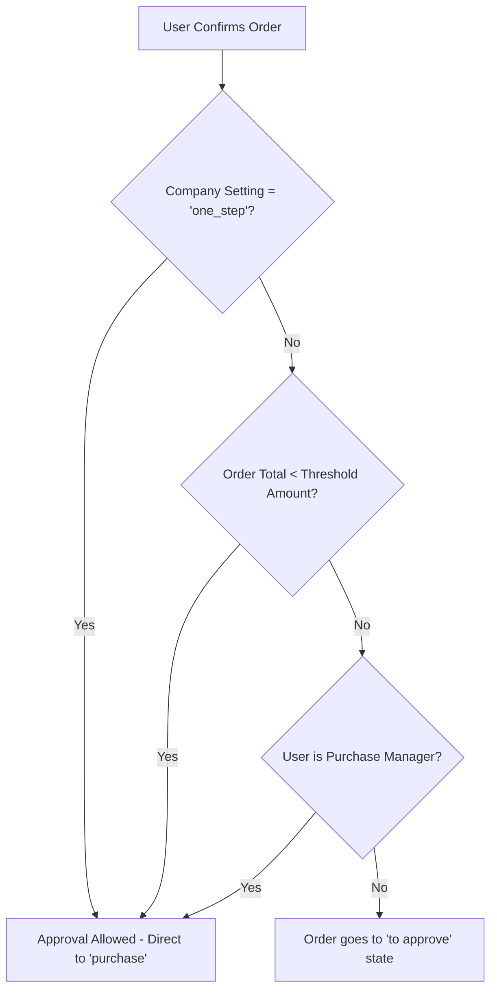
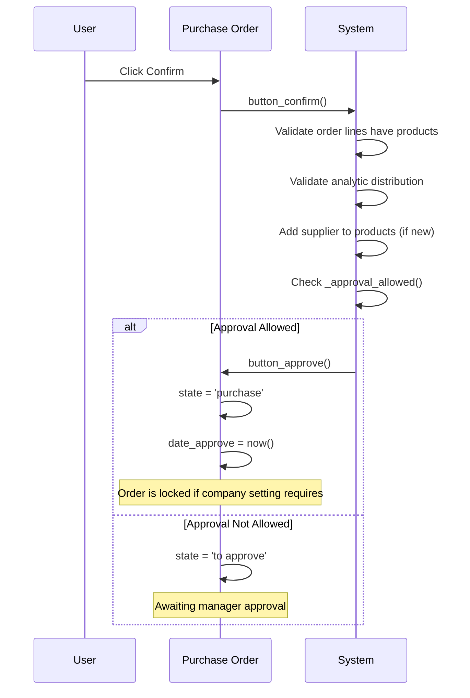
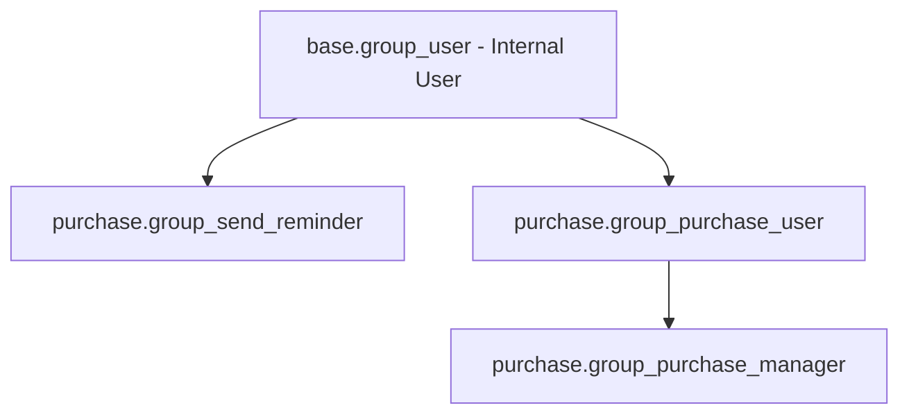

# Purchase RFQ to PO - Business Rules Documentation

## Overview

This document describes the business rules governing the Purchase Request for Quotation (RFQ) to Purchase Order (PO) workflow in Odoo 19.0. It covers validation logic, state transitions, computation rules, and access control for the **purchase.order** model.

**Target Audience:** Customer support teams and business analysts

**Related Documentation:**
- [Purchase RFQ to PO User Flow](../02-user-flows/03-purchase-rfq-to-po/flow-document.md)

---

## 1. State Transitions

### 1.1 Purchase Order State Machine

The purchase order progresses through the following states:



### 1.2 State Definitions

| State | Label | Description |
|-------|-------|-------------|
| `draft` | RFQ | Initial state. The user is creating a Request for Quotation to send to vendors. No commitments have been made. |
| `sent` | RFQ Sent | The RFQ has been sent to the vendor via email or printed. The system is waiting for vendor response. |
| `to approve` | To Approve | The order has been confirmed but requires manager approval due to double validation rules. |
| `purchase` | Purchase Order | The order is confirmed and approved. This is a binding commitment to the vendor. |
| `cancel` | Cancelled | The order has been cancelled. No further processing will occur. |

**Source:** `addons/purchase/models/purchase_order.py:105-111`

```python
state = fields.Selection([
    ('draft', 'RFQ'),
    ('sent', 'RFQ Sent'),
    ('to approve', 'To Approve'),
    ('purchase', 'Purchase Order'),
    ('cancel', 'Cancelled')
], string='Status', readonly=True, index=True, copy=False, default='draft', tracking=True)
```

### 1.3 State Transition Actions

| Action | Method | From State(s) | To State | Description |
|--------|--------|---------------|----------|-------------|
| Create RFQ | `create()` | - | draft | Creates a new RFQ with auto-generated reference number |
| Send RFQ | `action_rfq_send()` | draft | sent | Sends email to vendor and marks RFQ as sent |
| Print RFQ | `print_quotation()` | draft | sent | Prints RFQ and marks as sent |
| Confirm Order | `button_confirm()` | draft, sent | purchase or to_approve | Confirms the order; state depends on approval rules |
| Approve Order | `button_approve()` | to_approve | purchase | Manager approves the pending order |
| Set to Draft | `button_draft()` | cancel | draft | Resets cancelled order to draft for re-editing |
| Cancel Order | `button_cancel()` | draft, sent, to_approve, purchase | cancel | Cancels the order (locked orders cannot be cancelled) |
| Lock Order | `button_lock()` | purchase | purchase (locked=True) | Prevents modifications to confirmed order |
| Unlock Order | `button_unlock()` | purchase | purchase (locked=False) | Allows modifications to confirmed order |

---

## 2. Invoice Status

The purchase order tracks billing status through the `invoice_status` field:

### 2.1 Invoice Status Values

| Status | Label | Description |
|--------|-------|-------------|
| `no` | Nothing to Bill | No vendor bills are expected. The order is either not confirmed or has no billable lines. |
| `to invoice` | Waiting Bills | Vendor bills are expected. Products have been ordered but not yet billed. |
| `invoiced` | Fully Billed | All ordered products have been billed. No further bills expected. |

**Source:** `addons/purchase/models/purchase_order.py:127-131`

```python
invoice_status = fields.Selection([
    ('no', 'Nothing to Bill'),
    ('to invoice', 'Waiting Bills'),
    ('invoiced', 'Fully Billed'),
], string='Billing Status', compute='_get_invoiced', store=True, readonly=True, copy=False, default='no')
```

### 2.2 Invoice Status Computation Rules

The system automatically computes invoice status based on:

1. **If order state is not 'purchase':** Status is `no` (Nothing to Bill)
2. **If any order line has quantity to invoice:** Status is `to invoice` (Waiting Bills)
3. **If all lines have zero quantity to invoice AND invoices exist:** Status is `invoiced` (Fully Billed)
4. **Otherwise:** Status is `no` (Nothing to Bill)

**Source:** `addons/purchase/models/purchase_order.py:46-68`



---

## 3. Validation Logic

### 3.1 Company Consistency Constraint

**Rule:** Products on order lines must belong to the same company as the purchase order (or have no company restriction).

**Constraint Name:** `_check_order_line_company_id`

**When Triggered:** When saving a purchase order with order lines

**Validation Logic:**
- For each product on order lines, check if the product's company is compatible with the order's company
- A product is compatible if:
  - The product has no company restriction (company_id is empty), OR
  - The product's company is accessible from the order's company (including branches)

**Error Message:**
> "Your quotation contains products from company [Product Company] whereas your quotation belongs to company [Order Company]. Please change the company of your quotation or remove the products from other companies ([Product Names])."

**Source:** `addons/purchase/models/purchase_order.py:184-199`

```python
@api.constrains('company_id', 'order_line')
def _check_order_line_company_id(self):
    for order in self:
        invalid_companies = order.order_line.product_id.company_id.filtered(
            lambda c: order.company_id not in c._accessible_branches()
        )
        if invalid_companies:
            bad_products = order.order_line.product_id.filtered(
                lambda p: p.company_id and p.company_id in invalid_companies
            )
            raise ValidationError(_(
                "Your quotation contains products from company %(product_company)s...",
                ...
            ))
```

### 3.2 Deletion Constraint

**Rule:** Only cancelled purchase orders can be deleted.

**When Triggered:** When attempting to delete a purchase order

**Error Message:**
> "In order to delete a purchase order, you must cancel it first."

**Source:** `addons/purchase/models/purchase_order.py:408-412`

### 3.3 Order Line Validation

**Rule:** All order lines must have a product assigned before confirmation (except display-type lines like sections or notes, and down payment lines).

**When Triggered:** During order confirmation (`button_confirm()`)

**Error Message:**
> "Some order lines are missing a product, you need to correct them before going further."

**Source:** `addons/purchase/models/purchase_order.py:657-668`

---

## 4. Computation Rules

### 4.1 Amount Calculations

The system automatically computes order totals:

| Field | Description | Computation Method |
|-------|-------------|-------------------|
| `amount_untaxed` | Subtotal before taxes | Sum of all order line subtotals |
| `amount_tax` | Total tax amount | Calculated from tax details per line |
| `amount_total` | Grand total (subtotal + taxes) | amount_untaxed + amount_tax |
| `amount_total_cc` | Total in company currency | amount_total converted to company currency |

**Dependencies:** Order line prices, company, currency

**Source:** `addons/purchase/models/purchase_order.py:28-44`



### 4.2 Currency Rate Computation

**Field:** `currency_rate`

**Description:** The conversion rate from company currency to order currency

**Dependencies:** currency_id, date_order, company_id

**Logic:** Retrieves the conversion rate based on the order date (or current date if not set)

**Source:** `addons/purchase/models/purchase_order.py:211-219`

### 4.3 Expected Arrival Date Computation

**Field:** `date_planned`

**Description:** The expected arrival date for products

**Dependencies:** Order line date_planned values

**Logic:** Takes the earliest (minimum) date_planned from all non-display order lines

**Source:** `addons/purchase/models/purchase_order.py:226-234`

```python
@api.depends('order_line.date_planned')
def _compute_date_planned(self):
    """ date_planned = the earliest date_planned across all order lines. """
    for order in self:
        dates_list = order.order_line.filtered(
            lambda x: not x.display_type and x.date_planned
        ).mapped('date_planned')
        if dates_list:
            order.date_planned = min(dates_list)
        else:
            order.date_planned = False
```

### 4.4 Invoice Tracking

| Field | Description | Computation |
|-------|-------------|-------------|
| `invoice_ids` | Related vendor bills | Collected from all order lines' invoice lines |
| `invoice_count` | Number of related bills | Count of invoice_ids |
| `invoice_status` | Billing status | Computed based on quantities to invoice |

**Dependencies:** order_line.invoice_lines.move_id

**Source:** `addons/purchase/models/purchase_order.py:70-75`

---

## 5. Double Validation Process

### 5.1 Overview

The double validation process provides an additional approval step for purchase orders above a certain amount. This helps organizations implement spending controls and approval hierarchies.

### 5.2 Company Configuration Settings

| Setting | Field | Options | Description |
|---------|-------|---------|-------------|
| Approval Levels | `po_double_validation` | `one_step` / `two_step` | Determines if double approval is enabled |
| Approval Threshold | `po_double_validation_amount` | Monetary (default: 5000) | Minimum amount requiring second approval |

**Source:** `addons/purchase/models/res_company.py:16-23`

```python
po_double_validation = fields.Selection([
    ('one_step', 'Confirm purchase orders in one step'),
    ('two_step', 'Get 2 levels of approvals to confirm a purchase order')
], string="Levels of Approvals", default='one_step')

po_double_validation_amount = fields.Monetary(
    string='Double validation amount', 
    default=5000,
    help="Minimum amount for which a double validation is required"
)
```

### 5.3 Approval Decision Logic

The `_approval_allowed()` method determines if the current user can directly approve an order:



**Decision Rules:**

1. **One-Step Validation:** If `po_double_validation = 'one_step'`, order is directly approved
2. **Below Threshold:** If order total is below `po_double_validation_amount` (converted to order currency), order is directly approved
3. **Purchase Manager:** Users in the `group_purchase_manager` group can always approve directly
4. **Otherwise:** Order goes to 'To Approve' state awaiting manager approval

**Source:** `addons/purchase/models/purchase_order.py:1249-1258`

```python
def _approval_allowed(self):
    """Returns whether the order qualifies to be approved by the current user"""
    self.ensure_one()
    return (
        self.company_id.po_double_validation == 'one_step'
        or (self.company_id.po_double_validation == 'two_step'
            and self.amount_total < self.env.company.currency_id._convert(
                self.company_id.po_double_validation_amount, self.currency_id, 
                self.company_id, self.date_order or fields.Date.today()))
        or self.env.user.has_group('purchase.group_purchase_manager'))
```

### 5.4 Confirmation Flow



---

## 6. Locked Order Protection

### 6.1 Lock Mechanism

Confirmed purchase orders can be locked to prevent accidental modifications.

**Field:** `locked` (Boolean)

**Related Setting:** `lock_confirmed_po` (from company.po_lock)

**Source:** `addons/purchase/models/purchase_order.py:112-116`

### 6.2 Company Lock Settings

| Setting | Value | Description |
|---------|-------|-------------|
| `po_lock = 'edit'` | Allow Editing | Confirmed purchase orders can be freely modified |
| `po_lock = 'lock'` | Auto-Lock | Confirmed purchase orders are automatically locked |

**Source:** `addons/purchase/models/res_company.py:10-14`

### 6.3 Lock Behavior

**Auto-Lock on Approval:**
When a purchase order is approved and the company setting is `po_lock = 'lock'`, the order is automatically locked.

**Source:** `addons/purchase/models/purchase_order.py:615-618`

```python
def button_approve(self, force=False):
    self = self.filtered(lambda order: order._approval_allowed())
    self.write({'state': 'purchase', 'date_approve': fields.Datetime.now()})
    self.filtered(lambda p: p.lock_confirmed_po == 'lock').write({'locked': True})
    return {}
```

### 6.4 Lock Protection Rules

**Cancel Protection:**
Locked purchase orders cannot be cancelled. The user must first unlock the order.

**Error Message:**
> "Unable to cancel purchase order(s): [Order Names]. You must first unlock them."

**Source:** `addons/purchase/models/purchase_order.py:641-644`

**Invoice Protection:**
Purchase orders with non-draft/non-cancelled vendor bills cannot be cancelled.

**Error Message:**
> "Unable to cancel purchase order(s): [Order Names]. You must first cancel their related vendor bills."

**Source:** `addons/purchase/models/purchase_order.py:646-648`

---

## 7. Access Control

### 7.1 Security Groups

| Group | XML ID | Description | Permissions |
|-------|--------|-------------|-------------|
| Purchase User | `purchase.group_purchase_user` | Basic purchase access | Create/edit RFQs, confirm orders below threshold |
| Purchase Administrator | `purchase.group_purchase_manager` | Full purchase management | All user permissions + approve any order + configuration |
| Purchase Warning | `purchase.group_warning_purchase` | Warning display group | Can see purchase warnings on products/vendors |
| Send Reminder | `purchase.group_send_reminder` | Reminder automation | Can send automatic reminder emails to vendors |

**Source:** `addons/purchase/security/purchase_security.xml:11-32`

### 7.2 Group Hierarchy



**Implied Groups:**
- `group_purchase_user` implies `base.group_user` (Internal User)
- `group_purchase_manager` implies `group_purchase_user`

### 7.3 Record-Level Security Rules

| Rule Name | Model | Domain | Description |
|-----------|-------|--------|-------------|
| Purchase Order multi-company | purchase.order | `[('company_id', 'in', company_ids)]` | Users can only see orders in their allowed companies |
| Purchase Order Line multi-company | purchase.order.line | `[('company_id', 'in', company_ids)]` | Users can only see order lines in their allowed companies |
| Portal Purchase Orders | purchase.order | `[('partner_id', 'child_of', [user.commercial_partner_id.id])]` | Portal users can see their own orders |
| Purchase User Account Move Line | account.move.line | `[('move_id.move_type', 'in', ('in_invoice', 'in_refund', 'in_receipt'))]` | Purchase users can access vendor bill lines |
| Purchase User Account Move | account.move | `[('move_type', 'in', ('in_invoice', 'in_refund', 'in_receipt'))]` | Purchase users can access vendor bills |

**Source:** `addons/purchase/security/purchase_security.xml:40-91`

### 7.4 Permission Matrix

| Action | Purchase User | Purchase Manager | Portal User |
|--------|---------------|------------------|-------------|
| View own company orders | ✓ | ✓ | Own orders only |
| Create RFQ | ✓ | ✓ | ✗ |
| Send RFQ to vendor | ✓ | ✓ | ✗ |
| Confirm order (below threshold) | ✓ | ✓ | ✗ |
| Confirm order (above threshold) | Goes to approval | ✓ (direct approve) | ✗ |
| Approve pending orders | ✗ | ✓ | ✗ |
| Cancel orders | ✓ (if unlocked) | ✓ | ✗ |
| Lock/Unlock orders | ✓ | ✓ | ✗ |
| Create vendor bills | ✓ | ✓ | ✗ |
| Configure purchase settings | ✗ | ✓ | ✗ |

---

## 8. Integration Points

### 8.1 Vendor Management

When a purchase order is confirmed, the system automatically adds new vendors to product supplier lists:

**Trigger:** Order confirmation (`button_confirm()`)
**Action:** For products without the vendor registered, adds the vendor with price information
**Limit:** Maximum 10 suppliers per product (to avoid clutter on generic products)

**Source:** `addons/purchase/models/purchase_order.py:682-708`

### 8.2 Inventory Integration

Purchase orders trigger inventory operations when the `purchase_stock` module is installed:
- Receipts are created for ordered products
- Stock levels are updated upon receipt validation

### 8.3 Accounting Integration

- **Vendor Bills:** Created from purchase orders via `action_create_invoice()`
- **Bill Matching:** Links order lines to vendor bill lines for three-way matching
- **Currency:** Supports multi-currency purchases with automatic conversion

### 8.4 Mail Integration

The purchase order inherits from `mail.thread` enabling:
- Automatic email sending to vendors
- Message tracking and history
- Activity scheduling (e.g., follow-up reminders)
- Portal access for vendors

---

## 9. Error Scenarios

### 9.1 Common Validation Errors

| Error | Cause | Resolution |
|-------|-------|------------|
| "Products from different company" | Order line products belong to different company | Remove products or change order company |
| "Missing product on order lines" | Order line without product assigned | Assign products to all order lines |
| "Cannot delete purchase order" | Trying to delete non-cancelled order | Cancel the order first |
| "Cannot cancel locked order" | Trying to cancel a locked purchase order | Unlock the order first via Unlock button |
| "Cannot cancel - related bills exist" | Trying to cancel order with posted vendor bills | Cancel the vendor bills first |

### 9.2 Business Process Errors

| Scenario | System Behavior | User Action Required |
|----------|-----------------|---------------------|
| Order above approval threshold | Order goes to 'To Approve' state | Purchase Manager must approve |
| Vendor not responding | RFQ remains in 'Sent' state | Send reminder or cancel RFQ |
| Partial delivery expected | System creates backorders automatically | Process backorder receipts as they arrive |

---

## 10. Related Fields Reference

### 10.1 Key Fields

| Field | Type | Description |
|-------|------|-------------|
| `name` | Char | Order reference (auto-generated sequence) |
| `partner_id` | Many2one (res.partner) | Vendor |
| `date_order` | Datetime | Order deadline date |
| `date_approve` | Datetime | Confirmation/approval date |
| `date_planned` | Datetime | Expected arrival date |
| `currency_id` | Many2one (res.currency) | Order currency |
| `state` | Selection | Order status |
| `locked` | Boolean | Protection flag |
| `invoice_status` | Selection | Billing status |
| `amount_untaxed` | Monetary | Subtotal |
| `amount_tax` | Monetary | Tax total |
| `amount_total` | Monetary | Grand total |
| `priority` | Selection | Normal/Urgent priority |
| `origin` | Char | Source document reference |

### 10.2 Computed vs. Stored Fields

| Field | Stored | Dependencies |
|-------|--------|--------------|
| `amount_untaxed` | Yes | order_line.price_subtotal, company_id, currency_id |
| `amount_tax` | Yes | order_line.price_subtotal, company_id, currency_id |
| `amount_total` | Yes | order_line.price_subtotal, company_id, currency_id |
| `invoice_status` | Yes | state, order_line.qty_to_invoice |
| `invoice_ids` | Yes | order_line.invoice_lines.move_id |
| `invoice_count` | Yes | order_line.invoice_lines.move_id |
| `date_planned` | Yes | order_line.date_planned |
| `currency_rate` | Yes | currency_id, date_order, company_id |

---

## Appendix: Source File References

| Section | Source File | Line Numbers |
|---------|-------------|--------------|
| State Definition | addons/purchase/models/purchase_order.py | 105-111 |
| Invoice Status | addons/purchase/models/purchase_order.py | 127-131 |
| Company Constraint | addons/purchase/models/purchase_order.py | 184-199 |
| Amount Calculation | addons/purchase/models/purchase_order.py | 28-44 |
| Invoice Status Computation | addons/purchase/models/purchase_order.py | 46-68 |
| Invoice Tracking | addons/purchase/models/purchase_order.py | 70-75 |
| Currency Rate | addons/purchase/models/purchase_order.py | 211-219 |
| Date Planned | addons/purchase/models/purchase_order.py | 226-234 |
| Button Approve | addons/purchase/models/purchase_order.py | 615-619 |
| Button Confirm | addons/purchase/models/purchase_order.py | 625-639 |
| Button Cancel | addons/purchase/models/purchase_order.py | 641-649 |
| Button Lock/Unlock | addons/purchase/models/purchase_order.py | 651-655 |
| Approval Allowed | addons/purchase/models/purchase_order.py | 1249-1258 |
| Company Settings | addons/purchase/models/res_company.py | 10-23 |
| Security Groups | addons/purchase/security/purchase_security.xml | 11-32 |
| Record Rules | addons/purchase/security/purchase_security.xml | 40-91 |
