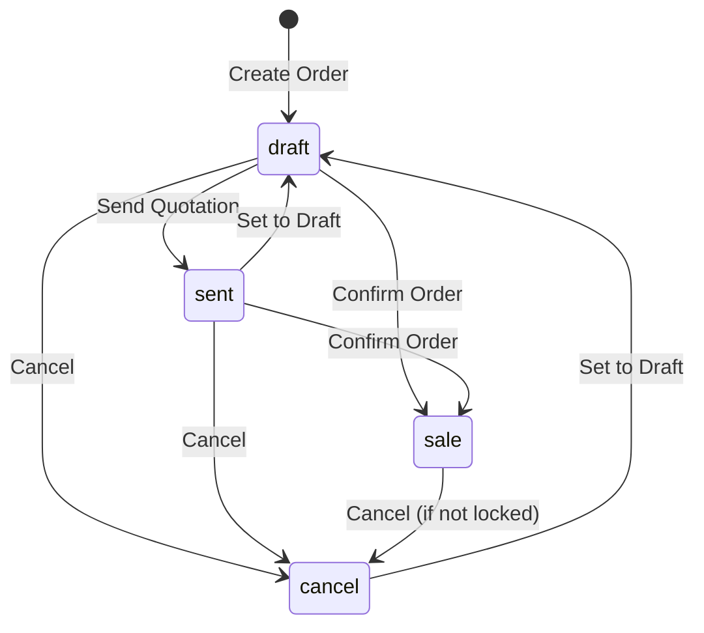
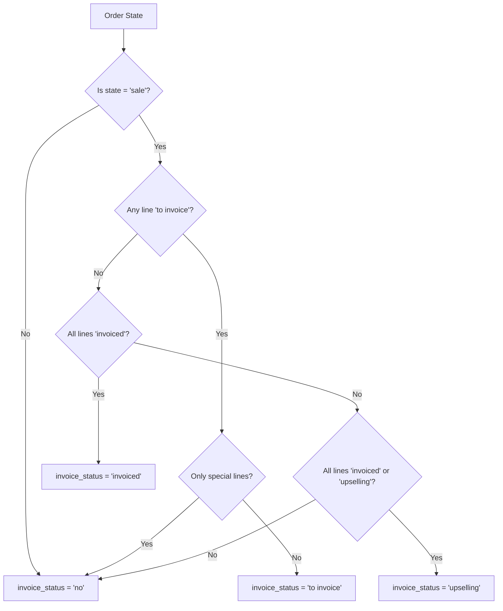
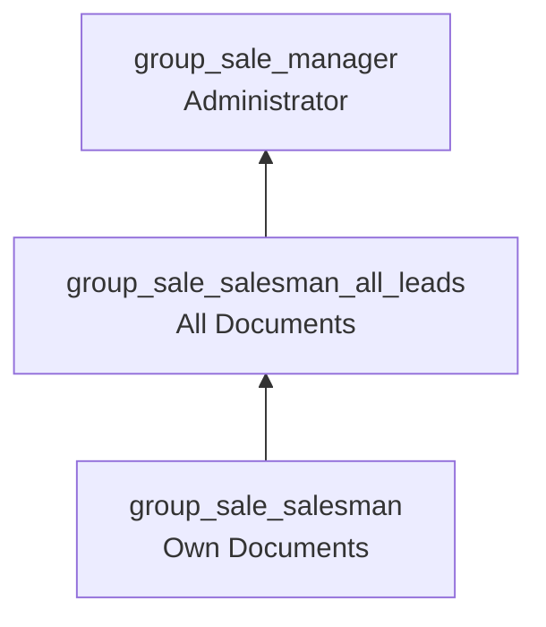

# Sales Quote to Order - Business Rules Documentation

> **Module:** `sale` (Sales Management)  
> **Primary Model:** `sale.order`  
> **Source File:** `addons/sale/models/sale_order.py`  
> **Related Flow:** [Sales Quote to Order User Flow](../02-user-flows/01-sales-quote-to-order/flow-document.md)

---

## Table of Contents

1. [Overview](#1-overview)
2. [State Machine and Transitions](#2-state-machine-and-transitions)
3. [Invoice Status Definitions](#3-invoice-status-definitions)
4. [SQL Constraints](#4-sql-constraints)
5. [Validation Constraints (@api.constrains)](#5-validation-constraints-apiconstrains)
6. [Computed Fields (@api.depends)](#6-computed-fields-apidepends)
7. [Action Methods](#7-action-methods)
8. [Confirmation Process](#8-confirmation-process)
9. [Locked Order Protection](#9-locked-order-protection)
10. [Security Groups and Access Control](#10-security-groups-and-access-control)
11. [Record Rules (Row-Level Security)](#11-record-rules-row-level-security)
12. [Integration Triggers](#12-integration-triggers)
13. [Business Rule Summary Table](#13-business-rule-summary-table)

---

## 1. Overview

The **Sales Quote to Order** workflow is the core revenue-generating process in Odoo's Sales module. This document describes the business rules that govern how sales quotations are created, validated, confirmed, and managed throughout their lifecycle.

### Business Context

A **Sales Order** (internally called `sale.order`) represents a commercial agreement between a company and a customer. The document progresses through distinct states:
- Starts as a **Quotation** (draft proposal)
- Can be sent to the customer for review
- Upon acceptance, becomes a confirmed **Sales Order**
- Can be cancelled at any point (with restrictions on locked orders)

### Key Business Rules Summary

| Rule Category | Description |
|---------------|-------------|
| State Control | Orders follow a defined state machine with controlled transitions |
| Company Consistency | Products on order lines must belong to the same company as the order |
| Prepayment Validation | Prepayment percentage must be between 0% and 100% when required |
| Amount Calculations | Untaxed amount, tax, and total are automatically computed from order lines |
| Locking Mechanism | Confirmed orders can be locked to prevent modifications |
| Access Control | Three-tier security model: Salesperson → All Documents → Administrator |

---

## 2. State Machine and Transitions

### 2.1 State Definitions

The sales order state is controlled by the `SALE_ORDER_STATE` selection field defined at:  
**Source:** `addons/sale/models/sale_order.py:26-31`

```
SALE_ORDER_STATE = [
    ('draft', "Quotation"),
    ('sent', "Quotation Sent"),
    ('sale', "Sales Order"),
    ('cancel', "Cancelled"),
]
```

| State Value | Display Name | Business Meaning |
|-------------|--------------|------------------|
| `draft` | Quotation | Initial state; document is a proposal that can be freely edited |
| `sent` | Quotation Sent | Quotation has been sent to customer for review; still editable |
| `sale` | Sales Order | Confirmed order; customer has accepted and order is active |
| `cancel` | Cancelled | Order has been cancelled; no further processing |

### 2.2 State Transition Diagram



### 2.3 State Transition Rules

| From State | To State | Action Method | Business Rule |
|------------|----------|---------------|---------------|
| `draft` | `sent` | `action_quotation_sent()` | Only draft orders can be marked as sent |
| `draft`, `sent` | `sale` | `action_confirm()` | Requires all order lines to have products; validates analytic distribution |
| `draft`, `sent`, `sale` | `cancel` | `action_cancel()` | Locked orders cannot be cancelled; cancels related draft invoices |
| `cancel`, `sent` | `draft` | `action_draft()` | Clears signature data when reverting to draft |

### 2.4 State Field Configuration

**Source:** `addons/sale/models/sale_order.py:70-75`

```
state = fields.Selection(
    selection=SALE_ORDER_STATE,
    string="Status",
    readonly=True,
    copy=False,
    index=True,
    tracking=3,
    default='draft'
)
```

**Field Properties:**
- **Readonly:** State can only be changed through action methods, not direct editing
- **Not Copied:** Duplicating an order always creates a new draft
- **Indexed:** Optimized for filtering and searching by state
- **Tracked:** State changes are logged in the chatter (tracking priority 3)

---

## 3. Invoice Status Definitions

### 3.1 Invoice Status Selection

The invoice status indicates the invoicing progress for a confirmed sales order.

**Source:** `addons/sale/models/sale_order.py:19-24`

```
INVOICE_STATUS = [
    ('upselling', 'Upselling Opportunity'),
    ('invoiced', 'Fully Invoiced'),
    ('to invoice', 'To Invoice'),
    ('no', 'Nothing to Invoice')
]
```

| Status Value | Display Name | Business Meaning |
|--------------|--------------|------------------|
| `upselling` | Upselling Opportunity | All lines invoiced but there's potential for additional sales |
| `invoiced` | Fully Invoiced | All invoiceable quantities have been invoiced |
| `to invoice` | To Invoice | There are quantities ready to be invoiced |
| `no` | Nothing to Invoice | No invoiceable quantities; applies to drafts, cancelled orders, or fully delivered service orders |

### 3.2 Invoice Status Computation Rules

**Source:** `addons/sale/models/sale_order.py:615-661`

The invoice status is computed based on the following logic:

1. **Non-confirmed orders:** Status is always `'no'` (nothing to invoice)
2. **To Invoice:** If any order line has status `'to invoice'`, the order is `'to invoice'`
   - Exception: If only discount/delivery/promotion lines can be invoiced, status remains `'no'`
3. **Fully Invoiced:** If all order lines have status `'invoiced'`
4. **Upselling:** If all order lines are either `'invoiced'` or `'upselling'`
5. **Default:** Otherwise, status is `'no'`



---

## 4. SQL Constraints

### 4.1 Confirmation Date Requirement

**Constraint Name:** `_date_order_conditional_required`  
**Source:** `addons/sale/models/sale_order.py:41-44`

```python
_date_order_conditional_required = models.Constraint(
    "CHECK((state = 'sale' AND date_order IS NOT NULL) OR state != 'sale')",
    'A confirmed sales order requires a confirmation date.',
)
```

**Business Rule:**
- A **confirmed Sales Order** (state = `'sale'`) **must** have a `date_order` value
- This constraint ensures that all confirmed orders have a traceable confirmation timestamp
- The `date_order` field is automatically set during confirmation via `_prepare_confirmation_values()`

**Error Message:**  
`"A confirmed sales order requires a confirmation date."`

**What the User Sees:**
If a user attempts to confirm an order without a date (which shouldn't happen through normal UI flow), they will see a database constraint error.

---

## 5. Validation Constraints (@api.constrains)

### 5.1 Company Consistency Check

**Method:** `_check_order_line_company_id()`  
**Source:** `addons/sale/models/sale_order.py:839-854`

```python
@api.constrains('company_id', 'order_line')
def _check_order_line_company_id(self):
    for order in self:
        invalid_companies = order.order_line.product_id.company_id.filtered(
            lambda c: order.company_id not in c._accessible_branches()
        )
        if invalid_companies:
            bad_products = order.order_line.product_id.filtered(
                lambda p: p.company_id and p.company_id in invalid_companies
            )
            raise ValidationError(_(
                "Your quotation contains products from company %(product_company)s "
                "whereas your quotation belongs to company %(quote_company)s. \n "
                "Please change the company of your quotation or remove the products "
                "from other companies (%(bad_products)s).",
                product_company=', '.join(invalid_companies.sudo().mapped('display_name')),
                quote_company=order.company_id.display_name,
                bad_products=', '.join(bad_products.mapped('display_name')),
            ))
```

**Business Rule:**
- Products added to a sales order must belong to the **same company** as the order (or be global products)
- This ensures multi-company data isolation
- The check considers the company branch hierarchy via `_accessible_branches()`

**Triggered When:**
- Changing the order's `company_id`
- Adding or modifying order lines

**Error Message Format:**
```
"Your quotation contains products from company [Product Company] whereas your quotation 
belongs to company [Order Company]. Please change the company of your quotation or remove 
the products from other companies ([Product Names])."
```

**What the User Sees:**
When attempting to save an order with products from a different company, a validation error popup appears with the specific company and product names.

---

### 5.2 Prepayment Percentage Validation

**Method:** `_check_prepayment_percent()`  
**Source:** `addons/sale/models/sale_order.py:856-860`

```python
@api.constrains('prepayment_percent')
def _check_prepayment_percent(self):
    for order in self:
        if order.require_payment and not (0 < order.prepayment_percent <= 1.0):
            raise ValidationError(_("Prepayment percentage must be a valid percentage."))
```

**Business Rule:**
- When online payment is required (`require_payment = True`), the prepayment percentage must be:
  - Greater than 0% (payment is required)
  - Less than or equal to 100% (stored as 1.0 internally)

**Triggered When:**
- Changing the `prepayment_percent` field value

**Error Message:**
`"Prepayment percentage must be a valid percentage."`

**What the User Sees:**
If a user sets an invalid prepayment percentage (like 0% or 150%) when online payment is enabled, a validation error prevents saving.

---

## 6. Computed Fields (@api.depends)

### 6.1 Amount Calculations

**Method:** `_compute_amounts()`  
**Source:** `addons/sale/models/sale_order.py:511-527`

**Dependencies:**
```python
@api.depends('order_line.price_subtotal', 'currency_id', 'company_id', 'payment_term_id')
```

**Computed Fields:**

| Field | Type | Description |
|-------|------|-------------|
| `amount_untaxed` | Monetary | Total of all order line subtotals (before tax) |
| `amount_tax` | Monetary | Total tax amount calculated from all lines |
| `amount_total` | Monetary | Grand total (amount_untaxed + amount_tax) |

**Calculation Logic:**
1. Get all priced order lines (excluding display-type lines like sections/notes)
2. Prepare base lines for tax computation
3. Add early payment discount lines if payment term has EPD
4. Use `account.tax` model to compute tax details
5. Round and aggregate totals

**Business Impact:**
- These fields update automatically whenever:
  - Order lines are added, modified, or removed
  - Product prices change
  - Tax configurations change
  - Currency or company changes
  - Payment term with early payment discount is applied

---

### 6.2 Invoice Status Computation

**Method:** `_compute_invoice_status()`  
**Source:** `addons/sale/models/sale_order.py:615-661`

**Dependencies:**
```python
@api.depends('state', 'order_line.invoice_status')
```

**See Section 3.2** for detailed computation logic.

---

### 6.3 Invoice IDs Computation

**Method:** `_get_invoiced()`  
**Source:** `addons/sale/models/sale_order.py:566-575`

**Dependencies:**
```python
@api.depends('order_line.invoice_lines')
```

**Computed Fields:**

| Field | Type | Description |
|-------|------|-------------|
| `invoice_ids` | Many2many | Related customer invoices and refunds |
| `invoice_count` | Integer | Count of related invoices |

**Logic:**
- Collects all invoices linked through order line invoice lines
- Filters for `out_invoice` and `out_refund` move types only

---

### 6.4 Expected Date Computation

**Method:** `_compute_expected_date()`  
**Source:** `addons/sale/models/sale_order.py:728-744`

**Dependencies:**
```python
@api.depends('order_line.customer_lead', 'date_order', 'state')
```

**Business Rule:**
- Calculates the expected delivery date based on product lead times
- Only considers consumable products (not services or combos)
- Returns the **minimum** expected date across all applicable lines
- Returns `False` for cancelled orders

**Note:** This field is not stored (`store=False`) because it depends on the current date.

---

### 6.5 Tax Totals Computation

**Method:** `_compute_tax_totals()`  
**Source:** `addons/sale/models/sale_order.py:790-804`

**Dependencies:**
```python
@api.depends_context('lang')
@api.depends('order_line.price_subtotal', 'currency_id', 'company_id', 'payment_term_id')
```

**Purpose:**
- Generates detailed tax breakdown for display in the UI
- Returns a Binary field containing the full tax totals summary
- Language-dependent for proper formatting

---

### 6.6 Currency Rate Computation

**Method:** `_compute_currency_rate()`  
**Source:** `addons/sale/models/sale_order.py:457-465`

**Dependencies:**
```python
@api.depends('currency_id', 'date_order', 'company_id')
```

**Business Rule:**
- Computes the exchange rate between company currency and order currency
- Uses the `date_order` for rate lookup (falls back to current date if not set)
- Essential for multi-currency reporting and conversions

---

## 7. Action Methods

### 7.1 Set to Draft

**Method:** `action_draft()`  
**Source:** `addons/sale/models/sale_order.py:1047-1054`

```python
def action_draft(self):
    orders = self.filtered(lambda s: s.state in ['cancel', 'sent'])
    return orders.write({
        'state': 'draft',
        'signature': False,
        'signed_by': False,
        'signed_on': False,
    })
```

**Business Rules:**
- Only orders in `cancel` or `sent` state can be set to draft
- Clears any existing signature data (signature image, signer name, signature timestamp)
- Does not reset other order data

**Use Case:**
Re-opening a cancelled order or reverting a sent quotation for major edits.

---

### 7.2 Send Quotation

**Method:** `action_quotation_send()`  
**Source:** `addons/sale/models/sale_order.py:1056-1110`

**Business Rules:**
- Opens email composition wizard with appropriate template
- Validates analytic distribution on order lines before sending
- Selects template based on order state:
  - Pro-forma template if context flag is set
  - Quotation template for non-confirmed orders
  - Confirmation template for confirmed orders
- Supports mass mailing for multiple orders

---

### 7.3 Mark as Sent

**Method:** `action_quotation_sent()`  
**Source:** `addons/sale/models/sale_order.py:1145-1153`

```python
def action_quotation_sent(self):
    if any(order.state != 'draft' for order in self):
        raise UserError(_("Only draft orders can be marked as sent directly."))
    self.write({'state': 'sent'})
```

**Business Rules:**
- Only **draft** orders can be marked as sent
- Used to manually mark quotation as sent (without email)
- Raises `UserError` if any order is not in draft state

---

### 7.4 Confirm Order

**Method:** `action_confirm()`  
**Source:** `addons/sale/models/sale_order.py:1155-1185`

**Business Rules:**
1. Validates all orders can be confirmed (via `_confirmation_error_message()`)
2. Validates analytic distribution on order lines
3. Sets confirmation values (state and date)
4. Calls `_action_confirm()` for additional processing (extended by other modules)
5. Locks order if auto-lock setting is enabled
6. Sends confirmation email if context flag is set

**Validation Checks:**
- Order must be in `draft` or `sent` state
- All order lines must have a product (except display-type and downpayment lines)

---

### 7.5 Cancel Order

**Method:** `action_cancel()`  
**Source:** `addons/sale/models/sale_order.py:1313-1322`

```python
def action_cancel(self):
    if any(order.locked for order in self):
        raise UserError(_("You cannot cancel a locked order. Please unlock it first."))
    return self._action_cancel()

def _action_cancel(self):
    inv = self.invoice_ids.filtered(lambda inv: inv.state == 'draft')
    inv.button_cancel()
    return self.write({'state': 'cancel'})
```

**Business Rules:**
- **Locked orders cannot be cancelled** - must unlock first
- Automatically cancels related **draft invoices** only
- Posted invoices are not affected (must be handled separately)

---

### 7.6 Lock Order

**Method:** `action_lock()`  
**Source:** `addons/sale/models/sale_order.py:1307-1308`

```python
def action_lock(self):
    self.locked = True
```

**Business Rule:**
- Sets the `locked` flag to `True`
- Locked orders cannot be cancelled without unlocking
- Can be triggered automatically after confirmation if `group_auto_done_setting` is enabled

---

### 7.7 Unlock Order

**Method:** `action_unlock()`  
**Source:** `addons/sale/models/sale_order.py:1310-1311`

```python
def action_unlock(self):
    self.locked = False
```

**Business Rule:**
- Sets the `locked` flag to `False`
- Allows further modifications and cancellation

---

## 8. Confirmation Process

### 8.1 Pre-Confirmation Validation

**Method:** `_confirmation_error_message()`  
**Source:** `addons/sale/models/sale_order.py:1192-1205`

**Validation Rules:**
1. Order must be in `draft` or `sent` state
2. All non-display, non-downpayment lines must have a product assigned

**Error Messages:**
- `"Some orders are not in a state requiring confirmation."`
- `"Some order lines are missing a product, you need to correct them before going further."`

---

### 8.2 Confirmation Values

**Method:** `_prepare_confirmation_values()`  
**Source:** `addons/sale/models/sale_order.py:1207-1218`

```python
def _prepare_confirmation_values(self):
    return {
        'state': 'sale',
        'date_order': fields.Datetime.now()
    }
```

**Business Rule:**
- Sets state to `'sale'`
- Sets `date_order` to current datetime (confirmation timestamp)

---

### 8.3 Post-Confirmation Processing

**Method:** `_action_confirm()`  
**Source:** `addons/sale/models/sale_order.py:1220-1224`

**Purpose:**
- Hook method for other modules to extend
- Base implementation is empty
- Extended by modules like `sale_stock` to create deliveries

---

### 8.4 Auto-Lock Decision

**Method:** `_should_be_locked()`  
**Source:** `addons/sale/models/sale_order.py:1187-1190`

```python
def _should_be_locked(self):
    self.ensure_one()
    return self.env['res.groups']._is_feature_enabled('sale.group_auto_done_setting')
```

**Business Rule:**
- Orders are automatically locked after confirmation if the "Lock Confirmed Sales" setting is enabled
- This setting is controlled by the `sale.group_auto_done_setting` group

---

## 9. Locked Order Protection

### 9.1 Locked Field

**Source:** `addons/sale/models/sale_order.py:76-80`

```python
locked = fields.Boolean(
    help="Locked orders cannot be modified.",
    default=False,
    copy=False,
    tracking=True
)
```

**Field Properties:**
- Default: `False` (orders are unlocked by default)
- Not copied when duplicating orders
- Changes are tracked in the chatter

### 9.2 Protection Rules

| Operation | Behavior with Locked Order |
|-----------|---------------------------|
| Cancel | Blocked - raises UserError |
| Modify Fields | Allowed (field-level restrictions may apply) |
| Unlock | Allowed (via `action_unlock()`) |
| Delete | Blocked (see deletion rules below) |

### 9.3 Deletion Rules

**Method:** `_unlink_except_draft_or_cancel()`  
**Source:** `addons/sale/models/sale_order.py:1021-1027`

```python
@api.ondelete(at_uninstall=False)
def _unlink_except_draft_or_cancel(self):
    for order in self:
        if order.state not in ('draft', 'cancel'):
            raise UserError(_(
                "You can not delete a sent quotation or a confirmed sales order."
                " You must first cancel it."))
```

**Business Rule:**
- Only `draft` and `cancel` orders can be deleted
- Sent quotations and confirmed orders must be cancelled first

---

## 10. Security Groups and Access Control

### 10.1 Sales Team Security Groups

**Source:** `addons/sales_team/security/sales_team_security.xml`

These groups form a progressive role hierarchy:

| Group XML ID | Display Name | Implied Groups | Access Level |
|--------------|--------------|----------------|--------------|
| `sales_team.group_sale_salesman` | User: Own Documents Only | `base.group_user` | Can access own sales documents |
| `sales_team.group_sale_salesman_all_leads` | User: All Documents | `group_sale_salesman` | Can access all sales documents |
| `sales_team.group_sale_manager` | Administrator | `group_sale_salesman_all_leads`, `mail.group_mail_canned_response_admin` | Full access + configuration |



### 10.2 Sale Module Feature Groups

**Source:** `addons/sale/security/res_groups.xml`

| Group XML ID | Display Name | Purpose |
|--------------|--------------|---------|
| `sale.group_auto_done_setting` | Lock Confirmed Sales | Enables auto-locking of confirmed orders |
| `sale.group_discount_per_so_line` | Discount on lines | Enables line-level discount functionality |
| `sale.group_warning_sale` | Warning can be set on product/customer | Enables sale warning messages |
| `sale.group_proforma_sales` | Pro-forma Invoices | Enables pro-forma invoice features |

### 10.3 Model Access Control (ACLs)

**Source:** `addons/sale/security/ir.model.access.csv`

#### Sales Order Model (`sale.order`)

| Group | Read | Write | Create | Unlink |
|-------|------|-------|--------|--------|
| `sales_team.group_sale_salesman` | ✓ | ✓ | ✓ | ✗ |
| `sales_team.group_sale_manager` | ✓ | ✓ | ✓ | ✓ |
| `base.group_portal` | ✓ | ✗ | ✗ | ✗ |
| `account.group_account_readonly` | ✓ | ✗ | ✗ | ✗ |
| `account.group_account_invoice` | ✓ | ✓ | ✗ | ✗ |
| `account.group_account_user` | ✓ | ✓ | ✗ | ✗ |

#### Sales Order Line Model (`sale.order.line`)

| Group | Read | Write | Create | Unlink |
|-------|------|-------|--------|--------|
| `sales_team.group_sale_salesman` | ✓ | ✓ | ✓ | ✓ |
| `base.group_portal` | ✓ | ✗ | ✗ | ✗ |

---

## 11. Record Rules (Row-Level Security)

### 11.1 Multi-Company Isolation

**Source:** `addons/sale/security/ir_rules.xml:5-21`

| Rule Name | Model | Domain |
|-----------|-------|--------|
| Sales Order multi-company | `sale.order` | `[('company_id', 'in', company_ids)]` |
| Sales Order Line multi-company | `sale.order.line` | `[('company_id', 'in', company_ids)]` |
| Sales Order Analysis multi-company | `sale.report` | `[('company_id', 'in', company_ids)]` |

**Business Rule:**
Users can only access orders belonging to their allowed companies.

### 11.2 Salesperson Document Visibility

**Source:** `addons/sale/security/ir_rules.xml:42-83`

#### Own Documents Only (`group_sale_salesman`)

| Model | Domain |
|-------|--------|
| `sale.order` | `['|',('user_id','=',user.id),('user_id','=',False)]` |
| `sale.order.line` | `['|',('salesman_id','=',user.id),('salesman_id','=',False)]` |
| `sale.report` | `['|',('user_id','=',user.id),('user_id','=',False)]` |

#### All Documents (`group_sale_salesman_all_leads`)

| Model | Domain |
|-------|--------|
| `sale.order` | `[(1,'=',1)]` (all records) |
| `sale.order.line` | `[(1,'=',1)]` (all records) |
| `sale.report` | `[(1,'=',1)]` (all records) |

### 11.3 Portal Access

**Source:** `addons/sale/security/ir_rules.xml:24-40`

| Model | Domain | Permissions |
|-------|--------|-------------|
| `sale.order` | `[('partner_id','child_of',[user.commercial_partner_id.id])]` | Read, Write, Unlink (no Create) |
| `sale.order.line` | `[('order_id.partner_id','child_of',[user.commercial_partner_id.id])]` | All |

**Business Rule:**
Portal users can only access orders where they (or a child contact) are the customer.

---

## 12. Integration Triggers

### 12.1 Inventory Integration

When a sales order is confirmed (`action_confirm()`) and the `sale_stock` module is installed:
- Delivery orders (`stock.picking`) are automatically created
- Stock is reserved based on availability

### 12.2 Invoicing Integration

- Invoice creation is triggered manually or through delivery validation
- Draft invoices are automatically cancelled when order is cancelled
- Invoice status computation links to invoice lines on order lines

### 12.3 Payment Integration

- Online payment transactions are linked via `transaction_ids`
- `amount_paid` computes sum of authorized/done transactions
- Prepayment settings control required payment percentage

---

## 13. Business Rule Summary Table

| Rule ID | Category | Description | Source |
|---------|----------|-------------|--------|
| BR-SO-001 | State | Orders start in 'draft' state | `sale_order.py:75` |
| BR-SO-002 | State | Confirmed orders require date_order | SQL constraint |
| BR-SO-003 | Validation | Products must match order company | `_check_order_line_company_id()` |
| BR-SO-004 | Validation | Prepayment must be 0-100% | `_check_prepayment_percent()` |
| BR-SO-005 | Transition | Only draft→sent, draft/sent→sale | `action_quotation_sent()`, `action_confirm()` |
| BR-SO-006 | Transition | Locked orders cannot be cancelled | `action_cancel()` |
| BR-SO-007 | Deletion | Only draft/cancel orders deletable | `_unlink_except_draft_or_cancel()` |
| BR-SO-008 | Security | Salespeople see only own documents | Record rule |
| BR-SO-009 | Security | Managers have full access | ACL rules |
| BR-SO-010 | Computation | Amounts computed from order lines | `_compute_amounts()` |
| BR-SO-011 | Computation | Invoice status from line statuses | `_compute_invoice_status()` |
| BR-SO-012 | Auto-Lock | Orders locked if setting enabled | `_should_be_locked()` |

---

## Related Documentation

- [Sales Quote to Order User Flow](../02-user-flows/01-sales-quote-to-order/flow-document.md)
- [Capabilities Inventory - Sales Module](../01-capabilities-overview/capabilities-inventory.md#sales-module)
- [Invoice Creation and Payment Rules](./invoice-payment-rules.md)

---

**Document Version:** 1.0  
**Last Updated:** Generated from Odoo 19.0 source code  
**Source References:**
- `addons/sale/models/sale_order.py`
- `addons/sale/security/res_groups.xml`
- `addons/sale/security/ir_rules.xml`
- `addons/sale/security/ir.model.access.csv`
- `addons/sales_team/security/sales_team_security.xml`
